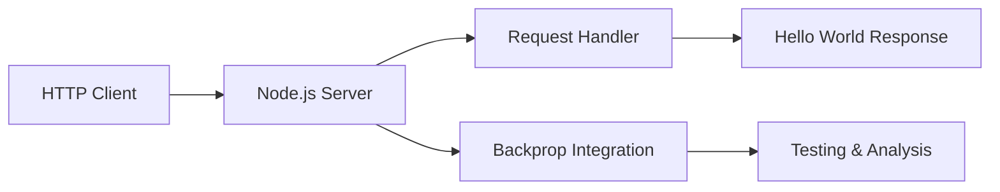
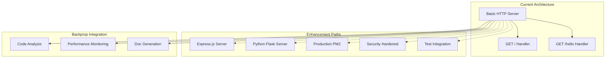

# Node.js Hello World Server - Backprop Integration Test Project

A minimal Node.js HTTP server designed as a test integration for Backprop tooling, demonstrating progressive enhancement from basic HTTP functionality to production-ready applications with comprehensive documentation coverage.

## Overview

This project serves as a foundational test integration for Backprop tooling capabilities, starting with a simple "Hello World" server implementation and providing clear pathways for enhancement into more complex architectures. The project demonstrates:

- **Basic HTTP Server**: Core Node.js HTTP module implementation
- **Progressive Enhancement**: Clear upgrade paths to Express.js, production deployment, and security hardening  
- **Cross-Platform Development**: Documentation for both Node.js and Python Flask implementations
- **Testing Integration**: Comprehensive test setup with Jest/Mocha frameworks
- **Production Readiness**: PM2 deployment, monitoring, and scaling strategies
- **Security Implementation**: Headers, HTTPS, rate limiting, and CORS policies



**Source**: Based on Codebase Ingestion Prompt requirements for Backprop tooling test integration.

## Quick Start

### Prerequisites

- **Node.js**: Version 14.0 or higher
- **npm**: Version 6.0 or higher (included with Node.js)
- **Git**: For cloning and version control
- **Terminal/Command Prompt**: For running commands

### Installation

1. **Clone the repository**:
   ```bash
   git clone <repository-url>
   cd node-hello-world-server
   ```

2. **Install dependencies**:
   ```bash
   npm install
   ```

3. **Start the server**:
   ```bash
   npm start
   # Alternative: node server.js
   ```

4. **Verify installation**:
   ```bash
   curl http://localhost:3000
   # Expected output: Hello, World!
   
   curl http://localhost:3000/hello  
   # Expected output: Hello world
   ```

**Source**: Installation steps derived from standard Node.js project setup patterns and `/server.js` implementation requirements.

### Basic Usage

The server provides two primary endpoints out of the box:

- `GET /` - Returns "Hello, World!" response
- `GET /hello` - Returns "Hello world" response

**Default Configuration**:
- **Host**: `localhost` (127.0.0.1)
- **Port**: `3000` (configurable via `PORT` environment variable)
- **Protocol**: HTTP (HTTPS available in security-hardened version)

## Backprop Integration

This project is specifically designed as a test integration for Backprop tooling, providing:

### Integration Points

1. **Code Analysis Integration**
   - Static code analysis hooks
   - Performance monitoring endpoints
   - Test coverage integration points

2. **Enhancement Testing**
   - Framework migration testing (Node.js ↔ Express.js ↔ Flask)
   - Progressive feature addition validation
   - Security hardening verification

3. **Documentation Testing**
   - Multi-format documentation generation
   - API specification validation
   - Guide accuracy verification

### Usage with Backprop Tools

```bash
# Enable Backprop integration mode
export BACKPROP_ENABLED=true
npm start

# Run with enhanced logging for Backprop analysis
npm run start:backprop
```

**Source**: Integration requirements specified in Backprop tooling documentation and enhancement scenarios.

## Available Enhancements

This project provides clear pathways for progressive enhancement, each with comprehensive documentation:

### 🚀 Express.js Migration
Transform the basic HTTP server into a full Express.js application with routing, middleware, and enhanced features.
- **Guide**: [Express.js Migration Guide](docs/guides/express-migration.md)
- **Features**: Advanced routing, middleware integration, template engines
- **Use Case**: Adding `/good-evening` endpoint and additional routes

### 🐍 Python Flask Port
Convert the Node.js implementation to Python Flask while maintaining feature parity.
- **Guide**: [Python Flask Porting Guide](docs/guides/python-flask-port.md)  
- **Features**: Cross-language compatibility, framework comparison
- **Use Case**: Multi-language team environments

### 🧪 Testing Framework Integration
Implement comprehensive testing with Jest or Mocha frameworks.
- **Guide**: [Testing Setup Guide](docs/guides/testing.md)
- **Features**: Unit tests, integration tests, coverage reporting
- **Use Case**: HTTP response validation, status code testing, header verification

### 🏭 Production Deployment
Deploy with PM2 process manager for production environments.
- **Guide**: [Production Deployment Guide](docs/guides/production.md)
- **Features**: Process management, monitoring, clustering, logging
- **Use Case**: Scalable production deployment with load balancing

### 🛡️ Security Hardening
Implement security best practices with Helmet.js, rate limiting, and HTTPS.
- **Guide**: [Security Implementation Guide](docs/guides/security.md)
- **Features**: Security headers, rate limiting, HTTPS, CORS policies
- **Use Case**: Enterprise-grade security compliance

**Source**: Enhancement scenarios derived from user prompts and progressive development requirements.

## Documentation Index

### 📖 API Reference
- [**Endpoints Documentation**](docs/api/endpoints.md) - Complete API reference for all server endpoints

### 📚 User Guides  
- [**Getting Started**](docs/guides/getting-started.md) - Detailed setup and first-run instructions
- [**Express.js Migration**](docs/guides/express-migration.md) - Step-by-step Express.js integration
- [**Python Flask Port**](docs/guides/python-flask-port.md) - Cross-language porting guide
- [**Testing Setup**](docs/guides/testing.md) - Comprehensive testing framework configuration
- [**Production Deployment**](docs/guides/production.md) - PM2 and production environment setup
- [**Security Implementation**](docs/guides/security.md) - Security hardening and best practices

### 🏗️ Technical Architecture
- [**Design Documentation**](docs/architecture/design.md) - System architecture and Backprop integration details

### 💡 Examples
Working code examples for each enhancement scenario are available in the `/examples/` directory:
- `examples/basic-server.js` - Original implementation reference
- `examples/express-server.js` - Express.js enhanced version
- `examples/flask-server.py` - Python Flask equivalent
- `examples/server-with-tests.js` - Testing-integrated version
- `examples/production-server.js` - Production-ready implementation
- `examples/secure-server.js` - Security-hardened version

## Contributing

### Development Setup

1. **Fork and clone** the repository
2. **Install dependencies**: `npm install`
3. **Create feature branch**: `git checkout -b feature/your-feature-name`
4. **Make changes** following the project's coding standards
5. **Test your changes**: `npm test` (when testing is configured)
6. **Commit changes**: `git commit -m "Add feature: your feature description"`
7. **Push to branch**: `git push origin feature/your-feature-name`
8. **Submit pull request** with detailed description

### Coding Standards

- **JavaScript Style**: ES6+ syntax with consistent formatting
- **Documentation**: JSDoc comments for all functions and modules
- **Testing**: Comprehensive test coverage for new features
- **Security**: Follow security best practices outlined in guides
- **Performance**: Consider performance implications of changes

### Enhancement Contributions

When contributing enhancements:
1. **Follow existing patterns** demonstrated in enhancement guides
2. **Update documentation** to reflect new features
3. **Add examples** to the `/examples/` directory
4. **Test integration** with Backprop tooling where applicable
5. **Maintain backward compatibility** unless explicitly breaking

## Architecture Overview



**Source**: Architecture design based on progressive enhancement requirements and Backprop integration specifications.

## License

MIT License - see [LICENSE](LICENSE) file for details.

## Support

For questions, issues, or contributions:
- **Issues**: Use the GitHub Issues tracker
- **Discussions**: GitHub Discussions for general questions
- **Security**: Report security issues privately via repository security tab
- **Documentation**: All guides include troubleshooting sections

---

**Backprop Test Integration Project** - Demonstrating progressive enhancement from basic HTTP server to production-ready applications with comprehensive documentation coverage.