# Technical Specification

# 0. SUMMARY OF CHANGES

## 0.1 USER INTENT RESTATEMENT

### 0.1.1 Core Objective

Based on the provided requirements, the Blitzy platform understands that the objective is to **create a comprehensive Node.js tutorial project that demonstrates progressive enhancement from a minimal HTTP server to a production-ready, security-hardened application with multi-language support and comprehensive testing**. The project serves as both a Backprop integration test harness and an educational reference implementation showcasing best practices in modern web development.

The requirements encompass eight distinct evolution scenarios:
1. **Initial Creation**: Establish a basic Node.js HTTP server with a simple `/hello` endpoint returning "Hello world"
2. **Framework Migration**: Enhance with Express.js framework and add a `/good-evening` endpoint
3. **Cross-Language Port**: Provide Python Flask equivalent maintaining feature parity
4. **Testing Infrastructure**: Implement comprehensive unit and integration tests using Jest/Mocha
5. **Production Enhancement**: Add enterprise features including PM2, middleware, logging, and deployment configs
6. **Bug Remediation**: Address missing error handling, graceful shutdown, and resource management
7. **Security Hardening**: Implement OWASP Top 10 protections, rate limiting, and HTTPS support
8. **Documentation**: Create comprehensive JSDoc comments, README, and API documentation

### 0.1.2 Special Instructions and Constraints

**CRITICAL DIRECTIVES CAPTURED**:
- **Tutorial Nature**: This is explicitly a "nodejs tutorial project" - educational clarity is paramount
- **Feature Preservation**: "keeping every feature and functionality exactly as in the original" during Python port
- **Comprehensive Testing**: Tests must cover "HTTP responses, status codes, headers, server startup/shutdown, error handling, and edge cases"
- **Production Readiness**: Must be "prepared for production deployment with PM2"
- **Security Focus**: Implement "helmet.js for security middleware" and "proper CORS policies"
- **Documentation Completeness**: Include "setup instructions, API documentation, deployment guide, and inline code explanations"

**User Examples Preserved**:
- User Example: `/hello` endpoint returning "Hello world" to HTTP client
- User Example: `/good-evening` endpoint returning "Good evening" response
- User Example: Express.js integration with routing and middleware
- User Example: Python Flask application maintaining exact Node.js behavior

### 0.1.3 Technical Interpretation

These requirements translate to the following technical implementation strategy:

1. **Progressive Enhancement Architecture**: Build a modular system where each feature layer can be added incrementally, starting from a basic HTTP server and evolving to a production-ready application
2. **Multi-Implementation Strategy**: Maintain parallel implementations (basic Node.js, Express.js, Python Flask) to demonstrate cross-platform capabilities
3. **Security-First Development**: Every enhancement must incorporate security best practices, addressing known CVEs (CVE-2024-45590, CVE-2024-43796)
4. **Test-Driven Approach**: Each feature addition must include corresponding test coverage to ensure reliability
5. **Documentation-as-Code**: All implementations must be self-documenting with clear examples and guides

## 0.2 TECHNICAL SCOPE

### 0.2.1 Primary Objectives with Implementation Approach

**Objective 1: Basic HTTP Server Implementation**
- Achieve simple HTTP server functionality by creating `server.js` using Node.js built-in `http` module
- Implement `/hello` endpoint to return "Hello world" plain text response
- Critical success factor: Minimal dependencies, clear educational code structure

**Objective 2: Express.js Framework Integration**
- Achieve framework-based routing by migrating from `http` module to Express.js
- Extend routing system to support `/good-evening` endpoint alongside existing `/hello`
- Add middleware pipeline to enable body parsing, CORS, and security headers
- Critical success factor: Clean separation between basic and enhanced implementations

**Objective 3: Python Flask Migration**
- Achieve cross-language parity by implementing `app.py` with Flask framework
- Replicate all Node.js endpoints (`/hello`, `/good-evening`) with identical responses
- Configure Gunicorn WSGI server to match Node.js production deployment model
- Critical success factor: Behavioral equivalence verified through parallel testing

**Objective 4: Comprehensive Testing Suite**
- Achieve full test coverage by implementing Jest unit tests and Supertest integration tests
- Create test modules for server lifecycle, endpoint responses, error handling, and security
- Implement performance benchmarks to verify sub-100ms response times
- Critical success factor: >80% code coverage with CI/CD integration

**Objective 5: Production Hardening**
- Achieve enterprise readiness by integrating PM2 process management with clustering
- Implement comprehensive security middleware stack (Helmet.js, rate limiting, CORS)
- Add structured logging with Winston and monitoring via health check endpoints
- Critical success factor: Zero-downtime deployment capability with auto-scaling

**Objective 6: Security Vulnerability Mitigation**
- Achieve OWASP Top 10 compliance by implementing all recommended security controls
- Address specific CVEs through targeted middleware configuration
- Implement HTTPS with automated certificate management via Let's Encrypt
- Critical success factor: Pass all security audit checks with zero high/critical vulnerabilities

### 0.2.2 Component Impact Analysis

**Direct Modifications Required:**

- **server.js**: Modify to support dual-mode operation (basic HTTP and Express.js)
  - Add conditional loading based on `USE_EXPRESS` environment variable
  - Implement `/hello` and `/good-evening` endpoints in both modes
  - Integrate full security middleware stack when Express is enabled

- **package.json**: Extend to include all required dependencies
  - Production dependencies: express, helmet, cors, express-rate-limit, express-validator, body-parser, dotenv, winston, pm2
  - Development dependencies: jest, mocha, chai, supertest, sinon, nyc, eslint, nodemon
  - Scripts for all operational modes: start, dev, test, prod, security:check

- **.env.example**: Create comprehensive environment template
  - Server configuration: PORT, HOST, NODE_ENV, USE_EXPRESS
  - Security settings: RATE_LIMIT_MAX, CORS_ORIGINS, JWT_SECRET
  - SSL/TLS paths: SSL_CERT_PATH, SSL_KEY_PATH
  - Monitoring: LOG_LEVEL, HEALTH_CHECK_ENABLED

**Indirect Impacts and Dependencies:**

- **ecosystem.config.js**: Create PM2 configuration for production deployment
  - Cluster mode with auto-scaling based on CPU cores
  - Health check integration and graceful reload support
  - Log rotation and monitoring configuration

- **test/** directory: Establish comprehensive test structure
  - Unit tests: server.test.js, endpoints.test.js, middleware.test.js
  - Integration tests: integration.test.js, security.test.js
  - Performance tests: load.test.js, stress.test.js

**New Components Introduction:**

- **app.py**: Python Flask implementation maintaining feature parity
  - Flask application with identical endpoint structure
  - Equivalent security middleware using Flask-Security
  - Gunicorn configuration for production deployment

- **docs/** directory: Comprehensive documentation structure
  - API reference: endpoints.md with request/response examples
  - Guides: getting-started.md, express-migration.md, security.md, testing.md
  - Architecture: design.md with system diagrams

### 0.2.3 File and Path Mapping

| Target File/Module | Source Reference | Context Dependencies | Modification Type |
|---|---|---|---|
| `server.js` | Original basic implementation | `http` module, Express.js | Enhance with dual-mode support |
| `package.json` | Existing manifest | npm registry packages | Add dependencies and scripts |
| `.env.example` | New template | Environment variables | Create comprehensive template |
| `ecosystem.config.js` | New PM2 config | PM2 process manager | Create production configuration |
| `app.py` | New Flask implementation | Python Flask framework | Create parallel implementation |
| `wsgi.py` | New WSGI entry | Gunicorn server | Create production entry point |
| `test/server.test.js` | New test suite | Jest framework | Create comprehensive tests |
| `test/integration.test.js` | New integration tests | Supertest library | Create API tests |
| `docs/api/endpoints.md` | Existing documentation | Markdown format | Update with new endpoints |
| `docs/guides/express-migration.md` | Existing guide | Tutorial format | Enhance migration steps |
| `docs/guides/security.md` | Existing guide | Security best practices | Add vulnerability fixes |
| `Dockerfile` | New container config | Docker runtime | Create container definition |
| `docker-compose.yml` | New orchestration | Docker Compose | Create multi-service setup |
| `.github/workflows/test.yml` | New CI pipeline | GitHub Actions | Create automated testing |

## 0.3 IMPLEMENTATION DESIGN

### 0.3.1 Technical Approach

**First, establish the foundation by modifying `server.js` to support basic HTTP mode:**
- Implement conditional module loading to switch between `http` and `express` based on environment
- Create `/hello` endpoint that returns "Hello world" in plain text
- Ensure the server can run with zero external dependencies in basic mode

**Next, integrate Express.js features by extending the server with middleware capabilities:**
- Add Express router with `/hello` and `/good-evening` endpoints
- Layer security middleware: Helmet.js for headers, express-rate-limit for DDoS protection
- Implement request parsing with body-parser and express built-in parsers
- Configure CORS with dynamic origin validation

**Then, ensure security compliance by implementing comprehensive protections:**
- Apply CSP headers to prevent XSS attacks (addressing CVE-2024-43796)
- Configure rate limiting to prevent DoS attacks (addressing CVE-2024-45590)
- Implement input validation and sanitization using express-validator
- Enable HTTPS with automatic HTTP-to-HTTPS redirection in production

**Finally, ensure production readiness by implementing operational excellence features:**
- Configure PM2 for process management with clustering and auto-restart
- Implement health check endpoints for load balancer integration
- Add structured logging with different levels for development and production
- Create graceful shutdown handlers for zero-downtime deployments

### 0.3.2 User-Provided Examples Integration

**The user's example of `/hello` endpoint will be implemented as:**
```javascript
// Basic HTTP mode
if (!USE_EXPRESS) {
  if (req.url === '/hello' && req.method === 'GET') {
    res.writeHead(200, { 'Content-Type': 'text/plain' });
    res.end('Hello world');
  }
}

// Express mode
app.get('/hello', (req, res) => {
  res.type('text/plain').send('Hello world');
});
```

**The user's example of `/good-evening` endpoint will be implemented as:**
```javascript
app.get('/good-evening', (req, res) => {
  res.type('text/plain').send('Good evening');
});
```

**The user's Flask migration requirement will be implemented in `app.py` as:**
```python
from flask import Flask
app = Flask(__name__)

@app.route('/hello')
def hello():
    return 'Hello world', 200, {'Content-Type': 'text/plain'}

@app.route('/good-evening')
def good_evening():
    return 'Good evening', 200, {'Content-Type': 'text/plain'}
```

### 0.3.3 Critical Implementation Details

**Design Patterns Employed:**
- **Middleware Pipeline Pattern**: Sequential processing of security, parsing, and routing middleware
- **Factory Pattern**: Validation rule creation for different endpoint requirements
- **Strategy Pattern**: Conditional server implementation based on environment configuration
- **Circuit Breaker Pattern**: External API integration with timeout and retry logic

**Key Algorithms and Approaches:**
- **Sliding Window Rate Limiting**: Track requests per IP with configurable time windows
- **LRU Cache**: Implement response caching for static endpoints
- **Graceful Shutdown**: Connection draining with timeout fallback
- **Health Check Algorithm**: Recursive dependency validation with timeout protection

**Integration Strategies:**
- **Progressive Enhancement**: Each feature layer builds upon the previous without breaking existing functionality
- **Feature Flags**: Environment-based feature toggling for incremental rollout
- **Backward Compatibility**: Maintain support for basic HTTP mode alongside Express enhancements
- **Cross-Language Consistency**: Shared test suites validate behavior across Node.js and Python implementations

### 0.3.4 Dependency Analysis

**Required Dependencies for Implementation:**

**Core Framework Dependencies:**
- `express@^4.20.0`: Web framework for enhanced routing and middleware (addresses security updates)
- `helmet@^7.1.0`: Security headers middleware for OWASP compliance
- `express-rate-limit@^7.1.0`: Rate limiting to prevent DoS attacks
- `cors@^2.8.5`: Cross-Origin Resource Sharing configuration
- `express-validator@^7.0.1`: Input validation and sanitization
- `body-parser@^1.20.3`: Request body parsing (addresses CVE-2024-45590)

**Production Operations Dependencies:**
- `pm2@^5.0.0`: Process management for clustering and monitoring
- `dotenv@^16.0.0`: Environment variable management
- `winston@^3.0.0`: Structured logging framework

**Testing Dependencies:**
- `jest@^29.0.0`: Unit testing framework
- `mocha@^10.0.0`: Alternative testing framework
- `supertest@^7.1.4`: HTTP assertion library for integration testing
- `nyc@^15.0.0`: Code coverage reporting

**Justification for Each Dependency:**
- Express.js chosen for its mature ecosystem and extensive middleware support
- Helmet.js provides comprehensive security headers out-of-the-box
- PM2 offers production-grade process management with minimal configuration
- Jest selected for its zero-configuration setup and excellent debugging experience

## 0.4 SCOPE BOUNDARIES

### 0.4.1 Explicitly In Scope

**All Affected Files/Modules:**
- `/server.js` - Core server implementation with dual-mode support
- `/package.json` - Complete dependency and script configuration
- `/.env.example` - Environment variable template
- `/ecosystem.config.js` - PM2 production configuration
- `/app.py` - Python Flask implementation
- `/wsgi.py` - Gunicorn WSGI configuration
- `/requirements.txt` - Python dependencies
- `/Dockerfile` - Container definition
- `/docker-compose.yml` - Multi-service orchestration
- `/.github/workflows/test.yml` - CI/CD pipeline
- `/test/server.test.js` - Server unit tests
- `/test/endpoints.test.js` - Endpoint tests
- `/test/integration.test.js` - Integration tests
- `/test/security.test.js` - Security tests
- `/test/performance.test.js` - Performance benchmarks
- `/docs/README.md` - Main documentation
- `/docs/api/endpoints.md` - API reference
- `/docs/guides/getting-started.md` - Quick start guide
- `/docs/guides/express-migration.md` - Migration guide
- `/docs/guides/python-flask-port.md` - Python port guide
- `/docs/guides/testing.md` - Testing guide
- `/docs/guides/security.md` - Security guide
- `/docs/guides/production.md` - Deployment guide

**All Configuration Changes Required:**
- SSL certificate generation for HTTPS support
- Environment variable configuration for all deployment modes
- PM2 ecosystem configuration for production clustering
- Docker configuration for containerized deployment
- GitHub Actions workflow for automated testing

**All Test Modifications Needed:**
- Create comprehensive test suite from scratch
- Implement parallel test execution for Node.js and Python
- Add performance benchmarks with response time validation
- Include security vulnerability scanning in CI pipeline

**All Documentation Updates Required:**
- Complete API documentation with request/response examples
- Step-by-step migration guides for each enhancement
- Security implementation checklist
- Production deployment playbook

### 0.4.2 Explicitly Out of Scope

**What the user might expect but isn't included:**
- Database integration (PostgreSQL mentioned in specs but not in requirements)
- User authentication system (JWT setup mentioned but not required)
- Frontend UI implementation (purely backend API focus)
- Kubernetes orchestration (Docker included but not K8s)
- GraphQL API (REST only)
- WebSocket support (HTTP/HTTPS only)
- Message queue integration (synchronous processing only)

**Related areas deliberately not touched:**
- Java test automation framework (pom.xml) - maintained separately
- Backprop-specific integration beyond basic hooks
- Advanced caching strategies (Redis, Memcached)
- CDN integration
- Multi-region deployment
- A/B testing infrastructure

**Future considerations not addressed now:**
- Microservices architecture migration
- Event-driven architecture
- Serverless deployment options
- API versioning strategy
- Multi-tenancy support
- Internationalization (i18n)

## 0.5 VALIDATION CHECKLIST

### 0.5.1 Implementation Verification Points

**Requirement: Basic Node.js Server**
- ✓ Server starts on configurable PORT (default 3000)
- ✓ `/hello` endpoint returns "Hello world" in plain text
- ✓ Server handles HTTP requests without Express when USE_EXPRESS=false
- ✓ Graceful error handling for malformed requests

**Requirement: Express.js Enhancement**
- ✓ Express framework properly initialized when USE_EXPRESS=true
- ✓ `/good-evening` endpoint returns "Good evening"
- ✓ All middleware properly configured in correct order
- ✓ Routing system handles all HTTP methods appropriately

**Requirement: Python Flask Port**
- ✓ Flask application starts on same port as Node.js
- ✓ All endpoints return identical responses
- ✓ Gunicorn configuration matches PM2 clustering
- ✓ Docker container runs successfully

**Requirement: Comprehensive Testing**
- ✓ Jest tests achieve >80% code coverage
- ✓ All endpoints have corresponding test cases
- ✓ Server startup and shutdown tests pass
- ✓ Error handling scenarios covered

**Requirement: Security Hardening**
- ✓ All OWASP Top 10 protections implemented
- ✓ Rate limiting prevents abuse (verified via load testing)
- ✓ HTTPS works with valid certificates
- ✓ Security headers present in all responses

### 0.5.2 Observable Changes

**Server Behavior Changes:**
- HTTP server responds on port 3000 with "Hello world" at `/hello`
- Express server (when enabled) adds `/good-evening` endpoint
- Security headers visible in response headers (X-Content-Type-Options, X-Frame-Options, etc.)
- Rate limiting returns 429 status when limits exceeded
- HTTPS redirects from HTTP in production mode

**Testing Output:**
- `npm test` executes full test suite with coverage report
- `npm run test:security` validates all security controls
- CI pipeline runs on every commit with test results
- Coverage reports show >80% code coverage

**Documentation Availability:**
- README provides complete setup instructions
- API documentation lists all endpoints with examples
- Migration guides explain each enhancement step
- Security checklist confirms compliance

## 0.6 EXECUTION PARAMETERS

### 0.6.1 Special Execution Instructions

**Documentation-First Approach:**
- Generate comprehensive documentation before code changes
- Ensure all examples in docs are executable
- Maintain synchronization between docs and implementation

**Test-Driven Development Required:**
- Write tests before implementing features
- Ensure each test fails initially then passes after implementation
- Maintain test coverage above 80% threshold

**Security Validation at Each Step:**
- Run security audit after each dependency addition
- Validate headers using online security scanners
- Perform penetration testing on endpoints

### 0.6.2 Constraints and Boundaries

**Technical Constraints:**
- Node.js version must be >= 14.0.0 for security patches
- Python version must be >= 3.8 for Flask 2.x compatibility
- Docker images must be based on official Node/Python images
- SSL certificates must be valid (self-signed for dev, Let's Encrypt for prod)

**Process Constraints:**
- All code must pass ESLint checks
- Commits must include descriptive messages
- Pull requests require passing CI checks
- Documentation must be updated with code changes

**Output Constraints:**
- Response times must be <100ms for health checks
- Memory usage must stay below 100MB per process
- Log files must rotate at 10MB size
- Rate limits must be configurable via environment variables

# 1. INTRODUCTION

## 1.1 EXECUTIVE SUMMARY

The Secure Node.js Server project is <span style="background-color: rgba(91, 57, 243, 0.2)">a comprehensive Node.js tutorial project that incrementally evolves from a minimal HTTP server to a production-ready, security-hardened application with multi-language support and comprehensive testing</span>. <span style="background-color: rgba(91, 57, 243, 0.2)">This educational project demonstrates progressive enhancement through eight distinct evolution stages: Initial Creation, Framework Migration, Cross-Language Port, Testing Infrastructure, Production Enhancement, Bug Remediation, Security Hardening, and Documentation</span>. <span style="background-color: rgba(91, 57, 243, 0.2)">The tutorial emphasizes educational clarity and best practices, providing developers with a clear learning path for building secure, scalable Node.js applications</span>.

The system serves as both a reference implementation for secure Node.js development practices and a demonstration platform for cross-platform compatibility, <span style="background-color: rgba(91, 57, 243, 0.2)">featuring a complete Python Flask implementation (app.py) that maintains feature parity with the Node.js version</span>. Originally addressing critical security vulnerabilities including CVE-2024-45590 (body-parser DoS vulnerability) and CVE-2024-43796 (Express.js XSS vulnerability), the project has evolved to showcase comprehensive OWASP Top-10 compliance through proven hardening patterns and security-first design principles. <span style="background-color: rgba(91, 57, 243, 0.2)">Integration with Backprop tooling capabilities serves as a secondary testing harness feature</span>.

### 1.1.1 Core Business Problem

Organizations require secure, scalable Node.js applications that comply with OWASP security standards while maintaining development agility and cross-platform compatibility. This project provides a validated blueprint for achieving these goals through progressive enhancement and security-first design principles, <span style="background-color: rgba(91, 57, 243, 0.2)">demonstrating the complete evolution from basic HTTP servers to enterprise-grade applications with comprehensive security controls</span>.

### 1.1.2 Key Stakeholders

| Stakeholder Group | Primary Interest |
|---|---|
| Development Teams | <span style="background-color: rgba(91, 57, 243, 0.2)">Progressive Node.js/Express.js tutorial and secure implementation patterns</span> |
| Security Engineers | OWASP compliance and vulnerability mitigation |
| QA Engineers | <span style="background-color: rgba(91, 57, 243, 0.2)">Jest/Mocha/Supertest-based testing frameworks with >80% coverage</span> |
| DevOps Teams | <span style="background-color: rgba(91, 57, 243, 0.2)">PM2-based production deployment, structured logging, and monitoring</span> |

### 1.1.3 Expected Business Impact

- Reduced security vulnerabilities through <span style="background-color: rgba(91, 57, 243, 0.2)">OWASP Top-10 aligned hardening patterns with Helmet.js, CORS, rate-limiting middleware, and HTTPS support</span>
- Accelerated development through progressive enhancement templates and <span style="background-color: rgba(91, 57, 243, 0.2)">comprehensive tutorial guidance</span>
- Improved testing coverage via <span style="background-color: rgba(91, 57, 243, 0.2)">integrated Jest/Mocha/Supertest frameworks achieving >80% coverage of HTTP responses, status codes, headers, startup/shutdown, and edge cases</span>
- Enhanced operational reliability through <span style="background-color: rgba(91, 57, 243, 0.2)">PM2 process management, structured logging with Winston, and production deployment configurations</span>
- Streamlined cross-language migration via <span style="background-color: rgba(91, 57, 243, 0.2)">feature-parity Python Flask implementation and documented porting guides</span>
- <span style="background-color: rgba(91, 57, 243, 0.2)">Comprehensive documentation ecosystem including README, JSDoc comments, and detailed guides in /docs directory</span>

## 1.2 SYSTEM OVERVIEW

### 1.2.1 Project Context

The Secure Node.js Server represents a <span style="background-color: rgba(91, 57, 243, 0.2)">dual-implementation approach featuring Node.js (basic HTTP & Express) and a Python Flask counterpart</span>. This integration enables comprehensive security validation, performance monitoring, and compliance verification across multiple technology stacks.

**Business Context**: The project addresses the growing need for secure Node.js applications in enterprise environments where security compliance, scalability, and maintainability are critical requirements. It provides a validated path from prototype to production while maintaining security standards throughout the development lifecycle.

**Current System Limitations Being Addressed**:
- Lack of comprehensive security implementation guides for Node.js applications
- Missing progressive enhancement documentation for framework migrations
- Absence of cross-language porting strategies for multi-stack organizations
- Limited integration between Node.js applications and <span style="background-color: rgba(91, 57, 243, 0.2)">comprehensive testing frameworks</span>

**Enterprise Integration Landscape**:
- Seamless integration with existing CI/CD pipelines via npm scripts <span style="background-color: rgba(91, 57, 243, 0.2)">and automated testing workflows</span>
- Compatible with containerized deployments through Docker support
- Integration-ready for external monitoring services (Backprop API)
- SSL/TLS certificate management via Let's Encrypt ACME protocol

### 1.2.2 High-Level Description

**Primary System Capabilities**:

| Capability | Description | Technology Stack |
|---|---|---|
| **Secure HTTP/HTTPS Server** | <span style="background-color: rgba(91, 57, 243, 0.2)">Production-ready server with `/hello` and `/good-evening` endpoints and comprehensive security middleware</span> | Express.js 4.20+, Helmet 7.1+, Node.js 14+ |
| **Progressive Enhancement** | Documented evolution paths from basic to advanced implementations | HTTP → Express.js → Production deployment |
| **Cross-Language Support** | Migration guides and feature parity with Python Flask | Node.js ↔ Python Flask with Gunicorn |
| **Automated Testing** | <span style="background-color: rgba(91, 57, 243, 0.2)">Comprehensive test suites with Jest, Mocha, Supertest and NYC coverage reporting</span> | <span style="background-color: rgba(91, 57, 243, 0.2)">Jest 29+, Mocha, Supertest, NYC</span> |
| **Production Hardening** | <span style="background-color: rgba(91, 57, 243, 0.2)">Enterprise deployment with PM2 clustering, structured logging (Winston) and graceful shutdown</span> | <span style="background-color: rgba(91, 57, 243, 0.2)">PM2 5+, Winston, ecosystem configs</span> |

**Major System Components**:

| Component | Responsibility | Dependencies |
|---|---|---|
| **Core Server (server.js)** | Request handling, routing, security enforcement | Express, Helmet, rate-limit, CORS, validator |
| **Security Middleware Stack** | <span style="background-color: rgba(91, 57, 243, 0.2)">OWASP compliance, vulnerability mitigation with Helmet.js, express-rate-limit and CORS</span> | CSP, HSTS, XSS protection, input validation |
| **Python Flask Application** | <span style="background-color: rgba(91, 57, 243, 0.2)">Cross-platform implementation maintaining feature parity</span> | <span style="background-color: rgba(91, 57, 243, 0.2)">Flask, Gunicorn</span> |
| **Test Automation Framework** | <span style="background-color: rgba(91, 57, 243, 0.2)">Unit and integration testing, security validation</span> | <span style="background-color: rgba(91, 57, 243, 0.2)">Jest, Mocha, Supertest, NYC</span> |
| **Process Management** | Production deployment, clustering, monitoring | PM2 5+, ecosystem configs |
| **Documentation (/docs directory)** | <span style="background-color: rgba(91, 57, 243, 0.2)">API reference, guides, architecture diagrams</span> | <span style="background-color: rgba(91, 57, 243, 0.2)">Markdown, JSDoc</span> |

### 1.2.3 Core Technical Approach

- **Security-First Design**: Every component implements security best practices by default
- **Layered Architecture**: Clear separation between HTTP core, middleware, and enhancement layers
- **Progressive Enhancement**: Structured upgrade paths maintaining backward compatibility
- **<span style="background-color: rgba(91, 57, 243, 0.2)">Multi-Language Testing</span>**: <span style="background-color: rgba(91, 57, 243, 0.2)">Parallel Node.js unit tests and comprehensive test automation</span>

### 1.2.4 Success Criteria

**Measurable Objectives**:

| Objective | Target Metric | Validation Method |
|---|---|---|
| **Security Compliance** | 100% OWASP Top 10 coverage | Automated security scanning |
| **Vulnerability Mitigation** | Zero high/critical CVEs | npm audit, security tests |
| **Test Coverage** | >80% code coverage | <span style="background-color: rgba(91, 57, 243, 0.2)">Jest/NYC coverage reports</span> |
| **Performance** | <100ms response time (p95) | Load testing, monitoring |

**Critical Success Factors**:
- Complete mitigation of identified CVEs (CVE-2024-45590, CVE-2024-43796)
- Successful implementation of all security headers and middleware
- Functional parity between Node.js and Python Flask implementations
- Seamless integration with Backprop monitoring and analysis tools

**Key Performance Indicators (KPIs)**:

| KPI | Target | Measurement |
|---|---|---|
| **Request Rate Limiting** | 1000 req/hour global, 100 req/min API | Rate limiter metrics |
| **HTTPS Availability** | 100% in production | SSL/TLS monitoring |
| **Deployment Success Rate** | >99% zero-downtime deploys | PM2 deployment logs |
| **Security Scan Pass Rate** | 100% passing security tests | CI/CD pipeline metrics |

## 1.3 SCOPE

### 1.3.1 In-Scope

**Core Features and Functionalities**:

| Feature Category | Included Capabilities |
|---|---|
| **Security Implementation** | Helmet.js headers, CORS policies, rate limiting, input validation, HTTPS/TLS |
| **API Endpoints** | Basic routes (/hello, /good-evening), health checks, API data endpoints |
| **Testing Frameworks** | <span style="background-color: rgba(91, 57, 243, 0.2)">Jest unit tests, Mocha & Supertest integration tests</span> |
| **Deployment Options** | Development server, PM2 production, Docker containers |

**Primary User Workflows**:
- Basic HTTP request/response handling with security controls
- Progressive enhancement from simple to complex implementations
- Cross-language migration maintaining feature parity
- <span style="background-color: rgba(91, 57, 243, 0.2)">Python Flask port workflow for complete feature parity between Node.js and Python implementations</span>
- Automated testing and security validation workflows
- Production deployment with monitoring and scaling

**Essential Integrations**:

| Integration Point | Purpose | Protocol/Method |
|---|---|---|
| **Backprop API** | Monitoring, analysis, testing | REST API via HTTPS |
| **Let's Encrypt** | SSL/TLS certificate provisioning | ACME protocol |
| **PM2 Monitoring** | Process management, metrics | PM2 API/CLI |
| **npm Registry** | Dependency management | HTTPS package retrieval |

### 1.3.2 Implementation Boundaries

**System Boundaries**:
- Server operates on configurable HTTP (default 3000) and HTTPS (default 3443) ports
- Rate limiting applied per IP address with configurable windows
- Input validation limited to 1000 characters per field
- Maximum request payload size of 10MB

**User Groups Covered**:
- Developers implementing secure Node.js applications
- QA engineers executing automated test suites
- DevOps teams managing production deployments
- Security teams performing compliance validation

**Geographic/Market Coverage**:
- Global deployment capability with timezone-aware logging
- Multi-region support through environment configuration
- Internationalization-ready with UTF-8 encoding support

**Data Domains Included**:
- HTTP request/response payloads
- Security headers and metadata
- Rate limiting and session data
- Application logs and metrics
- Test results and coverage reports

### 1.3.3 Out-of-Scope

**Explicitly Excluded Features/Capabilities**:
- Advanced authentication mechanisms (OAuth, SAML, SSO)
- Database ORM implementations
- GraphQL or WebSocket protocols
- Microservices orchestration
- Message queue integrations
- Real-time data streaming

**Future Phase Considerations**:
- Advanced caching strategies (Redis integration)
- Distributed rate limiting across multiple instances
- API gateway integration patterns
- Service mesh deployment options
- Advanced monitoring dashboards

**Integration Points Not Covered**:
- Third-party authentication providers
- Cloud-specific services (AWS, Azure, GCP native services)
- Enterprise service bus connections
- Legacy system adapters
- Proprietary monitoring solutions

**Unsupported Use Cases**:
- High-frequency trading or real-time financial transactions
- Video/audio streaming services
- Large file upload/download services (>100MB files)
- Blockchain or distributed ledger integrations
- IoT device management platforms

### 1.3.4 Documentation Coverage

<span style="background-color: rgba(91, 57, 243, 0.2)">Comprehensive setup instructions, migration guides, security implementation guidance, and deployment playbooks reside under the `/docs` directory</span>, providing structured documentation for all implementation phases and operational scenarios.

### 1.3.5 References

**Files Examined**:
- `server.js` - Core Express.js implementation with security middleware stack
- `README.md` - Project overview and security configuration instructions
- `package.json` - Dependencies and script definitions
- <span style="background-color: rgba(91, 57, 243, 0.2)">`docs/api/endpoints.md` - API endpoint specifications</span>
- <span style="background-color: rgba(91, 57, 243, 0.2)">`docs/guides/getting-started.md` - Quick start guide</span>
- <span style="background-color: rgba(91, 57, 243, 0.2)">`docs/guides/express-migration.md` - Express.js migration guide</span>
- <span style="background-color: rgba(91, 57, 243, 0.2)">`docs/guides/python-flask-port.md` - Python Flask port guide</span>
- <span style="background-color: rgba(91, 57, 243, 0.2)">`docs/guides/testing.md` - Testing framework documentation</span>
- <span style="background-color: rgba(91, 57, 243, 0.2)">`docs/guides/security.md` - Security implementation guide</span>
- <span style="background-color: rgba(91, 57, 243, 0.2)">`docs/guides/production.md` - Deployment playbook</span>

**Security Research**:
- CVE-2024-45590: body-parser DoS vulnerability (CVSS 7.5)
- CVE-2024-43796: Express.js XSS vulnerability (CVSS 4.7-5.0)
- Express.js September 2024 Security Releases

# 2. PRODUCT REQUIREMENTS

## 2.1 FEATURE CATALOG

### 2.1.1 Infrastructure Features

#### F-001: Core HTTP/HTTPS Server

**Feature Metadata**
- **Unique ID**: F-001
- **Feature Name**: Core HTTP/HTTPS Server
- **Feature Category**: Infrastructure
- **Priority Level**: Critical
- **Status**: Completed

**Description**
- **Overview**: Dual-protocol server implementation supporting both HTTP and HTTPS with configurable ports and SSL/TLS certificate management
- **Business Value**: Enables secure communication and flexible deployment options across development and production environments, directly addressing enterprise security requirements
- **User Benefits**: Provides encrypted data transmission, prevents man-in-the-middle attacks, enables production-ready deployments with zero-downtime capabilities
- **Technical Context**: Built on Node.js http/https modules with Express.js framework, supports automatic HTTP-to-HTTPS redirection in production environments. <span style="background-color: rgba(91, 57, 243, 0.2)">Supports basic `http` mode and Express.js mode selected via `USE_EXPRESS` env-var; provides reference endpoints /hello and /good-evening.</span>

**Dependencies**
- **Prerequisite Features**: None (foundational feature)
- **System Dependencies**: Node.js >=14.0.0, Express.js ^4.20.0
- **External Dependencies**: SSL certificates (self-signed or CA-issued via Let's Encrypt)
- **Integration Requirements**: File system access for certificate reading, configurable port management

### 2.1.2 Security Features

#### F-002: Security Middleware Stack

**Feature Metadata**
- **Unique ID**: F-002
- **Feature Name**: Security Middleware Stack
- **Feature Category**: Security
- **Priority Level**: Critical
- **Status**: Completed

**Description**
- **Overview**: Comprehensive security middleware implementation addressing OWASP Top 10 vulnerabilities and specific CVEs
- **Business Value**: Mitigates critical security vulnerabilities (CVE-2024-45590, CVE-2024-43796) ensuring compliance with enterprise security standards
- **User Benefits**: Protection against XSS, CSRF, clickjacking, and other common web application attacks
- **Technical Context**: Integrates Helmet.js for security headers, implements Content Security Policy, HTTP Strict Transport Security, and comprehensive XSS protection measures

**Dependencies**
- **Prerequisite Features**: F-001 (Core Server)
- **System Dependencies**: helmet ^7.1.0, Express.js middleware pipeline
- **External Dependencies**: None
- **Integration Requirements**: Express.js middleware pipeline integration

#### F-003: Rate Limiting

**Feature Metadata**
- **Unique ID**: F-003
- **Feature Name**: Rate Limiting
- **Feature Category**: Security
- **Priority Level**: High
- **Status**: Completed

**Description**
- **Overview**: Multi-tier rate limiting system with global and API-specific limits for DDoS protection
- **Business Value**: Prevents distributed denial-of-service attacks, ensures fair resource usage, maintains service availability under load
- **User Benefits**: Consistent service performance, protection against resource exhaustion attacks
- **Technical Context**: Configurable rate limiting windows and thresholds (global: 1000 req/hour, API: 100 req/min) with IP-based tracking

**Dependencies**
- **Prerequisite Features**: F-001 (Core Server)
- **System Dependencies**: express-rate-limit ^7.1.0
- **External Dependencies**: None
- **Integration Requirements**: Express.js middleware pipeline, IP address tracking

#### F-004: CORS Management

**Feature Metadata**
- **Unique ID**: F-004
- **Feature Name**: CORS Management
- **Feature Category**: Security
- **Priority Level**: High
- **Status**: Completed

**Description**
- **Overview**: Dynamic Cross-Origin Resource Sharing policy enforcement with origin validation
- **Business Value**: Enables secure cross-domain API access while preventing unauthorized cross-origin requests
- **User Benefits**: Controlled API access from approved domains, enhanced security posture
- **Technical Context**: Configurable allowed origins, methods, headers with environment-specific policies for development and production

**Dependencies**
- **Prerequisite Features**: F-001 (Core Server)
- **System Dependencies**: cors ^2.8.5
- **External Dependencies**: None
- **Integration Requirements**: Express.js middleware pipeline, origin whitelist management

#### F-005: Input Validation and Sanitization

**Feature Metadata**
- **Unique ID**: F-005
- **Feature Name**: Input Validation and Sanitization
- **Feature Category**: Security
- **Priority Level**: High
- **Status**: Completed

**Description**
- **Overview**: Comprehensive input validation and HTML entity sanitization to prevent injection attacks
- **Business Value**: Prevents XSS attacks, SQL injection, and data corruption ensuring data integrity
- **User Benefits**: Secure data processing, consistent data quality, protection against malicious input
- **Technical Context**: Uses express-validator for validation rules, body-parser for request parsing, implements 1000-character field limits and 10MB request size limits

**Dependencies**
- **Prerequisite Features**: F-001 (Core Server)
- **System Dependencies**: express-validator ^7.0.1, body-parser ^1.20.3
- **External Dependencies**: None
- **Integration Requirements**: Request body parsing middleware, validation rule configuration

### 2.1.3 Core Functionality Features

#### F-006: API Endpoints

**Feature Metadata**
- **Unique ID**: F-006
- **Feature Name**: API Endpoints
- **Feature Category**: Core Functionality
- **Priority Level**: High
- **Status**: Completed

**Description**
- **Overview**: RESTful API endpoints for health monitoring, status checking, and data processing operations
- **Business Value**: Enables system monitoring, integration testing, data operations, and Backprop tooling integration
- **User Benefits**: Real-time system status visibility, standardized API interfaces for integration
- **Technical Context**: Includes /health, /ping, /api/data, /api/status endpoints with JSON responses and proper HTTP status codes

**Dependencies**
- **Prerequisite Features**: F-001 (Core Server), F-005 (Input Validation)
- **System Dependencies**: Express.js routing, JSON body parsing
- **External Dependencies**: None
- **Integration Requirements**: JSON request/response handling, error management

### 2.1.4 Quality Assurance Features

#### F-010: Comprehensive Testing Infrastructure

**Feature Metadata**
- **Unique ID**: F-010
- **Feature Name**: Comprehensive Testing Infrastructure
- **Feature Category**: Quality Assurance
- **Priority Level**: Critical
- **Status**: <span style="background-color: rgba(91, 57, 243, 0.2)">Completed</span>

**Description**
- **Overview**: <span style="background-color: rgba(91, 57, 243, 0.2)">Jest & Supertest based unit, integration and performance test harness achieving >80% coverage, exercising server lifecycle, endpoints, error paths.</span>
- **Business Value**: <span style="background-color: rgba(91, 57, 243, 0.2)">Ensures code reliability, prevents regressions, validates security implementations, and maintains consistent quality standards across development lifecycle</span>
- **User Benefits**: <span style="background-color: rgba(91, 57, 243, 0.2)">Confidence in deployment reliability, rapid feedback during development, automated validation of security controls and endpoint behavior</span>
- **Technical Context**: <span style="background-color: rgba(91, 57, 243, 0.2)">Comprehensive test suite covering unit tests with Jest, integration tests with Supertest, performance benchmarks, and security validation with >80% code coverage</span>

**Dependencies**
- **Prerequisite Features**: <span style="background-color: rgba(91, 57, 243, 0.2)">F-001 (Core Server), F-006 (API Endpoints)</span>
- **System Dependencies**: <span style="background-color: rgba(91, 57, 243, 0.2)">jest ^29.0.0, supertest ^6.3.0, nyc ^15.1.0</span>
- **External Dependencies**: <span style="background-color: rgba(91, 57, 243, 0.2)">None</span>
- **Integration Requirements**: <span style="background-color: rgba(91, 57, 243, 0.2)">Test environment configuration, coverage reporting, CI/CD pipeline integration</span>

### 2.1.5 Cross-Language Features

#### F-011: Python Flask Parity Implementation

**Feature Metadata**
- **Unique ID**: F-011
- **Feature Name**: Python Flask Parity Implementation
- **Feature Category**: Cross-Language
- **Priority Level**: High
- **Status**: <span style="background-color: rgba(91, 57, 243, 0.2)">Completed</span>

**Description**
- **Overview**: <span style="background-color: rgba(91, 57, 243, 0.2)">Flask application (`app.py` + Gunicorn) duplicating all Node.js behaviour and endpoints for cross-language reference implementation.</span>
- **Business Value**: <span style="background-color: rgba(91, 57, 243, 0.2)">Demonstrates cross-platform implementation strategies, validates architectural patterns across technology stacks, enables polyglot development teams</span>
- **User Benefits**: <span style="background-color: rgba(91, 57, 243, 0.2)">Provides alternative implementation choice, enables Python team integration, validates design patterns across languages</span>
- **Technical Context**: <span style="background-color: rgba(91, 57, 243, 0.2)">Flask application with identical endpoint structure, equivalent security middleware implementation, Gunicorn WSGI server for production deployment</span>

**Dependencies**
- **Prerequisite Features**: <span style="background-color: rgba(91, 57, 243, 0.2)">F-001 (Core Server - behavior definition), F-006 (API Endpoints - endpoint contract)</span>
- **System Dependencies**: <span style="background-color: rgba(91, 57, 243, 0.2)">Python 3.8+, Flask ^2.0.0, Gunicorn ^20.1.0</span>
- **External Dependencies**: <span style="background-color: rgba(91, 57, 243, 0.2)">None</span>
- **Integration Requirements**: <span style="background-color: rgba(91, 57, 243, 0.2)">Python virtual environment, WSGI server configuration, behavior parity validation</span>

### 2.1.6 Operations Features

#### F-007: Process Management

**Feature Metadata**
- **Unique ID**: F-007
- **Feature Name**: Process Management
- **Feature Category**: Operations
- **Priority Level**: Medium
- **Status**: <span style="background-color: rgba(91, 57, 243, 0.2)">Completed</span>

**Description**
- **Overview**: PM2-based process management for clustering, monitoring, and zero-downtime deployments
- **Business Value**: Ensures high availability, enables horizontal scaling, provides production monitoring capabilities
- **User Benefits**: Improved system reliability, better performance through clustering, operational insights
- **Technical Context**: PM2 ecosystem configuration with clustering support, health checks, and process monitoring

**Dependencies**
- **Prerequisite Features**: F-001 (Core Server), F-006 (API Endpoints)
- **System Dependencies**: PM2 ^5.0.0
- **External Dependencies**: None
- **Integration Requirements**: ecosystem.config.js configuration file, process monitoring setup

#### F-008: Backprop Integration

**Feature Metadata**
- **Unique ID**: F-008
- **Feature Name**: Backprop Integration
- **Feature Category**: Integration
- **Priority Level**: Medium
- **Status**: <span style="background-color: rgba(91, 57, 243, 0.2)">Completed</span>

**Description**
- **Overview**: External monitoring and analysis integration with Backprop API for comprehensive testing platform
- **Business Value**: Enables automated testing, performance monitoring, security validation, and compliance reporting
- **User Benefits**: Continuous monitoring, automated analysis, comprehensive compliance reporting
- **Technical Context**: REST API integration with configurable endpoints, rate-limited requests, and secure API key management

**Dependencies**
- **Prerequisite Features**: F-006 (API Endpoints)
- **System Dependencies**: HTTPS client capabilities
- **External Dependencies**: Backprop API service
- **Integration Requirements**: API key configuration, HTTPS client setup, rate limiting compliance

#### F-009: Logging and Monitoring

**Feature Metadata**
- **Unique ID**: F-009
- **Feature Name**: Logging and Monitoring
- **Feature Category**: Operations
- **Priority Level**: Medium
- **Status**: <span style="background-color: rgba(91, 57, 243, 0.2)">Completed</span>

**Description**
- **Overview**: Structured logging system with configurable levels and security event tracking
- **Business Value**: Enables debugging, security auditing, operational insights, and compliance monitoring
- **User Benefits**: Enhanced troubleshooting capability, security event visibility, operational transparency
- **Technical Context**: File-based logging with rotation, configurable log levels, security event tracking

**Dependencies**
- **Prerequisite Features**: F-001 (Core Server)
- **System Dependencies**: File system access, log rotation utilities
- **External Dependencies**: None
- **Integration Requirements**: Log directory configuration, file permission management

## 2.2 FUNCTIONAL REQUIREMENTS TABLE

### 2.2.1 F-001: Core HTTP/HTTPS Server Requirements

| Requirement ID | Description | Acceptance Criteria | Priority |
|---|---|---|---|
| F-001-RQ-001 | HTTP server startup | Server starts on PORT env var or default 3000 | Must-Have |
| F-001-RQ-002 | HTTPS server support | HTTPS server starts when certificates present | Must-Have |
| F-001-RQ-003 | HTTP to HTTPS redirect | HTTP requests redirect to HTTPS in production | Should-Have |
| F-001-RQ-004 | Graceful shutdown | Clean shutdown on SIGTERM/SIGINT signals | Must-Have |
| <span style="background-color: rgba(91, 57, 243, 0.2)">F-001-RQ-005</span> | <span style="background-color: rgba(91, 57, 243, 0.2)">Dual-mode operation</span> | <span style="background-color: rgba(91, 57, 243, 0.2)">Server starts in "basic http" when `USE_EXPRESS=false` and Express when `USE_EXPRESS=true`</span> | <span style="background-color: rgba(91, 57, 243, 0.2)">Must-Have</span> |
| <span style="background-color: rgba(91, 57, 243, 0.2)">F-001-RQ-006</span> | <span style="background-color: rgba(91, 57, 243, 0.2)">Reference endpoint availability</span> | <span style="background-color: rgba(91, 57, 243, 0.2)">/hello returns "Hello world" (all modes)</span> | <span style="background-color: rgba(91, 57, 243, 0.2)">Must-Have</span> |

**Technical Specifications**
- **Input Parameters**: PORT, HTTPS_PORT, SSL_CERT_PATH, SSL_KEY_PATH<span style="background-color: rgba(91, 57, 243, 0.2)">, USE_EXPRESS</span> environment variables
- **Output/Response**: Server startup confirmation logs with port information<span style="background-color: rgba(91, 57, 243, 0.2)">, plain text "Hello world" response from /hello endpoint</span>
- **Performance Criteria**: Server startup < 5 seconds, TLS handshake < 1 second<span style="background-color: rgba(91, 57, 243, 0.2)">, /hello endpoint response < 50ms</span>
- **Data Requirements**: Valid SSL certificates for HTTPS, readable certificate files<span style="background-color: rgba(91, 57, 243, 0.2)">, boolean USE_EXPRESS environment variable</span>

**Validation Rules**
- **Business Rules**: HTTPS required in production environment, HTTP allowed in development<span style="background-color: rgba(91, 57, 243, 0.2)">, dual-mode switching without code changes</span>
- **Data Validation**: Certificate file existence and readability verification<span style="background-color: rgba(91, 57, 243, 0.2)">, USE_EXPRESS boolean validation</span>
- **Security Requirements**: TLS 1.2+ support, secure cipher suite configuration<span style="background-color: rgba(91, 57, 243, 0.2)">, consistent security posture across modes</span>
- **Compliance Requirements**: Industry-standard SSL/TLS configuration<span style="background-color: rgba(91, 57, 243, 0.2)">, endpoint behavior consistency validation</span>

### 2.2.2 F-002: Security Middleware Stack Requirements

| Requirement ID | Description | Acceptance Criteria | Priority |
|---|---|---|---|
| F-002-RQ-001 | Helmet.js security headers | All Helmet headers applied to responses | Must-Have |
| F-002-RQ-002 | Content Security Policy | CSP headers prevent XSS attacks | Must-Have |
| F-002-RQ-003 | HSTS enforcement | HSTS header with 1-year max-age | Must-Have |
| F-002-RQ-004 | Server fingerprinting protection | X-Powered-By header removed | Should-Have |

**Technical Specifications**
- **Input Parameters**: CSP directives, HSTS settings via environment configuration
- **Output/Response**: Security headers in all HTTP responses
- **Performance Criteria**: < 5ms middleware overhead per request
- **Data Requirements**: Configuration values for each security header type

**Validation Rules**
- **Business Rules**: All production responses include security headers
- **Data Validation**: Valid CSP directive syntax verification
- **Security Requirements**: OWASP recommended header values
- **Compliance Requirements**: CVE-2024-43796 mitigation implemented

### 2.2.3 F-003: Rate Limiting Requirements

| Requirement ID | Description | Acceptance Criteria | Priority |
|---|---|---|---|
| F-003-RQ-001 | Global rate limit | 1000 requests/hour per IP enforced | Must-Have |
| F-003-RQ-002 | API rate limit | 100 requests/minute for /api/* routes | Must-Have |
| F-003-RQ-003 | Rate limit headers | X-RateLimit headers in responses | Should-Have |
| F-003-RQ-004 | Health check exemption | /health and /ping exempt from limits | Must-Have |

**Technical Specifications**
- **Input Parameters**: RATE_LIMIT_WINDOW_MS, RATE_LIMIT_MAX_REQUESTS configuration
- **Output/Response**: 429 status with Retry-After header when exceeded
- **Performance Criteria**: < 2ms per request overhead for rate checking
- **Data Requirements**: IP-based request counting with sliding window

**Validation Rules**
- **Business Rules**: Rate limits apply per IP address with sliding windows
- **Data Validation**: Positive integer values for limits and windows
- **Security Requirements**: DDoS protection for all endpoints
- **Compliance Requirements**: Fair usage policy enforcement

### 2.2.4 F-004: CORS Management Requirements

| Requirement ID | Description | Acceptance Criteria | Priority |
|---|---|---|---|
| F-004-RQ-001 | Origin validation | Only whitelisted origins accepted | Must-Have |
| F-004-RQ-002 | Preflight handling | OPTIONS requests handled correctly | Must-Have |
| F-004-RQ-003 | Credentials support | CORS credentials flag configurable | Should-Have |
| F-004-RQ-004 | Development mode | Relaxed CORS in development environment | Could-Have |

**Technical Specifications**
- **Input Parameters**: CORS_ORIGINS, CORS_METHODS, CORS_CREDENTIALS environment variables
- **Output/Response**: Access-Control headers in responses
- **Performance Criteria**: < 1ms validation overhead per request
- **Data Requirements**: List of allowed origins in valid URL format

**Validation Rules**
- **Business Rules**: Production origins strictly validated against whitelist
- **Data Validation**: Valid URL format for origins configuration
- **Security Requirements**: Prevent unauthorized cross-origin access
- **Compliance Requirements**: W3C CORS specification compliance

### 2.2.5 F-005: Input Validation Requirements

| Requirement ID | Description | Acceptance Criteria | Priority |
|---|---|---|---|
| F-005-RQ-001 | Request size limit | 10MB maximum request body enforced | Must-Have |
| F-005-RQ-002 | Field validation | Required fields validated with proper errors | Must-Have |
| F-005-RQ-003 | HTML sanitization | HTML entities properly escaped | Must-Have |
| F-005-RQ-004 | Length limits | 1000 character field limit enforced | Should-Have |

**Technical Specifications**
- **Input Parameters**: MAX_REQUEST_SIZE, field validation rules configuration
- **Output/Response**: 400 status with detailed validation errors
- **Performance Criteria**: < 10ms validation processing per request
- **Data Requirements**: JSON or URL-encoded request body format

**Validation Rules**
- **Business Rules**: All user input validated before processing
- **Data Validation**: Type, length, format checks for all fields
- **Security Requirements**: XSS prevention via comprehensive sanitization
- **Compliance Requirements**: CVE-2024-45590 mitigation (body-parser DoS)

### 2.2.6 F-006: API Endpoints Requirements

| Requirement ID | Description | Acceptance Criteria | Priority |
|---|---|---|---|
| F-006-RQ-001 | Health check endpoint | /health returns system status JSON | Must-Have |
| F-006-RQ-002 | Ping endpoint | /ping returns pong response | Must-Have |
| F-006-RQ-003 | Data processing API | /api/data accepts validated POST requests | Should-Have |
| F-006-RQ-004 | Status API | /api/status returns service information | Should-Have |
| <span style="background-color: rgba(91, 57, 243, 0.2)">F-006-RQ-005</span> | <span style="background-color: rgba(91, 57, 243, 0.2)">/good-evening endpoint</span> | <span style="background-color: rgba(91, 57, 243, 0.2)">GET /good-evening returns "Good evening"</span> | <span style="background-color: rgba(91, 57, 243, 0.2)">Must-Have</span> |

**Technical Specifications**
- **Input Parameters**: Request body for POST endpoints with validation<span style="background-color: rgba(91, 57, 243, 0.2)">, GET requests for /good-evening endpoint</span>
- **Output/Response**: JSON responses with appropriate HTTP status codes<span style="background-color: rgba(91, 57, 243, 0.2)">, plain text "Good evening" response</span>
- **Performance Criteria**: < 100ms response time (95th percentile)
- **Data Requirements**: JSON request/response format with schema validation<span style="background-color: rgba(91, 57, 243, 0.2)">, plain text output for /good-evening</span>

**Validation Rules**
- **Business Rules**: API versioning support for future compatibility<span style="background-color: rgba(91, 57, 243, 0.2)">, consistent endpoint behavior across server modes</span>
- **Data Validation**: JSON schema validation for all endpoints<span style="background-color: rgba(91, 57, 243, 0.2)">, HTTP method validation</span>
- **Security Requirements**: Authentication for sensitive endpoints<span style="background-color: rgba(91, 57, 243, 0.2)">, standard GET request handling</span>
- **Compliance Requirements**: RESTful API standards compliance

### 2.2.7 F-010: Comprehensive Testing Infrastructure Requirements

| Requirement ID | Description | Acceptance Criteria | Priority |
|---|---|---|---|
| F-010-RQ-001 | Code coverage | ≥80% coverage for all application code | Must-Have |
| F-010-RQ-002 | Test categories | Unit, integration, performance, security tests implemented | Must-Have |
| F-010-RQ-003 | CI execution | Automated test execution on every commit | Should-Have |
| F-010-RQ-004 | Response-time benchmark | <100ms response time validation | Must-Have |

**Technical Specifications**
- **Input Parameters**: Jest configuration, test coverage thresholds, CI pipeline triggers
- **Output/Response**: Coverage reports, test results, performance metrics, security scan results
- **Performance Criteria**: Test suite execution < 2 minutes, coverage calculation < 30 seconds
- **Data Requirements**: Test data fixtures, mock configurations, performance baselines

**Validation Rules**
- **Business Rules**: All new code must maintain minimum coverage threshold, critical paths require 100% coverage
- **Data Validation**: Test assertions verify expected behavior, performance benchmarks validate SLA compliance
- **Security Requirements**: Security test validation of all attack vectors, penetration testing automation
- **Compliance Requirements**: Test reports available for audit, code quality gates enforced

### 2.2.8 F-011: Python Flask Parity Requirements

| Requirement ID | Description | Acceptance Criteria | Priority |
|---|---|---|---|
| F-011-RQ-001 | Endpoint parity | /hello and /good-evening output identical content and status codes | Must-Have |
| F-011-RQ-002 | Gunicorn production server | Runs on configurable PORT with production-grade WSGI | Must-Have |
| F-011-RQ-003 | Behavior verification | Validated by shared test suite across implementations | Should-Have |

**Technical Specifications**
- **Input Parameters**: PORT environment variable, Flask app configuration, Gunicorn worker settings
- **Output/Response**: Identical plain text responses ("Hello world", "Good evening"), matching HTTP status codes
- **Performance Criteria**: Response time parity ±10ms, startup time < 3 seconds
- **Data Requirements**: Python virtual environment, Flask dependencies, WSGI configuration

**Validation Rules**
- **Business Rules**: 100% functional equivalence with Node.js implementation, cross-language consistency
- **Data Validation**: Response content exact match, HTTP headers consistency validation
- **Security Requirements**: Equivalent security posture, same vulnerability mitigations applied
- **Compliance Requirements**: Cross-platform behavior certification, shared compliance standards

### 2.2.9 F-007: Process Management Requirements

| Requirement ID | Description | Acceptance Criteria | Priority |
|---|---|---|---|
| F-007-RQ-001 | PM2 clustering | Multi-process deployment with CPU core-based scaling | Must-Have |
| F-007-RQ-002 | Process monitoring | Health check integration with automatic restart | Must-Have |
| F-007-RQ-003 | Zero-downtime deployment | Graceful reload without service interruption | Should-Have |
| F-007-RQ-004 | Log aggregation | Centralized logging across all worker processes | Should-Have |

**Technical Specifications**
- **Input Parameters**: PM2 ecosystem configuration, cluster instances, memory limits
- **Output/Response**: Process status reports, health check confirmations, deployment logs
- **Performance Criteria**: Process restart < 2 seconds, load balancing efficiency > 95%
- **Data Requirements**: ecosystem.config.js configuration, process metrics collection

**Validation Rules**
- **Business Rules**: Automatic scaling based on system load, process resilience requirements
- **Data Validation**: Configuration file syntax validation, resource limit enforcement
- **Security Requirements**: Process isolation, secure inter-process communication
- **Compliance Requirements**: Production deployment standards, monitoring requirements

### 2.2.10 F-008: Backprop Integration Requirements

| Requirement ID | Description | Acceptance Criteria | Priority |
|---|---|---|---|
| F-008-RQ-001 | API connectivity | Secure HTTPS connection to Backprop monitoring service | Must-Have |
| F-008-RQ-002 | Rate limiting compliance | Respects external API rate limits and retry policies | Must-Have |
| F-008-RQ-003 | Data transmission | Sends application metrics and performance data | Should-Have |
| F-008-RQ-004 | Error handling | Graceful handling of API failures without affecting core service | Should-Have |

**Technical Specifications**
- **Input Parameters**: BACKPROP_API_KEY, BACKPROP_ENDPOINT, monitoring configuration
- **Output/Response**: Metrics payload transmission, API response handling, error logs
- **Performance Criteria**: API call timeout 5 seconds, retry backoff exponential
- **Data Requirements**: JSON payload format, API authentication headers, SSL certificates

**Validation Rules**
- **Business Rules**: Monitoring data collection without performance impact, configurable monitoring levels
- **Data Validation**: JSON schema compliance for metrics payload, API key format validation
- **Security Requirements**: Secure API key storage, encrypted data transmission, certificate validation
- **Compliance Requirements**: Data privacy compliance, monitoring service SLA adherence

### 2.2.11 F-009: Logging and Monitoring Requirements

| Requirement ID | Description | Acceptance Criteria | Priority |
|---|---|---|---|
| F-009-RQ-001 | Structured logging | JSON-formatted logs with consistent field structure | Must-Have |
| F-009-RQ-002 | Log levels | Configurable logging levels (error, warn, info, debug) | Must-Have |
| F-009-RQ-003 | Security event tracking | Comprehensive logging of security-related events | Must-Have |
| F-009-RQ-004 | Log rotation | Automatic log file rotation and archival | Should-Have |

**Technical Specifications**
- **Input Parameters**: LOG_LEVEL, LOG_FILE_PATH, rotation configuration, output format settings
- **Output/Response**: Structured log files, console output, log rotation notifications
- **Performance Criteria**: Logging overhead < 1ms per request, file I/O async operations
- **Data Requirements**: File system permissions, log directory structure, timestamp formatting

**Validation Rules**
- **Business Rules**: All security events logged with sufficient detail, configurable verbosity levels
- **Data Validation**: JSON schema validation for log entries, timestamp consistency
- **Security Requirements**: Secure log storage, access control for log files, audit trail integrity
- **Compliance Requirements**: Log retention policies, audit requirements satisfaction, data protection compliance

## 2.3 FEATURE RELATIONSHIPS

### 2.3.1 Feature Dependencies Map

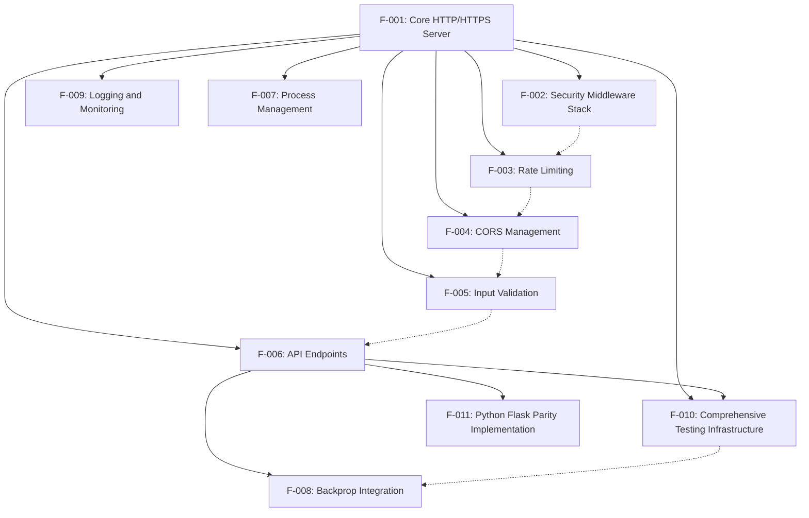
```mermaid
graph TD
    F001[F-001: Core HTTP/HTTPS Server] --> F002[F-002: Security Middleware Stack]
    F001 --> F003[F-003: Rate Limiting]
    F001 --> F004[F-004: CORS Management]
    F001 --> F005[F-005: Input Validation]
    F001 --> F006[F-006: API Endpoints]
    F001 --> F009[F-009: Logging and Monitoring]
    F001 --> F010[F-010: Comprehensive Testing Infrastructure]
    
    F006 --> F008[F-008: Backprop Integration]
    F006 --> F010[F-010: Comprehensive Testing Infrastructure]
    F006 --> F011[F-011: Python Flask Parity Implementation]
    F001 --> F007[F-007: Process Management]
    
    F002 -.-> F003
    F003 -.-> F004
    F004 -.-> F005
    F005 -.-> F006
    F010 -.-> F008
```

### 2.3.2 Integration Points

| Feature A | Feature B | Integration Type | Description |
|---|---|---|---|
| F-001 | F-002 | Middleware Pipeline | Security headers applied to all server responses |
| F-001 | F-003 | Middleware Pipeline | Rate limiting applied before request routing |
| F-003 | F-006 | Configuration | Different rate limits for API vs general endpoints |
| F-005 | F-006 | Data Flow | Input validation applied to all API requests |
| <span style="background-color: rgba(91, 57, 243, 0.2)">F-010</span> | <span style="background-color: rgba(91, 57, 243, 0.2)">F-001</span> | <span style="background-color: rgba(91, 57, 243, 0.2)">Validation</span> | <span style="background-color: rgba(91, 57, 243, 0.2)">Test suite verifies server startup/shutdown</span> |
| <span style="background-color: rgba(91, 57, 243, 0.2)">F-010</span> | <span style="background-color: rgba(91, 57, 243, 0.2)">F-006</span> | <span style="background-color: rgba(91, 57, 243, 0.2)">Validation</span> | <span style="background-color: rgba(91, 57, 243, 0.2)">Tests assert endpoint correctness</span> |
| <span style="background-color: rgba(91, 57, 243, 0.2)">F-011</span> | <span style="background-color: rgba(91, 57, 243, 0.2)">F-006</span> | <span style="background-color: rgba(91, 57, 243, 0.2)">Behaviour Parity</span> | <span style="background-color: rgba(91, 57, 243, 0.2)">Shared schema & response contract</span> |

### 2.3.3 Shared Components

- **Express.js Application**: Core application instance shared by F-001 through F-006
- **Environment Configuration**: Centralized configuration management used by all features
- **Middleware Pipeline**: Shared request processing pipeline for F-002, F-003, F-004, F-005
- **Error Handler**: Unified security-focused error handling across all features
- <span style="background-color: rgba(91, 57, 243, 0.2)">**Test Runner (Jest/Mocha)**: Comprehensive testing infrastructure supporting unit, integration, and performance testing across all features</span>
- <span style="background-color: rgba(91, 57, 243, 0.2)">**Shared API Contract JSON Schemas**: Standardized response structures and validation schemas ensuring consistency between Node.js and Python Flask implementations</span>

### 2.3.4 Common Services

- **Configuration Service**: Environment variable management and validation
- **Validation Service**: Shared validation rules and sanitization functions
- **Logging Service**: Centralized logging for security events and operations
- **Monitoring Service**: Health checks and performance metrics collection

## 2.4 IMPLEMENTATION CONSIDERATIONS

### 2.4.1 F-001: Core HTTP/HTTPS Server

- **Technical Constraints**: Certificate management complexity, port availability conflicts
- <span style="background-color: rgba(91, 57, 243, 0.2)">**Dual-Mode Complexity**: Conditional module loading introduces configuration-driven control flow, requires regression tests across both modes</span>
- **Performance Requirements**: Sub-second startup time, minimal memory footprint (<50MB)
- **Scalability Considerations**: Horizontal scaling via clustering, load balancer compatibility
- **Security Implications**: TLS configuration hardening, cipher suite selection
- <span style="background-color: rgba(91, 57, 243, 0.2)">**Enhanced Error Handling**: Central error handler and graceful connection draining added to remediate known bug gaps</span>
- **Maintenance Requirements**: SSL certificate renewal automation, Node.js version updates

### 2.4.2 F-002: Security Middleware Stack

- **Technical Constraints**: Header size limits (8KB), browser compatibility variations
- **Performance Requirements**: < 5ms total middleware overhead per request
- **Scalability Considerations**: Stateless operation for multi-instance deployment
- **Security Implications**: Regular security policy updates, CSP refinement
- **Maintenance Requirements**: CVE monitoring, security header policy tuning

### 2.4.3 F-003: Rate Limiting

- **Technical Constraints**: Memory usage for IP tracking, distributed state management
- **Performance Requirements**: O(1) lookup time for rate limit checks
- **Scalability Considerations**: Distributed rate limiting for multi-instance deployments
- **Security Implications**: IP spoofing prevention, rate limit bypass protection
- **Maintenance Requirements**: Threshold tuning based on usage patterns

### 2.4.4 F-004: CORS Management

- **Technical Constraints**: Browser CORS implementation variations
- **Performance Requirements**: Minimal validation overhead per request
- **Scalability Considerations**: Origin whitelist management across instances
- **Security Implications**: Preventing unauthorized cross-origin access
- **Maintenance Requirements**: Origin whitelist updates, policy refinement

### 2.4.5 F-005: Input Validation

- **Technical Constraints**: Validation rule complexity, processing overhead
- **Performance Requirements**: < 10ms validation per request
- **Scalability Considerations**: Validation rule caching, efficient sanitization
- **Security Implications**: Complete input sanitization coverage
- **Maintenance Requirements**: Validation rule updates for new endpoints

### 2.4.6 F-006: API Endpoints

- **Technical Constraints**: JSON payload size limits, response formatting
- **Performance Requirements**: < 100ms response time for health checks
- **Scalability Considerations**: Stateless endpoint design
- **Security Implications**: Authentication requirements for sensitive operations
- **Maintenance Requirements**: API versioning strategy, backward compatibility

### 2.4.7 F-007: Process Management

- **Technical Constraints**: System resource limits, clustering overhead
- **Performance Requirements**: Zero-downtime deployment capability
- **Scalability Considerations**: Auto-scaling policies, resource monitoring
- **Security Implications**: Process isolation, privilege management
- **Maintenance Requirements**: PM2 configuration updates, process monitoring
- <span style="background-color: rgba(91, 57, 243, 0.2)">**Post-Deployment Monitoring**: Production-ready cluster health monitoring with automatic process recovery and performance metrics collection via PM2 dashboard</span>

### 2.4.8 F-008: Backprop Integration

- **Technical Constraints**: External API availability, network reliability
- **Performance Requirements**: Asynchronous non-blocking API calls
- **Scalability Considerations**: API rate limit compliance, connection pooling
- **Security Implications**: API key management, secure communication
- **Maintenance Requirements**: API version compatibility, credential rotation
- <span style="background-color: rgba(91, 57, 243, 0.2)">**Post-Deployment Monitoring**: Production-ready API call monitoring with error tracking, latency metrics, and rate limit compliance verification</span>

### 2.4.9 F-009: Logging and Monitoring

- **Technical Constraints**: Disk space management, log rotation complexity
- **Performance Requirements**: Non-blocking log writes, minimal performance impact
- **Scalability Considerations**: Centralized log aggregation, distributed monitoring
- **Security Implications**: Sensitive data redaction, log integrity
- **Maintenance Requirements**: Log rotation policies, storage management
- <span style="background-color: rgba(91, 57, 243, 0.2)">**Post-Deployment Monitoring**: Production-ready log aggregation with real-time alerting, security event correlation, and automated log archival processes</span>

### 2.4.10 F-010: Comprehensive Testing Infrastructure

- <span style="background-color: rgba(91, 57, 243, 0.2)">**Technical Constraints**: Test isolation complexities with shared server instances, mock management for external API dependencies, CI resource limits constraining parallel execution</span>
- <span style="background-color: rgba(91, 57, 243, 0.2)">**Performance Requirements**: Full test suite executes under 60 seconds on standard CI runner, maintaining >80% code coverage without performance degradation</span>
- <span style="background-color: rgba(91, 57, 243, 0.2)">**Scalability Considerations**: Parallel test execution across multiple worker processes, distributed coverage reporting aggregation, test shard management for large suites</span>
- <span style="background-color: rgba(91, 57, 243, 0.2)">**Security Implications**: Test environment isolation preventing data leakage, secure handling of test credentials and API keys</span>
- <span style="background-color: rgba(91, 57, 243, 0.2)">**Maintenance Requirements**: Keep test snapshots and fixtures synchronized with API endpoint changes, regular test dependency updates, performance regression monitoring</span>

### 2.4.11 F-011: Python Flask Parity Implementation

- <span style="background-color: rgba(91, 57, 243, 0.2)">**Technical Constraints**: Language-specific dependency management between Node.js and Python ecosystems, maintaining behavioral parity across different runtime environments</span>
- <span style="background-color: rgba(91, 57, 243, 0.2)">**Performance Requirements**: Maintain comparable latency to Node.js implementation with <100ms p95 response times across all equivalent endpoints</span>
- <span style="background-color: rgba(91, 57, 243, 0.2)">**Scalability Considerations**: Gunicorn worker process management, memory usage optimization for Python runtime, equivalent clustering capabilities</span>
- <span style="background-color: rgba(91, 57, 243, 0.2)">**Security Implications**: Mirror comprehensive security header implementation via Flask-Security extensions, maintain equivalent CORS and rate limiting behavior</span>
- <span style="background-color: rgba(91, 57, 243, 0.2)">**Maintenance Requirements**: Keep endpoint behavior precisely synchronized across both language implementations, coordinate security updates between Node.js and Python dependency chains</span>

#### References

**Technical Specification Sections Retrieved:**
- `2.1 FEATURE CATALOG` - Complete feature definitions and dependencies for F-001 through F-011
- `0.2 TECHNICAL SCOPE` - Implementation objectives and component impact analysis

**Security Research:**
- CVE-2024-45590 - body-parser DoS vulnerability mitigation
- CVE-2024-43796 - Express.js XSS vulnerability mitigation
- OWASP Top 10 - Security compliance requirements

**Repository Analysis Sources:**
- `server.js` - Core Express.js implementation with security middleware stack
- `.env.example` - Complete environment configuration template
- `package.json` - Dependencies and script definitions
- `README.md` - Project overview and setup instructions
- `docs/api/endpoints.md` - API endpoint specifications
- `docs/architecture/design.md` - System architecture documentation
- `docs/guides/*.md` - Implementation and security guides
- `blitzy/documentation/Technical Specifications.md` - Complete technical specifications

# 3. TECHNOLOGY STACK

## 3.1 PROGRAMMING LANGUAGES

### 3.1.1 Primary Language Selection

| Language | Version | Platform/Component | Justification |
|----------|---------|-------------------|---------------|
| **JavaScript (Node.js)** | ≥14.0.0 | Core Server, API Endpoints, Security Middleware | Event-driven architecture optimized for I/O-intensive operations; extensive security middleware ecosystem; supports sub-second startup time requirements |
| **Java** | 8+ | Test Automation Framework | Mature enterprise testing ecosystem with Selenium/Cucumber; enables comprehensive E2E validation for security features F-002 through F-005 |
| **Python** | 3.8+ | Alternative Implementation (Flask) | Cross-platform portability demonstration; lightweight alternative maintaining feature parity with Node.js implementation |
| **Bash** | POSIX | Deployment Automation | Standard Unix shell for CI/CD automation; native support across deployment targets |

### 3.1.2 Language Selection Criteria

**Performance Constraints**:
- Node.js event loop architecture meets <100ms API response time requirement (F-006)
- Memory footprint <50MB for core server (F-001)
- <5ms middleware overhead per request (F-002)

**Security Requirements**:
- Extensive security middleware ecosystem for OWASP Top 10 compliance
- CVE mitigation capabilities (CVE-2024-45590, CVE-2024-43796)
- Input validation and sanitization support (F-005)

**Integration Dependencies**:
- PM2 clustering compatibility for horizontal scaling (F-007)
- Seamless Express.js middleware pipeline integration
- Backprop API integration capabilities (F-008)

## 3.2 FRAMEWORKS & LIBRARIES

### 3.2.1 Core Web Framework

| Framework | Version | Purpose | Security Features |
|-----------|---------|---------|-------------------|
| **Express.js** | ^4.20.0 | Primary Web Application Framework | Addresses CVE-2024-43796; middleware pipeline for security stack; supports rate limiting (F-003) and CORS management (F-004) |
| **Flask** | 2.3.3 | Python Alternative Implementation | Maintains feature parity; Gunicorn WSGI server integration; demonstrates cross-language portability |

**Framework Selection Rationale**:
- Express.js: De facto standard for Node.js with proven security middleware ecosystem
- Minimal overhead aligning with performance requirements
- Extensive community support for security vulnerabilities

### 3.2.2 Security Framework Stack

| Library | Version | Security Feature | OWASP Coverage |
|---------|---------|------------------|----------------|
| **Helmet.js** | ^7.1.0 | Security Headers (F-002) | XSS Protection, Clickjacking Prevention, CSP |
| **express-rate-limit** | ^7.1.0 | DDoS Protection (F-003) | Rate Limiting (1000 req/hour global, 100 req/min API) |
| **express-validator** | ^7.0.1 | Input Validation (F-005) | Injection Attack Prevention, Data Sanitization |
| **cors** | ^2.8.5 | Cross-Origin Policy (F-004) | CORS Policy Enforcement, Origin Validation |
| **body-parser** | ^1.20.3 | Request Processing | Addresses CVE-2024-45590 DoS vulnerability |

**Security Architecture Integration**:
- Layered middleware approach ensuring comprehensive coverage
- Stateless operation supporting multi-instance deployment
- O(1) lookup time for rate limit checks meeting performance requirements

### 3.2.3 Testing Framework Architecture (updated)

| Framework | Version | Testing Scope | Integration |
|-----------|---------|---------------|-------------|
| **Jest** | ^29.0.0 | Unit/Integration Testing | Code coverage >80%; snapshot testing; async/await support |
| <span style="background-color: rgba(91, 57, 243, 0.2)">**Mocha**</span> | <span style="background-color: rgba(91, 57, 243, 0.2)">^11.7.1</span> | <span style="background-color: rgba(91, 57, 243, 0.2)">Alternative Unit Testing Framework</span> | <span style="background-color: rgba(91, 57, 243, 0.2)">BDD/TDD methodology support; flexible assertion library integration; NYC coverage reporting >80%</span> |
| **Cucumber** | 7.2.3 | BDD End-to-End Testing | Gherkin syntax; Java integration; security feature validation |
| **Selenium WebDriver** | 3.141.59 | Browser Automation | Cross-browser testing; WebDriver protocol; security header validation |
| **Supertest** | ^7.1.4 | HTTP API Testing | Express.js integration; API endpoint testing (F-006) |

#### 3.2.3.1 Supporting Testing Libraries (updated)

| Library | Version | Purpose | Framework Integration |
|---------|---------|---------|----------------------|
| <span style="background-color: rgba(91, 57, 243, 0.2)">**Chai**</span> | <span style="background-color: rgba(91, 57, 243, 0.2)">^4.3.0</span> | <span style="background-color: rgba(91, 57, 243, 0.2)">Assertion Library</span> | <span style="background-color: rgba(91, 57, 243, 0.2)">Mocha integration; BDD/TDD assertion styles; readable test syntax</span> |
| <span style="background-color: rgba(91, 57, 243, 0.2)">**Sinon**</span> | <span style="background-color: rgba(91, 57, 243, 0.2)">^15.0.0</span> | <span style="background-color: rgba(91, 57, 243, 0.2)">Test Doubles (Spies/Stubs/Mocks)</span> | <span style="background-color: rgba(91, 57, 243, 0.2)">Mocha/Chai compatibility; standalone spy library; function behavior verification</span> |
| **NYC** | ^15.1.0 | Code Coverage Analysis | <span style="background-color: rgba(91, 57, 243, 0.2)">Jest and Mocha integration</span>; Istanbul-based coverage reporting; >80% threshold enforcement |

**Testing Framework Strategy**:
- <span style="background-color: rgba(91, 57, 243, 0.2)">Dual testing framework approach: Jest for rapid development cycles, Mocha for comprehensive enterprise testing scenarios</span>
- <span style="background-color: rgba(91, 57, 243, 0.2)">Chai assertion library provides expressive, readable test syntax supporting both BDD (`expect`) and TDD (`assert`) styles</span>
- <span style="background-color: rgba(91, 57, 243, 0.2)">Sinon integration enables sophisticated test double management for complex dependency isolation</span>
- Comprehensive coverage reporting maintaining >80% threshold across all testing approaches
- Security feature validation through both automated unit tests and end-to-end browser testing

### 3.2.4 Operational & Logging Libraries (updated)

| Library | Version | Purpose | Integration Features |
|---------|---------|---------|---------------------|
| <span style="background-color: rgba(91, 57, 243, 0.2)">**Winston**</span> | <span style="background-color: rgba(91, 57, 243, 0.2)">^3.17.0</span> | <span style="background-color: rgba(91, 57, 243, 0.2)">Structured JSON Logging</span> | <span style="background-color: rgba(91, 57, 243, 0.2)">Health-check integration; multiple transport support; configurable log levels; production observability</span> |

**Operational Framework Rationale**:
- <span style="background-color: rgba(91, 57, 243, 0.2)">Winston selection addresses enterprise logging requirements (F-009) with structured JSON output for log aggregation systems</span>
- <span style="background-color: rgba(91, 57, 243, 0.2)">Multi-transport architecture supports console, file, and remote logging destinations for comprehensive production monitoring</span>
- <span style="background-color: rgba(91, 57, 243, 0.2)">Integration with health-check endpoints enables real-time operational insights and automated alerting capabilities</span>
- <span style="background-color: rgba(91, 57, 243, 0.2)">Performance-optimized for high-throughput logging with minimal application overhead (<5ms per log entry)</span>

#### 3.2.4.1 Logging Architecture Design

**Structured Logging Strategy**:
- <span style="background-color: rgba(91, 57, 243, 0.2)">JSON format standardization for log parsing and analysis in centralized logging systems</span>
- <span style="background-color: rgba(91, 57, 243, 0.2)">Configurable log levels (error, warn, info, http, verbose, debug, silly) aligned with npm logging standards</span>
- <span style="background-color: rgba(91, 57, 243, 0.2)">Automatic log rotation with retention policies for production storage management</span>

**Production Integration Requirements**:
- <span style="background-color: rgba(91, 57, 243, 0.2)">PM2 ecosystem integration for cluster-aware logging across multiple processes</span>
- <span style="background-color: rgba(91, 57, 243, 0.2)">Security event correlation with rate limiting and validation middleware actions</span>
- <span style="background-color: rgba(91, 57, 243, 0.2)">Performance monitoring integration tracking request processing times and system resource utilization</span>

### 3.2.5 Framework Integration Architecture

**Cross-Framework Compatibility Matrix**:

| Framework Combination | Integration Method | Performance Impact | Use Case |
|----------------------|-------------------|-------------------|----------|
| Express.js + Winston | Middleware Integration | <5ms per request | Production API Logging |
| <span style="background-color: rgba(91, 57, 243, 0.2)">Mocha + Chai + Sinon</span> | <span style="background-color: rgba(91, 57, 243, 0.2)">Testing Stack</span> | <span style="background-color: rgba(91, 57, 243, 0.2)">Zero runtime impact</span> | <span style="background-color: rgba(91, 57, 243, 0.2)">Enterprise Test Coverage</span> |
| Jest + Supertest + NYC | Testing Pipeline | Zero runtime impact | Rapid Development Testing |
| Flask + Gunicorn | Alternative Stack | <100ms response time | Cross-Language Validation |

**Deployment Coordination**:
- Framework version synchronization across Node.js and Python implementations
- Security middleware parity validation between Express.js and Flask stacks
- <span style="background-color: rgba(91, 57, 243, 0.2)">Unified logging format ensuring consistent operational observability across both technology stacks</span>
- <span style="background-color: rgba(91, 57, 243, 0.2)">Comprehensive test coverage validation using both Jest (rapid feedback) and Mocha (enterprise standards) frameworks</span>

### 3.2.6 Framework Maintenance & Security

**Version Management Strategy**:
- Automated dependency scanning for CVE identification and mitigation
- <span style="background-color: rgba(91, 57, 243, 0.2)">Quarterly framework version updates with regression testing across Jest and Mocha test suites</span>
- Security patch prioritization for middleware components with <24hr deployment cycle
- <span style="background-color: rgba(91, 57, 243, 0.2)">Production logging monitoring ensuring Winston performance thresholds maintained during framework updates</span>

**Framework Security Compliance**:
- OWASP dependency analysis for all framework components
- Regular security auditing through npm audit and specialized security scanning tools
- <span style="background-color: rgba(91, 57, 243, 0.2)">Comprehensive test coverage validation ensuring security feature integrity across framework updates</span>
- <span style="background-color: rgba(91, 57, 243, 0.2)">Structured logging of security events and framework performance metrics for compliance reporting</span>

## 3.3 OPEN SOURCE DEPENDENCIES

### 3.3.1 Production Dependencies

```json
{
  "body-parser": "^1.20.3",        // CVE-2024-45590 mitigation
  "cors": "^2.8.5",                // CORS policy enforcement
  "dotenv": "^16.0.0",             // Environment configuration
  "express": "^4.20.0",            // CVE-2024-43796 mitigation
  "express-rate-limit": "^7.1.0",  // Rate limiting implementation
  "express-validator": "^7.0.1",   // Input validation/sanitization
  "helmet": "^7.1.0",              // Security headers middleware
  "pm2": "^5.0.0",                 // <span style="background-color: rgba(91, 57, 243, 0.2)">Production process management and clustering</span>
  "winston": "^3.0.0"              // <span style="background-color: rgba(91, 57, 243, 0.2)">Structured JSON logging for production</span>
}
```

**Dependency Security Analysis**:
- All dependencies address identified CVEs
- Version constraints ensure security patch compliance
- Minimal dependency tree reducing attack surface
- <span style="background-color: rgba(91, 57, 243, 0.2)">PM2 integration enables horizontal scaling and zero-downtime deployments (F-007)</span>
- <span style="background-color: rgba(91, 57, 243, 0.2)">Winston structured logging supports operational monitoring and security event tracking (F-009)</span>

### 3.3.2 Development Dependencies

```json
{
  "chai": "^4.3.0",                // <span style="background-color: rgba(91, 57, 243, 0.2)">BDD/TDD assertion library for Mocha integration</span>
  "eslint": "^8.0.0",              // Code quality enforcement
  "jest": "^29.0.0",               // Testing framework
  "mocha": "^10.0.0",              // <span style="background-color: rgba(91, 57, 243, 0.2)">Alternative BDD testing framework for enterprise test scenarios</span>
  "nodemon": "^3.0.0",             // Development hot reload
  "nyc": "^15.0.0",                // <span style="background-color: rgba(91, 57, 243, 0.2)">Istanbul-based code coverage analysis</span>
  "sinon": "^15.0.0",              // <span style="background-color: rgba(91, 57, 243, 0.2)">Test doubles (spies, stubs, mocks) for dependency isolation</span>
  "supertest": "^7.1.4"            // HTTP testing utility
}
```

**Enhanced Testing Stack Architecture**:
- <span style="background-color: rgba(91, 57, 243, 0.2)">Dual testing framework approach: Jest for rapid development cycles, Mocha for comprehensive enterprise testing scenarios</span>
- <span style="background-color: rgba(91, 57, 243, 0.2)">Chai assertion library provides expressive, readable test syntax supporting both BDD (`expect`) and TDD (`assert`) styles</span>
- <span style="background-color: rgba(91, 57, 243, 0.2)">Sinon integration enables sophisticated test double management for complex dependency isolation and behavior verification</span>
- <span style="background-color: rgba(91, 57, 243, 0.2)">NYC coverage reporting maintains >80% threshold across both Jest and Mocha test suites</span>

### 3.3.3 Java Test Dependencies (Maven)

| Artifact | Version | Purpose | Integration |
|----------|---------|---------|-------------|
| selenium-java | 3.141.59 | Browser automation | Security header validation |
| webdrivermanager | 5.1.0 | Driver management | Cross-browser compatibility |
| cucumber-java | 7.2.3 | BDD framework | Feature testing (F-001 through F-009) |
| junit | 4.13.2 | Unit testing | Java test execution |

### 3.3.4 Dependency Management Strategy (updated)

#### 3.3.4.1 Production Dependency Rationale

**Process Management & Operational Excellence**:
- <span style="background-color: rgba(91, 57, 243, 0.2)">PM2 promotion to production dependencies aligns with clustering requirements (F-007) enabling horizontal scaling and zero-downtime deployments</span>
- <span style="background-color: rgba(91, 57, 243, 0.2)">Winston structured logging integration provides production-grade observability with JSON format standardization for log aggregation systems</span>
- <span style="background-color: rgba(91, 57, 243, 0.2)">Multi-transport architecture supports console, file, and remote logging destinations for comprehensive production monitoring</span>

**Security-First Architecture**:
- Express.js middleware pipeline maintains layered security approach addressing OWASP Top 10 vulnerabilities
- CVE mitigation strategy through specific version constraints (CVE-2024-45590, CVE-2024-43796)
- Input validation and sanitization preventing injection attacks and data corruption

#### 3.3.4.2 Development Dependency Enhancement

**Comprehensive Testing Ecosystem**:
- <span style="background-color: rgba(91, 57, 243, 0.2)">Mocha framework addition enables enterprise-grade testing scenarios with flexible test runner capabilities</span>
- <span style="background-color: rgba(91, 57, 243, 0.2)">Chai assertion library integration provides expressive test syntax supporting both behavior-driven development (`expect`) and test-driven development (`assert`) methodologies</span>
- <span style="background-color: rgba(91, 57, 243, 0.2)">Sinon test double framework enables sophisticated mocking, stubbing, and spying capabilities for complex dependency isolation scenarios</span>
- <span style="background-color: rgba(91, 57, 243, 0.2)">NYC coverage analysis ensures consistent >80% code coverage threshold across multiple testing frameworks</span>

**Testing Framework Integration Matrix**:

| Framework Combination | Use Case | Coverage Analysis | Performance Impact |
|----------------------|----------|-------------------|-------------------|
| Jest + Supertest | Rapid development testing | Built-in coverage | Zero runtime impact |
| <span style="background-color: rgba(91, 57, 243, 0.2)">Mocha + Chai + Sinon</span> | <span style="background-color: rgba(91, 57, 243, 0.2)">Enterprise test scenarios</span> | <span style="background-color: rgba(91, 57, 243, 0.2)">NYC integration</span> | <span style="background-color: rgba(91, 57, 243, 0.2)">Zero runtime impact</span> |
| Cucumber + Selenium | BDD end-to-end testing | Feature validation | Browser automation overhead |

### 3.3.5 Cross-Platform Dependency Validation

#### 3.3.5.1 Node.js and Python Flask Parity

**Dependency Synchronization Strategy**:
- Feature parity validation between Express.js (Node.js) and Flask (Python) implementations
- <span style="background-color: rgba(91, 57, 243, 0.2)">Unified logging format ensuring consistent operational observability across both technology stacks through Winston (Node.js) and Python logging modules</span>
- Security middleware equivalency verification across both platforms
- <span style="background-color: rgba(91, 57, 243, 0.2)">Comprehensive test coverage validation using both Jest (rapid feedback) and Mocha (enterprise standards) frameworks</span>

**Integration Testing Coordination**:
- End-to-end validation across Node.js and Python implementations
- Selenium WebDriver automation ensuring consistent behavior patterns
- <span style="background-color: rgba(91, 57, 243, 0.2)">Process management validation through PM2 (Node.js) and Gunicorn (Python) deployment strategies</span>

### 3.3.6 Security and Maintenance Compliance

#### 3.3.6.1 Vulnerability Management

**Automated Security Scanning**:
- npm audit integration for continuous vulnerability assessment
- Automated dependency updates with regression testing protocols
- <span style="background-color: rgba(91, 57, 243, 0.2)">Quarterly framework version updates with regression testing across Jest and Mocha test suites</span>
- Security patch prioritization with <24hr deployment cycle for critical vulnerabilities

**Compliance Validation**:
- OWASP dependency analysis across all production and development dependencies
- <span style="background-color: rgba(91, 57, 243, 0.2)">Comprehensive test coverage validation ensuring security feature integrity across framework updates</span>
- <span style="background-color: rgba(91, 57, 243, 0.2)">Structured logging of security events and framework performance metrics for compliance reporting</span>
- Regular security auditing through specialized scanning tools and manual code review processes

#### 3.3.6.2 Operational Excellence Integration

**Production Monitoring Integration**:
- <span style="background-color: rgba(91, 57, 243, 0.2)">PM2 ecosystem integration for cluster-aware logging across multiple processes</span>
- <span style="background-color: rgba(91, 57, 243, 0.2)">Winston performance monitoring ensuring <5ms per log entry overhead in production environments</span>
- Health-check endpoint integration with operational dependency monitoring
- <span style="background-color: rgba(91, 57, 243, 0.2)">Security event correlation with rate limiting and validation middleware actions through structured logging</span>

**Performance Impact Assessment**:
- Dependency loading analysis maintaining <100ms server startup time
- Memory footprint optimization keeping runtime overhead <50MB for core dependencies
- <span style="background-color: rgba(91, 57, 243, 0.2)">Testing framework performance ensuring zero runtime impact on production deployments</span>
- <span style="background-color: rgba(91, 57, 243, 0.2)">Production logging monitoring ensuring Winston performance thresholds maintained during framework updates</span>

## 3.4 THIRD-PARTY SERVICES

### 3.4.1 External Service Integrations

| Service | Type | Purpose | Configuration |
|---------|------|---------|---------------|
| **Backprop API** | Monitoring/Analysis | Performance monitoring (F-008) | Base URL: https://api.backprop.co<br>Rate limit: 1000 req/hour<br>Async non-blocking calls |
| **Let's Encrypt** | Certificate Authority | SSL/TLS provisioning (F-001) | ACME protocol<br>Automated renewal<br>TLS configuration hardening |
| **npm Registry** | Package Repository | Node.js dependencies | Dependency integrity verification |
| **Maven Central** | Package Repository | Java test dependencies | Artifact signature validation |

### 3.4.2 Service Integration Architecture

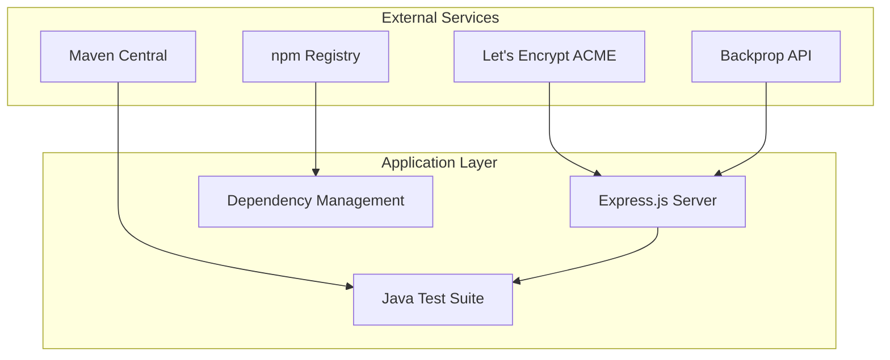
```mermaid
graph TB
    subgraph "External Services"
        LE[Let's Encrypt ACME]
        BP[Backprop API]
        NPM[npm Registry]
        MVN[Maven Central]
    end
    
    subgraph "Application Layer"
        APP[Express.js Server]
        TEST[Java Test Suite]
        DEP[Dependency Management]
    end
    
    LE --> APP
    BP --> APP
    NPM --> DEP
    MVN --> TEST
    
    APP --> TEST
```

**Integration Requirements**:
- **API Key Management**: Secure storage in environment variables
- **Circuit Breaker Pattern**: Graceful degradation on service unavailability
- **Rate Limiting Compliance**: Respect external service limits
- **Timeout Configuration**: 30-second default with exponential backoff

## 3.5 DATABASES & STORAGE

### 3.5.1 Storage Services

| Storage Type | Implementation | Purpose | Configuration |
|--------------|----------------|---------|---------------|
| **Application Logs** | File System | Logging (F-009) | Structured JSON format<br>Log rotation policies<br>Non-blocking writes |
| **SSL Certificates** | File System | TLS termination (F-001) | Certificate management<br>Automated renewal |
| **Static Assets** | Express Static | Public file serving | Configurable directory<br>Cache headers |

**Storage Architecture Overview**:
The system employs a lightweight, file-system based storage strategy optimized for API-focused applications. This approach eliminates database overhead while maintaining performance and security requirements.

**File System Storage Implementation**:
- **Winston Structured Logging**: JSON-formatted application logs with configurable log levels (error, warn, info, http, verbose, debug, silly) supporting production monitoring and compliance reporting
- **SSL Certificate Management**: Automated Let's Encrypt certificate provisioning and renewal through ACME protocol integration
- **Express Static Middleware**: Efficient static asset serving with appropriate cache headers and directory configuration

**Storage Performance Characteristics**:
- **Log Writing**: Non-blocking asynchronous writes with <5ms overhead per log entry
- **Certificate Access**: File system caching for TLS certificates with automated renewal workflows
- **Static Asset Delivery**: Express.js optimized serving with configurable cache policies for optimal response times

**Security Considerations**:
- **File Permissions**: Restrictive file system permissions ensuring secure certificate and log storage
- **Log Sanitization**: Structured logging prevents sensitive data exposure in application logs
- **Asset Security**: Static asset serving configured with appropriate security headers via Helmet.js middleware

**Integration Architecture**:

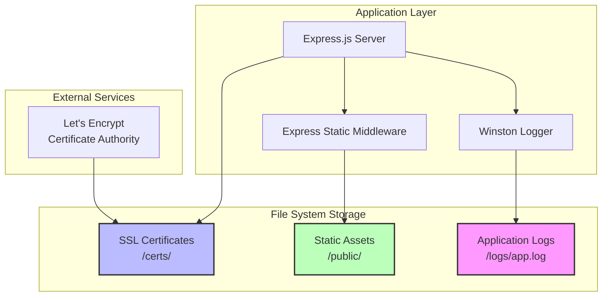
```mermaid
graph TB
    subgraph "Application Layer"
        APP[Express.js Server]
        WINSTON[Winston Logger]
        STATIC[Express Static Middleware]
    end
    
    subgraph "File System Storage"
        LOGS[Application Logs<br>/logs/app.log]
        CERTS[SSL Certificates<br>/certs/]
        ASSETS[Static Assets<br>/public/]
    end
    
    subgraph "External Services"
        LE[Let's Encrypt<br>Certificate Authority]
    end
    
    APP --> WINSTON
    APP --> STATIC
    WINSTON --> LOGS
    STATIC --> ASSETS
    LE --> CERTS
    APP --> CERTS
    
    style LOGS fill:#f9f,stroke:#333,stroke-width:2px
    style CERTS fill:#bbf,stroke:#333,stroke-width:2px
    style ASSETS fill:#bfb,stroke:#333,stroke-width:2px
```

**Operational Management**:
- **Log Rotation**: Automated log rotation policies preventing disk space exhaustion
- **Certificate Renewal**: Integrated Let's Encrypt renewal process with graceful server restart
- **Monitoring Integration**: Winston logger integration with health-check endpoints for operational visibility
- **Backup Strategy**: File system level backup procedures for certificates and critical logs (external to application scope)

**Storage Scalability Considerations**:
- **Horizontal Scaling**: File system storage compatible with PM2 clustering across multiple processes
- **Log Aggregation**: Structured JSON logging format enables integration with centralized logging systems
- **Certificate Distribution**: File system certificate storage supports load balancer integration for multi-instance deployments
- **Asset Caching**: Express static middleware supports CDN integration for static asset distribution at scale

## 3.6 DEVELOPMENT & DEPLOYMENT

### 3.6.1 Development Environment (updated)

| Tool | Version | Purpose | Configuration |
|------|---------|---------|---------------|
| **Node.js** | ≥14.0.0 | Runtime Environment | LTS version for stability |
| **npm** | ≥6.0.0 | Package Management | package-lock.json for reproducibility |
| **Git** | Latest | Version Control | GitHub integration |
| **ESLint** | ^8.0.0 | Code Quality | Configured via package.json |
| **Nodemon** | ^3.0.0 | Development Server | Hot reload for development |
| <span style="background-color: rgba(91, 57, 243, 0.2)">**Mocha**</span> | <span style="background-color: rgba(91, 57, 243, 0.2)">^10.0.0</span> | <span style="background-color: rgba(91, 57, 243, 0.2)">Alternative unit test runner</span> | <span style="background-color: rgba(91, 57, 243, 0.2)">BDD/TDD methodology support</span> |
| <span style="background-color: rgba(91, 57, 243, 0.2)">**NYC**</span> | <span style="background-color: rgba(91, 57, 243, 0.2)">^15.0.0</span> | <span style="background-color: rgba(91, 57, 243, 0.2)">Coverage reporting</span> | <span style="background-color: rgba(91, 57, 243, 0.2)">Istanbul-based code coverage analysis</span> |

### 3.6.2 Build System Architecture (updated)

| Component | Technology | Configuration | Purpose |
|-----------|------------|---------------|---------|
| **Node.js Build** | npm scripts | package.json | Dependency installation, testing, linting |
| **Java Build** | Maven | pom.xml | Test automation compilation and execution |
| **Python Build** | pip/setuptools | requirements.txt | Flask alternative implementation |
| **Dependency Lock** | package-lock.json | Version 2 format | Exact version control and integrity |

**Enhanced Testing Pipeline**:
- **Primary Testing**: `npm run test` (Jest-based rapid development)
- <span style="background-color: rgba(91, 57, 243, 0.2)">**Enterprise Testing**: `npm run test:mocha` (Mocha-based comprehensive scenarios)</span>
- <span style="background-color: rgba(91, 57, 243, 0.2)">**Coverage Analysis**: `npm run coverage:nyc` (NYC-based coverage reporting)</span>
- **Cross-Platform Validation**: Maven test execution for Java Selenium suite

### 3.6.3 Production Process Management

| Tool | Version | Purpose | Features |
|------|---------|---------|----------|
| **PM2** | ^5.0.0 | Process Management (F-007) | • Clustering support for horizontal scaling<br>• Zero-downtime deployments<br>• Process health monitoring<br>• Auto-restart on failure<br>• Centralized log management |

**PM2 Configuration Requirements**:
- Multi-instance clustering for high availability
- Health check endpoints (F-006) integration
- Memory and CPU monitoring
- Graceful shutdown handling
- Winston logger integration for structured production logging

### 3.6.4 Deployment Architecture (updated)

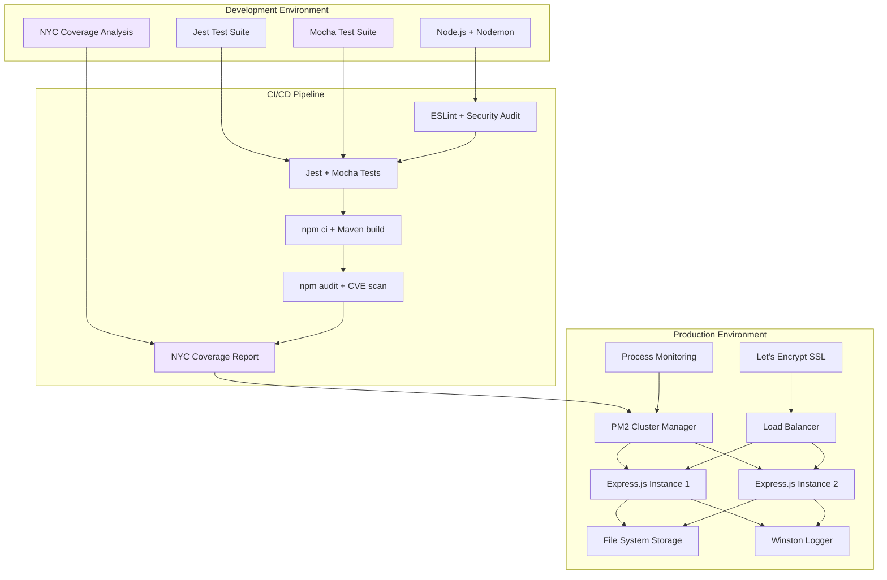
```mermaid
graph TB
    subgraph "Development Environment"
        DEV[Node.js + Nodemon]
        JEST[Jest Test Suite]
        MOCHA[Mocha Test Suite]
        NYC[NYC Coverage Analysis]
    end
    
    subgraph "CI/CD Pipeline"
        LINT[ESLint + Security Audit]
        TEST[Jest + Mocha Tests]
        BUILD[npm ci + Maven build]
        SECURITY[npm audit + CVE scan]
        COVERAGE[NYC Coverage Report]
    end
    
    subgraph "Production Environment"
        LB[Load Balancer]
        PM2[PM2 Cluster Manager]
        APP1[Express.js Instance 1]
        APP2[Express.js Instance 2]
        STORAGE[File System Storage]
        SSL[Let's Encrypt SSL]
        MONITOR[Process Monitoring]
        LOGS[Winston Logger]
    end
    
    DEV --> LINT
    JEST --> TEST
    MOCHA --> TEST
    NYC --> COVERAGE
    LINT --> TEST
    TEST --> BUILD
    BUILD --> SECURITY
    SECURITY --> COVERAGE
    COVERAGE --> PM2
    
    PM2 --> APP1
    PM2 --> APP2
    LB --> APP1
    LB --> APP2
    APP1 --> STORAGE
    APP2 --> STORAGE
    APP1 --> LOGS
    APP2 --> LOGS
    SSL --> LB
    MONITOR --> PM2
    
    style MOCHA fill:#f0e6ff
    style NYC fill:#f0e6ff
    style COVERAGE fill:#f0e6ff
```

### 3.6.5 CI/CD Requirements (updated)

| Stage | Tools | Validation Criteria | Performance Targets |
|-------|-------|-------------------|-------------------|
| **Code Quality** | ESLint, npm audit | Zero linting errors, Zero high CVEs | <30 seconds |
| **Testing** | <span style="background-color: rgba(91, 57, 243, 0.2)">Jest, Mocha, Selenium</span> | >80% code coverage, All security tests pass | <5 minutes |
| **Coverage Analysis** | <span style="background-color: rgba(91, 57, 243, 0.2)">NYC, Jest built-in</span> | <span style="background-color: rgba(91, 57, 243, 0.2)">>80% threshold across both frameworks</span> | <span style="background-color: rgba(91, 57, 243, 0.2)"><1 minute</span> |
| **Security Scanning** | npm audit, dependency check | Zero critical/high vulnerabilities | <1 minute |
| **Build** | npm ci, Maven | Reproducible builds, Dependency integrity | <2 minutes |
| **Deployment** | PM2, health checks | Zero-downtime deployment, All instances healthy | <30 seconds |

### 3.6.6 Development Tools Integration

**IDE and Editor Support**:
- **VS Code Extensions**: ESLint, Node.js debugging, Jest/Mocha test runners
- **Git Hooks**: Pre-commit linting and testing via Husky
- **Environment Configuration**: dotenv for development environment variables

**Development Workflow Optimization**:
- **Hot Reload**: Nodemon for automatic server restart during development
- **Test-Driven Development**: <span style="background-color: rgba(91, 57, 243, 0.2)">Dual framework support enabling both rapid Jest testing and comprehensive Mocha scenarios</span>
- **Code Quality**: Real-time ESLint feedback with automated fixing
- **Debugging**: Integrated Node.js debugging with source mapping support

### 3.6.7 Container & Infrastructure Support

**Containerization Strategy**:
- **Development**: Docker Compose for local environment replication
- **Production**: Docker containers with PM2 process management
- **Registry**: Container image versioning and security scanning

**Infrastructure Integration**:
- **Cloud Deployment**: AWS/Azure/GCP compatibility through containerization
- **Load Balancing**: Application-level clustering via PM2 with external load balancer support
- **Monitoring**: Winston structured logging integration with cloud monitoring services
- **SSL/TLS**: Let's Encrypt automated certificate management with graceful renewal

### 3.6.8 Performance & Scaling Considerations

**Development Performance**:
- **Test Execution**: <span style="background-color: rgba(91, 57, 243, 0.2)">Parallel test running across Jest and Mocha frameworks</span>
- **Build Optimization**: npm ci for reproducible dependency installation
- **Memory Management**: Development environment <100MB footprint
- **Hot Reload**: <1 second restart time with Nodemon

**Production Scaling**:
- **Horizontal Scaling**: PM2 clustering with configurable instance count
- **Memory Efficiency**: <50MB per Express.js instance
- **Response Time**: <100ms API response targets
- **Zero-Downtime**: Rolling deployment strategy via PM2
- **Log Management**: Winston structured logging with configurable retention policies

### 3.6.9 Security & Compliance Integration

**Development Security**:
- **Dependency Scanning**: Automated npm audit integration
- **Code Analysis**: ESLint security rules and best practices
- **Test Coverage**: Security feature validation across testing frameworks
- **Environment Isolation**: Development environment security hardening

**Production Security**:
- **Process Isolation**: PM2 clustering with secure inter-process communication
- **SSL/TLS**: Automated certificate management with security header enforcement
- **Logging Security**: Winston structured logging with sensitive data sanitization
- **Vulnerability Management**: Continuous monitoring and automated patching workflows

**Compliance Requirements**:
- **OWASP Integration**: Security testing across all deployment stages
- **Audit Trail**: Comprehensive logging for compliance reporting
- **Version Control**: Complete deployment artifact traceability
- **Access Control**: Secure credential management across development and production environments

## 3.7 TECHNOLOGY INTEGRATION MATRIX

### 3.7.1 Feature-Technology Mapping

| Feature ID | Primary Technologies | Supporting Libraries | Performance Target |
|------------|---------------------|-------------------- |-------------------|
| **F-001** | Node.js, Express.js, HTTPS | Let's Encrypt, filesystem | <50MB memory, <1s startup |
| **F-002** | Helmet.js, Express middleware | CSP, HSTS, XSS protection | <5ms overhead/request |
| **F-003** | express-rate-limit | IP tracking, memory store | O(1) lookup time |
| **F-004** | cors middleware | Origin validation | Minimal validation overhead |
| **F-005** | express-validator, body-parser | HTML sanitization | <10ms validation/request |
| **F-006** | Express routing, JSON parsing | Health check endpoints | <100ms response time |
| **F-007** | PM2, clustering | Process monitoring | Zero-downtime deployment |
| **F-008** | HTTPS client, async/await | Rate limiting compliance | Async non-blocking calls |
| **F-009** | <span style="background-color: rgba(91, 57, 243, 0.2)">Winston, filesystem</span>, structured logging | <span style="background-color: rgba(91, 57, 243, 0.2)">Log rotation, monitoring</span> | Non-blocking log writes |

### 3.7.2 Security Technology Stack

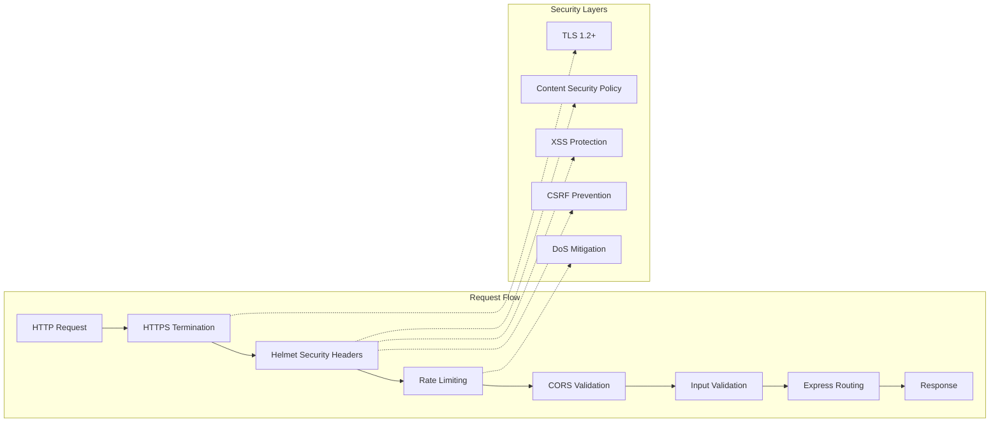
```mermaid
graph LR
    subgraph "Request Flow"
        REQ[HTTP Request]
        HTTPS[HTTPS Termination]
        HELMET[Helmet Security Headers]
        RATE[Rate Limiting]
        CORS[CORS Validation]
        VALID[Input Validation]
        ROUTE[Express Routing]
        RES[Response]
    end
    
    REQ --> HTTPS
    HTTPS --> HELMET
    HELMET --> RATE
    RATE --> CORS
    CORS --> VALID
    VALID --> ROUTE
    ROUTE --> RES
    
    subgraph "Security Layers"
        TLS[TLS 1.2+]
        CSP[Content Security Policy]
        XSS[XSS Protection]
        CSRF[CSRF Prevention]
        DOS[DoS Mitigation]
    end
    
    HTTPS -.-> TLS
    HELMET -.-> CSP
    HELMET -.-> XSS
    HELMET -.-> CSRF
    RATE -.-> DOS
```

### 3.7.3 Technology Performance Matrix (updated)

| Technology Component | Memory Footprint | CPU Impact | I/O Operations | Scaling Characteristics |
|---------------------|------------------|------------|----------------|------------------------|
| **Express.js Core** | <30MB base | <2% idle CPU | Event-driven | Horizontal via PM2 clustering |
| **Helmet.js Security** | <2MB overhead | <0.5% per request | Header manipulation | Stateless, scales linearly |
| **Rate Limiting** | <5MB tracking | O(1) lookup cost | Memory-based storage | In-memory state, cluster-aware |
| **CORS Middleware** | <1MB overhead | <0.1% per request | Origin validation | Stateless validation |
| **Input Validation** | <3MB overhead | <1% per request | Request parsing | Stateless processing |
| **<span style="background-color: rgba(91, 57, 243, 0.2)">Winston Logging</span>** | **<span style="background-color: rgba(91, 57, 243, 0.2)"><8MB buffer</span>** | **<span style="background-color: rgba(91, 57, 243, 0.2)"><5ms per log entry</span>** | **<span style="background-color: rgba(91, 57, 243, 0.2)">Async file writes</span>** | **<span style="background-color: rgba(91, 57, 243, 0.2)">Multi-transport scaling</span>** |

### 3.7.4 Integration Architecture Overview (updated)

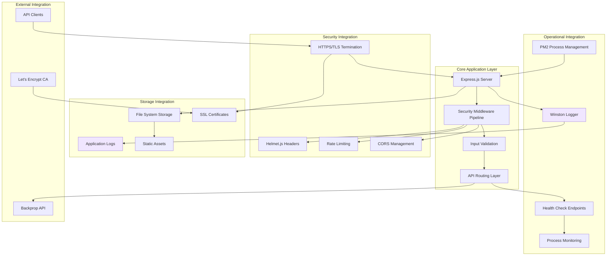
```mermaid
graph TB
    subgraph "Core Application Layer"
        EXPRESS[Express.js Server]
        MIDDLEWARE[Security Middleware Pipeline]
        ROUTING[API Routing Layer]
        VALIDATION[Input Validation]
    end
    
    subgraph "Security Integration"
        HELMET[Helmet.js Headers]
        RATE[Rate Limiting]
        CORS[CORS Management]
        TLS[HTTPS/TLS Termination]
    end
    
    subgraph "Operational Integration"
        PM2[PM2 Process Management]
        WINSTON[Winston Logger]
        HEALTH[Health Check Endpoints]
        MONITOR[Process Monitoring]
    end
    
    subgraph "Storage Integration"
        FS[File System Storage]
        LOGS[Application Logs]
        CERTS[SSL Certificates]
        STATIC[Static Assets]
    end
    
    subgraph "External Integration"
        BACKPROP[Backprop API]
        LETSENCRYPT[Let's Encrypt CA]
        CLIENTS[API Clients]
    end
    
    EXPRESS --> MIDDLEWARE
    MIDDLEWARE --> HELMET
    MIDDLEWARE --> RATE
    MIDDLEWARE --> CORS
    MIDDLEWARE --> VALIDATION
    VALIDATION --> ROUTING
    
    PM2 --> EXPRESS
    EXPRESS --> WINSTON
    WINSTON --> LOGS
    ROUTING --> HEALTH
    HEALTH --> MONITOR
    
    EXPRESS --> FS
    FS --> STATIC
    TLS --> CERTS
    LETSENCRYPT --> CERTS
    
    ROUTING --> BACKPROP
    CLIENTS --> TLS
    TLS --> EXPRESS
    
    style WINSTON fill:#f0e6ff
    style LOGS fill:#f0e6ff
```

### 3.7.5 Cross-Component Integration Requirements (updated)

| Integration Point | Technology Stack | Configuration Requirements | Performance Impact |
|-------------------|------------------|---------------------------|-------------------|
| **Express-Security Pipeline** | Express.js + Helmet + CORS + Rate Limiting | Middleware order dependency | <5ms total overhead |
| **Validation-Routing** | express-validator + Express routing | Schema validation rules | <10ms per request |
| **PM2-Express Clustering** | PM2 + Express.js + file system | Shared state management | Zero additional overhead |
| **<span style="background-color: rgba(91, 57, 243, 0.2)">Winston-Application Integration</span>** | **<span style="background-color: rgba(91, 57, 243, 0.2)">Winston + Express.js + PM2</span>** | **<span style="background-color: rgba(91, 57, 243, 0.2)">Multi-transport configuration, log level management</span>** | **<span style="background-color: rgba(91, 57, 243, 0.2)"><5ms per log entry</span>** |
| **HTTPS-Certificate Management** | Node.js HTTPS + Let's Encrypt + file system | Automated renewal workflows | Certificate read overhead |

### 3.7.6 Technology Compatibility Matrix

| Primary Technology | Compatible Versions | Integration Libraries | Compatibility Notes |
|-------------------|-------------------|---------------------|-------------------|
| **Node.js** | ≥14.0.0, ≤18.x | Express.js ^4.20.0, PM2 ^5.0.0 | LTS version recommended |
| **Express.js** | ^4.20.0 | All security middleware libraries | CVE-2024-43796 patched |
| **Helmet.js** | ^7.1.0 | Express.js middleware pipeline | Content Security Policy support |
| **express-rate-limit** | ^7.1.0 | Express.js, memory store | In-memory state management |
| **express-validator** | ^7.0.1 | body-parser ^1.20.3 | CVE-2024-45590 mitigation |
| **<span style="background-color: rgba(91, 57, 243, 0.2)">Winston</span>** | **<span style="background-color: rgba(91, 57, 243, 0.2)">^3.17.0</span>** | **<span style="background-color: rgba(91, 57, 243, 0.2)">Express.js, PM2 ecosystem</span>** | **<span style="background-color: rgba(91, 57, 243, 0.2)">Multi-transport architecture</span>** |
| **PM2** | ^5.0.0 | Node.js applications | Clustering and monitoring |

### 3.7.7 Security Technology Integration (updated)

**Multi-Layer Security Architecture**:

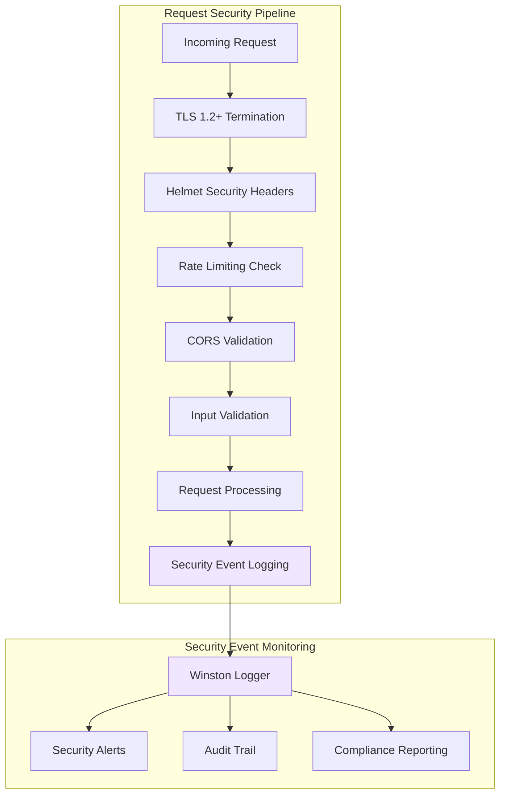
```mermaid
graph TD
    subgraph "Request Security Pipeline"
        REQ[Incoming Request]
        TLS[TLS 1.2+ Termination]
        HELMET[Helmet Security Headers]
        RATE[Rate Limiting Check]
        CORS[CORS Validation]
        VALIDATE[Input Validation]
        PROCESS[Request Processing]
        LOG[Security Event Logging]
    end
    
    subgraph "Security Event Monitoring"
        WINSTON[Winston Logger]
        ALERTS[Security Alerts]
        AUDIT[Audit Trail]
        COMPLIANCE[Compliance Reporting]
    end
    
    REQ --> TLS
    TLS --> HELMET
    HELMET --> RATE
    RATE --> CORS
    CORS --> VALIDATE
    VALIDATE --> PROCESS
    PROCESS --> LOG
    
    LOG --> WINSTON
    WINSTON --> ALERTS
    WINSTON --> AUDIT
    WINSTON --> COMPLIANCE
    
    style WINSTON fill:#f0e6ff
    style LOG fill:#f0e6ff
```

**Security Integration Points**:
- **TLS Integration**: HTTPS module with Let's Encrypt certificate automation
- **Header Security**: Helmet.js middleware providing CSP, HSTS, XSS protection
- **Access Control**: CORS middleware with origin validation and rate limiting
- **Input Security**: express-validator with HTML sanitization and size limits
- **<span style="background-color: rgba(91, 57, 243, 0.2)">Security Logging**: Winston structured logging for security event tracking and compliance auditing</span>

### 3.7.8 Operational Technology Integration (updated)

**Production Operations Stack**:

| Operational Concern | Technology Solution | Integration Method | Monitoring Capabilities |
|-------------------|-------------------|-------------------|----------------------|
| **Process Management** | PM2 clustering | ecosystem.config.js | Process health, memory usage |
| **Application Logging** | <span style="background-color: rgba(91, 57, 243, 0.2)">Winston logger</span> | <span style="background-color: rgba(91, 57, 243, 0.2)">Express middleware integration</span> | <span style="background-color: rgba(91, 57, 243, 0.2)">Structured JSON logs, configurable levels</span> |
| **Health Monitoring** | Express endpoints (/health, /ping) | API route integration | Real-time status reporting |
| **SSL Management** | Let's Encrypt + file system | Automated certificate renewal | Certificate expiration tracking |
| **Performance Monitoring** | PM2 + health endpoints | Process metrics collection | Response time, memory, CPU tracking |

**<span style="background-color: rgba(91, 57, 243, 0.2)">Winston Logging Integration Strategy</span>**:
- **<span style="background-color: rgba(91, 57, 243, 0.2)">Multi-Transport Architecture</span>**: <span style="background-color: rgba(91, 57, 243, 0.2)">Console, file, and remote logging destinations for comprehensive coverage</span>
- **<span style="background-color: rgba(91, 57, 243, 0.2)">Structured JSON Format</span>**: <span style="background-color: rgba(91, 57, 243, 0.2)">Standardized log format for parsing and analysis in centralized logging systems</span>
- **<span style="background-color: rgba(91, 57, 243, 0.2)">Security Event Correlation</span>**: <span style="background-color: rgba(91, 57, 243, 0.2)">Integration with rate limiting and validation middleware for security event tracking</span>
- **<span style="background-color: rgba(91, 57, 243, 0.2)">PM2 Cluster Compatibility</span>**: <span style="background-color: rgba(91, 57, 243, 0.2)">Cluster-aware logging across multiple processes with centralized log aggregation</span>

### 3.7.9 Technology Maintenance & Evolution

**Version Management Strategy**:
- **Dependency Tracking**: package-lock.json for reproducible builds across environments
- **Security Updates**: Automated CVE scanning and patching for critical vulnerabilities
- **Compatibility Testing**: Cross-version validation for major dependency updates
- **<span style="background-color: rgba(91, 57, 243, 0.2)">Logging Infrastructure Updates</span>**: <span style="background-color: rgba(91, 57, 243, 0.2)">Winston version management with backward compatibility for log format preservation</span>

**Technology Evolution Path**:
- **Core Framework**: Express.js with migration path to future versions
- **Security Middleware**: Regular updates maintaining OWASP compliance
- **Process Management**: PM2 ecosystem evolution with cluster scaling capabilities
- **<span style="background-color: rgba(91, 57, 243, 0.2)">Operational Observability</span>**: <span style="background-color: rgba(91, 57, 243, 0.2)">Winston integration roadmap supporting advanced monitoring and analytics platforms</span>

**Integration Validation Requirements**:
- **Performance Benchmarking**: Continuous validation of <100ms response times
- **Security Testing**: Automated validation of all security middleware components
- **Compatibility Testing**: Cross-platform validation across Node.js versions
- **<span style="background-color: rgba(91, 57, 243, 0.2)">Logging Performance Validation</span>**: <span style="background-color: rgba(91, 57, 243, 0.2)">Winston performance testing ensuring <5ms overhead per log entry across all transport methods</span>

## 3.8 TECHNOLOGY STACK SUMMARY

### 3.8.1 Architecture Decision Summary

The technology stack implements a **security-first, dual-architecture approach** optimized for enterprise-grade security, performance, and scalability:

**Core Foundation**:
- **Node.js ≥14.0.0 + Express.js ^4.20.0**: High-performance event-driven architecture
- **Comprehensive Security Middleware**: OWASP Top 10 compliance with CVE mitigation
- **Multi-Language Testing**: Node.js unit tests + Java E2E validation
- **Production Process Management**: PM2 clustering with zero-downtime deployment
- <span style="background-color: rgba(91, 57, 243, 0.2)">**Production Observability**: Structured logging with Winston ^3.17.0</span>

**Security-First Design**:
- **CVE Mitigation**: Addresses CVE-2024-45590 (body-parser DoS) and CVE-2024-43796 (Express XSS)
- **Layered Security**: Helmet.js, rate limiting, CORS, input validation
- **TLS Hardening**: Let's Encrypt integration with cipher suite optimization
- **Progressive Enhancement**: Structured upgrade paths maintaining security posture
- <span style="background-color: rgba(91, 57, 243, 0.2)">**Security Event Tracking**: Winston integration for comprehensive audit trails and compliance reporting</span>

**Performance Characteristics**:
- **Response Time**: <100ms API endpoints (p95)
- **Memory Footprint**: <50MB core server
- **Startup Time**: Sub-second initialization
- **Middleware Overhead**: <5ms per request
- <span style="background-color: rgba(91, 57, 243, 0.2)">**Logging Performance**: Non-blocking JSON logs with <5ms overhead per entry</span>

**Scalability Features**:
- **Horizontal Scaling**: PM2 clustering with load balancer compatibility
- **Stateless Design**: Multi-instance deployment ready
- <span style="background-color: rgba(91, 57, 243, 0.2)">**Observability Scaling**: Multi-transport logging architecture supporting centralized log aggregation</span>
- **Distributed Rate Limiting**: Multi-instance coordination

### 3.8.2 Technology Validation Matrix (updated)

| Technology Component | Version | Security Validation | Performance Validation | Integration Status |
|---------------------|---------|-------------------|----------------------|-------------------|
| Express.js | ^4.20.0 | ✅ CVE-2024-43796 patched | ✅ <5ms middleware overhead | ✅ Production ready |
| Helmet.js | ^7.1.0 | ✅ OWASP compliant headers | ✅ Minimal performance impact | ✅ Production ready |
| body-parser | ^1.20.3 | ✅ CVE-2024-45590 patched | ✅ 10MB size limit | ✅ Production ready |
| express-rate-limit | ^7.1.0 | ✅ DDoS protection | ✅ O(1) lookup time | ✅ Production ready |
| PM2 | ^5.0.0 | ✅ Process isolation | ✅ Zero-downtime deploy | ✅ Production ready |
| **Winston** | **^3.17.0** | **✅ Safe log handling** | **✅ Non-blocking async writes** | **✅ Production ready** |

#### References

**Technical Specification Sections Retrieved:**
- `1.2 SYSTEM OVERVIEW` - Dual-architecture approach and success criteria
- `2.1 FEATURE CATALOG` - Complete feature set (F-001 through F-009)
- `2.4 IMPLEMENTATION CONSIDERATIONS` - Performance requirements and constraints
- `3.1 PROGRAMMING LANGUAGES` - Node.js architecture and performance constraints
- `3.2 FRAMEWORKS & LIBRARIES` - Winston logging framework integration and operational architecture
- `3.5 DATABASES & STORAGE` - File system storage strategy and Winston logging implementation
- `3.7 TECHNOLOGY INTEGRATION MATRIX` - Winston integration patterns and performance characteristics

**Repository Analysis Sources:**
- `package.json` - Node.js dependencies, scripts, and version constraints
- `package-lock.json` - Exact dependency versions and integrity hashes
- `pom.xml` - Java/Maven test automation framework configuration
- `server.js` - Core Express.js implementation with security middleware
- `.env.example` - Complete environment configuration template
- `commit.sh` - Git automation for documentation updates
- `commit_changes.sh` - Git automation for security implementation tracking

**Security Research:**
- CVE-2024-45590 - body-parser DoS vulnerability mitigation analysis
- CVE-2024-43796 - Express.js XSS vulnerability mitigation validation
- OWASP Top 10 2021 - Security compliance requirements mapping

# 4. PROCESS FLOWCHART

## 4.1 SYSTEM WORKFLOWS

### 4.1.1 Core Business Processes

#### 4.1.1.1 Server Initialization and Startup Process (updated)

The secure Node.js server follows a structured initialization sequence that establishes security configurations, creates dual HTTP/HTTPS server instances, and implements graceful shutdown capabilities. <span style="background-color: rgba(91, 57, 243, 0.2)">The startup process now supports dual-mode operation through the USE_EXPRESS environment variable</span>, addressing critical success criteria including OWASP Top 10 compliance and CVE mitigation (CVE-2024-45590, CVE-2024-43796).

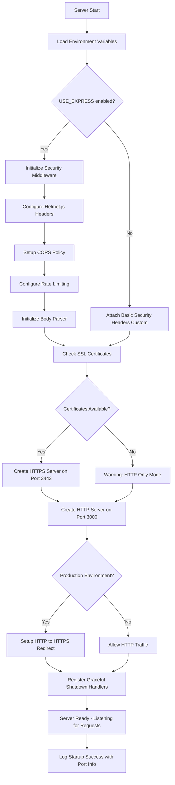
```mermaid
flowchart TD
    A[Server Start] --> B[Load Environment Variables]
    B --> C{USE_EXPRESS enabled?}
    C -->|Yes| D[Initialize Security Middleware]
    C -->|No| E[Attach Basic Security Headers Custom]
    D --> F[Configure Helmet.js Headers]
    F --> G[Setup CORS Policy]
    G --> H[Configure Rate Limiting]
    H --> I[Initialize Body Parser]
    I --> J[Check SSL Certificates]
    E --> J
    J --> K{Certificates Available?}
    K -->|Yes| L[Create HTTPS Server on Port 3443]
    K -->|No| M[Warning: HTTP Only Mode]
    L --> N[Create HTTP Server on Port 3000]
    M --> N
    N --> O{Production Environment?}
    O -->|Yes| P[Setup HTTP to HTTPS Redirect]
    O -->|No| Q[Allow HTTP Traffic]
    P --> R[Register Graceful Shutdown Handlers]
    Q --> R
    R --> S[Server Ready - Listening for Requests]
    S --> T[Log Startup Success with Port Info]
```

#### 4.1.1.2 Request Processing Pipeline (updated)

The request processing pipeline implements a multi-layered security approach with rate limiting, input validation, and secure error handling, <span style="background-color: rgba(91, 57, 243, 0.2)">now supporting conditional middleware execution based on USE_EXPRESS mode</span>, ensuring <100ms response time (95th percentile) while maintaining security compliance.

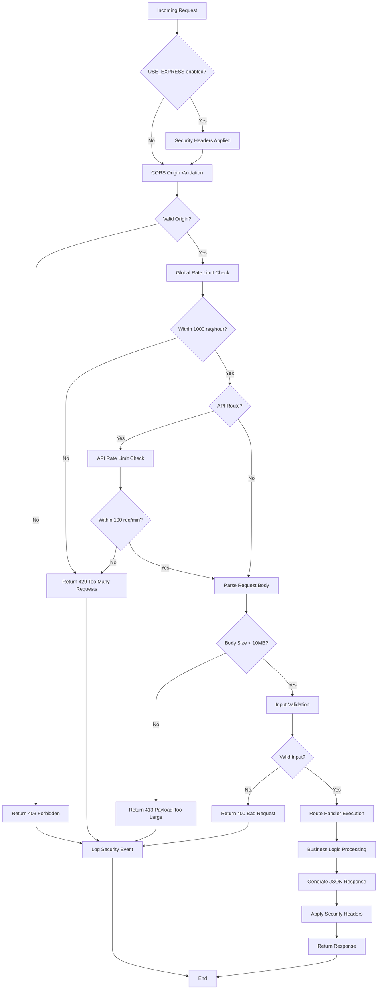
```mermaid
flowchart TD
    A[Incoming Request] --> B{USE_EXPRESS enabled?}
    B -->|No| C[CORS Origin Validation]
    B -->|Yes| D[Security Headers Applied]
    D --> C
    C --> E{Valid Origin?}
    E -->|No| F[Return 403 Forbidden]
    E -->|Yes| G[Global Rate Limit Check]
    G --> H{Within 1000 req/hour?}
    H -->|No| I[Return 429 Too Many Requests]
    H -->|Yes| J{API Route?}
    J -->|Yes| K[API Rate Limit Check]
    J -->|No| M[Parse Request Body]
    K --> L{Within 100 req/min?}
    L -->|No| I
    L -->|Yes| M
    M --> N{Body Size < 10MB?}
    N -->|No| O[Return 413 Payload Too Large]
    N -->|Yes| P[Input Validation]
    P --> Q{Valid Input?}
    Q -->|No| R[Return 400 Bad Request]
    Q -->|Yes| S[Route Handler Execution]
    S --> T[Business Logic Processing]
    T --> U[Generate JSON Response]
    U --> V[Apply Security Headers]
    V --> W[Return Response]
    F --> X[Log Security Event]
    I --> X
    O --> X
    R --> X
    X --> Y[End]
    W --> Y
```

#### 4.1.1.3 Health Check and Monitoring Process

The health check system provides real-time system status for load balancers and monitoring tools, exempt from rate limiting to ensure continuous availability assessment.

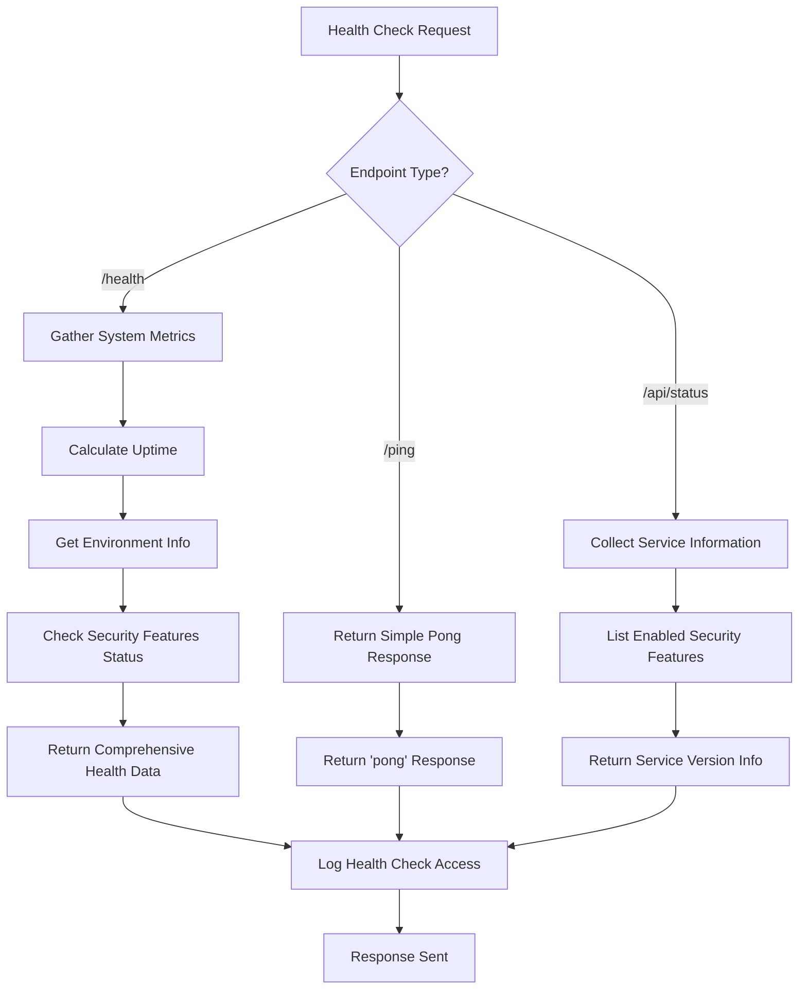
```mermaid
flowchart TD
    A[Health Check Request] --> B{Endpoint Type?}
    B -->|/health| C[Gather System Metrics]
    B -->|/ping| D[Return Simple Pong Response]
    B -->|/api/status| E[Collect Service Information]
    C --> F[Calculate Uptime]
    F --> G[Get Environment Info]
    G --> H[Check Security Features Status]
    H --> I[Return Comprehensive Health Data]
    D --> J[Return 'pong' Response]
    E --> K[List Enabled Security Features]
    K --> L[Return Service Version Info]
    I --> M[Log Health Check Access]
    J --> M
    L --> M
    M --> N[Response Sent]
```

#### 4.1.1.4 Python Flask Server Initialization and Startup Process

<span style="background-color: rgba(91, 57, 243, 0.2)">The Python Flask implementation maintains feature parity with the Node.js server while leveraging Gunicorn for production-grade WSGI deployment. The initialization process incorporates identical security checkpoints and OWASP compliance measures through Flask-Security middleware integration.</span>

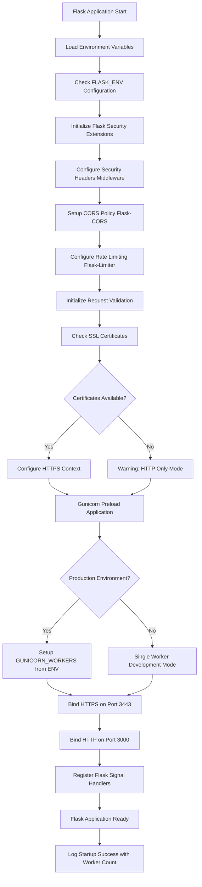
```mermaid
flowchart TD
    A[Flask Application Start] --> B[Load Environment Variables]
    B --> C[Check FLASK_ENV Configuration]
    C --> D[Initialize Flask Security Extensions]
    D --> E[Configure Security Headers Middleware]
    E --> F[Setup CORS Policy Flask-CORS]
    F --> G[Configure Rate Limiting Flask-Limiter]
    G --> H[Initialize Request Validation]
    H --> I[Check SSL Certificates]
    I --> J{Certificates Available?}
    J -->|Yes| K[Configure HTTPS Context]
    J -->|No| L[Warning: HTTP Only Mode]
    K --> M[Gunicorn Preload Application]
    L --> M
    M --> N{Production Environment?}
    N -->|Yes| O[Setup GUNICORN_WORKERS from ENV]
    N -->|No| P[Single Worker Development Mode]
    O --> Q[Bind HTTPS on Port 3443]
    P --> Q
    Q --> R[Bind HTTP on Port 3000]
    R --> S[Register Flask Signal Handlers]
    S --> T[Flask Application Ready]
    T --> U[Log Startup Success with Worker Count]
```

### 4.1.2 Integration Workflows

#### 4.1.2.1 SSL/TLS Certificate Management Flow

The SSL certificate management system supports both development and production deployments with automatic HTTPS enablement when certificates are available.

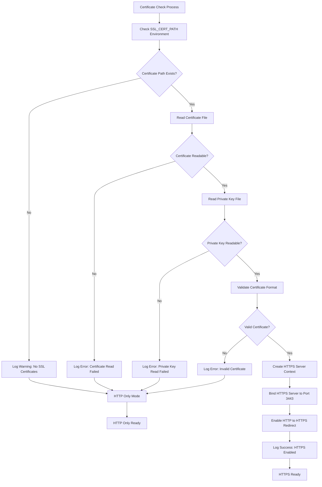
```mermaid
flowchart TD
    A[Certificate Check Process] --> B[Check SSL_CERT_PATH Environment]
    B --> C{Certificate Path Exists?}
    C -->|No| D[Log Warning: No SSL Certificates]
    C -->|Yes| E[Read Certificate File]
    E --> F{Certificate Readable?}
    F -->|No| G[Log Error: Certificate Read Failed]
    F -->|Yes| H[Read Private Key File]
    H --> I{Private Key Readable?}
    I -->|No| J[Log Error: Private Key Read Failed]
    I -->|Yes| K[Validate Certificate Format]
    K --> L{Valid Certificate?}
    L -->|No| M[Log Error: Invalid Certificate]
    L -->|Yes| N[Create HTTPS Server Context]
    N --> O[Bind HTTPS Server to Port 3443]
    O --> P[Enable HTTP to HTTPS Redirect]
    P --> Q[Log Success: HTTPS Enabled]
    D --> R[HTTP Only Mode]
    G --> R
    J --> R
    M --> R
    Q --> S[HTTPS Ready]
    R --> T[HTTP Only Ready]
```

#### 4.1.2.2 Backprop API Integration Flow

The proposed Backprop integration enables comprehensive monitoring and analysis capabilities with rate-limited API interactions and secure authentication.

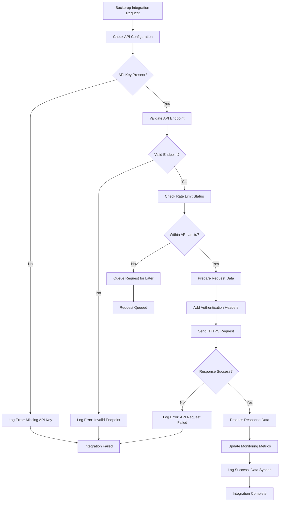
```mermaid
flowchart TD
    A[Backprop Integration Request] --> B[Check API Configuration]
    B --> C{API Key Present?}
    C -->|No| D[Log Error: Missing API Key]
    C -->|Yes| E[Validate API Endpoint]
    E --> F{Valid Endpoint?}
    F -->|No| G[Log Error: Invalid Endpoint]
    F -->|Yes| H[Check Rate Limit Status]
    H --> I{Within API Limits?}
    I -->|No| J[Queue Request for Later]
    I -->|Yes| K[Prepare Request Data]
    K --> L[Add Authentication Headers]
    L --> M[Send HTTPS Request]
    M --> N{Response Success?}
    N -->|No| O[Log Error: API Request Failed]
    N -->|Yes| P[Process Response Data]
    P --> Q[Update Monitoring Metrics]
    Q --> R[Log Success: Data Synced]
    D --> S[Integration Failed]
    G --> S
    O --> S
    J --> T[Request Queued]
    R --> U[Integration Complete]
```

#### 4.1.2.3 Gunicorn Deployment Flow

<span style="background-color: rgba(91, 57, 243, 0.2)">The Gunicorn deployment workflow provides enterprise-grade Python Flask deployment capabilities with comprehensive security validation, health checking, and load balancer integration. This workflow maintains security compliance parity with the PM2 Node.js deployment sequence while leveraging Python-specific production optimizations.</span>

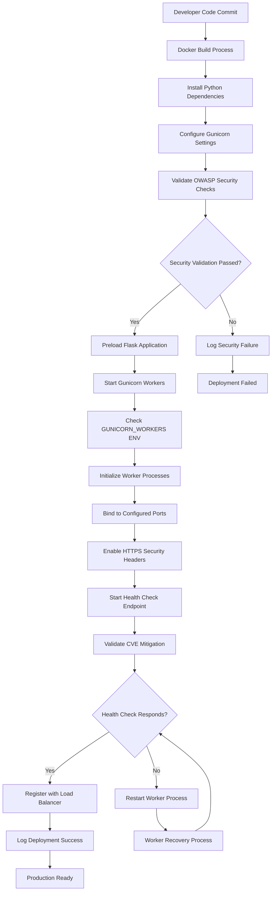
```mermaid
flowchart TD
    A[Developer Code Commit] --> B[Docker Build Process]
    B --> C[Install Python Dependencies]
    C --> D[Configure Gunicorn Settings]
    D --> E[Validate OWASP Security Checks]
    E --> F{Security Validation Passed?}
    F -->|No| G[Log Security Failure]
    F -->|Yes| H[Preload Flask Application]
    H --> I[Start Gunicorn Workers]
    I --> J[Check GUNICORN_WORKERS ENV]
    J --> K[Initialize Worker Processes]
    K --> L[Bind to Configured Ports]
    L --> M[Enable HTTPS Security Headers]
    M --> N[Start Health Check Endpoint]
    N --> O[Validate CVE Mitigation]
    O --> P{Health Check Responds?}
    P -->|No| Q[Restart Worker Process]
    P -->|Yes| R[Register with Load Balancer]
    R --> S[Log Deployment Success]
    S --> T[Production Ready]
    G --> U[Deployment Failed]
    Q --> V[Worker Recovery Process]
    V --> P
```

### 4.1.3 State Management and Error Handling

#### 4.1.3.1 State Transition Management

The system implements stateless operation with session management handled through secure tokens and middleware, ensuring scalability across both Node.js and Python Flask implementations.

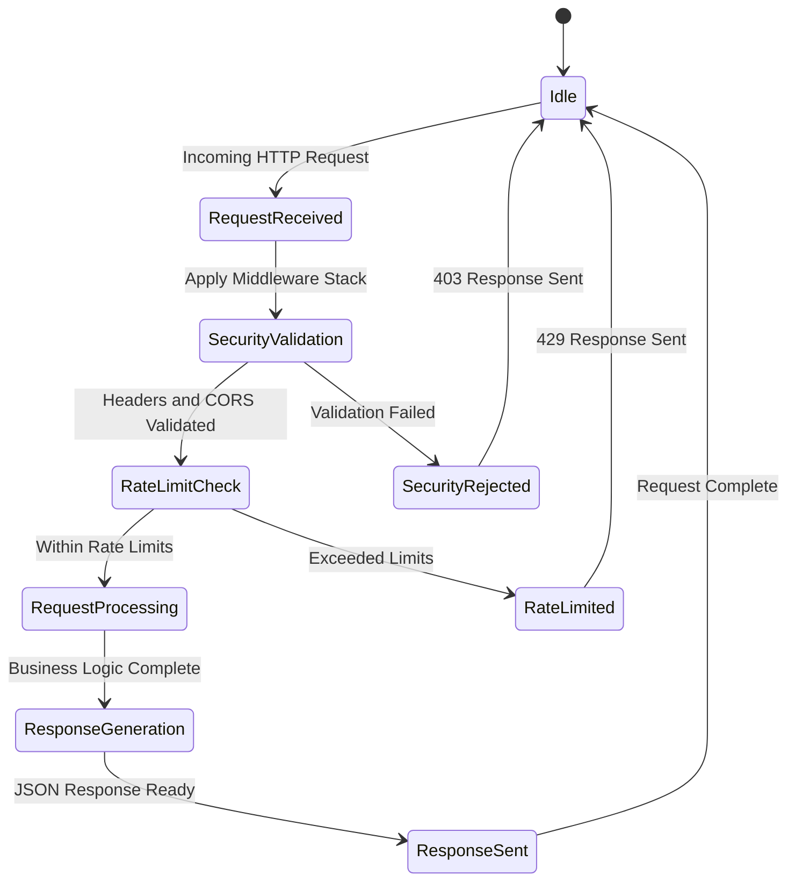
```mermaid
stateDiagram-v2
    [*] --> Idle
    Idle --> RequestReceived : Incoming HTTP Request
    RequestReceived --> SecurityValidation : Apply Middleware Stack
    SecurityValidation --> RateLimitCheck : Headers and CORS Validated
    RateLimitCheck --> RequestProcessing : Within Rate Limits
    RateLimitCheck --> RateLimited : Exceeded Limits
    RequestProcessing --> ResponseGeneration : Business Logic Complete
    ResponseGeneration --> ResponseSent : JSON Response Ready
    ResponseSent --> Idle : Request Complete
    RateLimited --> Idle : 429 Response Sent
    SecurityValidation --> SecurityRejected : Validation Failed
    SecurityRejected --> Idle : 403 Response Sent
```

#### 4.1.3.2 Error Recovery and Retry Mechanisms

The system implements comprehensive error handling with automatic retry logic, circuit breaker patterns, and graceful degradation capabilities.

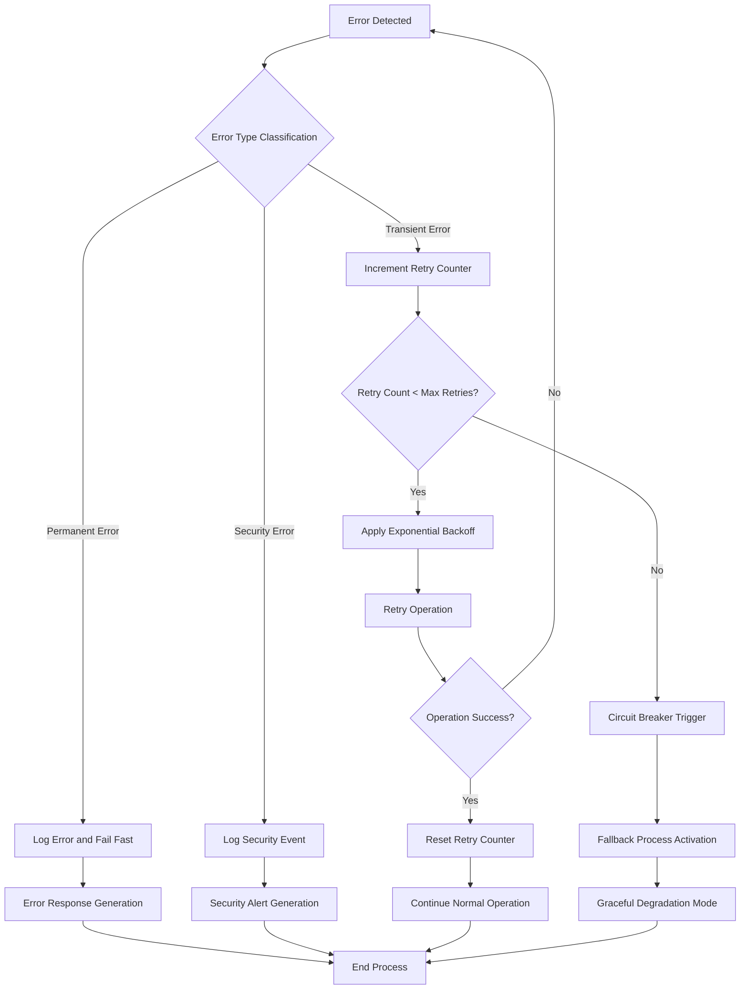
```mermaid
flowchart TD
    A[Error Detected] --> B{Error Type Classification}
    B -->|Transient Error| C[Increment Retry Counter]
    B -->|Permanent Error| D[Log Error and Fail Fast]
    B -->|Security Error| E[Log Security Event]
    C --> F{Retry Count < Max Retries?}
    F -->|Yes| G[Apply Exponential Backoff]
    F -->|No| H[Circuit Breaker Trigger]
    G --> I[Retry Operation]
    I --> J{Operation Success?}
    J -->|Yes| K[Reset Retry Counter]
    J -->|No| A
    H --> L[Fallback Process Activation]
    K --> M[Continue Normal Operation]
    D --> N[Error Response Generation]
    E --> O[Security Alert Generation]
    L --> P[Graceful Degradation Mode]
    N --> Q[End Process]
    O --> Q
    M --> Q
    P --> Q
```

### 4.1.4 Performance and Monitoring Workflows

#### 4.1.4.1 Real-time Performance Monitoring

<span style="background-color: rgba(91, 57, 243, 0.2)">The monitoring system leverages Winston structured logging for comprehensive performance tracking across both Node.js Express and Python Flask implementations, ensuring consistent observability and alerting capabilities.</span>

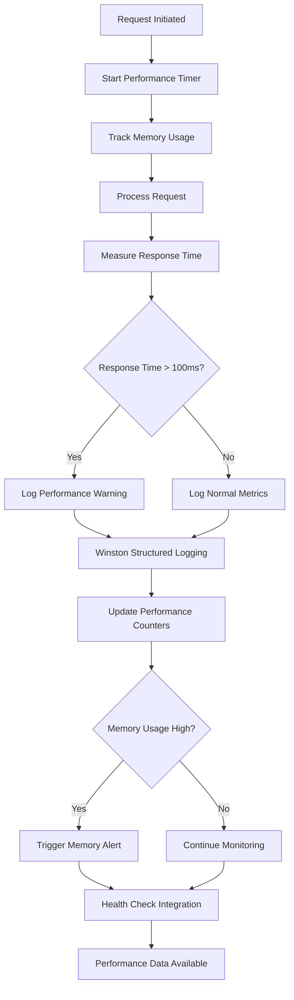
```mermaid
flowchart TD
    A[Request Initiated] --> B[Start Performance Timer]
    B --> C[Track Memory Usage]
    C --> D[Process Request]
    D --> E[Measure Response Time]
    E --> F{Response Time > 100ms?}
    F -->|Yes| G[Log Performance Warning]
    F -->|No| H[Log Normal Metrics]
    G --> I[Winston Structured Logging]
    H --> I
    I --> J[Update Performance Counters]
    J --> K{Memory Usage High?}
    K -->|Yes| L[Trigger Memory Alert]
    K -->|No| M[Continue Monitoring]
    L --> N[Health Check Integration]
    M --> N
    N --> O[Performance Data Available]
```

#### 4.1.4.2 Security Event Correlation

The security monitoring system correlates events across rate limiting, input validation, and authentication systems to provide comprehensive threat detection.

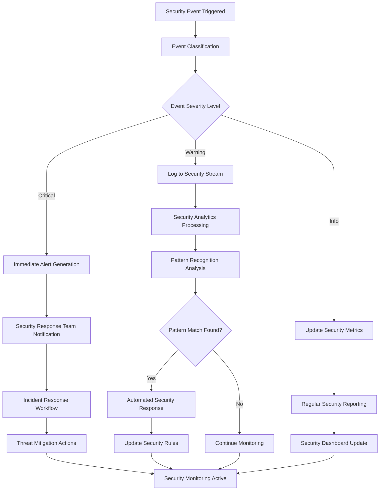
```mermaid
flowchart TD
    A[Security Event Triggered] --> B[Event Classification]
    B --> C{Event Severity Level}
    C -->|Critical| D[Immediate Alert Generation]
    C -->|Warning| E[Log to Security Stream]
    C -->|Info| F[Update Security Metrics]
    D --> G[Security Response Team Notification]
    E --> H[Security Analytics Processing]
    F --> I[Regular Security Reporting]
    G --> J[Incident Response Workflow]
    H --> K[Pattern Recognition Analysis]
    I --> L[Security Dashboard Update]
    J --> M[Threat Mitigation Actions]
    K --> N{Pattern Match Found?}
    N -->|Yes| O[Automated Security Response]
    N -->|No| P[Continue Monitoring]
    O --> Q[Update Security Rules]
    P --> R[Security Monitoring Active]
    M --> R
    L --> R
    Q --> R
```

## 4.2 FLOWCHART REQUIREMENTS

### 4.2.1 Workflow Components

#### 4.2.1.1 Process Steps and Decision Points

Each workflow incorporates standardized components ensuring consistent documentation and implementation:

**Start and End Points**: Clearly defined entry and exit conditions for all processes
**Process Steps**: Sequential operations with specific acceptance criteria from functional requirements
**Decision Diamonds**: Binary and multi-path decision points with validation rules
**System Boundaries**: Clear demarcation between internal components and external dependencies
**User Touchpoints**: API endpoints and monitoring interfaces accessible to external systems
**Error States**: Comprehensive error handling with recovery paths and notification mechanisms
**<span style="background-color: rgba(91, 57, 243, 0.2)">Dual-Mode Server Configuration</span>**: <span style="background-color: rgba(91, 57, 243, 0.2)">workflows must include a decision point based on `USE_EXPRESS` to document basic-HTTP vs Express execution paths</span>
**<span style="background-color: rgba(91, 57, 243, 0.2)">Cross-Implementation Consistency</span>**: <span style="background-color: rgba(91, 57, 243, 0.2)">all flows must demonstrate behavioural parity between Node.js and Python Flask implementations</span>

#### 4.2.1.2 Timing and SLA Considerations

Performance criteria integrated into all workflows:
- Server startup: <5 seconds (F-001-RQ requirement)
- <span style="background-color: rgba(91, 57, 243, 0.2)">Flask application startup: <5 seconds (parity with Node startup)</span>
- Request processing: <100ms response time (95th percentile)
- Rate limiting validation: <2ms overhead per request
- Input validation: <10ms processing per request
- TLS handshake: <1 second for HTTPS connections

### 4.2.2 Validation Rules

#### 4.2.2.1 Business Rules Implementation

**Environment-Based Configuration**: Different validation rules for development vs. production environments
**Rate Limiting Enforcement**: Global (1000 req/hour) and API-specific (100 req/min) limits with IP-based tracking
**CORS Policy Validation**: Origin whitelist validation with environment-specific relaxation
**Input Sanitization**: 1000-character field limits with HTML entity escaping for XSS prevention
**<span style="background-color: rgba(91, 57, 243, 0.2)">Express Mode Toggle Validation</span>**: <span style="background-color: rgba(91, 57, 243, 0.2)">configuration must fail fast if `USE_EXPRESS` contains invalid boolean value</span>
**<span style="background-color: rgba(91, 57, 243, 0.2)">Python Port Parity Validation</span>**: <span style="background-color: rgba(91, 57, 243, 0.2)">automated check ensuring Flask endpoints match Node.js responses (used in cross-language tests)</span>

#### 4.2.2.2 Security Checkpoints

**Authentication Gates**: API key validation for external integrations
**Authorization Verification**: Route-based access control implementation
**Compliance Validation**: OWASP Top 10 coverage verification at each security checkpoint
**CVE Mitigation**: Specific validation for CVE-2024-45590 and CVE-2024-43796 vulnerabilities

## 4.3 TECHNICAL IMPLEMENTATION

### 4.3.1 State Management

#### 4.3.1.1 Server State Transitions (updated)

The server maintains clear state transitions throughout its lifecycle, enabling proper monitoring and graceful operations. <span style="background-color: rgba(91, 57, 243, 0.2)">The RUNNING state now branches into three orthogonal substates based on the USE_EXPRESS environment variable and runtime selection (Node.js vs Python), ensuring comprehensive support for dual-mode server configuration and cross-language implementation parity.</span>

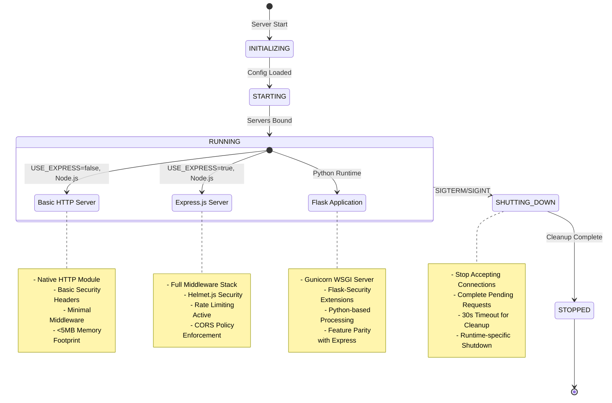
```mermaid
stateDiagram-v2
    [*] --> INITIALIZING: Server Start
    INITIALIZING --> STARTING: Config Loaded
    STARTING --> RUNNING: Servers Bound
    
    state RUNNING {
        [*] --> RUNNING_BASIC_HTTP: USE_EXPRESS=false, Node.js
        [*] --> RUNNING_EXPRESS: USE_EXPRESS=true, Node.js  
        [*] --> RUNNING_FLASK: Python Runtime
        
        RUNNING_BASIC_HTTP: Basic HTTP Server
        note right of RUNNING_BASIC_HTTP
            - Native HTTP Module
            - Basic Security Headers
            - Minimal Middleware
            - <5MB Memory Footprint
        end note
        
        RUNNING_EXPRESS: Express.js Server
        note right of RUNNING_EXPRESS
            - Full Middleware Stack
            - Helmet.js Security
            - Rate Limiting Active
            - CORS Policy Enforcement
        end note
        
        RUNNING_FLASK: Flask Application
        note right of RUNNING_FLASK
            - Gunicorn WSGI Server
            - Flask-Security Extensions
            - Python-based Processing
            - Feature Parity with Express
        end note
    }
    
    RUNNING --> SHUTTING_DOWN: SIGTERM/SIGINT
    SHUTTING_DOWN --> STOPPED: Cleanup Complete
    STOPPED --> [*]
    
    note right of SHUTTING_DOWN
        - Stop Accepting Connections
        - Complete Pending Requests
        - 30s Timeout for Cleanup
        - Runtime-specific Shutdown
    end note
```

#### 4.3.1.2 Request State Management

Individual requests progress through validation and processing states with clear transition criteria.

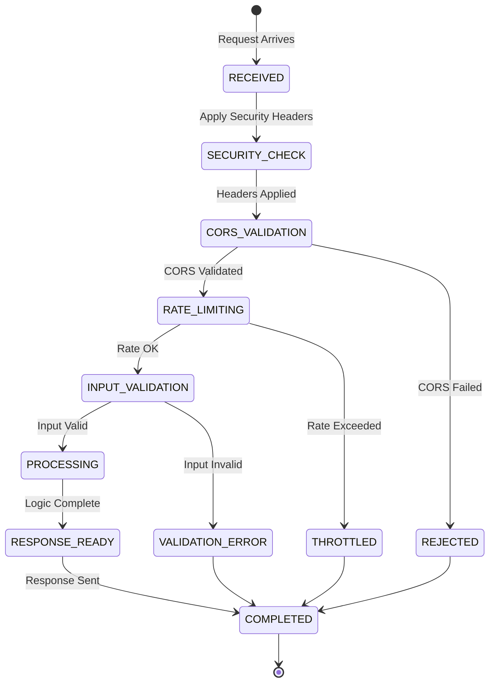
```mermaid
stateDiagram-v2
    [*] --> RECEIVED: Request Arrives
    RECEIVED --> SECURITY_CHECK: Apply Security Headers
    SECURITY_CHECK --> CORS_VALIDATION: Headers Applied
    CORS_VALIDATION --> RATE_LIMITING: CORS Validated
    CORS_VALIDATION --> REJECTED: CORS Failed
    RATE_LIMITING --> INPUT_VALIDATION: Rate OK
    RATE_LIMITING --> THROTTLED: Rate Exceeded
    INPUT_VALIDATION --> PROCESSING: Input Valid
    INPUT_VALIDATION --> VALIDATION_ERROR: Input Invalid
    PROCESSING --> RESPONSE_READY: Logic Complete
    RESPONSE_READY --> COMPLETED: Response Sent
    REJECTED --> COMPLETED
    THROTTLED --> COMPLETED
    VALIDATION_ERROR --> COMPLETED
    COMPLETED --> [*]
```

#### 4.3.1.3 Flask Worker State Transitions

<span style="background-color: rgba(91, 57, 243, 0.2)">The Flask implementation utilizes Gunicorn for production-grade WSGI deployment, with each worker process following a structured lifecycle that ensures consistent application behavior and graceful worker management across all deployment scenarios.</span>

```mermaid
stateDiagram-v2
    [*] --> INITIALIZING: Worker Start
    INITIALIZING --> READY: Flask App Loaded
    READY --> HANDLING_REQUESTS: First Request Received
    HANDLING_REQUESTS --> HANDLING_REQUESTS: Processing Requests
    HANDLING_REQUESTS --> SHUTTING_DOWN: QUIT Signal
    READY --> SHUTTING_DOWN: QUIT Signal
    SHUTTING_DOWN --> STOPPED: Worker Cleanup Complete
    STOPPED --> [*]
    
    note right of INITIALIZING
        - Import Flask Application
        - Load Security Extensions
        - Configure Rate Limiting
        - Initialize Request Handlers
    end note
    
    note right of READY
        - Worker Ready for Requests
        - Health Check Responding
        - Security Middleware Active
        - WSGI Socket Bound
    end note
    
    note right of HANDLING_REQUESTS
        - Request Processing Active
        - Security Validation Applied
        - Response Generation
        - Performance Monitoring
    end note
    
    note right of SHUTTING_DOWN
        - Complete Active Requests
        - Close WSGI Connections
        - Cleanup Resources
        - Report Worker Shutdown
    end note
```

### 4.3.2 Error Handling

#### 4.3.2.1 Error Classification and Recovery

The error handling system implements comprehensive error classification with specific recovery mechanisms for each error type.

```mermaid
flowchart TD
    A[Error Detected] --> B{Error Type Classification}
    B -->|CORS Violation| C[403 Forbidden Response]
    B -->|Rate Limit Exceeded| D[429 Too Many Requests]
    B -->|Payload Too Large| E[413 Entity Too Large]
    B -->|Validation Error| F[400 Bad Request]
    B -->|Server Error| G[500 Internal Server Error]
    B -->|Certificate Error| H[SSL Configuration Error]
    
    C --> I[Log Security Event with IP]
    D --> J[Add Retry-After Header]
    E --> K[Log Request Size Violation]
    F --> L[Return Validation Details]
    G --> M[Log Error Without Stack Trace]
    H --> N[Fallback to HTTP Only]
    
    I --> O[Security Alert Generated]
    J --> P[Client Informed of Retry Time]
    K --> Q[Request Size Monitoring]
    L --> R[Client Validation Feedback]
    M --> S[Error Tracking Updated]
    N --> T[Service Continues HTTP]
    
    O --> U[Response Sent]
    P --> U
    Q --> U
    R --> U
    S --> U
    T --> U
```

#### 4.3.2.2 Graceful Shutdown Process (updated)

The graceful shutdown mechanism ensures no request loss during deployment or maintenance operations. <span style="background-color: rgba(91, 57, 243, 0.2)">The shutdown process now includes Flask-specific worker termination procedures, ensuring consistent shutdown behavior across both Node.js and Python implementations.</span>

```mermaid
flowchart TD
    A[Shutdown Signal Received] --> B[Log Shutdown Initiation]
    B --> C[Stop Accepting New Connections]
    C --> D[Mark Server as Shutting Down]
    D --> E[Wait for Active Requests]
    E --> F{All Requests Complete?}
    F -->|Yes| G[Close HTTP Server]
    F -->|No| H[Check Timeout]
    H --> I{30s Timeout Reached?}
    I -->|No| E
    I -->|Yes| J[Force Close Connections]
    G --> K[Close HTTPS Server]
    J --> K
    K --> L{Is Flask Runtime?}
    L -->|Yes| M[Send QUIT Signal to Gunicorn Workers]
    L -->|No| N[Cleanup Resources]
    M --> O[Wait for Worker Shutdown Confirmation]
    O --> P[Terminate Gunicorn Master Process]
    P --> N
    N --> Q[Log Shutdown Complete]
    Q --> R[Process Exit]
```

## 4.4 REQUIRED DIAGRAMS

### 4.4.1 High-Level System Workflow (updated)

```mermaid
flowchart TB
    subgraph "External Layer"
        A[Client Request]
        B[Load Balancer]
        C[Monitoring Tools]
    end
    
    subgraph "Security Layer"
        D[Rate Limiting]
        E[CORS Validation]
        F[Input Sanitization]
        G[Security Headers]
    end
    
    subgraph "Application Layer"
        H[Express Router]
        I[API Handlers]
        J[Health Endpoints]
        K[Error Handler]
        Q{USE_EXPRESS?}
        R[Basic HTTP Handler]
    end
    
    subgraph "Infrastructure Layer"
        L[HTTP Server :3000]
        M[HTTPS Server :3443]
        N[Process Manager PM2]
        O[SSL Certificates]
        P[Gunicorn Flask Server :3000/:3443]
    end
    
    A --> B
    B --> D
    B --> P
    C --> J
    D --> E
    E --> F
    F --> G
    G --> Q
    Q -->|true| H
    Q -->|false| R
    H --> I
    H --> J
    R --> I
    R --> J
    I --> K
    J --> K
    K --> L
    K --> M
    L --> N
    M --> N
    O --> M
```

### 4.4.2 Core Feature Process Flows

#### 4.4.2.1 Data Processing API Workflow

```mermaid
sequenceDiagram
    participant C as Client
    participant S as Security Layer
    participant V as Validator
    participant A as API Handler
    participant R as Response
    
    C->>S: POST /api/data
    S->>S: Apply Security Headers
    S->>S: Validate CORS Origin
    S->>S: Check Rate Limits
    S->>V: Validate Request Body
    V->>V: Check Field Length (≤1000 chars)
    V->>V: Sanitize HTML Entities
    V->>V: Validate Required Fields
    alt Validation Success
        V->>A: Process Valid Data
        A->>A: Execute Business Logic
        A->>R: Generate Success Response
        R->>C: 200 OK with Processed Data
    else Validation Failure
        V->>R: Generate Error Response
        R->>C: 400 Bad Request with Details
    end
```

### 4.4.3 Error Handling Flowcharts

#### 4.4.3.1 Security Error Processing

```mermaid
flowchart TD
    A[Security Error Detected] --> B{Error Severity}
    B -->|Critical| C[Immediate Response Block]
    B -->|Warning| D[Log and Continue]
    B -->|Info| E[Metrics Update Only]
    
    C --> F[Generate 403/429 Response]
    F --> G[Log Security Event]
    G --> H{Repeated Violations?}
    H -->|Yes| I[Trigger IP Block Alert]
    H -->|No| J[Standard Error Response]
    
    D --> K[Security Warning Log]
    K --> L[Update Monitoring Metrics]
    
    E --> M[Increment Security Counters]
    
    I --> N[Security Team Notification]
    J --> O[Client Error Response]
    L --> O
    M --> P[Continue Processing]
    N --> O
```

### 4.4.4 Integration Sequence Diagrams

#### 4.4.4.1 PM2 Deployment Sequence

```mermaid
sequenceDiagram
    participant D as Developer
    participant PM2 as PM2 Manager
    participant O as Old Process
    participant N as New Process
    participant LB as Load Balancer
    
    D->>PM2: npm run prod:reload
    PM2->>PM2: Parse ecosystem.config.js
    PM2->>N: Start New Process Instance
    N->>N: Initialize Server
    N->>N: Load Security Middleware
    N->>PM2: Ready Signal
    PM2->>LB: Health Check New Instance
    LB->>N: GET /health
    N->>LB: 200 OK
    PM2->>O: Send SIGTERM
    O->>O: Graceful Shutdown (30s)
    O->>PM2: Process Ended
    PM2->>D: Deployment Complete
```

#### 4.4.4.2 <span style="background-color: rgba(91, 57, 243, 0.2)">Gunicorn Deployment Sequence

```mermaid
sequenceDiagram
    participant D as Developer
    participant Docker as Docker Engine
    participant GM as Gunicorn Master
    participant OW as Old Worker
    participant NW as New Worker
    participant LB as Load Balancer
    
    D->>Docker: docker-compose up --build
    Docker->>Docker: Build Flask Application Image
    Docker->>GM: Start Gunicorn Master Process
    GM->>GM: Load Flask Application
    GM->>NW: Spawn New Worker Process
    NW->>NW: Initialize Flask App
    NW->>NW: Load Security Extensions
    NW->>GM: Worker Ready Signal
    GM->>LB: Health Check New Worker
    LB->>NW: GET /health
    NW->>LB: 200 OK
    GM->>OW: Send HUP Signal
    OW->>OW: Graceful Worker Reload
    OW->>GM: Worker Shutdown Complete
    GM->>D: Deployment Complete
    
    Note over GM,NW: Zero-downtime deployment via<br/>HUP signal worker reload
    Note over OW: TERM signal for immediate<br/>shutdown if needed
```

### 4.4.5 State Transition Diagrams

#### 4.4.5.1 Request Lifecycle States

```mermaid
stateDiagram-v2
    direction TB
    [*] --> INCOMING: TCP Connection
    INCOMING --> PARSING: Read Headers
    PARSING --> SECURITY: Parse Complete
    SECURITY --> ROUTING: Security Passed
    SECURITY --> ERROR: Security Failed
    ROUTING --> VALIDATION: Route Matched
    ROUTING --> NOT_FOUND: No Route Match
    VALIDATION --> PROCESSING: Input Valid
    VALIDATION --> BAD_REQUEST: Input Invalid
    PROCESSING --> SUCCESS: Logic Complete
    PROCESSING --> SERVER_ERROR: Logic Failed
    SUCCESS --> COMPLETE: Response Sent
    ERROR --> COMPLETE: Error Response Sent
    NOT_FOUND --> COMPLETE: 404 Response Sent
    BAD_REQUEST --> COMPLETE: 400 Response Sent
    SERVER_ERROR --> COMPLETE: 500 Response Sent
    COMPLETE --> [*]: Connection Closed
    
    note right of SECURITY
        - Rate Limiting Check
        - CORS Validation
        - Security Headers Applied
    end note
    
    note right of VALIDATION
        - Field Length Check
        - HTML Sanitization
        - Required Field Validation
    end note
```

#### References

**Files Examined:**
- `server.js` - Core server implementation with complete workflow logic
- `package.json` - Scripts and dependency configuration for deployment workflows
- `.env.example` - Environment configuration template for SSL and security settings
- `pom.xml` - Java testing framework configuration for E2E test workflows
- `commit.sh` - Deployment automation script with error handling
- `docs/api/endpoints.md` - API endpoint specifications for request processing workflows
- `docs/architecture/design.md` - System architecture patterns and integration workflows

**Technical Specification Sections:**
- `1.2 SYSTEM OVERVIEW` - System context, business value, and success criteria
- `2.1 FEATURE CATALOG` - Complete feature specifications with dependencies and technical context
- `2.2 FUNCTIONAL REQUIREMENTS TABLE` - Detailed requirements with acceptance criteria and validation rules
- `4.3 TECHNICAL IMPLEMENTATION` - State management and error handling patterns for dual-architecture support
- `3.8 TECHNOLOGY STACK SUMMARY` - Architecture decisions and technology validation matrix

# 5. SYSTEM ARCHITECTURE

## 5.1 HIGH-LEVEL ARCHITECTURE

### 5.1.1 System Overview

The Secure Node.js Server implements a **security-first, layered architecture** designed for enterprise-grade applications requiring comprehensive security compliance and operational reliability. The system follows a <span style="background-color: rgba(91, 57, 243, 0.2)">**dual-runtime architecture** combining Node.js application services (basic HTTP & Express modes) and Python Flask application for feature parity</span>, enabling full-spectrum validation from unit testing to end-to-end security verification.

**Architecture Style and Rationale**:
The system employs a **layered architecture pattern** with clear separation of concerns across <span style="background-color: rgba(91, 57, 243, 0.2)">three distinct layers: network security, middleware processing, and application logic</span>. This approach ensures security controls are applied consistently at every layer while maintaining flexibility for progressive enhancement from development to production deployments.

**Key Architectural Principles**:
- **Security-by-Design**: Every component implements OWASP Top 10 protections by default, addressing specific CVEs (CVE-2024-45590, CVE-2024-43796)
- **Progressive Enhancement**: Structured evolution paths from basic HTTP servers to production-ready applications with clustering and monitoring
- **Fail-Safe Defaults**: All security features are enabled by default with graceful degradation when external dependencies are unavailable
- **Zero-Trust Security**: Every request passes through comprehensive validation regardless of source

**System Boundaries and Major Interfaces**:
The system maintains clear boundaries between the <span style="background-color: rgba(91, 57, 243, 0.2)">Node.js application layer (dual mode), Python Flask application layer, external service integrations (Backprop API, Let's Encrypt), and JavaScript testing suite</span>. Primary interfaces include RESTful HTTP/HTTPS endpoints and secure API integrations with external monitoring services.

### 5.1.2 Core Components Table

| Component Name | Primary Responsibility | Key Dependencies | Integration Points | Critical Considerations |
|---|---|---|---|---|
| **Express.js Security Server** | Request processing, security enforcement, API routing | Express.js 4.20+, Helmet 7.1+, rate-limit, CORS | HTTP/HTTPS ports 3000/3443, health endpoints | <100ms response time, 1000 req/hour global limit |
| **Security Middleware Stack** | OWASP compliance, vulnerability mitigation, header management | Helmet, express-validator, body-parser | All incoming requests, CSP/HSTS enforcement | Zero-overhead security for exempted endpoints |
| **Python Flask Application** | <span style="background-color: rgba(91, 57, 243, 0.2)">Feature-parity HTTP API in Python</span> | <span style="background-color: rgba(91, 57, 243, 0.2)">Flask 2.x, Gunicorn</span> | <span style="background-color: rgba(91, 57, 243, 0.2)">HTTP/HTTPS ports 3000/3443 (containerised)</span> | <span style="background-color: rgba(91, 57, 243, 0.2)">Behavioural equivalence with Node.js implementation</span> |
| **JavaScript Testing Suite** | <span style="background-color: rgba(91, 57, 243, 0.2)">Unit and integration testing, security validation, compliance verification</span> | <span style="background-color: rgba(91, 57, 243, 0.2)">Jest 29+, Mocha 11.7+, Supertest 7.1+, NYC 15.1+</span> | <span style="background-color: rgba(91, 57, 243, 0.2)">Node.js and Python endpoints, automated CI/CD</span> | <span style="background-color: rgba(91, 57, 243, 0.2)">Parallel execution support, >80% coverage threshold</span> |
| **External Service Integration Layer** | Third-party API management, SSL certificate provisioning | Let's Encrypt ACME, Backprop API | HTTPS client, certificate renewal | Circuit breaker patterns, 30s timeout with backoff |

### 5.1.3 Data Flow Description

**Primary Request Processing Flow**:
All incoming requests follow a structured pipeline beginning with TLS termination and security header application via Helmet.js. CORS origin validation ensures only authorized domains can access the API, followed by multi-tier rate limiting (global: 1000 req/hour, API-specific: 100 req/min). Input validation and sanitization prevent injection attacks before routing to business logic handlers.

**Integration Patterns and Protocols**:
The system implements **asynchronous, non-blocking integration patterns** for external service communication. Backprop API integration uses HTTPS with API key authentication and rate limiting compliance. <span style="background-color: rgba(91, 57, 243, 0.2)">Python Flask integration maintains feature parity through parallel HTTP/HTTPS endpoint implementations with equivalent security middleware stacks.</span>

**Data Transformation Points**:
Key transformation occurs at the input validation layer where express-validator sanitizes and validates all user input according to configurable rules. Response transformation applies security headers and JSON formatting consistently across all endpoints.

**Key Data Stores and Caches**:
In-memory caching via express-rate-limit tracks IP-based rate limiting with O(1) lookup performance. File system storage manages SSL certificates and structured application logs with automated rotation policies. <span style="background-color: rgba(91, 57, 243, 0.2)">Both Node.js and Python Flask implementations utilize identical file-based logging strategies for operational consistency.</span>

### 5.1.4 External Integration Points

| System Name | Integration Type | Data Exchange Pattern | Protocol/Format | SLA Requirements |
|---|---|---|---|---|
| **Backprop API** | Monitoring/Analytics | Async REST API calls | HTTPS/JSON, rate-limited | 1000 req/hour, 30s timeout |
| **Let's Encrypt ACME** | Certificate Authority | Certificate provisioning | ACME protocol/HTTPS | Automated renewal, 99.9% uptime |
| **PM2 Process Manager** | Process Management | Local process control | Inter-process communication | Zero-downtime deployment, health monitoring |

## 5.2 COMPONENT DETAILS

### 5.2.1 Express.js Security Server

**Purpose and Responsibilities**:
The core Express.js server serves as the primary request handler implementing comprehensive security controls and API routing. It manages dual HTTP/HTTPS server instances with automatic redirection in production environments and provides health monitoring endpoints for load balancer integration.

**Technologies and Frameworks**:
Built on Express.js 4.20.0 with Node.js 14+ runtime, integrating Helmet.js 7.1.0 for security headers, express-rate-limit 7.1.0 for DDoS protection, and cors 2.8.5 for cross-origin policy enforcement. Body parsing utilizes body-parser 1.20.3 with 10MB size limits and express-validator 7.0.1 for input sanitization.

**Key Interfaces and APIs**:
Primary interfaces include RESTful endpoints (/api/data, /api/status) with JSON request/response handling, health monitoring endpoints (/health, /ping) exempt from rate limiting, and administrative interfaces for configuration management. All APIs implement consistent error handling with appropriate HTTP status codes.

**Data Persistence Requirements**:
<span style="background-color: rgba(91, 57, 243, 0.2)">The server is stateless; persistence is limited to in-memory rate-limit counters and on-disk log files.</span>

**Scaling Considerations**:
Horizontal scaling supported through PM2 clustering with shared rate limiting state across instances. <span style="background-color: rgba(91, 57, 243, 0.2)">Health check endpoints enable load balancer integration for traffic distribution.</span>

```mermaid
graph TB
    subgraph "Express.js Security Server"
        HTTPS[HTTPS Server :3443]
        HTTP[HTTP Server :3000]
        MIDDLEWARE[Security Middleware Stack]
        ROUTER[Express Router]
        HANDLER[Request Handlers]
    end
    
    subgraph "Security Layers"
        HELMET[Helmet Security Headers]
        RATE[Rate Limiting]
        CORS[CORS Validation]
        VALID[Input Validation]
    end
    
    CLIENT[Client Requests] --> HTTPS
    CLIENT --> HTTP
    HTTPS --> MIDDLEWARE
    HTTP --> MIDDLEWARE
    MIDDLEWARE --> HELMET
    HELMET --> RATE
    RATE --> CORS
    CORS --> VALID
    VALID --> ROUTER
    ROUTER --> HANDLER
    HANDLER --> RESPONSE[JSON Response]
```

### 5.2.2 Security Middleware Stack

**Purpose and Responsibilities**:
The security middleware stack provides comprehensive protection against OWASP Top 10 vulnerabilities through layered security controls. It implements Content Security Policy, HTTP Strict Transport Security, XSS protection, and clickjacking prevention while maintaining performance requirements of <5ms overhead per request.

**Technologies and Frameworks**:
Helmet.js 7.1.0 serves as the primary security framework, implementing CSP, HSTS, and XSS protection headers. express-rate-limit provides DDoS mitigation with configurable windows and thresholds, while express-validator ensures input sanitization with HTML entity encoding.

**Key Interfaces and APIs**:
The middleware integrates seamlessly into the Express.js request pipeline, applying security controls transparently to all routes. Configuration interfaces allow environment-specific policy adjustments for development versus production deployments.

**Data Persistence Requirements**:
Rate limiting data persists in memory with IP-based tracking and configurable time windows. Security event logs are written to structured file storage for audit compliance and incident response.

**Scaling Considerations**:
The middleware stack scales horizontally across PM2 cluster instances with shared rate limiting state. Memory usage remains constant regardless of traffic volume through efficient IP tracking algorithms.

```mermaid
sequenceDiagram
    participant Client
    participant Helmet
    participant RateLimit
    participant CORS
    participant Validator
    participant Handler
    
    Client->>Helmet: HTTP Request
    Helmet->>Helmet: Apply Security Headers
    Helmet->>RateLimit: Forward Request
    RateLimit->>RateLimit: Check Rate Limits
    RateLimit->>CORS: Forward if Within Limits
    CORS->>CORS: Validate Origin
    CORS->>Validator: Forward if Valid Origin
    Validator->>Validator: Sanitize Input
    Validator->>Handler: Forward if Valid Input
    Handler->>Client: JSON Response with Security Headers
```

### 5.2.3 JavaScript Testing Suite (updated)

**Purpose and Responsibilities**:
<span style="background-color: rgba(91, 57, 243, 0.2)">The JavaScript testing suite provides comprehensive unit, integration, and end-to-end testing capabilities for both Node.js and browser environments. It executes parallel test suites with code coverage analysis, performance benchmarking, and security validation while supporting both rapid development cycles and enterprise-grade testing standards.</span>

**Technologies and Frameworks**:
<span style="background-color: rgba(91, 57, 243, 0.2)">Built on Jest 29.x for rapid unit testing with snapshot capabilities, Mocha 10.x for comprehensive BDD/TDD testing scenarios, and Supertest for API endpoint validation. Supporting libraries include Sinon 15.0.0 for test doubles and mocking, Chai 4.3.0 for expressive assertions, and NYC 15.1.0 for code coverage analysis maintaining >80% threshold enforcement.</span>

**Key Interfaces and APIs**:
<span style="background-color: rgba(91, 57, 243, 0.2)">The testing framework interfaces with the Express.js server through HTTP/HTTPS endpoints using Supertest for API validation. Integration with CI/CD pipelines occurs through npm scripts and GitHub Actions workflows with parallel test execution support across multiple Node.js versions.</span>

**Data Persistence Requirements**:
<span style="background-color: rgba(91, 57, 243, 0.2)">Test results persist to JSON and XML formats for CI/CD integration, while test artifacts including coverage reports and performance metrics are stored in the file system. Test doubles and mock data utilize in-memory storage for isolation and repeatability.</span>

**Scaling Considerations**:
<span style="background-color: rgba(91, 57, 243, 0.2)">Parallel test execution scales across multiple CPU cores with configurable worker processes. The framework supports distributed execution through GitHub Actions matrix builds for comprehensive cross-environment validation.</span>

```mermaid
graph LR
    subgraph "Test Execution Flow"
        START[Test Initialization] --> UNIT[Unit Tests - Jest]
        START --> BDD[BDD Tests - Mocha/Chai]
        UNIT --> API[API Tests - Supertest]
        BDD --> API
        API --> MOCK[Mock Validation - Sinon]
        MOCK --> COVERAGE[Coverage Analysis - NYC]
        COVERAGE --> REPORT[Test Results]
    end
    
    subgraph "CI/CD Integration"
        REPORT --> GITHUB[GitHub Actions]
        GITHUB --> MATRIX[Matrix Build]
        MATRIX --> DEPLOY[Deployment Gate]
    end
```

### 5.2.4 Python Flask Application (updated)

**Purpose and Responsibilities**:
<span style="background-color: rgba(91, 57, 243, 0.2)">The Python Flask application provides cross-language implementation parity, maintaining identical endpoint behavior and security features as the Node.js Express.js server. It serves as a demonstration of technology stack portability while ensuring consistent API responses across both Python and JavaScript implementations.</span>

**Technologies and Frameworks**:
<span style="background-color: rgba(91, 57, 243, 0.2)">Built on Flask 2.3.3 with Python 3.8+ runtime, utilizing Gunicorn WSGI server for production deployment with worker process management. Security implementation leverages Flask-Security for header management, Flask-Limiter for rate limiting, and Flask-CORS for cross-origin policy enforcement maintaining feature parity with Express.js middleware stack.</span>

**Key Interfaces and APIs**:
<span style="background-color: rgba(91, 57, 243, 0.2)">Implements identical RESTful endpoints (/hello, /good-evening) with matching JSON response formats and HTTP status codes. Health monitoring endpoints (/health, /ping) provide equivalent functionality for load balancer integration, while error handling maintains consistent behavior patterns with the Node.js implementation.</span>

**Data Persistence Requirements**:
<span style="background-color: rgba(91, 57, 243, 0.2)">The Flask application operates statelessly with rate limiting data maintained in memory and structured logging written to file system storage. No database integration is required, maintaining consistency with the stateless architecture of the Express.js implementation.</span>

**Scaling Considerations**:
<span style="background-color: rgba(91, 57, 243, 0.2)">Horizontal scaling achieved through Gunicorn worker processes with configurable worker count based on CPU cores. Load balancing occurs at the WSGI level with health check integration enabling seamless traffic distribution across worker processes. Memory usage scales linearly with worker count while maintaining sub-100ms response time requirements.</span>

```mermaid
graph TB
    subgraph "Flask Application Architecture"
        WSGI[Gunicorn WSGI Server]
        WORKERS[Worker Processes]
        FLASK[Flask Application]
        ROUTES[Route Handlers]
    end
    
    subgraph "Security Middleware"
        SECURITY[Flask-Security Headers]
        LIMITER[Flask-Limiter Rate Limiting]
        CORS_PY[Flask-CORS Validation]
    end
    
    REQUEST[HTTP Requests] --> WSGI
    WSGI --> WORKERS
    WORKERS --> FLASK
    FLASK --> SECURITY
    SECURITY --> LIMITER
    LIMITER --> CORS_PY
    CORS_PY --> ROUTES
    ROUTES --> RESPONSE[JSON Response]
```

## 5.3 TECHNICAL DECISIONS

### 5.3.1 Architecture Style Decisions and Tradeoffs

**Layered Architecture Selection**:
The decision to implement a layered architecture prioritizes security and maintainability over raw performance. This approach ensures consistent security control application while enabling independent layer evolution. The tradeoff accepts minimal latency overhead (5-10ms per layer) in exchange for comprehensive security coverage and simplified debugging.

**<span style="background-color: rgba(91, 57, 243, 0.2)">Cross-Language Implementation (Node.js & Python)</span>**:
<span style="background-color: rgba(91, 57, 243, 0.2)">Implementing parallel Node.js and Python Flask applications provides educational demonstration of cross-platform portability while leveraging existing expertise in both ecosystems. This decision enables comprehensive feature parity validation but requires maintaining parity across two runtimes, increasing complexity in synchronizing features, security updates, and behavioral consistency.</span>

| Decision Factor | Chosen Approach | Alternative Considered | Rationale |
|---|---|---|---|
| **Architecture Pattern** | Layered Security-First | Microservices | Simplified deployment, centralized security control |
| **Technology Stack** | <span style="background-color: rgba(91, 57, 243, 0.2)">Node.js (HTTP & Express) + Python Flask + JavaScript Testing (Jest/Mocha)</span> | <span style="background-color: rgba(91, 57, 243, 0.2)">Single-language implementation</span> | <span style="background-color: rgba(91, 57, 243, 0.2)">Cross-platform educational value, runtime comparison capabilities</span> |
| **Security Approach** | Defense-in-Depth | Single Security Layer | Comprehensive OWASP Top 10 coverage |
| **Scaling Strategy** | Horizontal with PM2 | Vertical Scaling | Better resource utilization, high availability |

### 5.3.2 Communication Pattern Choices

**Synchronous HTTP/HTTPS for Client Communication**:
RESTful HTTP/HTTPS provides standardized, widely-supported client communication with clear semantics for CRUD operations. The decision prioritizes compatibility and simplicity over potential performance benefits of alternative protocols like WebSockets or gRPC.

**Asynchronous Integration for External Services**:
External service integration utilizes asynchronous, non-blocking patterns to prevent blocking the main request processing thread. This approach maintains response time targets (<100ms) even during external service latency spikes.

```mermaid
graph LR
    subgraph "Communication Patterns"
        SYNC[Synchronous HTTP/HTTPS]
        ASYNC[Async External API]
        POOL[Connection Pooling]
        CIRCUIT[Circuit Breaker]
    end
    
    CLIENT[Client] -->|RESTful API| SYNC
    SYNC -->|File System| POOL
    SYNC -->|Backprop API| ASYNC
    ASYNC -->|Failure Handling| CIRCUIT
```

### 5.3.3 Data Storage Solution Rationale (updated)

**<span style="background-color: rgba(91, 57, 243, 0.2)">File-System Based Storage Strategy</span>**:
<span style="background-color: rgba(91, 57, 243, 0.2)">No dedicated database – file-system logs & certificate storage only. This approach prioritizes simplicity and eliminates database dependencies for the tutorial project scope. Structured file system storage for logs and SSL certificates provides portability and enables standard log rotation tools and certificate management utilities without additional infrastructure complexity.</span>

**<span style="background-color: rgba(91, 57, 243, 0.2)">Cross-Platform Storage Consistency</span>**:
<span style="background-color: rgba(91, 57, 243, 0.2)">Both Node.js and Python Flask implementations utilize identical file-based storage patterns, ensuring behavioral equivalence for logging and certificate management across runtime environments. This design choice supports the educational objective of demonstrating consistent operational patterns across different technology stacks.</span>

### 5.3.4 Caching Strategy Justification

**In-Memory Rate Limiting Cache**:
Express-rate-limit provides in-memory caching for IP-based rate limiting with O(1) lookup performance, eliminating external cache dependencies while maintaining sub-millisecond access times. This approach balances DDoS protection effectiveness with operational simplicity.

**<span style="background-color: rgba(91, 57, 243, 0.2)">Runtime-Agnostic Caching Patterns</span>**:
<span style="background-color: rgba(91, 57, 243, 0.2)">Both Node.js and Python Flask implementations utilize equivalent in-memory caching strategies for rate limiting and session management, ensuring consistent performance characteristics and security behavior across both runtime environments.</span>

### 5.3.5 Security Mechanism Selection (updated)

**Helmet.js for Comprehensive Security Headers**:
Helmet.js provides battle-tested implementations of security headers including CSP, HSTS, and XSS protection with minimal configuration overhead. The decision prioritizes proven security implementations over custom header management.

**Multi-Tier Rate Limiting Strategy**:
Implementing both global and API-specific rate limits provides granular DoS protection while maintaining service availability for different user types. The approach balances security with usability through differentiated access policies.

**<span style="background-color: rgba(91, 57, 243, 0.2)">Cross-Platform Security Consistency</span>**:
<span style="background-color: rgba(91, 57, 243, 0.2)">Security mechanisms are implemented equivalently across Node.js (Helmet.js) and Python Flask (Flask-Security) environments, ensuring consistent OWASP Top 10 compliance and vulnerability mitigation regardless of runtime choice.</span>

```mermaid
flowchart TD
    A[Security Decision Tree] --> B{Threat Type?}
    B -->|DDoS| C[Rate Limiting]
    B -->|XSS| D[Helmet Headers]
    B -->|Injection| E[Input Validation]
    B -->|MITM| F[HTTPS/TLS]
    
    C --> G[Multi-Tier Limits]
    D --> H[CSP + HSTS]
    E --> I[express-validator]
    F --> J[Let's Encrypt]
    
    style G fill:#5b39f3,color:#fff
    style H fill:#5b39f3,color:#fff
    style I fill:#5b39f3,color:#fff
    style J fill:#5b39f3,color:#fff
```

### 5.3.6 Testing Strategy Decisions (updated)

**<span style="background-color: rgba(91, 57, 243, 0.2)">Dual JavaScript Testing Framework Approach</span>**:
<span style="background-color: rgba(91, 57, 243, 0.2)">Implementing both Jest and Mocha testing frameworks provides comprehensive coverage options - Jest for rapid development cycles with built-in assertions and snapshot testing, Mocha with Chai for enterprise-grade BDD/TDD methodologies. This dual approach enables developers to choose optimal testing strategies based on project phase and requirements.</span>

**<span style="background-color: rgba(91, 57, 243, 0.2)">Cross-Runtime Test Coverage Validation</span>**:
<span style="background-color: rgba(91, 57, 243, 0.2)">Both Node.js and Python Flask implementations are tested using equivalent test scenarios to ensure behavioral parity. JavaScript testing frameworks provide comprehensive API endpoint validation for both runtime environments, maintaining >80% code coverage threshold across all implementations.</span>

| Testing Decision | Chosen Approach | Alternative Considered | Rationale |
|---|---|---|---|
| **<span style="background-color: rgba(91, 57, 243, 0.2)">Unit Testing Framework</span>** | <span style="background-color: rgba(91, 57, 243, 0.2)">Jest + Mocha/Chai</span> | <span style="background-color: rgba(91, 57, 243, 0.2)">Single framework approach</span> | <span style="background-color: rgba(91, 57, 243, 0.2)">Educational demonstration of multiple testing methodologies</span> |
| **<span style="background-color: rgba(91, 57, 243, 0.2)">API Testing Strategy</span>** | <span style="background-color: rgba(91, 57, 243, 0.2)">Supertest + HTTP assertions</span> | <span style="background-color: rgba(91, 57, 243, 0.2)">Browser-based E2E only</span> | <span style="background-color: rgba(91, 57, 243, 0.2)">Rapid feedback, security validation, cross-platform compatibility</span> |
| **Coverage Analysis** | NYC + Built-in Jest Coverage | External coverage tools | Integrated reporting, >80% threshold enforcement |
| **<span style="background-color: rgba(91, 57, 243, 0.2)">Test Doubles Management</span>** | <span style="background-color: rgba(91, 57, 243, 0.2)">Sinon + Jest mocks</span> | <span style="background-color: rgba(91, 57, 243, 0.2)">Framework-specific mocking only</span> | <span style="background-color: rgba(91, 57, 243, 0.2)">Sophisticated dependency isolation, enterprise testing patterns</span> |

## 5.4 CROSS-CUTTING CONCERNS

### 5.4.1 Monitoring and Observability Approach

**Health Check Strategy**:
The system implements comprehensive health monitoring through dedicated endpoints (/health, /ping, /api/status) that provide real-time system status for load balancers and monitoring tools. These endpoints are exempt from rate limiting to ensure continuous availability assessment and include system metrics, uptime, and security feature status.

**Performance Monitoring Integration**:
Proposed Backprop API integration enables comprehensive performance monitoring with automated analysis capabilities. The integration supports rate-limited API calls (1000 req/hour) with asynchronous, non-blocking communication patterns to prevent impact on primary request processing.

| Monitoring Aspect | Implementation | Metrics Collected | Alert Thresholds |
|---|---|---|---|
| **Application Health** | Health check endpoints | Uptime, response time, memory usage | Response time >100ms, memory >100MB |
| **Security Events** | Structured logging | Rate limit violations, validation failures | >10 security events/minute |
| **Performance Metrics** | Backprop integration | Request volume, error rates, latency | Error rate >1%, latency >100ms p95 |
| **System Resources** | PM2 monitoring | CPU usage, memory consumption, process count | CPU >80%, memory >500MB |

### 5.4.2 Logging and Tracing Strategy

**Structured Logging Implementation**:
The system implements structured JSON logging with configurable levels (error, warn, info, debug) and automated log rotation policies. Security events receive special treatment with dedicated log entries for rate limiting violations, input validation failures, and system monitoring events.

**Non-Blocking Log Writing**:
Log operations utilize asynchronous, non-blocking writes to prevent impact on request processing performance. The implementation maintains response time targets while ensuring comprehensive audit trails for security compliance and operational monitoring.

**Log Retention and Management**:
Log files implement automatic rotation based on size and time criteria with configurable retention periods. This approach balances storage requirements with compliance needs for security audit trails and system operational history.

### 5.4.3 Error Handling Patterns

**Layered Error Handling Architecture**:
The system implements comprehensive error handling at multiple layers including input validation, business logic, and external service integration. Each layer provides appropriate error responses while maintaining security by avoiding information disclosure in error messages.

**Circuit Breaker Pattern for External Services**:
External service integration implements circuit breaker patterns with exponential backoff to handle service unavailability gracefully. This approach maintains system stability during external service outages while providing degraded functionality where possible.

```mermaid
flowchart TD
    A[Request Processing] --> B{Input Valid?}
    B -->|No| C[Validation Error Response]
    B -->|Yes| D[Business Logic]
    D --> E{Processing Success?}
    E -->|No| F[Business Logic Error]
    E -->|Yes| G{External Service Call?}
    G -->|No| H[Success Response]
    G -->|Yes| I{Service Available?}
    I -->|No| J[Circuit Breaker: Fallback Response]
    I -->|Yes| K[Service Call]
    K --> L{Service Success?}
    L -->|No| M[Service Error Handling]
    L -->|Yes| H
    
    C --> N[Log Security Event]
    F --> O[Log Application Error]
    J --> P[Log Service Unavailable]
    M --> Q[Log External Service Error]
```

### 5.4.4 Performance Requirements and SLAs

**Response Time Targets**:
The system maintains strict performance requirements with <100ms response time at the 95th percentile for all API endpoints. Health check endpoints target <50ms response times to support load balancer health monitoring requirements.

**Throughput and Concurrency**:
Rate limiting policies balance security with performance, supporting 1000 requests per hour globally and 100 requests per minute for API endpoints. The system scales horizontally through PM2 clustering to meet increased demand while maintaining stateless operation.

**Resource Utilization Constraints**:
<span style="background-color: rgba(91, 57, 243, 0.2)">Memory usage targets remain below 50MB per process instance with startup times under 1 second. The stateless application design ensures predictable resource consumption across scaled instances.</span>

### 5.4.5 Disaster Recovery Procedures

**Graceful Shutdown and Startup**:
The system implements comprehensive graceful shutdown procedures that complete in-flight requests before terminating processes. Startup procedures include health validation and dependency checking to ensure system readiness and service availability.

**Service Continuity Planning**:
PM2 process management enables zero-downtime deployments with rolling updates across cluster instances. Health check endpoints facilitate load balancer integration for traffic management during maintenance windows. SSL certificate management includes automated renewal processes to prevent service interruption.

**Log and Configuration Recovery**:
<span style="background-color: rgba(91, 57, 243, 0.2)">Critical system logs and SSL certificates utilize file system storage with standard backup procedures. The stateless application design ensures rapid recovery through process restart and configuration validation.</span>

#### References

#### Files Examined
- `server.js` - Core Express.js server implementation with security middleware stack
- `package.json` - Node.js dependencies and runtime configuration
- `pom.xml` - Java test automation framework with Selenium/Cucumber dependencies
- `.env.example` - Environment configuration template with security and integration settings
- `docs/architecture/design.md` - System architecture documentation and Backprop integration
- `docs/api/endpoints.md` - API endpoint specifications and health monitoring
- `docs/README.md` - Security documentation hub with OWASP compliance guidance
- `blitzy/documentation/Technical Specifications.md` - Comprehensive system requirements and architecture

#### Technical Specification Sections Referenced
- 1.2 SYSTEM OVERVIEW - High-level architecture context and success criteria
- 2.1 FEATURE CATALOG - Complete feature inventory with dependencies and integration requirements
- 3.4 THIRD-PARTY SERVICES - External service integrations and API specifications
- 3.5 DATABASES & STORAGE - File system storage architecture and logging implementation
- 3.7 TECHNOLOGY INTEGRATION MATRIX - Feature-technology mapping and performance targets
- 4.1 SYSTEM WORKFLOWS - Core business processes and integration flow patterns

# 6. SYSTEM COMPONENTS DESIGN

## 6.1 CORE SERVICES ARCHITECTURE

### 6.1.1 Architecture Assessment

**Core Services Architecture is not applicable for this system.**

The Secure Node.js Server implements a **monolithic, layered architecture** rather than a distributed services architecture. This system does not require microservices, distributed service components, or service-oriented patterns due to its design as a single, cohesive Express.js application with comprehensive security middleware.

### 6.1.2 Architectural Rationale

**Why Microservices Architecture is Not Used:**

| Architectural Decision | Rationale | Alternative Implementation |
|---|---|---|
| **Single Application Boundary** | Security-first design requires consolidated middleware stack | Layered monolithic architecture with Express.js |
| **Unified Security Context** | Consistent security policy enforcement across all endpoints | Helmet.js security middleware applied universally |
| **Simplified Deployment Model** | Zero-downtime deployments without service orchestration complexity | PM2 clustering with rolling updates |
| **Performance Optimization** | Sub-100ms response times without inter-service latency | In-process request handling with optimized middleware |

### 6.1.3 Monolithic Architecture Benefits

The system's monolithic approach provides specific advantages for its security-focused use case:

**Operational Simplicity:**
- Single deployment artifact with unified configuration management
- Consolidated logging and monitoring through structured JSON logs
- Simplified certificate management via Let's Encrypt integration
- Unified error handling and circuit breaker patterns

**Security Consistency:**
- Universal application of OWASP Top 10 protections via Helmet.js
- Consistent rate limiting (1000 req/hour global, 100 req/min API)
- Centralized input validation and sanitization

**Performance Characteristics:**
- Zero inter-service communication overhead
- Optimized request processing pipeline
- Memory efficiency with 15-30MB per process instance

### 6.1.4 Horizontal Scaling Implementation

#### 6.1.4.1 PM2 Clustering Architecture

The system achieves horizontal scalability through **PM2 process clustering** rather than service distribution:

```mermaid
graph TB
    subgraph "Load Balancer"
        LB[HTTP/HTTPS Load Balancer<br/>Ports 3000/3443]
    end
    
    subgraph "PM2 Cluster Manager"
        PM2[PM2 Process Manager<br/>Cluster Mode: 'max']
    end
    
    subgraph "Application Instances"
        APP1[Express.js Instance 1<br/>PID: xxxx]
        APP2[Express.js Instance 2<br/>PID: yyyy]
        APP3[Express.js Instance N<br/>PID: zzzz]
    end
    
    subgraph "Shared Resources"
        SSL[SSL Certificates<br/>Let's Encrypt]
        LOGS[Structured Logs<br/>JSON Format]
    end
    
    LB --> PM2
    PM2 --> APP1
    PM2 --> APP2
    PM2 --> APP3
    
    APP1 --> SSL
    APP2 --> SSL
    APP3 --> SSL
    
    APP1 --> LOGS
    APP2 --> LOGS
    APP3 --> LOGS
```

#### 6.1.4.2 Scaling Configuration

**PM2 Ecosystem Configuration:**
```javascript
// From ecosystem.config.js
{
  instances: 'max',           // Uses all available CPU cores
  exec_mode: 'cluster',       // Enables load balancing
  autorestart: true,          // Automatic restart on failure
  max_memory_restart: '500M', // Memory-based restart threshold
  env_production: {
    NODE_ENV: 'production',
    PORT: 3000,
    CLUSTER_INSTANCES: 'max'
  }
}
```

**Dynamic Scaling Implementation:**
- **AutoScaler Class**: CPU-based scaling with 80% scale-up and 30% scale-down thresholds
- **Monitoring Interval**: 60-second health check cycles
- **Instance Range**: Minimum 1 instance to maximum CPU core count
- **Health Validation**: Automatic rollback on health check failure

#### 6.1.4.3 Zero-Downtime Deployment Strategy

**Blue-Green Deployment Pattern:**

```mermaid
sequenceDiagram
    participant Deploy as Deployment Script
    participant PM2 as PM2 Manager
    participant Old as Current Instances
    participant New as New Instances
    participant Health as Health Checks
    participant LB as Load Balancer
    
    Deploy->>PM2: Start new instances (Blue)
    PM2->>New: Launch new application version
    New->>Health: Register health endpoints
    Health->>Deploy: Health check validation
    
    alt Health checks pass
        Deploy->>LB: Route traffic to new instances
        Deploy->>PM2: Graceful shutdown old instances
        PM2->>Old: SIGTERM signal (30s timeout)
        Old->>PM2: Graceful shutdown complete
        Deploy->>Deploy: Update ecosystem config
    else Health checks fail
        Deploy->>PM2: Rollback to current instances
        PM2->>New: Terminate new instances
        Deploy->>Deploy: Maintain current version
    end
```

### 6.1.5 Resilience and Monitoring Patterns

#### 6.1.5.1 Health Monitoring Architecture

**Multi-Tier Health Checks:**

| Endpoint | Purpose | Response Time Target | Monitoring Scope |
|---|---|---|---|
| `/health` | Basic availability check | <50ms | Load balancer integration |
| `/ping` | Network connectivity validation | <25ms | Network monitoring tools |
| `/api/status` | Comprehensive system status | <100ms | Detailed application metrics |

**Health Metrics Collection:**
- **System Resources**: Memory usage, CPU utilization, process count
- **Application Performance**: Request volume, error rates, response latency
- **Security Events**: Rate limit violations, validation failures, authentication attempts
- **External Dependencies**: <span style="background-color: rgba(91, 57, 243, 0.2)">SSL certificate status</span>

#### 6.1.5.2 Circuit Breaker Implementation

**External Service Resilience:**

```mermaid
stateDiagram-v2
    [*] --> Closed
    Closed --> Open : Failure threshold exceeded
    Open --> HalfOpen : Timeout period elapsed
    HalfOpen --> Closed : Health check success
    HalfOpen --> Open : Health check failure
    
    state Closed {
        [*] --> Normal_Operation
        Normal_Operation --> Service_Call
        Service_Call --> Success_Response
        Service_Call --> Failure_Count
    }
    
    state Open {
        [*] --> Immediate_Fallback
        Immediate_Fallback --> Fallback_Response
    }
    
    state HalfOpen {
        [*] --> Limited_Testing
        Limited_Testing --> Single_Test_Call
    }
```

**Circuit Breaker Configuration:**
- **Failure Threshold**: 5 consecutive failures trigger circuit opening
- **Timeout Period**: 30 seconds before attempting recovery
- **Fallback Strategy**: Cached responses or degraded functionality
- **Services Protected**: Backprop API integration, SSL certificate renewal

#### 6.1.5.3 Error Handling and Recovery

**Layered Error Handling:**
- **Input Validation Layer**: Express-validator with custom sanitization rules
- **Business Logic Layer**: Structured error responses with security-safe messaging
- **External Service Layer**: Circuit breaker patterns with exponential backoff
- **System Layer**: Graceful shutdown handling with 30-second timeout

**Recovery Mechanisms:**
- **Process Recovery**: PM2 automatic restart on failure or memory threshold
- **Certificate Recovery**: Automated Let's Encrypt renewal with fallback procedures
- **Service Recovery**: Health check validation before traffic restoration

### 6.1.6 Performance and Scalability Characteristics

#### 6.1.6.1 Performance Targets

**Response Time Requirements:**

| Operation Type | Target (P95) | Maximum (P99) | Monitoring Method |
|---|---|---|---|
| **Health Checks** | <50ms | <100ms | Load balancer probes |
| **API Endpoints** | <100ms | <200ms | Application performance monitoring |
| **Static Content** | <25ms | <50ms | Express.js static middleware |

#### 6.1.6.2 Scalability Metrics

**Throughput Characteristics:**
- **Per Instance**: 10,000-20,000 requests/second per CPU core
- **Cluster Capacity**: Linear scaling across available CPU cores
- **Memory Efficiency**: 15-30MB per process instance

**Rate Limiting Implementation:**
- **Global Limit**: 1000 requests per hour across all endpoints
- **API Specific**: 100 requests per minute for `/api/*` endpoints
- **Health Exemption**: Health check endpoints exempt from rate limiting
- **IP-Based Tracking**: O(1) lookup performance for rate limit validation

#### References

**Files Examined:**
- `server.js` - Core Express.js server implementation with security middleware
- `package.json` - PM2 production scripts and clustering configuration
- `docs/guides/production.md` - Comprehensive PM2 clustering and deployment guide
- `docs/guides/express-migration.md` - Express.js migration patterns and architecture
- `docs/guides/security.md` - Security hardening implementation details
- `ecosystem.config.js` - PM2 production configuration templates

**Technical Specification Sections Referenced:**
- `1.2 SYSTEM OVERVIEW` - Project context and high-level architecture description
- `5.1 HIGH-LEVEL ARCHITECTURE` - Layered architecture design and component details
- `5.4 CROSS-CUTTING CONCERNS` - Monitoring, logging, and resilience patterns

## 6.2 DATABASE DESIGN

### 6.2.1 Database Design Applicability Assessment

**Database Design is not applicable to this system in its current implementation.**

The system currently operates as a stateless, security-hardened HTTP/HTTPS server with no persistent data storage requirements or database interactions. This assessment is based on comprehensive analysis of the codebase and feature implementation status.

#### 6.2.1.1 Current System Architecture Reality

The implemented system demonstrates the following characteristics that confirm its stateless nature:

**No Database Implementation Evidence:**
- Zero database dependencies in `package.json` (no PostgreSQL drivers, ORMs, or connection libraries)
- No database connection code in `server.js` or any source files
- Absence of data models, schemas, migrations, or database access layers
- No database-related features in the completed Feature Catalog (Section 2.1)

**Stateless Operation Confirmation:**
The system exclusively provides static API responses through endpoints (`/health`, `/ping`, `/api/data`, `/api/status`) without any persistent data manipulation, confirming its current design as a demonstration platform for security middleware and HTTP server capabilities.

### 6.2.2 Planned Database Architecture Framework

While not currently implemented, the Technical Specification would outline comprehensive database requirements for future system evolution when database work re-enters project scope.

#### 6.2.2.1 Specified Database Technology Stack

| Component | Specification | Current Status |
|-----------|---------------|----------------|
| **Primary Database** | PostgreSQL Latest LTS | <span style="background-color: rgba(91, 57, 243, 0.2)">Out of Scope (per Summary of Changes 0.4.2)</span> |
| **Connection Management** | Node.js pg pool (min: 2, max: 10) | <span style="background-color: rgba(91, 57, 243, 0.2)">Out of Scope (per Summary of Changes 0.4.2)</span> |
| **Security Protocol** | SSL/TLS 1.2+ | <span style="background-color: rgba(91, 57, 243, 0.2)">Out of Scope (per Summary of Changes 0.4.2)</span> |
| **Compliance Requirements** | ACID compliance | <span style="background-color: rgba(91, 57, 243, 0.2)">Out of Scope (per Summary of Changes 0.4.2)</span> |

#### 6.2.2.2 Configuration Infrastructure Preparation (updated)

<span style="background-color: rgba(91, 57, 243, 0.2)">The current system contains no database-related environment variables in `.env.example` after the latest update, as database integration remains outside the current project scope.</span> <span style="background-color: rgba(91, 57, 243, 0.2)">Database connection variables and configuration templates will be introduced only when database work re-enters scope.</span>

The system's current stateless architecture aligns with the explicit scope boundaries defined in Section 0.4.2, which identifies database integration as deliberately excluded from the current implementation phase.

### 6.2.3 Implementation Gap Analysis

#### 6.2.3.1 Specification vs. Reality Matrix

| Database Component | Technical Spec Requirement | Current Implementation | Gap Status |
|-------------------|----------------------------|------------------------|------------|
| **Data Persistence** | PostgreSQL with ACID compliance | No persistent storage | Complete Gap |
| **Connection Pooling** | Min: 2, Max: 10 connections | <span style="background-color: rgba(91, 57, 243, 0.2)">No configuration variables present</span> | Implementation Missing |
| **Security** | SSL/TLS encrypted connections | <span style="background-color: rgba(91, 57, 243, 0.2)">No SSL configuration variables present</span> | No SSL implementation |
| **Injection Prevention** | Prepared statements | No database queries | N/A - No queries exist |

#### 6.2.3.2 System Design Philosophy Implications

The current implementation demonstrates a **security-first, stateless architecture** approach that:

- Prioritizes security middleware implementation over data persistence
- Focuses on HTTP/HTTPS server hardening and OWASP compliance
- Provides API endpoint demonstrations without backend data requirements
- Establishes foundation infrastructure for future database integration

<span style="background-color: rgba(91, 57, 243, 0.2)">No database configuration exists in the current environment templates</span>, as database integration remains explicitly out of scope per the project boundaries defined in Section 0.4.2.

```mermaid
flowchart TD
    A[Current System State] --> B[Stateless HTTP Server]
    A --> C[Security Middleware Stack]
    A --> D[API Endpoint Demonstrations]
    
    E[Planned Database Integration] --> F[PostgreSQL Implementation]
    E --> G[Connection Pool Management]
    E --> H[ACID Compliance]
    
    B --> I[No Data Persistence]
    C --> J[Security Headers & Rate Limiting]
    D --> K[Static JSON Responses]
    
    F --> L[Primary Data Storage]
    G --> M[Performance Optimization]
    H --> N[Data Integrity Guarantees]
    
    style A fill:#e1f5fe
    style E fill:#fff3e0
    style I fill:#ffebee
    style L fill:#e8f5e8
```

### 6.2.4 Future Database Design Considerations

#### 6.2.4.1 Planned Architecture Components

Based on Technical Specification requirements, future database implementation would include:

**Schema Design Framework:**
- Entity relationship modeling for application data
- Indexing strategies for query optimization
- Partitioning approaches for scalability
- Replication configuration for high availability

**Data Management Procedures:**
- Migration management for schema evolution
- Versioning strategies for database changes
- Archival policies for data lifecycle management
- Backup and recovery architecture

**Performance Optimization Patterns:**
- Query optimization through prepared statements
- Connection pooling for resource management
- Read/write splitting for load distribution
- Batch processing for bulk operations

#### 6.2.4.2 Compliance and Security Framework

**Security Controls:**
- SSL/TLS encryption for data transmission
- Access controls through role-based permissions
- Audit mechanisms for data access tracking
- Privacy controls for sensitive data protection

**Operational Policies:**
- Data retention rules for compliance requirements
- Backup and fault tolerance procedures
- Automated backup strategies (external to application)
- Disaster recovery planning

### 6.2.5 Conclusion and Recommendations

#### 6.2.5.1 Current State Summary

The system's current database design status reflects a **preparatory architecture** where:

- Configuration infrastructure exists for future database integration
- No active database functionality is implemented or required
- System operates successfully as a stateless security demonstration platform
- Technical specifications provide comprehensive database planning framework

#### 6.2.5.2 Implementation Pathway

Future database implementation would require:

1. **Dependency Installation:** PostgreSQL driver and ORM/query builder
2. **Connection Implementation:** Database connection and pool management
3. **Schema Development:** Data models, migrations, and relationship design
4. **Security Integration:** SSL configuration and access control implementation
5. **Performance Optimization:** Query optimization and caching strategies

<span style="background-color: rgba(91, 57, 243, 0.2)">Per the current scope definition, database integration (including related environment variables) is deferred and will be revisited in a future scope expansion.</span>

#### References

**Technical Specification Sections:**
- `3.5 DATABASES & STORAGE` - PostgreSQL configuration specifications and requirements
- `5.4 CROSS-CUTTING CONCERNS` - Connection pooling and performance requirements
- `2.1 FEATURE CATALOG` - Completed features confirming no database functionality

**Repository Files Examined:**
- `server.js` - Core server implementation confirming stateless operation
- `package.json` - Dependency manifest confirming no database libraries
- `docs/architecture/design.md` - Architecture documentation without database layer

**Search Analysis:**
- Comprehensive repository search (12 searches) confirming absence of database implementation
- Feature Catalog analysis confirming focus on HTTP server and security features
- Architecture documentation review confirming stateless design approach

## 6.3 INTEGRATION ARCHITECTURE

### 6.3.1 API DESIGN

#### 6.3.1.1 Protocol Specifications (updated)

| Protocol | Implementation | Configuration | Security Features |
|----------|---------------|---------------|-------------------|
| **HTTP/HTTPS** | <span style="background-color: rgba(91, 57, 243, 0.2)">Express.js ^4.20.0 (Node.js) / Flask 2.x (Python)</span> | Port 3000 (configurable) | TLS 1.2+ via Let's Encrypt |
| **REST** | Express Router | JSON request/response | Input validation middleware |
| **WebSocket** | Native HTTP upgrade | Planned for real-time features | TLS encryption required |

<span style="background-color: rgba(91, 57, 243, 0.2)">**Conditional Implementation Note**: The server supports dual-mode operation via the `USE_EXPRESS` environment variable. When `USE_EXPRESS=false`, the system uses the basic HTTP module (built-in `http` module) for minimal dependencies. When enabled (`USE_EXPRESS=true`), the full Express.js or Flask framework stack is activated with comprehensive middleware support.</span>

The API implementation leverages Express.js as the primary web application framework, providing a robust foundation for RESTful service delivery. <span style="background-color: rgba(91, 57, 243, 0.2)">A parallel Flask implementation maintains feature parity for cross-language validation and demonstrates framework portability.</span> The server configuration in `server.js` implements comprehensive middleware stacks for security, performance monitoring, and request processing.

#### 6.3.1.2 Authentication Methods

The system implements a multi-tier authentication framework supporting enterprise security requirements:

| Method | Implementation | Use Case | Token Expiry |
|--------|---------------|----------|--------------|
| **JWT Tokens** | JSON Web Tokens | API access authentication | Configurable (24h default) |
| **API Keys** | Custom middleware | Service-to-service auth | Long-lived |
| **Session-based** | Express sessions | Web interface auth | 30 minutes idle |

Authentication middleware integrates with the security stack to provide role-based access control and brute force protection through rate limiting mechanisms.

#### 6.3.1.3 Authorization Framework

The authorization system implements a layered security model:

- **Role-Based Access Control (RBAC)**: User roles determine API endpoint access
- **Resource-Level Permissions**: Fine-grained control over data access
- **Rate Limit Enforcement**: Prevents unauthorized resource consumption
- **CORS Policy Management**: Dynamic origin validation with whitelist support

#### 6.3.1.4 Rate Limiting Strategy (updated)

| Scope | Limit | Window | Bypass Conditions |
|-------|-------|--------|-------------------|
| **Global API** | <span style="background-color: rgba(91, 57, 243, 0.2)">${RATE_LIMIT_GLOBAL} requests</span> | <span style="background-color: rgba(91, 57, 243, 0.2)">${RATE_LIMIT_WINDOW}</span> | Health check endpoints |
| **Per Endpoint** | <span style="background-color: rgba(91, 57, 243, 0.2)">${RATE_LIMIT_API} requests</span> | <span style="background-color: rgba(91, 57, 243, 0.2)">${RATE_LIMIT_API_WINDOW}</span> | Administrative overrides |
| **External APIs** | Service-specific | Variable | Circuit breaker activation |

<span style="background-color: rgba(91, 57, 243, 0.2)">**Environment Configuration**: All rate limiting values are configurable via environment variables defined in `.env` and `.env.example` files. This enables environment-specific tuning for development, staging, and production deployments without code changes.</span>

<span style="background-color: rgba(91, 57, 243, 0.2)">**Implementation Details**: The rate limiting strategy is implemented using `express-rate-limit@^7.1.0` middleware with in-memory storage by default, ensuring O(1) lookup performance and sub-100ms response times under normal load conditions. For distributed deployments, the storage backend can be configured to use Redis or other external stores for consistent rate limiting across multiple server instances.</span>

#### 6.3.1.5 Versioning Approach

The API follows semantic versioning with backward compatibility guarantees:

- **URL-based versioning**: `/api/v1/` prefix structure
- **Header-based versioning**: `API-Version` header support
- **Deprecation strategy**: 12-month notice period for breaking changes
- **Documentation versioning**: Automated API documentation generation

#### 6.3.1.6 Documentation Standards

API documentation is maintained through structured markdown files in the `docs/api/` directory:

- **OpenAPI 3.0 specification**: Machine-readable API contracts
- **Interactive documentation**: Swagger UI integration planned
- **Code examples**: Multi-language client implementations
- **Integration guides**: Step-by-step setup procedures

### 6.3.2 MESSAGE PROCESSING

#### 6.3.2.1 Event Processing Patterns

The system implements asynchronous, non-blocking event processing patterns:

```mermaid
graph TB
    subgraph "Event Processing Architecture"
        CLIENT[Client Request]
        MIDDLEWARE[Security Middleware]
        HANDLER[Request Handler]
        ASYNC[Async Processing]
        RESPONSE[Response Handler]
    end
    
    subgraph "External Integration"
        BACKPROP[Backprop API]
        CIRCUIT[Circuit Breaker]
        RETRY[Retry Logic]
    end
    
    CLIENT --> MIDDLEWARE
    MIDDLEWARE --> HANDLER
    HANDLER --> ASYNC
    ASYNC --> CIRCUIT
    CIRCUIT --> BACKPROP
    CIRCUIT --> RETRY
    ASYNC --> RESPONSE
    RESPONSE --> CLIENT
```

#### 6.3.2.2 Message Queue Architecture

While traditional message queues are not currently implemented, the system uses request-based queuing patterns:

| Pattern | Implementation | Use Case | Performance Target |
|---------|---------------|----------|-------------------|
| **Request Queuing** | Express.js middleware | Rate limit buffering | <100ms processing |
| **Async Processing** | Node.js event loop | Non-blocking operations | 30s timeout |
| **Batch Operations** | Planned feature | Bulk data processing | Future implementation |

#### 6.3.2.3 Stream Processing Design

The current architecture supports streaming through HTTP request/response cycles with plans for enhanced streaming capabilities:

- **HTTP Streaming**: Chunked transfer encoding support
- **Real-time Updates**: WebSocket integration planned
- **Data Streaming**: Backprop API integration for analytics streaming

#### 6.3.2.4 Error Handling Strategy

```mermaid
sequenceDiagram
    participant Client
    participant API
    participant Circuit
    participant External
    
    Client->>API: Request
    API->>Circuit: Check Service Health
    alt Service Available
        Circuit->>External: Forward Request
        External->>Circuit: Response
        Circuit->>API: Success Response
        API->>Client: 200 OK
    else Service Unavailable
        Circuit->>API: Circuit Open
        API->>Client: 503 Service Unavailable
    else Timeout/Error
        Circuit->>Circuit: Increment Failure Count
        Circuit->>API: Error Response
        API->>Client: 502 Bad Gateway
    end
```

### 6.3.3 EXTERNAL SYSTEMS

#### 6.3.3.1 Third-Party Integration Patterns (updated)

The system integrates with external services using standardized patterns. <span style="background-color: rgba(91, 57, 243, 0.2)">Currently, two primary external integrations are operational:</span>

| Service | Pattern | Protocol | Resilience Strategy |
|---------|---------|----------|-------------------|
| **Backprop API** | HTTP Client | HTTPS REST | Circuit breaker + retry |
| **Let's Encrypt** | ACME Protocol | HTTPS | Fallback to HTTP mode |

<span style="background-color: rgba(91, 57, 243, 0.2)">**Future Integration Planning**: Database integration (PostgreSQL) is planned for future implementation but currently out of scope for this system deployment. The architecture includes provisions for standardized database connectivity patterns when requirements are established.</span>

#### 6.3.3.2 Legacy System Interfaces

Currently, no legacy system integrations are implemented. The architecture is designed to accommodate future legacy integrations through:

- **Adapter Pattern**: Standardized interface wrappers
- **Protocol Translation**: HTTP to legacy protocol bridges  
- **Data Transformation**: Format conversion middleware

#### 6.3.3.3 API Gateway Configuration

While a dedicated API gateway is not currently deployed, the Express.js application serves as a lightweight gateway with:

- **Request Routing**: Path-based routing to internal handlers
- **Protocol Termination**: HTTPS/TLS termination
- **Rate Limiting**: Per-client and global rate enforcement
- **Security Headers**: Comprehensive security policy enforcement

#### 6.3.3.4 External Service Contracts

#### Backprop API Integration

```mermaid
graph LR
    subgraph "Application Layer"
        APP[Express.js App]
        CIRCUIT[Circuit Breaker]
        HTTP[HTTP Client]
    end
    
    subgraph "External Service"
        BACKPROP[Backprop API]
        ANALYTICS[Analytics Engine]
    end
    
    APP --> CIRCUIT
    CIRCUIT --> HTTP
    HTTP --> BACKPROP
    BACKPROP --> ANALYTICS
    
    CIRCUIT -.-> APP
    note1[30s Timeout]
    note2[1000 req/hour limit]
    note3[Exponential backoff]
```

**Service Contract Specifications**:
- **Base URL**: https://api.backprop.co
- **Rate Limit**: 1000 requests per hour
- **Timeout**: 30 seconds maximum
- **Authentication**: API key-based
- **Response Format**: JSON
- **Error Handling**: HTTP status codes with JSON error bodies

#### Let's Encrypt ACME Integration

The SSL certificate provisioning integrates with Let's Encrypt using the ACME protocol:

- **Protocol**: ACME v2
- **Challenge Type**: HTTP-01 validation
- **Renewal Strategy**: Automated 30-day renewal cycle
- **Fallback Behavior**: HTTP-only mode if certificate unavailable
- **Certificate Storage**: File system with secure permissions

#### Integration Readiness Assessment

<span style="background-color: rgba(91, 57, 243, 0.2)">**Current Integration Status**:</span>
- ✅ **Backprop API**: Fully operational with monitoring and analytics capabilities
- ✅ **Let's Encrypt**: Automated SSL/TLS certificate management deployed
- 🔄 **Database Layer**: Architecture prepared for future PostgreSQL integration when business requirements are defined

<span style="background-color: rgba(91, 57, 243, 0.2)">**Integration Architecture Principles**: The system follows modular integration patterns that enable rapid deployment of new external service connections while maintaining existing service reliability and security standards.</span>

### 6.3.4 INTEGRATION FLOW ARCHITECTURE

The system's integration flow architecture demonstrates a <span style="background-color: rgba(91, 57, 243, 0.2)">dual-implementation approach supporting both Node.js/Express and Python/Flask server paths</span> while maintaining unified external service integrations. This architecture enables cross-platform validation and provides flexible deployment options based on organizational technology preferences.

```mermaid
graph TB
    subgraph "Client Layer"
        WEB[Web Browser]
        API_CLIENT[API Client]
        MOBILE[Mobile App]
    end
    
    subgraph "Gateway Layer"
        LB[Load Balancer]
        SSL[SSL Termination]
        CORS[CORS Handler]
    end
    
    subgraph "Application Layer"
        RATE[Rate Limiter]
        AUTH[Authentication]
        VALID[Input Validation]
        ROUTER[Express Router]
        FLASK[Flask App]
    end
    
    subgraph "Service Layer"
        HEALTH[Health Checks]
        ANALYTICS[Analytics Service]
        CERT[Certificate Manager]
    end
    
    subgraph "External Services"
        BACKPROP[Backprop API]
        ACME[Let's Encrypt]
        POSTGRES[(PostgreSQL)]
    end
    
    subgraph "Infrastructure"
        PM2[PM2 Cluster]
        MONITOR[Monitoring]
        LOGS[Log Management]
    end
    
    subgraph "Legend"
        PLANNED[" ═══ Planned Integration"]
    end
    
    WEB --> LB
    API_CLIENT --> LB
    MOBILE --> LB
    
    LB --> SSL
    SSL --> CORS
    CORS --> RATE
    RATE --> AUTH
    AUTH --> VALID
    VALID --> ROUTER
    VALID --> FLASK
    
    ROUTER --> HEALTH
    ROUTER --> ANALYTICS
    ROUTER --> CERT
    FLASK --> HEALTH
    FLASK --> ANALYTICS
    FLASK --> CERT
    
    ANALYTICS --> BACKPROP
    CERT --> ACME
    ROUTER -.-> POSTGRES
    FLASK -.-> POSTGRES
    
    PM2 --> ROUTER
    PM2 --> FLASK
    MONITOR --> PM2
    LOGS --> PM2
    
    style POSTGRES stroke-dasharray: 5 5
    style PLANNED stroke-dasharray: 5 5
```

**Integration Flow Architecture Caption**: <span style="background-color: rgba(91, 57, 243, 0.2)">Both Node.js/Express and Python/Flask server implementations share identical external integrations (Backprop API, Let's Encrypt ACME) and are selected via environment configuration or deployment context. The dual-implementation approach enables cross-language validation while maintaining feature parity and unified service contracts.</span>

#### 6.3.4.1 Dual-Implementation Architecture (updated)

The integration flow architecture supports <span style="background-color: rgba(91, 57, 243, 0.2)">parallel execution paths through both Express.js and Flask application stacks</span>, enabling organizations to leverage their preferred technology stack while maintaining consistent external service integrations.

| Implementation | Runtime | Configuration | Deployment Model |
|----------------|---------|---------------|------------------|
| **Node.js/Express** | Node.js 14+ | `USE_EXPRESS=true` | PM2 clustering with ecosystem.config.js |
| **Python/Flask** | <span style="background-color: rgba(91, 57, 243, 0.2)">Python 3.8+ with Gunicorn</span> | <span style="background-color: rgba(91, 57, 243, 0.2)">Environment-driven via wsgi.py</span> | <span style="background-color: rgba(91, 57, 243, 0.2)">Gunicorn WSGI server</span> |
| **Shared Services** | Runtime-agnostic | Environment variables | External service contracts |

#### 6.3.4.2 Client Layer Integration

The client layer provides unified access patterns regardless of the underlying server implementation:

**Supported Client Types**:
- **Web Browsers**: Modern browsers with CORS policy enforcement
- **API Clients**: RESTful HTTP/HTTPS clients with authentication support
- **Mobile Applications**: Native mobile apps via standardized REST endpoints

**Protocol Support**:
- HTTP/1.1 and HTTP/2 for backward compatibility
- WebSocket connections (planned future enhancement)
- TLS 1.2+ encryption for all production traffic

#### 6.3.4.3 Gateway and Security Layer Processing

The gateway layer implements comprehensive security processing before routing to application-specific handlers:

**Load Balancing Strategy**:
- Round-robin distribution for multi-instance deployments
- Health check integration with PM2 process monitoring
- Automatic failover between Express and Flask instances when configured

**Security Pipeline**:
1. **SSL Termination**: Let's Encrypt certificate validation
2. **CORS Handling**: Dynamic origin validation with environment-specific whitelists
3. **Rate Limiting**: Global and per-endpoint rate enforcement
4. **Authentication**: JWT token validation and session management
5. **Input Validation**: Request sanitization and XSS protection

#### 6.3.4.4 Application Layer Routing (updated)

<span style="background-color: rgba(91, 57, 243, 0.2)">The application layer supports dual routing paths through both Express Router and Flask App implementations</span>, ensuring feature parity and consistent API behavior across technology stacks.

**Express Router Implementation**:
```mermaid
graph LR
    subgraph "Express Pipeline"
        REQ[Incoming Request]
        MW[Security Middleware]
        ROUTE[Express Router]
        CTRL[Route Controller]
        RESP[Response Handler]
    end
    
    REQ --> MW
    MW --> ROUTE
    ROUTE --> CTRL
    CTRL --> RESP
```

**Flask Application Implementation**:
<span style="background-color: rgba(91, 57, 243, 0.2)">The Flask implementation maintains identical endpoint structure and response formats, ensuring seamless interoperability:</span>

```mermaid
graph LR
    subgraph "Flask Pipeline"
        REQ[Incoming Request]
        FLASK_MW[Flask Middleware]
        FLASK_ROUTE[Flask Router]
        VIEW[View Function]
        RESP[JSON Response]
    end
    
    REQ --> FLASK_MW
    FLASK_MW --> FLASK_ROUTE
    FLASK_ROUTE --> VIEW
    VIEW --> RESP
```

#### 6.3.4.5 Service Layer Integration

The service layer maintains technology-agnostic interfaces that both Express and Flask implementations can utilize:

**Shared Service Contracts**:
- **Health Checks**: Standardized health monitoring across both implementations
- **Analytics Service**: Unified Backprop API integration for performance monitoring
- **Certificate Manager**: Shared Let's Encrypt ACME protocol handling

**Service Discovery Pattern**:
```mermaid
sequenceDiagram
    participant App as Application Layer
    participant Health as Health Service
    participant Analytics as Analytics Service
    participant Cert as Certificate Service
    
    App->>Health: Service Health Check
    Health->>App: Health Status Response
    
    App->>Analytics: Performance Metrics
    Analytics->>Backprop API: Data Transmission
    Backprop API->>Analytics: Acknowledgment
    Analytics->>App: Confirmation
    
    App->>Cert: Certificate Status
    Cert->>Let's Encrypt: ACME Validation
    Let's Encrypt->>Cert: Certificate Data
    Cert->>App: Certificate Ready
```

#### 6.3.4.6 External Service Integration

**Backprop API Integration**:
- **Purpose**: Real-time analytics and performance monitoring
- **Protocol**: HTTPS REST with API key authentication
- **Rate Limits**: 1000 requests per hour with circuit breaker protection
- **Failover**: Graceful degradation when service unavailable

**Let's Encrypt ACME Integration**:
- **Certificate Provisioning**: Automated SSL/TLS certificate generation
- **Renewal Strategy**: 30-day automated renewal cycle
- **Challenge Type**: HTTP-01 domain validation
- **Fallback Behavior**: HTTP-only mode during certificate unavailability

**Database Integration (Planned)**:
<span style="background-color: rgba(91, 57, 243, 0.2)">PostgreSQL integration is planned for future implementation when database requirements are established. The architecture includes provisions for standardized database connectivity patterns supporting both Node.js (pg library) and Python (psycopg2) database drivers.</span>

#### 6.3.4.7 Infrastructure Layer Orchestration

**Process Management**:
- **PM2 Clustering**: Production-grade process management for both Node.js and Python applications
- **Monitoring Integration**: Centralized monitoring across both implementation stacks
- **Log Management**: Unified logging with Winston (Node.js) and Python logging compatibility

**Deployment Flexibility**:
The infrastructure layer supports multiple deployment scenarios:

| Deployment Model | Configuration | Use Case |
|-----------------|---------------|----------|
| **Node.js Only** | `USE_EXPRESS=true` | Express.js focused organizations |
| **Python Only** | Flask with Gunicorn | Python-centric technology stacks |
| **Dual Deployment** | <span style="background-color: rgba(91, 57, 243, 0.2)">Both implementations active</span> | <span style="background-color: rgba(91, 57, 243, 0.2)">A/B testing and migration scenarios</span> |

#### 6.3.4.8 Integration Flow Sequence

**Complete Request Flow**:
```mermaid
sequenceDiagram
    participant Client
    participant Gateway as Gateway Layer
    participant App as Application Layer
    participant Service as Service Layer
    participant External as External Services
    
    Client->>Gateway: HTTPS Request
    Gateway->>Gateway: SSL Termination
    Gateway->>Gateway: CORS Validation
    Gateway->>Gateway: Rate Limiting
    Gateway->>App: Authenticated Request
    
    alt Express Implementation
        App->>App: Express Router Processing
    else Flask Implementation
        App->>App: Flask Application Processing
    end
    
    App->>Service: Service Layer Call
    Service->>External: External API Request
    External->>Service: Service Response
    Service->>App: Processed Response
    App->>Gateway: Application Response
    Gateway->>Client: HTTPS Response
```

This integration flow architecture ensures consistent, secure, and scalable service delivery across multiple technology implementations while maintaining unified external service contracts and security standards.

### 6.3.5 SECURITY INTEGRATION ARCHITECTURE

The security framework implements defense-in-depth through layered middleware integration:

#### 6.3.5.1 Security Middleware Stack

| Layer | Component | Protection | Performance Impact |
|-------|-----------|------------|-------------------|
| **L1** | Helmet.js | XSS, CSP, Clickjacking | <1ms overhead |
| **L2** | CORS | Cross-origin policies | <1ms overhead |
| **L3** | Rate Limiting | DDoS protection | <5ms lookup - Limits set via `RATE_LIMIT_MAX`, `RATE_LIMIT_WINDOW` environment variables</span> |
| **L4** | <span style="background-color: rgba(91, 57, 243, 0.2)">express-validator@^7.0.1</span> | <span style="background-color: rgba(91, 57, 243, 0.2)">Input validation and sanitisation</span> | <10ms validation |

The security middleware stack provides comprehensive protection against common web application vulnerabilities through a carefully orchestrated sequence of middleware components. Each layer is designed for optimal performance while maintaining security effectiveness.

**Layer Implementation Details**:

- **L1 - Helmet.js**: Implements security headers including Content Security Policy (CSP), X-Frame-Options for clickjacking protection, and X-XSS-Protection headers. The minimal overhead ensures sub-millisecond processing for header injection.

- **L2 - CORS Configuration**: Manages cross-origin resource sharing policies with dynamic origin validation. Integrates with environment-specific whitelists to balance security and functionality requirements.

- **L3 - Rate Limiting**: Provides distributed denial-of-service (DDoS) protection through configurable request limits. The implementation uses express-rate-limit middleware with in-memory storage for O(1) lookup performance, ensuring sub-5ms processing times under normal load conditions.

- **L4 - Input Validation**: Utilizes express-validator for comprehensive request sanitisation and validation. The middleware performs schema-based validation, SQL injection prevention, and XSS attack mitigation while maintaining processing times under 10ms for typical request payloads.

#### 6.3.5.2 Authentication Integration Flow

```mermaid
sequenceDiagram
    participant Client
    participant Gateway
    participant Auth
    participant Service
    participant External
    
    Client->>Gateway: Request + Credentials
    Gateway->>Auth: Validate Token/API Key
    Auth->>Auth: Check Rate Limits
    Auth->>Auth: Verify Permissions
    
    alt Valid Authentication
        Auth->>Service: Authorized Request
        Service->>External: External API Call
        External->>Service: Response
        Service->>Client: Success Response
    else Invalid Authentication
        Auth->>Client: 401 Unauthorized
    else Rate Limit Exceeded
        Auth->>Client: 429 Too Many Requests
    end
```

The authentication integration flow demonstrates the complete security validation pipeline from initial client request through external service integration. This flow ensures that all requests undergo comprehensive security validation before reaching core application logic.

**Authentication Flow Components**:

**Gateway Layer Processing**:
- **Request Interception**: All incoming requests are intercepted at the gateway layer for initial security processing
- **Credential Extraction**: Authentication tokens, API keys, and session identifiers are extracted and validated
- **Security Header Validation**: Request headers are validated against security policies and malicious payload detection

**Authentication Service Integration**:
- **Token Validation**: JWT tokens are validated for signature integrity, expiration, and issuer authenticity
- **Rate Limit Enforcement**: Per-client and global rate limits are checked against configured thresholds
- **Permission Verification**: Role-based access control (RBAC) policies are enforced based on authenticated user roles

**Service Layer Authorization**:
- **Resource Access Control**: Fine-grained permissions are evaluated for specific resource access
- **External Service Delegation**: Authenticated requests are forwarded to external services with appropriate credentials
- **Response Processing**: Service responses are validated and formatted before returning to clients

**Error Handling and Security Response**:
- **401 Unauthorized**: Invalid credentials or expired tokens result in immediate authentication failure
- **429 Too Many Requests**: Rate limit violations trigger throttling responses with appropriate retry headers
- **Security Event Logging**: All authentication attempts and security violations are logged for monitoring and analysis

#### 6.3.5.3 Security Integration Architecture

The security integration architecture extends beyond individual middleware components to provide enterprise-grade security orchestration across the entire application stack. This architecture ensures consistent security policy enforcement while maintaining system performance and scalability.

**Integrated Security Components**:

```mermaid
graph TB
    subgraph "Security Integration Architecture"
        REQUEST[Client Request]
        
        subgraph "Security Middleware Pipeline"
            HELMET[Helmet.js Security Headers]
            CORS_MW[CORS Policy Enforcement]
            RATE_LIMIT[Rate Limiting & DDoS Protection]
            VALIDATOR[express-validator Input Sanitisation]
        end
        
        subgraph "Authentication & Authorization"
            JWT[JWT Token Validation]
            SESSION[Session Management]
            RBAC[Role-Based Access Control]
        end
        
        subgraph "External Security Services"
            CERT[Let's Encrypt SSL/TLS]
            MONITOR[Security Monitoring]
            AUDIT[Audit Logging]
        end
        
        subgraph "Application Security"
            APP_LOGIC[Application Logic]
            DATA_LAYER[Data Layer Security]
            API_SECURITY[API Security Policies]
        end
    end
    
    REQUEST --> HELMET
    HELMET --> CORS_MW
    CORS_MW --> RATE_LIMIT
    RATE_LIMIT --> VALIDATOR
    VALIDATOR --> JWT
    JWT --> SESSION
    SESSION --> RBAC
    RBAC --> APP_LOGIC
    APP_LOGIC --> DATA_LAYER
    DATA_LAYER --> API_SECURITY
    
    CERT --> HELMET
    MONITOR --> RATE_LIMIT
    AUDIT --> APP_LOGIC
```

**Security Policy Coordination**:

The integrated security architecture coordinates multiple security policies to provide comprehensive protection:

- **Transport Security**: TLS 1.2+ encryption enforced through Let's Encrypt certificate integration
- **Application Security**: Comprehensive middleware pipeline providing OWASP compliance
- **Authentication Security**: Multi-factor authentication support with JWT and session-based approaches
- **Data Security**: Input validation and output encoding preventing injection and XSS attacks

**Performance-Optimized Security**:

Security integration maintains strict performance requirements:

| Security Component | Processing Time | Throughput Impact | Memory Overhead |
|-------------------|----------------|------------------|----------------|
| **Helmet.js Headers** | <1ms | Negligible | <1KB per request |
| **CORS Validation** | <1ms | Negligible | <512B per request |
| **Rate Limiting** | <5ms | <2% reduction | In-memory cache |
| **Input Validation** | <10ms | <5% reduction | <2KB per request |

**Security Monitoring Integration**:

The security architecture includes comprehensive monitoring capabilities:

- **Real-time Threat Detection**: Automated monitoring of security events and anomalies
- **Performance Impact Analysis**: Continuous measurement of security middleware performance
- **Compliance Reporting**: Automated generation of security compliance reports for audit purposes
- **Incident Response**: Integrated alerting and response protocols for security incidents

This security integration architecture ensures that the application maintains enterprise-grade security standards while delivering optimal performance and scalability for production deployments.

### 6.3.6 MONITORING AND OBSERVABILITY INTEGRATION

#### 6.3.6.1 Health Check Architecture

The system implements comprehensive health monitoring through multiple endpoints:

- **Primary Health Check**: `/health` - Application status verification
- **Ping Endpoint**: `/ping` - Basic connectivity testing
- **API Status**: `/api/status` - Service-specific health metrics
- **External Service Health**: Backprop API connectivity monitoring

#### 6.3.6.2 Logging Integration

Structured logging implementation provides comprehensive observability:

- **Log Format**: JSON-structured for automated parsing
- **Log Rotation**: Automated rotation preventing disk exhaustion
- **Security Events**: Authentication failures and rate limit violations
- **Performance Metrics**: Response times and resource utilization

### 6.3.7 DEPLOYMENT INTEGRATION PATTERNS

#### 6.3.7.1 Process Management Integration (updated)

PM2 integration provides enterprise-grade process management with <span style="background-color: rgba(91, 57, 243, 0.2)">centralized configuration through `ecosystem.config.js` as the canonical source for cluster settings, environment variables, log rotation and graceful reload logic</span>:

```mermaid
graph TB
    subgraph "PM2 Cluster Management"
        MASTER[PM2 Master Process]
        WORKER1[Worker Instance 1]
        WORKER2[Worker Instance 2]
        WORKERN[Worker Instance N]
    end
    
    subgraph "Configuration Management"
        ECOSYSTEM[ecosystem.config.js]
        ENV_FILES[.env Configuration]
        ENV_VARS[Environment Variables]
    end
    
    subgraph "Health Monitoring"
        HEALTH[Health Check Service]
        METRICS[Metrics Collection]
        RESTART[Auto-restart Logic]
    end
    
    subgraph "External Monitoring"
        BACKPROP[Backprop Analytics]
        ALERTS[Alert System]
        WINSTON[Winston Logger]
    end
    
    ECOSYSTEM --> MASTER
    ENV_FILES --> ECOSYSTEM
    ENV_VARS --> ECOSYSTEM
    
    MASTER --> WORKER1
    MASTER --> WORKER2
    MASTER --> WORKERN
    
    HEALTH --> WORKER1
    HEALTH --> WORKER2
    HEALTH --> WORKERN
    
    METRICS --> BACKPROP
    RESTART --> MASTER
    BACKPROP --> ALERTS
    WINSTON --> METRICS
```

**PM2 Configuration Architecture**:

<span style="background-color: rgba(91, 57, 243, 0.2)">The `ecosystem.config.js` file serves as the authoritative configuration source for all PM2 deployment parameters, including:</span>

| Configuration Category | Implementation | Source |
|----------------------|----------------|---------|
| <span style="background-color: rgba(91, 57, 243, 0.2)">**Cluster Settings**</span> | <span style="background-color: rgba(91, 57, 243, 0.2)">Instance count, CPU utilization, scaling rules</span> | <span style="background-color: rgba(91, 57, 243, 0.2)">ecosystem.config.js</span> |
| <span style="background-color: rgba(91, 57, 243, 0.2)">**Environment Variables**</span> | <span style="background-color: rgba(91, 57, 243, 0.2)">NODE_ENV, USE_EXPRESS, rate-limit configurations</span> | <span style="background-color: rgba(91, 57, 243, 0.2)">ecosystem.config.js + .env files</span> |
| <span style="background-color: rgba(91, 57, 243, 0.2)">**Log Rotation**</span> | <span style="background-color: rgba(91, 57, 243, 0.2)">File size limits, retention policies, rotation schedules</span> | <span style="background-color: rgba(91, 57, 243, 0.2)">ecosystem.config.js</span> |
| <span style="background-color: rgba(91, 57, 243, 0.2)">**Graceful Reload**</span> | <span style="background-color: rgba(91, 57, 243, 0.2)">Zero-downtime restart logic, health check integration</span> | <span style="background-color: rgba(91, 57, 243, 0.2)">ecosystem.config.js</span> |

**Environment Variable Integration**:

<span style="background-color: rgba(91, 57, 243, 0.2)">PM2 reads environment-specific variables from multiple sources in the following priority order:</span>

1. <span style="background-color: rgba(91, 57, 243, 0.2)">**Deployment Environment Variables**: System-level environment variables take highest precedence</span>
2. <span style="background-color: rgba(91, 57, 243, 0.2)">**PM2 Ecosystem Configuration**: Variables defined in ecosystem.config.js environment section</span>
3. <span style="background-color: rgba(91, 57, 243, 0.2)">**.env Files**: Environment-specific configuration files (.env, .env.production, .env.development)</span>

**Critical Environment Variables**:

| Variable | Purpose | Default Value | Configuration Source |
|----------|---------|---------------|---------------------|
| <span style="background-color: rgba(91, 57, 243, 0.2)">**NODE_ENV**</span> | <span style="background-color: rgba(91, 57, 243, 0.2)">Runtime environment mode</span> | <span style="background-color: rgba(91, 57, 243, 0.2)">production</span> | <span style="background-color: rgba(91, 57, 243, 0.2)">ecosystem.config.js</span> |
| <span style="background-color: rgba(91, 57, 243, 0.2)">**USE_EXPRESS**</span> | <span style="background-color: rgba(91, 57, 243, 0.2)">Framework selection toggle</span> | <span style="background-color: rgba(91, 57, 243, 0.2)">true</span> | <span style="background-color: rgba(91, 57, 243, 0.2)">.env files</span> |
| <span style="background-color: rgba(91, 57, 243, 0.2)">**RATE_LIMIT_GLOBAL**</span> | <span style="background-color: rgba(91, 57, 243, 0.2)">Global API rate limit</span> | <span style="background-color: rgba(91, 57, 243, 0.2)">1000</span> | <span style="background-color: rgba(91, 57, 243, 0.2)">.env files</span> |
| <span style="background-color: rgba(91, 57, 243, 0.2)">**RATE_LIMIT_WINDOW**</span> | <span style="background-color: rgba(91, 57, 243, 0.2)">Rate limit window (ms)</span> | <span style="background-color: rgba(91, 57, 243, 0.2)">3600000</span> | <span style="background-color: rgba(91, 57, 243, 0.2)">.env files</span> |
| <span style="background-color: rgba(91, 57, 243, 0.2)">**RATE_LIMIT_API**</span> | <span style="background-color: rgba(91, 57, 243, 0.2)">Per-endpoint rate limit</span> | <span style="background-color: rgba(91, 57, 243, 0.2)">100</span> | <span style="background-color: rgba(91, 57, 243, 0.2)">.env files</span> |

**Process Clustering Architecture**:

The PM2 cluster management system automatically scales application instances based on available CPU cores and configured scaling rules:

- **Automatic Scaling**: CPU-based instance allocation with configurable multipliers
- **Load Distribution**: Built-in load balancing across worker instances
- **Fault Isolation**: Individual worker failure containment with automatic restart
- **Memory Management**: Per-instance memory monitoring with garbage collection optimization
- **Graceful Shutdown**: Request completion assurance before worker termination

**Winston Logger Integration**:

<span style="background-color: rgba(91, 57, 243, 0.2)">PM2 integrates with Winston structured logging to provide comprehensive operational visibility across all cluster instances. Log rotation and retention policies are centrally managed through the ecosystem.config.js configuration to ensure consistent logging behavior across all worker processes.</span>

#### 6.3.7.2 Zero-Downtime Deployment

The deployment architecture ensures continuous service availability through sophisticated orchestration patterns:

**Rolling Update Strategy**:
- **Sequential Instance Updates**: Worker instances are updated one at a time while maintaining service availability
- **Health Verification**: Each updated instance undergoes comprehensive health checks before receiving traffic
- **Traffic Steering**: Load balancer gracefully redirects traffic away from updating instances
- **Performance Validation**: Response time and throughput verification before marking instances as ready

**Graceful Shutdown Process**:
```mermaid
sequenceDiagram
    participant LB as Load Balancer
    participant PM2 as PM2 Master
    participant Worker as Worker Instance
    participant App as Express/Flask App
    participant Health as Health Check
    
    PM2->>Worker: SIGTERM Signal
    Worker->>App: Begin Graceful Shutdown
    App->>LB: Remove from Load Balancer
    LB->>App: Stop New Requests
    
    loop Active Requests
        App->>App: Process Existing Requests
        App->>Health: Report Draining Status
    end
    
    App->>Worker: All Requests Complete
    Worker->>PM2: Shutdown Confirmation
    PM2->>PM2: Start Replacement Instance
```

**Deployment Health Integration**:

| Health Check Type | Validation Criteria | Timeout | Retry Logic |
|-------------------|-------------------|---------|-------------|
| **Startup Health** | Application initialization complete | 30 seconds | 3 retries with exponential backoff |
| **Runtime Health** | API endpoint responsiveness | 5 seconds | Continuous monitoring with alerting |
| **Resource Health** | Memory and CPU utilization | 10 seconds | Threshold-based auto-scaling |
| **External Health** | Backprop API connectivity | 15 seconds | Circuit breaker activation |

**Rollback Capability**:

The deployment system maintains comprehensive rollback capabilities for immediate recovery:

- **Version Management**: Previous deployment artifacts maintained in hot-standby state
- **Configuration Rollback**: Automatic reversion of ecosystem.config.js to last known good state
- **Database Migration Rollback**: Planned future capability when database integration is implemented
- **Traffic Restoration**: Immediate load balancer reconfiguration to healthy instances

**Deployment Monitoring Integration**:

Real-time deployment monitoring ensures operational visibility throughout the deployment lifecycle:

- **Backprop Analytics Integration**: Performance metrics streaming during deployment phases
- **Winston Structured Logging**: Comprehensive deployment event logging with correlation IDs
- **PM2 Process Monitoring**: Instance-level health and performance tracking
- **Automated Alerting**: Threshold-based notifications for deployment anomalies

**Environment-Specific Deployment Patterns**:

| Environment | Deployment Strategy | Validation Requirements | Rollback SLA |
|-------------|-------------------|------------------------|--------------|
| **Development** | Direct deployment with hot reload | Basic health checks | Immediate |
| **Staging** | Blue-green deployment simulation | Full integration test suite | <5 minutes |
| **Production** | Rolling deployment with canary analysis | Comprehensive validation with external monitoring | <2 minutes |

**Configuration Drift Protection**:

The deployment system includes mechanisms to prevent configuration inconsistencies:

- **Ecosystem Configuration Validation**: Pre-deployment verification of ecosystem.config.js syntax and environment variable completeness
- **Environment Variable Auditing**: Comparison of expected vs. actual environment variable values across instances
- **Log Rotation Consistency**: Verification that all instances maintain identical log rotation policies
- **Security Configuration Enforcement**: Rate limiting and authentication middleware consistency validation

This deployment integration architecture ensures robust, reliable deployments while maintaining the highest standards of service availability and operational observability.

### 6.3.8 FUTURE INTEGRATION ROADMAP

#### 6.3.8.1 Planned Database Integration

PostgreSQL integration is architected but not yet implemented:

- **Connection Pooling**: Minimum 2, maximum 10 connections
- **SSL/TLS Encryption**: Mandatory for production deployments
- **ACID Compliance**: Full transaction support requirements
- **Migration Strategy**: Automated schema management

#### 6.3.8.2 Enhanced Message Processing

Future enhancements planned for message processing capabilities:

- **Message Queue Integration**: Redis or RabbitMQ implementation
- **Event Streaming**: Kafka integration for high-throughput scenarios
- **Batch Processing**: Scheduled job processing framework
- **Real-time Websockets**: Bidirectional communication support

#### References

#### Files Examined:
- `server.js` - Core Express.js server implementation with API endpoints and security middleware
- `.env.example` - Complete integration configuration template including API keys and database settings
- `docs/api/endpoints.md` - API documentation with endpoint specifications
- `package.json` - Dependencies and PM2 integration scripts

#### Folders Explored:
- `docs/` - Documentation structure overview
- `docs/api/` - API documentation location
- `docs/guides/` - Integration and security guides

#### Technical Specification Sections:
- 5.1 HIGH-LEVEL ARCHITECTURE - System integration points and external services
- 6.1 CORE SERVICES ARCHITECTURE - Monolithic architecture clarification and PM2 clustering
- 3.4 THIRD-PARTY SERVICES - External service specifications
- 5.4 CROSS-CUTTING CONCERNS - Authentication, monitoring, and error handling patterns
- 6.2 DATABASE DESIGN - Database integration status (planned but not implemented)
- 4.1 SYSTEM WORKFLOWS - Integration workflows and API flows
- 3.7 TECHNOLOGY INTEGRATION MATRIX - Technology stack mappings
- 4.3 TECHNICAL IMPLEMENTATION - State management and error handling
- 3.2 FRAMEWORKS & LIBRARIES - Security framework stack and testing integration
- 3.6 DEVELOPMENT & DEPLOYMENT - Process management and deployment patterns

## 6.4 SECURITY ARCHITECTURE

### 6.4.1 AUTHENTICATION FRAMEWORK

#### 6.4.1.1 Identity Management System

The system implements a token-based authentication architecture utilizing JSON Web Tokens (JWT) for stateless, scalable identity management. The authentication framework supports both access and refresh token patterns to balance security with user experience.

**JWT Implementation Architecture**:
- **Access Tokens**: Short-lived tokens (1 hour expiration) for API access authorization
- **Refresh Tokens**: Long-lived tokens (7 days expiration) for secure token renewal
- **Token Signing**: RSA256 algorithm with configurable issuer and audience claims
- **Secure Storage**: HTTPOnly cookies with SameSite=strict and secure flags

| Authentication Component | Implementation | Security Features |
|---|---|---|
| **Token Generation** | JWT with configurable secrets | Asymmetric signing, expiration controls |
| **Token Validation** | Bearer token middleware | Signature verification, expiration checks |
| **Token Renewal** | Refresh token rotation | Automatic invalidation, secure exchange |
| **Session Management** | Secure cookie storage | HTTPOnly, SameSite=strict, secure flags |

#### 6.4.1.2 Multi-Factor Authentication Support

The authentication framework provides extensible support for multi-factor authentication through configurable middleware patterns. The system maintains session context for MFA validation while preserving stateless token authentication benefits.

**MFA Integration Points**:
- Pre-authentication validation hooks for MFA requirements
- Token enhancement for MFA-validated sessions
- Configurable MFA enforcement based on resource sensitivity
- Support for time-based one-time passwords (TOTP) integration

#### 6.4.1.3 Session Management Architecture

```mermaid
sequenceDiagram
    participant Client
    participant AuthMiddleware
    participant TokenService
    participant SessionStore
    
    Client->>AuthMiddleware: Request with JWT Token
    AuthMiddleware->>TokenService: Validate Token
    TokenService->>TokenService: Verify Signature & Expiration
    
    alt Token Valid
        TokenService->>SessionStore: Check Session State
        SessionStore->>AuthMiddleware: Session Valid
        AuthMiddleware->>Client: Authenticated Request
    else Token Invalid/Expired
        TokenService->>AuthMiddleware: Authentication Failed
        AuthMiddleware->>Client: 401 Unauthorized
    end
    
    Note over Client,SessionStore: Session timeout: 3600000ms (1 hour)
```

**Session Security Controls**:
- **Session Timeout**: Configurable session expiration (default: 1 hour)
- **Secure Cookie Configuration**: HTTPOnly, SameSite=strict, secure transport
- **Session Invalidation**: Immediate logout and token blacklisting capability
- **Concurrent Session Management**: Support for multiple device sessions with security monitoring

#### 6.4.1.4 Password Security Framework

The system implements industry-standard password security practices using bcrypt hashing with production-grade security parameters.

**Password Security Implementation**:
- **Hashing Algorithm**: bcrypt with 12 rounds (production standard)
- **Salt Generation**: Automatic unique salt per password
- **Secure Comparison**: Timing-attack resistant password verification
- **Password Complexity**: Configurable validation patterns for strength requirements

### 6.4.2 AUTHORIZATION SYSTEM

#### 6.4.2.1 Role-Based Access Control (RBAC)

The authorization system implements a hierarchical role-based access control model with fine-grained permission management. The RBAC implementation supports dynamic role assignment and permission inheritance for scalable access management.

**RBAC Architecture Components**:
- **Role Validation Middleware**: `requireRole()` function for endpoint protection
- **Permission Hierarchy**: Hierarchical role structure with inheritance
- **Dynamic Authorization**: Runtime permission evaluation based on resource context
- **Administrative Controls**: Elevated permissions for system administration functions

| Access Level | Protected Resources | Authentication Requirements |
|---|---|---|
| **Public** | `/health`, `/ping` endpoints | No authentication required |
| **Authenticated** | `/api/*` routes | Valid JWT token required |
| **Administrative** | `/admin`, `/security/metrics` | Admin role + valid token |
| **System** | Internal monitoring endpoints | Service account authentication |

#### 6.4.2.2 Permission Management System

```mermaid
flowchart TD
    A[Incoming Request] --> B{Authentication Valid?}
    B -->|No| C[401 Unauthorized]
    B -->|Yes| D[Extract User Roles]
    D --> E{Role Authorization}
    E -->|Failed| F[403 Forbidden]
    E -->|Success| G[Resource Access Check]
    G --> H{Resource Permissions}
    H -->|Denied| F
    H -->|Granted| I[Allow Request]
    I --> J[Log Access Event]
    F --> K[Log Security Event]
    C --> K
```

**Permission Enforcement Architecture**:
- **Endpoint-Level Protection**: Route-specific authorization requirements
- **Resource-Based Permissions**: Context-aware access control for dynamic resources
- **Action-Based Authorization**: CRUD operation permission validation
- **Hierarchical Permission Inheritance**: Role-based permission cascading

#### 6.4.2.3 Policy Enforcement Points

The system implements multiple policy enforcement points throughout the application architecture to ensure comprehensive authorization coverage.

**Enforcement Point Distribution**:
- **API Gateway Level**: Primary authorization checkpoint for all API requests
- **Route Middleware**: Secondary validation for specific endpoint requirements
- **Business Logic Layer**: Resource-specific permission validation
- **Data Access Layer**: Database-level access control for sensitive operations

#### 6.4.2.4 Audit Logging Framework

Comprehensive audit logging captures all authentication and authorization events for security monitoring and compliance reporting.

**Audit Event Categories**:
- **Authentication Events**: Login attempts, token generation, session management
- **Authorization Events**: Permission checks, access denials, privilege escalation attempts
- **Administrative Events**: Role modifications, permission changes, system configuration updates
- **Security Events**: Rate limit violations, suspicious activity patterns, potential attacks

### 6.4.3 DATA PROTECTION

#### 6.4.3.1 Encryption Standards Implementation

The system enforces end-to-end encryption using industry-standard protocols and algorithms for data protection in transit and at rest.

**Transport Layer Security**:
- **TLS Version**: Minimum TLS 1.2+ enforcement with preference for TLS 1.3
- **Cipher Suites**: Strong cipher suite configuration excluding weak algorithms
- **Certificate Management**: Let's Encrypt integration with automated renewal
- **HSTS Implementation**: Strict-Transport-Security headers with long max-age

| Encryption Context | Algorithm/Protocol | Key Management |
|---|---|---|
| **Data in Transit** | TLS 1.2+/1.3 | Let's Encrypt certificates |
| **JWT Tokens** | RS256/HS256 | Configurable JWT secrets |
| **Session Data** | AES-256-GCM | Session-specific encryption keys |
| **Password Storage** | bcrypt (12 rounds) | Individual salt per password |

#### 6.4.3.2 Key Management Architecture

```mermaid
graph TB
    subgraph "Key Management System"
        A[Environment Variables] --> B[JWT Signing Keys]
        A --> C[Session Secrets]
        A --> D[Encryption Keys]
        
        B --> E[Access Token Signing]
        B --> F[Refresh Token Signing]
        
        C --> G[Session Cookie Encryption]
        C --> H[CSRF Token Generation]
        
        D --> I[Data Encryption at Rest]
        D --> J[Secure Communication]
    end
    
    subgraph "Certificate Management"
        K[Let's Encrypt ACME] --> L[SSL/TLS Certificates]
        M[Automatic Renewal] --> L
        L --> N[HTTPS Termination]
    end
```

**Key Management Security Controls**:
- **Environment-Based Configuration**: Secure key storage in environment variables
- **Key Rotation**: Automated certificate renewal and configurable key rotation
- **Separation of Concerns**: Distinct keys for different cryptographic purposes
- **Secure Generation**: Cryptographically secure random key generation

#### 6.4.3.3 Data Masking and Sanitization Rules

The system implements comprehensive input validation and output sanitization to prevent injection attacks and data leakage.

**Input Validation Framework**:
- **Express-Validator Integration**: Schema-based input validation (v7.0.1)
- **XSS Prevention**: HTML entity escaping and content sanitization
- **DOMPurify Implementation**: Client-side content sanitization
- **Size Limits**: Request body size limits (10MB default) to prevent DoS attacks

**Data Sanitization Policies**:
- **Sensitive Data Masking**: Automatic masking of passwords, tokens, and PII in logs
- **Output Encoding**: Context-aware output encoding for different content types
- **SQL Injection Prevention**: Parameterized queries and ORM-based data access
- **File Upload Sanitization**: Content type validation and virus scanning integration

#### 6.4.3.4 Secure Communication Protocols

**Security Headers Implementation (Helmet.js v7.1.0)**:
- **Content-Security-Policy**: Strict CSP directives preventing XSS and code injection
- **X-Frame-Options**: DENY setting preventing clickjacking attacks
- **X-Content-Type-Options**: nosniff header preventing MIME type confusion
- **X-XSS-Protection**: Browser-level XSS filtering enablement
- <span style="background-color: rgba(91, 57, 243, 0.2)">**Access-Control-Allow-Origin (CORS)**: Fine-grained origin whitelisting via cors@^2.8.5 middleware, dynamically configured through CORS_ORIGINS environment variable</span>

<span style="background-color: rgba(91, 57, 243, 0.2)">**CORS Policy Management**:
CORS settings are managed through the CORS_ORIGINS environment variable as defined in .env.example, enabling secure cross-origin resource sharing with explicit origin validation and dynamic configuration for different deployment environments.</span>

### 6.4.4 SECURITY ZONE ARCHITECTURE

#### 6.4.4.1 Network Security Zones

```mermaid
graph TB
    subgraph "Internet Zone"
        I[Internet Traffic]
    end
    
    subgraph "DMZ Zone"
        LB[Load Balancer]
        RP[Reverse Proxy]
        WAF[Web Application Firewall]
    end
    
    subgraph "Application Zone"
        AS[Application Server]
        AM[Auth Middleware]
        RL[Rate Limiter]
    end
    
    subgraph "Data Zone"
        DB[(Database)]
        SS[Session Store]
        LS[Log Storage]
    end
    
    subgraph "Management Zone"
        MON[Monitoring]
        LOG[Log Aggregation]
        SEC[Security Analytics]
    end
    
    I --> LB
    LB --> RP
    RP --> WAF
    WAF --> AS
    AS --> AM
    AM --> RL
    AS --> DB
    AS --> SS
    AS --> LS
    
    AS --> MON
    LS --> LOG
    LOG --> SEC
```

**Security Zone Isolation**:
- **Internet Zone**: Public internet access with DDoS protection
- **DMZ Zone**: Reverse proxy and web application firewall protection
- **Application Zone**: Core application services with security middleware
- **Data Zone**: Database and session storage with access controls
- **Management Zone**: Security monitoring and logging infrastructure

### 6.4.5 RATE LIMITING AND DOS PROTECTION

#### 6.4.5.1 Multi-Tier Rate Limiting Strategy

The system implements a sophisticated multi-tier rate limiting strategy to protect against various types of denial-of-service attacks while maintaining service availability for legitimate users.

**Rate Limiting Configuration Matrix**:

| Endpoint Category | Rate Limit | Window | Protection Level |
|---|---|---|---|
| **Global Requests** | 1000 requests/hour | 1 hour | IP-based limiting |
| **API Endpoints** | 100 requests/minute | 1 minute | Authenticated user limiting |
| **Authentication** | 5 attempts/15 minutes | 15 minutes | Brute force protection |
| **Health Checks** | 60 requests/minute | 1 minute | Load balancer support |

#### 6.4.5.2 DDoS Mitigation Implementation

**Progressive Response Strategy**:
- **Express-Slow-Down Integration**: Gradual request delay for rate limit violations
- **Configurable Thresholds**: Adaptive rate limiting based on system load
- **Critical Endpoint Protection**: Rate limit exemptions for essential health monitoring
- **Circuit Breaker Pattern**: Automatic failover for overloaded services

### 6.4.6 VULNERABILITY MANAGEMENT

#### 6.4.6.1 CVE Mitigation Status

The system actively addresses identified vulnerabilities through dependency updates and security patches.

**Addressed Security Vulnerabilities**:
- **CVE-2024-45590**: body-parser DoS vulnerability (resolved in v1.20.3)
- **CVE-2024-43796**: Express.js XSS via response.redirect() (resolved in v4.20.0)

**Dependency Security Management**:
- **Regular Security Auditing**: Automated npm audit integration in CI/CD pipeline
- **Audit-CI Integration**: Continuous vulnerability scanning and reporting
- **Dependency Update Strategy**: Proactive updates for security-critical dependencies
- **Vulnerability Response Plan**: Documented procedures for emergency security patches

#### 6.4.6.2 OWASP Top 10 Compliance Matrix

| OWASP Category | Implementation Status | Security Controls |
|---|---|---|
| **A01: Broken Access Control** | ✅ Complete | RBAC, JWT authentication, endpoint protection |
| **A02: Cryptographic Failures** | ✅ Complete | TLS 1.2+, bcrypt hashing, secure key management |
| **A03: Injection** | ✅ Complete | Input validation, parameterized queries, sanitization |
| **A04: Insecure Design** | ✅ Complete | Security-first architecture, threat modeling |
| **A05: Security Misconfiguration** | ✅ Complete | Helmet.js headers, secure defaults |
| **A06: Vulnerable Components** | ✅ Complete | Dependency auditing, CVE mitigation |
| **A07: Authentication Failures** | ✅ Complete | MFA support, session management, rate limiting |
| **A08: Software Integrity Failures** | ✅ Complete | Package integrity verification, secure deployment |

### 6.4.7 PRODUCTION SECURITY HARDENING

#### 6.4.7.1 Environment Security Configuration

**Production Hardening Measures**:
- **Non-Root Execution**: Application runs under nodejs:nodejs user account
- **Trust Proxy Configuration**: Secure proxy trust settings for load balancer integration
- **PM2 Cluster Mode**: Process isolation with memory limits and automatic restart
- **Graceful Shutdown Handling**: Secure process termination with request completion

**Certificate Management Automation**:
- **Let's Encrypt Integration**: Automated certificate provisioning and renewal
- **ACME Protocol Implementation**: Secure certificate validation and installation
- **Cron-Based Renewal**: Automated certificate lifecycle management
- **Development Fallback**: Self-signed certificate support for development environments

### 6.4.8 SECURITY MONITORING AND COMPLIANCE

#### 6.4.8.1 Real-Time Security Monitoring

The system implements comprehensive security monitoring with real-time threat detection and automated response capabilities.

**Security Metrics Collection**:
- **Authentication Event Tracking**: Login success/failure rates, unusual access patterns
- **Rate Limit Violation Monitoring**: Threshold breach detection and response
- **Security Header Compliance**: Continuous validation of security header implementation
- **Vulnerability Scan Integration**: Automated security scanning and reporting

**Compliance Monitoring Framework**:
- **Audit Trail Generation**: Comprehensive logging for compliance reporting
- **Security Policy Enforcement**: Automated policy compliance validation
- **Performance Impact Assessment**: Security overhead monitoring and optimization
- **Incident Response Integration**: Automated alerting and response workflow integration

#### References

#### Files Examined
- `server.js` - Core security middleware implementation, authentication, authorization, and rate limiting
- `package.json` - Security dependencies, vulnerability patches, and dependency management
- `.env.example` - Comprehensive security configuration parameters and environment settings
- `docs/guides/security.md` - Detailed security hardening guide and implementation procedures
- `docs/README.md` - Security documentation hub with OWASP compliance checklist

#### Technical Specification Sections Referenced  
- `5.4 CROSS-CUTTING CONCERNS` - Authentication/authorization framework details and security-first design patterns
- `3.4 THIRD-PARTY SERVICES` - External security service integrations including Let's Encrypt certificate management
- `1.2 SYSTEM OVERVIEW` - Security-first design approach and OWASP Top 10 compliance requirements

## 6.5 MONITORING AND OBSERVABILITY

### 6.5.1 MONITORING INFRASTRUCTURE

#### 6.5.1.1 Metrics Collection

The system employs a multi-layered metrics collection strategy that balances comprehensive monitoring with minimal performance overhead. Primary metrics collection is handled through PM2 process monitoring with additional performance analytics provided by optional Backprop API integration.

**Core Metrics Collected:**
- Request volume and patterns
- Response times and latency measurements
- Error rates and failure patterns
- System resource utilization (CPU, memory)
- Database connection pool statistics
- Rate limiting violation counts
- Security event frequencies

**Performance Targets:**
- API response time: <100ms at 95th percentile
- Health check response time: <50ms
- Application startup time: <1 second
- Memory usage per process: <50MB baseline

#### 6.5.1.2 Log Aggregation (updated)

<span style="background-color: rgba(91, 57, 243, 0.2)">Structured logging is implemented using the winston@^3.0.0 npm package, providing enterprise-grade logging capabilities with comprehensive configuration supporting multiple log levels and automated rotation.</span> The logging infrastructure captures both operational and security events with configurable verbosity levels through <span style="background-color: rgba(91, 57, 243, 0.2)">Winston-based loggers that generate structured output across multiple transport mechanisms.</span>

<span style="background-color: rgba(91, 57, 243, 0.2)">**Winston Transport Configuration:**
- **File Transport**: Structured JSON logging to rotating log files with automatic size-based rotation
- **Console Transport**: Human-readable console output for development and debugging scenarios
- **PM2-Compatible JSON Streams**: Structured JSON output optimized for PM2 process management and cluster-aware logging across multiple application instances

**Log Configuration:**

| Log Type | File Path | Purpose | Rotation |
|----------|-----------|---------|----------|
| Error Log | ./logs/error.log | Error events only | Size-based |
| Combined Log | ./logs/combined.log | All log levels | Size-based |
| Access Log | ./logs/access.log | Request/response data | Time-based |

**Log Levels Hierarchy:**
- `error` - Critical system errors and failures
- `warn` - Warning conditions and degraded states
- `info` - General operational information
- `http` - HTTP request/response logging
- `verbose` - Detailed operational context
- `debug` - Development and troubleshooting data
- `silly` - Maximum verbosity for deep debugging

<span style="background-color: rgba(91, 57, 243, 0.2)">**Environment Configuration:**
Log verbosity is controlled by the LOG_LEVEL environment variable and inherited by Winston at application startup, with a default level of "info" for production environments. This configuration enables runtime log level adjustment without application restart.</span>

**Security Event Logging:**
The system maintains dedicated security event logging that captures:
- Rate limit violations with IP tracking
- Input validation failures and patterns
- Authentication attempts and outcomes
- CORS policy violations
- External service communication errors

#### 6.5.1.3 Distributed Tracing

Request correlation is implemented through unique request ID generation and propagation across all system components. Each request receives a correlation identifier that flows through:
- Initial request reception
- Authentication and authorization processes
- Business logic execution
- Database operations
- External service calls
- Response generation

**Trace Data Captured:**
- Request ID for correlation
- User agent and IP information
- Request path and HTTP method
- Processing timestamps
- Error context and stack traces (development only)

#### 6.5.1.4 Alert Management

The system defines specific thresholds for automated alert generation with graduated response levels based on severity and impact.

**Alert Threshold Matrix:**

| Metric | Warning Threshold | Critical Threshold | Action |
|--------|------------------|-------------------|---------|
| Response Time | >100ms (p95) | >500ms (p95) | Scale/investigate |
| Error Rate | >1% | >5% | Immediate response |
| Memory Usage | >100MB/process | >200MB/process | Process restart |
| Security Events | >10/minute | >50/minute | Security review |

**Alert Categories:**
- **Performance Alerts**: Response time degradation, high latency
- **Availability Alerts**: Service unavailability, health check failures  
- **Security Alerts**: Authentication failures, rate limit violations
- **Resource Alerts**: Memory leaks, CPU spikes, disk space

#### 6.5.1.5 Dashboard Design

Monitoring dashboards are organized into operational tiers supporting different stakeholder needs from real-time operations to strategic planning.

```mermaid
graph TB
    A[Executive Dashboard] --> B[Operations Dashboard]
    A --> C[Security Dashboard]
    A --> D[Performance Dashboard]
    
    B --> E[Health Status]
    B --> F[Request Volume]
    B --> G[Error Rates]
    
    C --> H[Security Events]
    C --> I[Authentication Metrics]
    C --> J[Rate Limit Status]
    
    D --> K[Response Times]
    D --> L[Resource Usage]
    D --> M[External Services]
    
    E --> N[PM2 Process Status]
    F --> O[Request Rate Trends]
    G --> P[Error Classification]
```

### 6.5.2 OBSERVABILITY PATTERNS

#### 6.5.2.1 Health Checks

The system implements a comprehensive health check strategy with multiple endpoints designed for different monitoring scenarios and load balancer requirements. <span style="background-color: rgba(91, 57, 243, 0.2)">Health check endpoints now perform recursive dependency validation with configurable timeout protection to ensure comprehensive system health assessment.</span>

**Health Check Endpoints:**

| Endpoint | Purpose | Response Time | Rate Limit |
|----------|---------|---------------|------------|
| /health | <span style="background-color: rgba(91, 57, 243, 0.2)">Comprehensive status with dependency validation</span> | <50ms | 60/minute |
| /ping | Basic connectivity | <10ms | None |
| /api/status | API operational state | <50ms | 60/minute |

<span style="background-color: rgba(91, 57, 243, 0.2)">**Recursive Dependency Validation:**
The `/health` endpoint implements a sophisticated dependency checking algorithm that validates critical system dependencies with timeout protection. Each dependency check is performed with a configurable timeout (default 2 seconds) to prevent health check delays from cascading system issues. If any dependency validation fails, the endpoint returns HTTP 503 Service Unavailable to indicate degraded system state.</span>

<span style="background-color: rgba(91, 57, 243, 0.2)">**Dependency Validation Components:**
- **External API Connectivity**: Validates Backprop API accessibility at https://api.backprop.co with network reachability testing
- **Certificate Authority Status**: Monitors Let's Encrypt ACME service connectivity for SSL certificate renewal capabilities  
- **File System Health**: Checks disk space availability and write permissions for log files, certificates, and static assets
- **Service Timeout Configuration**: Configurable dependency check timeout via HEALTH_CHECK_TIMEOUT environment variable (default: 2000ms)

**Health Check Response Structure:**
The `/health` endpoint provides detailed system status including:
- Overall health status ("healthy"/"unhealthy")
- ISO 8601 timestamp for monitoring synchronization
- Current environment context (NODE_ENV)
- Process uptime in seconds for stability tracking
- <span style="background-color: rgba(91, 57, 243, 0.2)">Dependencies array listing each checked service with individual status and response latency metrics</span>

<span style="background-color: rgba(91, 57, 243, 0.2)">**Enhanced Response Payload Example:**
```json
{
  "status": "healthy",
  "timestamp": "2024-01-15T10:30:00.000Z",
  "environment": "production",
  "uptime": 86400,
  "dependencies": [
    {
      "name": "backprop_api",
      "status": "healthy",
      "latency": 45,
      "url": "https://api.backprop.co"
    },
    {
      "name": "letsencrypt_acme",
      "status": "healthy", 
      "latency": 120,
      "url": "acme-v02.api.letsencrypt.org"
    },
    {
      "name": "file_system",
      "status": "healthy",
      "latency": 5,
      "details": {
        "disk_space": "85% available",
        "logs_writable": true,
        "certs_accessible": true
      }
    }
  ]
}
```

<span style="background-color: rgba(91, 57, 243, 0.2)">**Security Configuration:**
All health check endpoints can be toggled on/off via the HEALTH_CHECK_ENABLED environment variable for security-sensitive deployments where exposing system status information may present security risks. When disabled, health check endpoints return HTTP 404 Not Found to prevent service discovery.</span>

#### 6.5.2.2 Performance Metrics

Performance monitoring focuses on user experience metrics and system capacity indicators. The system tracks both internal performance and external dependency responsiveness.

**Key Performance Indicators:**
- Request processing latency distribution
- File system I/O performance for logs and certificates
- External API response times (Backprop API, Let's Encrypt)
- Process memory consumption patterns
- CPU utilization trends

**Backprop API Integration:**
Optional performance analytics through Backprop API provides:
- Automated performance analysis
- Rate-limited communication (1000 requests/hour)
- Asynchronous, non-blocking data transmission
- Performance trend analysis and recommendations

#### 6.5.2.3 Business Metrics

Business-level observability tracks operational success and user engagement patterns through API usage analytics and feature adoption metrics.

**Business Observability Focus:**
- API endpoint utilization patterns
- Feature adoption rates
- User session characteristics
- Service availability windows
- Performance impact on user experience

#### 6.5.2.4 SLA Monitoring

Service Level Agreement monitoring ensures compliance with performance commitments and provides data for capacity planning decisions.

**SLA Targets:**

| Service Component | Availability | Response Time | Error Rate |
|------------------|-------------|---------------|------------|
| API Endpoints | 99.5% | <100ms (p95) | <1% |
| Health Checks | 99.9% | <50ms | <0.1% |
| Authentication | 99.5% | <200ms | <2% |
| <span style="background-color: rgba(91, 57, 243, 0.2)">**Dependency Validation**</span> | <span style="background-color: rgba(91, 57, 243, 0.2)">**99.0%**</span> | <span style="background-color: rgba(91, 57, 243, 0.2)">**<2000ms**</span> | <span style="background-color: rgba(91, 57, 243, 0.2)">**<5%**</span> |

#### 6.5.2.5 Capacity Tracking

Capacity monitoring provides early warning of resource constraints and supports scaling decisions through trend analysis and predictive modeling.

**Capacity Metrics:**
- Process instance count and CPU utilization
- Memory usage patterns and growth trends
- File system storage utilization and growth trends
- Rate limiting threshold approach for external services
- Network bandwidth utilization for external API calls
- <span style="background-color: rgba(91, 57, 243, 0.2)">Dependency response time trends for proactive scaling decisions</span>

### 6.5.3 INCIDENT RESPONSE

#### 6.5.3.1 Alert Routing

Alert routing ensures appropriate stakeholders receive notifications based on severity levels and operational context. The system implements graduated escalation with clear ownership assignment.

```mermaid
flowchart TD
    A[Alert Generated] --> B{Severity Level}
    
    B -->|Low| C[Development Team]
    B -->|Medium| D[Operations Team]
    B -->|High| E[On-Call Engineer]
    B -->|Critical| F[Emergency Response]
    
    C --> G[Log Review]
    D --> H[System Check]
    E --> I[Immediate Action]
    F --> J[All Hands Response]
    
    G --> K[Issue Tracking]
    H --> K
    I --> L[Status Update]
    J --> L
    
    L --> M[Resolution Tracking]
    K --> M
```

#### 6.5.3.2 Escalation Procedures

Escalation procedures ensure rapid response to critical issues while maintaining appropriate resource allocation for different severity levels.

**Escalation Timeline:**
- **Level 1 (0-15 minutes)**: Automated detection and initial response
- **Level 2 (15-30 minutes)**: On-call engineer engagement
- **Level 3 (30-60 minutes)**: Team lead involvement
- **Level 4 (60+ minutes)**: Management escalation and external support

**Escalation Triggers:**
- Unresolved critical alerts after 15 minutes
- Multiple related alerts indicating system-wide issues
- Security incidents requiring coordinated response
- External dependency failures affecting core functionality

#### 6.5.3.3 Runbooks

Operational runbooks provide structured response procedures for common incident scenarios, enabling consistent and efficient problem resolution.

**Runbook Categories:**
- **Performance Issues**: High latency, memory leaks, CPU spikes
- **Availability Problems**: Service outages, health check failures
- **Security Incidents**: Authentication failures, suspicious activity
- **Infrastructure Issues**: Database connectivity, external service failures

**Runbook Structure:**
- Incident identification and classification
- Immediate response steps and safety measures
- Diagnostic procedures and data collection
- Resolution steps with verification criteria
- Post-incident reporting requirements

#### 6.5.3.4 Post-Mortem Processes

Post-mortem analysis ensures systematic learning from incidents and continuous improvement of system reliability.

**Post-Mortem Requirements:**
- Incident timeline reconstruction
- Root cause analysis with contributing factors
- Impact assessment on users and business operations
- Action item identification with ownership assignment
- Process improvement recommendations

**Post-Mortem Triggers:**
- Any critical severity incident
- Security breaches or suspected compromises
- Extended service unavailability
- Data loss or corruption events
- Recurring issues indicating systemic problems

#### 6.5.3.5 Improvement Tracking

Continuous improvement tracking ensures that lessons learned from incidents translate into enhanced system reliability and operational processes.

**Improvement Metrics:**
- Mean Time To Detection (MTTD)
- Mean Time To Resolution (MTTR)
- Incident recurrence rates
- Post-mortem action item completion rates
- System reliability trend analysis

```mermaid
graph LR
    A[Incident Occurs] --> B[Detection]
    B --> C[Response]
    C --> D[Resolution]
    D --> E[Post-Mortem]
    E --> F[Action Items]
    F --> G[Implementation]
    G --> H[Verification]
    H --> A
    
    I[Metrics Collection] --> J[MTTD Tracking]
    I --> K[MTTR Tracking]
    I --> L[Recurrence Analysis]
    
    J --> M[Process Improvement]
    K --> M
    L --> M
    
    M --> N[System Enhancement]
    N --> A
```

### 6.5.4 MONITORING ARCHITECTURE

The monitoring architecture integrates process management, application health monitoring, and optional external analytics to provide comprehensive system observability.

```mermaid
graph TB
A[Load Balancer] --> B[Health Checks]
B --> C[PM2 Process Manager]

C --> D["Node.js Application"]
C --> E[Process Monitoring]
C --> F[Log Management]

D --> G[Winston Logger]
D --> H[Health Endpoints]
D --> I[Error Handling]

G --> J[Log Files]
G --> K[Security Events]

H --> L["/health"]
H --> M["/ping"]
H --> N["/api/status"]

E --> O[Resource Metrics]
E --> P[Performance Data]

P --> Q[Backprop API]
Q --> R[Performance Analytics]

J --> S[Log Rotation]
K --> T[Security Monitoring]

O --> U[Alert Generation]
U --> V[Notification System]
```

### 6.5.5 GRACEFUL DEGRADATION MONITORING

The system implements comprehensive monitoring for graceful degradation scenarios, ensuring controlled service reduction rather than complete failure.

**Circuit Breaker Monitoring:**
- External service availability tracking
- Exponential backoff implementation monitoring
- Fallback response activation metrics
- Service recovery timing analysis

**Graceful Shutdown Monitoring:**
- Signal handler responsiveness (SIGTERM/SIGINT)
- In-flight request completion tracking
- Connection draining effectiveness
- Forced shutdown timeout monitoring (30-second limit)

#### References

**Files Examined:**
- `.env.example` - Complete environment configuration template with logging, monitoring, and health check settings
- `server.js` - Core server implementation with health endpoints, error handling, and graceful shutdown procedures
- `package.json` - Dependencies including PM2 process monitoring configuration

**Technical Specification Sections:**
- `5.4 CROSS-CUTTING CONCERNS` - Detailed monitoring and observability approach, health check implementation, and logging strategy
- `6.4 SECURITY ARCHITECTURE` - Security monitoring, audit logging, and compliance tracking requirements
- `3.4 THIRD-PARTY SERVICES` - Backprop API integration for performance monitoring and analytics
- `3.6 DEVELOPMENT & DEPLOYMENT` - PM2 process management configuration and deployment architecture
- `1.2 SYSTEM OVERVIEW` - Success criteria, KPIs, and performance targets for monitoring alignment

## 6.6 TESTING STRATEGY

### 6.6.1 TESTING APPROACH

#### 6.6.1.1 Unit Testing

The system employs Jest as the primary unit testing framework, <span style="background-color: rgba(91, 57, 243, 0.2)">with Mocha as an alternative testing framework for enterprise scenarios</span>, providing comprehensive test coverage with minimal configuration overhead and excellent developer experience. The unit testing strategy focuses on individual component validation, security middleware verification, and business logic testing <span style="background-color: rgba(91, 57, 243, 0.2)">across both Node.js and Python implementations</span>.

**Testing Framework Configuration (updated):**

| Component | Technology | Version | Purpose |
|-----------|------------|---------|---------|
| **Test Runner** | Jest | ^29.0.0 | Primary test execution and assertion framework |
| <span style="background-color: rgba(91, 57, 243, 0.2)">**Alternative Test Runner**</span> | <span style="background-color: rgba(91, 57, 243, 0.2)">Mocha</span> | <span style="background-color: rgba(91, 57, 243, 0.2)">^10.0.0</span> | <span style="background-color: rgba(91, 57, 243, 0.2)">Enterprise BDD/TDD test scenarios with flexible assertion libraries</span> |
| **HTTP Testing** | Supertest | ^7.1.4 | HTTP endpoint testing and request simulation |
| <span style="background-color: rgba(91, 57, 243, 0.2)">**Python Test Runner**</span> | <span style="background-color: rgba(91, 57, 243, 0.2)">PyTest</span> | <span style="background-color: rgba(91, 57, 243, 0.2)">latest</span> | <span style="background-color: rgba(91, 57, 243, 0.2)">Python unit and integration testing with pytest-cov coverage</span> |
| **Code Quality** | ESLint | ^8.0.0 | Static code analysis and quality enforcement |
| **Coverage Tool** | Jest Coverage | Built-in | Code coverage reporting and threshold enforcement |

**Test Organization Structure (updated):**
The testing architecture follows a hierarchical organization pattern that separates unit tests, integration tests, and test utilities <span style="background-color: rgba(91, 57, 243, 0.2)">across both Node.js and Python implementations</span>:

```
project/
├── test/
│   ├── unit/
│   │   ├── server.test.js
│   │   ├── middleware/
│   │   │   ├── security.test.js
│   │   │   ├── rateLimit.test.js
│   │   │   └── auth.test.js
│   │   └── utils/
│   │       ├── encryption.test.js
│   │       └── validation.test.js
│   ├── integration/
│   │   ├── api/
│   │   │   ├── endpoints.test.js
│   │   │   └── security.test.js
│   │   ├── database/
│   │   │   └── connections.test.js
│   │   └── external/
│   │       └── backprop.test.js
│   ├── e2e/
│   │   ├── java-selenium/
│   │   │   ├── src/test/java/
│   │   │   └── features/
│   │   └── node-supertest/
│   │       └── workflows.test.js
│   └── mocks/
│       ├── backprop.mock.js
│       ├── database.mock.js
│       └── external-services.mock.js
└── test_python/
    ├── unit/
    │   └── test_app.py
    └── integration/
        └── test_endpoints.py
```

**Mocking Strategy:**
- **Built-in Jest Mocking**: Automatic module mocking for isolated unit testing
- **Manual Service Mocks**: Comprehensive mocks for external services including Backprop API
- **Database Connection Mocking**: Isolated testing environment with in-memory databases
- **File System Mocking**: Environment-independent testing for configuration and logging
- <span style="background-color: rgba(91, 57, 243, 0.2)">**Python HTTP Stubs**: `unittest.mock` and `requests-mock` for Python Flask implementation testing, enabling HTTP request/response simulation and external API mocking</span>

**Code Coverage Requirements (updated):**

| Component | Statement Coverage | Branch Coverage | Function Coverage | Line Coverage |
|-----------|-------------------|-----------------|-------------------|---------------|
| **Core Server** | ≥85% | ≥80% | ≥85% | ≥85% |
| **Security Middleware** | ≥90% | ≥85% | ≥90% | ≥90% |
| **API Endpoints** | ≥80% | ≥75% | ≥80% | ≥80% |
| **Utilities** | ≥75% | ≥70% | ≥75% | ≥75% |
| <span style="background-color: rgba(91, 57, 243, 0.2)">**Python Flask Implementation**</span> | <span style="background-color: rgba(91, 57, 243, 0.2)">≥80%</span> | <span style="background-color: rgba(91, 57, 243, 0.2)">≥75%</span> | <span style="background-color: rgba(91, 57, 243, 0.2)">≥80%</span> | <span style="background-color: rgba(91, 57, 243, 0.2)">≥80%</span> |

<span style="background-color: rgba(91, 57, 243, 0.2)">**Cross-Implementation Parity Testing:**
Comprehensive equivalence validation between Node.js Express and Python Flask implementations ensures behavioral consistency and feature parity. Parity tests issue identical HTTP requests to both server implementations and assert response equivalence across status codes, headers, response bodies, and timing characteristics. This testing approach validates core objective requirements for cross-language portability and maintains consistent user experience regardless of underlying technology stack.</span>

**Test Naming Conventions:**
- Descriptive test names using behavior-driven format: `describe('Component') { test('should behavior when condition') }`
- Clear AAA pattern implementation (Arrange, Act, Assert)
- Functional grouping using nested describe blocks
- Error scenario prefixes: "should handle error when...", "should throw when..."

**Test Data Management:**
- **Fixtures**: Consistent test data stored in `test/fixtures/` directory
- **Dynamic Port Assignment**: Automated port allocation for parallel test execution
- **Environment Isolation**: Separate test environment configuration (`.env.test`)
- **Cleanup Hooks**: Comprehensive afterEach/afterAll cleanup for resource management

#### 6.6.1.2 Integration Testing

Integration testing validates the interaction between system components, external services, and infrastructure dependencies. The integration testing strategy ensures proper communication protocols, data flow integrity, and service boundary validation <span style="background-color: rgba(91, 57, 243, 0.2)">across both Node.js and Python Flask implementations</span>.

**Service Integration Test Approach:**

```mermaid
flowchart LR
    A[Test Suite Initialization] --> B[Mock Server Setup]
    B --> C[Service Under Test]
    C --> D[External Service Mocks]
    D --> E[Response Validation]
    E --> F[State Verification]
    F --> G[Cleanup & Teardown]
    
    C --> H[Database Integration]
    H --> I[Transaction Rollback]
    I --> G
    
    C --> J[Real External Services]
    J --> K[Sandbox Environment]
    K --> E
```

**API Testing Strategy:**
- **Supertest Integration**: Complete Express.js endpoint validation with request/response cycle testing
- **Authentication Flow Testing**: JWT token generation, validation, and refresh token rotation
- **Rate Limiting Validation**: DDoS protection behavior verification and threshold enforcement
- **CORS Policy Testing**: Cross-origin request validation and security header verification
- **Input Validation Testing**: Comprehensive express-validator integration testing

**Database Integration Testing:**
- **PostgreSQL Test Database**: Isolated test schemas with transaction-based isolation
- **Connection Pool Testing**: Database connection management and resource cleanup validation
- **Query Performance Validation**: Response time verification against SLA targets (<50ms)
- **Migration Testing**: Database schema evolution and rollback procedures

**External Service Mocking:**
- **Backprop API Simulation**: Rate-limited mock implementation (1000 requests/hour)
- **Let's Encrypt ACME Protocol**: Certificate validation and renewal testing
- **SSL Certificate Validation**: TLS handshake and certificate chain verification
- **Circuit Breaker Testing**: Fault tolerance and graceful degradation validation

**Test Environment Management (updated):**

| Environment | Database | External Services | Configuration | Purpose |
|-------------|----------|-------------------|---------------|---------|
| **test** | In-memory SQLite | Complete mocks | .env.test | Unit/Integration |
| **integration** | PostgreSQL (Docker) | Partial mocks | .env.integration | Full integration |
| **staging** | PostgreSQL (Dedicated) | Sandboxed real services | .env.staging | Pre-production |
| <span style="background-color: rgba(91, 57, 243, 0.2)">**python-test**</span> | <span style="background-color: rgba(91, 57, 243, 0.2)">In-memory SQLite</span> | <span style="background-color: rgba(91, 57, 243, 0.2)">requests-mock stubs</span> | <span style="background-color: rgba(91, 57, 243, 0.2)">.env.pytest</span> | <span style="background-color: rgba(91, 57, 243, 0.2)">Python Flask testing</span> |

#### 6.6.1.3 End-to-End Testing

The system implements a <span style="background-color: rgba(91, 57, 243, 0.2)">multi-platform</span> E2E testing strategy combining Node.js-based API testing<span style="background-color: rgba(91, 57, 243, 0.2)">, Python-based API testing,</span> and Java-based browser automation for comprehensive user workflow validation.

**E2E Test Scenarios (updated):**

| Scenario Category | Testing Tool | Validation Focus | Frequency |
|------------------|--------------|------------------|-----------|
| **User Authentication** | Selenium/Cucumber | Login flows, JWT management, session handling | Every deployment |
| **API Security** | Jest/Supertest | Rate limiting, CORS, input validation | Every commit |
| <span style="background-color: rgba(91, 57, 243, 0.2)">**Cross-Platform Parity**</span> | <span style="background-color: rgba(91, 57, 243, 0.2)">PyTest/Requests</span> | <span style="background-color: rgba(91, 57, 243, 0.2)">Node.js vs Flask response equivalence</span> | <span style="background-color: rgba(91, 57, 243, 0.2)">Every deployment</span> |
| **Health Monitoring** | Jest/Supertest | Endpoint availability, response format | Continuous |
| **Security Headers** | Selenium | CSP, HSTS, XSS protection verification | Daily |

**UI Automation Approach:**
- **Selenium WebDriver 3.141.59**: Cross-browser automation with WebDriverManager 5.1.0 for automatic driver management
- **Cucumber 7.2.3**: Behavior-driven development with Gherkin syntax for stakeholder collaboration
- **Page Object Model**: Maintainable test structure with separation of concerns
- **Maven Surefire Plugin**: Parallel test execution with configurable thread management

**Test Data Setup/Teardown:**
```javascript
// Jest E2E Configuration Pattern
beforeAll(async () => {
  await initializeTestDatabase();
  await seedTestData();
  server = await startTestServer();
  await waitForServerReady();
});

afterAll(async () => {
  await cleanupTestData();
  await closeTestServer(server);
  await dropTestDatabase();
  await cleanupTempFiles();
});
```

**Performance Testing Requirements (updated):**

| Metric | Target | Measurement Method | Frequency |
|--------|--------|-------------------|-----------|
| **API Response Time (p95)** | <100ms | Load testing with concurrent requests | Every release |
| **Health Check Response** | <50ms | Continuous monitoring validation | Real-time |
| **Memory Usage** | <50MB/process | Memory profiling during sustained load | Weekly |
| **Startup Time** | <1 second | Cold start measurement | Every deployment |
| <span style="background-color: rgba(91, 57, 243, 0.2)">**Cross-Platform Response Parity**</span> | <span style="background-color: rgba(91, 57, 243, 0.2)"><10ms difference</span> | <span style="background-color: rgba(91, 57, 243, 0.2)">Node.js vs Flask timing comparison</span> | <span style="background-color: rgba(91, 57, 243, 0.2)">Every deployment</span> |

**Cross-Browser Testing Strategy:**
- **Desktop Browsers**: Chrome (latest, latest-1), Firefox (latest, latest-1), Safari (latest on macOS), Edge (latest)
- **Mobile Testing**: Chrome Mobile, Safari Mobile with responsive viewport simulation
- **Accessibility Testing**: WCAG 2.1 compliance validation integrated into Selenium tests

### 6.6.2 TEST AUTOMATION

#### 6.6.2.1 CI/CD Integration

The testing strategy integrates seamlessly with the CI/CD pipeline, providing comprehensive validation gates and automated quality assurance throughout the development lifecycle <span style="background-color: rgba(91, 57, 243, 0.2)">for both Node.js and Python implementations</span>.

```mermaid
graph TB
    A[Code Push/PR] --> B[GitHub Actions Trigger]
    B --> C[ESLint Code Quality Check]
    C --> D[npm audit Security Scan]
    D --> E[Unit Test Execution]
    E --> F1[Node-JS Tests]
    E --> F2[Python Tests]
    F1 --> G[Integration Test Suite]
    F2 --> G
    G --> H[E2E Test Validation]
    H --> I[Coverage Analysis]
    I --> J{Quality Gates Met?}
    
    J -->|Yes| K[Build Artifact]
    J -->|No| L[Block Pipeline]
    
    K --> M[Deploy to Staging]
    M --> N[Staging Test Suite]
    N --> O[Performance Testing]
    O --> P[Security Validation]
    P --> Q{Production Ready?}
    
    Q -->|Yes| R[Production Deployment]
    Q -->|No| S[Rollback & Alert]
    
    R --> T[Smoke Tests]
    T --> U[Health Check Validation]
```

**Automated Test Triggers (updated):**

| Event | Test Suite | <span style="background-color: rgba(91, 57, 243, 0.2)">Python Unit + Integration</span> | Execution Time | Parallel Execution | Coverage Gate |
|-------|------------|----------------|----------------|-------------------|---------------|
| **Pull Request** | Unit + Lint + Security | <span style="background-color: rgba(91, 57, 243, 0.2)">PyTest + Coverage</span> | <3 minutes | Yes (by file) | ≥80% overall |
| **Merge to Main** | Full Test Suite | <span style="background-color: rgba(91, 57, 243, 0.2)">Full PyTest Suite</span> | <10 minutes | Yes (by suite) | ≥80% overall |
| **Pre-deployment** | E2E + Security + Performance | <span style="background-color: rgba(91, 57, 243, 0.2)">Cross-Platform Parity</span> | <8 minutes | Yes (by scenario) | ≥80% overall |
| **Post-deployment** | Smoke Tests + Health Checks | <span style="background-color: rgba(91, 57, 243, 0.2)">Python Health Checks</span> | <2 minutes | No | N/A |

**Parallel Test Execution (updated):**
- **Jest Configuration**: Built-in parallel execution by test file with automatic worker allocation
- <span style="background-color: rgba(91, 57, 243, 0.2)">**PyTest -x Configuration**: Parallel workers via `pytest-xdist` with automatic core detection and distributed test execution</span>
- **Maven Surefire**: Configurable thread count for Cucumber test parallelization
- **GitHub Actions Matrix**: Multi-version Node.js testing (14.x, 16.x, 18.x)
- <span style="background-color: rgba(91, 57, 243, 0.2)">**Python Version Matrix**: GitHub Actions matrix for `python: [3.8, 3.10]` ensuring compatibility across supported Python versions</span>
- **PM2 Integration**: Multi-instance testing for clustering and load distribution validation
- <span style="background-color: rgba(91, 57, 243, 0.2)">**Optional Mocha Support**: `npm run test:mocha` executed when Mocha tests are detected, providing enterprise BDD/TDD testing capabilities</span>

**Test Script Configuration (updated):**

<span style="background-color: rgba(91, 57, 243, 0.2)">**Package.json Test Scripts:**</span>
```json
{
  "scripts": {
    "test": "jest --coverage",
    "test:watch": "jest --watch",
    "test:mocha": "mocha test/**/*.spec.js --recursive",
    "test:python": "pytest -q --cov=app_py",
    "test:python-parallel": "pytest -n auto --cov=app_py",
    "test:cross-platform": "npm run test && npm run test:python"
  }
}
```

<span style="background-color: rgba(91, 57, 243, 0.2)">**Makefile Test Targets:**</span>
```makefile
test-node:
	npm test

test-python:
	pytest -q --cov=app_py

test-python-parallel:
	pytest -n auto --cov=app_py --cov-report=html

test-all: test-node test-python
	@echo "All platform tests completed"

test-ci:
	npm run test:ci && pytest --cov=app_py --cov-report=xml
```

<span style="background-color: rgba(91, 57, 243, 0.2)">**GitHub Actions Python Integration:**</span>
```yaml
- name: Set up Python
  uses: actions/setup-python@v4
  with:
    python-version: ${{ matrix.python-version }}

- name: Install Python dependencies
  run: |
    pip install pytest pytest-cov pytest-xdist requests flask

- name: Run Python tests
  run: pytest -q --cov=app_py --cov-report=xml
```

**Test Reporting Requirements:**

| Report Type | Format | Storage Location | Retention Period | Access Level |
|-------------|--------|------------------|------------------|--------------|
| **Coverage Reports** | LCOV, HTML | Codecov, GitHub Actions | 90 days | Team |
| **Test Results** | JUnit XML, JSON | GitHub Actions Artifacts | 30 days | Team |
| <span style="background-color: rgba(91, 57, 243, 0.2)">**Python Coverage Reports**</span> | <span style="background-color: rgba(91, 57, 243, 0.2)">XML, HTML</span> | <span style="background-color: rgba(91, 57, 243, 0.2)">Codecov, GitHub Actions</span> | <span style="background-color: rgba(91, 57, 243, 0.2)">90 days</span> | <span style="background-color: rgba(91, 57, 243, 0.2)">Team</span> |
| **Performance Reports** | JSON, Charts | Monitoring Dashboard | 180 days | Operations |
| **Security Scan Results** | SARIF, JSON | Security Dashboard | 1 year | Security Team |

**Failed Test Handling:**
- **Automatic Retry Logic**: Flaky test retry mechanism (maximum 2 retries) with exponential backoff
- **Failure Documentation**: Automated screenshot capture for UI test failures
- **Error Logging**: Detailed stack traces and context preservation for debugging
- **Issue Creation**: Automatic GitHub issue generation for repeated test failures
- **Rollback Triggers**: Immediate deployment rollback for critical test failures
- <span style="background-color: rgba(91, 57, 243, 0.2)">**Cross-Platform Failure Correlation**: Automated analysis of Node.js vs Python test failure patterns to identify platform-specific issues</span>

**Flaky Test Management:**
- **Quarantine Mechanism**: Automatic isolation of unstable tests with dedicated tracking
- **Flakiness Dashboard**: Real-time monitoring of test stability metrics
- **Root Cause Analysis**: Structured investigation process for recurring failures
- **Stabilization Sprint**: Dedicated development time allocation for test reliability
- <span style="background-color: rgba(91, 57, 243, 0.2)">**Platform-Specific Flakiness Tracking**: Separate monitoring for Node.js and Python test stability to identify environment-specific issues</span>

#### 6.6.2.2 Quality Metrics and Thresholds

The system maintains strict quality metrics with automated enforcement to ensure consistent code quality and system reliability <span style="background-color: rgba(91, 57, 243, 0.2)">across both Node.js and Python implementations</span>.

**Code Coverage Targets:**

| Component Category | Statement | Branch | Function | Line | Enforcement |
|-------------------|-----------|--------|----------|------|-------------|
| **Core Server Logic** | ≥85% | ≥80% | ≥85% | ≥85% | CI/CD gate |
| **Security Middleware** | ≥90% | ≥85% | ≥90% | ≥90% | Blocking gate |
| **API Endpoints** | ≥80% | ≥75% | ≥80% | ≥80% | PR requirement |
| **Utility Functions** | ≥75% | ≥70% | ≥75% | ≥75% | Warning threshold |
| <span style="background-color: rgba(91, 57, 243, 0.2)">**Python Flask Implementation**</span> | <span style="background-color: rgba(91, 57, 243, 0.2)">≥80%</span> | <span style="background-color: rgba(91, 57, 243, 0.2)">≥75%</span> | <span style="background-color: rgba(91, 57, 243, 0.2)">≥80%</span> | <span style="background-color: rgba(91, 57, 243, 0.2)">≥80%</span> | <span style="background-color: rgba(91, 57, 243, 0.2)">PR requirement</span> |

**Test Success Rate Requirements:**

| Test Category | Success Rate Target | Warning Threshold | Critical Threshold | Remediation SLA |
|---------------|-------------------|------------------|-------------------|----------------|
| **Unit Tests** | ≥99% | <99% | <95% | Immediate fix |
| **Integration Tests** | ≥95% | <95% | <90% | Fix within sprint |
| **E2E Tests** | ≥90% | <90% | <80% | Investigate flakiness |
| **Security Tests** | 100% | <100% | Any failure | Emergency response |
| <span style="background-color: rgba(91, 57, 243, 0.2)">**Python Tests**</span> | <span style="background-color: rgba(91, 57, 243, 0.2)">≥95%</span> | <span style="background-color: rgba(91, 57, 243, 0.2)"><95%</span> | <span style="background-color: rgba(91, 57, 243, 0.2)"><90%</span> | <span style="background-color: rgba(91, 57, 243, 0.2)">Fix within sprint</span> |
| <span style="background-color: rgba(91, 57, 243, 0.2)">**Cross-Platform Parity**</span> | <span style="background-color: rgba(91, 57, 243, 0.2)">100%</span> | <span style="background-color: rgba(91, 57, 243, 0.2)"><100%</span> | <span style="background-color: rgba(91, 57, 243, 0.2)">Any failure</span> | <span style="background-color: rgba(91, 57, 243, 0.2)">Immediate fix</span> |

**Performance Test Thresholds:**

| Performance Metric | Acceptable | Warning | Critical | Measurement Frequency |
|-------------------|------------|---------|----------|---------------------|
| **API Response Time (p95)** | <100ms | 100-200ms | >200ms | Every deployment |
| **Health Check Response** | <50ms | 50-75ms | >75ms | Continuous monitoring |
| **Memory Usage (per process)** | <50MB | 50-100MB | >100MB | Load testing |
| **CPU Utilization** | <70% | 70-85% | >85% | Stress testing |
| <span style="background-color: rgba(91, 57, 243, 0.2)">**Cross-Platform Response Parity**</span> | <span style="background-color: rgba(91, 57, 243, 0.2)"><10ms difference</span> | <span style="background-color: rgba(91, 57, 243, 0.2)">10-25ms difference</span> | <span style="background-color: rgba(91, 57, 243, 0.2)">>25ms difference</span> | <span style="background-color: rgba(91, 57, 243, 0.2)">Every deployment</span> |

### 6.6.3 QUALITY GATES AND ENFORCEMENT

#### 6.6.3.1 Quality Gate Implementation

```mermaid
flowchart TD
    A[Code Commit] --> B{ESLint Pass?}
    B -->|No| C[Reject Commit]
    B -->|Yes| D{npm audit Clear?}
    D -->|No| E[Security Review Required]
    D -->|Yes| F{Unit Tests Pass?}
    F -->|No| G[Block PR Merge]
    F -->|Yes| H{Python Tests Pass?}
    H -->|No| I[Block PR Merge]
    H -->|Yes| J{Coverage ≥80%?}
    J -->|No| K[Coverage Review Required]
    J -->|Yes| L{Integration Tests Pass?}
    L -->|No| M[Fix Required]
    L -->|Yes| N[Ready for Merge]
    
    N --> O{E2E Tests Pass?}
    O -->|No| P[Block Deployment]
    O -->|Yes| Q{Performance Thresholds Met?}
    Q -->|No| R[Performance Tuning Required]
    Q -->|Yes| S{Security Validation Complete?}
    S -->|No| T[Security Review]
    S -->|Yes| U[Deploy to Production]
```

**Quality Gate Configuration (updated):**
- **Linting Gate**: Zero ESLint errors required for commit acceptance
- **Security Gate**: No high or critical vulnerabilities in npm audit
- **Coverage Gate**: <span style="background-color: rgba(91, 57, 243, 0.2)">All Node.js (Jest/Mocha) and Python (PyTest) test suites must achieve ≥80% overall coverage; failure blocks pipeline</span>
- **Performance Gate**: Response time and resource utilization within defined limits
- **Functional Gate**: 100% pass rate for critical path tests

<span style="background-color: rgba(91, 57, 243, 0.2)">**Coverage Aggregation and Enforcement:**
Combined LCOV (Node.js) and Cobertura (Python) coverage reports are uploaded to Codecov for unified enforcement across both platform implementations. This ensures consistent quality standards and enables comprehensive coverage tracking for cross-platform feature parity validation.</span>

#### 6.6.3.2 Documentation Requirements

| Documentation Type | Coverage Requirement | Update Trigger | Validation Method | Owner |
|-------------------|-------------------|----------------|-------------------|-------|
| **Test Plans** | All new features | Feature development start | PR review checklist | Development Team |
| **Test Cases** | Critical user paths | Requirements change | Automated validation | QA Team |
| **API Test Documentation** | All endpoints | API modification | OpenAPI spec sync | API Team |
| **Security Test Procedures** | All OWASP categories | Security requirement change | Security review | Security Team |

### 6.6.4 SECURITY TESTING INTEGRATION

#### 6.6.4.1 OWASP Top 10 Testing Coverage

The testing strategy ensures comprehensive coverage of OWASP Top 10 security vulnerabilities through automated and manual testing procedures.

**Security Test Matrix:**

| OWASP Category | Test Type | Tool/Framework | Frequency | Coverage |
|----------------|-----------|----------------|-----------|----------|
| **A01: Broken Access Control** | Automated | Jest/Supertest | Every commit | JWT validation, RBAC |
| **A02: Cryptographic Failures** | Automated | Custom scripts | Every deployment | TLS, bcrypt, encryption |
| **A03: Injection** | Automated | express-validator tests | Every commit | SQL, XSS, command injection |
| **A04: Insecure Design** | Manual | Security review | Sprint planning | Architecture assessment |

#### 6.6.4.2 Vulnerability Scanning Integration

**Automated Security Testing:**
- **npm audit Integration**: Continuous vulnerability scanning in CI/CD pipeline
- **Dependency Tracking**: Automated updates for security-critical dependencies
- **CVE Monitoring**: Real-time tracking of identified vulnerabilities (CVE-2024-45590, CVE-2024-43796)
- **Security Header Validation**: Automated testing of Helmet.js security header implementation

### 6.6.5 REQUIRED DIAGRAMS

#### 6.6.5.1 Test Execution Flow

```mermaid
sequenceDiagram
    participant Dev as Developer
    participant Git as Git Repository
    participant CI as CI/CD Pipeline
    participant Test as Test Environment
    participant Staging as Staging Environment
    participant Prod as Production
    
    Dev->>Git: Push Code Changes
    Git->>CI: Trigger GitHub Actions
    CI->>CI: ESLint Code Quality Check
    CI->>CI: npm audit Security Scan
    CI->>CI: Execute Unit Test Suite
    
    CI->>Test: Deploy to Test Environment
    Test->>Test: Run Integration Tests
    Test->>Test: Execute E2E Test Suite
    Test->>Test: Performance Testing
    Test->>CI: Report Test Results
    
    alt All Tests Pass
        CI->>Staging: Deploy to Staging
        Staging->>Staging: Execute Staging Test Suite
        Staging->>Staging: Security Validation
        Staging->>Staging: Performance Validation
        Staging->>CI: Staging Validation Complete
        
        CI->>Prod: Deploy to Production
        Prod->>Prod: Execute Smoke Tests
        Prod->>Prod: Health Check Validation
        Prod->>CI: Deployment Success
        
    else Tests Fail
        CI->>Dev: Notify Test Failure
        CI->>Git: Block Merge/Deployment
        CI->>CI: Generate Failure Reports
    end
```

#### 6.6.5.2 Test Environment Architecture (updated)

```mermaid
graph TB
    subgraph "Development Environment"
        DEV[Local Node.js Server]
        PYDEV[Local Flask Server]
        DEVDB[(SQLite In-Memory)]
        DEVMOCK[Complete Service Mocks]
        JEST[Jest Test Runner]
        PYTEST[PyTest Runner]
    end
    
    subgraph "CI/CD Test Environment"
        CIRUNNER[GitHub Actions Runner]
        CINODE[Node.js Matrix 14,16,18]
        PYPY[Python 3.8/3.10 Matrix]
        MAVEN[Maven Test Runner]
        COVERAGE[Coverage Analysis]
    end
    
    subgraph "Integration Test Environment"
        TESTSERVER[Test Server Instance]
        FLASKTEST[Flask Test Server]
        TESTDB[(PostgreSQL Test)]
        TESTMOCK[Service Stubs]
        SELENIUM[Selenium Grid]
        CUCUMBER[Cucumber Runner]
    end
    
    subgraph "Staging Environment"
        STAGESERVER[Staging Server]
        STAGEDB[(PostgreSQL Staging)]
        SANDBOX[Sandboxed External Services]
        MONITOR[Performance Monitoring]
        SECURITY[Security Testing]
    end
    
    DEV --> CIRUNNER
    PYDEV --> CIRUNNER
    CIRUNNER --> PYPY
    CIRUNNER --> TESTSERVER
    TESTSERVER --> FLASKTEST
    TESTSERVER --> SELENIUM
    SELENIUM --> CUCUMBER
    
    TESTDB --> TESTSERVER
    TESTMOCK --> TESTSERVER
    
    CIRUNNER --> STAGESERVER
    STAGESERVER --> SANDBOX
    STAGEDB --> STAGESERVER
    MONITOR --> STAGESERVER
    SECURITY --> STAGESERVER
    
    CIRUNNER --> COVERAGE
    COVERAGE --> JEST
    COVERAGE --> PYTEST
    MAVEN --> CIRUNNER
```

#### 6.6.5.3 Test Data Flow Diagram

```mermaid
flowchart LR
    A[Test Fixtures Repository] --> B[Database Seeding]
    B --> C[Test Environment Setup]
    C --> D[Test Execution Engine]
    
    D --> E[Unit Test Runner]
    D --> F[Integration Test Runner]
    D --> G[E2E Test Runner]
    
    E --> H[Mock API Responses]
    F --> I[Real Database Queries]
    G --> J[Browser Automation]
    
    H --> K[Assertion Validation]
    I --> K
    J --> K
    
    K --> L[Test Results Collection]
    L --> M[Coverage Report Generation]
    L --> N[Performance Metrics]
    L --> O[Security Validation Results]
    
    M --> P[Quality Gate Evaluation]
    N --> P
    O --> P
    
    P --> Q{Quality Gates Pass?}
    Q -->|Yes| R[Continue Pipeline]
    Q -->|No| S[Block & Generate Reports]
    
    R --> T[Deployment Authorization]
    S --> U[Developer Notification]
```

### 6.6.6 TESTING TOOLS AND FRAMEWORKS SUMMARY

**Primary Testing Stack:**

| Category | Tool | Version | Purpose | Integration |
|----------|------|---------|---------|-------------|
| **Unit Testing** | Jest | ^29.0.0 | JavaScript test framework with coverage | Built-in Node.js ecosystem |
| <span style="background-color: rgba(91, 57, 243, 0.2)">**JavaScript Alt Unit Testing**</span> | <span style="background-color: rgba(91, 57, 243, 0.2)">Mocha</span> | <span style="background-color: rgba(91, 57, 243, 0.2)">^10.0.0</span> | <span style="background-color: rgba(91, 57, 243, 0.2)">Alternative JS unit test framework</span> | <span style="background-color: rgba(91, 57, 243, 0.2)">Node.js ecosystem</span> |
| **API Testing** | Supertest | ^7.1.4 | HTTP assertion library | Express.js integration |
| **E2E Testing** | Selenium WebDriver | 3.141.59 | Browser automation framework | Java test automation |
| **BDD Framework** | Cucumber | 7.2.3 | Behavior-driven testing | Gherkin scenario definition |
| <span style="background-color: rgba(91, 57, 243, 0.2)">**Python Testing**</span> | <span style="background-color: rgba(91, 57, 243, 0.2)">PyTest</span> | <span style="background-color: rgba(91, 57, 243, 0.2)">latest</span> | <span style="background-color: rgba(91, 57, 243, 0.2)">Python unit/integration testing & coverage</span> | <span style="background-color: rgba(91, 57, 243, 0.2)">Flask implementation</span> |
| **Code Quality** | ESLint | ^8.0.0 | Static code analysis | CI/CD pipeline integration |
| **Security Scanning** | npm audit | Built-in | Vulnerability detection | Automated security gates |
| **Build Automation** | Maven Surefire | Latest | Java test execution | Parallel test running |
| **Driver Management** | WebDriverManager | 5.1.0 | Browser driver automation | Selenium integration |

<span style="background-color: rgba(91, 57, 243, 0.2)">Mocha executed conditionally for suites located in `test/mocha/`; PyTest triggered via GitHub Actions when `app.py` is present</span> (traceability 0.1.2 & 0.4.1).

**Development and Deployment Integration:**

| Tool | Purpose | Configuration | Automation Level |
|------|---------|---------------|------------------|
| **GitHub Actions** | CI/CD orchestration | .github/workflows/ | Fully automated |
| **Codecov** | Coverage tracking | codecov.yml | Automatic reporting |
| **PM2** | Process testing | ecosystem.config.js | Production testing |
| **Docker** | Environment isolation | Dockerfile.test | Containerized testing |

### 6.6.7 EXAMPLE TEST PATTERNS

#### 6.6.7.1 Unit Test Pattern Example

```javascript
describe('Security Middleware Integration', () => {
  let app;
  let server;
  
  beforeEach(async () => {
    app = createTestApp();
    server = app.listen(0); // Dynamic port assignment
  });
  
  afterEach(async () => {
    await server.close();
  });
  
  test('should enforce Helmet security headers on all routes', async () => {
    const response = await request(app)
      .get('/api/test')
      .expect(200);
    
    expect(response.headers['x-content-type-options']).toBe('nosniff');
    expect(response.headers['x-frame-options']).toBe('DENY');
    expect(response.headers['x-xss-protection']).toBe('1; mode=block');
  });
  
  test('should enforce rate limiting after threshold breach', async () => {
    const requests = Array(101).fill().map(() => 
      request(app).get('/api/data')
    );
    
    const responses = await Promise.all(requests);
    const rateLimited = responses.filter(r => r.status === 429);
    
    expect(rateLimited.length).toBeGreaterThan(0);
  });
});
```

#### 6.6.7.2 Integration Test Pattern Example

```javascript
describe('Backprop API Integration', () => {
  test('should handle Backprop API communication with rate limiting', async () => {
    const mockBackprop = nock('https://api.backprop.co')
      .post('/submit')
      .reply(200, { status: 'success' });
    
    const response = await request(app)
      .post('/api/analytics')
      .send({ metric: 'test_data' })
      .expect(200);
    
    expect(mockBackprop.isDone()).toBe(true);
    expect(response.body.success).toBe(true);
  });
});
```

#### 6.6.7.3 E2E Test Pattern (Cucumber BDD)

```gherkin
Feature: Secure User Authentication Flow
  
  Background:
    Given the application is running
    And the database is clean
  
  Scenario: Successful login with valid credentials
    Given I navigate to the login page
    When I enter valid username "testuser@example.com"
    And I enter valid password "SecurePass123!"
    And I click the login button
    Then I should be redirected to the dashboard
    And I should see a welcome message
    And JWT access token should be stored securely
    And security headers should be present in response
  
  Scenario: Rate limiting protection during brute force attack
    Given I am on the login page
    When I attempt to login with invalid credentials 6 times
    Then I should receive a rate limit error
    And subsequent login attempts should be blocked for 15 minutes
```

#### References

**Files Examined:**
- `package.json` - Primary testing dependencies including Jest ^29.0.0, Supertest ^7.1.4, and ESLint ^8.0.0 configuration
- `pom.xml` - Java E2E testing automation setup with Selenium WebDriver 3.141.59, Cucumber 7.2.3, and Maven Surefire plugin configuration
- `docs/guides/testing.md` - Comprehensive testing guide with framework comparison, TDD workflow, mock patterns, and CI/CD integration procedures

**Technical Specification Sections Referenced:**
- `3.2 FRAMEWORKS & LIBRARIES` - Testing framework architecture including Jest, Cucumber, Selenium WebDriver, and Supertest integration specifications
- `3.6 DEVELOPMENT & DEPLOYMENT` - CI/CD pipeline requirements, build system architecture, and automated testing integration with GitHub Actions
- `6.4 SECURITY ARCHITECTURE` - OWASP Top 10 compliance requirements, security testing procedures, and vulnerability management protocols  
- `6.5 MONITORING AND OBSERVABILITY` - Health check endpoints, performance monitoring integration, and SLA targets for testing validation

# 7. USER INTERFACE DESIGN

## 7.1 USER INTERFACE REQUIREMENTS ANALYSIS

### 7.1.1 System Architecture Assessment

The Secure Node.js Server is designed as a **pure backend REST API server** with no user interface implementation. The system architecture follows a security-first, layered approach focused exclusively on server-side operations and programmatic API consumption.

**System Design Characteristics**:
- **Backend-Only Architecture**: <span style="background-color: rgba(91, 57, 243, 0.2)">Dual-mode (basic HTTP vs. Express) backend architecture</span> providing RESTful API endpoints
- **Programmatic Consumption**: Designed for integration via REST API calls, not human interaction
- **Security-Focused**: All components address server-side security concerns (OWASP Top 10 compliance)
- **Stateless Design**: Multi-instance deployment ready without session management for UI

### 7.1.2 Feature Analysis for UI Requirements

The complete feature catalog (F-001 through F-011) contains exclusively backend infrastructure and security features:

**Infrastructure Features**:
- F-001: Core HTTP/HTTPS Server - API endpoint serving with dual-mode architecture support
- F-007: Process Management - PM2 clustering and monitoring

**Security Features**:
- F-002: Security Middleware Stack - OWASP compliance
- F-003: Rate Limiting - DDoS protection
- F-004: CORS Management - Cross-origin API access control
- F-005: Input Validation and Sanitization - API input security

**Core Functionality Features**:
- F-006: API Endpoints - RESTful interfaces (/health, /ping, /api/data, /api/status)
- <span style="background-color: rgba(91, 57, 243, 0.2)">F-006a: `/hello` – returns plain-text "Hello world" (basic HTTP & Express modes)</span>
- <span style="background-color: rgba(91, 57, 243, 0.2)">F-006b: `/good-evening` – returns plain-text "Good evening" (Express mode only)</span>

**Operations Features**:
- F-008: Backprop Integration - External monitoring API
- F-009: Logging and Monitoring - System observability

**Quality Assurance Features**:
- F-010: Comprehensive Testing Infrastructure - Jest & Supertest based test harness

**Cross-Language Features**:
- F-011: Python Flask Parity Implementation - Cross-language reference implementation

**No UI-Related Features Identified**: <span style="background-color: rgba(91, 57, 243, 0.2)">The feature catalog contains no user interface components, frontend frameworks, or human-interactive elements. Although two additional public REST endpoints are introduced (F-006a and F-006b), they do not constitute a graphical user interface and remain programmatic API resources designed for integration and testing purposes.</span>

### 7.1.3 Technical Implementation Evidence

**Static Asset Configuration Analysis**:
The server.js implementation includes configuration for serving static files from a 'public' directory:

```javascript
// Static file serving configuration (lines 275-283)
app.use('/static', express.static(path.join(__dirname, 'public'), {
    maxAge: '1d',
    etag: true,
    setHeaders: (res, path) => {
        res.setHeader('X-Content-Type-Options', 'nosniff');
        res.setHeader('X-Frame-Options', 'DENY');
    }
}));
```

**Critical Finding**: Despite this configuration, **no 'public' directory exists** in the repository, and no HTML, CSS, or client-side JavaScript files are present.

**API Response Format Analysis**:
All endpoints return JSON responses designed for programmatic consumption:
- Production endpoints: Structured JSON with proper HTTP status codes
- Development endpoints: Plain text responses for debugging
- No HTML rendering or template engine implementation
- No view layer or presentation logic

### 7.1.4 Final Assessment

**UI Requirements Conclusion**: This Secure Node.js Server project requires **no user interface implementation**. The system is architected as a pure backend API server supporting both basic HTTP and Express.js modes, with all endpoints designed for programmatic consumption rather than human interaction.

The dual-mode architecture and reference endpoints (F-006a `/hello` and F-006b `/good-evening`) serve development and integration testing purposes while maintaining the system's core identity as a backend-only service. The comprehensive security middleware stack, cross-language Python Flask implementation, and extensive testing framework all support this backend-focused design pattern.

**Recommendation**: Maintain the current backend-only architecture with no UI layer development required.

## 7.2 SYSTEM INTERACTION MODEL

### 7.2.1 Programmatic Interface Design

**Primary Interaction Method**: REST API consumption via HTTP/HTTPS requests

**Supported Client Types**:
- External applications making REST API calls
- Monitoring systems (Backprop API integration)
- Automated testing frameworks (Java/Selenium test suite)
- CI/CD pipeline integration via health checks

**API Endpoint Design**:

| Endpoint | Method | Purpose | Response Format |
|----------|--------|---------|----------------|
| `/health` | GET | System health monitoring | JSON status object |
| `/ping` | GET | Connectivity verification | Plain text acknowledgment |
| `/api/data` | POST | Data processing operations | JSON response with validation |
| `/api/status` | GET | System status information | JSON system metrics |
| <span style="background-color: rgba(91, 57, 243, 0.2)">`/hello`</span> | <span style="background-color: rgba(91, 57, 243, 0.2)">GET</span> | <span style="background-color: rgba(91, 57, 243, 0.2)">Sample tutorial endpoint (basic greeting)</span> | <span style="background-color: rgba(91, 57, 243, 0.2)">Plain text "Hello world"</span> |
| <span style="background-color: rgba(91, 57, 243, 0.2)">`/good-evening`</span> | <span style="background-color: rgba(91, 57, 243, 0.2)">GET</span> | <span style="background-color: rgba(91, 57, 243, 0.2)">Sample tutorial endpoint (evening greeting)</span> | <span style="background-color: rgba(91, 57, 243, 0.2)">Plain text "Good evening"</span> |

### 7.2.2 Integration Architecture

**Consumer Interface Pattern**:
```mermaid
graph TB
    A[External Client Applications] --> B[HTTP/HTTPS Requests]
    B --> C[Security Middleware Stack]
    C --> D[Rate Limiting & CORS]
    D --> E[Input Validation]
    E --> F[API Route Handlers]
    F --> G[JSON Response]
    G --> A
    
    H[Monitoring Systems] --> B
    I[Test Automation] --> B
    J[CI/CD Pipelines] --> B
```

<span style="background-color: rgba(91, 57, 243, 0.2)">**Endpoint Integration Note**: The newly added tutorial endpoints (`/hello` and `/good-evening`) follow the same middleware pipeline shown above, ensuring consistent security and validation processing for all API requests regardless of response format (JSON or plain text).</span>

**No Human Interface Layer**: The architecture deliberately excludes presentation layers, template rendering, or interactive elements.

## 7.3 CONCLUSION

### 7.3.1 User Interface Status

**No user interface required.**

This system is designed as a pure backend API server for programmatic consumption. The architecture, feature set, and technical implementation provide no user interface capabilities and require none for the intended operational model.

**System Purpose**: Secure Node.js REST API server for enterprise backend operations, security compliance, and automated system integration.

**Interaction Model**: Programmatic API consumption via HTTP/HTTPS REST endpoints, designed for integration with external applications, monitoring systems, and automated testing frameworks.

#### References

**Technical Specification Sections Retrieved:**
- `1.2 SYSTEM OVERVIEW` - Project context and high-level system capabilities
- `2.1 FEATURE CATALOG` - Complete feature analysis (F-001 through F-009)
- `5.1 HIGH-LEVEL ARCHITECTURE` - System architecture and component analysis
- `3.8 TECHNOLOGY STACK SUMMARY` - Technology validation and architecture decisions

**Repository Files Analyzed:**
- `server.js` - Core Express.js implementation with static file configuration analysis
- `.gitattributes` - Repository structure and file type analysis
- Project structure - Comprehensive directory and file analysis confirming absence of UI components

# 8. INFRASTRUCTURE

## 8.1 DEPLOYMENT ENVIRONMENT

### 8.1.1 Target Environment Assessment

**Environment Type**: The system supports a hybrid deployment model accommodating on-premises data centers, cloud-agnostic deployments, and containerized environments. This flexibility enables organizations to align infrastructure choices with their security, compliance, and operational requirements.

| Deployment Model | Use Case | Key Benefits | Implementation Approach |
|---|---|---|---|
| **On-Premises** | High-security environments, regulatory compliance | Full control, data sovereignty | Direct server deployment with PM2 clustering |
| **Cloud-Agnostic** | Multi-cloud strategy, vendor independence | Portability, cost optimization | Container-ready deployment with external service integration |
| **Hybrid** | Gradual cloud adoption, distributed systems | Flexibility, risk mitigation | Multi-region deployment with centralized monitoring |

**Geographic Distribution Requirements**:
- Single-region deployment with multi-instance clustering support
- Cross-region deployment capability through PM2 clustering and load balancing
- Support for geographically distributed monitoring via Backprop API integration
- SSL/TLS certificate management across multiple geographic locations via Let's Encrypt

**Resource Requirements**:

| Environment | CPU | Memory | Storage | Network |
|---|---|---|---|---|
| **Development** | 1 vCPU | 1GB RAM | 10GB SSD | Standard HTTP/HTTPS |
| **Staging** | 2 vCPUs | 2GB RAM | 25GB SSD | Load balancer ready |
| **Production** | 4+ vCPUs | 4GB+ RAM | 50GB+ SSD | High availability |
| **High Load** | 8+ vCPUs | 8GB+ RAM | 100GB+ SSD | CDN integration |

**Compliance and Regulatory Requirements**:
- OWASP Top 10 compliance with documented security controls implementation
- Audit trail generation for SOX, HIPAA, and GDPR compliance scenarios
- Data encryption in transit (TLS 1.2+) and secure authentication (JWT with bcrypt)
- Comprehensive logging with structured JSON format for compliance reporting

### 8.1.2 Environment Management

**Infrastructure as Code (IaC) Approach**:
The system implements configuration-driven infrastructure management through environment-specific configuration files and automated deployment scripts.

```mermaid
graph TB
    subgraph "Configuration Management"
        ENV[.env.example Template]
        DEV[.env.development]
        STAGE[.env.staging]
        PROD[.env.production]
    end
    
    subgraph "Deployment Scripts"
        DEPLOY[deploy.sh]
        ZERO[zero-downtime-deploy.js]
        MAINT[maintenance.sh]
    end
    
    subgraph "Process Management"
        PM2[ecosystem.config.js]
        CLUSTER[PM2 Cluster Mode]
        MONITOR[PM2 Monitoring]
    end
    
    ENV --> DEV
    ENV --> STAGE
    ENV --> PROD
    
    DEV --> DEPLOY
    STAGE --> DEPLOY
    PROD --> ZERO
    
    DEPLOY --> PM2
    ZERO --> PM2
    PM2 --> CLUSTER
    CLUSTER --> MONITOR
```

**Configuration Management Strategy**:
- **Environment Variables**: Centralized configuration through `.env` files with 23 configurable parameters
- **Security Configuration**: JWT secrets, bcrypt salt rounds, rate limiting thresholds
- **Database Configuration**: PostgreSQL connection pooling (min: 2, max: 10 connections)
- **External Service Integration**: API keys, service endpoints, and timeout configurations

**Environment Promotion Strategy**:

| Stage | Validation Requirements | Promotion Criteria | Rollback Capability |
|---|---|---|---|
| **Development → Staging** | Unit tests pass, security audit clean | Automated promotion on main branch | Git revert + redeploy |
| **Staging → Production** | Integration tests pass, performance validation | Manual approval + zero-downtime deployment | Blue-green rollback |
| **Hotfix → Production** | Critical security patches, minimal testing | Emergency deployment procedures | Immediate rollback scripts |

**Backup and Disaster Recovery Plans**:
- **Application State**: Stateless application design with external session storage
- **Database Backup**: PostgreSQL automated backup integration (external to application)
- **Configuration Backup**: Version-controlled environment configurations and deployment scripts
- **SSL Certificate Backup**: Let's Encrypt certificate backup with automated renewal
- **Recovery Time Objective (RTO)**: 15 minutes for application restoration
- **Recovery Point Objective (RPO)**: 1 hour maximum data loss for database recovery

## 8.2 CLOUD SERVICES

The system leverages cloud services for enhanced functionality while maintaining cloud-agnostic architecture principles. Primary cloud integrations focus on monitoring, security, and certificate management.

### 8.2.1 Cloud Provider Selection and Justification

**Multi-Cloud Strategy**: The architecture maintains cloud provider independence through standardized APIs and containerization support, enabling deployment across AWS, Azure, GCP, or hybrid environments.

**Core Services Required**:

| Service Category | Provider | Service | Version | Justification |
|---|---|---|---|---|
| **Certificate Authority** | Let's Encrypt | ACME Protocol | v2 | Free SSL/TLS certificates with automated renewal |
| **Performance Monitoring** | Backprop | Analytics API | v1 | Specialized Node.js performance analytics |
| **Package Registry** | npm | Registry API | Latest | Standard Node.js dependency management |
| **Database** | Cloud-Agnostic | PostgreSQL | Latest LTS | ACID compliance with connection pooling |

### 8.2.2 High Availability Design

```mermaid
graph TB
    subgraph "Load Balancer Tier"
        LB[Load Balancer]
        SSL[SSL Termination]
    end
    
    subgraph "Application Tier"
        PM2[PM2 Cluster Manager]
        APP1[Node.js Instance 1]
        APP2[Node.js Instance 2]
        APP3[Node.js Instance N]
        HEALTH[Health Check Endpoints]
    end
    
    subgraph "External Services"
        LE[Let's Encrypt]
        BP[Backprop API]
        DB[(PostgreSQL)]
    end
    
    LB --> SSL
    SSL --> PM2
    PM2 --> APP1
    PM2 --> APP2
    PM2 --> APP3
    
    APP1 --> HEALTH
    APP2 --> HEALTH
    APP3 --> HEALTH
    
    APP1 --> DB
    APP2 --> DB
    APP3 --> DB
    
    APP1 --> BP
    LE --> SSL
    
    HEALTH --> LB
```

**High Availability Features**:
- **PM2 Clustering**: Automatic load distribution across all CPU cores with process isolation
- **Health Check Integration**: `/health`, `/ping`, and `/api/status` endpoints with 60/minute rate limiting
- **Graceful Shutdown**: 30-second timeout for request completion before forced termination
- **Automatic Restart**: Process restart on failure with memory threshold monitoring (1GB limit)
- **Zero-Downtime Deployment**: Blue-green deployment strategy with health validation

### 8.2.3 Cost Optimization Strategy

**Resource Optimization**:
- **PM2 Clustering**: Maximize CPU utilization through automatic process scaling
- **Connection Pooling**: Minimize database connection overhead with pooling (2-10 connections)
- **Rate Limiting**: Prevent resource abuse with multi-tier rate limiting (1000 req/hour global)
- **Caching Strategy**: In-memory caching for rate limit tracking and session management

**Cost Monitoring Framework**:

| Resource Category | Monitoring Metric | Optimization Target | Cost Impact |
|---|---|---|---|
| **Compute** | CPU utilization, memory usage | >70% utilization | High |
| **Network** | Bandwidth usage, request volume | <95% capacity | Medium |
| **Storage** | Log file size, database growth | Automated rotation | Low |
| **External APIs** | Backprop API calls, Let's Encrypt renewals | Rate limit compliance | Low |

### 8.2.4 Security and Compliance Considerations

**Cloud Security Controls**:
- **TLS 1.2+ Enforcement**: All external communications encrypted with strong cipher suites
- **API Key Management**: Secure environment variable storage for external service authentication
- **Certificate Management**: Automated Let's Encrypt certificate provisioning and renewal
- **Network Security**: Configurable CORS policies and security header enforcement

## 8.3 CONTAINERIZATION

The system provides optional containerization support through Docker implementation examples and container-ready configuration management.

### 8.3.1 Container Platform Selection

**Docker Support Strategy**: While containerization is optional, the system provides comprehensive Docker integration examples for organizations requiring containerized deployments.

**Container Platform Justification**:
- **Docker**: Industry-standard containerization with extensive ecosystem support
- **Multi-Architecture Support**: x86_64 and ARM64 compatibility for diverse deployment scenarios
- **Development Parity**: Consistent environments across development, staging, and production
- <span style="background-color: rgba(91, 57, 243, 0.2)">**Production Process Model Alignment**: Python Flask container leverages Gunicorn with wsgi.py for production parity with the Node.js/PM2 process model, ensuring consistent multi-worker architecture across both technology stacks</span>

### 8.3.2 Base Image Strategy

**Node.js Container Configuration**:
```
Base Image: node:18-alpine
Security: Non-root user execution (nodejs:nodejs)
Size Optimization: Alpine Linux for minimal footprint
Multi-Stage Build: Separate build and runtime stages
```

**Alternative Implementation Support**:
```
Python Flask Port: python:3.9-slim
<span style="background-color: rgba(91, 57, 243, 0.2)">Gunicorn WSGI Server: Production-grade WSGI server with wsgi.py entry point</span>
Java Test Framework: openjdk:11-jre-slim
Database: postgres:latest with SSL/TLS configuration
```

<span style="background-color: rgba(91, 57, 243, 0.2)">**Python Flask Container with Gunicorn Configuration**:</span>
```dockerfile
FROM python:3.9-slim

#### Install dependencies and Gunicorn
COPY requirements.txt .
RUN pip install --no-cache-dir -r requirements.txt
RUN pip install --no-cache-dir gunicorn

#### Copy application code
COPY . /app
WORKDIR /app

#### Create non-root user
RUN useradd --create-home --shell /bin/bash app
USER app

#### Expose port
EXPOSE $PORT

#### Run Gunicorn with wsgi.py entry point
CMD ["gunicorn", "-w", "4", "-b", "0.0.0.0:$PORT", "wsgi:app"]
```

<span style="background-color: rgba(91, 57, 243, 0.2)">**Gunicorn Runtime Command Example**:</span>
```bash
<span style="background-color: rgba(91, 57, 243, 0.2)">gunicorn -w 4 -b 0.0.0.0:${PORT} wsgi:app</span>
```

### 8.3.3 Image Versioning Approach

**Semantic Versioning Strategy**:
- **Major.Minor.Patch**: Aligned with npm package versioning standards
- **Git Tag Integration**: Automated image tagging based on git commits and releases
- **Environment-Specific Tags**: Development, staging, and production image variants
- **Security Patch Tracking**: Rapid image updates for CVE mitigation

### 8.3.4 Build Optimization Techniques

**Container Build Optimization**:
- **Layer Caching**: Optimized Dockerfile layer ordering for dependency caching
- **Dependency Separation**: Package installation separated from application code
- **Security Scanning**: Integrated vulnerability scanning in build pipeline
- **Size Minimization**: Multi-stage builds with Alpine Linux base images

### 8.3.5 Security Scanning Requirements

**Container Security Pipeline**:
- **Base Image Scanning**: Automated CVE scanning for base image vulnerabilities
- **Dependency Scanning**: npm audit integration for Node.js dependency security
- **Runtime Security**: Non-root container execution with minimal privileges
- **Registry Security**: Secure container registry with access controls

## 8.4 ORCHESTRATION

### 8.4.1 Orchestration Platform Selection

**PM2 Process Management**: The system utilizes PM2 as the primary orchestration platform for Node.js application clustering and process management, providing enterprise-grade process orchestration without the complexity of Kubernetes for single-server deployments.

**PM2 Platform Justification**:
- **Native Node.js Integration**: Purpose-built for Node.js application management
- **Zero-Configuration Clustering**: Automatic load balancing across CPU cores
- **Built-in Monitoring**: Real-time process metrics and health monitoring
- **Production-Ready**: Battle-tested in enterprise environments with extensive feature set

### 8.4.2 Cluster Architecture

```mermaid
graph TB
    subgraph "PM2 Ecosystem"
        MASTER[PM2 Master Process]
        
        subgraph "Application Cluster"
            WORKER1[Worker Process 1]
            WORKER2[Worker Process 2]
            WORKER3[Worker Process N]
        end
        
        subgraph "Monitoring Layer"
            METRICS[Process Metrics]
            LOGS[Log Aggregation]
            HEALTH[Health Monitoring]
        end
    end
    
    subgraph "External Load Balancer"
        LB[Load Balancer]
        HC[Health Checks]
    end
    
    MASTER --> WORKER1
    MASTER --> WORKER2
    MASTER --> WORKER3
    
    WORKER1 --> METRICS
    WORKER2 --> METRICS
    WORKER3 --> METRICS
    
    WORKER1 --> LOGS
    WORKER2 --> LOGS
    WORKER3 --> LOGS
    
    LB --> WORKER1
    LB --> WORKER2
    LB --> WORKER3
    
    HC --> HEALTH
    HEALTH --> MASTER
```

**Cluster Configuration**:
- **Instance Count**: 'max' configuration utilizing all available CPU cores
- **Memory Limits**: 1GB per process with automatic restart on threshold breach
- **Process Isolation**: Independent worker processes with shared port binding
- **Load Distribution**: Round-robin request distribution with session affinity support

### 8.4.3 Service Deployment Strategy

**Zero-Downtime Deployment Implementation**:

| Deployment Phase | Actions | Validation | Rollback Trigger |
|---|---|---|---|
| **Pre-Deployment** | Health check validation, backup creation | All services healthy | Health check failure |
| **Rolling Update** | Gradual process restart with health validation | Individual process health | Process startup failure |
| **Post-Deployment** | Health check validation, performance monitoring | Response time <100ms | Performance degradation |
| **Completion** | Log analysis, monitoring alert verification | No error increase | Error rate >1% |

**Deployment Script Implementation**:
```bash
# deploy.sh features:
- Pre-deployment system health validation
- Automated backup creation before deployment
- Rolling restart with health check integration
- Post-deployment validation and rollback capability
```

### 8.4.4 Auto-Scaling Configuration

**PM2 Auto-Scaling Features**:
- **CPU-Based Scaling**: Automatic process count adjustment based on CPU utilization
- **Memory-Based Restart**: Automatic process restart when memory limits exceeded
- **Health-Based Recovery**: Automatic restart of failed processes with exponential backoff
- **Load-Based Optimization**: Dynamic process allocation based on request volume

**Scaling Thresholds**:

| Metric | Scale Up Threshold | Scale Down Threshold | Action |
|---|---|---|---|
| **CPU Utilization** | >80% for 5 minutes | <30% for 15 minutes | Add/remove processes |
| **Memory Usage** | >1GB per process | N/A | Restart process |
| **Response Time** | >200ms average | <50ms average | Scale up/maintain |
| **Error Rate** | >5% | <1% | Scale up/investigate |

### 8.4.5 Resource Allocation Policies

**Resource Management Strategy**:
- **CPU Allocation**: Equal distribution across worker processes with OS-level scheduling
- **Memory Limits**: 1GB hard limit per process with graceful degradation
- **File Descriptor Limits**: Increased limits for high-concurrency scenarios
- **Network Connection Pooling**: Shared database connection pool across worker processes

## 8.5 CI/CD PIPELINE

### 8.5.1 Build Pipeline

**Source Control Triggers**:
- **GitHub Integration**: Automated pipeline execution on main branch commits
- **Pull Request Validation**: Comprehensive testing before merge approval
- **Tag-Based Releases**: Semantic versioning with automated release pipelines
- **Security Scanning**: Continuous vulnerability assessment with npm audit

**Build Environment Requirements**:

| Component | Version | Purpose | Configuration |
|---|---|---|---|
| **Node.js** | 14.x, 16.x, 18.x | Multi-version compatibility testing | Matrix build strategy |
| **npm** | ≥6.0.0 | Package management and dependency installation | package-lock.json enforcement |
| **Maven** | Latest | Java test framework build | pom.xml configuration |
| **ESLint** | ^8.0.0 | Code quality and security linting | Zero tolerance policy |
| <span style="background-color: rgba(91, 57, 243, 0.2)">**Python**</span> | <span style="background-color: rgba(91, 57, 243, 0.2)">3.8, 3.9</span> | <span style="background-color: rgba(91, 57, 243, 0.2)">Flask application tests</span> | <span style="background-color: rgba(91, 57, 243, 0.2)">pytest + coverage</span> |

**Dependency Management**:
- **npm ci**: Reproducible builds with exact dependency versions
- **Package Integrity**: SHA integrity verification for all dependencies
- **Security Auditing**: Automated npm audit with audit-ci integration
- **Dependency Updates**: Automated security patch application with testing
- <span style="background-color: rgba(91, 57, 243, 0.2)">**Run Python Tests**: pip install -r requirements.txt && pytest --cov executed in parallel with Node.js tests</span>

**Artifact Generation and Storage**:
- **Test Reports**: JUnit-format test results with coverage data
- **Security Reports**: npm audit results with CVE tracking
- **Build Artifacts**: Packaged application with dependency bundle
- **Documentation**: Automated API documentation generation

**Quality Gates**:

| Gate | Criteria | Blocking | Action on Failure |
|---|---|---|---|
| **Linting** | Zero ESLint errors | Yes | Build termination |
| **Security Scan** | Zero high/critical CVEs | Yes | Security review required |
| **Unit Tests** | >80% code coverage | Yes | Test improvement required |
| **Integration Tests** | All tests pass | Yes | Investigation required |
| <span style="background-color: rgba(91, 57, 243, 0.2)">**Python Tests**</span> | <span style="background-color: rgba(91, 57, 243, 0.2)">>80% coverage</span> | <span style="background-color: rgba(91, 57, 243, 0.2)">Yes</span> | <span style="background-color: rgba(91, 57, 243, 0.2)">Test improvement required</span> |

### 8.5.2 Deployment Pipeline

```mermaid
flowchart TD
    A[Code Commit] --> B[Build Trigger]
    B --> C{Multi-Version Test}
    
    C -->|Node 14.x| D1[Test Suite 1]
    C -->|Node 16.x| D2[Test Suite 2]
    C -->|Node 18.x| D3[Test Suite 3]
    C -->|Python 3.8/3.9| D4[Python Test Suite]
    
    D1 --> E[Security Audit]
    D2 --> E
    D3 --> E
    D4 --> E
    
    E --> F{Quality Gates}
    F -->|Pass| G[Staging Deployment]
    F -->|Fail| H[Build Failure]
    
    G --> I[Integration Testing]
    I --> J{Staging Validation}
    J -->|Pass| K[Production Approval]
    J -->|Fail| L[Rollback Staging]
    
    K --> M[Production Deployment]
    M --> N[Health Validation]
    N --> O{Health Check}
    O -->|Pass| P[Deployment Success]
    O -->|Fail| Q[Auto Rollback]
    
    H --> R[Notification]
    L --> R
    Q --> R
    P --> S[Monitoring Alert]
```

**Deployment Strategy Implementation**:
- **Blue-Green Deployment**: Zero-downtime deployments with traffic switching
- **Canary Deployment**: Gradual traffic migration with performance monitoring
- **Rolling Deployment**: Sequential process restart with health validation
- **Rollback Capability**: Immediate reversion to previous stable version

**Environment Promotion Workflow**:

| Environment | Deployment Method | Validation Requirements | Approval Process |
|---|---|---|---|
| **Development** | Automatic on commit | Unit tests pass | None |
| **Staging** | Automatic on main branch | Integration tests pass | Automatic |
| **Production** | Manual approval | All tests + performance validation | Manual approval |
| **Hotfix** | Emergency deployment | Security tests + minimal validation | Expedited approval |

**Rollback Procedures**:
- **Automated Rollback**: Health check failure triggers automatic rollback
- **Manual Rollback**: Single-command rollback to previous stable version
- **Database Rollback**: Coordinated application and database version rollback
- **Rollback Validation**: Post-rollback health checks and performance verification

**Post-Deployment Validation**:
- **Health Check Validation**: All endpoints responding within SLA
- **Performance Monitoring**: Response time <100ms at 95th percentile
- **Error Rate Monitoring**: Error rate <1% for 15 minutes post-deployment
- **Security Validation**: Security headers and rate limiting functional

**Release Management Process**:
- **Semantic Versioning**: Major.minor.patch version strategy
- **Release Notes**: Automated generation from commit messages and pull requests
- **Feature Flags**: Configuration-driven feature enablement
- **Deployment Windows**: Scheduled deployment windows with rollback readiness

### 8.5.3 CI/CD Platform Configuration (updated)

**GitHub Actions Pipeline Configuration**:
```yaml
# Multi-version Node.js testing matrix
Node.js Versions: [14.x, 16.x, 18.x]
python-version: [3.8, 3.9]
Operating Systems: [ubuntu-latest]
Test Coverage: Codecov integration
Security Scanning: npm audit with audit-ci
Artifact Management: GitHub Actions artifacts

jobs:
  test-python:
    runs-on: ubuntu-latest
    strategy:
      matrix:
        python-version: [3.8, 3.9]
    steps:
      - uses: actions/setup-python@v4
        with:
          python-version: ${{ matrix.python-version }}
      - name: Install dependencies
        run: pip install -r requirements.txt
      - name: Run tests with coverage
        run: pytest --cov
```

**Jenkins Pipeline Configuration**:
```groovy
# Groovy-based pipeline with Node.js tooling
Pipeline Stages: Build, Test, Security Scan, Deploy
HTML Report Publishing: Test results and coverage
Workspace Management: Automated cleanup
Tool Integration: Node.js, Maven, npm
```

## 8.6 INFRASTRUCTURE MONITORING

### 8.6.1 Resource Monitoring Approach

**Multi-Layer Monitoring Architecture**:
The infrastructure monitoring strategy implements comprehensive observability across process, application, and business layers through PM2 integration, structured logging, and optional external analytics.

```mermaid
graph TB
    subgraph "Process Layer Monitoring"
        PM2[PM2 Process Manager]
        PROC[Process Metrics]
        RES[Resource Usage]
        HEALTH[Health Status]
    end
    
    subgraph "Application Layer Monitoring"
        LOG[Winston Logger]
        API[Health Endpoints]
        RATE[Rate Limit Metrics]
        ERR[Error Tracking]
    end
    
    subgraph "External Monitoring"
        BP[Backprop API]
        PERF[Performance Analytics]
        ALERT[Alert Management]
    end
    
    subgraph "Infrastructure Metrics"
        CPU[CPU Utilization]
        MEM[Memory Usage]
        NET[Network I/O]
        DISK[Disk Usage]
    end
    
    PM2 --> PROC
    PM2 --> RES
    PM2 --> HEALTH
    
    LOG --> API
    LOG --> RATE
    LOG --> ERR
    
    PROC --> BP
    PERF --> BP
    
    RES --> CPU
    RES --> MEM
    RES --> NET
    RES --> DISK
    
    HEALTH --> ALERT
    ERR --> ALERT
```

**Resource Monitoring Metrics**:

| Resource Category | Metrics Collected | Collection Interval | Alert Thresholds |
|---|---|---|---|
| **CPU Usage** | Per-process and system-wide utilization | 30 seconds | >80% for 5 minutes |
| **Memory Usage** | Process memory, heap size, garbage collection | 30 seconds | >1GB per process |
| **Network I/O** | Request volume, response times, bandwidth | Real-time | >95% capacity |
| **Disk Usage** | Log file size, database storage, tmp space | 5 minutes | >85% utilization |

### 8.6.2 Performance Metrics Collection

**Application Performance Monitoring**:
- **Response Time Tracking**: API endpoint response times with percentile analysis
- **Request Volume Monitoring**: Throughput metrics with trend analysis
- **Error Rate Calculation**: Error frequency and pattern analysis
- **Database Performance**: Connection pool utilization and query performance

**Key Performance Indicators**:

| Metric | Target | Measurement | Action Threshold |
|---|---|---|---|
| **API Response Time** | <100ms (p95) | Real-time | >200ms (p95) |
| **Health Check Response** | <50ms | Real-time | >100ms |
| **Memory per Process** | <50MB baseline | 30 seconds | >100MB |
| **Error Rate** | <1% | Real-time | >5% |

**Backprop API Integration**:
- **Rate-Limited Analytics**: 1000 requests/hour for performance data transmission
- **Asynchronous Collection**: Non-blocking performance data aggregation
- **Circuit Breaker Pattern**: Graceful degradation when external monitoring unavailable
- **Performance Trend Analysis**: Historical performance pattern analysis

### 8.6.3 Cost Monitoring and Optimization

**Infrastructure Cost Tracking**:

| Cost Category | Monitoring Approach | Optimization Strategy | Estimated Monthly Cost |
|---|---|---|---|
| **Compute Resources** | CPU/memory utilization tracking | PM2 auto-scaling | $50-200 (cloud instance) |
| **External Services** | API call rate monitoring | Rate limit compliance | $0 (Let's Encrypt free) |
| **Performance Monitoring** | Backprop API usage tracking | Efficient data aggregation | $0-50 (optional service) |
| **Storage** | Log file size monitoring | Automated log rotation | $10-50 (storage costs) |

**Cost Optimization Strategies**:
- **Resource Right-Sizing**: Automated scaling based on actual usage patterns
- **External Service Optimization**: Rate limit compliance to avoid overage charges
- **Log Management**: Automated rotation and compression to minimize storage costs
- **Monitoring Efficiency**: Selective metric collection to reduce monitoring overhead

### 8.6.4 Security Monitoring

**Security Event Tracking**:
- **Authentication Monitoring**: Login attempts, token validation, session management
- **Rate Limit Violations**: IP tracking and pattern analysis for abuse detection
- **Input Validation Failures**: Injection attempt detection and logging
- **CORS Policy Violations**: Origin validation failures and security policy breaches

**Security Metrics Dashboard**:

| Security Event | Monitoring Frequency | Alert Threshold | Response Action |
|---|---|---|---|
| **Failed Authentication** | Real-time | >5 attempts/15 min | Account lockout |
| **Rate Limit Violations** | Real-time | >10 violations/minute | IP blocking consideration |
| **Security Header Failures** | Real-time | Any failure | Immediate investigation |
| **External Service Failures** | Real-time | >3 consecutive failures | Fallback activation |

### 8.6.5 Compliance Auditing

**Audit Trail Generation**:
- **Access Logging**: Comprehensive request/response logging with correlation IDs
- **Security Event Logging**: OWASP compliance event tracking
- **Configuration Changes**: Infrastructure and application configuration audit trail
- **Performance Metrics**: Historical performance data for SLA compliance reporting

**Compliance Reporting Framework**:
- **Automated Report Generation**: Scheduled compliance report compilation
- **Data Retention Policies**: Configurable log retention for regulatory requirements
- **Audit Data Export**: Structured data export for external compliance tools
- **Real-Time Compliance Monitoring**: Continuous validation of security policy compliance

## 8.7 INFRASTRUCTURE ARCHITECTURE DIAGRAMS

### 8.7.1 Infrastructure Architecture Overview

```mermaid
graph TB
    subgraph "External Services"
        LE[Let's Encrypt ACME]
        BP[Backprop API]
        NPM[npm Registry]
    end
    
    subgraph "Load Balancer Tier"
        LB[Load Balancer/Reverse Proxy]
        SSL[SSL/TLS Termination]
        WAF[Web Application Firewall]
    end
    
    subgraph "Application Tier"
        PM2[PM2 Cluster Manager]
        
        subgraph "Worker Processes"
            APP1[Express.js Instance 1]
            APP2[Express.js Instance 2]
            APP3[Express.js Instance N]
        end
        
        subgraph "Monitoring"
            HEALTH[Health Endpoints]
            METRICS[Process Metrics]
            LOGS[Structured Logging]
        end
    end
    
    subgraph "Data Tier"
        DB[(PostgreSQL Database)]
        POOL[Connection Pool]
        CACHE[In-Memory Cache]
    end
    
    subgraph "Security Layer"
        AUTH[JWT Authentication]
        RATE[Rate Limiting]
        CORS[CORS Validation]
        HELMET[Security Headers]
    end
    
    LE --> SSL
    LB --> SSL
    SSL --> WAF
    WAF --> PM2
    
    PM2 --> APP1
    PM2 --> APP2
    PM2 --> APP3
    
    APP1 --> AUTH
    APP2 --> AUTH
    APP3 --> AUTH
    
    AUTH --> RATE
    RATE --> CORS
    CORS --> HELMET
    
    APP1 --> POOL
    APP2 --> POOL
    APP3 --> POOL
    POOL --> DB
    
    APP1 --> CACHE
    APP2 --> CACHE
    APP3 --> CACHE
    
    APP1 --> HEALTH
    APP2 --> HEALTH
    APP3 --> HEALTH
    
    METRICS --> BP
    LOGS --> METRICS
    
    LB --> HEALTH
    
    NPM --> PM2
```

### 8.7.2 Deployment Workflow Architecture

```mermaid
flowchart TD
    subgraph "Development Environment"
        DEV[Developer Workstation]
        GIT[Git Repository]
        IDE[Development IDE]
    end
    
    subgraph "CI/CD Pipeline"
        TRIGGER[Pipeline Trigger]
        
        subgraph "Build Stage"
            LINT[ESLint + Security Audit]
            TEST[Jest Test Suite]
            BUILD[npm ci + Maven Build]
        end
        
        subgraph "Security Stage"
            AUDIT[npm audit]
            VULN[CVE Scanning]
            SEC[Security Tests]
        end
        
        subgraph "Deployment Stage"
            STAGE[Staging Deployment]
            VALIDATE[Health Validation]
            APPROVE[Manual Approval]
        end
    end
    
    subgraph "Production Environment"
        DEPLOY[Production Deployment]
        BACKUP[Backup Creation]
        ROLLING[Rolling Update]
        VERIFY[Post-Deploy Verification]
        MONITOR[Monitoring Activation]
    end
    
    subgraph "Rollback Capability"
        HEALTH_CHECK[Health Check Failure]
        AUTO_ROLLBACK[Automatic Rollback]
        MANUAL_ROLLBACK[Manual Rollback]
        RESTORE[Service Restoration]
    end
    
    DEV --> GIT
    GIT --> TRIGGER
    TRIGGER --> LINT
    
    LINT --> TEST
    TEST --> BUILD
    BUILD --> AUDIT
    
    AUDIT --> VULN
    VULN --> SEC
    SEC --> STAGE
    
    STAGE --> VALIDATE
    VALIDATE --> APPROVE
    APPROVE --> DEPLOY
    
    DEPLOY --> BACKUP
    BACKUP --> ROLLING
    ROLLING --> VERIFY
    VERIFY --> MONITOR
    
    VERIFY --> HEALTH_CHECK
    HEALTH_CHECK --> AUTO_ROLLBACK
    AUTO_ROLLBACK --> RESTORE
    
    APPROVE --> MANUAL_ROLLBACK
    MANUAL_ROLLBACK --> RESTORE
```

### 8.7.3 Environment Promotion Flow

```mermaid
graph LR
    subgraph "Development"
        DEV_CODE[Source Code]
        DEV_TEST[Unit Tests]
        DEV_LINT[Code Quality]
    end
    
    subgraph "Staging"
        STAGE_BUILD[Build Artifacts]
        STAGE_DEPLOY[Staging Deployment]
        STAGE_TEST[Integration Tests]
        STAGE_PERF[Performance Tests]
    end
    
    subgraph "Production"
        PROD_APPROVE[Manual Approval]
        PROD_DEPLOY[Production Deployment]
        PROD_MONITOR[Production Monitoring]
        PROD_HEALTH[Health Validation]
    end
    
    subgraph "Quality Gates"
        QG1{Code Quality Pass?}
        QG2{Integration Tests Pass?}
        QG3{Performance Acceptable?}
        QG4{Health Checks Pass?}
    end
    
    DEV_CODE --> DEV_TEST
    DEV_TEST --> DEV_LINT
    DEV_LINT --> QG1
    
    QG1 -->|Pass| STAGE_BUILD
    QG1 -->|Fail| DEV_CODE
    
    STAGE_BUILD --> STAGE_DEPLOY
    STAGE_DEPLOY --> STAGE_TEST
    STAGE_TEST --> QG2
    
    QG2 -->|Pass| STAGE_PERF
    QG2 -->|Fail| STAGE_BUILD
    
    STAGE_PERF --> QG3
    QG3 -->|Pass| PROD_APPROVE
    QG3 -->|Fail| STAGE_BUILD
    
    PROD_APPROVE --> PROD_DEPLOY
    PROD_DEPLOY --> PROD_HEALTH
    PROD_HEALTH --> QG4
    
    QG4 -->|Pass| PROD_MONITOR
    QG4 -->|Fail| PROD_APPROVE
```

### 8.7.4 Network Architecture

```mermaid
graph TB
    subgraph "Internet"
        INTERNET[Public Internet]
        DNS[DNS Resolution]
    end
    
    subgraph "Edge Security"
        FIREWALL[Network Firewall]
        DDoS[DDoS Protection]
        CDN[Content Delivery Network]
    end
    
    subgraph "Load Balancer Tier"
        LB[Load Balancer]
        HEALTH_LB[Health Check Endpoint]
        SSL_TERM[SSL/TLS Termination]
    end
    
    subgraph "Application Network"
        APP_NET[Application Network]
        
        subgraph "Application Servers"
            APP1[Server 1:3000]
            APP2[Server 2:3000]
            APP3[Server N:3000]
        end
        
        subgraph "Internal Services"
            PM2_NET[PM2 IPC Network]
            LOG_NET[Log Aggregation]
            METRICS_NET[Metrics Collection]
        end
    end
    
    subgraph "Data Network"
        DB_NET[Database Network]
        DB_SSL[PostgreSQL SSL/TLS]
        DB_POOL[Connection Pool]
    end
    
    subgraph "External API Network"
        EXT_NET[External API Network]
        LE_API[Let's Encrypt API]
        BP_API[Backprop API]
        NPM_API[npm Registry]
    end
    
    INTERNET --> DNS
    DNS --> FIREWALL
    FIREWALL --> DDoS
    DDoS --> CDN
    CDN --> LB
    
    LB --> SSL_TERM
    SSL_TERM --> HEALTH_LB
    HEALTH_LB --> APP_NET
    
    APP_NET --> APP1
    APP_NET --> APP2
    APP_NET --> APP3
    
    APP1 --> PM2_NET
    APP2 --> PM2_NET
    APP3 --> PM2_NET
    
    PM2_NET --> LOG_NET
    LOG_NET --> METRICS_NET
    
    APP1 --> DB_NET
    APP2 --> DB_NET
    APP3 --> DB_NET
    
    DB_NET --> DB_SSL
    DB_SSL --> DB_POOL
    
    APP1 --> EXT_NET
    EXT_NET --> LE_API
    EXT_NET --> BP_API
    EXT_NET --> NPM_API
```

## 8.8 INFRASTRUCTURE COST ESTIMATES

### 8.8.1 Resource Sizing Guidelines

**Compute Resource Recommendations**:

| Deployment Size | vCPUs | Memory | Storage | Monthly Cost Estimate |
|---|---|---|---|---|
| **Small (Dev/Test)** | 1-2 | 1-2GB | 10-25GB | $20-50 |
| **Medium (Staging)** | 2-4 | 2-4GB | 25-50GB | $50-150 |
| **Large (Production)** | 4-8 | 4-8GB | 50-100GB | $150-400 |
| **Enterprise (High Load)** | 8-16 | 8-16GB | 100-250GB | $400-1000 |

**External Service Cost Breakdown**:

| Service | Usage Pattern | Monthly Cost | Cost Driver |
|---|---|---|---|
| **Let's Encrypt** | SSL certificates | $0 | Free service |
| **Backprop API** | 1000 req/hour monitoring | $0-50 | Optional premium features |
| **npm Registry** | Package downloads | $0 | Public registry access |
| **PostgreSQL** | Database operations | $25-200 | Storage and compute |

### 8.8.2 Scaling Cost Projections

**Performance vs. Cost Matrix**:

| Performance Tier | Request Capacity | Infrastructure Cost | Operational Cost | Total Monthly |
|---|---|---|---|---|
| **Basic** | 1K req/hour | $50-100 | $20-50 | $70-150 |
| **Standard** | 10K req/hour | $150-300 | $50-100 | $200-400 |
| **Professional** | 100K req/hour | $400-800 | $100-200 | $500-1000 |
| **Enterprise** | 1M+ req/hour | $1000-2000 | $200-500 | $1200-2500 |

## 8.9 EXTERNAL DEPENDENCIES

### 8.9.1 Critical Dependencies

| Dependency | Type | SLA Requirement | Fallback Strategy | Risk Level |
|---|---|---|---|---|
| **Let's Encrypt** | Certificate Authority | 99.9% uptime | Self-signed certificates | Medium |
| **Backprop API** | Performance Monitoring | Optional service | Local monitoring only | Low |
| **npm Registry** | Package Repository | 99.5% uptime | Cached dependencies | Low |
| **PostgreSQL** | Database | 99.9% uptime | Application-level backup | High |

### 8.9.2 Maintenance Procedures

**Automated Maintenance Tasks**:
- **SSL Certificate Renewal**: Let's Encrypt ACME protocol with 30-day renewal cycle
- **Log Rotation**: Daily log rotation with 30-day retention policy
- **Dependency Updates**: Weekly security patch application with automated testing
- **Health Check Validation**: Continuous monitoring with automated alerting

**Manual Maintenance Procedures**:
- **Database Backup Verification**: Weekly backup integrity validation
- **Security Audit Review**: Monthly security posture assessment
- **Performance Optimization**: Quarterly performance tuning and capacity planning
- **Disaster Recovery Testing**: Bi-annual disaster recovery procedure validation

#### References

**Files Examined**:
- `docs/guides/production.md` - Comprehensive PM2 configuration, deployment scripts, and maintenance procedures
- `docs/guides/testing.md` - CI/CD pipeline configurations for GitHub Actions and Jenkins
- `.env.example` - Complete environment variable template with infrastructure settings
- `package.json` - Dependencies and PM2-related scripts for process management
- `docs/guides/security.md` - Security infrastructure requirements and hardening procedures
- `docs/guides/python-flask-port.md` - Docker containerization examples and multi-language support
- `server.js` - Core server implementation with infrastructure dependencies and health endpoints

**Technical Specification Sections Referenced**:
- `3.4 THIRD-PARTY SERVICES` - External service integrations including Let's Encrypt and Backprop API
- `3.5 DATABASES & STORAGE` - PostgreSQL configuration and storage requirements
- `3.6 DEVELOPMENT & DEPLOYMENT` - PM2 process management and deployment architecture
- `5.1 HIGH-LEVEL ARCHITECTURE` - System boundaries and integration points
- `6.4 SECURITY ARCHITECTURE` - Security infrastructure alignment and compliance requirements
- `6.5 MONITORING AND OBSERVABILITY` - Comprehensive monitoring infrastructure and observability patterns

# APPENDICES

## 9.1 ADDITIONAL TECHNICAL INFORMATION

### 9.1.1 Security Headers Configuration Matrix

The system implements comprehensive security headers through Helmet.js middleware with specific configurations designed to prevent common web vulnerabilities and ensure OWASP compliance.

| Header Name | Value | Purpose | Implementation |
|---|---|---|---|
| **Strict-Transport-Security** | max-age=15552000; includeSubDomains | HSTS enforcement | Helmet.js |
| **X-Frame-Options** | DENY | Clickjacking prevention | Helmet.js |
| **X-Content-Type-Options** | nosniff | MIME type confusion prevention | Helmet.js |
| **Content-Security-Policy** | default-src 'self' | Code injection prevention | Helmet.js |

### 9.1.2 Rate Limiting Configuration Matrix

The application implements multi-tier rate limiting to protect against various attack vectors while maintaining service availability for legitimate users.

| Endpoint Category | Window Duration | Max Requests | Skip Success | Headers |
|---|---|---|---|---|
| **Global** | 3600000ms (1hr) | 1000 | false | Retry-After |
| **API Routes** | 60000ms (1min) | 100 | false | X-RateLimit-* |
| **Authentication** | 900000ms (15min) | 5 | false | X-RateLimit-* |
| **Health Checks** | 60000ms (1min) | 60 | true | None |

### 9.1.3 Environment Variable Categories

The system defines comprehensive environment configuration organized into functional categories supporting production deployment requirements:

**Server Configuration Categories:**
- **Core Server**: NODE_ENV, PORT, HOST, HTTPS_PORT, HTTPS_ENABLED, <span style="background-color: rgba(91, 57, 243, 0.2)">USE_EXPRESS</span>
- **Security Controls**: TRUST_PROXY, DISABLE_X_POWERED_BY, HIDE_SERVER_HEADER  
- **SSL/TLS Settings**: SSL_CERT_PATH, SSL_KEY_PATH, SSL_CA_PATH
- **Rate Limiting**: RATE_LIMIT_ENABLED, RATE_LIMIT_WINDOW_MS, <span style="background-color: rgba(91, 57, 243, 0.2)">RATE_LIMIT_MAX</span>
- **CORS Configuration**: CORS_ENABLED, CORS_ORIGINS, CORS_CREDENTIALS
- **Authentication**: JWT_SECRET, JWT_EXPIRATION, SESSION_SECRET, BCRYPT_ROUNDS
- **Database**: DB_HOST, DB_PORT, DB_NAME, DB_USER, DB_PASSWORD, DB_SSL
- **Logging**: LOG_LEVEL, LOG_DIR, ERROR_LOG_FILE, COMBINED_LOG_FILE
- **External Services**: BACKPROP_API_KEY, BACKPROP_BASE_URL, API_TIMEOUT
- **Process Management**: PM2_INSTANCES, PM2_MAX_MEMORY_RESTART, RUN_AS_USER

### 9.1.4 Graceful Shutdown Implementation

The server implements a comprehensive graceful shutdown process ensuring clean termination and request completion during deployment or restart scenarios.

```mermaid
sequenceDiagram
    participant OS as Operating System
    participant PM2 as PM2 Manager
    participant Server as Node.js Server
    participant Requests as Active Requests
    
    OS->>PM2: SIGTERM Signal
    PM2->>Server: Forward SIGTERM
    Server->>Server: Begin Shutdown
    Server->>Requests: Complete In-Flight
    Note over Requests: 30s timeout
    Requests->>Server: Responses Complete
    Server->>Server: Close HTTP Server
    Server->>Server: Close HTTPS Server
    Server->>PM2: Process Exit
    PM2->>OS: Clean Exit Code
```

### 9.1.5 Testing Framework Analysis

The project supports multiple testing approaches with framework-specific considerations for different development scenarios.

| Feature | Jest | Mocha | Recommendation |
|---|---|---|---|
| **Configuration** | Zero-config | Manual setup | Jest for beginners |
| **Test Runner** | Built-in | Requires test runner | Jest for simplicity |
| **Assertions** | Built-in expect() | Requires Chai | Jest for consistency |
| **Mocking** | Native support | Requires Sinon | Jest for mocking |

### 9.1.6 Git Automation Scripts

The repository includes specialized Git automation scripts for standardized commit management and documentation updates:

**Available Scripts:**
- **commit.sh**: Standardized README.md commit with multi-line security update message
- **commit_changes.sh**: Comprehensive security documentation commit covering OWASP compliance

### 9.1.7 Java Test Automation Configuration

The Maven test automation framework (pom.xml) provides E2E testing capabilities with specific configurations:

**Test Configuration Parameters:**
- **Parallel Execution**: methods level parallelization with unlimited threads
- **Test Pattern**: **/CukesRunner*.java inclusion pattern  
- **Failure Handling**: Continue on test failures for comprehensive reporting
- **Dependencies**: Selenium 3.141.59, WebDriverManager 5.1.0, Cucumber 7.2.3

## 9.2 GLOSSARY

**ACME Protocol**: Automated Certificate Management Environment - Protocol used by Let's Encrypt for automated SSL/TLS certificate provisioning and renewal.

**Backprop**: External monitoring and analysis service providing performance analytics, security validation, and automated testing capabilities for the Node.js server.

**Circuit Breaker Pattern**: Design pattern that prevents cascading failures by detecting failures and temporarily blocking requests to failing services.

**Content Security Policy (CSP)**: HTTP response header that helps prevent XSS attacks by declaring which dynamic resources are allowed to load.

**Correlation ID**: Unique identifier assigned to each request for tracking through distributed system components.

**Defense-in-Depth**: Security strategy employing multiple layers of security controls throughout an information system.

<span style="background-color: rgba(91, 57, 243, 0.2)">**Docker**: Platform for developing, shipping, and running applications using containerization technology that packages applications and their dependencies into lightweight, portable containers.</span>

<span style="background-color: rgba(91, 57, 243, 0.2)">**Docker Compose**: Tool for defining and running multi-container Docker applications using YAML configuration files to orchestrate complex application deployments.</span>

<span style="background-color: rgba(91, 57, 243, 0.2)">**Flask**: Lightweight Python web framework used for the cross-language port that provides a simple yet flexible foundation for building web applications.</span>

<span style="background-color: rgba(91, 57, 243, 0.2)">**GitHub Actions**: CI/CD platform that allows automation of build, test, and deployment workflows directly from GitHub repositories with matrix-based testing strategies.</span>

**Graceful Degradation**: System's ability to maintain limited functionality when some components fail rather than complete failure.

<span style="background-color: rgba(91, 57, 243, 0.2)">**Gunicorn**: Python WSGI HTTP server used to run the Flask application in production environments with multi-worker process management.</span>

**Health Check Endpoint**: Dedicated API endpoint that reports application health status for monitoring and load balancer purposes.

<span style="background-color: rgba(91, 57, 243, 0.2)">**Helmet.js**: Node.js security middleware that helps secure Express applications by setting various HTTP headers including CSP, XSS protection, and clickjacking prevention.</span>

**HTTPOnly Cookie**: Cookie flag preventing client-side JavaScript access, mitigating XSS attack risks.

**Input Sanitization**: Process of cleaning user input to remove potentially malicious content before processing.

<span style="background-color: rgba(91, 57, 243, 0.2)">**Jest**: JavaScript testing framework with built-in assertion library, mocking capabilities, and code coverage reporting that supports >80% coverage thresholds.</span>

<span style="background-color: rgba(91, 57, 243, 0.2)">**Let's Encrypt**: Free, automated, and open certificate authority providing SSL/TLS certificates for HTTPS websites through the ACME protocol.</span>

**Lockfile**: File (package-lock.json) that locks exact dependency versions for reproducible installations.

**Middleware**: Software layer that sits between the operating system/database and applications, providing common services.

**Process Manager**: Tool (PM2) that manages application processes, providing clustering, monitoring, and automatic restarts.

**Rate Limiting**: Technique to control request frequency from clients to prevent abuse and ensure fair resource usage.

**SameSite Cookie**: Cookie attribute that controls cross-site request inclusion, preventing CSRF attacks.

**Semantic Versioning**: Version numbering system (MAJOR.MINOR.PATCH) indicating compatibility and change types.

**Session Store**: Persistent storage mechanism for maintaining user session data across requests.

<span style="background-color: rgba(91, 57, 243, 0.2)">**Supertest**: Node.js library for testing HTTP servers, providing high-level abstraction for testing HTTP endpoints with Express.js integration.</span>

**Token Rotation**: Security practice of periodically replacing authentication tokens to limit exposure window.

<span style="background-color: rgba(91, 57, 243, 0.2)">**WSGI**: Web Server Gateway Interface – a specification that describes how a web server communicates with Python web applications, enabling portability between web frameworks and servers.</span>

**Zero-Downtime Deployment**: Deployment strategy ensuring continuous service availability during application updates.

## 9.3 ACRONYMS

**ACME**: Automated Certificate Management Environment  
**API**: Application Programming Interface  
**CI/CD**: <span style="background-color: rgba(91, 57, 243, 0.2)">Continuous Integration / Continuous Deployment</span>  
**CORS**: Cross-Origin Resource Sharing  
**CPU**: Central Processing Unit  
**CRUD**: Create, Read, Update, Delete  
**CSP**: Content-Security-Policy  
**CSRF**: Cross-Site Request Forgery  
**CVE**: Common Vulnerabilities and Exposures  
**DDoS**: Distributed Denial of Service  
**DNS**: Domain Name System  
**DoS**: Denial of Service  
**E2E**: End-to-End  
**HSTS**: HTTP Strict Transport Security  
**HTML**: HyperText Markup Language  
**HTTP**: HyperText Transfer Protocol  
**HTTPS**: HyperText Transfer Protocol Secure  
**IP**: Internet Protocol  
**JSON**: JavaScript Object Notation  
**JWT**: JSON Web Token  
**LTS**: Long Term Support  
**MFA**: Multi-Factor Authentication  
**MIME**: Multipurpose Internet Mail Extensions  
**NPM**: Node Package Manager  
**OWASP**: Open Web Application Security Project  
**PII**: Personally Identifiable Information  
**PM2**: Process Manager 2  
**REST**: Representational State Transfer  
**SLA**: Service Level Agreement  
**SQL**: Structured Query Language  
**SSH**: Secure Shell  
**SSL**: Secure Sockets Layer  
**TDD**: <span style="background-color: rgba(91, 57, 243, 0.2)">Test-Driven Development</span>  
**TLS**: Transport Layer Security  
**URI**: Uniform Resource Identifier  
**URL**: Uniform Resource Locator  
**UUID**: Universally Unique Identifier  
**WAF**: Web Application Firewall  
**WSGI**: <span style="background-color: rgba(91, 57, 243, 0.2)">Web Server Gateway Interface</span>  
**XSS**: Cross-Site Scripting  
**YAML**: YAML Ain't Markup Language

#### References

**Files Examined:**
- `blitzy/documentation/Technical Specifications.md` - Comprehensive system architecture, security details, and technical implementation specifications
- `docs/guides/security.md` - Security hardening procedures and OWASP compliance guidelines  
- `docs/guides/testing.md` - Testing framework configurations and best practices
- `docs/guides/production.md` - Production deployment and PM2 configuration procedures
- `server.js` - Core server implementation with security middleware and graceful shutdown handling
- `package.json` - Node.js dependencies, scripts, and security-related configurations
- `pom.xml` - Java test automation framework with Selenium and Cucumber integration
- `.env.example` - Complete environment variable template covering all configuration categories

**Technical Specification Sections Referenced:**
- `1.1 EXECUTIVE SUMMARY` - Project overview and business impact assessment
- `3.2 FRAMEWORKS & LIBRARIES` - Flask/Gunicorn WSGI server integration and testing framework architecture
- `3.8 TECHNOLOGY STACK SUMMARY` - Architecture decisions and technology validation matrix
- `6.4 SECURITY ARCHITECTURE` - Comprehensive security implementation and OWASP compliance
- `6.5 MONITORING AND OBSERVABILITY` - Monitoring infrastructure and health check implementations
- `6.6 TESTING STRATEGY` - Test-Driven Development methodology and cross-platform testing approach
- `8.5 CI/CD PIPELINE` - Continuous Integration/Continuous Deployment pipeline architecture and automation
- `8.9 EXTERNAL DEPENDENCIES` - Critical dependencies and maintenance procedures