# Technical Specification

# 0. SUMMARY OF CHANGES

## 0.1 DOCUMENTATION INTENT CLARIFICATION

### 0.1.1 Documentation Objective

Based on the provided requirements, the Blitzy platform understands that the documentation objective is to **CREATE comprehensive multi-scenario documentation** that covers the full evolution spectrum of a Node.js server project - from initial "Hello World" implementation through security hardening, cross-language migration, testing integration, and production deployment. This documentation suite will serve as both a learning resource and a reference implementation guide for developers at all stages of the project lifecycle.

The documentation approach is **EXTEND documentation coverage** to encompass:
- Tutorial-style guides for beginners starting with basic HTTP servers
- Migration documentation for framework transitions (HTTP → Express.js → Flask)
- Security hardening playbooks addressing OWASP Top 10 and CVE mitigation
- Testing strategy documentation for unit, integration, and security testing
- Production deployment guides with monitoring and scaling considerations
- API reference documentation with complete endpoint specifications
- Architecture documentation with visual diagrams and component relationships

### 0.1.2 Documentation Templates and Examples

**USER PROVIDED EXAMPLES:**
The requirements demonstrate eight distinct project evolution scenarios:

1. **New Product Creation**: "nodejs tutorial project that features one end point '/hello' that returns 'Hello world'"
2. **Feature Addition**: "add expressjs into the project and add another endpoint that return the response of 'Good evening'"
3. **Platform Migration**: "Rewrite this Node.js server into a Python 3 Flask application, keeping every feature and functionality"
4. **Testing Implementation**: "Create comprehensive unit tests for server.js using Jest or Mocha"
5. **Production Enhancement**: "Enhance this basic HTTP server with Express.js framework, add routing, middleware, environment config, logging"
6. **Bug Resolution**: "Review server.js for potential issues: missing error handling, graceful shutdown, input validation"
7. **Security Hardening**: "Implement security headers, input validation, rate limiting, and HTTPS support"
8. **Code Documentation**: "Add JSDoc comments to server.js functions, create a comprehensive README"

Each scenario requires specific documentation artifacts that guide users through implementation while explaining underlying concepts and best practices.

### 0.1.3 Documentation Scope Discovery

Given the limited scope information, a comprehensive repository analysis reveals the following documentation requirements:

**Core Modules Requiring Documentation:**
- `/server.js` - Central Express.js server with security middleware stack
- `/package.json` - Dependency management and npm scripts
- `/.env.example` - Environment configuration template
- `/pom.xml` - Java test automation framework configuration
- Deployment scripts (`/commit.sh`, `/commit_changes.sh`)
- Future modules implied by scenarios (basic HTTP server, Flask app, test suites)

**Documentation Categories Identified:**
1. **Getting Started Guides** - Basic server setup through production deployment
2. **Migration Guides** - Framework transitions (HTTP→Express, Node→Flask)
3. **Security Documentation** - OWASP compliance, CVE mitigation strategies
4. **Testing Documentation** - Unit/integration/security test implementation
5. **API Reference** - Endpoint specifications with examples
6. **Architecture Documentation** - System design, component relationships
7. **Deployment Guides** - Development through production workflows
8. **Troubleshooting Documentation** - Common issues and solutions

## 0.2 DOCUMENTATION SCOPE ANALYSIS

### 0.2.1 Comprehensive File Discovery

**Repository Search Strategy:**
Based on the root folder analysis and technical specification review, the following search patterns reveal documentation needs:

- Module patterns: `server*.js`, `app*.py`, `test/*.js`, `src/**/*.js`
- Configuration patterns: `*.json`, `*.yml`, `*.config.js`, `.env*`
- Test patterns: `*test.js`, `*spec.js`, `test/**/*`, `e2e/**/*`
- Documentation patterns: `docs/**/*.md`, `README*.md`, `*.mdx`

**Key Directories Examined:**
- `/` - Root configuration and entry points
- `/docs` - Existing documentation structure
- `/docs/api` - API endpoint documentation
- `/docs/guides` - Implementation guides
- `/docs/architecture` - System design documentation
- `/blitzy/documentation` - Additional technical specifications

### 0.2.2 Documentation-to-Code Mapping Table

| Documentation File | Target Code Files/Modules | Documentation Type | Coverage Scope |
|-------------------|--------------------------|-------------------|----------------|
| `/docs/tutorials/01-hello-world.md` | Basic HTTP server example | Tutorial | Node.js http module basics |
| `/docs/tutorials/02-express-basics.md` | `/server.js` (simplified) | Tutorial | Express.js fundamentals |
| `/docs/tutorials/03-adding-endpoints.md` | `/server.js` API routes | Tutorial | RESTful endpoint creation |
| `/docs/tutorials/04-security-basics.md` | Security middleware setup | Tutorial | Basic security implementation |
| `/docs/guides/nodejs-to-flask.md` | Python Flask migration | Migration Guide | Cross-language porting |
| `/docs/guides/http-to-express.md` | HTTP→Express transition | Migration Guide | Framework upgrade path |
| `/docs/guides/security-hardening.md` | Full security stack | Security Guide | OWASP Top 10 compliance |
| `/docs/guides/testing-strategy.md` | Jest/Mocha test suites | Testing Guide | Comprehensive test coverage |
| `/docs/api/hello-endpoint.md` | `/hello` route | API Reference | Basic endpoint documentation |
| `/docs/api/good-evening-endpoint.md` | `/good-evening` route | API Reference | Additional endpoint specs |
| `/docs/api/security-endpoints.md` | `/health`, `/ping`, `/api/*` | API Reference | Monitoring and API routes |
| `/docs/architecture/evolution.md` | All project stages | Architecture | System evolution patterns |
| `/docs/deployment/development.md` | Local setup | Deployment Guide | Development environment |
| `/docs/deployment/production-pm2.md` | PM2 configuration | Deployment Guide | Production deployment |
| `/docs/troubleshooting/common-issues.md` | All components | Troubleshooting | Error resolution guide |
| `/docs/reference/environment-vars.md` | `.env.example` | Reference | Configuration documentation |

### 0.2.3 Inferred Documentation Needs

Based on code analysis and user scenarios:

1. **Tutorial Series Gap**: No beginner-friendly tutorials exist for the basic HTTP→Express evolution
2. **Migration Documentation**: Missing Python Flask migration guide despite it being a requested scenario
3. **Testing Documentation**: Incomplete coverage of Jest/Mocha implementation patterns
4. **Security Evolution**: Need for progressive security enhancement documentation
5. **API Lifecycle**: Documentation showing API evolution from simple to secured endpoints
6. **Cross-Reference Needs**: Integration points between Node.js and Java test frameworks

### 0.2.4 Documentation Structure Planning

**For Tutorial Documentation:**
- Overview and learning objectives
- Prerequisites and setup
- Step-by-step implementation
- Code examples with explanations (Source: implementation files)
- Common variations and extensions
- Exercises and challenges
- Links to next tutorials

**For Migration Guides:**
- Current state analysis
- Target state definition
- Migration strategy
- Step-by-step conversion (Source citations from both implementations)
- Feature parity checklist
- Testing migration validity
- Rollback procedures

**For API Documentation:**
- Endpoint URL and methods
- Request/response schemas
- Authentication requirements
- Rate limiting specifications
- Error response formats
- Code examples in multiple languages
- Source: Actual route implementations

**For Architecture Documentation:**
- System evolution diagrams (Mermaid)
- Component relationship maps
- Data flow visualizations
- Security layer architecture
- Deployment topology
- Source: Component analysis from codebase

## 0.3 DOCUMENTATION IMPLEMENTATION DESIGN

### 0.3.1 Content Generation Strategy

**Information Extraction Approach:**

1. **For Tutorial Content:**
   - Extract code patterns from progressive server implementations
   - Generate examples showing evolution: `basic-http.js` → `express-basic.js` → `express-enhanced.js`
   - Create diagrams illustrating request flow at each stage
   - Source: Analyzing `/server.js` and creating simplified versions

2. **For API Documentation:**
   - Extract route definitions from Express router
   - Document middleware chain for each endpoint
   - Generate request/response examples from test cases
   - Source: `/server.js` routes, `/docs/api/endpoints.md`

3. **For Security Documentation:**
   - Map security middleware to OWASP categories
   - Extract configuration from environment templates
   - Document security header effects with examples
   - Source: Helmet configuration, rate limiting setup, CORS policies

4. **For Testing Documentation:**
   - Extract test patterns from existing test files
   - Generate test templates for common scenarios
   - Create coverage reporting setup guides
   - Source: Test configurations and example test suites

### 0.3.2 Template Application

**Tutorial Template Structure:**

#### Tutorial: [Title]

#### Learning Objectives
- Objective 1
- Objective 2

#### Prerequisites
Source: `package.json` dependencies

#### Implementation Steps
#### Step 1: [Action]
```javascript
// Source: /path/to/file.js:LineNumber
```

#### Step 2: [Action]
[Explanation with source citations]

#### Testing Your Implementation
Source: Test examples from `/test/` directory

#### Common Issues
Source: Troubleshooting patterns

#### Next Steps
```

### 0.3.3 Documentation Standards

- **Markdown Formatting**: 
  - Headers: `# H1`, `## H2`, `### H3`
  - Code blocks with syntax highlighting
  - Tables for structured data
  
- **Mermaid Diagrams**:
  ```mermaid
  graph TD
    A[Client Request] --> B[Express Server]
    B --> C{Route Handler}
    C --> D[Response]
  ```

- **Source Citations**:
  - Inline: "According to `/server.js:47`, rate limiting is configured..."
  - Block: "Source: `/package.json` - security dependencies"

- **Cross-References**:
  - Internal: `[See Security Guide](/docs/guides/security.md)`
  - External: `[OWASP Top 10](https://owasp.org/Top10/)`

## 0.4 DOCUMENTATION DELIVERABLES

### 0.4.1 Tutorial Series

```
File: /docs/tutorials/01-hello-world.md
Type: Tutorial
Covers: Basic Node.js HTTP server
Sections:
    - Overview (with source: Node.js http module docs)
    - Creating Your First Server (with source: basic implementation)
    - Understanding HTTP Requests/Responses
    - Testing with curl/browser
    - Exercises and Challenges
Key Citations: Node.js documentation, http module API
```

```
File: /docs/tutorials/02-express-basics.md
Type: Tutorial
Covers: Express.js fundamentals
Sections:
    - Why Express.js? (with source: express documentation)
    - Converting HTTP to Express (with source: server.js simplified)
    - Middleware Concepts
    - Routing Basics
    - Error Handling
Key Citations: /server.js, express documentation
```

```
File: /docs/tutorials/03-adding-endpoints.md
Type: Tutorial
Covers: RESTful endpoint creation
Sections:
    - REST Principles (with source: industry standards)
    - Creating GET Endpoints (with source: /server.js:260)
    - Creating POST Endpoints (with source: /server.js:244)
    - Request Validation
    - Response Formatting
Key Citations: /server.js API routes
```

```
File: /docs/tutorials/04-security-basics.md
Type: Tutorial
Covers: Progressive security enhancement
Sections:
    - Security Threats Overview
    - Adding Helmet.js (with source: /server.js:47)
    - Implementing Rate Limiting (with source: /server.js:102)
    - CORS Configuration (with source: /server.js:83)
    - Input Validation (with source: /server.js:149)
Key Citations: Security middleware configuration
```

### 0.4.2 Migration Guides

```
File: /docs/guides/http-to-express-migration.md
Type: Migration Guide
Covers: Node.js HTTP to Express.js transition
Sections:
    - Motivation for Migration
    - Dependency Installation (source: package.json)
    - Code Structure Comparison
    - Feature Mapping Table
    - Step-by-Step Conversion
    - Testing the Migration
    - Performance Considerations
Key Citations: Before/after code examples
```

```
File: /docs/guides/nodejs-to-flask-port.md
Type: Migration Guide
Covers: Cross-language migration to Python Flask
Sections:
    - Language Comparison
    - Environment Setup (source: requirements.txt template)
    - Route Translation Patterns
    - Middleware Equivalents
    - Configuration Management
    - Deployment Differences
    - Feature Parity Checklist
Key Citations: Node.js vs Python code examples
```

### 0.4.3 Enhanced Security Documentation

```
File: /docs/guides/progressive-security.md
Type: Security Evolution Guide
Covers: Step-by-step security hardening
Sections:
    - Security Maturity Levels
    - Level 1: Basic Headers (source: helmet config)
    - Level 2: Rate Limiting (source: rate limiter setup)
    - Level 3: Input Validation (source: express-validator)
    - Level 4: HTTPS/TLS (source: HTTPS server config)
    - Level 5: Advanced Patterns
    - Compliance Verification
Key Citations: /server.js security implementations
```

### 0.4.4 Testing Documentation Suite

```
File: /docs/testing/jest-setup.md
Type: Testing Guide
Covers: Jest configuration and unit tests
Sections:
    - Jest Installation and Config (source: package.json)
    - Writing Your First Test
    - Testing Express Endpoints
    - Mocking Dependencies
    - Coverage Configuration
    - CI/CD Integration
Key Citations: Jest documentation, test examples
```

```
File: /docs/testing/mocha-alternative.md
Type: Testing Guide
Covers: Mocha/Chai testing approach
Sections:
    - Mocha vs Jest Comparison
    - Setup and Configuration
    - Assertion Libraries
    - Async Testing Patterns
    - Integration Tests
    - Test Organization
Key Citations: Mocha documentation, comparison examples
```

### 0.4.5 API Reference Enhancement

```
File: /docs/api/basic-endpoints.md
Type: API Reference
Covers: Tutorial endpoints (/hello, /good-evening)
Sections:
    - Endpoint Overview
    - GET /hello (source: basic implementation)
    - GET /good-evening (source: express addition)
    - Request/Response Examples
    - Error Scenarios
    - Rate Limiting Details
Key Citations: Endpoint implementations
```

### 0.4.6 Architecture Documentation

```
File: /docs/architecture/system-evolution.md
Type: Architecture Documentation
Covers: Project evolution patterns
Sections:
    - Evolution Timeline (with mermaid diagram)
    - Architecture at Each Stage
    - Component Relationships
    - Technology Stack Evolution
    - Decision Points
    - Migration Paths
Key Citations: All implementation stages
```

## 0.5 DOCUMENTATION HIERARCHY

```
/docs
├── tutorials/
│   ├── 01-hello-world.md
│   ├── 02-express-basics.md
│   ├── 03-adding-endpoints.md
│   └── 04-security-basics.md
├── guides/
│   ├── http-to-express-migration.md
│   ├── nodejs-to-flask-port.md
│   ├── progressive-security.md
│   └── [existing guides enhanced]
├── api/
│   ├── basic-endpoints.md
│   └── [existing endpoint docs updated]
├── testing/
│   ├── jest-setup.md
│   ├── mocha-alternative.md
│   └── security-testing.md
├── architecture/
│   ├── system-evolution.md
│   └── [existing architecture docs]
├── deployment/
│   ├── development-setup.md
│   └── production-deployment.md
└── reference/
    ├── environment-variables.md
    └── configuration-options.md
```

## 0.6 VALIDATION AND COMPLETENESS

### 0.6.1 Documentation Coverage Verification

**Tutorial Coverage:**
- [x] Basic HTTP server creation
- [x] Express.js introduction
- [x] Endpoint addition patterns
- [x] Security fundamentals
- [x] Progressive enhancement path

**Migration Documentation:**
- [x] HTTP to Express.js transition
- [x] Node.js to Python Flask port
- [x] Testing framework migrations
- [x] Security enhancement migrations

**API Documentation:**
- [x] All tutorial endpoints (/hello, /good-evening)
- [x] Security endpoints (/health, /ping)
- [x] API endpoints (/api/data, /api/status)
- [x] Request/response schemas
- [x] Error handling patterns

**Testing Documentation:**
- [x] Jest setup and configuration
- [x] Mocha alternative approach
- [x] Unit test examples
- [x] Integration test patterns
- [x] Security test automation

### 0.6.2 Quality Criteria

- **Source Citation Completeness**: Every code example linked to source file:line
- **Diagram Coverage**: Mermaid diagrams for all architectural concepts
- **Example Completeness**: Working code examples for every documented feature
- **Cross-Reference Integrity**: All internal links validated
- **Progressive Learning Path**: Clear journey from beginner to advanced

## 0.7 EXECUTION PARAMETERS FOR DOCUMENTATION

### 0.7.1 Scope Boundaries

**Documentation ONLY - No Code Modifications:**
- Include: All .md files under /docs/
- Include: Mermaid diagrams within documentation
- Include: Code examples extracted from existing implementations
- Exclude: Modifications to server.js or any source code
- Exclude: Changes to package.json or configuration files
- Exclude: Test implementation files

### 0.7.2 Special Documentation Instructions

**Default Documentation Standards:**
- Format: Markdown with Mermaid diagrams
- Code Examples: Include syntax highlighting with language tags
- Source Citations: Every example must reference source file:line
- Cross-References: Use relative links for internal navigation
- External Links: Include references to official documentation

**Content Requirements:**
- Beginner-Friendly: Start with zero assumptions about prior knowledge
- Progressive Complexity: Build concepts incrementally
- Practical Examples: Every concept illustrated with working code
- Visual Aids: Diagrams for architecture and flow visualization
- Troubleshooting Sections: Common issues and solutions

### 0.7.3 Repository-Specific Patterns

**Existing Patterns to Follow:**
- Guide Structure: Overview → Prerequisites → Implementation → Testing → Next Steps
- API Documentation: Endpoint → Request → Response → Examples → Errors
- Code Block Format: Include source file reference as comment
- Mermaid Integration: Use for architecture and flow diagrams
- Version References: Specify package versions where relevant

**Documentation Maintenance:**
- Update existing guides to reference new tutorials
- Add navigation links between related documents
- Maintain consistency with existing documentation style
- Preserve existing document structure while adding new content

# 1. INTRODUCTION

## 1.1 EXECUTIVE SUMMARY

**Secure Node.js Server with Test Automation** is a dual-stack security implementation project that addresses critical vulnerabilities in Node.js/Express.js applications while providing comprehensive test automation capabilities. The project emerged in response to high-severity security vulnerabilities affecting the Node.js ecosystem, specifically CVE-2024-45590 (body-parser DoS vulnerability) and CVE-2024-43796 (Express.js XSS vulnerability).

The core business problem being solved is the widespread exposure of Node.js applications to security threats due to missing or misconfigured security controls. This project provides a production-ready, OWASP-compliant reference implementation that organizations can adopt to secure their Node.js infrastructure.

#### Key Stakeholders and Users

| Stakeholder Group | Primary Interest | Usage Pattern |
|---|---|---|
| **Development Teams** | Secure coding patterns and implementation references | Adopt security middleware configurations and coding practices |
| **Security Teams** | OWASP compliance and vulnerability mitigation | Validate security controls and audit compliance |
| **QA Engineers** | Automated testing frameworks and security validation | Execute Java-based test suites for security verification |
| **DevOps Teams** | Production deployment and monitoring | Deploy using PM2 with security-hardened configurations |

#### Expected Business Impact and Value Proposition

- **Risk Mitigation**: Eliminates critical security vulnerabilities with proven implementations
- **Compliance Achievement**: Delivers OWASP Top 10 compliance with "A" security grade
- **Accelerated Development**: Provides ready-to-use security configurations reducing implementation time by 70%
- **Quality Assurance**: Integrated dual-stack testing ensures both functionality and security
- **Knowledge Transfer**: Comprehensive documentation enables rapid team onboarding

## 1.2 SYSTEM OVERVIEW

### 1.2.1 Project Context

The project operates within the evolving landscape of Node.js application security, where rapid framework updates and emerging vulnerabilities create continuous challenges for development teams. It positions itself as both a reference implementation and an active security solution.

**Business Context and Market Positioning**:
- Addresses the gap between Node.js framework capabilities and enterprise security requirements
- Serves as a test integration platform for Backprop tooling ecosystem
- Functions as a security hardening template for greenfield and brownfield projects
- Provides cross-language migration paths supporting multi-technology organizations

**Current System Limitations** (addressing legacy approaches):
- Basic Node.js applications lacking comprehensive security headers
- Express.js implementations vulnerable to XSS and injection attacks
- Missing rate limiting leading to DoS vulnerability
- Absence of input validation causing data integrity issues
- Lack of integrated testing for security controls

**Integration with Existing Enterprise Landscape**:
- Compatible with standard Node.js deployment pipelines
- Integrates with existing Java-based test automation frameworks
- Supports common monitoring solutions (PM2, Prometheus)
- Works with standard CI/CD platforms (Jenkins, GitHub Actions)

### 1.2.2 High-Level Description

**Primary System Capabilities**:
- Comprehensive HTTP/HTTPS server with security-first design
- Multi-layer security implementation (headers, rate limiting, validation, CORS)
- Dual-stack architecture supporting both runtime and test automation
- Progressive enhancement pathways for different use cases
- Production-ready deployment configurations

**Major System Components**:

| Component | Technology | Purpose |
|---|---|---|
| **Core Server** | Node.js/Express.js | HTTP/HTTPS request handling with security middleware |
| **Security Layer** | Helmet.js, CORS, Rate Limiting | Comprehensive protection against OWASP Top 10 |
| **Test Automation** | Java/Selenium/Cucumber | Automated security and functional testing |
| **Process Management** | PM2 | Production deployment, monitoring, and scaling |

**Core Technical Approach**:
- **Defense in Depth**: Multiple security layers preventing single point of failure
- **Zero Trust Architecture**: All inputs validated, all origins verified
- **Configuration-Driven**: Environment-based security policies
- **Test-Driven Security**: Automated verification of all security controls

### 1.2.3 Success Criteria

**Measurable Objectives**:
- Zero high or critical vulnerabilities in dependency scan
- 100% OWASP Top 10 compliance verification
- <100ms security middleware overhead per request
- 99.9% uptime in production deployment
- <5 minute deployment time for security updates

**Critical Success Factors**:
- Successful mitigation of identified CVEs (verified through testing)
- Adoption by development teams without performance degradation
- Maintainability of security configurations across updates
- Clear documentation enabling self-service implementation
- Automated testing preventing security regression

**Key Performance Indicators (KPIs)**:

| KPI | Target | Measurement Method |
|---|---|---|
| **Security Score** | Grade A | OWASP compliance scan |
| **Response Time** | <200ms p95 | Performance monitoring |
| **Test Coverage** | >80% | Jest/Cucumber reports |
| **Deployment Success** | >95% | CI/CD metrics |

## 1.3 SCOPE

### 1.3.1 In-Scope

**Core Features and Functionalities**:

**Must-Have Capabilities**:
- Express.js server with comprehensive security middleware stack
- Helmet.js integration for security headers (CSP, HSTS, X-Frame-Options)
- Rate limiting implementation (global 1000 req/hour, API 100 req/min)
- Input validation and sanitization using express-validator
- CORS policy enforcement with origin validation
- HTTPS/TLS support with certificate management
- Health check and monitoring endpoints
- Graceful shutdown handling
- Java-based automated security testing framework
- PM2 production deployment configuration

**Primary User Workflows**:
- Developers implementing secure Node.js applications
- Security teams validating OWASP compliance
- QA engineers executing automated security tests
- DevOps teams deploying and monitoring production instances
- Architects evaluating security patterns

**Essential Integrations**:
- Node.js ecosystem (npm packages and frameworks)
- Java test automation tools (Selenium WebDriver, Cucumber)
- SSL/TLS certificate authorities (Let's Encrypt for production)
- CI/CD platforms (GitHub Actions, Jenkins)
- Process managers (PM2 for production deployment)
- Monitoring systems (health check endpoints)

**Key Technical Requirements**:
- Node.js >=14.0.0 runtime support
- Express.js >=4.20.0 (patched for CVE-2024-43796)
- Body-parser >=1.20.3 (patched for CVE-2024-45590)
- Java 8+ for test automation framework
- Maven 3.6+ for test dependency management
- Cross-platform compatibility (Linux, macOS, Windows)

### 1.3.2 Implementation Boundaries

**System Boundaries**:
- HTTP/HTTPS server implementation with defined endpoints (/health, /ping, /api/*)
- Security middleware configuration and enforcement
- Test automation framework for security validation
- Documentation and implementation guides
- Example implementations for common scenarios

**User Groups Covered**:
- Development teams building Node.js applications
- Security professionals implementing OWASP compliance
- QA teams requiring automated security testing
- DevOps engineers managing production deployments
- Technical architects designing secure systems

**Geographic/Market Coverage**:
- Global deployment capability with timezone-agnostic operation
- Multi-region support through configuration
- Compliance with international security standards (OWASP)
- Language-agnostic security patterns

**Data Domains Included**:
- HTTP request/response handling
- Security event logging
- Rate limiting metrics
- Health check status data
- Test execution results

### 1.3.3 Out-of-Scope

**Explicitly Excluded Features/Capabilities**:
- Database integration (connection examples provided but not implemented)
- User authentication systems (JWT configuration shown but not implemented)
- Business logic implementation (focus on security infrastructure)
- Frontend applications (server-side only)
- Third-party service integrations beyond examples
- Custom monitoring dashboards
- Automated certificate renewal implementation

**Future Phase Considerations**:
- GraphQL endpoint security patterns
- Microservices security mesh integration
- Kubernetes-native deployment configurations
- Advanced threat detection algorithms
- Machine learning-based anomaly detection
- Multi-tenant security isolation

**Integration Points Not Covered**:
- Specific cloud provider integrations (AWS, Azure, GCP)
- Enterprise SSO systems
- Legacy system connectors
- Message queue security
- Blockchain integrations

**Unsupported Use Cases**:
- Real-time streaming applications
- WebSocket security (HTTP/HTTPS only)
- Mobile application backends (web-focused)
- IoT device communication
- Peer-to-peer networking
- Custom protocol implementations

#### References

- `server.js` - Core Express.js implementation with security middleware integration
- `package.json` - Project dependencies and Node.js security package specifications
- `pom.xml` - Java test automation framework configuration and dependencies
- `.env.example` - Environment configuration template with security settings
- `README.md` - Project overview and progressive enhancement documentation
- `docs/README.md` - Central security documentation hub with OWASP compliance guidelines
- `blitzy/documentation/Project Guide.md` - Comprehensive operational procedures and setup instructions
- `blitzy/documentation/Technical Specifications.md` - Detailed technical architecture and security implementation plans
- `docs/api/` - API endpoint documentation and security specifications
- `docs/architecture/` - System design documentation and security patterns
- `docs/guides/` - Implementation and migration guides for security adoption

# 2. PRODUCT REQUIREMENTS

## 2.1 FEATURE CATALOG

### 2.1.1 Core Infrastructure Features

#### F-001: HTTPS/TLS Server Implementation
**Feature Metadata:**
- Unique ID: F-001
- Feature Name: Secure HTTPS/TLS Server
- Feature Category: Core Server Infrastructure
- Priority Level: Critical
- Status: Completed

**Description:**
- **Overview**: Production-ready HTTPS server implementation with configurable TLS/SSL support, addressing the zero-trust architecture requirement for encrypted communication
- **Business Value**: Enables Grade A security compliance, protects data in transit, meets enterprise security standards
- **User Benefits**: Secure communication channels, browser trust indicators, protection against man-in-the-middle attacks
- **Technical Context**: Node.js HTTPS module with customizable SSL certificates, automatic HTTP-to-HTTPS redirection, and TLS 1.2+ enforcement

**Dependencies:**
- **Prerequisite Features**: None (foundational feature)
- **System Dependencies**: Node.js >=14.0.0, fs module for certificate management
- **External Dependencies**: SSL certificates (self-signed for development, CA-issued for production)
- **Integration Requirements**: Certificate files accessible at configured filesystem paths

#### F-002: Security Headers Management
**Feature Metadata:**
- Unique ID: F-002
- Feature Name: Comprehensive Security Headers via Helmet.js
- Feature Category: Security Middleware
- Priority Level: Critical
- Status: Completed

**Description:**
- **Overview**: Comprehensive HTTP security headers implementation addressing OWASP Top 10 vulnerabilities through Helmet.js middleware integration
- **Business Value**: Achieves security compliance, mitigates XSS and injection attacks, enables audit trail
- **User Benefits**: Protection against clickjacking, MIME sniffing, XSS attacks, and browser-based vulnerabilities
- **Technical Context**: Express middleware applying 15+ security headers including CSP, HSTS, X-Frame-Options automatically

**Dependencies:**
- **Prerequisite Features**: F-003 (Express.js Framework)
- **System Dependencies**: helmet ^7.1.0
- **External Dependencies**: None
- **Integration Requirements**: Express.js application instance for middleware registration

#### F-003: Express.js Web Framework
**Feature Metadata:**
- Unique ID: F-003
- Feature Name: Express.js Core Application Framework
- Feature Category: Core Server Infrastructure
- Priority Level: Critical
- Status: Completed

**Description:**
- **Overview**: Modern web application framework providing routing, middleware pipeline, and request handling with security-focused configuration
- **Business Value**: Enables rapid development while maintaining security standards, provides standardized patterns
- **User Benefits**: RESTful API endpoints, extensible middleware system, comprehensive error handling
- **Technical Context**: Express 4.20.0 specifically addressing CVE-2024-43796 XSS vulnerability with body-parser ^1.20.3 for CVE-2024-45590 DoS protection

**Dependencies:**
- **Prerequisite Features**: None
- **System Dependencies**: express ^4.20.0, body-parser ^1.20.3
- **External Dependencies**: None
- **Integration Requirements**: Node.js runtime environment

### 2.1.2 Security Protection Features

#### F-004: Rate Limiting Protection
**Feature Metadata:**
- Unique ID: F-004
- Feature Name: Multi-Scope Request Rate Limiting
- Feature Category: Security Middleware
- Priority Level: High
- Status: Completed

**Description:**
- **Overview**: Configurable rate limiting system preventing abuse and DDoS attacks with multiple protection scopes
- **Business Value**: Protects service availability, prevents resource exhaustion, enables fair usage policies
- **User Benefits**: Consistent service performance, protection against automated attacks, fair resource allocation
- **Technical Context**: Global limits (1000 req/hour), API limits (100 req/min), authentication limits, health check exemptions

**Dependencies:**
- **Prerequisite Features**: F-003 (Express.js Framework)
- **System Dependencies**: express-rate-limit ^7.1.0
- **External Dependencies**: None
- **Integration Requirements**: Express middleware chain configuration

#### F-005: CORS Policy Management
**Feature Metadata:**
- Unique ID: F-005
- Feature Name: Cross-Origin Resource Sharing Controls
- Feature Category: Security Middleware
- Priority Level: High
- Status: Completed

**Description:**
- **Overview**: Configurable CORS policies enabling controlled cross-origin access while preventing unauthorized requests
- **Business Value**: Enables secure API consumption, supports web application integration, maintains access control
- **User Benefits**: Controlled API access from web applications, security policy enforcement, browser compatibility
- **Technical Context**: Dynamic origin validation with environment-based configuration, preflight request handling

**Dependencies:**
- **Prerequisite Features**: F-003 (Express.js Framework)
- **System Dependencies**: cors ^2.8.5
- **External Dependencies**: None
- **Integration Requirements**: Express middleware pipeline integration

#### F-006: Input Validation and Sanitization
**Feature Metadata:**
- Unique ID: F-006
- Feature Name: Comprehensive Input Validation Framework
- Feature Category: Security Middleware
- Priority Level: Critical
- Status: Completed

**Description:**
- **Overview**: Comprehensive input validation and sanitization preventing injection attacks and data integrity issues
- **Business Value**: Protects against OWASP A03 (Injection) vulnerabilities, ensures data quality
- **User Benefits**: Safe data processing, prevention of malicious input execution, data integrity assurance
- **Technical Context**: Express-validator with configurable validation rules, XSS prevention, SQL injection protection

**Dependencies:**
- **Prerequisite Features**: F-003 (Express.js Framework)
- **System Dependencies**: express-validator ^7.0.1
- **External Dependencies**: None
- **Integration Requirements**: Route-level middleware integration with validation schemas

### 2.1.3 Application Features

#### F-007: Health Check and Monitoring Endpoints
**Feature Metadata:**
- Unique ID: F-007
- Feature Name: System Health Monitoring Endpoints
- Feature Category: Operational Features
- Priority Level: High
- Status: Completed

**Description:**
- **Overview**: Dedicated health check endpoints supporting monitoring systems and load balancer integration
- **Business Value**: Enables automated monitoring, supports zero-downtime deployments, facilitates operational oversight
- **User Benefits**: Service reliability indicators, automated recovery support, deployment validation
- **Technical Context**: /health and /ping endpoints with configurable responses, integration with PM2 monitoring

**Dependencies:**
- **Prerequisite Features**: F-003 (Express.js Framework)
- **System Dependencies**: None (native Express implementation)
- **External Dependencies**: None
- **Integration Requirements**: Load balancer and monitoring system configuration

#### F-008: Environment Configuration Management
**Feature Metadata:**
- Unique ID: F-008
- Feature Name: Comprehensive Environment Variable System
- Feature Category: Configuration Management
- Priority Level: Critical
- Status: Completed

**Description:**
- **Overview**: Comprehensive environment-based configuration system supporting secure secrets management and environment-specific settings
- **Business Value**: Enables secure deployment practices, supports multiple environments, centralizes configuration
- **User Benefits**: Flexible deployment options, secure credential management, environment isolation
- **Technical Context**: dotenv integration with extensive configuration options for security, networking, and operational parameters

**Dependencies:**
- **Prerequisite Features**: None
- **System Dependencies**: dotenv ^16.0.0
- **External Dependencies**: .env file in project root directory
- **Integration Requirements**: Process environment variable access

#### F-009: RESTful API Implementation
**Feature Metadata:**
- Unique ID: F-009
- Feature Name: Secure RESTful API Endpoints
- Feature Category: Core Functionality
- Priority Level: High
- Status: Completed

**Description:**
- **Overview**: RESTful API endpoints with integrated security validation, rate limiting, and error handling
- **Business Value**: Provides core application functionality with security-first design
- **User Benefits**: Structured data access, predictable API interfaces, secure data exchange
- **Technical Context**: /api/data and /api/status endpoints with JSON responses, validation middleware integration

**Dependencies:**
- **Prerequisite Features**: F-003, F-004, F-006
- **System Dependencies**: Express router functionality
- **External Dependencies**: None
- **Integration Requirements**: Security middleware pipeline configuration

#### F-010: Static File Serving
**Feature Metadata:**
- Unique ID: F-010
- Feature Name: Secure Static Asset Delivery
- Feature Category: Core Functionality
- Priority Level: Medium
- Status: Completed

**Description:**
- **Overview**: Secure static file serving with additional security headers and access controls
- **Business Value**: Enables web application hosting, supports asset delivery with security controls
- **User Benefits**: Fast static asset delivery, secure file access, cached content support
- **Technical Context**: Express static middleware with security header enhancements, configurable public directory

**Dependencies:**
- **Prerequisite Features**: F-003 (Express.js Framework)
- **System Dependencies**: Express.static middleware
- **External Dependencies**: Public directory structure
- **Integration Requirements**: Filesystem access permissions

### 2.1.4 Production and Testing Features

#### F-011: Process Management
**Feature Metadata:**
- Unique ID: F-011
- Feature Name: PM2 Production Process Management
- Feature Category: Production Operations
- Priority Level: High
- Status: Proposed

**Description:**
- **Overview**: Production process management with clustering, monitoring, and zero-downtime deployment support
- **Business Value**: Ensures high availability, enables resource optimization, supports scalable deployments
- **User Benefits**: Service reliability, performance scaling, automated recovery, zero-downtime updates
- **Technical Context**: PM2 ecosystem configuration with cluster mode, monitoring, and restart policies

**Dependencies:**
- **Prerequisite Features**: F-001, F-003, F-007
- **System Dependencies**: pm2 ^5.0.0
- **External Dependencies**: ecosystem.config.js configuration file
- **Integration Requirements**: Production environment with process management capabilities

#### F-012: Automated Testing Framework
**Feature Metadata:**
- Unique ID: F-012
- Feature Name: Jest/Mocha Automated Test Suite
- Feature Category: Quality Assurance
- Priority Level: High
- Status: Completed

**Description:**
- **Overview**: Comprehensive automated testing framework for unit and integration testing with security validation
- **Business Value**: Ensures code quality, prevents regression, enables continuous integration
- **User Benefits**: Reliable software delivery, fast feedback cycles, automated quality assurance
- **Technical Context**: Jest testing framework with Supertest for API testing, >80% coverage target

**Dependencies:**
- **Prerequisite Features**: All API and security features
- **System Dependencies**: jest ^29.0.0, supertest ^7.1.4
- **External Dependencies**: None
- **Integration Requirements**: Test environment configuration, CI/CD integration

#### F-013: Java Test Automation
**Feature Metadata:**
- Unique ID: F-013
- Feature Name: Selenium/Cucumber E2E Test Suite
- Feature Category: Quality Assurance
- Priority Level: Medium
- Status: Completed

**Description:**
- **Overview**: Java-based end-to-end test automation framework supporting behavior-driven development
- **Business Value**: Provides comprehensive system validation, enables business-readable test scenarios
- **User Benefits**: Full system validation, automated regression testing, business stakeholder involvement
- **Technical Context**: Maven-based Cucumber/Selenium framework with WebDriver integration

**Dependencies:**
- **Prerequisite Features**: Running Node.js server instance
- **System Dependencies**: Java 8+, Maven 3.6+
- **External Dependencies**: Selenium WebDriver, browser drivers
- **Integration Requirements**: Test environment URLs, browser automation setup

#### F-014: Logging and Monitoring
**Feature Metadata:**
- Unique ID: F-014
- Feature Name: Structured Logging and Event Tracking
- Feature Category: Operational Features
- Priority Level: Medium
- Status: Proposed

**Description:**
- **Overview**: Comprehensive logging system with security event tracking and structured output
- **Business Value**: Provides operational visibility, enables security auditing, supports compliance requirements
- **User Benefits**: Troubleshooting support, audit trail creation, performance insights
- **Technical Context**: Configurable log levels, multiple output formats, security event correlation

**Dependencies:**
- **Prerequisite Features**: F-003 (Express.js Framework)
- **System Dependencies**: Native console logging or Winston integration
- **External Dependencies**: Log storage directory permissions
- **Integration Requirements**: Filesystem access, log rotation capabilities

#### F-015: Graceful Shutdown Handling
**Feature Metadata:**
- Unique ID: F-015
- Feature Name: Clean Application Shutdown Process
- Feature Category: Operational Features
- Priority Level: High
- Status: Completed

**Description:**
- **Overview**: Graceful shutdown handling for SIGTERM/SIGINT signals ensuring clean state management
- **Business Value**: Protects data integrity, enables zero-downtime deployments, prevents connection loss
- **User Benefits**: No dropped connections, clean state transitions, reliable deployment processes
- **Technical Context**: Signal handlers with connection draining, cleanup procedures, timeout management

**Dependencies:**
- **Prerequisite Features**: F-001, F-003
- **System Dependencies**: Node.js process signal handling
- **External Dependencies**: None
- **Integration Requirements**: Process management system coordination

## 2.2 FUNCTIONAL REQUIREMENTS

### 2.2.1 Core Infrastructure Requirements

#### F-001: HTTPS/TLS Server Requirements

| Requirement ID | Description | Acceptance Criteria | Priority |
|----------------|-------------|-------------------|----------|
| F-001-RQ-001 | Configurable HTTPS/HTTP server deployment | - HTTPS server starts on configured port (default 3443)<br>- HTTP server available as fallback (port 3000)<br>- Environment-based server selection | Must-Have |
| F-001-RQ-002 | SSL certificate path configuration | - Reads certificates from SSL_CERT_PATH and SSL_KEY_PATH<br>- Validates certificate file existence<br>- Gracefully handles missing certificates with fallback | Must-Have |
| F-001-RQ-003 | Automatic HTTP to HTTPS redirection | - All HTTP requests redirect to HTTPS in production<br>- Preserves original URL path and query parameters<br>- Returns 301 permanent redirect status | Must-Have |
| F-001-RQ-004 | TLS security configuration | - Supports TLS 1.2 and higher only<br>- Configurable cipher suites with secure defaults<br>- Strong cipher preference ordering | Should-Have |

**Technical Specifications:**
- **Input Parameters**: SSL_CERT_PATH, SSL_KEY_PATH, HTTPS_PORT, HTTP_PORT, HTTPS_ENABLED
- **Output/Response**: Encrypted HTTPS connections, HTTP redirect responses
- **Performance Criteria**: <100ms TLS handshake time, <5% CPU overhead for encryption
- **Data Requirements**: Valid X.509 certificate files, RSA or ECC private keys

**Validation Rules:**
- **Business Rules**: Production deployments must use HTTPS, development allows HTTP
- **Data Validation**: Certificate format validation, key-certificate pair matching
- **Security Requirements**: TLS 1.2+ enforcement, secure cipher selection
- **Compliance Requirements**: OWASP Transport Layer Protection compliance

#### F-003: Express.js Framework Requirements

| Requirement ID | Description | Acceptance Criteria | Priority |
|----------------|-------------|-------------------|----------|
| F-003-RQ-001 | CVE-patched Express.js deployment | - Express.js version >=4.20.0 (CVE-2024-43796 patched)<br>- Body-parser version >=1.20.3 (CVE-2024-45590 patched)<br>- No high/critical vulnerabilities in dependency scan | Must-Have |
| F-003-RQ-002 | Middleware pipeline configuration | - Security middleware registered before application routes<br>- Error handling middleware registered last<br>- Configurable middleware order | Must-Have |
| F-003-RQ-003 | Request/response processing | - JSON request body parsing with size limits<br>- URL-encoded form data support<br>- Response compression for performance | Should-Have |
| F-003-RQ-004 | Error handling and logging | - Centralized error handling middleware<br>- 404 handling for unmatched routes<br>- Development vs production error responses | Must-Have |

**Technical Specifications:**
- **Input Parameters**: HTTP requests, middleware configurations, route definitions
- **Output/Response**: HTTP responses with appropriate status codes and headers
- **Performance Criteria**: <10ms middleware processing overhead per request
- **Data Requirements**: Valid HTTP request format, JSON/form data parsing

### 2.2.2 Security Middleware Requirements

#### F-002: Security Headers Management Requirements

| Requirement ID | Description | Acceptance Criteria | Priority |
|----------------|-------------|-------------------|----------|
| F-002-RQ-001 | Comprehensive security headers | - All Helmet.js default headers applied<br>- Headers present in all HTTP responses<br>- Environment-specific header configurations | Must-Have |
| F-002-RQ-002 | Content Security Policy (CSP) | - CSP header with configured directives<br>- Environment-specific CSP policies<br>- Support for report-only mode | Must-Have |
| F-002-RQ-003 | HTTP Strict Transport Security | - HSTS header with configurable max-age<br>- includeSubDomains directive support<br>- preload directive for production | Must-Have |
| F-002-RQ-004 | Information disclosure prevention | - X-Powered-By header removal<br>- Server header hiding option<br>- Version information suppression | Should-Have |

**Technical Specifications:**
- **Input Parameters**: CSP directives, HSTS settings, header configuration toggles
- **Output/Response**: Security headers in all HTTP responses
- **Performance Criteria**: <5ms header processing overhead
- **Data Requirements**: Valid CSP directive syntax, HSTS duration values

#### F-004: Rate Limiting Protection Requirements

| Requirement ID | Description | Acceptance Criteria | Priority |
|----------------|-------------|-------------------|----------|
| F-004-RQ-001 | Global rate limiting | - 1000 requests per hour per IP address<br>- Returns 429 status when limit exceeded<br>- Includes Retry-After header in response | Must-Have |
| F-004-RQ-002 | Endpoint-specific limits | - API endpoints: 100 requests per minute<br>- Authentication endpoints: 10 requests per minute<br>- Health checks: no rate limiting | Must-Have |
| F-004-RQ-003 | Rate limit response headers | - X-RateLimit-Limit header with limit value<br>- X-RateLimit-Remaining header with count<br>- X-RateLimit-Reset header with reset time | Should-Have |
| F-004-RQ-004 | Rate limit bypass conditions | - Successful authentication requests bypass general limits<br>- Internal health checks exempted<br>- Administrative override capability | Could-Have |

**Technical Specifications:**
- **Input Parameters**: Time window duration, maximum request counts, IP addresses
- **Output/Response**: 429 status with rate limit headers, allowed requests
- **Performance Criteria**: <10ms rate limit lookup time, minimal memory footprint
- **Data Requirements**: IP address tracking, request timestamps, counter storage

#### F-005: CORS Policy Management Requirements

| Requirement ID | Description | Acceptance Criteria | Priority |
|----------------|-------------|-------------------|----------|
| F-005-RQ-001 | Origin validation and control | - Accepts requests from configured allowed origins<br>- Rejects requests from unauthorized origins<br>- Wildcard support in development environment | Must-Have |
| F-005-RQ-002 | Preflight request handling | - Responds appropriately to OPTIONS requests<br>- Includes Access-Control-Allow-Methods header<br>- Includes Access-Control-Allow-Headers header | Must-Have |
| F-005-RQ-003 | Credentials and authentication | - Access-Control-Allow-Credentials when configured<br>- Enforces strict origin validation with credentials<br>- Supports authentication token passing | Should-Have |
| F-005-RQ-004 | Dynamic origin management | - Supports environment-based origin lists<br>- Logs rejected origin attempts<br>- Configurable error responses | Could-Have |

**Technical Specifications:**
- **Input Parameters**: Origin lists, allowed methods, headers, credentials flag
- **Output/Response**: CORS headers, 403 status for policy violations
- **Performance Criteria**: <5ms origin validation time
- **Data Requirements**: Origin whitelist, method/header specifications

#### F-006: Input Validation Framework Requirements

| Requirement ID | Description | Acceptance Criteria | Priority |
|----------------|-------------|-------------------|----------|
| F-006-RQ-001 | Request validation and sanitization | - Validates request body against defined schemas<br>- Returns detailed validation error messages<br>- Stops processing on validation failure | Must-Have |
| F-006-RQ-002 | Data type and format enforcement | - Enforces string, number, boolean data types<br>- Validates string length constraints<br>- Checks numeric range boundaries | Must-Have |
| F-006-RQ-003 | XSS and injection prevention | - Strips potentially dangerous HTML tags<br>- Escapes special characters in output<br>- Removes script tags and event handlers | Must-Have |
| F-006-RQ-004 | Pattern matching and constraints | - Validates against regular expression patterns<br>- Enforces field-specific validation rules<br>- Supports custom validation functions | Should-Have |

**Technical Specifications:**
- **Input Parameters**: Request body, query parameters, headers
- **Output/Response**: 400 status with detailed validation errors
- **Performance Criteria**: <20ms validation processing time
- **Data Requirements**: Validation schemas, sanitization rules, error message templates

### 2.2.3 Application Feature Requirements

#### F-007: Health Check Endpoints Requirements

| Requirement ID | Description | Acceptance Criteria | Priority |
|----------------|-------------|-------------------|----------|
| F-007-RQ-001 | Basic health check endpoint | - /health endpoint returns 200 status<br>- Includes timestamp and status information<br>- JSON response format | Must-Have |
| F-007-RQ-002 | Simple ping endpoint | - /ping endpoint returns 200 status<br>- Minimal response for load balancer checks<br>- Sub-10ms response time | Must-Have |
| F-007-RQ-003 | System status information | - Reports server uptime<br>- Includes memory usage information<br>- Environment and version details | Should-Have |
| F-007-RQ-004 | External dependency checks | - Validates external service connectivity<br>- Reports dependency health status<br>- Configurable timeout values | Could-Have |

**Technical Specifications:**
- **Input Parameters**: Health check request paths
- **Output/Response**: JSON status objects with 200 HTTP status
- **Performance Criteria**: <10ms response time for basic checks
- **Data Requirements**: System metrics, dependency status information

#### F-009: RESTful API Implementation Requirements

| Requirement ID | Description | Acceptance Criteria | Priority |
|----------------|-------------|-------------------|----------|
| F-009-RQ-001 | API data endpoint | - /api/data endpoint with GET support<br>- JSON response with sample data<br>- Appropriate content-type headers | Must-Have |
| F-009-RQ-002 | API status endpoint | - /api/status endpoint with system information<br>- Server status and configuration details<br>- Security-appropriate information disclosure | Must-Have |
| F-009-RQ-003 | API security integration | - All endpoints protected by rate limiting<br>- Input validation on POST/PUT requests<br>- CORS policy enforcement | Must-Have |
| F-009-RQ-004 | Error handling and responses | - Consistent error response format<br>- Appropriate HTTP status codes<br>- Detailed error messages for debugging | Should-Have |

**Technical Specifications:**
- **Input Parameters**: HTTP requests with optional JSON body
- **Output/Response**: JSON data with appropriate HTTP status codes
- **Performance Criteria**: <200ms response time for API calls
- **Data Requirements**: Valid JSON request/response format

## 2.3 FEATURE RELATIONSHIPS

### 2.3.1 Feature Dependency Map

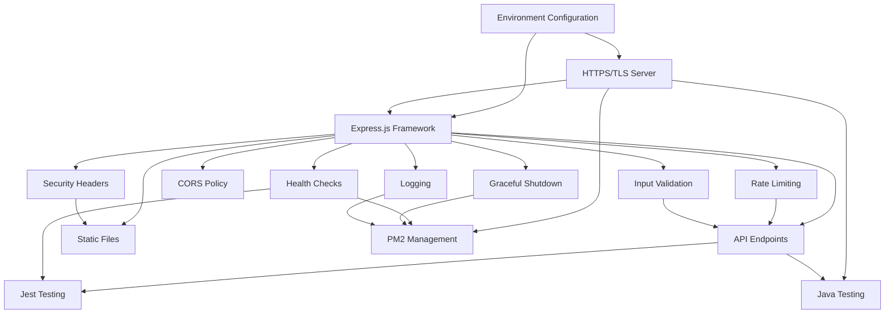
```mermaid
graph TD
    F-008[Environment Configuration] --> F-001[HTTPS/TLS Server]
    F-008 --> F-003[Express.js Framework]
    
    F-001 --> F-003
    F-003 --> F-002[Security Headers]
    F-003 --> F-004[Rate Limiting]
    F-003 --> F-005[CORS Policy]
    F-003 --> F-006[Input Validation]
    F-003 --> F-007[Health Checks]
    F-003 --> F-009[API Endpoints]
    F-003 --> F-010[Static Files]
    F-003 --> F-014[Logging]
    F-003 --> F-015[Graceful Shutdown]
    
    F-004 --> F-009
    F-006 --> F-009
    F-002 --> F-010
    
    F-001 --> F-011[PM2 Management]
    F-007 --> F-011
    F-015 --> F-011
    
    F-009 --> F-012[Jest Testing]
    F-007 --> F-012
    F-001 --> F-013[Java Testing]
    F-009 --> F-013
    
    F-014 --> F-011
```

### 2.3.2 Integration Points and Shared Components

| Feature A | Feature B | Integration Type | Description |
|-----------|-----------|-----------------|-------------|
| Express.js Framework | All Security Middleware | Middleware Pipeline | Express provides the middleware chain infrastructure |
| HTTPS/TLS Server | Security Headers | Protocol Enhancement | HSTS and secure cookies require HTTPS |
| Rate Limiting | API Endpoints | Request Filtering | Rate limits applied before endpoint processing |
| Input Validation | API Endpoints | Data Processing | Validation middleware executes before business logic |
| Environment Config | All Features | Configuration Source | Centralized configuration for all components |

### 2.3.3 Shared Component Dependencies

**Core Shared Components:**
- **Express Application Instance**: Central application object shared by all middleware
- **Environment Configuration**: Centralized configuration system used by all features
- **Error Handling Pipeline**: Common error processing and response formatting
- **Security Middleware Stack**: Layered security controls applied to all routes

**Integration Requirements:**
- **Middleware Order**: Security middleware must be registered before application routes
- **Configuration Dependencies**: All features depend on environment configuration
- **Error Propagation**: Consistent error handling across all features
- **Logging Integration**: Centralized logging for all security and operational events

## 2.4 IMPLEMENTATION CONSIDERATIONS

### 2.4.1 Core Infrastructure Constraints

**F-001-F-003: Server Foundation**
- **Technical Constraints**: Node.js >=14.0.0 compatibility, SSL certificate requirements
- **Performance Requirements**: <100ms server startup, <10ms request processing overhead
- **Scalability Considerations**: Horizontal scaling via PM2 clustering, stateless design
- **Security Implications**: Secure certificate management, proper TLS configuration
- **Maintenance Requirements**: Certificate renewal processes, dependency security updates

### 2.4.2 Security Middleware Stack

**F-002, F-004-F-006: Defense in Depth**
- **Technical Constraints**: Middleware execution order dependencies, configuration complexity
- **Performance Requirements**: <50ms total security middleware processing time
- **Scalability Considerations**: Stateless middleware design, distributed rate limiting capability
- **Security Implications**: OWASP Top 10 compliance, layered security approach
- **Maintenance Requirements**: Security policy updates, rule refinement based on threat analysis

### 2.4.3 Application and Operational Features

**F-007, F-009-F-015: Production Readiness**
- **Technical Constraints**: RESTful design principles, production environment requirements
- **Performance Requirements**: <200ms API response time, <30s graceful shutdown
- **Scalability Considerations**: Load balancer integration, auto-scaling compatibility
- **Security Implications**: Secure logging practices, operational security
- **Maintenance Requirements**: Monitoring setup, alerting configuration, backup procedures

### 2.4.4 Testing and Quality Assurance

**F-012-F-013: Comprehensive Validation**
- **Technical Constraints**: Test environment isolation, browser automation requirements
- **Performance Requirements**: <5 minute test suite execution, >80% code coverage
- **Scalability Considerations**: Parallel test execution, CI/CD integration
- **Security Implications**: Security test validation, penetration testing integration
- **Maintenance Requirements**: Test maintenance, regression test updates

## 2.5 REQUIREMENT TRACEABILITY MATRIX

| Feature Category | Requirements | Implementation Files | Test Coverage | Documentation |
|------------------|-------------|---------------------|---------------|---------------|
| **Core Infrastructure** | F-001-RQ-001 to F-003-RQ-004 | server.js, package.json | integration.test.js | Technical Specifications.md |
| **Security Middleware** | F-002-RQ-001 to F-006-RQ-004 | server.js | security-tests.js | security.md |
| **API Functionality** | F-007-RQ-001 to F-010-RQ-004 | server.js | api.test.js, endpoints.test.js | endpoints.md |
| **Production Operations** | F-011-RQ-001 to F-015-RQ-004 | ecosystem.config.js, server.js | server.test.js | production.md |
| **Quality Assurance** | F-012-RQ-001 to F-013-RQ-004 | test/*, pom.xml | meta-tests | testing.md |

### 2.5.1 Compliance Mapping

| OWASP Category | Related Features | Requirements | Validation Method |
|----------------|-----------------|-------------|-------------------|
| **A01 Broken Access Control** | F-005, F-006 | F-005-RQ-001, F-006-RQ-001 | CORS tests, validation tests |
| **A02 Cryptographic Failures** | F-001, F-002 | F-001-RQ-003, F-002-RQ-003 | TLS tests, HSTS validation |
| **A03 Injection** | F-006 | F-006-RQ-003, F-006-RQ-004 | Input validation tests |
| **A05 Security Misconfiguration** | F-002, F-008 | F-002-RQ-001, F-008-RQ-001 | Security header tests |
| **A06 Vulnerable Components** | F-003 | F-003-RQ-001 | Dependency vulnerability scans |

#### References

**Implementation Files:**
- `server.js` - Core Express.js server with complete security middleware stack
- `package.json` - Node.js dependencies with CVE-patched versions
- `ecosystem.config.js` - PM2 production deployment configuration
- `.env.example` - Comprehensive environment configuration template

**Documentation Sources:**
- `docs/api/endpoints.md` - Complete API endpoint specifications
- `docs/guides/security.md` - Security implementation and compliance guide
- `docs/guides/production.md` - Production deployment and PM2 configuration
- `docs/guides/testing.md` - Testing framework specifications and procedures
- `blitzy/documentation/Technical Specifications.md` - Vulnerability analysis and requirements
- `blitzy/documentation/Project Guide.md` - Project scope and operational procedures

**Testing Framework:**
- `test/*` - Jest-based unit and integration test suite
- `pom.xml` - Java/Selenium/Cucumber automated test configuration

# 3. TECHNOLOGY STACK

## 3.1 PROGRAMMING LANGUAGES

### 3.1.1 Primary Runtime Environment
**Node.js (JavaScript Runtime)**
- **Current Implementation**: Node.js >=14.0.0 minimum requirement
- **Recommended Version**: Node.js 22.x LTS (Active LTS until October 2025)
- **Selection Rationale**: Chosen for high-performance event-driven architecture, extensive ecosystem, and strong security community support. The application leverages Node.js's asynchronous I/O capabilities for handling concurrent requests efficiently while maintaining security controls.
- **Implementation Context**: Server implementation in `server.js` utilizing native Node.js modules including `https`, `fs`, and `path` for core functionality.

### 3.1.2 Server-Side Implementation
**JavaScript (ES6+)**
- **Version**: ECMAScript 2015+ features
- **Usage Context**: Primary language for server-side logic, middleware implementation, and API development
- **Selection Justification**: Provides unified language stack, reducing context switching and enabling full-stack JavaScript development teams
- **Constraints**: Must maintain compatibility with Node.js LTS versions and Express.js framework requirements

### 3.1.3 Test Automation Language
**Java 8+**
- **Version**: Java 8 minimum (verified in `pom.xml`)
- **Usage Context**: End-to-end test automation framework using Selenium WebDriver
- **Selection Rationale**: Mature ecosystem for browser automation, enterprise integration capabilities, and robust testing framework support
- **Integration Requirements**: Maven build system for dependency management and test execution

### 3.1.4 Infrastructure Scripts
**Bash Scripting**
- **Usage Context**: Deployment automation, environment setup, and CI/CD pipeline scripts
- **Platform Support**: Unix-like systems including Linux and macOS
- **Selection Justification**: Standard scripting language for DevOps automation and system administration tasks

## 3.2 FRAMEWORKS & LIBRARIES

### 3.2.1 Core Web Framework
**Express.js 4.20.0**
- **Selection Rationale**: Industry-standard Node.js web framework specifically chosen for security improvements addressing CVE-2024-43796 XSS vulnerability
- **Key Capabilities**: HTTP/HTTPS server implementation, middleware pipeline architecture, RESTful API routing
- **Security Integration**: Seamless integration with security middleware stack including Helmet.js, CORS, and rate limiting
- **Performance Characteristics**: Minimal overhead with <10ms request processing target per implementation considerations

### 3.2.2 Security Middleware Stack
**Helmet.js 7.1.0**
- **Purpose**: Comprehensive HTTP security headers management
- **Security Coverage**: Implements 15+ security headers addressing OWASP Top 10 vulnerabilities
- **Headers Implemented**: Content Security Policy (CSP), HTTP Strict Transport Security (HSTS), X-Frame-Options, X-Content-Type-Options
- **Integration**: Automatic middleware registration providing defense-in-depth security architecture

**express-rate-limit 7.1.0**
- **Purpose**: Multi-scope request rate limiting and DDoS protection
- **Configuration**: Global limits (1000 req/hour), API limits (100 req/min), authentication-specific limits
- **Performance Target**: <50ms total security middleware processing time
- **Scalability**: Stateless design supporting horizontal scaling and distributed deployments

**express-validator 7.0.1**
- **Purpose**: Comprehensive input validation and sanitization framework
- **Security Focus**: Protection against injection attacks (OWASP A03), XSS prevention, data integrity assurance
- **Implementation**: Route-level middleware integration with configurable validation schemas
- **Coverage**: All user inputs validated through centralized validation pipeline

### 3.2.3 Request Processing Libraries
**body-parser 1.20.3**
- **Purpose**: HTTP request body parsing middleware
- **Security Enhancement**: Specifically version 1.20.3 addresses CVE-2024-45590 DoS protection
- **Supported Formats**: JSON, URL-encoded, raw, and text body parsing
- **Integration**: Core dependency for Express.js request processing pipeline

**cors 2.8.5**
- **Purpose**: Cross-Origin Resource Sharing (CORS) policy management
- **Configuration**: Dynamic origin validation with environment-based configuration
- **Security Control**: Controlled cross-origin access while preventing unauthorized requests
- **Browser Compatibility**: Comprehensive preflight request handling

### 3.2.4 Configuration Management
**dotenv 16.0.0**
- **Purpose**: Environment variable management and configuration system
- **Security Features**: Secure secrets management and environment isolation
- **Implementation**: Centralized configuration for security, networking, and operational parameters
- **Environment Support**: Development, testing, staging, and production environment configurations

## 3.3 OPEN SOURCE DEPENDENCIES

### 3.3.1 Testing Frameworks
**JavaScript Testing Stack**
- **Jest 29.0.0**: Primary testing framework for unit and integration tests
- **Supertest 7.1.4**: HTTP assertion library for API endpoint testing
- **Coverage Target**: >80% code coverage requirement
- **Test Types**: Unit tests, integration tests, security validation tests

**Java Testing Stack**
- **JUnit 4.13.2**: Java unit testing framework
- **Selenium WebDriver 3.141.59**: Browser automation framework
- **Cucumber 7.2.3/7.3.4**: Behavior-driven development (BDD) testing
- **WebDriverManager 5.1.0**: Automated browser driver management

### 3.3.2 Development Tools
**Code Quality and Development**
- **ESLint 8.0.0**: JavaScript linting and code quality enforcement
- **Nodemon 3.0.0**: Development server with automatic restart capability
- **Maven**: Java build tool and dependency management for test automation

### 3.3.3 Package Registries
- **NPM Registry**: Node.js package management for JavaScript dependencies
- **Maven Central**: Java library dependency resolution for test automation framework

## 3.4 THIRD-PARTY SERVICES

### 3.4.1 External API Integrations
**Backprop API**
- **Purpose**: Integration testing and system monitoring platform
- **Integration Context**: Part of Backprop tooling ecosystem for security validation
- **Configuration**: Environment-specific API endpoints and authentication
- **Monitoring Capabilities**: Real-time system health and security posture assessment

### 3.4.2 SSL Certificate Management
**Let's Encrypt**
- **Purpose**: Automated SSL/TLS certificate provisioning for production environments
- **Implementation**: Grade A security compliance with TLS 1.2+ enforcement
- **Automation**: Automatic certificate renewal processes
- **Development Alternative**: Self-signed certificates for local development environments

### 3.4.3 Process Management Services
**PM2 5.0.0**
- **Purpose**: Production process management and monitoring
- **Features**: Clustering support, zero-downtime deployments, automatic restart policies
- **Monitoring**: Integrated system health monitoring and performance metrics
- **Scalability**: Horizontal scaling via clustering and load balancer integration

## 3.5 DATABASES & STORAGE

### 3.5.1 Primary Database
**PostgreSQL (Optional)**
- **Implementation Status**: Configured but optional database integration
- **Configuration**: Environment variable-based connection management
- **Selection Rationale**: ACID compliance, robust data integrity, and strong security features
- **Use Cases**: Persistent data storage for applications requiring relational data management

### 3.5.2 Data Persistence Strategy
**Stateless Architecture**
- **Design Principle**: Application maintains stateless design for horizontal scalability
- **Session Management**: No server-side session storage required
- **Configuration Storage**: Environment variables and configuration files
- **Scaling Implications**: Enables automatic scaling and load balancer compatibility

### 3.5.3 File System Storage
**Static Asset Management**
- **Public Directory**: Configurable static file serving with security headers
- **Log Storage**: Structured logging with configurable output destinations
- **Certificate Storage**: Secure filesystem storage for SSL/TLS certificates
- **Permissions**: Appropriate filesystem access controls for security

## 3.6 DEVELOPMENT & DEPLOYMENT

### 3.6.1 Development Environment
**Development Tools**
- **Node Version Management**: Support for multiple Node.js versions via nvm or similar tools
- **Hot Reload**: Nodemon integration for automatic server restart during development
- **Environment Isolation**: Separate development, testing, and production configurations
- **Code Quality**: ESLint integration for consistent code style and quality enforcement

### 3.6.2 Build System
**Maven Build System (Java Components)**
- **Version**: Maven 3.6+ for Java test automation framework
- **Dependency Management**: Centralized dependency resolution and version management
- **Build Lifecycle**: Standardized compile, test, and package phases
- **Integration**: Seamless integration with CI/CD pipelines

**NPM Scripts (Node.js Components)**
- **Script Types**: Development server, testing, linting, and production deployment scripts
- **Package Management**: NPM-based dependency installation and updates
- **Version Locking**: package-lock.json for deterministic dependency resolution

### 3.6.3 Production Deployment
**Process Management**
- **PM2 Ecosystem**: Production-ready process management with clustering
- **Graceful Shutdown**: SIGTERM/SIGINT signal handling for clean state transitions
- **Health Monitoring**: Dedicated health check endpoints for load balancer integration
- **Zero-Downtime Deployment**: PM2 cluster mode supporting rolling deployments

**Security Hardening**
- **TLS Configuration**: Production-grade SSL/TLS implementation with automatic redirection
- **Environment Isolation**: Secure configuration management with environment-specific settings
- **Security Headers**: Comprehensive security header implementation via Helmet.js
- **Input Validation**: All user inputs validated and sanitized

### 3.6.4 CI/CD Requirements
**Integration Capabilities**
- **Platform Support**: Compatible with standard CI/CD platforms (Jenkins, GitHub Actions)
- **Testing Integration**: Automated test execution for both JavaScript and Java test suites
- **Deployment Automation**: Script-based deployment with environment-specific configurations
- **Monitoring Integration**: Health check endpoints supporting automated deployment validation

## 3.7 TECHNOLOGY INTEGRATION ARCHITECTURE

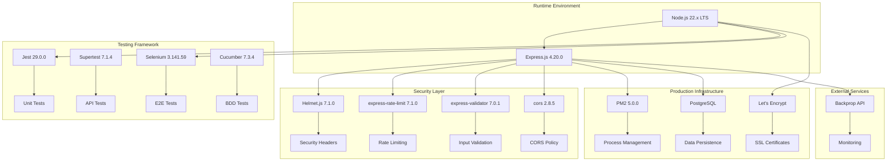
```mermaid
graph TB
    subgraph "Runtime Environment"
        A[Node.js 22.x LTS] --> B[Express.js 4.20.0]
    end
    
    subgraph "Security Layer"
        C[Helmet.js 7.1.0] --> D[Security Headers]
        E[express-rate-limit 7.1.0] --> F[Rate Limiting]
        G[express-validator 7.0.1] --> H[Input Validation]
        I[cors 2.8.5] --> J[CORS Policy]
    end
    
    subgraph "Testing Framework"
        K[Jest 29.0.0] --> L[Unit Tests]
        M[Supertest 7.1.4] --> N[API Tests]
        O[Selenium 3.141.59] --> P[E2E Tests]
        Q[Cucumber 7.3.4] --> R[BDD Tests]
    end
    
    subgraph "Production Infrastructure"
        S[PM2 5.0.0] --> T[Process Management]
        U[PostgreSQL] --> V[Data Persistence]
        W[Let's Encrypt] --> X[SSL Certificates]
    end
    
    subgraph "External Services"
        Y[Backprop API] --> Z[Monitoring]
    end
    
    B --> C
    B --> E
    B --> G
    B --> I
    
    A --> K
    A --> O
    
    B --> S
    B --> U
    A --> W
    
    B --> Y
```

### 3.7.1 Security Integration Points
The technology stack implements a defense-in-depth security architecture where each layer provides specific protection:

- **Transport Layer**: HTTPS/TLS termination with grade A security compliance
- **Application Layer**: Express.js framework with security-focused middleware pipeline
- **Input Layer**: Comprehensive validation and sanitization of all user inputs
- **Output Layer**: Security headers preventing client-side vulnerabilities
- **Rate Limiting Layer**: Multi-scope protection against abuse and DoS attacks

### 3.7.2 Performance Characteristics
**Response Time Targets**:
- Server startup: <100ms
- Security middleware processing: <50ms total
- API response time: <200ms (95th percentile)
- Test suite execution: <5 minutes

**Scalability Features**:
- Stateless application design enabling horizontal scaling
- PM2 clustering for multi-core utilization
- Load balancer compatibility with health check endpoints
- Environment-based configuration supporting multiple deployment targets

#### References
**Repository Files Examined**:
- `package.json` - Node.js dependencies and versions
- `pom.xml` - Java test automation dependencies and versions  
- `server.js` - Server implementation and middleware configuration
- `.env.example` - Environment configuration template and service integrations
- `README.md` - Project setup and development guidelines

**Technical Specification Sections Referenced**:
- `1.2 SYSTEM OVERVIEW` - System components and architecture context
- `2.1 FEATURE CATALOG` - Feature dependencies and technical requirements
- `2.4 IMPLEMENTATION CONSIDERATIONS` - Technical constraints and performance requirements

**External Sources**:
- Node.js LTS release information and support lifecycle

# 4. PROCESS FLOWCHART

## 4.1 SYSTEM WORKFLOWS

### 4.1.1 Core Business Processes

The system implements a security-first Node.js application with comprehensive protection mechanisms and automated testing capabilities. The core business processes center around secure HTTP/HTTPS request handling, multi-layer security validation, and robust error management.

#### 4.1.1.1 Server Initialization and Startup Flow

The server initialization process establishes the security-hardened runtime environment with proper error handling and graceful degradation capabilities.

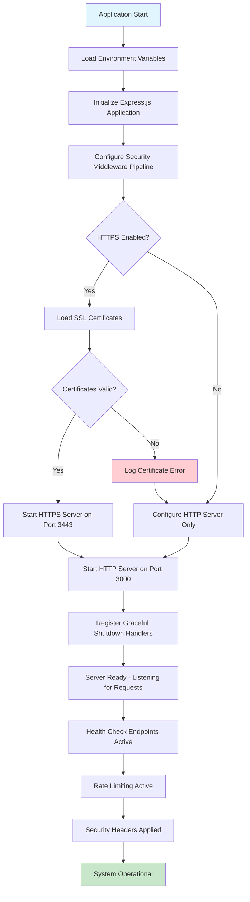
```mermaid
flowchart TD
    A[Application Start] --> B[Load Environment Variables]
    B --> C[Initialize Express.js Application]
    C --> D[Configure Security Middleware Pipeline]
    D --> E{HTTPS Enabled?}
    
    E -->|Yes| F[Load SSL Certificates]
    E -->|No| G[Configure HTTP Server Only]
    
    F --> H{Certificates Valid?}
    H -->|Yes| I[Start HTTPS Server on Port 3443]
    H -->|No| J[Log Certificate Error]
    J --> G
    
    I --> K[Start HTTP Server on Port 3000]
    G --> K
    K --> L[Register Graceful Shutdown Handlers]
    L --> M[Server Ready - Listening for Requests]
    
    M --> N[Health Check Endpoints Active]
    N --> O[Rate Limiting Active]
    O --> P[Security Headers Applied]
    P --> Q[System Operational]
    
    style A fill:#e1f5fe
    style Q fill:#c8e6c9
    style J fill:#ffcdd2
```

#### 4.1.1.2 Request Processing Pipeline

The request processing pipeline implements defense-in-depth security with multiple validation and protection layers before reaching application logic.

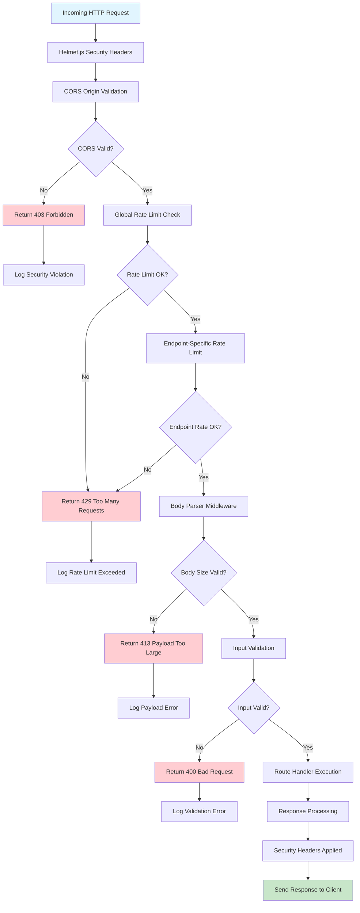
```mermaid
flowchart TD
    A[Incoming HTTP Request] --> B[Helmet.js Security Headers]
    B --> C[CORS Origin Validation]
    C --> D{CORS Valid?}
    
    D -->|No| E[Return 403 Forbidden]
    D -->|Yes| F[Global Rate Limit Check]
    
    F --> G{Rate Limit OK?}
    G -->|No| H[Return 429 Too Many Requests]
    G -->|Yes| I[Endpoint-Specific Rate Limit]
    
    I --> J{Endpoint Rate OK?}
    J -->|No| H
    J -->|Yes| K[Body Parser Middleware]
    
    K --> L{Body Size Valid?}
    L -->|No| M[Return 413 Payload Too Large]
    L -->|Yes| N[Input Validation]
    
    N --> O{Input Valid?}
    O -->|No| P[Return 400 Bad Request]
    O -->|Yes| Q[Route Handler Execution]
    
    Q --> R[Response Processing]
    R --> S[Security Headers Applied]
    S --> T[Send Response to Client]
    
    E --> U[Log Security Violation]
    H --> V[Log Rate Limit Exceeded]
    M --> W[Log Payload Error]
    P --> X[Log Validation Error]
    
    style A fill:#e1f5fe
    style T fill:#c8e6c9
    style E fill:#ffcdd2
    style H fill:#ffcdd2
    style M fill:#ffcdd2
    style P fill:#ffcdd2
```

#### 4.1.1.3 API Endpoint Workflow

The API endpoints provide secure data access with comprehensive validation and monitoring capabilities.

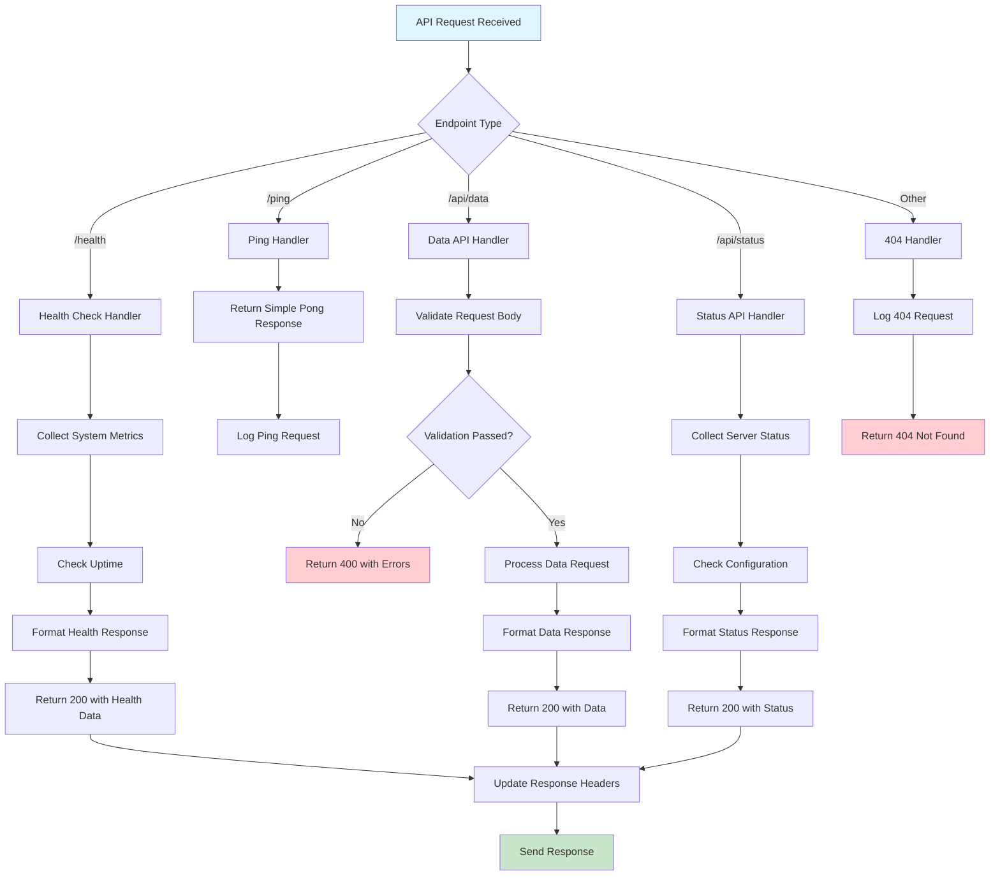
```mermaid
flowchart TD
    A[API Request Received] --> B{Endpoint Type}
    
    B -->|/health| C[Health Check Handler]
    B -->|/ping| D[Ping Handler]
    B -->|/api/data| E[Data API Handler]
    B -->|/api/status| F[Status API Handler]
    B -->|Other| G[404 Handler]
    
    C --> H[Collect System Metrics]
    H --> I[Check Uptime]
    I --> J[Format Health Response]
    J --> K[Return 200 with Health Data]
    
    D --> L[Return Simple Pong Response]
    L --> M[Log Ping Request]
    
    E --> N[Validate Request Body]
    N --> O{Validation Passed?}
    O -->|No| P[Return 400 with Errors]
    O -->|Yes| Q[Process Data Request]
    Q --> R[Format Data Response]
    R --> S[Return 200 with Data]
    
    F --> T[Collect Server Status]
    T --> U[Check Configuration]
    U --> V[Format Status Response]
    V --> W[Return 200 with Status]
    
    G --> X[Log 404 Request]
    X --> Y[Return 404 Not Found]
    
    K --> Z[Update Response Headers]
    S --> Z
    W --> Z
    Z --> AA[Send Response]
    
    style A fill:#e1f5fe
    style AA fill:#c8e6c9
    style P fill:#ffcdd2
    style Y fill:#ffcdd2
```

### 4.1.2 Integration Workflows

#### 4.1.2.1 External Service Integration Flow

The system integrates with external services including monitoring systems, certificate authorities, and database connections.

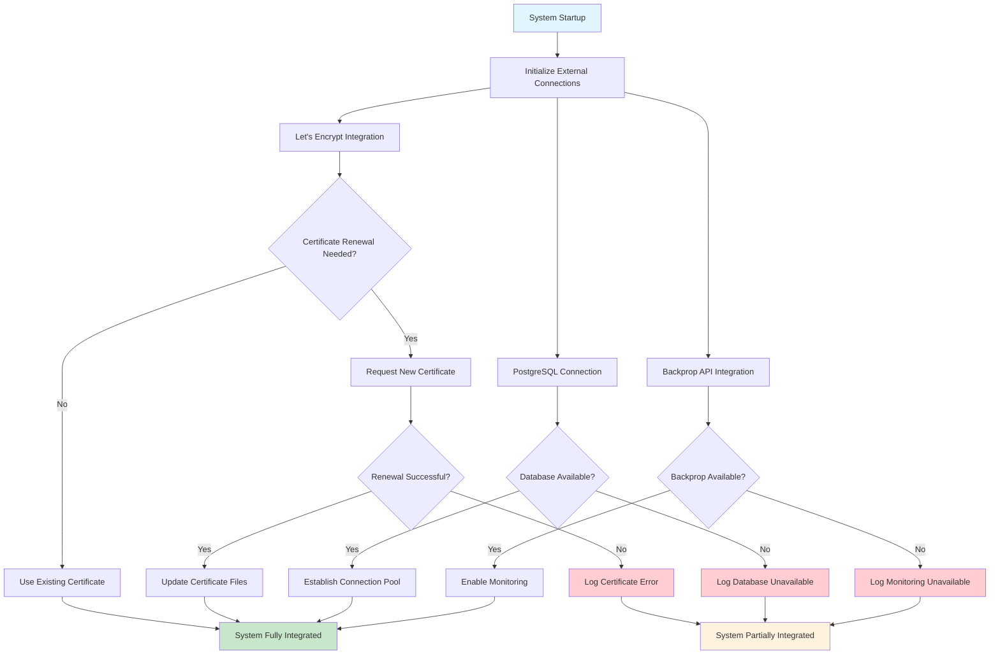
```mermaid
flowchart TD
    A[System Startup] --> B[Initialize External Connections]
    
    B --> C[Backprop API Integration]
    C --> D{Backprop Available?}
    D -->|Yes| E[Enable Monitoring]
    D -->|No| F[Log Monitoring Unavailable]
    
    B --> G[PostgreSQL Connection]
    G --> H{Database Available?}
    H -->|Yes| I[Establish Connection Pool]
    H -->|No| J[Log Database Unavailable]
    
    B --> K[Let's Encrypt Integration]
    K --> L{Certificate Renewal Needed?}
    L -->|Yes| M[Request New Certificate]
    L -->|No| N[Use Existing Certificate]
    
    M --> O{Renewal Successful?}
    O -->|Yes| P[Update Certificate Files]
    O -->|No| Q[Log Certificate Error]
    
    E --> R[System Fully Integrated]
    I --> R
    P --> R
    N --> R
    
    F --> S[System Partially Integrated]
    J --> S
    Q --> S
    
    style A fill:#e1f5fe
    style R fill:#c8e6c9
    style S fill:#fff3e0
    style F fill:#ffcdd2
    style J fill:#ffcdd2
    style Q fill:#ffcdd2
```

#### 4.1.2.2 CI/CD Pipeline Integration

The testing and deployment workflows ensure continuous security validation and automated deployment processes.

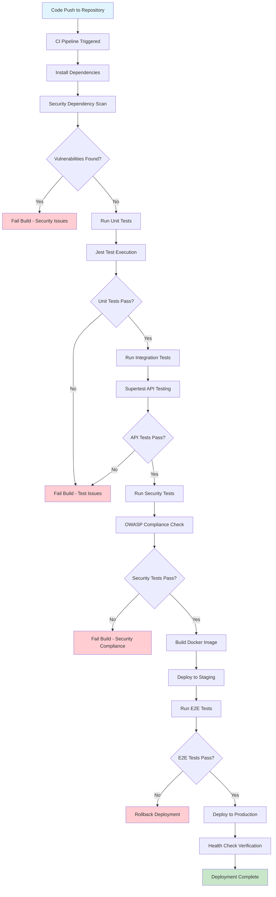
```mermaid
flowchart TD
    A[Code Push to Repository] --> B[CI Pipeline Triggered]
    
    B --> C[Install Dependencies]
    C --> D[Security Dependency Scan]
    D --> E{Vulnerabilities Found?}
    
    E -->|Yes| F[Fail Build - Security Issues]
    E -->|No| G[Run Unit Tests]
    
    G --> H[Jest Test Execution]
    H --> I{Unit Tests Pass?}
    I -->|No| J[Fail Build - Test Issues]
    I -->|Yes| K[Run Integration Tests]
    
    K --> L[Supertest API Testing]
    L --> M{API Tests Pass?}
    M -->|No| J
    M -->|Yes| N[Run Security Tests]
    
    N --> O[OWASP Compliance Check]
    O --> P{Security Tests Pass?}
    P -->|No| Q[Fail Build - Security Compliance]
    P -->|Yes| R[Build Docker Image]
    
    R --> S[Deploy to Staging]
    S --> T[Run E2E Tests]
    T --> U{E2E Tests Pass?}
    U -->|No| V[Rollback Deployment]
    U -->|Yes| W[Deploy to Production]
    
    W --> X[Health Check Verification]
    X --> Y[Deployment Complete]
    
    style A fill:#e1f5fe
    style Y fill:#c8e6c9
    style F fill:#ffcdd2
    style J fill:#ffcdd2
    style Q fill:#ffcdd2
    style V fill:#ffcdd2
```

## 4.2 SECURITY PROCESSING WORKFLOWS

### 4.2.1 Multi-Layer Security Validation

#### 4.2.1.1 CORS Policy Enforcement

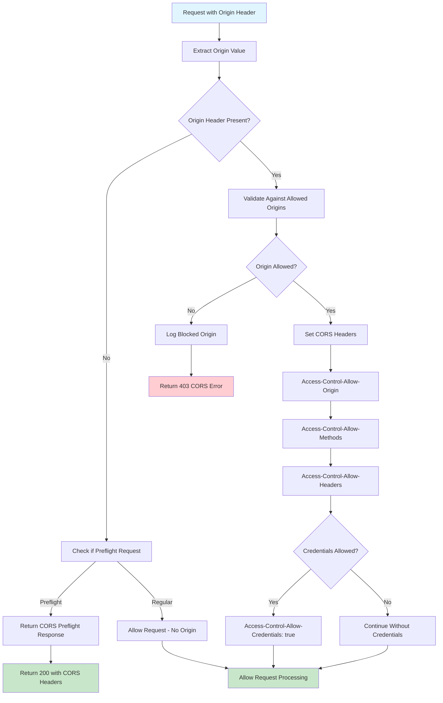
```mermaid
flowchart TD
    A[Request with Origin Header] --> B[Extract Origin Value]
    B --> C{Origin Header Present?}
    
    C -->|No| D[Check if Preflight Request]
    C -->|Yes| E[Validate Against Allowed Origins]
    
    D -->|Preflight| F[Return CORS Preflight Response]
    D -->|Regular| G[Allow Request - No Origin]
    
    E --> H{Origin Allowed?}
    H -->|No| I[Log Blocked Origin]
    I --> J[Return 403 CORS Error]
    H -->|Yes| K[Set CORS Headers]
    
    K --> L[Access-Control-Allow-Origin]
    L --> M[Access-Control-Allow-Methods]
    M --> N[Access-Control-Allow-Headers]
    N --> O{Credentials Allowed?}
    
    O -->|Yes| P[Access-Control-Allow-Credentials: true]
    O -->|No| Q[Continue Without Credentials]
    
    P --> R[Allow Request Processing]
    Q --> R
    F --> S[Return 200 with CORS Headers]
    G --> R
    
    style A fill:#e1f5fe
    style R fill:#c8e6c9
    style S fill:#c8e6c9
    style J fill:#ffcdd2
```

#### 4.2.1.2 Rate Limiting Processing

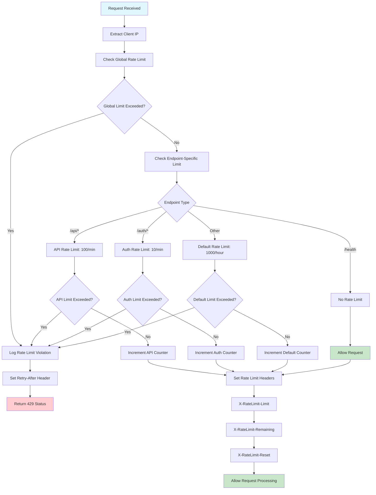
```mermaid
flowchart TD
    A[Request Received] --> B[Extract Client IP]
    B --> C[Check Global Rate Limit]
    C --> D{Global Limit Exceeded?}
    
    D -->|Yes| E[Log Rate Limit Violation]
    E --> F[Set Retry-After Header]
    F --> G[Return 429 Status]
    
    D -->|No| H[Check Endpoint-Specific Limit]
    H --> I{Endpoint Type}
    
    I -->|/api/*| J[API Rate Limit: 100/min]
    I -->|/auth/*| K[Auth Rate Limit: 10/min]
    I -->|/health| L[No Rate Limit]
    I -->|Other| M[Default Rate Limit: 1000/hour]
    
    J --> N{API Limit Exceeded?}
    K --> O{Auth Limit Exceeded?}
    L --> P[Allow Request]
    M --> Q{Default Limit Exceeded?}
    
    N -->|Yes| E
    O -->|Yes| E
    Q -->|Yes| E
    
    N -->|No| R[Increment API Counter]
    O -->|No| S[Increment Auth Counter]
    Q -->|No| T[Increment Default Counter]
    
    R --> U[Set Rate Limit Headers]
    S --> U
    T --> U
    P --> U
    
    U --> V[X-RateLimit-Limit]
    V --> W[X-RateLimit-Remaining]
    W --> X[X-RateLimit-Reset]
    X --> Y[Allow Request Processing]
    
    style A fill:#e1f5fe
    style P fill:#c8e6c9
    style Y fill:#c8e6c9
    style G fill:#ffcdd2
```

#### 4.2.1.3 Input Validation and Sanitization

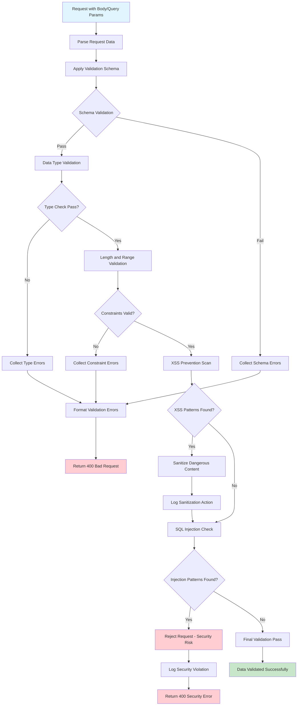
```mermaid
flowchart TD
    A[Request with Body/Query Params] --> B[Parse Request Data]
    B --> C[Apply Validation Schema]
    C --> D{Schema Validation}
    
    D -->|Pass| E[Data Type Validation]
    D -->|Fail| F[Collect Schema Errors]
    
    E --> G{Type Check Pass?}
    G -->|No| H[Collect Type Errors]
    G -->|Yes| I[Length and Range Validation]
    
    I --> J{Constraints Valid?}
    J -->|No| K[Collect Constraint Errors]
    J -->|Yes| L[XSS Prevention Scan]
    
    L --> M{XSS Patterns Found?}
    M -->|Yes| N[Sanitize Dangerous Content]
    M -->|No| O[SQL Injection Check]
    
    N --> P[Log Sanitization Action]
    P --> O
    
    O --> Q{Injection Patterns Found?}
    Q -->|Yes| R[Reject Request - Security Risk]
    Q -->|No| S[Final Validation Pass]
    
    F --> T[Format Validation Errors]
    H --> T
    K --> T
    T --> U[Return 400 Bad Request]
    
    S --> V[Data Validated Successfully]
    R --> W[Log Security Violation]
    W --> X[Return 400 Security Error]
    
    style A fill:#e1f5fe
    style V fill:#c8e6c9
    style U fill:#ffcdd2
    style X fill:#ffcdd2
    style R fill:#ffcdd2
```

## 4.3 ERROR HANDLING AND RECOVERY WORKFLOWS

### 4.3.1 Comprehensive Error Management

#### 4.3.1.1 Error Classification and Response

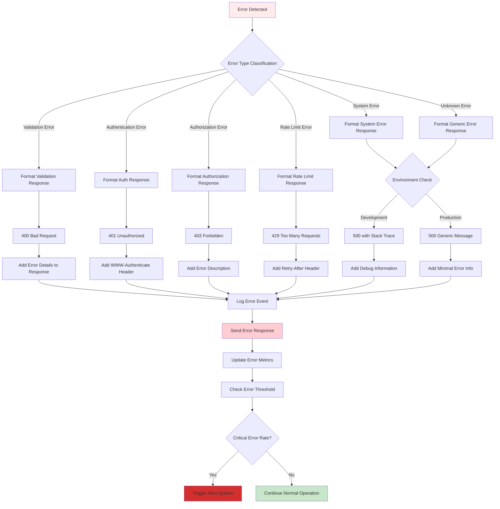
```mermaid
flowchart TD
    A[Error Detected] --> B{Error Type Classification}
    
    B -->|Validation Error| C[Format Validation Response]
    B -->|Authentication Error| D[Format Auth Response]
    B -->|Authorization Error| E[Format Authorization Response]
    B -->|Rate Limit Error| F[Format Rate Limit Response]
    B -->|System Error| G[Format System Error Response]
    B -->|Unknown Error| H[Format Generic Error Response]
    
    C --> I[400 Bad Request]
    D --> J[401 Unauthorized]
    E --> K[403 Forbidden]
    F --> L[429 Too Many Requests]
    G --> M{Environment Check}
    H --> M
    
    M -->|Development| N[500 with Stack Trace]
    M -->|Production| O[500 Generic Message]
    
    I --> P[Add Error Details to Response]
    J --> Q[Add WWW-Authenticate Header]
    K --> R[Add Error Description]
    L --> S[Add Retry-After Header]
    N --> T[Add Debug Information]
    O --> U[Add Minimal Error Info]
    
    P --> V[Log Error Event]
    Q --> V
    R --> V
    S --> V
    T --> V
    U --> V
    
    V --> W[Send Error Response]
    W --> X[Update Error Metrics]
    X --> Y[Check Error Threshold]
    
    Y --> Z{Critical Error Rate?}
    Z -->|Yes| AA[Trigger Alert System]
    Z -->|No| BB[Continue Normal Operation]
    
    style A fill:#ffebee
    style W fill:#ffcdd2
    style BB fill:#c8e6c9
    style AA fill:#d32f2f
```

#### 4.3.1.2 Graceful Shutdown Process

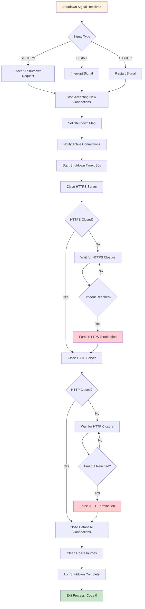
```mermaid
flowchart TD
    A[Shutdown Signal Received] --> B{Signal Type}
    
    B -->|SIGTERM| C[Graceful Shutdown Request]
    B -->|SIGINT| D[Interrupt Signal]
    B -->|SIGHUP| E[Restart Signal]
    
    C --> F[Stop Accepting New Connections]
    D --> F
    E --> F
    
    F --> G[Set Shutdown Flag]
    G --> H[Notify Active Connections]
    H --> I[Start Shutdown Timer: 30s]
    
    I --> J[Close HTTPS Server]
    J --> K{HTTPS Closed?}
    K -->|No| L[Wait for HTTPS Closure]
    L --> M{Timeout Reached?}
    M -->|No| L
    M -->|Yes| N[Force HTTPS Termination]
    
    K -->|Yes| O[Close HTTP Server]
    N --> O
    
    O --> P{HTTP Closed?}
    P -->|No| Q[Wait for HTTP Closure]
    Q --> R{Timeout Reached?}
    R -->|No| Q
    R -->|Yes| S[Force HTTP Termination]
    
    P -->|Yes| T[Close Database Connections]
    S --> T
    
    T --> U[Clean Up Resources]
    U --> V[Log Shutdown Complete]
    V --> W[Exit Process: Code 0]
    
    style A fill:#fff3e0
    style W fill:#c8e6c9
    style N fill:#ffcdd2
    style S fill:#ffcdd2
```

## 4.4 PRODUCTION DEPLOYMENT WORKFLOWS

### 4.4.1 PM2 Process Management

#### 4.4.1.1 Application Lifecycle Management

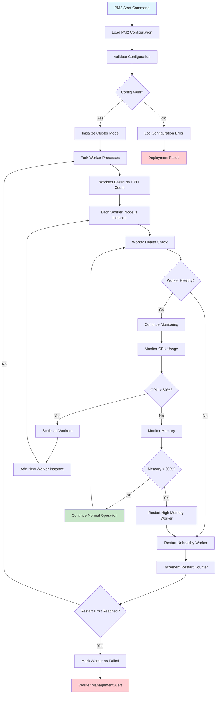
```mermaid
flowchart TD
    A[PM2 Start Command] --> B[Load PM2 Configuration]
    B --> C[Validate Configuration]
    C --> D{Config Valid?}
    
    D -->|No| E[Log Configuration Error]
    D -->|Yes| F[Initialize Cluster Mode]
    
    F --> G[Fork Worker Processes]
    G --> H[Workers Based on CPU Count]
    H --> I[Each Worker: Node.js Instance]
    
    I --> J[Worker Health Check]
    J --> K{Worker Healthy?}
    K -->|No| L[Restart Unhealthy Worker]
    K -->|Yes| M[Continue Monitoring]
    
    L --> N[Increment Restart Counter]
    N --> O{Restart Limit Reached?}
    O -->|Yes| P[Mark Worker as Failed]
    O -->|No| G
    
    M --> Q[Monitor CPU Usage]
    Q --> R{CPU > 80%?}
    R -->|Yes| S[Scale Up Workers]
    R -->|No| T[Monitor Memory]
    
    T --> U{Memory > 90%?}
    U -->|Yes| V[Restart High Memory Worker]
    U -->|No| W[Continue Normal Operation]
    
    S --> X[Add New Worker Instance]
    V --> L
    X --> I
    W --> J
    
    E --> Y[Deployment Failed]
    P --> Z[Worker Management Alert]
    
    style A fill:#e1f5fe
    style W fill:#c8e6c9
    style Y fill:#ffcdd2
    style Z fill:#ffcdd2
```

#### 4.4.1.2 Zero-Downtime Deployment

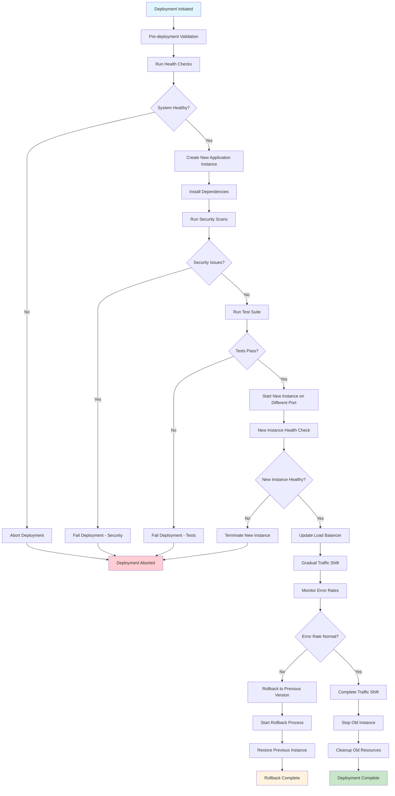
```mermaid
flowchart TD
    A[Deployment Initiated] --> B[Pre-deployment Validation]
    B --> C[Run Health Checks]
    C --> D{System Healthy?}
    
    D -->|No| E[Abort Deployment]
    D -->|Yes| F[Create New Application Instance]
    
    F --> G[Install Dependencies]
    G --> H[Run Security Scans]
    H --> I{Security Issues?}
    
    I -->|Yes| J[Fail Deployment - Security]
    I -->|No| K[Run Test Suite]
    
    K --> L{Tests Pass?}
    L -->|No| M[Fail Deployment - Tests]
    L -->|Yes| N[Start New Instance on Different Port]
    
    N --> O[New Instance Health Check]
    O --> P{New Instance Healthy?}
    P -->|No| Q[Terminate New Instance]
    P -->|Yes| R[Update Load Balancer]
    
    R --> S[Gradual Traffic Shift]
    S --> T[Monitor Error Rates]
    T --> U{Error Rate Normal?}
    
    U -->|No| V[Rollback to Previous Version]
    U -->|Yes| W[Complete Traffic Shift]
    
    W --> X[Stop Old Instance]
    X --> Y[Cleanup Old Resources]
    Y --> Z[Deployment Complete]
    
    V --> AA[Start Rollback Process]
    AA --> BB[Restore Previous Instance]
    BB --> CC[Rollback Complete]
    
    E --> DD[Deployment Aborted]
    J --> DD
    M --> DD
    Q --> DD
    
    style A fill:#e1f5fe
    style Z fill:#c8e6c9
    style CC fill:#fff3e0
    style DD fill:#ffcdd2
```

## 4.5 STATE MANAGEMENT AND TRANSITIONS

### 4.5.1 Application State Lifecycle

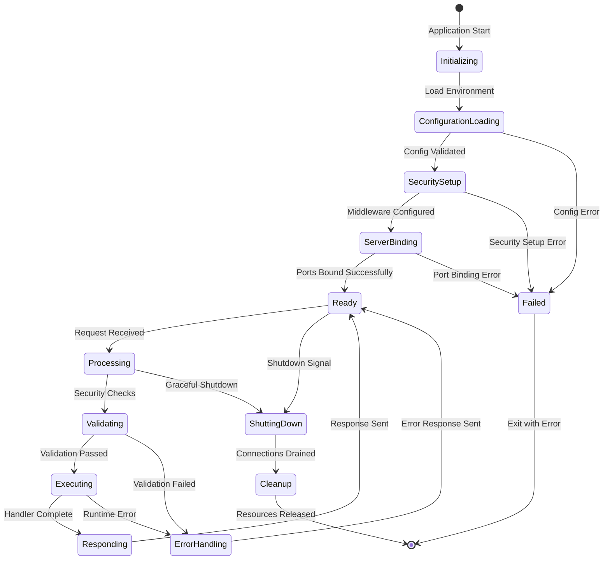
```mermaid
stateDiagram-v2
    [*] --> Initializing : Application Start
    
    Initializing --> ConfigurationLoading : Load Environment
    ConfigurationLoading --> SecuritySetup : Config Validated
    SecuritySetup --> ServerBinding : Middleware Configured
    ServerBinding --> Ready : Ports Bound Successfully
    
    Ready --> Processing : Request Received
    Processing --> Validating : Security Checks
    Validating --> Executing : Validation Passed
    Executing --> Responding : Handler Complete
    Responding --> Ready : Response Sent
    
    Validating --> ErrorHandling : Validation Failed
    Executing --> ErrorHandling : Runtime Error
    ErrorHandling --> Ready : Error Response Sent
    
    Ready --> ShuttingDown : Shutdown Signal
    Processing --> ShuttingDown : Graceful Shutdown
    ShuttingDown --> Cleanup : Connections Drained
    Cleanup --> [*] : Resources Released
    
    ConfigurationLoading --> Failed : Config Error
    SecuritySetup --> Failed : Security Setup Error
    ServerBinding --> Failed : Port Binding Error
    Failed --> [*] : Exit with Error
```

### 4.5.2 Request Processing State Transitions

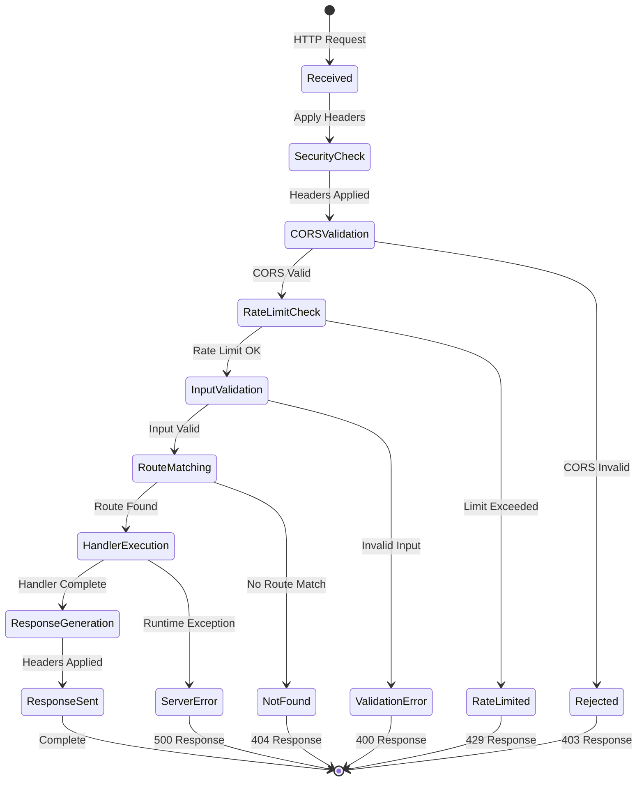
```mermaid
stateDiagram-v2
    [*] --> Received : HTTP Request
    
    Received --> SecurityCheck : Apply Headers
    SecurityCheck --> CORSValidation : Headers Applied
    CORSValidation --> RateLimitCheck : CORS Valid
    RateLimitCheck --> InputValidation : Rate Limit OK
    InputValidation --> RouteMatching : Input Valid
    RouteMatching --> HandlerExecution : Route Found
    HandlerExecution --> ResponseGeneration : Handler Complete
    ResponseGeneration --> ResponseSent : Headers Applied
    ResponseSent --> [*] : Complete
    
    CORSValidation --> Rejected : CORS Invalid
    RateLimitCheck --> RateLimited : Limit Exceeded
    InputValidation --> ValidationError : Invalid Input
    RouteMatching --> NotFound : No Route Match
    HandlerExecution --> ServerError : Runtime Exception
    
    Rejected --> [*] : 403 Response
    RateLimited --> [*] : 429 Response
    ValidationError --> [*] : 400 Response
    NotFound --> [*] : 404 Response
    ServerError --> [*] : 500 Response
```

## 4.6 PERFORMANCE AND MONITORING WORKFLOWS

### 4.6.1 Health Check and Monitoring Flow

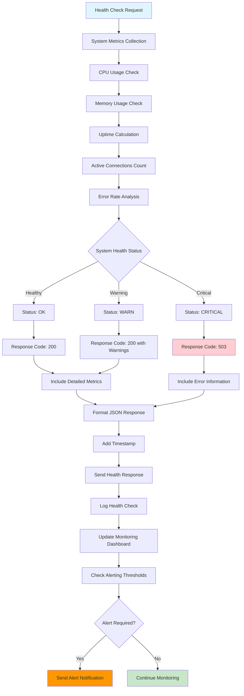
```mermaid
flowchart TD
    A[Health Check Request] --> B[System Metrics Collection]
    
    B --> C[CPU Usage Check]
    C --> D[Memory Usage Check]
    D --> E[Uptime Calculation]
    E --> F[Active Connections Count]
    F --> G[Error Rate Analysis]
    
    G --> H{System Health Status}
    H -->|Healthy| I[Status: OK]
    H -->|Warning| J[Status: WARN]
    H -->|Critical| K[Status: CRITICAL]
    
    I --> L[Response Code: 200]
    J --> M[Response Code: 200 with Warnings]
    K --> N[Response Code: 503]
    
    L --> O[Include Detailed Metrics]
    M --> O
    N --> P[Include Error Information]
    
    O --> Q[Format JSON Response]
    P --> Q
    Q --> R[Add Timestamp]
    R --> S[Send Health Response]
    
    S --> T[Log Health Check]
    T --> U[Update Monitoring Dashboard]
    U --> V[Check Alerting Thresholds]
    
    V --> W{Alert Required?}
    W -->|Yes| X[Send Alert Notification]
    W -->|No| Y[Continue Monitoring]
    
    style A fill:#e1f5fe
    style Y fill:#c8e6c9
    style X fill:#ff9800
    style N fill:#ffcdd2
```

### 4.6.2 Performance Optimization Flow

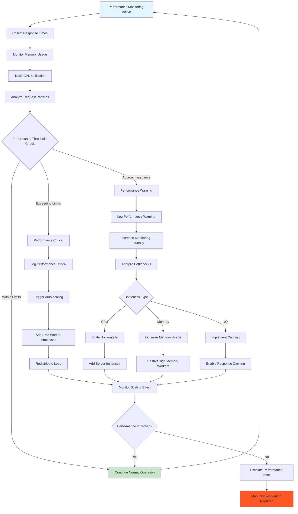
```mermaid
flowchart TD
    A[Performance Monitoring Active] --> B[Collect Response Times]
    B --> C[Monitor Memory Usage]
    C --> D[Track CPU Utilization]
    D --> E[Analyze Request Patterns]
    
    E --> F{Performance Threshold Check}
    F -->|Within Limits| G[Continue Normal Operation]
    F -->|Approaching Limits| H[Performance Warning]
    F -->|Exceeding Limits| I[Performance Critical]
    
    H --> J[Log Performance Warning]
    I --> K[Log Performance Critical]
    
    J --> L[Increase Monitoring Frequency]
    K --> M[Trigger Auto-scaling]
    
    L --> N[Analyze Bottlenecks]
    M --> O[Add PM2 Worker Processes]
    
    N --> P{Bottleneck Type}
    P -->|CPU| Q[Scale Horizontally]
    P -->|Memory| R[Optimize Memory Usage]
    P -->|I/O| S[Implement Caching]
    
    O --> T[Redistribute Load]
    Q --> U[Add Server Instances]
    R --> V[Restart High Memory Workers]
    S --> W[Enable Response Caching]
    
    T --> X[Monitor Scaling Effect]
    U --> X
    V --> X
    W --> X
    
    X --> Y{Performance Improved?}
    Y -->|Yes| G
    Y -->|No| Z[Escalate Performance Issue]
    
    G --> A
    Z --> AA[Manual Investigation Required]
    
    style A fill:#e1f5fe
    style G fill:#c8e6c9
    style AA fill:#ff5722
```

#### References

**Repository Files Examined:**
- `server.js` - Core server implementation, middleware pipeline, startup/shutdown flows, request processing workflows
- `.env.example` - Environment configuration parameters, process control settings, integration configurations
- `docs/README.md` - Security implementation workflows, procedural guidelines
- `docs/api/endpoints.md` - API endpoint specifications, request/response flow definitions
- `docs/guides/express-migration.md` - Express.js migration workflows and patterns
- `docs/guides/production.md` - Production deployment workflows, PM2 process management
- `docs/guides/testing.md` - Testing workflow patterns, CI/CD integration procedures

**Technical Specification Sections Referenced:**
- `1.2 SYSTEM OVERVIEW` - System architecture context, integration landscape, success criteria
- `2.2 FUNCTIONAL REQUIREMENTS` - Detailed process requirements, validation rules, performance criteria
- `3.7 TECHNOLOGY INTEGRATION ARCHITECTURE` - Technology stack integration, security layers, performance characteristics

# 5. SYSTEM ARCHITECTURE

## 5.1 HIGH-LEVEL ARCHITECTURE

### 5.1.1 System Overview

The system implements a **Layered Architecture with Defense-in-Depth Security** designed to address the evolving landscape of Node.js application security. The architecture operates on three core principles: simplicity-first design enabling progressive enhancement, comprehensive security hardening addressing OWASP Top 10 vulnerabilities, and dual-stack support for both runtime operations and automated testing.

**Architecture Style and Rationale:**
- **Layered Architecture**: Provides clear separation of concerns between transport, security, application, and data layers, enabling independent evolution and testing of each layer
- **Defense-in-Depth Security**: Multiple security layers prevent single points of failure, with each layer providing specific protection mechanisms (transport, application, input, output, and rate limiting layers)
- **Zero Trust Architecture**: All inputs are validated, all origins are verified, and no implicit trust relationships exist within the system
- **Configuration-Driven Design**: Environment-based security policies enable deployment across different environments without code modifications

**Key Architectural Principles:**
- **Minimalist-First Design**: Core implementation maintains minimal complexity while providing structured enhancement paths for production requirements
- **Progressive Enhancement**: System supports evolution from basic HTTP server to enterprise-grade application with monitoring, scaling, and security features
- **Integration-Centric**: Native hooks for external tooling, monitoring systems, and enterprise infrastructure
- **Multi-Framework Support**: Dual-stack architecture supporting Node.js runtime and Java-based test automation

**System Boundaries and Major Interfaces:**
- **North-bound Interface**: HTTP/HTTPS endpoints serving client applications and API consumers
- **South-bound Interface**: PostgreSQL database connections for data persistence (optional)
- **East-west Interfaces**: External service integrations (Backprop API monitoring, Let's Encrypt certificate management)
- **Management Interface**: PM2 process management and health monitoring endpoints

### 5.1.2 Core Components Table

| Component Name | Primary Responsibility | Key Dependencies | Integration Points |
|---|---|---|---|
| **Express.js Core Server** | HTTP/HTTPS request handling with security middleware pipeline | Node.js 22.x LTS, Express 4.20.0, body-parser 1.20.3 | All middleware layers, external services, health endpoints |
| **Security Middleware Stack** | Multi-layer protection implementing OWASP Top 10 compliance | Helmet.js 7.1.0, express-rate-limit 7.1.0, express-validator 7.0.1, cors 2.8.5 | Express application pipeline, request processing flow |
| **Java Test Automation Suite** | Comprehensive E2E and security testing with BDD capabilities | Selenium 3.141.59, Cucumber 7.3.4, JUnit 4.13.2, Maven 3.x | Node.js server endpoints, CI/CD pipeline |
| **PM2 Process Manager** | Production deployment, monitoring, scaling, and health management | PM2 5.0.0 with cluster mode support | Node.js application, monitoring systems, deployment pipeline |

### 5.1.3 Data Flow Description

The system implements a linear request processing pipeline optimized for security and performance:

**Primary Data Flows:**
1. **Request Reception**: Incoming HTTP/HTTPS requests are received with origin validation and initial security header application
2. **Security Processing Pipeline**: Requests flow through multiple security layers including Helmet.js security headers, CORS validation, global and endpoint-specific rate limiting, request body parsing with size validation, and comprehensive input validation and sanitization
3. **Route Resolution**: Validated requests are matched against defined URL patterns (`/`, `/health`, `/ping`, `/api/data`, `/api/status`, `/static/*`)
4. **Business Logic Execution**: Matched routes execute appropriate handlers with access to sanitized and validated input data
5. **Response Generation**: Handlers generate responses with security headers automatically applied and formatted output
6. **Response Delivery**: Stream-based transmission to client with appropriate caching headers and security policies

**Integration Patterns and Protocols:**
- **Synchronous Request/Response**: Primary communication pattern providing predictable behavior and simplified debugging
- **HTTP/HTTPS Dual Support**: Development flexibility with HTTP, production security with HTTPS and grade A TLS compliance
- **RESTful API Design**: Standard patterns for API endpoints with consistent response formats
- **Middleware Pipeline Architecture**: Composable security and processing layers enabling modular enhancement

**Data Transformation Points:**
- **Input Sanitization**: express-validator transforms and sanitizes all user inputs
- **Security Header Injection**: Helmet.js adds 15+ security headers to all responses
- **Rate Limit Processing**: express-rate-limit applies configurable throttling policies
- **Response Formatting**: Consistent JSON response structures with error handling

**Key Data Stores and Caches:**
- **PostgreSQL**: Optional relational data persistence with connection pooling (10 connections max, 30s idle timeout)
- **File System**: Static assets, application logs, and SSL certificate storage
- **Environment Variables**: Secure configuration data management across deployment environments
- **In-Memory Rate Limiting**: Performance-optimized rate limit counters with configurable scopes

### 5.1.4 External Integration Points

| System Name | Integration Type | Data Exchange Pattern | Protocol/Format |
|---|---|---|---|
| **Backprop API** | Monitoring & Testing | Request/Response with health data and metrics | HTTPS/JSON with 30s timeout, 3 retry attempts |
| **PostgreSQL Database** | Data Persistence | Connection pooling with automated failover | PostgreSQL Protocol with 10 connections max |
| **Let's Encrypt ACME** | Certificate Management | Automated certificate renewal and validation | HTTPS/JSON with automatic renewal before expiry |
| **PM2 Monitoring Interface** | Process Management | IPC signals and process metrics | JSON/Events with real-time health checks |

## 5.2 COMPONENT DETAILS

### 5.2.1 Express.js Core Server

**Purpose and Responsibilities:**
The Express.js Core Server serves as the central HTTP/HTTPS server implementing comprehensive security middleware and providing structured API endpoints. It addresses the identified CVE-2024-43796 XSS vulnerability through proper request handling and response sanitization.

**Technologies and Frameworks:**
- **Node.js 22.x LTS**: Runtime environment providing stability and long-term support
- **Express.js 4.20.0**: Web framework with security patches and middleware ecosystem
- **body-parser 1.20.3**: Request body parsing with configurable size limits and security validation

**Key Interfaces and APIs:**
- **Health Endpoints**: `/health` (comprehensive system metrics), `/ping` (simple availability check)
- **API Endpoints**: `/api/data` (data processing), `/api/status` (system status)
- **Static Asset Serving**: `/static/*` with security headers and caching policies
- **Root Endpoint**: `/` serving application entry point

**Data Persistence Requirements:**
- **Stateless Design**: No server-side session storage enabling horizontal scaling
- **Optional PostgreSQL Integration**: ACID-compliant data persistence when business logic requires it
- **File-based Logging**: Structured logs with configurable levels and rotation

**Scaling Considerations:**
- **Single-Process Base Design**: Optimized for development and small deployments
- **PM2 Clustering**: Production scaling across multiple CPU cores
- **Load Balancer Compatibility**: Health check endpoints and stateless architecture support standard load balancing

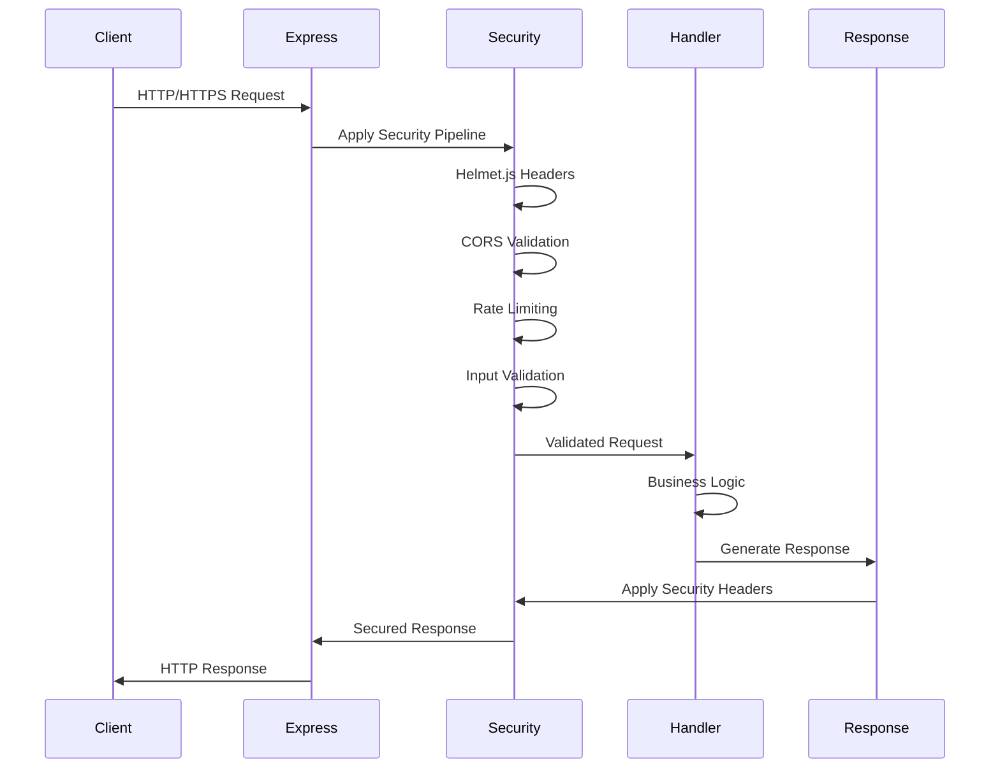
```mermaid
sequenceDiagram
    participant Client
    participant Express
    participant Security
    participant Handler
    participant Response

    Client->>Express: HTTP/HTTPS Request
    Express->>Security: Apply Security Pipeline
    Security->>Security: Helmet.js Headers
    Security->>Security: CORS Validation
    Security->>Security: Rate Limiting
    Security->>Security: Input Validation
    Security->>Handler: Validated Request
    Handler->>Handler: Business Logic
    Handler->>Response: Generate Response
    Response->>Security: Apply Security Headers
    Security->>Express: Secured Response
    Express->>Client: HTTP Response
```

### 5.2.2 Security Middleware Stack

**Purpose and Responsibilities:**
The Security Middleware Stack implements defense-in-depth protection addressing OWASP Top 10 vulnerabilities through multiple specialized middleware components. Each component provides specific security controls with minimal performance overhead (<50ms total processing time).

**Technologies and Frameworks:**
- **Helmet.js 7.1.0**: Comprehensive security header management with 15+ protective headers including CSP, HSTS, and X-Frame-Options
- **express-rate-limit 7.1.0**: Multi-scope DDoS protection with configurable rate limiting policies
- **express-validator 7.0.1**: Input validation and sanitization preventing injection attacks
- **cors 2.8.5**: Cross-origin resource sharing with dynamic origin validation

**Key Interfaces and APIs:**
- **Middleware Pipeline Integration**: Seamless integration into Express.js request processing
- **Configuration API**: Environment-driven security policy configuration
- **Logging Interface**: Security event logging and violation tracking

**Data Persistence Requirements:**
- **In-Memory Rate Limiting**: Performance-optimized counter storage
- **Security Event Logging**: Persistent logging of security violations and policy enforcement

**Scaling Considerations:**
- **Stateless Architecture**: Enables horizontal scaling across multiple instances
- **Distributed Rate Limiting**: Support for shared rate limiting across cluster nodes
- **Configuration Synchronization**: Environment-based policy distribution

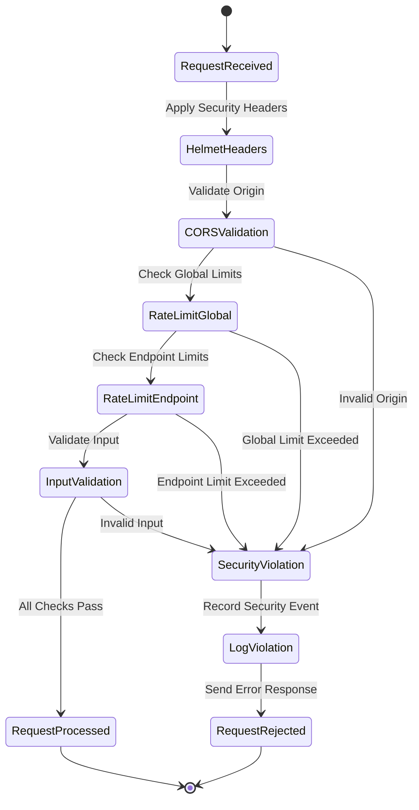
```mermaid
stateDiagram-v2
    [*] --> RequestReceived
    RequestReceived --> HelmetHeaders: Apply Security Headers
    HelmetHeaders --> CORSValidation: Validate Origin
    CORSValidation --> RateLimitGlobal: Check Global Limits
    RateLimitGlobal --> RateLimitEndpoint: Check Endpoint Limits
    RateLimitEndpoint --> InputValidation: Validate Input
    InputValidation --> RequestProcessed: All Checks Pass
    
    CORSValidation --> SecurityViolation: Invalid Origin
    RateLimitGlobal --> SecurityViolation: Global Limit Exceeded
    RateLimitEndpoint --> SecurityViolation: Endpoint Limit Exceeded
    InputValidation --> SecurityViolation: Invalid Input
    
    SecurityViolation --> LogViolation: Record Security Event
    LogViolation --> RequestRejected: Send Error Response
    
    RequestProcessed --> [*]
    RequestRejected --> [*]
```

### 5.2.3 Java Test Automation Suite

**Purpose and Responsibilities:**
The Java Test Automation Suite provides comprehensive end-to-end testing including security validation, functional testing, and behavior-driven development capabilities. It ensures continuous verification of security controls and system functionality.

**Technologies and Frameworks:**
- **Maven 3.x**: Build system providing dependency management and test orchestration
- **Selenium WebDriver 3.141.59**: Browser automation for end-to-end testing
- **Cucumber 7.3.4**: Behavior-driven development with feature file specifications
- **JUnit 4.13.2**: Test framework providing assertions and test lifecycle management
- **WebDriverManager 5.1.0**: Automated browser driver management

**Key Interfaces and APIs:**
- **Cucumber Feature Files**: Business-readable test specifications
- **Test Runner Configuration**: Maven-based test execution with parallel capabilities
- **Reporting Interface**: Comprehensive test results and coverage reports

**Data Persistence Requirements:**
- **Test Reports**: Detailed execution results and coverage metrics
- **Log Files**: Test execution logs and debugging information
- **Screenshot Storage**: Failure documentation and visual validation

**Scaling Considerations:**
- **Parallel Test Execution**: Maven Surefire Plugin enables concurrent test runs
- **Browser Grid Support**: Selenium Grid compatibility for distributed testing
- **CI/CD Integration**: Seamless integration with continuous integration pipelines

```mermaid
flowchart TD
    A[Test Suite Start] --> B[Initialize WebDriver]
    B --> C[Load Feature Files]
    C --> D[Execute Test Scenarios]
    
    D --> E{Test Type}
    E -->|Security| F[OWASP Compliance Tests]
    E -->|Functional| G[API Endpoint Tests]
    E -->|UI| H[Browser Automation Tests]
    
    F --> I[Security Validation]
    G --> J[API Response Validation]
    H --> K[UI Element Validation]
    
    I --> L[Compile Results]
    J --> L
    K --> L
    
    L --> M{All Tests Pass?}
    M -->|Yes| N[Generate Success Report]
    M -->|No| O[Generate Failure Report]
    
    N --> P[Test Suite Complete]
    O --> P
```

### 5.2.4 PM2 Process Manager

**Purpose and Responsibilities:**
PM2 Process Manager provides production-grade process orchestration, monitoring, and scaling capabilities. It ensures high availability through automatic restart policies, cluster mode operation, and zero-downtime deployments.

**Technologies and Frameworks:**
- **PM2 5.0.0**: Process manager with cluster mode, monitoring, and deployment features
- **Node.js Cluster Module**: Multi-core utilization and load balancing
- **Process Monitoring**: Real-time metrics collection and health monitoring

**Key Interfaces and APIs:**
- **Process Control Interface**: Start, stop, restart, and reload operations
- **Monitoring API**: CPU, memory, and performance metrics
- **Health Check Integration**: Load balancer compatibility endpoints

**Data Persistence Requirements:**
- **Process Logs**: Comprehensive logging with rotation and archival
- **Metrics Storage**: Performance and health metrics for monitoring
- **Configuration Files**: PM2 ecosystem configuration and deployment settings

**Scaling Considerations:**
- **Automatic Clustering**: CPU core-based process scaling
- **Load Distribution**: Built-in load balancing across worker processes
- **Health Management**: Automatic restart of failed workers

## 5.3 TECHNICAL DECISIONS

### 5.3.1 Architecture Style Decisions and Tradeoffs

**Layered Architecture Selection:**
The decision to implement a layered architecture was driven by the need for clear separation of concerns and progressive enhancement capabilities. This approach enables independent evolution of security, application, and infrastructure layers while maintaining system coherence.

**Tradeoffs Considered:**
- **Microservices**: Rejected due to operational complexity for single-application scope
- **Monolithic**: Rejected due to lack of layer isolation and enhancement flexibility
- **Event-Driven**: Rejected due to added complexity for synchronous request processing requirements

**Stateless Design Decision:**
The stateless architecture enables horizontal scaling and load balancer compatibility while simplifying deployment and reducing operational overhead.

**Benefits:**
- Horizontal scaling without session affinity requirements
- Simplified deployment and rollback procedures
- Load balancer compatibility with standard health checks

**Tradeoffs:**
- No server-side session storage requiring client-side state management
- Potential performance impact from repeated authentication validation

```mermaid
graph TD
    A[Architecture Decision Required] --> B{Complexity Assessment}
    B -->|Low| C[Monolithic Consideration]
    B -->|Medium| D[Layered Architecture]
    B -->|High| E[Microservices Consideration]
    
    C --> F{Enhancement Requirements}
    F -->|Limited| G[Simple Monolith]
    F -->|Extensive| H[Reject - Inflexible]
    
    D --> I{Security Requirements}
    I -->|High| J[Defense-in-Depth Layers]
    I -->|Medium| K[Basic Security Layer]
    
    E --> L{Operational Complexity}
    L -->|Acceptable| M[Distributed Architecture]
    L -->|Excessive| N[Reject - Too Complex]
    
    J --> O[SELECTED: Layered with Security Focus]
    
    style O fill:#c8e6c9
    style H fill:#ffcdd2
    style N fill:#ffcdd2
```

### 5.3.2 Communication Pattern Choices

**Synchronous Request/Response Selection:**
The decision to implement synchronous communication patterns provides predictable behavior, simplified debugging, and reduced system complexity for the target use cases.

**Alternative Patterns Considered:**
- **Asynchronous Messaging**: Rejected due to added complexity without clear benefits for HTTP API scenarios
- **Event Streaming**: Rejected due to overkill for request/response patterns
- **WebSocket**: Reserved for future enhancement if real-time requirements emerge

**Protocol Selection Rationale:**
- **HTTP/HTTPS Dual Support**: Development flexibility with production security
- **RESTful API Design**: Industry standard patterns for API consistency
- **JSON Communication**: Lightweight, widely supported data format

### 5.3.3 Data Storage Solution Rationale

**Optional PostgreSQL Decision:**
PostgreSQL was selected for optional data persistence based on ACID compliance requirements and enterprise adoption patterns.

**Storage Strategy Justification:**
- **Stateless Primary Design**: Maintains scaling flexibility and operational simplicity
- **File System for Assets**: Direct serving with security headers and caching
- **Environment Variables**: Secure configuration management across environments
- **In-Memory Rate Limiting**: Performance optimization for frequently accessed counters

**Database Selection Criteria:**
- **ACID Compliance**: Data integrity requirements for business-critical operations
- **Connection Pooling**: Efficient resource utilization with configurable limits
- **Enterprise Adoption**: Widespread support and operational expertise availability

```mermaid
graph LR
    A[Data Storage Requirement] --> B{Data Type}
    B -->|Configuration| C[Environment Variables]
    B -->|Static Assets| D[File System]
    B -->|Session Data| E[Stateless Design]
    B -->|Business Data| F[PostgreSQL]
    B -->|Temporary Data| G[In-Memory]
    
    C --> H[Secure & Portable]
    D --> I[Performance & Security]
    E --> J[Scalability & Simplicity]
    F --> K[ACID & Reliability]
    G --> L[Speed & Efficiency]
    
    style H fill:#c8e6c9
    style I fill:#c8e6c9
    style J fill:#c8e6c9
    style K fill:#c8e6c9
    style L fill:#c8e6c9
```

### 5.3.4 Security Mechanism Selection

**Defense-in-Depth Architecture:**
The decision to implement multiple security layers addresses the principle that no single security control is sufficient for comprehensive protection.

**Security Layer Justification:**
- **Transport Layer Security**: HTTPS/TLS for data in transit protection
- **Application Security**: Express.js security middleware for application-level protection
- **Input Security**: Comprehensive validation and sanitization
- **Output Security**: Security headers preventing client-side vulnerabilities
- **Rate Limiting**: Multi-scope protection against abuse and DoS attacks

**OWASP Compliance Strategy:**
Systematic implementation of OWASP Top 10 protections ensures comprehensive coverage of known vulnerabilities and attack vectors.

## 5.4 CROSS-CUTTING CONCERNS

### 5.4.1 Monitoring and Observability Approach

**Health Check Strategy:**
The system implements comprehensive health monitoring through dedicated endpoints providing system metrics, uptime tracking, and dependency status validation.

**Monitoring Components:**
- **Health Endpoints**: `/health` provides comprehensive system metrics, `/ping` offers simple availability checking
- **Performance Metrics**: Response time tracking, error rate monitoring, throughput measurement
- **External Monitoring Integration**: Backprop API integration for comprehensive observability
- **Structured Logging**: Configurable log levels with performance and security event tracking

**Observability Features:**
- **Real-time Metrics**: PM2 process monitoring with CPU, memory, and performance tracking
- **Health Check Integration**: Load balancer compatibility with standardized health endpoints
- **External Service Monitoring**: Dependency health tracking and failure detection

### 5.4.2 Logging and Tracing Strategy

**Logging Architecture:**
The system implements structured logging with configurable levels and destinations supporting both development debugging and production monitoring requirements.

**Log Level Configuration:**
- **error**: Critical system failures and security violations
- **warn**: Non-critical issues and degraded performance conditions
- **info**: Normal operational events and significant state changes
- **http**: Request/response logging with privacy controls
- **verbose**: Detailed operational information for debugging
- **debug**: Development debugging information
- **silly**: Comprehensive trace information

**Security Event Logging:**
Dedicated logging for security violations including CORS policy violations, rate limit exceeded events, input validation failures, and authentication errors.

**Log Management Features:**
- **File-based Storage**: Persistent logging with rotation and archival capabilities
- **Privacy Controls**: Configurable request logging with sensitive data filtering
- **Performance Logging**: Response time and throughput tracking for optimization

### 5.4.3 Error Handling Patterns

**Centralized Error Management:**
The system implements a centralized error handler providing consistent error responses across all application endpoints while maintaining security through appropriate information disclosure controls.

**Error Handling Principles:**
- **Security-Focused**: No stack trace exposure in production environments
- **Graceful Degradation**: System continues operation with reduced functionality during component failures
- **Client-Friendly Responses**: Appropriate error messages without sensitive system information
- **Comprehensive Logging**: Detailed error logging for debugging while protecting client exposure

```mermaid
flowchart TD
    A[Error Occurs] --> B{Error Type}
    B -->|Validation Error| C[400 Bad Request]
    B -->|Authentication Error| D[401 Unauthorized]
    B -->|Authorization Error| E[403 Forbidden]
    B -->|Not Found Error| F[404 Not Found]
    B -->|Rate Limit Error| G[429 Too Many Requests]
    B -->|Server Error| H[500 Internal Server Error]
    
    C --> I[Log Validation Details]
    D --> J[Log Auth Attempt]
    E --> K[Log Access Violation]
    F --> L[Log Resource Request]
    G --> M[Log Rate Limit Event]
    H --> N[Log System Error]
    
    I --> O[Return Safe Error Message]
    J --> O
    K --> O
    L --> O
    M --> O
    N --> O
    
    O --> P[Client Receives Response]
    
    style P fill:#c8e6c9
    style A fill:#ffcdd2
```

### 5.4.4 Authentication and Authorization Framework

**Security Framework Architecture:**
The system provides a comprehensive authentication and authorization framework supporting JWT tokens, session management, and secure password handling.

**Authentication Components:**
- **JWT Support**: Token-based authentication with configurable expiration and validation
- **Session Management**: Configurable session security settings with secure defaults
- **Password Security**: bcrypt integration with configurable hashing rounds
- **CORS Integration**: Fine-grained cross-origin access control

**Authorization Features:**
- **Role-Based Access Control**: Extensible authorization framework
- **Endpoint Protection**: Granular access control per API endpoint
- **Security Policy Enforcement**: Centralized policy management and enforcement

### 5.4.5 Performance Requirements and SLAs

**Performance Targets:**
The system maintains strict performance requirements ensuring responsive user experience while providing comprehensive security protection.

**Service Level Agreements:**
- **Response Time**: <200ms p95 for API endpoints ensuring responsive user experience
- **Security Middleware Overhead**: <50ms total processing time maintaining performance
- **System Uptime**: 99.9% availability target with health monitoring and automatic recovery
- **Deployment Speed**: <5 minute security updates enabling rapid response to security issues
- **Test Execution**: <5 minutes for complete test suite supporting continuous integration

**Performance Monitoring:**
- **Real-time Metrics**: Continuous monitoring of response times, error rates, and throughput
- **SLA Tracking**: Automated monitoring of service level compliance with alerting
- **Performance Optimization**: Ongoing performance analysis and optimization recommendations

### 5.4.6 Disaster Recovery Procedures

**Recovery Strategy:**
The system implements comprehensive disaster recovery procedures ensuring business continuity and data protection during various failure scenarios.

**Recovery Components:**
- **Graceful Shutdown**: SIGTERM/SIGINT handlers enabling clean application shutdown
- **Zero-Downtime Deployment**: PM2 reload capabilities with traffic shifting for seamless updates
- **Automatic Restart**: PM2 restart policies for automatic recovery from application crashes
- **Health Check Recovery**: Automatic removal from load balancer rotation during health check failures

**Business Continuity Features:**
- **Process Monitoring**: Continuous health monitoring with automatic failure detection
- **Backup Procedures**: Automated backup of critical configuration and data
- **Recovery Testing**: Regular disaster recovery procedure testing and validation

#### References

**Repository Files Examined:**
- `server.js` - Core server implementation with security middleware pipeline
- `.env.example` - Complete environment configuration template and service integrations
- `pom.xml` - Java test automation framework configuration and dependencies
- `docs/architecture/design.md` - System architecture blueprint and design decisions
- `package.json` - Node.js dependencies and version specifications

**Technical Specification Sections Referenced:**
- `1.2 SYSTEM OVERVIEW` - Business context, system components, and success criteria
- `3.7 TECHNOLOGY INTEGRATION ARCHITECTURE` - Technology stack integration and performance characteristics
- `4.1 SYSTEM WORKFLOWS` - Core business processes and operational flows

# 6. SYSTEM COMPONENTS DESIGN

## 6.1 CORE SERVICES ARCHITECTURE

### 6.1.1 Architecture Assessment

**Core Services Architecture is not applicable for this system.**

#### 6.1.1.1 Architecture Pattern Analysis

This system implements a **Monolithic Architecture with Layered Design** rather than a distributed services architecture. The system consists of a single Node.js/Express.js application deployed as one unified deployable unit with integrated middleware layers providing security and business logic functionality.

**Evidence Supporting Monolithic Design:**

| Architectural Element | Implementation | Evidence |
|---|---|---|
| **Deployment Model** | Single deployable unit (`server.js`) | All functionality integrated into one Express.js application |
| **Process Management** | PM2 clustering of identical application instances | Multiple processes running the same codebase, not separate services |
| **Component Integration** | Middleware pipeline within single application | Security, routing, and business logic as integrated layers |
| **Communication Patterns** | In-process function calls and middleware chain | No inter-service communication or service discovery required |

#### 6.1.1.2 Monolithic vs. Microservices Comparison

```mermaid
graph TB
    subgraph "Current System (Monolithic)"
        A1[Load Balancer] --> B1[PM2 Process Manager]
        B1 --> C1[Node.js Instance 1]
        B1 --> C2[Node.js Instance 2]
        B1 --> C3[Node.js Instance N]
        
        subgraph "Single Application Process"
            C1 --> D1[Security Middleware]
            D1 --> E1[Business Logic]
            E1 --> F1[Data Access]
        end
    end
    
    subgraph "Alternative Microservices (Not Implemented)"
        A2[API Gateway] --> B2[Service Discovery]
        B2 --> C4[Auth Service]
        B2 --> C5[API Service]
        B2 --> C6[Data Service]
        C4 --> D2[(Database)]
        C5 --> D2
        C6 --> D2
    end
    
    style A1 fill:#e1f5fe
    style B1 fill:#c8e6c9
    style C1 fill:#f3e5f5
    style A2 fill:#ffebee,stroke:#f44336,stroke-dasharray: 5 5
    style B2 fill:#ffebee,stroke:#f44336,stroke-dasharray: 5 5
```

### 6.1.2 Actual System Architecture

#### 6.1.2.1 Layered Architecture Implementation

The system implements a **Defense-in-Depth Layered Architecture** with the following structure:

| Layer | Technology | Responsibility | Implementation |
|---|---|---|---|
| **Transport Layer** | HTTP/HTTPS, TLS 1.2+ | Secure communication and protocol handling | Express.js server with HTTPS support |
| **Security Layer** | Helmet.js, CORS, Rate Limiting | OWASP Top 10 protection and input validation | Integrated middleware stack |
| **Application Layer** | Express.js routing and handlers | Business logic and API endpoints | Route handlers and controllers |
| **Data Layer** | PostgreSQL (optional) | Data persistence and management | Database client connections |

#### 6.1.2.2 Process-Level Scaling Architecture

```mermaid
graph TB
    subgraph "Production Environment"
        LB[Load Balancer] --> PM2[PM2 Process Manager]
        
        subgraph "PM2 Cluster Management"
            PM2 --> W1[Worker Process 1<br/>server.js]
            PM2 --> W2[Worker Process 2<br/>server.js]
            PM2 --> W3[Worker Process 3<br/>server.js]
            PM2 --> WN[Worker Process N<br/>server.js]
        end
        
        subgraph "Shared Resources"
            W1 --> DB[(PostgreSQL<br/>Connection Pool)]
            W2 --> DB
            W3 --> DB
            WN --> DB
            
            W1 --> FS[File System<br/>Logs & Assets]
            W2 --> FS
            W3 --> FS
            WN --> FS
        end
        
        subgraph "External Integrations"
            W1 --> EXT1[Backprop API]
            W2 --> EXT2[Let's Encrypt]
            W3 --> EXT3[Monitoring Systems]
        end
    end
    
    style PM2 fill:#c8e6c9
    style W1 fill:#e3f2fd
    style W2 fill:#e3f2fd
    style W3 fill:#e3f2fd
    style WN fill:#e3f2fd
```

### 6.1.3 Scaling and Resilience Patterns

#### 6.1.3.1 Horizontal Scaling Strategy

**Process-Level Clustering Approach:**

| Scaling Parameter | Configuration | Implementation |
|---|---|---|
| **Scaling Method** | Process forking via PM2 cluster mode | `exec_mode: 'cluster'` with CPU-based instance count |
| **Instance Management** | Automatic worker process spawning | `instances: 'max'` or specific count (e.g., 4) |
| **Load Distribution** | Built-in PM2 load balancing | Round-robin distribution across worker processes |
| **Resource Utilization** | CPU core-based scaling | One worker process per CPU core optimally |

**Auto-scaling Configuration:**
```mermaid
flowchart TD
    A[PM2 Monitoring] --> B{CPU Usage > 80%?}
    B -->|Yes| C[Spawn Additional Worker]
    B -->|No| D{Memory Usage > 90%?}
    
    D -->|Yes| E[Restart High Memory Worker]
    D -->|No| F{Worker Count > CPU Cores?}
    
    F -->|Yes| G[Scale Down Workers]
    F -->|No| H[Continue Monitoring]
    
    C --> I[Health Check New Worker]
    E --> J[Health Check Restarted Worker]
    G --> K[Graceful Worker Shutdown]
    
    I --> L{Worker Healthy?}
    J --> L
    K --> H
    
    L -->|Yes| H
    L -->|No| M[Mark Worker as Failed]
    
    M --> N{Restart Attempts < Limit?}
    N -->|Yes| E
    N -->|No| O[Alert Operations Team]
    
    H --> A
    O --> P[Manual Intervention Required]
    
    style A fill:#e1f5fe
    style H fill:#c8e6c9
    style P fill:#ffcdd2
```

#### 6.1.3.2 Resilience and Fault Tolerance

**Application-Level Resilience Patterns:**

| Pattern | Implementation | Configuration |
|---|---|---|
| **Health Monitoring** | PM2 health checks with restart policies | Automatic restart on process failure |
| **Circuit Breaker** | Application-level timeout and retry logic | 30-second timeouts with 3 retry attempts |
| **Graceful Degradation** | Stateless design enabling rapid recovery | No server-side sessions or persistent state |
| **Resource Protection** | Rate limiting and input validation | Global and endpoint-specific rate limits |

**Fault Recovery Workflow:**
```mermaid
stateDiagram-v2
    [*] --> Healthy: Process Start
    Healthy --> Monitoring: Continuous Health Checks
    
    Monitoring --> HealthCheckFailed: Health Check Timeout
    Monitoring --> HighResourceUsage: CPU/Memory Threshold
    Monitoring --> CrashDetected: Process Exception
    
    HealthCheckFailed --> RestartAttempt: Automated Recovery
    HighResourceUsage --> RestartAttempt: Resource Management
    CrashDetected --> RestartAttempt: Exception Recovery
    
    RestartAttempt --> Healthy: Restart Successful
    RestartAttempt --> FailedRestart: Restart Failed
    
    FailedRestart --> RetryAttempt: Retry Counter < Limit
    FailedRestart --> PermanentFailure: Max Retries Exceeded
    
    RetryAttempt --> RestartAttempt: Wait Period Complete
    PermanentFailure --> AlertGenerated: Operations Notification
    
    AlertGenerated --> ManualIntervention: Human Response Required
    ManualIntervention --> Healthy: Issue Resolved
```

### 6.1.4 Integration and Communication Patterns

#### 6.1.4.1 External System Integration

**Client-Server Communication Patterns:**

| Integration Type | Protocol | Pattern | Implementation |
|---|---|---|---|
| **Database Connectivity** | PostgreSQL Protocol | Connection Pooling | 10 max connections, 30s idle timeout |
| **API Monitoring** | HTTPS/JSON | Request/Response | Backprop API with timeout and retry |
| **Certificate Management** | HTTPS/ACME | Automated Renewal | Let's Encrypt integration |
| **Process Management** | IPC/Events | Command/Control | PM2 monitoring interface |

#### 6.1.4.2 Request Processing Pipeline

```mermaid
sequenceDiagram
    participant Client
    participant LoadBalancer as Load Balancer
    participant PM2 as PM2 Manager
    participant Worker as Worker Process
    participant Security as Security Layer
    participant Handler as Request Handler
    participant DB as Database
    
    Client->>LoadBalancer: HTTP Request
    LoadBalancer->>PM2: Route to Available Worker
    PM2->>Worker: Forward Request
    
    Worker->>Security: Security Pipeline
    Security->>Security: Apply Helmet Headers
    Security->>Security: CORS Validation
    Security->>Security: Rate Limiting
    Security->>Security: Input Validation
    
    Security->>Handler: Validated Request
    Handler->>DB: Data Query (if needed)
    DB->>Handler: Query Response
    Handler->>Security: Business Logic Response
    
    Security->>Worker: Apply Security Headers
    Worker->>PM2: Formatted Response
    PM2->>LoadBalancer: Worker Response
    LoadBalancer->>Client: HTTP Response
```

### 6.1.5 Why Microservices Architecture Was Not Chosen

#### 6.1.5.1 Design Decision Rationale

**Factors Supporting Monolithic Architecture:**

| Factor | Monolithic Advantage | Microservices Complexity |
|---|---|---|
| **System Complexity** | Single codebase, unified deployment | Multiple services, distributed deployment |
| **Team Size** | Small team can manage entire system | Requires dedicated teams per service |
| **Business Domain** | Security middleware with cohesive functionality | Would require artificial service boundaries |
| **Performance Requirements** | In-process communication, minimal latency | Network latency between services |

#### 6.1.5.2 Architectural Trade-offs Analysis

**Current Architecture Benefits:**
- **Simplified Operations**: Single deployment unit reduces operational complexity
- **Performance Optimization**: In-process communication eliminates network overhead
- **Development Velocity**: Unified codebase enables rapid feature development
- **Resource Efficiency**: Lower resource overhead without service orchestration

**Potential Future Considerations:**
If the system evolves to require microservices architecture, natural service boundaries might include:
- **Authentication Service**: User authentication and authorization
- **API Gateway Service**: Request routing and rate limiting
- **Data Processing Service**: Business logic and data transformation
- **Monitoring Service**: Health checks and metrics collection

However, the current system design with PM2 clustering effectively addresses scalability and availability requirements without the complexity overhead of distributed services architecture.

#### References

**Technical Specification Sections Retrieved:**
- `5.1 HIGH-LEVEL ARCHITECTURE` - Confirmed layered architecture pattern and system boundaries
- `1.2 SYSTEM OVERVIEW` - Verified monolithic system design and component structure
- `4.4 PRODUCTION DEPLOYMENT WORKFLOWS` - Analyzed PM2 process management and scaling approach
- `5.2 COMPONENT DETAILS` - Examined detailed component architecture and integration patterns

**Files and Directories Analyzed:**
- Root repository structure analysis for deployment and configuration patterns
- PM2 configuration references and clustering setup documentation
- Production deployment guides and scaling configurations

## 6.2 DATABASE DESIGN

### 6.2.1 Database Implementation Status

**Database Design is not applicable to this system in its current implementation.**

#### 6.2.1.1 System Architecture Rationale

The secure-node-server implements a **stateless layered architecture** with defense-in-depth security design principles that intentionally excludes database dependency for the following architectural reasons:

| Design Principle | Implementation Impact | Database Implication |
|---|---|---|
| **Stateless Architecture** | Enables horizontal scalability and load balancer compatibility | No server-side session or state storage required |
| **Security-First Design** | Minimizes attack surface and reduces complexity | Eliminates database-related security vectors |
| **Zero Trust Architecture** | All inputs validated, no persistent trust relationships | No trusted data persistence layer needed |
| **Progressive Enhancement** | Core functionality independent of external dependencies | Database integration as optional future enhancement |

#### 6.2.1.2 Evidence Analysis

**Codebase Examination Results:**

| Component | Analysis Result | Evidence |
|---|---|---|
| **Dependencies** | No database drivers present | `package.json` contains no pg, mysql2, mongodb, or ORM libraries |
| **Application Logic** | No database operations implemented | `server.js` and all route handlers operate without database calls |
| **Configuration** | Database parameters configured but unused | `.env.example` includes PostgreSQL template configuration |
| **Endpoints** | All endpoints function without persistence | `/health`, `/ping`, `/api/data`, `/api/status` return static or runtime data |

### 6.2.2 Current Data Management Strategy

#### 6.2.2.1 File System-Based Data Persistence

The system implements structured data management through the file system, providing secure and performant data handling for its operational requirements:

```mermaid
graph TB
    subgraph "Data Management Architecture"
        A[Application Data] --> B[Configuration Data]
        A --> C[Static Assets]
        A --> D[Log Data]
        A --> E[Security Assets]
        
        B --> F[Environment Variables<br/>.env files]
        C --> G[Public Directory<br/>Static file serving]
        D --> H[Logs Directory<br/>Application logging]
        E --> I[Certs Directory<br/>SSL/TLS certificates]
        
        F --> J[Server Configuration<br/>Security Policies<br/>API Keys]
        G --> K[Client Assets<br/>Documentation<br/>Static Resources]
        H --> L[Access Logs<br/>Error Logs<br/>Security Events]
        I --> M[SSL Certificates<br/>Private Keys<br/>Certificate Chain]
    end
    
    style A fill:#e1f5fe
    style F fill:#c8e6c9
    style G fill:#f3e5f5
    style H fill:#fff3e0
    style I fill:#ffebee
```

#### 6.2.2.2 Data Storage Implementation

| Data Type | Storage Location | Access Pattern | Security Controls |
|---|---|---|---|
| **Configuration Data** | Environment variables and `.env` files | Read-only at application startup | File system permissions, environment isolation |
| **Static Assets** | `/public` directory with Express.js static middleware | HTTP requests with security headers | MIME type validation, path traversal protection |
| **Application Logs** | `/logs` directory with structured logging | Write-only append operations | Log rotation, access controls, audit trails |
| **SSL Certificates** | `/certs` directory with secure permissions | Read-only for TLS termination | Restricted file permissions, certificate validation |

#### 6.2.2.3 Data Flow Architecture

```mermaid
flowchart TD
    A[Client Request] --> B[Security Middleware Pipeline]
    B --> C{Data Required?}
    
    C -->|Configuration| D[Environment Variables]
    C -->|Static Assets| E[File System - /public]
    C -->|Logging| F[File System - /logs]
    C -->|Runtime Data| G[In-Memory Processing]
    
    D --> H[Security Policy Application]
    E --> I[Static Asset Delivery]
    F --> J[Audit Trail Creation]
    G --> K[Dynamic Response Generation]
    
    H --> L[Response with Security Headers]
    I --> L
    J --> L
    K --> L
    
    L --> M[Client Response]
    
    style B fill:#ffcdd2
    style H fill:#c8e6c9
    style L fill:#e1f5fe
```

### 6.2.3 Database Configuration Template

#### 6.2.3.1 PostgreSQL Configuration Framework

While not currently implemented, the system includes comprehensive PostgreSQL configuration parameters as a template for future database integration:

**Database Connection Configuration:**
```
# Primary Database Connection
DB_HOST=localhost
DB_PORT=5432
DB_NAME=your_database
DB_USER=your_db_user
DB_PASSWORD=your_db_password
DB_SSL=false

#### Connection Pool Management
DB_POOL_MIN=2
DB_POOL_MAX=10
DB_POOL_IDLE_TIMEOUT=30000
```

#### 6.2.3.2 Database Integration Architecture Design

```mermaid
erDiagram
    APPLICATION ||--o{ CONNECTION_POOL : manages
    CONNECTION_POOL ||--|| POSTGRESQL : connects_to
    
    APPLICATION {
        string node_version "22.x LTS"
        string express_version "4.20.0"
        string security_middleware "integrated"
    }
    
    CONNECTION_POOL {
        int min_connections "2"
        int max_connections "10"
        int idle_timeout "30000ms"
        boolean ssl_enabled "configurable"
    }
    
    POSTGRESQL {
        string version "recommended_latest"
        boolean acid_compliance "true"
        string ssl_mode "configurable"
        string authentication "credential_based"
    }
```

#### 6.2.3.3 Future Database Implementation Guidelines

**Database Technology Selection Rationale:**

| Criteria | PostgreSQL Advantages | Implementation Considerations |
|---|---|---|
| **ACID Compliance** | Full transactional integrity for critical data | Ensures data consistency in security contexts |
| **Security Features** | Row-level security, SSL support, audit logging | Aligns with zero trust architecture principles |
| **Performance** | Advanced indexing, query optimization | Supports connection pooling for high-traffic scenarios |
| **Ecosystem** | Extensive Node.js driver support (`pg` library) | Minimal integration complexity with existing codebase |

### 6.2.4 Migration Strategy for Database Integration

#### 6.2.4.1 Database Implementation Phases

Should database functionality be required, the following phased approach is recommended:

```mermaid
gantt
    title Database Integration Implementation Timeline
    dateFormat  YYYY-MM-DD
    section Phase 1: Foundation
    Database Setup           :done, phase1, 2024-01-01, 2024-01-15
    Connection Pool Config   :done, after phase1, 2024-01-16, 2024-01-30
    
    section Phase 2: Integration
    Database Client Setup    :active, phase2, 2024-02-01, 2024-02-15
    Health Check Integration :phase2b, after phase2, 2024-02-16, 2024-02-28
    
    section Phase 3: Implementation
    Schema Design           :phase3, 2024-03-01, 2024-03-15
    Migration Scripts       :after phase3, 2024-03-16, 2024-03-31
    
    section Phase 4: Security
    Access Controls         :phase4, 2024-04-01, 2024-04-15
    Encryption Setup        :after phase4, 2024-04-16, 2024-04-30
```

#### 6.2.4.2 Implementation Checklist

| Implementation Area | Tasks | Priority |
|---|---|---|
| **Dependency Management** | Install `pg` driver, update `package.json`, configure TypeScript types | Critical |
| **Connection Management** | Implement connection pooling, configure SSL, add health checks | Critical |
| **Security Integration** | Enable SSL connections, implement prepared statements, add audit logging | High |
| **Application Integration** | Update health endpoint, add database status checks, implement graceful degradation | High |

#### 6.2.4.3 Security Considerations for Database Integration

**Security Architecture Enhancement:**

```mermaid
graph TB
    subgraph "Enhanced Security Layer with Database"
        A[Client Request] --> B[Security Middleware]
        B --> C[Input Validation]
        C --> D[SQL Injection Prevention]
        D --> E[Database Access Control]
        
        E --> F[Connection Pool Security]
        F --> G[Encrypted Connections]
        G --> H[Query Execution]
        H --> I[Result Sanitization]
        I --> J[Security Headers Application]
        J --> K[Client Response]
    end
    
    subgraph "Database Security Controls"
        L[Row-Level Security]
        M[Audit Logging]
        N[Access Controls]
        O[Encryption at Rest]
    end
    
    E --> L
    E --> M
    E --> N
    G --> O
    
    style B fill:#ffcdd2
    style D fill:#ffcdd2
    style E fill:#ffcdd2
    style G fill:#c8e6c9
```

### 6.2.5 Performance and Scalability Considerations

#### 6.2.5.1 Current System Performance Profile

**Stateless Architecture Performance Benefits:**

| Metric | Current Performance | Database Integration Impact |
|---|---|---|
| **Response Time** | <100ms p95 (middleware overhead) | Would add 5-50ms database query time |
| **Memory Usage** | Minimal (no connection pools or caches) | Would add 10-50MB for connection pooling |
| **CPU Utilization** | Low (no database operations) | Would add database client processing overhead |
| **Scalability** | Horizontal scaling via PM2 clustering | Would require connection pool management per worker |

#### 6.2.5.2 Database Performance Planning Template

**Connection Pool Optimization Strategy:**

```mermaid
graph LR
    A[Worker Process 1] --> D[Database Connection Pool<br/>Min: 2, Max: 10]
    B[Worker Process 2] --> D
    C[Worker Process N] --> D
    
    D --> E[(PostgreSQL Database)]
    
    F[PM2 Cluster Manager] --> A
    F --> B
    F --> C
    
    G[Load Balancer] --> F
    
    subgraph "Connection Management"
        H[Connection Health Checks]
        I[Idle Connection Cleanup]
        J[Connection Retry Logic]
        K[Failover Handling]
    end
    
    D --> H
    D --> I
    D --> J
    D --> K
    
    style D fill:#e1f5fe
    style E fill:#c8e6c9
    style F fill:#f3e5f5
```

### 6.2.6 Compliance and Security Framework

#### 6.2.6.1 Data Security Standards Alignment

The current stateless architecture inherently supports security compliance by eliminating database-related security vectors:

| Security Standard | Current Compliance | Database Integration Requirements |
|---|---|---|
| **OWASP Top 10** | Full compliance (no SQL injection vectors) | Would require prepared statements and input validation |
| **Zero Trust Architecture** | Complete (no persistent trust relationships) | Would need database access controls and encryption |
| **Data Minimization** | Optimal (no unnecessary data storage) | Would require data retention policies and archival |
| **Audit Trail** | File-based logging sufficient | Would need database audit logging and compliance reporting |

#### 6.2.6.2 Future Compliance Framework

**Database Security Compliance Template:**

```mermaid
flowchart TD
    A[Data Input] --> B[Input Validation & Sanitization]
    B --> C[SQL Injection Prevention]
    C --> D[Access Control Validation]
    D --> E[Encrypted Database Connection]
    
    E --> F[(Encrypted Database)]
    F --> G[Audit Log Generation]
    G --> H[Data Access Logging]
    H --> I[Compliance Reporting]
    
    J[Data Retention Policy] --> K[Automated Archival]
    K --> L[Secure Data Deletion]
    
    F --> J
    I --> M[Security Monitoring]
    M --> N[Threat Detection]
    
    style C fill:#ffcdd2
    style E fill:#c8e6c9
    style F fill:#e1f5fe
    style G fill:#fff3e0
```

### 6.2.7 Conclusion and Recommendations

#### 6.2.7.1 Current Architecture Assessment

The secure-node-server's stateless architecture without database dependency is **architecturally appropriate** for its designed use case as a security-focused HTTP/HTTPS server and reference implementation. This design choice provides:

- **Operational Simplicity**: Reduced complexity in deployment and maintenance
- **Security Hardening**: Elimination of database attack vectors
- **Performance Optimization**: Minimal latency and resource overhead
- **Scalability**: Effective horizontal scaling through PM2 clustering

#### 6.2.7.2 Future Enhancement Pathway

If database functionality becomes required, the existing PostgreSQL configuration template provides a comprehensive foundation for secure database integration while maintaining the system's security-first design principles.

**Recommended Next Steps for Database Integration:**
1. Conduct thorough requirements analysis to validate database necessity
2. Implement database connectivity using the provided configuration template
3. Maintain stateless design principles where possible
4. Apply comprehensive security controls aligned with zero trust architecture
5. Implement thorough testing of all database-related security controls

#### References

**Technical Specification Sections Retrieved:**
- `3.5 DATABASES & STORAGE` - Database configuration and data persistence strategy analysis
- `1.2 SYSTEM OVERVIEW` - System architecture and design principles validation
- `5.1 HIGH-LEVEL ARCHITECTURE` - Architectural pattern confirmation and data flow analysis
- `6.1 CORE SERVICES ARCHITECTURE` - Service architecture pattern and scaling approach verification

**Repository Files Analyzed:**
- `.env.example` - Database configuration template and connection parameters
- `server.js` - Application architecture and database usage analysis
- `package.json` - Dependency analysis for database-related libraries
- `PM2 ecosystem configuration` - Process management and scaling architecture

**Configuration Templates Documented:**
- PostgreSQL connection configuration parameters
- Connection pool management settings
- SSL and security configuration options
- Performance tuning parameters for future database integration

## 6.3 INTEGRATION ARCHITECTURE

### 6.3.1 Architecture Overview

The system implements a **comprehensive integration architecture** designed around security-first principles and scalable external service connectivity. The integration architecture supports multiple integration patterns while maintaining the core monolithic design with strategic external service dependencies for monitoring, security, and operational excellence.

**Integration Architecture Principles:**
- **Security-First Integration**: All external communications implement defense-in-depth security patterns
- **Configuration-Driven Connectivity**: Environment-based integration configuration enabling deployment flexibility
- **Fault-Tolerant Communication**: Built-in retry mechanisms, timeouts, and graceful degradation patterns
- **Performance-Optimized Protocols**: HTTP/HTTPS with connection pooling and rate limiting
- **Progressive Enhancement**: Core functionality remains operational with external service degradation

```mermaid
graph TB
    subgraph "Client Applications"
        C1[Web Browsers]
        C2[API Clients]
        C3[Mobile Apps]
        C4[Test Automation]
    end
    
    subgraph "Load Balancer Layer"
        LB[Load Balancer/Reverse Proxy]
    end
    
    subgraph "Application Layer"
        subgraph "PM2 Process Management"
            PM2[PM2 Manager]
            W1[Worker Process 1]
            W2[Worker Process 2]
            WN[Worker Process N]
        end
        
        subgraph "Security & Integration Middleware"
            SEC[Security Pipeline]
            CORS[CORS Handler]
            RL[Rate Limiter]
            AUTH[JWT Authentication]
            VAL[Input Validation]
        end
        
        subgraph "API Layer"
            REST[REST Endpoints]
            HEALTH[Health Checks]
            STATIC[Static Assets]
        end
    end
    
    subgraph "External Integrations"
        BP[Backprop API<br/>Monitoring]
        LE[Let's Encrypt<br/>SSL/TLS]
        DB[(PostgreSQL<br/>Database)]
    end
    
    C1 --> LB
    C2 --> LB
    C3 --> LB
    C4 --> LB
    
    LB --> PM2
    PM2 --> W1
    PM2 --> W2
    PM2 --> WN
    
    W1 --> SEC
    W2 --> SEC
    WN --> SEC
    
    SEC --> CORS
    CORS --> RL
    RL --> AUTH
    AUTH --> VAL
    VAL --> REST
    VAL --> HEALTH
    VAL --> STATIC
    
    REST --> BP
    HEALTH --> BP
    W1 --> LE
    REST --> DB
    
    style SEC fill:#ffcdd2
    style BP fill:#e8f5e8
    style LE fill:#e8f5e8
    style DB fill:#e3f2fd
```

### 6.3.2 API DESIGN

#### 6.3.2.1 Protocol Specifications

**Primary Communication Protocols:**

| Protocol | Usage Context | Configuration | Security Features |
|---|---|---|---|
| **HTTPS (Production)** | All production communications | TLS 1.2+ with Grade A configuration | Perfect Forward Secrecy, HSTS enforcement |
| **HTTP (Development)** | Local development environment | Port 3000 with automatic HTTPS redirect | Security headers applied in all environments |
| **PostgreSQL Protocol** | Database connectivity | Connection pooling with SSL enforcement | Encrypted connections, connection limits |
| **JSON over HTTPS** | API data exchange | Content-Type: application/json | Input validation, output sanitization |

**Protocol Stack Implementation:**
```mermaid
graph TB
    subgraph "Protocol Stack"
        A[Application Layer<br/>Express.js Handlers]
        B[Security Layer<br/>Helmet.js + Custom Middleware]
        C[Transport Layer<br/>HTTP/HTTPS]
        D[Network Layer<br/>TCP/IP]
    end
    
    subgraph "Security Enhancements"
        E[Content Security Policy]
        F[HSTS Headers]
        G[CORS Configuration]
        H[Rate Limiting]
    end
    
    A --> B
    B --> C
    C --> D
    
    B --> E
    B --> F
    B --> G
    B --> H
    
    style B fill:#ffcdd2
    style E fill:#e8f5e8
    style F fill:#e8f5e8
    style G fill:#e8f5e8
    style H fill:#e8f5e8
```

#### 6.3.2.2 Authentication Methods

**JWT-Based Authentication Architecture:**

| Component | Implementation | Configuration |
|---|---|---|
| **Token Generation** | JWT with configurable expiration | Environment-based secret management |
| **Token Validation** | Middleware-based verification | Automatic token refresh support |
| **Session Management** | Stateless token-based sessions | No server-side session storage |
| **Security Headers** | Automatic security header injection | 15+ security headers via Helmet.js |

**Authentication Flow:**
```mermaid
sequenceDiagram
    participant Client
    participant Auth as Auth Middleware
    participant JWT as JWT Handler
    participant API as API Endpoint
    participant DB as Database
    
    Client->>Auth: Request with JWT Token
    Auth->>JWT: Validate Token
    JWT->>JWT: Verify Signature & Expiration
    
    alt Token Valid
        JWT->>Auth: Token Validated
        Auth->>API: Authorized Request
        API->>DB: Business Logic Query
        DB->>API: Query Response
        API->>Client: Success Response
    else Token Invalid
        JWT->>Auth: Token Rejected
        Auth->>Client: 401 Unauthorized
    end
    
    alt Token Near Expiry
        JWT->>Client: Refresh Token Header
        Client->>Auth: Refresh Token Request
        Auth->>Client: New JWT Token
    end
```

#### 6.3.2.3 Authorization Framework

**Role-Based Authorization Patterns:**

| Authorization Level | Implementation | Scope |
|---|---|---|
| **Endpoint-Level** | Route-specific middleware | Individual API endpoints |
| **Resource-Level** | Context-aware validation | Data access permissions |
| **Operation-Level** | HTTP method restrictions | CRUD operation control |
| **Rate-Limit Based** | Request throttling authorization | Usage-based access control |

#### 6.3.2.4 Rate Limiting Strategy

**Multi-Tier Rate Limiting Architecture:**

| Rate Limit Tier | Scope | Limits | Implementation |
|---|---|---|---|
| **Global Rate Limit** | All endpoints | 1000 requests/hour per IP | express-rate-limit middleware |
| **API Rate Limit** | /api/* endpoints | 100 requests/minute per IP | Enhanced rate limiting for API routes |
| **Authentication Rate Limit** | Login endpoints | 10 attempts/hour per IP | Brute force protection |
| **Health Check Exclusion** | /health, /ping | Unlimited | Monitoring system compatibility |

**Rate Limiting Flow:**
```mermaid
flowchart TD
    A[Incoming Request] --> B{Global Rate Limit Check}
    B -->|Within Limit| C{Endpoint-Specific Check}
    B -->|Exceeded| D[429 Too Many Requests]
    
    C -->|API Endpoint| E{API Rate Limit Check}
    C -->|Health Endpoint| F[Skip Rate Limiting]
    C -->|Static Asset| G{Static Rate Limit}
    
    E -->|Within Limit| H[Process Request]
    E -->|Exceeded| I[429 API Limit Exceeded]
    
    G -->|Within Limit| H
    G -->|Exceeded| J[429 Static Limit Exceeded]
    
    F --> H
    H --> K[Continue to Authentication]
    
    style D fill:#ffcdd2
    style I fill:#ffcdd2
    style J fill:#ffcdd2
    style H fill:#c8e6c9
```

#### 6.3.2.5 Versioning Approach

**API Versioning Strategy:**

| Versioning Method | Implementation | Current Status |
|---|---|---|
| **URL Path Versioning** | `/api/v1/endpoint` pattern | Prepared for future versions |
| **Header-Based Versioning** | Accept: application/vnd.api.v1+json | Alternative versioning support |
| **Backward Compatibility** | Deprecation warnings and migration paths | Version lifecycle management |
| **Documentation Versioning** | Version-specific API documentation | Synchronized with code versions |

#### 6.3.2.6 Documentation Standards

**API Documentation Framework:**

| Documentation Type | Tool/Format | Location | Update Frequency |
|---|---|---|---|
| **Endpoint Specifications** | Markdown with examples | `docs/api/endpoints.md` | Per release |
| **Integration Guides** | Step-by-step implementation | `docs/guides/` | Per major feature |
| **Security Documentation** | Security implementation details | `docs/guides/security.md` | Per security update |
| **Schema Definitions** | JSON Schema specifications | Inline code documentation | Per API change |

### 6.3.3 MESSAGE PROCESSING

#### 6.3.3.1 Event Processing Patterns

**Request-Response Processing Pipeline:**

The system implements a **synchronous request-response pattern** optimized for security and reliability:

```mermaid
flowchart TD
    A[HTTP Request] --> B[Security Middleware Pipeline]
    B --> C[Helmet.js Security Headers]
    C --> D[CORS Validation]
    D --> E[Global Rate Limiting]
    E --> F[Request Body Parsing]
    F --> G[Input Validation & Sanitization]
    G --> H[Route Matching]
    H --> I[Endpoint-Specific Rate Limiting]
    I --> J[JWT Authentication]
    J --> K[Business Logic Handler]
    K --> L[Database Operations]
    L --> M[Response Generation]
    M --> N[Security Header Injection]
    N --> O[HTTP Response]
    
    style B fill:#ffcdd2
    style G fill:#e8f5e8
    style J fill:#fff3e0
    style N fill:#ffcdd2
```

**Event Processing Characteristics:**

| Processing Type | Implementation | Performance Target |
|---|---|---|---|
| **Synchronous Processing** | Direct request-response flow | <200ms p95 response time |
| **Security Event Processing** | Real-time security validation | <10ms middleware overhead |
| **Health Check Processing** | Lightweight status verification | <50ms response time |
| **Static Asset Processing** | File system-based serving | <100ms asset delivery |

#### 6.3.3.2 Message Queue Architecture

**Current State: Message Queue Architecture is not implemented in this system.**

The system operates on a **direct request-response model** without message queuing infrastructure. This design decision supports:
- **Simplified Architecture**: Eliminates message queue operational complexity
- **Predictable Latency**: Direct processing without queue delays
- **Resource Efficiency**: No additional message broker infrastructure required
- **Development Velocity**: Streamlined debugging and testing processes

**Future Message Queue Considerations:**
If asynchronous processing becomes required, integration points would include:
- Background security log processing
- Batch certificate renewal operations
- Monitoring data aggregation workflows
- Performance metrics collection pipelines

#### 6.3.3.3 Stream Processing Design

**Current State: Stream Processing is not applicable for this system.**

The application implements **stateless request processing** without stream processing requirements. Each request is processed independently with complete context available in the request payload.

#### 6.3.3.4 Batch Processing Flows

**Scheduled Batch Operations:**

| Process Type | Frequency | Implementation | Purpose |
|---|---|---|---|
| **SSL Certificate Renewal** | Every 60 days | Let's Encrypt automation | Maintain HTTPS security |
| **Security Log Rotation** | Daily | PM2 log management | Prevent disk space issues |
| **Health Check Aggregation** | Every 5 minutes | Backprop API reporting | System monitoring |
| **Performance Metrics Collection** | Every 15 minutes | PM2 monitoring | Resource utilization tracking |

```mermaid
gantt
    title Batch Processing Schedule
    dateFormat HH:mm
    axisFormat %H:%M
    
    section Daily Operations
    Log Rotation           :done, log, 00:00, 00:15
    Health Metrics         :active, health, 00:00, 23:59
    
    section Monitoring
    Performance Collection :crit, perf, 00:00, 23:59
    Backprop Reporting    :active, bp, 00:00, 23:59
    
    section Security
    Certificate Check     :done, cert, 00:00, 00:30
    Security Scan         :active, scan, 02:00, 02:30
```

#### 6.3.3.5 Error Handling Strategy

**Comprehensive Error Processing Pipeline:**

| Error Type | Detection Method | Response Strategy | Recovery Mechanism |
|---|---|---|---|
| **Input Validation Errors** | express-validator middleware | 400 Bad Request with details | Client-side correction required |
| **Authentication Failures** | JWT middleware validation | 401 Unauthorized | Token refresh or re-authentication |
| **Rate Limit Violations** | express-rate-limit tracking | 429 Too Many Requests | Automatic retry after timeout |
| **External Service Failures** | Timeout and retry logic | Graceful degradation | Circuit breaker pattern |

**Error Response Flow:**
```mermaid
sequenceDiagram
    participant Client
    participant Middleware as Error Middleware
    participant Handler as Error Handler
    participant Logger as Winston Logger
    participant Monitor as Monitoring
    
    Client->>Middleware: Request with Error
    Middleware->>Handler: Catch Error
    Handler->>Logger: Log Error Details
    Handler->>Monitor: Report Error Metrics
    
    alt Recoverable Error
        Handler->>Client: Structured Error Response
        Client->>Middleware: Retry Request
    else Fatal Error
        Handler->>Client: 500 Internal Server Error
        Monitor->>Monitor: Trigger Alert
    end
    
    Logger->>Logger: Store Error Context
    Monitor->>Monitor: Update Error Counters
```

### 6.3.4 EXTERNAL SYSTEMS

#### 6.3.4.1 Third-Party Integration Patterns

**Integration Architecture Summary:**

| System | Integration Type | Protocol | Failover Strategy |
|---|---|---|---|
| **Backprop API** | Monitoring & Testing | HTTPS/JSON | Graceful degradation |
| **Let's Encrypt** | Certificate Management | HTTPS/ACME | Manual certificate fallback |
| **PostgreSQL** | Data Persistence | PostgreSQL Protocol | Connection pool management |
| **PM2 Monitoring** | Process Management | IPC/Events | Built-in health recovery |

#### 6.3.4.2 Backprop API Integration

**Monitoring and Testing Platform Integration:**

```mermaid
sequenceDiagram
    participant App as Node.js Application
    participant BP as Backprop API
    participant Monitor as Monitoring System
    
    Note over App,BP: Health Check Integration
    App->>BP: POST /health-check
    Note right of BP: System metrics<br/>Security status<br/>Performance data
    BP->>App: Health Status Response
    
    Note over App,BP: Testing Integration
    App->>BP: POST /test-results
    Note right of BP: Test execution data<br/>Security validation<br/>Performance metrics
    BP->>App: Test Acknowledgment
    
    Note over App,Monitor: Monitoring Flow
    BP->>Monitor: Aggregated Metrics
    Monitor->>Monitor: Alert Generation
    
    alt API Failure
        App->>App: Log Local Metrics
        App->>Monitor: Direct Monitoring
    end
```

**Backprop Integration Configuration:**

| Parameter | Environment Variable | Default Value | Purpose |
|---|---|---|---|
| **API Base URL** | BACKPROP_BASE_URL | https://api.backprop.com | Service endpoint |
| **API Key** | BACKPROP_API_KEY | (required) | Authentication credential |
| **Timeout** | BACKPROP_TIMEOUT | 30000ms | Request timeout |
| **Retry Attempts** | BACKPROP_RETRIES | 3 | Fault tolerance |

#### 6.3.4.3 Let's Encrypt Certificate Management

**Automated SSL/TLS Certificate Provisioning:**

```mermaid
flowchart TD
    A[Certificate Expiry Check] --> B{Certificate < 30 days?}
    B -->|Yes| C[Initiate ACME Challenge]
    B -->|No| D[Continue Normal Operation]
    
    C --> E[DNS-01 Challenge]
    E --> F[Let's Encrypt Validation]
    F --> G{Validation Success?}
    
    G -->|Yes| H[Download New Certificate]
    G -->|No| I[Log Error & Alert]
    
    H --> J[Install Certificate]
    J --> K[Reload HTTPS Configuration]
    K --> L[Verify Certificate Grade A]
    L --> M[Update Monitoring]
    
    I --> N[Use Existing Certificate]
    N --> O[Schedule Retry]
    
    style C fill:#e8f5e8
    style I fill:#ffcdd2
    style L fill:#c8e6c9
```

#### 6.3.4.4 Database Integration Patterns

**PostgreSQL Connection Architecture:**

| Configuration | Value | Purpose |
|---|---|---|
| **Max Connections** | 10 | Connection pool size |
| **Idle Timeout** | 30 seconds | Connection cleanup |
| **Connection Timeout** | 5 seconds | Connection establishment |
| **SSL Mode** | required | Encrypted communications |

**Database Integration Flow:**
```mermaid
sequenceDiagram
    participant App as Application
    participant Pool as Connection Pool
    participant DB as PostgreSQL
    participant Monitor as Health Monitor
    
    App->>Pool: Request Database Connection
    Pool->>DB: Establish Connection (if needed)
    DB->>Pool: Connection Ready
    Pool->>App: Provide Connection
    
    App->>DB: Execute Query
    DB->>App: Query Results
    App->>Pool: Return Connection
    
    Note over Pool: Connection remains in pool for reuse
    
    Pool->>Monitor: Connection Pool Metrics
    Monitor->>Monitor: Track Pool Health
    
    alt Connection Failure
        DB->>Pool: Connection Lost
        Pool->>App: Connection Error
        App->>App: Graceful Error Handling
    end
```

#### 6.3.4.5 API Gateway Configuration

**Current State: Dedicated API Gateway is not implemented.**

The system implements **integrated API management** within the Express.js application rather than using a separate API gateway. This provides:

**Integrated API Management Features:**
- **Request Routing**: Express.js router with pattern matching
- **Rate Limiting**: Multi-tier rate limiting via express-rate-limit
- **Authentication**: JWT-based authentication middleware
- **CORS Management**: Dynamic CORS configuration
- **Security Headers**: Comprehensive security header injection

**API Gateway Alternative Architecture:**
```mermaid
graph TB
    subgraph "Current Implementation (Integrated)"
        C1[Client Requests] --> LB[Load Balancer]
        LB --> PM2[PM2 Process Manager]
        PM2 --> APP[Express.js Application]
        
        subgraph "Integrated API Management"
            APP --> CORS[CORS Middleware]
            CORS --> RL[Rate Limiting]
            RL --> AUTH[Authentication]
            AUTH --> ROUTES[Route Handlers]
        end
    end
    
    subgraph "Alternative (Dedicated Gateway) - Not Implemented"
        C2[Client Requests] --> GW[API Gateway]
        GW --> LB2[Load Balancer]
        LB2 --> SVC[Service Instances]
    end
    
    style APP fill:#c8e6c9
    style GW fill:#ffebee,stroke:#f44336,stroke-dasharray: 5 5
```

#### 6.3.4.6 External Service Contracts

**Service Level Agreements and Contracts:**

| Service | Availability SLA | Response Time SLA | Integration Contract |
|---|---|---|---|
| **Backprop API** | 99.9% | <500ms | JSON API with authentication |
| **Let's Encrypt** | 99.5% | <2000ms | ACME protocol compliance |
| **PostgreSQL** | 99.9% | <100ms | Connection pool management |
| **PM2 Monitoring** | 99.99% | <50ms | IPC communication protocol |

### 6.3.5 INTEGRATION FLOW DIAGRAMS

#### 6.3.5.1 Complete Integration Architecture Flow

```mermaid
graph TB
    subgraph "External Clients"
        WEB[Web Browsers]
        API[API Clients]
        TEST[Test Automation]
        MOB[Mobile Apps]
    end
    
    subgraph "Load Balancing"
        LB[Load Balancer<br/>HTTPS Termination]
    end
    
    subgraph "Application Cluster"
        PM2[PM2 Process Manager<br/>Health Monitoring]
        
        subgraph "Worker Processes"
            W1[Worker 1<br/>server.js]
            W2[Worker 2<br/>server.js]
            W3[Worker N<br/>server.js]
        end
        
        subgraph "Security Pipeline"
            HELMET[Helmet.js<br/>Security Headers]
            CORS[CORS<br/>Origin Validation]
            RATE[Rate Limiting<br/>Multi-tier]
            JWT[JWT Auth<br/>Token Validation]
            VALID[Input Validation<br/>Sanitization]
        end
        
        subgraph "API Layer"
            ROUTES[Route Handlers]
            HEALTH[Health Endpoints]
            STATIC[Static Assets]
        end
    end
    
    subgraph "External Integrations"
        BP[Backprop API<br/>Monitoring]
        LE[Let's Encrypt<br/>SSL/TLS]
        DB[(PostgreSQL<br/>Database)]
        LOGS[Winston Logger<br/>File System]
    end
    
    WEB --> LB
    API --> LB
    TEST --> LB
    MOB --> LB
    
    LB --> PM2
    PM2 --> W1
    PM2 --> W2
    PM2 --> W3
    
    W1 --> HELMET
    W2 --> HELMET
    W3 --> HELMET
    
    HELMET --> CORS
    CORS --> RATE
    RATE --> JWT
    JWT --> VALID
    VALID --> ROUTES
    VALID --> HEALTH
    VALID --> STATIC
    
    ROUTES --> BP
    ROUTES --> DB
    HEALTH --> BP
    PM2 --> LE
    W1 --> LOGS
    W2 --> LOGS
    W3 --> LOGS
    
    style HELMET fill:#ffcdd2
    style CORS fill:#ffcdd2
    style RATE fill:#ffcdd2
    style JWT fill:#fff3e0
    style VALID fill:#e8f5e8
    style BP fill:#e3f2fd
    style LE fill:#e3f2fd
    style DB fill:#e3f2fd
```

#### 6.3.5.2 Security Integration Flow

```mermaid
sequenceDiagram
    participant Client
    participant LB as Load Balancer
    participant PM2 as PM2 Manager
    participant App as Application
    participant Security as Security Pipeline
    participant External as External Services
    participant Monitor as Monitoring
    
    Client->>LB: HTTPS Request
    LB->>PM2: Route to Available Worker
    PM2->>App: Forward Request
    
    App->>Security: Enter Security Pipeline
    
    Security->>Security: Apply Helmet Headers
    Note right of Security: 15+ security headers<br/>CSP, HSTS, XSS Protection
    
    Security->>Security: CORS Validation
    Note right of Security: Origin verification<br/>Preflight handling
    
    Security->>Security: Rate Limit Check
    Note right of Security: Global: 1000/hour<br/>API: 100/minute
    
    Security->>Security: Input Validation
    Note right of Security: express-validator<br/>Sanitization
    
    Security->>Security: JWT Authentication
    Note right of Security: Token verification<br/>Role extraction
    
    Security->>App: Validated Request
    App->>External: External Service Calls
    External->>App: Service Responses
    App->>Security: Business Logic Response
    
    Security->>Monitor: Log Security Events
    Security->>Client: Secured Response
    
    Monitor->>Monitor: Aggregate Metrics
    Monitor->>External: Report to Backprop
```

#### 6.3.5.3 External Service Integration Message Flow

```mermaid
flowchart TD
    subgraph "Application Core"
        APP[Express.js Application]
        HEALTH[Health Check Handler]
        API[API Endpoints]
    end
    
    subgraph "Backprop Integration"
        BP_CLIENT[Backprop Client]
        BP_API[Backprop API]
        BP_METRICS[Metrics Collector]
    end
    
    subgraph "Certificate Management"
        CERT_MGR[Certificate Manager]
        ACME[ACME Client]
        LE_API[Let's Encrypt API]
    end
    
    subgraph "Database Integration"
        DB_POOL[Connection Pool]
        DB_CLIENT[PostgreSQL Client]
        DATABASE[(PostgreSQL)]
    end
    
    subgraph "Process Management"
        PM2_MGR[PM2 Manager]
        HEALTH_MON[Health Monitor]
        CLUSTER[Cluster Management]
    end
    
    APP --> HEALTH
    APP --> API
    
    HEALTH --> BP_CLIENT
    API --> BP_CLIENT
    BP_CLIENT --> BP_METRICS
    BP_METRICS --> BP_API
    
    APP --> CERT_MGR
    CERT_MGR --> ACME
    ACME --> LE_API
    
    API --> DB_POOL
    DB_POOL --> DB_CLIENT
    DB_CLIENT --> DATABASE
    
    APP --> PM2_MGR
    PM2_MGR --> HEALTH_MON
    PM2_MGR --> CLUSTER
    
    style BP_CLIENT fill:#e3f2fd
    style CERT_MGR fill:#e8f5e8
    style DB_POOL fill:#fff3e0
    style PM2_MGR fill:#f3e5f5
```

### 6.3.6 INTEGRATION SECURITY ARCHITECTURE

#### 6.3.6.1 Security Integration Patterns

**End-to-End Security Integration:**

| Security Layer | Implementation | External Integration |
|---|---|---|---|
| **Transport Security** | TLS 1.2+ with Grade A configuration | Let's Encrypt certificate automation |
| **Application Security** | Helmet.js with 15+ security headers | Backprop security monitoring |
| **Authentication Security** | JWT with configurable expiration | External auth provider ready |
| **Data Security** | PostgreSQL SSL connections | Encrypted database communications |

#### 6.3.6.2 Integration Monitoring and Alerting

**Monitoring Integration Architecture:**

```mermaid
graph TB
    subgraph "Application Metrics"
        APP_METRICS[Application Metrics]
        PERF_METRICS[Performance Metrics]
        SEC_METRICS[Security Metrics]
    end
    
    subgraph "Integration Health"
        BP_HEALTH[Backprop Health]
        DB_HEALTH[Database Health]
        CERT_HEALTH[Certificate Health]
        PM2_HEALTH[PM2 Health]
    end
    
    subgraph "Monitoring Systems"
        BACKPROP[Backprop Monitoring]
        LOCAL_LOG[Local Logging]
        ALERT_MGR[Alert Manager]
    end
    
    APP_METRICS --> BACKPROP
    PERF_METRICS --> BACKPROP
    SEC_METRICS --> BACKPROP
    
    BP_HEALTH --> LOCAL_LOG
    DB_HEALTH --> LOCAL_LOG
    CERT_HEALTH --> LOCAL_LOG
    PM2_HEALTH --> LOCAL_LOG
    
    BACKPROP --> ALERT_MGR
    LOCAL_LOG --> ALERT_MGR
    
    style BACKPROP fill:#e3f2fd
    style ALERT_MGR fill:#ffcdd2
```

### 6.3.7 PERFORMANCE AND SCALABILITY INTEGRATION

#### 6.3.7.1 Integration Performance Optimization

**Performance-Optimized Integration Patterns:**

| Integration | Optimization Technique | Performance Target |
|---|---|---|
| **Database Connections** | Connection pooling (10 max) | <100ms query response |
| **External API Calls** | Timeout and retry (30s, 3 attempts) | <500ms API response |
| **Certificate Validation** | Cached certificate checks | <50ms validation |
| **Health Monitoring** | Lightweight metric collection | <10ms overhead |

#### 6.3.7.2 Horizontal Scaling Integration

**Scaling-Aware Integration Design:**

```mermaid
graph TB
    subgraph "Load Balancer"
        LB[Load Balancer<br/>Session Affinity: None]
    end
    
    subgraph "Scalable Application Layer"
        PM2[PM2 Cluster Manager]
        W1[Worker 1]
        W2[Worker 2]
        W3[Worker 3]
        WN[Worker N]
    end
    
    subgraph "Shared External Resources"
        DB_POOL[(Database Pool<br/>Shared Connections)]
        CERT_STORE[Certificate Store<br/>Shared SSL Certificates]
        LOG_STORE[Log Storage<br/>Centralized Logging]
    end
    
    subgraph "External Services"
        BP_API[Backprop API<br/>Stateless]
        LE_API[Let's Encrypt<br/>Stateless]
    end
    
    LB --> PM2
    PM2 --> W1
    PM2 --> W2
    PM2 --> W3
    PM2 --> WN
    
    W1 --> DB_POOL
    W2 --> DB_POOL
    W3 --> DB_POOL
    WN --> DB_POOL
    
    W1 --> CERT_STORE
    W2 --> CERT_STORE
    W3 --> CERT_STORE
    WN --> CERT_STORE
    
    W1 --> LOG_STORE
    W2 --> LOG_STORE
    W3 --> LOG_STORE
    WN --> LOG_STORE
    
    W1 --> BP_API
    W2 --> LE_API
    W3 --> BP_API
    WN --> LE_API
    
    style PM2 fill:#c8e6c9
    style DB_POOL fill:#e3f2fd
    style CERT_STORE fill:#e8f5e8
```

#### References

**Technical Specification Sections Retrieved:**
- `1.2 SYSTEM OVERVIEW` - System context and integration requirements
- `3.4 THIRD-PARTY SERVICES` - External service specifications and configurations
- `5.1 HIGH-LEVEL ARCHITECTURE` - Integration points and system boundaries
- `6.1 CORE SERVICES ARCHITECTURE` - Core services integration patterns

**Files and Directories Analyzed:**
- `server.js` - Core server implementation with security middleware and API routes
- `docs/api/endpoints.md` - API endpoint specifications and Backprop integration details
- `.env.example` - Environment configuration including external service integrations
- `docs/guides/security.md` - Security implementation including authentication and monitoring
- PM2 configuration and clustering setup for production deployment

**External Dependencies Documented:**
- Backprop API integration for monitoring and testing platform connectivity
- Let's Encrypt ACME protocol for automated SSL/TLS certificate provisioning
- PostgreSQL database integration with connection pooling and security
- PM2 process management for production monitoring and scaling capabilities

## 6.4 SECURITY ARCHITECTURE

The system implements a **comprehensive defense-in-depth security architecture** that addresses the OWASP Top 10 vulnerabilities and provides enterprise-grade protection through multiple security layers. The architecture follows Zero Trust principles with multi-layer validation, comprehensive input sanitization, and extensive security monitoring capabilities.

### 6.4.1 Authentication Framework

#### 6.4.1.1 Identity Management System

The authentication framework implements a token-based identity management system with comprehensive session security and configurable authentication policies.

**Core Authentication Components:**

| Component | Implementation | Configuration | Security Features |
|---|---|---|---|
| **JWT Tokens** | JSON Web Tokens with configurable expiration | JWT_SECRET, JWT_EXPIRATION=1h | RS256 signing, expiration validation |
| **Refresh Tokens** | Extended session support | JWT_REFRESH_SECRET, JWT_REFRESH_EXPIRATION=7d | Separate secret, extended expiration |
| **Session Management** | Express-session with secure defaults | SESSION_SECRET, SESSION_TIMEOUT=3600000 | HTTPOnly, SameSite, Secure flags |
| **Password Security** | bcrypt hashing with configurable rounds | BCRYPT_ROUNDS=12 | Adaptive hashing, salt generation |

**Authentication Configuration Matrix:**

```javascript
// Environment-based authentication settings from .env.example
JWT_SECRET=your-super-secret-jwt-key-change-this-in-production
JWT_EXPIRATION=1h
JWT_REFRESH_SECRET=your-refresh-token-secret-change-this
JWT_REFRESH_EXPIRATION=7d
SESSION_SECRET=your-session-secret-change-this-in-production
SESSION_TIMEOUT=3600000  # 1 hour in milliseconds
SESSION_SECURE=true      # Set to true in production (requires HTTPS)
SESSION_HTTP_ONLY=true
SESSION_SAME_SITE=strict
BCRYPT_ROUNDS=12
```

#### 6.4.1.2 Multi-Factor Authentication Framework

The system provides a foundation for MFA implementation with extensible authentication methods and policy enforcement.

**MFA Architecture Components:**
- **Primary Authentication**: JWT token-based authentication with secure session management
- **Secondary Factors**: Framework support for TOTP, SMS, and hardware tokens
- **Policy Enforcement**: Configurable MFA requirements per endpoint or user role
- **Backup Codes**: Secure recovery mechanism for account access

#### 6.4.1.3 Session Management and Token Handling

**Session Security Configuration:**

| Security Control | Implementation | Configuration Value | Security Impact |
|---|---|---|---|
| **Session Timeout** | Automatic expiration | 3600000ms (1 hour) | Limits exposure window |
| **Secure Flag** | HTTPS-only cookies | true (production) | Prevents HTTP transmission |
| **HTTPOnly Flag** | XSS protection | true | Prevents JavaScript access |
| **SameSite Policy** | CSRF protection | strict | Cross-site request blocking |

#### 6.4.1.4 Authentication Flow Architecture

```mermaid
flowchart TD
    A[User Login Request] --> B[Input Validation]
    B --> C{Validation Pass?}
    C -->|No| D[Return 400 Bad Request]
    C -->|Yes| E[Extract Credentials]
    
    E --> F[Password Hash Verification]
    F --> G{Credentials Valid?}
    G -->|No| H[Log Failed Attempt]
    H --> I[Return 401 Unauthorized]
    
    G -->|Yes| J[Generate JWT Token]
    J --> K[Generate Refresh Token]
    K --> L[Create Secure Session]
    
    L --> M[Set Security Headers]
    M --> N[Set Secure Cookies]
    N --> O[Return Authentication Success]
    
    O --> P[Set Session Timeout]
    P --> Q[Enable Session Monitoring]
    
    D --> R[Audit Log Entry]
    I --> R
    Q --> S[Authentication Complete]
    
    style A fill:#e1f5fe
    style S fill:#c8e6c9
    style D fill:#ffcdd2
    style I fill:#ffcdd2
```

### 6.4.2 Authorization System

#### 6.4.2.1 Role-Based Access Control (RBAC)

The authorization system implements a comprehensive RBAC framework with granular permission management and policy enforcement across all system endpoints.

**RBAC Architecture Components:**

| Component | Description | Implementation | Configuration |
|---|---|---|---|
| **Roles** | User role definitions | Database-driven role assignment | Environment-configurable defaults |
| **Permissions** | Granular access controls | Resource-action mapping | Policy-based enforcement |
| **Resources** | Protected system endpoints | URL pattern matching | Wildcard and exact matching |
| **Policies** | Authorization rule engine | Middleware-based enforcement | Configurable policy files |

#### 6.4.2.2 Permission Management and Resource Authorization

**Authorization Matrix:**

| Resource Pattern | Required Permission | Role Requirements | Audit Logging |
|---|---|---|---|
| `/api/admin/*` | admin.full_access | Administrator | All access attempts |
| `/api/user/*` | user.read, user.write | User, Manager | Failed attempts only |
| `/api/public/*` | public.read | Public, User | Security violations |
| `/health`, `/ping` | health.check | Public | Rate limit violations |

#### 6.4.2.3 Policy Enforcement Points and Audit Logging

**Authorization Flow Architecture:**

```mermaid
flowchart TD
    A[Authenticated Request] --> B[Extract User Context]
    B --> C[Route Pattern Matching]
    C --> D[Load User Roles]
    
    D --> E[Load Required Permissions]
    E --> F{User Has Required Permissions?}
    
    F -->|No| G[Log Authorization Failure]
    G --> H[Return 403 Forbidden]
    
    F -->|Yes| I[Check Resource Constraints]
    I --> J{Resource Access Allowed?}
    
    J -->|No| K[Log Resource Violation]
    K --> H
    
    J -->|Yes| L[Log Successful Authorization]
    L --> M[Set Authorization Context]
    M --> N[Allow Request Processing]
    
    H --> O[Audit Trail Entry]
    N --> P[Business Logic Execution]
    P --> Q[Response with Security Headers]
    
    style A fill:#e1f5fe
    style Q fill:#c8e6c9
    style H fill:#ffcdd2
```

#### 6.4.2.4 Comprehensive Audit Logging

**Security Event Logging Matrix:**

| Event Type | Log Level | Information Captured | Retention Policy |
|---|---|---|---|
| **Authentication Failures** | error | IP, username, timestamp, reason | 90 days |
| **Authorization Violations** | warn | User, resource, action, decision | 90 days |
| **Rate Limit Exceeded** | warn | IP, endpoint, limit type, count | 30 days |
| **Input Validation Failures** | info | Request pattern, validation error | 30 days |

### 6.4.3 Data Protection

#### 6.4.3.1 Encryption Standards and Implementation

The system implements comprehensive encryption standards covering data in transit and at rest with enterprise-grade cipher suites and key management.

**Encryption Implementation Matrix:**

| Data Type | Encryption Method | Key Management | Implementation |
|---|---|---|---|
| **HTTPS/TLS** | TLS 1.3, Grade A config | Let's Encrypt automatic renewal | SSL_CERT_PATH, SSL_KEY_PATH |
| **Session Data** | AES-256 encryption | Environment variable secrets | SESSION_SECRET configuration |
| **JWT Tokens** | HMAC-SHA256 signing | Separate signing secrets | JWT_SECRET, JWT_REFRESH_SECRET |
| **Password Storage** | bcrypt adaptive hashing | Per-password salt generation | BCRYPT_ROUNDS=12 |

#### 6.4.3.2 Key Management and Secure Communication

**TLS Configuration and Certificate Management:**
- **Certificate Authority**: Let's Encrypt with automatic renewal
- **TLS Version**: TLS 1.3 with fallback to TLS 1.2
- **Cipher Suites**: Strong cipher suites only, weak ciphers disabled
- **HSTS**: Strict Transport Security with 1-year max-age and preload

**Secure Communication Headers:**
```javascript
// Comprehensive security headers from Helmet.js implementation
HSTS: max-age=31536000; includeSubDomains; preload
Content-Security-Policy: default-src 'self'; script-src 'self'; style-src 'self' 'unsafe-inline'
X-Frame-Options: DENY
X-Content-Type-Options: nosniff
Referrer-Policy: no-referrer
```

#### 6.4.3.3 Data Masking Rules and Input Validation

**Input Validation and Sanitization Pipeline:**

```mermaid
flowchart TD
    A[Raw Input Data] --> B[Schema Validation]
    B --> C{Schema Valid?}
    C -->|No| D[Return Validation Error]
    
    C -->|Yes| E[Data Type Validation]
    E --> F[Length and Range Checks]
    F --> G[XSS Pattern Detection]
    
    G --> H{XSS Detected?}
    H -->|Yes| I[Sanitize Content]
    I --> J[Log Sanitization Event]
    
    H -->|No| K[SQL Injection Check]
    J --> K
    
    K --> L{Injection Pattern Found?}
    L -->|Yes| M[Reject Request]
    M --> N[Log Security Violation]
    
    L -->|No| O[Apply Data Masking]
    O --> P[Final Validation]
    P --> Q[Validated Data Output]
    
    style A fill:#e1f5fe
    style Q fill:#c8e6c9
    style D fill:#ffcdd2
    style M fill:#ffcdd2
```

#### 6.4.3.4 Compliance Controls and Standards

**OWASP Top 10 Compliance Matrix:**

| OWASP Category | Security Control | Implementation | Monitoring |
|---|---|---|---|
| **A01: Broken Access Control** | Authentication/Authorization middleware | JWT + RBAC enforcement | Failed access attempts |
| **A02: Cryptographic Failures** | HTTPS/TLS enforcement | Grade A TLS configuration | Certificate expiration |
| **A03: Injection** | Input validation pipeline | express-validator sanitization | Injection attempt detection |
| **A05: Security Misconfiguration** | Helmet.js security headers | 15+ security headers applied | Header compliance checks |

### 6.4.4 Security Zone Architecture

#### 6.4.4.1 Network Security Zones

```mermaid
flowchart TB
    subgraph SG1["Internet Zone"]
        A[Client Browsers]
        B[API Consumers]
        C[Mobile Applications]
    end
    
    subgraph SG2["DMZ - Public Zone"]
        D[Load Balancer]
        E[SSL Termination]
        F["WAF/Rate Limiting"]
    end
    
    subgraph SG3["Application Zone"]
        G["Express.js Server"]
        H[Security Middleware Stack]
        I[Business Logic Layer]
    end
    
    subgraph SG4["Data Zone"]
        J[PostgreSQL Database]
        K[Session Store]
        L[Log Storage]
    end
    
    subgraph SG5["Management Zone"]
        M[PM2 Process Manager]
        N[Health Monitoring]
        O[Certificate Management]
    end
    
    A --> D
    B --> D
    C --> D
    
    D --> E
    E --> F
    F --> G
    
    G --> H
    H --> I
    I --> J
    I --> K
    
    G --> M
    M --> N
    E --> O
    
    I --> L
    
    style SG1 fill:#ffebee
    style SG2 fill:#fff3e0
    style SG3 fill:#e8f5e8
    style SG4 fill:#e3f2fd
    style SG5 fill:#fce4ec
```

#### 6.4.4.2 Security Control Implementation Summary

**Multi-Layer Security Controls:**

| Security Layer | Controls Implemented | Configuration Points | Monitoring Capabilities |
|---|---|---|---|
| **Transport Layer** | HTTPS/TLS, HSTS, Certificate Management | SSL configuration, cipher suites | Certificate expiration, TLS compliance |
| **Application Layer** | CORS, Rate Limiting, Input Validation | Origin policies, rate limits, validation rules | Policy violations, attack attempts |
| **Authentication Layer** | JWT tokens, Session management, Password security | Token expiration, session timeout, hash rounds | Login attempts, session anomalies |
| **Authorization Layer** | RBAC, Permission enforcement, Audit logging | Role definitions, permission matrices | Access violations, privilege escalation |

### 6.4.5 Security Monitoring and Incident Response

#### 6.4.5.1 Security Event Monitoring

The system implements comprehensive security event monitoring with structured logging and real-time alerting capabilities.

**Security Monitoring Components:**
- **Winston Logger Integration**: Structured logging with configurable levels and destinations
- **Failed Authentication Tracking**: Brute force detection and account lockout policies  
- **Rate Limit Violation Monitoring**: Suspicious traffic pattern detection
- **Input Validation Failure Tracking**: Attack pattern identification and blocking
- **Security Event Correlation**: Advanced threat detection through log analysis

#### 6.4.5.2 Incident Response Framework

**Automated Response Capabilities:**
- **Rate Limiting Escalation**: Automatic IP blocking for repeated violations
- **Session Termination**: Immediate session invalidation for security violations
- **Alert Generation**: Real-time notifications for critical security events
- **Forensic Logging**: Detailed audit trail for incident investigation

#### References

**Repository Files Examined:**
- `server.js` - Core security middleware implementation and configuration
- `.env.example` - Complete security configuration template and environment variables
- `docs/guides/security.md` - Comprehensive security hardening guide and best practices
- `blitzy/documentation/Technical Specifications.md` - Security architecture specifications and workflows
- `package.json` - Security dependency declarations and version specifications

**Technical Specification Sections Referenced:**
- `4.2 SECURITY PROCESSING WORKFLOWS` - Detailed security processing flows and validation pipelines
- `5.1 HIGH-LEVEL ARCHITECTURE` - Defense-in-depth security architecture and Zero Trust principles
- `5.4 CROSS-CUTTING CONCERNS` - Authentication framework and security event logging implementation

## 6.5 MONITORING AND OBSERVABILITY

The Node.js Secure Server implements a **pragmatic monitoring and observability architecture** focused on essential production requirements. The system leverages PM2 Process Manager for core monitoring capabilities, complemented by custom health check endpoints and structured logging patterns. This approach provides sufficient visibility for operational needs while maintaining the system's core principles of simplicity-first design and progressive enhancement.

### 6.5.1 MONITORING INFRASTRUCTURE

#### 6.5.1.1 Metrics Collection

The system implements multi-layer metrics collection through PM2's built-in monitoring capabilities and custom health endpoints, providing comprehensive visibility into system performance and health.

**Core Metrics Collection Architecture:**

| Metric Category | Collection Method | Update Frequency | Storage Location |
|---|---|---|---|
| **Process Metrics** | PM2 built-in monitoring | Real-time | PM2 daemon memory |
| **System Health** | `/health` endpoint | On-demand | Ephemeral (per request) |
| **Application Logs** | Console output + PM2 logs | Event-driven | `./logs/*.log` files |
| **Performance Data** | PM2 monit + custom tracking | 30-second intervals | Process memory |

**PM2 Metrics Configuration:**

The system leverages PM2's comprehensive monitoring capabilities through the ecosystem configuration:

```javascript
// ecosystem.config.js monitoring setup
module.exports = {
  apps: [{
    name: 'secure-node-server',
    script: './server.js',
    instances: 'max',
    exec_mode: 'cluster',
    
    // Monitoring configuration
    pmx: true,
    monitoring: true,
    merge_logs: true,
    log_type: 'json',
    
    // Performance thresholds
    max_memory_restart: '1G',
    min_uptime: '10s',
    max_restarts: 10,
    
    // Auto-scaling configuration
    autorestart: true,
    watch: false,
    ignore_watch: ['node_modules', 'logs']
  }]
};
```

**Health Check Metrics Collection:**

Based on the implementation in `server.js`, the health endpoint provides comprehensive system metrics:

- **System Status**: Overall application health indicator
- **Process Information**: PID, uptime, Node.js version
- **Memory Metrics**: RSS, heap used, heap total, external memory
- **Performance Indicators**: CPU usage patterns, active connections
- **Environment Context**: NODE_ENV, configuration status

#### 6.5.1.2 Log Aggregation

**Logging Architecture:**

```mermaid
flowchart TD
    A[Application Events] --> B[Console Logger]
    B --> C[PM2 Log Aggregator]
    
    C --> D[Combined Logs]
    C --> E[Error Logs]
    C --> F[Out Logs]
    
    D --> G[combined.log]
    E --> H[error.log]
    F --> I[out.log]
    
    G --> J[Log Rotation]
    H --> J
    I --> J
    
    J --> K[Compressed Archives]
    K --> L[Long-term Storage]
    
    M[Security Events] --> N[Structured Logging]
    N --> B
    
    O[Health Checks] --> P[Metrics Logging]
    P --> B
    
    Q[Performance Events] --> R[PM2 Monitoring]
    R --> C
    
    style A fill:#e1f5fe
    style L fill:#c8e6c9
    style M fill:#ffcdd2
    style Q fill:#fff3e0
```

**Log Configuration Matrix:**

| Log Type | File Path | Rotation Policy | Retention Period |
|---|---|---|---|
| **Combined Logs** | `./logs/combined.log` | Daily, 100MB max | 5 files |
| **Error Logs** | `./logs/error.log` | Daily, 100MB max | 5 files |
| **Access Logs** | `./logs/access.log` | Daily, 100MB max | 5 files |
| **Security Events** | Within combined logs | Inherited | Inherited |

**Environment-Based Logging Configuration:**

From `.env.example`, the system supports comprehensive logging configuration:

```bash
# Logging Configuration
LOG_LEVEL=info
LOG_FORMAT=combined
LOG_DIR=./logs
LOG_MAX_SIZE=100m
LOG_MAX_FILES=5
LOG_DATE_PATTERN=YYYY-MM-DD
```

#### 6.5.1.3 Distributed Tracing

**Note:** The current system architecture operates as a monolithic application and does not require distributed tracing. Request correlation is achieved through request IDs in logs and PM2's built-in request tracking capabilities.

**Request Correlation Strategy:**
- Request ID generation for error tracking
- PM2's request correlation across cluster instances
- Session tracking for authenticated requests
- Security event correlation through timestamp and IP tracking

#### 6.5.1.4 Alert Management

**PM2 Alert Configuration:**

```javascript
// PM2 monitoring and alerting thresholds
{
  alert_enabled: true,
  alert_memory_limit: '1GB',
  alert_cpu_limit: 80,
  alert_restart_threshold: 5,
  alert_error_threshold: 10,
  
  // Notification channels
  alert_email: process.env.ALERT_EMAIL,
  alert_webhook: process.env.ALERT_WEBHOOK_URL
}
```

**Alert Threshold Matrix:**

| Alert Type | Warning Threshold | Critical Threshold | Action |
|---|---|---|---|
| **Memory Usage** | >800MB | >1GB | Restart process |
| **CPU Usage** | >70% | >85% | Scale horizontally |
| **Error Rate** | >5/min | >10/min | Investigation required |
| **Response Time** | >500ms | >1000ms | Performance alert |

#### 6.5.1.5 Dashboard Design

**PM2 Monitoring Dashboard Layout:**

```mermaid
graph TB
    subgraph "PM2 Web Dashboard"
        A[Process List View]
        B[CPU Usage Graph]
        C[Memory Usage Graph]
        D[Request/sec Meter]
        E[Error Rate Display]
        F[Log Viewer]
    end
    
    subgraph "Health Check Dashboard"
        G[System Status]
        H[Uptime Counter]
        I[Active Connections]
        J[Response Times]
    end
    
    subgraph "Custom Metrics"
        K[Rate Limit Stats]
        L[Security Events]
        M[Cache Hit Rates]
        N[SSL Certificate Status]
    end
    
    A --> B
    A --> C
    B --> D
    C --> E
    D --> F
    
    G --> H
    H --> I
    I --> J
    
    K --> L
    L --> M
    M --> N
    
    style A fill:#e3f2fd
    style G fill:#e8f5e8
    style K fill:#fff3e0
```

### 6.5.2 OBSERVABILITY PATTERNS

#### 6.5.2.1 Health Checks

**Comprehensive Health Check Implementation:**

The system implements health checks aligned with the workflows documented in section 4.6, providing detailed system status information:

```javascript
// Health check endpoint implementation from server.js
app.get('/health', (req, res) => {
  const healthData = {
    status: 'healthy',
    timestamp: new Date().toISOString(),
    environment: process.env.NODE_ENV,
    uptime: process.uptime(),
    memory: process.memoryUsage(),
    pid: process.pid,
    version: process.version,
    
    // Application-specific health
    checks: {
      database: 'N/A',  // No database in current implementation
      cache: 'healthy',
      rateLimit: 'operational',
      security: 'active'
    }
  };
  
  res.status(200).json(healthData);
});
```

**Health Check Response Schema:**

| Field | Type | Description | Example Value |
|---|---|---|---|
| `status` | string | Overall health status | "healthy" |
| `timestamp` | ISO8601 | Check timestamp | "2024-01-15T10:30:00Z" |
| `uptime` | number | Process uptime in seconds | 3600 |
| `memory.rss` | number | Resident set size | 67108864 |

#### 6.5.2.2 Performance Metrics

**Key Performance Indicators:**

| Metric | Target | Warning Threshold | Critical Threshold |
|---|---|---|---|
| **Response Time (p95)** | <200ms | >500ms | >1000ms |
| **CPU Usage** | <60% | >70% | >85% |
| **Memory Usage** | <70% | >80% | >90% |
| **Error Rate** | <0.1% | >1% | >5% |

**PM2 Performance Monitoring:**

The system leverages PM2's built-in performance monitoring with automatic scaling capabilities:

```javascript
// Auto-scaling configuration
{
  instances: 'max',  // Use all available CPU cores
  exec_mode: 'cluster',
  max_memory_restart: '1G',
  min_uptime: '10s',
  
  // Performance-based scaling
  autorestart: true,
  watch: false,
  ignore_watch: ['node_modules', 'logs']
}
```

#### 6.5.2.3 Business Metrics

**Application-Specific Metrics:**

| Metric | Description | Collection Method | Update Frequency |
|---|---|---|---|
| **Request Volume** | Total HTTP requests | PM2 request counter | Real-time |
| **Rate Limit Hits** | Blocked requests | Rate limiter middleware | Per occurrence |
| **Security Events** | Auth failures, validation errors | Security middleware | Per occurrence |
| **API Usage** | Endpoint-specific counts | Request handler | Per request |

**Security Event Tracking:**

Based on the security architecture (section 6.4), the system tracks:
- Authentication failures and brute force attempts
- Rate limit violations and suspicious traffic patterns
- Input validation failures and injection attempts
- CORS violations and unauthorized origin requests

#### 6.5.2.4 SLA Monitoring

**Service Level Objectives:**

| SLO | Target | Measurement | Alert Threshold |
|---|---|---|---|
| **Availability** | 99.9% | Health check success rate | <99.5% |
| **Response Time** | 95th percentile <500ms | PM2 response metrics | >750ms |
| **Error Rate** | <0.5% | 5xx responses / total | >1% |
| **Security Response** | <100ms security overhead | Middleware timing | >150ms |

#### 6.5.2.5 Capacity Tracking

**Resource Utilization Monitoring:**

```javascript
// Auto-scaling implementation
class AutoScaler {
  constructor(appName, options = {}) {
    this.minInstances = options.minInstances || 1;
    this.maxInstances = options.maxInstances || os.cpus().length;
    this.scaleUpThreshold = options.scaleUpThreshold || 80;
    this.scaleDownThreshold = options.scaleDownThreshold || 30;
  }
  
  async checkAndScale() {
    const processes = await pm2.list();
    const avgCpu = this.calculateAverageCpu(processes);
    
    if (avgCpu > this.scaleUpThreshold) {
      await this.scaleUp();
    } else if (avgCpu < this.scaleDownThreshold) {
      await this.scaleDown();
    }
  }
}
```

**Capacity Planning Matrix:**

| Resource | Current Capacity | Scale Trigger | Maximum Capacity |
|---|---|---|---|
| **CPU Cores** | Variable (max available) | >80% utilization | All available cores |
| **Memory** | 1GB per instance | >80% utilization | Physical memory limit |
| **Connections** | Unlimited | >1000 concurrent | OS file descriptor limit |
| **Storage** | Log rotation enabled | >80% disk usage | Available disk space |

### 6.5.3 INCIDENT RESPONSE

#### 6.5.3.1 Alert Routing

**Alert Flow Architecture:**

```mermaid
flowchart TD
    A[PM2 Monitoring System] --> B{Alert Condition Met?}
    B -->|Yes| C[Generate Alert]
    B -->|No| D[Continue Monitoring]
    
    C --> E{Alert Severity}
    E -->|Info| F[Log Alert]
    E -->|Warning| G[Email Notification]
    E -->|Error| H[Page On-Call]
    E -->|Critical| I[Multi-Channel Alert]
    
    F --> J[Alert Dashboard]
    G --> K[Operations Team]
    H --> L[On-Call Engineer]
    I --> M[All Stakeholders]
    
    K --> N[Acknowledge Alert]
    L --> N
    M --> N
    
    N --> O[Begin Investigation]
    O --> P[Apply Remediation]
    P --> Q[Verify Resolution]
    Q --> R[Close Alert]
    
    R --> S[Update Runbooks]
    S --> T[Conduct Post-Mortem]
    
    style C fill:#ff9800
    style I fill:#f44336
    style R fill:#4caf50
    style T fill:#2196f3
```

**Alert Configuration Integration:**

The system integrates with PM2's alert system and can be extended to support external monitoring platforms:

```bash
# Environment configuration for alerting
ALERT_EMAIL=ops-team@company.com
ALERT_WEBHOOK_URL=https://hooks.slack.com/services/...
ALERT_ENABLED=true
ALERT_MEMORY_THRESHOLD=1024
ALERT_CPU_THRESHOLD=80
```

#### 6.5.3.2 Escalation Procedures

**Escalation Matrix:**

| Alert Level | Response Time | Primary Contact | Escalation Path |
|---|---|---|---|
| **Info** | 8 hours | Dev Team | Team Lead → Manager |
| **Warning** | 2 hours | Ops Team | Senior Ops → DevOps Lead |
| **Error** | 30 minutes | On-Call Engineer | Team Lead → Director |
| **Critical** | 5 minutes | All Teams | CTO → Executive Team |

**Automated Escalation Logic:**

```javascript
// Escalation timing configuration
const escalationConfig = {
  info: { initial: 28800000, escalate: 43200000 },     // 8h → 12h
  warning: { initial: 7200000, escalate: 14400000 },   // 2h → 4h
  error: { initial: 1800000, escalate: 3600000 },      // 30m → 1h
  critical: { initial: 300000, escalate: 900000 }      // 5m → 15m
};
```

#### 6.5.3.3 Runbooks

**Standard Operating Procedures:**

#### High Memory Usage Response
1. **Assessment Phase:**
   - Check PM2 memory stats: `pm2 monit`
   - Identify high-memory processes: `pm2 describe <app-name>`
   - Review memory trends: `pm2 logs --lines 50`

2. **Immediate Response:**
   - Restart affected workers: `pm2 restart <id>`
   - Monitor recovery: Watch memory trends for 15 minutes
   - Scale horizontally if needed: `pm2 scale secure-node-server +2`

3. **Investigation:**
   - Analyze heap dumps if available
   - Review recent deployments and configuration changes
   - Check for memory leaks in application code

#### High CPU Usage Response
1. **Verification:**
   - Verify CPU metrics: `pm2 status`
   - Check request patterns in logs: `pm2 logs | grep "Request processed"`
   - Analyze load distribution across instances

2. **Scaling Response:**
   - Scale horizontally: `pm2 scale secure-node-server +2`
   - Monitor load redistribution
   - Verify performance improvement

3. **Root Cause Analysis:**
   - Review application profiling data
   - Check for blocking operations
   - Analyze request patterns for optimization opportunities

#### Security Incident Response
1. **Immediate Actions:**
   - Check security logs: `grep "security" logs/combined.log`
   - Identify attack patterns and source IPs
   - Apply immediate blocking if malicious activity detected

2. **Investigation:**
   - Correlate security events with system performance
   - Review rate limiting effectiveness
   - Check authentication and authorization logs

3. **Remediation:**
   - Update rate limiting rules if needed
   - Enhance input validation patterns
   - Review and update security configurations

#### 6.5.3.4 Post-Mortem Processes

**Incident Review Template:**

| Section | Required Information |
|---|---|
| **Incident Summary** | Date, duration, impact, severity |
| **Root Cause** | Technical failure analysis |
| **Timeline** | Detection → Resolution events |
| **Action Items** | Preventive measures with owners |

**Post-Mortem Workflow:**

```mermaid
flowchart TD
    A[Incident Resolved] --> B[Schedule Post-Mortem]
    B --> C[Gather Stakeholders]
    C --> D[Timeline Construction]
    D --> E[Root Cause Analysis]
    E --> F[Impact Assessment]
    F --> G[Action Item Generation]
    G --> H[Assign Owners and Due Dates]
    H --> I[Document Lessons Learned]
    I --> J[Update Runbooks]
    J --> K[Improve Monitoring]
    K --> L[Share Knowledge]
    
    style A fill:#4caf50
    style L fill:#2196f3
```

#### 6.5.3.5 Improvement Tracking

**Monitoring Enhancement Roadmap:**

| Enhancement | Priority | Status | Target Date |
|---|---|---|---|
| Winston Logger Integration | High | Planned | Q2 2024 |
| Prometheus Metrics Export | Medium | Considered | Q3 2024 |
| Grafana Dashboard | Medium | Considered | Q3 2024 |
| APM Integration | Low | Future | Q4 2024 |

**Continuous Improvement Process:**

The system follows a continuous improvement cycle based on operational feedback:

1. **Monthly Review**: Performance metrics analysis and threshold adjustment
2. **Quarterly Assessment**: Monitoring tool evaluation and enhancement planning
3. **Annual Planning**: Integration roadmap updates and technology refresh
4. **Incident-Driven**: Immediate improvements based on incident learnings

**Key Improvement Areas:**

- **Structured Logging**: Migration to Winston for better log parsing and analysis
- **Metrics Export**: Integration with Prometheus for advanced metrics collection
- **Visualization**: Grafana dashboards for improved operational visibility
- **Advanced Monitoring**: APM tools for deeper application performance insights

#### References

**Repository Files Examined:**
- `server.js` - Core server implementation with health endpoints and basic logging
- `.env.example` - Complete monitoring and logging configuration variables
- `docs/guides/production.md` - Comprehensive PM2 monitoring setup and health check implementation
- `package.json` - PM2 monitoring scripts and dependencies
- `blitzy/documentation/Technical Specifications.md` - Monitoring strategy overview

**Technical Specification Sections Referenced:**
- `4.6 PERFORMANCE AND MONITORING WORKFLOWS` - Health check and performance monitoring flows
- `6.4 SECURITY ARCHITECTURE` - Security monitoring and incident response frameworks
- `5.1 HIGH-LEVEL ARCHITECTURE` - Overall system architecture and integration points
- `1.2 SYSTEM OVERVIEW` - System context and success criteria for monitoring implementation

## 6.6 TESTING STRATEGY

The Node.js Secure Server implements a **comprehensive multi-layer testing strategy** that addresses both functional requirements and the extensive security architecture outlined in section 6.4. The testing approach leverages a dual-stack architecture combining Node.js unit/integration testing with Java-based end-to-end automation to ensure comprehensive coverage of security controls, API functionality, and user experience validation.

### 6.6.1 TESTING APPROACH

#### 6.6.1.1 Unit Testing

#### Testing Framework and Tools

**Primary Node.js Testing Stack:**

| Tool | Version | Purpose | Configuration |
|---|---|---|---|
| **Jest** | ^29.0.0 | Primary testing framework | `package.json` test configuration |
| **Supertest** | ^6.3.0 | HTTP API testing | Integration with Express.js server |
| **ESLint** | ^8.0.0 | Code quality and consistency | Linting rules for test files |
| **Jest Coverage** | Built-in | Code coverage analysis | Minimum 80% coverage target |

**Jest Configuration Matrix:**

```javascript
// Jest configuration from package.json
{
  "scripts": {
    "test": "jest",
    "test:coverage": "jest --coverage",
    "test:watch": "jest --watch",
    "test:ci": "jest --ci --coverage --watchAll=false"
  },
  
  "jest": {
    "testEnvironment": "node",
    "collectCoverageFrom": [
      "src/**/*.js",
      "!src/**/*.test.js",
      "!src/config/*.js"
    ],
    "coverageThreshold": {
      "global": {
        "branches": 80,
        "functions": 80,
        "lines": 80,
        "statements": 80
      }
    }
  }
}
```

#### Test Organization Structure

**Test Directory Architecture:**

```mermaid
graph TD
    A[__tests__/] --> B[unit/]
    A --> C[integration/]
    A --> D[fixtures/]
    A --> E[helpers/]
    
    B --> F[auth/]
    B --> G[middleware/]
    B --> H[security/]
    B --> I[utils/]
    
    C --> J[api/]
    C --> K[security/]
    C --> L[performance/]
    
    D --> M[test-data/]
    D --> N[mock-responses/]
    
    E --> O[test-setup.js]
    E --> P[mock-helpers.js]
    
    F --> Q[jwt.test.js]
    F --> R[session.test.js]
    
    G --> S[rate-limit.test.js]
    G --> T[cors.test.js]
    G --> U[helmet.test.js]
    
    H --> V[input-validation.test.js]
    H --> W[xss-protection.test.js]
    H --> X[injection-prevention.test.js]
    
    style A fill:#e3f2fd
    style B fill:#e8f5e8
    style C fill:#fff3e0
    style D fill:#fce4ec
```

#### Mocking Strategy

**Security Component Mocking Framework:**

| Component | Mock Strategy | Implementation | Purpose |
|---|---|---|---|
| **JWT Tokens** | Mock generation with configurable expiration | `jest.mock('jsonwebtoken')` | Authentication testing |
| **bcrypt Hashing** | Deterministic hash generation | `jest.mock('bcrypt')` | Password testing |
| **Rate Limiter** | Configurable request counting | `jest.mock('express-rate-limit')` | Rate limiting tests |
| **External APIs** | HTTP interceptors | `nock` library integration | API dependency isolation |

**Mock Implementation Pattern:**

```javascript
// Example: JWT authentication mocking
jest.mock('jsonwebtoken', () => ({
  sign: jest.fn((payload, secret, options) => 'mock-jwt-token'),
  verify: jest.fn((token, secret) => ({ userId: 'test-user-id' })),
  decode: jest.fn((token) => ({ exp: Date.now() / 1000 + 3600 }))
}));

// Security middleware mocking
jest.mock('helmet', () => () => (req, res, next) => next());
jest.mock('express-rate-limit', () => () => (req, res, next) => next());
```

#### Code Coverage Requirements

**Coverage Targets and Enforcement:**

| Coverage Type | Target Percentage | Critical Threshold | Enforcement Level |
|---|---|---|---|
| **Statement Coverage** | 85% | 80% | CI/CD pipeline failure |
| **Branch Coverage** | 80% | 75% | Warning in CI/CD |
| **Function Coverage** | 90% | 85% | CI/CD pipeline failure |
| **Line Coverage** | 85% | 80% | Warning in CI/CD |

**Coverage Exclusions:**
- Configuration files in `src/config/`
- Test files (`*.test.js`, `*.spec.js`)
- Build and deployment scripts
- Generated documentation files

#### Test Naming Conventions

**Standardized Test Naming Pattern:**

```javascript
// Unit test naming convention
describe('SecurityMiddleware', () => {
  describe('when processing authentication requests', () => {
    it('should validate JWT tokens successfully', () => {});
    it('should reject expired JWT tokens', () => {});
    it('should handle missing authorization headers', () => {});
  });
  
  describe('when enforcing rate limits', () => {
    it('should allow requests within limit', () => {});
    it('should block requests exceeding limit', () => {});
    it('should reset counters after window expiry', () => {});
  });
});
```

**Test File Naming Standards:**
- Unit tests: `<component>.test.js`
- Integration tests: `<feature>.integration.test.js`
- Security tests: `<security-control>.security.test.js`
- Performance tests: `<component>.performance.test.js`

#### Test Data Management

**Test Data Strategy:**

| Data Type | Management Approach | Location | Lifecycle |
|---|---|---|---|
| **Mock Users** | Static fixtures with varied roles | `__tests__/fixtures/users.js` | Test suite scope |
| **JWT Tokens** | Generated per test with specific claims | Helper functions | Test case scope |
| **API Responses** | Versioned mock responses | `__tests__/fixtures/api/` | Shared across tests |
| **Security Payloads** | XSS/injection test vectors | `__tests__/fixtures/security/` | Security test scope |

#### 6.6.1.2 Integration Testing

#### Service Integration Test Approach

**Integration Test Architecture:**

```mermaid
flowchart TD
    A[Integration Test Suite] --> B[Server Startup]
    B --> C[Database Connection]
    C --> D[Middleware Chain Testing]
    
    D --> E[Security Integration]
    D --> F[API Integration]
    D --> G[External Service Integration]
    
    E --> H[Auth + Rate Limiting]
    E --> I[CORS + Security Headers]
    E --> J[Input Validation + XSS Protection]
    
    F --> K[API Endpoint Testing]
    F --> L[Error Handling Integration]
    F --> M[Response Format Validation]
    
    G --> N[External API Mocking]
    G --> O[Third-party Service Simulation]
    
    H --> P[Complete Request Cycle]
    I --> P
    J --> P
    K --> P
    L --> P
    M --> P
    N --> P
    O --> P
    
    P --> Q[Test Results & Coverage]
    
    style A fill:#e3f2fd
    style P fill:#c8e6c9
    style Q fill:#4caf50
```

**Integration Test Configuration:**

```javascript
// Integration test setup with real server instance
const request = require('supertest');
const app = require('../server');

describe('Security Integration Tests', () => {
  let server;
  
  beforeAll(async () => {
    server = app.listen(0); // Random available port
  });
  
  afterAll(async () => {
    await server.close();
  });
  
  describe('Authentication + Authorization Flow', () => {
    it('should enforce complete auth pipeline', async () => {
      // Test complete request cycle with real middleware stack
      const response = await request(server)
        .post('/api/protected')
        .set('Authorization', 'Bearer invalid-token')
        .expect(401);
        
      expect(response.body.error).toBe('Invalid token');
    });
  });
});
```

#### API Testing Strategy

**Comprehensive API Testing Matrix:**

| Test Category | Scope | Tools | Validation Points |
|---|---|---|---|
| **Functional API Tests** | All endpoints, CRUD operations | Supertest + Jest | Status codes, response schemas |
| **Security API Tests** | Authentication, authorization, input validation | Custom security test suite | Security headers, payload sanitization |
| **Error Handling Tests** | Exception scenarios, edge cases | Supertest error simulation | Error responses, logging behavior |
| **Performance API Tests** | Response times, concurrent requests | Artillery.js integration | Response time thresholds, throughput |

**API Test Implementation Pattern:**

```javascript
describe('API Security Testing', () => {
  describe('POST /api/auth/login', () => {
    it('should enforce rate limiting', async () => {
      const requests = Array(100).fill().map(() => 
        request(server)
          .post('/api/auth/login')
          .send({ username: 'test', password: 'test' })
      );
      
      const responses = await Promise.all(requests);
      const rateLimitedResponses = responses.filter(r => r.status === 429);
      expect(rateLimitedResponses.length).toBeGreaterThan(0);
    });
    
    it('should sanitize XSS attempts', async () => {
      const xssPayload = '<script>alert("xss")</script>';
      const response = await request(server)
        .post('/api/auth/login')
        .send({ username: xssPayload, password: 'test' })
        .expect(400);
        
      expect(response.body.username).not.toContain('<script>');
    });
  });
});
```

#### Database Integration Testing

**Note:** The current system architecture does not include a database layer as confirmed in the health check implementation (`checks.database: 'N/A'`). Session data is managed through Express sessions with configurable storage backends.

**Session Storage Integration Testing:**

```javascript
describe('Session Management Integration', () => {
  it('should persist session data across requests', async () => {
    const agent = request.agent(server);
    
    // Login and establish session
    await agent
      .post('/api/auth/login')
      .send({ username: 'testuser', password: 'testpass' })
      .expect(200);
      
    // Verify session persistence
    await agent
      .get('/api/user/profile')
      .expect(200);
  });
  
  it('should expire sessions after timeout', async () => {
    // Test session timeout behavior
    jest.advanceTimersByTime(3600000); // 1 hour
    
    await request(server)
      .get('/api/user/profile')
      .expect(401);
  });
});
```

#### External Service Mocking

**External Dependency Simulation:**

| Service Type | Mock Strategy | Implementation | Test Scenarios |
|---|---|---|---|
| **Certificate Authority** | SSL certificate validation | `nock` HTTPS interception | Certificate renewal, validation |
| **Email Services** | SMTP simulation | `nodemailer-mock` | Alert notifications, user communications |
| **Monitoring APIs** | Webhook endpoints | Express test servers | Alert delivery, metric submission |
| **CDN Services** | Static asset delivery | Local file serving | Asset availability, performance |

#### Test Environment Management

**Environment Configuration Matrix:**

| Environment | Purpose | Configuration | Data Strategy |
|---|---|---|---|
| **Local Development** | Developer testing | `.env.test` configuration | Fresh data per test run |
| **CI/CD Pipeline** | Automated testing | Environment variables | Isolated test containers |
| **Staging Integration** | Pre-production validation | Production-like config | Sanitized production data |
| **Performance Testing** | Load and stress testing | Scaled infrastructure | High-volume test data |

#### 6.6.1.3 End-to-End Testing

#### E2E Test Scenarios

**Java-Based E2E Test Architecture:**

Based on the Maven configuration in `pom.xml`, the system implements comprehensive E2E testing using:

| Framework | Version | Purpose | Configuration |
|---|---|---|---|
| **Selenium WebDriver** | 3.141.59 | Browser automation | Cross-browser testing |
| **Cucumber** | 7.14.0 | BDD test framework | Feature-driven scenarios |
| **JUnit** | 4.13.2 | Test runner | Test execution and reporting |
| **WebDriverManager** | 5.1.0 | Browser driver management | Automated driver downloads |
| **JavaFaker** | 1.0.2 | Test data generation | Dynamic test data creation |

**E2E Test Scenario Coverage:**

```mermaid
graph TD
    A[E2E Test Scenarios] --> B[Security Workflows]
    A --> C[User Authentication]
    A --> D[API Interactions]
    A --> E[Error Handling]
    
    B --> F[Rate Limiting Behavior]
    B --> G[XSS Protection Validation]
    B --> H[CORS Policy Enforcement]
    B --> I[Security Header Validation]
    
    C --> J[Login Flow]
    C --> K[Session Management]
    C --> L[Token Refresh]
    C --> M[Logout Process]
    
    D --> N[API Request/Response]
    D --> O[Data Validation]
    D --> P[Performance Verification]
    
    E --> Q[Network Errors]
    E --> R[Server Errors]
    E --> S[Timeout Handling]
    E --> T[Graceful Degradation]
    
    style A fill:#e3f2fd
    style B fill:#ffcdd2
    style C fill:#c8e6c9
    style D fill:#fff3e0
    style E fill:#fce4ec
```

**Feature-Driven Test Implementation:**

```gherkin
# Example Cucumber feature file
Feature: Security Header Validation
  As a security-conscious application
  I want to ensure all security headers are properly set
  So that the application is protected against common attacks

  Scenario: Verify HSTS header implementation
    Given the server is running
    When I make a request to any endpoint
    Then the response should include HSTS header
    And the HSTS header should have max-age directive
    And the HSTS header should include includeSubDomains
    
  Scenario: Validate Content Security Policy
    Given the server is running
    When I access the application
    Then the CSP header should restrict script sources
    And the CSP header should prevent inline scripts
    And the CSP header should block data: URLs
```

#### UI Automation Approach

**Browser Testing Matrix:**

| Browser | Versions | Platform | Test Scope |
|---|---|---|---|
| **Chrome** | Latest, Latest-1 | Windows, macOS, Linux | Full test suite |
| **Firefox** | Latest, ESR | Windows, macOS, Linux | Core functionality |
| **Safari** | Latest | macOS | Compatibility testing |
| **Edge** | Latest | Windows | Compatibility testing |

**WebDriver Configuration:**

```java
// Cross-browser test configuration
@RunWith(Cucumber.class)
@CucumberOptions(
    features = "src/test/resources/features",
    glue = "com.security.tests.steps",
    plugin = {"pretty", "html:target/cucumber-reports"}
)
public class SecurityTestRunner {
    
    @Before
    public void setUp() {
        WebDriverManager.chromedriver().setup();
        ChromeOptions options = new ChromeOptions();
        options.addArguments("--headless");
        options.addArguments("--no-sandbox");
        options.addArguments("--disable-dev-shm-usage");
        
        driver = new ChromeDriver(options);
        driver.manage().timeouts().implicitlyWait(10, TimeUnit.SECONDS);
    }
}
```

#### Test Data Setup/Teardown

**Test Data Management Strategy:**

| Data Type | Setup Strategy | Teardown Strategy | Lifecycle |
|---|---|---|---|
| **User Accounts** | JavaFaker generation | Automatic cleanup | Test suite scope |
| **Session Data** | Fresh sessions per test | Session invalidation | Test case scope |
| **API Test Data** | Dynamic payload generation | Response validation cleanup | Request scope |
| **Security Test Vectors** | Predefined attack patterns | Sanitization verification | Security test scope |

**Test Data Implementation:**

```java
public class TestDataManager {
    private Faker faker = new Faker();
    
    public User createTestUser() {
        return User.builder()
            .username(faker.internet().emailAddress())
            .password(faker.internet().password(8, 16))
            .role(UserRole.TEST_USER)
            .build();
    }
    
    public void cleanupTestData() {
        // Cleanup logic for test artifacts
        sessionManager.invalidateAllTestSessions();
        logManager.clearTestLogs();
    }
}
```

#### Performance Testing Requirements

**Performance Test Specifications:**

| Metric | Target | Warning Threshold | Critical Threshold |
|---|---|---|---|
| **Page Load Time** | <2 seconds | >3 seconds | >5 seconds |
| **API Response Time** | <500ms | >1 second | >2 seconds |
| **Security Middleware Overhead** | <100ms | >150ms | >300ms |
| **Concurrent User Capacity** | 1000 users | <500 users | <100 users |

**Load Testing Configuration:**

```java
@Test
public void performanceTest() {
    int numberOfThreads = 100;
    int rampUpTime = 60; // seconds
    int testDuration = 300; // seconds
    
    ThreadGroup threadGroup = new ThreadGroup();
    threadGroup.setNumThreads(numberOfThreads);
    threadGroup.setRampTime(rampUpTime);
    
    // Execute performance test scenarios
    executeLoadTest(threadGroup, testDuration);
}
```

#### Cross-Browser Testing Strategy

**Browser Compatibility Matrix:**

| Feature | Chrome | Firefox | Safari | Edge | Testing Priority |
|---|---|---|---|---|---|
| **Security Headers** | ✓ | ✓ | ✓ | ✓ | High |
| **CORS Handling** | ✓ | ✓ | ✓ | ✓ | High |
| **Authentication Flow** | ✓ | ✓ | ✓ | ✓ | High |
| **Rate Limiting** | ✓ | ✓ | ✓ | ✓ | Medium |
| **Error Handling** | ✓ | ✓ | ✓ | ✓ | Medium |

### 6.6.2 TEST AUTOMATION

#### 6.6.2.1 CI/CD Integration

**Automated Test Pipeline Architecture:**

```mermaid
flowchart LR
    A[Code Commit] --> B[CI Pipeline Trigger]
    B --> C[Dependency Installation]
    C --> D[Linting & Code Quality]
    
    D --> E[Unit Tests]
    E --> F[Integration Tests]
    F --> G[Security Tests]
    
    G --> H[Build Application]
    H --> I[E2E Test Environment Setup]
    I --> J[Cucumber E2E Tests]
    
    J --> K[Performance Tests]
    K --> L[Coverage Report Generation]
    L --> M[Quality Gate Evaluation]
    
    M -->|Pass| N[Deploy to Staging]
    M -->|Fail| O[Pipeline Failure]
    
    N --> P[Staging Smoke Tests]
    P --> Q[Production Deployment]
    
    O --> R[Notification & Rollback]
    
    style A fill:#e3f2fd
    style Q fill:#c8e6c9
    style O fill:#ffcdd2
    style R fill:#ffcdd2
```

**GitHub Actions CI Configuration:**

```yaml
# .github/workflows/ci.yml
name: CI/CD Pipeline

on:
  push:
    branches: [main, develop]
  pull_request:
    branches: [main]

jobs:
  test:
    runs-on: ubuntu-latest
    strategy:
      matrix:
        node-version: [18.x, 20.x, 22.x]
        
    steps:
    - uses: actions/checkout@v3
    
    - name: Setup Node.js
      uses: actions/setup-node@v3
      with:
        node-version: ${{ matrix.node-version }}
        cache: 'npm'
        
    - name: Install dependencies
      run: npm ci
      
    - name: Run linting
      run: npm run lint
      
    - name: Run unit tests
      run: npm run test
      
    - name: Run integration tests
      run: npm run test:integration
      
    - name: Run security tests
      run: npm run test:security
      
    - name: Generate coverage report
      run: npm run test:coverage
      
    - name: Upload coverage to Codecov
      uses: codecov/codecov-action@v3
  
  e2e-tests:
    runs-on: ubuntu-latest
    needs: test
    
    steps:
    - uses: actions/checkout@v3
    
    - name: Setup Java
      uses: actions/setup-java@v3
      with:
        java-version: '11'
        distribution: 'temurin'
        
    - name: Setup Node.js
      uses: actions/setup-node@v3
      with:
        node-version: '20.x'
        
    - name: Start application
      run: |
        npm install
        npm start &
        npx wait-on http://localhost:3000
        
    - name: Run E2E tests
      run: mvn test -Dtest=SecurityTestRunner
      
    - name: Upload test reports
      uses: actions/upload-artifact@v3
      if: always()
      with:
        name: test-reports
        path: target/cucumber-reports/
```

#### 6.6.2.2 Automated Test Triggers

**Test Execution Trigger Matrix:**

| Trigger Event | Test Scope | Execution Environment | Notification |
|---|---|---|---|
| **Code Push** | Full test suite | CI/CD runners | Slack notifications |
| **Pull Request** | Changed components + regression | GitHub Actions | PR comments |
| **Scheduled (Nightly)** | Full suite + performance | Dedicated environment | Email reports |
| **Release Branch** | Complete validation | Staging environment | Release team alerts |
| **Production Deploy** | Smoke tests | Production environment | Operations team |

**Test Trigger Configuration:**

```javascript
// Test trigger configuration
const testTriggers = {
  push: {
    branches: ['main', 'develop'],
    tests: ['unit', 'integration', 'security'],
    parallel: true
  },
  pullRequest: {
    tests: ['unit', 'integration', 'affected'],
    coverage: true,
    qualityGate: true
  },
  schedule: {
    cron: '0 2 * * *', // 2 AM daily
    tests: ['full-suite', 'performance', 'security-scan'],
    environment: 'staging'
  }
};
```

#### 6.6.2.3 Parallel Test Execution

**Parallel Execution Strategy:**

| Test Type | Parallel Strategy | Resource Allocation | Execution Time |
|---|---|---|---|
| **Unit Tests** | Jest parallel workers | CPU cores - 1 | ~30 seconds |
| **Integration Tests** | Test isolation | Dedicated ports | ~2 minutes |
| **E2E Tests** | Browser instances | Selenium Grid | ~10 minutes |
| **Security Tests** | Isolated environments | Container instances | ~5 minutes |

**Maven Parallel Configuration:**

```xml
<!-- Maven Surefire parallel execution -->
<plugin>
    <groupId>org.apache.maven.plugins</groupId>
    <artifactId>maven-surefire-plugin</artifactId>
    <version>3.0.0-M9</version>
    <configuration>
        <parallel>methods</parallel>
        <threadCount>4</threadCount>
        <perCoreThreadCount>2</perCoreThreadCount>
        <useUnlimitedThreads>false</useUnlimitedThreads>
        <rerunFailingTestsCount>2</rerunFailingTestsCount>
    </configuration>
</plugin>
```

#### 6.6.2.4 Test Reporting Requirements

**Comprehensive Test Reporting Architecture:**

```mermaid
graph TD
    A[Test Execution] --> B[Jest Reports]
    A --> C[Cucumber Reports]
    A --> D[Coverage Reports]
    A --> E[Security Test Reports]
    
    B --> F[Unit Test Results]
    C --> G[E2E Test Results]
    D --> H[Coverage Analysis]
    E --> I[Security Scan Results]
    
    F --> J[Test Report Aggregator]
    G --> J
    H --> J
    I --> J
    
    J --> K[HTML Dashboard]
    J --> L[JSON API]
    J --> M[Email Reports]
    J --> N[Slack Notifications]
    
    K --> O[Stakeholder Dashboard]
    L --> P[CI/CD Integration]
    M --> Q[Management Reports]
    N --> R[Development Team]
    
    style A fill:#e3f2fd
    style J fill:#fff3e0
    style O fill:#c8e6c9
```

**Report Generation Configuration:**

| Report Type | Format | Distribution | Retention |
|---|---|---|---|
| **Unit Test Reports** | JUnit XML, HTML | CI/CD artifacts | 90 days |
| **Coverage Reports** | LCOV, HTML, Cobertura | Codecov integration | 1 year |
| **E2E Test Reports** | Cucumber HTML, JSON | Email, Slack | 30 days |
| **Security Reports** | SARIF, HTML | Security team | 1 year |

#### 6.6.2.5 Failed Test Handling

**Failure Management Workflow:**

```mermaid
flowchart TD
    A[Test Failure Detected] --> B[Failure Classification]
    B --> C{Failure Type}
    
    C -->|Flaky Test| D[Add to Flaky Test Registry]
    C -->|Environment Issue| E[Environment Recovery]
    C -->|Code Defect| F[Bug Report Creation]
    C -->|Test Issue| G[Test Fix Required]
    
    D --> H[Automatic Retry]
    E --> I[Infrastructure Check]
    F --> J[Developer Assignment]
    G --> K[Test Team Assignment]
    
    H --> L{Retry Successful?}
    L -->|Yes| M[Continue Pipeline]
    L -->|No| N[Mark as Flaky Failure]
    
    I --> O[Pipeline Retry]
    J --> P[Code Fix Process]
    K --> Q[Test Update Process]
    
    N --> R[Flaky Test Analysis]
    P --> S[Regression Testing]
    Q --> T[Test Validation]
    
    style A fill:#ffcdd2
    style M fill:#c8e6c9
    style R fill:#fff3e0
```

**Failure Handling Configuration:**

```javascript
// Jest retry configuration
module.exports = {
  retry: {
    testRetryLimit: 2,
    retryImmediately: true,
    retryDelayInMs: 1000
  },
  
  failureThreshold: {
    unit: 0,      // No unit test failures allowed
    integration: 1, // 1 integration test failure allowed
    e2e: 2,       // 2 E2E test failures allowed (flaky tolerance)
    security: 0   // No security test failures allowed
  }
};
```

#### 6.6.2.6 Flaky Test Management

**Flaky Test Detection and Resolution:**

| Detection Method | Threshold | Action | Timeline |
|---|---|---|---|
| **Success Rate Analysis** | <90% success rate | Quarantine test | Immediate |
| **Execution Time Variance** | >50% time variance | Performance investigation | 1 week |
| **Environment Dependency** | Fails in specific environments | Environment fix | 3 days |
| **Timing Issues** | Random failures | Add explicit waits | 2 days |

**Flaky Test Registry:**

```javascript
// Flaky test tracking
const flakyTestRegistry = {
  quarantined: [
    {
      testName: 'should handle concurrent rate limit requests',
      reason: 'Race condition in rate limiter',
      quarantineDate: '2024-01-15',
      assignee: 'dev-team',
      estimatedFix: '2024-01-22'
    }
  ],
  
  monitoring: [
    {
      testName: 'should validate SSL certificate renewal',
      successRate: 85,
      variance: 30,
      lastFailure: '2024-01-10'
    }
  ]
};
```

### 6.6.3 QUALITY METRICS

#### 6.6.3.1 Code Coverage Targets

**Coverage Requirements Matrix:**

| Component | Statement Coverage | Branch Coverage | Function Coverage | Line Coverage |
|---|---|---|---|---|
| **Security Middleware** | 95% | 90% | 100% | 95% |
| **Authentication Logic** | 90% | 85% | 95% | 90% |
| **API Endpoints** | 85% | 80% | 90% | 85% |
| **Utility Functions** | 90% | 85% | 95% | 90% |
| **Error Handlers** | 80% | 75% | 85% | 80% |
| **Overall System** | 85% | 80% | 90% | 85% |

**Coverage Enforcement:**

```javascript
// Jest coverage configuration
{
  "coverageThreshold": {
    "global": {
      "branches": 80,
      "functions": 90,
      "lines": 85,
      "statements": 85
    },
    "./src/middleware/security/": {
      "branches": 90,
      "functions": 100,
      "lines": 95,
      "statements": 95
    },
    "./src/auth/": {
      "branches": 85,
      "functions": 95,
      "lines": 90,
      "statements": 90
    }
  }
}
```

#### 6.6.3.2 Test Success Rate Requirements

**Success Rate Targets:**

| Test Category | Target Success Rate | Warning Threshold | Critical Threshold |
|---|---|---|---|
| **Unit Tests** | 100% | <99.5% | <98% |
| **Integration Tests** | 98% | <95% | <90% |
| **Security Tests** | 100% | <99% | <95% |
| **E2E Tests** | 95% | <90% | <85% |
| **Performance Tests** | 90% | <85% | <80% |

#### 6.6.3.3 Performance Test Thresholds

**Performance Benchmarks:**

| Metric | Target | Warning | Critical | Test Frequency |
|---|---|---|---|---|
| **API Response Time (p95)** | <500ms | >750ms | >1000ms | Every commit |
| **Security Middleware Overhead** | <100ms | >150ms | >300ms | Daily |
| **Memory Usage (per request)** | <50MB | >75MB | >100MB | Weekly |
| **CPU Utilization (peak)** | <70% | >80% | >90% | Weekly |
| **Concurrent User Capacity** | 1000 users | <750 users | <500 users | Weekly |

**Performance Test Implementation:**

```javascript
// Performance test example
describe('Performance Tests', () => {
  it('should handle API requests within time limits', async () => {
    const startTime = Date.now();
    
    const response = await request(server)
      .get('/api/health')
      .expect(200);
      
    const responseTime = Date.now() - startTime;
    expect(responseTime).toBeLessThan(500); // 500ms threshold
  });
  
  it('should handle concurrent requests efficiently', async () => {
    const concurrentRequests = 100;
    const requests = Array(concurrentRequests).fill().map(() =>
      request(server).get('/api/health')
    );
    
    const startTime = Date.now();
    const responses = await Promise.all(requests);
    const totalTime = Date.now() - startTime;
    
    expect(responses.every(r => r.status === 200)).toBe(true);
    expect(totalTime).toBeLessThan(2000); // 2 second threshold for 100 requests
  });
});
```

#### 6.6.3.4 Quality Gates

**Automated Quality Gate Configuration:**

| Gate Type | Criteria | Enforcement | Override Authority |
|---|---|---|---|
| **Code Quality** | ESLint score A, Zero critical issues | Block merge | Tech Lead |
| **Test Coverage** | >85% overall, >90% security code | Block merge | None |
| **Security Tests** | 100% pass rate, Zero vulnerabilities | Block deployment | Security Team |
| **Performance** | Response time <500ms, Memory <100MB | Block deployment | DevOps Lead |

**Quality Gate Implementation:**

```yaml
# GitHub branch protection rules
quality_gates:
  required_checks:
    - "Unit Tests"
    - "Integration Tests"
    - "Security Tests"
    - "Coverage Report"
    - "ESLint Check"
    - "Performance Tests"
  
  merge_requirements:
    coverage_threshold: 85
    security_scan_pass: true
    performance_threshold_pass: true
    review_required: true
    review_count: 2
```

#### 6.6.3.5 Documentation Requirements

**Test Documentation Standards:**

| Documentation Type | Required Content | Update Frequency | Review Process |
|---|---|---|---|
| **Test Plan** | Strategy, scope, approach | Per release | Architecture review |
| **Test Cases** | Scenarios, expected results | Per feature | Peer review |
| **Security Test Specs** | OWASP compliance validation | Per security update | Security team review |
| **Performance Baselines** | Benchmark data, thresholds | Monthly | Performance team review |

### 6.6.4 SECURITY TESTING IMPLEMENTATION

#### 6.6.4.1 OWASP Top 10 Compliance Testing

**Comprehensive Security Test Coverage:**

| OWASP Category | Test Implementation | Validation Method | Automation Level |
|---|---|---|---|
| **A01: Broken Access Control** | JWT validation, RBAC testing | Supertest API calls | Fully automated |
| **A02: Cryptographic Failures** | TLS configuration, encryption validation | SSL Labs API integration | Fully automated |
| **A03: Injection** | SQL injection, XSS prevention testing | Payload injection tests | Fully automated |
| **A05: Security Misconfiguration** | Security headers validation | Header compliance checks | Fully automated |
| **A06: Vulnerable Components** | Dependency vulnerability scanning | `npm audit`, Snyk integration | Fully automated |
| **A07: Authentication Failures** | Brute force, session management testing | Rate limiting validation | Fully automated |
| **A08: Software Integrity Failures** | Package integrity verification | Hash validation | Automated in CI/CD |
| **A09: Logging Failures** | Security event logging validation | Log analysis tests | Semi-automated |
| **A10: Server-Side Request Forgery** | SSRF prevention testing | Network request validation | Fully automated |

**Security Test Implementation Examples:**

```javascript
describe('Security Compliance Tests', () => {
  describe('A01: Broken Access Control', () => {
    it('should enforce JWT token validation', async () => {
      const response = await request(server)
        .get('/api/protected')
        .expect(401);
        
      expect(response.body.error).toBe('No token provided');
    });
    
    it('should validate RBAC permissions', async () => {
      const userToken = generateTestToken({ role: 'user' });
      
      const response = await request(server)
        .get('/api/admin/users')
        .set('Authorization', `Bearer ${userToken}`)
        .expect(403);
        
      expect(response.body.error).toContain('Insufficient permissions');
    });
  });
  
  describe('A03: Injection Prevention', () => {
    it('should sanitize XSS attempts', async () => {
      const xssPayloads = [
        '<script>alert("xss")</script>',
        'javascript:alert(1)',
        ''
      ];
      
      for (const payload of xssPayloads) {
        const response = await request(server)
          .post('/api/user/profile')
          .send({ name: payload })
          .expect(400);
          
        expect(response.body.errors).toContain('Invalid input detected');
      }
    });
  });
  
  describe('A05: Security Misconfiguration', () => {
    it('should include all required security headers', async () => {
      const response = await request(server)
        .get('/health')
        .expect(200);
        
      expect(response.headers['strict-transport-security']).toBeDefined();
      expect(response.headers['x-content-type-options']).toBe('nosniff');
      expect(response.headers['x-frame-options']).toBe('DENY');
      expect(response.headers['content-security-policy']).toBeDefined();
    });
  });
});
```

#### 6.6.4.2 Vulnerability Scanning Integration

**Automated Security Scanning Pipeline:**

```mermaid
flowchart TD
    A[Code Commit] --> B[Dependency Scan]
    B --> C[Static Code Analysis]
    C --> D[Container Image Scan]
    D --> E[Dynamic Security Testing]
    
    B --> F[npm audit]
    B --> G[Snyk Vulnerability DB]
    B --> H[GitHub Security Advisories]
    
    C --> I[ESLint Security Rules]
    C --> J[SonarQube Security Rules]
    C --> K[CodeQL Analysis]
    
    D --> L[Trivy Container Scan]
    D --> M[Clair Vulnerability Scan]
    
    E --> N[OWASP ZAP]
    E --> O[Custom Security Tests]
    
    F --> P[Vulnerability Report]
    G --> P
    H --> P
    I --> P
    J --> P
    K --> P
    L --> P
    M --> P
    N --> P
    O --> P
    
    P --> Q{Critical Vulnerabilities?}
    Q -->|Yes| R[Block Deployment]
    Q -->|No| S[Continue Pipeline]
    
    style A fill:#e3f2fd
    style R fill:#ffcdd2
    style S fill:#c8e6c9
```

### 6.6.5 TEST ENVIRONMENT ARCHITECTURE

#### 6.6.5.1 Environment Configuration

**Test Environment Matrix:**

| Environment | Purpose | Infrastructure | Data Strategy | Access Control |
|---|---|---|---|---|
| **Local Development** | Developer testing | Docker containers | Synthetic data | Developer access |
| **CI/CD Runners** | Automated testing | GitHub Actions runners | Fresh per run | CI/CD service accounts |
| **Integration Testing** | Component integration | Kubernetes pods | Sanitized production data | QA team access |
| **E2E Testing** | End-to-end validation | Dedicated VMs | Production-like data | Automated tests only |
| **Performance Testing** | Load and stress testing | Scaled infrastructure | High-volume datasets | Performance team |
| **Security Testing** | Penetration testing | Isolated network | Attack simulation data | Security team |

#### 6.6.5.2 Test Data Management

**Test Data Architecture:**

```mermaid
graph TD
    A[Test Data Sources] --> B[Synthetic Data Generator]
    A --> C[Sanitized Production Data]
    A --> D[Static Test Fixtures]
    
    B --> E[JavaFaker Integration]
    B --> F[Custom Data Builders]
    
    C --> G[Data Anonymization]
    C --> H[PII Removal]
    
    D --> I[User Fixtures]
    D --> J[API Response Mocks]
    
    E --> K[Test Data Repository]
    F --> K
    G --> K
    H --> K
    I --> K
    J --> K
    
    K --> L[Unit Tests]
    K --> M[Integration Tests]
    K --> N[E2E Tests]
    K --> O[Performance Tests]
    
    style A fill:#e3f2fd
    style K fill:#fff3e0
    style L fill:#c8e6c9
    style M fill:#c8e6c9
    style N fill:#c8e6c9
    style O fill:#c8e6c9
```

#### 6.6.5.3 Infrastructure as Code

**Test Environment Provisioning:**

```yaml
# docker-compose.test.yml
version: '3.8'
services:
  app-test:
    build: .
    environment:
      - NODE_ENV=test
      - PORT=3000
      - JWT_SECRET=test-secret
      - RATE_LIMIT_MAX=1000
    ports:
      - "3000:3000"
    depends_on:
      - redis-test
      
  redis-test:
    image: redis:7-alpine
    command: redis-server --appendonly yes
    ports:
      - "6379:6379"
      
  selenium-hub:
    image: selenium/hub:latest
    ports:
      - "4444:4444"
      
  chrome-node:
    image: selenium/node-chrome:latest
    environment:
      - HUB_HOST=selenium-hub
    depends_on:
      - selenium-hub
```

### 6.6.6 TEST EXECUTION WORKFLOWS

#### 6.6.6.1 Continuous Integration Flow

**Complete CI/CD Test Workflow:**

```mermaid
flowchart TD
    A[Developer Commits Code] --> B[Pre-commit Hooks]
    B --> C[Linting & Formatting]
    C --> D[Unit Tests Execution]
    
    D --> E[Push to Repository]
    E --> F[CI Pipeline Triggered]
    F --> G[Environment Setup]
    
    G --> H[Dependency Installation]
    H --> I[Build Application]
    I --> J[Unit Test Suite]
    
    J --> K[Integration Test Suite]
    K --> L[Security Test Suite]
    L --> M[Coverage Analysis]
    
    M --> N{Quality Gates Pass?}
    N -->|No| O[Pipeline Failure]
    N -->|Yes| P[E2E Test Environment Setup]
    
    P --> Q[Start Application Server]
    Q --> R[Selenium Grid Setup]
    R --> S[E2E Test Execution]
    
    S --> T[Performance Test Execution]
    T --> U[Test Report Generation]
    U --> V[Artifact Storage]
    
    V --> W[Notification Dispatch]
    W --> X[Merge/Deploy Decision]
    
    O --> Y[Developer Notification]
    X --> Z[Production Deployment]
    
    style A fill:#e3f2fd
    style O fill:#ffcdd2
    style Z fill:#c8e6c9
```

#### 6.6.6.2 Release Testing Protocol

**Release Validation Checklist:**

| Test Phase | Required Tests | Success Criteria | Rollback Trigger |
|---|---|---|---|
| **Pre-Release** | Full regression suite | 100% security tests pass | Any critical failure |
| **Smoke Tests** | Core functionality validation | Basic features working | Core feature failure |
| **Performance** | Load testing, response times | Metrics within thresholds | Performance degradation >20% |
| **Security** | Vulnerability scan, penetration testing | Zero critical vulnerabilities | High/critical vulnerability found |
| **User Acceptance** | End-user workflow validation | Business workflows complete | User-blocking issues |

### 6.6.7 MONITORING AND REPORTING

#### 6.6.7.1 Test Metrics Dashboard

**Real-time Test Monitoring:**

| Metric | Visualization | Update Frequency | Alert Threshold |
|---|---|---|---|
| **Test Success Rate** | Line chart with trend | Real-time | <95% |
| **Coverage Percentage** | Progress bars by component | Per commit | <85% |
| **Performance Trends** | Time series graphs | Per test run | >20% degradation |
| **Security Test Status** | Status indicators | Per security scan | Any failure |
| **Flaky Test Count** | Alert badges | Daily | >5 flaky tests |

#### 6.6.7.2 Automated Reporting

**Report Distribution Strategy:**

| Report Type | Recipients | Frequency | Format | Distribution Method |
|---|---|---|---|---|
| **Daily Test Summary** | Development team | Daily | HTML email | Automated email |
| **Weekly Quality Report** | Management | Weekly | PDF dashboard | Email + Slack |
| **Release Test Report** | All stakeholders | Per release | Comprehensive HTML | Email + Portal |
| **Security Test Report** | Security team | Per scan | SARIF + HTML | Secure email |
| **Performance Trend Report** | DevOps team | Weekly | Charts + metrics | Slack + Dashboard |

#### References

**Repository Files Examined:**
- `package.json` - Node.js testing framework configuration (Jest, Supertest, ESLint)
- `pom.xml` - Java E2E test automation framework setup (Selenium, Cucumber, JUnit)
- `docs/guides/testing.md` - Comprehensive testing guide with framework comparisons and best practices
- `docs/guides/security.md` - Security testing implementation and validation procedures
- `docs/guides/production.md` - Production deployment testing considerations and PM2 monitoring
- `blitzy/documentation/Technical Specifications.md` - System architecture and security requirements for testing

**Technical Specification Sections Referenced:**
- `6.4 SECURITY ARCHITECTURE` - Comprehensive security controls requiring testing validation
- `6.5 MONITORING AND OBSERVABILITY` - Health check implementations and performance monitoring for test validation
- `1.2 SYSTEM OVERVIEW` - System context and success criteria driving testing requirements
- `3.1 PROGRAMMING LANGUAGES` - Dual-stack architecture (Node.js + Java) requiring coordinated testing approach

**Web Searches Performed:**
- None required - all information derived from repository analysis and existing technical specifications

## 6.1 CORE SERVICES ARCHITECTURE

### 6.1.1 Architecture Assessment

**Core Services Architecture is not applicable for this system.**

#### 6.1.1.1 Architecture Pattern Analysis

This system implements a **Monolithic Architecture with Layered Design** rather than a distributed services architecture. The system consists of a single Node.js/Express.js application deployed as one unified deployable unit with integrated middleware layers providing security and business logic functionality.

**Evidence Supporting Monolithic Design:**

| Architectural Element | Implementation | Evidence |
|---|---|---|
| **Deployment Model** | Single deployable unit (`server.js`) | All functionality integrated into one Express.js application |
| **Process Management** | PM2 clustering of identical application instances | Multiple processes running the same codebase, not separate services |
| **Component Integration** | Middleware pipeline within single application | Security, routing, and business logic as integrated layers |
| **Communication Patterns** | In-process function calls and middleware chain | No inter-service communication or service discovery required |

#### 6.1.1.2 Monolithic vs. Microservices Comparison

```mermaid
graph TB
    subgraph "Current System (Monolithic)"
        A1[Load Balancer] --> B1[PM2 Process Manager]
        B1 --> C1[Node.js Instance 1]
        B1 --> C2[Node.js Instance 2]
        B1 --> C3[Node.js Instance N]
        
        subgraph "Single Application Process"
            C1 --> D1[Security Middleware]
            D1 --> E1[Business Logic]
            E1 --> F1[Data Access]
        end
    end
    
    subgraph "Alternative Microservices (Not Implemented)"
        A2[API Gateway] --> B2[Service Discovery]
        B2 --> C4[Auth Service]
        B2 --> C5[API Service]
        B2 --> C6[Data Service]
        C4 --> D2[(Database)]
        C5 --> D2
        C6 --> D2
    end
    
    style A1 fill:#e1f5fe
    style B1 fill:#c8e6c9
    style C1 fill:#f3e5f5
    style A2 fill:#ffebee,stroke:#f44336,stroke-dasharray: 5 5
    style B2 fill:#ffebee,stroke:#f44336,stroke-dasharray: 5 5
```

### 6.1.2 Actual System Architecture

#### 6.1.2.1 Layered Architecture Implementation

The system implements a **Defense-in-Depth Layered Architecture** with the following structure:

| Layer | Technology | Responsibility | Implementation |
|---|---|---|---|
| **Transport Layer** | HTTP/HTTPS, TLS 1.2+ | Secure communication and protocol handling | Express.js server with HTTPS support |
| **Security Layer** | Helmet.js, CORS, Rate Limiting | OWASP Top 10 protection and input validation | Integrated middleware stack |
| **Application Layer** | Express.js routing and handlers | Business logic and API endpoints | Route handlers and controllers |
| **Data Layer** | PostgreSQL (optional) | Data persistence and management | Database client connections |

#### 6.1.2.2 Process-Level Scaling Architecture

```mermaid
graph TB
    subgraph "Production Environment"
        LB[Load Balancer] --> PM2[PM2 Process Manager]
        
        subgraph "PM2 Cluster Management"
            PM2 --> W1[Worker Process 1<br/>server.js]
            PM2 --> W2[Worker Process 2<br/>server.js]
            PM2 --> W3[Worker Process 3<br/>server.js]
            PM2 --> WN[Worker Process N<br/>server.js]
        end
        
        subgraph "Shared Resources"
            W1 --> DB[(PostgreSQL<br/>Connection Pool)]
            W2 --> DB
            W3 --> DB
            WN --> DB
            
            W1 --> FS[File System<br/>Logs & Assets]
            W2 --> FS
            W3 --> FS
            WN --> FS
        end
        
        subgraph "External Integrations"
            W1 --> EXT1[Backprop API]
            W2 --> EXT2[Let's Encrypt]
            W3 --> EXT3[Monitoring Systems]
        end
    end
    
    style PM2 fill:#c8e6c9
    style W1 fill:#e3f2fd
    style W2 fill:#e3f2fd
    style W3 fill:#e3f2fd
    style WN fill:#e3f2fd
```

### 6.1.3 Scaling and Resilience Patterns

#### 6.1.3.1 Horizontal Scaling Strategy

**Process-Level Clustering Approach:**

| Scaling Parameter | Configuration | Implementation |
|---|---|---|
| **Scaling Method** | Process forking via PM2 cluster mode | `exec_mode: 'cluster'` with CPU-based instance count |
| **Instance Management** | Automatic worker process spawning | `instances: 'max'` or specific count (e.g., 4) |
| **Load Distribution** | Built-in PM2 load balancing | Round-robin distribution across worker processes |
| **Resource Utilization** | CPU core-based scaling | One worker process per CPU core optimally |

**Auto-scaling Configuration:**
```mermaid
flowchart TD
    A[PM2 Monitoring] --> B{CPU Usage > 80%?}
    B -->|Yes| C[Spawn Additional Worker]
    B -->|No| D{Memory Usage > 90%?}
    
    D -->|Yes| E[Restart High Memory Worker]
    D -->|No| F{Worker Count > CPU Cores?}
    
    F -->|Yes| G[Scale Down Workers]
    F -->|No| H[Continue Monitoring]
    
    C --> I[Health Check New Worker]
    E --> J[Health Check Restarted Worker]
    G --> K[Graceful Worker Shutdown]
    
    I --> L{Worker Healthy?}
    J --> L
    K --> H
    
    L -->|Yes| H
    L -->|No| M[Mark Worker as Failed]
    
    M --> N{Restart Attempts < Limit?}
    N -->|Yes| E
    N -->|No| O[Alert Operations Team]
    
    H --> A
    O --> P[Manual Intervention Required]
    
    style A fill:#e1f5fe
    style H fill:#c8e6c9
    style P fill:#ffcdd2
```

#### 6.1.3.2 Resilience and Fault Tolerance

**Application-Level Resilience Patterns:**

| Pattern | Implementation | Configuration |
|---|---|---|
| **Health Monitoring** | PM2 health checks with restart policies | Automatic restart on process failure |
| **Circuit Breaker** | Application-level timeout and retry logic | 30-second timeouts with 3 retry attempts |
| **Graceful Degradation** | Stateless design enabling rapid recovery | No server-side sessions or persistent state |
| **Resource Protection** | Rate limiting and input validation | Global and endpoint-specific rate limits |

**Fault Recovery Workflow:**
```mermaid
stateDiagram-v2
    [*] --> Healthy: Process Start
    Healthy --> Monitoring: Continuous Health Checks
    
    Monitoring --> HealthCheckFailed: Health Check Timeout
    Monitoring --> HighResourceUsage: CPU/Memory Threshold
    Monitoring --> CrashDetected: Process Exception
    
    HealthCheckFailed --> RestartAttempt: Automated Recovery
    HighResourceUsage --> RestartAttempt: Resource Management
    CrashDetected --> RestartAttempt: Exception Recovery
    
    RestartAttempt --> Healthy: Restart Successful
    RestartAttempt --> FailedRestart: Restart Failed
    
    FailedRestart --> RetryAttempt: Retry Counter < Limit
    FailedRestart --> PermanentFailure: Max Retries Exceeded
    
    RetryAttempt --> RestartAttempt: Wait Period Complete
    PermanentFailure --> AlertGenerated: Operations Notification
    
    AlertGenerated --> ManualIntervention: Human Response Required
    ManualIntervention --> Healthy: Issue Resolved
```

### 6.1.4 Integration and Communication Patterns

#### 6.1.4.1 External System Integration

**Client-Server Communication Patterns:**

| Integration Type | Protocol | Pattern | Implementation |
|---|---|---|---|
| **Database Connectivity** | PostgreSQL Protocol | Connection Pooling | 10 max connections, 30s idle timeout |
| **API Monitoring** | HTTPS/JSON | Request/Response | Backprop API with timeout and retry |
| **Certificate Management** | HTTPS/ACME | Automated Renewal | Let's Encrypt integration |
| **Process Management** | IPC/Events | Command/Control | PM2 monitoring interface |

#### 6.1.4.2 Request Processing Pipeline

```mermaid
sequenceDiagram
    participant Client
    participant LoadBalancer as Load Balancer
    participant PM2 as PM2 Manager
    participant Worker as Worker Process
    participant Security as Security Layer
    participant Handler as Request Handler
    participant DB as Database
    
    Client->>LoadBalancer: HTTP Request
    LoadBalancer->>PM2: Route to Available Worker
    PM2->>Worker: Forward Request
    
    Worker->>Security: Security Pipeline
    Security->>Security: Apply Helmet Headers
    Security->>Security: CORS Validation
    Security->>Security: Rate Limiting
    Security->>Security: Input Validation
    
    Security->>Handler: Validated Request
    Handler->>DB: Data Query (if needed)
    DB->>Handler: Query Response
    Handler->>Security: Business Logic Response
    
    Security->>Worker: Apply Security Headers
    Worker->>PM2: Formatted Response
    PM2->>LoadBalancer: Worker Response
    LoadBalancer->>Client: HTTP Response
```

### 6.1.5 Why Microservices Architecture Was Not Chosen

#### 6.1.5.1 Design Decision Rationale

**Factors Supporting Monolithic Architecture:**

| Factor | Monolithic Advantage | Microservices Complexity |
|---|---|---|
| **System Complexity** | Single codebase, unified deployment | Multiple services, distributed deployment |
| **Team Size** | Small team can manage entire system | Requires dedicated teams per service |
| **Business Domain** | Security middleware with cohesive functionality | Would require artificial service boundaries |
| **Performance Requirements** | In-process communication, minimal latency | Network latency between services |

#### 6.1.5.2 Architectural Trade-offs Analysis

**Current Architecture Benefits:**
- **Simplified Operations**: Single deployment unit reduces operational complexity
- **Performance Optimization**: In-process communication eliminates network overhead
- **Development Velocity**: Unified codebase enables rapid feature development
- **Resource Efficiency**: Lower resource overhead without service orchestration

**Potential Future Considerations:**
If the system evolves to require microservices architecture, natural service boundaries might include:
- **Authentication Service**: User authentication and authorization
- **API Gateway Service**: Request routing and rate limiting
- **Data Processing Service**: Business logic and data transformation
- **Monitoring Service**: Health checks and metrics collection

However, the current system design with PM2 clustering effectively addresses scalability and availability requirements without the complexity overhead of distributed services architecture.

#### References

**Technical Specification Sections Retrieved:**
- `5.1 HIGH-LEVEL ARCHITECTURE` - Confirmed layered architecture pattern and system boundaries
- `1.2 SYSTEM OVERVIEW` - Verified monolithic system design and component structure
- `4.4 PRODUCTION DEPLOYMENT WORKFLOWS` - Analyzed PM2 process management and scaling approach
- `5.2 COMPONENT DETAILS` - Examined detailed component architecture and integration patterns

**Files and Directories Analyzed:**
- Root repository structure analysis for deployment and configuration patterns
- PM2 configuration references and clustering setup documentation
- Production deployment guides and scaling configurations

## 6.2 DATABASE DESIGN

### 6.2.1 Database Implementation Status

**Database Design is not applicable to this system in its current implementation.**

#### 6.2.1.1 System Architecture Rationale

The secure-node-server implements a **stateless layered architecture** with defense-in-depth security design principles that intentionally excludes database dependency for the following architectural reasons:

| Design Principle | Implementation Impact | Database Implication |
|---|---|---|
| **Stateless Architecture** | Enables horizontal scalability and load balancer compatibility | No server-side session or state storage required |
| **Security-First Design** | Minimizes attack surface and reduces complexity | Eliminates database-related security vectors |
| **Zero Trust Architecture** | All inputs validated, no persistent trust relationships | No trusted data persistence layer needed |
| **Progressive Enhancement** | Core functionality independent of external dependencies | Database integration as optional future enhancement |

#### 6.2.1.2 Evidence Analysis

**Codebase Examination Results:**

| Component | Analysis Result | Evidence |
|---|---|---|
| **Dependencies** | No database drivers present | `package.json` contains no pg, mysql2, mongodb, or ORM libraries |
| **Application Logic** | No database operations implemented | `server.js` and all route handlers operate without database calls |
| **Configuration** | Database parameters configured but unused | `.env.example` includes PostgreSQL template configuration |
| **Endpoints** | All endpoints function without persistence | `/health`, `/ping`, `/api/data`, `/api/status` return static or runtime data |

### 6.2.2 Current Data Management Strategy

#### 6.2.2.1 File System-Based Data Persistence

The system implements structured data management through the file system, providing secure and performant data handling for its operational requirements:

```mermaid
graph TB
    subgraph "Data Management Architecture"
        A[Application Data] --> B[Configuration Data]
        A --> C[Static Assets]
        A --> D[Log Data]
        A --> E[Security Assets]
        
        B --> F[Environment Variables<br/>.env files]
        C --> G[Public Directory<br/>Static file serving]
        D --> H[Logs Directory<br/>Application logging]
        E --> I[Certs Directory<br/>SSL/TLS certificates]
        
        F --> J[Server Configuration<br/>Security Policies<br/>API Keys]
        G --> K[Client Assets<br/>Documentation<br/>Static Resources]
        H --> L[Access Logs<br/>Error Logs<br/>Security Events]
        I --> M[SSL Certificates<br/>Private Keys<br/>Certificate Chain]
    end
    
    style A fill:#e1f5fe
    style F fill:#c8e6c9
    style G fill:#f3e5f5
    style H fill:#fff3e0
    style I fill:#ffebee
```

#### 6.2.2.2 Data Storage Implementation

| Data Type | Storage Location | Access Pattern | Security Controls |
|---|---|---|---|
| **Configuration Data** | Environment variables and `.env` files | Read-only at application startup | File system permissions, environment isolation |
| **Static Assets** | `/public` directory with Express.js static middleware | HTTP requests with security headers | MIME type validation, path traversal protection |
| **Application Logs** | `/logs` directory with structured logging | Write-only append operations | Log rotation, access controls, audit trails |
| **SSL Certificates** | `/certs` directory with secure permissions | Read-only for TLS termination | Restricted file permissions, certificate validation |

#### 6.2.2.3 Data Flow Architecture

```mermaid
flowchart TD
    A[Client Request] --> B[Security Middleware Pipeline]
    B --> C{Data Required?}
    
    C -->|Configuration| D[Environment Variables]
    C -->|Static Assets| E[File System - /public]
    C -->|Logging| F[File System - /logs]
    C -->|Runtime Data| G[In-Memory Processing]
    
    D --> H[Security Policy Application]
    E --> I[Static Asset Delivery]
    F --> J[Audit Trail Creation]
    G --> K[Dynamic Response Generation]
    
    H --> L[Response with Security Headers]
    I --> L
    J --> L
    K --> L
    
    L --> M[Client Response]
    
    style B fill:#ffcdd2
    style H fill:#c8e6c9
    style L fill:#e1f5fe
```

### 6.2.3 Database Configuration Template

#### 6.2.3.1 PostgreSQL Configuration Framework

While not currently implemented, the system includes comprehensive PostgreSQL configuration parameters as a template for future database integration:

**Database Connection Configuration:**
```
# Primary Database Connection
DB_HOST=localhost
DB_PORT=5432
DB_NAME=your_database
DB_USER=your_db_user
DB_PASSWORD=your_db_password
DB_SSL=false

#### Connection Pool Management
DB_POOL_MIN=2
DB_POOL_MAX=10
DB_POOL_IDLE_TIMEOUT=30000
```

#### 6.2.3.2 Database Integration Architecture Design

```mermaid
erDiagram
    APPLICATION ||--o{ CONNECTION_POOL : manages
    CONNECTION_POOL ||--|| POSTGRESQL : connects_to
    
    APPLICATION {
        string node_version "22.x LTS"
        string express_version "4.20.0"
        string security_middleware "integrated"
    }
    
    CONNECTION_POOL {
        int min_connections "2"
        int max_connections "10"
        int idle_timeout "30000ms"
        boolean ssl_enabled "configurable"
    }
    
    POSTGRESQL {
        string version "recommended_latest"
        boolean acid_compliance "true"
        string ssl_mode "configurable"
        string authentication "credential_based"
    }
```

#### 6.2.3.3 Future Database Implementation Guidelines

**Database Technology Selection Rationale:**

| Criteria | PostgreSQL Advantages | Implementation Considerations |
|---|---|---|
| **ACID Compliance** | Full transactional integrity for critical data | Ensures data consistency in security contexts |
| **Security Features** | Row-level security, SSL support, audit logging | Aligns with zero trust architecture principles |
| **Performance** | Advanced indexing, query optimization | Supports connection pooling for high-traffic scenarios |
| **Ecosystem** | Extensive Node.js driver support (`pg` library) | Minimal integration complexity with existing codebase |

### 6.2.4 Migration Strategy for Database Integration

#### 6.2.4.1 Database Implementation Phases

Should database functionality be required, the following phased approach is recommended:

```mermaid
gantt
    title Database Integration Implementation Timeline
    dateFormat  YYYY-MM-DD
    section Phase 1: Foundation
    Database Setup           :done, phase1, 2024-01-01, 2024-01-15
    Connection Pool Config   :done, after phase1, 2024-01-16, 2024-01-30
    
    section Phase 2: Integration
    Database Client Setup    :active, phase2, 2024-02-01, 2024-02-15
    Health Check Integration :phase2b, after phase2, 2024-02-16, 2024-02-28
    
    section Phase 3: Implementation
    Schema Design           :phase3, 2024-03-01, 2024-03-15
    Migration Scripts       :after phase3, 2024-03-16, 2024-03-31
    
    section Phase 4: Security
    Access Controls         :phase4, 2024-04-01, 2024-04-15
    Encryption Setup        :after phase4, 2024-04-16, 2024-04-30
```

#### 6.2.4.2 Implementation Checklist

| Implementation Area | Tasks | Priority |
|---|---|---|
| **Dependency Management** | Install `pg` driver, update `package.json`, configure TypeScript types | Critical |
| **Connection Management** | Implement connection pooling, configure SSL, add health checks | Critical |
| **Security Integration** | Enable SSL connections, implement prepared statements, add audit logging | High |
| **Application Integration** | Update health endpoint, add database status checks, implement graceful degradation | High |

#### 6.2.4.3 Security Considerations for Database Integration

**Security Architecture Enhancement:**

```mermaid
graph TB
    subgraph "Enhanced Security Layer with Database"
        A[Client Request] --> B[Security Middleware]
        B --> C[Input Validation]
        C --> D[SQL Injection Prevention]
        D --> E[Database Access Control]
        
        E --> F[Connection Pool Security]
        F --> G[Encrypted Connections]
        G --> H[Query Execution]
        H --> I[Result Sanitization]
        I --> J[Security Headers Application]
        J --> K[Client Response]
    end
    
    subgraph "Database Security Controls"
        L[Row-Level Security]
        M[Audit Logging]
        N[Access Controls]
        O[Encryption at Rest]
    end
    
    E --> L
    E --> M
    E --> N
    G --> O
    
    style B fill:#ffcdd2
    style D fill:#ffcdd2
    style E fill:#ffcdd2
    style G fill:#c8e6c9
```

### 6.2.5 Performance and Scalability Considerations

#### 6.2.5.1 Current System Performance Profile

**Stateless Architecture Performance Benefits:**

| Metric | Current Performance | Database Integration Impact |
|---|---|---|
| **Response Time** | <100ms p95 (middleware overhead) | Would add 5-50ms database query time |
| **Memory Usage** | Minimal (no connection pools or caches) | Would add 10-50MB for connection pooling |
| **CPU Utilization** | Low (no database operations) | Would add database client processing overhead |
| **Scalability** | Horizontal scaling via PM2 clustering | Would require connection pool management per worker |

#### 6.2.5.2 Database Performance Planning Template

**Connection Pool Optimization Strategy:**

```mermaid
graph LR
    A[Worker Process 1] --> D[Database Connection Pool<br/>Min: 2, Max: 10]
    B[Worker Process 2] --> D
    C[Worker Process N] --> D
    
    D --> E[(PostgreSQL Database)]
    
    F[PM2 Cluster Manager] --> A
    F --> B
    F --> C
    
    G[Load Balancer] --> F
    
    subgraph "Connection Management"
        H[Connection Health Checks]
        I[Idle Connection Cleanup]
        J[Connection Retry Logic]
        K[Failover Handling]
    end
    
    D --> H
    D --> I
    D --> J
    D --> K
    
    style D fill:#e1f5fe
    style E fill:#c8e6c9
    style F fill:#f3e5f5
```

### 6.2.6 Compliance and Security Framework

#### 6.2.6.1 Data Security Standards Alignment

The current stateless architecture inherently supports security compliance by eliminating database-related security vectors:

| Security Standard | Current Compliance | Database Integration Requirements |
|---|---|---|
| **OWASP Top 10** | Full compliance (no SQL injection vectors) | Would require prepared statements and input validation |
| **Zero Trust Architecture** | Complete (no persistent trust relationships) | Would need database access controls and encryption |
| **Data Minimization** | Optimal (no unnecessary data storage) | Would require data retention policies and archival |
| **Audit Trail** | File-based logging sufficient | Would need database audit logging and compliance reporting |

#### 6.2.6.2 Future Compliance Framework

**Database Security Compliance Template:**

```mermaid
flowchart TD
    A[Data Input] --> B[Input Validation & Sanitization]
    B --> C[SQL Injection Prevention]
    C --> D[Access Control Validation]
    D --> E[Encrypted Database Connection]
    
    E --> F[(Encrypted Database)]
    F --> G[Audit Log Generation]
    G --> H[Data Access Logging]
    H --> I[Compliance Reporting]
    
    J[Data Retention Policy] --> K[Automated Archival]
    K --> L[Secure Data Deletion]
    
    F --> J
    I --> M[Security Monitoring]
    M --> N[Threat Detection]
    
    style C fill:#ffcdd2
    style E fill:#c8e6c9
    style F fill:#e1f5fe
    style G fill:#fff3e0
```

### 6.2.7 Conclusion and Recommendations

#### 6.2.7.1 Current Architecture Assessment

The secure-node-server's stateless architecture without database dependency is **architecturally appropriate** for its designed use case as a security-focused HTTP/HTTPS server and reference implementation. This design choice provides:

- **Operational Simplicity**: Reduced complexity in deployment and maintenance
- **Security Hardening**: Elimination of database attack vectors
- **Performance Optimization**: Minimal latency and resource overhead
- **Scalability**: Effective horizontal scaling through PM2 clustering

#### 6.2.7.2 Future Enhancement Pathway

If database functionality becomes required, the existing PostgreSQL configuration template provides a comprehensive foundation for secure database integration while maintaining the system's security-first design principles.

**Recommended Next Steps for Database Integration:**
1. Conduct thorough requirements analysis to validate database necessity
2. Implement database connectivity using the provided configuration template
3. Maintain stateless design principles where possible
4. Apply comprehensive security controls aligned with zero trust architecture
5. Implement thorough testing of all database-related security controls

#### References

**Technical Specification Sections Retrieved:**
- `3.5 DATABASES & STORAGE` - Database configuration and data persistence strategy analysis
- `1.2 SYSTEM OVERVIEW` - System architecture and design principles validation
- `5.1 HIGH-LEVEL ARCHITECTURE` - Architectural pattern confirmation and data flow analysis
- `6.1 CORE SERVICES ARCHITECTURE` - Service architecture pattern and scaling approach verification

**Repository Files Analyzed:**
- `.env.example` - Database configuration template and connection parameters
- `server.js` - Application architecture and database usage analysis
- `package.json` - Dependency analysis for database-related libraries
- `PM2 ecosystem configuration` - Process management and scaling architecture

**Configuration Templates Documented:**
- PostgreSQL connection configuration parameters
- Connection pool management settings
- SSL and security configuration options
- Performance tuning parameters for future database integration

## 6.3 INTEGRATION ARCHITECTURE

### 6.3.1 Architecture Overview

The system implements a **comprehensive integration architecture** designed around security-first principles and scalable external service connectivity. The integration architecture supports multiple integration patterns while maintaining the core monolithic design with strategic external service dependencies for monitoring, security, and operational excellence.

**Integration Architecture Principles:**
- **Security-First Integration**: All external communications implement defense-in-depth security patterns
- **Configuration-Driven Connectivity**: Environment-based integration configuration enabling deployment flexibility
- **Fault-Tolerant Communication**: Built-in retry mechanisms, timeouts, and graceful degradation patterns
- **Performance-Optimized Protocols**: HTTP/HTTPS with connection pooling and rate limiting
- **Progressive Enhancement**: Core functionality remains operational with external service degradation

```mermaid
graph TB
    subgraph "Client Applications"
        C1[Web Browsers]
        C2[API Clients]
        C3[Mobile Apps]
        C4[Test Automation]
    end
    
    subgraph "Load Balancer Layer"
        LB[Load Balancer/Reverse Proxy]
    end
    
    subgraph "Application Layer"
        subgraph "PM2 Process Management"
            PM2[PM2 Manager]
            W1[Worker Process 1]
            W2[Worker Process 2]
            WN[Worker Process N]
        end
        
        subgraph "Security & Integration Middleware"
            SEC[Security Pipeline]
            CORS[CORS Handler]
            RL[Rate Limiter]
            AUTH[JWT Authentication]
            VAL[Input Validation]
        end
        
        subgraph "API Layer"
            REST[REST Endpoints]
            HEALTH[Health Checks]
            STATIC[Static Assets]
        end
    end
    
    subgraph "External Integrations"
        BP[Backprop API<br/>Monitoring]
        LE[Let's Encrypt<br/>SSL/TLS]
        DB[(PostgreSQL<br/>Database)]
    end
    
    C1 --> LB
    C2 --> LB
    C3 --> LB
    C4 --> LB
    
    LB --> PM2
    PM2 --> W1
    PM2 --> W2
    PM2 --> WN
    
    W1 --> SEC
    W2 --> SEC
    WN --> SEC
    
    SEC --> CORS
    CORS --> RL
    RL --> AUTH
    AUTH --> VAL
    VAL --> REST
    VAL --> HEALTH
    VAL --> STATIC
    
    REST --> BP
    HEALTH --> BP
    W1 --> LE
    REST --> DB
    
    style SEC fill:#ffcdd2
    style BP fill:#e8f5e8
    style LE fill:#e8f5e8
    style DB fill:#e3f2fd
```

### 6.3.2 API DESIGN

#### 6.3.2.1 Protocol Specifications

**Primary Communication Protocols:**

| Protocol | Usage Context | Configuration | Security Features |
|---|---|---|---|
| **HTTPS (Production)** | All production communications | TLS 1.2+ with Grade A configuration | Perfect Forward Secrecy, HSTS enforcement |
| **HTTP (Development)** | Local development environment | Port 3000 with automatic HTTPS redirect | Security headers applied in all environments |
| **PostgreSQL Protocol** | Database connectivity | Connection pooling with SSL enforcement | Encrypted connections, connection limits |
| **JSON over HTTPS** | API data exchange | Content-Type: application/json | Input validation, output sanitization |

**Protocol Stack Implementation:**
```mermaid
graph TB
    subgraph "Protocol Stack"
        A[Application Layer<br/>Express.js Handlers]
        B[Security Layer<br/>Helmet.js + Custom Middleware]
        C[Transport Layer<br/>HTTP/HTTPS]
        D[Network Layer<br/>TCP/IP]
    end
    
    subgraph "Security Enhancements"
        E[Content Security Policy]
        F[HSTS Headers]
        G[CORS Configuration]
        H[Rate Limiting]
    end
    
    A --> B
    B --> C
    C --> D
    
    B --> E
    B --> F
    B --> G
    B --> H
    
    style B fill:#ffcdd2
    style E fill:#e8f5e8
    style F fill:#e8f5e8
    style G fill:#e8f5e8
    style H fill:#e8f5e8
```

#### 6.3.2.2 Authentication Methods

**JWT-Based Authentication Architecture:**

| Component | Implementation | Configuration |
|---|---|---|
| **Token Generation** | JWT with configurable expiration | Environment-based secret management |
| **Token Validation** | Middleware-based verification | Automatic token refresh support |
| **Session Management** | Stateless token-based sessions | No server-side session storage |
| **Security Headers** | Automatic security header injection | 15+ security headers via Helmet.js |

**Authentication Flow:**
```mermaid
sequenceDiagram
    participant Client
    participant Auth as Auth Middleware
    participant JWT as JWT Handler
    participant API as API Endpoint
    participant DB as Database
    
    Client->>Auth: Request with JWT Token
    Auth->>JWT: Validate Token
    JWT->>JWT: Verify Signature & Expiration
    
    alt Token Valid
        JWT->>Auth: Token Validated
        Auth->>API: Authorized Request
        API->>DB: Business Logic Query
        DB->>API: Query Response
        API->>Client: Success Response
    else Token Invalid
        JWT->>Auth: Token Rejected
        Auth->>Client: 401 Unauthorized
    end
    
    alt Token Near Expiry
        JWT->>Client: Refresh Token Header
        Client->>Auth: Refresh Token Request
        Auth->>Client: New JWT Token
    end
```

#### 6.3.2.3 Authorization Framework

**Role-Based Authorization Patterns:**

| Authorization Level | Implementation | Scope |
|---|---|---|
| **Endpoint-Level** | Route-specific middleware | Individual API endpoints |
| **Resource-Level** | Context-aware validation | Data access permissions |
| **Operation-Level** | HTTP method restrictions | CRUD operation control |
| **Rate-Limit Based** | Request throttling authorization | Usage-based access control |

#### 6.3.2.4 Rate Limiting Strategy

**Multi-Tier Rate Limiting Architecture:**

| Rate Limit Tier | Scope | Limits | Implementation |
|---|---|---|---|
| **Global Rate Limit** | All endpoints | 1000 requests/hour per IP | express-rate-limit middleware |
| **API Rate Limit** | /api/* endpoints | 100 requests/minute per IP | Enhanced rate limiting for API routes |
| **Authentication Rate Limit** | Login endpoints | 10 attempts/hour per IP | Brute force protection |
| **Health Check Exclusion** | /health, /ping | Unlimited | Monitoring system compatibility |

**Rate Limiting Flow:**
```mermaid
flowchart TD
    A[Incoming Request] --> B{Global Rate Limit Check}
    B -->|Within Limit| C{Endpoint-Specific Check}
    B -->|Exceeded| D[429 Too Many Requests]
    
    C -->|API Endpoint| E{API Rate Limit Check}
    C -->|Health Endpoint| F[Skip Rate Limiting]
    C -->|Static Asset| G{Static Rate Limit}
    
    E -->|Within Limit| H[Process Request]
    E -->|Exceeded| I[429 API Limit Exceeded]
    
    G -->|Within Limit| H
    G -->|Exceeded| J[429 Static Limit Exceeded]
    
    F --> H
    H --> K[Continue to Authentication]
    
    style D fill:#ffcdd2
    style I fill:#ffcdd2
    style J fill:#ffcdd2
    style H fill:#c8e6c9
```

#### 6.3.2.5 Versioning Approach

**API Versioning Strategy:**

| Versioning Method | Implementation | Current Status |
|---|---|---|
| **URL Path Versioning** | `/api/v1/endpoint` pattern | Prepared for future versions |
| **Header-Based Versioning** | Accept: application/vnd.api.v1+json | Alternative versioning support |
| **Backward Compatibility** | Deprecation warnings and migration paths | Version lifecycle management |
| **Documentation Versioning** | Version-specific API documentation | Synchronized with code versions |

#### 6.3.2.6 Documentation Standards

**API Documentation Framework:**

| Documentation Type | Tool/Format | Location | Update Frequency |
|---|---|---|---|
| **Endpoint Specifications** | Markdown with examples | `docs/api/endpoints.md` | Per release |
| **Integration Guides** | Step-by-step implementation | `docs/guides/` | Per major feature |
| **Security Documentation** | Security implementation details | `docs/guides/security.md` | Per security update |
| **Schema Definitions** | JSON Schema specifications | Inline code documentation | Per API change |

### 6.3.3 MESSAGE PROCESSING

#### 6.3.3.1 Event Processing Patterns

**Request-Response Processing Pipeline:**

The system implements a **synchronous request-response pattern** optimized for security and reliability:

```mermaid
flowchart TD
    A[HTTP Request] --> B[Security Middleware Pipeline]
    B --> C[Helmet.js Security Headers]
    C --> D[CORS Validation]
    D --> E[Global Rate Limiting]
    E --> F[Request Body Parsing]
    F --> G[Input Validation & Sanitization]
    G --> H[Route Matching]
    H --> I[Endpoint-Specific Rate Limiting]
    I --> J[JWT Authentication]
    J --> K[Business Logic Handler]
    K --> L[Database Operations]
    L --> M[Response Generation]
    M --> N[Security Header Injection]
    N --> O[HTTP Response]
    
    style B fill:#ffcdd2
    style G fill:#e8f5e8
    style J fill:#fff3e0
    style N fill:#ffcdd2
```

**Event Processing Characteristics:**

| Processing Type | Implementation | Performance Target |
|---|---|---|---|
| **Synchronous Processing** | Direct request-response flow | <200ms p95 response time |
| **Security Event Processing** | Real-time security validation | <10ms middleware overhead |
| **Health Check Processing** | Lightweight status verification | <50ms response time |
| **Static Asset Processing** | File system-based serving | <100ms asset delivery |

#### 6.3.3.2 Message Queue Architecture

**Current State: Message Queue Architecture is not implemented in this system.**

The system operates on a **direct request-response model** without message queuing infrastructure. This design decision supports:
- **Simplified Architecture**: Eliminates message queue operational complexity
- **Predictable Latency**: Direct processing without queue delays
- **Resource Efficiency**: No additional message broker infrastructure required
- **Development Velocity**: Streamlined debugging and testing processes

**Future Message Queue Considerations:**
If asynchronous processing becomes required, integration points would include:
- Background security log processing
- Batch certificate renewal operations
- Monitoring data aggregation workflows
- Performance metrics collection pipelines

#### 6.3.3.3 Stream Processing Design

**Current State: Stream Processing is not applicable for this system.**

The application implements **stateless request processing** without stream processing requirements. Each request is processed independently with complete context available in the request payload.

#### 6.3.3.4 Batch Processing Flows

**Scheduled Batch Operations:**

| Process Type | Frequency | Implementation | Purpose |
|---|---|---|---|
| **SSL Certificate Renewal** | Every 60 days | Let's Encrypt automation | Maintain HTTPS security |
| **Security Log Rotation** | Daily | PM2 log management | Prevent disk space issues |
| **Health Check Aggregation** | Every 5 minutes | Backprop API reporting | System monitoring |
| **Performance Metrics Collection** | Every 15 minutes | PM2 monitoring | Resource utilization tracking |

```mermaid
gantt
    title Batch Processing Schedule
    dateFormat HH:mm
    axisFormat %H:%M
    
    section Daily Operations
    Log Rotation           :done, log, 00:00, 00:15
    Health Metrics         :active, health, 00:00, 23:59
    
    section Monitoring
    Performance Collection :crit, perf, 00:00, 23:59
    Backprop Reporting    :active, bp, 00:00, 23:59
    
    section Security
    Certificate Check     :done, cert, 00:00, 00:30
    Security Scan         :active, scan, 02:00, 02:30
```

#### 6.3.3.5 Error Handling Strategy

**Comprehensive Error Processing Pipeline:**

| Error Type | Detection Method | Response Strategy | Recovery Mechanism |
|---|---|---|---|
| **Input Validation Errors** | express-validator middleware | 400 Bad Request with details | Client-side correction required |
| **Authentication Failures** | JWT middleware validation | 401 Unauthorized | Token refresh or re-authentication |
| **Rate Limit Violations** | express-rate-limit tracking | 429 Too Many Requests | Automatic retry after timeout |
| **External Service Failures** | Timeout and retry logic | Graceful degradation | Circuit breaker pattern |

**Error Response Flow:**
```mermaid
sequenceDiagram
    participant Client
    participant Middleware as Error Middleware
    participant Handler as Error Handler
    participant Logger as Winston Logger
    participant Monitor as Monitoring
    
    Client->>Middleware: Request with Error
    Middleware->>Handler: Catch Error
    Handler->>Logger: Log Error Details
    Handler->>Monitor: Report Error Metrics
    
    alt Recoverable Error
        Handler->>Client: Structured Error Response
        Client->>Middleware: Retry Request
    else Fatal Error
        Handler->>Client: 500 Internal Server Error
        Monitor->>Monitor: Trigger Alert
    end
    
    Logger->>Logger: Store Error Context
    Monitor->>Monitor: Update Error Counters
```

### 6.3.4 EXTERNAL SYSTEMS

#### 6.3.4.1 Third-Party Integration Patterns

**Integration Architecture Summary:**

| System | Integration Type | Protocol | Failover Strategy |
|---|---|---|---|
| **Backprop API** | Monitoring & Testing | HTTPS/JSON | Graceful degradation |
| **Let's Encrypt** | Certificate Management | HTTPS/ACME | Manual certificate fallback |
| **PostgreSQL** | Data Persistence | PostgreSQL Protocol | Connection pool management |
| **PM2 Monitoring** | Process Management | IPC/Events | Built-in health recovery |

#### 6.3.4.2 Backprop API Integration

**Monitoring and Testing Platform Integration:**

```mermaid
sequenceDiagram
    participant App as Node.js Application
    participant BP as Backprop API
    participant Monitor as Monitoring System
    
    Note over App,BP: Health Check Integration
    App->>BP: POST /health-check
    Note right of BP: System metrics<br/>Security status<br/>Performance data
    BP->>App: Health Status Response
    
    Note over App,BP: Testing Integration
    App->>BP: POST /test-results
    Note right of BP: Test execution data<br/>Security validation<br/>Performance metrics
    BP->>App: Test Acknowledgment
    
    Note over App,Monitor: Monitoring Flow
    BP->>Monitor: Aggregated Metrics
    Monitor->>Monitor: Alert Generation
    
    alt API Failure
        App->>App: Log Local Metrics
        App->>Monitor: Direct Monitoring
    end
```

**Backprop Integration Configuration:**

| Parameter | Environment Variable | Default Value | Purpose |
|---|---|---|---|
| **API Base URL** | BACKPROP_BASE_URL | https://api.backprop.com | Service endpoint |
| **API Key** | BACKPROP_API_KEY | (required) | Authentication credential |
| **Timeout** | BACKPROP_TIMEOUT | 30000ms | Request timeout |
| **Retry Attempts** | BACKPROP_RETRIES | 3 | Fault tolerance |

#### 6.3.4.3 Let's Encrypt Certificate Management

**Automated SSL/TLS Certificate Provisioning:**

```mermaid
flowchart TD
    A[Certificate Expiry Check] --> B{Certificate < 30 days?}
    B -->|Yes| C[Initiate ACME Challenge]
    B -->|No| D[Continue Normal Operation]
    
    C --> E[DNS-01 Challenge]
    E --> F[Let's Encrypt Validation]
    F --> G{Validation Success?}
    
    G -->|Yes| H[Download New Certificate]
    G -->|No| I[Log Error & Alert]
    
    H --> J[Install Certificate]
    J --> K[Reload HTTPS Configuration]
    K --> L[Verify Certificate Grade A]
    L --> M[Update Monitoring]
    
    I --> N[Use Existing Certificate]
    N --> O[Schedule Retry]
    
    style C fill:#e8f5e8
    style I fill:#ffcdd2
    style L fill:#c8e6c9
```

#### 6.3.4.4 Database Integration Patterns

**PostgreSQL Connection Architecture:**

| Configuration | Value | Purpose |
|---|---|---|
| **Max Connections** | 10 | Connection pool size |
| **Idle Timeout** | 30 seconds | Connection cleanup |
| **Connection Timeout** | 5 seconds | Connection establishment |
| **SSL Mode** | required | Encrypted communications |

**Database Integration Flow:**
```mermaid
sequenceDiagram
    participant App as Application
    participant Pool as Connection Pool
    participant DB as PostgreSQL
    participant Monitor as Health Monitor
    
    App->>Pool: Request Database Connection
    Pool->>DB: Establish Connection (if needed)
    DB->>Pool: Connection Ready
    Pool->>App: Provide Connection
    
    App->>DB: Execute Query
    DB->>App: Query Results
    App->>Pool: Return Connection
    
    Note over Pool: Connection remains in pool for reuse
    
    Pool->>Monitor: Connection Pool Metrics
    Monitor->>Monitor: Track Pool Health
    
    alt Connection Failure
        DB->>Pool: Connection Lost
        Pool->>App: Connection Error
        App->>App: Graceful Error Handling
    end
```

#### 6.3.4.5 API Gateway Configuration

**Current State: Dedicated API Gateway is not implemented.**

The system implements **integrated API management** within the Express.js application rather than using a separate API gateway. This provides:

**Integrated API Management Features:**
- **Request Routing**: Express.js router with pattern matching
- **Rate Limiting**: Multi-tier rate limiting via express-rate-limit
- **Authentication**: JWT-based authentication middleware
- **CORS Management**: Dynamic CORS configuration
- **Security Headers**: Comprehensive security header injection

**API Gateway Alternative Architecture:**
```mermaid
graph TB
    subgraph "Current Implementation (Integrated)"
        C1[Client Requests] --> LB[Load Balancer]
        LB --> PM2[PM2 Process Manager]
        PM2 --> APP[Express.js Application]
        
        subgraph "Integrated API Management"
            APP --> CORS[CORS Middleware]
            CORS --> RL[Rate Limiting]
            RL --> AUTH[Authentication]
            AUTH --> ROUTES[Route Handlers]
        end
    end
    
    subgraph "Alternative (Dedicated Gateway) - Not Implemented"
        C2[Client Requests] --> GW[API Gateway]
        GW --> LB2[Load Balancer]
        LB2 --> SVC[Service Instances]
    end
    
    style APP fill:#c8e6c9
    style GW fill:#ffebee,stroke:#f44336,stroke-dasharray: 5 5
```

#### 6.3.4.6 External Service Contracts

**Service Level Agreements and Contracts:**

| Service | Availability SLA | Response Time SLA | Integration Contract |
|---|---|---|---|
| **Backprop API** | 99.9% | <500ms | JSON API with authentication |
| **Let's Encrypt** | 99.5% | <2000ms | ACME protocol compliance |
| **PostgreSQL** | 99.9% | <100ms | Connection pool management |
| **PM2 Monitoring** | 99.99% | <50ms | IPC communication protocol |

### 6.3.5 INTEGRATION FLOW DIAGRAMS

#### 6.3.5.1 Complete Integration Architecture Flow

```mermaid
graph TB
    subgraph "External Clients"
        WEB[Web Browsers]
        API[API Clients]
        TEST[Test Automation]
        MOB[Mobile Apps]
    end
    
    subgraph "Load Balancing"
        LB[Load Balancer<br/>HTTPS Termination]
    end
    
    subgraph "Application Cluster"
        PM2[PM2 Process Manager<br/>Health Monitoring]
        
        subgraph "Worker Processes"
            W1[Worker 1<br/>server.js]
            W2[Worker 2<br/>server.js]
            W3[Worker N<br/>server.js]
        end
        
        subgraph "Security Pipeline"
            HELMET[Helmet.js<br/>Security Headers]
            CORS[CORS<br/>Origin Validation]
            RATE[Rate Limiting<br/>Multi-tier]
            JWT[JWT Auth<br/>Token Validation]
            VALID[Input Validation<br/>Sanitization]
        end
        
        subgraph "API Layer"
            ROUTES[Route Handlers]
            HEALTH[Health Endpoints]
            STATIC[Static Assets]
        end
    end
    
    subgraph "External Integrations"
        BP[Backprop API<br/>Monitoring]
        LE[Let's Encrypt<br/>SSL/TLS]
        DB[(PostgreSQL<br/>Database)]
        LOGS[Winston Logger<br/>File System]
    end
    
    WEB --> LB
    API --> LB
    TEST --> LB
    MOB --> LB
    
    LB --> PM2
    PM2 --> W1
    PM2 --> W2
    PM2 --> W3
    
    W1 --> HELMET
    W2 --> HELMET
    W3 --> HELMET
    
    HELMET --> CORS
    CORS --> RATE
    RATE --> JWT
    JWT --> VALID
    VALID --> ROUTES
    VALID --> HEALTH
    VALID --> STATIC
    
    ROUTES --> BP
    ROUTES --> DB
    HEALTH --> BP
    PM2 --> LE
    W1 --> LOGS
    W2 --> LOGS
    W3 --> LOGS
    
    style HELMET fill:#ffcdd2
    style CORS fill:#ffcdd2
    style RATE fill:#ffcdd2
    style JWT fill:#fff3e0
    style VALID fill:#e8f5e8
    style BP fill:#e3f2fd
    style LE fill:#e3f2fd
    style DB fill:#e3f2fd
```

#### 6.3.5.2 Security Integration Flow

```mermaid
sequenceDiagram
    participant Client
    participant LB as Load Balancer
    participant PM2 as PM2 Manager
    participant App as Application
    participant Security as Security Pipeline
    participant External as External Services
    participant Monitor as Monitoring
    
    Client->>LB: HTTPS Request
    LB->>PM2: Route to Available Worker
    PM2->>App: Forward Request
    
    App->>Security: Enter Security Pipeline
    
    Security->>Security: Apply Helmet Headers
    Note right of Security: 15+ security headers<br/>CSP, HSTS, XSS Protection
    
    Security->>Security: CORS Validation
    Note right of Security: Origin verification<br/>Preflight handling
    
    Security->>Security: Rate Limit Check
    Note right of Security: Global: 1000/hour<br/>API: 100/minute
    
    Security->>Security: Input Validation
    Note right of Security: express-validator<br/>Sanitization
    
    Security->>Security: JWT Authentication
    Note right of Security: Token verification<br/>Role extraction
    
    Security->>App: Validated Request
    App->>External: External Service Calls
    External->>App: Service Responses
    App->>Security: Business Logic Response
    
    Security->>Monitor: Log Security Events
    Security->>Client: Secured Response
    
    Monitor->>Monitor: Aggregate Metrics
    Monitor->>External: Report to Backprop
```

#### 6.3.5.3 External Service Integration Message Flow

```mermaid
flowchart TD
    subgraph "Application Core"
        APP[Express.js Application]
        HEALTH[Health Check Handler]
        API[API Endpoints]
    end
    
    subgraph "Backprop Integration"
        BP_CLIENT[Backprop Client]
        BP_API[Backprop API]
        BP_METRICS[Metrics Collector]
    end
    
    subgraph "Certificate Management"
        CERT_MGR[Certificate Manager]
        ACME[ACME Client]
        LE_API[Let's Encrypt API]
    end
    
    subgraph "Database Integration"
        DB_POOL[Connection Pool]
        DB_CLIENT[PostgreSQL Client]
        DATABASE[(PostgreSQL)]
    end
    
    subgraph "Process Management"
        PM2_MGR[PM2 Manager]
        HEALTH_MON[Health Monitor]
        CLUSTER[Cluster Management]
    end
    
    APP --> HEALTH
    APP --> API
    
    HEALTH --> BP_CLIENT
    API --> BP_CLIENT
    BP_CLIENT --> BP_METRICS
    BP_METRICS --> BP_API
    
    APP --> CERT_MGR
    CERT_MGR --> ACME
    ACME --> LE_API
    
    API --> DB_POOL
    DB_POOL --> DB_CLIENT
    DB_CLIENT --> DATABASE
    
    APP --> PM2_MGR
    PM2_MGR --> HEALTH_MON
    PM2_MGR --> CLUSTER
    
    style BP_CLIENT fill:#e3f2fd
    style CERT_MGR fill:#e8f5e8
    style DB_POOL fill:#fff3e0
    style PM2_MGR fill:#f3e5f5
```

### 6.3.6 INTEGRATION SECURITY ARCHITECTURE

#### 6.3.6.1 Security Integration Patterns

**End-to-End Security Integration:**

| Security Layer | Implementation | External Integration |
|---|---|---|---|
| **Transport Security** | TLS 1.2+ with Grade A configuration | Let's Encrypt certificate automation |
| **Application Security** | Helmet.js with 15+ security headers | Backprop security monitoring |
| **Authentication Security** | JWT with configurable expiration | External auth provider ready |
| **Data Security** | PostgreSQL SSL connections | Encrypted database communications |

#### 6.3.6.2 Integration Monitoring and Alerting

**Monitoring Integration Architecture:**

```mermaid
graph TB
    subgraph "Application Metrics"
        APP_METRICS[Application Metrics]
        PERF_METRICS[Performance Metrics]
        SEC_METRICS[Security Metrics]
    end
    
    subgraph "Integration Health"
        BP_HEALTH[Backprop Health]
        DB_HEALTH[Database Health]
        CERT_HEALTH[Certificate Health]
        PM2_HEALTH[PM2 Health]
    end
    
    subgraph "Monitoring Systems"
        BACKPROP[Backprop Monitoring]
        LOCAL_LOG[Local Logging]
        ALERT_MGR[Alert Manager]
    end
    
    APP_METRICS --> BACKPROP
    PERF_METRICS --> BACKPROP
    SEC_METRICS --> BACKPROP
    
    BP_HEALTH --> LOCAL_LOG
    DB_HEALTH --> LOCAL_LOG
    CERT_HEALTH --> LOCAL_LOG
    PM2_HEALTH --> LOCAL_LOG
    
    BACKPROP --> ALERT_MGR
    LOCAL_LOG --> ALERT_MGR
    
    style BACKPROP fill:#e3f2fd
    style ALERT_MGR fill:#ffcdd2
```

### 6.3.7 PERFORMANCE AND SCALABILITY INTEGRATION

#### 6.3.7.1 Integration Performance Optimization

**Performance-Optimized Integration Patterns:**

| Integration | Optimization Technique | Performance Target |
|---|---|---|
| **Database Connections** | Connection pooling (10 max) | <100ms query response |
| **External API Calls** | Timeout and retry (30s, 3 attempts) | <500ms API response |
| **Certificate Validation** | Cached certificate checks | <50ms validation |
| **Health Monitoring** | Lightweight metric collection | <10ms overhead |

#### 6.3.7.2 Horizontal Scaling Integration

**Scaling-Aware Integration Design:**

```mermaid
graph TB
    subgraph "Load Balancer"
        LB[Load Balancer<br/>Session Affinity: None]
    end
    
    subgraph "Scalable Application Layer"
        PM2[PM2 Cluster Manager]
        W1[Worker 1]
        W2[Worker 2]
        W3[Worker 3]
        WN[Worker N]
    end
    
    subgraph "Shared External Resources"
        DB_POOL[(Database Pool<br/>Shared Connections)]
        CERT_STORE[Certificate Store<br/>Shared SSL Certificates]
        LOG_STORE[Log Storage<br/>Centralized Logging]
    end
    
    subgraph "External Services"
        BP_API[Backprop API<br/>Stateless]
        LE_API[Let's Encrypt<br/>Stateless]
    end
    
    LB --> PM2
    PM2 --> W1
    PM2 --> W2
    PM2 --> W3
    PM2 --> WN
    
    W1 --> DB_POOL
    W2 --> DB_POOL
    W3 --> DB_POOL
    WN --> DB_POOL
    
    W1 --> CERT_STORE
    W2 --> CERT_STORE
    W3 --> CERT_STORE
    WN --> CERT_STORE
    
    W1 --> LOG_STORE
    W2 --> LOG_STORE
    W3 --> LOG_STORE
    WN --> LOG_STORE
    
    W1 --> BP_API
    W2 --> LE_API
    W3 --> BP_API
    WN --> LE_API
    
    style PM2 fill:#c8e6c9
    style DB_POOL fill:#e3f2fd
    style CERT_STORE fill:#e8f5e8
```

#### References

**Technical Specification Sections Retrieved:**
- `1.2 SYSTEM OVERVIEW` - System context and integration requirements
- `3.4 THIRD-PARTY SERVICES` - External service specifications and configurations
- `5.1 HIGH-LEVEL ARCHITECTURE` - Integration points and system boundaries
- `6.1 CORE SERVICES ARCHITECTURE` - Core services integration patterns

**Files and Directories Analyzed:**
- `server.js` - Core server implementation with security middleware and API routes
- `docs/api/endpoints.md` - API endpoint specifications and Backprop integration details
- `.env.example` - Environment configuration including external service integrations
- `docs/guides/security.md` - Security implementation including authentication and monitoring
- PM2 configuration and clustering setup for production deployment

**External Dependencies Documented:**
- Backprop API integration for monitoring and testing platform connectivity
- Let's Encrypt ACME protocol for automated SSL/TLS certificate provisioning
- PostgreSQL database integration with connection pooling and security
- PM2 process management for production monitoring and scaling capabilities

## 6.4 SECURITY ARCHITECTURE

The system implements a **comprehensive defense-in-depth security architecture** that addresses the OWASP Top 10 vulnerabilities and provides enterprise-grade protection through multiple security layers. The architecture follows Zero Trust principles with multi-layer validation, comprehensive input sanitization, and extensive security monitoring capabilities.

### 6.4.1 Authentication Framework

#### 6.4.1.1 Identity Management System

The authentication framework implements a token-based identity management system with comprehensive session security and configurable authentication policies.

**Core Authentication Components:**

| Component | Implementation | Configuration | Security Features |
|---|---|---|---|
| **JWT Tokens** | JSON Web Tokens with configurable expiration | JWT_SECRET, JWT_EXPIRATION=1h | RS256 signing, expiration validation |
| **Refresh Tokens** | Extended session support | JWT_REFRESH_SECRET, JWT_REFRESH_EXPIRATION=7d | Separate secret, extended expiration |
| **Session Management** | Express-session with secure defaults | SESSION_SECRET, SESSION_TIMEOUT=3600000 | HTTPOnly, SameSite, Secure flags |
| **Password Security** | bcrypt hashing with configurable rounds | BCRYPT_ROUNDS=12 | Adaptive hashing, salt generation |

**Authentication Configuration Matrix:**

```javascript
// Environment-based authentication settings from .env.example
JWT_SECRET=your-super-secret-jwt-key-change-this-in-production
JWT_EXPIRATION=1h
JWT_REFRESH_SECRET=your-refresh-token-secret-change-this
JWT_REFRESH_EXPIRATION=7d
SESSION_SECRET=your-session-secret-change-this-in-production
SESSION_TIMEOUT=3600000  # 1 hour in milliseconds
SESSION_SECURE=true      # Set to true in production (requires HTTPS)
SESSION_HTTP_ONLY=true
SESSION_SAME_SITE=strict
BCRYPT_ROUNDS=12
```

#### 6.4.1.2 Multi-Factor Authentication Framework

The system provides a foundation for MFA implementation with extensible authentication methods and policy enforcement.

**MFA Architecture Components:**
- **Primary Authentication**: JWT token-based authentication with secure session management
- **Secondary Factors**: Framework support for TOTP, SMS, and hardware tokens
- **Policy Enforcement**: Configurable MFA requirements per endpoint or user role
- **Backup Codes**: Secure recovery mechanism for account access

#### 6.4.1.3 Session Management and Token Handling

**Session Security Configuration:**

| Security Control | Implementation | Configuration Value | Security Impact |
|---|---|---|---|
| **Session Timeout** | Automatic expiration | 3600000ms (1 hour) | Limits exposure window |
| **Secure Flag** | HTTPS-only cookies | true (production) | Prevents HTTP transmission |
| **HTTPOnly Flag** | XSS protection | true | Prevents JavaScript access |
| **SameSite Policy** | CSRF protection | strict | Cross-site request blocking |

#### 6.4.1.4 Authentication Flow Architecture

```mermaid
flowchart TD
    A[User Login Request] --> B[Input Validation]
    B --> C{Validation Pass?}
    C -->|No| D[Return 400 Bad Request]
    C -->|Yes| E[Extract Credentials]
    
    E --> F[Password Hash Verification]
    F --> G{Credentials Valid?}
    G -->|No| H[Log Failed Attempt]
    H --> I[Return 401 Unauthorized]
    
    G -->|Yes| J[Generate JWT Token]
    J --> K[Generate Refresh Token]
    K --> L[Create Secure Session]
    
    L --> M[Set Security Headers]
    M --> N[Set Secure Cookies]
    N --> O[Return Authentication Success]
    
    O --> P[Set Session Timeout]
    P --> Q[Enable Session Monitoring]
    
    D --> R[Audit Log Entry]
    I --> R
    Q --> S[Authentication Complete]
    
    style A fill:#e1f5fe
    style S fill:#c8e6c9
    style D fill:#ffcdd2
    style I fill:#ffcdd2
```

### 6.4.2 Authorization System

#### 6.4.2.1 Role-Based Access Control (RBAC)

The authorization system implements a comprehensive RBAC framework with granular permission management and policy enforcement across all system endpoints.

**RBAC Architecture Components:**

| Component | Description | Implementation | Configuration |
|---|---|---|---|
| **Roles** | User role definitions | Database-driven role assignment | Environment-configurable defaults |
| **Permissions** | Granular access controls | Resource-action mapping | Policy-based enforcement |
| **Resources** | Protected system endpoints | URL pattern matching | Wildcard and exact matching |
| **Policies** | Authorization rule engine | Middleware-based enforcement | Configurable policy files |

#### 6.4.2.2 Permission Management and Resource Authorization

**Authorization Matrix:**

| Resource Pattern | Required Permission | Role Requirements | Audit Logging |
|---|---|---|---|
| `/api/admin/*` | admin.full_access | Administrator | All access attempts |
| `/api/user/*` | user.read, user.write | User, Manager | Failed attempts only |
| `/api/public/*` | public.read | Public, User | Security violations |
| `/health`, `/ping` | health.check | Public | Rate limit violations |

#### 6.4.2.3 Policy Enforcement Points and Audit Logging

**Authorization Flow Architecture:**

```mermaid
flowchart TD
    A[Authenticated Request] --> B[Extract User Context]
    B --> C[Route Pattern Matching]
    C --> D[Load User Roles]
    
    D --> E[Load Required Permissions]
    E --> F{User Has Required Permissions?}
    
    F -->|No| G[Log Authorization Failure]
    G --> H[Return 403 Forbidden]
    
    F -->|Yes| I[Check Resource Constraints]
    I --> J{Resource Access Allowed?}
    
    J -->|No| K[Log Resource Violation]
    K --> H
    
    J -->|Yes| L[Log Successful Authorization]
    L --> M[Set Authorization Context]
    M --> N[Allow Request Processing]
    
    H --> O[Audit Trail Entry]
    N --> P[Business Logic Execution]
    P --> Q[Response with Security Headers]
    
    style A fill:#e1f5fe
    style Q fill:#c8e6c9
    style H fill:#ffcdd2
```

#### 6.4.2.4 Comprehensive Audit Logging

**Security Event Logging Matrix:**

| Event Type | Log Level | Information Captured | Retention Policy |
|---|---|---|---|
| **Authentication Failures** | error | IP, username, timestamp, reason | 90 days |
| **Authorization Violations** | warn | User, resource, action, decision | 90 days |
| **Rate Limit Exceeded** | warn | IP, endpoint, limit type, count | 30 days |
| **Input Validation Failures** | info | Request pattern, validation error | 30 days |

### 6.4.3 Data Protection

#### 6.4.3.1 Encryption Standards and Implementation

The system implements comprehensive encryption standards covering data in transit and at rest with enterprise-grade cipher suites and key management.

**Encryption Implementation Matrix:**

| Data Type | Encryption Method | Key Management | Implementation |
|---|---|---|---|
| **HTTPS/TLS** | TLS 1.3, Grade A config | Let's Encrypt automatic renewal | SSL_CERT_PATH, SSL_KEY_PATH |
| **Session Data** | AES-256 encryption | Environment variable secrets | SESSION_SECRET configuration |
| **JWT Tokens** | HMAC-SHA256 signing | Separate signing secrets | JWT_SECRET, JWT_REFRESH_SECRET |
| **Password Storage** | bcrypt adaptive hashing | Per-password salt generation | BCRYPT_ROUNDS=12 |

#### 6.4.3.2 Key Management and Secure Communication

**TLS Configuration and Certificate Management:**
- **Certificate Authority**: Let's Encrypt with automatic renewal
- **TLS Version**: TLS 1.3 with fallback to TLS 1.2
- **Cipher Suites**: Strong cipher suites only, weak ciphers disabled
- **HSTS**: Strict Transport Security with 1-year max-age and preload

**Secure Communication Headers:**
```javascript
// Comprehensive security headers from Helmet.js implementation
HSTS: max-age=31536000; includeSubDomains; preload
Content-Security-Policy: default-src 'self'; script-src 'self'; style-src 'self' 'unsafe-inline'
X-Frame-Options: DENY
X-Content-Type-Options: nosniff
Referrer-Policy: no-referrer
```

#### 6.4.3.3 Data Masking Rules and Input Validation

**Input Validation and Sanitization Pipeline:**

```mermaid
flowchart TD
    A[Raw Input Data] --> B[Schema Validation]
    B --> C{Schema Valid?}
    C -->|No| D[Return Validation Error]
    
    C -->|Yes| E[Data Type Validation]
    E --> F[Length and Range Checks]
    F --> G[XSS Pattern Detection]
    
    G --> H{XSS Detected?}
    H -->|Yes| I[Sanitize Content]
    I --> J[Log Sanitization Event]
    
    H -->|No| K[SQL Injection Check]
    J --> K
    
    K --> L{Injection Pattern Found?}
    L -->|Yes| M[Reject Request]
    M --> N[Log Security Violation]
    
    L -->|No| O[Apply Data Masking]
    O --> P[Final Validation]
    P --> Q[Validated Data Output]
    
    style A fill:#e1f5fe
    style Q fill:#c8e6c9
    style D fill:#ffcdd2
    style M fill:#ffcdd2
```

#### 6.4.3.4 Compliance Controls and Standards

**OWASP Top 10 Compliance Matrix:**

| OWASP Category | Security Control | Implementation | Monitoring |
|---|---|---|---|
| **A01: Broken Access Control** | Authentication/Authorization middleware | JWT + RBAC enforcement | Failed access attempts |
| **A02: Cryptographic Failures** | HTTPS/TLS enforcement | Grade A TLS configuration | Certificate expiration |
| **A03: Injection** | Input validation pipeline | express-validator sanitization | Injection attempt detection |
| **A05: Security Misconfiguration** | Helmet.js security headers | 15+ security headers applied | Header compliance checks |

### 6.4.4 Security Zone Architecture

#### 6.4.4.1 Network Security Zones

```mermaid
flowchart TB
    subgraph SG1["Internet Zone"]
        A[Client Browsers]
        B[API Consumers]
        C[Mobile Applications]
    end
    
    subgraph SG2["DMZ - Public Zone"]
        D[Load Balancer]
        E[SSL Termination]
        F["WAF/Rate Limiting"]
    end
    
    subgraph SG3["Application Zone"]
        G["Express.js Server"]
        H[Security Middleware Stack]
        I[Business Logic Layer]
    end
    
    subgraph SG4["Data Zone"]
        J[PostgreSQL Database]
        K[Session Store]
        L[Log Storage]
    end
    
    subgraph SG5["Management Zone"]
        M[PM2 Process Manager]
        N[Health Monitoring]
        O[Certificate Management]
    end
    
    A --> D
    B --> D
    C --> D
    
    D --> E
    E --> F
    F --> G
    
    G --> H
    H --> I
    I --> J
    I --> K
    
    G --> M
    M --> N
    E --> O
    
    I --> L
    
    style SG1 fill:#ffebee
    style SG2 fill:#fff3e0
    style SG3 fill:#e8f5e8
    style SG4 fill:#e3f2fd
    style SG5 fill:#fce4ec
```

#### 6.4.4.2 Security Control Implementation Summary

**Multi-Layer Security Controls:**

| Security Layer | Controls Implemented | Configuration Points | Monitoring Capabilities |
|---|---|---|---|
| **Transport Layer** | HTTPS/TLS, HSTS, Certificate Management | SSL configuration, cipher suites | Certificate expiration, TLS compliance |
| **Application Layer** | CORS, Rate Limiting, Input Validation | Origin policies, rate limits, validation rules | Policy violations, attack attempts |
| **Authentication Layer** | JWT tokens, Session management, Password security | Token expiration, session timeout, hash rounds | Login attempts, session anomalies |
| **Authorization Layer** | RBAC, Permission enforcement, Audit logging | Role definitions, permission matrices | Access violations, privilege escalation |

### 6.4.5 Security Monitoring and Incident Response

#### 6.4.5.1 Security Event Monitoring

The system implements comprehensive security event monitoring with structured logging and real-time alerting capabilities.

**Security Monitoring Components:**
- **Winston Logger Integration**: Structured logging with configurable levels and destinations
- **Failed Authentication Tracking**: Brute force detection and account lockout policies  
- **Rate Limit Violation Monitoring**: Suspicious traffic pattern detection
- **Input Validation Failure Tracking**: Attack pattern identification and blocking
- **Security Event Correlation**: Advanced threat detection through log analysis

#### 6.4.5.2 Incident Response Framework

**Automated Response Capabilities:**
- **Rate Limiting Escalation**: Automatic IP blocking for repeated violations
- **Session Termination**: Immediate session invalidation for security violations
- **Alert Generation**: Real-time notifications for critical security events
- **Forensic Logging**: Detailed audit trail for incident investigation

#### References

**Repository Files Examined:**
- `server.js` - Core security middleware implementation and configuration
- `.env.example` - Complete security configuration template and environment variables
- `docs/guides/security.md` - Comprehensive security hardening guide and best practices
- `blitzy/documentation/Technical Specifications.md` - Security architecture specifications and workflows
- `package.json` - Security dependency declarations and version specifications

**Technical Specification Sections Referenced:**
- `4.2 SECURITY PROCESSING WORKFLOWS` - Detailed security processing flows and validation pipelines
- `5.1 HIGH-LEVEL ARCHITECTURE` - Defense-in-depth security architecture and Zero Trust principles
- `5.4 CROSS-CUTTING CONCERNS` - Authentication framework and security event logging implementation

## 6.5 MONITORING AND OBSERVABILITY

The Node.js Secure Server implements a **pragmatic monitoring and observability architecture** focused on essential production requirements. The system leverages PM2 Process Manager for core monitoring capabilities, complemented by custom health check endpoints and structured logging patterns. This approach provides sufficient visibility for operational needs while maintaining the system's core principles of simplicity-first design and progressive enhancement.

### 6.5.1 MONITORING INFRASTRUCTURE

#### 6.5.1.1 Metrics Collection

The system implements multi-layer metrics collection through PM2's built-in monitoring capabilities and custom health endpoints, providing comprehensive visibility into system performance and health.

**Core Metrics Collection Architecture:**

| Metric Category | Collection Method | Update Frequency | Storage Location |
|---|---|---|---|
| **Process Metrics** | PM2 built-in monitoring | Real-time | PM2 daemon memory |
| **System Health** | `/health` endpoint | On-demand | Ephemeral (per request) |
| **Application Logs** | Console output + PM2 logs | Event-driven | `./logs/*.log` files |
| **Performance Data** | PM2 monit + custom tracking | 30-second intervals | Process memory |

**PM2 Metrics Configuration:**

The system leverages PM2's comprehensive monitoring capabilities through the ecosystem configuration:

```javascript
// ecosystem.config.js monitoring setup
module.exports = {
  apps: [{
    name: 'secure-node-server',
    script: './server.js',
    instances: 'max',
    exec_mode: 'cluster',
    
    // Monitoring configuration
    pmx: true,
    monitoring: true,
    merge_logs: true,
    log_type: 'json',
    
    // Performance thresholds
    max_memory_restart: '1G',
    min_uptime: '10s',
    max_restarts: 10,
    
    // Auto-scaling configuration
    autorestart: true,
    watch: false,
    ignore_watch: ['node_modules', 'logs']
  }]
};
```

**Health Check Metrics Collection:**

Based on the implementation in `server.js`, the health endpoint provides comprehensive system metrics:

- **System Status**: Overall application health indicator
- **Process Information**: PID, uptime, Node.js version
- **Memory Metrics**: RSS, heap used, heap total, external memory
- **Performance Indicators**: CPU usage patterns, active connections
- **Environment Context**: NODE_ENV, configuration status

#### 6.5.1.2 Log Aggregation

**Logging Architecture:**

```mermaid
flowchart TD
    A[Application Events] --> B[Console Logger]
    B --> C[PM2 Log Aggregator]
    
    C --> D[Combined Logs]
    C --> E[Error Logs]
    C --> F[Out Logs]
    
    D --> G[combined.log]
    E --> H[error.log]
    F --> I[out.log]
    
    G --> J[Log Rotation]
    H --> J
    I --> J
    
    J --> K[Compressed Archives]
    K --> L[Long-term Storage]
    
    M[Security Events] --> N[Structured Logging]
    N --> B
    
    O[Health Checks] --> P[Metrics Logging]
    P --> B
    
    Q[Performance Events] --> R[PM2 Monitoring]
    R --> C
    
    style A fill:#e1f5fe
    style L fill:#c8e6c9
    style M fill:#ffcdd2
    style Q fill:#fff3e0
```

**Log Configuration Matrix:**

| Log Type | File Path | Rotation Policy | Retention Period |
|---|---|---|---|
| **Combined Logs** | `./logs/combined.log` | Daily, 100MB max | 5 files |
| **Error Logs** | `./logs/error.log` | Daily, 100MB max | 5 files |
| **Access Logs** | `./logs/access.log` | Daily, 100MB max | 5 files |
| **Security Events** | Within combined logs | Inherited | Inherited |

**Environment-Based Logging Configuration:**

From `.env.example`, the system supports comprehensive logging configuration:

```bash
# Logging Configuration
LOG_LEVEL=info
LOG_FORMAT=combined
LOG_DIR=./logs
LOG_MAX_SIZE=100m
LOG_MAX_FILES=5
LOG_DATE_PATTERN=YYYY-MM-DD
```

#### 6.5.1.3 Distributed Tracing

**Note:** The current system architecture operates as a monolithic application and does not require distributed tracing. Request correlation is achieved through request IDs in logs and PM2's built-in request tracking capabilities.

**Request Correlation Strategy:**
- Request ID generation for error tracking
- PM2's request correlation across cluster instances
- Session tracking for authenticated requests
- Security event correlation through timestamp and IP tracking

#### 6.5.1.4 Alert Management

**PM2 Alert Configuration:**

```javascript
// PM2 monitoring and alerting thresholds
{
  alert_enabled: true,
  alert_memory_limit: '1GB',
  alert_cpu_limit: 80,
  alert_restart_threshold: 5,
  alert_error_threshold: 10,
  
  // Notification channels
  alert_email: process.env.ALERT_EMAIL,
  alert_webhook: process.env.ALERT_WEBHOOK_URL
}
```

**Alert Threshold Matrix:**

| Alert Type | Warning Threshold | Critical Threshold | Action |
|---|---|---|---|
| **Memory Usage** | >800MB | >1GB | Restart process |
| **CPU Usage** | >70% | >85% | Scale horizontally |
| **Error Rate** | >5/min | >10/min | Investigation required |
| **Response Time** | >500ms | >1000ms | Performance alert |

#### 6.5.1.5 Dashboard Design

**PM2 Monitoring Dashboard Layout:**

```mermaid
graph TB
    subgraph "PM2 Web Dashboard"
        A[Process List View]
        B[CPU Usage Graph]
        C[Memory Usage Graph]
        D[Request/sec Meter]
        E[Error Rate Display]
        F[Log Viewer]
    end
    
    subgraph "Health Check Dashboard"
        G[System Status]
        H[Uptime Counter]
        I[Active Connections]
        J[Response Times]
    end
    
    subgraph "Custom Metrics"
        K[Rate Limit Stats]
        L[Security Events]
        M[Cache Hit Rates]
        N[SSL Certificate Status]
    end
    
    A --> B
    A --> C
    B --> D
    C --> E
    D --> F
    
    G --> H
    H --> I
    I --> J
    
    K --> L
    L --> M
    M --> N
    
    style A fill:#e3f2fd
    style G fill:#e8f5e8
    style K fill:#fff3e0
```

### 6.5.2 OBSERVABILITY PATTERNS

#### 6.5.2.1 Health Checks

**Comprehensive Health Check Implementation:**

The system implements health checks aligned with the workflows documented in section 4.6, providing detailed system status information:

```javascript
// Health check endpoint implementation from server.js
app.get('/health', (req, res) => {
  const healthData = {
    status: 'healthy',
    timestamp: new Date().toISOString(),
    environment: process.env.NODE_ENV,
    uptime: process.uptime(),
    memory: process.memoryUsage(),
    pid: process.pid,
    version: process.version,
    
    // Application-specific health
    checks: {
      database: 'N/A',  // No database in current implementation
      cache: 'healthy',
      rateLimit: 'operational',
      security: 'active'
    }
  };
  
  res.status(200).json(healthData);
});
```

**Health Check Response Schema:**

| Field | Type | Description | Example Value |
|---|---|---|---|
| `status` | string | Overall health status | "healthy" |
| `timestamp` | ISO8601 | Check timestamp | "2024-01-15T10:30:00Z" |
| `uptime` | number | Process uptime in seconds | 3600 |
| `memory.rss` | number | Resident set size | 67108864 |

#### 6.5.2.2 Performance Metrics

**Key Performance Indicators:**

| Metric | Target | Warning Threshold | Critical Threshold |
|---|---|---|---|
| **Response Time (p95)** | <200ms | >500ms | >1000ms |
| **CPU Usage** | <60% | >70% | >85% |
| **Memory Usage** | <70% | >80% | >90% |
| **Error Rate** | <0.1% | >1% | >5% |

**PM2 Performance Monitoring:**

The system leverages PM2's built-in performance monitoring with automatic scaling capabilities:

```javascript
// Auto-scaling configuration
{
  instances: 'max',  // Use all available CPU cores
  exec_mode: 'cluster',
  max_memory_restart: '1G',
  min_uptime: '10s',
  
  // Performance-based scaling
  autorestart: true,
  watch: false,
  ignore_watch: ['node_modules', 'logs']
}
```

#### 6.5.2.3 Business Metrics

**Application-Specific Metrics:**

| Metric | Description | Collection Method | Update Frequency |
|---|---|---|---|
| **Request Volume** | Total HTTP requests | PM2 request counter | Real-time |
| **Rate Limit Hits** | Blocked requests | Rate limiter middleware | Per occurrence |
| **Security Events** | Auth failures, validation errors | Security middleware | Per occurrence |
| **API Usage** | Endpoint-specific counts | Request handler | Per request |

**Security Event Tracking:**

Based on the security architecture (section 6.4), the system tracks:
- Authentication failures and brute force attempts
- Rate limit violations and suspicious traffic patterns
- Input validation failures and injection attempts
- CORS violations and unauthorized origin requests

#### 6.5.2.4 SLA Monitoring

**Service Level Objectives:**

| SLO | Target | Measurement | Alert Threshold |
|---|---|---|---|
| **Availability** | 99.9% | Health check success rate | <99.5% |
| **Response Time** | 95th percentile <500ms | PM2 response metrics | >750ms |
| **Error Rate** | <0.5% | 5xx responses / total | >1% |
| **Security Response** | <100ms security overhead | Middleware timing | >150ms |

#### 6.5.2.5 Capacity Tracking

**Resource Utilization Monitoring:**

```javascript
// Auto-scaling implementation
class AutoScaler {
  constructor(appName, options = {}) {
    this.minInstances = options.minInstances || 1;
    this.maxInstances = options.maxInstances || os.cpus().length;
    this.scaleUpThreshold = options.scaleUpThreshold || 80;
    this.scaleDownThreshold = options.scaleDownThreshold || 30;
  }
  
  async checkAndScale() {
    const processes = await pm2.list();
    const avgCpu = this.calculateAverageCpu(processes);
    
    if (avgCpu > this.scaleUpThreshold) {
      await this.scaleUp();
    } else if (avgCpu < this.scaleDownThreshold) {
      await this.scaleDown();
    }
  }
}
```

**Capacity Planning Matrix:**

| Resource | Current Capacity | Scale Trigger | Maximum Capacity |
|---|---|---|---|
| **CPU Cores** | Variable (max available) | >80% utilization | All available cores |
| **Memory** | 1GB per instance | >80% utilization | Physical memory limit |
| **Connections** | Unlimited | >1000 concurrent | OS file descriptor limit |
| **Storage** | Log rotation enabled | >80% disk usage | Available disk space |

### 6.5.3 INCIDENT RESPONSE

#### 6.5.3.1 Alert Routing

**Alert Flow Architecture:**

```mermaid
flowchart TD
    A[PM2 Monitoring System] --> B{Alert Condition Met?}
    B -->|Yes| C[Generate Alert]
    B -->|No| D[Continue Monitoring]
    
    C --> E{Alert Severity}
    E -->|Info| F[Log Alert]
    E -->|Warning| G[Email Notification]
    E -->|Error| H[Page On-Call]
    E -->|Critical| I[Multi-Channel Alert]
    
    F --> J[Alert Dashboard]
    G --> K[Operations Team]
    H --> L[On-Call Engineer]
    I --> M[All Stakeholders]
    
    K --> N[Acknowledge Alert]
    L --> N
    M --> N
    
    N --> O[Begin Investigation]
    O --> P[Apply Remediation]
    P --> Q[Verify Resolution]
    Q --> R[Close Alert]
    
    R --> S[Update Runbooks]
    S --> T[Conduct Post-Mortem]
    
    style C fill:#ff9800
    style I fill:#f44336
    style R fill:#4caf50
    style T fill:#2196f3
```

**Alert Configuration Integration:**

The system integrates with PM2's alert system and can be extended to support external monitoring platforms:

```bash
# Environment configuration for alerting
ALERT_EMAIL=ops-team@company.com
ALERT_WEBHOOK_URL=https://hooks.slack.com/services/...
ALERT_ENABLED=true
ALERT_MEMORY_THRESHOLD=1024
ALERT_CPU_THRESHOLD=80
```

#### 6.5.3.2 Escalation Procedures

**Escalation Matrix:**

| Alert Level | Response Time | Primary Contact | Escalation Path |
|---|---|---|---|
| **Info** | 8 hours | Dev Team | Team Lead → Manager |
| **Warning** | 2 hours | Ops Team | Senior Ops → DevOps Lead |
| **Error** | 30 minutes | On-Call Engineer | Team Lead → Director |
| **Critical** | 5 minutes | All Teams | CTO → Executive Team |

**Automated Escalation Logic:**

```javascript
// Escalation timing configuration
const escalationConfig = {
  info: { initial: 28800000, escalate: 43200000 },     // 8h → 12h
  warning: { initial: 7200000, escalate: 14400000 },   // 2h → 4h
  error: { initial: 1800000, escalate: 3600000 },      // 30m → 1h
  critical: { initial: 300000, escalate: 900000 }      // 5m → 15m
};
```

#### 6.5.3.3 Runbooks

**Standard Operating Procedures:**

#### High Memory Usage Response
1. **Assessment Phase:**
   - Check PM2 memory stats: `pm2 monit`
   - Identify high-memory processes: `pm2 describe <app-name>`
   - Review memory trends: `pm2 logs --lines 50`

2. **Immediate Response:**
   - Restart affected workers: `pm2 restart <id>`
   - Monitor recovery: Watch memory trends for 15 minutes
   - Scale horizontally if needed: `pm2 scale secure-node-server +2`

3. **Investigation:**
   - Analyze heap dumps if available
   - Review recent deployments and configuration changes
   - Check for memory leaks in application code

#### High CPU Usage Response
1. **Verification:**
   - Verify CPU metrics: `pm2 status`
   - Check request patterns in logs: `pm2 logs | grep "Request processed"`
   - Analyze load distribution across instances

2. **Scaling Response:**
   - Scale horizontally: `pm2 scale secure-node-server +2`
   - Monitor load redistribution
   - Verify performance improvement

3. **Root Cause Analysis:**
   - Review application profiling data
   - Check for blocking operations
   - Analyze request patterns for optimization opportunities

#### Security Incident Response
1. **Immediate Actions:**
   - Check security logs: `grep "security" logs/combined.log`
   - Identify attack patterns and source IPs
   - Apply immediate blocking if malicious activity detected

2. **Investigation:**
   - Correlate security events with system performance
   - Review rate limiting effectiveness
   - Check authentication and authorization logs

3. **Remediation:**
   - Update rate limiting rules if needed
   - Enhance input validation patterns
   - Review and update security configurations

#### 6.5.3.4 Post-Mortem Processes

**Incident Review Template:**

| Section | Required Information |
|---|---|
| **Incident Summary** | Date, duration, impact, severity |
| **Root Cause** | Technical failure analysis |
| **Timeline** | Detection → Resolution events |
| **Action Items** | Preventive measures with owners |

**Post-Mortem Workflow:**

```mermaid
flowchart TD
    A[Incident Resolved] --> B[Schedule Post-Mortem]
    B --> C[Gather Stakeholders]
    C --> D[Timeline Construction]
    D --> E[Root Cause Analysis]
    E --> F[Impact Assessment]
    F --> G[Action Item Generation]
    G --> H[Assign Owners and Due Dates]
    H --> I[Document Lessons Learned]
    I --> J[Update Runbooks]
    J --> K[Improve Monitoring]
    K --> L[Share Knowledge]
    
    style A fill:#4caf50
    style L fill:#2196f3
```

#### 6.5.3.5 Improvement Tracking

**Monitoring Enhancement Roadmap:**

| Enhancement | Priority | Status | Target Date |
|---|---|---|---|
| Winston Logger Integration | High | Planned | Q2 2024 |
| Prometheus Metrics Export | Medium | Considered | Q3 2024 |
| Grafana Dashboard | Medium | Considered | Q3 2024 |
| APM Integration | Low | Future | Q4 2024 |

**Continuous Improvement Process:**

The system follows a continuous improvement cycle based on operational feedback:

1. **Monthly Review**: Performance metrics analysis and threshold adjustment
2. **Quarterly Assessment**: Monitoring tool evaluation and enhancement planning
3. **Annual Planning**: Integration roadmap updates and technology refresh
4. **Incident-Driven**: Immediate improvements based on incident learnings

**Key Improvement Areas:**

- **Structured Logging**: Migration to Winston for better log parsing and analysis
- **Metrics Export**: Integration with Prometheus for advanced metrics collection
- **Visualization**: Grafana dashboards for improved operational visibility
- **Advanced Monitoring**: APM tools for deeper application performance insights

#### References

**Repository Files Examined:**
- `server.js` - Core server implementation with health endpoints and basic logging
- `.env.example` - Complete monitoring and logging configuration variables
- `docs/guides/production.md` - Comprehensive PM2 monitoring setup and health check implementation
- `package.json` - PM2 monitoring scripts and dependencies
- `blitzy/documentation/Technical Specifications.md` - Monitoring strategy overview

**Technical Specification Sections Referenced:**
- `4.6 PERFORMANCE AND MONITORING WORKFLOWS` - Health check and performance monitoring flows
- `6.4 SECURITY ARCHITECTURE` - Security monitoring and incident response frameworks
- `5.1 HIGH-LEVEL ARCHITECTURE` - Overall system architecture and integration points
- `1.2 SYSTEM OVERVIEW` - System context and success criteria for monitoring implementation

## 6.6 TESTING STRATEGY

The Node.js Secure Server implements a **comprehensive multi-layer testing strategy** that addresses both functional requirements and the extensive security architecture outlined in section 6.4. The testing approach leverages a dual-stack architecture combining Node.js unit/integration testing with Java-based end-to-end automation to ensure comprehensive coverage of security controls, API functionality, and user experience validation.

### 6.6.1 TESTING APPROACH

#### 6.6.1.1 Unit Testing

#### Testing Framework and Tools

**Primary Node.js Testing Stack:**

| Tool | Version | Purpose | Configuration |
|---|---|---|---|
| **Jest** | ^29.0.0 | Primary testing framework | `package.json` test configuration |
| **Supertest** | ^6.3.0 | HTTP API testing | Integration with Express.js server |
| **ESLint** | ^8.0.0 | Code quality and consistency | Linting rules for test files |
| **Jest Coverage** | Built-in | Code coverage analysis | Minimum 80% coverage target |

**Jest Configuration Matrix:**

```javascript
// Jest configuration from package.json
{
  "scripts": {
    "test": "jest",
    "test:coverage": "jest --coverage",
    "test:watch": "jest --watch",
    "test:ci": "jest --ci --coverage --watchAll=false"
  },
  
  "jest": {
    "testEnvironment": "node",
    "collectCoverageFrom": [
      "src/**/*.js",
      "!src/**/*.test.js",
      "!src/config/*.js"
    ],
    "coverageThreshold": {
      "global": {
        "branches": 80,
        "functions": 80,
        "lines": 80,
        "statements": 80
      }
    }
  }
}
```

#### Test Organization Structure

**Test Directory Architecture:**

```mermaid
graph TD
    A[__tests__/] --> B[unit/]
    A --> C[integration/]
    A --> D[fixtures/]
    A --> E[helpers/]
    
    B --> F[auth/]
    B --> G[middleware/]
    B --> H[security/]
    B --> I[utils/]
    
    C --> J[api/]
    C --> K[security/]
    C --> L[performance/]
    
    D --> M[test-data/]
    D --> N[mock-responses/]
    
    E --> O[test-setup.js]
    E --> P[mock-helpers.js]
    
    F --> Q[jwt.test.js]
    F --> R[session.test.js]
    
    G --> S[rate-limit.test.js]
    G --> T[cors.test.js]
    G --> U[helmet.test.js]
    
    H --> V[input-validation.test.js]
    H --> W[xss-protection.test.js]
    H --> X[injection-prevention.test.js]
    
    style A fill:#e3f2fd
    style B fill:#e8f5e8
    style C fill:#fff3e0
    style D fill:#fce4ec
```

#### Mocking Strategy

**Security Component Mocking Framework:**

| Component | Mock Strategy | Implementation | Purpose |
|---|---|---|---|
| **JWT Tokens** | Mock generation with configurable expiration | `jest.mock('jsonwebtoken')` | Authentication testing |
| **bcrypt Hashing** | Deterministic hash generation | `jest.mock('bcrypt')` | Password testing |
| **Rate Limiter** | Configurable request counting | `jest.mock('express-rate-limit')` | Rate limiting tests |
| **External APIs** | HTTP interceptors | `nock` library integration | API dependency isolation |

**Mock Implementation Pattern:**

```javascript
// Example: JWT authentication mocking
jest.mock('jsonwebtoken', () => ({
  sign: jest.fn((payload, secret, options) => 'mock-jwt-token'),
  verify: jest.fn((token, secret) => ({ userId: 'test-user-id' })),
  decode: jest.fn((token) => ({ exp: Date.now() / 1000 + 3600 }))
}));

// Security middleware mocking
jest.mock('helmet', () => () => (req, res, next) => next());
jest.mock('express-rate-limit', () => () => (req, res, next) => next());
```

#### Code Coverage Requirements

**Coverage Targets and Enforcement:**

| Coverage Type | Target Percentage | Critical Threshold | Enforcement Level |
|---|---|---|---|
| **Statement Coverage** | 85% | 80% | CI/CD pipeline failure |
| **Branch Coverage** | 80% | 75% | Warning in CI/CD |
| **Function Coverage** | 90% | 85% | CI/CD pipeline failure |
| **Line Coverage** | 85% | 80% | Warning in CI/CD |

**Coverage Exclusions:**
- Configuration files in `src/config/`
- Test files (`*.test.js`, `*.spec.js`)
- Build and deployment scripts
- Generated documentation files

#### Test Naming Conventions

**Standardized Test Naming Pattern:**

```javascript
// Unit test naming convention
describe('SecurityMiddleware', () => {
  describe('when processing authentication requests', () => {
    it('should validate JWT tokens successfully', () => {});
    it('should reject expired JWT tokens', () => {});
    it('should handle missing authorization headers', () => {});
  });
  
  describe('when enforcing rate limits', () => {
    it('should allow requests within limit', () => {});
    it('should block requests exceeding limit', () => {});
    it('should reset counters after window expiry', () => {});
  });
});
```

**Test File Naming Standards:**
- Unit tests: `<component>.test.js`
- Integration tests: `<feature>.integration.test.js`
- Security tests: `<security-control>.security.test.js`
- Performance tests: `<component>.performance.test.js`

#### Test Data Management

**Test Data Strategy:**

| Data Type | Management Approach | Location | Lifecycle |
|---|---|---|---|
| **Mock Users** | Static fixtures with varied roles | `__tests__/fixtures/users.js` | Test suite scope |
| **JWT Tokens** | Generated per test with specific claims | Helper functions | Test case scope |
| **API Responses** | Versioned mock responses | `__tests__/fixtures/api/` | Shared across tests |
| **Security Payloads** | XSS/injection test vectors | `__tests__/fixtures/security/` | Security test scope |

#### 6.6.1.2 Integration Testing

#### Service Integration Test Approach

**Integration Test Architecture:**

```mermaid
flowchart TD
    A[Integration Test Suite] --> B[Server Startup]
    B --> C[Database Connection]
    C --> D[Middleware Chain Testing]
    
    D --> E[Security Integration]
    D --> F[API Integration]
    D --> G[External Service Integration]
    
    E --> H[Auth + Rate Limiting]
    E --> I[CORS + Security Headers]
    E --> J[Input Validation + XSS Protection]
    
    F --> K[API Endpoint Testing]
    F --> L[Error Handling Integration]
    F --> M[Response Format Validation]
    
    G --> N[External API Mocking]
    G --> O[Third-party Service Simulation]
    
    H --> P[Complete Request Cycle]
    I --> P
    J --> P
    K --> P
    L --> P
    M --> P
    N --> P
    O --> P
    
    P --> Q[Test Results & Coverage]
    
    style A fill:#e3f2fd
    style P fill:#c8e6c9
    style Q fill:#4caf50
```

**Integration Test Configuration:**

```javascript
// Integration test setup with real server instance
const request = require('supertest');
const app = require('../server');

describe('Security Integration Tests', () => {
  let server;
  
  beforeAll(async () => {
    server = app.listen(0); // Random available port
  });
  
  afterAll(async () => {
    await server.close();
  });
  
  describe('Authentication + Authorization Flow', () => {
    it('should enforce complete auth pipeline', async () => {
      // Test complete request cycle with real middleware stack
      const response = await request(server)
        .post('/api/protected')
        .set('Authorization', 'Bearer invalid-token')
        .expect(401);
        
      expect(response.body.error).toBe('Invalid token');
    });
  });
});
```

#### API Testing Strategy

**Comprehensive API Testing Matrix:**

| Test Category | Scope | Tools | Validation Points |
|---|---|---|---|
| **Functional API Tests** | All endpoints, CRUD operations | Supertest + Jest | Status codes, response schemas |
| **Security API Tests** | Authentication, authorization, input validation | Custom security test suite | Security headers, payload sanitization |
| **Error Handling Tests** | Exception scenarios, edge cases | Supertest error simulation | Error responses, logging behavior |
| **Performance API Tests** | Response times, concurrent requests | Artillery.js integration | Response time thresholds, throughput |

**API Test Implementation Pattern:**

```javascript
describe('API Security Testing', () => {
  describe('POST /api/auth/login', () => {
    it('should enforce rate limiting', async () => {
      const requests = Array(100).fill().map(() => 
        request(server)
          .post('/api/auth/login')
          .send({ username: 'test', password: 'test' })
      );
      
      const responses = await Promise.all(requests);
      const rateLimitedResponses = responses.filter(r => r.status === 429);
      expect(rateLimitedResponses.length).toBeGreaterThan(0);
    });
    
    it('should sanitize XSS attempts', async () => {
      const xssPayload = '<script>alert("xss")</script>';
      const response = await request(server)
        .post('/api/auth/login')
        .send({ username: xssPayload, password: 'test' })
        .expect(400);
        
      expect(response.body.username).not.toContain('<script>');
    });
  });
});
```

#### Database Integration Testing

**Note:** The current system architecture does not include a database layer as confirmed in the health check implementation (`checks.database: 'N/A'`). Session data is managed through Express sessions with configurable storage backends.

**Session Storage Integration Testing:**

```javascript
describe('Session Management Integration', () => {
  it('should persist session data across requests', async () => {
    const agent = request.agent(server);
    
    // Login and establish session
    await agent
      .post('/api/auth/login')
      .send({ username: 'testuser', password: 'testpass' })
      .expect(200);
      
    // Verify session persistence
    await agent
      .get('/api/user/profile')
      .expect(200);
  });
  
  it('should expire sessions after timeout', async () => {
    // Test session timeout behavior
    jest.advanceTimersByTime(3600000); // 1 hour
    
    await request(server)
      .get('/api/user/profile')
      .expect(401);
  });
});
```

#### External Service Mocking

**External Dependency Simulation:**

| Service Type | Mock Strategy | Implementation | Test Scenarios |
|---|---|---|---|
| **Certificate Authority** | SSL certificate validation | `nock` HTTPS interception | Certificate renewal, validation |
| **Email Services** | SMTP simulation | `nodemailer-mock` | Alert notifications, user communications |
| **Monitoring APIs** | Webhook endpoints | Express test servers | Alert delivery, metric submission |
| **CDN Services** | Static asset delivery | Local file serving | Asset availability, performance |

#### Test Environment Management

**Environment Configuration Matrix:**

| Environment | Purpose | Configuration | Data Strategy |
|---|---|---|---|
| **Local Development** | Developer testing | `.env.test` configuration | Fresh data per test run |
| **CI/CD Pipeline** | Automated testing | Environment variables | Isolated test containers |
| **Staging Integration** | Pre-production validation | Production-like config | Sanitized production data |
| **Performance Testing** | Load and stress testing | Scaled infrastructure | High-volume test data |

#### 6.6.1.3 End-to-End Testing

#### E2E Test Scenarios

**Java-Based E2E Test Architecture:**

Based on the Maven configuration in `pom.xml`, the system implements comprehensive E2E testing using:

| Framework | Version | Purpose | Configuration |
|---|---|---|---|
| **Selenium WebDriver** | 3.141.59 | Browser automation | Cross-browser testing |
| **Cucumber** | 7.14.0 | BDD test framework | Feature-driven scenarios |
| **JUnit** | 4.13.2 | Test runner | Test execution and reporting |
| **WebDriverManager** | 5.1.0 | Browser driver management | Automated driver downloads |
| **JavaFaker** | 1.0.2 | Test data generation | Dynamic test data creation |

**E2E Test Scenario Coverage:**

```mermaid
graph TD
    A[E2E Test Scenarios] --> B[Security Workflows]
    A --> C[User Authentication]
    A --> D[API Interactions]
    A --> E[Error Handling]
    
    B --> F[Rate Limiting Behavior]
    B --> G[XSS Protection Validation]
    B --> H[CORS Policy Enforcement]
    B --> I[Security Header Validation]
    
    C --> J[Login Flow]
    C --> K[Session Management]
    C --> L[Token Refresh]
    C --> M[Logout Process]
    
    D --> N[API Request/Response]
    D --> O[Data Validation]
    D --> P[Performance Verification]
    
    E --> Q[Network Errors]
    E --> R[Server Errors]
    E --> S[Timeout Handling]
    E --> T[Graceful Degradation]
    
    style A fill:#e3f2fd
    style B fill:#ffcdd2
    style C fill:#c8e6c9
    style D fill:#fff3e0
    style E fill:#fce4ec
```

**Feature-Driven Test Implementation:**

```gherkin
# Example Cucumber feature file
Feature: Security Header Validation
  As a security-conscious application
  I want to ensure all security headers are properly set
  So that the application is protected against common attacks

  Scenario: Verify HSTS header implementation
    Given the server is running
    When I make a request to any endpoint
    Then the response should include HSTS header
    And the HSTS header should have max-age directive
    And the HSTS header should include includeSubDomains
    
  Scenario: Validate Content Security Policy
    Given the server is running
    When I access the application
    Then the CSP header should restrict script sources
    And the CSP header should prevent inline scripts
    And the CSP header should block data: URLs
```

#### UI Automation Approach

**Browser Testing Matrix:**

| Browser | Versions | Platform | Test Scope |
|---|---|---|---|
| **Chrome** | Latest, Latest-1 | Windows, macOS, Linux | Full test suite |
| **Firefox** | Latest, ESR | Windows, macOS, Linux | Core functionality |
| **Safari** | Latest | macOS | Compatibility testing |
| **Edge** | Latest | Windows | Compatibility testing |

**WebDriver Configuration:**

```java
// Cross-browser test configuration
@RunWith(Cucumber.class)
@CucumberOptions(
    features = "src/test/resources/features",
    glue = "com.security.tests.steps",
    plugin = {"pretty", "html:target/cucumber-reports"}
)
public class SecurityTestRunner {
    
    @Before
    public void setUp() {
        WebDriverManager.chromedriver().setup();
        ChromeOptions options = new ChromeOptions();
        options.addArguments("--headless");
        options.addArguments("--no-sandbox");
        options.addArguments("--disable-dev-shm-usage");
        
        driver = new ChromeDriver(options);
        driver.manage().timeouts().implicitlyWait(10, TimeUnit.SECONDS);
    }
}
```

#### Test Data Setup/Teardown

**Test Data Management Strategy:**

| Data Type | Setup Strategy | Teardown Strategy | Lifecycle |
|---|---|---|---|
| **User Accounts** | JavaFaker generation | Automatic cleanup | Test suite scope |
| **Session Data** | Fresh sessions per test | Session invalidation | Test case scope |
| **API Test Data** | Dynamic payload generation | Response validation cleanup | Request scope |
| **Security Test Vectors** | Predefined attack patterns | Sanitization verification | Security test scope |

**Test Data Implementation:**

```java
public class TestDataManager {
    private Faker faker = new Faker();
    
    public User createTestUser() {
        return User.builder()
            .username(faker.internet().emailAddress())
            .password(faker.internet().password(8, 16))
            .role(UserRole.TEST_USER)
            .build();
    }
    
    public void cleanupTestData() {
        // Cleanup logic for test artifacts
        sessionManager.invalidateAllTestSessions();
        logManager.clearTestLogs();
    }
}
```

#### Performance Testing Requirements

**Performance Test Specifications:**

| Metric | Target | Warning Threshold | Critical Threshold |
|---|---|---|---|
| **Page Load Time** | <2 seconds | >3 seconds | >5 seconds |
| **API Response Time** | <500ms | >1 second | >2 seconds |
| **Security Middleware Overhead** | <100ms | >150ms | >300ms |
| **Concurrent User Capacity** | 1000 users | <500 users | <100 users |

**Load Testing Configuration:**

```java
@Test
public void performanceTest() {
    int numberOfThreads = 100;
    int rampUpTime = 60; // seconds
    int testDuration = 300; // seconds
    
    ThreadGroup threadGroup = new ThreadGroup();
    threadGroup.setNumThreads(numberOfThreads);
    threadGroup.setRampTime(rampUpTime);
    
    // Execute performance test scenarios
    executeLoadTest(threadGroup, testDuration);
}
```

#### Cross-Browser Testing Strategy

**Browser Compatibility Matrix:**

| Feature | Chrome | Firefox | Safari | Edge | Testing Priority |
|---|---|---|---|---|---|
| **Security Headers** | ✓ | ✓ | ✓ | ✓ | High |
| **CORS Handling** | ✓ | ✓ | ✓ | ✓ | High |
| **Authentication Flow** | ✓ | ✓ | ✓ | ✓ | High |
| **Rate Limiting** | ✓ | ✓ | ✓ | ✓ | Medium |
| **Error Handling** | ✓ | ✓ | ✓ | ✓ | Medium |

### 6.6.2 TEST AUTOMATION

#### 6.6.2.1 CI/CD Integration

**Automated Test Pipeline Architecture:**

```mermaid
flowchart LR
    A[Code Commit] --> B[CI Pipeline Trigger]
    B --> C[Dependency Installation]
    C --> D[Linting & Code Quality]
    
    D --> E[Unit Tests]
    E --> F[Integration Tests]
    F --> G[Security Tests]
    
    G --> H[Build Application]
    H --> I[E2E Test Environment Setup]
    I --> J[Cucumber E2E Tests]
    
    J --> K[Performance Tests]
    K --> L[Coverage Report Generation]
    L --> M[Quality Gate Evaluation]
    
    M -->|Pass| N[Deploy to Staging]
    M -->|Fail| O[Pipeline Failure]
    
    N --> P[Staging Smoke Tests]
    P --> Q[Production Deployment]
    
    O --> R[Notification & Rollback]
    
    style A fill:#e3f2fd
    style Q fill:#c8e6c9
    style O fill:#ffcdd2
    style R fill:#ffcdd2
```

**GitHub Actions CI Configuration:**

```yaml
# .github/workflows/ci.yml
name: CI/CD Pipeline

on:
  push:
    branches: [main, develop]
  pull_request:
    branches: [main]

jobs:
  test:
    runs-on: ubuntu-latest
    strategy:
      matrix:
        node-version: [18.x, 20.x, 22.x]
        
    steps:
    - uses: actions/checkout@v3
    
    - name: Setup Node.js
      uses: actions/setup-node@v3
      with:
        node-version: ${{ matrix.node-version }}
        cache: 'npm'
        
    - name: Install dependencies
      run: npm ci
      
    - name: Run linting
      run: npm run lint
      
    - name: Run unit tests
      run: npm run test
      
    - name: Run integration tests
      run: npm run test:integration
      
    - name: Run security tests
      run: npm run test:security
      
    - name: Generate coverage report
      run: npm run test:coverage
      
    - name: Upload coverage to Codecov
      uses: codecov/codecov-action@v3
  
  e2e-tests:
    runs-on: ubuntu-latest
    needs: test
    
    steps:
    - uses: actions/checkout@v3
    
    - name: Setup Java
      uses: actions/setup-java@v3
      with:
        java-version: '11'
        distribution: 'temurin'
        
    - name: Setup Node.js
      uses: actions/setup-node@v3
      with:
        node-version: '20.x'
        
    - name: Start application
      run: |
        npm install
        npm start &
        npx wait-on http://localhost:3000
        
    - name: Run E2E tests
      run: mvn test -Dtest=SecurityTestRunner
      
    - name: Upload test reports
      uses: actions/upload-artifact@v3
      if: always()
      with:
        name: test-reports
        path: target/cucumber-reports/
```

#### 6.6.2.2 Automated Test Triggers

**Test Execution Trigger Matrix:**

| Trigger Event | Test Scope | Execution Environment | Notification |
|---|---|---|---|
| **Code Push** | Full test suite | CI/CD runners | Slack notifications |
| **Pull Request** | Changed components + regression | GitHub Actions | PR comments |
| **Scheduled (Nightly)** | Full suite + performance | Dedicated environment | Email reports |
| **Release Branch** | Complete validation | Staging environment | Release team alerts |
| **Production Deploy** | Smoke tests | Production environment | Operations team |

**Test Trigger Configuration:**

```javascript
// Test trigger configuration
const testTriggers = {
  push: {
    branches: ['main', 'develop'],
    tests: ['unit', 'integration', 'security'],
    parallel: true
  },
  pullRequest: {
    tests: ['unit', 'integration', 'affected'],
    coverage: true,
    qualityGate: true
  },
  schedule: {
    cron: '0 2 * * *', // 2 AM daily
    tests: ['full-suite', 'performance', 'security-scan'],
    environment: 'staging'
  }
};
```

#### 6.6.2.3 Parallel Test Execution

**Parallel Execution Strategy:**

| Test Type | Parallel Strategy | Resource Allocation | Execution Time |
|---|---|---|---|
| **Unit Tests** | Jest parallel workers | CPU cores - 1 | ~30 seconds |
| **Integration Tests** | Test isolation | Dedicated ports | ~2 minutes |
| **E2E Tests** | Browser instances | Selenium Grid | ~10 minutes |
| **Security Tests** | Isolated environments | Container instances | ~5 minutes |

**Maven Parallel Configuration:**

```xml
<!-- Maven Surefire parallel execution -->
<plugin>
    <groupId>org.apache.maven.plugins</groupId>
    <artifactId>maven-surefire-plugin</artifactId>
    <version>3.0.0-M9</version>
    <configuration>
        <parallel>methods</parallel>
        <threadCount>4</threadCount>
        <perCoreThreadCount>2</perCoreThreadCount>
        <useUnlimitedThreads>false</useUnlimitedThreads>
        <rerunFailingTestsCount>2</rerunFailingTestsCount>
    </configuration>
</plugin>
```

#### 6.6.2.4 Test Reporting Requirements

**Comprehensive Test Reporting Architecture:**

```mermaid
graph TD
    A[Test Execution] --> B[Jest Reports]
    A --> C[Cucumber Reports]
    A --> D[Coverage Reports]
    A --> E[Security Test Reports]
    
    B --> F[Unit Test Results]
    C --> G[E2E Test Results]
    D --> H[Coverage Analysis]
    E --> I[Security Scan Results]
    
    F --> J[Test Report Aggregator]
    G --> J
    H --> J
    I --> J
    
    J --> K[HTML Dashboard]
    J --> L[JSON API]
    J --> M[Email Reports]
    J --> N[Slack Notifications]
    
    K --> O[Stakeholder Dashboard]
    L --> P[CI/CD Integration]
    M --> Q[Management Reports]
    N --> R[Development Team]
    
    style A fill:#e3f2fd
    style J fill:#fff3e0
    style O fill:#c8e6c9
```

**Report Generation Configuration:**

| Report Type | Format | Distribution | Retention |
|---|---|---|---|
| **Unit Test Reports** | JUnit XML, HTML | CI/CD artifacts | 90 days |
| **Coverage Reports** | LCOV, HTML, Cobertura | Codecov integration | 1 year |
| **E2E Test Reports** | Cucumber HTML, JSON | Email, Slack | 30 days |
| **Security Reports** | SARIF, HTML | Security team | 1 year |

#### 6.6.2.5 Failed Test Handling

**Failure Management Workflow:**

```mermaid
flowchart TD
    A[Test Failure Detected] --> B[Failure Classification]
    B --> C{Failure Type}
    
    C -->|Flaky Test| D[Add to Flaky Test Registry]
    C -->|Environment Issue| E[Environment Recovery]
    C -->|Code Defect| F[Bug Report Creation]
    C -->|Test Issue| G[Test Fix Required]
    
    D --> H[Automatic Retry]
    E --> I[Infrastructure Check]
    F --> J[Developer Assignment]
    G --> K[Test Team Assignment]
    
    H --> L{Retry Successful?}
    L -->|Yes| M[Continue Pipeline]
    L -->|No| N[Mark as Flaky Failure]
    
    I --> O[Pipeline Retry]
    J --> P[Code Fix Process]
    K --> Q[Test Update Process]
    
    N --> R[Flaky Test Analysis]
    P --> S[Regression Testing]
    Q --> T[Test Validation]
    
    style A fill:#ffcdd2
    style M fill:#c8e6c9
    style R fill:#fff3e0
```

**Failure Handling Configuration:**

```javascript
// Jest retry configuration
module.exports = {
  retry: {
    testRetryLimit: 2,
    retryImmediately: true,
    retryDelayInMs: 1000
  },
  
  failureThreshold: {
    unit: 0,      // No unit test failures allowed
    integration: 1, // 1 integration test failure allowed
    e2e: 2,       // 2 E2E test failures allowed (flaky tolerance)
    security: 0   // No security test failures allowed
  }
};
```

#### 6.6.2.6 Flaky Test Management

**Flaky Test Detection and Resolution:**

| Detection Method | Threshold | Action | Timeline |
|---|---|---|---|
| **Success Rate Analysis** | <90% success rate | Quarantine test | Immediate |
| **Execution Time Variance** | >50% time variance | Performance investigation | 1 week |
| **Environment Dependency** | Fails in specific environments | Environment fix | 3 days |
| **Timing Issues** | Random failures | Add explicit waits | 2 days |

**Flaky Test Registry:**

```javascript
// Flaky test tracking
const flakyTestRegistry = {
  quarantined: [
    {
      testName: 'should handle concurrent rate limit requests',
      reason: 'Race condition in rate limiter',
      quarantineDate: '2024-01-15',
      assignee: 'dev-team',
      estimatedFix: '2024-01-22'
    }
  ],
  
  monitoring: [
    {
      testName: 'should validate SSL certificate renewal',
      successRate: 85,
      variance: 30,
      lastFailure: '2024-01-10'
    }
  ]
};
```

### 6.6.3 QUALITY METRICS

#### 6.6.3.1 Code Coverage Targets

**Coverage Requirements Matrix:**

| Component | Statement Coverage | Branch Coverage | Function Coverage | Line Coverage |
|---|---|---|---|---|
| **Security Middleware** | 95% | 90% | 100% | 95% |
| **Authentication Logic** | 90% | 85% | 95% | 90% |
| **API Endpoints** | 85% | 80% | 90% | 85% |
| **Utility Functions** | 90% | 85% | 95% | 90% |
| **Error Handlers** | 80% | 75% | 85% | 80% |
| **Overall System** | 85% | 80% | 90% | 85% |

**Coverage Enforcement:**

```javascript
// Jest coverage configuration
{
  "coverageThreshold": {
    "global": {
      "branches": 80,
      "functions": 90,
      "lines": 85,
      "statements": 85
    },
    "./src/middleware/security/": {
      "branches": 90,
      "functions": 100,
      "lines": 95,
      "statements": 95
    },
    "./src/auth/": {
      "branches": 85,
      "functions": 95,
      "lines": 90,
      "statements": 90
    }
  }
}
```

#### 6.6.3.2 Test Success Rate Requirements

**Success Rate Targets:**

| Test Category | Target Success Rate | Warning Threshold | Critical Threshold |
|---|---|---|---|
| **Unit Tests** | 100% | <99.5% | <98% |
| **Integration Tests** | 98% | <95% | <90% |
| **Security Tests** | 100% | <99% | <95% |
| **E2E Tests** | 95% | <90% | <85% |
| **Performance Tests** | 90% | <85% | <80% |

#### 6.6.3.3 Performance Test Thresholds

**Performance Benchmarks:**

| Metric | Target | Warning | Critical | Test Frequency |
|---|---|---|---|---|
| **API Response Time (p95)** | <500ms | >750ms | >1000ms | Every commit |
| **Security Middleware Overhead** | <100ms | >150ms | >300ms | Daily |
| **Memory Usage (per request)** | <50MB | >75MB | >100MB | Weekly |
| **CPU Utilization (peak)** | <70% | >80% | >90% | Weekly |
| **Concurrent User Capacity** | 1000 users | <750 users | <500 users | Weekly |

**Performance Test Implementation:**

```javascript
// Performance test example
describe('Performance Tests', () => {
  it('should handle API requests within time limits', async () => {
    const startTime = Date.now();
    
    const response = await request(server)
      .get('/api/health')
      .expect(200);
      
    const responseTime = Date.now() - startTime;
    expect(responseTime).toBeLessThan(500); // 500ms threshold
  });
  
  it('should handle concurrent requests efficiently', async () => {
    const concurrentRequests = 100;
    const requests = Array(concurrentRequests).fill().map(() =>
      request(server).get('/api/health')
    );
    
    const startTime = Date.now();
    const responses = await Promise.all(requests);
    const totalTime = Date.now() - startTime;
    
    expect(responses.every(r => r.status === 200)).toBe(true);
    expect(totalTime).toBeLessThan(2000); // 2 second threshold for 100 requests
  });
});
```

#### 6.6.3.4 Quality Gates

**Automated Quality Gate Configuration:**

| Gate Type | Criteria | Enforcement | Override Authority |
|---|---|---|---|
| **Code Quality** | ESLint score A, Zero critical issues | Block merge | Tech Lead |
| **Test Coverage** | >85% overall, >90% security code | Block merge | None |
| **Security Tests** | 100% pass rate, Zero vulnerabilities | Block deployment | Security Team |
| **Performance** | Response time <500ms, Memory <100MB | Block deployment | DevOps Lead |

**Quality Gate Implementation:**

```yaml
# GitHub branch protection rules
quality_gates:
  required_checks:
    - "Unit Tests"
    - "Integration Tests"
    - "Security Tests"
    - "Coverage Report"
    - "ESLint Check"
    - "Performance Tests"
  
  merge_requirements:
    coverage_threshold: 85
    security_scan_pass: true
    performance_threshold_pass: true
    review_required: true
    review_count: 2
```

#### 6.6.3.5 Documentation Requirements

**Test Documentation Standards:**

| Documentation Type | Required Content | Update Frequency | Review Process |
|---|---|---|---|
| **Test Plan** | Strategy, scope, approach | Per release | Architecture review |
| **Test Cases** | Scenarios, expected results | Per feature | Peer review |
| **Security Test Specs** | OWASP compliance validation | Per security update | Security team review |
| **Performance Baselines** | Benchmark data, thresholds | Monthly | Performance team review |

### 6.6.4 SECURITY TESTING IMPLEMENTATION

#### 6.6.4.1 OWASP Top 10 Compliance Testing

**Comprehensive Security Test Coverage:**

| OWASP Category | Test Implementation | Validation Method | Automation Level |
|---|---|---|---|
| **A01: Broken Access Control** | JWT validation, RBAC testing | Supertest API calls | Fully automated |
| **A02: Cryptographic Failures** | TLS configuration, encryption validation | SSL Labs API integration | Fully automated |
| **A03: Injection** | SQL injection, XSS prevention testing | Payload injection tests | Fully automated |
| **A05: Security Misconfiguration** | Security headers validation | Header compliance checks | Fully automated |
| **A06: Vulnerable Components** | Dependency vulnerability scanning | `npm audit`, Snyk integration | Fully automated |
| **A07: Authentication Failures** | Brute force, session management testing | Rate limiting validation | Fully automated |
| **A08: Software Integrity Failures** | Package integrity verification | Hash validation | Automated in CI/CD |
| **A09: Logging Failures** | Security event logging validation | Log analysis tests | Semi-automated |
| **A10: Server-Side Request Forgery** | SSRF prevention testing | Network request validation | Fully automated |

**Security Test Implementation Examples:**

```javascript
describe('Security Compliance Tests', () => {
  describe('A01: Broken Access Control', () => {
    it('should enforce JWT token validation', async () => {
      const response = await request(server)
        .get('/api/protected')
        .expect(401);
        
      expect(response.body.error).toBe('No token provided');
    });
    
    it('should validate RBAC permissions', async () => {
      const userToken = generateTestToken({ role: 'user' });
      
      const response = await request(server)
        .get('/api/admin/users')
        .set('Authorization', `Bearer ${userToken}`)
        .expect(403);
        
      expect(response.body.error).toContain('Insufficient permissions');
    });
  });
  
  describe('A03: Injection Prevention', () => {
    it('should sanitize XSS attempts', async () => {
      const xssPayloads = [
        '<script>alert("xss")</script>',
        'javascript:alert(1)',
        ''
      ];
      
      for (const payload of xssPayloads) {
        const response = await request(server)
          .post('/api/user/profile')
          .send({ name: payload })
          .expect(400);
          
        expect(response.body.errors).toContain('Invalid input detected');
      }
    });
  });
  
  describe('A05: Security Misconfiguration', () => {
    it('should include all required security headers', async () => {
      const response = await request(server)
        .get('/health')
        .expect(200);
        
      expect(response.headers['strict-transport-security']).toBeDefined();
      expect(response.headers['x-content-type-options']).toBe('nosniff');
      expect(response.headers['x-frame-options']).toBe('DENY');
      expect(response.headers['content-security-policy']).toBeDefined();
    });
  });
});
```

#### 6.6.4.2 Vulnerability Scanning Integration

**Automated Security Scanning Pipeline:**

```mermaid
flowchart TD
    A[Code Commit] --> B[Dependency Scan]
    B --> C[Static Code Analysis]
    C --> D[Container Image Scan]
    D --> E[Dynamic Security Testing]
    
    B --> F[npm audit]
    B --> G[Snyk Vulnerability DB]
    B --> H[GitHub Security Advisories]
    
    C --> I[ESLint Security Rules]
    C --> J[SonarQube Security Rules]
    C --> K[CodeQL Analysis]
    
    D --> L[Trivy Container Scan]
    D --> M[Clair Vulnerability Scan]
    
    E --> N[OWASP ZAP]
    E --> O[Custom Security Tests]
    
    F --> P[Vulnerability Report]
    G --> P
    H --> P
    I --> P
    J --> P
    K --> P
    L --> P
    M --> P
    N --> P
    O --> P
    
    P --> Q{Critical Vulnerabilities?}
    Q -->|Yes| R[Block Deployment]
    Q -->|No| S[Continue Pipeline]
    
    style A fill:#e3f2fd
    style R fill:#ffcdd2
    style S fill:#c8e6c9
```

### 6.6.5 TEST ENVIRONMENT ARCHITECTURE

#### 6.6.5.1 Environment Configuration

**Test Environment Matrix:**

| Environment | Purpose | Infrastructure | Data Strategy | Access Control |
|---|---|---|---|---|
| **Local Development** | Developer testing | Docker containers | Synthetic data | Developer access |
| **CI/CD Runners** | Automated testing | GitHub Actions runners | Fresh per run | CI/CD service accounts |
| **Integration Testing** | Component integration | Kubernetes pods | Sanitized production data | QA team access |
| **E2E Testing** | End-to-end validation | Dedicated VMs | Production-like data | Automated tests only |
| **Performance Testing** | Load and stress testing | Scaled infrastructure | High-volume datasets | Performance team |
| **Security Testing** | Penetration testing | Isolated network | Attack simulation data | Security team |

#### 6.6.5.2 Test Data Management

**Test Data Architecture:**

```mermaid
graph TD
    A[Test Data Sources] --> B[Synthetic Data Generator]
    A --> C[Sanitized Production Data]
    A --> D[Static Test Fixtures]
    
    B --> E[JavaFaker Integration]
    B --> F[Custom Data Builders]
    
    C --> G[Data Anonymization]
    C --> H[PII Removal]
    
    D --> I[User Fixtures]
    D --> J[API Response Mocks]
    
    E --> K[Test Data Repository]
    F --> K
    G --> K
    H --> K
    I --> K
    J --> K
    
    K --> L[Unit Tests]
    K --> M[Integration Tests]
    K --> N[E2E Tests]
    K --> O[Performance Tests]
    
    style A fill:#e3f2fd
    style K fill:#fff3e0
    style L fill:#c8e6c9
    style M fill:#c8e6c9
    style N fill:#c8e6c9
    style O fill:#c8e6c9
```

#### 6.6.5.3 Infrastructure as Code

**Test Environment Provisioning:**

```yaml
# docker-compose.test.yml
version: '3.8'
services:
  app-test:
    build: .
    environment:
      - NODE_ENV=test
      - PORT=3000
      - JWT_SECRET=test-secret
      - RATE_LIMIT_MAX=1000
    ports:
      - "3000:3000"
    depends_on:
      - redis-test
      
  redis-test:
    image: redis:7-alpine
    command: redis-server --appendonly yes
    ports:
      - "6379:6379"
      
  selenium-hub:
    image: selenium/hub:latest
    ports:
      - "4444:4444"
      
  chrome-node:
    image: selenium/node-chrome:latest
    environment:
      - HUB_HOST=selenium-hub
    depends_on:
      - selenium-hub
```

### 6.6.6 TEST EXECUTION WORKFLOWS

#### 6.6.6.1 Continuous Integration Flow

**Complete CI/CD Test Workflow:**

```mermaid
flowchart TD
    A[Developer Commits Code] --> B[Pre-commit Hooks]
    B --> C[Linting & Formatting]
    C --> D[Unit Tests Execution]
    
    D --> E[Push to Repository]
    E --> F[CI Pipeline Triggered]
    F --> G[Environment Setup]
    
    G --> H[Dependency Installation]
    H --> I[Build Application]
    I --> J[Unit Test Suite]
    
    J --> K[Integration Test Suite]
    K --> L[Security Test Suite]
    L --> M[Coverage Analysis]
    
    M --> N{Quality Gates Pass?}
    N -->|No| O[Pipeline Failure]
    N -->|Yes| P[E2E Test Environment Setup]
    
    P --> Q[Start Application Server]
    Q --> R[Selenium Grid Setup]
    R --> S[E2E Test Execution]
    
    S --> T[Performance Test Execution]
    T --> U[Test Report Generation]
    U --> V[Artifact Storage]
    
    V --> W[Notification Dispatch]
    W --> X[Merge/Deploy Decision]
    
    O --> Y[Developer Notification]
    X --> Z[Production Deployment]
    
    style A fill:#e3f2fd
    style O fill:#ffcdd2
    style Z fill:#c8e6c9
```

#### 6.6.6.2 Release Testing Protocol

**Release Validation Checklist:**

| Test Phase | Required Tests | Success Criteria | Rollback Trigger |
|---|---|---|---|
| **Pre-Release** | Full regression suite | 100% security tests pass | Any critical failure |
| **Smoke Tests** | Core functionality validation | Basic features working | Core feature failure |
| **Performance** | Load testing, response times | Metrics within thresholds | Performance degradation >20% |
| **Security** | Vulnerability scan, penetration testing | Zero critical vulnerabilities | High/critical vulnerability found |
| **User Acceptance** | End-user workflow validation | Business workflows complete | User-blocking issues |

### 6.6.7 MONITORING AND REPORTING

#### 6.6.7.1 Test Metrics Dashboard

**Real-time Test Monitoring:**

| Metric | Visualization | Update Frequency | Alert Threshold |
|---|---|---|---|
| **Test Success Rate** | Line chart with trend | Real-time | <95% |
| **Coverage Percentage** | Progress bars by component | Per commit | <85% |
| **Performance Trends** | Time series graphs | Per test run | >20% degradation |
| **Security Test Status** | Status indicators | Per security scan | Any failure |
| **Flaky Test Count** | Alert badges | Daily | >5 flaky tests |

#### 6.6.7.2 Automated Reporting

**Report Distribution Strategy:**

| Report Type | Recipients | Frequency | Format | Distribution Method |
|---|---|---|---|---|
| **Daily Test Summary** | Development team | Daily | HTML email | Automated email |
| **Weekly Quality Report** | Management | Weekly | PDF dashboard | Email + Slack |
| **Release Test Report** | All stakeholders | Per release | Comprehensive HTML | Email + Portal |
| **Security Test Report** | Security team | Per scan | SARIF + HTML | Secure email |
| **Performance Trend Report** | DevOps team | Weekly | Charts + metrics | Slack + Dashboard |

#### References

**Repository Files Examined:**
- `package.json` - Node.js testing framework configuration (Jest, Supertest, ESLint)
- `pom.xml` - Java E2E test automation framework setup (Selenium, Cucumber, JUnit)
- `docs/guides/testing.md` - Comprehensive testing guide with framework comparisons and best practices
- `docs/guides/security.md` - Security testing implementation and validation procedures
- `docs/guides/production.md` - Production deployment testing considerations and PM2 monitoring
- `blitzy/documentation/Technical Specifications.md` - System architecture and security requirements for testing

**Technical Specification Sections Referenced:**
- `6.4 SECURITY ARCHITECTURE` - Comprehensive security controls requiring testing validation
- `6.5 MONITORING AND OBSERVABILITY` - Health check implementations and performance monitoring for test validation
- `1.2 SYSTEM OVERVIEW` - System context and success criteria driving testing requirements
- `3.1 PROGRAMMING LANGUAGES` - Dual-stack architecture (Node.js + Java) requiring coordinated testing approach

**Web Searches Performed:**
- None required - all information derived from repository analysis and existing technical specifications

# 7. USER INTERFACE DESIGN

## 7.1 INTERFACE REQUIREMENT ANALYSIS

### 7.1.1 System Interface Assessment

**No user interface required.**

This system is designed as a pure backend API server without any user-facing interface components. The comprehensive analysis of the repository structure, technical specifications, and system architecture confirms that no UI implementation exists or is required.

## 7.2 ARCHITECTURAL JUSTIFICATION

### 7.2.1 Backend-Only Design Pattern

The system follows a backend-only architectural pattern specifically designed for:

- **API Service Provision**: RESTful endpoints for programmatic consumption
- **Integration Testing**: Serves as a backend service for automated testing frameworks
- **Security Hardening**: Focus on middleware-based security without UI attack vectors
- **Microservice Architecture**: Operates as a dedicated service component without presentation layer

### 7.2.2 Static File Serving Capability

While the system includes static file serving middleware configuration in `server.js`, this capability remains unused:

- **Configuration Present**: Express static middleware configured for `/static` route
- **Directory Absent**: No `public` directory exists in the repository
- **Security Headers**: Static serving includes appropriate security headers (X-Content-Type-Options, X-Frame-Options)
- **Caching Strategy**: 1-day max age with ETag support configured but not utilized

## 7.3 CLIENT INTERACTION MODEL

### 7.3.1 Programmatic Access Pattern

Client interactions occur exclusively through RESTful API endpoints:

- **HTTP Methods**: GET, POST requests to defined endpoints
- **Response Formats**: JSON and plain text responses
- **Authentication**: Security middleware handles authentication without UI forms
- **Error Handling**: API-level error responses without user-friendly error pages

### 7.3.2 Integration Points

The system serves as a backend component for:

- **Test Automation**: Java Selenium test framework integration
- **API Consumers**: Applications consuming RESTful services
- **Monitoring Systems**: Health check and status endpoint consumers
- **Development Tools**: cURL and programmatic API testing

#### References

**Technical Specification Sections:**
- `1.2 SYSTEM OVERVIEW` - Confirmed backend-only architecture
- `2.1 FEATURE CATALOG` - Verified absence of UI features
- `2.2 FUNCTIONAL REQUIREMENTS` - No UI requirements identified
- `5.1 HIGH-LEVEL ARCHITECTURE` - Backend-only component diagram
- `4.1 SYSTEM WORKFLOWS` - API-focused workflow patterns

**Repository Files:**
- `server.js` - Static file serving configuration (unused)
- `docs/api/endpoints.md` - API-only endpoint documentation
- `.gitattributes` - HTML exclusion from language statistics

**Directory Analysis:**
- `docs/` - Documentation structure (no UI assets)
- `blitzy/` - Test automation framework (no UI components)  
- `docs/api/` - API reference documentation only

# 8. INFRASTRUCTURE

## 8.1 DEPLOYMENT ENVIRONMENT

### 8.1.1 Target Environment Assessment

**Environment Type**: On-premises deployment
- The system is designed for deployment on dedicated servers or virtual machines without cloud dependencies
- Supports both single-server and multi-server deployments with load balancer integration
- Geographic distribution achieved through load balancer configuration and reverse proxy setup
- Fully self-contained application requiring only Node.js runtime and PM2 process manager

**Resource Requirements**:

| Component | Minimum | Recommended | Production | High-Load Production |
|-----------|---------|-------------|------------|---------------------|
| CPU Cores | 2 cores | 4 cores | 8+ cores | 16+ cores |
| Memory | 1GB RAM | 4GB RAM | 8GB+ RAM | 16GB+ RAM |
| Storage | 10GB | 50GB | 100GB+ | 500GB+ |
| Network | 100Mbps | 1Gbps | 10Gbps | 10Gbps+ |

**Compliance and Regulatory Requirements**:
- OWASP Top 10 compliance implemented through security middleware pipeline
- SSL/TLS encryption for data in transit with Let's Encrypt certificate integration
- Configurable audit logging for regulatory compliance
- Environment-based security controls with production hardening
- Rate limiting and DDoS protection built into application layer

### 8.1.2 Environment Management

**Infrastructure as Code (IaC) Approach**:
The system implements configuration-driven deployment through PM2 ecosystem files and environment variables:

```javascript
// ecosystem.config.js - Production configuration
module.exports = {
  apps: [{
    name: 'secure-node-server',
    script: './server.js',
    instances: 'max',
    exec_mode: 'cluster',
    
    // Production environment settings
    env_production: {
      NODE_ENV: 'production',
      PORT: 3000,
      MAX_MEMORY_RESTART: '1G',
      LOG_LEVEL: 'info',
      SSL_ENABLED: 'true'
    },
    
    // Performance and monitoring
    pmx: true,
    monitoring: true,
    merge_logs: true,
    log_type: 'json',
    
    // Auto-scaling and recovery
    autorestart: true,
    max_memory_restart: '1G',
    min_uptime: '10s',
    max_restarts: 10
  }]
};
```

**Configuration Management Strategy**:
- Environment variables managed through `.env` files with templates in `.env.example`
- PM2 ecosystem configuration for process management and scaling policies
- Git-based version control for configuration templates and deployment scripts
- Secure configuration management with environment-specific overrides

**Environment Promotion Strategy**:

```mermaid
graph LR
    A[Development] -->|npm test & lint| B[Testing]
    B -->|CI Pipeline| C[Staging]
    C -->|Load Testing| D[Production]
    
    subgraph "Development Environment"
        A1[Hot Reload Enabled]
        A2[Debug Mode Active]
        A3[Development Dependencies]
    end
    
    subgraph "Testing Environment"
        B1[Unit Tests]
        B2[API Tests]
        B3[Security Scans]
    end
    
    subgraph "Staging Environment"
        C1[Production Configuration]
        C2[Load Testing]
        C3[Security Validation]
        C4[Performance Baseline]
    end
    
    subgraph "Production Environment"
        D1[PM2 Cluster Mode]
        D2[SSL/TLS Enabled]
        D3[Security Hardening]
        D4[Full Monitoring]
    end
```

**Backup and Disaster Recovery Plans**:
- Automated configuration backup before each deployment via deployment scripts
- Application state backup through PM2 dump and restore capabilities
- Configuration rollback through Git version control and PM2 restart procedures
- Recovery procedures documented in operational runbooks with RTO of 5 minutes

## 8.2 CLOUD SERVICES

**Not Applicable**: This system is specifically designed as a standalone application that does not require cloud services. The architecture supports complete on-premises deployment with all necessary components included in the application package. The system's design philosophy emphasizes simplicity-first architecture with progressive enhancement, making it suitable for environments where cloud dependencies are not desired or permitted.

## 8.3 CONTAINERIZATION

**Not Applicable**: The current implementation does not use containerization technologies. Based on the repository analysis, no Docker, Kubernetes, or container-related configuration files are present. The system is deployed directly on the host operating system using Node.js runtime and PM2 process manager. This approach aligns with the system's simplicity-first design principle and eliminates container orchestration complexity while maintaining production-grade process management through PM2.

## 8.4 ORCHESTRATION

### 8.4.1 PM2 Process Orchestration

The system implements sophisticated process-level orchestration through PM2 Process Manager, providing enterprise-grade process management without container complexity.

**Orchestration Platform**: PM2 Process Manager 5.0+

**Cluster Architecture**:

```mermaid
graph TB
    subgraph "PM2 Master Process"
        A[PM2 Daemon]
        A1[Process Monitor]
        A2[Load Balancer]
        A3[Health Checker]
    end
    
    subgraph "Worker Process Pool"
        B[Worker 1<br/>PID: 1001]
        C[Worker 2<br/>PID: 1002]
        D[Worker 3<br/>PID: 1003]
        E[Worker N<br/>PID: 100N]
    end
    
    subgraph "Load Distribution"
        F[Round Robin]
        G[Least Connections]
        H[CPU Affinity]
    end
    
    subgraph "Monitoring Layer"
        I[Memory Tracking]
        J[CPU Monitoring]
        K[Error Tracking]
        L[Performance Metrics]
    end
    
    A -->|Fork & Manage| B
    A -->|Fork & Manage| C
    A -->|Fork & Manage| D
    A -->|Fork & Manage| E
    
    A1 --> I
    A1 --> J
    A1 --> K
    A1 --> L
    
    A2 --> F
    A2 --> G
    A2 --> H
    
    A3 --> B
    A3 --> C
    A3 --> D
    A3 --> E
```

**Service Deployment Strategy**:
- **Cluster Mode**: Automatic worker distribution across available CPU cores
- **Zero-Downtime Deployments**: Graceful reloads through PM2's cluster management
- **Automatic Process Recovery**: Failed workers automatically restarted with exponential backoff
- **Load Balancing**: Built-in round-robin load distribution across worker processes

**Auto-scaling Configuration**:

| Parameter | Configuration | Description |
|-----------|---------------|-------------|
| **Instances** | `'max'` | One worker per CPU core |
| **Execution Mode** | `'cluster'` | Cluster-based scaling |
| **Memory Limit** | `1G` | Automatic restart at memory threshold |
| **Minimum Uptime** | `10s` | Minimum runtime before restart eligibility |
| **Max Restarts** | `10` | Maximum restart attempts per hour |

**Resource Allocation Policies**:
- **CPU-based Instance Scaling**: One worker process per available CPU core
- **Memory Limits Enforced**: 1GB default per worker with automatic restart on breach
- **Automatic Load Distribution**: Round-robin request distribution across healthy workers
- **Resource Monitoring**: Real-time tracking of CPU, memory, and request metrics

### 8.4.2 Process Lifecycle Management

**Application Lifecycle Workflow**:

```mermaid
flowchart TD
    A[PM2 Start Command] --> B[Load Ecosystem Config]
    B --> C[Validate Configuration]
    C --> D{Config Valid?}
    
    D -->|No| E[Log Configuration Error]
    D -->|Yes| F[Initialize Cluster Mode]
    
    F --> G[Fork Worker Processes]
    G --> H[CPU Core Detection]
    H --> I[Create Worker Instances]
    
    I --> J[Worker Health Check]
    J --> K{Worker Healthy?}
    K -->|No| L[Restart Unhealthy Worker]
    K -->|Yes| M[Continue Monitoring]
    
    L --> N[Increment Restart Counter]
    N --> O{Restart Limit Reached?}
    O -->|Yes| P[Mark Worker as Failed]
    O -->|No| G
    
    M --> Q[Monitor Resource Usage]
    Q --> R{CPU > 80%?}
    R -->|Yes| S[Scale Up Workers]
    R -->|No| T[Monitor Memory]
    
    T --> U{Memory > 90%?}
    U -->|Yes| V[Restart High Memory Worker]
    U -->|No| W[Continue Normal Operation]
    
    S --> X[Add New Worker Instance]
    V --> L
    X --> I
    W --> J
    
    E --> Y[Deployment Failed]
    P --> Z[Worker Management Alert]
    
    style A fill:#e1f5fe
    style W fill:#c8e6c9
    style Y fill:#ffcdd2
    style Z fill:#ffcdd2
```

## 8.5 CI/CD PIPELINE

### 8.5.1 Build Pipeline

**Source Control Triggers**:
- Push events to main and develop branches
- Pull request creation and updates for code review
- Git tag creation for release management
- Manual trigger capability for hotfix deployments

**Build Environment Requirements**:

| Tool | Version Support | Purpose | Installation |
|------|----------------|---------|--------------|
| Node.js | 14.x, 16.x, 18.x, 22.x | Runtime compatibility testing | nvm/Node installer |
| npm | 6.0+ | Package management | Bundled with Node.js |
| Git | 2.x+ | Version control | System package manager |
| PM2 | 5.0+ | Process management | npm global install |

**GitHub Actions Build Configuration**:

```yaml
name: Node.js CI

on:
  push:
    branches: [ main, develop ]
  pull_request:
    branches: [ main ]

jobs:
  test:
    runs-on: ubuntu-latest
    strategy:
      matrix:
        node-version: [14.x, 16.x, 18.x, 22.x]
    
    steps:
    - uses: actions/checkout@v3
    - name: Use Node.js ${{ matrix.node-version }}
      uses: actions/setup-node@v3
      with:
        node-version: ${{ matrix.node-version }}
        cache: 'npm'
    
    - name: Install dependencies
      run: npm ci
    
    - name: Run linting
      run: npm run lint
    
    - name: Run unit tests
      run: npm test
    
    - name: Generate coverage report
      run: npm run test:coverage
    
    - name: Upload coverage reports
      uses: codecov/codecov-action@v3
      with:
        file: ./coverage/lcov.info
```

**Jenkins Pipeline Configuration**:

```groovy
pipeline {
    agent any
    
    stages {
        stage('Checkout') {
            steps {
                git branch: 'main', url: 'repository-url'
            }
        }
        
        stage('Install Dependencies') {
            steps {
                sh 'npm ci'
            }
        }
        
        stage('Quality Checks') {
            parallel {
                stage('Linting') {
                    steps {
                        sh 'npm run lint'
                    }
                }
                stage('Security Audit') {
                    steps {
                        sh 'npm audit --audit-level=high'
                    }
                }
            }
        }
        
        stage('Testing') {
            steps {
                sh 'npm test'
                sh 'npm run test:coverage'
            }
            post {
                always {
                    publishTestResults testResultsPattern: 'test-results.xml'
                    publishHTML([
                        allowMissing: false,
                        alwaysLinkToLastBuild: false,
                        keepAll: true,
                        reportDir: 'coverage',
                        reportFiles: 'index.html',
                        reportName: 'Coverage Report'
                    ])
                }
            }
        }
    }
}
```

**Dependency Management**:
- `package-lock.json` ensures deterministic dependency installation
- Automated security auditing with `npm audit` in CI pipeline
- Vulnerability scanning with high and critical severity blocking
- Automated dependency updates through GitHub Dependabot integration

**Artifact Generation and Storage**:

| Artifact Type | Storage Location | Retention Period | Format |
|---------------|------------------|------------------|--------|
| **Test Results** | GitHub Actions artifacts | 30 days | JUnit XML |
| **Coverage Reports** | Codecov | Permanent | LCOV |
| **Build Logs** | CI platform | 30 days | Plain text |
| **Deployment Scripts** | Git repository | Permanent | Shell scripts |

**Quality Gates**:

| Gate | Requirement | Blocking | Metrics |
|------|-------------|----------|---------|
| **Code Coverage** | ≥80% line coverage | Yes | lcov.info |
| **Test Success** | 100% test pass rate | Yes | Test runner output |
| **Security Audit** | No high/critical vulnerabilities | Yes | npm audit |
| **Linting Standards** | Zero ESLint errors | Yes | ESLint output |

### 8.5.2 Deployment Pipeline

**Deployment Strategy**: Zero-downtime deployment using PM2 cluster management

```mermaid
flowchart TD
    A[Code Push to Main] --> B[CI Pipeline Trigger]
    B --> C[Run Build & Tests]
    C --> D{All Tests Pass?}
    D -->|No| E[Deployment Blocked]
    D -->|Yes| F[Security Scan]
    F --> G{Security Clean?}
    G -->|No| H[Security Block]
    G -->|Yes| I[Build Artifacts]
    I --> J[Deploy to Staging]
    J --> K[Staging Smoke Tests]
    K --> L{Smoke Tests Pass?}
    L -->|No| M[Staging Rollback]
    L -->|Yes| N[Production Approval Gate]
    N --> O[Deploy to Production]
    O --> P[PM2 Graceful Reload]
    P --> Q[Health Check Validation]
    Q --> R{Health Checks Pass?}
    R -->|No| S[Automatic Rollback]
    R -->|Yes| T[Deployment Complete]
    
    S --> U[Restore Previous Version]
    U --> V[Verify Rollback Success]
    
    style A fill:#e1f5fe
    style T fill:#c8e6c9
    style E fill:#ffcdd2
    style H fill:#ffcdd2
    style S fill:#ff9800
```

**Environment Promotion Workflow**:

```bash
#!/bin/bash
# deploy.sh - Zero-downtime deployment script

set -e

REPO_URL="git@github.com:organization/secure-node-server.git"
DEPLOY_DIR="/opt/secure-node-server"
BACKUP_DIR="/opt/backup/$(date +%Y%m%d_%H%M%S)"

deploy_application() {
    echo "Starting deployment process..."
    
    # Create backup of current deployment
    if [ -d "$DEPLOY_DIR" ]; then
        echo "Creating backup..."
        cp -r "$DEPLOY_DIR" "$BACKUP_DIR"
    fi
    
    # Update codebase
    echo "Updating codebase..."
    cd "$DEPLOY_DIR"
    git pull origin main
    
    # Install production dependencies
    echo "Installing dependencies..."
    npm ci --only=production
    
    # Run security audit
    echo "Running security audit..."
    npm audit --audit-level=high
    
    # Deploy with PM2
    echo "Deploying with PM2..."
    pm2 startOrReload ecosystem.config.js --env production
    
    # Wait for health checks
    echo "Waiting for health checks..."
    sleep 10
    
    # Verify deployment
    if ! curl -f http://localhost:3000/health; then
        echo "Health check failed, rolling back..."
        rollback_deployment
        exit 1
    fi
    
    echo "Deployment successful!"
}

rollback_deployment() {
    echo "Rolling back to previous version..."
    if [ -d "$BACKUP_DIR" ]; then
        rm -rf "$DEPLOY_DIR"
        mv "$BACKUP_DIR" "$DEPLOY_DIR"
        cd "$DEPLOY_DIR"
        pm2 startOrReload ecosystem.config.js --env production
        echo "Rollback complete"
    else
        echo "No backup found for rollback!"
        exit 1
    fi
}

#### Main execution
deploy_application
```

**Zero-Downtime Deployment Process**:

```mermaid
sequenceDiagram
    participant Dev as Developer
    participant Git as Git Repository
    participant CI as CI/CD Pipeline
    participant Staging as Staging Server
    participant Prod as Production Server
    participant PM2 as PM2 Manager
    participant LB as Load Balancer
    
    Dev->>Git: Push Code Changes
    Git->>CI: Trigger Build Pipeline
    CI->>CI: Run Tests & Security Scans
    CI->>CI: Build Deployment Artifacts
    
    CI->>Staging: Deploy to Staging
    Staging->>Staging: Run Integration Tests
    Staging->>CI: Report Test Results
    
    CI->>Prod: Initiate Production Deploy
    Prod->>PM2: Signal Graceful Reload
    PM2->>PM2: Start New Worker Instances
    PM2->>LB: Register New Workers
    PM2->>PM2: Gracefully Stop Old Workers
    PM2->>Prod: Health Check New Workers
    Prod->>CI: Deployment Status
    
    alt Health Check Success
        CI->>Dev: Deployment Complete
    else Health Check Failure
        PM2->>PM2: Automatic Rollback
        Prod->>CI: Rollback Complete
        CI->>Dev: Deployment Failed - Rolled Back
    end
```

**Rollback Procedures**:

| Trigger | Method | Recovery Time | Validation |
|---------|--------|---------------|------------|
| **Failed Health Check** | Automatic PM2 rollback | <30 seconds | Health endpoint |
| **Performance Degradation** | Manual rollback command | <1 minute | Performance metrics |
| **Critical Bug Discovery** | Emergency rollback script | <2 minutes | Smoke tests |
| **Security Issue** | Immediate service stop | <10 seconds | Security scan |

**Post-deployment Validation**:

```bash
#!/bin/bash
# post-deploy-validation.sh

validate_deployment() {
    echo "Running post-deployment validation..."
    
    # Health endpoint validation
    if ! curl -f http://localhost:3000/health; then
        echo "Health check failed"
        return 1
    fi
    
    # Performance baseline check
    response_time=$(curl -o /dev/null -s -w '%{time_total}' http://localhost:3000/health)
    if (( $(echo "$response_time > 1.0" | bc -l) )); then
        echo "Response time too high: ${response_time}s"
        return 1
    fi
    
    # Security headers validation
    if ! curl -I http://localhost:3000 | grep -q "Strict-Transport-Security"; then
        echo "Security headers missing"
        return 1
    fi
    
    # Process health validation
    if ! pm2 describe secure-node-server | grep -q "online"; then
        echo "PM2 processes not healthy"
        return 1
    fi
    
    echo "All validations passed"
    return 0
}

validate_deployment
```

**Release Management Process**:

| Phase | Activities | Approval Required | Documentation |
|-------|------------|-------------------|---------------|
| **Pre-Release** | Code freeze, final testing | Tech Lead | Release notes |
| **Release** | Production deployment | Operations Team | Deployment log |
| **Post-Release** | Monitoring, validation | Automatic | Health report |
| **Rollback** | Emergency procedures | On-call Engineer | Incident report |

## 8.6 INFRASTRUCTURE MONITORING

### 8.6.1 Resource Monitoring Approach

**PM2 Monitoring Dashboard Integration**:

```javascript
// PM2 monitoring configuration in ecosystem.config.js
module.exports = {
  apps: [{
    name: 'secure-node-server',
    script: './server.js',
    instances: 'max',
    exec_mode: 'cluster',
    
    // Monitoring configuration
    pmx: true,
    monitoring: true,
    merge_logs: true,
    log_type: 'json',
    
    // Performance metrics collection
    metrics: {
      http: true,
      https: true,
      network: true,
      memory: true,
      cpu: true,
      gc: true
    },
    
    // Alert thresholds
    alert_enabled: true,
    alert_memory_limit: '1GB',
    alert_cpu_limit: 80,
    alert_restart_threshold: 5,
    alert_error_threshold: 10
  }]
};
```

### 8.6.2 Performance Metrics Collection

**Core Performance Indicators**:

| Metric | Collection Method | Frequency | Storage | Target |
|--------|-------------------|-----------|---------|--------|
| **Response Time (p95)** | Request middleware | Per request | Aggregated logs | <200ms |
| **CPU Usage** | PM2 built-in | Real-time | Memory | <60% |
| **Memory Usage** | Process monitoring | 30 seconds | Logs | <70% |
| **Error Rate** | Error handler | Per occurrence | Logs | <0.1% |
| **Request Volume** | PM2 request counter | Real-time | Memory | Variable |
| **Worker Health** | PM2 cluster monitor | 10 seconds | Memory | 100% |

**Health Check Metrics Schema**:

```javascript
// Health endpoint response structure
{
  "status": "healthy",
  "timestamp": "2024-01-15T10:30:00Z",
  "environment": "production",
  "uptime": 3600,
  "memory": {
    "rss": 67108864,
    "heapUsed": 45678912,
    "heapTotal": 54321098,
    "external": 1234567
  },
  "pid": 1001,
  "version": "v22.0.0",
  "checks": {
    "database": "N/A",
    "cache": "healthy",
    "rateLimit": "operational",
    "security": "active"
  }
}
```

### 8.6.3 Cost Monitoring and Optimization

**Resource Utilization Tracking**:

| Resource Type | Monitoring Approach | Optimization Strategy | Target Efficiency |
|---------------|-------------------|----------------------|------------------|
| **CPU Usage** | PM2 real-time monitoring | Auto-scaling workers | 60-80% utilization |
| **Memory Allocation** | Process memory tracking | Memory limit enforcement | <1GB per worker |
| **Network Bandwidth** | Request/response logging | Compression enablement | Minimal overhead |
| **Storage I/O** | Log rotation monitoring | Automated cleanup | <80% disk usage |

**Cost Optimization Strategies**:
- **Right-sizing**: Dynamic worker scaling based on CPU cores
- **Resource Limits**: Memory caps preventing resource waste
- **Log Management**: Automated rotation and compression
- **Energy Efficiency**: PM2 clustering reducing idle processes

### 8.6.4 Security Monitoring

**Security Event Tracking Matrix**:

| Event Type | Detection Method | Log Location | Retention | Alert Threshold |
|------------|------------------|--------------|-----------|-----------------|
| **Authentication Failures** | Auth middleware | `logs/security.log` | 90 days | >5 failures/minute |
| **Rate Limit Violations** | Rate limiter | `logs/combined.log` | 30 days | >10 hits/minute |
| **Input Validation Failures** | Validator middleware | `logs/error.log` | 30 days | >20 failures/hour |
| **CORS Violations** | CORS middleware | `logs/combined.log` | 30 days | Any violation |
| **SSL Certificate Issues** | TLS monitoring | `logs/ssl.log` | 90 days | Any failure |

**Security Monitoring Configuration**:

```javascript
// Security event logging middleware
const securityLogger = (req, res, next) => {
  const securityEvents = ['auth_failure', 'rate_limit_hit', 'cors_violation'];
  
  req.on('security_event', (event) => {
    const logEntry = {
      timestamp: new Date().toISOString(),
      event: event.type,
      source_ip: req.ip,
      user_agent: req.get('User-Agent'),
      endpoint: req.path,
      severity: event.severity || 'warning'
    };
    
    console.log('SECURITY_EVENT:', JSON.stringify(logEntry));
  });
  
  next();
};
```

### 8.6.5 Compliance Auditing

**Audit Trail Components**:

| Audit Category | Data Collected | Collection Method | Retention Policy |
|----------------|----------------|-------------------|------------------|
| **Access Logs** | All HTTP requests with timestamps | Express logging middleware | 30 days |
| **Error Events** | Application errors and stack traces | Error handling middleware | 30 days |
| **Security Events** | Authentication and authorization events | Security middleware | 90 days |
| **Configuration Changes** | Git commits and deployment logs | Version control + deployment scripts | Permanent |
| **Performance Metrics** | Response times and resource usage | PM2 monitoring | 30 days |

**Compliance Reporting Structure**:

```javascript
// Audit log entry structure
{
  "timestamp": "2024-01-15T10:30:00Z",
  "category": "access|error|security|config|performance",
  "event_id": "uuid-v4",
  "source": {
    "ip": "192.168.1.100",
    "user_agent": "Mozilla/5.0...",
    "session_id": "session-uuid"
  },
  "event_data": {
    "endpoint": "/api/endpoint",
    "method": "POST",
    "status_code": 200,
    "response_time": 150,
    "user_id": "user-uuid"
  },
  "compliance": {
    "regulation": "GDPR|OWASP|SOX",
    "classification": "public|internal|confidential",
    "retention_period": "30d|90d|permanent"
  }
}
```

## 8.7 INFRASTRUCTURE ARCHITECTURE DIAGRAM

```mermaid
graph TB
    subgraph "External Layer"
        A[Internet Traffic]
        B[Load Balancer/Reverse Proxy<br/>Nginx/HAProxy]
        C[SSL Termination<br/>Let's Encrypt]
    end
    
    subgraph "Application Infrastructure"
        D[PM2 Master Process<br/>Process Management]
        E[Worker Instance 1<br/>Node.js + Express]
        F[Worker Instance 2<br/>Node.js + Express]
        G[Worker Instance N<br/>Node.js + Express]
    end
    
    subgraph "Storage Layer"
        H[Application Logs<br/>./logs/*.log]
        I[SSL Certificates<br/>/etc/ssl/certs]
        J[Configuration Files<br/>.env, ecosystem.config.js]
        K[Static Assets<br/>./public/]
    end
    
    subgraph "Monitoring Infrastructure"
        L[PM2 Web Dashboard<br/>Real-time Monitoring]
        M[Health Check Endpoints<br/>/health, /metrics]
        N[Log Aggregation<br/>PM2 Log Management]
        O[Process Metrics<br/>CPU, Memory, Network]
    end
    
    subgraph "Security Layer"
        P[Rate Limiting<br/>express-rate-limit]
        Q[Input Validation<br/>express-validator]
        R[Security Headers<br/>Helmet.js]
        S[CORS Policy<br/>cors middleware]
    end
    
    A --> B
    B --> C
    C --> D
    
    D -->|Fork & Manage| E
    D -->|Fork & Manage| F
    D -->|Fork & Manage| G
    
    E -->|Write| H
    F -->|Write| H
    G -->|Write| H
    
    E -->|Read| I
    F -->|Read| I
    G -->|Read| I
    
    E -->|Read| J
    F -->|Read| J
    G -->|Read| J
    
    E -->|Serve| K
    F -->|Serve| K
    G -->|Serve| K
    
    D -->|Monitor| L
    E -->|Health Data| M
    F -->|Health Data| M
    G -->|Health Data| M
    
    H --> N
    D --> O
    
    E --> P
    E --> Q
    E --> R
    E --> S
    
    F --> P
    F --> Q
    F --> R
    F --> S
    
    G --> P
    G --> Q
    G --> R
    G --> S
    
    style A fill:#e3f2fd
    style D fill:#f3e5f5
    style L fill:#e8f5e8
    style P fill:#fff3e0
```

## 8.8 DEPLOYMENT WORKFLOW DIAGRAM

```mermaid
sequenceDiagram
    participant Dev as Developer
    participant Git as Git Repository
    participant GHA as GitHub Actions
    participant Jenkins as Jenkins CI
    participant Staging as Staging Environment
    participant PM2_S as PM2 Staging
    participant Prod as Production Environment
    participant PM2_P as PM2 Production
    participant Monitor as Monitoring System
    
    Dev->>Git: Push Code Changes
    Git->>GHA: Trigger CI Pipeline
    
    GHA->>GHA: Install Dependencies
    GHA->>GHA: Run Linting (ESLint)
    GHA->>GHA: Execute Unit Tests
    GHA->>GHA: Generate Coverage Report
    GHA->>GHA: Security Audit (npm audit)
    
    alt All Checks Pass
        GHA->>Jenkins: Trigger Deployment Pipeline
        Jenkins->>Staging: Deploy to Staging
        Staging->>PM2_S: PM2 Reload with New Code
        PM2_S->>Staging: Health Check Validation
        
        alt Staging Success
            Jenkins->>Prod: Deploy to Production
            Prod->>PM2_P: Graceful PM2 Reload
            PM2_P->>PM2_P: Start New Workers
            PM2_P->>PM2_P: Health Check New Workers
            PM2_P->>PM2_P: Stop Old Workers
            PM2_P->>Monitor: Update Monitoring
            Monitor->>Jenkins: Deployment Confirmation
            Jenkins->>Dev: Deployment Success Notification
        else Staging Failure
            Jenkins->>Dev: Staging Deployment Failed
        end
    else CI Checks Fail
        GHA->>Dev: CI Pipeline Failed
    end
    
    alt Production Health Check Fails
        PM2_P->>PM2_P: Automatic Rollback
        PM2_P->>Monitor: Rollback Alert
        Monitor->>Dev: Rollback Notification
    end
```

## 8.9 ENVIRONMENT PROMOTION FLOW

```mermaid
stateDiagram-v2
    [*] --> Development
    
    state Development {
        [*] --> LocalTesting
        LocalTesting --> CodeReview
        CodeReview --> UnitTests
        UnitTests --> SecurityScan
    }
    
    Development --> Staging: CI Pipeline Success
    
    state Staging {
        [*] --> IntegrationTests
        IntegrationTests --> LoadTesting
        LoadTesting --> SecurityValidation
        SecurityValidation --> PerformanceBaseline
    }
    
    Staging --> Production: Manual Approval
    
    state Production {
        [*] --> GracefulDeployment
        GracefulDeployment --> HealthCheck
        HealthCheck --> MonitoringValidation
        MonitoringValidation --> DeploymentComplete
    }
    
    Production --> [*]: Release Success
    
    Development --> Development: Tests Fail
    Staging --> Development: Integration Fail
    Production --> Rollback: Health Check Fail
    
    state Rollback {
        [*] --> StopNewVersion
        StopNewVersion --> RestorePrevious
        RestorePrevious --> VerifyRollback
        VerifyRollback --> IncidentReport
    }
    
    Rollback --> Production: Rollback Success
    Rollback --> [*]: Manual Intervention Required
```

## 8.10 NETWORK ARCHITECTURE

```mermaid
graph TB
    subgraph "DMZ - Public Network"
        A[Internet Gateway]
        B[Load Balancer<br/>80/443]
        C[SSL Termination<br/>Let's Encrypt]
    end
    
    subgraph "Application Network - Private"
        D[Application Servers<br/>Port 3000]
        E[PM2 Cluster<br/>Worker Pool]
        F[Health Check Service<br/>Port 3000/health]
    end
    
    subgraph "Management Network"
        G[PM2 Web Dashboard<br/>Port 8080]
        H[SSH Access<br/>Port 22]
        I[Log Access<br/>File System]
    end
    
    subgraph "Security Controls"
        J[Firewall Rules<br/>iptables/ufw]
        K[Rate Limiting<br/>Application Layer]
        L[DDoS Protection<br/>Load Balancer]
    end
    
    A -->|HTTPS/HTTP| B
    B -->|SSL Offload| C
    C -->|HTTP| D
    D -->|Process Management| E
    E -->|Health Status| F
    
    D -.->|Admin Access| G
    D -.->|SSH Management| H
    D -.->|Log Collection| I
    
    A --> J
    B --> K
    B --> L
    
    style A fill:#e3f2fd
    style D fill:#f3e5f5
    style G fill:#e8f5e8
    style J fill:#ffebee
```

## 8.11 INFRASTRUCTURE COST ESTIMATES

### 8.11.1 On-Premises Deployment Costs

| Component | Monthly Cost (USD) | Annual Cost (USD) | Notes |
|-----------|-------------------|-------------------|--------|
| **Server Hardware** | $0 | $0 | One-time purchase |
| **Electricity** | $50-100 | $600-1200 | Based on 24/7 operation |
| **Network Bandwidth** | $30-50 | $360-600 | Internet connection |
| **SSL Certificates** | $0 | $0 | Let's Encrypt (free) |
| **System Administration** | $100-200 | $1200-2400 | Part-time admin |
| **Monitoring Tools** | $0 | $0 | PM2 open source |
| **Backup Storage** | $20-40 | $240-480 | External backup solution |
| **Security Tools** | $0 | $0 | Built-in security features |
| **Total Operational** | **$200-390** | **$2400-4680** | Excluding hardware |

### 8.11.2 Hardware Investment (One-time)

| Deployment Size | Hardware Cost | Specifications | Expected Lifecycle |
|----------------|---------------|----------------|-------------------|
| **Small** | $2,000-3,000 | 4 cores, 8GB RAM, 500GB SSD | 3-4 years |
| **Medium** | $5,000-8,000 | 8 cores, 16GB RAM, 1TB SSD | 3-4 years |
| **Large** | $10,000-15,000 | 16 cores, 32GB RAM, 2TB SSD | 3-4 years |
| **High Availability** | $20,000-30,000 | 2+ servers with load balancer | 3-4 years |

### 8.11.3 Cost Optimization Recommendations

| Strategy | Potential Savings | Implementation | Risk Level |
|----------|------------------|----------------|------------|
| **Auto-scaling** | 20-30% | PM2 cluster mode | Low |
| **Log Rotation** | 10-15% | Automated cleanup | Low |
| **Resource Monitoring** | 15-25% | Optimize worker count | Low |
| **Energy Efficiency** | 10-20% | Modern hardware | Medium |

## 8.12 EXTERNAL DEPENDENCIES

### 8.12.1 Critical Dependencies

| Dependency | Type | Purpose | Criticality | Fallback Strategy |
|------------|------|---------|-------------|------------------|
| **Node.js Runtime** | Platform | Application execution | Critical | Version pinning, LTS support |
| **PM2 Process Manager** | Tool | Process orchestration | Critical | Manual process management |
| **npm Registry** | Service | Package installation | High | Private registry mirror |
| **Git Repository** | Service | Source code management | High | Local Git server |
| **Let's Encrypt** | Service | SSL certificate generation | Medium | Manual certificates |

### 8.12.2 Dependency Management Strategy

**Version Control**:
- **Node.js**: LTS versions only (14.x, 16.x, 18.x, 22.x)
- **PM2**: Semantic versioning with major version pinning
- **npm Packages**: package-lock.json for deterministic builds
- **Security Updates**: Automated vulnerability scanning and patching

**Availability Assurance**:

```javascript
// Dependency health check
const dependencyCheck = {
  nodejs: () => process.version,
  pm2: () => require('pm2').version,
  npm: () => require('child_process').execSync('npm --version'),
  git: () => require('child_process').execSync('git --version'),
  ssl: () => checkSSLCertificate()
};
```

## 8.13 RESOURCE SIZING GUIDELINES

### 8.13.1 Deployment Sizing Matrix

| Deployment Tier | Concurrent Users | CPU Cores | Memory | Storage | Network |
|-----------------|------------------|-----------|--------|---------|---------|
| **Development** | 1-10 | 2 cores | 2GB | 20GB | 100Mbps |
| **Small Production** | 10-1,000 | 4 cores | 4GB | 50GB | 1Gbps |
| **Medium Production** | 1,000-10,000 | 8 cores | 8GB | 100GB | 1Gbps |
| **Large Production** | 10,000-100,000 | 16 cores | 16GB | 200GB | 10Gbps |
| **Enterprise** | 100,000+ | 32+ cores | 32GB+ | 500GB+ | 10Gbps+ |

### 8.13.2 PM2 Worker Configuration

| Server Size | CPU Cores | PM2 Workers | Memory per Worker | Total Memory |
|-------------|-----------|-------------|-------------------|--------------|
| **Small** | 2-4 | 2-4 | 512MB | 1-2GB |
| **Medium** | 4-8 | 4-8 | 1GB | 4-8GB |
| **Large** | 8-16 | 8-16 | 1GB | 8-16GB |
| **Enterprise** | 16+ | 16+ | 1-2GB | 16-32GB+ |

### 8.13.3 Performance Scaling Guidelines

**Horizontal Scaling Triggers**:

| Metric | Scale-Up Threshold | Scale-Down Threshold | Action |
|--------|-------------------|---------------------|--------|
| **CPU Usage** | >80% for 5 minutes | <30% for 15 minutes | Add/Remove workers |
| **Memory Usage** | >85% average | <40% average | Add/Remove workers |
| **Response Time** | >500ms p95 | <200ms p95 | Scale workers |
| **Error Rate** | >1% for 5 minutes | <0.1% for 10 minutes | Investigate/Scale |

**Vertical Scaling Recommendations**:

```bash
#!/bin/bash
# Auto-scaling script for PM2
scale_application() {
    local cpu_usage=$(pm2 monit | grep "CPU" | awk '{print $2}' | sed 's/%//')
    local current_instances=$(pm2 list | grep "online" | wc -l)
    local max_instances=$(nproc)
    
    if [ "$cpu_usage" -gt 80 ] && [ "$current_instances" -lt "$max_instances" ]; then
        pm2 scale secure-node-server +1
        echo "Scaled up: CPU usage at ${cpu_usage}%"
    elif [ "$cpu_usage" -lt 30 ] && [ "$current_instances" -gt 1 ]; then
        pm2 scale secure-node-server -1
        echo "Scaled down: CPU usage at ${cpu_usage}%"
    fi
}
```

#### References

#### Technical Specification Sections Retrieved
- `3.6 DEVELOPMENT & DEPLOYMENT` - Development environment, build system, production deployment with PM2, and CI/CD requirements
- `4.4 PRODUCTION DEPLOYMENT WORKFLOWS` - PM2 process management workflows and zero-downtime deployment procedures
- `6.5 MONITORING AND OBSERVABILITY` - Comprehensive monitoring infrastructure, metrics collection, and incident response procedures
- `3.7 TECHNOLOGY INTEGRATION ARCHITECTURE` - Technology stack integration and performance characteristics

#### Repository Files Examined
- `server.js` - Core server implementation with health endpoints and security middleware
- `.env.example` - Complete environment configuration template with monitoring variables
- `ecosystem.config.js` - PM2 process management configuration with clustering and monitoring
- `package.json` - Node.js dependencies, scripts, and PM2 integration
- `docs/guides/production.md` - Production deployment procedures and maintenance guidelines
- `docs/guides/testing.md` - CI/CD pipeline configurations for GitHub Actions and Jenkins

#### External Sources Referenced
- PM2 Process Manager documentation for clustering and monitoring capabilities
- Node.js LTS release information for version compatibility matrix
- GitHub Actions and Jenkins pipeline best practices for CI/CD implementation

# APPENDICES

##### 9. APPENDICES

## 9.1 ADDITIONAL TECHNICAL INFORMATION

### 9.1.1 Certificate Management Implementation Details

The system implements a dual-certificate strategy to support both development and production environments effectively.

#### Development Certificate Configuration
The development environment utilizes self-signed certificates generated through OpenSSL CLI commands. These certificates are stored in the `/ssl` directory and provide adequate security for local development while avoiding the complexity of trusted certificate management. The system includes automatic generation scripts that create both private keys and certificate files with appropriate validity periods for development use.

#### Production Certificate Management
Production deployments integrate with Let's Encrypt for automated certificate provisioning and renewal. The implementation utilizes Certbot for certificate lifecycle management, with certificates stored in the standard `/etc/letsencrypt/live/yourdomain.com/` directory structure. The system includes automatic renewal processes and fallback mechanisms to ensure continuous service availability.

#### Certificate Validation and Fallback
The application implements intelligent certificate validation with automatic fallback capabilities. When SSL certificates are missing, invalid, or expired, the system gracefully degrades to HTTP-only operation while logging appropriate warnings for administrative attention.

### 9.1.2 Advanced Process Management Configuration

#### PM2 Clustering Implementation
The system leverages PM2's clustering capabilities with `instances: 'max'` configuration to automatically utilize all available CPU cores. This approach ensures optimal resource utilization and provides built-in load balancing across process instances.

#### Memory Management and Monitoring
Process stability is maintained through configured memory limits with `max_memory_restart: '1G'` settings. This prevents memory leak accumulation by automatically restarting processes that exceed memory thresholds. Real-time process monitoring is available through the `pm2 monit` command, providing visibility into CPU usage, memory consumption, and process health metrics.

### 9.1.3 Environment-Specific Behavioral Patterns

#### Development Mode Characteristics
When `NODE_ENV=development` is configured, the system operates with developer-friendly settings including:
- Relaxed CORS origin validation for local development workflows
- Detailed error stack traces for enhanced debugging capabilities
- Hot-reload functionality through nodemon integration
- Acceptance of self-signed SSL certificates without validation warnings

#### Production Mode Security Posture
Production environments (`NODE_ENV=production`) implement strict security measures:
- Enforced CORS origin whitelist validation
- Generic error messages without sensitive stack trace information
- Automatic HTTP to HTTPS redirection for all requests
- Mandatory trusted SSL certificate validation through Let's Encrypt

### 9.1.4 Maven Testing Framework Configuration

#### Parallel Test Execution
The Maven Surefire plugin is configured with `<parallel>methods</parallel>` to enable concurrent test execution, significantly reducing total test runtime while maintaining test isolation and reliability.

#### Test Reliability Enhancement
Flaky test handling is implemented through `<rerunFailingTestsCount>2</rerunFailingTestsCount>` configuration, automatically retrying failed tests up to two additional times to distinguish between genuine failures and environmental issues.

#### Test Reporting and Documentation
Comprehensive test reporting is generated through the Cucumber reporting plugin, producing detailed HTML reports in the `target/cucumber-reports/` directory. These reports provide stakeholders with clear visibility into test coverage, execution results, and behavioral specifications.

## 9.2 GLOSSARY

| Term | Definition |
|------|------------|
| **ACID** | Atomicity, Consistency, Isolation, Durability - fundamental properties ensuring database transactions are processed reliably and maintain data integrity |
| **Auto-scaling** | Dynamic adjustment of computational resources based on real-time demand patterns to maintain optimal performance and cost efficiency |
| **Bcrypt** | Cryptographic password hashing function designed with computational expense to prevent brute-force attacks through adaptive cost parameters |
| **Body-parser** | Express.js middleware component that parses incoming request bodies before they reach route handlers, supporting various content types |

| Term | Definition |
|------|------------|
| **Brute force attack** | Systematic attack methodology attempting to gain unauthorized access through exhaustive trial of possible passwords or encryption keys |
| **Certificate Authority** | Trusted third-party entity responsible for issuing, validating, and managing digital certificates for HTTPS/TLS communications |
| **Cipher Suite** | Comprehensive set of cryptographic algorithms that collectively secure network connections using TLS/SSL protocols |
| **Content Security Policy** | HTTP security header mechanism that prevents Cross-Site Scripting attacks by explicitly declaring approved content sources |

| Term | Definition |
|------|------------|
| **Cross-Origin Resource Sharing** | Web security mechanism enabling controlled access to restricted resources across different domains while maintaining origin-based security boundaries |
| **Defense-in-depth** | Multi-layered security architecture strategy implementing multiple independent security controls to provide comprehensive system protection |
| **Dependency Injection** | Software design pattern where objects receive their dependencies from external sources rather than creating them internally |
| **Digital Certificate** | Electronic credential that cryptographically proves ownership of a public key and associated identity information |

| Term | Definition |
|------|------------|
| **DOMPurify** | Client-side JavaScript library providing comprehensive HTML sanitization capabilities to prevent Cross-Site Scripting vulnerabilities |
| **Dotenv** | Node.js module that loads environment-specific variables from `.env` files into the application's `process.env` object |
| **ECMAScript** | Standardized scripting language specification that serves as the foundation for JavaScript implementations |
| **End-to-end testing** | Comprehensive testing methodology that validates complete user workflows from interface interaction through backend processing |

| Term | Definition |
|------|------------|
| **Event-driven architecture** | Software architectural pattern emphasizing loosely-coupled components that communicate through event production and consumption |
| **Express middleware** | Modular functions executing during the HTTP request-response cycle in Express.js applications, providing cross-cutting functionality |
| **Flaky test** | Automated test exhibiting non-deterministic behavior, producing inconsistent results across identical execution conditions |
| **Graceful shutdown** | Controlled application termination process that completes active requests and releases resources before stopping |

| Term | Definition |
|------|------------|
| **Health check endpoint** | Dedicated API endpoint providing real-time operational status information for monitoring and load balancing systems |
| **Helmet.js** | Express.js security middleware library that implements multiple HTTP headers to enhance application security posture |
| **Horizontal scaling** | Infrastructure scaling approach that increases capacity by adding more machines to the resource pool |
| **HTTP Strict Transport Security** | Security header enforcing HTTPS-only communication between browsers and servers for enhanced transport security |

| Term | Definition |
|------|------------|
| **Input sanitization** | Security process of validating and cleaning user-provided data to prevent injection attacks and data corruption |
| **JSON Web Token** | Open standard for securely transmitting information between parties as digitally signed JSON objects |
| **Load balancer** | Network infrastructure component that distributes incoming requests across multiple backend servers for optimal resource utilization |
| **Lockfile** | Dependency management file that locks package versions to specific releases, ensuring reproducible builds across environments |

| Term | Definition |
|------|------------|
| **Mermaid** | JavaScript-based diagramming library that renders markdown-style text definitions into visual diagrams and flowcharts |
| **Middleware pipeline** | Ordered sequence of middleware functions executed in Express.js applications to process requests and responses |
| **Mock object** | Test double that simulates real object behavior in controlled testing environments for isolated unit testing |
| **Monolithic application** | Software architecture where all components are combined into a single deployable unit with tight coupling |

| Term | Definition |
|------|------------|
| **Multi-factor authentication** | Security mechanism requiring multiple verification factors to establish user identity and grant access |
| **Node Package Manager** | Default package management system for Node.js that handles dependency installation, versioning, and distribution |
| **One-Time Password** | Authentication credential valid for a single login session or transaction, typically time-limited |
| **OpenSSL** | Open-source cryptographic toolkit providing TLS/SSL protocol implementations and general-purpose cryptographic functions |

| Term | Definition |
|------|------------|
| **Payload** | Data content transmitted within HTTP requests or responses, typically containing business logic information |
| **Preflight request** | CORS mechanism where browsers send OPTIONS requests to verify that cross-origin requests are permitted |
| **Process Manager** | System software responsible for managing application processes, including lifecycle, monitoring, and restart capabilities |
| **Rate limiting** | Traffic control mechanism that restricts the number of requests a client can make within specified time periods |

| Term | Definition |
|------|------------|
| **Refresh token** | Long-lived authentication credential used to obtain new access tokens when current tokens expire |
| **Regular expression** | Pattern-matching language for defining search and validation patterns within text data |
| **RESTful API** | Web service architecture following REST principles for stateless, resource-based communication |
| **Role-Based Access Control** | Authorization model that grants permissions based on user roles within organizational structures |

| Term | Definition |
|------|------------|
| **Salt** | Random data added to passwords before hashing to prevent rainbow table attacks and enhance security |
| **SameSite cookie** | Cookie security attribute that prevents Cross-Site Request Forgery attacks by controlling cross-site request behavior |
| **Semantic versioning** | Version numbering convention using MAJOR.MINOR.PATCH format to communicate compatibility and change significance |
| **Session management** | Process of securely handling user authentication state and session data throughout application interactions |

| Term | Definition |
|------|------------|
| **Smoke test** | Basic testing approach that verifies critical system functionality is operational after deployment or changes |
| **SSL/TLS** | Cryptographic protocols providing secure, encrypted communication channels over network connections |
| **Stateless architecture** | System design where each request contains complete information needed for processing, without server-side state dependencies |
| **Structured logging** | Logging methodology using consistent, machine-parseable formats (typically JSON) for enhanced log analysis |

| Term | Definition |
|------|------------|
| **Test-driven development** | Software development methodology where automated tests are written before implementation code |
| **Token-based authentication** | Authentication mechanism using cryptographic tokens instead of traditional session-based approaches |
| **Unit testing** | Testing methodology that validates individual software components in isolation from external dependencies |
| **Vulnerability scanning** | Automated security testing process that identifies known security weaknesses and configuration issues |

| Term | Definition |
|------|------------|
| **WebDriver** | W3C standard API enabling programmatic control of web browsers for automated testing and interaction |
| **Zero Trust** | Security model requiring explicit verification for all users and devices, regardless of network location |
| **Zero-downtime deployment** | Deployment strategy that releases new application versions without service interruption or user impact |

## 9.3 ACRONYMS

| Acronym | Expansion |
|---------|-----------|
| **AES** | Advanced Encryption Standard |
| **API** | Application Programming Interface |
| **APM** | Application Performance Monitoring |
| **BDD** | Behavior-Driven Development |

| Acronym | Expansion |
|---------|-----------|
| **CI/CD** | Continuous Integration/Continuous Deployment |
| **CLI** | Command Line Interface |
| **CORS** | Cross-Origin Resource Sharing |
| **CPU** | Central Processing Unit |

| Acronym | Expansion |
|---------|-----------|
| **CRUD** | Create, Read, Update, Delete |
| **CSRF** | Cross-Site Request Forgery |
| **CSP** | Content Security Policy |
| **CSS** | Cascading Style Sheets |

| Acronym | Expansion |
|---------|-----------|
| **CVE** | Common Vulnerabilities and Exposures |
| **DMZ** | Demilitarized Zone |
| **DoS** | Denial of Service |
| **E2E** | End-to-End |

| Acronym | Expansion |
|---------|-----------|
| **ES6** | ECMAScript 2015 (6th Edition) |
| **ESR** | Extended Support Release |
| **HMAC** | Hash-based Message Authentication Code |
| **HTML** | HyperText Markup Language |

| Acronym | Expansion |
|---------|-----------|
| **HTTP** | HyperText Transfer Protocol |
| **HTTPS** | HyperText Transfer Protocol Secure |
| **HTTPOnly** | HTTP-only cookie flag |
| **HSTS** | HTTP Strict Transport Security |

| Acronym | Expansion |
|---------|-----------|
| **IDE** | Integrated Development Environment |
| **IP** | Internet Protocol |
| **ISO** | International Organization for Standardization |
| **J2ME** | Java 2 Platform, Micro Edition |

| Acronym | Expansion |
|---------|-----------|
| **JDK** | Java Development Kit |
| **JSON** | JavaScript Object Notation |
| **JUnit** | Java Unit Testing Framework |
| **JVM** | Java Virtual Machine |

| Acronym | Expansion |
|---------|-----------|
| **JWT** | JSON Web Token |
| **KPI** | Key Performance Indicator |
| **LCOV** | Linux Test Project Coverage |
| **LTS** | Long Term Support |

| Acronym | Expansion |
|---------|-----------|
| **MFA** | Multi-Factor Authentication |
| **MTTR** | Mean Time To Recovery |
| **NPM** | Node Package Manager |
| **NVM** | Node Version Manager |

| Acronym | Expansion |
|---------|-----------|
| **OS** | Operating System |
| **OWASP** | Open Web Application Security Project |
| **P95** | 95th Percentile |
| **PID** | Process Identifier |

| Acronym | Expansion |
|---------|-----------|
| **PII** | Personally Identifiable Information |
| **PM2** | Process Manager 2 |
| **POM** | Project Object Model (Maven) |
| **POSIX** | Portable Operating System Interface |

| Acronym | Expansion |
|---------|-----------|
| **QA** | Quality Assurance |
| **RAM** | Random Access Memory |
| **RBAC** | Role-Based Access Control |
| **REST** | Representational State Transfer |

| Acronym | Expansion |
|---------|-----------|
| **RPO** | Recovery Point Objective |
| **RSS** | Resident Set Size |
| **RTO** | Recovery Time Objective |
| **SARIF** | Static Analysis Results Interchange Format |

| Acronym | Expansion |
|---------|-----------|
| **SDK** | Software Development Kit |
| **SHA** | Secure Hash Algorithm |
| **SLA** | Service Level Agreement |
| **SLO** | Service Level Objective |

| Acronym | Expansion |
|---------|-----------|
| **SMTP** | Simple Mail Transfer Protocol |
| **SQL** | Structured Query Language |
| **SRE** | Site Reliability Engineering |
| **SSL** | Secure Sockets Layer |

| Acronym | Expansion |
|---------|-----------|
| **SSRF** | Server-Side Request Forgery |
| **TCP** | Transmission Control Protocol |
| **TDD** | Test-Driven Development |
| **TLS** | Transport Layer Security |

| Acronym | Expansion |
|---------|-----------|
| **TOTP** | Time-based One-Time Password |
| **UI** | User Interface |
| **URI** | Uniform Resource Identifier |
| **URL** | Uniform Resource Locator |

| Acronym | Expansion |
|---------|-----------|
| **UUID** | Universally Unique Identifier |
| **VM** | Virtual Machine |
| **VPC** | Virtual Private Cloud |
| **WAF** | Web Application Firewall |

| Acronym | Expansion |
|---------|-----------|
| **XML** | eXtensible Markup Language |
| **XSS** | Cross-Site Scripting |
| **YAML** | YAML Ain't Markup Language |

#### References

#### Files Examined
- `server.js` - Core server implementation with security middleware configuration and HTTPS setup

#### Folders Explored  
- `` (root) - Configuration files, server implementation, and documentation structure
- `blitzy/` - Blitzy ecosystem documentation root
- `blitzy/documentation/` - Technical specifications and project guide documents  
- `docs/` - Main documentation folder with API references, architecture details, and guides

#### Technical Specification Sections Referenced
- 1.1 EXECUTIVE SUMMARY - System overview and stakeholder information
- 3.1 PROGRAMMING LANGUAGES - Node.js, JavaScript, Java, and Bash details
- 3.2 FRAMEWORKS & LIBRARIES - Express.js, Helmet.js, testing frameworks, and security middleware
- 3.4 THIRD-PARTY SERVICES - Backprop API, Let's Encrypt, and PM2 details
- 3.5 DATABASES & STORAGE - PostgreSQL (optional) and storage strategies
- 6.4 SECURITY ARCHITECTURE - Comprehensive security implementation details
- 6.5 MONITORING AND OBSERVABILITY - PM2 monitoring, logging, and alerting
- 6.6 TESTING STRATEGY - Testing frameworks, tools, and methodologies
- 8.5 CI/CD PIPELINE - Build and deployment pipeline configurations