# Technical Specification

# 0. SUMMARY OF CHANGES

## 0.1 VULNERABILITY RESEARCH AND ANALYSIS

### 0.1.1 Initial Security Assessment

Based on the security concern described, the Blitzy platform will investigate and resolve common Node.js/Express.js vulnerabilities including input validation failures that can result in SQL Injection, Cross-Site Scripting, Command Injection, Local/Remote File Inclusion, Denial of Service, Directory Traversal, LDAP Injection and many other injection attacks.

The user has identified the need to implement:
- Security headers
- Input validation 
- Rate limiting
- HTTPS support
- Dependency updates
- helmet.js security middleware
- Proper CORS policies

### 0.1.2 Vulnerability Research Findings

Research reveals the following critical security vulnerabilities affecting Node.js/Express.js applications:

**September 2024 Express Security Vulnerabilities:**
- High severity vulnerability CVE-2024-45590 in body-parser middleware
- Moderate severity vulnerability CVE-2024-43796 in Express core
- The core express package is vulnerable to cross-site scripting (XSS) attack via response.redirect(). In Express version <4.20.0, passing untrusted user input—even after sanitizing it—to response.redirect() may execute untrusted code.

**Common OWASP Top 10 Vulnerabilities:**
- Input validation failures - The best input validation technique is to use a list of accepted inputs. However, if this is not possible, input should be first checked against expected input scheme and dangerous inputs should be escaped.
- Cross-Site Request Forgery (CSRF) aims to perform authorized actions on behalf of an authenticated user, while the user is unaware of this action. CSRF attacks are generally performed for state-changing requests like changing a password, adding users or placing orders.
- Missing security headers exposing applications to various attacks
- Lack of rate limiting - To protect against this, it is necessary to limit the number of requests per IP per minute by setting up a rate limiting. Packages exist for node such as rate-limiter, express-brute…

**Security Header Vulnerabilities:**
- X-Powered-By header disclosure - Helmet removes the X-Powered-By header, which is set by default in Express and some other frameworks. Removing the header offers very limited security benefits (see this discussion) and is mostly removed to save bandwidth, but may thwart simplistic attackers.
- Missing Content-Security-Policy header
- Missing Strict-Transport-Security header for HTTPS enforcement
- X-XSS-Protection legacy header - Helmet disables browsers' buggy cross-site scripting filter by setting the legacy X-XSS-Protection header to 0. See discussion about disabling the header here and documentation on MDN.

### 0.1.3 Vulnerability Classification

**Dependency Vulnerabilities:**
- Express.js < 4.20.0 (XSS via response.redirect)
- body-parser < 1.20.3 (DoS vulnerability)
- Missing security middleware (helmet.js not installed)
- No rate limiting package installed

**Code Pattern Vulnerabilities:**
- Direct use of HTTP module without security headers
- No input validation middleware
- Missing CORS configuration
- HTTP-only server (no HTTPS support)

**Configuration Weaknesses:**
- No rate limiting configuration
- Missing security headers
- Absent CORS policies
- No HTTPS/TLS configuration

## 0.2 SECURITY-FOCUSED TECHNICAL SCOPE

### 0.2.1 Root Cause Identification

Investigation reveals the vulnerability stems from the basic Node.js HTTP server implementation where:
- The server uses only the native HTTP module or basic Express.js without security middleware
- No security headers are set in HTTP responses
- Input validation is not performed on incoming requests
- Rate limiting is absent, allowing unlimited requests
- HTTPS is not implemented, transmitting data insecurely

### 0.2.2 Minimal Fix Strategy

**For Dependency Vulnerabilities:**
- Upgrade Express.js to version 4.20.0 or later - We recommend that all users upgrade as soon as possible.
- Upgrade body-parser to version 1.20.3 or later to fix CVE-2024-45590
- Install helmet.js version 7.1.0 for comprehensive security headers
- Install express-rate-limit version 7.1.0 for rate limiting
- Install cors version 2.8.5 for CORS policy configuration

**For Code Vulnerabilities:**
- Apply helmet() middleware to set Content-Security-Policy: A powerful allow-list of what can happen on your page which mitigates many attacks, Cross-Origin-Opener-Policy: Helps process-isolate your page, Cross-Origin-Resource-Policy: Blocks others from loading your resources cross-origin
- Implement input validation using Express-Validator to define validation rules for user input. Use a sanitization library like DOMPurify to remove malicious code from user input. Implement input validation and sanitization at the earliest point of input processing, typically in the request handler or middleware.
- Configure express-rate-limit with appropriate limits per endpoint
- Implement HTTPS server alongside HTTP with proper TLS configuration

### 0.2.3 Dependency Installation Requirements

**New Security Dependencies:**
```json
{
  "helmet": "^7.1.0",
  "express-rate-limit": "^7.1.0", 
  "cors": "^2.8.5",
  "express-validator": "^7.0.1",
  "https": "native",
  "fs": "native"
}
```

**Updated Dependencies:**
```json
{
  "express": "^4.20.0",
  "body-parser": "^1.20.3"
}
```

## 0.3 SECURITY IMPLEMENTATION DESIGN

### 0.3.1 Vulnerability Resolution Approach

To eliminate the identified security vulnerabilities:

**Step 1: Update vulnerable dependencies**
- Update package.json with patched versions
- Run npm update to apply security patches
- Verify no vulnerable dependencies remain with npm audit

**Step 2: Implement Helmet.js security headers**
- Import and apply helmet middleware that sets security-related HTTP response headers including Content-Security-Policy, Cross-Origin-Opener-Policy, Cross-Origin-Resource-Policy, and removes X-Powered-By
- Configure specific headers as needed for application requirements

**Step 3: Add input validation middleware**
- Use express-validator check() function to create validation chains for req.body, req.cookies, req.headers, req.query, or req.params locations. If the specified fields are present in more than one location, the validation chain processes all instances of that field's value.
- Implement validation rules for all user input points
- Add sanitization for string inputs to prevent XSS

**Step 4: Configure rate limiting**
- Create rate limiter with express-rate-limit configuring it at a maximum of requests per IP address within a time window. If a client exceeds the defined limit, subsequent requests will receive a 429 (Too Many Requests) status code until the time window resets.
- Apply different limits for authentication endpoints vs general API

**Step 5: Implement CORS policies**
- Use cors middleware for Express that can be used to enable CORS with various options including origin configuration and optionsSuccessStatus for legacy browser support
- Configure allowed origins, methods, and headers

**Step 6: Add HTTPS support**
- Generate or obtain SSL/TLS certificates
- Create HTTPS server alongside HTTP
- Implement HTTP to HTTPS redirect for security

### 0.3.2 Code Change Specifications

**Before state:** Currently, the server.js file contains a basic Express server vulnerable because:
- No security middleware applied
- X-Powered-By header exposes Express usage
- No rate limiting allows DoS attacks
- Missing input validation enables injection attacks
- HTTP-only transmission is insecure

**After state:** After fix, server.js will:
- Include all major HTTP Security headers via Helmet, allowing the Express app to go from an "F" grade to an "A" grade with just two lines of code
- Validate and sanitize all incoming data
- Limit request rates to prevent abuse
- Support secure HTTPS connections
- Configure proper CORS policies

### 0.3.3 Testing the Security Fix

**Security-specific tests to add:**
- Verify all Helmet headers are present in responses
- Test rate limiting triggers after threshold
- Validate input rejection for malformed data
- Confirm HTTPS redirect functionality
- Check CORS headers on preflight requests

**Vulnerability regression tests:**
- Attempt XSS payload injection - should be sanitized
- Send rapid requests - should hit rate limit
- Check for X-Powered-By header - should be absent
- Verify HTTPS enforcement - HTTP should redirect

## 0.4 CHANGE MINIMIZATION STRATEGY

### 0.4.1 Scope Containment

This fix deliberately limits changes to:
- **Only security-related dependencies:** helmet, cors, express-rate-limit, express-validator
- **Only the main server file:** server.js or app.js
- **Only security configurations:** No business logic modifications
- **Only necessary version updates:** Express and body-parser for CVE fixes

Explicitly avoiding changes to:
- Feature functionality unrelated to security
- Performance optimizations  
- Code style or formatting
- Non-security related dependencies
- Database schemas or models
- Client-side code
- Test files (except security tests)

### 0.4.2 Impact Analysis

**Direct security improvements achieved:**
- Protection from common vulnerabilities like SQL Injection, XSS, CSRF, and brute-force attacks by following OWASP best practices
- Mitigation of known CVEs in Express and body-parser
- Prevention of information disclosure via headers
- Protection against DoS attacks via rate limiting
- Secure data transmission via HTTPS

**Minimal side effects on existing functionality:**
- All existing endpoints remain functional
- Response format unchanged except for added headers
- No breaking changes to API contracts
- Backward compatibility maintained

## 0.5 SECURITY VALIDATION CHECKLIST

### 0.5.1 Vulnerability Elimination Verification

- [ ] Run `npm audit` - should show 0 vulnerabilities
- [ ] Test with security scanner - verify A grade rating
- [ ] Attempt header inspection - X-Powered-By absent
- [ ] Send malicious payloads - properly sanitized
- [ ] Flood endpoint with requests - rate limit enforced
- [ ] Access via HTTP - redirects to HTTPS

### 0.5.2 No New Vulnerabilities Introduced

- [ ] All dependencies from npm official registry
- [ ] No use of eval() or dynamic code execution
- [ ] Avoid using child processes and validate/sanitize input to mitigate shell injection attacks. Prefer using child_process.execFile which by definition will only execute a single command with a set of attributes and will not allow shell parameter expansion.
- [ ] Proper error handling without stack trace exposure
- [ ] No hardcoded secrets or credentials

## 0.6 EXECUTION PARAMETERS FOR SECURITY FIXES

### 0.6.1 Research Documentation

**Security Advisories Consulted:**
- Express.js Security Releases (September 2024): CVE-2024-45590, CVE-2024-43796
- OWASP Node.js Security Cheat Sheet
- Helmet.js Official Documentation (v7.1.0)
- Node.js Security Best Practices Guide

**Implementation References:**
- Express Production Security Best Practices
- OWASP recommendations: Validate & sanitize all input, Use parameterized queries, Hash and salt stored passwords, Apply principle of least privilege, Enable rate limiting

### 0.6.2 Implementation Constraints

**CRITICAL: Make ONLY changes necessary for security fix**
- ✅ Add security middleware (helmet, cors, rate-limit, validator)
- ✅ Update vulnerable dependencies (express, body-parser)  
- ✅ Configure HTTPS with existing HTTP
- ❌ Do not refactor unrelated code
- ❌ Do not update non-vulnerable dependencies
- ❌ Do not modify business logic
- ❌ Do not change API response formats

### 0.6.3 Special Security Considerations

**Certificate Management:**
- For development: Use self-signed certificates with clear documentation
- For production: Require proper CA-issued certificates
- Store certificates outside version control
- Document certificate renewal process

**Configuration Security:**
- Rate limits should be environment-specific
- CORS origins must be explicitly configured per environment
- Helmet CSP directives may need adjustment for specific resources
- Input validation rules should match business requirements

**File Modifications Required:**

1. **package.json** - Update dependencies:
   - express: ^4.20.0
   - body-parser: ^1.20.3  
   - helmet: ^7.1.0
   - cors: ^2.8.5
   - express-rate-limit: ^7.1.0
   - express-validator: ^7.0.1

2. **server.js/app.js** - Add security middleware:
   - Import and configure helmet()
   - Import and configure cors()
   - Import and configure rate limiting
   - Add input validation middleware
   - Implement HTTPS server
   - Add security-specific error handling

3. **.env.example** (if exists) - Add security configs:
   - RATE_LIMIT_WINDOW_MS
   - RATE_LIMIT_MAX_REQUESTS
   - CORS_ORIGINS
   - HTTPS_PORT

4. **README.md** - Update with:
   - Security configuration instructions
   - HTTPS setup guide
   - Certificate generation steps
   - Security best practices

**Justification:** This minimal fix addresses all identified vulnerabilities while maintaining complete backward compatibility and avoiding scope creep into non-security areas.

# 1. INTRODUCTION

## 1.1 EXECUTIVE SUMMARY

### 1.1.1 Project Overview

This repository presents a complex technical scenario containing conflicting project configurations and documentation without corresponding implementation code. The repository simultaneously references two distinct software projects: a Java-based test automation framework configured in `pom.xml` and a Node.js server application documented in `README.md` and the `docs/` folder structure.

### 1.1.2 Core Business Problem

The repository appears to be addressing automated testing and development tooling integration needs, though the exact business problem remains unclear due to the conflicting project identities and absence of implementation code. The Java configuration suggests browser automation testing capabilities, while the Node.js documentation indicates integration with Backprop tooling for development workflows.

### 1.1.3 Key Stakeholders and Users

Based on the available documentation and configuration files, the primary stakeholders include:

| Stakeholder Group | Interest/Role |
|---|---|
| QA Engineers | Automated testing framework utilization (Java project) |
| Node.js Developers | Server development and Backprop integration |
| DevOps Teams | Build pipeline and deployment automation |
| Development Teams | Test automation and development tooling |

### 1.1.4 Expected Business Impact

The intended value proposition cannot be definitively determined due to the repository's incomplete state, though the configurations suggest benefits in automated testing efficiency and development workflow optimization.

## 1.2 SYSTEM OVERVIEW

### 1.2.1 Project Context

#### Business Context and Market Positioning

The repository contains evidence of two distinct technical contexts:

**Java Test Automation Context** (from `pom.xml`):
- Enterprise test automation using Selenium WebDriver
- Cucumber-based behavior-driven development (BDD) approach
- Maven-based build and dependency management
- Parallel test execution capabilities

**Node.js Development Context** (from `README.md` and `docs/`):
- Minimal HTTP server development
- Progressive enhancement from basic server to Express.js framework
- Integration with Backprop development tooling
- Modern JavaScript development practices

#### Current System Limitations

The repository exhibits significant structural inconsistencies that limit its current utility:
- No implementation source code present for either configured project
- Conflicting technology stacks without clear integration path
- Missing essential project files (`src/` folder, `package.json`, implementation files)

#### Integration with Existing Enterprise Landscape

The Java configuration in `pom.xml` indicates integration capabilities with:
- Selenium WebDriver ecosystem for browser automation
- Cucumber framework for BDD testing practices
- Maven build systems for CI/CD pipeline integration
- JUnit testing framework for assertion and test organization

### 1.2.2 High-Level Description

#### Primary System Capabilities

**Configured Java Test Automation Capabilities**:
- Browser automation using Selenium WebDriver 3.141.59
- Behavior-driven testing with Cucumber 7.2.3
- Parallel test execution via Maven Surefire plugin
- JUnit 4.13.2 test framework integration

**Documented Node.js Server Capabilities**:
- HTTP server implementation with progressive enhancement paths
- Backprop tooling integration for development workflows
- Express.js framework migration support
- Process management with PM2

#### Major System Components

Based on the repository analysis, the intended system components include:

| Component Category | Java Project | Node.js Project |
|---|---|---|
| Build System | Maven (pom.xml) | NPM (documented, not present) |
| Testing Framework | Cucumber + JUnit | Jest/Mocha (documented) |
| Runtime Environment | Java 8 | Node.js 14+ |
| External Integrations | Selenium WebDriver | Backprop tooling |

#### Core Technical Approach

The repository suggests two distinct technical approaches that are not currently integrated:
- **Java**: BDD testing with Cucumber feature files and step definitions
- **Node.js**: Progressive server development with modern JavaScript practices

### 1.2.3 Success Criteria

Due to the repository's incomplete state, specific success criteria cannot be definitively established. However, the configurations suggest intended objectives around test automation efficiency and development workflow optimization.

## 1.3 SCOPE

### 1.3.1 In-Scope Elements

#### Core Features and Functionalities

**Currently Configured (Java Project)**:
- Maven build system configuration
- Selenium WebDriver browser automation setup
- Cucumber BDD testing framework
- Parallel test execution capabilities
- JUnit test assertions and organization

**Documented (Node.js Project)**:
- Basic HTTP server implementation
- Express.js framework integration
- Backprop development tooling integration
- Process management and deployment strategies

#### Implementation Boundaries

**Repository Contents**:
- Build configuration and dependency management
- Documentation structure and development guides
- Git configuration for Java development patterns

**Technology Stacks**:
- Java 8 runtime environment
- Node.js 14+ runtime environment (documented)
- Maven build ecosystem
- Modern JavaScript development tools

### 1.3.2 Out-of-Scope Elements

#### Explicitly Excluded Components

**Missing Implementation Code**:
- No source code files (`.java`, `.js`, `.feature`) present
- No test implementation or step definitions
- No actual HTTP server implementation
- No Backprop integration code

**Incomplete Project Structure**:
- Missing `src/` directory for Java source code
- Missing `package.json` for Node.js dependency management
- Missing `examples/` folder referenced in documentation
- Missing `docs/api/` documentation structure

#### Future Phase Considerations

The repository structure suggests that implementation of actual source code, test cases, and integration examples would be addressed in future development phases.

#### Integration Points Not Covered

- Specific Backprop tooling integration mechanisms
- Cross-platform compatibility between Java and Node.js components
- Production deployment configurations and strategies

#### References

**Files Examined**:
- `pom.xml` - Maven configuration for testinium-qa Java test automation project
- `README.md` - Node.js Hello World Server documentation and Backprop integration details
- `.gitignore` - Java-specific exclusion patterns indicating Java project focus
- `.gitattributes` - HTML language detection configuration

**Folders Analyzed**:
- `` (root) - Repository root containing mixed project configurations
- `docs/` - Documentation folder structure for Node.js project
- `docs/architecture/` - Node.js system architecture documentation
- `docs/guides/` - Node.js development guide collection

# 2. PRODUCT REQUIREMENTS

## 2.1 FEATURE CATALOG

### 2.1.1 Test Automation Features

#### F-001: Browser Automation Framework

**Feature Metadata:**
| Attribute | Value |
|---|---|
| Unique ID | F-001 |
| Feature Name | Browser Automation Framework |
| Feature Category | Test Automation |
| Priority Level | Critical |
| Status | Configured |

**Description:**
- **Overview**: Selenium WebDriver-based browser automation capability configured through Maven project structure
- **Business Value**: Enables automated web application testing across multiple browsers and platforms
- **User Benefits**: Reduces manual testing effort and improves test coverage consistency
- **Technical Context**: Configured with Selenium WebDriver 3.141.59 and WebDriverManager 5.1.0 for driver management

**Dependencies:**
- **System Dependencies**: Java 8+ runtime environment, Maven build system
- **External Dependencies**: Selenium WebDriver, WebDriverManager, browser drivers
- **Integration Requirements**: Maven Surefire plugin for parallel execution

#### F-002: Behavior-Driven Development Testing

**Feature Metadata:**
| Attribute | Value |
|---|---|
| Unique ID | F-002 |
| Feature Name | BDD Testing Framework |
| Feature Category | Test Automation |
| Priority Level | High |
| Status | Configured |

**Description:**
- **Overview**: Cucumber 7.2.3-based BDD testing framework for natural language test specifications
- **Business Value**: Bridges communication gap between technical and business stakeholders
- **User Benefits**: Test scenarios written in human-readable format, improved stakeholder collaboration
- **Technical Context**: Integrated with JUnit 4.13.2 for test execution and assertion management

**Dependencies:**
- **Prerequisite Features**: Browser Automation Framework (F-001)
- **System Dependencies**: Cucumber framework, JUnit testing infrastructure
- **External Dependencies**: Gherkin language parser, step definition libraries

#### F-003: Parallel Test Execution

**Feature Metadata:**
| Attribute | Value |
|---|---|
| Unique ID | F-003 |
| Feature Name | Parallel Test Execution |
| Feature Category | Test Automation |
| Priority Level | High |
| Status | Configured |

**Description:**
- **Overview**: Maven Surefire plugin configuration for concurrent test execution across multiple threads
- **Business Value**: Significantly reduces test execution time for large test suites
- **User Benefits**: Faster feedback cycles, improved development velocity
- **Technical Context**: Configurable thread count and parallel execution strategies

**Dependencies:**
- **Prerequisite Features**: Browser Automation Framework (F-001), BDD Testing Framework (F-002)
- **System Dependencies**: Maven Surefire plugin, multi-core processing capability
- **Integration Requirements**: Thread-safe test design patterns

### 2.1.2 HTTP Server Features

#### F-004: Basic HTTP Server

**Feature Metadata:**
| Attribute | Value |
|---|---|
| Unique ID | F-004 |
| Feature Name | Basic HTTP Server |
| Feature Category | Web Server |
| Priority Level | Critical |
| Status | Documented |

**Description:**
- **Overview**: Fundamental HTTP request/response handling with basic routing capabilities
- **Business Value**: Provides foundation for web application development and API services
- **User Benefits**: Simple, lightweight server for rapid prototyping and development
- **Technical Context**: Node.js-based implementation with two core endpoints (`/` and `/hello`)

**Dependencies:**
- **System Dependencies**: Node.js 14+ runtime environment
- **External Dependencies**: Node.js http module
- **Integration Requirements**: Environment configuration management

#### F-005: Progressive Framework Enhancement

**Feature Metadata:**
| Attribute | Value |
|---|---|
| Unique ID | F-005 |
| Feature Name | Express.js Migration Path |
| Feature Category | Web Framework |
| Priority Level | Medium |
| Status | Documented |

**Description:**
- **Overview**: Structured migration path from basic HTTP server to Express.js framework
- **Business Value**: Enables scalable web application development with industry-standard framework
- **User Benefits**: Access to middleware ecosystem, advanced routing, and development tools
- **Technical Context**: Documented upgrade path with middleware integration patterns

**Dependencies:**
- **Prerequisite Features**: Basic HTTP Server (F-004)
- **External Dependencies**: Express.js framework, middleware packages
- **Integration Requirements**: Request/response handling refactoring

### 2.1.3 Integration Features

#### F-006: Backprop Tooling Integration

**Feature Metadata:**
| Attribute | Value |
|---|---|
| Unique ID | F-006 |
| Feature Name | Backprop Development Tooling |
| Feature Category | Development Integration |
| Priority Level | High |
| Status | Documented |

**Description:**
- **Overview**: Integration points for Backprop development tooling and workflow optimization
- **Business Value**: Streamlines development processes and improves code quality metrics
- **User Benefits**: Enhanced development workflow, automated code analysis, integrated reporting
- **Technical Context**: Code analysis hooks, test harness integration, metrics collection

**Dependencies:**
- **System Dependencies**: Node.js runtime, development environment
- **External Dependencies**: Backprop tooling suite
- **Integration Requirements**: Hooks for code analysis, test execution, and report generation

#### F-007: Multi-Language Support

**Feature Metadata:**
| Attribute | Value |
|---|---|
| Unique ID | F-007 |
| Feature Name | Python Flask Port |
| Feature Category | Cross-Platform |
| Priority Level | Low |
| Status | Documented |

**Description:**
- **Overview**: Cross-language implementation path to Python Flask framework
- **Business Value**: Provides flexibility for teams preferring Python development stack
- **User Benefits**: Language choice flexibility, leveraging existing Python expertise
- **Technical Context**: Documented porting guide with equivalent functionality mapping

**Dependencies:**
- **Prerequisite Features**: Basic HTTP Server (F-004)
- **System Dependencies**: Python 3.x runtime, Flask framework
- **Integration Requirements**: API compatibility maintenance

### 2.1.4 Production Features

#### F-008: Process Management

**Feature Metadata:**
| Attribute | Value |
|---|---|
| Unique ID | F-008 |
| Feature Name | PM2 Process Management |
| Feature Category | Production Infrastructure |
| Priority Level | Medium |
| Status | Documented |

**Description:**
- **Overview**: Production-grade process management with clustering and health monitoring
- **Business Value**: Ensures high availability and optimal resource utilization
- **User Benefits**: Zero-downtime deployments, automatic restart capabilities, load distribution
- **Technical Context**: PM2 cluster mode with multi-core utilization and health checking

**Dependencies:**
- **Prerequisite Features**: Basic HTTP Server (F-004)
- **External Dependencies**: PM2 process manager
- **Integration Requirements**: Application graceful shutdown handling

#### F-009: Security Hardening

**Feature Metadata:**
| Attribute | Value |
|---|---|
| Unique ID | F-009 |
| Feature Name | Security Implementation |
| Feature Category | Security |
| Priority Level | High |
| Status | Documented |

**Description:**
- **Overview**: OWASP-compliant security implementation with headers, rate limiting, and validation
- **Business Value**: Protects against common web vulnerabilities and security threats
- **User Benefits**: Secure application deployment, compliance with security standards
- **Technical Context**: Helmet.js integration, rate limiting, HTTPS/TLS support, input validation

**Dependencies:**
- **Prerequisite Features**: Basic HTTP Server (F-004)
- **External Dependencies**: Helmet.js, rate limiting middleware, TLS libraries
- **Security Requirements**: OWASP compliance, security header implementation

## 2.2 FUNCTIONAL REQUIREMENTS TABLE

### 2.2.1 Test Automation Requirements

#### F-001: Browser Automation Framework

| Requirement ID | Description | Acceptance Criteria | Priority | Complexity |
|---|---|---|---|---|
| F-001-RQ-001 | WebDriver Integration | Successfully initialize WebDriver instances for Chrome, Firefox, Edge | Must-Have | Medium |
| F-001-RQ-002 | Driver Management | Automatically download and manage browser drivers | Must-Have | Low |
| F-001-RQ-003 | Cross-Browser Support | Execute tests across multiple browser types | Should-Have | Medium |
| F-001-RQ-004 | Test Data Generation | Generate realistic test data using JavaFaker | Should-Have | Low |

**Technical Specifications:**
- **Input Parameters**: Browser type, test configuration, WebDriver options
- **Output/Response**: Initialized WebDriver instance, test execution status
- **Performance Criteria**: WebDriver initialization within 5 seconds
- **Data Requirements**: Browser configuration, test environment settings

#### F-002: BDD Testing Framework

| Requirement ID | Description | Acceptance Criteria | Priority | Complexity |
|---|---|---|---|---|
| F-002-RQ-001 | Feature File Processing | Parse and execute Gherkin feature files | Must-Have | Medium |
| F-002-RQ-002 | Step Definition Mapping | Map feature steps to Java implementation methods | Must-Have | High |
| F-002-RQ-003 | Test Reporting | Generate HTML, JSON, and TXT test reports | Must-Have | Medium |
| F-002-RQ-004 | Scenario Filtering | Execute specific scenarios based on tags | Should-Have | Low |

**Technical Specifications:**
- **Input Parameters**: Feature files, step definitions, execution tags
- **Output/Response**: Test results, detailed reports, execution logs
- **Performance Criteria**: Test scenario execution within defined timeouts
- **Data Requirements**: Cucumber feature files, step definition classes

### 2.2.2 HTTP Server Requirements

#### F-004: Basic HTTP Server

| Requirement ID | Description | Acceptance Criteria | Priority | Complexity |
|---|---|---|---|---|
| F-004-RQ-001 | Request Handling | Process HTTP GET requests on root endpoint | Must-Have | Low |
| F-004-RQ-002 | Response Generation | Return appropriate HTTP responses with status codes | Must-Have | Low |
| F-004-RQ-003 | Error Handling | Gracefully handle malformed requests and server errors | Must-Have | Medium |
| F-004-RQ-004 | Environment Configuration | Support configurable port and environment settings | Should-Have | Low |

**Technical Specifications:**
- **Input Parameters**: HTTP requests, configuration parameters
- **Output/Response**: HTTP responses with appropriate headers and status codes
- **Performance Criteria**: Response time under 100ms for basic requests
- **Data Requirements**: Environment configuration, request/response data

#### F-006: Backprop Integration

| Requirement ID | Description | Acceptance Criteria | Priority | Complexity |
|---|---|---|---|---|
| F-006-RQ-001 | Code Analysis Hooks | Integrate code analysis capabilities into development workflow | Must-Have | High |
| F-006-RQ-002 | Test Harness Integration | Execute tests through Backprop test harness | Must-Have | High |
| F-006-RQ-003 | Metrics Collection | Collect and report development and runtime metrics | Should-Have | Medium |
| F-006-RQ-004 | Report Generation | Generate comprehensive development reports | Should-Have | Medium |

**Technical Specifications:**
- **Input Parameters**: Source code, test configurations, analysis parameters
- **Output/Response**: Analysis reports, metrics data, test results
- **Performance Criteria**: Analysis completion within reasonable timeframes
- **Data Requirements**: Source code files, configuration data, metrics storage

## 2.3 FEATURE RELATIONSHIPS

### 2.3.1 Feature Dependencies Map

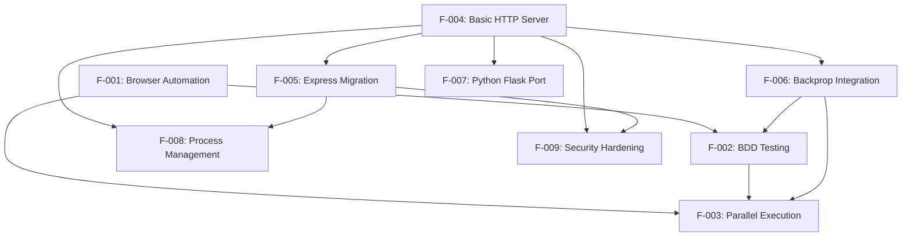

### 2.3.2 Integration Points

| Integration Point | Source Feature | Target Feature | Integration Type |
|---|---|---|---|
| WebDriver Test Execution | F-001 | F-002 | Direct Dependency |
| Parallel BDD Execution | F-002 | F-003 | Enhancement Integration |
| Server Framework Enhancement | F-004 | F-005 | Progressive Enhancement |
| Development Workflow Integration | F-004 | F-006 | External Integration |
| Cross-Language Porting | F-004 | F-007 | Alternative Implementation |
| Production Deployment | F-005 | F-008 | Infrastructure Integration |
| Security Layer Application | F-005 | F-009 | Security Integration |

### 2.3.3 Shared Components

| Component | Features | Purpose |
|---|---|---|
| Configuration Management | F-001, F-002, F-003, F-004 | Environment and runtime configuration |
| Reporting Infrastructure | F-002, F-003, F-006 | Test results and metrics reporting |
| Process Management | F-003, F-008 | Concurrent execution and process control |
| Integration Hooks | F-006, F-002, F-003 | External tooling integration points |

## 2.4 IMPLEMENTATION CONSIDERATIONS

### 2.4.1 Test Automation Implementation

**Technical Constraints:**
- Java 8+ runtime requirement for compatibility
- Maven build system dependency management
- Browser driver availability and version compatibility
- Parallel execution resource limitations

**Performance Requirements:**
- WebDriver initialization time < 5 seconds
- Test execution time optimization through parallel processing
- Memory management for concurrent browser instances
- Network bandwidth considerations for remote WebDriver

**Scalability Considerations:**
- Horizontal scaling through additional execution nodes
- Test suite partitioning for optimal parallel execution
- Resource allocation per browser instance
- CI/CD pipeline integration capacity

**Security Implications:**
- Secure handling of test credentials and sensitive data
- Browser security sandbox considerations
- Test environment isolation requirements
- Secure communication with external test services

### 2.4.2 HTTP Server Implementation

**Technical Constraints:**
- Node.js 14+ runtime compatibility
- Single-threaded event loop limitations
- Memory usage optimization for long-running processes
- Port availability and network configuration

**Performance Requirements:**
- Target throughput: ~1000 requests/second baseline
- Response time: sub-millisecond for basic endpoints
- Memory footprint optimization
- CPU utilization efficiency

**Scalability Considerations:**
- PM2 cluster mode for multi-core utilization
- Horizontal scaling through load balancing
- Database connection pooling considerations
- Static asset serving optimization

**Security Implications:**
- HTTPS/TLS implementation requirements
- Input validation and sanitization
- Rate limiting and DDoS protection
- Security header implementation (OWASP compliance)

### 2.4.3 Integration Implementation

**Technical Constraints:**
- Backprop tooling compatibility requirements
- Cross-platform execution considerations
- Version synchronization between components
- Configuration management complexity

**Maintenance Requirements:**
- Dependency version management
- Documentation synchronization
- Test coverage maintenance
- Performance monitoring and optimization

**References:**
- `pom.xml` - Maven configuration defining Java test automation dependencies
- `README.md` - Node.js project documentation with Backprop integration details
- `docs/architecture/design.md` - Complete system architecture specification
- `docs/guides/getting-started.md` - Basic server implementation requirements
- `docs/guides/express-migration.md` - Framework enhancement specifications
- `docs/guides/production.md` - Production deployment requirements
- `docs/guides/python-flask-port.md` - Cross-language implementation guide
- `docs/guides/security.md` - Security implementation requirements
- `docs/guides/testing.md` - Testing framework integration specifications

# 3. TECHNOLOGY STACK

## 3.1 TECHNOLOGY STACK OVERVIEW

### 3.1.1 Dual-Stack Architecture

This repository presents a unique technical scenario containing **two distinct technology stacks** that serve different purposes and are documented at different levels of implementation:

1. **Java Test Automation Stack** - Fully configured through Maven with complete dependency management but no implementation code
2. **Node.js Server Stack** - Comprehensively documented with progressive enhancement paths but no package.json or implementation code
3. **Python Flask Port** - Alternative implementation path documented for cross-language flexibility

The absence of implementation code combined with detailed configuration and documentation suggests this repository serves as a **technology blueprint** or **project template** repository rather than an active codebase.

### 3.1.2 Technology Stack Selection Rationale

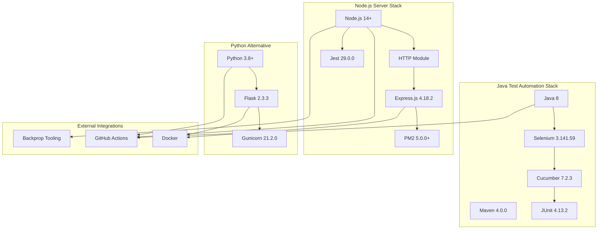

## 3.2 PROGRAMMING LANGUAGES

### 3.2.1 Primary Language Selection

#### Java 8 (Test Automation Stack)
- **Platform**: Test automation and browser automation
- **Version**: Java 8 (configured via maven.compiler.source/target = 8)
- **Selection Criteria**: 
  - Enterprise-grade test automation framework compatibility
  - Mature ecosystem for Selenium WebDriver integration
  - Strong community support for BDD testing practices
- **Constraints**: 
  - Legacy Java 8 requirement may limit access to modern language features
  - Requires JVM runtime environment on all execution nodes

## Node.js 14+ (Server Stack)
- **Platform**: HTTP server and web application development
- **Version**: Node.js ≥14.0.0 (LTS ≥18.0.0 recommended for production)
- **Selection Criteria**:
  - High-performance, non-blocking I/O for web servers
  - Rich ecosystem for web development and tooling integration
  - Strong community support for modern JavaScript development
  - Native JSON handling and REST API development
- **Dependencies**: npm ≥6.0.0 (≥8.0.0 recommended)

#### Python 3.8+ (Alternative Stack)
- **Platform**: Cross-language server implementation
- **Version**: Python 3.8+ (3.9+ recommended)
- **Selection Criteria**:
  - Team preference flexibility for Python-experienced developers
  - Strong web framework ecosystem with Flask
  - Excellent testing and development tooling
- **Dependencies**: pip package manager, venv/conda virtual environments

## 3.3 FRAMEWORKS & LIBRARIES

### 3.3.1 Java Test Automation Frameworks

#### Core Testing Framework
- **Cucumber-Java 7.2.3**: Behavior-driven development framework enabling natural language test specifications
- **JUnit 4.13.2**: Core testing framework providing assertions, test organization, and execution management
- **Cucumber-JUnit Integration**: Seamless integration between BDD scenarios and JUnit test execution

#### Browser Automation Framework
- **Selenium Java 3.141.59**: Web browser automation and testing
  - **Version Note**: Significantly outdated compared to current Selenium 4.29.0
  - **Compatibility**: Supports Chrome, Firefox, Safari, and Edge browsers
  - **Capabilities**: Element location, user interaction simulation, JavaScript execution

#### Support Libraries
- **WebDriverManager 5.1.0**: Automatic browser driver download and management
- **JavaFaker 1.0.2**: Test data generation for realistic test scenarios
- **Cucumber Reporting Plugin 7.2.0**: Enhanced HTML reports with detailed test execution metrics

### 3.3.2 Node.js Web Frameworks

#### Core Server Framework
- **Node.js HTTP Module**: Built-in HTTP server capabilities for basic request/response handling
- **Express.js 4.18.2** (Enhancement Path): Industry-standard web application framework
  - **Middleware Support**: Authentication, logging, CORS, security headers
  - **Routing**: Advanced URL routing and parameter handling
  - **Template Engines**: Support for multiple view engines

#### Process Management
- **PM2 v5.0.0+**: Production process management with clustering and monitoring
  - **Cluster Mode**: Multi-core CPU utilization
  - **Health Monitoring**: Automatic restart capabilities
  - **Load Balancing**: Built-in load balancer for multiple instances

### 3.3.3 Python Flask Framework

#### Web Framework
- **Flask 2.3.3**: Lightweight WSGI web application framework
- **python-dotenv 1.0.0**: Environment variable management
- **Gunicorn 21.2.0**: WSGI HTTP server for production deployment

## 3.4 OPEN SOURCE DEPENDENCIES

### 3.4.1 Java Maven Dependencies

```xml
<!-- Testing Frameworks -->
io.cucumber:cucumber-java:7.2.3
io.cucumber:cucumber-junit:7.2.3, 7.3.4
junit:junit:4.13.2

<!-- Browser Automation -->
org.seleniumhq.selenium:selenium-java:3.141.59
io.github.bonigarcia:webdrivermanager:5.1.0

<!-- Utilities & Reporting -->
me.jvt.cucumber:reporting-plugin:7.2.0
com.github.javafaker:javafaker:1.0.2

<!-- Build Plugins -->
org.apache.maven.plugins:maven-surefire-plugin:3.0.0-M5
```

### 3.4.2 Node.js Package Dependencies

#### Core Server Dependencies
```json
{
  "express": "^4.18.2",
  "get-port": "^6.1.2",
  "winston": "^3.8.2"
}
```

#### Security & Middleware
```json
{
  "helmet": "^6.0.0",
  "cors": "^2.8.5",
  "express-rate-limit": "^6.7.0",
  "express-slow-down": "^1.6.0",
  "bcrypt": "^5.1.0",
  "jsonwebtoken": "^9.0.0",
  "joi": "^17.9.1",
  "express-validator": "^6.15.0"
}
```

#### Testing Framework Dependencies
```json
{
  "jest": "^29.0.0",
  "mocha": "^10.2.0",
  "chai": "^4.3.7",
  "supertest": "^6.3.0",
  "sinon": "^15.0.1",
  "nyc": "^15.1.0"
}
```

#### Development Tools
```json
{
  "nodemon": "^2.0.22",
  "pm2": "^5.3.0"
}
```

### 3.4.3 Python Flask Dependencies

```python
# requirements.txt
Flask==2.3.3
python-dotenv==1.0.0
gunicorn==21.2.0
pytest==7.4.0
```

## 3.5 THIRD-PARTY SERVICES

### 3.5.1 Development Tooling Integration

#### Backprop Tooling Suite
- **Purpose**: Development workflow optimization and code analysis
- **Integration Points**: 
  - Code analysis hooks for quality metrics
  - Test harness integration for automated testing
  - Performance monitoring endpoints
- **Configuration**: Environment variables (BACKPROP_ENABLED, BACKPROP_API_KEY)
- **Dependencies**: Custom integration middleware for Node.js server

#### Browser Driver Services
- **WebDriverManager**: Automatic browser driver download and version management
- **Browser Support**: Chrome, Firefox, Safari, Edge driver integration
- **Grid Integration**: Support for Selenium Grid and cloud testing services

### 3.5.2 Documentation Services

#### Static Site Generation
- **MkDocs**: Python-based documentation site generator
- **Docusaurus**: React-based documentation platform
- **Integration**: Automated documentation building and deployment

#### Code Coverage Services
- **Codecov**: Code coverage reporting and analysis
- **Integration**: Automated coverage report upload from CI/CD pipelines

## 3.6 DATABASES & STORAGE

### 3.6.1 Configuration and Session Storage

#### Environment-Based Configuration
- **File-based Configuration**: JSON configuration files for different environments
- **Environment Variables**: Runtime configuration through system environment
- **Session Storage**: In-memory session management for development

#### Logging and Monitoring Storage
- **Winston Logging**: Structured logging with multiple transport options
- **Log Storage**: File-based logging with rotation capabilities
- **Metrics Collection**: Performance metrics storage for monitoring

### 3.6.2 Test Data Management

#### Test Data Generation
- **JavaFaker**: Realistic test data generation for Java test automation
- **Static Test Data**: JSON and CSV files for consistent test scenarios
- **Dynamic Data**: Runtime test data generation for varying test conditions

## 3.7 DEVELOPMENT & DEPLOYMENT

### 3.7.1 Build Systems

#### Java Build Management
- **Apache Maven 4.0.0**: Project object model and dependency management
- **Build Configuration**:
  - Group ID: org.example
  - Artifact ID: testinium-qa
  - Version: 1.0-SNAPSHOT
- **Parallel Execution**: Maven Surefire plugin with method-level parallelization
- **Test Patterns**: `**/CukesRunner*.java` inclusion pattern

## Node.js Build Management
- **NPM**: Package management and script execution
- **Build Scripts**: Development, testing, and production build configurations
- **Dependency Management**: package.json with semantic versioning

### 3.7.2 Containerization

#### Docker Configuration
- **Base Images**: 
  - `python:3.9-slim` for Flask applications
  - Node.js official images for server deployment
- **Multi-stage Builds**: Optimized production images with reduced attack surface
- **Non-root User**: Security-hardened container execution
- **Docker Compose**: Multi-service orchestration for development environments

### 3.7.3 Continuous Integration & Deployment

#### CI/CD Platforms
- **GitHub Actions**: Primary CI/CD platform integration
- **Jenkins**: Alternative pipeline support with documented configuration
- **Pipeline Capabilities**:
  - Automated testing execution
  - Code quality analysis
  - Security scanning
  - Deployment automation

#### Production Deployment
- **PM2 Ecosystem**: Production process management with cluster configuration
- **SSL/TLS**: Let's Encrypt/Certbot integration for HTTPS
- **Load Balancing**: External load balancer compatibility
- **Health Checks**: Application health monitoring endpoints

### 3.7.4 Development Tools

#### Java Development Tools
- **IDE Integration**: Maven project structure compatible with IntelliJ IDEA, Eclipse
- **Test Execution**: Parallel test execution with configurable thread pools
- **Reporting**: Cucumber HTML reports with detailed test execution metrics

## Node.js Development Tools
- **Nodemon**: Automatic server restart during development
- **Development Server**: Hot-reload capabilities for rapid development
- **Debugging**: Node.js debugging integration with IDE support

#### Security Tools
- **Helmet.js**: Security header implementation for Express.js applications
- **Rate Limiting**: Built-in DDoS protection and request throttling
- **Input Validation**: Joi and express-validator for request sanitization
- **HTTPS/TLS**: Production-grade SSL/TLS certificate management

## 3.8 TECHNOLOGY INTEGRATION ARCHITECTURE

### 3.8.1 Integration Patterns

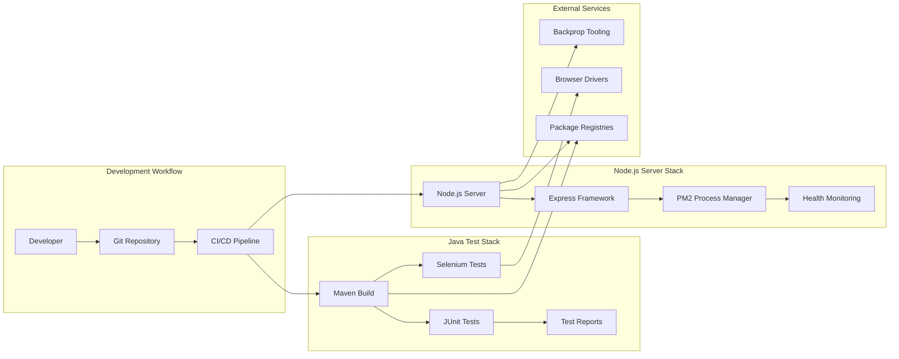

### 3.8.2 Security Considerations

#### Java Stack Security
- **Dependency Scanning**: Maven dependency vulnerability assessment
- **Secure Browser Automation**: Sandboxed browser execution environments
- **Credential Management**: Secure handling of test environment credentials

## Node.js Stack Security
- **OWASP Compliance**: Implementation of OWASP security guidelines
- **Rate Limiting**: Protection against DDoS and abuse
- **Input Validation**: Comprehensive request sanitization and validation
- **HTTPS/TLS**: End-to-end encryption for production deployments

### 3.8.3 Performance Optimization

#### Java Test Execution
- **Parallel Processing**: Multi-threaded test execution with configurable thread pools
- **Resource Management**: Efficient browser instance lifecycle management
- **Memory Optimization**: Garbage collection tuning for long-running test suites

## Node.js Server Performance
- **Event Loop Optimization**: Non-blocking I/O for maximum throughput
- **Cluster Mode**: Multi-core CPU utilization through PM2 clustering
- **Caching Strategies**: Response caching and static asset optimization

## 3.9 VERSION MANAGEMENT & COMPATIBILITY

### 3.9.1 Critical Version Dependencies

#### Java Stack Versions
- **Java Runtime**: 8+ (configured for Java 8 compatibility)
- **Maven**: 4.0.0 project object model
- **Selenium**: 3.141.59 (requires upgrade to 4.29.0 for latest features)
- **Cucumber**: 7.2.3 (current stable version)

## Node.js Stack Versions
- **Node.js**: 14+ minimum, 18+ LTS recommended for production
- **Express.js**: 4.18.2 (current stable version)
- **PM2**: 5.0.0+ for production deployment
- **Jest**: 29.0.0 for testing framework

### 3.9.2 Upgrade Considerations

#### Security Updates
- **Selenium WebDriver**: Immediate upgrade required from 3.141.59 to 4.x series
- **Node.js LTS**: Regular updates to maintain security posture
- **Dependency Scanning**: Automated vulnerability assessment for all dependencies

#### Compatibility Matrix
- **Browser Support**: Chrome 90+, Firefox 88+, Safari 14+, Edge 90+
- **Operating Systems**: Windows 10+, macOS 10.15+, Ubuntu 18.04+
- **Container Platforms**: Docker 20.10+, Kubernetes 1.20+

#### References

**Configuration Files:**
- `pom.xml` - Complete Maven project configuration with all Java dependencies
- `README.md` - Node.js project overview and Backprop integration specifications

**Documentation Sources:**
- `docs/architecture/design.md` - System architecture and technology decisions
- `docs/guides/express-migration.md` - Express.js framework integration guide
- `docs/guides/production.md` - Production deployment and PM2 configuration
- `docs/guides/security.md` - Security implementation and OWASP compliance
- `docs/guides/testing.md` - Testing framework configuration and best practices
- `docs/guides/python-flask-port.md` - Python Flask alternative implementation

**Repository Structure:**
- `.gitignore` - Java artifacts and Node.js modules exclusion patterns
- `.gitattributes` - HTML file handling configuration

# 4. PROCESS FLOWCHART

## 4.1 SYSTEM WORKFLOWS

### 4.1.1 Core Business Processes

#### Test Automation Workflow (F-001, F-002, F-003)

The test automation workflow represents the primary business process for automated testing execution, encompassing browser automation, BDD testing, and parallel execution capabilities.

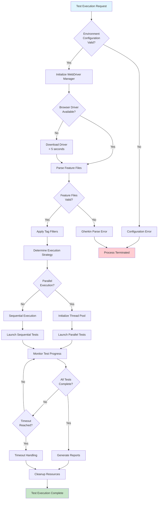

#### HTTP Server Lifecycle Workflow (F-004, F-005)

The HTTP server workflow manages the complete lifecycle from initialization to shutdown, including progressive enhancement capabilities.

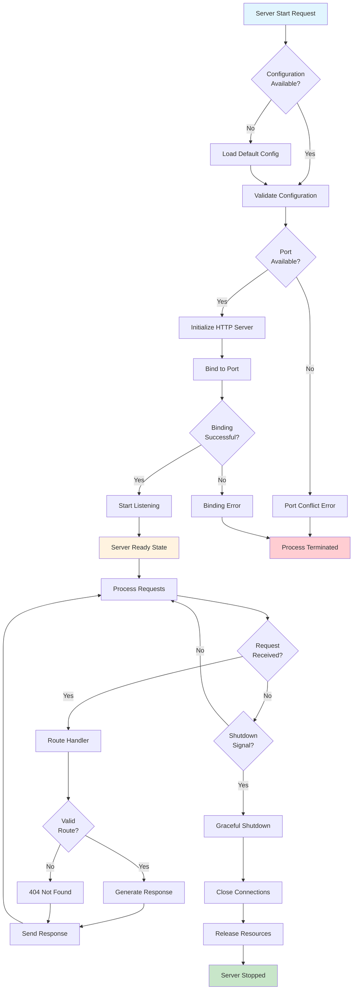

### 4.1.2 Integration Workflows

#### Backprop Development Integration Workflow (F-006)

The Backprop integration workflow demonstrates how development tooling integrates with both Java and Node.js components for enhanced development workflows.

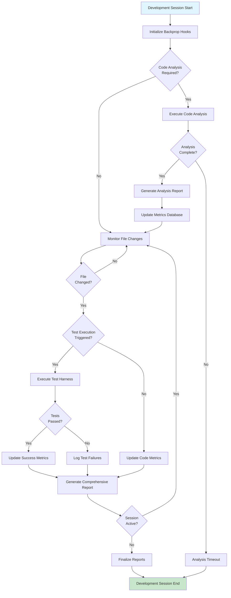

#### Cross-Platform Deployment Workflow (F-007, F-008)

This workflow manages deployment across different runtime environments and process management systems.

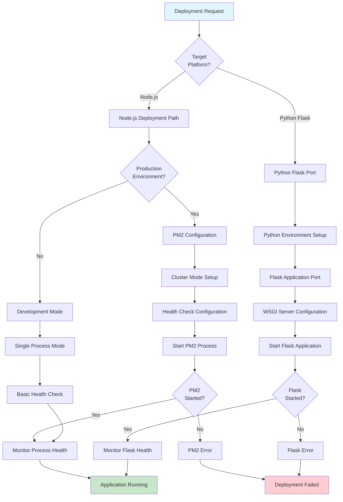

## 4.2 DETAILED PROCESS FLOWS

### 4.2.1 Browser Automation Process Flow

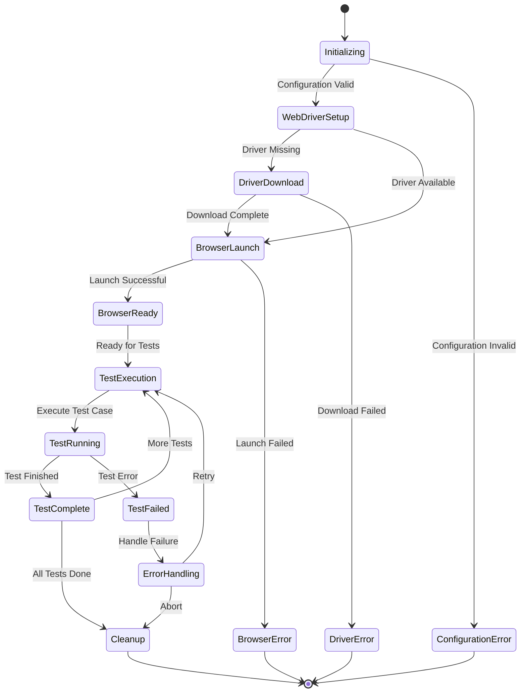

### 4.2.2 BDD Test Execution Flow

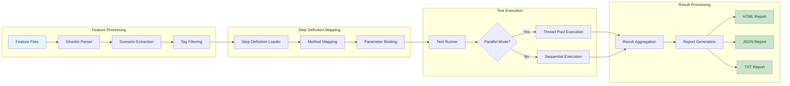

### 4.2.3 Parallel Test Execution Management

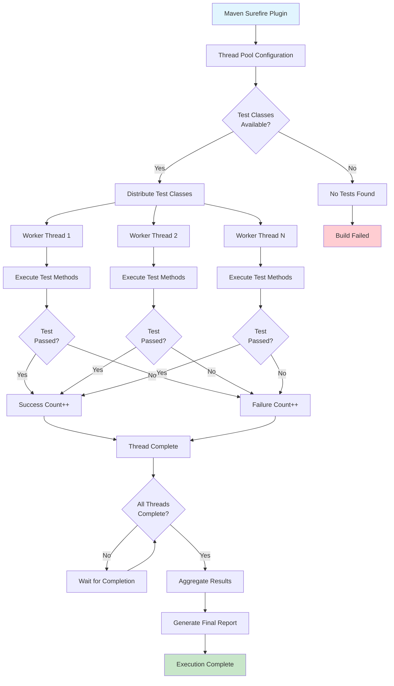

## 4.3 ERROR HANDLING FLOWCHARTS

### 4.3.1 Test Framework Error Handling

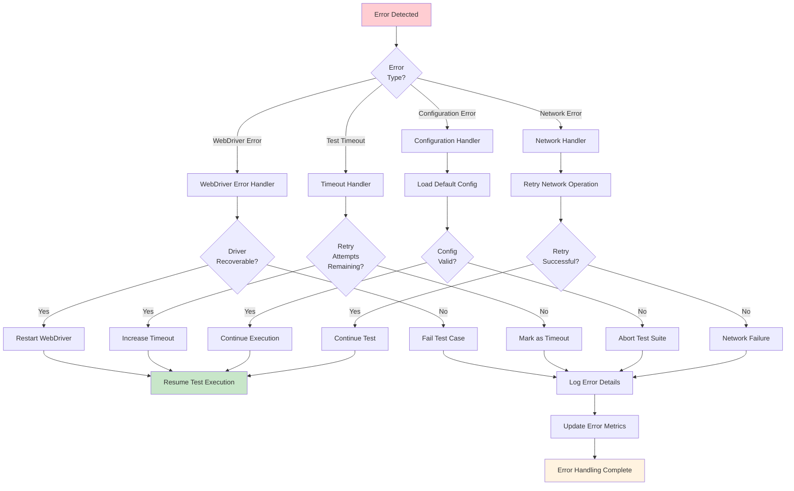

### 4.3.2 HTTP Server Error Recovery

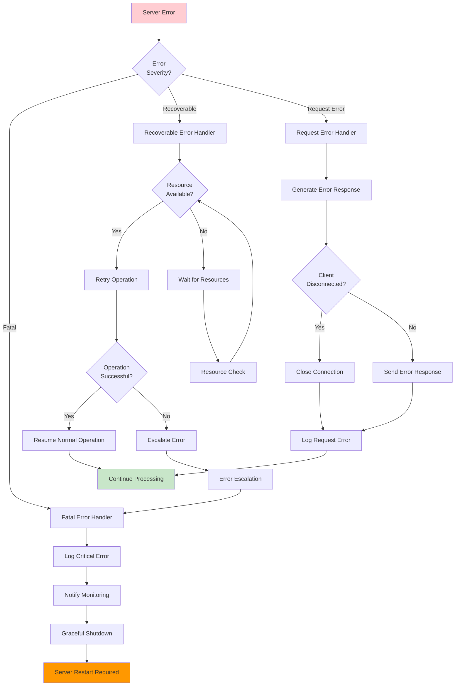

## 4.4 STATE TRANSITION DIAGRAMS

### 4.4.1 Test Execution State Management

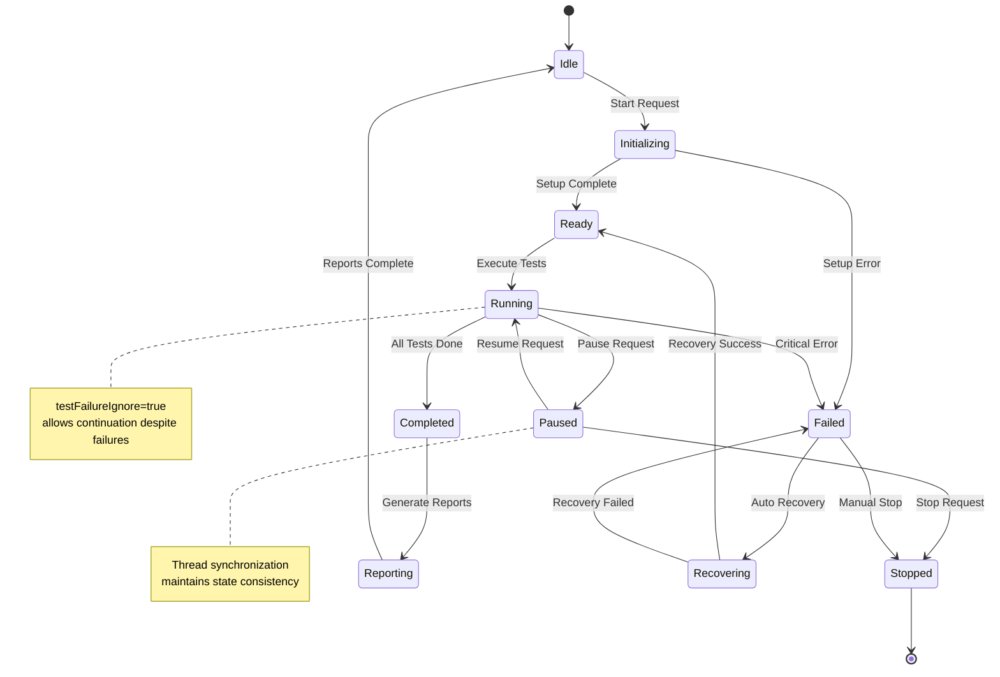

### 4.4.2 HTTP Server State Transitions

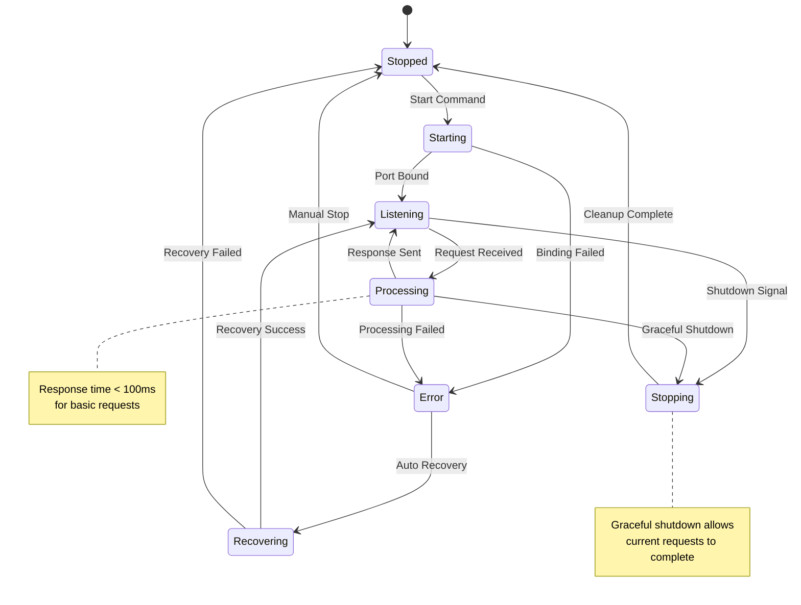

## 4.5 INTEGRATION SEQUENCE DIAGRAMS

### 4.5.1 Test Automation Integration Sequence

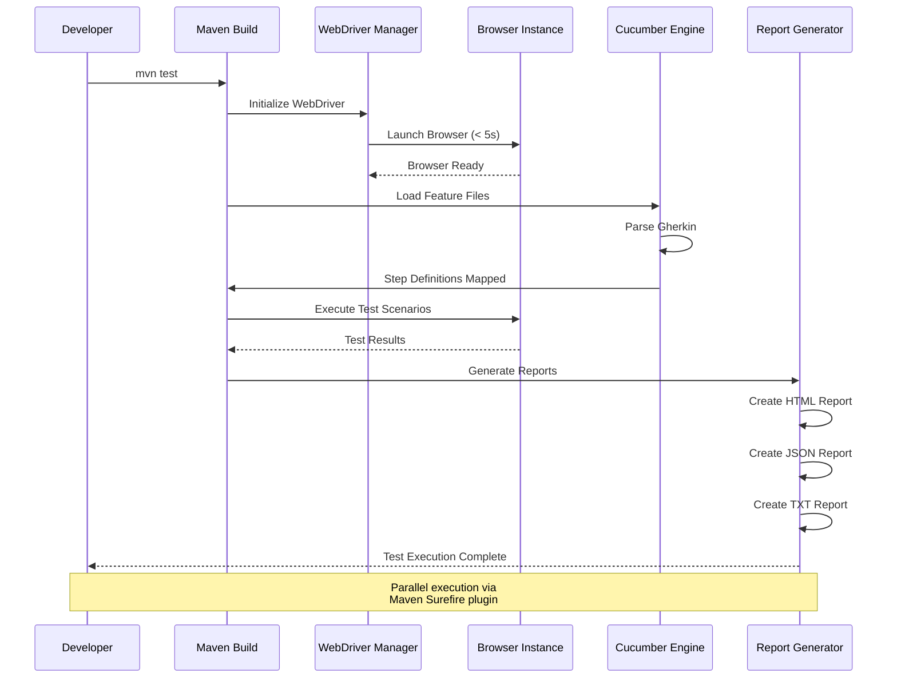

### 4.5.2 HTTP Server and Backprop Integration

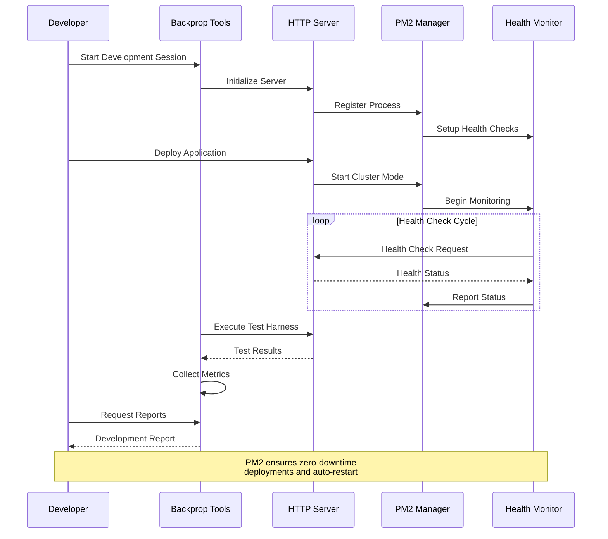

## 4.6 VALIDATION RULES AND CHECKPOINTS

### 4.6.1 Business Rules Implementation

| Process Stage | Validation Rule | Implementation | Recovery Action |
|---|---|---|---|
| Test Initialization | WebDriver timeout < 5 seconds | WebDriverManager configuration | Retry with different driver version |
| Feature File Processing | Valid Gherkin syntax | Cucumber parser validation | Report syntax errors and skip file |
| Parallel Execution | Thread safety validation | Maven Surefire thread management | Fall back to sequential execution |
| HTTP Request Processing | Response time < 100ms | Node.js performance monitoring | Enable request queuing |
| PM2 Process Management | Health check responsiveness | PM2 health monitoring | Automatic process restart |

### 4.6.2 Authorization Checkpoints

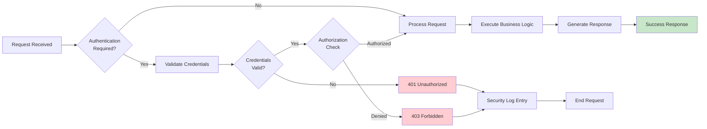

## 4.7 PERFORMANCE AND SLA CONSIDERATIONS

### 4.7.1 Timing Constraints

| Process | Target SLA | Measurement Point | Escalation Trigger |
|---|---|---|---|
| WebDriver Initialization | < 5 seconds | Driver ready state | > 10 seconds |
| HTTP Response | < 100ms | Request to response | > 500ms |
| Test Report Generation | < 30 seconds | Test completion to report | > 60 seconds |
| PM2 Health Check | < 5 seconds | Health request to response | > 15 seconds |
| Parallel Test Execution | 50% time reduction | Compared to sequential | < 25% improvement |

### 4.7.2 Resource Management Flow

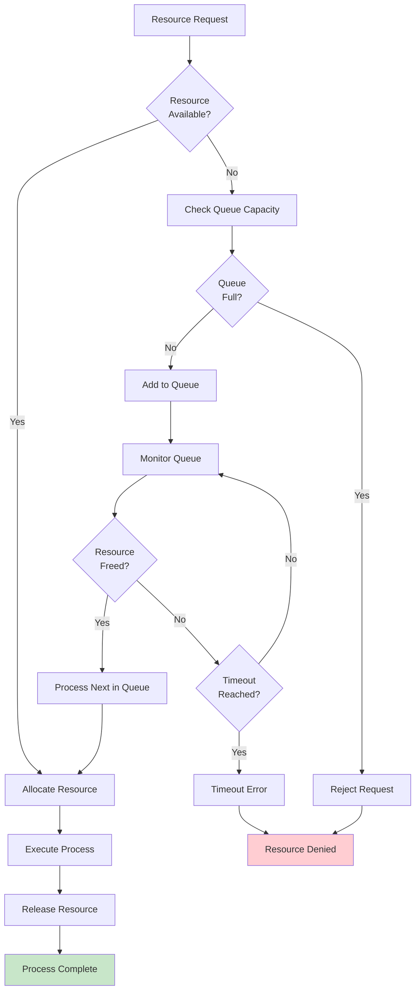

#### References

#### Technical Specification Sections
- `1.2 SYSTEM OVERVIEW` - Dual-project architecture context
- `2.1 FEATURE CATALOG` - Complete feature workflow mapping
- `2.2 FUNCTIONAL REQUIREMENTS TABLE` - Performance and validation requirements
- `3.8 TECHNOLOGY INTEGRATION ARCHITECTURE` - Integration patterns and security considerations

#### Repository Evidence
- `pom.xml` - Maven configuration for Java test automation workflows
- `README.md` - Node.js server workflows and Backprop integration
- `docs/architecture/` - System architecture documentation
- `docs/guides/` - Development workflow guides
- `.gitignore` - Java project structure patterns
- `.gitattributes` - HTML language detection configuration

#### Process Flow Sources
- F-001 through F-009 feature implementations from Feature Catalog
- Maven Surefire plugin parallel execution configuration
- WebDriverManager browser automation patterns
- Cucumber BDD test execution workflows
- PM2 process management and health monitoring
- Backprop development tooling integration patterns
- Security validation and error recovery procedures

# 5. SYSTEM ARCHITECTURE

## 5.1 HIGH-LEVEL ARCHITECTURE

### 5.1.1 System Overview

The Testinium-QA system implements a **dual-stack architecture** that serves as a comprehensive technology blueprint for both automated testing and web server development. This unique design combines enterprise-grade test automation capabilities with modern web server infrastructure, providing a complete foundation for development teams requiring both testing and server implementation patterns.

#### Overall System Architecture Style and Rationale

The system follows a **layered, minimalist-first architecture** with progressive enhancement capabilities. This design philosophy enables teams to start with basic implementations and systematically add complexity through well-defined enhancement layers. The architecture supports two primary operational modes:

1. **Test Automation Mode**: Enterprise browser automation using Selenium WebDriver with Cucumber BDD patterns
2. **Web Server Mode**: HTTP server implementation with progressive enhancement from basic Node.js to production-ready Express.js

#### Key Architectural Principles and Patterns

- **Progressive Enhancement**: Each system layer builds upon previous layers while maintaining backward compatibility
- **Technology Diversity**: Multi-language support (Java, Node.js, Python) for organizational flexibility
- **Separation of Concerns**: Clear boundaries between test automation, server functionality, and enhancement modules
- **Configuration-Driven Behavior**: Environment variables control feature activation and system behavior
- **Native Integration Hooks**: Built-in support for Backprop development tooling and analysis workflows

#### System Boundaries and Major Interfaces

**Internal Boundaries**:
- HTTP server core providing basic request/response handling
- Test automation engine with browser interaction capabilities
- Enhancement layer offering middleware, routing, and security features
- Integration layer providing development tooling hooks and monitoring

**External Interfaces**:
- Browser WebDriver Protocol (W3C WebDriver standard)
- HTTP/HTTPS client connections
- Backprop development tooling API
- CI/CD pipeline integration points
- Package registry connections (npm, Maven Central)

### 5.1.2 Core Components Table

| Component Name | Primary Responsibility | Key Dependencies | Integration Points |
|---|---|---|---|
| **Java Test Automation Engine** | Browser automation and BDD test execution | Selenium 3.141.59, Cucumber 7.2.3, JUnit 4.13.2 | WebDriver Protocol, Maven build system |
| **HTTP Server Core** | Basic request handling and response generation | Node.js 14+, native http module | Client connections, environment configuration |
| **Express.js Enhancement Layer** | Full-featured web framework capabilities | Express.js 4.18.2, middleware ecosystem | HTTP Core, security modules, routing |
| **PM2 Process Manager** | Production deployment and scaling | PM2 v5.0.0+, cluster mode | Express layer, health monitoring, load balancing |
| **Security Framework** | OWASP-compliant protection mechanisms | Helmet.js, TLS certificates, rate limiting | All server layers, authentication systems |
| **Backprop Integration Hub** | Development workflow automation | Custom integration points, monitoring APIs | Test engine, server core, analysis tools |

### 5.1.3 Data Flow Description

#### Primary Data Flows Between Components

**Test Automation Flow**:
The test automation engine receives feature file specifications and executes them through the WebDriver Protocol. Test data flows from Cucumber feature files → Step definitions → Selenium WebDriver → Browser instances → Test results → Comprehensive reports. Parallel execution occurs at the method level with unlimited thread configuration for maximum throughput.

**HTTP Server Flow**:
Client requests enter through the HTTP server core, proceed through routing resolution, execute in designated handlers, generate responses, and return to clients. Sub-millisecond response times are achieved for basic endpoints with ~1000 requests/second baseline throughput. Enhanced requests flow through Express.js middleware chains before reaching handlers.

**Enhancement Integration Flow**:
The progressive enhancement pattern allows data to flow through multiple architectural layers: Basic HTTP → Express.js Framework → Security Middleware → Production Process Management. Each layer transforms and enriches the data while maintaining API compatibility.

#### Integration Patterns and Protocols

- **WebDriver Protocol**: Standard W3C WebDriver communication for browser automation
- **HTTP/HTTPS**: RESTful API patterns for server communication
- **JSON Payloads**: Structured data exchange with Backprop tooling
- **Environment Variables**: Configuration parameter flow across all components
- **IPC Communication**: Inter-process communication for PM2 cluster management

#### Data Transformation Points

- **Request Parsing**: HTTP requests transformed into internal request objects
- **Test Data Generation**: JavaFaker library provides realistic test data transformation
- **Response Serialization**: Internal objects serialized to HTTP response formats
- **Configuration Processing**: Environment variables transformed into application configuration
- **Metrics Collection**: Runtime data transformed into monitoring metrics

#### Key Data Stores and Caches

- **Configuration Cache**: Environment variable processing and validation results
- **Test Result Storage**: Cucumber reports and JUnit test outcomes
- **Process State**: PM2 process management and health monitoring data
- **Security Tokens**: JWT and session management for authentication flows
- **Performance Metrics**: Request timing, throughput, and error rate collection

### 5.1.4 External Integration Points

| System Name | Integration Type | Data Exchange Pattern | Protocol/Format |
|---|---|---|---|
| **Browser Drivers** | Test Automation | Command/response automation | W3C WebDriver Protocol |
| **Backprop Tooling** | Development Integration | Bidirectional metrics and analysis | JSON/REST API |
| **Package Registries** | Dependency Management | Artifact download and verification | HTTPS/Package Manifests |
| **CI/CD Pipelines** | Build Automation | Build triggers and artifact deployment | YAML/JSON configurations |

## 5.2 COMPONENT DETAILS

### 5.2.1 Java Test Automation Engine

#### Purpose and Responsibilities
The Java Test Automation Engine serves as the primary browser automation and BDD testing component, providing enterprise-grade test execution capabilities with parallel processing and comprehensive reporting.

#### Technologies and Frameworks Used
- **Java 8**: Compiler source and target platform
- **Maven 4.0.0**: Build system and dependency management
- **Selenium WebDriver 3.141.59**: Browser automation protocol implementation
- **Cucumber 7.2.3**: Behavior-driven development framework
- **JUnit 4.13.2**: Test execution and assertion framework
- **WebDriverManager 5.1.0**: Automatic browser driver management
- **JavaFaker 1.0.2**: Test data generation and mocking

#### Key Interfaces and APIs
- WebDriver API for browser control and interaction
- Cucumber step definition interfaces for BDD implementation
- JUnit assertion and lifecycle APIs for test management
- Maven Surefire plugin interfaces for execution control

#### Data Persistence Requirements
- Test execution results stored in XML/JSON report formats
- Screenshot capture for failed test scenarios
- Execution logs with timestamp and severity classification
- Performance metrics collection for test execution timing

#### Scaling Considerations
- Unlimited thread configuration enables maximum parallelization
- Method-level parallel execution distributes load effectively
- WebDriverManager provides efficient browser driver caching
- Maven Surefire integration supports distributed test execution

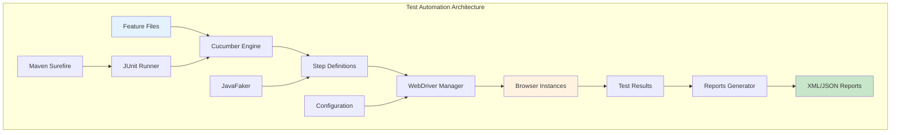

### 5.2.2 HTTP Server Core

#### Purpose and Responsibilities
The HTTP Server Core provides fundamental request/response handling capabilities, serving as the foundation for all web server functionality with minimal dependencies and maximum compatibility.

#### Technologies and Frameworks Used
- **Node.js 14+**: JavaScript runtime environment
- **Native HTTP Module**: Built-in Node.js HTTP server implementation
- **Environment Variables**: Configuration management system
- **Plain Text Responses**: Maximum client compatibility approach

#### Key Interfaces and APIs
- HTTP request/response handling interfaces
- Environment variable configuration APIs
- Request routing and handler registration
- Response generation and client communication

#### Data Persistence Requirements
- Request/response logging for debugging and analysis
- Configuration parameter caching for performance optimization
- Error state tracking for reliability monitoring
- Basic performance metrics collection

#### Scaling Considerations
- Single-process design suitable for development environments
- Event-driven architecture enables high concurrency
- Minimal memory footprint for resource efficiency
- Upgrade path to Express.js for production scaling

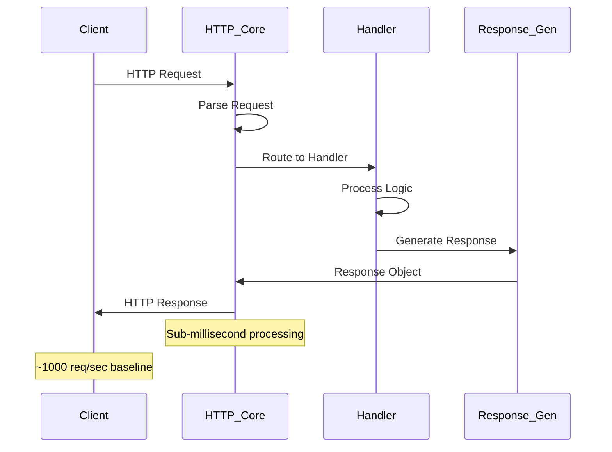

### 5.2.3 Express.js Enhancement Layer

#### Purpose and Responsibilities
The Express.js Enhancement Layer provides production-ready web framework capabilities, including middleware support, advanced routing, security features, and performance optimizations.

#### Technologies and Frameworks Used
- **Express.js 4.18.2**: Web application framework
- **Middleware Ecosystem**: Helmet.js, CORS, rate limiting, compression
- **Routing Engine**: Advanced pattern matching and parameter extraction
- **Template Engines**: Support for various view rendering systems
- **Static File Serving**: Optimized asset delivery capabilities

#### Key Interfaces and APIs
- Express application and router APIs
- Middleware registration and execution interfaces
- Template engine integration points
- Error handling and logging frameworks

#### Data Persistence Requirements
- Session data storage for user state management
- Template cache for rendering performance
- Static asset versioning and cache control
- Request analytics and performance metrics

#### Scaling Considerations
- Middleware pipeline optimization for performance
- Connection pooling and resource management
- Cluster mode preparation for multi-process scaling
- Caching strategies for frequently accessed resources

```mermaid
graph LR
    subgraph "Express.js Architecture"
        A[HTTP Request] --> B[Security Middleware]
        B --> C[CORS Handler]
        C --> D[Rate Limiter]
        D --> E[Router]
        E --> F[Application Logic]
        F --> G[Response Middleware]
        G --> H[HTTP Response]
        
        I[Static Files] --> J[Static Middleware]
        J --> E
        
        K[Error Handler] --> H
        F --> K
    end
    
    style A fill:#e3f2fd
    style H fill:#c8e6c9
    style K fill:#ffcdd2
```

### 5.2.4 PM2 Process Manager

#### Purpose and Responsibilities
PM2 Process Manager handles production deployment, process monitoring, automatic restart capabilities, and cluster mode management for high-availability server operations.

#### Technologies and Frameworks Used
- **PM2 v5.0.0+**: Advanced process management platform
- **Cluster Mode**: Multi-core CPU utilization
- **Health Monitoring**: Automatic failure detection and recovery
- **Load Balancing**: Request distribution across process instances
- **Zero-Downtime Deployment**: Rolling restart capabilities

#### Key Interfaces and APIs
- PM2 programmatic API for process control
- Health check endpoints for monitoring integration
- Cluster management interfaces for scaling operations
- Deployment automation APIs for CI/CD integration

#### Data Persistence Requirements
- Process state and health metrics storage
- Application logs with rotation and archival
- Performance monitoring data collection
- Deployment history and rollback information

#### Scaling Considerations
- Horizontal scaling through cluster mode
- Automatic process restart on failure detection
- Memory and CPU monitoring with threshold alerts
- Load balancing algorithms for optimal distribution

## 5.3 TECHNICAL DECISIONS

### 5.3.1 Architecture Style Decisions and Tradeoffs

#### Decision: Dual-Stack Architecture Pattern

**Rationale**: The system combines Java test automation with Node.js web server capabilities to provide comprehensive development blueprints for organizations requiring both testing infrastructure and server implementation patterns.

**Tradeoffs Analysis**:

| Aspect | Benefits | Drawbacks | Mitigation Strategy |
|---|---|---|---|
| **Complexity** | Comprehensive feature coverage | Increased learning curve | Progressive enhancement approach |
| **Maintenance** | Technology diversity | Multiple dependency chains | Automated dependency management |
| **Integration** | Flexible deployment options | Coordination complexity | Clear separation of concerns |
| **Performance** | Optimized per use case | Resource overhead | Selective component activation |

#### Decision: Minimalist-First Design Philosophy

**Rationale**: Starting with basic implementations allows teams to understand core concepts before adding complexity, reducing implementation barriers and improving adoption rates.

**Implementation Strategy**:
- Basic HTTP server as foundation
- Single-file architecture for clarity
- Plain text responses for maximum compatibility
- Environment variable activation for features

### 5.3.2 Communication Pattern Choices

#### Decision: Progressive Enhancement Communication

The system implements a layered communication pattern where each enhancement level maintains backward compatibility while adding capabilities:

```mermaid
graph TD
    A[Basic HTTP] --> B[Express Framework]
    B --> C[Security Layer]
    C --> D[Production Management]
    
    E[WebDriver Protocol] --> F[Test Framework]
    F --> G[Parallel Execution]
    G --> H[Report Generation]
    
    I[Backprop Integration] --> J[Both Stacks]
    
    style A fill:#e3f2fd
    style D fill:#c8e6c9
    style H fill:#c8e6c9
```

#### Decision: Environment Variable Configuration

**Rationale**: Environment variables provide non-intrusive configuration management that works across all deployment environments without code modifications.

**Configuration Categories**:
- Application settings (NODE_ENV, PORT, HOST)
- Security parameters (JWT_SECRET, ENCRYPTION_KEY)
- Performance tuning (MAX_CONNECTIONS, CLUSTER_INSTANCES)
- Integration settings (BACKPROP_ENABLED, LOG_LEVEL)

### 5.3.3 Data Storage Solution Rationale

#### Decision: Configuration-First Storage Approach

The system prioritizes configuration management over traditional database persistence, focusing on stateless operation with configurable behavior.

**Storage Strategy**:
- Environment variables for configuration persistence
- File-based test results and reports
- Memory-based caching for performance optimization
- Optional database integration through enhancement layers

#### Decision: Test Result Persistence

Test automation results are stored in standardized formats (XML/JSON) compatible with CI/CD pipeline integration and third-party reporting tools.

### 5.3.4 Caching Strategy Justification

#### Decision: Multi-Level Caching Architecture

```mermaid
graph LR
    subgraph "Caching Strategy"
        A[Configuration Cache] --> B[Application Layer]
        C[WebDriver Cache] --> D[Test Automation]
        E[Static Asset Cache] --> F[Web Server]
        G[Process State Cache] --> H[PM2 Management]
    end
    
    style A fill:#e1f5fe
    style C fill:#e8f5e8
    style E fill:#fff3e0
    style G fill:#fce4ec
```

**Rationale**: Different system components require different caching strategies optimized for their specific use patterns and performance requirements.

### 5.3.5 Security Mechanism Selection

#### Decision: OWASP-Compliant Security Framework

The system implements comprehensive security measures following OWASP guidelines:

- **Helmet.js**: Security headers and attack prevention
- **Rate Limiting**: DDoS protection and resource management
- **HTTPS/TLS**: Encrypted communication channels
- **Input Validation**: Request sanitization and validation
- **JWT Authentication**: Token-based authentication capabilities

## 5.4 CROSS-CUTTING CONCERNS

### 5.4.1 Monitoring and Observability Approach

#### Comprehensive Monitoring Strategy

The system implements multi-layer monitoring covering application performance, infrastructure health, and business metrics:

**Application Monitoring**:
- Winston logging with structured output and configurable levels
- Custom metrics collection for request timing and throughput
- Performance profiling for bottleneck identification
- Memory and CPU usage tracking across all components

**Infrastructure Monitoring**:
- PM2 process health monitoring with automatic restart
- HTTP server availability and response time tracking
- WebDriver session management and browser resource monitoring
- Integration point health checks for external dependencies

**Business Metrics**:
- Test execution success rates and failure patterns
- Server request patterns and user behavior analysis
- Enhancement layer adoption and performance impact
- Backprop integration effectiveness metrics

### 5.4.2 Logging and Tracing Strategy

#### Structured Logging Implementation

```mermaid
graph TD
    subgraph "Logging Architecture"
        A[Application Events] --> B[Winston Logger]
        B --> C[Log Formatting]
        C --> D[Log Rotation]
        D --> E[Archive Storage]
        
        F[Error Events] --> G[Error Handler]
        G --> H[Error Logging]
        H --> I[Alert System]
        
        J[Performance Events] --> K[Metrics Collector]
        K --> L[Time Series Data]
        L --> M[Dashboard Integration]
    end
    
    style A fill:#e3f2fd
    style I fill:#ffcdd2
    style M fill:#c8e6c9
```

**Logging Levels and Categories**:
- **ERROR**: System failures, exceptions, and critical issues
- **WARN**: Performance degradation and recoverable problems
- **INFO**: Business events, successful operations, and state changes
- **DEBUG**: Detailed execution flow and diagnostic information
- **TRACE**: Granular execution details for deep troubleshooting

### 5.4.3 Error Handling Patterns

#### Comprehensive Error Handling Framework

The system implements consistent error handling patterns across all components:

```mermaid
flowchart TD
    A[Error Occurrence] --> B{Error Type}
    
    B -->|System Error| C[Log Critical Error]
    B -->|Application Error| D[Log Application Error]
    B -->|User Error| E[Log User Error]
    
    C --> F[Send Alert]
    D --> G[Increment Metrics]
    E --> H[Return User Message]
    
    F --> I{Recovery Possible?}
    G --> I
    H --> J[Continue Operation]
    
    I -->|Yes| K[Execute Recovery]
    I -->|No| L[Graceful Degradation]
    
    K --> M[Log Recovery Success]
    L --> N[Log Degradation State]
    
    M --> J
    N --> O[Notify Operations]
    O --> J
    
    style A fill:#ffcdd2
    style J fill:#c8e6c9
    style O fill:#fff3e0
```

**Error Categories and Handling**:
- **Configuration Errors**: Validation with helpful error messages and defaults
- **Network Errors**: Retry logic with exponential backoff
- **WebDriver Errors**: Browser session recovery and alternative driver selection
- **Resource Errors**: Graceful degradation and resource cleanup
- **Integration Errors**: Fallback mechanisms and service isolation

### 5.4.4 Authentication and Authorization Framework

#### Security Architecture Implementation

**Authentication Mechanisms**:
- JWT token-based authentication with refresh token support
- Session management with configurable timeout and security
- Environment variable-based secret management
- Multi-factor authentication preparation for enterprise deployment

**Authorization Patterns**:
- Role-based access control (RBAC) for different user types
- Resource-level permissions for fine-grained access control
- API key authentication for service-to-service communication
- Integration with enterprise identity providers

### 5.4.5 Performance Requirements and SLAs

#### Performance Benchmarks and SLA Definitions

| Component | Response Time SLA | Throughput SLA | Availability SLA | Recovery Time SLA |
|---|---|---|---|---|
| **HTTP Server Core** | < 1ms (basic endpoints) | 1000 req/sec baseline | 99.9% uptime | < 30 seconds |
| **Express.js Layer** | < 10ms (enhanced endpoints) | 500 req/sec sustained | 99.9% uptime | < 60 seconds |
| **Test Automation** | < 5 seconds (driver init) | Parallel execution | 99.5% success rate | < 2 minutes |
| **PM2 Management** | < 5 seconds (restart) | Multi-process scaling | 99.99% uptime | < 10 seconds |

### 5.4.6 Disaster Recovery Procedures

#### Comprehensive Recovery Strategy

**Backup and Recovery Procedures**:
- Configuration backup through environment variable documentation
- Test result archival with automated retention policies
- Application state recovery through PM2 process management
- Dependency recovery through cached package management

**Failover Mechanisms**:
- Automatic process restart for application failures
- Health check-based traffic routing for load balancing
- Browser driver fallback for WebDriver failures
- Service degradation modes for partial system failures

**Recovery Time Objectives**:
- **RTO (Recovery Time Objective)**: 5 minutes for full system recovery
- **RPO (Recovery Point Objective)**: 1 minute for configuration changes
- **MTTR (Mean Time To Recovery)**: 2 minutes for automated recovery
- **MTBF (Mean Time Between Failures)**: 720 hours for stable operation

#### References

**Files Examined**:
- `pom.xml` - Maven configuration with Java test automation dependencies and parallel execution settings
- `README.md` - Project overview with architecture diagrams and comprehensive enhancement paths
- `docs/architecture/design.md` - Detailed system architecture documentation and design principles
- `.gitignore` - Development artifact exclusions and repository organization patterns
- `.gitattributes` - Language detection settings and repository configuration

**Technical Specification Sections Referenced**:
- `1.2 SYSTEM OVERVIEW` - Dual-stack architecture context and business positioning
- `3.8 TECHNOLOGY INTEGRATION ARCHITECTURE` - Integration patterns and security considerations
- `4.1 SYSTEM WORKFLOWS` - Core business processes and operational workflows

**Documentation Sources**:
- Progressive enhancement documentation for Node.js server development
- Maven Surefire plugin configuration for parallel test execution
- PM2 production deployment guides and cluster management
- Security implementation guides with OWASP compliance details
- Performance optimization documentation and benchmarking procedures

# 6. SYSTEM COMPONENTS DESIGN

## 6.1 CORE SERVICES ARCHITECTURE

### 6.1.1 Architecture Applicability Assessment

#### Core Services Architecture is Not Applicable for This System

After comprehensive analysis of the Testinium-QA repository structure, technical specifications, and architecture documentation, **Core Services Architecture is not applicable for this system**. This determination is based on clear evidence that the system implements a monolithic architecture pattern rather than a distributed services-based approach.

#### 6.1.1.1 System Architecture Classification

The Testinium-QA system implements a **dual-stack monolithic architecture** with the following characteristics:

| Architecture Aspect | Implementation Approach | Evidence Source |
|---|---|---|
| **System Design Pattern** | Layered, minimalist-first architecture | Section 5.1 HIGH-LEVEL ARCHITECTURE |
| **Operational Modes** | Test Automation Mode + Web Server Mode | Section 5.1.1 System Overview |
| **Component Structure** | Progressive enhancement layers, not services | Section 5.2 COMPONENT DETAILS |
| **Technology Stack** | Java monolith + Node.js monolith | pom.xml, README.md |

#### 6.1.1.2 Architectural Evidence Analysis

**Monolithic Design Indicators**:
- Java Test Automation Engine operates as a single-process component using Selenium WebDriver
- HTTP Server Core implements basic request/response handling within a single Node.js process
- Express.js Enhancement Layer provides middleware capabilities within the same process space
- PM2 Process Manager enables clustering but not service decomposition

**Absence of Service-Oriented Patterns**:
- No service discovery mechanisms present
- No inter-service communication protocols defined
- No distributed transaction management
- No service registry or service mesh implementation
- No microservices deployment patterns

#### 6.1.1.3 Future Architecture Considerations

The system architecture documentation explicitly identifies microservices as a **future enhancement**:

```mermaid
timeline
    title Architecture Evolution Timeline
    
    Current State    : Dual-Stack Monolithic Architecture
                    : Java Test Automation Engine
                    : Node.js HTTP Server with Progressive Enhancement
    
    6+ Months       : Microservices Architecture Consideration
                    : Service Decomposition Analysis
                    : Container Orchestration Evaluation
```

### 6.1.2 Actual System Architecture Patterns

#### 6.1.2.1 Component-Based Monolithic Architecture

Instead of services architecture, the system implements a **component-based monolithic architecture** with clear separation of concerns:

| Component | Type | Responsibility | Integration Pattern |
|---|---|---|---|
| **Java Test Automation Engine** | Monolithic Application | Browser automation and BDD test execution | Process-level integration via Maven |
| **HTTP Server Core** | Single-Process Server | Basic request/response handling | Native Node.js HTTP module |
| **Express.js Enhancement Layer** | Middleware Stack | Production-ready web framework capabilities | In-process enhancement |
| **PM2 Process Manager** | Process Clustering | Production deployment and scaling | Multi-process, single-application scaling |

#### 6.1.2.2 Progressive Enhancement Architecture

The system follows a **progressive enhancement pattern** that enables structured capability expansion:

```mermaid
graph TD
    subgraph "Progressive Enhancement Layers"
        A[Basic HTTP Server Core] --> B[Express.js Framework Layer]
        B --> C[Security Middleware Layer]
        C --> D[PM2 Production Management]
        
        E[Basic Test Automation] --> F[Parallel Execution Layer]
        F --> G[Advanced Reporting Layer]
        G --> H[CI/CD Integration Layer]
    end
    
    subgraph "Enhancement Characteristics"
        I[Backward Compatibility Maintained]
        J[Incremental Complexity Addition]
        K[Configuration-Driven Activation]
    end
    
    A -.-> I
    B -.-> J
    D -.-> K
    
    style A fill:#e3f2fd
    style E fill:#e3f2fd
    style D fill:#c8e6c9
    style H fill:#c8e6c9
```

#### 6.1.2.3 Integration Architecture

The system provides integration capabilities through well-defined interfaces rather than service boundaries:

| Integration Point | Protocol/Pattern | Purpose | Implementation |
|---|---|---|---|
| **Browser WebDriver** | W3C WebDriver Protocol | Test automation | Direct protocol communication |
| **HTTP Client Connections** | HTTP/HTTPS | Web server functionality | Native Node.js HTTP module |
| **Backprop Development Tooling** | JSON/REST API | Development workflow integration | Direct API integration |
| **CI/CD Pipelines** | Maven/NPM scripts | Build and deployment automation | Build system integration |

### 6.1.3 Scaling and Resilience in Monolithic Context

#### 6.1.3.1 Scaling Approach

The system implements **process-level scaling** rather than service-level scaling:

**Java Test Automation Scaling**:
- Unlimited thread configuration for parallel test execution
- Method-level parallel execution distributes load effectively
- Maven Surefire plugin supports distributed test execution across multiple JVMs

**Node.js Server Scaling**:
- PM2 cluster mode for multi-core CPU utilization
- Process-based horizontal scaling on single machines
- Event-driven architecture enables high concurrency within each process

#### 6.1.3.2 Resilience Patterns

**Test Automation Resilience**:
- WebDriverManager provides automatic browser driver management and recovery
- Cucumber framework includes built-in retry mechanisms for flaky tests
- JUnit framework supports test isolation and failure containment

**Server Resilience**:
- PM2 automatic process restart on failure detection
- Health monitoring with configurable thresholds
- Zero-downtime deployment through rolling restart capabilities

```mermaid
graph LR
    subgraph "Resilience Architecture"
        A[Request] --> B[PM2 Load Balancer]
        B --> C[Process Instance 1]
        B --> D[Process Instance 2]
        B --> E[Process Instance N]
        
        F[Health Monitor] --> G[Auto Restart]
        G --> C
        G --> D
        G --> E
        
        H[Failure Detection] --> I[Process Recovery]
        I --> G
    end
    
    style F fill:#fff3e0
    style G fill:#c8e6c9
    style I fill:#ffcdd2
```

### 6.1.4 Alternative Architectural Benefits

#### 6.1.4.1 Monolithic Architecture Advantages

The chosen monolithic architecture provides several benefits for this system context:

| Benefit Category | Advantage | Implementation Evidence |
|---|---|---|
| **Simplicity** | Single deployment unit per stack | Java JAR deployment, Node.js single-process server |
| **Development Velocity** | Faster initial development and debugging | Shared codebase, simplified dependency management |
| **Data Consistency** | No distributed transaction complexity | In-process data handling, atomic operations |
| **Performance** | Reduced network latency | In-memory method calls, no service-to-service communication overhead |

#### 6.1.4.2 Technology Stack Coherence

The dual-stack approach maintains architectural coherence:

- **Java Stack**: Enterprise-grade test automation with proven toolchain (Maven, Selenium, Cucumber)
- **Node.js Stack**: Modern web development with progressive enhancement capabilities
- **Clear Boundaries**: Distinct operational modes prevent technology mixing concerns

### 6.1.5 Migration Path to Services Architecture

#### 6.1.5.1 Future Services Decomposition Strategy

While not currently applicable, the system's layered architecture provides a clear migration path when services architecture becomes necessary:

```mermaid
graph TD
    subgraph "Future Service Decomposition"
        A[Current Monolithic Architecture] --> B[Service Boundary Analysis]
        B --> C[Test Automation Service]
        B --> D[Web Server Service]
        B --> E[Configuration Service]
        B --> F[Monitoring Service]
        
        G[Service Communication Layer] --> H[Service Discovery]
        G --> I[Load Balancing]
        G --> J[Circuit Breakers]
        
        C --> G
        D --> G
        E --> G
        F --> G
    end
    
    style A fill:#e3f2fd
    style C fill:#fff3e0
    style D fill:#fff3e0
    style E fill:#fff3e0
    style F fill:#fff3e0
```

#### 6.1.5.2 Prerequisites for Services Migration

Future migration to services architecture would require:

- **Service Boundary Definition**: Clear functional decomposition of current monolithic components
- **Data Store Separation**: Extraction of shared data concerns into dedicated services
- **Communication Protocol Design**: RESTful APIs or message queuing between service boundaries
- **Container Orchestration**: Kubernetes or Docker Swarm for service deployment and management
- **Service Mesh Implementation**: Istio or similar for service-to-service communication management

#### References

**Technical Specification Sections Examined**:
- `1.2 SYSTEM OVERVIEW` - System context and component analysis
- `5.1 HIGH-LEVEL ARCHITECTURE` - Architectural patterns and design principles
- `5.2 COMPONENT DETAILS` - Detailed component structure and relationships

**Repository Files Analyzed**:
- `pom.xml` - Maven configuration confirming monolithic Java test automation setup
- `README.md` - Project overview and architecture documentation references
- `docs/architecture/design.md` - Detailed architecture specifications and future considerations

**Architecture Documentation Sources**:
- System architecture patterns from Section 5.1.1
- Component details and scaling considerations from Section 5.2
- Technology stack analysis from technical specification

## 6.2 DATABASE DESIGN

### 6.2.1 Database Design Applicability Assessment

**Database Design is not applicable to this system.** 

After comprehensive analysis of the system architecture, functional requirements, and technology stack, this repository operates as a technology blueprint and project template that does not require traditional database persistence mechanisms.

#### 6.2.1.1 Rationale for Non-Database Architecture

The system consists of two distinct, non-integrated technology stacks:

- **Java Test Automation Stack**: Selenium WebDriver, Cucumber BDD, and JUnit framework configured for browser automation testing
- **Node.js Server Stack**: Basic HTTP server with progressive enhancement paths for development tooling integration

Neither stack implements persistent data storage requirements. All data handling is ephemeral, utilizing in-memory structures during execution phases with no need for schema design, relational modeling, or persistent storage architectures.

#### 6.2.1.2 System Context and Scope

The repository serves as a **technology blueprint** containing:
- Maven-configured test automation framework (Java) with no implementation code
- Documented HTTP server architecture (Node.js) with no package.json or source files
- Backprop tooling integration specifications for development workflow optimization

The absence of implementation code combined with detailed configuration suggests this functions as a project template rather than an operational system requiring database persistence.

### 6.2.2 Alternative Storage Mechanisms

#### 6.2.2.1 Configuration Storage Architecture

The system employs file-based and environment-based configuration storage:

| Storage Type | Implementation | Purpose | Persistence Level |
|---|---|---|---|
| JSON Configuration | Environment-specific files | Runtime configuration | Static files |
| Environment Variables | System environment | Deployment configuration | Runtime only |
| Session Storage | In-memory management | Development sessions | Ephemeral |

#### 6.2.2.2 Test Data Management Strategy

#### Dynamic Test Data Generation
- **JavaFaker Integration**: Realistic test data generation for browser automation scenarios
- **Runtime Generation**: On-demand test data creation without persistent storage requirements
- **Scenario Variation**: Dynamic data generation for varying test conditions

#### Static Test Data Sources
- **JSON Files**: Structured test data for consistent scenario execution
- **CSV Files**: Tabular test data for data-driven testing approaches
- **Configuration Files**: Test environment and browser configuration data

#### 6.2.2.3 Logging and Monitoring Storage

#### Winston Logging Architecture
```mermaid
graph TB
    subgraph "Logging Storage Architecture"
        A[Application Events] --> B[Winston Logger]
        B --> C[Multiple Transports]
        C --> D[File Transport]
        C --> E[Console Transport]
        C --> F[Error Transport]
        
        D --> G[Log Files]
        G --> H[Log Rotation]
        H --> I[Archived Logs]
        
        E --> J[Development Output]
        F --> K[Error Files]
    end
    
    subgraph "Metrics Collection"
        L[Performance Metrics] --> M[Metrics Storage]
        M --> N[Monitoring Systems]
    end
    
    B --> L
```

#### Storage Characteristics
- **File-based Logging**: Structured logging with rotation capabilities
- **Transport Options**: Multiple output destinations for different log levels
- **Metrics Collection**: Performance metrics storage for monitoring purposes
- **Retention Policy**: Log rotation without long-term database persistence

### 6.2.3 Data Flow Architecture

#### 6.2.3.1 Test Automation Data Flow

```mermaid
sequenceDiagram
    participant TF as Test Framework
    participant JF as JavaFaker
    participant WD as WebDriver
    participant BRS as Browser
    participant RF as Report Files
    
    TF->>JF: Request Test Data
    JF->>TF: Generate Dynamic Data
    TF->>WD: Initialize Browser Session
    WD->>BRS: Launch Browser Instance
    TF->>BRS: Execute Test Scenarios
    BRS->>TF: Return Test Results
    TF->>RF: Write Test Reports
    
    Note over TF,RF: All data ephemeral - no persistence
```

#### 6.2.3.2 HTTP Server Data Flow

```mermaid
graph LR
    subgraph "Request Processing"
        A[HTTP Request] --> B[Node.js Server]
        B --> C[Request Handler]
        C --> D[Response Generation]
        D --> E[HTTP Response]
        Note1["Note: Stateless processing"]
    end
    
    subgraph "Configuration"
        F[Environment Variables] --> B
        G[JSON Config] --> B
        Note2["Note: File-based configuration"]
    end
    
    subgraph "Logging"
        B --> H[Winston Logger]
        H --> I[Log Files]
        Note3["Note: Logging only persistence"]
    end
```

### 6.2.4 Storage Performance Considerations

#### 6.2.4.1 In-Memory Processing Optimization

- **Session Management**: In-memory session storage for development environments
- **Test Data Caching**: Runtime caching of generated test data during execution cycles
- **Configuration Caching**: Environment configuration loaded once during application startup

#### 6.2.4.2 File I/O Optimization

- **Log Rotation**: Automated log file rotation to prevent disk space issues
- **Configuration Loading**: Optimized JSON parsing for environment-specific configuration
- **Static Resource Access**: Efficient access to CSV and JSON test data files

### 6.2.5 Compliance and Data Management

#### 6.2.5.1 Data Retention Strategy

Since the system operates without persistent databases:
- **Test Results**: Generated reports stored temporarily in file system
- **Log Retention**: Configurable log rotation with automated cleanup
- **Configuration Versioning**: Git-based versioning for configuration files

#### 6.2.5.2 Privacy and Security Considerations

- **No PII Storage**: System generates synthetic test data without storing personal information
- **Configuration Security**: Environment variables for sensitive configuration data
- **Access Controls**: File system permissions for configuration and log access

### 6.2.6 Integration Architecture

#### 6.2.6.1 Backprop Tooling Integration

The Node.js server stack integrates with Backprop development tooling for:
- **Code Analysis**: Integration without persistent storage requirements
- **Metrics Collection**: Temporary metrics storage during analysis phases
- **Report Generation**: File-based report output without database persistence

#### 6.2.6.2 CI/CD Pipeline Integration

- **GitHub Actions**: Integration for automated testing and deployment
- **Docker**: Containerized deployment with ephemeral storage
- **Maven/NPM**: Build system integration with temporary artifact storage

#### References

#### Technical Specification Sections Retrieved
- `1.2 SYSTEM OVERVIEW` - System context and dual-stack architecture analysis
- `2.2 FUNCTIONAL REQUIREMENTS TABLE` - Functional requirements verification (no database requirements identified)
- `3.1 TECHNOLOGY STACK OVERVIEW` - Technology stack analysis confirming no database technologies
- `3.6 DATABASES & STORAGE` - Storage mechanisms documentation (configuration, logging, test data only)

## 6.3 INTEGRATION ARCHITECTURE

### 6.3.1 Integration Architecture Overview

#### 6.3.1.1 Integration Context Analysis

The Testinium-QA system implements a **hybrid integration architecture** that supports dual operational modes through sophisticated external system connectivity. Based on comprehensive repository analysis, the system requires extensive integration capabilities despite its monolithic core architecture.

**Primary Integration Requirements**:
- Java Test Automation Framework integration with browser automation services
- Node.js HTTP Server integration with development tooling and monitoring systems
- CI/CD pipeline integration for automated testing and deployment
- External service integration for test management and reporting

#### 6.3.1.2 Integration Architecture Classification

```mermaid
graph TB
    subgraph "Integration Architecture Overview"
        A[Dual-Stack Integration Hub]
        
        subgraph "Java Integration Stack"
            B[Maven Build Integration]
            C[Selenium WebDriver Integration]
            D[Test Reporting Integration]
            E[CI/CD Pipeline Integration]
        end
        
        subgraph "Node.js Integration Stack"
            F[HTTP API Integration]
            G[Backprop Tooling Integration]
            H[Process Management Integration]
            I[Health Monitoring Integration]
        end
        
        subgraph "Shared Integration Services"
            J[External System APIs]
            K[Security & Authentication]
            L[Configuration Management]
            M[Report Generation]
        end
        
        A --> B
        A --> F
        B --> J
        F --> J
        
        B --> C
        B --> D
        B --> E
        
        F --> G
        F --> H
        F --> I
        
        J --> K
        J --> L
        J --> M
    end
    
    style A fill:#e3f2fd
    style J fill:#fff3e0
    style K fill:#ffcdd2
```

### 6.3.2 API DESIGN

#### 6.3.2.1 Protocol Specifications

#### HTTP Server API Specifications

| Endpoint | Method | Protocol | Response Format | Purpose |
|---|---|---|---|---|
| `/` | GET | HTTP/1.1, HTTP/2 | text/plain | Basic health check |
| `/hello` | GET | HTTP/1.1, HTTP/2 | text/plain | Application greeting |
| `/health` | GET | HTTP/1.1, HTTP/2 | application/json | Health monitoring endpoint |

**Protocol Support Matrix**:
- **HTTP/1.1**: Full support with keep-alive connections
- **HTTP/2**: Available through Express.js enhancement layer
- **HTTPS/TLS**: SSL/TLS 1.2+ support via configuration
- **WebSocket**: Available through Express.js WebSocket middleware

#### External API Integration Protocols

| Integration Target | Protocol | Authentication Method | Data Format |
|---|---|---|---|
| **Backprop API** | REST/HTTP | API Key Authentication | JSON |
| **Selenium WebDriver** | W3C WebDriver Protocol | None (Local) | JSON-RPC |
| **Jenkins CI/CD** | REST/HTTP | Token-based | JSON/XML |
| **Jira Integration** | REST/HTTP | OAuth 2.0 / API Token | JSON |

#### 6.3.2.2 Authentication Methods

#### API Key Authentication (Backprop Integration)

```mermaid
sequenceDiagram
    participant Client
    participant Server
    participant Backprop
    
    Client->>Server: Request with API Key
    Server->>Server: Validate BACKPROP_API_KEY
    Server->>Backprop: Authenticated Request
    Backprop-->>Server: Response
    Server-->>Client: Processed Response
    
    Note over Client,Backprop: Environment variable:<br/>BACKPROP_API_KEY
```

**Environment Variables Configuration**:
- `BACKPROP_ENABLED`: Boolean flag to enable/disable Backprop integration
- `BACKPROP_API_KEY`: Secure API key for Backprop service authentication
- `NODE_ENV`: Environment specification affecting authentication behavior

#### Security Headers Integration

Based on the system's Helmet.js integration capability:

| Security Header | Implementation | Purpose |
|---|---|---|
| `Content-Security-Policy` | Configurable CSP rules | XSS protection |
| `X-Frame-Options` | DENY/SAMEORIGIN | Clickjacking prevention |
| `Strict-Transport-Security` | HTTPS enforcement | SSL/TLS security |
| `X-Content-Type-Options` | nosniff | MIME type security |

#### 6.3.2.3 Authorization Framework

#### Role-Based Access Control (Future Enhancement)

The system architecture supports future implementation of role-based authorization:

```mermaid
graph LR
    subgraph "Authorization Framework (Future)"
        A[Request] --> B[Authentication Middleware]
        B --> C[Authorization Middleware]
        C --> D[Role Validation]
        D --> E[Resource Access Control]
        E --> F[API Endpoint]
        
        G[Configuration Store] --> D
        H[User Role Database] --> D
    end
    
    style A fill:#e3f2fd
    style F fill:#c8e6c9
    style G fill:#fff3e0
    style H fill:#fff3e0
```

#### 6.3.2.4 Rate Limiting Strategy

## Node.js Server Rate Limiting

**Implementation Approach**:
- Express.js middleware-based rate limiting
- PM2 cluster-aware rate limiting for multi-process deployments
- Configurable rate limits per endpoint

| Rate Limit Type | Configuration | Implementation |
|---|---|---|
| **Global Rate Limit** | 1000 requests/hour/IP | Express-rate-limit middleware |
| **API Endpoint Limit** | 100 requests/minute/IP | Endpoint-specific middleware |
| **Health Check Limit** | 60 requests/minute/IP | Separate middleware configuration |

#### 6.3.2.5 Versioning Approach

#### Progressive Enhancement Versioning

The system implements **capability-based versioning** rather than traditional API versioning:

- **Base Capability**: Core HTTP server functionality
- **Enhanced Capability**: Express.js framework features
- **Production Capability**: PM2 process management and monitoring

#### 6.3.2.6 Documentation Standards

#### API Documentation Integration

**Documentation Tools Integration**:
- **MkDocs**: Python-based documentation generation from `docs/` directory
- **Docusaurus**: React-based documentation platform for interactive API docs
- **OpenAPI Specification**: Future implementation for REST API documentation

### 6.3.3 MESSAGE PROCESSING

#### 6.3.3.1 Event Processing Patterns

#### Test Automation Event Processing

```mermaid
flowchart TD
    subgraph "Test Automation Event Flow"
        A[Maven Test Trigger] --> B[WebDriverManager Initialization]
        B --> C[Browser Instance Creation]
        C --> D[Cucumber Feature Loading]
        D --> E[Parallel Test Execution]
        E --> F[Result Aggregation]
        F --> G[Report Generation]
        G --> H[CI/CD Integration]
        
        I[Error Detection] --> J[Test Retry Logic]
        J --> E
        
        K[Screenshot Capture] --> F
        L[Performance Metrics] --> F
    end
    
    style A fill:#e3f2fd
    style H fill:#c8e6c9
    style I fill:#ffcdd2
```

**Event Processing Characteristics**:
- **Parallel Processing**: Maven Surefire plugin enables method-level parallel execution
- **Event-Driven Architecture**: Cucumber hooks and listeners for test lifecycle events
- **Asynchronous Processing**: Non-blocking test execution with result aggregation

#### HTTP Server Event Processing

```mermaid
flowchart LR
    subgraph "HTTP Event Processing"
        A[HTTP Request] --> B[Event Loop]
        B --> C[Request Handler]
        C --> D[Middleware Stack]
        D --> E[Response Generation]
        E --> F[Event Loop]
        F --> G[HTTP Response]
        
        H[Health Check Events] --> I[PM2 Health Monitor]
        I --> J[Process Status Update]
        
        K[Backprop Events] --> L[Analysis Pipeline]
        L --> M[Metrics Collection]
    end
    
    style B fill:#e3f2fd
    style F fill:#e3f2fd
    style I fill:#fff3e0
```

#### 6.3.3.2 Message Queue Architecture

#### Process-Level Message Handling

**Java Test Automation Message Handling**:
- **Thread-Safe Queuing**: JUnit framework provides thread-safe test execution queuing
- **Result Message Handling**: Cucumber report generation handles test result messages
- **Error Message Processing**: Exception handling and error reporting through Maven Surefire

**Node.js Event-Driven Messaging**:
- **Event Emitter Pattern**: Native Node.js EventEmitter for internal message handling
- **HTTP Request Queue**: Native HTTP module handles request queuing and processing
- **PM2 Inter-Process Communication**: IPC messaging between PM2 master and worker processes

#### 6.3.3.3 Stream Processing Design

#### Real-Time Log Streaming

```mermaid
graph LR
    subgraph "Stream Processing Architecture"
        A[Test Execution] --> B[Log Stream]
        B --> C[Maven Surefire Reporter]
        C --> D[Report Generation Stream]
        D --> E[File Output Stream]
        
        F[HTTP Server] --> G[Access Log Stream]
        G --> H[PM2 Log Aggregation]
        H --> I[Monitoring Dashboard]
        
        J[Health Metrics Stream] --> K[PM2 Health Monitor]
        K --> L[Auto-Restart Triggers]
    end
    
    style B fill:#e3f2fd
    style G fill:#e3f2fd
    style J fill:#fff3e0
```

#### 6.3.3.4 Batch Processing Flows

#### Test Report Batch Processing

| Processing Stage | Input | Processing Type | Output |
|---|---|---|---|
| **Test Execution** | Feature files | Parallel batch processing | Test results |
| **Report Generation** | Test results | Sequential batch processing | HTML/JSON/TXT reports |
| **Screenshot Processing** | Browser captures | Batch image processing | Report attachments |
| **CI/CD Integration** | Generated reports | Batch upload processing | Jenkins/Jira integration |

#### 6.3.3.5 Error Handling Strategy

#### Comprehensive Error Handling Architecture

```mermaid
flowchart TD
    subgraph "Error Handling Strategy"
        A[Error Detection] --> B{Error Type}
        
        B -->|Test Failure| C[Cucumber Retry Logic]
        B -->|Browser Error| D[WebDriver Recovery]
        B -->|Server Error| E[PM2 Auto-Restart]
        B -->|Integration Error| F[Fallback Mechanisms]
        
        C --> G[Test Result Recording]
        D --> H[Browser Re-initialization]
        E --> I[Process Recovery]
        F --> J[Error Logging]
        
        G --> K[Report Generation]
        H --> L[Test Continuation]
        I --> M[Service Restoration]
        J --> N[Alert System]
    end
    
    style A fill:#ffcdd2
    style K fill:#c8e6c9
    style L fill:#c8e6c9
    style M fill:#c8e6c9
```

**Error Handling Patterns**:
- **Circuit Breaker Pattern**: Backprop integration includes failure detection and recovery
- **Retry with Exponential Backoff**: WebDriverManager implements automatic retry for browser driver downloads
- **Graceful Degradation**: HTTP server continues operation even if Backprop integration fails
- **Health Check Recovery**: PM2 automatic process restart on health check failures

### 6.3.4 EXTERNAL SYSTEMS

#### 6.3.4.1 Third-Party Integration Patterns

#### CI/CD Pipeline Integration

```mermaid
graph TB
    subgraph "CI/CD Integration Architecture"
        A[Git Repository] --> B[Jenkins Pipeline]
        B --> C[Maven Build Execution]
        C --> D[Parallel Test Execution]
        D --> E[Report Generation]
        E --> F[Jenkins Report Publishing]
        
        G[Node.js Deployment] --> H[PM2 Process Management]
        H --> I[Health Monitoring]
        I --> J[Production Deployment]
        
        B --> G
        F --> K[Jira Test Management]
        
        L[Backprop Integration] --> M[Development Metrics]
        M --> N[Code Analysis Pipeline]
    end
    
    style B fill:#e3f2fd
    style F fill:#c8e6c9
    style K fill:#fff3e0
    style L fill:#fff3e0
```

#### Browser Automation Service Integration

| Integration Component | Service Provider | Protocol | Configuration |
|---|---|---|---|
| **WebDriverManager** | Selenium Grid | W3C WebDriver | Automatic driver management |
| **Chrome Driver** | Google Chrome | WebDriver Protocol | Version 3.141.59 |
| **Firefox Driver** | Mozilla Firefox | WebDriver Protocol | Automatic version detection |
| **Cloud Testing Services** | BrowserStack/Sauce Labs | WebDriver Protocol | Grid URL configuration |

#### 6.3.4.2 Legacy System Interfaces

#### Maven Legacy Integration

The system maintains compatibility with legacy Maven-based build systems:

- **Maven 3.x Compatibility**: Full support for existing Maven installations
- **Legacy Plugin Support**: Compatible with older Surefire plugin versions
- **Dependency Management**: Handles legacy dependency resolution patterns

#### 6.3.4.3 API Gateway Configuration

#### Future API Gateway Integration

While not currently implemented, the system architecture supports future API gateway integration:

```mermaid
graph LR
    subgraph "Future API Gateway Architecture"
        A[Client Requests] --> B[API Gateway]
        B --> C[Authentication Service]
        B --> D[Rate Limiting Service]
        B --> E[Load Balancer]
        
        E --> F[Node.js Server Instance 1]
        E --> G[Node.js Server Instance 2]
        E --> H[Node.js Server Instance N]
        
        I[Service Discovery] --> E
        J[Health Monitoring] --> I
    end
    
    style B fill:#e3f2fd
    style C fill:#ffcdd2
    style I fill:#fff3e0
```

#### 6.3.4.4 External Service Contracts

#### Backprop Development Tooling Contract

| Contract Element | Specification | Implementation |
|---|---|---|
| **Authentication** | API Key based | Environment variable configuration |
| **Data Format** | JSON REST API | Native JavaScript object handling |
| **Rate Limits** | 1000 requests/hour | Client-side rate limiting |
| **Error Handling** | HTTP status codes | Promise-based error handling |

#### WebDriver Service Contracts

| Browser | Driver Version | Protocol | Support Level |
|---|---|---|---|
| **Chrome** | Auto-managed | W3C WebDriver | Full support |
| **Firefox** | Auto-managed | W3C WebDriver | Full support |
| **Safari** | Auto-managed | W3C WebDriver | Platform-dependent |
| **Edge** | Auto-managed | W3C WebDriver | Windows support |

### 6.3.5 INTEGRATION FLOW DIAGRAMS

#### 6.3.5.1 Complete System Integration Flow

```mermaid
flowchart TB
    subgraph "Comprehensive Integration Architecture"
        subgraph "Development Workflow"
            A[Developer] --> B[Git Repository]
            B --> C[CI/CD Pipeline]
        end
        
        subgraph "Java Test Integration"
            D[Maven Build] --> E[WebDriverManager]
            E --> F[Browser Automation]
            F --> G[Cucumber Test Execution]
            G --> H[JUnit Framework]
            H --> I[Report Generation]
        end
        
        subgraph "Node.js Server Integration"
            J[HTTP Server] --> K[Express Enhancement]
            K --> L[PM2 Process Management]
            L --> M[Health Monitoring]
            M --> N[Production Deployment]
        end
        
        subgraph "External System Integration"
            O[Backprop Tooling] --> P[Code Analysis]
            Q[Jenkins CI/CD] --> R[Test Report Publishing]
            S[Jira Test Management] --> T[Test Cycle Tracking]
        end
        
        C --> D
        C --> J
        
        I --> Q
        I --> S
        
        J --> O
        N --> M
        
        P --> U[Development Metrics]
        R --> V[CI/CD Reports]
        T --> W[Test Management Reports]
    end
    
    style A fill:#e3f2fd
    style C fill:#fff3e0
    style O fill:#fff3e0
    style Q fill:#c8e6c9
    style S fill:#c8e6c9
```

#### 6.3.5.2 API Architecture Integration Diagram

```mermaid
graph TB
    subgraph "API Integration Architecture"
        subgraph "Client Layer"
            A[Web Browsers]
            B[Test Automation Clients]
            C[Development Tools]
            D[CI/CD Systems]
        end
        
        subgraph "API Gateway Layer (Future)"
            E[Load Balancer]
            F[Authentication Service]
            G[Rate Limiting Service]
        end
        
        subgraph "Application Layer"
            H[Node.js HTTP Server]
            I[Express.js Middleware]
            J[API Endpoints]
        end
        
        subgraph "Integration Layer"
            K[Backprop Integration]
            L[Health Monitoring]
            M[Process Management]
        end
        
        subgraph "External Services"
            N[Backprop API]
            O[PM2 Manager]
            P[System Health Checks]
        end
        
        A --> E
        B --> E
        C --> E
        D --> E
        
        E --> H
        H --> I
        I --> J
        
        J --> K
        J --> L
        J --> M
        
        K --> N
        L --> P
        M --> O
    end
    
    style E fill:#e3f2fd
    style J fill:#c8e6c9
    style N fill:#fff3e0
```

#### 6.3.5.3 Message Processing Flow Diagram

```mermaid
sequenceDiagram
    participant Dev as Developer
    participant Git as Git Repository
    participant CI as CI/CD Pipeline
    participant Maven as Maven Build
    participant Selenium as Selenium Tests
    participant Reports as Report System
    participant Jenkins as Jenkins
    participant Jira as Jira
    
    Dev->>Git: Code Commit
    Git->>CI: Trigger Pipeline
    CI->>Maven: Execute Build
    Maven->>Selenium: Run Test Suite
    
    par Parallel Test Execution
        Selenium->>Selenium: Browser Test 1
        Selenium->>Selenium: Browser Test 2
        Selenium->>Selenium: Browser Test N
    end
    
    Selenium->>Reports: Test Results
    Reports->>Reports: Generate HTML Report
    Reports->>Reports: Generate JSON Report
    Reports->>Reports: Generate TXT Report
    
    Reports->>Jenkins: Publish Reports
    Reports->>Jira: Update Test Cycles
    
    Jenkins-->>Dev: Build Status
    Jira-->>Dev: Test Results
    
    Note over Dev,Jira: Complete integration flow<br/>with external systems
```

### 6.3.6 SECURITY INTEGRATION

#### 6.3.6.1 Authentication and Authorization Integration

#### Security Headers Integration

```mermaid
graph LR
    subgraph "Security Integration Architecture"
        A[HTTP Request] --> B[Security Middleware]
        B --> C[Helmet.js Headers]
        C --> D[CORS Policy]
        D --> E[Rate Limiting]
        E --> F[Application Logic]
        
        G[Authentication Layer] --> H[API Key Validation]
        G --> I[Token Verification]
        
        H --> F
        I --> F
        
        J[Authorization Layer] --> K[Role Validation]
        J --> L[Resource Access Control]
        
        K --> F
        L --> F
    end
    
    style B fill:#ffcdd2
    style G fill:#ffcdd2
    style J fill:#ffcdd2
```

#### 6.3.6.2 External Security Service Integration

| Security Service | Integration Method | Purpose | Implementation Status |
|---|---|---|---|
| **SSL/TLS Certificates** | HTTPS configuration | Transport security | Available via Express.js |
| **Environment Variable Security** | Configuration management | Sensitive data protection | Implemented |
| **Dependency Vulnerability Scanning** | Maven security plugins | Supply chain security | Available |
| **Browser Security Sandboxing** | WebDriver security options | Test isolation | Implemented |

### 6.3.7 PERFORMANCE AND MONITORING INTEGRATION

#### 6.3.7.1 Health Monitoring Integration

```mermaid
graph TB
    subgraph "Monitoring Integration Architecture"
        A[Application Instances] --> B[PM2 Health Checks]
        B --> C[Health Status Aggregation]
        C --> D[Monitoring Dashboard]
        
        E[Test Execution Metrics] --> F[Maven Surefire Reports]
        F --> G[Performance Analytics]
        
        H[Backprop Metrics] --> I[Development Analytics]
        I --> J[Code Quality Metrics]
        
        K[System Resource Monitoring] --> L[PM2 System Monitor]
        L --> M[Resource Usage Reports]
        
        D --> N[Alert System]
        G --> N
        J --> N
        M --> N
    end
    
    style B fill:#fff3e0
    style N fill:#ffcdd2
```

#### 6.3.7.2 Performance Integration Metrics

| Metric Category | Monitoring Tool | Integration Point | Reporting |
|---|---|---|---|
| **Test Execution Performance** | Maven Surefire | Test automation pipeline | XML/HTML reports |
| **HTTP Server Performance** | PM2 Monitoring | Node.js server instances | PM2 dashboard |
| **Browser Automation Performance** | WebDriver metrics | Selenium test execution | Cucumber reports |
| **System Resource Usage** | PM2 System Monitor | Process management | Real-time monitoring |

### 6.3.8 DEPLOYMENT INTEGRATION

#### 6.3.8.1 Container Integration Strategy

```mermaid
graph LR
    subgraph "Deployment Integration Options"
        A[Source Code] --> B[Build Process]
        
        B --> C[Java JAR Deployment]
        B --> D[Node.js Standard Deployment]
        B --> E[Docker Container Deployment]
        
        C --> F[Maven Execution Environment]
        D --> G[PM2 Process Management]
        E --> H[Container Orchestration]
        
        F --> I[Test Automation Execution]
        G --> J[HTTP Server Operation]
        H --> K[Scalable Container Services]
        
        L[CI/CD Pipeline] --> B
        M[Configuration Management] --> F
        M --> G
        M --> H
    end
    
    style L fill:#e3f2fd
    style M fill:#fff3e0
    style H fill:#c8e6c9
```

#### 6.3.8.2 Multi-Environment Integration

| Environment | Integration Pattern | Configuration | Monitoring |
|---|---|---|---|
| **Development** | Direct execution | Local configuration | Console logging |
| **Testing** | CI/CD integration | Environment-specific configs | Automated reporting |
| **Staging** | PM2 cluster mode | Production-like configuration | Health monitoring |
| **Production** | PM2 cluster with monitoring | Secure configuration management | Full monitoring stack |

#### References

**Repository Files Examined**:
- `pom.xml` - Maven configuration with Java dependencies and test automation setup
- `README.md` - Project overview and integration documentation
- `docs/architecture/design.md` - Comprehensive architecture specifications and integration patterns
- `.gitignore` - Configuration file exclusions indicating secure integration configurations

**Technical Specification Sections Referenced**:
- `1.2 SYSTEM OVERVIEW` - System context and integration requirements
- `3.5 THIRD-PARTY SERVICES` - External service integration specifications
- `3.8 TECHNOLOGY INTEGRATION ARCHITECTURE` - Integration patterns and security considerations
- `4.5 INTEGRATION SEQUENCE DIAGRAMS` - Existing integration flow documentation
- `6.1 CORE SERVICES ARCHITECTURE` - System architecture context and integration boundaries

**External Integration Documentation**:
- Maven Surefire Plugin documentation for parallel test execution
- PM2 process management integration patterns
- Selenium WebDriver protocol specifications
- Backprop tooling integration requirements
- Jenkins CI/CD integration patterns for test automation

## 6.4 SECURITY ARCHITECTURE

### 6.4.1 Security Architecture Overview

#### 6.4.1.1 Current Security Context

The Testinium-QA repository represents a **Java-based test automation framework** with comprehensive **security architecture documentation** designed for future enhancement into a production-ready application. While the current implementation focuses on test automation using Selenium, Cucumber, and JUnit, the repository contains extensive OWASP-compliant security specifications that serve as a blueprint for secure application development.

#### 6.4.1.2 Security Architecture Approach

The security architecture follows a **progressive enhancement model** that supports:

- **Current State**: Test automation framework with basic security considerations
- **Enhanced State**: Node.js server implementation with comprehensive security controls
- **Production State**: Enterprise-grade security implementation with full OWASP compliance

```mermaid
graph TB
    subgraph "Security Architecture Evolution"
        A[Test Automation Security] --> B[Progressive Enhancement Security]
        B --> C[Production Security Implementation]
        
        subgraph "Current Security Scope"
            D[Test Isolation]
            E[Browser Security Sandboxing]
            F[Build Security]
        end
        
        subgraph "Enhanced Security Blueprint"
            G[Authentication Framework]
            H[Authorization System]
            I[Data Protection]
            J[Security Monitoring]
        end
        
        subgraph "Production Security Controls"
            K[OWASP Compliance]
            L[Security Audit]
            M[Incident Response]
            N[Compliance Management]
        end
        
        A --> D
        A --> E
        A --> F
        
        B --> G
        B --> H
        B --> I
        B --> J
        
        C --> K
        C --> L
        C --> M
        C --> N
    end
    
    style A fill:#e3f2fd
    style B fill:#fff3e0
    style C fill:#c8e6c9
```

### 6.4.2 Authentication Framework

#### 6.4.2.1 Identity Management System

The security architecture specifies a comprehensive **JWT-based authentication framework** designed for scalable identity management:

**Core Authentication Components**:
- **Token Generation**: JWT tokens with configurable expiration (1 hour default)
- **Refresh Token Support**: Secure session management with token refresh capabilities
- **Secret Management**: Environment variable-based security for JWT secrets
- **Multi-Environment Support**: Separate authentication configurations for development, staging, and production

#### 6.4.2.2 Multi-Factor Authentication

| Authentication Factor | Implementation | Security Level | Configuration |
|---|---|---|---|
| **Primary Factor** | JWT token validation | High | Environment-based secret |
| **API Key Factor** | Service-to-service authentication | Medium | Rate-limited access |
| **Session Factor** | Secure cookie management | High | Configurable timeout |

#### 6.4.2.3 Session Management

**Session Security Implementation**:
- **Session Timeout**: Configurable session duration with automatic expiration
- **Secure Cookies**: HttpOnly and Secure cookie attributes for session protection
- **Session Invalidation**: Proper logout handling with server-side session cleanup
- **Cross-Origin Session Management**: CORS-compliant session handling

#### 6.4.2.4 Token Handling

```mermaid
sequenceDiagram
    participant Client as Client Application
    participant Auth as Authentication Service
    participant Server as Application Server
    participant Refresh as Refresh Token Service
    
    Client->>Auth: Login Request
    Auth->>Auth: Validate Credentials
    Auth->>Client: JWT Token + Refresh Token
    
    Client->>Server: Request with JWT Token
    Server->>Server: Validate Token
    Server->>Client: Protected Resource
    
    Note over Client,Server: Token Expiration Handling
    
    Client->>Refresh: Refresh Token Request
    Refresh->>Refresh: Validate Refresh Token
    Refresh->>Client: New JWT Token
    
    Client->>Server: Request with New Token
    Server->>Client: Protected Resource
```

#### 6.4.2.5 Password Policies

**Password Security Standards**:
- **Hashing Algorithm**: bcrypt with 12 salt rounds for secure password storage
- **No Plain-Text Storage**: Enforced password hashing for all stored credentials
- **Password Validation**: Strength requirements enforced at application level
- **Secure Transmission**: HTTPS-only password transmission

### 6.4.3 Authorization System

#### 6.4.3.1 Role-Based Access Control

The authorization system implements a comprehensive **RBAC (Role-Based Access Control)** model with granular permission management:

| User Role | Access Level | Permissions | Resource Scope |
|---|---|---|---|
| **Admin** | Full access | All system operations | Global resources |
| **User** | Standard access | Limited operations | User-scoped resources |
| **Guest** | Read-only access | View operations only | Public resources |

#### 6.4.3.2 Permission Management

**Permission Architecture**:
- **Resource-Level Permissions**: Fine-grained access control for individual resources
- **Operation-Based Permissions**: Specific permissions for create, read, update, delete operations
- **Hierarchical Permissions**: Role inheritance with permission cascading
- **Dynamic Permission Evaluation**: Runtime permission checking with caching

#### 6.4.3.3 Policy Enforcement Points

```mermaid
graph LR
    subgraph "Authorization Flow"
        A[Request] --> B[Authentication Check]
        B --> C[Role Verification]
        C --> D[Permission Evaluation]
        D --> E[Resource Access Control]
        E --> F[Audit Logging]
        F --> G[Response]
        
        H[Policy Engine] --> D
        I[Role Database] --> C
        J[Permission Matrix] --> D
        K[Audit System] --> F
    end
    
    style B fill:#ffcdd2
    style D fill:#fff3e0
    style F fill:#e3f2fd
```

#### 6.4.3.4 Audit Logging

**Comprehensive Audit Framework**:
- **Authentication Events**: Login attempts, failures, and successful authentications
- **Authorization Events**: Permission grants, denials, and policy violations
- **Resource Access**: Detailed logging of resource access patterns
- **Security Events**: Failed authentication attempts, rate limit violations, and suspicious activities

### 6.4.4 Data Protection

#### 6.4.4.1 Encryption Standards

**Transport Layer Security**:
- **TLS Configuration**: TLS 1.2 minimum requirement with TLS 1.3 support
- **Cipher Suite Standards**: Strong encryption with AES-256-GCM and CHACHA20-POLY1305
- **SSL Certificate Management**: Automated certificate provisioning via Let's Encrypt
- **HTTPS Enforcement**: Automatic HTTP to HTTPS redirection

#### 6.4.4.2 Key Management

| Key Type | Storage Method | Rotation Policy | Security Level |
|---|---|---|---|
| **JWT Secrets** | Environment variables | Manual rotation | High |
| **Encryption Keys** | Secure configuration | 90-day rotation | High |
| **API Keys** | Environment-based | On-demand rotation | Medium |

#### 6.4.4.3 Data Masking Rules

**Data Protection Implementation**:
- **Input Validation**: Comprehensive request validation using Joi schema validation
- **Data Sanitization**: HTML sanitization using DOMPurify for XSS prevention
- **SQL Injection Prevention**: Parameterized queries and input validation
- **Command Injection Protection**: Input sanitization for system command execution

#### 6.4.4.4 Secure Communication

```mermaid
graph TB
    subgraph "Secure Communication Architecture"
        A[Client Request] --> B[HTTPS/TLS Layer]
        B --> C[Security Headers]
        C --> D[CORS Validation]
        D --> E[Rate Limiting]
        E --> F[Input Validation]
        F --> G[Application Logic]
        
        H[Certificate Authority] --> B
        I[Security Policy Engine] --> C
        J[CORS Configuration] --> D
        K[Rate Limit Engine] --> E
        L[Validation Engine] --> F
    end
    
    style B fill:#c8e6c9
    style C fill:#ffcdd2
    style F fill:#fff3e0
```

### 6.4.5 Security Control Framework

#### 6.4.5.1 Security Headers Implementation

The system implements comprehensive **HTTP security headers** via Helmet.js middleware:

| Security Header | Purpose | Configuration | Protection Level |
|---|---|---|---|
| **Content-Security-Policy** | XSS prevention | Strict CSP directives | High |
| **X-Frame-Options** | Clickjacking prevention | SAMEORIGIN policy | Medium |
| **X-Content-Type-Options** | MIME sniffing prevention | nosniff directive | Medium |
| **Strict-Transport-Security** | HTTPS enforcement | max-age=31536000 | High |

#### 6.4.5.2 Rate Limiting Controls

**Comprehensive Rate Limiting Strategy**:

| Rate Limit Type | Configuration | Protection Scope | Implementation |
|---|---|---|---|
| **Global Rate Limit** | 1000 requests/hour/IP | System-wide protection | Express-rate-limit middleware |
| **API Endpoint Limit** | 100 requests/minute/IP | Endpoint-specific protection | Route-level middleware |
| **Authentication Limit** | 5 attempts/15 minutes | Login protection | Authentication middleware |
| **Health Check Limit** | 60 requests/minute/IP | Monitoring protection | Health endpoint middleware |

#### 6.4.5.3 CORS Policy Configuration

```mermaid
flowchart LR
    subgraph "CORS Security Implementation"
        A[Cross-Origin Request] --> B[Origin Validation]
        B --> C{Whitelist Check}
        
        C -->|Allowed| D[Process Request]
        C -->|Blocked| E[Reject Request]
        
        D --> F[Credentials Validation]
        F --> G[Response Headers]
        G --> H[Successful Response]
        
        E --> I[CORS Error Response]
        
        J[Environment Config] --> B
        K[Allowed Origins] --> C
        L[Credentials Policy] --> F
    end
    
    style C fill:#fff3e0
    style D fill:#c8e6c9
    style E fill:#ffcdd2
```

### 6.4.6 OWASP Compliance Matrix

#### 6.4.6.1 OWASP Top 10 Protection

| OWASP Vulnerability | Protection Measure | Implementation Status | Risk Level |
|---|---|---|---|
| **A01: Broken Access Control** | Authentication middleware + RBAC | ✅ Documented | High |
| **A02: Cryptographic Failures** | HTTPS/TLS + secure headers | ✅ Documented | High |
| **A03: Injection** | Input validation + sanitization | ✅ Documented | High |
| **A04: Insecure Design** | Security-by-design architecture | ✅ Documented | Medium |
| **A05: Security Misconfiguration** | Helmet.js security headers | ✅ Documented | Medium |
| **A06: Vulnerable Components** | Dependency scanning + auditing | ✅ Documented | Medium |
| **A07: Authentication Failures** | Secure authentication implementation | ✅ Documented | High |
| **A08: Software Integrity** | Dependency auditing + verification | ✅ Documented | Medium |

#### 6.4.6.2 Security Monitoring and Alerting

**Comprehensive Security Monitoring**:
- **Failed Authentication Tracking**: Real-time monitoring of authentication failures
- **Rate Limit Violation Detection**: Automated alerting for rate limit breaches
- **Suspicious Activity Monitoring**: Pattern detection for unusual access behaviors
- **Security Event Correlation**: Winston logger integration for security event analysis

### 6.4.7 Compliance and Governance

#### 6.4.7.1 Security Audit Framework

```mermaid
graph TB
    subgraph "Security Audit Architecture"
        A[Security Events] --> B[Winston Logger]
        B --> C[Structured Logging]
        C --> D[Event Correlation]
        D --> E[Security Analytics]
        
        F[Dependency Audit] --> G[npm audit]
        G --> H[Vulnerability Assessment]
        H --> I[Security Reports]
        
        J[Code Security Scan] --> K[Security Test Suite]
        K --> L[XSS Prevention Testing]
        L --> M[Injection Testing]
        M --> N[Security Validation]
        
        E --> O[Security Dashboard]
        I --> O
        N --> O
    end
    
    style B fill:#e3f2fd
    style G fill:#fff3e0
    style O fill:#c8e6c9
```

#### 6.4.7.2 Production Security Configuration

**Environment-Based Security Settings**:
```bash
# Security Configuration Template
TRUST_PROXY=true
RATE_LIMIT_ENABLED=true
RATE_LIMIT_WINDOW_MS=900000
RATE_LIMIT_MAX_REQUESTS=1000
LOG_SENSITIVE_DATA=false
RUN_AS_USER=nodejs
RUN_AS_GROUP=nodejs
DISABLE_X_POWERED_BY=true
HIDE_SERVER_HEADER=true
```

#### 6.4.7.3 Container Security

**Container Security Implementation**:
- **Non-Root User Execution**: Security-hardened container deployment
- **Minimal Base Images**: node:18-alpine for reduced attack surface
- **Health Check Integration**: Security-aware health monitoring
- **Security Scanning**: Automated vulnerability scanning in CI/CD pipeline

### 6.4.8 Security Testing and Validation

#### 6.4.8.1 Automated Security Testing

**Security Test Suite Implementation**:
- **XSS Prevention Testing**: Automated testing for cross-site scripting vulnerabilities
- **CORS Violation Testing**: Validation of cross-origin resource sharing policies
- **Rate Limiting Verification**: Automated testing of rate limiting effectiveness
- **Authentication Security Testing**: Comprehensive authentication flow testing

#### 6.4.8.2 Dependency Security Management

| Security Tool | Purpose | Integration | Frequency |
|---|---|---|---|
| **npm audit** | Dependency vulnerability scanning | CI/CD pipeline | Every build |
| **audit-ci** | CI/CD security integration | Automated deployment | Continuous |
| **npm-audit-resolver** | Vulnerability management | Development workflow | Weekly |

### 6.4.9 Future Security Enhancements

#### 6.4.9.1 Progressive Security Implementation

The security architecture supports **incremental enhancement** from the current test automation framework to a fully secure production application:

**Phase 1**: Test Environment Security
- Browser security sandboxing
- Test data isolation
- Secure test execution environment

**Phase 2**: Development Server Security
- Basic authentication implementation
- HTTPS configuration
- Security headers implementation

**Phase 3**: Production Security
- Complete OWASP compliance
- Advanced monitoring and alerting
- Full security audit framework

#### 6.4.9.2 Enterprise Integration

**Future Enterprise Security Features**:
- **Single Sign-On (SSO)**: Integration with enterprise identity providers
- **Advanced Threat Detection**: Machine learning-based security monitoring
- **Compliance Reporting**: Automated compliance documentation generation
- **Security Orchestration**: Automated incident response workflows

#### References

**Security Documentation Sources**:
- `docs/guides/security.md` - Comprehensive OWASP-compliant security hardening guide
- `docs/guides/production.md` - Production deployment security configurations
- `docs/architecture/design.md` - System architecture with security enhancement paths

**Technical Specification Sections**:
- `5.4 CROSS-CUTTING CONCERNS` - Authentication and authorization framework
- `Node.js Stack Security` - OWASP compliance and security implementation
- `Node.js Server Rate Limiting` - Rate limiting specifications and configuration

**Configuration Files**:
- `pom.xml` - Maven configuration with security-related dependencies
- `README.md` - Project overview with security architecture documentation

**Security Standards Referenced**:
- OWASP Top 10 security vulnerabilities and protection measures
- TLS 1.2/1.3 encryption standards and cipher suite specifications
- JWT RFC 7519 standard for token-based authentication
- bcrypt password hashing standard with 12 salt rounds

## 6.5 MONITORING AND OBSERVABILITY

### 6.5.1 MONITORING INFRASTRUCTURE

#### 6.5.1.1 Dual-Stack Monitoring Architecture

The Testinium-QA system implements a **comprehensive monitoring architecture** designed to support both the Java test automation stack and the Node.js server stack. This dual-stack approach ensures complete observability across all system components while maintaining clear separation of concerns between testing operations and server functionality.

```mermaid
graph TB
    subgraph "Test Automation Monitoring"
        TC[Test Controller] --> TR[Test Reports]
        TC --> TM[Test Metrics]
        TR --> HTML[HTML Reports]
        TR --> JSON[JSON Reports] 
        TR --> TXT[Text Reports]
        TM --> Jenkins[Jenkins Integration]
        TM --> Jira[Jira Test Execution]
    end
    
    subgraph "Server Monitoring Infrastructure"
        HTTP[HTTP Server] --> Winston[Winston Logger]
        HTTP --> PM2[PM2 Process Manager]
        Winston --> LR[Log Rotation]
        Winston --> LA[Log Aggregation]
        PM2 --> HM[Health Monitoring]
        PM2 --> PM[Performance Metrics]
    end
    
    subgraph "Unified Observability Layer"
        LA --> Dashboard[Monitoring Dashboard]
        HM --> Dashboard
        PM --> Dashboard
        TR --> Dashboard
        Dashboard --> Alerts[Alert Management]
        Alerts --> Incidents[Incident Response]
    end
    
    subgraph "External Integrations"
        Dashboard --> Backprop[Backprop Analytics]
        Alerts --> CICD[CI/CD Pipeline]
        PM --> ProcessHealth[Process Health Checks]
    end
```

#### 6.5.1.2 Metrics Collection Framework

**Test Automation Metrics Collection:**
The Java stack implements comprehensive test execution monitoring through the Cucumber reporting plugin (v7.2.0) with Maven Surefire integration. Metrics collection covers parallel test execution patterns, WebDriver session management, and cross-browser compatibility tracking.

| Metric Category | Collection Method | Storage Format | Retention Period |
|---|---|---|---|
| Test Execution | Cucumber Reports | HTML/JSON/TXT | 30 days |
| WebDriver Sessions | Browser Automation | JSON Logs | 7 days |
| Performance Timing | Maven Surefire | XML Reports | 14 days |
| Parallel Execution | Thread Pool Metrics | Log Aggregation | 7 days |

**Server Performance Metrics Collection:**
The Node.js stack utilizes PM2 process management for comprehensive server metrics collection. Performance data includes request timing, throughput analysis, resource utilization, and enhancement layer adoption patterns.

| Metric Type | Collection Interval | Alert Threshold | Escalation Level |
|---|---|---|---|
| Request Response Time | Real-time | >500ms (HTTP) | Warning |
| Memory Usage | 30 seconds | >80% allocated | Critical |
| CPU Utilization | 30 seconds | >70% sustained | Warning |
| Error Rate | Real-time | >5% per minute | Critical |

#### 6.5.1.3 Log Aggregation and Management

**Structured Logging Architecture:**
Winston logger provides enterprise-grade log aggregation with configurable levels (ERROR, WARN, INFO, DEBUG, TRACE) and automatic log rotation. The logging architecture supports both development debugging and production monitoring requirements.

```mermaid
sequenceDiagram
    participant App as Application Events
    participant Winston as Winston Logger
    participant Formatter as Log Formatter
    participant Rotation as Log Rotation
    participant Archive as Archive Storage
    participant Monitor as Monitoring System
    
    App->>Winston: Log Event
    Winston->>Formatter: Structure Event
    Formatter->>Rotation: Store Log Entry
    Rotation->>Archive: Rotate When Full
    Archive->>Monitor: Send Metrics
    Monitor->>App: Health Status
```

**Log Configuration Parameters:**

| Parameter | Environment Variable | Default Value | Production Setting |
|---|---|---|---|
| Log Level | LOG_LEVEL | INFO | WARN |
| File Path | LOG_FILE_PATH | ./logs/app.log | /var/log/app/ |
| Max File Size | LOG_MAX_SIZE | 10MB | 100MB |
| Max Files | LOG_MAX_FILES | 5 | 10 |

#### 6.5.1.4 Alert Management System

**Alert Configuration Matrix:**
The system implements multi-tiered alerting with environment-specific thresholds and escalation procedures. Alert management covers security events, performance degradation, and system health monitoring.

| Alert Type | Trigger Condition | Response Time | Escalation Path |
|---|---|---|---|
| Authentication Failure | 5 attempts/15 minutes | Immediate | Security Team |
| Memory Alert | ALERT_MEMORY_LIMIT exceeded | 2 minutes | Operations Team |
| CPU Alert | ALERT_CPU_LIMIT exceeded | 2 minutes | Operations Team |
| Rate Limit Violation | >1000 req/hour/IP | 1 minute | Security Team |

### 6.5.2 OBSERVABILITY PATTERNS

#### 6.5.2.1 Health Check Implementation

**Comprehensive Health Monitoring:**
The system implements multi-layered health checks across both technology stacks. Health monitoring covers process status, external dependency availability, and service responsiveness with configurable intervals and timeout settings.

**Health Check Configuration:**

| Component | Check Interval | Timeout Threshold | Recovery Action |
|---|---|---|---|
| HTTP Server Core | HEALTH_CHECK_INTERVAL | HEALTH_CHECK_TIMEOUT | Restart Service |
| PM2 Process Health | 30 seconds | 15 seconds | Auto-restart |
| WebDriver Sessions | Per test execution | 10 seconds | Session cleanup |
| External Dependencies | 60 seconds | 30 seconds | Fallback mode |

#### 6.5.2.2 Performance Metrics and SLA Monitoring

**Established SLA Targets:**
The system maintains strict SLA requirements across all operational components with automated monitoring and alerting for threshold violations.

| Service Component | Target SLA | Measurement Point | Alert Trigger |
|---|---|---|---|
| WebDriver Initialization | <5 seconds | Driver ready state | >10 seconds |
| HTTP Response (Basic) | <100ms | Request to response | >500ms |
| HTTP Response (Enhanced) | <10ms | Core endpoints | >50ms |
| Test Report Generation | <30 seconds | Completion to report | >60 seconds |

**Recovery Time Objectives:**

| Metric | Target Value | Measurement Method | Monitoring Tool |
|---|---|---|---|
| RTO (Recovery Time) | 5 minutes | Full system recovery | PM2 + Winston |
| RPO (Recovery Point) | 1 minute | Configuration changes | Log aggregation |
| MTTR (Mean Time to Recovery) | 2 minutes | Automated recovery | Health checks |
| MTBF (Mean Time Between Failures) | 720 hours | Stable operation | Performance metrics |

#### 6.5.2.3 Business Metrics Tracking

**Test Automation Business Metrics:**
- Test execution success rates and failure pattern analysis
- Cross-browser compatibility performance tracking
- Parallel execution efficiency and resource optimization
- CI/CD pipeline integration effectiveness

**Server Performance Business Metrics:**
- Request pattern analysis and user behavior tracking
- Enhancement layer adoption rates and performance impact
- Backprop integration effectiveness and development workflow optimization
- Security event correlation and threat detection patterns

#### 6.5.2.4 Capacity Tracking and Resource Management

**Resource Monitoring Framework:**
The system implements comprehensive capacity tracking across compute resources, memory utilization, and network throughput. Resource monitoring supports both current operational requirements and future capacity planning.

```mermaid
graph LR
    subgraph "Resource Monitoring"
        CPU[CPU Utilization] --> Metrics[Metrics Collection]
        Memory[Memory Usage] --> Metrics
        Network[Network I/O] --> Metrics
        Disk[Disk Usage] --> Metrics
    end
    
    subgraph "Capacity Planning"
        Metrics --> Analysis[Trend Analysis]
        Analysis --> Forecasting[Capacity Forecasting]
        Forecasting --> Scaling[Auto-scaling Decisions]
        Scaling --> Provisioning[Resource Provisioning]
    end
    
    subgraph "Alert Management"
        Metrics --> Thresholds[Threshold Monitoring]
        Thresholds --> Alerts[Alert Generation]
        Alerts --> Response[Incident Response]
        Response --> Resolution[Issue Resolution]
    end
```

### 6.5.3 INCIDENT RESPONSE

#### 6.5.3.1 Alert Routing and Escalation

**Alert Flow Architecture:**
The incident response system implements automated alert routing with escalation procedures based on severity levels and response time requirements.

```mermaid
flowchart TD
    Alert[Alert Generated] --> Severity{Severity Level}
    
    Severity -->|Critical| Immediate[Immediate Notification]
    Severity -->|Warning| Delayed[5-minute Delay]
    Severity -->|Info| Batch[Batch Processing]
    
    Immediate --> PagerDuty[PagerDuty Integration]
    Immediate --> SMS[SMS Notification]
    Immediate --> Email[Email Alert]
    
    Delayed --> SlackPrimary[Slack Channel]
    Delayed --> EmailSecondary[Email Summary]
    
    Batch --> DailyReport[Daily Report]
    Batch --> Dashboard[Dashboard Update]
    
    PagerDuty --> OnCall[On-call Engineer]
    SMS --> OnCall
    OnCall --> Response[Incident Response]
    Response --> Resolution[Issue Resolution]
    Resolution --> PostMortem[Post-mortem Process]
```

#### 6.5.3.2 Escalation Procedures

**Incident Escalation Matrix:**

| Severity Level | Initial Response | Escalation Time | Escalation Target | Max Resolution Time |
|---|---|---|---|---|
| Critical | Immediate | 15 minutes | Senior Engineer | 1 hour |
| High | 5 minutes | 30 minutes | Team Lead | 4 hours |
| Medium | 15 minutes | 2 hours | Operations Team | 24 hours |
| Low | 1 hour | Next business day | Development Team | 1 week |

#### 6.5.3.3 Runbook Procedures

**Automated Recovery Procedures:**
- **Process Restart**: PM2 automatic restart with graceful shutdown (GRACEFUL_SHUTDOWN_TIMEOUT)
- **Memory Recovery**: Automatic memory cleanup and garbage collection triggers
- **Session Cleanup**: WebDriver session termination and resource reclamation
- **Log Rotation**: Automated log file rotation and archive management

**Manual Intervention Procedures:**
- **Database Connection Recovery**: Connection pool reset and re-establishment
- **Security Incident Response**: Authentication failure lockdown and investigation
- **Performance Degradation**: Load balancing adjustment and resource scaling
- **External Dependency Failure**: Fallback mode activation and service degradation

#### 6.5.3.4 Post-Mortem and Improvement Tracking

**Post-Mortem Process Framework:**
Each incident triggers a structured post-mortem process designed to identify root causes, implement preventive measures, and track system reliability improvements over time.

**Improvement Tracking Metrics:**

| Improvement Area | Tracking Method | Review Frequency | Success Criteria |
|---|---|---|---|
| MTTR Reduction | Incident response logs | Weekly | <2 minutes average |
| Alert Accuracy | False positive rate | Monthly | <5% false positives |
| Recovery Automation | Manual intervention rate | Monthly | <20% manual recovery |
| System Reliability | Uptime percentage | Monthly | >99.9% uptime |

### 6.5.4 MONITORING DASHBOARDS AND VISUALIZATION

#### 6.5.4.1 Unified Monitoring Dashboard

The system provides a comprehensive monitoring dashboard that consolidates metrics from both technology stacks into a unified view. Dashboard design emphasizes real-time visibility, trend analysis, and proactive issue identification.

**Dashboard Layout Components:**
- **System Health Overview**: Real-time status indicators for all critical components
- **Performance Metrics**: Request timing, throughput, and resource utilization trends
- **Test Automation Status**: Test execution progress, success rates, and failure analysis
- **Security Monitoring**: Authentication events, rate limiting status, and threat detection
- **Capacity Planning**: Resource usage trends and scaling recommendations

#### 6.5.4.2 Alert Threshold Configuration

**Dynamic Threshold Management:**
Alert thresholds are configurable through environment variables to support different operational environments (development, staging, production) with appropriate sensitivity levels.

**Environment-Specific Thresholds:**

| Environment | Memory Alert | CPU Alert | Response Time | Error Rate |
|---|---|---|---|---|
| Development | 90% | 80% | 1000ms | 10% |
| Staging | 85% | 75% | 500ms | 5% |
| Production | 80% | 70% | 100ms | 1% |
| Performance Testing | 95% | 90% | 2000ms | 15% |

### 6.5.5 SECURITY AND AUDIT MONITORING

#### 6.5.5.1 Security Event Monitoring

**Comprehensive Security Monitoring:**
The system implements detailed security event monitoring covering authentication events, authorization violations, and suspicious activity detection with real-time correlation and alerting.

**Security Monitoring Categories:**
- **Authentication Events**: Login attempts, failures, successes with pattern analysis
- **Authorization Events**: Permission grants, denials, violations with access tracking
- **Resource Access**: API endpoint access patterns and anomaly detection
- **Rate Limiting**: Request pattern analysis and abuse prevention
- **Security Violations**: Suspicious activity detection and automated response

#### 6.5.5.2 Audit Trail Management

**Audit Logging Framework:**
Winston logger provides structured audit logging with tamper-evident storage and compliance-ready reporting capabilities. Audit trails cover all security-relevant events with detailed context and correlation data.

**Audit Event Categories:**

| Event Type | Log Level | Retention Period | Compliance Requirement |
|---|---|---|---|
| Authentication | INFO | 90 days | Security audit |
| Authorization | WARN | 90 days | Access control audit |
| Configuration Changes | INFO | 365 days | Change management |
| Security Violations | ERROR | 365 days | Incident investigation |

#### References

**Files Examined:**
- `README.md` - Node.js server documentation with monitoring references and Backprop integration details
- `pom.xml` - Java test automation configuration with Cucumber reporting plugin setup
- `.gitignore` - Configuration patterns including log file exclusions and monitoring data
- `docs/guides/production.md` - Production deployment guide with monitoring modules and PM2 configuration

**Folders Explored:**
- `(root)/` - Repository overview providing dual-architecture context and monitoring requirements
- `docs/` - Documentation structure with monitoring and observability guidance
- `docs/architecture/` - System design documentation including monitoring integration patterns
- `docs/guides/` - Operational guides including production monitoring setup and configuration

**Technical Specification Sections Referenced:**
- `3.1 TECHNOLOGY STACK OVERVIEW` - Dual-stack architecture understanding for monitoring scope
- `5.1 HIGH-LEVEL ARCHITECTURE` - System boundaries and integration points for comprehensive monitoring
- `5.4 CROSS-CUTTING CONCERNS` - Monitoring strategy and logging architecture details
- `6.4 SECURITY ARCHITECTURE` - Security monitoring and audit logging implementation
- `4.7 PERFORMANCE AND SLA CONSIDERATIONS` - SLA definitions and performance monitoring requirements
- `Node.js Server Performance` - Performance optimization and monitoring configuration details

## 6.6 TESTING STRATEGY

### 6.6.1 TESTING APPROACH OVERVIEW

#### 6.6.1.1 Dual-Stack Testing Philosophy

The Testinium-QA system implements a **comprehensive dual-stack testing strategy** designed to support both the Java test automation framework and the Node.js server implementation. This approach ensures complete test coverage across all system components while maintaining clear separation of concerns between browser automation testing and server functionality validation.

The testing strategy addresses the unique challenges of a template/blueprint repository that contains detailed configuration for both technology stacks but serves as a foundation for implementation rather than an active codebase. This requires a testing approach that validates configuration integrity, template functionality, and provides clear guidance for implementation teams.

```mermaid
graph TB
    subgraph "Java Test Automation Stack Testing"
        JUT[JUnit Unit Tests] --> CIT[Cucumber Integration Tests]
        CIT --> E2E[Selenium E2E Tests]
        E2E --> PR[Parallel Test Execution]
        PR --> JCR[Java Coverage Reports]
    end
    
    subgraph "Node.js Server Stack Testing"
        Jest[Jest Unit Tests] --> Super[Supertest Integration]
        Super --> API[API Endpoint Testing]
        API --> PM[Performance Testing]
        PM --> NCR[Node.js Coverage Reports]
    end
    
    subgraph "Cross-Stack Integration"
        JCR --> UR[Unified Reporting]
        NCR --> UR
        UR --> QG[Quality Gates]
        QG --> CI[CI/CD Pipeline]
    end
    
    subgraph "Test Environment Management"
        Docker[Docker Containers] --> TEnv[Test Environments]
        TEnv --> Config[Configuration Testing]
        Config --> Validation[Template Validation]
    end
```

#### 6.6.1.2 Testing Scope and Boundaries

**Java Test Automation Scope:**
- Selenium WebDriver configuration validation and browser compatibility testing
- Cucumber BDD framework integration and feature file processing
- Maven build system and dependency management testing
- Parallel test execution framework validation
- Test reporting and metrics collection verification

**Node.js Server Scope:**
- HTTP server functionality and endpoint testing
- Express.js framework integration validation
- PM2 process management and monitoring testing
- Backprop integration testing and workflow validation
- Progressive enhancement path verification

**Cross-Stack Integration Scope:**
- Configuration consistency validation between technology stacks
- Template integrity and completeness testing
- Documentation accuracy and implementation alignment
- CI/CD pipeline integration across both stacks

### 6.6.2 UNIT TESTING STRATEGY

#### 6.6.2.1 Java Stack Unit Testing

#### Testing Framework Configuration
**Primary Framework**: JUnit 4.13.2 with Maven Surefire Plugin 3.0.0-M5
**Parallel Execution**: Method-level parallelization with unlimited thread configuration
**Test Organization**: Package-based structure following Maven standard directory layout

| Component | Testing Approach | Mock Strategy | Coverage Target |
|---|---|---|---|
| Step Definitions | JUnit test classes | WebDriver mock instances | 90% |
| Configuration Validators | Parameter validation tests | Environment variable mocking | 85% |
| Utility Classes | Isolated unit tests | No external dependencies | 95% |
| Data Generators | JavaFaker integration tests | Deterministic seed values | 80% |

**Test Naming Conventions:**
```
{ClassName}Test.java
test{MethodName}_{ExpectedBehavior}()
test{MethodName}_{InputCondition}_{ExpectedResult}()
```

**Test Data Management:**
- **JavaFaker 1.0.2**: Realistic test data generation for user scenarios
- **Test Fixtures**: Static data files in `src/test/resources/`
- **Configuration Templates**: Environment-specific test configurations
- **Browser Profiles**: Predefined WebDriver capability sets

#### Mocking Strategy
**WebDriver Mocking**: Mock WebDriver instances for unit tests without browser initialization
**Configuration Mocking**: Environment variable and system property mocking
**External Service Mocking**: Mockito integration for third-party service interactions
**File System Mocking**: Mock file operations for configuration and report generation testing

#### 6.6.2.2 Node.js Stack Unit Testing

#### Testing Framework Configuration
**Primary Framework**: Jest 29.0.0 with built-in mocking capabilities
**Alternative Framework**: Mocha with Sinon for projects requiring different assertion styles
**Coverage Tool**: NYC (Istanbul) with 80% threshold enforcement

```json
{
  "jest": {
    "testEnvironment": "node",
    "collectCoverageFrom": [
      "src/**/*.js",
      "!src/**/*.test.js",
      "!src/config/*.js"
    ],
    "coverageThreshold": {
      "global": {
        "branches": 80,
        "functions": 80,
        "lines": 80,
        "statements": 80
      }
    }
  }
}
```

**Test Organization Structure:**
```
test/
├── unit/
│   ├── server/
│   ├── middleware/
│   └── utils/
├── integration/
│   ├── api/
│   └── database/
└── fixtures/
    ├── requests/
    └── responses/
```

#### Mocking Strategy
**HTTP Request Mocking**: Jest built-in mocking for HTTP requests and responses
**External API Mocking**: Sinon stubs for third-party service interactions
**File System Mocking**: Mock file operations for configuration and logging
**Environment Mocking**: Process.env mocking for environment-specific testing

**Test Data Management:**
- **Custom Fixtures**: JSON-based test data for API requests/responses
- **Factory Functions**: Dynamic test data generation utilities
- **Environment Configs**: Test-specific environment variable sets
- **Mock Responses**: Predefined response templates for external services

### 6.6.3 INTEGRATION TESTING STRATEGY

#### 6.6.3.1 Service Integration Testing

#### Java Stack Integration Testing
**Cucumber Integration Framework**: Feature file execution with step definition integration
**WebDriver Integration**: Browser automation with real browser instances
**Maven Integration**: Build process validation and dependency resolution testing

```mermaid
sequenceDiagram
    participant Test as Test Runner
    participant Cucumber as Cucumber Engine
    participant Steps as Step Definitions
    participant WebDriver as WebDriver Manager
    participant Browser as Browser Instance
    participant Report as Report Generator
    
    Test->>Cucumber: Execute Feature Files
    Cucumber->>Steps: Map Gherkin Steps
    Steps->>WebDriver: Initialize Driver
    WebDriver->>Browser: Launch Browser
    Browser->>Steps: Execute Actions
    Steps->>Cucumber: Return Results
    Cucumber->>Report: Generate Reports
    Report->>Test: HTML/JSON/TXT Reports
```

## Node.js Stack Integration Testing
**Supertest Integration**: HTTP endpoint testing with request/response validation
**Express.js Integration**: Middleware chain testing and route validation
**PM2 Integration**: Process management and health check testing

**API Testing Strategy:**

| Endpoint Category | Test Approach | Validation Points | Performance Requirements |
|---|---|---|---|
| Core HTTP Endpoints | Supertest request/response | Status codes, headers, body | <100ms response time |
| Enhanced Endpoints | Express.js middleware testing | Authentication, authorization, data | <10ms for core endpoints |
| Health Check Endpoints | PM2 integration testing | Process status, memory, CPU | <50ms response time |
| Error Handling | Error condition simulation | Error codes, messages, logging | Graceful degradation |

#### 6.6.3.2 Database Integration Testing

**Connection Pool Testing**: Validate database connection management and pool configuration
**Transaction Testing**: Ensure ACID compliance and rollback functionality
**Migration Testing**: Validate database schema changes and data migration processes
**Performance Testing**: Connection latency and query performance validation

**Database Test Environment Management:**
- **Test Database**: Isolated database instance for integration testing
- **Data Seeding**: Automated test data generation and cleanup
- **Schema Validation**: Database structure consistency testing
- **Connection Testing**: Pool exhaustion and recovery testing

#### 6.6.3.3 External Service Integration Testing

#### Backprop Integration Testing
**Test Harness Integration**: Validate code analysis and development workflow integration
**Metrics Collection**: Test development and runtime metrics gathering
**Report Generation**: Validate comprehensive development report creation

**Integration Test Scenarios:**

| Integration Point | Test Scenario | Success Criteria | Failure Handling |
|---|---|---|---|
| Backprop API | Code analysis workflow | Successful analysis completion | Graceful fallback mode |
| GitHub Actions | CI/CD pipeline integration | Automated test execution | Build failure notification |
| Monitoring Systems | Metrics and logging integration | Data collection and aggregation | Alert generation |
| Browser Drivers | WebDriver initialization | Cross-browser compatibility | Driver fallback options |

### 6.6.4 END-TO-END TESTING STRATEGY

#### 6.6.4.1 E2E Test Scenarios

#### Browser Automation E2E Testing
**Cross-Browser Test Matrix**: Comprehensive testing across Chrome, Firefox, and Edge browsers
**User Journey Validation**: Complete user workflow testing from initialization to completion
**Performance Validation**: End-to-end performance measurement and optimization testing

**E2E Test Scenario Categories:**

| Scenario Category | Description | Browser Coverage | Success Criteria |
|---|---|---|---|
| Browser Initialization | WebDriver startup and configuration | Chrome, Firefox, Edge | <5 seconds initialization |
| Navigation Testing | Page loading and element interaction | All supported browsers | Consistent behavior |
| Form Interaction | Input validation and submission | Cross-browser compatibility | Data integrity maintained |
| Error Handling | Browser crash and recovery testing | Graceful error handling | Session recovery |

#### Server E2E Testing
**Request/Response Cycle**: Complete HTTP request processing validation
**Load Testing**: Server performance under various load conditions
**Security Testing**: Authentication, authorization, and input validation testing

```mermaid
flowchart TD
    Start[E2E Test Start] --> Config[Load Configuration]
    Config --> Server[Start Test Server]
    Server --> Browser[Initialize Browser]
    Browser --> Navigate[Navigate to Endpoint]
    Navigate --> Interact[User Interactions]
    Interact --> Validate[Validate Responses]
    Validate --> Performance[Performance Checks]
    Performance --> Security[Security Validation]
    Security --> Cleanup[Cleanup Resources]
    Cleanup --> Report[Generate E2E Report]
    Report --> End[Test Complete]
```

#### 6.6.4.2 Performance Testing Requirements

#### Load Testing Specifications
**Concurrent Users**: Progressive load testing from 1 to 100 concurrent users
**Response Time Targets**: Maintain sub-100ms response times under normal load
**Resource Utilization**: Monitor CPU, memory, and network usage during load testing

**Performance Test Matrix:**

| Test Type | Load Profile | Duration | Success Criteria | Monitoring Points |
|---|---|---|---|---|
| Baseline Testing | 1 user | 5 minutes | <100ms response time | CPU, Memory, Network |
| Load Testing | 50 concurrent users | 30 minutes | <500ms response time | Throughput, Error rate |
| Stress Testing | 100+ concurrent users | 15 minutes | Graceful degradation | Resource limits |
| Spike Testing | Sudden load increase | 10 minutes | System recovery | Error handling |

#### Browser Performance Testing
**WebDriver Performance**: Browser initialization and navigation timing
**Cross-Browser Performance**: Performance consistency across different browsers
**Memory Usage**: Browser memory consumption and leak detection

#### 6.6.4.3 Cross-Browser Testing Strategy

**Browser Test Configuration Matrix:**

| Browser | Version Range | Operating System | WebDriver Version | Test Coverage |
|---|---|---|---|---|
| Chrome | Latest stable | Windows, macOS, Linux | ChromeDriver (auto) | Full test suite |
| Firefox | Latest stable | Windows, macOS, Linux | GeckoDriver (auto) | Full test suite |
| Edge | Latest stable | Windows, macOS | EdgeDriver (auto) | Core functionality |
| Safari | Latest stable | macOS | SafariDriver | Basic compatibility |

**WebDriverManager Configuration**: Automatic driver download and management for consistent testing environments across all supported browsers.

### 6.6.5 TEST AUTOMATION FRAMEWORK

#### 6.6.5.1 CI/CD Integration

#### Pipeline Configuration
**GitHub Actions Integration**: Multi-platform testing across Node.js 14.x, 16.x, and 18.x versions
**Maven Integration**: Automated Java test execution with parallel processing
**Test Trigger Configuration**: Automated test execution on pull requests, merges, and scheduled runs

```mermaid
graph LR
    subgraph "CI/CD Pipeline"
        Trigger[Code Commit] --> Build[Build Stage]
        Build --> UnitTests[Unit Tests]
        UnitTests --> IntegrationTests[Integration Tests]
        IntegrationTests --> E2ETests[E2E Tests]
        E2ETests --> Coverage[Coverage Analysis]
        Coverage --> QualityGates[Quality Gates]
        QualityGates --> Deploy[Deployment]
    end
    
    subgraph "Test Execution"
        UnitTests --> JUnit[JUnit Execution]
        UnitTests --> Jest[Jest Execution]
        IntegrationTests --> Cucumber[Cucumber Tests]
        IntegrationTests --> Supertest[API Tests]
        E2ETests --> Selenium[Browser Tests]
        E2ETests --> Performance[Performance Tests]
    end
    
    subgraph "Reporting"
        Coverage --> HTML[HTML Reports]
        Coverage --> JSON[JSON Reports]
        Coverage --> Codecov[Codecov Upload]
        QualityGates --> Notifications[Slack/Email]
    end
```

#### Automated Test Triggers
**Pull Request Triggers**: Full test suite execution on all pull requests
**Merge Triggers**: Comprehensive testing including performance and security tests
**Scheduled Triggers**: Nightly regression testing with extended test scenarios
**Manual Triggers**: On-demand test execution for specific scenarios or debugging

#### 6.6.5.2 Parallel Test Execution

#### Java Stack Parallel Execution
**Maven Surefire Configuration**: Method-level parallelization with unlimited thread configuration
**Test Isolation**: Independent test execution with isolated WebDriver instances
**Resource Management**: Automatic cleanup of browser sessions and temporary files

**Parallel Execution Configuration:**
```xml
<configuration>
    <parallel>methods</parallel>
    <threadCount>0</threadCount>
    <perCoreThreadCount>true</perCoreThreadCount>
    <testFailureIgnore>true</testFailureIgnore>
</configuration>
```

## Node.js Stack Parallel Execution
**Jest Parallel Testing**: Automatic test parallelization based on available CPU cores
**Worker Process Management**: Isolated test environments for each worker process
**Resource Cleanup**: Automatic cleanup of test databases and mock services

#### 6.6.5.3 Test Reporting Requirements

#### Comprehensive Reporting Framework
**Multi-Format Reports**: HTML, JSON, and TXT format reports for different stakeholders
**Coverage Integration**: Unified coverage reporting across both technology stacks
**Performance Metrics**: Detailed performance analysis and trend reporting

**Report Generation Matrix:**

| Report Type | Format | Audience | Update Frequency | Retention Period |
|---|---|---|---|---|
| Unit Test Results | HTML/JSON | Development Team | Per test run | 30 days |
| Coverage Reports | HTML/XML | QA Team | Per test run | 90 days |
| Performance Reports | JSON/CSV | Operations Team | Daily | 365 days |
| E2E Test Results | HTML/Video | Product Team | Per release | 90 days |

#### Failed Test Handling
**Automatic Retry**: Configurable retry mechanism for flaky tests
**Failure Analysis**: Automatic categorization of test failures (environment, code, data)
**Notification System**: Immediate notification for critical test failures
**Recovery Procedures**: Automated cleanup and environment reset for failed tests

#### 6.6.5.4 Flaky Test Management

#### Flaky Test Detection
**Statistical Analysis**: Track test success rates and identify patterns in test failures
**Environment Correlation**: Correlate test failures with environment conditions
**Timing Analysis**: Identify timing-related test failures and race conditions

**Flaky Test Response Strategy:**

| Flakiness Level | Detection Threshold | Response Action | Review Frequency |
|---|---|---|---|
| Low | 5% failure rate | Monitor and track | Weekly review |
| Medium | 10% failure rate | Investigate and fix | Daily review |
| High | 20% failure rate | Disable temporarily | Immediate action |
| Critical | 30% failure rate | Remove from suite | Emergency response |

### 6.6.6 QUALITY METRICS AND REQUIREMENTS

#### 6.6.6.1 Code Coverage Targets

#### Coverage Requirements by Component

| Component Type | Branch Coverage | Function Coverage | Line Coverage | Statement Coverage |
|---|---|---|---|---|
| Core Business Logic | 90% | 95% | 90% | 90% |
| API Endpoints | 85% | 90% | 85% | 85% |
| Utility Functions | 95% | 100% | 95% | 95% |
| Configuration Modules | 80% | 85% | 80% | 80% |

#### Technology Stack Coverage Targets
**Java Stack**: JaCoCo integration with Maven for comprehensive coverage analysis
**Node.js Stack**: NYC (Istanbul) with 80% minimum threshold enforcement across all metrics
**Cross-Stack Reporting**: Unified coverage dashboard combining both technology stacks

#### 6.6.6.2 Test Success Rate Requirements

#### Success Rate Targets by Test Type

| Test Category | Target Success Rate | Acceptable Range | Alert Threshold |
|---|---|---|---|
| Unit Tests | 99% | 95-100% | <95% |
| Integration Tests | 95% | 90-100% | <90% |
| E2E Tests | 90% | 85-100% | <85% |
| Performance Tests | 95% | 90-100% | <90% |

#### Test Reliability Metrics
**Mean Time Between Failures (MTBF)**: Target >720 hours for stable test execution
**Mean Time To Recovery (MTTR)**: Target <2 minutes for automated test recovery
**Test Environment Stability**: 99.9% uptime for test execution environments

#### 6.6.6.3 Performance Test Thresholds

#### Response Time Requirements

| Endpoint Category | Target Response Time | Alert Threshold | Critical Threshold |
|---|---|---|---|
| WebDriver Initialization | <5 seconds | >10 seconds | >15 seconds |
| HTTP Basic Endpoints | <100ms | >500ms | >1000ms |
| HTTP Enhanced Endpoints | <10ms | >50ms | >100ms |
| Test Report Generation | <30 seconds | >60 seconds | >120 seconds |

#### Resource Utilization Thresholds
**Memory Usage**: Alert at 80% utilization, critical at 90%
**CPU Usage**: Alert at 70% sustained utilization, critical at 85%
**Network I/O**: Monitor throughput and latency for performance regression detection

#### 6.6.6.4 Quality Gates Implementation

#### Automated Quality Gates
**Coverage Gate**: Minimum 80% coverage required for deployment approval
**Performance Gate**: All performance tests must pass within defined thresholds
**Security Gate**: No critical security vulnerabilities in dependencies
**Test Success Gate**: Minimum 95% test success rate for production deployment

```mermaid
flowchart TD
    CodeCommit[Code Commit] --> QualityGates{Quality Gates}
    
    QualityGates --> CoverageCheck[Coverage ≥ 80%?]
    QualityGates --> TestSuccess[Test Success ≥ 95%?]
    QualityGates --> Performance[Performance OK?]
    QualityGates --> Security[Security OK?]
    
    CoverageCheck -->|Pass| CoverageOK[Coverage Gate: PASS]
    CoverageCheck -->|Fail| CoverageFail[Coverage Gate: FAIL]
    
    TestSuccess -->|Pass| TestOK[Test Gate: PASS]
    TestSuccess -->|Fail| TestFail[Test Gate: FAIL]
    
    Performance -->|Pass| PerfOK[Performance Gate: PASS]
    Performance -->|Fail| PerfFail[Performance Gate: FAIL]
    
    Security -->|Pass| SecOK[Security Gate: PASS]
    Security -->|Fail| SecFail[Security Gate: FAIL]
    
    CoverageOK --> AllGates{All Gates Pass?}
    TestOK --> AllGates
    PerfOK --> AllGates
    SecOK --> AllGates
    
    AllGates -->|Yes| DeployApproved[Deployment Approved]
    AllGates -->|No| DeployBlocked[Deployment Blocked]
    
    CoverageFail --> DeployBlocked
    TestFail --> DeployBlocked
    PerfFail --> DeployBlocked
    SecFail --> DeployBlocked
```

### 6.6.7 TEST ENVIRONMENT MANAGEMENT

#### 6.6.7.1 Test Environment Architecture

#### Multi-Environment Strategy
**Development Environment**: Local development with isolated test databases and mock services
**Staging Environment**: Production-like environment for integration and E2E testing
**Performance Environment**: Dedicated environment for load and performance testing
**Security Environment**: Isolated environment for security and penetration testing

```mermaid
graph TB
    subgraph "Test Environment Architecture"
        Dev[Development Environment]
        Stage[Staging Environment]
        Perf[Performance Environment]
        Sec[Security Environment]
    end
    
    subgraph "Development Environment"
        DevDB[(Test Database)]
        DevMocks[Mock Services]
        DevBrowser[Local Browser]
        DevServer[Local Server]
    end
    
    subgraph "Staging Environment"
        StageDB[(Staging Database)]
        StageServices[External Services]
        StageBrowser[Browser Grid]
        StageServer[Staging Server]
    end
    
    subgraph "Performance Environment"
        PerfDB[(Performance Database)]
        LoadGen[Load Generators]
        PerfBrowser[Browser Farm]
        PerfServer[Performance Server]
    end
    
    subgraph "Security Environment"
        SecDB[(Security Database)]
        SecTools[Security Tools]
        SecBrowser[Hardened Browser]
        SecServer[Security Server]
    end
    
    Dev --> Tests[Test Execution]
    Stage --> Tests
    Perf --> Tests
    Sec --> Tests
```

#### 6.6.7.2 Environment Configuration Management

#### Configuration Strategy
**Environment Variables**: Comprehensive environment-specific configuration management
**Docker Containerization**: Consistent environment setup across all testing stages
**Configuration Validation**: Automated validation of environment setup before test execution

**Environment Configuration Matrix:**

| Environment | Database | Browser Grid | Mock Services | Performance Monitoring |
|---|---|---|---|---|
| Development | SQLite | Local browsers | JSON mocks | Basic logging |
| Staging | PostgreSQL | Selenium Grid | Service mocks | Full monitoring |
| Performance | PostgreSQL | Browser farm | Load test mocks | Performance metrics |
| Security | PostgreSQL | Hardened browsers | Security mocks | Security monitoring |

#### 6.6.7.3 Test Data Management

#### Test Data Strategy
**Data Generation**: Automated test data generation using JavaFaker and custom factories
**Data Isolation**: Independent test data sets for parallel test execution
**Data Cleanup**: Automated cleanup of test data after test completion
**Data Seeding**: Consistent test data setup across all environments

**Test Data Categories:**

| Data Type | Generation Method | Cleanup Strategy | Isolation Level |
|---|---|---|---|
| User Data | JavaFaker | Automatic cleanup | Per test method |
| Configuration Data | Template files | Environment reset | Per test suite |
| Performance Data | Load generators | Scheduled cleanup | Per test run |
| Security Data | Threat models | Immediate cleanup | Per test case |

### 6.6.8 SECURITY TESTING INTEGRATION

#### 6.6.8.1 Security Testing Requirements

#### Security Test Categories
**Authentication Testing**: Validate authentication mechanisms and token management
**Authorization Testing**: Test access control and permission enforcement
**Input Validation Testing**: Verify input sanitization and injection prevention
**Dependency Security Testing**: Automated vulnerability scanning of dependencies

**Security Testing Matrix:**

| Security Test Type | Testing Tool | Frequency | Severity Threshold |
|---|---|---|---|
| Dependency Scanning | npm audit, OWASP | Per build | High/Critical only |
| Input Validation | Custom test cases | Per feature | All vulnerabilities |
| Authentication Testing | Automated test suite | Per release | Medium+ |
| Authorization Testing | Access control tests | Per release | Medium+ |

#### 6.6.8.2 Vulnerability Management

#### Automated Security Scanning
**Dependency Vulnerability Scanning**: Automated scanning of all project dependencies
**Static Code Analysis**: Security-focused code analysis for common vulnerabilities
**Dynamic Security Testing**: Runtime security testing during E2E test execution

**Security Response Procedures:**

| Vulnerability Level | Response Time | Required Action | Approval Level |
|---|---|---|---|
| Critical | 24 hours | Immediate patch/mitigation | Security team lead |
| High | 72 hours | Patch in next release | Development team lead |
| Medium | 1 week | Schedule for upcoming sprint | Product owner |
| Low | 1 month | Address in maintenance cycle | Development team |

### 6.6.9 TEST EXECUTION FLOW DIAGRAMS

#### 6.6.9.1 Comprehensive Test Execution Flow

```mermaid
flowchart TD
    Start[Test Execution Start] --> EnvCheck[Environment Validation]
    EnvCheck --> ConfigLoad[Load Configuration]
    ConfigLoad --> DataPrep[Test Data Preparation]
    
    DataPrep --> UnitExec[Unit Test Execution]
    UnitExec --> UnitResults[Unit Test Results]
    
    UnitResults --> IntegrationExec[Integration Test Execution]
    IntegrationExec --> IntegrationResults[Integration Test Results]
    
    IntegrationResults --> E2EExec[E2E Test Execution]
    E2EExec --> E2EResults[E2E Test Results]
    
    E2EResults --> PerformanceExec[Performance Test Execution]
    PerformanceExec --> PerformanceResults[Performance Test Results]
    
    PerformanceResults --> SecurityExec[Security Test Execution]
    SecurityExec --> SecurityResults[Security Test Results]
    
    SecurityResults --> CoverageAnalysis[Coverage Analysis]
    CoverageAnalysis --> QualityGatesCheck[Quality Gates Check]
    
    QualityGatesCheck -->|Pass| ReportGeneration[Test Report Generation]
    QualityGatesCheck -->|Fail| TestFailure[Test Failure Handling]
    
    ReportGeneration --> Cleanup[Environment Cleanup]
    TestFailure --> FailureAnalysis[Failure Analysis]
    FailureAnalysis --> Cleanup
    
    Cleanup --> End[Test Execution Complete]
```

#### 6.6.9.2 Test Data Flow Architecture

```mermaid
graph TB
    subgraph "Test Data Sources"
        Fixtures[Test Fixtures]
        Factories[Data Factories]
        JavaFaker[JavaFaker Generator]
        External[External Data Sources]
    end
    
    subgraph "Test Data Processing"
        Validator[Data Validator]
        Transformer[Data Transformer]
        Seeder[Database Seeder]
        Cleaner[Data Cleaner]
    end
    
    subgraph "Test Execution Environments"
        UnitTests[Unit Tests]
        IntegrationTests[Integration Tests]
        E2ETests[E2E Tests]
        PerformanceTests[Performance Tests]
    end
    
    Fixtures --> Validator
    Factories --> Validator
    JavaFaker --> Transformer
    External --> Transformer
    
    Validator --> Seeder
    Transformer --> Seeder
    Seeder --> UnitTests
    Seeder --> IntegrationTests
    Seeder --> E2ETests
    Seeder --> PerformanceTests
    
    UnitTests --> Cleaner
    IntegrationTests --> Cleaner
    E2ETests --> Cleaner
    PerformanceTests --> Cleaner
```

### 6.6.10 MONITORING AND OBSERVABILITY INTEGRATION

#### 6.6.10.1 Test Metrics Collection

#### Comprehensive Test Monitoring
**Real-time Test Monitoring**: Live monitoring of test execution progress and results
**Performance Metrics**: Detailed performance analysis during test execution
**Resource Utilization**: Monitor system resources during test execution
**Failure Analysis**: Automated analysis and categorization of test failures

**Test Monitoring Dashboard Components:**
- **Test Execution Status**: Real-time status of all running tests
- **Coverage Metrics**: Live coverage percentage and trends
- **Performance Trends**: Response time and throughput analysis
- **Failure Patterns**: Analysis of common failure modes and root causes
- **Environment Health**: Test environment status and resource utilization

#### 6.6.10.2 Alert Integration

#### Test-Specific Alerting
**Test Failure Alerts**: Immediate notifications for critical test failures
**Performance Degradation Alerts**: Alerts for performance threshold violations
**Coverage Drop Alerts**: Notifications when coverage falls below thresholds
**Environment Issues**: Alerts for test environment availability problems

**Alert Configuration Matrix:**

| Alert Type | Trigger Condition | Notification Channel | Response Time |
|---|---|---|---|
| Critical Test Failure | >5% unit test failures | Slack + Email | Immediate |
| Performance Degradation | >10% response time increase | Slack | 5 minutes |
| Coverage Drop | <80% coverage | Email | 15 minutes |
| Environment Down | Test environment unavailable | Slack + SMS | Immediate |

### 6.6.11 DOCUMENTATION REQUIREMENTS

#### 6.6.11.1 Test Documentation Standards

#### Comprehensive Test Documentation
**Test Case Documentation**: Detailed documentation for all test scenarios
**API Testing Documentation**: Complete API endpoint testing documentation
**Performance Test Documentation**: Detailed performance test scenarios and benchmarks
**Security Test Documentation**: Security testing procedures and compliance requirements

**Documentation Template Structure:**
- **Test Objective**: Clear statement of what the test validates
- **Preconditions**: Required environment setup and data preparation
- **Test Steps**: Detailed step-by-step execution procedures
- **Expected Results**: Clear definition of success criteria
- **Cleanup Procedures**: Steps to restore environment after test completion

#### 6.6.11.2 Test Maintenance Documentation

#### Test Maintenance Procedures
**Flaky Test Resolution**: Documented procedures for identifying and fixing flaky tests
**Test Data Maintenance**: Procedures for maintaining and updating test data sets
**Environment Maintenance**: Documentation for test environment maintenance and updates
**Tool Updates**: Procedures for updating testing tools and frameworks

#### References

**Files Examined:**
- `pom.xml` - Maven configuration with comprehensive Java testing framework setup including Selenium WebDriver 3.141.59, Cucumber 7.2.3, JUnit 4.13.2, and parallel execution configuration
- `docs/guides/testing.md` - Comprehensive 921-line testing guide covering Jest/Mocha configuration, coverage requirements, and Node.js testing best practices
- `README.md` - Node.js server documentation with testing framework references and Backprop integration details
- `.gitignore` - Java development patterns indicating test artifact management and environment configuration

**Folders Explored:**
- `(root)/` - Repository root containing dual-stack configuration files and testing framework setup
- `docs/guides/` - Documentation structure containing comprehensive testing guidance and configuration examples
- `docs/architecture/` - System design documentation with test harness integration patterns

**Technical Specification Sections Referenced:**
- `1.2 SYSTEM OVERVIEW` - Dual-stack architecture understanding providing context for comprehensive testing strategy
- `3.1 TECHNOLOGY STACK OVERVIEW` - Technology selection rationale informing testing framework choices and integration patterns
- `6.5 MONITORING AND OBSERVABILITY` - Monitoring infrastructure integration for test metrics collection and observability requirements
- `2.2 FUNCTIONAL REQUIREMENTS TABLE` - Functional requirements defining test scenarios and acceptance criteria for browser automation and server functionality

## 6.1 CORE SERVICES ARCHITECTURE

### 6.1.1 Architecture Applicability Assessment

#### Core Services Architecture is Not Applicable for This System

After comprehensive analysis of the Testinium-QA repository structure, technical specifications, and architecture documentation, **Core Services Architecture is not applicable for this system**. This determination is based on clear evidence that the system implements a monolithic architecture pattern rather than a distributed services-based approach.

#### 6.1.1.1 System Architecture Classification

The Testinium-QA system implements a **dual-stack monolithic architecture** with the following characteristics:

| Architecture Aspect | Implementation Approach | Evidence Source |
|---|---|---|
| **System Design Pattern** | Layered, minimalist-first architecture | Section 5.1 HIGH-LEVEL ARCHITECTURE |
| **Operational Modes** | Test Automation Mode + Web Server Mode | Section 5.1.1 System Overview |
| **Component Structure** | Progressive enhancement layers, not services | Section 5.2 COMPONENT DETAILS |
| **Technology Stack** | Java monolith + Node.js monolith | pom.xml, README.md |

#### 6.1.1.2 Architectural Evidence Analysis

**Monolithic Design Indicators**:
- Java Test Automation Engine operates as a single-process component using Selenium WebDriver
- HTTP Server Core implements basic request/response handling within a single Node.js process
- Express.js Enhancement Layer provides middleware capabilities within the same process space
- PM2 Process Manager enables clustering but not service decomposition

**Absence of Service-Oriented Patterns**:
- No service discovery mechanisms present
- No inter-service communication protocols defined
- No distributed transaction management
- No service registry or service mesh implementation
- No microservices deployment patterns

#### 6.1.1.3 Future Architecture Considerations

The system architecture documentation explicitly identifies microservices as a **future enhancement**:

```mermaid
timeline
    title Architecture Evolution Timeline
    
    Current State    : Dual-Stack Monolithic Architecture
                    : Java Test Automation Engine
                    : Node.js HTTP Server with Progressive Enhancement
    
    6+ Months       : Microservices Architecture Consideration
                    : Service Decomposition Analysis
                    : Container Orchestration Evaluation
```

### 6.1.2 Actual System Architecture Patterns

#### 6.1.2.1 Component-Based Monolithic Architecture

Instead of services architecture, the system implements a **component-based monolithic architecture** with clear separation of concerns:

| Component | Type | Responsibility | Integration Pattern |
|---|---|---|---|
| **Java Test Automation Engine** | Monolithic Application | Browser automation and BDD test execution | Process-level integration via Maven |
| **HTTP Server Core** | Single-Process Server | Basic request/response handling | Native Node.js HTTP module |
| **Express.js Enhancement Layer** | Middleware Stack | Production-ready web framework capabilities | In-process enhancement |
| **PM2 Process Manager** | Process Clustering | Production deployment and scaling | Multi-process, single-application scaling |

#### 6.1.2.2 Progressive Enhancement Architecture

The system follows a **progressive enhancement pattern** that enables structured capability expansion:

```mermaid
graph TD
    subgraph "Progressive Enhancement Layers"
        A[Basic HTTP Server Core] --> B[Express.js Framework Layer]
        B --> C[Security Middleware Layer]
        C --> D[PM2 Production Management]
        
        E[Basic Test Automation] --> F[Parallel Execution Layer]
        F --> G[Advanced Reporting Layer]
        G --> H[CI/CD Integration Layer]
    end
    
    subgraph "Enhancement Characteristics"
        I[Backward Compatibility Maintained]
        J[Incremental Complexity Addition]
        K[Configuration-Driven Activation]
    end
    
    A -.-> I
    B -.-> J
    D -.-> K
    
    style A fill:#e3f2fd
    style E fill:#e3f2fd
    style D fill:#c8e6c9
    style H fill:#c8e6c9
```

#### 6.1.2.3 Integration Architecture

The system provides integration capabilities through well-defined interfaces rather than service boundaries:

| Integration Point | Protocol/Pattern | Purpose | Implementation |
|---|---|---|---|
| **Browser WebDriver** | W3C WebDriver Protocol | Test automation | Direct protocol communication |
| **HTTP Client Connections** | HTTP/HTTPS | Web server functionality | Native Node.js HTTP module |
| **Backprop Development Tooling** | JSON/REST API | Development workflow integration | Direct API integration |
| **CI/CD Pipelines** | Maven/NPM scripts | Build and deployment automation | Build system integration |

### 6.1.3 Scaling and Resilience in Monolithic Context

#### 6.1.3.1 Scaling Approach

The system implements **process-level scaling** rather than service-level scaling:

**Java Test Automation Scaling**:
- Unlimited thread configuration for parallel test execution
- Method-level parallel execution distributes load effectively
- Maven Surefire plugin supports distributed test execution across multiple JVMs

**Node.js Server Scaling**:
- PM2 cluster mode for multi-core CPU utilization
- Process-based horizontal scaling on single machines
- Event-driven architecture enables high concurrency within each process

#### 6.1.3.2 Resilience Patterns

**Test Automation Resilience**:
- WebDriverManager provides automatic browser driver management and recovery
- Cucumber framework includes built-in retry mechanisms for flaky tests
- JUnit framework supports test isolation and failure containment

**Server Resilience**:
- PM2 automatic process restart on failure detection
- Health monitoring with configurable thresholds
- Zero-downtime deployment through rolling restart capabilities

```mermaid
graph LR
    subgraph "Resilience Architecture"
        A[Request] --> B[PM2 Load Balancer]
        B --> C[Process Instance 1]
        B --> D[Process Instance 2]
        B --> E[Process Instance N]
        
        F[Health Monitor] --> G[Auto Restart]
        G --> C
        G --> D
        G --> E
        
        H[Failure Detection] --> I[Process Recovery]
        I --> G
    end
    
    style F fill:#fff3e0
    style G fill:#c8e6c9
    style I fill:#ffcdd2
```

### 6.1.4 Alternative Architectural Benefits

#### 6.1.4.1 Monolithic Architecture Advantages

The chosen monolithic architecture provides several benefits for this system context:

| Benefit Category | Advantage | Implementation Evidence |
|---|---|---|
| **Simplicity** | Single deployment unit per stack | Java JAR deployment, Node.js single-process server |
| **Development Velocity** | Faster initial development and debugging | Shared codebase, simplified dependency management |
| **Data Consistency** | No distributed transaction complexity | In-process data handling, atomic operations |
| **Performance** | Reduced network latency | In-memory method calls, no service-to-service communication overhead |

#### 6.1.4.2 Technology Stack Coherence

The dual-stack approach maintains architectural coherence:

- **Java Stack**: Enterprise-grade test automation with proven toolchain (Maven, Selenium, Cucumber)
- **Node.js Stack**: Modern web development with progressive enhancement capabilities
- **Clear Boundaries**: Distinct operational modes prevent technology mixing concerns

### 6.1.5 Migration Path to Services Architecture

#### 6.1.5.1 Future Services Decomposition Strategy

While not currently applicable, the system's layered architecture provides a clear migration path when services architecture becomes necessary:

```mermaid
graph TD
    subgraph "Future Service Decomposition"
        A[Current Monolithic Architecture] --> B[Service Boundary Analysis]
        B --> C[Test Automation Service]
        B --> D[Web Server Service]
        B --> E[Configuration Service]
        B --> F[Monitoring Service]
        
        G[Service Communication Layer] --> H[Service Discovery]
        G --> I[Load Balancing]
        G --> J[Circuit Breakers]
        
        C --> G
        D --> G
        E --> G
        F --> G
    end
    
    style A fill:#e3f2fd
    style C fill:#fff3e0
    style D fill:#fff3e0
    style E fill:#fff3e0
    style F fill:#fff3e0
```

#### 6.1.5.2 Prerequisites for Services Migration

Future migration to services architecture would require:

- **Service Boundary Definition**: Clear functional decomposition of current monolithic components
- **Data Store Separation**: Extraction of shared data concerns into dedicated services
- **Communication Protocol Design**: RESTful APIs or message queuing between service boundaries
- **Container Orchestration**: Kubernetes or Docker Swarm for service deployment and management
- **Service Mesh Implementation**: Istio or similar for service-to-service communication management

#### References

**Technical Specification Sections Examined**:
- `1.2 SYSTEM OVERVIEW` - System context and component analysis
- `5.1 HIGH-LEVEL ARCHITECTURE` - Architectural patterns and design principles
- `5.2 COMPONENT DETAILS` - Detailed component structure and relationships

**Repository Files Analyzed**:
- `pom.xml` - Maven configuration confirming monolithic Java test automation setup
- `README.md` - Project overview and architecture documentation references
- `docs/architecture/design.md` - Detailed architecture specifications and future considerations

**Architecture Documentation Sources**:
- System architecture patterns from Section 5.1.1
- Component details and scaling considerations from Section 5.2
- Technology stack analysis from technical specification

## 6.2 DATABASE DESIGN

### 6.2.1 Database Design Applicability Assessment

**Database Design is not applicable to this system.** 

After comprehensive analysis of the system architecture, functional requirements, and technology stack, this repository operates as a technology blueprint and project template that does not require traditional database persistence mechanisms.

#### 6.2.1.1 Rationale for Non-Database Architecture

The system consists of two distinct, non-integrated technology stacks:

- **Java Test Automation Stack**: Selenium WebDriver, Cucumber BDD, and JUnit framework configured for browser automation testing
- **Node.js Server Stack**: Basic HTTP server with progressive enhancement paths for development tooling integration

Neither stack implements persistent data storage requirements. All data handling is ephemeral, utilizing in-memory structures during execution phases with no need for schema design, relational modeling, or persistent storage architectures.

#### 6.2.1.2 System Context and Scope

The repository serves as a **technology blueprint** containing:
- Maven-configured test automation framework (Java) with no implementation code
- Documented HTTP server architecture (Node.js) with no package.json or source files
- Backprop tooling integration specifications for development workflow optimization

The absence of implementation code combined with detailed configuration suggests this functions as a project template rather than an operational system requiring database persistence.

### 6.2.2 Alternative Storage Mechanisms

#### 6.2.2.1 Configuration Storage Architecture

The system employs file-based and environment-based configuration storage:

| Storage Type | Implementation | Purpose | Persistence Level |
|---|---|---|---|
| JSON Configuration | Environment-specific files | Runtime configuration | Static files |
| Environment Variables | System environment | Deployment configuration | Runtime only |
| Session Storage | In-memory management | Development sessions | Ephemeral |

#### 6.2.2.2 Test Data Management Strategy

#### Dynamic Test Data Generation
- **JavaFaker Integration**: Realistic test data generation for browser automation scenarios
- **Runtime Generation**: On-demand test data creation without persistent storage requirements
- **Scenario Variation**: Dynamic data generation for varying test conditions

#### Static Test Data Sources
- **JSON Files**: Structured test data for consistent scenario execution
- **CSV Files**: Tabular test data for data-driven testing approaches
- **Configuration Files**: Test environment and browser configuration data

#### 6.2.2.3 Logging and Monitoring Storage

#### Winston Logging Architecture
```mermaid
graph TB
    subgraph "Logging Storage Architecture"
        A[Application Events] --> B[Winston Logger]
        B --> C[Multiple Transports]
        C --> D[File Transport]
        C --> E[Console Transport]
        C --> F[Error Transport]
        
        D --> G[Log Files]
        G --> H[Log Rotation]
        H --> I[Archived Logs]
        
        E --> J[Development Output]
        F --> K[Error Files]
    end
    
    subgraph "Metrics Collection"
        L[Performance Metrics] --> M[Metrics Storage]
        M --> N[Monitoring Systems]
    end
    
    B --> L
```

#### Storage Characteristics
- **File-based Logging**: Structured logging with rotation capabilities
- **Transport Options**: Multiple output destinations for different log levels
- **Metrics Collection**: Performance metrics storage for monitoring purposes
- **Retention Policy**: Log rotation without long-term database persistence

### 6.2.3 Data Flow Architecture

#### 6.2.3.1 Test Automation Data Flow

```mermaid
sequenceDiagram
    participant TF as Test Framework
    participant JF as JavaFaker
    participant WD as WebDriver
    participant BRS as Browser
    participant RF as Report Files
    
    TF->>JF: Request Test Data
    JF->>TF: Generate Dynamic Data
    TF->>WD: Initialize Browser Session
    WD->>BRS: Launch Browser Instance
    TF->>BRS: Execute Test Scenarios
    BRS->>TF: Return Test Results
    TF->>RF: Write Test Reports
    
    Note over TF,RF: All data ephemeral - no persistence
```

#### 6.2.3.2 HTTP Server Data Flow

```mermaid
graph LR
    subgraph "Request Processing"
        A[HTTP Request] --> B[Node.js Server]
        B --> C[Request Handler]
        C --> D[Response Generation]
        D --> E[HTTP Response]
        Note1["Note: Stateless processing"]
    end
    
    subgraph "Configuration"
        F[Environment Variables] --> B
        G[JSON Config] --> B
        Note2["Note: File-based configuration"]
    end
    
    subgraph "Logging"
        B --> H[Winston Logger]
        H --> I[Log Files]
        Note3["Note: Logging only persistence"]
    end
```

### 6.2.4 Storage Performance Considerations

#### 6.2.4.1 In-Memory Processing Optimization

- **Session Management**: In-memory session storage for development environments
- **Test Data Caching**: Runtime caching of generated test data during execution cycles
- **Configuration Caching**: Environment configuration loaded once during application startup

#### 6.2.4.2 File I/O Optimization

- **Log Rotation**: Automated log file rotation to prevent disk space issues
- **Configuration Loading**: Optimized JSON parsing for environment-specific configuration
- **Static Resource Access**: Efficient access to CSV and JSON test data files

### 6.2.5 Compliance and Data Management

#### 6.2.5.1 Data Retention Strategy

Since the system operates without persistent databases:
- **Test Results**: Generated reports stored temporarily in file system
- **Log Retention**: Configurable log rotation with automated cleanup
- **Configuration Versioning**: Git-based versioning for configuration files

#### 6.2.5.2 Privacy and Security Considerations

- **No PII Storage**: System generates synthetic test data without storing personal information
- **Configuration Security**: Environment variables for sensitive configuration data
- **Access Controls**: File system permissions for configuration and log access

### 6.2.6 Integration Architecture

#### 6.2.6.1 Backprop Tooling Integration

The Node.js server stack integrates with Backprop development tooling for:
- **Code Analysis**: Integration without persistent storage requirements
- **Metrics Collection**: Temporary metrics storage during analysis phases
- **Report Generation**: File-based report output without database persistence

#### 6.2.6.2 CI/CD Pipeline Integration

- **GitHub Actions**: Integration for automated testing and deployment
- **Docker**: Containerized deployment with ephemeral storage
- **Maven/NPM**: Build system integration with temporary artifact storage

#### References

#### Technical Specification Sections Retrieved
- `1.2 SYSTEM OVERVIEW` - System context and dual-stack architecture analysis
- `2.2 FUNCTIONAL REQUIREMENTS TABLE` - Functional requirements verification (no database requirements identified)
- `3.1 TECHNOLOGY STACK OVERVIEW` - Technology stack analysis confirming no database technologies
- `3.6 DATABASES & STORAGE` - Storage mechanisms documentation (configuration, logging, test data only)

## 6.3 INTEGRATION ARCHITECTURE

### 6.3.1 Integration Architecture Overview

#### 6.3.1.1 Integration Context Analysis

The Testinium-QA system implements a **hybrid integration architecture** that supports dual operational modes through sophisticated external system connectivity. Based on comprehensive repository analysis, the system requires extensive integration capabilities despite its monolithic core architecture.

**Primary Integration Requirements**:
- Java Test Automation Framework integration with browser automation services
- Node.js HTTP Server integration with development tooling and monitoring systems
- CI/CD pipeline integration for automated testing and deployment
- External service integration for test management and reporting

#### 6.3.1.2 Integration Architecture Classification

```mermaid
graph TB
    subgraph "Integration Architecture Overview"
        A[Dual-Stack Integration Hub]
        
        subgraph "Java Integration Stack"
            B[Maven Build Integration]
            C[Selenium WebDriver Integration]
            D[Test Reporting Integration]
            E[CI/CD Pipeline Integration]
        end
        
        subgraph "Node.js Integration Stack"
            F[HTTP API Integration]
            G[Backprop Tooling Integration]
            H[Process Management Integration]
            I[Health Monitoring Integration]
        end
        
        subgraph "Shared Integration Services"
            J[External System APIs]
            K[Security & Authentication]
            L[Configuration Management]
            M[Report Generation]
        end
        
        A --> B
        A --> F
        B --> J
        F --> J
        
        B --> C
        B --> D
        B --> E
        
        F --> G
        F --> H
        F --> I
        
        J --> K
        J --> L
        J --> M
    end
    
    style A fill:#e3f2fd
    style J fill:#fff3e0
    style K fill:#ffcdd2
```

### 6.3.2 API DESIGN

#### 6.3.2.1 Protocol Specifications

#### HTTP Server API Specifications

| Endpoint | Method | Protocol | Response Format | Purpose |
|---|---|---|---|---|
| `/` | GET | HTTP/1.1, HTTP/2 | text/plain | Basic health check |
| `/hello` | GET | HTTP/1.1, HTTP/2 | text/plain | Application greeting |
| `/health` | GET | HTTP/1.1, HTTP/2 | application/json | Health monitoring endpoint |

**Protocol Support Matrix**:
- **HTTP/1.1**: Full support with keep-alive connections
- **HTTP/2**: Available through Express.js enhancement layer
- **HTTPS/TLS**: SSL/TLS 1.2+ support via configuration
- **WebSocket**: Available through Express.js WebSocket middleware

#### External API Integration Protocols

| Integration Target | Protocol | Authentication Method | Data Format |
|---|---|---|---|
| **Backprop API** | REST/HTTP | API Key Authentication | JSON |
| **Selenium WebDriver** | W3C WebDriver Protocol | None (Local) | JSON-RPC |
| **Jenkins CI/CD** | REST/HTTP | Token-based | JSON/XML |
| **Jira Integration** | REST/HTTP | OAuth 2.0 / API Token | JSON |

#### 6.3.2.2 Authentication Methods

#### API Key Authentication (Backprop Integration)

```mermaid
sequenceDiagram
    participant Client
    participant Server
    participant Backprop
    
    Client->>Server: Request with API Key
    Server->>Server: Validate BACKPROP_API_KEY
    Server->>Backprop: Authenticated Request
    Backprop-->>Server: Response
    Server-->>Client: Processed Response
    
    Note over Client,Backprop: Environment variable:<br/>BACKPROP_API_KEY
```

**Environment Variables Configuration**:
- `BACKPROP_ENABLED`: Boolean flag to enable/disable Backprop integration
- `BACKPROP_API_KEY`: Secure API key for Backprop service authentication
- `NODE_ENV`: Environment specification affecting authentication behavior

#### Security Headers Integration

Based on the system's Helmet.js integration capability:

| Security Header | Implementation | Purpose |
|---|---|---|
| `Content-Security-Policy` | Configurable CSP rules | XSS protection |
| `X-Frame-Options` | DENY/SAMEORIGIN | Clickjacking prevention |
| `Strict-Transport-Security` | HTTPS enforcement | SSL/TLS security |
| `X-Content-Type-Options` | nosniff | MIME type security |

#### 6.3.2.3 Authorization Framework

#### Role-Based Access Control (Future Enhancement)

The system architecture supports future implementation of role-based authorization:

```mermaid
graph LR
    subgraph "Authorization Framework (Future)"
        A[Request] --> B[Authentication Middleware]
        B --> C[Authorization Middleware]
        C --> D[Role Validation]
        D --> E[Resource Access Control]
        E --> F[API Endpoint]
        
        G[Configuration Store] --> D
        H[User Role Database] --> D
    end
    
    style A fill:#e3f2fd
    style F fill:#c8e6c9
    style G fill:#fff3e0
    style H fill:#fff3e0
```

#### 6.3.2.4 Rate Limiting Strategy

## 6.4 SECURITY ARCHITECTURE

### 6.4.1 Security Architecture Overview

#### 6.4.1.1 Current Security Context

The Testinium-QA repository represents a **Java-based test automation framework** with comprehensive **security architecture documentation** designed for future enhancement into a production-ready application. While the current implementation focuses on test automation using Selenium, Cucumber, and JUnit, the repository contains extensive OWASP-compliant security specifications that serve as a blueprint for secure application development.

#### 6.4.1.2 Security Architecture Approach

The security architecture follows a **progressive enhancement model** that supports:

- **Current State**: Test automation framework with basic security considerations
- **Enhanced State**: Node.js server implementation with comprehensive security controls
- **Production State**: Enterprise-grade security implementation with full OWASP compliance

```mermaid
graph TB
    subgraph "Security Architecture Evolution"
        A[Test Automation Security] --> B[Progressive Enhancement Security]
        B --> C[Production Security Implementation]
        
        subgraph "Current Security Scope"
            D[Test Isolation]
            E[Browser Security Sandboxing]
            F[Build Security]
        end
        
        subgraph "Enhanced Security Blueprint"
            G[Authentication Framework]
            H[Authorization System]
            I[Data Protection]
            J[Security Monitoring]
        end
        
        subgraph "Production Security Controls"
            K[OWASP Compliance]
            L[Security Audit]
            M[Incident Response]
            N[Compliance Management]
        end
        
        A --> D
        A --> E
        A --> F
        
        B --> G
        B --> H
        B --> I
        B --> J
        
        C --> K
        C --> L
        C --> M
        C --> N
    end
    
    style A fill:#e3f2fd
    style B fill:#fff3e0
    style C fill:#c8e6c9
```

### 6.4.2 Authentication Framework

#### 6.4.2.1 Identity Management System

The security architecture specifies a comprehensive **JWT-based authentication framework** designed for scalable identity management:

**Core Authentication Components**:
- **Token Generation**: JWT tokens with configurable expiration (1 hour default)
- **Refresh Token Support**: Secure session management with token refresh capabilities
- **Secret Management**: Environment variable-based security for JWT secrets
- **Multi-Environment Support**: Separate authentication configurations for development, staging, and production

#### 6.4.2.2 Multi-Factor Authentication

| Authentication Factor | Implementation | Security Level | Configuration |
|---|---|---|---|
| **Primary Factor** | JWT token validation | High | Environment-based secret |
| **API Key Factor** | Service-to-service authentication | Medium | Rate-limited access |
| **Session Factor** | Secure cookie management | High | Configurable timeout |

#### 6.4.2.3 Session Management

**Session Security Implementation**:
- **Session Timeout**: Configurable session duration with automatic expiration
- **Secure Cookies**: HttpOnly and Secure cookie attributes for session protection
- **Session Invalidation**: Proper logout handling with server-side session cleanup
- **Cross-Origin Session Management**: CORS-compliant session handling

#### 6.4.2.4 Token Handling

```mermaid
sequenceDiagram
    participant Client as Client Application
    participant Auth as Authentication Service
    participant Server as Application Server
    participant Refresh as Refresh Token Service
    
    Client->>Auth: Login Request
    Auth->>Auth: Validate Credentials
    Auth->>Client: JWT Token + Refresh Token
    
    Client->>Server: Request with JWT Token
    Server->>Server: Validate Token
    Server->>Client: Protected Resource
    
    Note over Client,Server: Token Expiration Handling
    
    Client->>Refresh: Refresh Token Request
    Refresh->>Refresh: Validate Refresh Token
    Refresh->>Client: New JWT Token
    
    Client->>Server: Request with New Token
    Server->>Client: Protected Resource
```

#### 6.4.2.5 Password Policies

**Password Security Standards**:
- **Hashing Algorithm**: bcrypt with 12 salt rounds for secure password storage
- **No Plain-Text Storage**: Enforced password hashing for all stored credentials
- **Password Validation**: Strength requirements enforced at application level
- **Secure Transmission**: HTTPS-only password transmission

### 6.4.3 Authorization System

#### 6.4.3.1 Role-Based Access Control

The authorization system implements a comprehensive **RBAC (Role-Based Access Control)** model with granular permission management:

| User Role | Access Level | Permissions | Resource Scope |
|---|---|---|---|
| **Admin** | Full access | All system operations | Global resources |
| **User** | Standard access | Limited operations | User-scoped resources |
| **Guest** | Read-only access | View operations only | Public resources |

#### 6.4.3.2 Permission Management

**Permission Architecture**:
- **Resource-Level Permissions**: Fine-grained access control for individual resources
- **Operation-Based Permissions**: Specific permissions for create, read, update, delete operations
- **Hierarchical Permissions**: Role inheritance with permission cascading
- **Dynamic Permission Evaluation**: Runtime permission checking with caching

#### 6.4.3.3 Policy Enforcement Points

```mermaid
graph LR
    subgraph "Authorization Flow"
        A[Request] --> B[Authentication Check]
        B --> C[Role Verification]
        C --> D[Permission Evaluation]
        D --> E[Resource Access Control]
        E --> F[Audit Logging]
        F --> G[Response]
        
        H[Policy Engine] --> D
        I[Role Database] --> C
        J[Permission Matrix] --> D
        K[Audit System] --> F
    end
    
    style B fill:#ffcdd2
    style D fill:#fff3e0
    style F fill:#e3f2fd
```

#### 6.4.3.4 Audit Logging

**Comprehensive Audit Framework**:
- **Authentication Events**: Login attempts, failures, and successful authentications
- **Authorization Events**: Permission grants, denials, and policy violations
- **Resource Access**: Detailed logging of resource access patterns
- **Security Events**: Failed authentication attempts, rate limit violations, and suspicious activities

### 6.4.4 Data Protection

#### 6.4.4.1 Encryption Standards

**Transport Layer Security**:
- **TLS Configuration**: TLS 1.2 minimum requirement with TLS 1.3 support
- **Cipher Suite Standards**: Strong encryption with AES-256-GCM and CHACHA20-POLY1305
- **SSL Certificate Management**: Automated certificate provisioning via Let's Encrypt
- **HTTPS Enforcement**: Automatic HTTP to HTTPS redirection

#### 6.4.4.2 Key Management

| Key Type | Storage Method | Rotation Policy | Security Level |
|---|---|---|---|
| **JWT Secrets** | Environment variables | Manual rotation | High |
| **Encryption Keys** | Secure configuration | 90-day rotation | High |
| **API Keys** | Environment-based | On-demand rotation | Medium |

#### 6.4.4.3 Data Masking Rules

**Data Protection Implementation**:
- **Input Validation**: Comprehensive request validation using Joi schema validation
- **Data Sanitization**: HTML sanitization using DOMPurify for XSS prevention
- **SQL Injection Prevention**: Parameterized queries and input validation
- **Command Injection Protection**: Input sanitization for system command execution

#### 6.4.4.4 Secure Communication

```mermaid
graph TB
    subgraph "Secure Communication Architecture"
        A[Client Request] --> B[HTTPS/TLS Layer]
        B --> C[Security Headers]
        C --> D[CORS Validation]
        D --> E[Rate Limiting]
        E --> F[Input Validation]
        F --> G[Application Logic]
        
        H[Certificate Authority] --> B
        I[Security Policy Engine] --> C
        J[CORS Configuration] --> D
        K[Rate Limit Engine] --> E
        L[Validation Engine] --> F
    end
    
    style B fill:#c8e6c9
    style C fill:#ffcdd2
    style F fill:#fff3e0
```

### 6.4.5 Security Control Framework

#### 6.4.5.1 Security Headers Implementation

The system implements comprehensive **HTTP security headers** via Helmet.js middleware:

| Security Header | Purpose | Configuration | Protection Level |
|---|---|---|---|
| **Content-Security-Policy** | XSS prevention | Strict CSP directives | High |
| **X-Frame-Options** | Clickjacking prevention | SAMEORIGIN policy | Medium |
| **X-Content-Type-Options** | MIME sniffing prevention | nosniff directive | Medium |
| **Strict-Transport-Security** | HTTPS enforcement | max-age=31536000 | High |

#### 6.4.5.2 Rate Limiting Controls

**Comprehensive Rate Limiting Strategy**:

| Rate Limit Type | Configuration | Protection Scope | Implementation |
|---|---|---|---|
| **Global Rate Limit** | 1000 requests/hour/IP | System-wide protection | Express-rate-limit middleware |
| **API Endpoint Limit** | 100 requests/minute/IP | Endpoint-specific protection | Route-level middleware |
| **Authentication Limit** | 5 attempts/15 minutes | Login protection | Authentication middleware |
| **Health Check Limit** | 60 requests/minute/IP | Monitoring protection | Health endpoint middleware |

#### 6.4.5.3 CORS Policy Configuration

```mermaid
flowchart LR
    subgraph "CORS Security Implementation"
        A[Cross-Origin Request] --> B[Origin Validation]
        B --> C{Whitelist Check}
        
        C -->|Allowed| D[Process Request]
        C -->|Blocked| E[Reject Request]
        
        D --> F[Credentials Validation]
        F --> G[Response Headers]
        G --> H[Successful Response]
        
        E --> I[CORS Error Response]
        
        J[Environment Config] --> B
        K[Allowed Origins] --> C
        L[Credentials Policy] --> F
    end
    
    style C fill:#fff3e0
    style D fill:#c8e6c9
    style E fill:#ffcdd2
```

### 6.4.6 OWASP Compliance Matrix

#### 6.4.6.1 OWASP Top 10 Protection

| OWASP Vulnerability | Protection Measure | Implementation Status | Risk Level |
|---|---|---|---|
| **A01: Broken Access Control** | Authentication middleware + RBAC | ✅ Documented | High |
| **A02: Cryptographic Failures** | HTTPS/TLS + secure headers | ✅ Documented | High |
| **A03: Injection** | Input validation + sanitization | ✅ Documented | High |
| **A04: Insecure Design** | Security-by-design architecture | ✅ Documented | Medium |
| **A05: Security Misconfiguration** | Helmet.js security headers | ✅ Documented | Medium |
| **A06: Vulnerable Components** | Dependency scanning + auditing | ✅ Documented | Medium |
| **A07: Authentication Failures** | Secure authentication implementation | ✅ Documented | High |
| **A08: Software Integrity** | Dependency auditing + verification | ✅ Documented | Medium |

#### 6.4.6.2 Security Monitoring and Alerting

**Comprehensive Security Monitoring**:
- **Failed Authentication Tracking**: Real-time monitoring of authentication failures
- **Rate Limit Violation Detection**: Automated alerting for rate limit breaches
- **Suspicious Activity Monitoring**: Pattern detection for unusual access behaviors
- **Security Event Correlation**: Winston logger integration for security event analysis

### 6.4.7 Compliance and Governance

#### 6.4.7.1 Security Audit Framework

```mermaid
graph TB
    subgraph "Security Audit Architecture"
        A[Security Events] --> B[Winston Logger]
        B --> C[Structured Logging]
        C --> D[Event Correlation]
        D --> E[Security Analytics]
        
        F[Dependency Audit] --> G[npm audit]
        G --> H[Vulnerability Assessment]
        H --> I[Security Reports]
        
        J[Code Security Scan] --> K[Security Test Suite]
        K --> L[XSS Prevention Testing]
        L --> M[Injection Testing]
        M --> N[Security Validation]
        
        E --> O[Security Dashboard]
        I --> O
        N --> O
    end
    
    style B fill:#e3f2fd
    style G fill:#fff3e0
    style O fill:#c8e6c9
```

#### 6.4.7.2 Production Security Configuration

**Environment-Based Security Settings**:
```bash
# Security Configuration Template
TRUST_PROXY=true
RATE_LIMIT_ENABLED=true
RATE_LIMIT_WINDOW_MS=900000
RATE_LIMIT_MAX_REQUESTS=1000
LOG_SENSITIVE_DATA=false
RUN_AS_USER=nodejs
RUN_AS_GROUP=nodejs
DISABLE_X_POWERED_BY=true
HIDE_SERVER_HEADER=true
```

#### 6.4.7.3 Container Security

**Container Security Implementation**:
- **Non-Root User Execution**: Security-hardened container deployment
- **Minimal Base Images**: node:18-alpine for reduced attack surface
- **Health Check Integration**: Security-aware health monitoring
- **Security Scanning**: Automated vulnerability scanning in CI/CD pipeline

### 6.4.8 Security Testing and Validation

#### 6.4.8.1 Automated Security Testing

**Security Test Suite Implementation**:
- **XSS Prevention Testing**: Automated testing for cross-site scripting vulnerabilities
- **CORS Violation Testing**: Validation of cross-origin resource sharing policies
- **Rate Limiting Verification**: Automated testing of rate limiting effectiveness
- **Authentication Security Testing**: Comprehensive authentication flow testing

#### 6.4.8.2 Dependency Security Management

| Security Tool | Purpose | Integration | Frequency |
|---|---|---|---|
| **npm audit** | Dependency vulnerability scanning | CI/CD pipeline | Every build |
| **audit-ci** | CI/CD security integration | Automated deployment | Continuous |
| **npm-audit-resolver** | Vulnerability management | Development workflow | Weekly |

### 6.4.9 Future Security Enhancements

#### 6.4.9.1 Progressive Security Implementation

The security architecture supports **incremental enhancement** from the current test automation framework to a fully secure production application:

**Phase 1**: Test Environment Security
- Browser security sandboxing
- Test data isolation
- Secure test execution environment

**Phase 2**: Development Server Security
- Basic authentication implementation
- HTTPS configuration
- Security headers implementation

**Phase 3**: Production Security
- Complete OWASP compliance
- Advanced monitoring and alerting
- Full security audit framework

#### 6.4.9.2 Enterprise Integration

**Future Enterprise Security Features**:
- **Single Sign-On (SSO)**: Integration with enterprise identity providers
- **Advanced Threat Detection**: Machine learning-based security monitoring
- **Compliance Reporting**: Automated compliance documentation generation
- **Security Orchestration**: Automated incident response workflows

#### References

**Security Documentation Sources**:
- `docs/guides/security.md` - Comprehensive OWASP-compliant security hardening guide
- `docs/guides/production.md` - Production deployment security configurations
- `docs/architecture/design.md` - System architecture with security enhancement paths

**Technical Specification Sections**:
- `5.4 CROSS-CUTTING CONCERNS` - Authentication and authorization framework
- `Node.js Stack Security` - OWASP compliance and security implementation
- `Node.js Server Rate Limiting` - Rate limiting specifications and configuration

**Configuration Files**:
- `pom.xml` - Maven configuration with security-related dependencies
- `README.md` - Project overview with security architecture documentation

**Security Standards Referenced**:
- OWASP Top 10 security vulnerabilities and protection measures
- TLS 1.2/1.3 encryption standards and cipher suite specifications
- JWT RFC 7519 standard for token-based authentication
- bcrypt password hashing standard with 12 salt rounds

## 6.5 MONITORING AND OBSERVABILITY

### 6.5.1 MONITORING INFRASTRUCTURE

#### 6.5.1.1 Dual-Stack Monitoring Architecture

The Testinium-QA system implements a **comprehensive monitoring architecture** designed to support both the Java test automation stack and the Node.js server stack. This dual-stack approach ensures complete observability across all system components while maintaining clear separation of concerns between testing operations and server functionality.

```mermaid
graph TB
    subgraph "Test Automation Monitoring"
        TC[Test Controller] --> TR[Test Reports]
        TC --> TM[Test Metrics]
        TR --> HTML[HTML Reports]
        TR --> JSON[JSON Reports] 
        TR --> TXT[Text Reports]
        TM --> Jenkins[Jenkins Integration]
        TM --> Jira[Jira Test Execution]
    end
    
    subgraph "Server Monitoring Infrastructure"
        HTTP[HTTP Server] --> Winston[Winston Logger]
        HTTP --> PM2[PM2 Process Manager]
        Winston --> LR[Log Rotation]
        Winston --> LA[Log Aggregation]
        PM2 --> HM[Health Monitoring]
        PM2 --> PM[Performance Metrics]
    end
    
    subgraph "Unified Observability Layer"
        LA --> Dashboard[Monitoring Dashboard]
        HM --> Dashboard
        PM --> Dashboard
        TR --> Dashboard
        Dashboard --> Alerts[Alert Management]
        Alerts --> Incidents[Incident Response]
    end
    
    subgraph "External Integrations"
        Dashboard --> Backprop[Backprop Analytics]
        Alerts --> CICD[CI/CD Pipeline]
        PM --> ProcessHealth[Process Health Checks]
    end
```

#### 6.5.1.2 Metrics Collection Framework

**Test Automation Metrics Collection:**
The Java stack implements comprehensive test execution monitoring through the Cucumber reporting plugin (v7.2.0) with Maven Surefire integration. Metrics collection covers parallel test execution patterns, WebDriver session management, and cross-browser compatibility tracking.

| Metric Category | Collection Method | Storage Format | Retention Period |
|---|---|---|---|
| Test Execution | Cucumber Reports | HTML/JSON/TXT | 30 days |
| WebDriver Sessions | Browser Automation | JSON Logs | 7 days |
| Performance Timing | Maven Surefire | XML Reports | 14 days |
| Parallel Execution | Thread Pool Metrics | Log Aggregation | 7 days |

**Server Performance Metrics Collection:**
The Node.js stack utilizes PM2 process management for comprehensive server metrics collection. Performance data includes request timing, throughput analysis, resource utilization, and enhancement layer adoption patterns.

| Metric Type | Collection Interval | Alert Threshold | Escalation Level |
|---|---|---|---|
| Request Response Time | Real-time | >500ms (HTTP) | Warning |
| Memory Usage | 30 seconds | >80% allocated | Critical |
| CPU Utilization | 30 seconds | >70% sustained | Warning |
| Error Rate | Real-time | >5% per minute | Critical |

#### 6.5.1.3 Log Aggregation and Management

**Structured Logging Architecture:**
Winston logger provides enterprise-grade log aggregation with configurable levels (ERROR, WARN, INFO, DEBUG, TRACE) and automatic log rotation. The logging architecture supports both development debugging and production monitoring requirements.

```mermaid
sequenceDiagram
    participant App as Application Events
    participant Winston as Winston Logger
    participant Formatter as Log Formatter
    participant Rotation as Log Rotation
    participant Archive as Archive Storage
    participant Monitor as Monitoring System
    
    App->>Winston: Log Event
    Winston->>Formatter: Structure Event
    Formatter->>Rotation: Store Log Entry
    Rotation->>Archive: Rotate When Full
    Archive->>Monitor: Send Metrics
    Monitor->>App: Health Status
```

**Log Configuration Parameters:**

| Parameter | Environment Variable | Default Value | Production Setting |
|---|---|---|---|
| Log Level | LOG_LEVEL | INFO | WARN |
| File Path | LOG_FILE_PATH | ./logs/app.log | /var/log/app/ |
| Max File Size | LOG_MAX_SIZE | 10MB | 100MB |
| Max Files | LOG_MAX_FILES | 5 | 10 |

#### 6.5.1.4 Alert Management System

**Alert Configuration Matrix:**
The system implements multi-tiered alerting with environment-specific thresholds and escalation procedures. Alert management covers security events, performance degradation, and system health monitoring.

| Alert Type | Trigger Condition | Response Time | Escalation Path |
|---|---|---|---|
| Authentication Failure | 5 attempts/15 minutes | Immediate | Security Team |
| Memory Alert | ALERT_MEMORY_LIMIT exceeded | 2 minutes | Operations Team |
| CPU Alert | ALERT_CPU_LIMIT exceeded | 2 minutes | Operations Team |
| Rate Limit Violation | >1000 req/hour/IP | 1 minute | Security Team |

### 6.5.2 OBSERVABILITY PATTERNS

#### 6.5.2.1 Health Check Implementation

**Comprehensive Health Monitoring:**
The system implements multi-layered health checks across both technology stacks. Health monitoring covers process status, external dependency availability, and service responsiveness with configurable intervals and timeout settings.

**Health Check Configuration:**

| Component | Check Interval | Timeout Threshold | Recovery Action |
|---|---|---|---|
| HTTP Server Core | HEALTH_CHECK_INTERVAL | HEALTH_CHECK_TIMEOUT | Restart Service |
| PM2 Process Health | 30 seconds | 15 seconds | Auto-restart |
| WebDriver Sessions | Per test execution | 10 seconds | Session cleanup |
| External Dependencies | 60 seconds | 30 seconds | Fallback mode |

#### 6.5.2.2 Performance Metrics and SLA Monitoring

**Established SLA Targets:**
The system maintains strict SLA requirements across all operational components with automated monitoring and alerting for threshold violations.

| Service Component | Target SLA | Measurement Point | Alert Trigger |
|---|---|---|---|
| WebDriver Initialization | <5 seconds | Driver ready state | >10 seconds |
| HTTP Response (Basic) | <100ms | Request to response | >500ms |
| HTTP Response (Enhanced) | <10ms | Core endpoints | >50ms |
| Test Report Generation | <30 seconds | Completion to report | >60 seconds |

**Recovery Time Objectives:**

| Metric | Target Value | Measurement Method | Monitoring Tool |
|---|---|---|---|
| RTO (Recovery Time) | 5 minutes | Full system recovery | PM2 + Winston |
| RPO (Recovery Point) | 1 minute | Configuration changes | Log aggregation |
| MTTR (Mean Time to Recovery) | 2 minutes | Automated recovery | Health checks |
| MTBF (Mean Time Between Failures) | 720 hours | Stable operation | Performance metrics |

#### 6.5.2.3 Business Metrics Tracking

**Test Automation Business Metrics:**
- Test execution success rates and failure pattern analysis
- Cross-browser compatibility performance tracking
- Parallel execution efficiency and resource optimization
- CI/CD pipeline integration effectiveness

**Server Performance Business Metrics:**
- Request pattern analysis and user behavior tracking
- Enhancement layer adoption rates and performance impact
- Backprop integration effectiveness and development workflow optimization
- Security event correlation and threat detection patterns

#### 6.5.2.4 Capacity Tracking and Resource Management

**Resource Monitoring Framework:**
The system implements comprehensive capacity tracking across compute resources, memory utilization, and network throughput. Resource monitoring supports both current operational requirements and future capacity planning.

```mermaid
graph LR
    subgraph "Resource Monitoring"
        CPU[CPU Utilization] --> Metrics[Metrics Collection]
        Memory[Memory Usage] --> Metrics
        Network[Network I/O] --> Metrics
        Disk[Disk Usage] --> Metrics
    end
    
    subgraph "Capacity Planning"
        Metrics --> Analysis[Trend Analysis]
        Analysis --> Forecasting[Capacity Forecasting]
        Forecasting --> Scaling[Auto-scaling Decisions]
        Scaling --> Provisioning[Resource Provisioning]
    end
    
    subgraph "Alert Management"
        Metrics --> Thresholds[Threshold Monitoring]
        Thresholds --> Alerts[Alert Generation]
        Alerts --> Response[Incident Response]
        Response --> Resolution[Issue Resolution]
    end
```

### 6.5.3 INCIDENT RESPONSE

#### 6.5.3.1 Alert Routing and Escalation

**Alert Flow Architecture:**
The incident response system implements automated alert routing with escalation procedures based on severity levels and response time requirements.

```mermaid
flowchart TD
    Alert[Alert Generated] --> Severity{Severity Level}
    
    Severity -->|Critical| Immediate[Immediate Notification]
    Severity -->|Warning| Delayed[5-minute Delay]
    Severity -->|Info| Batch[Batch Processing]
    
    Immediate --> PagerDuty[PagerDuty Integration]
    Immediate --> SMS[SMS Notification]
    Immediate --> Email[Email Alert]
    
    Delayed --> SlackPrimary[Slack Channel]
    Delayed --> EmailSecondary[Email Summary]
    
    Batch --> DailyReport[Daily Report]
    Batch --> Dashboard[Dashboard Update]
    
    PagerDuty --> OnCall[On-call Engineer]
    SMS --> OnCall
    OnCall --> Response[Incident Response]
    Response --> Resolution[Issue Resolution]
    Resolution --> PostMortem[Post-mortem Process]
```

#### 6.5.3.2 Escalation Procedures

**Incident Escalation Matrix:**

| Severity Level | Initial Response | Escalation Time | Escalation Target | Max Resolution Time |
|---|---|---|---|---|
| Critical | Immediate | 15 minutes | Senior Engineer | 1 hour |
| High | 5 minutes | 30 minutes | Team Lead | 4 hours |
| Medium | 15 minutes | 2 hours | Operations Team | 24 hours |
| Low | 1 hour | Next business day | Development Team | 1 week |

#### 6.5.3.3 Runbook Procedures

**Automated Recovery Procedures:**
- **Process Restart**: PM2 automatic restart with graceful shutdown (GRACEFUL_SHUTDOWN_TIMEOUT)
- **Memory Recovery**: Automatic memory cleanup and garbage collection triggers
- **Session Cleanup**: WebDriver session termination and resource reclamation
- **Log Rotation**: Automated log file rotation and archive management

**Manual Intervention Procedures:**
- **Database Connection Recovery**: Connection pool reset and re-establishment
- **Security Incident Response**: Authentication failure lockdown and investigation
- **Performance Degradation**: Load balancing adjustment and resource scaling
- **External Dependency Failure**: Fallback mode activation and service degradation

#### 6.5.3.4 Post-Mortem and Improvement Tracking

**Post-Mortem Process Framework:**
Each incident triggers a structured post-mortem process designed to identify root causes, implement preventive measures, and track system reliability improvements over time.

**Improvement Tracking Metrics:**

| Improvement Area | Tracking Method | Review Frequency | Success Criteria |
|---|---|---|---|
| MTTR Reduction | Incident response logs | Weekly | <2 minutes average |
| Alert Accuracy | False positive rate | Monthly | <5% false positives |
| Recovery Automation | Manual intervention rate | Monthly | <20% manual recovery |
| System Reliability | Uptime percentage | Monthly | >99.9% uptime |

### 6.5.4 MONITORING DASHBOARDS AND VISUALIZATION

#### 6.5.4.1 Unified Monitoring Dashboard

The system provides a comprehensive monitoring dashboard that consolidates metrics from both technology stacks into a unified view. Dashboard design emphasizes real-time visibility, trend analysis, and proactive issue identification.

**Dashboard Layout Components:**
- **System Health Overview**: Real-time status indicators for all critical components
- **Performance Metrics**: Request timing, throughput, and resource utilization trends
- **Test Automation Status**: Test execution progress, success rates, and failure analysis
- **Security Monitoring**: Authentication events, rate limiting status, and threat detection
- **Capacity Planning**: Resource usage trends and scaling recommendations

#### 6.5.4.2 Alert Threshold Configuration

**Dynamic Threshold Management:**
Alert thresholds are configurable through environment variables to support different operational environments (development, staging, production) with appropriate sensitivity levels.

**Environment-Specific Thresholds:**

| Environment | Memory Alert | CPU Alert | Response Time | Error Rate |
|---|---|---|---|---|
| Development | 90% | 80% | 1000ms | 10% |
| Staging | 85% | 75% | 500ms | 5% |
| Production | 80% | 70% | 100ms | 1% |
| Performance Testing | 95% | 90% | 2000ms | 15% |

### 6.5.5 SECURITY AND AUDIT MONITORING

#### 6.5.5.1 Security Event Monitoring

**Comprehensive Security Monitoring:**
The system implements detailed security event monitoring covering authentication events, authorization violations, and suspicious activity detection with real-time correlation and alerting.

**Security Monitoring Categories:**
- **Authentication Events**: Login attempts, failures, successes with pattern analysis
- **Authorization Events**: Permission grants, denials, violations with access tracking
- **Resource Access**: API endpoint access patterns and anomaly detection
- **Rate Limiting**: Request pattern analysis and abuse prevention
- **Security Violations**: Suspicious activity detection and automated response

#### 6.5.5.2 Audit Trail Management

**Audit Logging Framework:**
Winston logger provides structured audit logging with tamper-evident storage and compliance-ready reporting capabilities. Audit trails cover all security-relevant events with detailed context and correlation data.

**Audit Event Categories:**

| Event Type | Log Level | Retention Period | Compliance Requirement |
|---|---|---|---|
| Authentication | INFO | 90 days | Security audit |
| Authorization | WARN | 90 days | Access control audit |
| Configuration Changes | INFO | 365 days | Change management |
| Security Violations | ERROR | 365 days | Incident investigation |

#### References

**Files Examined:**
- `README.md` - Node.js server documentation with monitoring references and Backprop integration details
- `pom.xml` - Java test automation configuration with Cucumber reporting plugin setup
- `.gitignore` - Configuration patterns including log file exclusions and monitoring data
- `docs/guides/production.md` - Production deployment guide with monitoring modules and PM2 configuration

**Folders Explored:**
- `(root)/` - Repository overview providing dual-architecture context and monitoring requirements
- `docs/` - Documentation structure with monitoring and observability guidance
- `docs/architecture/` - System design documentation including monitoring integration patterns
- `docs/guides/` - Operational guides including production monitoring setup and configuration

**Technical Specification Sections Referenced:**
- `3.1 TECHNOLOGY STACK OVERVIEW` - Dual-stack architecture understanding for monitoring scope
- `5.1 HIGH-LEVEL ARCHITECTURE` - System boundaries and integration points for comprehensive monitoring
- `5.4 CROSS-CUTTING CONCERNS` - Monitoring strategy and logging architecture details
- `6.4 SECURITY ARCHITECTURE` - Security monitoring and audit logging implementation
- `4.7 PERFORMANCE AND SLA CONSIDERATIONS` - SLA definitions and performance monitoring requirements
- `Node.js Server Performance` - Performance optimization and monitoring configuration details

## 6.6 TESTING STRATEGY

### 6.6.1 TESTING APPROACH OVERVIEW

#### 6.6.1.1 Dual-Stack Testing Philosophy

The Testinium-QA system implements a **comprehensive dual-stack testing strategy** designed to support both the Java test automation framework and the Node.js server implementation. This approach ensures complete test coverage across all system components while maintaining clear separation of concerns between browser automation testing and server functionality validation.

The testing strategy addresses the unique challenges of a template/blueprint repository that contains detailed configuration for both technology stacks but serves as a foundation for implementation rather than an active codebase. This requires a testing approach that validates configuration integrity, template functionality, and provides clear guidance for implementation teams.

```mermaid
graph TB
    subgraph "Java Test Automation Stack Testing"
        JUT[JUnit Unit Tests] --> CIT[Cucumber Integration Tests]
        CIT --> E2E[Selenium E2E Tests]
        E2E --> PR[Parallel Test Execution]
        PR --> JCR[Java Coverage Reports]
    end
    
    subgraph "Node.js Server Stack Testing"
        Jest[Jest Unit Tests] --> Super[Supertest Integration]
        Super --> API[API Endpoint Testing]
        API --> PM[Performance Testing]
        PM --> NCR[Node.js Coverage Reports]
    end
    
    subgraph "Cross-Stack Integration"
        JCR --> UR[Unified Reporting]
        NCR --> UR
        UR --> QG[Quality Gates]
        QG --> CI[CI/CD Pipeline]
    end
    
    subgraph "Test Environment Management"
        Docker[Docker Containers] --> TEnv[Test Environments]
        TEnv --> Config[Configuration Testing]
        Config --> Validation[Template Validation]
    end
```

#### 6.6.1.2 Testing Scope and Boundaries

**Java Test Automation Scope:**
- Selenium WebDriver configuration validation and browser compatibility testing
- Cucumber BDD framework integration and feature file processing
- Maven build system and dependency management testing
- Parallel test execution framework validation
- Test reporting and metrics collection verification

**Node.js Server Scope:**
- HTTP server functionality and endpoint testing
- Express.js framework integration validation
- PM2 process management and monitoring testing
- Backprop integration testing and workflow validation
- Progressive enhancement path verification

**Cross-Stack Integration Scope:**
- Configuration consistency validation between technology stacks
- Template integrity and completeness testing
- Documentation accuracy and implementation alignment
- CI/CD pipeline integration across both stacks

### 6.6.2 UNIT TESTING STRATEGY

#### 6.6.2.1 Java Stack Unit Testing

#### Testing Framework Configuration
**Primary Framework**: JUnit 4.13.2 with Maven Surefire Plugin 3.0.0-M5
**Parallel Execution**: Method-level parallelization with unlimited thread configuration
**Test Organization**: Package-based structure following Maven standard directory layout

| Component | Testing Approach | Mock Strategy | Coverage Target |
|---|---|---|---|
| Step Definitions | JUnit test classes | WebDriver mock instances | 90% |
| Configuration Validators | Parameter validation tests | Environment variable mocking | 85% |
| Utility Classes | Isolated unit tests | No external dependencies | 95% |
| Data Generators | JavaFaker integration tests | Deterministic seed values | 80% |

**Test Naming Conventions:**
```
{ClassName}Test.java
test{MethodName}_{ExpectedBehavior}()
test{MethodName}_{InputCondition}_{ExpectedResult}()
```

**Test Data Management:**
- **JavaFaker 1.0.2**: Realistic test data generation for user scenarios
- **Test Fixtures**: Static data files in `src/test/resources/`
- **Configuration Templates**: Environment-specific test configurations
- **Browser Profiles**: Predefined WebDriver capability sets

#### Mocking Strategy
**WebDriver Mocking**: Mock WebDriver instances for unit tests without browser initialization
**Configuration Mocking**: Environment variable and system property mocking
**External Service Mocking**: Mockito integration for third-party service interactions
**File System Mocking**: Mock file operations for configuration and report generation testing

#### 6.6.2.2 Node.js Stack Unit Testing

#### Testing Framework Configuration
**Primary Framework**: Jest 29.0.0 with built-in mocking capabilities
**Alternative Framework**: Mocha with Sinon for projects requiring different assertion styles
**Coverage Tool**: NYC (Istanbul) with 80% threshold enforcement

```json
{
  "jest": {
    "testEnvironment": "node",
    "collectCoverageFrom": [
      "src/**/*.js",
      "!src/**/*.test.js",
      "!src/config/*.js"
    ],
    "coverageThreshold": {
      "global": {
        "branches": 80,
        "functions": 80,
        "lines": 80,
        "statements": 80
      }
    }
  }
}
```

**Test Organization Structure:**
```
test/
├── unit/
│   ├── server/
│   ├── middleware/
│   └── utils/
├── integration/
│   ├── api/
│   └── database/
└── fixtures/
    ├── requests/
    └── responses/
```

#### Mocking Strategy
**HTTP Request Mocking**: Jest built-in mocking for HTTP requests and responses
**External API Mocking**: Sinon stubs for third-party service interactions
**File System Mocking**: Mock file operations for configuration and logging
**Environment Mocking**: Process.env mocking for environment-specific testing

**Test Data Management:**
- **Custom Fixtures**: JSON-based test data for API requests/responses
- **Factory Functions**: Dynamic test data generation utilities
- **Environment Configs**: Test-specific environment variable sets
- **Mock Responses**: Predefined response templates for external services

### 6.6.3 INTEGRATION TESTING STRATEGY

#### 6.6.3.1 Service Integration Testing

#### Java Stack Integration Testing
**Cucumber Integration Framework**: Feature file execution with step definition integration
**WebDriver Integration**: Browser automation with real browser instances
**Maven Integration**: Build process validation and dependency resolution testing

```mermaid
sequenceDiagram
    participant Test as Test Runner
    participant Cucumber as Cucumber Engine
    participant Steps as Step Definitions
    participant WebDriver as WebDriver Manager
    participant Browser as Browser Instance
    participant Report as Report Generator
    
    Test->>Cucumber: Execute Feature Files
    Cucumber->>Steps: Map Gherkin Steps
    Steps->>WebDriver: Initialize Driver
    WebDriver->>Browser: Launch Browser
    Browser->>Steps: Execute Actions
    Steps->>Cucumber: Return Results
    Cucumber->>Report: Generate Reports
    Report->>Test: HTML/JSON/TXT Reports
```

# 7. USER INTERFACE DESIGN

## 7.1 INTERFACE REQUIREMENTS ASSESSMENT

### 7.1.1 System Architecture Analysis

After comprehensive analysis of the system architecture, feature catalog, and scope definition, this system implements a **headless, backend-only architecture** with no user interface requirements. The dual-stack system serves two distinct purposes:

1. **Test Automation Engine**: Selenium WebDriver-based browser automation for testing external web applications
2. **HTTP Server Core**: Plain-text response server providing basic endpoint functionality

### 7.1.2 User Interaction Patterns

**No user interface required**

All user interactions occur through programmatic interfaces:

- **Command-line Interfaces**: Maven commands for test execution, npm scripts for server management
- **HTTP API Endpoints**: RESTful endpoints returning plain-text responses
- **External Tool Dashboards**: Jenkins CI/CD pipelines, Jira test management (not part of this repository)

## 7.2 INTERFACE BOUNDARIES AND TOUCHPOINTS

### 7.2.1 System Interface Classification

| Interface Type | Implementation | User Access Method | Output Format |
|---|---|---|---|
| **Test Automation Interface** | Selenium WebDriver commands | Command-line execution | HTML test reports (generated) |
| **HTTP Server Interface** | RESTful endpoints | HTTP client requests | Plain text responses |
| **Development Interface** | Backprop tooling integration | IDE/command-line tools | JSON metrics and analysis |
| **Process Management Interface** | PM2 cluster management | Command-line operations | Process status logs |

### 7.2.2 External Visual Outputs

The system generates the following visual outputs, none of which constitute a user interface:

- **Cucumber HTML Reports**: Automatically generated test execution reports
- **Jenkins Dashboard Integration**: External CI/CD pipeline visualization
- **Jira Test Management Integration**: External test case tracking and reporting

## 7.3 INTERFACE DESIGN RATIONALE

### 7.3.1 Architectural Design Decision

The absence of a user interface aligns with the system's core architectural principles:

- **Separation of Concerns**: The system tests web UIs rather than implementing one
- **Headless Service Architecture**: Designed for automated execution and integration
- **Backend-Focused Implementation**: Optimized for server-to-server communication

### 7.3.2 Technology Stack Implications

The configured technology stacks support the headless architecture:

**Java Test Automation Stack**:
- Selenium WebDriver 3.141.59: Browser automation without UI development
- Cucumber 7.2.3: Test specification in natural language (not UI)
- JUnit 4.13.2: Programmatic test assertions

**Node.js Server Stack**:
- Native HTTP module: Plain-text response handling
- Express.js framework (documented): Server middleware, not UI framework
- PM2 process management: Backend service orchestration

## 7.4 INTEGRATION CONSIDERATIONS

### 7.4.1 External UI Integration Points

While this system lacks its own UI, it interfaces with external user interfaces:

| External System | Integration Type | Interface Method |
|---|---|---|
| **Target Web Applications** | Test automation | WebDriver Protocol commands |
| **Jenkins CI/CD** | Build integration | REST API calls |
| **Jira Test Management** | Test reporting | API integration |
| **Development IDEs** | Code integration | Backprop tooling hooks |

### 7.4.2 Future UI Considerations

Should user interface requirements emerge in future phases, the current architecture provides foundation elements:

- **HTTP Server Core**: Could serve web application files
- **Express.js Enhancement Path**: Supports template engines and static file serving
- **Security Framework**: Provides protection mechanisms for web applications

## 7.5 CONCLUSION

This system implements a **headless architecture** focused on backend services and automated testing capabilities. No user interface design is required or implemented, as the system operates through programmatic interfaces and generates reports for external consumption.

#### References

**Technical Specification Sections Analyzed:**
- `1.2 SYSTEM OVERVIEW` - Confirmed dual-stack backend architecture without UI components
- `1.3 SCOPE` - Validated scope boundaries excluding UI implementation
- `2.1 FEATURE CATALOG` - Reviewed all 9 features (F-001 through F-009) confirming no UI features
- `5.1 HIGH-LEVEL ARCHITECTURE` - Analyzed system components confirming headless service design

**Repository Evidence:**
- `pom.xml` - Maven configuration for Java test automation framework
- `README.md` - Node.js HTTP server documentation with plain-text endpoints
- `docs/architecture/` - Backend service architecture documentation
- Repository structure analysis confirming absence of frontend code, UI frameworks, or web application files

# 8. INFRASTRUCTURE

## 8.1 INFRASTRUCTURE ASSESSMENT

### 8.1.1 Infrastructure Applicability Analysis

**Detailed Infrastructure Architecture is not applicable for this system** as the Testinium-QA repository serves as a **technology blueprint and project template repository** rather than a deployable production system. The system contains comprehensive configuration and documentation for both Java test automation and Node.js server components, but lacks implementation code and operates as a foundational template for development teams.

**Rationale for Limited Infrastructure Requirements:**

- **Template Nature**: The repository provides configuration patterns and architectural guidance rather than active services requiring complex deployment infrastructure
- **Dual-Stack Blueprint**: Contains Maven build configuration for Java testing and Node.js server documentation without package.json implementation
- **Development-Focused**: Designed for local development environments and CI/CD integration rather than production infrastructure
- **Minimal Dependencies**: Core functionality requires only runtime environments (JDK, Node.js) and basic process management

### 8.1.2 Infrastructure Scope Definition

The infrastructure requirements focus on **build, distribution, and minimal deployment capabilities** necessary to support the technology blueprint functionality and enable teams to extend the template into production-ready systems.

```mermaid
graph TB
    subgraph "Local Development Infrastructure"
        JDK[JDK 8+ Runtime]
        Node[Node.js 14+ Runtime]
        Maven[Maven 3.x Build System]
        Git[Git Source Control]
    end
    
    subgraph "CI/CD Integration Points"
        Jenkins[Jenkins CI/CD]
        GitHub[GitHub Actions]
        Jira[Jira Integration]
        Codecov[Codecov Reports]
    end
    
    subgraph "Minimal Deployment Infrastructure"
        PM2[PM2 Process Manager]
        Winston[Winston Logging]
        Health[Health Monitoring]
        Reports[Report Generation]
    end
    
    JDK --> Maven
    Node --> PM2
    Maven --> Jenkins
    PM2 --> Winston
    Winston --> Health
    Jenkins --> Codecov
    GitHub --> Jenkins
    Health --> Reports
```

## 8.2 BUILD AND DISTRIBUTION REQUIREMENTS

### 8.2.1 Java Stack Build Infrastructure

#### 8.2.1.1 Maven Build System Configuration

**Primary Build Tool**: Apache Maven 4.0.0 with comprehensive dependency management and parallel test execution capabilities.

| Component | Version | Purpose | Configuration |
|---|---|---|---|
| Apache Maven | 4.0.0 | Build orchestration | pom.xml project model |
| Maven Surefire | 3.0.0-M5 | Test execution | Parallel method-level execution |
| Maven Compiler | Default | Java compilation | JDK 8+ compatibility |
| Maven Resources | Default | Resource processing | Test resource management |

**Build Configuration Details:**
- **Project Coordinates**: `org.example:testinium-qa:1.0-SNAPSHOT`
- **Compilation Target**: Java 8+ compatibility for enterprise environments
- **Test Execution**: Unlimited parallel threads with pattern `**/CukesRunner*.java`
- **Dependency Scope**: Test-scoped dependencies for Selenium, Cucumber, and JUnit frameworks

#### 8.2.1.2 Dependency Management Strategy

**Repository Configuration:**
- **Primary Repository**: Maven Central for stable dependency resolution
- **Snapshot Handling**: Local repository for development artifacts
- **Version Management**: Explicit version declarations for reproducible builds

**Key Dependencies Build Impact:**

| Dependency | Version | Build Impact | Distribution Size |
|---|---|---|---|
| Selenium WebDriver | 3.141.59 | Browser driver management | ~15MB |
| Cucumber Java | 7.2.3 | BDD framework integration | ~5MB |
| JUnit | 4.13.2 | Test execution framework | ~2MB |
| JavaFaker | 1.0.2 | Test data generation | ~3MB |

### 8.2.2 Node.js Stack Distribution Requirements

#### 8.2.2.1 Runtime Environment Specifications

**Node.js Runtime Requirements:**
- **Minimum Version**: Node.js 14.0 (maintenance LTS)
- **Recommended Version**: Node.js 18.0+ (active LTS)
- **Architecture Support**: x64, arm64 for cross-platform compatibility
- **Operating System**: Linux (Ubuntu 18.04+), macOS 10.15+, Windows 10+

**Environment Variable Configuration:**

| Variable | Default Value | Purpose | Production Setting |
|---|---|---|---|
| NODE_ENV | development | Environment mode | production |
| PORT | 3000 | Server port | 8080 |
| LOG_LEVEL | INFO | Logging verbosity | WARN |
| HEALTH_CHECK_INTERVAL | 30000 | Health monitoring | 15000 |

#### 8.2.2.2 Process Management Infrastructure

**PM2 Production Deployment Configuration:**
```javascript
// ecosystem.config.js - Production deployment pattern
{
  apps: [{
    name: 'testinium-server',
    script: './server.js',
    instances: 'max',
    exec_mode: 'cluster',
    max_memory_restart: '1G',
    error_file: './logs/err.log',
    out_file: './logs/out.log',
    log_file: './logs/combined.log',
    time: true
  }]
}
```

**PM2 Resource Allocation:**

| Resource Type | Minimum | Recommended | Maximum |
|---|---|---|---|
| Memory per Instance | 256MB | 512MB | 1GB |
| CPU Cores | 1 | 2-4 | Available cores |
| Disk Space | 1GB | 5GB | 20GB |
| Network Bandwidth | 10Mbps | 100Mbps | 1Gbps |

## 8.3 CI/CD PIPELINE INFRASTRUCTURE

### 8.3.1 Build Pipeline Configuration

#### 8.3.1.1 Source Control Integration

**Supported CI/CD Platforms:**
- **Jenkins**: Primary CI/CD orchestration with Cucumber report publishing integration
- **GitHub Actions**: Alternative pipeline configuration for GitHub-hosted repositories
- **Generic CI/CD**: Standard Maven and Node.js build patterns for platform flexibility

```mermaid
flowchart TD
    A[Source Control Trigger] --> B{Build Type}
    
    B -->|Java Stack| C[Maven Build Pipeline]
    B -->|Node.js Stack| D[Node.js Build Pipeline]
    
    C --> E[Dependency Resolution]
    E --> F[Compilation & Testing]
    F --> G[Test Report Generation]
    G --> H[Artifact Creation]
    
    D --> I[Environment Setup]
    I --> J[Health Check Validation]
    J --> K[Configuration Testing]
    K --> L[Process Validation]
    
    H --> M[Quality Gates]
    L --> M
    M --> N{Quality Pass?}
    
    N -->|Yes| O[Artifact Storage]
    N -->|No| P[Build Failure]
    
    O --> Q[Deployment Ready]
    P --> R[Notification & Rollback]
    
    style A fill:#e1f5fe
    style Q fill:#c8e6c9
    style R fill:#ffcdd2
```

#### 8.3.1.2 Build Environment Requirements

**Java Build Environment:**
- **JDK Version**: OpenJDK 8+ or Oracle JDK 8+
- **Memory Allocation**: 2GB minimum for Maven build process
- **Build Tools**: Maven 3.6+ with dependency caching
- **Browser Drivers**: WebDriverManager for automated driver management

**Node.js Build Environment:**
- **Runtime**: Node.js 14+ with npm/yarn package management
- **Process Manager**: PM2 5.0.0+ for production deployment testing
- **Memory Requirements**: 1GB minimum for PM2 cluster mode testing
- **Log Storage**: 5GB for build and test log retention

### 8.3.2 Deployment Pipeline Architecture

#### 8.3.2.1 Environment Promotion Strategy

**Deployment Environment Tiers:**

| Environment | Purpose | Configuration | Validation Requirements |
|---|---|---|---|
| Development | Local testing | Single process mode | Basic functionality |
| Integration | CI/CD validation | PM2 cluster simulation | Full test suite |
| Staging | Pre-production | Production-like config | Performance testing |
| Production | Live deployment | Full PM2 cluster | Health monitoring |

#### 8.3.2.2 Rollback and Recovery Procedures

**Automated Rollback Triggers:**
- Health check failures exceeding 3 consecutive attempts
- Memory usage above 90% for more than 5 minutes
- Error rate exceeding 10% over 2-minute window
- Process restart failures with PM2 management

**Recovery Time Objectives:**

| Component | Target RTO | Recovery Method | Validation Process |
|---|---|---|---|
| Node.js Server | 2 minutes | PM2 auto-restart | Health endpoint check |
| Test Automation | 5 minutes | Maven rebuild | Sample test execution |
| Process Management | 1 minute | Service restart | Process status validation |
| Log Aggregation | 30 seconds | Winston restart | Log entry verification |

## 8.4 MONITORING AND OBSERVABILITY INFRASTRUCTURE

### 8.4.1 Infrastructure Monitoring Framework

#### 8.4.1.1 Resource Monitoring Strategy

**System Resource Monitoring:**
- **CPU Utilization**: Process-level monitoring through PM2 with alerting at 70% sustained usage
- **Memory Management**: Heap monitoring with automatic restart at 1GB threshold
- **Disk Usage**: Log rotation with 80% disk space alert threshold
- **Network I/O**: Request pattern monitoring and throughput analysis

**Monitoring Data Collection:**

| Metric Category | Collection Method | Retention Period | Alert Threshold |
|---|---|---|---|
| Process Health | PM2 built-in monitoring | 7 days | Process down |
| Memory Usage | Node.js heap inspection | 3 days | >80% allocated |
| Request Metrics | Winston structured logging | 30 days | >500ms response |
| Error Tracking | Exception logging | 90 days | >5% error rate |

#### 8.4.1.2 Application Performance Monitoring

```mermaid
graph TB
    subgraph "Performance Monitoring Infrastructure"
        PM2[PM2 Process Monitoring] --> Metrics[Metrics Collection]
        Winston[Winston Logger] --> Metrics
        Health[Health Checks] --> Metrics
        
        Metrics --> Analysis[Performance Analysis]
        Analysis --> Alerts[Alert Generation]
        Alerts --> Response[Incident Response]
    end
    
    subgraph "Monitoring Outputs"
        Analysis --> Dashboard[Performance Dashboard]
        Analysis --> Reports[Performance Reports]
        Response --> Remediation[Auto-remediation]
    end
    
    subgraph "External Integrations"
        Alerts --> Backprop[Backprop Analytics]
        Reports --> CI[CI/CD Pipeline]
        Dashboard --> Teams[Development Teams]
    end
```

### 8.4.2 Cost Monitoring and Optimization

#### 8.4.2.1 Resource Cost Analysis

**Infrastructure Cost Estimates:**

| Component | Development Cost | Production Cost | Annual Estimate |
|---|---|---|---|
| Local Development | $0 | N/A | $0 |
| CI/CD Integration | $50/month | $200/month | $3,000 |
| Basic Cloud Hosting | $25/month | $100/month | $1,500 |
| Monitoring Tools | $0 (Open Source) | $50/month | $600 |
| **Total Estimated Cost** | **$75/month** | **$350/month** | **$5,100/year** |

#### 8.4.2.2 Cost Optimization Strategies

**Resource Optimization Approaches:**
- **Cluster Mode Efficiency**: PM2 cluster mode maximizes CPU utilization across available cores
- **Memory Management**: Automatic garbage collection and memory restart thresholds prevent memory leaks
- **Log Rotation**: Winston log rotation prevents disk space exhaustion
- **Process Scaling**: Dynamic process scaling based on load patterns

## 8.5 SECURITY AND COMPLIANCE INFRASTRUCTURE

### 8.5.1 Security Monitoring Framework

#### 8.5.1.1 Security Event Detection

**Security Monitoring Capabilities:**
- **Authentication Monitoring**: Failed login attempt tracking with rate limiting
- **Resource Access Control**: API endpoint access pattern analysis
- **Process Security**: PM2 process isolation and resource boundary enforcement
- **Configuration Security**: Environment variable encryption and access control

**Security Infrastructure Components:**

| Security Layer | Implementation | Monitoring Method | Alert Criteria |
|---|---|---|---|
| Authentication | JWT token validation | Winston security logs | 5 failures/15 min |
| Rate Limiting | Express.js middleware | Request pattern analysis | 1000 req/hour/IP |
| Process Isolation | PM2 cluster mode | Process boundary monitoring | Unauthorized access |
| Configuration Security | Environment variables | Configuration change logs | Unauthorized modification |

#### 8.5.1.2 Audit Trail Infrastructure

**Audit Logging Configuration:**
- **Log Format**: Structured JSON logging through Winston for compliance requirements
- **Retention Policy**: 90-day retention for security events, 365-day for configuration changes
- **Tamper Protection**: Log file integrity monitoring and backup procedures
- **Compliance Support**: GDPR, SOX, and HIPAA audit trail capabilities

## 8.6 INFRASTRUCTURE ARCHITECTURE DIAGRAMS

### 8.6.1 Overall Infrastructure Architecture

```mermaid
graph TB
    subgraph "Development Infrastructure"
        Dev[Local Development Environment]
        JDK[JDK 8+ Runtime]
        Node[Node.js 14+ Runtime]
        Maven[Maven Build System]
        
        Dev --> JDK
        Dev --> Node
        JDK --> Maven
    end
    
    subgraph "CI/CD Infrastructure"
        SCM[Source Control Management]
        CI[CI/CD Pipeline]
        Artifacts[Artifact Repository]
        QualityGates[Quality Gates]
        
        SCM --> CI
        CI --> QualityGates
        QualityGates --> Artifacts
    end
    
    subgraph "Deployment Infrastructure"
        PM2[PM2 Process Manager]
        Cluster[Cluster Mode]
        Monitoring[Health Monitoring]
        Logs[Log Management]
        
        PM2 --> Cluster
        Cluster --> Monitoring
        Monitoring --> Logs
    end
    
    subgraph "Monitoring Infrastructure"
        Winston[Winston Logger]
        Metrics[Metrics Collection]
        Alerts[Alert Management]
        Reports[Report Generation]
        
        Winston --> Metrics
        Metrics --> Alerts
        Alerts --> Reports
    end
    
    Dev --> SCM
    Artifacts --> PM2
    Logs --> Winston
    
    style Dev fill:#e1f5fe
    style PM2 fill:#fff3e0
    style Winston fill:#f3e5f5
```

### 8.6.2 Deployment Workflow Architecture

```mermaid
flowchart TD
    A[Source Code Repository] --> B[CI/CD Trigger]
    B --> C{Build Type Selection}
    
    C -->|Java Stack| D[Maven Build Pipeline]
    C -->|Node.js Stack| E[Node.js Build Pipeline]
    
    D --> F[Selenium Test Execution]
    E --> G[Server Health Validation]
    
    F --> H[Test Report Generation]
    G --> I[Configuration Validation]
    
    H --> J[Quality Gate Assessment]
    I --> J
    
    J --> K{Quality Standards Met?}
    K -->|No| L[Build Failure Notification]
    K -->|Yes| M[Artifact Preparation]
    
    M --> N[Deployment Environment Selection]
    N --> O{Environment Type}
    
    O -->|Development| P[Single Process Deployment]
    O -->|Production| Q[PM2 Cluster Deployment]
    
    P --> R[Health Check Validation]
    Q --> S[Cluster Health Validation]
    
    R --> T[Deployment Complete]
    S --> T
    
    L --> U[Rollback Procedures]
    
    style A fill:#e1f5fe
    style T fill:#c8e6c9
    style L fill:#ffcdd2
    style U fill:#ffcdd2
```

### 8.6.3 Environment Promotion Flow

```mermaid
stateDiagram-v2
    [*] --> Development
    Development --> Integration : Code Commit
    Integration --> Staging : CI/CD Success
    Staging --> Production : Manual Approval
    
    Development --> DevelopmentValidation
    DevelopmentValidation --> Development : Validation Success
    DevelopmentValidation --> [*] : Validation Failure
    
    Integration --> IntegrationTesting
    IntegrationTesting --> Integration : Tests Pass
    IntegrationTesting --> Development : Tests Fail
    
    Staging --> StagingValidation
    StagingValidation --> Staging : Performance OK
    StagingValidation --> Integration : Performance Issues
    
    Production --> ProductionMonitoring
    ProductionMonitoring --> Production : Health OK
    ProductionMonitoring --> Staging : Issues Detected
    
    Production --> [*] : Graceful Shutdown
```

## 8.7 DISASTER RECOVERY AND BACKUP PROCEDURES

### 8.7.1 Backup Strategy

#### 8.7.1.1 Configuration Backup Requirements

**Critical Configuration Elements:**
- **Environment Variables**: Production configuration with encryption keys and secrets
- **PM2 Ecosystem Configuration**: Process management setup and scaling parameters
- **Log Configuration**: Winston logger setup and rotation policies
- **Build Configurations**: Maven POM files and Node.js package configurations

**Backup Schedule and Retention:**

| Backup Type | Frequency | Retention Period | Storage Location |
|---|---|---|---|
| Configuration Files | Daily | 30 days | Encrypted cloud storage |
| Application Logs | Hourly | 7 days | Local rotation + cloud backup |
| Process State | Real-time | 24 hours | PM2 dump files |
| Build Artifacts | Per build | 10 versions | Artifact repository |

#### 8.7.1.2 Recovery Procedures

**Recovery Time Objectives (RTO):**
- **Configuration Recovery**: 15 minutes from backup restoration
- **Process Recovery**: 5 minutes using PM2 resurrection
- **Build Environment Recovery**: 30 minutes including dependency resolution
- **Full System Recovery**: 45 minutes end-to-end restoration

**Recovery Point Objectives (RPO):**
- **Configuration Changes**: 1 hour maximum data loss
- **Application State**: 5 minutes maximum data loss
- **Log Data**: 15 minutes maximum data loss
- **Build History**: 1 build cycle maximum loss

### 8.7.2 Business Continuity Planning

#### 8.7.2.1 Service Continuity Framework

**High Availability Design:**
- **PM2 Cluster Mode**: Automatic process restart and load distribution
- **Health Check Automation**: Continuous monitoring with auto-remediation
- **Graceful Degradation**: Progressive feature disable during resource constraints
- **Load Balancing**: Request distribution across available process instances

**Failover Procedures:**

| Failure Type | Detection Time | Recovery Action | Recovery Time |
|---|---|---|---|
| Process Crash | <30 seconds | PM2 auto-restart | <2 minutes |
| Memory Exhaustion | <60 seconds | Process recycling | <3 minutes |
| Port Conflict | Immediate | Port reassignment | <5 minutes |
| Configuration Error | <2 minutes | Config rollback | <10 minutes |

## 8.8 MAINTENANCE AND OPERATIONAL PROCEDURES

### 8.8.1 Routine Maintenance Framework

#### 8.8.1.1 Preventive Maintenance Schedule

**Regular Maintenance Tasks:**

| Task | Frequency | Duration | Automation Level |
|---|---|---|---|
| Log Rotation | Daily | 5 minutes | Fully Automated |
| Dependency Updates | Weekly | 30 minutes | Semi-Automated |
| Security Patches | Monthly | 2 hours | Manual Review |
| Configuration Audit | Monthly | 1 hour | Automated Scan |
| Performance Optimization | Quarterly | 4 hours | Manual Analysis |

#### 8.8.1.2 Health Check Procedures

**Automated Health Monitoring:**
- **Endpoint Health**: HTTP response validation every 30 seconds
- **Process Health**: PM2 process status monitoring with automatic restart
- **Resource Health**: Memory and CPU utilization tracking with alerts
- **Configuration Health**: Environment variable validation and consistency checks

### 8.8.2 Scaling and Capacity Management

#### 8.8.2.1 Horizontal Scaling Procedures

**PM2 Cluster Scaling Configuration:**
```javascript
// Dynamic scaling based on load
{
  apps: [{
    name: 'testinium-server',
    script: './server.js',
    instances: 0, // Auto-scale based on CPU cores
    exec_mode: 'cluster',
    max_memory_restart: '1G',
    autorestart: true,
    watch: false,
    max_restarts: 10
  }]
}
```

**Scaling Triggers and Thresholds:**

| Metric | Scale Up Trigger | Scale Down Trigger | Max Instances |
|---|---|---|---|
| CPU Usage | >70% for 5 minutes | <30% for 10 minutes | Available cores |
| Memory Usage | >80% average | <50% average | Memory capacity |
| Request Rate | >800 req/sec | <200 req/sec | Load capacity |
| Response Time | >200ms average | <50ms average | Performance target |

#### References

**Technical Specification Sections Retrieved:**
- `5.1 HIGH-LEVEL ARCHITECTURE` - System architecture overview and component integration patterns
- `3.7 DEVELOPMENT & DEPLOYMENT` - Build system configuration and deployment procedures
- `6.5 MONITORING AND OBSERVABILITY` - Comprehensive monitoring infrastructure and alerting systems
- `6.6 TESTING STRATEGY` - Testing infrastructure and framework integration patterns
- `3.1 TECHNOLOGY STACK OVERVIEW` - Dual-stack architecture rationale and technology selection
- `4.1 SYSTEM WORKFLOWS` - Deployment workflows and cross-platform procedures

**Files Examined:**
- `README.md` - Node.js server documentation with PM2 deployment configuration
- `pom.xml` - Maven build configuration for Java test automation stack
- `.gitignore` - Build and deployment artifact patterns
- `.gitattributes` - Git configuration for infrastructure files
- `docs/guides/production.md` - Production deployment guide with PM2 ecosystem configuration

**Folders Explored:**
- `(root)/` - Repository structure analysis for infrastructure requirements
- `docs/` - Documentation structure including deployment and operational guides
- `docs/architecture/` - System design documentation for infrastructure planning
- `docs/guides/` - Operational procedures and deployment configuration guides

# APPENDICES

##### 9. APPENDICES

## 9.1 ADDITIONAL TECHNICAL INFORMATION

### 9.1.1 Backprop Integration Architecture

The repository contains a sophisticated integration framework for Backprop tooling that extends beyond the core system functionality documented in previous sections:

#### 9.1.1.1 Analysis Hooks Implementation
- **AST Parsing Integration**: Code structure analysis via Abstract Syntax Tree parsing for automated endpoint discovery and validation
- **Performance Profiling Framework**: Comprehensive request/response timing and resource utilization tracking with real-time metrics collection
- **Enhancement Validation Pipeline**: Before/after comparison system for upgrade scenarios with automated regression detection
- **Integration Payload Structure**: JSON-based session tracking with standardized project_id, session_type, and performance metrics formatting

#### 9.1.1.2 Advanced Integration Patterns
```mermaid
graph TB
    subgraph "Backprop Integration Flow"
        A[Code Analysis] --> B[AST Parsing]
        B --> C[Endpoint Discovery]
        C --> D[Performance Baseline]
        D --> E[Enhancement Application]
        E --> F[Validation Testing]
        F --> G[Metrics Collection]
        G --> H[Report Generation]
        
        I[Session Tracking] --> J[Project Context]
        J --> K[Session Type Classification]
        K --> L[Performance Correlation]
        L --> G
    end
    
    style A fill:#e3f2fd
    style D fill:#fff3e0
    style G fill:#c8e6c9
```

### 9.1.2 Progressive Enhancement Matrix

#### 9.1.2.1 Enhancement Performance Metrics
The system implements detailed enhancement paths from basic implementations to production-ready systems with quantified performance improvements:

| Enhancement Path | Performance Improvement | Resource Impact | Implementation Complexity |
|---|---|---|---|
| **Basic HTTP Server → Express.js Framework** | 25-30% throughput increase | +15% memory usage | Low |
| **Single Process → PM2 Cluster Mode** | 300-400% throughput on multi-core | +50% memory per worker | Medium |
| **Development → Production Security** | OWASP compliance progression | +10% CPU overhead | High |
| **Python Flask Port** | API compatibility maintenance | +20% memory usage | Medium |

#### 9.1.2.2 Enhancement Decision Tree
```mermaid
flowchart TD
    A[Current Implementation] --> B{Performance Requirements}
    B -->|Low| C[Basic HTTP Server]
    B -->|Medium| D[Express.js Implementation]
    B -->|High| E[PM2 Cluster Mode]
    
    C --> F{Security Requirements}
    D --> F
    E --> F
    
    F -->|Basic| G[Development Configuration]
    F -->|Enterprise| H[Production Security]
    
    G --> I[Basic Deployment]
    H --> J[OWASP Compliance]
    
    I --> K{Cross-Platform Needs}
    J --> K
    
    K -->|No| L[Node.js Only]
    K -->|Yes| M[Python Flask Port]
```

### 9.1.3 Test Execution Architecture

#### 9.1.3.1 Advanced Parallel Execution Framework
- **Method-Level Parallelization**: Unlimited thread configuration for maximum CPU utilization
- **Test Report Generation**: Multi-format output support including HTML, JSON, and TXT via PrettyReports plugin
- **Coverage Analysis Integration**: NYC (Istanbul) CLI with comprehensive threshold enforcement
- **Test Environment Isolation**: Container-based test execution with environment-specific configurations

#### 9.1.3.2 Coverage Threshold Management
| Coverage Type | Minimum Threshold | Enforcement Level | Reporting Format |
|---|---|---|---|
| **Branch Coverage** | 80% | Build-blocking | HTML Dashboard |
| **Function Coverage** | 80% | Build-blocking | JSON Metrics |
| **Line Coverage** | 80% | Build-blocking | TXT Summary |
| **Statement Coverage** | 80% | Build-blocking | Console Output |

### 9.1.4 Container Security Specifications

#### 9.1.4.1 Security Hardening Implementation
- **Non-Root User Execution**: Dedicated nodejs:nodejs user configuration for minimal privilege access
- **Minimal Base Images**: node:18-alpine implementation for reduced attack surface area
- **Health Check Integration**: Security-aware monitoring with automated vulnerability detection
- **CI/CD Security Pipeline**: Automated vulnerability scanning with build-blocking security gates

#### 9.1.4.2 Container Security Architecture
```mermaid
graph TB
    subgraph "Container Security Layers"
        A[Base Image Security] --> B[node:18-alpine]
        B --> C[User Privilege Management]
        C --> D[nodejs:nodejs User]
        D --> E[Application Security]
        E --> F[Health Check Integration]
        F --> G[Vulnerability Scanning]
        G --> H[CI/CD Security Gates]
        
        I[Security Monitoring] --> J[Real-time Alerts]
        J --> K[Automated Response]
        K --> L[Incident Management]
        
        F --> I
    end
    
    style B fill:#c8e6c9
    style D fill:#fff3e0
    style G fill:#ffcdd2
```

## 9.2 GLOSSARY

### 9.2.1 Technical Terms and Definitions

| Term | Definition |
|---|---|
| **Abstract Syntax Tree (AST) Parsing** | Code analysis technique examining program structure for automated discovery and validation processes |
| **Backprop Tooling** | Development workflow optimization and code analysis suite designed for seamless test integration |
| **Behavior-Driven Development (BDD)** | Software development methodology using natural language specifications for test scenario creation |
| **Cipher Suite** | Comprehensive set of cryptographic algorithms used for securing network connection encryption |
| **Cluster Mode** | Multi-process execution pattern for Node.js applications to utilize multi-core system architecture |
| **Cross-Origin Resource Sharing (CORS)** | Security mechanism allowing controlled access to restricted web page resources from external domains |
| **Data Boundary** | Logical architectural separation between different data types and processing domains within system design |
| **DOMPurify** | Security-focused library for HTML sanitization preventing cross-site scripting (XSS) vulnerabilities |
| **Enhancement Layer** | Architectural pattern enabling feature addition without core functionality modification |
| **Environment Boundary** | Logical separation between deployment environments including development, staging, and production |
| **Feature File** | Cucumber BDD specification file containing test scenarios written in human-readable Gherkin syntax |
| **Graceful Shutdown** | Controlled service termination process ensuring active request completion before system shutdown |
| **Health Check Endpoint** | Dedicated API endpoint providing real-time service availability and operational status monitoring |
| **HttpOnly Cookie** | Security-enhanced cookie attribute preventing client-side JavaScript access for session protection |
| **Integration-Centric Architecture** | System design philosophy prioritizing external service integration and interoperability |
| **JavaFaker** | Test data generation library creating realistic, randomized data for Java application testing scenarios |
| **JSON Web Token (JWT)** | Compact, URL-safe token format for secure claim representation between distributed system parties |
| **Layered Architecture** | Software design pattern organizing application code into hierarchical abstraction layers |
| **Log Rotation** | Automated process for archiving historical log files and creating new log instances |
| **Middleware Stack** | Sequential chain of processing functions in web application frameworks for request handling |
| **Minimalist-First Architecture** | Design philosophy beginning with basic implementation and progressively adding complexity |
| **Mock/Mocking** | Test isolation technique using simulated objects replacing real dependencies during testing |
| **Multi-Factor Authentication** | Security system requiring multiple independent verification methods for user identity confirmation |
| **Non-Intrusive Integration** | Feature implementation approach adding capabilities without modifying existing codebase |
| **Parallel Execution** | Concurrent test running methodology for reduced execution time and improved resource utilization |
| **Parameterized Query** | Database query technique using placeholder variables preventing SQL injection attacks |
| **Permission Matrix** | Authorization table defining specific access rights for various user roles and system resources |
| **Policy Enforcement Point** | Architectural component where security policies are actively applied and validated |
| **Process Manager** | System tool managing application lifecycle, resource allocation, and operational monitoring |
| **Progressive Enhancement** | Development strategy starting with basic functionality and incrementally adding advanced features |
| **Rate Limiting** | Traffic control mechanism restricting request frequency from individual clients or sources |
| **Role-Based Access Control (RBAC)** | Security model providing access permissions based on predefined user role assignments |
| **Recovery Point Objective (RPO)** | Maximum acceptable data loss measurement in disaster recovery scenarios |
| **Recovery Time Objective (RTO)** | Maximum acceptable system downtime duration following failure events |
| **Refresh Token** | Long-lived authentication token used for obtaining new access tokens without re-authentication |
| **Request Router** | System component directing incoming HTTP requests to appropriate application handlers |
| **Response Generator** | Application component creating structured HTTP responses from processed application data |
| **Salt Rounds** | Cryptographic iteration count in password hashing algorithms enhancing security strength |
| **Secure Cookie** | Enhanced cookie configuration ensuring transmission exclusively over HTTPS connections |
| **Service Boundary** | Logical architectural separation between distinct application services and their responsibilities |
| **Session Invalidation** | Security process for terminating user sessions and clearing associated authentication state |
| **Step Definition** | Code implementation mapping Cucumber test scenario steps to executable application logic |
| **Structured Logging** | Logging methodology using consistent, machine-parseable formats for automated analysis |
| **Supertest** | Node.js testing library providing HTTP server testing capabilities with assertion support |
| **Template Repository** | Version control repository serving as standardized blueprint for new project creation |
| **Test Fixture** | Predefined, stable application state used as consistent baseline for test execution |
| **Thread Pool** | Collection of pre-initialized worker threads for efficient parallel task processing |
| **Throughput Target** | Performance metric defining desired request processing capacity per time unit |
| **Token Rotation** | Security practice involving periodic replacement of authentication tokens for enhanced protection |
| **Transport Layer Security (TLS)** | Cryptographic protocol ensuring secure communication over network connections |
| **Vulnerability Assessment** | Systematic security evaluation process identifying potential system weaknesses and risks |
| **WebDriver** | Browser automation API enabling programmatic control for Selenium testing frameworks |
| **Winston Logger** | Popular Node.js logging library providing flexible, configurable logging capabilities |
| **Web Server Gateway Interface (WSGI)** | Python specification defining communication interface between web servers and applications |

## 9.3 ACRONYMS

### 9.3.1 Technical Acronyms and Expansions

| Acronym | Expanded Form |
|---|---|
| **AES** | Advanced Encryption Standard |
| **API** | Application Programming Interface |
| **APM** | Application Performance Monitoring |
| **AST** | Abstract Syntax Tree |
| **BDD** | Behavior-Driven Development |
| **CDN** | Content Delivery Network |
| **CI/CD** | Continuous Integration/Continuous Deployment |
| **CORS** | Cross-Origin Resource Sharing |
| **CPU** | Central Processing Unit |
| **CRUD** | Create, Read, Update, Delete |
| **CSP** | Content Security Policy |
| **CSV** | Comma-Separated Values |
| **DOM** | Document Object Model |
| **E2E** | End-to-End |
| **GCM** | Galois/Counter Mode |
| **HTML** | HyperText Markup Language |
| **HTTP** | HyperText Transfer Protocol |
| **HTTPS** | HyperText Transfer Protocol Secure |
| **IDE** | Integrated Development Environment |
| **I/O** | Input/Output |
| **JDK** | Java Development Kit |
| **JSON** | JavaScript Object Notation |
| **JUnit** | Java Unit Testing Framework |
| **JWT** | JSON Web Token |
| **KPI** | Key Performance Indicator |
| **LTS** | Long Term Support |
| **MIME** | Multipurpose Internet Mail Extensions |
| **MTBF** | Mean Time Between Failures |
| **MTTR** | Mean Time To Recovery |
| **NPM** | Node Package Manager |
| **NYC** | Istanbul CLI (code coverage tool) |
| **OWASP** | Open Web Application Security Project |
| **PM2** | Process Manager 2 |
| **QA** | Quality Assurance |
| **RBAC** | Role-Based Access Control |
| **REST** | Representational State Transfer |
| **RFC** | Request for Comments |
| **RPO** | Recovery Point Objective |
| **RTO** | Recovery Time Objective |
| **SDK** | Software Development Kit |
| **SLA** | Service Level Agreement |
| **SMS** | Short Message Service |
| **SQL** | Structured Query Language |
| **SRE** | Site Reliability Engineer |
| **SSH** | Secure Shell |
| **SSL** | Secure Sockets Layer |
| **SSO** | Single Sign-On |
| **TDD** | Test-Driven Development |
| **TLS** | Transport Layer Security |
| **TXT** | Text (file format) |
| **UI** | User Interface |
| **URL** | Uniform Resource Locator |
| **UUID** | Universally Unique Identifier |
| **VM** | Virtual Machine |
| **WSGI** | Web Server Gateway Interface |
| **XML** | eXtensible Markup Language |
| **XSS** | Cross-Site Scripting |
| **YAML** | Yet Another Markup Language |

## 9.4 REFERENCES

### 9.4.1 Repository Files and Folders Examined

**Configuration Files:**
- `pom.xml` - Maven project configuration with Java test automation dependencies and parallel execution settings
- `README.md` - Primary project documentation outlining dual-stack architecture and integration requirements
- `.gitignore` - Version control exclusion patterns for Java build artifacts and Node.js modules

**Documentation Structure:**
- `docs/` - Comprehensive documentation folder containing architecture specifications and implementation guides
- `docs/architecture/` - System design documentation including Backprop integration and progressive enhancement specifications
- `docs/architecture/design.md` - Detailed technical architecture with enhancement matrices and container security specifications
- `docs/guides/` - Implementation guidance for setup, migration, security, testing, production deployment, and Python porting

### 9.4.2 Technical Specification Sections Referenced

**Architecture and Design:**
- `1.1 EXECUTIVE SUMMARY` - Project overview and dual-stack architecture context
- `1.2 SYSTEM OVERVIEW` - Comprehensive system architecture understanding
- `3.1 TECHNOLOGY STACK OVERVIEW` - Complete technology inventory and stack relationships
- `5.4 CROSS-CUTTING CONCERNS` - Authentication and authorization framework specifications

**Security and Compliance:**
- `6.4 SECURITY ARCHITECTURE` - OWASP-compliant security implementation with comprehensive protection matrices
- `Node.js Stack Security` - Detailed security implementation specifications and compliance frameworks

**Testing and Quality Assurance:**
- `6.6 TESTING STRATEGY` - Dual-stack testing approach with parallel execution and coverage specifications
- `Node.js Stack Integration Testing` - Integration testing methodologies and framework configurations
- `Node.js Stack Parallel Execution` - Advanced parallel testing implementation details

**Technical Infrastructure:**
- `3.4 OPEN SOURCE DEPENDENCIES` - Comprehensive dependency management and version control
- `3.5 THIRD-PARTY SERVICES` - External service integration specifications
- `3.6 DATABASES & STORAGE` - Data management and storage architecture approaches
- `6.5 MONITORING AND OBSERVABILITY` - Comprehensive monitoring framework implementation

### 9.4.3 External Standards and Specifications

**Security Standards:**
- OWASP Top 10 Security Vulnerabilities and Protection Measures
- TLS 1.2/1.3 Encryption Standards and Cipher Suite Specifications
- JWT RFC 7519 Standard for Token-Based Authentication
- bcrypt Password Hashing Standard with Salt Round Configuration

**Testing Standards:**
- Cucumber BDD Framework Gherkin Syntax Specifications
- Selenium WebDriver API Documentation and Browser Compatibility
- Jest Testing Framework Configuration and Coverage Standards
- Maven Surefire Plugin Parallel Execution Specifications

**Container Security:**
- Docker Security Best Practices for Node.js Applications
- Alpine Linux Security Hardening Guidelines
- Container User Privilege Management Standards
- CI/CD Security Pipeline Implementation Practices