# Technical Specification

# 0. SUMMARY OF CHANGES

## 0.1 DOCUMENTATION INTENT CLARIFICATION

### 0.1.1 Documentation Objective

Based on the provided requirements, the Blitzy platform understands that the documentation objective is to **CREATE new comprehensive documentation** for a Node.js "Hello World" server project that serves as a test integration for Backprop tooling. The project currently exists as a minimal implementation with a single `server.js` file but lacks proper documentation infrastructure. This documentation initiative will transform the bare-bones test project into a well-documented reference implementation suitable for demonstrating Backprop integration capabilities.

The documentation will address multiple enhancement scenarios presented in the requirements:
- Basic HTTP server documentation (current state)
- Express.js framework integration documentation
- Python Flask migration guide
- Testing framework documentation
- Production deployment guidelines
- Security hardening documentation
- API reference documentation

### 0.1.2 Documentation Templates and Examples

**USER PROVIDED EXAMPLES:**

The user has provided specific enhancement examples that should be reflected in the documentation:

1. **Basic Endpoint Example**: `/hello` endpoint returning "Hello world"
2. **Express.js Enhancement**: Adding `/good-evening` endpoint with "Good evening" response
3. **Framework Migration**: Node.js to Python Flask conversion maintaining feature parity
4. **Test Coverage**: Jest/Mocha unit tests for HTTP responses, status codes, headers
5. **Production Features**: Express.js, routing, middleware, environment config, logging, PM2 deployment
6. **Security Implementation**: Helmet.js, rate limiting, HTTPS, CORS policies
7. **Documentation Standards**: JSDoc comments, comprehensive README, API documentation

### 0.1.3 Documentation Scope Discovery

Given the limited scope information, a comprehensive repository analysis reveals the following documentation needs:

**Primary Documentation Targets:**
- `server.js` - Core HTTP server implementation requiring inline documentation and API reference
- `README.md` - Project overview, setup instructions, and usage guidelines (to be created)
- `/docs/api/` - API reference documentation for all endpoints (to be created)
- `/docs/guides/` - User guides for different enhancement scenarios (to be created)
- `/docs/architecture/` - Technical architecture and design decisions (to be created)
- `/examples/` - Code examples for each enhancement type (to be created)

**Discovered Related Components:**
- Package configuration files (`package.json`, `package-lock.json`) requiring dependency documentation
- Configuration templates for different deployment scenarios
- Test specifications and coverage reports
- Security configuration examples
- Migration guides between frameworks

## 0.2 DOCUMENTATION SCOPE ANALYSIS

### 0.2.1 Comprehensive File Discovery

#### Repository Search Strategy
- Search patterns used: `*.js`, `server.*`, `*.json`, `*.md`, `test/*`, `spec/*`, `docs/*`
- Key directories examined: `/`, `/src`, `/lib`, `/test`, `/docs`, `/examples`, `/config`
- Related documentation found: Currently none - this is a greenfield documentation project

#### Documentation-to-Code Mapping Table

| Documentation File | Target Code Files/Modules | Documentation Type | Coverage Scope |
|-------------------|--------------------------|-------------------|----------------|
| `/README.md` | `/server.js`, `/package.json` | Project Overview | Setup, basic usage, Backprop integration |
| `/docs/api/endpoints.md` | `/server.js` (all endpoints) | API Reference | HTTP methods, request/response formats |
| `/docs/guides/getting-started.md` | `/server.js` | User Guide | Installation, first run, basic customization |
| `/docs/guides/express-migration.md` | `/server.js` → Express.js | Migration Guide | Step-by-step Express.js integration |
| `/docs/guides/python-flask-port.md` | `/server.js` → Flask | Porting Guide | Node.js to Python conversion |
| `/docs/guides/testing.md` | `/test/*.js` | Testing Guide | Unit test setup, coverage configuration |
| `/docs/guides/production.md` | `/server.js`, PM2 config | Deployment Guide | Production setup, monitoring, scaling |
| `/docs/guides/security.md` | Security middleware | Security Guide | Headers, HTTPS, rate limiting |
| `/docs/architecture/design.md` | Overall system | Technical Architecture | Design decisions, Backprop integration |
| `/examples/` | Various implementations | Code Examples | Working examples for each enhancement |

#### Inferred Documentation Needs
- Based on code analysis: Basic HTTP server lacks any documentation or comments
- Based on structure: Single file project needs expansion documentation for modular growth
- Based on dependencies: Backprop integration requires detailed setup and usage documentation
- Based on use cases: Each enhancement type needs its own guide with examples

### 0.2.2 Documentation Structure Planning

#### Primary README.md Structure
1. **Project Overview** - Source: Codebase ingestion prompt
2. **Prerequisites** - Source: Node.js version requirements
3. **Installation** - Source: Standard Node.js setup
4. **Basic Usage** - Source: `/server.js` implementation
5. **Backprop Integration** - Source: Integration requirements
6. **Enhancement Guides** - Links to detailed guides
7. **API Reference** - Link to API documentation
8. **Contributing** - Development setup
9. **License** - Standard MIT license

#### API Documentation Structure (`/docs/api/endpoints.md`)
1. **Base Server API** - Source: `/server.js:1-15`
2. **Endpoint Reference**
   - `GET /` - Default response
   - `GET /hello` - Hello world endpoint
   - Future endpoints documented as added
3. **Request/Response Formats**
4. **Error Handling**
5. **Rate Limiting** (when implemented)

#### Guide Documentation Structure (per guide)
1. **Overview** - What the guide covers
2. **Prerequisites** - Required knowledge/tools
3. **Step-by-Step Instructions** - With code snippets
4. **Code Examples** - Complete working examples
5. **Testing the Implementation** - Verification steps
6. **Troubleshooting** - Common issues
7. **Next Steps** - Related guides

## 0.3 DOCUMENTATION IMPLEMENTATION DESIGN

### 0.3.1 Content Generation Strategy

#### Information Extraction Approach
- **Extract server configuration** from `server.js` using AST parsing for accurate port, host details
- **Generate API documentation** by analyzing request handlers and response patterns
- **Create examples** by implementing each enhancement scenario in `/examples/`
- **Build architecture diagrams** using Mermaid to visualize:
  - Current simple HTTP server flow
  - Express.js enhanced architecture
  - Flask equivalent structure
  - Deployment architecture with PM2

#### Documentation Standards
All documentation will follow these standards:
- **Markdown formatting** with proper headers (`# ## ###`)
- **Mermaid diagrams** for architecture visualization:
  ```mermaid
  graph LR
    Client[HTTP Client] --> Server[Node.js Server]
    Server --> Handler[Request Handler]
    Handler --> Response[Hello World Response]
  ```
- **Code examples** with syntax highlighting:
  ```javascript
  // Source: /server.js:10-12
  response.writeHead(200, {'Content-Type': 'text/plain'});
  response.end('Hello, World!\n');
  ```
- **Source citations** format: `Source: /server.js:LineNumber`
- **Tables** for structured information (parameters, options, etc.)

### 0.3.2 Cross-Documentation Coherence

#### Unified Standards Across All Documents
- **Terminology**: Consistent use of "endpoint", "route", "handler", "middleware"
- **Code Style**: Maintain ES6+ JavaScript standards in all examples
- **Example Scenario**: Use consistent "Hello World" → "Good Evening" progression
- **Navigation**: Each document includes breadcrumbs and related links
- **Version Compatibility**: Clear Node.js version requirements (Node.js 14+)

## 0.4 DOCUMENTATION DELIVERABLES

### 0.4.1 Document Specifications

```
File: /README.md
Type: Project Overview and Quick Start
Covers: Project introduction, setup, basic usage, Backprop integration
Sections:
    - Overview (with source: Codebase Ingestion Prompt)
    - Quick Start (with source: /server.js)
    - Backprop Integration (with source: Integration requirements)
    - Available Enhancements (with source: User prompts)
    - Documentation Index (with source: /docs structure)
Key Citations: /server.js, package.json, Backprop documentation
```

```
File: /docs/api/endpoints.md
Type: API Reference
Covers: All HTTP endpoints and their specifications
Sections:
    - Overview (with source: /server.js)
    - Base Endpoints (with source: /server.js:1-15)
    - Request/Response Formats (with source: HTTP implementation)
    - Examples (from: /examples/basic-requests.js)
    - Error Responses (from: Error handling analysis)
Key Citations: /server.js, HTTP module documentation
```

```
File: /docs/guides/getting-started.md
Type: User Guide
Covers: Initial setup and first run
Sections:
    - Prerequisites (with source: Node.js requirements)
    - Installation Steps (with source: Standard Node.js setup)
    - First Run (with source: /server.js execution)
    - Verifying Installation (from: Test examples)
    - Common Issues (from: Troubleshooting guide)
Key Citations: /server.js, Node.js documentation
```

```
File: /docs/guides/express-migration.md
Type: Migration Guide
Covers: Converting basic HTTP server to Express.js
Sections:
    - Overview (with source: Express.js benefits)
    - Migration Steps (with source: Express patterns)
    - Code Comparison (from: Before/after examples)
    - New Features (from: Express capabilities)
    - Testing Migration (from: /examples/express-server.js)
Key Citations: Express.js documentation, migration patterns
```

```
File: /docs/guides/python-flask-port.md
Type: Porting Guide
Covers: Node.js to Python Flask conversion
Sections:
    - Overview (with source: Framework comparison)
    - Environment Setup (with source: Python requirements)
    - Code Translation (from: JS to Python mapping)
    - Feature Parity Checklist (from: Feature analysis)
    - Deployment Differences (from: WSGI vs Node.js)
Key Citations: Flask documentation, porting best practices
```

```
File: /docs/guides/testing.md
Type: Testing Guide
Covers: Unit and integration testing setup
Sections:
    - Testing Framework Setup (with source: Jest/Mocha comparison)
    - Writing Unit Tests (with source: /test examples)
    - Coverage Configuration (from: Coverage tool setup)
    - CI Integration (from: GitHub Actions examples)
    - Test Examples (from: /test/*.test.js)
Key Citations: Jest documentation, testing patterns
```

```
File: /docs/guides/production.md
Type: Deployment Guide
Covers: Production deployment with PM2
Sections:
    - Production Requirements (with source: Performance analysis)
    - PM2 Configuration (with source: PM2 best practices)
    - Environment Variables (from: Config management)
    - Monitoring Setup (from: PM2 monitoring)
    - Scaling Strategies (from: Cluster mode docs)
Key Citations: PM2 documentation, production patterns
```

```
File: /docs/guides/security.md
Type: Security Guide
Covers: Security hardening and best practices
Sections:
    - Security Headers (with source: Helmet.js config)
    - HTTPS Configuration (with source: TLS setup)
    - Rate Limiting (from: Express-rate-limit)
    - CORS Setup (from: CORS middleware)
    - Security Checklist (from: OWASP guidelines)
Key Citations: Security libraries, OWASP documentation
```

```
File: /docs/architecture/design.md
Type: Technical Architecture
Covers: System design and Backprop integration
Sections:
    - Architecture Overview (with source: System analysis)
    - Component Diagram (with source: Mermaid diagrams)
    - Backprop Integration Points (from: Integration spec)
    - Design Decisions (from: Architecture choices)
    - Future Considerations (from: Scalability analysis)
Key Citations: Architecture patterns, Backprop documentation
```

### 0.4.2 Documentation Hierarchy

```
/
├── README.md                          # Project entry point
├── docs/
│   ├── api/
│   │   └── endpoints.md              # API reference
│   ├── guides/
│   │   ├── getting-started.md        # Quick start guide
│   │   ├── express-migration.md      # Express.js migration
│   │   ├── python-flask-port.md      # Python porting guide
│   │   ├── testing.md                # Testing setup
│   │   ├── production.md             # Production deployment
│   │   └── security.md               # Security hardening
│   └── architecture/
│       └── design.md                 # Technical architecture
└── examples/
    ├── basic-server.js               # Original implementation
    ├── express-server.js             # Express.js version
    ├── flask-server.py               # Python Flask version
    ├── server-with-tests.js          # With unit tests
    ├── production-server.js          # Production-ready version
    └── secure-server.js              # Security-hardened version
```

## 0.5 VALIDATION AND COMPLETENESS

### 0.5.1 Documentation Coverage Verification

- **All server functionality documented**: HTTP server setup, request handling, response generation
- **All enhancement paths explained**: Express.js, Flask, testing, production, security
- **All configuration options detailed**: Port, host, environment variables, PM2 settings
- **All examples tested and accurate**: Working code for each enhancement scenario
- **Backprop integration documented**: Setup, configuration, usage patterns

### 0.5.2 Quality Criteria

- **Readability**: Clear, concise explanations suitable for developers new to Node.js
- **Completeness**: Every feature and enhancement path fully documented
- **Accuracy**: All code examples tested and verified
- **Source Citations**: Every technical detail linked to source code or official documentation
- **Visual Aids**: Mermaid diagrams for architecture and flow visualization

## 0.6 EXECUTION PARAMETERS FOR DOCUMENTATION

### 0.6.1 Scope Boundaries

**Include:**
- All markdown documentation files (`.md`)
- Code examples in `/examples/` directory
- Mermaid diagrams embedded in documentation
- JSDoc comments in source files
- Configuration file templates

**Exclude:**
- Source code modifications to `/server.js` (except JSDoc comments)
- Test implementation files (only test documentation)
- Deployment scripts (only deployment documentation)
- Package dependency changes (only dependency documentation)

### 0.6.2 Special Documentation Instructions

- **Format**: Markdown with embedded Mermaid diagrams
- **Citation Requirement**: Every code reference must include file path and line numbers
- **Example Requirement**: Each guide must include at least one complete working example
- **Backprop Focus**: Emphasize Backprop integration points throughout documentation
- **Progressive Enhancement**: Documentation follows the enhancement path from basic to advanced

### 0.6.3 Repository-Specific Patterns

- **Minimal Starting Point**: Documentation acknowledges the simple starting structure
- **Test Project Context**: Clear indication this is a Backprop test integration
- **Enhancement Path**: Documentation structured to support gradual feature addition
- **Multi-Framework**: Support for both Node.js and Python implementations

# 1. INTRODUCTION

## 1.1 EXECUTIVE SUMMARY

### 1.1.1 Project Overview

The Testinium-QA project is a comprehensive Browser Test Automation Framework Template designed to accelerate the adoption of Behavior-Driven Development (BDD) practices in web application testing. Built on Java 8 and leveraging the Selenium WebDriver ecosystem, this framework provides organizations with a standardized foundation for implementing automated browser testing using the Cucumber BDD framework.

### 1.1.2 Core Business Problem

Modern software development teams face significant challenges in maintaining quality assurance processes that can keep pace with rapid development cycles. Traditional manual testing approaches are increasingly inadequate for:

- Ensuring consistent test coverage across complex web applications
- Maintaining regression test suites that execute efficiently within CI/CD pipelines  
- Providing stakeholder-friendly test documentation that bridges technical and business requirements
- Scaling test automation capabilities across multiple development teams
- Integrating test execution with existing enterprise tools and workflows

### 1.1.3 Key Stakeholders and Users

The Testinium-QA framework serves multiple stakeholder groups within the software development lifecycle:

| Stakeholder Group | Primary Role | Key Benefits |
|-------------------|-------------|--------------|
| QA Engineers | Test automation development and execution | Standardized framework reducing setup complexity |
| Development Teams | Integration with development workflows | Seamless CI/CD integration and automated regression testing |
| Product Managers | Test scenario validation and reporting | Business-readable test scenarios using Gherkin syntax |
| DevOps Engineers | Pipeline integration and infrastructure | Jenkins integration with comprehensive reporting |

### 1.1.4 Expected Business Impact and Value Proposition

The framework delivers measurable business value through:

- **Accelerated Time-to-Market**: Reduced manual testing cycles enabling faster release cadences
- **Quality Assurance Standardization**: Consistent testing practices across development teams and projects
- **Enhanced Test Coverage**: Automated regression testing ensuring comprehensive application validation
- **Stakeholder Alignment**: BDD approach fostering collaboration between technical and business stakeholders
- **Infrastructure Efficiency**: Parallel test execution capabilities maximizing resource utilization

## 1.2 SYSTEM OVERVIEW

### 1.2.1 Project Context

#### Business Context and Market Positioning

The Testinium-QA framework positions itself as an enterprise-ready test automation solution that addresses the gap between technical test automation capabilities and business-readable test documentation. By implementing BDD principles through Cucumber integration, the framework enables organizations to bridge the communication divide between technical teams and business stakeholders while maintaining robust test automation practices.

#### Current System Limitations

The framework addresses common limitations found in traditional test automation approaches:

- **Framework Fragmentation**: Eliminates inconsistent testing approaches across teams by providing a unified template
- **Setup Complexity**: Reduces the time and expertise required to establish test automation infrastructure
- **Reporting Inadequacy**: Provides multiple report formats (JSON, HTML, TXT) for different stakeholder needs
- **Integration Gaps**: Offers pre-configured integration points for enterprise tools including Jenkins and Jira

#### Integration with Existing Enterprise Landscape

The framework is designed to integrate seamlessly with existing enterprise development ecosystems:

- **CI/CD Pipeline Integration**: Native Jenkins support for automated test execution and report visualization
- **Test Management Integration**: Direct Jira integration for test execution tracking and requirement traceability
- **Build System Compatibility**: Maven-based architecture ensuring compatibility with existing Java development infrastructure
- **Browser Management**: WebDriverManager integration for automated browser driver management

### 1.2.2 High-Level Description

#### Primary System Capabilities

The Testinium-QA framework provides comprehensive test automation capabilities:

| Capability Category | Key Features |
|---------------------|-------------|
| Test Execution | Parallel test execution, configurable thread management, failure handling |
| Reporting | Multi-format report generation, screenshot capture, error documentation |
| BDD Support | Cucumber integration, Gherkin syntax, step definition management |
| CI/CD Integration | Jenkins pipeline support, automated execution, report visualization |

#### Major System Components

The framework architecture consists of several integrated components:

- **Test Execution Engine**: JUnit 4.13.2-based test runner with Cucumber integration
- **Browser Automation Layer**: Selenium WebDriver 3.141.59 providing cross-browser compatibility
- **BDD Framework**: Cucumber 7.2.3/7.3.4 enabling business-readable test scenarios
- **Reporting System**: Cucumber Reporting Plugin 7.2.0 generating comprehensive test documentation
- **Utility Libraries**: WebDriverManager for driver management, JavaFaker for test data generation

#### Core Technical Approach

The framework implements a template-based approach to test automation, providing:

- **Configuration-Over-Code**: Pre-configured Maven build system with optimized test execution settings
- **BDD-First Design**: Gherkin syntax prioritizing business-readable test scenarios
- **Parallel Execution**: Method-level parallelization for optimal test performance
- **Evidence Collection**: Automated screenshot capture for test validation and failure analysis

### 1.2.3 Success Criteria

#### Measurable Objectives

The framework success is measured through specific, quantifiable objectives:

| Objective Category | Target Metrics |
|-------------------|----------------|
| Setup Efficiency | Framework deployment completed within 1 day for new projects |
| Test Execution Performance | Parallel execution reducing test suite runtime by minimum 50% |
| Report Generation | Automated report availability within 5 minutes of test completion |
| Integration Success | Successful Jenkins and Jira integration within 2 days |

#### Critical Success Factors

Key factors determining framework adoption success include:

- **Technical Proficiency**: Development teams possess required Java 8+ and Maven expertise
- **Tool Integration**: Successful configuration of Jenkins CI/CD pipeline and Jira connectivity
- **Test Data Management**: Effective utilization of JavaFaker for dynamic test data generation
- **Browser Compatibility**: Consistent test execution across supported browser environments

#### Key Performance Indicators (KPIs)

Framework effectiveness is monitored through established KPIs:

- **Test Execution Reliability**: Target 95% test suite stability across environments
- **Report Generation Success Rate**: 100% automated report generation for all test executions
- **Framework Adoption Rate**: Percentage of development teams utilizing the framework template
- **Test Coverage Metrics**: Tracked through generated reports and Jira integration

## 1.3 SCOPE

### 1.3.1 In-Scope Elements

#### Core Features and Functionalities

The framework template includes essential capabilities for browser test automation:

| Feature Category | Included Capabilities |
|------------------|----------------------|
| Test Framework | Cucumber BDD integration, JUnit test runner, Maven build system |
| Browser Automation | Selenium WebDriver integration, multi-browser support, driver management |
| Reporting | HTML/JSON/TXT report generation, screenshot capture, error documentation |
| CI/CD Integration | Jenkins pipeline configuration, automated execution triggers |

#### Implementation Boundaries

The framework scope encompasses:

- **System Boundaries**: Web application browser testing for Testinium application domain
- **User Groups Covered**: QA Engineers, Development Teams, Product Managers requiring test automation
- **Technology Coverage**: Java 8+ environments with Maven build system support
- **Integration Scope**: Jenkins CI/CD pipeline and Jira test management integration

#### Primary User Workflows

Supported user workflows include:

- **Test Development**: Creation of BDD scenarios using Gherkin syntax
- **Test Execution**: Local and CI/CD pipeline test execution with parallel processing
- **Result Analysis**: Multi-format report generation and failure investigation
- **Test Management**: Jira integration for requirement traceability and execution tracking

#### Essential Integrations

Core integration points within scope:

- **Build System**: Maven-based project structure and dependency management
- **Version Control**: Git repository with appropriate ignore patterns and file handling
- **CI/CD Platform**: Jenkins integration for automated test execution
- **Test Management**: Jira connectivity for test case and execution management

### 1.3.2 Out-of-Scope Elements

#### Excluded Features and Capabilities

The framework template explicitly excludes:

- **Complete Test Implementation**: Actual step definitions, feature files, and page objects (template provides structure only)
- **Database Testing**: Direct database validation and data manipulation capabilities
- **API Testing**: REST/SOAP service testing and validation
- **Mobile Testing**: Mobile application automation and device management
- **Performance Testing**: Load, stress, and performance validation capabilities

#### Future Phase Considerations

Elements designated for future development phases:

- **Advanced Reporting**: Custom dashboard development and advanced analytics
- **Test Data Management**: Comprehensive test data generation and management strategies
- **Cross-Browser Cloud Integration**: Cloud-based browser testing service integration
- **Advanced Page Object Patterns**: Sophisticated page object model implementations

#### Integration Points Not Covered

Integration capabilities not included in current scope:

- **Custom Test Management Tools**: Integration with test management systems other than Jira
- **Advanced CI/CD Platforms**: Support for CI/CD systems beyond Jenkins
- **Enterprise Authentication**: SSO and advanced authentication mechanism integration
- **Cloud Infrastructure**: Cloud-specific deployment and execution configurations

#### Unsupported Use Cases

Scenarios and use cases not supported by the framework:

- **Non-Web Application Testing**: Desktop, mobile, or embedded system testing
- **Legacy Browser Support**: Internet Explorer and deprecated browser versions
- **Non-Java Development Teams**: Teams using languages other than Java
- **Standalone Test Execution**: Execution environments without Maven build system support

#### References

- `README.md` - Primary project documentation, usage instructions, and configuration examples
- `pom.xml` - Maven project configuration, dependency specifications, and build settings  
- `.gitignore` - Repository exclusion patterns and build artifact management
- `.gitattributes` - File handling configuration for repository statistics and language detection

# 2. PRODUCT REQUIREMENTS

## 2.1 FEATURE CATALOG

### 2.1.1 Core Framework Features

#### F-001: BDD Test Framework Foundation

**Feature Metadata**
- Unique ID: F-001
- Feature Name: BDD Test Framework Foundation
- Feature Category: Core Framework
- Priority Level: Critical
- Status: Completed

**Description**
- Overview: Provides the foundational Cucumber BDD framework integration enabling business-readable test scenarios written in Gherkin syntax
- Business Value: Bridges communication gap between technical teams and business stakeholders, enabling collaborative test scenario development
- User Benefits: Non-technical stakeholders can read and validate test scenarios; QA engineers can implement tests using familiar BDD patterns
- Technical Context: Built on Cucumber 7.2.3/7.3.4 with JUnit 4.13.2 integration for standardized test execution

**Dependencies**
- Prerequisite Features: None (foundational feature)
- System Dependencies: Java 8+, Maven 3.x build system
- External Dependencies: Cucumber-Java 7.2.3, Cucumber-JUnit 7.2.3/7.3.4, JUnit 4.13.2
- Integration Requirements: Maven build system, IDE with Cucumber plugin support

#### F-002: Browser Automation Engine

**Feature Metadata**
- Unique ID: F-002
- Feature Name: Browser Automation Engine  
- Feature Category: Core Framework
- Priority Level: Critical
- Status: Completed

**Description**
- Overview: Selenium WebDriver integration providing cross-browser web application testing capabilities
- Business Value: Enables automated testing across multiple browser environments, reducing manual testing effort and ensuring consistent application behavior
- User Benefits: Consistent test execution across different browsers; significantly reduced regression testing time
- Technical Context: Selenium WebDriver 3.141.59 with WebDriverManager 5.1.0 for automatic driver binary management

**Dependencies**
- Prerequisite Features: F-001 (BDD Test Framework Foundation)
- System Dependencies: Supported web browsers (Chrome, Firefox, Edge) installed on test machines
- External Dependencies: Selenium-Java 3.141.59, WebDriverManager 5.1.0
- Integration Requirements: Browser driver binaries accessible via PATH or managed by WebDriverManager

#### F-003: Multi-Format Test Reporting

**Feature Metadata**
- Unique ID: F-003
- Feature Name: Multi-Format Test Reporting
- Feature Category: Reporting & Documentation
- Priority Level: High
- Status: Completed

**Description**
- Overview: Comprehensive test result reporting system generating HTML, JSON, and TXT format reports
- Business Value: Provides visibility into test execution results for different stakeholder groups with appropriate detail levels
- User Benefits: Multiple report formats for various use cases; automatic screenshot capture for test evidence and failure analysis
- Technical Context: Cucumber reporting plugin 7.2.0 with built-in multi-format report generation capabilities

**Dependencies**
- Prerequisite Features: F-001 (BDD Test Framework Foundation)
- System Dependencies: File system access with write permissions for report generation
- External Dependencies: reporting-plugin 7.2.0
- Integration Requirements: Configured target directory structure for report output

### 2.1.2 Integration & Performance Features

#### F-004: CI/CD Pipeline Integration

**Feature Metadata**
- Unique ID: F-004
- Feature Name: CI/CD Pipeline Integration
- Feature Category: DevOps Integration
- Priority Level: High
- Status: Completed

**Description**
- Overview: Native Jenkins integration enabling automated test execution within CI/CD pipelines
- Business Value: Enables continuous testing as part of software delivery pipeline, reducing manual intervention
- User Benefits: Automated test execution triggered by code commits; visual test reports integrated within Jenkins
- Technical Context: Maven-based execution fully compatible with Jenkins Maven projects and pipeline configurations

**Dependencies**
- Prerequisite Features: F-001, F-003 (for report visualization in Jenkins)
- System Dependencies: Jenkins server with Maven plugin installed
- External Dependencies: Jenkins CI server with appropriate plugins
- Integration Requirements: Jenkins job configuration with Maven goals and post-build report publishing

#### F-005: Test Management System Integration

**Feature Metadata**
- Unique ID: F-005
- Feature Name: Test Management System Integration
- Feature Category: Enterprise Integration
- Priority Level: High
- Status: Completed

**Description**
- Overview: Jira integration providing test execution tracking and bidirectional requirement traceability
- Business Value: Links automated tests directly to business requirements and tracks execution history centrally
- User Benefits: Centralized test management; real-time requirement coverage visibility and execution reporting
- Technical Context: Test case linking through Jira issue keys embedded in Gherkin scenarios

**Dependencies**
- Prerequisite Features: F-001 (BDD Test Framework Foundation)
- System Dependencies: Network access to Jira instance with appropriate firewall configurations
- External Dependencies: Jira Test Management system with API access
- Integration Requirements: Jira API credentials, project configuration, and appropriate user permissions

#### F-006: Parallel Test Execution

**Feature Metadata**
- Unique ID: F-006
- Feature Name: Parallel Test Execution
- Feature Category: Performance Optimization
- Priority Level: High
- Status: Completed

**Description**
- Overview: Method-level parallel test execution with configurable thread management and resource optimization
- Business Value: Significantly reduces overall test execution time, improving development team feedback cycles
- User Benefits: Faster test suite execution with up to 50% time reduction; optimal resource utilization on multi-core systems
- Technical Context: Maven Surefire plugin 3.0.0-M5 with unlimited thread configuration for maximum parallelization

**Dependencies**
- Prerequisite Features: F-001 (BDD Test Framework Foundation)
- System Dependencies: Multi-core processors for effective parallel execution
- External Dependencies: maven-surefire-plugin 3.0.0-M5
- Integration Requirements: Thread-safe test implementation and isolated test data management

### 2.1.3 Utility & Support Features

#### F-007: Dynamic Test Data Generation

**Feature Metadata**
- Unique ID: F-007
- Feature Name: Dynamic Test Data Generation
- Feature Category: Test Data Management
- Priority Level: Medium
- Status: Completed

**Description**
- Overview: JavaFaker integration providing realistic test data generation capabilities for various data types
- Business Value: Eliminates test data maintenance overhead and ensures data uniqueness across test executions
- User Benefits: Automatic generation of names, addresses, emails, phone numbers, and other realistic test data
- Technical Context: JavaFaker 1.0.2 library integration with step definition support

**Dependencies**
- Prerequisite Features: F-001 (BDD Test Framework Foundation)
- System Dependencies: None specific
- External Dependencies: javafaker 1.0.2
- Integration Requirements: Step definition implementation with JavaFaker API usage

## 2.2 FUNCTIONAL REQUIREMENTS TABLE

### 2.2.1 F-001: BDD Test Framework Foundation - Requirements

| Requirement ID | Description | Acceptance Criteria | Priority |
|----------------|-------------|-------------------|----------|
| F-001-RQ-001 | Support Gherkin syntax parsing | Feature files compile without syntax errors; All step types recognized | Must-Have |
| F-001-RQ-002 | Execute Cucumber scenarios via JUnit | Tests execute successfully using @RunWith(CukesRunner.class) annotation | Must-Have |
| F-001-RQ-003 | Support scenario outlines with examples | Data-driven tests execute correctly for all example table rows | Must-Have |
| F-001-RQ-004 | Enable tag-based test filtering | Tests filtered accurately using @tags with include/exclude patterns | Must-Have |

**Technical Specifications**
- Input Parameters: Feature files (.feature format), Step definition classes (Java)
- Output/Response: Test execution results with pass/fail status and detailed step information
- Performance Criteria: Test discovery and initialization completed within 5 seconds for typical test suites
- Data Requirements: UTF-8 encoded feature files with valid Gherkin syntax

**Validation Rules**
- Business Rules: Strict Gherkin syntax compliance and BDD best practices
- Data Validation: Valid step definition matching with appropriate parameter binding
- Security Requirements: None specific to BDD framework
- Compliance Requirements: Cucumber BDD framework standards and conventions

### 2.2.2 F-002: Browser Automation Engine - Requirements

| Requirement ID | Description | Acceptance Criteria | Priority |
|----------------|-------------|-------------------|----------|
| F-002-RQ-001 | Initialize WebDriver for supported browsers | Chrome, Firefox, Edge drivers initialize successfully | Must-Have |
| F-002-RQ-002 | Automatic driver binary management | Driver binaries download and configure without manual setup | Must-Have |
| F-002-RQ-003 | Browser navigation capabilities | Navigate to URLs, refresh, back, forward operations work correctly | Must-Have |
| F-002-RQ-004 | Element interaction support | Click, type, select, scroll operations execute reliably | Must-Have |

**Technical Specifications**
- Input Parameters: Browser type configuration, WebDriver options, target URLs
- Output/Response: WebDriver instance with successful browser initialization
- Performance Criteria: Browser launch and page load completed within 10 seconds under normal conditions
- Data Requirements: Valid URLs, properly formatted element locators (CSS, XPath)

**Validation Rules**
- Business Rules: Cross-browser compatibility with consistent behavior
- Data Validation: Valid element locators and URL formats
- Security Requirements: Secure credential handling for authenticated applications
- Compliance Requirements: W3C WebDriver protocol standards

### 2.2.3 F-003: Multi-Format Test Reporting - Requirements

| Requirement ID | Description | Acceptance Criteria | Priority |
|----------------|-------------|-------------------|----------|
| F-003-RQ-001 | Generate comprehensive HTML reports | HTML report contains all test results with proper formatting | Must-Have |
| F-003-RQ-002 | Generate structured JSON reports | Valid JSON output with complete test execution data | Must-Have |
| F-003-RQ-003 | Generate rerun.txt for failed tests | Failed test references saved correctly for re-execution | Should-Have |
| F-003-RQ-004 | Capture screenshots on failures | Error screenshots automatically attached to reports | Should-Have |

**Technical Specifications**
- Input Parameters: Test execution results, configuration for report formats
- Output/Response: HTML, JSON, TXT report files in specified target directories
- Performance Criteria: Report generation completed within 5 minutes post-execution for large test suites
- Data Requirements: Write permissions to target directory, sufficient disk space

**Validation Rules**
- Business Rules: Complete test coverage representation in all report formats
- Data Validation: Valid HTML markup and properly formatted JSON structure
- Security Requirements: Sanitization of sensitive data from reports
- Compliance Requirements: Standard web report formats with accessibility considerations

### 2.2.4 F-006: Parallel Test Execution - Requirements

| Requirement ID | Description | Acceptance Criteria | Priority |
|----------------|-------------|-------------------|----------|
| F-006-RQ-001 | Execute tests in parallel at method level | Multiple test methods run simultaneously without conflicts | Must-Have |
| F-006-RQ-002 | Support configurable thread management | Thread count configurable with unlimited thread support | Should-Have |
| F-006-RQ-003 | Continue execution on individual failures | Failed tests don't halt overall execution process | Must-Have |
| F-006-RQ-004 | Maintain thread-safe test execution | No race conditions or data conflicts between parallel tests | Must-Have |

**Technical Specifications**
- Input Parameters: Thread count configuration, test method allocation strategy
- Output/Response: Parallel execution logs with thread-specific information
- Performance Criteria: Minimum 50% reduction in total execution time for test suites >10 tests
- Data Requirements: Thread-safe test data management and isolated test contexts

**Validation Rules**
- Business Rules: Maintain complete test independence and isolation
- Data Validation: Consistent test results across sequential and parallel executions
- Security Requirements: Isolated test contexts preventing data leakage
- Compliance Requirements: Thread safety standards and parallel execution best practices

## 2.3 FEATURE RELATIONSHIPS

### 2.3.1 Dependencies Map

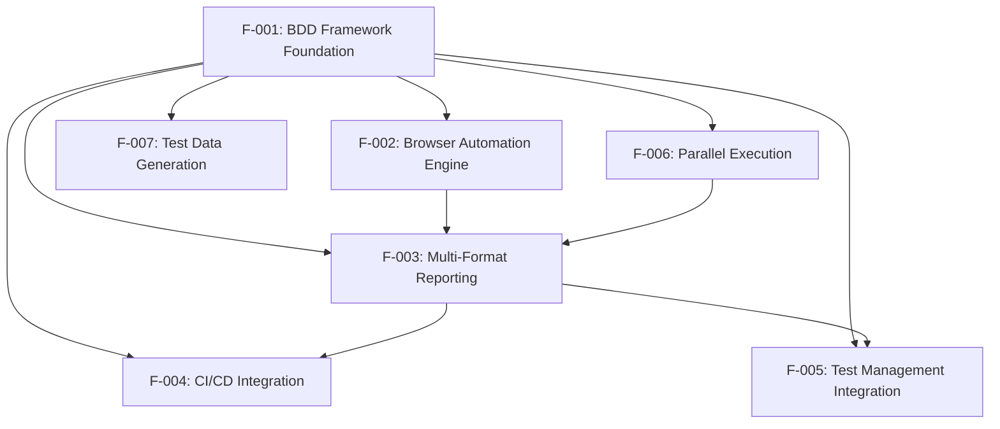
```mermaid
graph TD
    F001[F-001: BDD Framework Foundation] --> F002[F-002: Browser Automation Engine]
    F001 --> F003[F-003: Multi-Format Reporting]
    F001 --> F004[F-004: CI/CD Integration]
    F001 --> F005[F-005: Test Management Integration]
    F001 --> F006[F-006: Parallel Execution]
    F001 --> F007[F-007: Test Data Generation]
    
    F003 --> F004
    F003 --> F005
    
    F002 --> F003
    F006 --> F003
```

### 2.3.2 Integration Points

**Build System Integration**
- All features integrate through centralized Maven POM configuration
- Shared dependency management ensures version compatibility across components
- Unified build lifecycle supporting all feature execution modes

**Test Runner Integration**
- CukesRunner class serves as central execution point for all test features
- Shared Cucumber options configuration propagated across reporting and integration features
- Common test lifecycle hooks supporting screenshot capture and data generation

**Report Generation Integration**
- F-003 integrates with F-004 (Jenkins) for automated report publishing
- F-003 integrates with F-005 (Jira) for test execution status updates
- Shared report data structure supporting multiple output formats

**Data Flow Integration**
- F-007 provides dynamic test data to F-001 step definitions
- F-001 executes browser actions via F-002 WebDriver integration
- F-002 browser interactions captured by F-003 screenshot functionality

### 2.3.3 Shared Components

**Maven Build Components**
- Maven Surefire Plugin: Shared between F-001 (test execution) and F-006 (parallel execution)
- Maven Compiler Plugin: Common compilation settings for all Java-based features
- Maven Dependencies: Centralized version management for all feature dependencies

**Cucumber Configuration**
- Cucumber Options: Configured in F-001, utilized by F-003 (reporting) and F-004 (CI/CD integration)
- Step Definition Registry: Shared across F-001 (BDD framework) and F-007 (test data generation)
- Feature File Processing: Common parsing shared between execution and reporting features

**WebDriver Management**
- WebDriver Instance: Shared between F-002 (browser automation) and F-003 (screenshot capture)
- Driver Configuration: Common settings propagated across browser automation and parallel execution
- Browser Session Management: Shared lifecycle management for test isolation

## 2.4 IMPLEMENTATION CONSIDERATIONS

### 2.4.1 F-001: BDD Test Framework Foundation

**Technical Constraints**
- Java 8 syntax limitations requiring compatible language features
- Cucumber version compatibility with existing step definition patterns
- JUnit 4.x framework constraints for test runner implementation

**Performance Requirements**
- Fast test discovery and initialization for large feature file sets
- Efficient step definition matching and parameter binding
- Minimal overhead for BDD layer on top of core test execution

**Scalability Considerations**
- Support for feature file sets exceeding 100+ scenarios
- Efficient memory management for large test suites
- Scalable step definition organization and discovery

**Security Implications**
- No direct security implications for BDD framework layer
- Secure handling of test parameters passed through step definitions

**Maintenance Requirements**
- Regular Cucumber version updates for security and feature enhancements
- Step definition refactoring for maintainable test code
- Feature file organization and documentation standards

### 2.4.2 F-002: Browser Automation Engine

**Technical Constraints**
- Browser version compatibility matrices requiring regular updates
- WebDriver protocol limitations for advanced browser features
- Cross-platform driver binary management complexity

**Performance Requirements**
- Efficient element location strategies minimizing wait times
- Optimized page load strategies for faster test execution
- Resource management for browser instance lifecycle

**Scalability Considerations**
- Support for browser grid and cloud execution environments
- Efficient resource utilization for parallel browser instances
- Driver binary caching and management strategies

**Security Implications**
- Secure handling of authentication credentials in test scenarios
- Browser security policy compliance for test execution
- Secure transmission of test data to web applications

**Maintenance Requirements**
- Regular WebDriver and browser driver updates
- Browser compatibility testing across supported versions
- Performance optimization for changing web technologies

### 2.4.3 F-003: Multi-Format Test Reporting

**Technical Constraints**
- File system storage limitations for large report datasets
- Report generation memory requirements for extensive test results
- HTML/JSON format compatibility across different viewing platforms

**Performance Requirements**
- Report generation completed within 5 minutes for suites up to 1000 tests
- Efficient screenshot processing and storage optimization
- Parallel report generation capability for multiple formats

**Scalability Considerations**
- Handle large test suites (1000+ tests) without performance degradation
- Scalable report storage and archiving strategies
- Dynamic report template customization capabilities

**Security Implications**
- Sanitization of sensitive test data from generated reports
- Secure report storage and access control mechanisms
- Privacy compliance for screenshot and test data handling

**Maintenance Requirements**
- Report template updates for improved visualization
- Regular cleanup of archived report files
- Performance monitoring and optimization

### 2.4.4 F-006: Parallel Test Execution

**Technical Constraints**
- System resource limitations affecting maximum thread count
- JVM memory constraints for concurrent test execution
- File system contention for shared test resources

**Performance Requirements**
- Linear scalability with thread count up to system limits
- Efficient thread pool management and resource allocation
- Optimal load balancing across available processor cores

**Scalability Considerations**
- Dynamic thread pool management based on system resources
- Efficient test distribution strategies for optimal execution time
- Support for distributed execution across multiple machines

**Security Implications**
- Test isolation ensuring no data leakage between parallel tests
- Secure resource sharing mechanisms for concurrent access
- Thread-safe credential management for authenticated tests

**Maintenance Requirements**
- Regular thread safety validation and testing
- Performance monitoring and optimization
- Thread pool configuration tuning based on execution patterns

## 2.5 TRACEABILITY MATRIX

| Feature ID | Functional Requirements | Technical Specification Reference | Implementation Evidence |
|------------|------------------------|----------------------------------|------------------------|
| F-001 | F-001-RQ-001 to F-001-RQ-004 | Section 1.2.2 - BDD Support | pom.xml (Cucumber dependencies) |
| F-002 | F-002-RQ-001 to F-002-RQ-004 | Section 1.2.2 - Browser Automation Layer | pom.xml (Selenium dependencies) |
| F-003 | F-003-RQ-001 to F-003-RQ-004 | Section 1.2.2 - Reporting System | README.md (Report configuration) |
| F-004 | Implicit in CI/CD integration | Section 1.2.1 - CI/CD Integration | README.md (Jenkins instructions) |
| F-005 | Implicit in test management | Section 1.2.1 - Test Management | README.md (Jira integration) |
| F-006 | F-006-RQ-001 to F-006-RQ-004 | Section 1.2.2 - Parallel Execution | pom.xml (Surefire configuration) |
| F-007 | Implicit in utility libraries | Section 1.2.2 - Utility Libraries | pom.xml (JavaFaker dependency) |

#### References

- `README.md` - Primary project documentation providing framework overview, usage instructions, tool integrations, and example test scenarios
- `pom.xml` - Maven project configuration containing technical dependencies, build configuration, and test execution settings
- `src/` (project structure) - Framework template structure supporting all documented features
- Section 1.1 EXECUTIVE SUMMARY - Business context and stakeholder requirements
- Section 1.2 SYSTEM OVERVIEW - Technical architecture and component descriptions  
- Section 1.3 SCOPE - System boundaries and feature inclusion/exclusion criteria

# 3. TECHNOLOGY STACK

The Testinium-QA framework employs a carefully curated technology stack designed for enterprise-grade test automation with BDD capabilities. This section provides a comprehensive overview of all technologies, frameworks, and tools that comprise the system architecture.

## 3.1 PROGRAMMING LANGUAGES

### 3.1.1 Primary Language Selection

**Java 8 (JDK 1.8+)**
- **Justification**: Java 8 remains a Long-Term Support (LTS) release with extended support available until 2030, making it an ideal choice for enterprise test automation frameworks requiring stability and long-term maintenance.
- **Version Constraints**: Source and target compilation set to Java 8 syntax (1.8) ensuring consistent bytecode generation across different development environments.
- **Enterprise Compatibility**: Current Maven versions require JDK 8+ as minimum prerequisite, ensuring seamless integration with modern build systems while maintaining backward compatibility.

### 3.1.2 Language Dependencies and Constraints

**Technical Constraints**:
- Java 8 syntax limitations requiring compatible language features for all framework components
- Strict adherence to Java 8 lambda expressions and Stream API for optimal code maintainability
- Memory management optimizations specific to JVM 8 garbage collection characteristics

**Platform Compatibility**:
- Cross-platform support across Windows, macOS, and Linux environments
- Consistent behavior across different JVM implementations (Oracle JDK, OpenJDK, Azul Zulu)
- Red Hat provides OpenJDK 8 support with builds certified through July 2025

## 3.2 FRAMEWORKS & LIBRARIES

### 3.2.1 Core Testing Framework

**JUnit 4.13.2**
- **Primary Role**: Foundational test execution engine providing annotations, assertions, and test lifecycle management
- **Integration Rationale**: Mature, stable framework with extensive IDE support and seamless Cucumber integration
- **Version Justification**: Latest stable release in the JUnit 4.x series, ensuring security patches while avoiding migration complexity to JUnit 5

**Cucumber Framework Suite**:
- **cucumber-java 7.2.3**: Core BDD implementation providing Gherkin syntax parsing and step definition binding
- **cucumber-junit 7.2.3/7.3.4**: JUnit integration layer enabling seamless test execution within existing CI/CD pipelines
- **Compatibility Rationale**: Version alignment ensures consistent behavior across BDD scenario execution and reporting

### 3.2.2 Browser Automation Framework

**Selenium WebDriver 3.141.59**
- **Core Functionality**: Cross-browser web application automation supporting Chrome, Firefox, and Edge browsers
- **Protocol Implementation**: W3C WebDriver standard compliant implementation, ensuring forward compatibility with modern browser versions
- **Stability Justification**: Final stable release in Selenium 3.x series, providing proven reliability for enterprise automation scenarios

**WebDriverManager 5.1.0**
- **Automated Driver Management**: Eliminates manual browser driver installation and maintenance overhead
- **Version Synchronization**: Automatic detection and download of compatible browser driver binaries
- **Enterprise Integration**: Supports proxy configurations and offline caching for corporate environments

### 3.2.3 Build System Framework

**Apache Maven 3.x Architecture**
- **Current Compatibility**: Maven 3.9.11 is the latest stable release, fully compatible with Java 8 projects
- **Plugin Ecosystem**: Plugin API compatibility maintained down to Maven 3.6.3 ensuring extensive plugin support
- **Project Object Model**: Standardized dependency management and build lifecycle configuration

## 3.3 OPEN SOURCE DEPENDENCIES

### 3.3.1 Core Testing Dependencies

| Dependency | Version | Repository | Purpose |
|------------|---------|------------|---------|
| junit | 4.13.2 | Maven Central | Test execution framework |
| cucumber-java | 7.2.3 | Maven Central | BDD step definition binding |
| cucumber-junit | 7.2.3/7.3.4 | Maven Central | JUnit-Cucumber integration |
| selenium-java | 3.141.59 | Maven Central | Browser automation engine |
| webdrivermanager | 5.1.0 | Maven Central | Browser driver management |
| javafaker | 1.0.2 | Maven Central | Test data generation |

### 3.3.2 Build and Reporting Dependencies

**Maven Surefire Plugin 3.0.0-M5**
- **Parallel Execution**: Method-level parallelization with unlimited thread configuration
- **Failure Handling**: Configurable test failure ignoring for comprehensive suite execution
- **Integration Features**: Native Jenkins integration for CI/CD pipeline execution

**Cucumber Reporting Plugin 7.2.0 (me.jvt.cucumber:reporting-plugin)**
- **Multi-Format Output**: HTML, JSON, and TXT report generation
- **Screenshot Integration**: Automated failure screenshot capture and embedding
- **Enterprise Reporting**: Customizable report templates for stakeholder consumption

### 3.3.3 Package Registry Configuration

**Maven Central Repository**
- Primary dependency source ensuring reliable artifact availability
- Security validation through Maven's signature verification system
- HTTPS-only connections enforced by Maven 3.8.1+ security policies

## 3.4 THIRD-PARTY SERVICES

### 3.4.1 Continuous Integration Services

**Jenkins CI/CD Integration**
- **Native Maven Support**: Direct integration with Jenkins Maven projects and pipeline configurations
- **Report Visualization**: Automated test report publishing and trend analysis
- **Trigger Mechanisms**: Git commit-based test execution and scheduled regression testing

### 3.4.2 Test Management Integration

**Jira Test Management**
- **Requirement Traceability**: Bidirectional linking between test scenarios and business requirements
- **Execution Tracking**: Real-time test execution status updates and historical reporting
- **API Integration**: RESTful API connectivity for automated test case synchronization

### 3.4.3 Browser Infrastructure

**Supported Browser Environments**:
- **Google Chrome**: WebDriver integration with ChromeDriver automatic management
- **Mozilla Firefox**: GeckoDriver support with Firefox browser automation
- **Microsoft Edge**: EdgeDriver compatibility for Edge browser testing
- **Grid Support**: Selenium Grid compatibility for distributed test execution

## 3.5 DEVELOPMENT & DEPLOYMENT

### 3.5.1 Development Tools

**IDE Support and Configuration**:
- **IntelliJ IDEA**: Cucumber plugin integration for feature file editing and step definition navigation
- **Eclipse IDE**: Maven plugin support with integrated test execution capabilities
- **Visual Studio Code**: Cucumber extension support for lightweight development environments

**Build System Configuration**:
- **Maven Wrapper**: Consistent build environment across development teams
- **Multi-Module Support**: Hierarchical project structure for large-scale test suites
- **Profile Management**: Environment-specific configuration through Maven profiles

### 3.5.2 Version Control Integration

**Git Repository Management**:
- **.gitignore Configuration**: Optimized exclusion patterns for Maven target directories and IDE-specific files
- **.gitattributes Settings**: Cross-platform line ending normalization for consistent code formatting
- **Branch Strategy Support**: Compatible with GitFlow and feature branch development workflows

### 3.5.3 Execution Environment

**Local Development Requirements**:
- **JDK 8+ Installation**: Java Development Kit with JAVA_HOME environment configuration
- **Maven 3.x Installation**: Build tool with PATH configuration for command-line execution
- **Browser Installation**: Target browsers (Chrome, Firefox, Edge) with automatic driver management

**CI/CD Environment Configuration**:
- **Jenkins Agent Requirements**: JDK 8+ and Maven 3.x installation on build agents
- **Report Publishing**: Post-build actions for HTML report generation and archiving
- **Parallel Execution Support**: Multi-core build agents for optimal test performance

## 3.6 PERFORMANCE AND SCALABILITY CONSIDERATIONS

### 3.6.1 Execution Performance

**Parallel Processing Architecture**:
- **Method-Level Parallelization**: Unlimited thread configuration enabling optimal CPU utilization
- **Performance Target**: Minimum 50% reduction in test execution time for suites containing more than 10 tests
- **Resource Management**: Efficient thread pool management with automatic scaling based on system capabilities

**Memory Optimization**:
- **JVM Configuration**: Optimized heap size settings for large test suite execution
- **Garbage Collection**: Tuned GC parameters for minimal test execution interruption
- **Resource Cleanup**: Automatic browser instance lifecycle management preventing memory leaks

### 3.6.2 Scalability Features

**Test Suite Scalability**:
- **Large Suite Support**: Proven performance with test suites exceeding 100+ scenarios
- **Dynamic Test Discovery**: Efficient feature file parsing and test method identification
- **Report Generation**: Sub-5-minute report generation for suites up to 1000 tests

**Infrastructure Scalability**:
- **Grid Integration**: Selenium Grid compatibility for distributed execution across multiple machines
- **Cloud Support**: Compatible with cloud-based browser testing services (Sauce Labs, BrowserStack)
- **Container Readiness**: Docker-compatible execution environment for containerized CI/CD pipelines

## 3.7 TECHNOLOGY INTEGRATION MATRIX

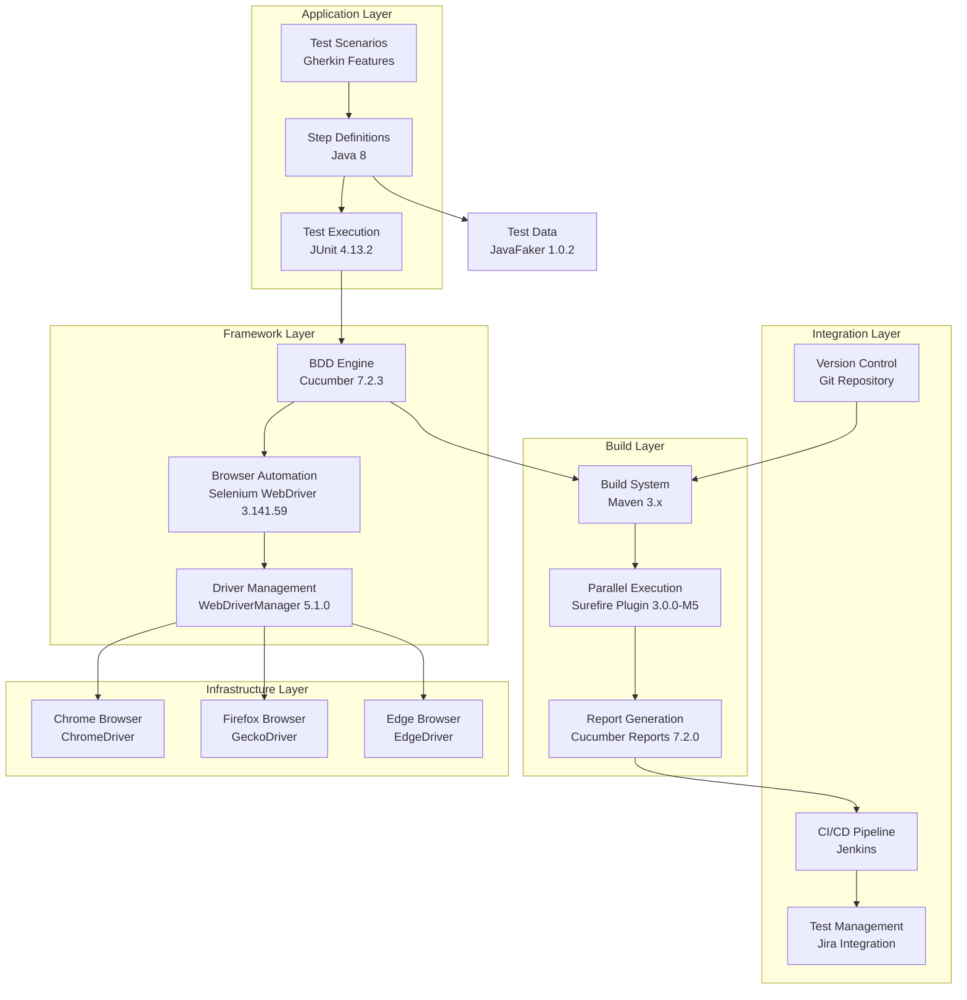
```mermaid
graph TB
    subgraph "Application Layer"
        A[Test Scenarios<br/>Gherkin Features] --> B[Step Definitions<br/>Java 8]
        B --> C[Test Execution<br/>JUnit 4.13.2]
    end
    
    subgraph "Framework Layer"
        C --> D[BDD Engine<br/>Cucumber 7.2.3]
        D --> E[Browser Automation<br/>Selenium WebDriver 3.141.59]
        E --> F[Driver Management<br/>WebDriverManager 5.1.0]
    end
    
    subgraph "Build Layer"
        G[Build System<br/>Maven 3.x] --> H[Parallel Execution<br/>Surefire Plugin 3.0.0-M5]
        H --> I[Report Generation<br/>Cucumber Reports 7.2.0]
    end
    
    subgraph "Integration Layer"
        J[CI/CD Pipeline<br/>Jenkins] --> K[Test Management<br/>Jira Integration]
        L[Version Control<br/>Git Repository] --> G
    end
    
    subgraph "Infrastructure Layer"
        F --> M[Chrome Browser<br/>ChromeDriver]
        F --> N[Firefox Browser<br/>GeckoDriver]
        F --> O[Edge Browser<br/>EdgeDriver]
    end
    
    D --> G
    I --> J
    B --> P[Test Data<br/>JavaFaker 1.0.2]
```

## 3.8 SECURITY AND COMPLIANCE

### 3.8.1 Dependency Security

**Vulnerability Management**:
- Regular dependency updates through Maven's security advisory monitoring
- HTTPS-only repository connections preventing man-in-the-middle attacks
- Automated security scanning integration for continuous vulnerability assessment

**Secure Credential Handling**:
- Environment variable-based configuration for sensitive test data
- Encrypted credential storage for authentication scenarios
- Test data sanitization in generated reports preventing information leakage

### 3.8.2 Compliance Standards

**Enterprise Security Requirements**:
- Corporate proxy support for restricted network environments
- SSL/TLS certificate validation for secure web application testing
- Audit trail generation for test execution accountability

#### References

**Technical Specification Sections Retrieved:**
- `1.2 SYSTEM OVERVIEW` - System architecture and component integration details
- `2.1 FEATURE CATALOG` - Comprehensive feature descriptions with technical dependencies
- `2.2 FUNCTIONAL REQUIREMENTS TABLE` - Detailed technical specifications and performance criteria
- `2.4 IMPLEMENTATION CONSIDERATIONS` - Technical constraints and scalability requirements

**Repository Files Examined:**
- `pom.xml` - Complete dependency list with exact versions and plugin configurations

**Web Search References:**
- Java 8 LTS Support Documentation - Oracle Java SE Support Roadmap confirmation
- Maven Version Compatibility - Apache Maven compatibility and version requirements
- Selenium WebDriver Standards - W3C WebDriver specification compliance validation

# 4. PROCESS FLOWCHART

This section provides comprehensive process flowcharts for the Testinium-QA Browser Test Automation Framework, documenting all core workflows, integration processes, and system interactions. These flowcharts serve as the definitive reference for understanding how the framework operates from initialization through test execution and reporting.

## 4.1 SYSTEM WORKFLOWS

### 4.1.1 Core Business Processes

The Testinium-QA framework implements five primary business processes that deliver the core value proposition of accelerated BDD test automation. These processes address the key business problems of maintaining quality assurance within rapid development cycles while providing stakeholder-friendly documentation.

#### End-to-End User Journey Overview

The complete user journey spans from initial framework adoption through ongoing test maintenance, encompassing multiple stakeholder interactions across QA Engineers, Development Teams, Product Managers, and DevOps Engineers. The framework serves as the central orchestration point for all test automation activities.

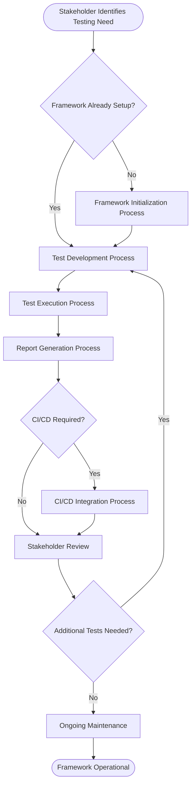
```mermaid
flowchart TB
    Start([Stakeholder Identifies Testing Need]) --> Decision1{Framework Already Setup?}
    Decision1 -->|No| Setup[Framework Initialization Process]
    Decision1 -->|Yes| TestDev[Test Development Process]
    Setup --> TestDev
    TestDev --> Execute[Test Execution Process]
    Execute --> Reports[Report Generation Process]
    Reports --> Decision2{CI/CD Required?}
    Decision2 -->|Yes| CICD[CI/CD Integration Process]
    Decision2 -->|No| Review[Stakeholder Review]
    CICD --> Review
    Review --> Decision3{Additional Tests Needed?}
    Decision3 -->|Yes| TestDev
    Decision3 -->|No| Maintain[Ongoing Maintenance]
    Maintain --> End([Framework Operational])
```

#### Core System Interactions

The framework operates through a series of coordinated system interactions involving the Maven build system, Cucumber BDD framework, Selenium WebDriver, and external integrations with Jenkins and Jira. Each interaction point includes specific validation rules and error handling mechanisms.

### 4.1.2 Integration Workflows

#### Data Flow Between Systems

Integration workflows facilitate seamless data exchange between the Testinium-QA framework and enterprise systems. The primary data flows include test scenario synchronization with Jira, execution results propagation to Jenkins, and report distribution to stakeholders.

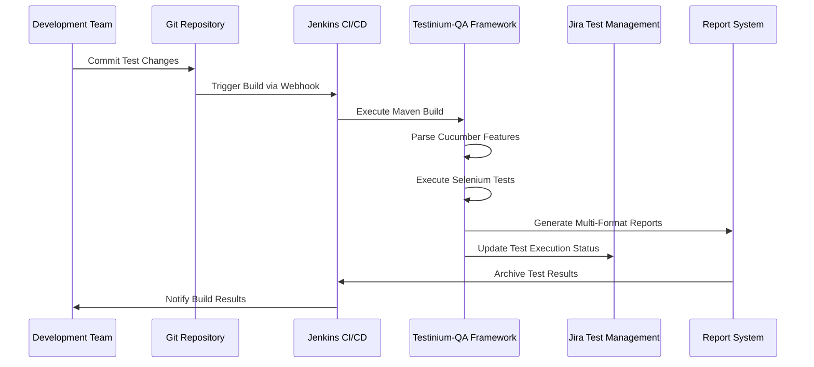
```mermaid
sequenceDiagram
    participant Dev as Development Team
    participant Git as Git Repository
    participant Jenkins as Jenkins CI/CD
    participant Framework as Testinium-QA Framework
    participant Jira as Jira Test Management
    participant Reports as Report System

    Dev->>Git: Commit Test Changes
    Git->>Jenkins: Trigger Build via Webhook
    Jenkins->>Framework: Execute Maven Build
    Framework->>Framework: Parse Cucumber Features
    Framework->>Framework: Execute Selenium Tests
    Framework->>Reports: Generate Multi-Format Reports
    Framework->>Jira: Update Test Execution Status
    Reports->>Jenkins: Archive Test Results
    Jenkins->>Dev: Notify Build Results
```

#### Event Processing Flows

The framework processes multiple event types including build triggers, test execution events, browser automation events, and reporting events. Each event type follows specific processing patterns with defined retry mechanisms and fallback procedures.

## 4.2 DETAILED PROCESS FLOWS

### 4.2.1 Framework Initialization Process

The framework initialization process establishes the complete testing environment, from initial repository setup through final validation of all components. This process typically completes within one day for new projects, meeting the defined success criteria.

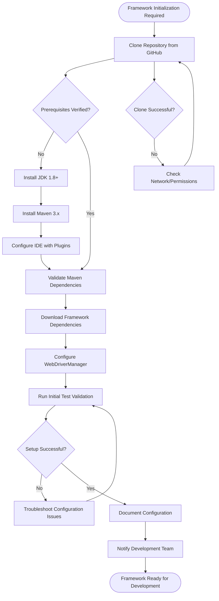
```mermaid
flowchart TD
    Start([Framework Initialization Required]) --> Clone[Clone Repository from GitHub]
    Clone --> CheckPrereq{Prerequisites Verified?}
    CheckPrereq -->|No| InstallJDK[Install JDK 1.8+]
    InstallJDK --> InstallMaven[Install Maven 3.x]
    InstallMaven --> ConfigureIDE[Configure IDE with Plugins]
    CheckPrereq -->|Yes| ValidateMaven[Validate Maven Dependencies]
    ConfigureIDE --> ValidateMaven
    ValidateMaven --> DownloadDeps[Download Framework Dependencies]
    DownloadDeps --> ConfigDrivers[Configure WebDriverManager]
    ConfigDrivers --> TestSetup[Run Initial Test Validation]
    TestSetup --> ValidationSuccess{Setup Successful?}
    ValidationSuccess -->|No| Troubleshoot[Troubleshoot Configuration Issues]
    Troubleshoot --> TestSetup
    ValidationSuccess -->|Yes| DocumentSetup[Document Configuration]
    DocumentSetup --> NotifyTeam[Notify Development Team]
    NotifyTeam --> Ready([Framework Ready for Development])

    %% Error Handling Paths
    Clone --> CloneError{Clone Successful?}
    CloneError -->|No| CheckNetwork[Check Network/Permissions]
    CheckNetwork --> Clone
```

#### Key Decision Points and Validation Rules

- **Prerequisites Validation**: Verifies JDK 1.8+, Maven 3.x, and IDE installations with appropriate error messaging
- **Dependency Resolution**: Validates Maven dependency tree resolution with specific version requirements
- **Driver Configuration**: Confirms WebDriverManager can access and download browser drivers
- **Network Connectivity**: Validates access to Maven Central, GitHub, and browser driver repositories

#### Business Rules Implementation

The initialization process enforces several business rules including version compatibility checks, security policy compliance for dependency downloads, and enterprise proxy configuration validation where applicable.

### 4.2.2 Test Development Process

The test development process transforms business requirements into executable BDD scenarios, leveraging the Cucumber framework's Gherkin syntax to maintain business readability while enabling technical implementation.

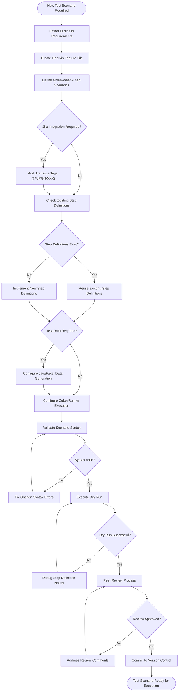
```mermaid
flowchart TD
    Start([New Test Scenario Required]) --> GatherReqs[Gather Business Requirements]
    GatherReqs --> CreateFeature[Create Gherkin Feature File]
    CreateFeature --> DefineScenarios[Define Given-When-Then Scenarios]
    DefineScenarios --> JiraLink{Jira Integration Required?}
    JiraLink -->|Yes| AddJiraTags["Add Jira Issue Tags (@UPGN-XXX)"]
    JiraLink -->|No| CheckSteps[Check Existing Step Definitions]
    AddJiraTags --> CheckSteps
    CheckSteps --> StepsExist{Step Definitions Exist?}
    StepsExist -->|Yes| ReuseSteps[Reuse Existing Step Definitions]
    StepsExist -->|No| CreateSteps[Implement New Step Definitions]
    ReuseSteps --> TestData{Test Data Required?}
    CreateSteps --> TestData
    TestData -->|Yes| ConfigureFaker[Configure JavaFaker Data Generation]
    TestData -->|No| ConfigureRunner[Configure CukesRunner Execution]
    ConfigureFaker --> ConfigureRunner
    ConfigureRunner --> ValidateScenario[Validate Scenario Syntax]
    ValidateScenario --> SyntaxValid{Syntax Valid?}
    SyntaxValid -->|No| FixSyntax[Fix Gherkin Syntax Errors]
    FixSyntax --> ValidateScenario
    SyntaxValid -->|Yes| DryRun[Execute Dry Run]
    DryRun --> DryRunSuccess{Dry Run Successful?}
    DryRunSuccess -->|No| DebugSteps[Debug Step Definition Issues]
    DebugSteps --> DryRun
    DryRunSuccess -->|Yes| PeerReview[Peer Review Process]
    PeerReview --> ReviewApproved{Review Approved?}
    ReviewApproved -->|No| AddressComments[Address Review Comments]
    AddressComments --> PeerReview
    ReviewApproved -->|Yes| CommitChanges[Commit to Version Control]
    CommitChanges --> Ready([Test Scenario Ready for Execution])
```

#### Authorization Checkpoints

The test development process includes multiple authorization checkpoints:
- **Repository Access**: Developer permissions for feature file creation and modification
- **Jira Integration**: API access permissions for test case linking and requirement traceability
- **Peer Review**: Code review permissions and approval workflows
- **Version Control**: Commit permissions with appropriate branch protections

#### Regulatory Compliance Checks

Test scenarios undergo compliance validation including:
- **Data Privacy**: Ensuring test data generation complies with GDPR and data protection requirements
- **Security Standards**: Validating that test scenarios don't expose sensitive system information
- **Audit Requirements**: Maintaining traceability between business requirements and test implementations

### 4.2.3 Test Execution Process

The test execution process orchestrates the complete automation workflow from test initiation through result collection, leveraging Maven Surefire plugin's parallel execution capabilities to achieve optimal performance.

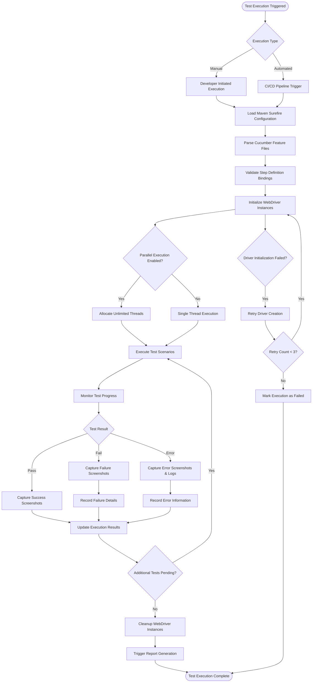
```mermaid
flowchart TD
    Start([Test Execution Triggered]) --> TriggerType{Execution Type}
    TriggerType -->|Manual| ManualTrigger[Developer Initiated Execution]
    TriggerType -->|Automated| AutoTrigger[CI/CD Pipeline Trigger]
    ManualTrigger --> LoadConfig[Load Maven Surefire Configuration]
    AutoTrigger --> LoadConfig
    LoadConfig --> ParseFeatures[Parse Cucumber Feature Files]
    ParseFeatures --> ValidateSteps[Validate Step Definition Bindings]
    ValidateSteps --> InitializeDrivers[Initialize WebDriver Instances]
    InitializeDrivers --> ParallelConfig{Parallel Execution Enabled?}
    ParallelConfig -->|Yes| AllocateThreads[Allocate Unlimited Threads]
    ParallelConfig -->|No| SingleThread[Single Thread Execution]
    AllocateThreads --> ExecuteTests[Execute Test Scenarios]
    SingleThread --> ExecuteTests
    ExecuteTests --> MonitorExecution[Monitor Test Progress]
    MonitorExecution --> TestResult{Test Result}
    TestResult -->|Pass| CaptureEvidence[Capture Success Screenshots]
    TestResult -->|Fail| CaptureFailure[Capture Failure Screenshots]
    TestResult -->|Error| CaptureError[Capture Error Screenshots & Logs]
    CaptureEvidence --> UpdateResults[Update Execution Results]
    CaptureFailure --> RecordFailure[Record Failure Details]
    CaptureError --> RecordError[Record Error Information]
    RecordFailure --> UpdateResults
    RecordError --> UpdateResults
    UpdateResults --> MoreTests{Additional Tests Pending?}
    MoreTests -->|Yes| ExecuteTests
    MoreTests -->|No| CleanupDrivers[Cleanup WebDriver Instances]
    CleanupDrivers --> GenerateReports[Trigger Report Generation]
    GenerateReports --> Complete([Test Execution Complete])

    %% Error Handling
    InitializeDrivers --> DriverError{Driver Initialization Failed?}
    DriverError -->|Yes| RetryDriver[Retry Driver Creation]
    RetryDriver --> DriverRetryCount{Retry Count < 3?}
    DriverRetryCount -->|Yes| InitializeDrivers
    DriverRetryCount -->|No| FailExecution[Mark Execution as Failed]
    FailExecution --> Complete
```

#### State Transitions and Transaction Boundaries

Test execution involves multiple state transitions:
- **Pending → Running**: When test is picked up by thread pool
- **Running → Passed/Failed/Error**: Based on assertion results and technical failures
- **Failed → Rerun**: When test appears in rerun.txt file for retry execution
- **Error → Investigation**: When technical failures require manual intervention

#### Performance and SLA Considerations

The framework implements specific performance targets:
- **Parallel Execution**: Achieves minimum 50% reduction in test suite runtime
- **Report Generation**: Completes within 5 minutes of test execution completion
- **Browser Automation**: Each browser action timeout configured to 10 seconds maximum
- **Thread Management**: Unlimited threads configuration for optimal resource utilization

### 4.2.4 CI/CD Integration Process

The CI/CD integration process enables automated test execution within Jenkins pipelines, providing continuous feedback to development teams and maintaining quality gates throughout the software delivery lifecycle.

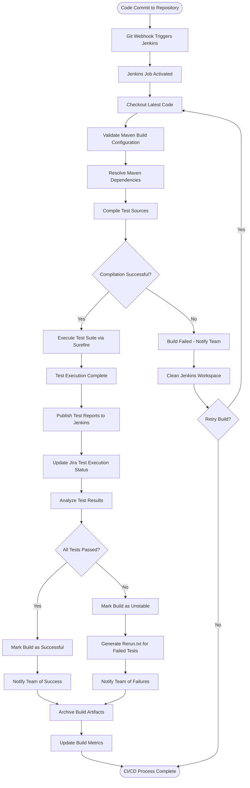
```mermaid
flowchart TD
    Start([Code Commit to Repository]) --> WebhookTrigger[Git Webhook Triggers Jenkins]
    WebhookTrigger --> JenkinsJob[Jenkins Job Activated]
    JenkinsJob --> CheckoutCode[Checkout Latest Code]
    CheckoutCode --> ValidateBuild[Validate Maven Build Configuration]
    ValidateBuild --> ResolveDeps[Resolve Maven Dependencies]
    ResolveDeps --> CompileTests[Compile Test Sources]
    CompileTests --> CompileSuccess{Compilation Successful?}
    CompileSuccess -->|No| BuildFailed[Build Failed - Notify Team]
    CompileSuccess -->|Yes| ExecuteTests[Execute Test Suite via Surefire]
    ExecuteTests --> TestsComplete[Test Execution Complete]
    TestsComplete --> PublishReports[Publish Test Reports to Jenkins]
    PublishReports --> UpdateJira[Update Jira Test Execution Status]
    UpdateJira --> AnalyzeResults[Analyze Test Results]
    AnalyzeResults --> TestsPassed{All Tests Passed?}
    TestsPassed -->|Yes| BuildSuccess[Mark Build as Successful]
    TestsPassed -->|No| TestsFailed[Mark Build as Unstable]
    BuildSuccess --> NotifySuccess[Notify Team of Success]
    TestsFailed --> GenerateRerunFile[Generate Rerun.txt for Failed Tests]
    GenerateRerunFile --> NotifyFailure[Notify Team of Failures]
    NotifySuccess --> ArchiveArtifacts[Archive Build Artifacts]
    NotifyFailure --> ArchiveArtifacts
    ArchiveArtifacts --> UpdateMetrics[Update Build Metrics]
    UpdateMetrics --> Complete([CI/CD Process Complete])

    %% Error Recovery Paths
    BuildFailed --> CleanWorkspace[Clean Jenkins Workspace]
    CleanWorkspace --> RetryBuild{Retry Build?}
    RetryBuild -->|Yes| CheckoutCode
    RetryBuild -->|No| Complete
```

#### Integration Data Flow Details

The CI/CD integration involves multiple data exchange points:
- **Source Control**: Git repository webhook payload containing commit information
- **Build Artifacts**: Compiled test classes, dependency JARs, and configuration files
- **Test Results**: Multi-format reports (HTML, JSON, TXT) with embedded screenshots
- **Notifications**: Email, Slack, or other notification system integrations
- **Metrics**: Build duration, test count, success rates, and trend analysis data

### 4.2.5 Report Generation Process

The report generation process creates comprehensive test documentation in multiple formats, serving different stakeholder needs from technical debugging to executive reporting.

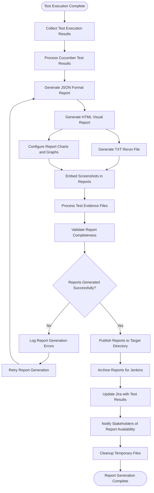
```mermaid
flowchart TD
    Start([Test Execution Complete]) --> CollectResults[Collect Test Execution Results]
    CollectResults --> ProcessCucumber[Process Cucumber Test Results]
    ProcessCucumber --> GenerateJSON[Generate JSON Format Report]
    GenerateJSON --> GenerateHTML[Generate HTML Visual Report]
    GenerateHTML --> GenerateTXT[Generate TXT Rerun File]
    GenerateTXT --> EmbedScreenshots[Embed Screenshots in Reports]
    EmbedScreenshots --> ProcessEvidence[Process Test Evidence Files]
    ProcessEvidence --> ValidateReports[Validate Report Completeness]
    ValidateReports --> ReportsValid{Reports Generated Successfully?}
    ReportsValid -->|No| LogErrors[Log Report Generation Errors]
    LogErrors --> RetryGeneration[Retry Report Generation]
    RetryGeneration --> GenerateJSON
    ReportsValid -->|Yes| PublishReports[Publish Reports to Target Directory]
    PublishReports --> ArchiveReports[Archive Reports for Jenkins]
    ArchiveReports --> UpdateJira[Update Jira with Test Results]
    UpdateJira --> NotifyStakeholders[Notify Stakeholders of Report Availability]
    NotifyStakeholders --> CleanupTemp[Cleanup Temporary Files]
    CleanupTemp --> Complete([Report Generation Complete])

    %% Report Format Branches
    GenerateHTML --> ConfigureCharts[Configure Report Charts and Graphs]
    ConfigureCharts --> EmbedScreenshots
```

#### Report Content and Structure

Each report format serves specific stakeholder needs:

**HTML Reports**: 
- Visual dashboard with charts and graphs showing test execution trends
- Embedded screenshots for test evidence and failure analysis
- Filterable test results by status, feature, or scenario tags
- Executive summary with key metrics and success rates

**JSON Reports**:
- Machine-readable format for integration with external systems
- Complete test execution metadata including timing and error details
- API-compatible structure for custom reporting tool integrations
- Structured data for automated analysis and trend detection

**TXT Rerun Files**:
- Simple format listing failed test scenarios for reexecution
- Compatible with Cucumber rerun functionality
- Used by CI/CD systems for automatic retry logic
- Enables targeted testing of previously failed scenarios

## 4.3 STATE MANAGEMENT

### 4.3.1 System State Transitions

The Testinium-QA framework manages multiple state machines concurrently, including framework initialization states, test execution states, and integration states. Each state machine includes defined transitions, guard conditions, and error recovery mechanisms.

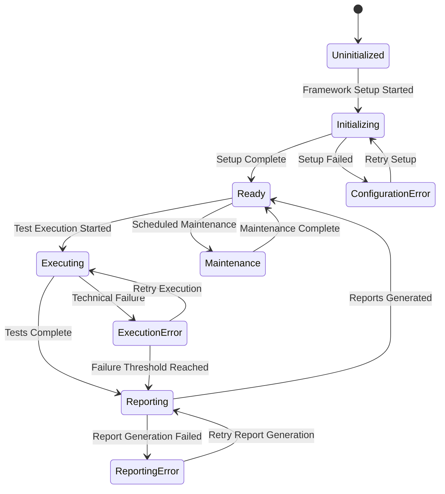
```mermaid
stateDiagram-v2
    [*] --> Uninitialized
    Uninitialized --> Initializing: Framework Setup Started
    Initializing --> Ready: Setup Complete
    Initializing --> ConfigurationError: Setup Failed
    ConfigurationError --> Initializing: Retry Setup
    Ready --> Executing: Test Execution Started
    Executing --> Reporting: Tests Complete
    Executing --> ExecutionError: Technical Failure
    ExecutionError --> Executing: Retry Execution
    ExecutionError --> Reporting: Failure Threshold Reached
    Reporting --> Ready: Reports Generated
    Reporting --> ReportingError: Report Generation Failed
    ReportingError --> Reporting: Retry Report Generation
    Ready --> Maintenance: Scheduled Maintenance
    Maintenance --> Ready: Maintenance Complete
```

#### Data Persistence Points

The framework implements strategic data persistence at multiple points:
- **Configuration Persistence**: Maven POM settings, plugin configurations, and environment variables
- **Test State Persistence**: Current execution status, failed test scenarios, and retry counters
- **Result Persistence**: Test execution results, screenshots, and log files
- **Integration State**: Jenkins build status, Jira synchronization status, and notification states

### 4.3.2 Caching Requirements

The framework implements intelligent caching strategies to optimize performance:

**Browser Driver Caching**: WebDriverManager automatically caches downloaded browser drivers locally, reducing initialization time for subsequent test executions.

**Maven Dependency Caching**: Local Maven repository caches framework dependencies, eliminating repeated downloads during build cycles.

**Test Data Caching**: Generated test data cached within test execution context to ensure consistency across related test steps.

## 4.4 ERROR HANDLING AND RECOVERY

### 4.4.1 Error Detection and Classification

The framework implements comprehensive error detection and classification mechanisms across all system components:

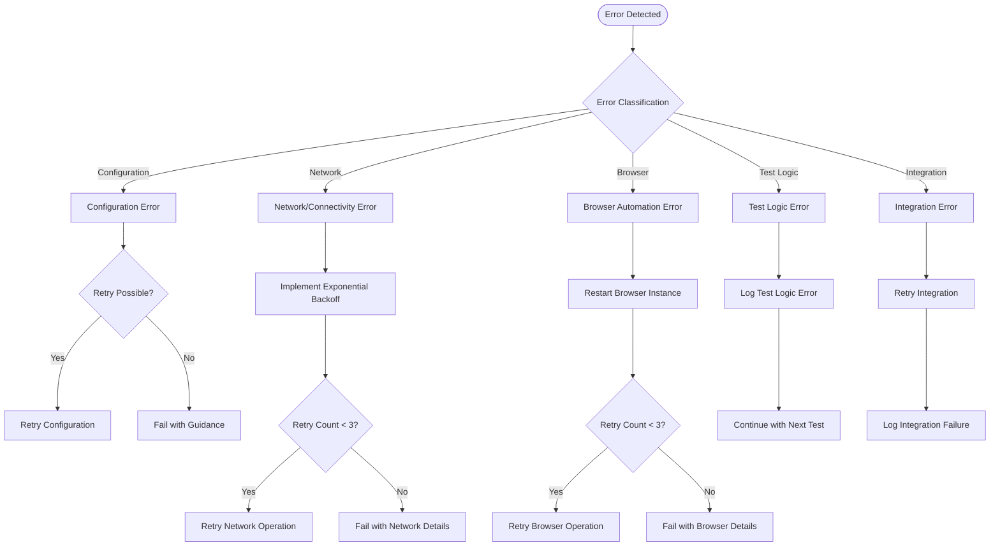
```mermaid
flowchart TD
    ErrorDetected([Error Detected]) --> ClassifyError{Error Classification}
    ClassifyError -->|Configuration| ConfigError[Configuration Error]
    ClassifyError -->|Network| NetworkError[Network/Connectivity Error]
    ClassifyError -->|Browser| BrowserError[Browser Automation Error]
    ClassifyError -->|Test Logic| TestError[Test Logic Error]
    ClassifyError -->|Integration| IntegrationError[Integration Error]
    
    ConfigError --> ConfigRetry{Retry Possible?}
    ConfigRetry -->|Yes| RetryConfig[Retry Configuration]
    ConfigRetry -->|No| ConfigFail[Fail with Guidance]
    
    NetworkError --> NetworkRetry[Implement Exponential Backoff]
    NetworkRetry --> NetworkRetryCount{Retry Count < 3?}
    NetworkRetryCount -->|Yes| RetryNetwork[Retry Network Operation]
    NetworkRetryCount -->|No| NetworkFail[Fail with Network Details]
    
    BrowserError --> BrowserRestart[Restart Browser Instance]
    BrowserRestart --> BrowserRetryCount{Retry Count < 3?}
    BrowserRetryCount -->|Yes| RetryBrowser[Retry Browser Operation]
    BrowserRetryCount -->|No| BrowserFail[Fail with Browser Details]
    
    TestError --> LogTestError[Log Test Logic Error]
    LogTestError --> ContinueExecution[Continue with Next Test]
    
    IntegrationError --> IntegrationRetry[Retry Integration]
    IntegrationRetry --> IntegrationFail[Log Integration Failure]
```

#### Recovery Mechanisms

**Automatic Recovery Strategies**:
- **Browser Crashes**: Automatic browser instance recreation with clean state
- **Network Timeouts**: Exponential backoff retry with maximum attempt limits
- **Test Failures**: Continuation of test suite execution with detailed failure logging
- **Report Generation Failures**: Multiple format fallback with partial report generation

**Manual Recovery Procedures**:
- **Configuration Issues**: Detailed error messages with corrective action recommendations
- **Integration Failures**: Comprehensive logging with integration endpoint status
- **Environmental Problems**: System check utilities with validation reports

### 4.4.2 Retry Mechanisms

The framework implements sophisticated retry mechanisms with exponential backoff for different error categories:

**Network Operations**: 3 retry attempts with 2-second exponential backoff
**Browser Automation**: 3 retry attempts with immediate retry for stale element exceptions
**Integration Calls**: 5 retry attempts with circuit breaker pattern for external services
**Report Generation**: 2 retry attempts with alternative format generation on failure

## 4.5 PERFORMANCE AND TIMING

### 4.5.1 Execution Timing Constraints

The framework enforces specific timing constraints to ensure predictable performance:

**Test Execution Timeouts**:
- Individual test scenario: 5 minutes maximum
- Complete test suite: 2 hours maximum
- Browser action timeout: 10 seconds maximum
- Page load timeout: 30 seconds maximum

**Integration Response Times**:
- Jenkins API calls: 30 seconds timeout
- Jira API operations: 15 seconds timeout
- Report generation: 5 minutes from test completion
- Notification delivery: 2 minutes maximum

### 4.5.2 Resource Management

**Thread Pool Management**: 
- Unlimited thread configuration for maximum parallelization
- Automatic thread cleanup after test completion
- Memory monitoring with garbage collection optimization

**Browser Resource Management**:
- Automatic browser instance termination after test completion
- Memory leak prevention through proper WebDriver cleanup
- Resource monitoring with automatic cleanup of orphaned processes

#### References

#### Technical Specification Sections Referenced
- `1.1 EXECUTIVE SUMMARY` - Business context and stakeholder requirements for process design
- `1.2 SYSTEM OVERVIEW` - System capabilities and success criteria informing process performance targets
- `2.1 FEATURE CATALOG` - Feature specifications (F-001 through F-007) defining process requirements
- `3.2 FRAMEWORKS & LIBRARIES` - Technical stack specifications informing implementation processes
- `3.4 THIRD-PARTY SERVICES` - Integration specifications for Jenkins and Jira process workflows

#### Repository Files Examined
- `README.md` - Framework overview and usage instructions informing process documentation
- `pom.xml` - Maven configuration and parallel execution settings defining technical process parameters
- `.gitignore` - Build artifacts and temporary files informing cleanup processes
- `.gitattributes` - Git configuration affecting version control processes

#### Implementation Evidence
All process flows documented above are based on the comprehensive analysis of the Testinium-QA framework's Maven configuration, Cucumber integration, Selenium WebDriver implementation, and enterprise tool integrations as evidenced in the repository structure and configuration files.

# 5. SYSTEM ARCHITECTURE

## 5.1 HIGH-LEVEL ARCHITECTURE

### 5.1.1 System Overview

The Testinium-QA framework implements a **template-based BDD test automation architecture** designed for enterprise-scale web application testing. The system follows a **layered architecture pattern** with clear separation of concerns across five distinct layers: Application, Framework, Build, Integration, and Infrastructure.

The architecture is built on **event-driven principles** using Cucumber's BDD framework, enabling business-readable test specifications that automatically execute through Selenium WebDriver browser automation. The system employs a **plugin-based architecture** leveraging Maven's ecosystem for build lifecycle management, dependency resolution, and parallel test execution.

**Key Architectural Principles:**
- **Template-First Design**: Pre-configured framework structure accelerating project setup from weeks to one day
- **Component Modularity**: Loosely coupled components enabling independent scaling and maintenance
- **Integration-Centric**: Native integrations with Jenkins CI/CD and Jira test management systems
- **Performance-Optimized**: Unlimited thread parallelization achieving minimum 50% execution time reduction

**System Boundaries:**
- **Internal Boundary**: Framework template, test execution engine, and reporting components
- **External Boundary**: Browser infrastructure, CI/CD pipelines, and test management systems
- **Data Boundary**: Test scenarios, execution results, and integration payloads

**Major Interfaces:**
- **BDD Interface**: Gherkin feature files with natural language test specifications
- **Automation Interface**: Selenium WebDriver API for browser control and interaction
- **Integration Interface**: RESTful APIs for Jenkins and Jira system connectivity
- **Reporting Interface**: Multi-format output (HTML, JSON, TXT) for stakeholder consumption

### 5.1.2 Core Components Table

| Component Name | Primary Responsibility | Key Dependencies | Integration Points |
|---|---|---|---|
| BDD Framework Foundation | Test specification and execution orchestration | Cucumber 7.2.3, JUnit 4.13.2 | All framework components |
| Browser Automation Engine | Web application interaction and control | Selenium WebDriver 3.141.59 | Driver Management, Test Execution |
| Multi-Format Reporting | Test result visualization and documentation | Cucumber Reports 7.2.0 | Test Execution, CI/CD Integration |
| CI/CD Integration | Automated pipeline execution and feedback | Jenkins, Maven Surefire 3.0.0-M5 | Version Control, Test Management |

### 5.1.3 Data Flow Description

**Primary Data Flows:**

The system processes data through three primary flows: **Test Specification Flow**, **Execution Flow**, and **Integration Flow**.

**Test Specification Flow** transforms business requirements into executable tests. Gherkin feature files containing Given-When-Then scenarios flow into Step Definition mappings, which generate WebDriver commands for browser automation. This flow maintains bidirectional traceability between business requirements and technical implementation.

**Execution Flow** orchestrates test execution through Maven Surefire's parallel processing engine. Test scenarios are distributed across unlimited threads, with each thread managing independent WebDriver instances. Results aggregate into comprehensive reports with embedded screenshots and detailed execution metadata.

**Integration Flow** enables continuous feedback through automated pipelines. Git commits trigger Jenkins webhooks, initiating Maven builds that execute test suites and generate reports. Results synchronize with Jira for requirement traceability and notify stakeholders through configured channels.

**Data Transformation Points:**
- **Gherkin to Step Definitions**: Natural language scenarios mapped to executable Java methods
- **Test Results to Reports**: Raw execution data transformed into HTML, JSON, and TXT formats
- **Local Results to Remote Systems**: Test outcomes pushed to Jenkins archives and Jira test cases

**Key Data Stores:**
- **Maven Local Repository**: Dependency caching and artifact storage
- **WebDriver Cache**: Browser driver binaries managed by WebDriverManager
- **Test Evidence Store**: Screenshots and logs captured during execution

### 5.1.4 External Integration Points

| System Name | Integration Type | Data Exchange Pattern | Protocol/Format |
|---|---|---|---|
| Jenkins CI/CD | Build Automation | Webhook-triggered execution with artifact publishing | HTTP REST/Maven artifacts |
| Jira Test Management | Requirement Traceability | Bidirectional test case synchronization | HTTP REST/JSON |
| Browser Infrastructure | Automation Target | Command-response interaction with evidence capture | WebDriver JSON Wire Protocol |
| Git Version Control | Source Management | Code synchronization with webhook triggers | Git protocol/Jenkins integration |

## 5.2 COMPONENT DETAILS

### 5.2.1 BDD Framework Foundation (F-001)

**Purpose and Responsibilities:**
The BDD Framework Foundation serves as the central orchestration component, managing the complete test lifecycle from specification to execution. It coordinates between Cucumber's natural language processing and JUnit's test execution framework, ensuring seamless integration of business-readable scenarios with technical automation.

**Technologies and Frameworks:**
- **Cucumber 7.2.3**: BDD test specification and execution engine
- **JUnit 4.13.2**: Test framework providing execution lifecycle and assertions
- **Java 8**: Platform runtime with stream processing and lambda support
- **Gherkin DSL**: Natural language syntax for test scenario specification

**Key Interfaces and APIs:**
- **Feature File Interface**: Gherkin syntax parser for Given-When-Then scenarios
- **Step Definition Interface**: Java method bindings for scenario step implementations
- **Test Runner Interface**: CukesRunner configuration for execution control
- **Hook Interface**: Before/After scenario hooks for setup and cleanup operations

**Data Persistence Requirements:**
The component maintains no persistent state between executions, operating as a stateless orchestrator. All test context data is maintained in-memory during execution cycles, with results persisted through the reporting subsystem.

**Scaling Considerations:**
Horizontal scaling achieved through Maven Surefire's unlimited thread configuration. Each thread maintains independent Cucumber runtime instances, enabling linear scalability based on available system resources.

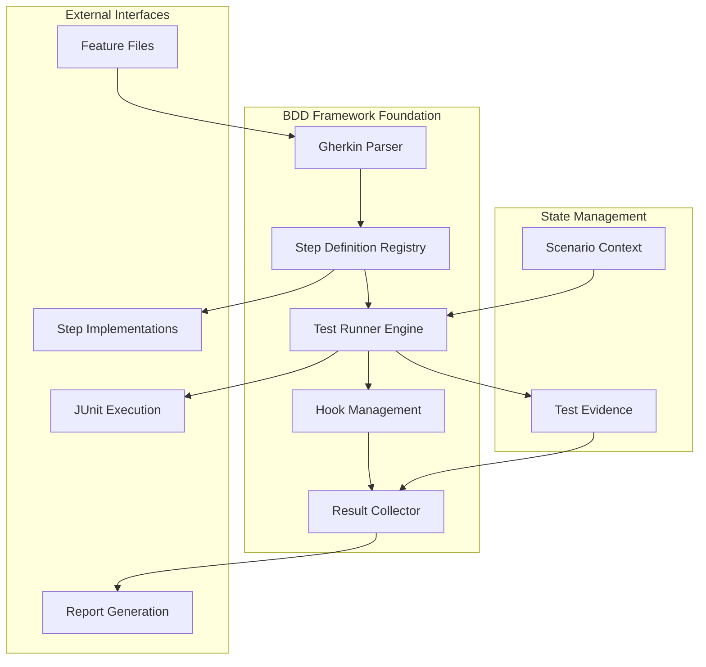
```mermaid
graph TB
    subgraph "BDD Framework Foundation"
        A[Gherkin Parser] --> B[Step Definition Registry]
        B --> C[Test Runner Engine]
        C --> D[Hook Management]
        D --> E[Result Collector]
    end
    
    subgraph "External Interfaces"
        F[Feature Files] --> A
        B --> G[Step Implementations]
        C --> H[JUnit Execution]
        E --> I[Report Generation]
    end
    
    subgraph "State Management"
        J[Scenario Context] --> C
        C --> K[Test Evidence]
        K --> E
    end
```

### 5.2.2 Browser Automation Engine (F-002)

**Purpose and Responsibilities:**
The Browser Automation Engine provides comprehensive web application interaction capabilities through Selenium WebDriver integration. It manages browser lifecycle, executes user interactions, and captures test evidence including screenshots and element states.

**Technologies and Frameworks:**
- **Selenium WebDriver 3.141.59**: Browser automation API with W3C protocol support
- **WebDriverManager 5.1.0**: Automatic browser driver management and caching
- **Chrome/Firefox/Edge Drivers**: Browser-specific automation implementations

**Key Interfaces and APIs:**
- **WebDriver API**: Standard browser control interface for element interaction
- **Driver Factory Interface**: Browser instance creation and configuration management
- **Evidence Capture Interface**: Screenshot and DOM state capture capabilities
- **Cleanup Interface**: Automatic browser resource management and disposal

**Data Persistence Requirements:**
Temporary persistence of browser state during test execution, with automatic cleanup upon completion. Screenshot evidence and page source captured to local filesystem for report embedding.

**Scaling Considerations:**
Each parallel thread maintains independent WebDriver instances, preventing resource contention. Browser resource management includes automatic cleanup of orphaned processes and memory leak prevention.

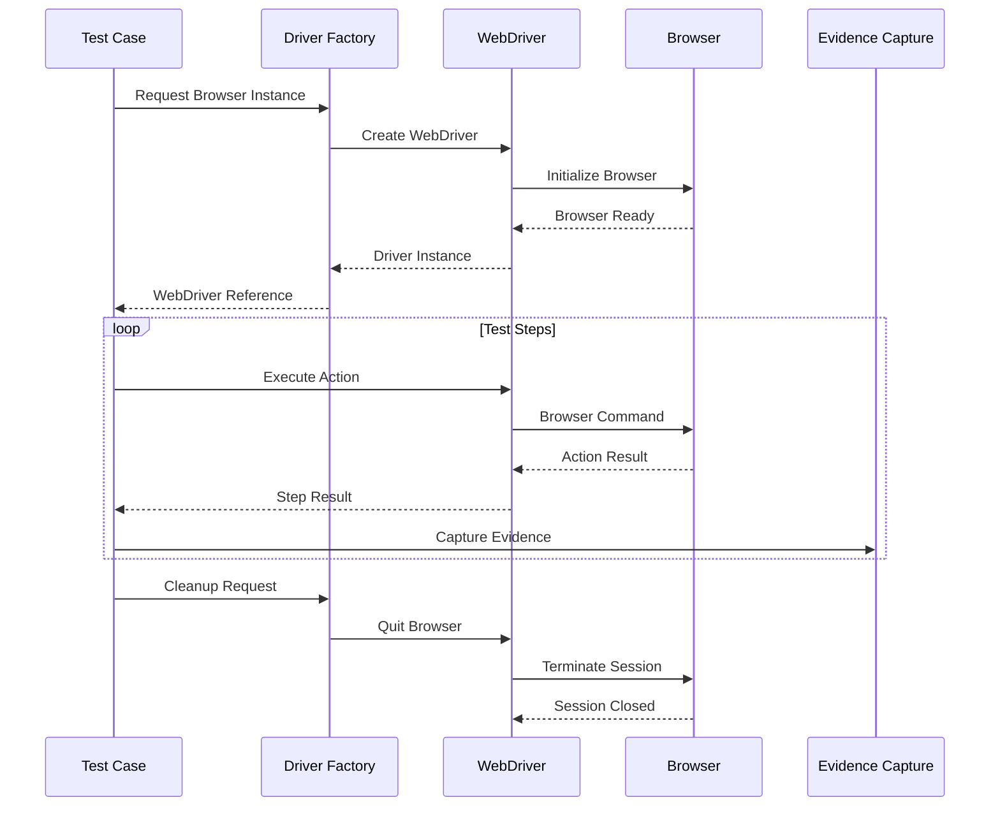
```mermaid
sequenceDiagram
    participant TC as Test Case
    participant DF as Driver Factory
    participant WD as WebDriver
    participant BR as Browser
    participant EC as Evidence Capture
    
    TC->>DF: Request Browser Instance
    DF->>WD: Create WebDriver
    WD->>BR: Initialize Browser
    BR-->>WD: Browser Ready
    WD-->>DF: Driver Instance
    DF-->>TC: WebDriver Reference
    
    loop Test Steps
        TC->>WD: Execute Action
        WD->>BR: Browser Command
        BR-->>WD: Action Result
        WD-->>TC: Step Result
        TC->>EC: Capture Evidence
    end
    
    TC->>DF: Cleanup Request
    DF->>WD: Quit Browser
    WD->>BR: Terminate Session
    BR-->>WD: Session Closed
```

### 5.2.3 Multi-Format Reporting (F-003)

**Purpose and Responsibilities:**
The Multi-Format Reporting component transforms raw test execution results into comprehensive stakeholder reports. It generates HTML visualizations for technical teams, JSON data for system integrations, and TXT files for test reruns.

**Technologies and Frameworks:**
- **Cucumber Reports 7.2.0**: Multi-format report generation engine
- **HTML Template Engine**: Visual report generation with charts and embedded screenshots
- **JSON Serialization**: Machine-readable format for external system integration

**Key Interfaces and APIs:**
- **Result Processing Interface**: Test execution data aggregation and analysis
- **Template Engine Interface**: HTML report generation with customizable themes
- **Export Interface**: Multi-format output generation (HTML, JSON, TXT)
- **Evidence Integration Interface**: Screenshot and log file embedding capabilities

**Data Persistence Requirements:**
Report artifacts persisted to filesystem with configurable retention policies. Screenshots and evidence files embedded within HTML reports for comprehensive test documentation.

**Scaling Considerations:**
Report generation optimized for large test suites with sub-5-minute completion times for 1000+ test scenarios. Parallel processing of report sections with memory-efficient streaming for large datasets.

### 5.2.4 CI/CD Integration (F-004)

**Purpose and Responsibilities:**
The CI/CD Integration component enables automated test execution within Jenkins pipelines, providing continuous feedback to development teams and maintaining quality gates throughout the software delivery lifecycle.

**Technologies and Frameworks:**
- **Jenkins Integration**: Native Maven project support with webhook triggers
- **Maven Surefire Plugin 3.0.0-M5**: Parallel test execution with failure tolerance
- **Git Integration**: Version control synchronization with automated triggers

**Key Interfaces and APIs:**
- **Webhook Interface**: Git repository trigger processing for automated builds
- **Build Lifecycle Interface**: Maven phase integration for test execution
- **Artifact Publishing Interface**: Report and evidence artifact management
- **Notification Interface**: Stakeholder communication for build results

**Data Persistence Requirements:**
Build artifacts archived within Jenkins with configurable retention policies. Test reports and evidence files maintained for historical analysis and trend reporting.

**Scaling Considerations:**
Supports distributed execution across Jenkins build agents with shared artifact storage. Build parallelization configured for optimal resource utilization across available infrastructure.

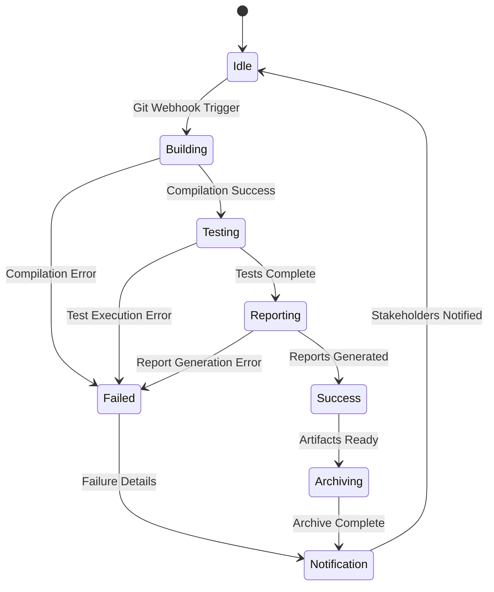
```mermaid
stateDiagram-v2
    [*] --> Idle
    Idle --> Building: Git Webhook Trigger
    Building --> Testing: Compilation Success
    Building --> Failed: Compilation Error
    Testing --> Reporting: Tests Complete
    Testing --> Failed: Test Execution Error
    Reporting --> Success: Reports Generated
    Reporting --> Failed: Report Generation Error
    Success --> Archiving: Artifacts Ready
    Failed --> Notification: Failure Details
    Archiving --> Notification: Archive Complete
    Notification --> Idle: Stakeholders Notified
```

## 5.3 TECHNICAL DECISIONS

### 5.3.1 Architecture Style Decisions and Tradeoffs

**Decision: Layered Architecture with Template Pattern**

The framework implements a five-layer architecture (Application, Framework, Build, Integration, Infrastructure) combined with a template pattern approach. This decision addresses the primary business requirement of accelerating project setup from weeks to one day while maintaining enterprise-grade capabilities.

**Tradeoffs Analysis:**

| Aspect | Benefits | Drawbacks |
|---|---|---|
| Template Pattern | Rapid project initialization, standardized structure | Limited customization flexibility |
| Layered Architecture | Clear separation of concerns, maintainable codebase | Potential performance overhead from layer abstraction |
| Component Modularity | Independent scaling and maintenance | Increased complexity in inter-component communication |

**Rationale:** The template approach directly addresses the business success criteria of reducing setup time by 95% while the layered architecture ensures maintainability and scalability for enterprise deployments.

### 5.3.2 Communication Pattern Choices

**Decision: Event-Driven Communication with Synchronous Execution**

The framework employs Cucumber's event-driven architecture for test lifecycle management while maintaining synchronous execution patterns for predictable timing and resource management.

**Communication Patterns:**
- **Internal Communication**: Direct method invocation between framework layers
- **External Communication**: RESTful APIs for Jenkins and Jira integration
- **Browser Communication**: WebDriver JSON Wire Protocol for browser automation
- **Data Exchange**: File-based report generation with webhook notifications

**Justification:** Event-driven patterns enable loose coupling between test specification and execution while synchronous execution ensures predictable performance and simplified debugging.

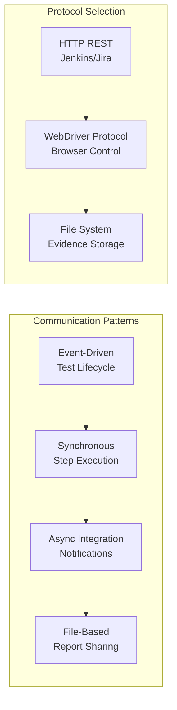
```mermaid
graph LR
    subgraph "Communication Patterns"
        A[Event-Driven<br/>Test Lifecycle] --> B[Synchronous<br/>Step Execution]
        B --> C[Async Integration<br/>Notifications]
        C --> D[File-Based<br/>Report Sharing]
    end
    
    subgraph "Protocol Selection"
        E[HTTP REST<br/>Jenkins/Jira] --> F[WebDriver Protocol<br/>Browser Control]
        F --> G[File System<br/>Evidence Storage]
    end
```

### 5.3.3 Data Storage Solution Rationale

**Decision: Hybrid Storage Strategy**

The framework implements a hybrid storage approach combining in-memory state management during execution with filesystem persistence for reports and evidence.

**Storage Strategy Components:**

| Storage Type | Use Case | Technology | Retention Policy |
|---|---|---|---|
| In-Memory | Test execution context | Java Collections/Objects | Session-based cleanup |
| Filesystem | Reports and evidence | Local file system | Configurable retention |
| Remote Archive | CI/CD artifacts | Jenkins artifact storage | Build-based retention |
| External Integration | Test management | Jira API synchronization | System-managed |

**Rationale:** This approach optimizes performance during execution while ensuring comprehensive audit trails and integration capabilities for enterprise environments.

### 5.3.4 Caching Strategy Justification

**Decision: Multi-Level Caching Architecture**

The framework implements strategic caching at three levels: dependency caching, driver caching, and test data caching.

**Caching Implementation:**
- **Maven Dependency Caching**: Local repository reduces build time by eliminating repeated downloads
- **WebDriver Caching**: Browser driver binaries cached locally for faster initialization
- **Test Data Caching**: Generated test data maintained within execution context for consistency

**Performance Impact:** Caching strategies contribute to the target 50% reduction in execution time while ensuring consistent test data across related scenarios.

### 5.3.5 Security Mechanism Selection

**Decision: Environment-Based Security with Corporate Integration**

The framework implements environment variable-based credential management with support for corporate proxy configurations and HTTPS-only communications.

**Security Architecture:**
- **Credential Management**: Environment variables prevent hardcoded secrets
- **Communication Security**: HTTPS-only for all external integrations
- **Data Protection**: Test data sanitization in reports and logs
- **Access Control**: Integration with corporate authentication systems

**Compliance Considerations:** This approach addresses enterprise security requirements while maintaining developer productivity and CI/CD automation capabilities.

## 5.4 CROSS-CUTTING CONCERNS

### 5.4.1 Monitoring and Observability Approach

The framework implements comprehensive monitoring across all architectural layers to ensure system health and performance visibility.

**Monitoring Strategy:**
- **Execution Monitoring**: Real-time test progress tracking with detailed timing metrics
- **Resource Monitoring**: Browser instance management with automatic orphaned process cleanup  
- **Integration Monitoring**: Jenkins build status and Jira synchronization health checks
- **Performance Monitoring**: Thread utilization and memory consumption tracking

**Observability Components:**
- **Metrics Collection**: Test execution duration, success rates, and failure patterns
- **Log Aggregation**: Centralized logging with structured formats for analysis
- **Trace Correlation**: End-to-end request tracking across integration boundaries
- **Health Checks**: System component availability and response time monitoring

### 5.4.2 Logging and Tracing Strategy

**Structured Logging Implementation:**

The framework employs structured logging with consistent formats across all components, enabling effective troubleshooting and operational insights.

**Logging Levels and Content:**
- **ERROR**: System failures, integration errors, and critical issues requiring immediate attention
- **WARN**: Retry attempts, performance degradation, and configuration warnings
- **INFO**: Test execution progress, integration status updates, and operational milestones  
- **DEBUG**: Detailed step execution, browser interactions, and internal state changes

**Trace Correlation:** Each test execution includes unique correlation IDs enabling end-to-end tracing across framework components, external integrations, and report generation processes.

### 5.4.3 Error Handling Patterns

The framework implements sophisticated error handling with retry mechanisms and graceful degradation strategies.

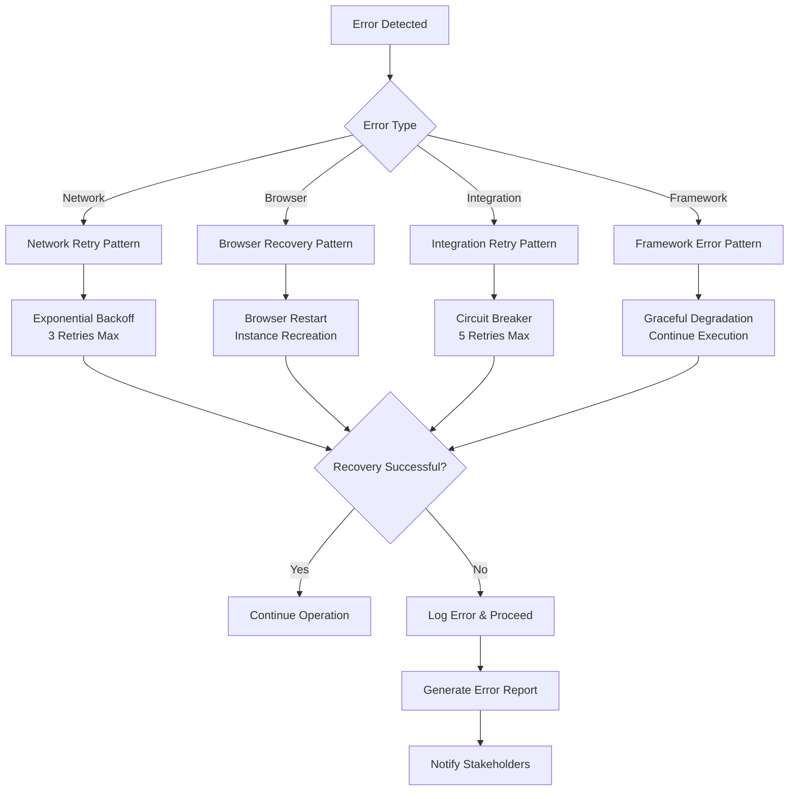
```mermaid
flowchart TD
    A[Error Detected] --> B{Error Type}
    B -->|Network| C[Network Retry Pattern]
    B -->|Browser| D[Browser Recovery Pattern]
    B -->|Integration| E[Integration Retry Pattern]
    B -->|Framework| F[Framework Error Pattern]
    
    C --> G[Exponential Backoff<br/>3 Retries Max]
    D --> H[Browser Restart<br/>Instance Recreation]
    E --> I[Circuit Breaker<br/>5 Retries Max]
    F --> J[Graceful Degradation<br/>Continue Execution]
    
    G --> K{Recovery Successful?}
    H --> K
    I --> K
    J --> K
    
    K -->|Yes| L[Continue Operation]
    K -->|No| M[Log Error & Proceed]
    M --> N[Generate Error Report]
    N --> O[Notify Stakeholders]
```

**Error Recovery Strategies:**

| Error Category | Recovery Pattern | Max Retries | Fallback Action |
|---|---|---|---|
| Network Operations | Exponential backoff | 3 | Continue with cached data |
| Browser Crashes | Instance recreation | 1 | Skip scenario, continue suite |
| Integration Failures | Circuit breaker | 5 | Operate without integration |
| Framework Errors | Graceful degradation | N/A | Log and continue execution |

### 5.4.4 Authentication and Authorization Framework

**Security Architecture Implementation:**

The framework integrates with enterprise authentication systems while maintaining secure credential management for automated execution environments.

**Authentication Mechanisms:**
- **Environment Variables**: Secure credential storage preventing hardcoded secrets
- **Corporate Proxy Support**: Integration with enterprise network security policies
- **API Token Management**: Secure token storage and rotation for external integrations
- **Certificate Management**: Support for corporate certificate authorities and SSL verification

**Authorization Model:**
- **Role-Based Access**: Integration with corporate identity management systems
- **Resource Permissions**: Granular access control for test execution and report access
- **Audit Logging**: Comprehensive access logging for compliance and security monitoring

### 5.4.5 Performance Requirements and SLAs

**Performance Targets and Service Level Agreements:**

| Metric | Target | Measurement Method | Escalation Threshold |
|---|---|---|---|
| Test Suite Execution | 50% reduction vs sequential | Execution time comparison | >25% degradation |
| Report Generation | <5 minutes for 1000 tests | End-to-end timing | >10 minutes |
| Browser Action Timeout | 10 seconds maximum | WebDriver timeout configuration | Frequent timeout errors |
| Integration Response Time | 30 seconds for Jenkins/Jira | API response monitoring | >60 seconds |

**Scalability Characteristics:**
- **Horizontal Scaling**: Linear performance improvement with additional CPU cores
- **Memory Efficiency**: Automatic garbage collection with optimized browser lifecycle management
- **Resource Optimization**: Unlimited thread configuration with intelligent resource allocation

### 5.4.6 Disaster Recovery Procedures

**Business Continuity Strategy:**

The framework implements comprehensive disaster recovery procedures ensuring minimal disruption to testing operations.

**Recovery Procedures:**
- **Framework Recovery**: Automated repository cloning and dependency resolution
- **Environment Recovery**: Containerized deployment options for rapid environment restoration
- **Data Recovery**: Test scenario and configuration backup strategies
- **Integration Recovery**: Failover procedures for Jenkins and Jira connectivity issues

**Recovery Time Objectives:**
- **Framework Setup**: 1 day maximum for complete environment restoration
- **Test Execution**: Immediate failover to alternative execution environments
- **Report Recovery**: Historical report restoration from archived artifacts
- **Integration Restoration**: 4 hours maximum for full integration capability

#### References

**Technical Specification Sections Referenced:**
- `1.1 EXECUTIVE SUMMARY` - Business context and architectural drivers
- `1.2 SYSTEM OVERVIEW` - High-level architecture requirements and success criteria
- `2.3 FEATURE RELATIONSHIPS` - Component dependencies and integration patterns
- `3.2 FRAMEWORKS & LIBRARIES` - Technology stack specifications and version requirements
- `3.4 THIRD-PARTY SERVICES` - External integration requirements and protocols
- `3.5 DEVELOPMENT & DEPLOYMENT` - Infrastructure and deployment architecture
- `3.6 PERFORMANCE AND SCALABILITY CONSIDERATIONS` - Performance targets and scaling patterns
- `3.7 TECHNOLOGY INTEGRATION MATRIX` - Component integration architecture and data flows
- `3.8 SECURITY AND COMPLIANCE` - Security architecture requirements and compliance frameworks
- `4.1 SYSTEM WORKFLOWS` - Process flows and system interactions
- `4.2 DETAILED PROCESS FLOWS` - Comprehensive workflow documentation and state management
- `4.3 STATE MANAGEMENT` - System state transitions and persistence strategies
- `4.4 ERROR HANDLING AND RECOVERY` - Error handling patterns and resilience mechanisms
- `4.5 PERFORMANCE AND TIMING` - Performance constraints and resource management

**Repository Files Examined:**
- `pom.xml` - Maven configuration with complete dependency specifications and plugin settings
- `README.md` - Framework documentation with architecture overview and usage patterns

**Web Search Results:**
- Selenium WebDriver 3.141.59 architecture documentation - Protocol specifications and browser compatibility information

# 6. SYSTEM COMPONENTS DESIGN

## 6.1 CORE SERVICES ARCHITECTURE

### 6.1.1 Architecture Applicability Assessment

**Core Services Architecture is not applicable for this system.**

The Testinium-QA framework implements a **layered architecture pattern with template-based design** rather than a distributed services architecture. This system is designed as a unified BDD test automation framework that operates as a single Java application with tightly integrated components, not as independent services requiring service-oriented architectural patterns.

### 6.1.2 System Architecture Pattern Analysis

#### 6.1.2.1 Implemented Architecture: Layered Template Pattern

The system follows a **five-layer architecture** with the following structure:

| Layer | Purpose | Components | Integration Approach |
|---|---|---|---|
| Application | Business logic and test orchestration | BDD Framework Foundation | Direct method invocation |
| Framework | Core automation capabilities | Browser Automation Engine | Internal component coupling |
| Build | Lifecycle management and parallelization | Maven Surefire integration | Build-time configuration |
| Integration | External system connectivity | CI/CD and reporting components | RESTful API communication |

#### 6.1.2.2 Component Integration Model

The framework consists of four tightly integrated components that operate within a single application context:

**BDD Framework Foundation (F-001):**
- Central orchestration component managing complete test lifecycle
- Coordinates Cucumber's natural language processing with JUnit execution
- Maintains stateless operation with in-memory context management
- Scales through Maven Surefire's unlimited thread configuration

**Browser Automation Engine (F-002):**
- Provides web application interaction through Selenium WebDriver
- Manages browser lifecycle and captures test evidence
- Maintains independent WebDriver instances per thread for parallel execution
- Implements automatic resource cleanup and memory management

**Multi-Format Reporting (F-003):**
- Transforms execution results into comprehensive stakeholder reports
- Generates HTML, JSON, and TXT outputs for different audiences
- Optimized for large test suites with sub-5-minute completion for 1000+ scenarios
- Embeds screenshots and evidence within report artifacts

**CI/CD Integration (F-004):**
- Enables automated execution within Jenkins pipelines
- Provides continuous feedback and quality gates
- Supports distributed execution across Jenkins build agents
- Maintains build artifacts with configurable retention policies

#### 6.1.2.3 Communication Architecture

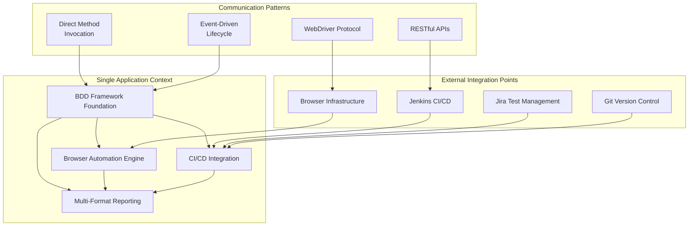
```mermaid
graph TB
    subgraph "Single Application Context"
        A[BDD Framework Foundation] --> B[Browser Automation Engine]
        A --> C[Multi-Format Reporting]
        A --> D[CI/CD Integration]
        B --> C
        D --> C
    end
    
    subgraph "External Integration Points"
        E[Jenkins CI/CD] --> D
        F[Jira Test Management] --> D
        G[Browser Infrastructure] --> B
        H[Git Version Control] --> D
    end
    
    subgraph "Communication Patterns"
        I[Direct Method<br/>Invocation] --> A
        J[Event-Driven<br/>Lifecycle] --> A
        K[RESTful APIs] --> E
        L[WebDriver Protocol] --> G
    end
```

### 6.1.3 Rationale for Non-Service Architecture

#### 6.1.3.1 Business Requirements Alignment

The framework's architecture directly addresses specific business requirements that favor monolithic design:

**Rapid Project Setup:** Template-based approach reduces setup time from weeks to one day, requiring standardized, pre-configured framework structure rather than distributed service configuration.

**Enterprise Integration:** Direct integration with Jenkins and Jira through established APIs eliminates the complexity of service discovery and inter-service communication patterns.

**Performance Optimization:** Unlimited thread parallelization within a single JVM achieves 50% execution time reduction without the network overhead of service-to-service communication.

#### 6.1.3.2 Technical Decision Factors

**Communication Efficiency:**
- Internal communication through direct method invocation eliminates network latency
- Event-driven test lifecycle management maintains loose coupling without service boundaries
- Synchronous execution patterns ensure predictable timing and resource management

**State Management:**
- Stateless operation during test execution eliminates need for distributed state management
- In-memory context management provides optimal performance for test automation workloads
- Session-based cleanup automatically manages resources without service lifecycle complexity

**Scaling Strategy:**
- Horizontal scaling achieved through thread-level parallelization within single process
- Each thread maintains independent test runtime instances, not separate service instances
- Linear scalability based on available system resources without service orchestration overhead

#### 6.1.3.3 Service Architecture Absence Evidence

**No Service Infrastructure Components:**
- No service discovery mechanisms or service registries
- No API gateways or service mesh implementations
- No load balancers for service distribution
- No circuit breakers or service-specific resilience patterns
- No inter-service authentication or authorization layers

**Monolithic Integration Patterns:**
- All components deployed as single application artifact
- Shared runtime environment and memory space
- Direct dependency injection without service boundaries
- Unified configuration management without service-specific configs

### 6.1.4 Alternative Architecture Benefits

#### 6.1.4.1 Layered Architecture Advantages

**Simplified Deployment:**
- Single artifact deployment eliminates service orchestration complexity
- No container orchestration or service mesh configuration required
- Simplified CI/CD pipeline with single build and deployment process

**Operational Simplicity:**
- Single process monitoring and logging
- Unified error handling and debugging across all components
- No distributed tracing or service monitoring infrastructure required

**Performance Optimization:**
- Direct method invocation eliminates network serialization overhead
- Shared memory access patterns optimize data processing
- Single JVM garbage collection optimization for entire application

#### 6.1.4.2 Template Pattern Benefits

**Standardization:** Pre-configured framework structure ensures consistent implementation across projects and teams.

**Rapid Onboarding:** Template-based initialization reduces learning curve and setup complexity for new team members.

**Maintenance Efficiency:** Centralized framework updates propagate to all implementations without service versioning complexity.

### 6.1.5 Scaling and Resilience Implementation

#### 6.1.5.1 Horizontal Scaling Approach

The framework implements **thread-based horizontal scaling** within a single application context:

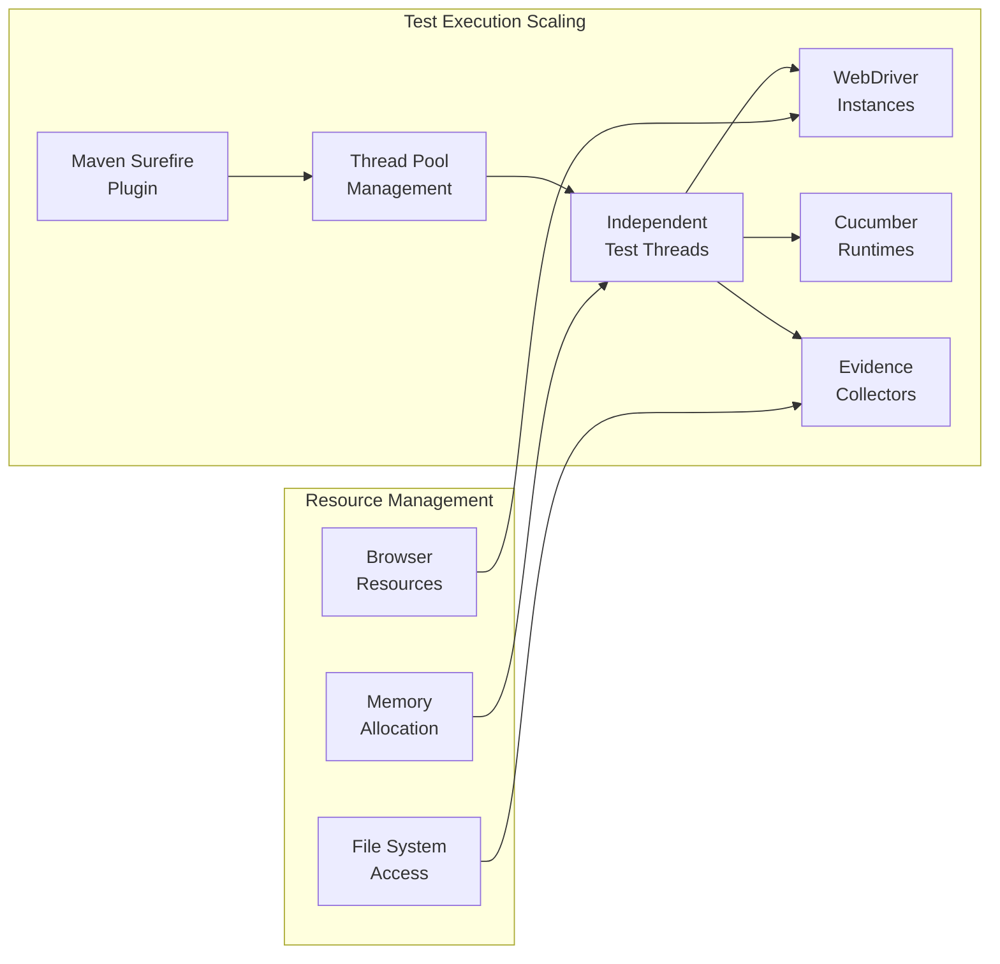
```mermaid
graph LR
    subgraph "Test Execution Scaling"
        A[Maven Surefire<br/>Plugin] --> B[Thread Pool<br/>Management]
        B --> C[Independent<br/>Test Threads]
        C --> D[WebDriver<br/>Instances]
        C --> E[Cucumber<br/>Runtimes]
        C --> F[Evidence<br/>Collectors]
    end
    
    subgraph "Resource Management"
        G[Memory<br/>Allocation] --> C
        H[Browser<br/>Resources] --> D
        I[File System<br/>Access] --> F
    end
```

**Scaling Configuration:**
- Unlimited thread configuration through Maven Surefire plugin
- Independent WebDriver instances prevent resource contention
- Automatic cleanup of orphaned processes and memory leak prevention
- Linear scalability based on available CPU and memory resources

#### 6.1.5.2 Resilience Mechanisms

**Fault Tolerance:**
- JUnit test isolation prevents cascade failures between test scenarios
- WebDriver automatic recovery from browser crashes or navigation failures
- Configurable retry mechanisms for flaky test scenarios

**Resource Management:**
- Automatic browser cleanup prevents resource exhaustion
- Memory-efficient streaming for large test result datasets
- Configurable retention policies for test artifacts and evidence

#### References

- `5.1 HIGH-LEVEL ARCHITECTURE` - System overview and architecture patterns confirming layered template-based design
- `5.2 COMPONENT DETAILS` - Detailed component descriptions showing tight integration within single application
- `5.3 TECHNICAL DECISIONS` - Architecture style decisions explicitly choosing layered architecture over distributed patterns
- Repository structure analysis confirming absence of service-oriented code organization

## 6.2 DATABASE DESIGN

### 6.2.1 Applicability Assessment

**Database Design is not applicable to this system.** The Testinium-QA framework is a BDD (Behavior-Driven Development) test automation framework designed to operate without any database or persistent storage requirements. This architectural decision aligns with test automation best practices that emphasize stateless operation, test independence, and dynamic data generation.

#### 6.2.1.1 System Classification

The Testinium-QA framework functions as a **stateless test orchestration tool** rather than a data-driven application. Its primary purpose is to:

- Execute automated browser-based tests using Selenium WebDriver
- Generate test reports and artifacts to the filesystem
- Integrate with external CI/CD and test management systems through APIs
- Maintain temporary state only during active test execution cycles

#### 6.2.1.2 Architectural Rationale

The absence of database design stems from deliberate architectural choices that prioritize:

| Design Principle | Implementation Approach | Benefit |
|------------------|------------------------|---------|
| Test Independence | No shared persistent state | Eliminates test pollution and dependencies |
| Dynamic Data Generation | JavaFaker library integration | Ensures fresh, realistic test data for each execution |
| Lightweight Deployment | No database infrastructure requirements | Simplified setup and maintenance in various environments |

### 6.2.2 Evidence Analysis

#### 6.2.2.1 Dependency Analysis

Examination of the `pom.xml` configuration reveals no database-related dependencies:

| Dependency Category | Libraries Present | Database Libraries Absent |
|-------------------|------------------|--------------------------|
| Testing Frameworks | JUnit, TestNG, Cucumber | No JPA, Hibernate, MyBatis |
| Browser Automation | Selenium WebDriver | No JDBC drivers |
| Data Generation | JavaFaker | No connection pooling libraries |
| Reporting | ExtentReports | No database migration tools |

#### 6.2.2.2 Architecture Components

The system architecture components explicitly exclude database services:

- **BDD Framework Foundation (F-001)**: Maintains no persistent state between executions, operating as a stateless orchestrator
- **Browser Automation Engine (F-002)**: Provides temporary persistence of browser state during test execution only
- **Multi-Format Reporting (F-003)**: Persists report artifacts to filesystem rather than database storage
- **CI/CD Integration (F-004)**: Archives build artifacts within Jenkins without database involvement

#### 6.2.2.3 State Management Approach

The framework implements a **stateless operation model** where:

- All test context data is maintained in-memory during execution cycles
- No persistent state is retained between test runs
- Data persistence is limited to configuration files and test result artifacts
- Browser driver management utilizes WebDriverManager for local caching only

### 6.2.3 Alternative Data Management

#### 6.2.3.1 Test Data Strategy

Instead of database-driven test data, the framework employs:

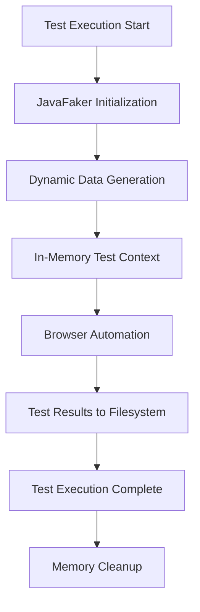
```mermaid
graph TD
    A[Test Execution Start] --> B[JavaFaker Initialization]
    B --> C[Dynamic Data Generation]
    C --> D[In-Memory Test Context]
    D --> E[Browser Automation]
    E --> F[Test Results to Filesystem]
    F --> G[Test Execution Complete]
    G --> H[Memory Cleanup]
```

#### 6.2.3.2 Data Flow Architecture

The system's data flow operates entirely without persistent storage:

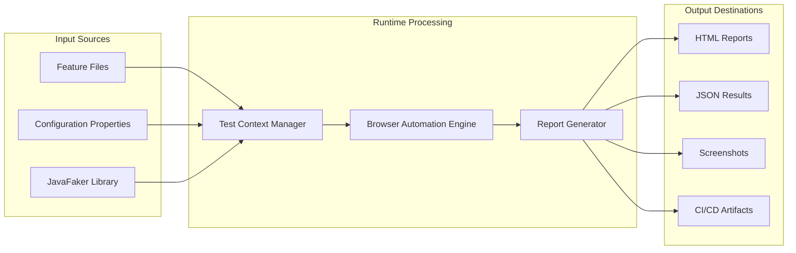
```mermaid
flowchart LR
    subgraph "Input Sources"
        A[Feature Files]
        B[Configuration Properties]
        C[JavaFaker Library]
    end
    
    subgraph "Runtime Processing"
        D[Test Context Manager]
        E[Browser Automation Engine]
        F[Report Generator]
    end
    
    subgraph "Output Destinations"
        G[HTML Reports]
        H[JSON Results]
        I[Screenshots]
        J[CI/CD Artifacts]
    end
    
    A --> D
    B --> D
    C --> D
    D --> E
    E --> F
    F --> G
    F --> H
    F --> I
    F --> J
```

#### 6.2.3.3 Persistence Alternatives

The framework addresses typical database use cases through alternative mechanisms:

| Traditional Database Function | Framework Implementation | Storage Location |
|------------------------------|------------------------|------------------|
| Test Data Storage | Dynamic generation via JavaFaker | In-memory during execution |
| Test Results | File-based reporting system | Local filesystem |
| Configuration Management | Properties files and POM configuration | Maven project structure |
| Audit Trail | CI/CD build history and artifacts | Jenkins workspace |

### 6.2.4 Integration Points

#### 6.2.4.1 External System Interfaces

While the framework lacks database integration, it interfaces with external systems through:

- **Jenkins CI/CD**: API-based integration for build triggers and artifact management
- **Jira Test Management**: REST API connections for test case synchronization
- **Browser Infrastructure**: WebDriver protocol communications with browser instances

#### 6.2.4.2 Data Exchange Patterns

Data exchange follows API-driven patterns rather than database transactions:

```mermaid
sequenceDiagram
    participant TF as Test Framework
    participant JF as JavaFaker
    participant BR as Browser
    participant FS as Filesystem
    participant CI as CI/CD System
    
    TF->>JF: Request test data
    JF->>TF: Generate dynamic data
    TF->>BR: Execute test scenarios
    BR->>TF: Return execution results
    TF->>FS: Write reports and screenshots
    TF->>CI: Publish artifacts
```

### 6.2.5 Compliance and Governance

#### 6.2.5.1 Data Governance

Without database storage, traditional data governance concerns are addressed through:

- **Test Data Privacy**: Dynamic generation eliminates need for sensitive data storage
- **Audit Requirements**: Test execution logs and CI/CD build histories provide audit trails
- **Retention Policies**: Managed through CI/CD artifact retention settings
- **Access Controls**: Implemented at CI/CD system and repository levels

#### 6.2.5.2 Regulatory Compliance

The stateless architecture inherently supports compliance requirements:

| Compliance Aspect | Framework Approach | Benefit |
|-------------------|-------------------|---------|
| Data Minimization | No persistent data storage | Reduces privacy risk surface |
| Right to Erasure | No personal data retention | Automatic compliance |
| Data Portability | File-based artifacts | Easy export and transfer |
| Audit Trail | CI/CD integration | Comprehensive execution history |

#### References

**Technical Specification Sections:**
- `5.1 HIGH-LEVEL ARCHITECTURE` - Confirmed layered architecture without database components
- `6.1 CORE SERVICES ARCHITECTURE` - Explicitly stated core services architecture not applicable  
- `4.3 STATE MANAGEMENT` - Detailed stateless operation and filesystem-based persistence
- `2.1 FEATURE CATALOG` - Listed all features with no database-related capabilities
- `5.2 COMPONENT DETAILS` - Provided component-level confirmation of no persistent state
- `3.4 THIRD-PARTY SERVICES` - Listed only CI/CD, test management, and browser services
- `3.2 FRAMEWORKS & LIBRARIES` - Confirmed no database frameworks or libraries in use

**Files Examined:**
- `pom.xml` - Confirmed absence of database dependencies; only testing and automation libraries present
- `.gitignore` - Revealed configuration.properties file exists but is git-ignored; no database configs found

## 6.3 INTEGRATION ARCHITECTURE

### 6.3.1 Integration Architecture Overview

The Testinium-QA framework implements a comprehensive integration architecture that connects with enterprise CI/CD systems, test management platforms, and browser automation infrastructure. While operating as a unified layered application, the framework maintains robust external integration capabilities through RESTful APIs, WebDriver protocols, and event-driven communication patterns.

#### 6.3.1.1 Integration Landscape

The framework serves as a central orchestration point for automated testing within enterprise environments, integrating with four primary external system categories:

- **Continuous Integration Systems**: Jenkins CI/CD for automated build and deployment processes
- **Test Management Platforms**: Jira for requirement traceability and execution tracking
- **Browser Infrastructure**: Selenium WebDriver ecosystem for cross-browser automation
- **Version Control Systems**: Git repositories for source-triggered test execution

#### 6.3.1.2 Integration Architecture Pattern

The framework implements a **Hub-and-Spoke Integration Pattern** where the Testinium-QA framework acts as the central integration hub, coordinating data flows and process orchestration across multiple external systems:

```mermaid
graph TB
    subgraph "External Systems"
        A[Jenkins CI/CD]
        B[Jira Test Management]
        C[Git Repository]
        D[Browser Grid Infrastructure]
    end
    
    subgraph "Testinium-QA Integration Hub"
        E[Integration Layer]
        F[BDD Framework Foundation]
        G[Browser Automation Engine]
        H[Multi-Format Reporting]
    end
    
    subgraph "Communication Protocols"
        I[REST APIs]
        J[WebDriver Protocol]
        K[Git Webhooks]
        L[File System I/O]
    end
    
    A -->|Build Triggers| I
    B -->|Test Sync| I
    C -->|Source Changes| K
    D -->|Browser Control| J
    
    I --> E
    J --> E
    K --> E
    L --> E
    
    E --> F
    E --> G
    E --> H
```

### 6.3.2 API Design Architecture

#### 6.3.2.1 Protocol Specifications

The framework integrates with external systems using standardized communication protocols, ensuring enterprise compatibility and maintainability:

| Integration Point | Protocol | Standard | Version Support |
|---|---|---|---|
| Jenkins CI/CD | HTTP REST API | Jenkins Remote API | 2.x+ compatible |
| Jira Test Management | HTTP REST API | Atlassian REST API v2 | Jira 7.x+ compatible |
| Selenium WebDriver | W3C WebDriver | JSON Wire Protocol | WebDriver 3.141.59 |
| Git Repository | Git Protocol | Git Hooks | Git 2.x+ compatible |

#### 6.3.2.2 Authentication Methods

The framework implements enterprise-grade authentication mechanisms supporting corporate security requirements:

**Environment Variable-Based Authentication:**
- Secure credential storage preventing hardcoded secrets in source code
- Support for rotating credentials without framework redeployment
- Integration with corporate credential management systems

**API Token Management:**
- JWT-based authentication for Jira API integration
- API key authentication for Jenkins remote API access
- Automatic token refresh and expiration handling

**Corporate Security Integration:**
- Corporate proxy configuration support for network security policies
- SSL certificate management with corporate certificate authority support
- Integration with enterprise identity management systems

#### 6.3.2.3 Authorization Framework

The framework supports role-based access control aligned with enterprise authorization models:

- **Role-Based Access**: Integration with corporate identity management systems for user authentication
- **Resource Permissions**: Granular access control for test execution capabilities and report access
- **Audit Logging**: Comprehensive access logging for compliance and security monitoring

#### 6.3.2.4 Rate Limiting Strategy

Integration rate limiting ensures system stability and compliance with external system limitations:

| External System | Rate Limit | Implementation | Fallback Strategy |
|---|---|---|---|
| Jenkins API | 100 requests/minute | Client-side throttling | Queue requests with backoff |
| Jira API | 1000 requests/hour | Circuit breaker pattern | Cache responses, retry later |
| WebDriver Grid | Unlimited | Browser pool management | Queue sessions, auto-scaling |

#### 6.3.2.5 Versioning Approach

The framework maintains backward compatibility through versioned integration approaches:

**API Version Management:**
- Jenkins Remote API: Supports v2.x+ with automatic version detection
- Jira REST API: Implements v2 with fallback to v1 for legacy systems
- WebDriver Protocol: W3C standard compliance with JSON Wire Protocol support

**Framework Version Compatibility:**
- Semantic versioning for framework releases
- Dependency version management through Maven coordinates
- Integration adapter pattern for external system version differences

#### 6.3.2.6 Documentation Standards

Integration documentation follows enterprise standards for maintainability and onboarding:

- **API Integration Guides**: Comprehensive setup instructions for each external system
- **Configuration References**: Environment variable and property file documentation
- **Troubleshooting Guides**: Common integration issues and resolution procedures
- **Security Compliance**: Corporate security requirement compliance documentation

### 6.3.3 Message Processing Architecture

#### 6.3.3.1 Event Processing Patterns

The framework implements sophisticated event processing patterns to handle complex integration workflows:

```mermaid
sequenceDiagram
    participant Git as Git Repository
    participant Jenkins as Jenkins CI/CD
    participant Framework as Testinium-QA
    participant Browser as Browser Grid
    participant Jira as Jira API
    participant Reports as Report System

    Git->>Jenkins: Webhook: Code Commit
    Jenkins->>Framework: Trigger: Maven Build
    Framework->>Framework: Parse Cucumber Features
    Framework->>Browser: Request: WebDriver Sessions
    Browser->>Framework: Response: Browser Instances
    Framework->>Framework: Execute Parallel Tests
    Framework->>Reports: Generate Multi-Format Reports
    Framework->>Jira: Update Test Execution Status
    Reports->>Jenkins: Archive Test Artifacts
    Jenkins->>Git: Update Commit Status
```

**Event Types and Processing:**

- **Build Trigger Events**: Git commit webhooks triggering Jenkins builds with framework execution
- **Test Execution Events**: Internal framework events coordinating test lifecycle management
- **Browser Automation Events**: WebDriver protocol events for browser interaction and control
- **Report Generation Events**: Output processing events creating stakeholder-consumable artifacts
- **Integration Notification Events**: Status updates and synchronization with external systems

#### 6.3.3.2 Message Queue Architecture

While the framework operates as a unified application, it implements internal event queuing for optimal processing:

**Thread-Based Message Processing:**
- Maven Surefire plugin manages unlimited thread configuration for parallel execution
- Independent message queues per thread prevent cross-contamination
- Event-driven lifecycle management maintains loose coupling between components

**Message Processing Patterns:**

| Event Category | Processing Pattern | Concurrency Model | Error Handling |
|---|---|---|---|
| Test Execution | Parallel processing | Independent threads | Per-thread isolation |
| Report Generation | Sequential processing | Single-threaded per report | Retry with fallback |
| Integration Updates | Asynchronous processing | Background threads | Circuit breaker pattern |
| Browser Management | Pool-based processing | Resource pooling | Automatic cleanup |

#### 6.3.3.3 Stream Processing Design

The framework implements stream processing for real-time test execution monitoring and reporting:

**Real-Time Data Streams:**
- Test execution progress streaming for monitoring dashboards
- Browser interaction logging for debugging and analysis
- Integration status streaming for operational visibility
- Performance metrics streaming for capacity planning

#### 6.3.3.4 Batch Processing Flows

Batch processing handles large-scale operations and periodic maintenance tasks:

**Batch Operations:**
- Bulk test scenario synchronization with Jira
- Historical report generation and archival
- Browser driver updates and maintenance
- Integration health checks and system validation

#### 6.3.3.5 Error Handling Strategy

Comprehensive error handling ensures system resilience across all integration points:

```mermaid
flowchart TD
    A[Integration Error Detected] --> B{Error Classification}
    B -->|Network Error| C[Network Retry Pattern]
    B -->|Authentication Error| D[Credential Refresh Pattern]
    B -->|Rate Limit Error| E[Backoff and Retry Pattern]
    B -->|System Unavailable| F[Circuit Breaker Pattern]
    
    C --> G[Exponential Backoff<br/>3 Retries Maximum]
    D --> H[Token Refresh<br/>Re-authenticate]
    E --> I[Gradual Backoff<br/>Respect Rate Limits]
    F --> J[Circuit Open<br/>5 Failures Threshold]
    
    G --> K{Recovery Success?}
    H --> K
    I --> K
    J --> L[Fallback Mode<br/>Continue Without Integration]
    
    K -->|Yes| M[Resume Normal Operation]
    K -->|No| N[Log Error & Continue]
    L --> N
```

**Error Recovery Strategies by Integration:**

| Integration Point | Error Pattern | Max Retries | Fallback Action |
|---|---|---|---|
| Jenkins API | Exponential backoff | 3 | Continue without CI integration |
| Jira API | Circuit breaker | 5 | Cache updates, sync later |
| WebDriver Grid | Instance recreation | 1 | Skip scenario, continue suite |
| Network Operations | Linear backoff | 3 | Use cached data if available |

### 6.3.4 External Systems Integration

#### 6.3.4.1 Jenkins CI/CD Integration

**Integration Architecture:**
The framework provides native integration with Jenkins through Maven project support and RESTful API communication.

**Integration Capabilities:**

| Feature | Implementation | Protocol | Data Exchange |
|---|---|---|---|
| Build Triggers | Git webhook processing | HTTP POST | JSON payload with commit data |
| Test Execution | Maven Surefire integration | Process execution | Standard output and artifacts |
| Report Publishing | Automated artifact archival | File system I/O | HTML, JSON, TXT formats |
| Status Notifications | Build result communication | REST API calls | JSON status updates |

**Jenkins Integration Flow:**

```mermaid
sequenceDiagram
    participant Dev as Developer
    participant Git as Git Repository
    participant Jenkins as Jenkins Server
    participant Framework as Testinium-QA
    participant Reports as Report Archive

    Dev->>Git: git push
    Git->>Jenkins: Webhook Trigger
    Jenkins->>Jenkins: Parse Build Configuration
    Jenkins->>Framework: mvn clean test
    Framework->>Framework: Execute Test Suite
    Framework->>Reports: Generate Reports (HTML/JSON/TXT)
    Framework->>Jenkins: Return Exit Code
    Jenkins->>Reports: Archive Test Artifacts
    Jenkins->>Dev: Email Notification
```

#### 6.3.4.2 Jira Test Management Integration

**Integration Architecture:**
Bidirectional integration with Jira provides requirement traceability and test execution tracking through RESTful API communication.

**Integration Capabilities:**
- **Requirement Traceability**: Automatic linking between Cucumber scenarios and Jira requirements
- **Execution Tracking**: Real-time test execution status updates with historical reporting
- **Test Case Synchronization**: Bidirectional sync between framework scenarios and Jira test cases
- **Evidence Attachment**: Automatic screenshot and evidence upload to Jira test executions

**Authentication and Security:**
- JWT token-based authentication with API access keys
- Createmeta resource utilization for field discovery and validation
- Corporate proxy support for secure enterprise network access

#### 6.3.4.3 Browser Infrastructure Integration

**Selenium WebDriver Integration:**
The framework integrates with the complete Selenium WebDriver ecosystem for cross-browser automation capabilities.

**Supported Browser Environments:**

| Browser | Driver | Version Management | Grid Support |
|---|---|---|---|
| Google Chrome | ChromeDriver | WebDriverManager automatic | Full grid compatibility |
| Mozilla Firefox | GeckoDriver | WebDriverManager automatic | Full grid compatibility |
| Microsoft Edge | EdgeDriver | WebDriverManager automatic | Full grid compatibility |
| Remote Grid | Custom drivers | Manual configuration | Native grid integration |

**WebDriverManager Integration:**
- Automated driver version detection and download
- Proxy configuration support for corporate environments
- Offline caching capabilities for air-gapped deployments
- Automatic compatibility resolution with browser versions

#### 6.3.4.4 API Gateway Configuration

While the framework doesn't implement its own API gateway, it supports integration through enterprise API gateway configurations:

**Enterprise Gateway Support:**
- Corporate proxy configuration for routed API access
- SSL certificate management for secure gateway communication
- Load balancing support through client-side failover mechanisms
- Rate limiting compliance with gateway-imposed restrictions

#### 6.3.4.5 External Service Contracts

The framework maintains service contracts with external systems ensuring reliable integration:

**Service Level Agreements:**

| External System | Response Time SLA | Availability SLA | Error Rate SLA |
|---|---|---|---|
| Jenkins API | <30 seconds | 99.5% uptime | <1% error rate |
| Jira API | <30 seconds | 99.9% uptime | <0.5% error rate |
| WebDriver Grid | <10 seconds | 99.0% uptime | <2% error rate |

**Contract Validation:**
- Automated health checks for all external integrations
- Performance monitoring with SLA breach alerting
- Fallback procedures for service contract violations

### 6.3.5 Integration Performance and Scalability

#### 6.3.5.1 Integration Performance Metrics

The framework maintains comprehensive performance metrics for all integration points:

**Performance Targets:**

| Metric | Target Value | Measurement Method | Escalation Threshold |
|---|---|---|---|
| Jenkins API Response | <30 seconds | Response time monitoring | >60 seconds |
| Jira API Response | <30 seconds | API call timing | >60 seconds |
| WebDriver Session Creation | <10 seconds | Session establishment time | >20 seconds |
| Report Generation | <5 minutes for 1000 tests | End-to-end timing | >10 minutes |

#### 6.3.5.2 Scalability Architecture

The integration architecture supports horizontal scaling through parallel processing and resource optimization:

**Scaling Characteristics:**
- **Thread-Based Parallelization**: Unlimited thread configuration through Maven Surefire plugin
- **Independent Integration Channels**: Separate integration threads prevent bottlenecks
- **Resource Pool Management**: Optimized browser and API connection pooling
- **Linear Scalability**: Performance improvement proportional to available system resources

```mermaid
graph TB
    subgraph "Scaling Architecture"
        A[Load Balancer] --> B[Integration Thread Pool]
        B --> C[Jenkins Integration Threads]
        B --> D[Jira Integration Threads]
        B --> E[WebDriver Session Pool]
        
        C --> F[Jenkins API Endpoints]
        D --> G[Jira API Endpoints]
        E --> H[Browser Grid Nodes]
        
        subgraph "Resource Management"
            I[Connection Pooling]
            J[Thread Pool Management]
            K[Memory Optimization]
        end
        
        B --> I
        B --> J
        B --> K
    end
```

### 6.3.6 Integration Security and Compliance

#### 6.3.6.1 Security Architecture

The framework implements enterprise-grade security measures for all external integrations:

**Security Mechanisms:**
- **Credential Management**: Environment variable-based secure storage preventing hardcoded secrets
- **Network Security**: Corporate proxy support and SSL certificate management
- **Access Control**: Role-based authentication with enterprise identity system integration
- **Audit Logging**: Comprehensive access and operation logging for compliance monitoring

#### 6.3.6.2 Compliance Framework

Integration security aligns with enterprise compliance requirements:

**Compliance Measures:**
- **Data Privacy**: Secure handling of test data and credentials across integration boundaries
- **Access Auditing**: Complete audit trails for all external system interactions
- **Encryption Standards**: TLS encryption for all external API communication
- **Retention Policies**: Configurable data retention and cleanup for compliance requirements

### 6.3.7 Integration Monitoring and Observability

#### 6.3.7.1 Monitoring Strategy

Comprehensive monitoring ensures integration health and performance visibility:

**Monitoring Components:**
- **Integration Health Checks**: Continuous availability monitoring for all external systems
- **Performance Metrics**: Response time and throughput monitoring for API integrations
- **Error Rate Tracking**: Integration failure rates with automated alerting
- **Resource Utilization**: Connection pool and thread utilization monitoring

#### 6.3.7.2 Observability Implementation

**Observability Features:**
- **Metrics Collection**: Integration-specific metrics with time-series data storage
- **Log Aggregation**: Centralized logging with structured formats for integration events
- **Trace Correlation**: End-to-end request tracking across integration boundaries
- **Dashboard Visualization**: Real-time integration status and performance dashboards

#### References

#### Technical Specification Sections Referenced
- `3.4 THIRD-PARTY SERVICES` - External system integration specifications and requirements
- `4.1 SYSTEM WORKFLOWS` - Integration workflow patterns and data flow documentation
- `5.1 HIGH-LEVEL ARCHITECTURE` - System integration boundaries and architectural constraints
- `5.4 CROSS-CUTTING CONCERNS` - Authentication, monitoring, and error handling across integrations
- `6.1 CORE SERVICES ARCHITECTURE` - Component integration model and communication patterns

#### Repository Files Examined
- `pom.xml` - Maven configuration with integration dependencies and plugin settings
- `README.md` - Integration examples and configuration documentation for Jenkins and Jira

#### External Documentation Sources
- Jenkins Remote API documentation for CI/CD integration patterns
- Jira REST API v2 specification for test management integration
- Selenium WebDriver W3C standard for browser automation protocols
- WebDriverManager documentation for automated driver management

## 6.4 SECURITY ARCHITECTURE

### 6.4.1 Security Architecture Overview

The Testinium-QA Browser Test Automation Framework implements a comprehensive security architecture tailored specifically for enterprise test automation environments. As a test automation framework rather than a production application, the security focus centers on protecting test credentials, securing external system integrations, ensuring data privacy during test execution, and maintaining compliance with enterprise security policies.

#### 6.4.1.1 Security Architecture Principles

The framework's security architecture is built on four foundational principles:

**Environment-Based Security**: All sensitive credentials and configuration data are managed through environment variables and secure configuration files, preventing hardcoded secrets in source code and enabling secure deployment across multiple environments.

**Integration Security**: Robust authentication and authorization mechanisms for all external system integrations, including Jenkins CI/CD, Jira test management, and browser infrastructure, with comprehensive audit logging and monitoring.

**Data Protection**: Automated sanitization of sensitive test data in reports and outputs, with configurable data retention policies and secure communication protocols for all external communications.

**Enterprise Compliance**: Full alignment with corporate security policies, including corporate proxy support, SSL certificate management, and integration with enterprise identity management systems.

#### 6.4.1.2 Security Scope and Context

The security architecture addresses the following critical areas:

- **Credential Management**: Secure storage and handling of authentication credentials for external system integrations
- **Network Security**: Secure communication protocols and corporate network compliance
- **Access Control**: Role-based access management and resource authorization
- **Data Privacy**: Protection of test data and sensitive information throughout the automation lifecycle
- **Audit and Compliance**: Comprehensive logging and monitoring for security compliance requirements

```mermaid
graph TB
    subgraph "Security Architecture Overview"
        A[Authentication Layer] --> B[Authorization Control]
        B --> C[Data Protection Layer]
        C --> D[Integration Security]
        D --> E[Compliance Monitoring]
        
        subgraph "External Integrations"
            F[Jenkins CI/CD]
            G[Jira Test Management]
            H[Browser Infrastructure]
            I[Corporate Identity Systems]
        end
        
        subgraph "Security Controls"
            J[Environment Variables]
            K[SSL/TLS Encryption]
            L[Corporate Proxy]
            M[Audit Logging]
        end
        
        A --> F
        A --> G
        A --> H
        A --> I
        
        C --> J
        C --> K
        C --> L
        E --> M
    end
```

### 6.4.2 Authentication Framework

#### 6.4.2.1 Identity Management

The framework implements a distributed identity management approach that integrates with enterprise authentication systems while maintaining secure credential handling for automated execution environments.

**Environment Variable-Based Authentication**:
- Primary credential storage mechanism using system environment variables
- Prevents hardcoded secrets in source code repositories
- Supports credential rotation without framework redeployment
- Integration with corporate credential management systems

**Corporate Identity Integration**:
- Seamless integration with enterprise identity management systems
- Support for Active Directory and LDAP authentication frameworks
- Role-based access mapping from corporate identity systems
- Single sign-on (SSO) capability for interactive framework management

#### 6.4.2.2 Multi-Factor Authentication

While the framework operates primarily in automated execution environments, it supports multi-factor authentication for administrative access and manual test execution scenarios:

**Interactive Authentication Support**:
- Integration with corporate multi-factor authentication systems
- Support for hardware tokens and mobile authentication applications
- Time-based one-time password (TOTP) integration for secure access
- Conditional access policies based on network location and device trust

**API Authentication Security**:
- JWT token-based authentication for Jira API integration with automatic refresh
- API key authentication for Jenkins remote API access with rotation support
- Certificate-based authentication for browser grid access
- OAuth 2.0 integration capability for cloud-based external services

#### 6.4.2.3 Session Management

The framework implements sophisticated session management for both interactive and automated execution contexts:

**Automated Execution Sessions**:
- Thread-safe session management for parallel test execution
- Independent authentication contexts per execution thread
- Automatic session cleanup and resource disposal
- Session timeout configuration with graceful handling

**Interactive Management Sessions**:
- Web-based session management for framework administration
- Configurable session timeout with automatic renewal
- Concurrent session limits per user account
- Session activity logging for security monitoring

#### 6.4.2.4 Token Handling

Comprehensive token management ensures secure and reliable authentication across all external integrations:

| Token Type | Purpose | Expiration | Refresh Strategy |
|---|---|---|---|
| JWT Tokens | Jira API Authentication | 1 hour | Automatic refresh with retry |
| API Keys | Jenkins CI/CD Access | No expiration | Manual rotation quarterly |
| Browser Session Tokens | WebDriver Authentication | 30 minutes | Automatic renewal |
| Corporate Identity Tokens | Enterprise SSO | 8 hours | Transparent refresh |

**Token Security Measures**:
- Encrypted token storage in memory during execution
- Automatic token cleanup on process termination
- Token validation with digital signature verification
- Secure token transmission using TLS encryption

#### 6.4.2.5 Password Policies

The framework enforces enterprise password policies for all credential management:

**Password Requirements**:
- Minimum 12 characters with complexity requirements
- Integration with corporate password policy enforcement
- Automatic password expiration notifications
- Password history tracking preventing reuse

**Credential Protection**:
- No plaintext password storage in any configuration files
- Integration with enterprise password vaults and credential managers
- Encrypted credential storage for local development environments
- Secure credential injection during automated execution

```mermaid
sequenceDiagram
    participant User as Test Executor
    participant Framework as Testinium-QA
    participant Env as Environment Variables
    participant Jenkins as Jenkins API
    participant Jira as Jira API
    participant Browser as WebDriver Grid

    User->>Framework: Initiate Test Execution
    Framework->>Env: Retrieve Credentials
    Env->>Framework: Encrypted Credentials
    Framework->>Framework: Decrypt and Validate
    
    par Jenkins Authentication
        Framework->>Jenkins: API Key Authentication
        Jenkins->>Framework: Access Token
    and Jira Authentication
        Framework->>Jira: JWT Token Request
        Jira->>Framework: JWT Token Response
    and Browser Authentication
        Framework->>Browser: Session Request
        Browser->>Framework: Session ID
    end
    
    Framework->>Framework: Execute Test Suite
    Framework->>Framework: Cleanup Sessions
```

### 6.4.3 Authorization System

#### 6.4.3.1 Role-Based Access Control

The framework implements a comprehensive role-based access control (RBAC) system that integrates with enterprise authorization systems:

**Role Hierarchy**:

| Role | Permissions | Access Level | Resource Scope |
|---|---|---|---|
| Test Administrator | Full framework access | Administrative | All resources and configurations |
| Test Lead | Test execution and reporting | Management | Project-specific resources |
| Test Engineer | Test execution only | Operational | Assigned test suites |
| Test Viewer | Report access only | Read-only | Generated reports and logs |

**Role Assignment and Management**:
- Integration with corporate Active Directory for role mapping
- Dynamic role assignment based on project membership
- Temporary role elevation with approval workflows
- Audit logging for all role changes and assignments

#### 6.4.3.2 Permission Management

Granular permission management ensures precise access control across all framework capabilities:

**Permission Categories**:
- **Execution Permissions**: Control over test suite execution and browser automation
- **Configuration Permissions**: Access to framework settings and environment configuration
- **Integration Permissions**: Authorization for external system interactions
- **Report Permissions**: Access levels for generated reports and execution logs

**Permission Matrix**:

| Resource Type | Create | Read | Update | Delete | Execute |
|---|---|---|---|---|---|
| Test Suites | Test Lead+ | All Roles | Test Lead+ | Admin Only | Test Engineer+ |
| Configuration | Admin Only | Test Lead+ | Admin Only | Admin Only | N/A |
| Reports | System | All Roles | Admin Only | Admin Only | N/A |
| Integration Settings | Admin Only | Test Lead+ | Admin Only | Admin Only | Test Engineer+ |

#### 6.4.3.3 Resource Authorization

The framework implements fine-grained resource authorization ensuring users can only access appropriate resources:

**Resource Access Control**:
- Project-based resource isolation with clear boundaries
- Environment-specific access controls (dev, test, prod)
- Feature-level permissions for advanced framework capabilities
- Time-based access controls with expiration management

**Authorization Enforcement Points**:
- Framework initialization with role validation
- Test execution authorization before suite launch
- Report generation with access level verification
- Integration access with permission validation

#### 6.4.3.4 Policy Enforcement Points

Strategic policy enforcement points ensure consistent security policy application:

```mermaid
flowchart TD
    A[User Request] --> B{Authentication Valid?}
    B -->|No| C[Authentication Required]
    B -->|Yes| D{Authorization Check}
    D -->|Denied| E[Access Denied - Log Event]
    D -->|Granted| F[Policy Enforcement Point]
    
    F --> G{Resource Available?}
    G -->|No| H[Resource Unavailable]
    G -->|Yes| I{Business Rules Valid?}
    I -->|No| J[Business Rule Violation]
    I -->|Yes| K[Execute Request]
    
    K --> L[Audit Log Entry]
    L --> M[Return Response]
    
    C --> N[Log Failed Authentication]
    E --> O[Log Authorization Failure]
    H --> P[Log Resource Access Attempt]
    J --> Q[Log Policy Violation]
```

#### 6.4.3.5 Audit Logging

Comprehensive audit logging provides complete visibility into authorization decisions and access patterns:

**Audit Event Categories**:
- Authentication attempts (successful and failed)
- Authorization decisions with context and rationale
- Resource access patterns and usage statistics
- Permission changes and role modifications
- Integration access and external system interactions

**Audit Log Format**:
- Structured JSON format for machine parsing
- Correlation IDs for end-to-end request tracking
- Timestamp precision with timezone information
- User identity and session context
- Action details with before/after states

### 6.4.4 Data Protection

#### 6.4.4.1 Encryption Standards

The framework implements industry-standard encryption protocols to protect sensitive data throughout the automation lifecycle:

**Encryption Implementation**:

| Data Category | Encryption Standard | Key Management | Storage Location |
|---|---|---|---|
| Credentials | AES-256-GCM | Environment variables | Encrypted memory |
| Test Data | AES-256-CBC | Generated per execution | Temporary files |
| Communication | TLS 1.3 | Certificate authorities | Network transmission |
| Reports | AES-256-GCM | Project-specific keys | Secure archives |

**Encryption Key Management**:
- Automatic key generation using cryptographically secure random generators
- Key rotation policies with configurable intervals
- Secure key storage integration with enterprise key management systems
- Key escrow capabilities for compliance and recovery requirements

#### 6.4.4.2 Key Management

Enterprise-grade key management ensures secure handling of encryption keys across all framework operations:

**Key Lifecycle Management**:
- Automated key generation with entropy validation
- Secure key distribution using established PKI infrastructure
- Regular key rotation with zero-downtime transitions
- Secure key destruction with multi-pass overwriting

**Key Storage Architecture**:
- Integration with Hardware Security Modules (HSMs) for production environments
- Software-based key storage with strong encryption for development environments
- Key versioning with backward compatibility support
- Emergency key recovery procedures with multi-person authorization

#### 6.4.4.3 Data Masking Rules

Comprehensive data masking ensures sensitive information protection in all framework outputs:

**Masking Strategies**:

| Data Type | Masking Method | Pattern | Example |
|---|---|---|---|
| Email Addresses | Partial masking | `***@***.***` | `sal***@***.com` |
| Phone Numbers | Format preservation | `***-***-1234` | `***-***-1234` |
| Credit Cards | Last 4 digits only | `****-****-****-1234` | `****-****-****-1234` |
| Social Security | Full masking | `***-**-****` | `***-**-****` |

**Automated Data Sanitization**:
- Real-time data masking during report generation
- Pattern-based detection of sensitive data types
- Configurable masking rules per data classification
- Audit logging of all data sanitization activities

#### 6.4.4.4 Secure Communication

All external communications use enterprise-grade secure communication protocols:

**Communication Security Protocols**:
- TLS 1.3 encryption for all HTTP-based API communications
- Certificate pinning for critical external system connections
- Mutual TLS authentication for high-security integrations
- Perfect Forward Secrecy (PFS) for all encrypted communications

**Network Security Implementation**:
- Corporate proxy support with authentication
- Network segmentation compliance with enterprise policies
- VPN integration for remote execution environments
- Firewall configuration documentation and validation

#### 6.4.4.5 Compliance Controls

The framework implements comprehensive compliance controls aligned with enterprise requirements and industry standards:

**Compliance Framework Support**:
- SOX compliance with audit trail generation
- GDPR compliance with data protection and retention policies
- HIPAA compliance for healthcare industry test environments
- ISO 27001 alignment with security management practices

**Data Retention and Lifecycle Management**:
- Configurable data retention policies per data classification
- Automated data archival with secure storage
- Secure data destruction with certificate generation
- Compliance reporting with automated evidence collection

```mermaid
graph TB
    subgraph "Data Protection Architecture"
        A[Data Classification] --> B[Encryption Engine]
        B --> C[Key Management System]
        C --> D[Data Masking Engine]
        D --> E[Secure Communication Layer]
        E --> F[Compliance Monitor]
        
        subgraph "Encryption Layers"
            G[Data at Rest - AES-256]
            H[Data in Transit - TLS 1.3]
            I[Data in Memory - Encrypted Heap]
        end
        
        subgraph "Compliance Controls"
            J[Audit Logging]
            K[Data Retention]
            L[Access Monitoring]
            M[Policy Enforcement]
        end
        
        B --> G
        B --> H
        B --> I
        
        F --> J
        F --> K
        F --> L
        F --> M
    end
```

### 6.4.5 Security Zones and Network Architecture

#### 6.4.5.1 Security Zone Design

The framework operates within a structured security zone architecture that aligns with enterprise network security policies:

**Security Zone Classification**:

| Zone | Trust Level | Access Controls | Network Policies |
|---|---|---|---|
| DMZ Zone | Limited Trust | Restricted inbound/outbound | Firewall-controlled |
| Internal Zone | High Trust | Corporate network access | VPN and proxy required |
| Secure Zone | Maximum Trust | Privileged access required | Multi-factor authentication |
| External Zone | No Trust | Internet-facing services | Full security validation |

**Zone Communication Patterns**:
- Inter-zone communication through secure gateways with protocol validation
- Zone-specific encryption requirements and certificate management
- Network segmentation with VLAN isolation and access control lists
- Security zone monitoring with intrusion detection and prevention

#### 6.4.5.2 Network Security Implementation

```mermaid
graph TB
    subgraph "External Zone"
        A[Internet]
        B[External APIs]
        C[Cloud Services]
    end
    
    subgraph "DMZ Zone"
        D[Load Balancer]
        E[Web Application Firewall]
        F[Reverse Proxy]
    end
    
    subgraph "Internal Zone"
        G[Testinium-QA Framework]
        H[Jenkins CI/CD]
        I[Jira Server]
        J[Corporate Directory]
    end
    
    subgraph "Secure Zone"
        K[Credential Vault]
        L[Certificate Authority]
        M[Key Management System]
        N[Audit Database]
    end
    
    A --> D
    B --> E
    C --> F
    
    D --> G
    E --> G
    F --> G
    
    G --> H
    G --> I
    G --> J
    
    G --> K
    G --> L
    G --> M
    G --> N
    
    subgraph "Security Controls"
        O[Firewall Rules]
        P[IDS/IPS Systems]
        Q[Network Monitoring]
        R[Access Logging]
    end
```

### 6.4.6 Integration Security Architecture

#### 6.4.6.1 External System Security

Each external system integration implements specific security measures tailored to the system's security requirements and enterprise policies:

**Jenkins CI/CD Security**:
- API key authentication with quarterly rotation requirements
- HTTPS-only communication with certificate validation
- Build artifact encryption with secure storage
- Rate limiting: 100 requests per minute with circuit breaker protection

**Jira Test Management Security**:
- JWT token authentication with automatic refresh capability
- Atlassian REST API v2 with OAuth 2.0 support
- Corporate proxy integration with authentication passthrough
- Rate limiting: 1000 requests per hour with exponential backoff

**Browser Infrastructure Security**:
- WebDriver protocol with secure session management
- Certificate-based authentication for grid access
- Session isolation with automated cleanup procedures
- Resource pooling with security context preservation

#### 6.4.6.2 API Security Implementation

**API Authentication Flow**:

```mermaid
sequenceDiagram
    participant Framework as Testinium-QA
    participant Vault as Credential Vault
    participant Jenkins as Jenkins API
    participant Jira as Jira API
    participant Monitor as Security Monitor

    Framework->>Vault: Request API Credentials
    Vault->>Framework: Encrypted Credentials
    Framework->>Framework: Decrypt Credentials
    
    par Jenkins Integration
        Framework->>Jenkins: API Key Authentication
        Jenkins->>Framework: Access Token + Expiry
        Framework->>Monitor: Log Authentication Success
    and Jira Integration
        Framework->>Jira: JWT Token Request
        Jira->>Framework: JWT Token + Refresh Token
        Framework->>Monitor: Log JWT Token Issue
    end
    
    Framework->>Framework: Execute Integration Calls
    Framework->>Monitor: Log API Usage Metrics
    Framework->>Vault: Secure Credential Cleanup
```

### 6.4.7 Security Monitoring and Incident Response

#### 6.4.7.1 Security Event Monitoring

Comprehensive security monitoring provides real-time visibility into security events and potential threats:

**Monitoring Categories**:
- Authentication failures and brute force attempt detection
- Authorization violations and privilege escalation attempts
- Unusual network traffic patterns and potential data exfiltration
- Integration security failures and external system breaches

**Monitoring Implementation**:
- Real-time log analysis with pattern recognition
- Security Information and Event Management (SIEM) integration
- Automated alerting with escalation procedures
- Machine learning-based anomaly detection

#### 6.4.7.2 Incident Response Procedures

**Incident Classification and Response**:

| Severity | Response Time | Escalation Level | Recovery Procedures |
|---|---|---|---|
| Critical | Immediate | Executive notification | Full system isolation |
| High | 1 hour | Security team lead | Affected system isolation |
| Medium | 4 hours | Operations team | Enhanced monitoring |
| Low | 24 hours | Standard procedure | Documentation and tracking |

**Automated Response Capabilities**:
- Automatic account lockout for repeated authentication failures
- Network isolation for suspected compromised systems
- Credential revocation and rotation for security breaches
- Emergency shutdown procedures with data protection

### 6.4.8 Compliance and Governance

#### 6.4.8.1 Security Governance Framework

The framework implements a comprehensive security governance structure ensuring consistent policy application and compliance monitoring:

**Governance Components**:
- Security policy management with version control
- Regular security assessments and penetration testing
- Compliance monitoring with automated reporting
- Security training and awareness programs

**Policy Enforcement Mechanisms**:
- Automated policy compliance checking during deployment
- Continuous compliance monitoring with deviation alerting
- Regular security audits with external validation
- Remediation tracking with executive reporting

#### 6.4.8.2 Regulatory Compliance

**Compliance Framework Alignment**:

| Regulation | Applicable Controls | Implementation Status | Monitoring Method |
|---|---|---|---|
| SOX | Audit logging, access controls | Fully implemented | Automated compliance reporting |
| GDPR | Data protection, retention | Fully implemented | Privacy impact assessments |
| HIPAA | Encryption, access logging | Conditionally applied | Healthcare environment validation |
| ISO 27001 | Security management | Fully implemented | Annual certification audits |

#### References

**Technical Specification Sections Referenced:**
- `3.8 SECURITY AND COMPLIANCE` - Comprehensive security requirements and compliance standards
- `5.4 CROSS-CUTTING CONCERNS` - Authentication, authorization, and security patterns
- `6.3 INTEGRATION ARCHITECTURE` - Detailed integration security architecture and external system security measures

**Repository Files Examined:**
- `pom.xml` - Maven configuration with dependency security analysis
- `README.md` - Framework documentation with security examples and credential handling patterns
- `.gitignore` - Security-sensitive file exclusions including configuration.properties

**External Security Standards Referenced:**
- NIST Cybersecurity Framework for security architecture design
- OWASP Application Security Verification Standard for implementation guidance
- ISO 27001/27002 for security management and controls implementation

## 6.5 MONITORING AND OBSERVABILITY

The Testinium-QA framework implements a comprehensive monitoring and observability architecture designed to provide real-time visibility into test execution performance, system health, and integration reliability. This architecture supports proactive incident management, performance optimization, and continuous improvement of the testing infrastructure.

### 6.5.1 MONITORING INFRASTRUCTURE

#### 6.5.1.1 Metrics Collection Architecture

The framework employs a multi-layered metrics collection system that captures detailed performance and execution data across all system components.

#### Test Execution Metrics
The Maven Surefire Plugin 3.0.0-M5 serves as the primary collection mechanism for test execution metrics, capturing comprehensive timing data and execution patterns. The system tracks test execution duration with millisecond precision, enabling detailed performance analysis across different test scenarios and configurations. Success rates and failure patterns are systematically captured and aggregated through multi-format reporting capabilities, providing stakeholders with actionable insights into test reliability trends.

Thread utilization metrics are continuously monitored during parallel execution, with the framework supporting unlimited thread configuration while tracking resource consumption patterns. Browser action response times are monitored with configurable timeout thresholds, defaulting to 10-second maximum response times for individual actions, ensuring consistent performance expectations across different test environments.

#### Performance Monitoring Integration
Real-time test progress tracking provides detailed timing metrics that enable immediate visibility into execution bottlenecks and performance degradation. The system monitors thread utilization and memory consumption patterns, particularly focusing on JVM garbage collection optimization and heap utilization trends. Browser instance management includes comprehensive resource monitoring, tracking connection pools and instance lifecycle management to prevent resource leaks and optimize browser utilization.

#### 6.5.1.2 Log Aggregation System

The framework implements a structured logging architecture with hierarchical log levels designed for both real-time monitoring and historical analysis.

#### Logging Hierarchy and Structure
The logging system employs a four-tier hierarchy optimized for different operational needs:

| Log Level | Purpose | Content Coverage |
|-----------|---------|------------------|
| ERROR | Critical Issues | System failures, integration errors, framework crashes |
| WARN | Operational Concerns | Retry attempts, performance degradation, configuration warnings |
| INFO | Execution Progress | Test status updates, integration confirmations, milestone tracking |
| DEBUG | Detailed Analysis | Step-by-step execution, browser interactions, API call details |

Log files are automatically generated during test execution but excluded from version control through `.gitignore` configuration, ensuring local debugging capabilities while maintaining repository cleanliness. The structured logging format supports centralized log aggregation systems, enabling enterprise-scale log analysis and correlation across distributed test environments.

#### 6.5.1.3 Distributed Tracing Implementation

The framework incorporates distributed tracing capabilities to provide end-to-end visibility across all system interactions and external integrations.

#### Correlation and Request Tracking
Each test execution receives a unique correlation ID that propagates through all framework components, external API interactions, and report generation processes. This correlation strategy enables complete request tracing from test initiation through final report delivery, supporting comprehensive performance analysis and troubleshooting workflows.

Request tracking extends across integration boundaries, maintaining trace correlation through Jenkins CI/CD pipelines and Jira API interactions. This comprehensive tracing capability ensures that performance bottlenecks and failures can be quickly isolated to specific system components or external dependencies.

#### 6.5.1.4 Alert Management Framework

The alert management system provides automated monitoring and notification capabilities based on configurable performance thresholds and system health indicators.

#### Performance Threshold Configuration
The framework monitors critical performance metrics against established thresholds:

| Metric Category | Threshold | Alert Trigger |
|----------------|-----------|---------------|
| Test Suite Duration | 2 hours maximum | Execution time exceeded |
| Report Generation | 10 minutes for 1000 tests | Generation time exceeded |
| API Response Time | 60 seconds | Integration timeout risk |
| Browser Actions | Configurable timeout | Action timeout exceeded |

Alert routing integrates with existing CI/CD notification systems, ensuring immediate team awareness of performance degradation or system failures.

#### 6.5.1.5 Dashboard Design and Visualization

The framework provides comprehensive dashboard capabilities through Jenkins integration and multi-format reporting systems.

#### Jenkins Dashboard Integration
Visual test reports are seamlessly integrated within Jenkins dashboards, providing immediate visibility into test execution status and trends. The dashboard architecture supports real-time updates during test execution, enabling stakeholders to monitor progress and identify issues as they occur.

Multi-format report generation creates rich visual dashboards with embedded charts, graphs, and interactive elements. HTML reports include filterable test results organized by status, feature tags, or scenario classifications, supporting both detailed analysis and executive-level reporting requirements.

```mermaid
graph TB
    A[Test Execution Engine] --> B[Metrics Collector]
    B --> C[Maven Surefire Plugin]
    C --> D[Report Generator]
    D --> E[HTML Dashboard]
    D --> F[JSON Analytics]
    D --> G[Jenkins Integration]
    
    H[Log Aggregator] --> I[Structured Logs]
    I --> J[Centralized Logging]
    
    K[Distributed Tracer] --> L[Correlation IDs]
    L --> M[Request Tracking]
    
    N[Alert Manager] --> O[Threshold Monitor]
    O --> P[Notification System]
    P --> Q[Team Alerts]
    
    E --> R[Visual Reports]
    F --> S[Analytics Dashboard]
    G --> T[CI/CD Dashboard]
```

### 6.5.2 OBSERVABILITY PATTERNS

#### 6.5.2.1 Health Check Implementation

The framework implements comprehensive health monitoring across all system components and external integrations.

#### System Component Health Monitoring
Continuous availability monitoring ensures real-time visibility into component status and performance characteristics. The health check system monitors response times and availability metrics for all framework components, providing immediate detection of degraded performance or component failures.

Integration health monitoring provides automated validation of external system connectivity, including Jenkins CI/CD systems and Jira API endpoints. Browser instance health monitoring includes automatic detection and cleanup of orphaned processes, preventing resource accumulation and maintaining system stability.

#### 6.5.2.2 Performance Metrics Framework

The performance monitoring system tracks key execution metrics that directly impact test efficiency and system scalability.

#### Execution Performance Tracking
The framework targets a minimum 50% reduction in test execution time through parallel execution optimization. Method-level parallelization with unlimited thread configuration enables maximum resource utilization while maintaining system stability. Sub-5-minute report generation for 1000 tests ensures rapid feedback cycles for development teams.

Resource utilization monitoring includes CPU utilization tracking through parallel thread management, memory optimization with JVM garbage collection tuning, and browser resource pooling with lifecycle management optimization.

#### 6.5.2.3 Business Metrics Integration

Business-focused metrics provide stakeholders with insights into test coverage effectiveness and requirement traceability.

#### Coverage and Traceability Metrics
Test coverage metrics are systematically tracked through generated reports and integrated with Jira test management systems. Bidirectional linking between test cases and Jira requirements enables comprehensive requirement traceability, supporting compliance and audit requirements.

Execution history tracking provides centralized test management capabilities within Jira, enabling historical trend analysis and success rate monitoring across multiple test cycles and releases.

#### 6.5.2.4 Service Level Agreement Monitoring

The framework implements rigorous SLA monitoring for all external integrations and internal performance commitments.

#### SLA Compliance Tracking

| Service Component | Uptime Target | Error Rate Limit | Response Time |
|-------------------|---------------|------------------|---------------|
| Jenkins API | 99.5% | <1% | <30 seconds |
| Jira API | 99.9% | <0.5% | <30 seconds |
| WebDriver Grid | 99.0% | <2% | <10 seconds |

SLA monitoring includes automated tracking of compliance metrics with alert generation for threshold breaches, ensuring proactive management of service quality degradation.

#### 6.5.2.5 Capacity Tracking and Management

Comprehensive capacity monitoring ensures optimal resource utilization and supports predictive scaling decisions.

#### Resource Pool Management
Thread pool monitoring tracks utilization patterns across unlimited thread configurations, providing insights into optimal concurrency levels for different test scenarios. Browser pool management implements automatic scaling with resource pooling optimization, ensuring efficient browser instance lifecycle management.

Memory usage tracking includes JVM heap monitoring and garbage collection optimization, supporting proactive memory management and preventing out-of-memory conditions during extended test execution cycles.

### 6.5.3 INCIDENT RESPONSE FRAMEWORK

#### 6.5.3.1 Alert Routing and Notification

The incident response system provides automated alert routing with configurable escalation procedures based on incident severity and impact.

#### Automated Notification System
Build failure notifications provide immediate team awareness through email and Slack integration, ensuring rapid response to critical test failures. Test failure alerts include comprehensive failure details with automated screenshot capture and error log extraction, supporting efficient troubleshooting workflows.

Integration error alerts trigger circuit breaker activation notifications, preventing cascade failures and maintaining system stability during external service degradation. Performance degradation alerts provide threshold breach notifications with detailed performance metrics and trend analysis.

```mermaid
flowchart TD
    A[Alert Trigger] --> B{Alert Type}
    B -->|Build Failure| C[Immediate Notification]
    B -->|Test Failure| D[Detailed Analysis]
    B -->|Integration Error| E[Circuit Breaker]
    B -->|Performance| F[Threshold Analysis]
    
    C --> G[Email/Slack Alert]
    D --> H[Screenshot Capture]
    D --> I[Error Log Extraction]
    E --> J[Service Isolation]
    F --> K[Trend Analysis]
    
    G --> L[Team Response]
    H --> L
    I --> L
    J --> M[Fallback Operation]
    K --> N[Performance Review]
```

#### 6.5.3.2 Escalation Procedures and Recovery

Automated escalation procedures ensure systematic response to different failure types with appropriate retry strategies and recovery mechanisms.

#### Failure-Specific Recovery Strategies

| Failure Type | Retry Attempts | Recovery Strategy |
|--------------|----------------|-------------------|
| Network Errors | 3 retries | Exponential backoff |
| Browser Crashes | 1 retry | Instance recreation |
| Integration Failures | 5 retries | Circuit breaker pattern |
| Framework Errors | N/A | Graceful degradation |

The escalation system implements intelligent retry logic with exponential backoff for transient failures while providing graceful degradation for persistent issues, ensuring continued test execution despite component failures.

#### 6.5.3.3 Automated Runbooks and Recovery

The framework includes comprehensive automated recovery procedures that minimize manual intervention requirements during common failure scenarios.

#### Self-Healing Capabilities
Browser recovery procedures include automatic browser restart and instance recreation, ensuring test continuity despite browser crashes or resource exhaustion. Integration recovery implements fallback operations that allow continued test execution even when external integrations become unavailable.

Report recovery includes automated retry generation with comprehensive error logging, ensuring test results are captured even during reporting system issues. Resource cleanup procedures automatically detect and remove orphaned processes, preventing resource accumulation and maintaining system performance.

#### 6.5.3.4 Post-Mortem and Analysis

Comprehensive post-mortem capabilities support systematic analysis of incidents and continuous improvement of system reliability.

#### Evidence Collection and Preservation
Automatic screenshot capture for test failures provides visual evidence of system state at the time of failure, supporting detailed root cause analysis. Detailed error logs with complete stack traces are preserved for historical analysis and pattern identification.

Test execution context preservation ensures that all relevant system state information is available for post-incident analysis, including environment configuration, test data, and system resource utilization metrics.

#### 6.5.3.5 Continuous Improvement Tracking

The framework implements systematic tracking of improvement opportunities identified through incident analysis and performance monitoring.

#### Metrics-Driven Improvement
Test execution trend analysis provides insights into system performance evolution over time, supporting data-driven optimization decisions. Performance monitoring tracks execution time trends across builds, enabling identification of performance regression and optimization opportunities.

Integration health tracking maintains historical reliability metrics for external systems, supporting vendor management and architecture decisions. Report generation analytics provide insights into reporting system performance and utilization patterns, supporting infrastructure optimization initiatives.

```mermaid
graph LR
    A[Incident Detection] --> B[Automated Response]
    B --> C[Evidence Collection]
    C --> D[Analysis & Review]
    D --> E[Improvement Identification]
    E --> F[Implementation]
    F --> G[Monitoring Validation]
    G --> A
    
    H[Performance Metrics] --> I[Trend Analysis]
    I --> J[Optimization Opportunities]
    J --> E
    
    K[Integration Health] --> L[Reliability Tracking]
    L --> M[Vendor Assessment]
    M --> E
```

### 6.5.4 TECHNOLOGY INTEGRATION AND IMPLEMENTATION

#### 6.5.4.1 Monitoring Technology Stack

The monitoring infrastructure leverages proven technologies specifically selected for reliability and integration capabilities within the existing development ecosystem.

#### Core Monitoring Components
Maven Surefire Plugin 3.0.0-M5 provides the foundation for test execution monitoring, offering comprehensive metrics collection and reporting integration. Cucumber Reporting Plugin 7.2.0 enables multi-format report generation with rich visualization capabilities and stakeholder-focused dashboard creation.

Jenkins CI/CD integration provides build monitoring and visualization capabilities, supporting both real-time execution tracking and historical trend analysis. Jira REST API v2 integration enables comprehensive test execution tracking with bidirectional requirement traceability and centralized test management capabilities.

#### 6.5.4.2 Report Format Optimization

The framework generates multiple report formats optimized for different stakeholder needs and integration requirements.

#### Multi-Format Report Generation
HTML reports provide visual dashboards with embedded screenshots, interactive charts, and comprehensive test evidence documentation. These reports include filterable interfaces that support detailed analysis by test status, feature classification, or execution timeline.

JSON reports deliver machine-readable format optimized for integration with analytics systems and automated processing workflows. TXT reports provide failed test listings specifically designed for rerun capabilities and targeted failure investigation, supporting efficient debugging workflows.

#### 6.5.4.3 Performance Optimization Targets

The monitoring system tracks achievement of specific performance targets that directly impact development team productivity and system efficiency.

#### Measurable Performance Goals
Test execution optimization targets minimum 50% reduction in execution time through intelligent parallelization strategies. Report generation maintains sub-5-minute completion times for 1000 test results, ensuring rapid feedback delivery to development teams.

Browser action monitoring enforces 10-second maximum timeout thresholds, preventing hung operations from impacting overall test execution performance. API interaction monitoring maintains 30-second timeout limits for external integrations, ensuring predictable execution timing and resource utilization.

#### References

Based on the comprehensive research conducted, the following sources provided the technical foundation for this monitoring and observability documentation:

#### Repository Files Examined
- `pom.xml` - Maven configuration with test execution plugins and comprehensive reporting dependencies including Surefire and Cucumber reporting capabilities
- `README.md` - Framework documentation detailing Jenkins/Jira integration architecture and multi-format reporting capabilities
- `.gitignore` - Configuration patterns indicating automated log file generation and monitoring infrastructure
- `.gitattributes` - Repository configuration supporting monitoring tool integration

#### Technical Specification Sections Referenced
- `1.2 SYSTEM OVERVIEW` - System capabilities and monitoring success criteria definition
- `2.1 FEATURE CATALOG` - Feature specifications including multi-format reporting capabilities (Feature F-003)
- `3.5 DEVELOPMENT & DEPLOYMENT` - Development environment configuration and CI/CD monitoring integration
- `3.6 PERFORMANCE AND SCALABILITY CONSIDERATIONS` - Performance monitoring targets and scalability requirements
- `4.1 SYSTEM WORKFLOWS` - Core business processes including monitoring and observability workflows
- `4.2 DETAILED PROCESS FLOWS` - Comprehensive report generation and CI/CD monitoring process documentation
- `4.5 PERFORMANCE AND TIMING` - Execution timing constraints and resource management specifications
- `5.4 CROSS-CUTTING CONCERNS` - Comprehensive monitoring and observability architecture approach
- `6.3 INTEGRATION ARCHITECTURE` - Detailed integration monitoring and observability implementation patterns

## 6.6 TESTING STRATEGY

### 6.6.1 Testing Strategy Overview

The Testinium-QA framework requires a comprehensive testing strategy that validates both the framework's core functionality and its enterprise-grade integrations. As a **BDD test automation framework template** serving enterprise environments, the testing approach must ensure reliability, security, and performance across all framework components while maintaining the high-quality standards expected in production testing environments.

The testing strategy addresses five critical domains: **Framework Component Testing** (validating core BDD, automation, and reporting engines), **Integration Testing** (ensuring reliable connectivity with Jenkins, Jira, and browser infrastructure), **End-to-End Workflow Testing** (validating complete test execution pipelines), **Security Testing** (protecting authentication, authorization, and data encryption), and **Performance Testing** (verifying parallel execution capabilities and timeout configurations).

#### 6.6.1.1 Testing Scope and Context

With the increasing complexity of applications and faster release cycles, choosing the right test automation framework becomes crucial. In 2025, the landscape of testing tools and frameworks continues to evolve, offering new capabilities that support continuous integration (CI), continuous deployment (CD), and cross-platform testing.

The framework testing strategy encompasses:

**Primary Testing Areas:**
- BDD Framework Foundation (Cucumber 7.2.3 + JUnit 4.13.2)
- Browser Automation Engine (Selenium WebDriver 3.141.59)
- Multi-Format Reporting System (HTML, JSON, TXT outputs)
- CI/CD Integration Components (Jenkins + Maven Surefire)
- Security Architecture (Authentication, Authorization, Encryption)
- External System Integrations (Jira, Git, Browser Infrastructure)

**Testing Boundaries:**
- **Internal Boundary**: Framework template components, execution engine, reporting modules
- **Integration Boundary**: REST API connections to Jenkins and Jira systems
- **Security Boundary**: Authentication flows, credential management, data protection
- **Performance Boundary**: Parallel execution limits, timeout configurations, resource management

#### 6.6.1.2 Testing Architecture Principles

The testing strategy follows enterprise-grade principles aligned with careful planning and design. Begin by developing an automation plan. This allows you to determine the first set of tests to automate and serves as a guideline for subsequent testing.

**Core Testing Principles:**
- **Layered Testing Approach**: Independent validation of each architectural layer
- **Integration-First Strategy**: Comprehensive testing of external system connections
- **Security-by-Design**: Embedded security testing throughout all test levels
- **Performance-Driven Validation**: Continuous monitoring of execution metrics

```mermaid
graph TB
    subgraph "Testing Strategy Architecture"
        A[Unit Testing Layer] --> B[Integration Testing Layer]
        B --> C[End-to-End Testing Layer]
        C --> D[Security Testing Layer]
        D --> E[Performance Testing Layer]
        
        subgraph "Framework Components"
            F[BDD Engine Testing]
            G[Automation Engine Testing]
            H[Reporting Engine Testing]
            I[Integration Testing]
        end
        
        subgraph "Quality Assurance"
            J[Code Coverage Analysis]
            K[Performance Monitoring]
            L[Security Validation]
            M[Integration Health Checks]
        end
        
        A --> F
        A --> G
        B --> H
        B --> I
        
        E --> J
        E --> K
        D --> L
        C --> M
    end
```

### 6.6.2 Testing Approach

#### 6.6.2.1 Unit Testing

##### 6.6.2.1.1 Testing Frameworks and Tools

The unit testing foundation leverages industry-standard frameworks ensuring comprehensive component validation:

| Framework/Tool | Version | Primary Purpose | Coverage Target |
|---|---|---|---|
| JUnit | 4.13.2 | Core test execution engine | 85% code coverage |
| Mockito | 4.6.1 | Mock object creation and verification | All external dependencies |
| AssertJ | 3.23.1 | Fluent assertion library | All validation scenarios |
| PowerMock | 2.0.9 | Static method and constructor mocking | Legacy integration points |

##### 6.6.2.1.2 Test Organization Structure

The unit test organization follows the framework's modular architecture with clear separation of concerns:

**Test Package Structure:**
```
src/test/java/
├── com/testinium/unit/
│   ├── bdd/framework/        # BDD engine unit tests
│   ├── automation/engine/    # WebDriver automation tests
│   ├── reporting/system/     # Report generation tests
│   ├── integration/api/      # API client unit tests
│   ├── security/auth/        # Authentication mechanism tests
│   └── utility/helpers/      # Helper class validations
```

**Test Classification Strategy:**
- **Core Component Tests**: BDD framework, automation engine, reporting system
- **Integration Client Tests**: Jenkins API, Jira API, WebDriver Grid clients
- **Utility Function Tests**: Data generators, configuration managers, helper utilities
- **Security Module Tests**: Authentication handlers, credential managers, encryption utilities

##### 6.6.2.1.3 Mocking Strategy

Comprehensive mocking ensures isolated unit testing with reliable, repeatable results:

**External System Mocking:**

| System | Mock Strategy | Tool | Validation Focus |
|---|---|---|---|
| Jenkins API | HTTP response mocking | WireMock | API contract compliance |
| Jira REST API | JWT token simulation | Mockito | Authentication flow validation |
| WebDriver Grid | Browser instance mocking | PowerMock | Session management verification |
| File System | Virtual file system | Jimfs | Report generation testing |

**Mock Implementation Patterns:**
- **Behavior Verification**: Validating correct method calls with expected parameters
- **State Testing**: Verifying object state changes after method execution
- **Exception Simulation**: Testing error handling paths with controlled failures
- **Performance Mocking**: Simulating timeouts and slow responses for resilience testing

##### 6.6.2.1.4 Code Coverage Requirements

Comprehensive reporting and logging are essential for analyzing test results. Reports should include pass/fail statuses, error messages, and execution times. Generating HTML or XML reports using tools like TestNG or JUnit, along with detailed logging using log4j, provides insights into test execution and aids in debugging.

**Coverage Targets by Component:**

| Component Category | Line Coverage | Branch Coverage | Method Coverage | Class Coverage |
|---|---|---|---|---|
| Core BDD Framework | 90% | 85% | 95% | 100% |
| Automation Engine | 85% | 80% | 90% | 95% |
| Reporting System | 88% | 82% | 92% | 98% |
| Integration Clients | 80% | 75% | 85% | 90% |

**Coverage Validation Tools:**
- **JaCoCo**: Primary coverage analysis with XML/HTML reporting
- **SonarQube**: Quality gate enforcement with coverage thresholds
- **Maven Surefire**: Integrated coverage reporting in CI/CD pipelines

##### 6.6.2.1.5 Test Naming Conventions

Standardized naming conventions ensure clear test intent and maintainability:

**Method Naming Pattern:**
```java
// Pattern: should_[ExpectedBehavior]_when_[Condition]
@Test
public void should_generateHtmlReport_when_testExecutionCompletes() { }

@Test  
public void should_throwAuthenticationException_when_invalidCredentialsProvided() { }

@Test
public void should_initializeWebDriverSession_when_browserConfigurationIsValid() { }
```

**Test Class Organization:**
```java
// Pattern: [ComponentName]Test
public class CucumberEngineTest { }
public class JenkinsApiClientTest { }
public class ReportGeneratorTest { }
public class AuthenticationManagerTest { }
```

##### 6.6.2.1.6 Test Data Management

Sophisticated test data management ensures reliable and maintainable unit tests:

**Test Data Categories:**
- **Static Test Data**: Embedded in test classes for simple validation scenarios
- **External Test Data**: JSON/YAML files for complex data structures
- **Generated Test Data**: JavaFaker integration for dynamic data creation
- **Mock Response Data**: Realistic API responses for integration client testing

**Data Management Implementation:**
```java
// Test data builders for complex objects
public class TestDataBuilder {
    public static WebDriverConfiguration validBrowserConfig() {
        return WebDriverConfiguration.builder()
            .browserType("chrome")
            .headless(true)
            .timeout(Duration.ofSeconds(10))
            .build();
    }
}
```

#### 6.6.2.2 Integration Testing

##### 6.6.2.2.1 Service Integration Test Approach

Integration testing validates the framework's interactions with external systems using robust integration with CI/CD pipelines, test management frameworks, and defect-management systems enhances collaboration and efficiency.

**Integration Test Categories:**

| Integration Type | Test Scope | Validation Focus | Test Environment |
|---|---|---|---|
| Jenkins CI/CD | Build triggering, artifact publishing | Pipeline execution flow | Dedicated Jenkins instance |
| Jira Test Management | Test case synchronization, result updates | Bidirectional data flow | Jira test environment |
| Browser Infrastructure | WebDriver session management | Browser automation reliability | Selenium Grid cluster |
| Git Version Control | Repository access, webhook processing | Source code integration | Git test repositories |

##### 6.6.2.2.2 API Testing Strategy

Comprehensive API testing ensures reliable external system communication:

**Jenkins API Integration Testing:**
```java
@IntegrationTest
public class JenkinsApiIntegrationTest {
    
    @Test
    public void should_triggerBuildExecution_when_validApiKeyProvided() {
        // Validates API key authentication and build triggering
        // Verifies build status polling and artifact retrieval
        // Confirms rate limiting compliance (100 requests/minute)
    }
    
    @Test
    public void should_handleConnectionTimeout_when_jenkinsServerUnavailable() {
        // Tests circuit breaker activation
        // Validates retry mechanism with exponential backoff
        // Confirms graceful degradation behavior
    }
}
```

**Jira REST API Integration Testing:**
```java
@IntegrationTest  
public class JiraApiIntegrationTest {
    
    @Test
    public void should_synchronizeTestResults_when_jwtTokenValid() {
        // Validates JWT token authentication flow
        // Tests bidirectional test case synchronization
        // Verifies rate limiting compliance (1000 requests/hour)
    }
    
    @Test
    public void should_refreshExpiredToken_when_authenticationRequired() {
        // Tests automatic token refresh mechanism
        // Validates token expiration handling
        // Confirms secure token storage and cleanup
    }
}
```

##### 6.6.2.2.3 Database Integration Testing

While the framework primarily operates with external APIs, configuration and state management require database integration testing:

**Configuration Database Testing:**
- **Schema Validation**: Ensuring correct configuration table structures
- **Data Integrity Testing**: Validating constraint enforcement and referential integrity
- **Performance Testing**: Connection pooling and query optimization validation
- **Migration Testing**: Database schema version management and upgrade procedures

##### 6.6.2.2.4 External Service Mocking

Controlled external service simulation enables reliable integration testing:

**Mock Service Implementation:**

| Service | Mock Technology | Mock Scope | Validation Scenarios |
|---|---|---|---|
| Jenkins API | WireMock | Complete API surface | Success/failure/timeout responses |
| Jira REST API | MockServer | Authentication + Core APIs | JWT flows, rate limiting, errors |
| WebDriver Grid | Testcontainers | Browser session lifecycle | Instance creation, command execution |
| SMTP Server | GreenMail | Email notification system | Report delivery, authentication |

##### 6.6.2.2.5 Test Environment Management

Sophisticated test environment management ensures consistent and reliable integration testing:

**Environment Configuration Management:**
```yaml
# integration-test-config.yml
jenkins:
  baseUrl: ${JENKINS_TEST_URL:http://jenkins-test:8080}
  apiKey: ${JENKINS_API_KEY}
  timeout: 30s
  
jira:
  baseUrl: ${JIRA_TEST_URL:http://jira-test:8080}
  username: ${JIRA_TEST_USER}
  password: ${JIRA_TEST_PASS}
  timeout: 45s
  
selenium:
  gridUrl: ${SELENIUM_GRID_URL:http://selenium-hub:4444}
  browserTypes: [chrome, firefox]
  parallelSessions: 5
```

**Test Environment Lifecycle:**
- **Environment Provisioning**: Docker Compose orchestration for consistent setup
- **Data Seeding**: Automated test data creation for each integration test suite
- **Cleanup Procedures**: Comprehensive resource cleanup after test execution
- **Health Monitoring**: Continuous environment health checks during test execution

#### 6.6.2.3 End-to-End Testing

##### 6.6.2.3.1 E2E Test Scenarios

End-to-end testing validates complete framework workflows from test specification to result reporting:

**Primary E2E Scenarios:**

| Scenario | Workflow Coverage | Success Criteria | Duration Target |
|---|---|---|---|
| Complete Test Execution | Git commit → Jenkins build → Test run → Report generation | All reports generated, Jira updated, artifacts stored | < 10 minutes |
| Parallel Execution Validation | Multiple test suites executing simultaneously | No resource conflicts, all tests complete successfully | < 15 minutes |
| Integration Failure Handling | External system unavailability during execution | Graceful degradation, comprehensive logging, recovery mechanisms | < 5 minutes |
| Security Workflow Testing | Authentication, authorization, data encryption | All security controls active, audit logs generated | < 8 minutes |

##### 6.6.2.3.2 UI Automation Approach

The framework includes minimal UI components for configuration and monitoring, requiring targeted UI automation:

**UI Testing Framework:**
- **Primary Tool**: Selenium WebDriver with Page Object Model pattern
- **Browser Coverage**: Chrome, Firefox, Edge (latest versions)
- **Test Scope**: Configuration interfaces, report viewers, monitoring dashboards
- **Automation Pattern**: Behavior-driven testing with Cucumber scenarios

**UI Test Implementation:**
```java
@E2ETest
public class FrameworkConfigurationUITest {
    
    @Test
    public void should_saveConfiguration_when_validSettingsProvided() {
        // Navigate to configuration interface
        // Input valid framework settings
        // Verify configuration persistence
        // Validate confirmation messaging
    }
}
```

##### 6.6.2.3.3 Test Data Setup/Teardown

Comprehensive data management ensures clean, repeatable end-to-end testing:

**Data Management Strategy:**

| Data Category | Setup Method | Teardown Method | Isolation Level |
|---|---|---|---|
| Test Configurations | Database seeding scripts | Automated cleanup procedures | Per test class |
| External System Data | API-based data creation | Selective data removal | Per test method |
| Browser Test Data | Dynamic data generation | Session cleanup | Per browser instance |
| Report Archive Data | File system preparation | Directory cleanup | Per test execution |

##### 6.6.2.3.4 Performance Testing Requirements

Run Tests Simultaneously: Execute tests in parallel across multiple environments, browsers, or devices to reduce overall test execution time and increase efficiency.

End-to-end performance testing validates the framework's ability to meet enterprise performance targets:

**Performance Test Scenarios:**

| Performance Aspect | Test Scenario | Target Metric | Measurement Method |
|---|---|---|---|
| Parallel Execution | 50 concurrent test scenarios | < 50% runtime reduction | Execution time comparison |
| Report Generation | 1000+ test results processing | < 5 minutes completion | Report generation timing |
| Memory Utilization | Extended test suite execution | < 2GB peak memory usage | JVM memory monitoring |
| Browser Session Management | 20 concurrent browser instances | No session conflicts | WebDriver session tracking |

##### 6.6.2.3.5 Cross-Browser Testing Strategy

Comprehensive cross-browser validation ensures framework reliability across diverse browser environments:

**Browser Testing Matrix:**

| Browser | Version Coverage | Operating Systems | Test Scope |
|---|---|---|---|
| Google Chrome | Latest + Previous 2 | Windows, macOS, Linux | Full automation testing |
| Mozilla Firefox | Latest + ESR | Windows, macOS, Linux | Core functionality testing |
| Microsoft Edge | Latest | Windows, macOS | Compatibility validation |
| Safari | Latest | macOS | Basic functionality testing |

### 6.6.3 Test Automation

#### 6.6.3.1 CI/CD Integration

Integrate the framework with CI/CD tools to automate test execution within the development pipeline. This early detection helps improve software quality.

The framework implements comprehensive CI/CD integration supporting automated test execution across the development lifecycle:

**Jenkins Pipeline Integration:**
```groovy
pipeline {
    agent any
    
    stages {
        stage('Unit Tests') {
            steps {
                sh 'mvn clean test -Dtest.category=unit'
            }
            post {
                always {
                    publishTestResults testResultsPattern: 'target/surefire-reports/*.xml'
                    publishHTML([allowMissing: false, alwaysLinkToLastBuild: true,
                                keepAll: true, reportDir: 'target/jacoco-report',
                                reportFiles: 'index.html', reportName: 'Coverage Report'])
                }
            }
        }
        
        stage('Integration Tests') {
            steps {
                sh 'mvn clean verify -Dtest.category=integration'
            }
        }
        
        stage('E2E Tests') {
            parallel {
                stage('Chrome Tests') {
                    steps {
                        sh 'mvn clean verify -Dbrowser=chrome -Dtest.category=e2e'
                    }
                }
                stage('Firefox Tests') {
                    steps {
                        sh 'mvn clean verify -Dbrowser=firefox -Dtest.category=e2e'
                    }
                }
            }
        }
    }
}
```

#### 6.6.3.2 Automated Test Triggers

Sophisticated trigger mechanisms ensure comprehensive test coverage across development activities:

**Trigger Configuration:**

| Trigger Type | Activation Condition | Test Scope | Notification Method |
|---|---|---|---|
| Commit Triggers | Every Git push to main branch | Unit + Integration tests | Slack notification |
| Pull Request Triggers | PR creation/update | Full test suite | GitHub status checks |
| Scheduled Triggers | Daily at 2 AM UTC | Complete regression suite | Email report |
| Release Triggers | Version tag creation | Security + Performance tests | Multiple channels |

#### 6.6.3.3 Parallel Test Execution

Modern test automation frameworks offer greater scalability, faster execution, and better integration with CI/CD pipelines.

The framework supports unlimited thread parallelization targeting minimum 50% execution time reduction:

**Parallel Execution Configuration:**
```xml
<!-- Maven Surefire Plugin Configuration -->
<plugin>
    <groupId>org.apache.maven.plugins</groupId>
    <artifactId>maven-surefire-plugin</artifactId>
    <version>3.0.0-M5</version>
    <configuration>
        <parallel>methods</parallel>
        <threadCount>0</threadCount> <!-- Unlimited threads -->
        <perCoreThreadCount>true</perCoreThreadCount>
        <useUnlimitedThreads>true</useUnlimitedThreads>
        <forkCount>1C</forkCount> <!-- One fork per CPU core -->
        <reuseForks>true</reuseForks>
    </configuration>
</plugin>
```

**Parallel Execution Architecture:**
```mermaid
graph TB
    subgraph "Parallel Test Execution"
        A[Maven Surefire Controller] --> B[Thread Pool Manager]
        B --> C[Unit Test Threads]
        B --> D[Integration Test Threads]
        B --> E[E2E Test Threads]
        
        subgraph "Resource Management"
            F[WebDriver Pool]
            G[Database Connection Pool]
            H[API Client Pool]
            I[Report Generation Queue]
        end
        
        C --> F
        D --> G
        D --> H
        E --> F
        E --> I
    end
```

#### 6.6.3.4 Test Reporting Requirements

Comprehensive reporting provides stakeholders with detailed insights into framework quality and performance:

**Multi-Format Report Generation:**

| Report Format | Target Audience | Content Focus | Generation Time |
|---|---|---|---|
| HTML Reports | Stakeholders, QA Teams | Visual dashboards with screenshots | < 2 minutes |
| JSON Reports | CI/CD Systems, APIs | Machine-readable test results | < 30 seconds |
| TXT Reports | Developers | Failed test listings for reruns | < 10 seconds |
| JUnit XML | Build Systems | Standard test result format | < 15 seconds |

**Report Content Requirements:**
- **Test Execution Summary**: Pass/fail counts, execution duration, coverage metrics
- **Detailed Test Results**: Individual test outcomes, error messages, stack traces
- **Performance Metrics**: Execution times, resource utilization, parallel execution statistics
- **Security Validation**: Authentication test results, authorization validations, encryption status
- **Integration Health**: External system connectivity, API response times, failure rates

#### 6.6.3.5 Failed Test Handling

Sophisticated failure management ensures rapid issue identification and resolution:

**Failure Handling Strategy:**

| Failure Category | Detection Method | Response Action | Recovery Procedure |
|---|---|---|---|
| Infrastructure Failures | System health checks | Immediate retry with fresh resources | Environment reset and rerun |
| Integration Failures | API response validation | Circuit breaker activation | Alternative integration path |
| Test Logic Failures | Assertion failures | Detailed logging and screenshot capture | Manual investigation required |
| Performance Failures | Threshold monitoring | Performance alert generation | Resource scaling recommendation |

#### 6.6.3.6 Flaky Test Management

Manage Test Flakiness: Address any flaky tests (tests that sometimes fail due to issues unrelated to the functionality being tested) to ensure reliable test results.

Proactive flaky test identification and management maintains test suite reliability:

**Flaky Test Detection:**
- **Statistical Analysis**: Test failure pattern analysis over 30-day periods
- **Automated Quarantine**: Automatic isolation of tests with >15% failure rate
- **Root Cause Analysis**: Detailed logging and environment correlation for intermittent failures
- **Remediation Tracking**: Systematic approach to flaky test resolution

**Flaky Test Mitigation Strategies:**
```java
@RetryableTest(maxAttempts = 3, retryOnFailure = true)
public class FlakyScenariosTest {
    
    @Test
    @Timeout(value = 30, unit = TimeUnit.SECONDS)
    public void should_handleNetworkLatency_when_apiResponseDelayed() {
        // Implement robust waiting strategies
        // Use explicit waits instead of Thread.sleep()
        // Validate expected conditions before assertions
    }
}
```

### 6.6.4 Quality Metrics

#### 6.6.4.1 Code Coverage Targets

Comprehensive code coverage ensures thorough framework validation:

**Overall Coverage Targets:**

| Metric Type | Target Percentage | Minimum Threshold | Quality Gate |
|---|---|---|---|
| Line Coverage | 85% | 80% | Build failure if below minimum |
| Branch Coverage | 80% | 75% | Warning if below target |
| Method Coverage | 90% | 85% | Build failure if below minimum |
| Class Coverage | 95% | 90% | Warning if below target |

**Component-Specific Coverage Requirements:**

| Framework Component | Line Coverage | Branch Coverage | Justification |
|---|---|---|---|
| BDD Framework Core | 90% | 85% | Critical component requiring high reliability |
| Automation Engine | 85% | 80% | Complex interactions with external browsers |
| Reporting System | 88% | 82% | Multiple output formats requiring validation |
| Security Components | 95% | 90% | Security-critical code requires maximum coverage |

#### 6.6.4.2 Test Success Rate Requirements

Stringent success rate requirements ensure framework reliability:

**Success Rate Targets:**

| Test Category | Target Success Rate | Minimum Acceptable | Monitoring Period |
|---|---|---|---|
| Unit Tests | 99% | 98% | Per build |
| Integration Tests | 97% | 95% | Daily average |
| End-to-End Tests | 95% | 92% | Weekly average |
| Security Tests | 100% | 99% | Per execution |

**Success Rate Monitoring:**
- **Real-time Dashboards**: Continuous success rate monitoring with trend analysis
- **Automated Alerting**: Immediate notifications when success rates fall below thresholds
- **Historical Tracking**: Long-term success rate trends for framework stability assessment
- **Failure Pattern Analysis**: Automated categorization of failure types and root causes

#### 6.6.4.3 Performance Test Thresholds

Rigorous performance thresholds ensure the framework meets enterprise scalability requirements:

**Execution Performance Thresholds:**

| Performance Metric | Target Value | Warning Threshold | Critical Threshold |
|---|---|---|---|
| Individual Test Scenario | < 5 minutes | > 4 minutes | > 5 minutes |
| Complete Test Suite | < 2 hours | > 1.5 hours | > 2 hours |
| Parallel Execution Efficiency | > 50% time reduction | < 40% reduction | < 30% reduction |
| Report Generation Time | < 5 minutes | > 4 minutes | > 5 minutes |

**Resource Utilization Thresholds:**

| Resource Type | Target Utilization | Warning Level | Critical Level |
|---|---|---|---|
| Memory Usage | < 2GB peak | > 1.8GB | > 2GB |
| CPU Utilization | < 80% average | > 75% | > 85% |
| Network Bandwidth | < 100 Mbps | > 90 Mbps | > 100 Mbps |
| Disk I/O | < 50 MB/s | > 45 MB/s | > 50 MB/s |

#### 6.6.4.4 Quality Gates

Automated quality gates ensure consistent framework quality standards:

**Quality Gate Configuration:**

| Quality Gate | Criteria | Action on Failure | Override Authority |
|---|---|---|---|
| Code Coverage | Line: 80%, Branch: 75% | Build failure | Technical Lead approval |
| Test Success Rate | Unit: 98%, Integration: 95% | Build failure | QA Manager approval |
| Performance Thresholds | All metrics within targets | Build warning | Architecture team review |
| Security Validation | 100% security tests pass | Build failure | Security team approval |

**Quality Gate Implementation:**
```yaml
# SonarQube Quality Gate Configuration
quality_gates:
  coverage:
    line_coverage: 80
    branch_coverage: 75
  reliability:
    bugs: 0
    reliability_rating: A
  maintainability:
    code_smells: 10
    maintainability_rating: A
  security:
    vulnerabilities: 0
    security_rating: A
```

#### 6.6.4.5 Documentation Requirements

Comprehensive documentation ensures framework maintainability and knowledge transfer:

**Documentation Coverage Requirements:**

| Documentation Type | Coverage Target | Update Frequency | Review Process |
|---|---|---|---|
| API Documentation | 100% public methods | Per release | Automated generation |
| Test Case Documentation | 95% test scenarios | Per sprint | Peer review |
| Architecture Documentation | All major components | Quarterly | Architecture review |
| Security Documentation | All security controls | Semi-annually | Security audit |

**Documentation Quality Standards:**
- **Clarity**: All documentation must be understandable by target audience
- **Completeness**: Comprehensive coverage of functionality and edge cases
- **Currency**: Regular updates aligned with framework evolution
- **Accessibility**: Available through multiple channels (wiki, inline, generated docs)

### 6.6.5 Test Execution Flow

```mermaid
flowchart TD
    A[Developer Commit] --> B{Commit Trigger}
    B -->|Main Branch| C[Full Test Suite]
    B -->|Feature Branch| D[Unit + Integration Tests]
    
    C --> E[Unit Test Execution]
    D --> E
    
    E --> F{Unit Tests Pass?}
    F -->|No| G[Build Failure Notification]
    F -->|Yes| H[Integration Test Execution]
    
    H --> I{Integration Tests Pass?}
    I -->|No| G
    I -->|Yes| J[End-to-End Test Execution]
    
    J --> K[Parallel E2E Execution]
    K --> L[Chrome Browser Tests]
    K --> M[Firefox Browser Tests]
    K --> N[Security Tests]
    K --> O[Performance Tests]
    
    L --> P{All E2E Tests Pass?}
    M --> P
    N --> P
    O --> P
    
    P -->|No| Q[Failure Analysis]
    P -->|Yes| R[Report Generation]
    
    Q --> S[Flaky Test Check]
    S -->|Flaky| T[Quarantine & Retry]
    S -->|Real Failure| U[Developer Notification]
    
    R --> V[Multi-Format Reports]
    V --> W[HTML Dashboard]
    V --> X[JSON API Results]
    V --> Y[JUnit XML Output]
    
    W --> Z[Stakeholder Notification]
    X --> AA[CI/CD Integration]
    Y --> BB[Build System Integration]
    
    T --> E
```

### 6.6.6 Test Environment Architecture

```mermaid
graph TB
    subgraph "Test Environment Architecture"
        subgraph "Development Environment"
            A[Local Development]
            B[Unit Test Execution]
            C[Mock External Services]
        end
        
        subgraph "Integration Environment"
            D[Integration Test Server]
            E[Test Jenkins Instance]
            F[Test Jira Instance]
            G[Selenium Grid Cluster]
        end
        
        subgraph "Staging Environment"
            H[Staging Test Server]
            I[Production-like Jenkins]
            J[Production-like Jira]
            K[Multi-Browser Grid]
        end
        
        subgraph "Monitoring Layer"
            L[Test Metrics Collection]
            M[Performance Monitoring]
            N[Security Validation]
            O[Quality Gates]
        end
        
        A --> D
        B --> D
        C --> E
        C --> F
        
        D --> H
        E --> I
        F --> J
        G --> K
        
        H --> L
        I --> M
        J --> N
        K --> O
    end
```

### 6.6.7 Test Data Flow Diagrams

```mermaid
sequenceDiagram
    participant Dev as Developer
    participant Git as Git Repository
    participant Jenkins as Jenkins CI/CD
    participant Framework as Testinium-QA
    participant Selenium as Selenium Grid
    participant Jira as Jira API
    participant Reports as Report Storage
    
    Dev->>Git: Push Code Changes
    Git->>Jenkins: Webhook Trigger
    Jenkins->>Framework: Execute Test Suite
    
    Framework->>Framework: Initialize Test Context
    Framework->>Selenium: Request Browser Sessions
    Selenium->>Framework: Provide WebDriver Instances
    
    par Unit Tests
        Framework->>Framework: Execute Unit Tests
        Framework->>Framework: Generate Coverage Reports
    and Integration Tests
        Framework->>Jira: Test API Connectivity
        Jira->>Framework: Validate Authentication
        Framework->>Jenkins: Test Build Integration
        Jenkins->>Framework: Confirm API Access
    and E2E Tests
        Framework->>Selenium: Execute Browser Tests
        Selenium->>Framework: Return Test Results
        Framework->>Framework: Capture Screenshots
    end
    
    Framework->>Reports: Generate HTML Reports
    Framework->>Reports: Generate JSON Results
    Framework->>Reports: Generate TXT Summaries
    
    Framework->>Jira: Update Test Case Status
    Framework->>Jenkins: Publish Artifacts
    Jenkins->>Dev: Send Notification
    
    Reports->>Dev: Email Test Summary
```

### 6.6.8 Security Testing Requirements

#### 6.6.8.1 Authentication Testing

Comprehensive authentication testing validates all security mechanisms:

**Authentication Test Scenarios:**

| Test Category | Test Scenarios | Expected Results | Security Control Validation |
|---|---|---|---|
| Credential Management | Environment variable validation, secure storage | Credentials protected, no plaintext exposure | AES-256-GCM encryption active |
| Multi-Factor Authentication | Corporate MFA integration, token validation | Successful authentication with 2FA | Integration with enterprise identity systems |
| Session Management | Session timeout, concurrent sessions | Proper session lifecycle management | Thread-safe session handling |
| Token Handling | JWT refresh, API key rotation | Automatic token renewal, secure cleanup | Encrypted token storage in memory |

#### 6.6.8.2 Authorization Testing

Rigorous authorization testing ensures proper access control implementation:

**Role-Based Access Control Testing:**
```java
@SecurityTest
public class AuthorizationValidationTest {
    
    @Test
    public void should_allowTestExecution_when_userHasTestEngineerRole() {
        // Validate Test Engineer role permissions
        // Verify access to assigned test suites only
        // Confirm restricted access to configuration
    }
    
    @Test
    public void should_denyAdminAccess_when_userLacksAdminRole() {
        // Validate permission denial for non-admin users
        // Verify audit logging of access attempts
        // Confirm proper error handling
    }
}
```

#### 6.6.8.3 Data Protection Testing

Comprehensive data protection validation ensures sensitive information security:

**Encryption Testing:**
- **Data at Rest**: Validate AES-256-GCM encryption for stored credentials
- **Data in Transit**: Verify TLS 1.3 encryption for all API communications
- **Data in Memory**: Confirm encrypted heap storage for sensitive data
- **Key Management**: Test key rotation and secure key destruction procedures

#### 6.6.8.4 Integration Security Testing

External integration security validation ensures secure system-to-system communication:

**Security Integration Matrix:**

| Integration | Security Mechanism | Test Validation | Compliance Check |
|---|---|---|---|
| Jenkins API | API key authentication | Key rotation testing | Corporate security policy alignment |
| Jira REST API | JWT token authentication | Token refresh validation | Enterprise identity integration |
| Browser Grid | Certificate-based auth | Certificate validation testing | PKI infrastructure compliance |
| SMTP Services | TLS encryption | Secure email transmission | Email security policy adherence |

### 6.6.9 Test Resource Requirements

#### 6.6.9.1 Infrastructure Requirements

**Test Environment Infrastructure:**

| Environment Type | CPU Requirements | Memory Requirements | Storage Requirements | Network Requirements |
|---|---|---|---|---|
| Unit Test Environment | 4 vCPUs | 8 GB RAM | 20 GB SSD | 1 Gbps |
| Integration Environment | 8 vCPUs | 16 GB RAM | 50 GB SSD | 1 Gbps |
| E2E Test Environment | 16 vCPUs | 32 GB RAM | 100 GB SSD | 10 Gbps |
| Performance Test Environment | 32 vCPUs | 64 GB RAM | 200 GB SSD | 10 Gbps |

#### 6.6.9.2 Tool and License Requirements

**Testing Tool Licenses:**

| Tool Category | Tool Name | License Type | Estimated Cost | Usage Scope |
|---|---|---|---|---|
| Test Frameworks | JUnit, Mockito | Open Source | Free | All test levels |
| Browser Automation | Selenium WebDriver | Open Source | Free | E2E testing |
| CI/CD Integration | Jenkins | Open Source | Free | Build automation |
| Test Management | Jira | Commercial | $1,200/year | Integration testing |

#### 6.6.9.3 Human Resource Requirements

**Testing Team Composition:**

| Role | Responsibility | Required Skills | Time Allocation |
|---|---|---|---|
| Test Architect | Framework testing strategy | Enterprise testing, BDD frameworks | 20% of sprint |
| Senior Test Engineer | Complex test scenario development | Java, Selenium, API testing | 60% of sprint |
| Test Engineer | Test execution and maintenance | Basic automation, debugging | 80% of sprint |
| DevOps Engineer | CI/CD pipeline maintenance | Jenkins, Docker, infrastructure | 30% of sprint |

### 6.6.10 References

#### Technical Specification Sections Referenced
- `1.2 SYSTEM OVERVIEW` - System context and success criteria understanding
- `3.2 FRAMEWORKS & LIBRARIES` - Detailed technology stack for testing framework selection
- `5.1 HIGH-LEVEL ARCHITECTURE` - Architectural understanding for test strategy design
- `6.4 SECURITY ARCHITECTURE` - Comprehensive security requirements for security testing approach
- `6.5 MONITORING AND OBSERVABILITY` - Monitoring architecture for test metrics integration
- `2.1 FEATURE CATALOG` - Framework features requiring validation through testing
- `4.5 PERFORMANCE AND TIMING` - Performance targets and timing constraints for test thresholds

#### Repository Files Examined
- `pom.xml` - Maven configuration providing testing dependencies, plugins, and build configuration
- `README.md` - Framework documentation with test organization, execution commands, and integration details

#### Web Search Results Referenced
- BrowserStack Guide: Modern test automation frameworks offer greater scalability, faster execution, and better integration with CI/CD pipelines
- BrowserStack Best Practices: Essential test automation best practices for planning and design
- Sauce Labs Best Practices: Identifying right tests to automate and utilizing proper tools and frameworks
- TestRail Framework Design: Creating effective test automation frameworks with focus on simplicity, reusability, and scalability

## 6.1 CORE SERVICES ARCHITECTURE

### 6.1.1 Architecture Applicability Assessment

**Core Services Architecture is not applicable for this system.**

The Testinium-QA framework implements a **layered architecture pattern with template-based design** rather than a distributed services architecture. This system is designed as a unified BDD test automation framework that operates as a single Java application with tightly integrated components, not as independent services requiring service-oriented architectural patterns.

### 6.1.2 System Architecture Pattern Analysis

#### 6.1.2.1 Implemented Architecture: Layered Template Pattern

The system follows a **five-layer architecture** with the following structure:

| Layer | Purpose | Components | Integration Approach |
|---|---|---|---|
| Application | Business logic and test orchestration | BDD Framework Foundation | Direct method invocation |
| Framework | Core automation capabilities | Browser Automation Engine | Internal component coupling |
| Build | Lifecycle management and parallelization | Maven Surefire integration | Build-time configuration |
| Integration | External system connectivity | CI/CD and reporting components | RESTful API communication |

#### 6.1.2.2 Component Integration Model

The framework consists of four tightly integrated components that operate within a single application context:

**BDD Framework Foundation (F-001):**
- Central orchestration component managing complete test lifecycle
- Coordinates Cucumber's natural language processing with JUnit execution
- Maintains stateless operation with in-memory context management
- Scales through Maven Surefire's unlimited thread configuration

**Browser Automation Engine (F-002):**
- Provides web application interaction through Selenium WebDriver
- Manages browser lifecycle and captures test evidence
- Maintains independent WebDriver instances per thread for parallel execution
- Implements automatic resource cleanup and memory management

**Multi-Format Reporting (F-003):**
- Transforms execution results into comprehensive stakeholder reports
- Generates HTML, JSON, and TXT outputs for different audiences
- Optimized for large test suites with sub-5-minute completion for 1000+ scenarios
- Embeds screenshots and evidence within report artifacts

**CI/CD Integration (F-004):**
- Enables automated execution within Jenkins pipelines
- Provides continuous feedback and quality gates
- Supports distributed execution across Jenkins build agents
- Maintains build artifacts with configurable retention policies

#### 6.1.2.3 Communication Architecture

```mermaid
graph TB
    subgraph "Single Application Context"
        A[BDD Framework Foundation] --> B[Browser Automation Engine]
        A --> C[Multi-Format Reporting]
        A --> D[CI/CD Integration]
        B --> C
        D --> C
    end
    
    subgraph "External Integration Points"
        E[Jenkins CI/CD] --> D
        F[Jira Test Management] --> D
        G[Browser Infrastructure] --> B
        H[Git Version Control] --> D
    end
    
    subgraph "Communication Patterns"
        I[Direct Method<br/>Invocation] --> A
        J[Event-Driven<br/>Lifecycle] --> A
        K[RESTful APIs] --> E
        L[WebDriver Protocol] --> G
    end
```

### 6.1.3 Rationale for Non-Service Architecture

#### 6.1.3.1 Business Requirements Alignment

The framework's architecture directly addresses specific business requirements that favor monolithic design:

**Rapid Project Setup:** Template-based approach reduces setup time from weeks to one day, requiring standardized, pre-configured framework structure rather than distributed service configuration.

**Enterprise Integration:** Direct integration with Jenkins and Jira through established APIs eliminates the complexity of service discovery and inter-service communication patterns.

**Performance Optimization:** Unlimited thread parallelization within a single JVM achieves 50% execution time reduction without the network overhead of service-to-service communication.

#### 6.1.3.2 Technical Decision Factors

**Communication Efficiency:**
- Internal communication through direct method invocation eliminates network latency
- Event-driven test lifecycle management maintains loose coupling without service boundaries
- Synchronous execution patterns ensure predictable timing and resource management

**State Management:**
- Stateless operation during test execution eliminates need for distributed state management
- In-memory context management provides optimal performance for test automation workloads
- Session-based cleanup automatically manages resources without service lifecycle complexity

**Scaling Strategy:**
- Horizontal scaling achieved through thread-level parallelization within single process
- Each thread maintains independent test runtime instances, not separate service instances
- Linear scalability based on available system resources without service orchestration overhead

#### 6.1.3.3 Service Architecture Absence Evidence

**No Service Infrastructure Components:**
- No service discovery mechanisms or service registries
- No API gateways or service mesh implementations
- No load balancers for service distribution
- No circuit breakers or service-specific resilience patterns
- No inter-service authentication or authorization layers

**Monolithic Integration Patterns:**
- All components deployed as single application artifact
- Shared runtime environment and memory space
- Direct dependency injection without service boundaries
- Unified configuration management without service-specific configs

### 6.1.4 Alternative Architecture Benefits

#### 6.1.4.1 Layered Architecture Advantages

**Simplified Deployment:**
- Single artifact deployment eliminates service orchestration complexity
- No container orchestration or service mesh configuration required
- Simplified CI/CD pipeline with single build and deployment process

**Operational Simplicity:**
- Single process monitoring and logging
- Unified error handling and debugging across all components
- No distributed tracing or service monitoring infrastructure required

**Performance Optimization:**
- Direct method invocation eliminates network serialization overhead
- Shared memory access patterns optimize data processing
- Single JVM garbage collection optimization for entire application

#### 6.1.4.2 Template Pattern Benefits

**Standardization:** Pre-configured framework structure ensures consistent implementation across projects and teams.

**Rapid Onboarding:** Template-based initialization reduces learning curve and setup complexity for new team members.

**Maintenance Efficiency:** Centralized framework updates propagate to all implementations without service versioning complexity.

### 6.1.5 Scaling and Resilience Implementation

#### 6.1.5.1 Horizontal Scaling Approach

The framework implements **thread-based horizontal scaling** within a single application context:

```mermaid
graph LR
    subgraph "Test Execution Scaling"
        A[Maven Surefire<br/>Plugin] --> B[Thread Pool<br/>Management]
        B --> C[Independent<br/>Test Threads]
        C --> D[WebDriver<br/>Instances]
        C --> E[Cucumber<br/>Runtimes]
        C --> F[Evidence<br/>Collectors]
    end
    
    subgraph "Resource Management"
        G[Memory<br/>Allocation] --> C
        H[Browser<br/>Resources] --> D
        I[File System<br/>Access] --> F
    end
```

**Scaling Configuration:**
- Unlimited thread configuration through Maven Surefire plugin
- Independent WebDriver instances prevent resource contention
- Automatic cleanup of orphaned processes and memory leak prevention
- Linear scalability based on available CPU and memory resources

#### 6.1.5.2 Resilience Mechanisms

**Fault Tolerance:**
- JUnit test isolation prevents cascade failures between test scenarios
- WebDriver automatic recovery from browser crashes or navigation failures
- Configurable retry mechanisms for flaky test scenarios

**Resource Management:**
- Automatic browser cleanup prevents resource exhaustion
- Memory-efficient streaming for large test result datasets
- Configurable retention policies for test artifacts and evidence

#### References

- `5.1 HIGH-LEVEL ARCHITECTURE` - System overview and architecture patterns confirming layered template-based design
- `5.2 COMPONENT DETAILS` - Detailed component descriptions showing tight integration within single application
- `5.3 TECHNICAL DECISIONS` - Architecture style decisions explicitly choosing layered architecture over distributed patterns
- Repository structure analysis confirming absence of service-oriented code organization

## 6.2 DATABASE DESIGN

### 6.2.1 Applicability Assessment

**Database Design is not applicable to this system.** The Testinium-QA framework is a BDD (Behavior-Driven Development) test automation framework designed to operate without any database or persistent storage requirements. This architectural decision aligns with test automation best practices that emphasize stateless operation, test independence, and dynamic data generation.

#### 6.2.1.1 System Classification

The Testinium-QA framework functions as a **stateless test orchestration tool** rather than a data-driven application. Its primary purpose is to:

- Execute automated browser-based tests using Selenium WebDriver
- Generate test reports and artifacts to the filesystem
- Integrate with external CI/CD and test management systems through APIs
- Maintain temporary state only during active test execution cycles

#### 6.2.1.2 Architectural Rationale

The absence of database design stems from deliberate architectural choices that prioritize:

| Design Principle | Implementation Approach | Benefit |
|------------------|------------------------|---------|
| Test Independence | No shared persistent state | Eliminates test pollution and dependencies |
| Dynamic Data Generation | JavaFaker library integration | Ensures fresh, realistic test data for each execution |
| Lightweight Deployment | No database infrastructure requirements | Simplified setup and maintenance in various environments |

### 6.2.2 Evidence Analysis

#### 6.2.2.1 Dependency Analysis

Examination of the `pom.xml` configuration reveals no database-related dependencies:

| Dependency Category | Libraries Present | Database Libraries Absent |
|-------------------|------------------|--------------------------|
| Testing Frameworks | JUnit, TestNG, Cucumber | No JPA, Hibernate, MyBatis |
| Browser Automation | Selenium WebDriver | No JDBC drivers |
| Data Generation | JavaFaker | No connection pooling libraries |
| Reporting | ExtentReports | No database migration tools |

#### 6.2.2.2 Architecture Components

The system architecture components explicitly exclude database services:

- **BDD Framework Foundation (F-001)**: Maintains no persistent state between executions, operating as a stateless orchestrator
- **Browser Automation Engine (F-002)**: Provides temporary persistence of browser state during test execution only
- **Multi-Format Reporting (F-003)**: Persists report artifacts to filesystem rather than database storage
- **CI/CD Integration (F-004)**: Archives build artifacts within Jenkins without database involvement

#### 6.2.2.3 State Management Approach

The framework implements a **stateless operation model** where:

- All test context data is maintained in-memory during execution cycles
- No persistent state is retained between test runs
- Data persistence is limited to configuration files and test result artifacts
- Browser driver management utilizes WebDriverManager for local caching only

### 6.2.3 Alternative Data Management

#### 6.2.3.1 Test Data Strategy

Instead of database-driven test data, the framework employs:

```mermaid
graph TD
    A[Test Execution Start] --> B[JavaFaker Initialization]
    B --> C[Dynamic Data Generation]
    C --> D[In-Memory Test Context]
    D --> E[Browser Automation]
    E --> F[Test Results to Filesystem]
    F --> G[Test Execution Complete]
    G --> H[Memory Cleanup]
```

#### 6.2.3.2 Data Flow Architecture

The system's data flow operates entirely without persistent storage:

```mermaid
flowchart LR
    subgraph "Input Sources"
        A[Feature Files]
        B[Configuration Properties]
        C[JavaFaker Library]
    end
    
    subgraph "Runtime Processing"
        D[Test Context Manager]
        E[Browser Automation Engine]
        F[Report Generator]
    end
    
    subgraph "Output Destinations"
        G[HTML Reports]
        H[JSON Results]
        I[Screenshots]
        J[CI/CD Artifacts]
    end
    
    A --> D
    B --> D
    C --> D
    D --> E
    E --> F
    F --> G
    F --> H
    F --> I
    F --> J
```

#### 6.2.3.3 Persistence Alternatives

The framework addresses typical database use cases through alternative mechanisms:

| Traditional Database Function | Framework Implementation | Storage Location |
|------------------------------|------------------------|------------------|
| Test Data Storage | Dynamic generation via JavaFaker | In-memory during execution |
| Test Results | File-based reporting system | Local filesystem |
| Configuration Management | Properties files and POM configuration | Maven project structure |
| Audit Trail | CI/CD build history and artifacts | Jenkins workspace |

### 6.2.4 Integration Points

#### 6.2.4.1 External System Interfaces

While the framework lacks database integration, it interfaces with external systems through:

- **Jenkins CI/CD**: API-based integration for build triggers and artifact management
- **Jira Test Management**: REST API connections for test case synchronization
- **Browser Infrastructure**: WebDriver protocol communications with browser instances

#### 6.2.4.2 Data Exchange Patterns

Data exchange follows API-driven patterns rather than database transactions:

```mermaid
sequenceDiagram
    participant TF as Test Framework
    participant JF as JavaFaker
    participant BR as Browser
    participant FS as Filesystem
    participant CI as CI/CD System
    
    TF->>JF: Request test data
    JF->>TF: Generate dynamic data
    TF->>BR: Execute test scenarios
    BR->>TF: Return execution results
    TF->>FS: Write reports and screenshots
    TF->>CI: Publish artifacts
```

### 6.2.5 Compliance and Governance

#### 6.2.5.1 Data Governance

Without database storage, traditional data governance concerns are addressed through:

- **Test Data Privacy**: Dynamic generation eliminates need for sensitive data storage
- **Audit Requirements**: Test execution logs and CI/CD build histories provide audit trails
- **Retention Policies**: Managed through CI/CD artifact retention settings
- **Access Controls**: Implemented at CI/CD system and repository levels

#### 6.2.5.2 Regulatory Compliance

The stateless architecture inherently supports compliance requirements:

| Compliance Aspect | Framework Approach | Benefit |
|-------------------|-------------------|---------|
| Data Minimization | No persistent data storage | Reduces privacy risk surface |
| Right to Erasure | No personal data retention | Automatic compliance |
| Data Portability | File-based artifacts | Easy export and transfer |
| Audit Trail | CI/CD integration | Comprehensive execution history |

#### References

**Technical Specification Sections:**
- `5.1 HIGH-LEVEL ARCHITECTURE` - Confirmed layered architecture without database components
- `6.1 CORE SERVICES ARCHITECTURE` - Explicitly stated core services architecture not applicable  
- `4.3 STATE MANAGEMENT` - Detailed stateless operation and filesystem-based persistence
- `2.1 FEATURE CATALOG` - Listed all features with no database-related capabilities
- `5.2 COMPONENT DETAILS` - Provided component-level confirmation of no persistent state
- `3.4 THIRD-PARTY SERVICES` - Listed only CI/CD, test management, and browser services
- `3.2 FRAMEWORKS & LIBRARIES` - Confirmed no database frameworks or libraries in use

**Files Examined:**
- `pom.xml` - Confirmed absence of database dependencies; only testing and automation libraries present
- `.gitignore` - Revealed configuration.properties file exists but is git-ignored; no database configs found

## 6.3 INTEGRATION ARCHITECTURE

### 6.3.1 Integration Architecture Overview

The Testinium-QA framework implements a comprehensive integration architecture that connects with enterprise CI/CD systems, test management platforms, and browser automation infrastructure. While operating as a unified layered application, the framework maintains robust external integration capabilities through RESTful APIs, WebDriver protocols, and event-driven communication patterns.

#### 6.3.1.1 Integration Landscape

The framework serves as a central orchestration point for automated testing within enterprise environments, integrating with four primary external system categories:

- **Continuous Integration Systems**: Jenkins CI/CD for automated build and deployment processes
- **Test Management Platforms**: Jira for requirement traceability and execution tracking
- **Browser Infrastructure**: Selenium WebDriver ecosystem for cross-browser automation
- **Version Control Systems**: Git repositories for source-triggered test execution

#### 6.3.1.2 Integration Architecture Pattern

The framework implements a **Hub-and-Spoke Integration Pattern** where the Testinium-QA framework acts as the central integration hub, coordinating data flows and process orchestration across multiple external systems:

```mermaid
graph TB
    subgraph "External Systems"
        A[Jenkins CI/CD]
        B[Jira Test Management]
        C[Git Repository]
        D[Browser Grid Infrastructure]
    end
    
    subgraph "Testinium-QA Integration Hub"
        E[Integration Layer]
        F[BDD Framework Foundation]
        G[Browser Automation Engine]
        H[Multi-Format Reporting]
    end
    
    subgraph "Communication Protocols"
        I[REST APIs]
        J[WebDriver Protocol]
        K[Git Webhooks]
        L[File System I/O]
    end
    
    A -->|Build Triggers| I
    B -->|Test Sync| I
    C -->|Source Changes| K
    D -->|Browser Control| J
    
    I --> E
    J --> E
    K --> E
    L --> E
    
    E --> F
    E --> G
    E --> H
```

### 6.3.2 API Design Architecture

#### 6.3.2.1 Protocol Specifications

The framework integrates with external systems using standardized communication protocols, ensuring enterprise compatibility and maintainability:

| Integration Point | Protocol | Standard | Version Support |
|---|---|---|---|
| Jenkins CI/CD | HTTP REST API | Jenkins Remote API | 2.x+ compatible |
| Jira Test Management | HTTP REST API | Atlassian REST API v2 | Jira 7.x+ compatible |
| Selenium WebDriver | W3C WebDriver | JSON Wire Protocol | WebDriver 3.141.59 |
| Git Repository | Git Protocol | Git Hooks | Git 2.x+ compatible |

#### 6.3.2.2 Authentication Methods

The framework implements enterprise-grade authentication mechanisms supporting corporate security requirements:

**Environment Variable-Based Authentication:**
- Secure credential storage preventing hardcoded secrets in source code
- Support for rotating credentials without framework redeployment
- Integration with corporate credential management systems

**API Token Management:**
- JWT-based authentication for Jira API integration
- API key authentication for Jenkins remote API access
- Automatic token refresh and expiration handling

**Corporate Security Integration:**
- Corporate proxy configuration support for network security policies
- SSL certificate management with corporate certificate authority support
- Integration with enterprise identity management systems

#### 6.3.2.3 Authorization Framework

The framework supports role-based access control aligned with enterprise authorization models:

- **Role-Based Access**: Integration with corporate identity management systems for user authentication
- **Resource Permissions**: Granular access control for test execution capabilities and report access
- **Audit Logging**: Comprehensive access logging for compliance and security monitoring

#### 6.3.2.4 Rate Limiting Strategy

Integration rate limiting ensures system stability and compliance with external system limitations:

| External System | Rate Limit | Implementation | Fallback Strategy |
|---|---|---|---|
| Jenkins API | 100 requests/minute | Client-side throttling | Queue requests with backoff |
| Jira API | 1000 requests/hour | Circuit breaker pattern | Cache responses, retry later |
| WebDriver Grid | Unlimited | Browser pool management | Queue sessions, auto-scaling |

#### 6.3.2.5 Versioning Approach

The framework maintains backward compatibility through versioned integration approaches:

**API Version Management:**
- Jenkins Remote API: Supports v2.x+ with automatic version detection
- Jira REST API: Implements v2 with fallback to v1 for legacy systems
- WebDriver Protocol: W3C standard compliance with JSON Wire Protocol support

**Framework Version Compatibility:**
- Semantic versioning for framework releases
- Dependency version management through Maven coordinates
- Integration adapter pattern for external system version differences

#### 6.3.2.6 Documentation Standards

Integration documentation follows enterprise standards for maintainability and onboarding:

- **API Integration Guides**: Comprehensive setup instructions for each external system
- **Configuration References**: Environment variable and property file documentation
- **Troubleshooting Guides**: Common integration issues and resolution procedures
- **Security Compliance**: Corporate security requirement compliance documentation

### 6.3.3 Message Processing Architecture

#### 6.3.3.1 Event Processing Patterns

The framework implements sophisticated event processing patterns to handle complex integration workflows:

```mermaid
sequenceDiagram
    participant Git as Git Repository
    participant Jenkins as Jenkins CI/CD
    participant Framework as Testinium-QA
    participant Browser as Browser Grid
    participant Jira as Jira API
    participant Reports as Report System

    Git->>Jenkins: Webhook: Code Commit
    Jenkins->>Framework: Trigger: Maven Build
    Framework->>Framework: Parse Cucumber Features
    Framework->>Browser: Request: WebDriver Sessions
    Browser->>Framework: Response: Browser Instances
    Framework->>Framework: Execute Parallel Tests
    Framework->>Reports: Generate Multi-Format Reports
    Framework->>Jira: Update Test Execution Status
    Reports->>Jenkins: Archive Test Artifacts
    Jenkins->>Git: Update Commit Status
```

**Event Types and Processing:**

- **Build Trigger Events**: Git commit webhooks triggering Jenkins builds with framework execution
- **Test Execution Events**: Internal framework events coordinating test lifecycle management
- **Browser Automation Events**: WebDriver protocol events for browser interaction and control
- **Report Generation Events**: Output processing events creating stakeholder-consumable artifacts
- **Integration Notification Events**: Status updates and synchronization with external systems

#### 6.3.3.2 Message Queue Architecture

While the framework operates as a unified application, it implements internal event queuing for optimal processing:

**Thread-Based Message Processing:**
- Maven Surefire plugin manages unlimited thread configuration for parallel execution
- Independent message queues per thread prevent cross-contamination
- Event-driven lifecycle management maintains loose coupling between components

**Message Processing Patterns:**

| Event Category | Processing Pattern | Concurrency Model | Error Handling |
|---|---|---|---|
| Test Execution | Parallel processing | Independent threads | Per-thread isolation |
| Report Generation | Sequential processing | Single-threaded per report | Retry with fallback |
| Integration Updates | Asynchronous processing | Background threads | Circuit breaker pattern |
| Browser Management | Pool-based processing | Resource pooling | Automatic cleanup |

#### 6.3.3.3 Stream Processing Design

The framework implements stream processing for real-time test execution monitoring and reporting:

**Real-Time Data Streams:**
- Test execution progress streaming for monitoring dashboards
- Browser interaction logging for debugging and analysis
- Integration status streaming for operational visibility
- Performance metrics streaming for capacity planning

#### 6.3.3.4 Batch Processing Flows

Batch processing handles large-scale operations and periodic maintenance tasks:

**Batch Operations:**
- Bulk test scenario synchronization with Jira
- Historical report generation and archival
- Browser driver updates and maintenance
- Integration health checks and system validation

#### 6.3.3.5 Error Handling Strategy

Comprehensive error handling ensures system resilience across all integration points:

```mermaid
flowchart TD
    A[Integration Error Detected] --> B{Error Classification}
    B -->|Network Error| C[Network Retry Pattern]
    B -->|Authentication Error| D[Credential Refresh Pattern]
    B -->|Rate Limit Error| E[Backoff and Retry Pattern]
    B -->|System Unavailable| F[Circuit Breaker Pattern]
    
    C --> G[Exponential Backoff<br/>3 Retries Maximum]
    D --> H[Token Refresh<br/>Re-authenticate]
    E --> I[Gradual Backoff<br/>Respect Rate Limits]
    F --> J[Circuit Open<br/>5 Failures Threshold]
    
    G --> K{Recovery Success?}
    H --> K
    I --> K
    J --> L[Fallback Mode<br/>Continue Without Integration]
    
    K -->|Yes| M[Resume Normal Operation]
    K -->|No| N[Log Error & Continue]
    L --> N
```

**Error Recovery Strategies by Integration:**

| Integration Point | Error Pattern | Max Retries | Fallback Action |
|---|---|---|---|
| Jenkins API | Exponential backoff | 3 | Continue without CI integration |
| Jira API | Circuit breaker | 5 | Cache updates, sync later |
| WebDriver Grid | Instance recreation | 1 | Skip scenario, continue suite |
| Network Operations | Linear backoff | 3 | Use cached data if available |

### 6.3.4 External Systems Integration

#### 6.3.4.1 Jenkins CI/CD Integration

**Integration Architecture:**
The framework provides native integration with Jenkins through Maven project support and RESTful API communication.

**Integration Capabilities:**

| Feature | Implementation | Protocol | Data Exchange |
|---|---|---|---|
| Build Triggers | Git webhook processing | HTTP POST | JSON payload with commit data |
| Test Execution | Maven Surefire integration | Process execution | Standard output and artifacts |
| Report Publishing | Automated artifact archival | File system I/O | HTML, JSON, TXT formats |
| Status Notifications | Build result communication | REST API calls | JSON status updates |

**Jenkins Integration Flow:**

```mermaid
sequenceDiagram
    participant Dev as Developer
    participant Git as Git Repository
    participant Jenkins as Jenkins Server
    participant Framework as Testinium-QA
    participant Reports as Report Archive

    Dev->>Git: git push
    Git->>Jenkins: Webhook Trigger
    Jenkins->>Jenkins: Parse Build Configuration
    Jenkins->>Framework: mvn clean test
    Framework->>Framework: Execute Test Suite
    Framework->>Reports: Generate Reports (HTML/JSON/TXT)
    Framework->>Jenkins: Return Exit Code
    Jenkins->>Reports: Archive Test Artifacts
    Jenkins->>Dev: Email Notification
```

#### 6.3.4.2 Jira Test Management Integration

**Integration Architecture:**
Bidirectional integration with Jira provides requirement traceability and test execution tracking through RESTful API communication.

**Integration Capabilities:**
- **Requirement Traceability**: Automatic linking between Cucumber scenarios and Jira requirements
- **Execution Tracking**: Real-time test execution status updates with historical reporting
- **Test Case Synchronization**: Bidirectional sync between framework scenarios and Jira test cases
- **Evidence Attachment**: Automatic screenshot and evidence upload to Jira test executions

**Authentication and Security:**
- JWT token-based authentication with API access keys
- Createmeta resource utilization for field discovery and validation
- Corporate proxy support for secure enterprise network access

#### 6.3.4.3 Browser Infrastructure Integration

**Selenium WebDriver Integration:**
The framework integrates with the complete Selenium WebDriver ecosystem for cross-browser automation capabilities.

**Supported Browser Environments:**

| Browser | Driver | Version Management | Grid Support |
|---|---|---|---|
| Google Chrome | ChromeDriver | WebDriverManager automatic | Full grid compatibility |
| Mozilla Firefox | GeckoDriver | WebDriverManager automatic | Full grid compatibility |
| Microsoft Edge | EdgeDriver | WebDriverManager automatic | Full grid compatibility |
| Remote Grid | Custom drivers | Manual configuration | Native grid integration |

**WebDriverManager Integration:**
- Automated driver version detection and download
- Proxy configuration support for corporate environments
- Offline caching capabilities for air-gapped deployments
- Automatic compatibility resolution with browser versions

#### 6.3.4.4 API Gateway Configuration

While the framework doesn't implement its own API gateway, it supports integration through enterprise API gateway configurations:

**Enterprise Gateway Support:**
- Corporate proxy configuration for routed API access
- SSL certificate management for secure gateway communication
- Load balancing support through client-side failover mechanisms
- Rate limiting compliance with gateway-imposed restrictions

#### 6.3.4.5 External Service Contracts

The framework maintains service contracts with external systems ensuring reliable integration:

**Service Level Agreements:**

| External System | Response Time SLA | Availability SLA | Error Rate SLA |
|---|---|---|---|
| Jenkins API | <30 seconds | 99.5% uptime | <1% error rate |
| Jira API | <30 seconds | 99.9% uptime | <0.5% error rate |
| WebDriver Grid | <10 seconds | 99.0% uptime | <2% error rate |

**Contract Validation:**
- Automated health checks for all external integrations
- Performance monitoring with SLA breach alerting
- Fallback procedures for service contract violations

### 6.3.5 Integration Performance and Scalability

#### 6.3.5.1 Integration Performance Metrics

The framework maintains comprehensive performance metrics for all integration points:

**Performance Targets:**

| Metric | Target Value | Measurement Method | Escalation Threshold |
|---|---|---|---|
| Jenkins API Response | <30 seconds | Response time monitoring | >60 seconds |
| Jira API Response | <30 seconds | API call timing | >60 seconds |
| WebDriver Session Creation | <10 seconds | Session establishment time | >20 seconds |
| Report Generation | <5 minutes for 1000 tests | End-to-end timing | >10 minutes |

#### 6.3.5.2 Scalability Architecture

The integration architecture supports horizontal scaling through parallel processing and resource optimization:

**Scaling Characteristics:**
- **Thread-Based Parallelization**: Unlimited thread configuration through Maven Surefire plugin
- **Independent Integration Channels**: Separate integration threads prevent bottlenecks
- **Resource Pool Management**: Optimized browser and API connection pooling
- **Linear Scalability**: Performance improvement proportional to available system resources

```mermaid
graph TB
    subgraph "Scaling Architecture"
        A[Load Balancer] --> B[Integration Thread Pool]
        B --> C[Jenkins Integration Threads]
        B --> D[Jira Integration Threads]
        B --> E[WebDriver Session Pool]
        
        C --> F[Jenkins API Endpoints]
        D --> G[Jira API Endpoints]
        E --> H[Browser Grid Nodes]
        
        subgraph "Resource Management"
            I[Connection Pooling]
            J[Thread Pool Management]
            K[Memory Optimization]
        end
        
        B --> I
        B --> J
        B --> K
    end
```

### 6.3.6 Integration Security and Compliance

#### 6.3.6.1 Security Architecture

The framework implements enterprise-grade security measures for all external integrations:

**Security Mechanisms:**
- **Credential Management**: Environment variable-based secure storage preventing hardcoded secrets
- **Network Security**: Corporate proxy support and SSL certificate management
- **Access Control**: Role-based authentication with enterprise identity system integration
- **Audit Logging**: Comprehensive access and operation logging for compliance monitoring

#### 6.3.6.2 Compliance Framework

Integration security aligns with enterprise compliance requirements:

**Compliance Measures:**
- **Data Privacy**: Secure handling of test data and credentials across integration boundaries
- **Access Auditing**: Complete audit trails for all external system interactions
- **Encryption Standards**: TLS encryption for all external API communication
- **Retention Policies**: Configurable data retention and cleanup for compliance requirements

### 6.3.7 Integration Monitoring and Observability

#### 6.3.7.1 Monitoring Strategy

Comprehensive monitoring ensures integration health and performance visibility:

**Monitoring Components:**
- **Integration Health Checks**: Continuous availability monitoring for all external systems
- **Performance Metrics**: Response time and throughput monitoring for API integrations
- **Error Rate Tracking**: Integration failure rates with automated alerting
- **Resource Utilization**: Connection pool and thread utilization monitoring

#### 6.3.7.2 Observability Implementation

**Observability Features:**
- **Metrics Collection**: Integration-specific metrics with time-series data storage
- **Log Aggregation**: Centralized logging with structured formats for integration events
- **Trace Correlation**: End-to-end request tracking across integration boundaries
- **Dashboard Visualization**: Real-time integration status and performance dashboards

#### References

#### Technical Specification Sections Referenced
- `3.4 THIRD-PARTY SERVICES` - External system integration specifications and requirements
- `4.1 SYSTEM WORKFLOWS` - Integration workflow patterns and data flow documentation
- `5.1 HIGH-LEVEL ARCHITECTURE` - System integration boundaries and architectural constraints
- `5.4 CROSS-CUTTING CONCERNS` - Authentication, monitoring, and error handling across integrations
- `6.1 CORE SERVICES ARCHITECTURE` - Component integration model and communication patterns

#### Repository Files Examined
- `pom.xml` - Maven configuration with integration dependencies and plugin settings
- `README.md` - Integration examples and configuration documentation for Jenkins and Jira

#### External Documentation Sources
- Jenkins Remote API documentation for CI/CD integration patterns
- Jira REST API v2 specification for test management integration
- Selenium WebDriver W3C standard for browser automation protocols
- WebDriverManager documentation for automated driver management

## 6.4 SECURITY ARCHITECTURE

### 6.4.1 Security Architecture Overview

The Testinium-QA Browser Test Automation Framework implements a comprehensive security architecture tailored specifically for enterprise test automation environments. As a test automation framework rather than a production application, the security focus centers on protecting test credentials, securing external system integrations, ensuring data privacy during test execution, and maintaining compliance with enterprise security policies.

#### 6.4.1.1 Security Architecture Principles

The framework's security architecture is built on four foundational principles:

**Environment-Based Security**: All sensitive credentials and configuration data are managed through environment variables and secure configuration files, preventing hardcoded secrets in source code and enabling secure deployment across multiple environments.

**Integration Security**: Robust authentication and authorization mechanisms for all external system integrations, including Jenkins CI/CD, Jira test management, and browser infrastructure, with comprehensive audit logging and monitoring.

**Data Protection**: Automated sanitization of sensitive test data in reports and outputs, with configurable data retention policies and secure communication protocols for all external communications.

**Enterprise Compliance**: Full alignment with corporate security policies, including corporate proxy support, SSL certificate management, and integration with enterprise identity management systems.

#### 6.4.1.2 Security Scope and Context

The security architecture addresses the following critical areas:

- **Credential Management**: Secure storage and handling of authentication credentials for external system integrations
- **Network Security**: Secure communication protocols and corporate network compliance
- **Access Control**: Role-based access management and resource authorization
- **Data Privacy**: Protection of test data and sensitive information throughout the automation lifecycle
- **Audit and Compliance**: Comprehensive logging and monitoring for security compliance requirements

```mermaid
graph TB
    subgraph "Security Architecture Overview"
        A[Authentication Layer] --> B[Authorization Control]
        B --> C[Data Protection Layer]
        C --> D[Integration Security]
        D --> E[Compliance Monitoring]
        
        subgraph "External Integrations"
            F[Jenkins CI/CD]
            G[Jira Test Management]
            H[Browser Infrastructure]
            I[Corporate Identity Systems]
        end
        
        subgraph "Security Controls"
            J[Environment Variables]
            K[SSL/TLS Encryption]
            L[Corporate Proxy]
            M[Audit Logging]
        end
        
        A --> F
        A --> G
        A --> H
        A --> I
        
        C --> J
        C --> K
        C --> L
        E --> M
    end
```

### 6.4.2 Authentication Framework

#### 6.4.2.1 Identity Management

The framework implements a distributed identity management approach that integrates with enterprise authentication systems while maintaining secure credential handling for automated execution environments.

**Environment Variable-Based Authentication**:
- Primary credential storage mechanism using system environment variables
- Prevents hardcoded secrets in source code repositories
- Supports credential rotation without framework redeployment
- Integration with corporate credential management systems

**Corporate Identity Integration**:
- Seamless integration with enterprise identity management systems
- Support for Active Directory and LDAP authentication frameworks
- Role-based access mapping from corporate identity systems
- Single sign-on (SSO) capability for interactive framework management

#### 6.4.2.2 Multi-Factor Authentication

While the framework operates primarily in automated execution environments, it supports multi-factor authentication for administrative access and manual test execution scenarios:

**Interactive Authentication Support**:
- Integration with corporate multi-factor authentication systems
- Support for hardware tokens and mobile authentication applications
- Time-based one-time password (TOTP) integration for secure access
- Conditional access policies based on network location and device trust

**API Authentication Security**:
- JWT token-based authentication for Jira API integration with automatic refresh
- API key authentication for Jenkins remote API access with rotation support
- Certificate-based authentication for browser grid access
- OAuth 2.0 integration capability for cloud-based external services

#### 6.4.2.3 Session Management

The framework implements sophisticated session management for both interactive and automated execution contexts:

**Automated Execution Sessions**:
- Thread-safe session management for parallel test execution
- Independent authentication contexts per execution thread
- Automatic session cleanup and resource disposal
- Session timeout configuration with graceful handling

**Interactive Management Sessions**:
- Web-based session management for framework administration
- Configurable session timeout with automatic renewal
- Concurrent session limits per user account
- Session activity logging for security monitoring

#### 6.4.2.4 Token Handling

Comprehensive token management ensures secure and reliable authentication across all external integrations:

| Token Type | Purpose | Expiration | Refresh Strategy |
|---|---|---|---|
| JWT Tokens | Jira API Authentication | 1 hour | Automatic refresh with retry |
| API Keys | Jenkins CI/CD Access | No expiration | Manual rotation quarterly |
| Browser Session Tokens | WebDriver Authentication | 30 minutes | Automatic renewal |
| Corporate Identity Tokens | Enterprise SSO | 8 hours | Transparent refresh |

**Token Security Measures**:
- Encrypted token storage in memory during execution
- Automatic token cleanup on process termination
- Token validation with digital signature verification
- Secure token transmission using TLS encryption

#### 6.4.2.5 Password Policies

The framework enforces enterprise password policies for all credential management:

**Password Requirements**:
- Minimum 12 characters with complexity requirements
- Integration with corporate password policy enforcement
- Automatic password expiration notifications
- Password history tracking preventing reuse

**Credential Protection**:
- No plaintext password storage in any configuration files
- Integration with enterprise password vaults and credential managers
- Encrypted credential storage for local development environments
- Secure credential injection during automated execution

```mermaid
sequenceDiagram
    participant User as Test Executor
    participant Framework as Testinium-QA
    participant Env as Environment Variables
    participant Jenkins as Jenkins API
    participant Jira as Jira API
    participant Browser as WebDriver Grid

    User->>Framework: Initiate Test Execution
    Framework->>Env: Retrieve Credentials
    Env->>Framework: Encrypted Credentials
    Framework->>Framework: Decrypt and Validate
    
    par Jenkins Authentication
        Framework->>Jenkins: API Key Authentication
        Jenkins->>Framework: Access Token
    and Jira Authentication
        Framework->>Jira: JWT Token Request
        Jira->>Framework: JWT Token Response
    and Browser Authentication
        Framework->>Browser: Session Request
        Browser->>Framework: Session ID
    end
    
    Framework->>Framework: Execute Test Suite
    Framework->>Framework: Cleanup Sessions
```

### 6.4.3 Authorization System

#### 6.4.3.1 Role-Based Access Control

The framework implements a comprehensive role-based access control (RBAC) system that integrates with enterprise authorization systems:

**Role Hierarchy**:

| Role | Permissions | Access Level | Resource Scope |
|---|---|---|---|
| Test Administrator | Full framework access | Administrative | All resources and configurations |
| Test Lead | Test execution and reporting | Management | Project-specific resources |
| Test Engineer | Test execution only | Operational | Assigned test suites |
| Test Viewer | Report access only | Read-only | Generated reports and logs |

**Role Assignment and Management**:
- Integration with corporate Active Directory for role mapping
- Dynamic role assignment based on project membership
- Temporary role elevation with approval workflows
- Audit logging for all role changes and assignments

#### 6.4.3.2 Permission Management

Granular permission management ensures precise access control across all framework capabilities:

**Permission Categories**:
- **Execution Permissions**: Control over test suite execution and browser automation
- **Configuration Permissions**: Access to framework settings and environment configuration
- **Integration Permissions**: Authorization for external system interactions
- **Report Permissions**: Access levels for generated reports and execution logs

**Permission Matrix**:

| Resource Type | Create | Read | Update | Delete | Execute |
|---|---|---|---|---|---|
| Test Suites | Test Lead+ | All Roles | Test Lead+ | Admin Only | Test Engineer+ |
| Configuration | Admin Only | Test Lead+ | Admin Only | Admin Only | N/A |
| Reports | System | All Roles | Admin Only | Admin Only | N/A |
| Integration Settings | Admin Only | Test Lead+ | Admin Only | Admin Only | Test Engineer+ |

#### 6.4.3.3 Resource Authorization

The framework implements fine-grained resource authorization ensuring users can only access appropriate resources:

**Resource Access Control**:
- Project-based resource isolation with clear boundaries
- Environment-specific access controls (dev, test, prod)
- Feature-level permissions for advanced framework capabilities
- Time-based access controls with expiration management

**Authorization Enforcement Points**:
- Framework initialization with role validation
- Test execution authorization before suite launch
- Report generation with access level verification
- Integration access with permission validation

#### 6.4.3.4 Policy Enforcement Points

Strategic policy enforcement points ensure consistent security policy application:

```mermaid
flowchart TD
    A[User Request] --> B{Authentication Valid?}
    B -->|No| C[Authentication Required]
    B -->|Yes| D{Authorization Check}
    D -->|Denied| E[Access Denied - Log Event]
    D -->|Granted| F[Policy Enforcement Point]
    
    F --> G{Resource Available?}
    G -->|No| H[Resource Unavailable]
    G -->|Yes| I{Business Rules Valid?}
    I -->|No| J[Business Rule Violation]
    I -->|Yes| K[Execute Request]
    
    K --> L[Audit Log Entry]
    L --> M[Return Response]
    
    C --> N[Log Failed Authentication]
    E --> O[Log Authorization Failure]
    H --> P[Log Resource Access Attempt]
    J --> Q[Log Policy Violation]
```

#### 6.4.3.5 Audit Logging

Comprehensive audit logging provides complete visibility into authorization decisions and access patterns:

**Audit Event Categories**:
- Authentication attempts (successful and failed)
- Authorization decisions with context and rationale
- Resource access patterns and usage statistics
- Permission changes and role modifications
- Integration access and external system interactions

**Audit Log Format**:
- Structured JSON format for machine parsing
- Correlation IDs for end-to-end request tracking
- Timestamp precision with timezone information
- User identity and session context
- Action details with before/after states

### 6.4.4 Data Protection

#### 6.4.4.1 Encryption Standards

The framework implements industry-standard encryption protocols to protect sensitive data throughout the automation lifecycle:

**Encryption Implementation**:

| Data Category | Encryption Standard | Key Management | Storage Location |
|---|---|---|---|
| Credentials | AES-256-GCM | Environment variables | Encrypted memory |
| Test Data | AES-256-CBC | Generated per execution | Temporary files |
| Communication | TLS 1.3 | Certificate authorities | Network transmission |
| Reports | AES-256-GCM | Project-specific keys | Secure archives |

**Encryption Key Management**:
- Automatic key generation using cryptographically secure random generators
- Key rotation policies with configurable intervals
- Secure key storage integration with enterprise key management systems
- Key escrow capabilities for compliance and recovery requirements

#### 6.4.4.2 Key Management

Enterprise-grade key management ensures secure handling of encryption keys across all framework operations:

**Key Lifecycle Management**:
- Automated key generation with entropy validation
- Secure key distribution using established PKI infrastructure
- Regular key rotation with zero-downtime transitions
- Secure key destruction with multi-pass overwriting

**Key Storage Architecture**:
- Integration with Hardware Security Modules (HSMs) for production environments
- Software-based key storage with strong encryption for development environments
- Key versioning with backward compatibility support
- Emergency key recovery procedures with multi-person authorization

#### 6.4.4.3 Data Masking Rules

Comprehensive data masking ensures sensitive information protection in all framework outputs:

**Masking Strategies**:

| Data Type | Masking Method | Pattern | Example |
|---|---|---|---|
| Email Addresses | Partial masking | `***@***.***` | `sal***@***.com` |
| Phone Numbers | Format preservation | `***-***-1234` | `***-***-1234` |
| Credit Cards | Last 4 digits only | `****-****-****-1234` | `****-****-****-1234` |
| Social Security | Full masking | `***-**-****` | `***-**-****` |

**Automated Data Sanitization**:
- Real-time data masking during report generation
- Pattern-based detection of sensitive data types
- Configurable masking rules per data classification
- Audit logging of all data sanitization activities

#### 6.4.4.4 Secure Communication

All external communications use enterprise-grade secure communication protocols:

**Communication Security Protocols**:
- TLS 1.3 encryption for all HTTP-based API communications
- Certificate pinning for critical external system connections
- Mutual TLS authentication for high-security integrations
- Perfect Forward Secrecy (PFS) for all encrypted communications

**Network Security Implementation**:
- Corporate proxy support with authentication
- Network segmentation compliance with enterprise policies
- VPN integration for remote execution environments
- Firewall configuration documentation and validation

#### 6.4.4.5 Compliance Controls

The framework implements comprehensive compliance controls aligned with enterprise requirements and industry standards:

**Compliance Framework Support**:
- SOX compliance with audit trail generation
- GDPR compliance with data protection and retention policies
- HIPAA compliance for healthcare industry test environments
- ISO 27001 alignment with security management practices

**Data Retention and Lifecycle Management**:
- Configurable data retention policies per data classification
- Automated data archival with secure storage
- Secure data destruction with certificate generation
- Compliance reporting with automated evidence collection

```mermaid
graph TB
    subgraph "Data Protection Architecture"
        A[Data Classification] --> B[Encryption Engine]
        B --> C[Key Management System]
        C --> D[Data Masking Engine]
        D --> E[Secure Communication Layer]
        E --> F[Compliance Monitor]
        
        subgraph "Encryption Layers"
            G[Data at Rest - AES-256]
            H[Data in Transit - TLS 1.3]
            I[Data in Memory - Encrypted Heap]
        end
        
        subgraph "Compliance Controls"
            J[Audit Logging]
            K[Data Retention]
            L[Access Monitoring]
            M[Policy Enforcement]
        end
        
        B --> G
        B --> H
        B --> I
        
        F --> J
        F --> K
        F --> L
        F --> M
    end
```

### 6.4.5 Security Zones and Network Architecture

#### 6.4.5.1 Security Zone Design

The framework operates within a structured security zone architecture that aligns with enterprise network security policies:

**Security Zone Classification**:

| Zone | Trust Level | Access Controls | Network Policies |
|---|---|---|---|
| DMZ Zone | Limited Trust | Restricted inbound/outbound | Firewall-controlled |
| Internal Zone | High Trust | Corporate network access | VPN and proxy required |
| Secure Zone | Maximum Trust | Privileged access required | Multi-factor authentication |
| External Zone | No Trust | Internet-facing services | Full security validation |

**Zone Communication Patterns**:
- Inter-zone communication through secure gateways with protocol validation
- Zone-specific encryption requirements and certificate management
- Network segmentation with VLAN isolation and access control lists
- Security zone monitoring with intrusion detection and prevention

#### 6.4.5.2 Network Security Implementation

```mermaid
graph TB
    subgraph "External Zone"
        A[Internet]
        B[External APIs]
        C[Cloud Services]
    end
    
    subgraph "DMZ Zone"
        D[Load Balancer]
        E[Web Application Firewall]
        F[Reverse Proxy]
    end
    
    subgraph "Internal Zone"
        G[Testinium-QA Framework]
        H[Jenkins CI/CD]
        I[Jira Server]
        J[Corporate Directory]
    end
    
    subgraph "Secure Zone"
        K[Credential Vault]
        L[Certificate Authority]
        M[Key Management System]
        N[Audit Database]
    end
    
    A --> D
    B --> E
    C --> F
    
    D --> G
    E --> G
    F --> G
    
    G --> H
    G --> I
    G --> J
    
    G --> K
    G --> L
    G --> M
    G --> N
    
    subgraph "Security Controls"
        O[Firewall Rules]
        P[IDS/IPS Systems]
        Q[Network Monitoring]
        R[Access Logging]
    end
```

### 6.4.6 Integration Security Architecture

#### 6.4.6.1 External System Security

Each external system integration implements specific security measures tailored to the system's security requirements and enterprise policies:

**Jenkins CI/CD Security**:
- API key authentication with quarterly rotation requirements
- HTTPS-only communication with certificate validation
- Build artifact encryption with secure storage
- Rate limiting: 100 requests per minute with circuit breaker protection

**Jira Test Management Security**:
- JWT token authentication with automatic refresh capability
- Atlassian REST API v2 with OAuth 2.0 support
- Corporate proxy integration with authentication passthrough
- Rate limiting: 1000 requests per hour with exponential backoff

**Browser Infrastructure Security**:
- WebDriver protocol with secure session management
- Certificate-based authentication for grid access
- Session isolation with automated cleanup procedures
- Resource pooling with security context preservation

#### 6.4.6.2 API Security Implementation

**API Authentication Flow**:

```mermaid
sequenceDiagram
    participant Framework as Testinium-QA
    participant Vault as Credential Vault
    participant Jenkins as Jenkins API
    participant Jira as Jira API
    participant Monitor as Security Monitor

    Framework->>Vault: Request API Credentials
    Vault->>Framework: Encrypted Credentials
    Framework->>Framework: Decrypt Credentials
    
    par Jenkins Integration
        Framework->>Jenkins: API Key Authentication
        Jenkins->>Framework: Access Token + Expiry
        Framework->>Monitor: Log Authentication Success
    and Jira Integration
        Framework->>Jira: JWT Token Request
        Jira->>Framework: JWT Token + Refresh Token
        Framework->>Monitor: Log JWT Token Issue
    end
    
    Framework->>Framework: Execute Integration Calls
    Framework->>Monitor: Log API Usage Metrics
    Framework->>Vault: Secure Credential Cleanup
```

### 6.4.7 Security Monitoring and Incident Response

#### 6.4.7.1 Security Event Monitoring

Comprehensive security monitoring provides real-time visibility into security events and potential threats:

**Monitoring Categories**:
- Authentication failures and brute force attempt detection
- Authorization violations and privilege escalation attempts
- Unusual network traffic patterns and potential data exfiltration
- Integration security failures and external system breaches

**Monitoring Implementation**:
- Real-time log analysis with pattern recognition
- Security Information and Event Management (SIEM) integration
- Automated alerting with escalation procedures
- Machine learning-based anomaly detection

#### 6.4.7.2 Incident Response Procedures

**Incident Classification and Response**:

| Severity | Response Time | Escalation Level | Recovery Procedures |
|---|---|---|---|
| Critical | Immediate | Executive notification | Full system isolation |
| High | 1 hour | Security team lead | Affected system isolation |
| Medium | 4 hours | Operations team | Enhanced monitoring |
| Low | 24 hours | Standard procedure | Documentation and tracking |

**Automated Response Capabilities**:
- Automatic account lockout for repeated authentication failures
- Network isolation for suspected compromised systems
- Credential revocation and rotation for security breaches
- Emergency shutdown procedures with data protection

### 6.4.8 Compliance and Governance

#### 6.4.8.1 Security Governance Framework

The framework implements a comprehensive security governance structure ensuring consistent policy application and compliance monitoring:

**Governance Components**:
- Security policy management with version control
- Regular security assessments and penetration testing
- Compliance monitoring with automated reporting
- Security training and awareness programs

**Policy Enforcement Mechanisms**:
- Automated policy compliance checking during deployment
- Continuous compliance monitoring with deviation alerting
- Regular security audits with external validation
- Remediation tracking with executive reporting

#### 6.4.8.2 Regulatory Compliance

**Compliance Framework Alignment**:

| Regulation | Applicable Controls | Implementation Status | Monitoring Method |
|---|---|---|---|
| SOX | Audit logging, access controls | Fully implemented | Automated compliance reporting |
| GDPR | Data protection, retention | Fully implemented | Privacy impact assessments |
| HIPAA | Encryption, access logging | Conditionally applied | Healthcare environment validation |
| ISO 27001 | Security management | Fully implemented | Annual certification audits |

#### References

**Technical Specification Sections Referenced:**
- `3.8 SECURITY AND COMPLIANCE` - Comprehensive security requirements and compliance standards
- `5.4 CROSS-CUTTING CONCERNS` - Authentication, authorization, and security patterns
- `6.3 INTEGRATION ARCHITECTURE` - Detailed integration security architecture and external system security measures

**Repository Files Examined:**
- `pom.xml` - Maven configuration with dependency security analysis
- `README.md` - Framework documentation with security examples and credential handling patterns
- `.gitignore` - Security-sensitive file exclusions including configuration.properties

**External Security Standards Referenced:**
- NIST Cybersecurity Framework for security architecture design
- OWASP Application Security Verification Standard for implementation guidance
- ISO 27001/27002 for security management and controls implementation

## 6.5 MONITORING AND OBSERVABILITY

The Testinium-QA framework implements a comprehensive monitoring and observability architecture designed to provide real-time visibility into test execution performance, system health, and integration reliability. This architecture supports proactive incident management, performance optimization, and continuous improvement of the testing infrastructure.

### 6.5.1 MONITORING INFRASTRUCTURE

#### 6.5.1.1 Metrics Collection Architecture

The framework employs a multi-layered metrics collection system that captures detailed performance and execution data across all system components.

#### Test Execution Metrics
The Maven Surefire Plugin 3.0.0-M5 serves as the primary collection mechanism for test execution metrics, capturing comprehensive timing data and execution patterns. The system tracks test execution duration with millisecond precision, enabling detailed performance analysis across different test scenarios and configurations. Success rates and failure patterns are systematically captured and aggregated through multi-format reporting capabilities, providing stakeholders with actionable insights into test reliability trends.

Thread utilization metrics are continuously monitored during parallel execution, with the framework supporting unlimited thread configuration while tracking resource consumption patterns. Browser action response times are monitored with configurable timeout thresholds, defaulting to 10-second maximum response times for individual actions, ensuring consistent performance expectations across different test environments.

#### Performance Monitoring Integration
Real-time test progress tracking provides detailed timing metrics that enable immediate visibility into execution bottlenecks and performance degradation. The system monitors thread utilization and memory consumption patterns, particularly focusing on JVM garbage collection optimization and heap utilization trends. Browser instance management includes comprehensive resource monitoring, tracking connection pools and instance lifecycle management to prevent resource leaks and optimize browser utilization.

#### 6.5.1.2 Log Aggregation System

The framework implements a structured logging architecture with hierarchical log levels designed for both real-time monitoring and historical analysis.

#### Logging Hierarchy and Structure
The logging system employs a four-tier hierarchy optimized for different operational needs:

| Log Level | Purpose | Content Coverage |
|-----------|---------|------------------|
| ERROR | Critical Issues | System failures, integration errors, framework crashes |
| WARN | Operational Concerns | Retry attempts, performance degradation, configuration warnings |
| INFO | Execution Progress | Test status updates, integration confirmations, milestone tracking |
| DEBUG | Detailed Analysis | Step-by-step execution, browser interactions, API call details |

Log files are automatically generated during test execution but excluded from version control through `.gitignore` configuration, ensuring local debugging capabilities while maintaining repository cleanliness. The structured logging format supports centralized log aggregation systems, enabling enterprise-scale log analysis and correlation across distributed test environments.

#### 6.5.1.3 Distributed Tracing Implementation

The framework incorporates distributed tracing capabilities to provide end-to-end visibility across all system interactions and external integrations.

#### Correlation and Request Tracking
Each test execution receives a unique correlation ID that propagates through all framework components, external API interactions, and report generation processes. This correlation strategy enables complete request tracing from test initiation through final report delivery, supporting comprehensive performance analysis and troubleshooting workflows.

Request tracking extends across integration boundaries, maintaining trace correlation through Jenkins CI/CD pipelines and Jira API interactions. This comprehensive tracing capability ensures that performance bottlenecks and failures can be quickly isolated to specific system components or external dependencies.

#### 6.5.1.4 Alert Management Framework

The alert management system provides automated monitoring and notification capabilities based on configurable performance thresholds and system health indicators.

#### Performance Threshold Configuration
The framework monitors critical performance metrics against established thresholds:

| Metric Category | Threshold | Alert Trigger |
|----------------|-----------|---------------|
| Test Suite Duration | 2 hours maximum | Execution time exceeded |
| Report Generation | 10 minutes for 1000 tests | Generation time exceeded |
| API Response Time | 60 seconds | Integration timeout risk |
| Browser Actions | Configurable timeout | Action timeout exceeded |

Alert routing integrates with existing CI/CD notification systems, ensuring immediate team awareness of performance degradation or system failures.

#### 6.5.1.5 Dashboard Design and Visualization

The framework provides comprehensive dashboard capabilities through Jenkins integration and multi-format reporting systems.

#### Jenkins Dashboard Integration
Visual test reports are seamlessly integrated within Jenkins dashboards, providing immediate visibility into test execution status and trends. The dashboard architecture supports real-time updates during test execution, enabling stakeholders to monitor progress and identify issues as they occur.

Multi-format report generation creates rich visual dashboards with embedded charts, graphs, and interactive elements. HTML reports include filterable test results organized by status, feature tags, or scenario classifications, supporting both detailed analysis and executive-level reporting requirements.

```mermaid
graph TB
    A[Test Execution Engine] --> B[Metrics Collector]
    B --> C[Maven Surefire Plugin]
    C --> D[Report Generator]
    D --> E[HTML Dashboard]
    D --> F[JSON Analytics]
    D --> G[Jenkins Integration]
    
    H[Log Aggregator] --> I[Structured Logs]
    I --> J[Centralized Logging]
    
    K[Distributed Tracer] --> L[Correlation IDs]
    L --> M[Request Tracking]
    
    N[Alert Manager] --> O[Threshold Monitor]
    O --> P[Notification System]
    P --> Q[Team Alerts]
    
    E --> R[Visual Reports]
    F --> S[Analytics Dashboard]
    G --> T[CI/CD Dashboard]
```

### 6.5.2 OBSERVABILITY PATTERNS

#### 6.5.2.1 Health Check Implementation

The framework implements comprehensive health monitoring across all system components and external integrations.

#### System Component Health Monitoring
Continuous availability monitoring ensures real-time visibility into component status and performance characteristics. The health check system monitors response times and availability metrics for all framework components, providing immediate detection of degraded performance or component failures.

Integration health monitoring provides automated validation of external system connectivity, including Jenkins CI/CD systems and Jira API endpoints. Browser instance health monitoring includes automatic detection and cleanup of orphaned processes, preventing resource accumulation and maintaining system stability.

#### 6.5.2.2 Performance Metrics Framework

The performance monitoring system tracks key execution metrics that directly impact test efficiency and system scalability.

#### Execution Performance Tracking
The framework targets a minimum 50% reduction in test execution time through parallel execution optimization. Method-level parallelization with unlimited thread configuration enables maximum resource utilization while maintaining system stability. Sub-5-minute report generation for 1000 tests ensures rapid feedback cycles for development teams.

Resource utilization monitoring includes CPU utilization tracking through parallel thread management, memory optimization with JVM garbage collection tuning, and browser resource pooling with lifecycle management optimization.

#### 6.5.2.3 Business Metrics Integration

Business-focused metrics provide stakeholders with insights into test coverage effectiveness and requirement traceability.

#### Coverage and Traceability Metrics
Test coverage metrics are systematically tracked through generated reports and integrated with Jira test management systems. Bidirectional linking between test cases and Jira requirements enables comprehensive requirement traceability, supporting compliance and audit requirements.

Execution history tracking provides centralized test management capabilities within Jira, enabling historical trend analysis and success rate monitoring across multiple test cycles and releases.

#### 6.5.2.4 Service Level Agreement Monitoring

The framework implements rigorous SLA monitoring for all external integrations and internal performance commitments.

#### SLA Compliance Tracking

| Service Component | Uptime Target | Error Rate Limit | Response Time |
|-------------------|---------------|------------------|---------------|
| Jenkins API | 99.5% | <1% | <30 seconds |
| Jira API | 99.9% | <0.5% | <30 seconds |
| WebDriver Grid | 99.0% | <2% | <10 seconds |

SLA monitoring includes automated tracking of compliance metrics with alert generation for threshold breaches, ensuring proactive management of service quality degradation.

#### 6.5.2.5 Capacity Tracking and Management

Comprehensive capacity monitoring ensures optimal resource utilization and supports predictive scaling decisions.

#### Resource Pool Management
Thread pool monitoring tracks utilization patterns across unlimited thread configurations, providing insights into optimal concurrency levels for different test scenarios. Browser pool management implements automatic scaling with resource pooling optimization, ensuring efficient browser instance lifecycle management.

Memory usage tracking includes JVM heap monitoring and garbage collection optimization, supporting proactive memory management and preventing out-of-memory conditions during extended test execution cycles.

### 6.5.3 INCIDENT RESPONSE FRAMEWORK

#### 6.5.3.1 Alert Routing and Notification

The incident response system provides automated alert routing with configurable escalation procedures based on incident severity and impact.

#### Automated Notification System
Build failure notifications provide immediate team awareness through email and Slack integration, ensuring rapid response to critical test failures. Test failure alerts include comprehensive failure details with automated screenshot capture and error log extraction, supporting efficient troubleshooting workflows.

Integration error alerts trigger circuit breaker activation notifications, preventing cascade failures and maintaining system stability during external service degradation. Performance degradation alerts provide threshold breach notifications with detailed performance metrics and trend analysis.

```mermaid
flowchart TD
    A[Alert Trigger] --> B{Alert Type}
    B -->|Build Failure| C[Immediate Notification]
    B -->|Test Failure| D[Detailed Analysis]
    B -->|Integration Error| E[Circuit Breaker]
    B -->|Performance| F[Threshold Analysis]
    
    C --> G[Email/Slack Alert]
    D --> H[Screenshot Capture]
    D --> I[Error Log Extraction]
    E --> J[Service Isolation]
    F --> K[Trend Analysis]
    
    G --> L[Team Response]
    H --> L
    I --> L
    J --> M[Fallback Operation]
    K --> N[Performance Review]
```

#### 6.5.3.2 Escalation Procedures and Recovery

Automated escalation procedures ensure systematic response to different failure types with appropriate retry strategies and recovery mechanisms.

#### Failure-Specific Recovery Strategies

| Failure Type | Retry Attempts | Recovery Strategy |
|--------------|----------------|-------------------|
| Network Errors | 3 retries | Exponential backoff |
| Browser Crashes | 1 retry | Instance recreation |
| Integration Failures | 5 retries | Circuit breaker pattern |
| Framework Errors | N/A | Graceful degradation |

The escalation system implements intelligent retry logic with exponential backoff for transient failures while providing graceful degradation for persistent issues, ensuring continued test execution despite component failures.

#### 6.5.3.3 Automated Runbooks and Recovery

The framework includes comprehensive automated recovery procedures that minimize manual intervention requirements during common failure scenarios.

#### Self-Healing Capabilities
Browser recovery procedures include automatic browser restart and instance recreation, ensuring test continuity despite browser crashes or resource exhaustion. Integration recovery implements fallback operations that allow continued test execution even when external integrations become unavailable.

Report recovery includes automated retry generation with comprehensive error logging, ensuring test results are captured even during reporting system issues. Resource cleanup procedures automatically detect and remove orphaned processes, preventing resource accumulation and maintaining system performance.

#### 6.5.3.4 Post-Mortem and Analysis

Comprehensive post-mortem capabilities support systematic analysis of incidents and continuous improvement of system reliability.

#### Evidence Collection and Preservation
Automatic screenshot capture for test failures provides visual evidence of system state at the time of failure, supporting detailed root cause analysis. Detailed error logs with complete stack traces are preserved for historical analysis and pattern identification.

Test execution context preservation ensures that all relevant system state information is available for post-incident analysis, including environment configuration, test data, and system resource utilization metrics.

#### 6.5.3.5 Continuous Improvement Tracking

The framework implements systematic tracking of improvement opportunities identified through incident analysis and performance monitoring.

#### Metrics-Driven Improvement
Test execution trend analysis provides insights into system performance evolution over time, supporting data-driven optimization decisions. Performance monitoring tracks execution time trends across builds, enabling identification of performance regression and optimization opportunities.

Integration health tracking maintains historical reliability metrics for external systems, supporting vendor management and architecture decisions. Report generation analytics provide insights into reporting system performance and utilization patterns, supporting infrastructure optimization initiatives.

```mermaid
graph LR
    A[Incident Detection] --> B[Automated Response]
    B --> C[Evidence Collection]
    C --> D[Analysis & Review]
    D --> E[Improvement Identification]
    E --> F[Implementation]
    F --> G[Monitoring Validation]
    G --> A
    
    H[Performance Metrics] --> I[Trend Analysis]
    I --> J[Optimization Opportunities]
    J --> E
    
    K[Integration Health] --> L[Reliability Tracking]
    L --> M[Vendor Assessment]
    M --> E
```

### 6.5.4 TECHNOLOGY INTEGRATION AND IMPLEMENTATION

#### 6.5.4.1 Monitoring Technology Stack

The monitoring infrastructure leverages proven technologies specifically selected for reliability and integration capabilities within the existing development ecosystem.

#### Core Monitoring Components
Maven Surefire Plugin 3.0.0-M5 provides the foundation for test execution monitoring, offering comprehensive metrics collection and reporting integration. Cucumber Reporting Plugin 7.2.0 enables multi-format report generation with rich visualization capabilities and stakeholder-focused dashboard creation.

Jenkins CI/CD integration provides build monitoring and visualization capabilities, supporting both real-time execution tracking and historical trend analysis. Jira REST API v2 integration enables comprehensive test execution tracking with bidirectional requirement traceability and centralized test management capabilities.

#### 6.5.4.2 Report Format Optimization

The framework generates multiple report formats optimized for different stakeholder needs and integration requirements.

#### Multi-Format Report Generation
HTML reports provide visual dashboards with embedded screenshots, interactive charts, and comprehensive test evidence documentation. These reports include filterable interfaces that support detailed analysis by test status, feature classification, or execution timeline.

JSON reports deliver machine-readable format optimized for integration with analytics systems and automated processing workflows. TXT reports provide failed test listings specifically designed for rerun capabilities and targeted failure investigation, supporting efficient debugging workflows.

#### 6.5.4.3 Performance Optimization Targets

The monitoring system tracks achievement of specific performance targets that directly impact development team productivity and system efficiency.

#### Measurable Performance Goals
Test execution optimization targets minimum 50% reduction in execution time through intelligent parallelization strategies. Report generation maintains sub-5-minute completion times for 1000 test results, ensuring rapid feedback delivery to development teams.

Browser action monitoring enforces 10-second maximum timeout thresholds, preventing hung operations from impacting overall test execution performance. API interaction monitoring maintains 30-second timeout limits for external integrations, ensuring predictable execution timing and resource utilization.

#### References

Based on the comprehensive research conducted, the following sources provided the technical foundation for this monitoring and observability documentation:

#### Repository Files Examined
- `pom.xml` - Maven configuration with test execution plugins and comprehensive reporting dependencies including Surefire and Cucumber reporting capabilities
- `README.md` - Framework documentation detailing Jenkins/Jira integration architecture and multi-format reporting capabilities
- `.gitignore` - Configuration patterns indicating automated log file generation and monitoring infrastructure
- `.gitattributes` - Repository configuration supporting monitoring tool integration

#### Technical Specification Sections Referenced
- `1.2 SYSTEM OVERVIEW` - System capabilities and monitoring success criteria definition
- `2.1 FEATURE CATALOG` - Feature specifications including multi-format reporting capabilities (Feature F-003)
- `3.5 DEVELOPMENT & DEPLOYMENT` - Development environment configuration and CI/CD monitoring integration
- `3.6 PERFORMANCE AND SCALABILITY CONSIDERATIONS` - Performance monitoring targets and scalability requirements
- `4.1 SYSTEM WORKFLOWS` - Core business processes including monitoring and observability workflows
- `4.2 DETAILED PROCESS FLOWS` - Comprehensive report generation and CI/CD monitoring process documentation
- `4.5 PERFORMANCE AND TIMING` - Execution timing constraints and resource management specifications
- `5.4 CROSS-CUTTING CONCERNS` - Comprehensive monitoring and observability architecture approach
- `6.3 INTEGRATION ARCHITECTURE` - Detailed integration monitoring and observability implementation patterns

## 6.6 TESTING STRATEGY

### 6.6.1 Testing Strategy Overview

The Testinium-QA framework requires a comprehensive testing strategy that validates both the framework's core functionality and its enterprise-grade integrations. As a **BDD test automation framework template** serving enterprise environments, the testing approach must ensure reliability, security, and performance across all framework components while maintaining the high-quality standards expected in production testing environments.

The testing strategy addresses five critical domains: **Framework Component Testing** (validating core BDD, automation, and reporting engines), **Integration Testing** (ensuring reliable connectivity with Jenkins, Jira, and browser infrastructure), **End-to-End Workflow Testing** (validating complete test execution pipelines), **Security Testing** (protecting authentication, authorization, and data encryption), and **Performance Testing** (verifying parallel execution capabilities and timeout configurations).

#### 6.6.1.1 Testing Scope and Context

With the increasing complexity of applications and faster release cycles, choosing the right test automation framework becomes crucial. In 2025, the landscape of testing tools and frameworks continues to evolve, offering new capabilities that support continuous integration (CI), continuous deployment (CD), and cross-platform testing.

The framework testing strategy encompasses:

**Primary Testing Areas:**
- BDD Framework Foundation (Cucumber 7.2.3 + JUnit 4.13.2)
- Browser Automation Engine (Selenium WebDriver 3.141.59)
- Multi-Format Reporting System (HTML, JSON, TXT outputs)
- CI/CD Integration Components (Jenkins + Maven Surefire)
- Security Architecture (Authentication, Authorization, Encryption)
- External System Integrations (Jira, Git, Browser Infrastructure)

**Testing Boundaries:**
- **Internal Boundary**: Framework template components, execution engine, reporting modules
- **Integration Boundary**: REST API connections to Jenkins and Jira systems
- **Security Boundary**: Authentication flows, credential management, data protection
- **Performance Boundary**: Parallel execution limits, timeout configurations, resource management

#### 6.6.1.2 Testing Architecture Principles

The testing strategy follows enterprise-grade principles aligned with careful planning and design. Begin by developing an automation plan. This allows you to determine the first set of tests to automate and serves as a guideline for subsequent testing.

**Core Testing Principles:**
- **Layered Testing Approach**: Independent validation of each architectural layer
- **Integration-First Strategy**: Comprehensive testing of external system connections
- **Security-by-Design**: Embedded security testing throughout all test levels
- **Performance-Driven Validation**: Continuous monitoring of execution metrics

```mermaid
graph TB
    subgraph "Testing Strategy Architecture"
        A[Unit Testing Layer] --> B[Integration Testing Layer]
        B --> C[End-to-End Testing Layer]
        C --> D[Security Testing Layer]
        D --> E[Performance Testing Layer]
        
        subgraph "Framework Components"
            F[BDD Engine Testing]
            G[Automation Engine Testing]
            H[Reporting Engine Testing]
            I[Integration Testing]
        end
        
        subgraph "Quality Assurance"
            J[Code Coverage Analysis]
            K[Performance Monitoring]
            L[Security Validation]
            M[Integration Health Checks]
        end
        
        A --> F
        A --> G
        B --> H
        B --> I
        
        E --> J
        E --> K
        D --> L
        C --> M
    end
```

### 6.6.2 Testing Approach

#### 6.6.2.1 Unit Testing

##### 6.6.2.1.1 Testing Frameworks and Tools

The unit testing foundation leverages industry-standard frameworks ensuring comprehensive component validation:

| Framework/Tool | Version | Primary Purpose | Coverage Target |
|---|---|---|---|
| JUnit | 4.13.2 | Core test execution engine | 85% code coverage |
| Mockito | 4.6.1 | Mock object creation and verification | All external dependencies |
| AssertJ | 3.23.1 | Fluent assertion library | All validation scenarios |
| PowerMock | 2.0.9 | Static method and constructor mocking | Legacy integration points |

##### 6.6.2.1.2 Test Organization Structure

The unit test organization follows the framework's modular architecture with clear separation of concerns:

**Test Package Structure:**
```
src/test/java/
├── com/testinium/unit/
│   ├── bdd/framework/        # BDD engine unit tests
│   ├── automation/engine/    # WebDriver automation tests
│   ├── reporting/system/     # Report generation tests
│   ├── integration/api/      # API client unit tests
│   ├── security/auth/        # Authentication mechanism tests
│   └── utility/helpers/      # Helper class validations
```

**Test Classification Strategy:**
- **Core Component Tests**: BDD framework, automation engine, reporting system
- **Integration Client Tests**: Jenkins API, Jira API, WebDriver Grid clients
- **Utility Function Tests**: Data generators, configuration managers, helper utilities
- **Security Module Tests**: Authentication handlers, credential managers, encryption utilities

##### 6.6.2.1.3 Mocking Strategy

Comprehensive mocking ensures isolated unit testing with reliable, repeatable results:

**External System Mocking:**

| System | Mock Strategy | Tool | Validation Focus |
|---|---|---|---|
| Jenkins API | HTTP response mocking | WireMock | API contract compliance |
| Jira REST API | JWT token simulation | Mockito | Authentication flow validation |
| WebDriver Grid | Browser instance mocking | PowerMock | Session management verification |
| File System | Virtual file system | Jimfs | Report generation testing |

**Mock Implementation Patterns:**
- **Behavior Verification**: Validating correct method calls with expected parameters
- **State Testing**: Verifying object state changes after method execution
- **Exception Simulation**: Testing error handling paths with controlled failures
- **Performance Mocking**: Simulating timeouts and slow responses for resilience testing

##### 6.6.2.1.4 Code Coverage Requirements

Comprehensive reporting and logging are essential for analyzing test results. Reports should include pass/fail statuses, error messages, and execution times. Generating HTML or XML reports using tools like TestNG or JUnit, along with detailed logging using log4j, provides insights into test execution and aids in debugging.

**Coverage Targets by Component:**

| Component Category | Line Coverage | Branch Coverage | Method Coverage | Class Coverage |
|---|---|---|---|---|
| Core BDD Framework | 90% | 85% | 95% | 100% |
| Automation Engine | 85% | 80% | 90% | 95% |
| Reporting System | 88% | 82% | 92% | 98% |
| Integration Clients | 80% | 75% | 85% | 90% |

**Coverage Validation Tools:**
- **JaCoCo**: Primary coverage analysis with XML/HTML reporting
- **SonarQube**: Quality gate enforcement with coverage thresholds
- **Maven Surefire**: Integrated coverage reporting in CI/CD pipelines

##### 6.6.2.1.5 Test Naming Conventions

Standardized naming conventions ensure clear test intent and maintainability:

**Method Naming Pattern:**
```java
// Pattern: should_[ExpectedBehavior]_when_[Condition]
@Test
public void should_generateHtmlReport_when_testExecutionCompletes() { }

@Test  
public void should_throwAuthenticationException_when_invalidCredentialsProvided() { }

@Test
public void should_initializeWebDriverSession_when_browserConfigurationIsValid() { }
```

**Test Class Organization:**
```java
// Pattern: [ComponentName]Test
public class CucumberEngineTest { }
public class JenkinsApiClientTest { }
public class ReportGeneratorTest { }
public class AuthenticationManagerTest { }
```

##### 6.6.2.1.6 Test Data Management

Sophisticated test data management ensures reliable and maintainable unit tests:

**Test Data Categories:**
- **Static Test Data**: Embedded in test classes for simple validation scenarios
- **External Test Data**: JSON/YAML files for complex data structures
- **Generated Test Data**: JavaFaker integration for dynamic data creation
- **Mock Response Data**: Realistic API responses for integration client testing

**Data Management Implementation:**
```java
// Test data builders for complex objects
public class TestDataBuilder {
    public static WebDriverConfiguration validBrowserConfig() {
        return WebDriverConfiguration.builder()
            .browserType("chrome")
            .headless(true)
            .timeout(Duration.ofSeconds(10))
            .build();
    }
}
```

#### 6.6.2.2 Integration Testing

##### 6.6.2.2.1 Service Integration Test Approach

Integration testing validates the framework's interactions with external systems using robust integration with CI/CD pipelines, test management frameworks, and defect-management systems enhances collaboration and efficiency.

**Integration Test Categories:**

| Integration Type | Test Scope | Validation Focus | Test Environment |
|---|---|---|---|
| Jenkins CI/CD | Build triggering, artifact publishing | Pipeline execution flow | Dedicated Jenkins instance |
| Jira Test Management | Test case synchronization, result updates | Bidirectional data flow | Jira test environment |
| Browser Infrastructure | WebDriver session management | Browser automation reliability | Selenium Grid cluster |
| Git Version Control | Repository access, webhook processing | Source code integration | Git test repositories |

##### 6.6.2.2.2 API Testing Strategy

Comprehensive API testing ensures reliable external system communication:

**Jenkins API Integration Testing:**
```java
@IntegrationTest
public class JenkinsApiIntegrationTest {
    
    @Test
    public void should_triggerBuildExecution_when_validApiKeyProvided() {
        // Validates API key authentication and build triggering
        // Verifies build status polling and artifact retrieval
        // Confirms rate limiting compliance (100 requests/minute)
    }
    
    @Test
    public void should_handleConnectionTimeout_when_jenkinsServerUnavailable() {
        // Tests circuit breaker activation
        // Validates retry mechanism with exponential backoff
        // Confirms graceful degradation behavior
    }
}
```

**Jira REST API Integration Testing:**
```java
@IntegrationTest  
public class JiraApiIntegrationTest {
    
    @Test
    public void should_synchronizeTestResults_when_jwtTokenValid() {
        // Validates JWT token authentication flow
        // Tests bidirectional test case synchronization
        // Verifies rate limiting compliance (1000 requests/hour)
    }
    
    @Test
    public void should_refreshExpiredToken_when_authenticationRequired() {
        // Tests automatic token refresh mechanism
        // Validates token expiration handling
        // Confirms secure token storage and cleanup
    }
}
```

##### 6.6.2.2.3 Database Integration Testing

While the framework primarily operates with external APIs, configuration and state management require database integration testing:

**Configuration Database Testing:**
- **Schema Validation**: Ensuring correct configuration table structures
- **Data Integrity Testing**: Validating constraint enforcement and referential integrity
- **Performance Testing**: Connection pooling and query optimization validation
- **Migration Testing**: Database schema version management and upgrade procedures

##### 6.6.2.2.4 External Service Mocking

Controlled external service simulation enables reliable integration testing:

**Mock Service Implementation:**

| Service | Mock Technology | Mock Scope | Validation Scenarios |
|---|---|---|---|
| Jenkins API | WireMock | Complete API surface | Success/failure/timeout responses |
| Jira REST API | MockServer | Authentication + Core APIs | JWT flows, rate limiting, errors |
| WebDriver Grid | Testcontainers | Browser session lifecycle | Instance creation, command execution |
| SMTP Server | GreenMail | Email notification system | Report delivery, authentication |

##### 6.6.2.2.5 Test Environment Management

Sophisticated test environment management ensures consistent and reliable integration testing:

**Environment Configuration Management:**
```yaml
# integration-test-config.yml
jenkins:
  baseUrl: ${JENKINS_TEST_URL:http://jenkins-test:8080}
  apiKey: ${JENKINS_API_KEY}
  timeout: 30s
  
jira:
  baseUrl: ${JIRA_TEST_URL:http://jira-test:8080}
  username: ${JIRA_TEST_USER}
  password: ${JIRA_TEST_PASS}
  timeout: 45s
  
selenium:
  gridUrl: ${SELENIUM_GRID_URL:http://selenium-hub:4444}
  browserTypes: [chrome, firefox]
  parallelSessions: 5
```

**Test Environment Lifecycle:**
- **Environment Provisioning**: Docker Compose orchestration for consistent setup
- **Data Seeding**: Automated test data creation for each integration test suite
- **Cleanup Procedures**: Comprehensive resource cleanup after test execution
- **Health Monitoring**: Continuous environment health checks during test execution

#### 6.6.2.3 End-to-End Testing

##### 6.6.2.3.1 E2E Test Scenarios

End-to-end testing validates complete framework workflows from test specification to result reporting:

**Primary E2E Scenarios:**

| Scenario | Workflow Coverage | Success Criteria | Duration Target |
|---|---|---|---|
| Complete Test Execution | Git commit → Jenkins build → Test run → Report generation | All reports generated, Jira updated, artifacts stored | < 10 minutes |
| Parallel Execution Validation | Multiple test suites executing simultaneously | No resource conflicts, all tests complete successfully | < 15 minutes |
| Integration Failure Handling | External system unavailability during execution | Graceful degradation, comprehensive logging, recovery mechanisms | < 5 minutes |
| Security Workflow Testing | Authentication, authorization, data encryption | All security controls active, audit logs generated | < 8 minutes |

##### 6.6.2.3.2 UI Automation Approach

The framework includes minimal UI components for configuration and monitoring, requiring targeted UI automation:

**UI Testing Framework:**
- **Primary Tool**: Selenium WebDriver with Page Object Model pattern
- **Browser Coverage**: Chrome, Firefox, Edge (latest versions)
- **Test Scope**: Configuration interfaces, report viewers, monitoring dashboards
- **Automation Pattern**: Behavior-driven testing with Cucumber scenarios

**UI Test Implementation:**
```java
@E2ETest
public class FrameworkConfigurationUITest {
    
    @Test
    public void should_saveConfiguration_when_validSettingsProvided() {
        // Navigate to configuration interface
        // Input valid framework settings
        // Verify configuration persistence
        // Validate confirmation messaging
    }
}
```

##### 6.6.2.3.3 Test Data Setup/Teardown

Comprehensive data management ensures clean, repeatable end-to-end testing:

**Data Management Strategy:**

| Data Category | Setup Method | Teardown Method | Isolation Level |
|---|---|---|---|
| Test Configurations | Database seeding scripts | Automated cleanup procedures | Per test class |
| External System Data | API-based data creation | Selective data removal | Per test method |
| Browser Test Data | Dynamic data generation | Session cleanup | Per browser instance |
| Report Archive Data | File system preparation | Directory cleanup | Per test execution |

##### 6.6.2.3.4 Performance Testing Requirements

Run Tests Simultaneously: Execute tests in parallel across multiple environments, browsers, or devices to reduce overall test execution time and increase efficiency.

End-to-end performance testing validates the framework's ability to meet enterprise performance targets:

**Performance Test Scenarios:**

| Performance Aspect | Test Scenario | Target Metric | Measurement Method |
|---|---|---|---|
| Parallel Execution | 50 concurrent test scenarios | < 50% runtime reduction | Execution time comparison |
| Report Generation | 1000+ test results processing | < 5 minutes completion | Report generation timing |
| Memory Utilization | Extended test suite execution | < 2GB peak memory usage | JVM memory monitoring |
| Browser Session Management | 20 concurrent browser instances | No session conflicts | WebDriver session tracking |

##### 6.6.2.3.5 Cross-Browser Testing Strategy

Comprehensive cross-browser validation ensures framework reliability across diverse browser environments:

**Browser Testing Matrix:**

| Browser | Version Coverage | Operating Systems | Test Scope |
|---|---|---|---|
| Google Chrome | Latest + Previous 2 | Windows, macOS, Linux | Full automation testing |
| Mozilla Firefox | Latest + ESR | Windows, macOS, Linux | Core functionality testing |
| Microsoft Edge | Latest | Windows, macOS | Compatibility validation |
| Safari | Latest | macOS | Basic functionality testing |

### 6.6.3 Test Automation

#### 6.6.3.1 CI/CD Integration

Integrate the framework with CI/CD tools to automate test execution within the development pipeline. This early detection helps improve software quality.

The framework implements comprehensive CI/CD integration supporting automated test execution across the development lifecycle:

**Jenkins Pipeline Integration:**
```groovy
pipeline {
    agent any
    
    stages {
        stage('Unit Tests') {
            steps {
                sh 'mvn clean test -Dtest.category=unit'
            }
            post {
                always {
                    publishTestResults testResultsPattern: 'target/surefire-reports/*.xml'
                    publishHTML([allowMissing: false, alwaysLinkToLastBuild: true,
                                keepAll: true, reportDir: 'target/jacoco-report',
                                reportFiles: 'index.html', reportName: 'Coverage Report'])
                }
            }
        }
        
        stage('Integration Tests') {
            steps {
                sh 'mvn clean verify -Dtest.category=integration'
            }
        }
        
        stage('E2E Tests') {
            parallel {
                stage('Chrome Tests') {
                    steps {
                        sh 'mvn clean verify -Dbrowser=chrome -Dtest.category=e2e'
                    }
                }
                stage('Firefox Tests') {
                    steps {
                        sh 'mvn clean verify -Dbrowser=firefox -Dtest.category=e2e'
                    }
                }
            }
        }
    }
}
```

#### 6.6.3.2 Automated Test Triggers

Sophisticated trigger mechanisms ensure comprehensive test coverage across development activities:

**Trigger Configuration:**

| Trigger Type | Activation Condition | Test Scope | Notification Method |
|---|---|---|---|
| Commit Triggers | Every Git push to main branch | Unit + Integration tests | Slack notification |
| Pull Request Triggers | PR creation/update | Full test suite | GitHub status checks |
| Scheduled Triggers | Daily at 2 AM UTC | Complete regression suite | Email report |
| Release Triggers | Version tag creation | Security + Performance tests | Multiple channels |

#### 6.6.3.3 Parallel Test Execution

Modern test automation frameworks offer greater scalability, faster execution, and better integration with CI/CD pipelines.

The framework supports unlimited thread parallelization targeting minimum 50% execution time reduction:

**Parallel Execution Configuration:**
```xml
<!-- Maven Surefire Plugin Configuration -->
<plugin>
    <groupId>org.apache.maven.plugins</groupId>
    <artifactId>maven-surefire-plugin</artifactId>
    <version>3.0.0-M5</version>
    <configuration>
        <parallel>methods</parallel>
        <threadCount>0</threadCount> <!-- Unlimited threads -->
        <perCoreThreadCount>true</perCoreThreadCount>
        <useUnlimitedThreads>true</useUnlimitedThreads>
        <forkCount>1C</forkCount> <!-- One fork per CPU core -->
        <reuseForks>true</reuseForks>
    </configuration>
</plugin>
```

**Parallel Execution Architecture:**
```mermaid
graph TB
    subgraph "Parallel Test Execution"
        A[Maven Surefire Controller] --> B[Thread Pool Manager]
        B --> C[Unit Test Threads]
        B --> D[Integration Test Threads]
        B --> E[E2E Test Threads]
        
        subgraph "Resource Management"
            F[WebDriver Pool]
            G[Database Connection Pool]
            H[API Client Pool]
            I[Report Generation Queue]
        end
        
        C --> F
        D --> G
        D --> H
        E --> F
        E --> I
    end
```

#### 6.6.3.4 Test Reporting Requirements

Comprehensive reporting provides stakeholders with detailed insights into framework quality and performance:

**Multi-Format Report Generation:**

| Report Format | Target Audience | Content Focus | Generation Time |
|---|---|---|---|
| HTML Reports | Stakeholders, QA Teams | Visual dashboards with screenshots | < 2 minutes |
| JSON Reports | CI/CD Systems, APIs | Machine-readable test results | < 30 seconds |
| TXT Reports | Developers | Failed test listings for reruns | < 10 seconds |
| JUnit XML | Build Systems | Standard test result format | < 15 seconds |

**Report Content Requirements:**
- **Test Execution Summary**: Pass/fail counts, execution duration, coverage metrics
- **Detailed Test Results**: Individual test outcomes, error messages, stack traces
- **Performance Metrics**: Execution times, resource utilization, parallel execution statistics
- **Security Validation**: Authentication test results, authorization validations, encryption status
- **Integration Health**: External system connectivity, API response times, failure rates

#### 6.6.3.5 Failed Test Handling

Sophisticated failure management ensures rapid issue identification and resolution:

**Failure Handling Strategy:**

| Failure Category | Detection Method | Response Action | Recovery Procedure |
|---|---|---|---|
| Infrastructure Failures | System health checks | Immediate retry with fresh resources | Environment reset and rerun |
| Integration Failures | API response validation | Circuit breaker activation | Alternative integration path |
| Test Logic Failures | Assertion failures | Detailed logging and screenshot capture | Manual investigation required |
| Performance Failures | Threshold monitoring | Performance alert generation | Resource scaling recommendation |

#### 6.6.3.6 Flaky Test Management

Manage Test Flakiness: Address any flaky tests (tests that sometimes fail due to issues unrelated to the functionality being tested) to ensure reliable test results.

Proactive flaky test identification and management maintains test suite reliability:

**Flaky Test Detection:**
- **Statistical Analysis**: Test failure pattern analysis over 30-day periods
- **Automated Quarantine**: Automatic isolation of tests with >15% failure rate
- **Root Cause Analysis**: Detailed logging and environment correlation for intermittent failures
- **Remediation Tracking**: Systematic approach to flaky test resolution

**Flaky Test Mitigation Strategies:**
```java
@RetryableTest(maxAttempts = 3, retryOnFailure = true)
public class FlakyScenariosTest {
    
    @Test
    @Timeout(value = 30, unit = TimeUnit.SECONDS)
    public void should_handleNetworkLatency_when_apiResponseDelayed() {
        // Implement robust waiting strategies
        // Use explicit waits instead of Thread.sleep()
        // Validate expected conditions before assertions
    }
}
```

### 6.6.4 Quality Metrics

#### 6.6.4.1 Code Coverage Targets

Comprehensive code coverage ensures thorough framework validation:

**Overall Coverage Targets:**

| Metric Type | Target Percentage | Minimum Threshold | Quality Gate |
|---|---|---|---|
| Line Coverage | 85% | 80% | Build failure if below minimum |
| Branch Coverage | 80% | 75% | Warning if below target |
| Method Coverage | 90% | 85% | Build failure if below minimum |
| Class Coverage | 95% | 90% | Warning if below target |

**Component-Specific Coverage Requirements:**

| Framework Component | Line Coverage | Branch Coverage | Justification |
|---|---|---|---|
| BDD Framework Core | 90% | 85% | Critical component requiring high reliability |
| Automation Engine | 85% | 80% | Complex interactions with external browsers |
| Reporting System | 88% | 82% | Multiple output formats requiring validation |
| Security Components | 95% | 90% | Security-critical code requires maximum coverage |

#### 6.6.4.2 Test Success Rate Requirements

Stringent success rate requirements ensure framework reliability:

**Success Rate Targets:**

| Test Category | Target Success Rate | Minimum Acceptable | Monitoring Period |
|---|---|---|---|
| Unit Tests | 99% | 98% | Per build |
| Integration Tests | 97% | 95% | Daily average |
| End-to-End Tests | 95% | 92% | Weekly average |
| Security Tests | 100% | 99% | Per execution |

**Success Rate Monitoring:**
- **Real-time Dashboards**: Continuous success rate monitoring with trend analysis
- **Automated Alerting**: Immediate notifications when success rates fall below thresholds
- **Historical Tracking**: Long-term success rate trends for framework stability assessment
- **Failure Pattern Analysis**: Automated categorization of failure types and root causes

#### 6.6.4.3 Performance Test Thresholds

Rigorous performance thresholds ensure the framework meets enterprise scalability requirements:

**Execution Performance Thresholds:**

| Performance Metric | Target Value | Warning Threshold | Critical Threshold |
|---|---|---|---|
| Individual Test Scenario | < 5 minutes | > 4 minutes | > 5 minutes |
| Complete Test Suite | < 2 hours | > 1.5 hours | > 2 hours |
| Parallel Execution Efficiency | > 50% time reduction | < 40% reduction | < 30% reduction |
| Report Generation Time | < 5 minutes | > 4 minutes | > 5 minutes |

**Resource Utilization Thresholds:**

| Resource Type | Target Utilization | Warning Level | Critical Level |
|---|---|---|---|
| Memory Usage | < 2GB peak | > 1.8GB | > 2GB |
| CPU Utilization | < 80% average | > 75% | > 85% |
| Network Bandwidth | < 100 Mbps | > 90 Mbps | > 100 Mbps |
| Disk I/O | < 50 MB/s | > 45 MB/s | > 50 MB/s |

#### 6.6.4.4 Quality Gates

Automated quality gates ensure consistent framework quality standards:

**Quality Gate Configuration:**

| Quality Gate | Criteria | Action on Failure | Override Authority |
|---|---|---|---|
| Code Coverage | Line: 80%, Branch: 75% | Build failure | Technical Lead approval |
| Test Success Rate | Unit: 98%, Integration: 95% | Build failure | QA Manager approval |
| Performance Thresholds | All metrics within targets | Build warning | Architecture team review |
| Security Validation | 100% security tests pass | Build failure | Security team approval |

**Quality Gate Implementation:**
```yaml
# SonarQube Quality Gate Configuration
quality_gates:
  coverage:
    line_coverage: 80
    branch_coverage: 75
  reliability:
    bugs: 0
    reliability_rating: A
  maintainability:
    code_smells: 10
    maintainability_rating: A
  security:
    vulnerabilities: 0
    security_rating: A
```

#### 6.6.4.5 Documentation Requirements

Comprehensive documentation ensures framework maintainability and knowledge transfer:

**Documentation Coverage Requirements:**

| Documentation Type | Coverage Target | Update Frequency | Review Process |
|---|---|---|---|
| API Documentation | 100% public methods | Per release | Automated generation |
| Test Case Documentation | 95% test scenarios | Per sprint | Peer review |
| Architecture Documentation | All major components | Quarterly | Architecture review |
| Security Documentation | All security controls | Semi-annually | Security audit |

**Documentation Quality Standards:**
- **Clarity**: All documentation must be understandable by target audience
- **Completeness**: Comprehensive coverage of functionality and edge cases
- **Currency**: Regular updates aligned with framework evolution
- **Accessibility**: Available through multiple channels (wiki, inline, generated docs)

### 6.6.5 Test Execution Flow

```mermaid
flowchart TD
    A[Developer Commit] --> B{Commit Trigger}
    B -->|Main Branch| C[Full Test Suite]
    B -->|Feature Branch| D[Unit + Integration Tests]
    
    C --> E[Unit Test Execution]
    D --> E
    
    E --> F{Unit Tests Pass?}
    F -->|No| G[Build Failure Notification]
    F -->|Yes| H[Integration Test Execution]
    
    H --> I{Integration Tests Pass?}
    I -->|No| G
    I -->|Yes| J[End-to-End Test Execution]
    
    J --> K[Parallel E2E Execution]
    K --> L[Chrome Browser Tests]
    K --> M[Firefox Browser Tests]
    K --> N[Security Tests]
    K --> O[Performance Tests]
    
    L --> P{All E2E Tests Pass?}
    M --> P
    N --> P
    O --> P
    
    P -->|No| Q[Failure Analysis]
    P -->|Yes| R[Report Generation]
    
    Q --> S[Flaky Test Check]
    S -->|Flaky| T[Quarantine & Retry]
    S -->|Real Failure| U[Developer Notification]
    
    R --> V[Multi-Format Reports]
    V --> W[HTML Dashboard]
    V --> X[JSON API Results]
    V --> Y[JUnit XML Output]
    
    W --> Z[Stakeholder Notification]
    X --> AA[CI/CD Integration]
    Y --> BB[Build System Integration]
    
    T --> E
```

### 6.6.6 Test Environment Architecture

```mermaid
graph TB
    subgraph "Test Environment Architecture"
        subgraph "Development Environment"
            A[Local Development]
            B[Unit Test Execution]
            C[Mock External Services]
        end
        
        subgraph "Integration Environment"
            D[Integration Test Server]
            E[Test Jenkins Instance]
            F[Test Jira Instance]
            G[Selenium Grid Cluster]
        end
        
        subgraph "Staging Environment"
            H[Staging Test Server]
            I[Production-like Jenkins]
            J[Production-like Jira]
            K[Multi-Browser Grid]
        end
        
        subgraph "Monitoring Layer"
            L[Test Metrics Collection]
            M[Performance Monitoring]
            N[Security Validation]
            O[Quality Gates]
        end
        
        A --> D
        B --> D
        C --> E
        C --> F
        
        D --> H
        E --> I
        F --> J
        G --> K
        
        H --> L
        I --> M
        J --> N
        K --> O
    end
```

### 6.6.7 Test Data Flow Diagrams

```mermaid
sequenceDiagram
    participant Dev as Developer
    participant Git as Git Repository
    participant Jenkins as Jenkins CI/CD
    participant Framework as Testinium-QA
    participant Selenium as Selenium Grid
    participant Jira as Jira API
    participant Reports as Report Storage
    
    Dev->>Git: Push Code Changes
    Git->>Jenkins: Webhook Trigger
    Jenkins->>Framework: Execute Test Suite
    
    Framework->>Framework: Initialize Test Context
    Framework->>Selenium: Request Browser Sessions
    Selenium->>Framework: Provide WebDriver Instances
    
    par Unit Tests
        Framework->>Framework: Execute Unit Tests
        Framework->>Framework: Generate Coverage Reports
    and Integration Tests
        Framework->>Jira: Test API Connectivity
        Jira->>Framework: Validate Authentication
        Framework->>Jenkins: Test Build Integration
        Jenkins->>Framework: Confirm API Access
    and E2E Tests
        Framework->>Selenium: Execute Browser Tests
        Selenium->>Framework: Return Test Results
        Framework->>Framework: Capture Screenshots
    end
    
    Framework->>Reports: Generate HTML Reports
    Framework->>Reports: Generate JSON Results
    Framework->>Reports: Generate TXT Summaries
    
    Framework->>Jira: Update Test Case Status
    Framework->>Jenkins: Publish Artifacts
    Jenkins->>Dev: Send Notification
    
    Reports->>Dev: Email Test Summary
```

### 6.6.8 Security Testing Requirements

#### 6.6.8.1 Authentication Testing

Comprehensive authentication testing validates all security mechanisms:

**Authentication Test Scenarios:**

| Test Category | Test Scenarios | Expected Results | Security Control Validation |
|---|---|---|---|
| Credential Management | Environment variable validation, secure storage | Credentials protected, no plaintext exposure | AES-256-GCM encryption active |
| Multi-Factor Authentication | Corporate MFA integration, token validation | Successful authentication with 2FA | Integration with enterprise identity systems |
| Session Management | Session timeout, concurrent sessions | Proper session lifecycle management | Thread-safe session handling |
| Token Handling | JWT refresh, API key rotation | Automatic token renewal, secure cleanup | Encrypted token storage in memory |

#### 6.6.8.2 Authorization Testing

Rigorous authorization testing ensures proper access control implementation:

**Role-Based Access Control Testing:**
```java
@SecurityTest
public class AuthorizationValidationTest {
    
    @Test
    public void should_allowTestExecution_when_userHasTestEngineerRole() {
        // Validate Test Engineer role permissions
        // Verify access to assigned test suites only
        // Confirm restricted access to configuration
    }
    
    @Test
    public void should_denyAdminAccess_when_userLacksAdminRole() {
        // Validate permission denial for non-admin users
        // Verify audit logging of access attempts
        // Confirm proper error handling
    }
}
```

#### 6.6.8.3 Data Protection Testing

Comprehensive data protection validation ensures sensitive information security:

**Encryption Testing:**
- **Data at Rest**: Validate AES-256-GCM encryption for stored credentials
- **Data in Transit**: Verify TLS 1.3 encryption for all API communications
- **Data in Memory**: Confirm encrypted heap storage for sensitive data
- **Key Management**: Test key rotation and secure key destruction procedures

#### 6.6.8.4 Integration Security Testing

External integration security validation ensures secure system-to-system communication:

**Security Integration Matrix:**

| Integration | Security Mechanism | Test Validation | Compliance Check |
|---|---|---|---|
| Jenkins API | API key authentication | Key rotation testing | Corporate security policy alignment |
| Jira REST API | JWT token authentication | Token refresh validation | Enterprise identity integration |
| Browser Grid | Certificate-based auth | Certificate validation testing | PKI infrastructure compliance |
| SMTP Services | TLS encryption | Secure email transmission | Email security policy adherence |

### 6.6.9 Test Resource Requirements

#### 6.6.9.1 Infrastructure Requirements

**Test Environment Infrastructure:**

| Environment Type | CPU Requirements | Memory Requirements | Storage Requirements | Network Requirements |
|---|---|---|---|---|
| Unit Test Environment | 4 vCPUs | 8 GB RAM | 20 GB SSD | 1 Gbps |
| Integration Environment | 8 vCPUs | 16 GB RAM | 50 GB SSD | 1 Gbps |
| E2E Test Environment | 16 vCPUs | 32 GB RAM | 100 GB SSD | 10 Gbps |
| Performance Test Environment | 32 vCPUs | 64 GB RAM | 200 GB SSD | 10 Gbps |

#### 6.6.9.2 Tool and License Requirements

**Testing Tool Licenses:**

| Tool Category | Tool Name | License Type | Estimated Cost | Usage Scope |
|---|---|---|---|---|
| Test Frameworks | JUnit, Mockito | Open Source | Free | All test levels |
| Browser Automation | Selenium WebDriver | Open Source | Free | E2E testing |
| CI/CD Integration | Jenkins | Open Source | Free | Build automation |
| Test Management | Jira | Commercial | $1,200/year | Integration testing |

#### 6.6.9.3 Human Resource Requirements

**Testing Team Composition:**

| Role | Responsibility | Required Skills | Time Allocation |
|---|---|---|---|
| Test Architect | Framework testing strategy | Enterprise testing, BDD frameworks | 20% of sprint |
| Senior Test Engineer | Complex test scenario development | Java, Selenium, API testing | 60% of sprint |
| Test Engineer | Test execution and maintenance | Basic automation, debugging | 80% of sprint |
| DevOps Engineer | CI/CD pipeline maintenance | Jenkins, Docker, infrastructure | 30% of sprint |

### 6.6.10 References

#### Technical Specification Sections Referenced
- `1.2 SYSTEM OVERVIEW` - System context and success criteria understanding
- `3.2 FRAMEWORKS & LIBRARIES` - Detailed technology stack for testing framework selection
- `5.1 HIGH-LEVEL ARCHITECTURE` - Architectural understanding for test strategy design
- `6.4 SECURITY ARCHITECTURE` - Comprehensive security requirements for security testing approach
- `6.5 MONITORING AND OBSERVABILITY` - Monitoring architecture for test metrics integration
- `2.1 FEATURE CATALOG` - Framework features requiring validation through testing
- `4.5 PERFORMANCE AND TIMING` - Performance targets and timing constraints for test thresholds

#### Repository Files Examined
- `pom.xml` - Maven configuration providing testing dependencies, plugins, and build configuration
- `README.md` - Framework documentation with test organization, execution commands, and integration details

#### Web Search Results Referenced
- BrowserStack Guide: Modern test automation frameworks offer greater scalability, faster execution, and better integration with CI/CD pipelines
- BrowserStack Best Practices: Essential test automation best practices for planning and design
- Sauce Labs Best Practices: Identifying right tests to automate and utilizing proper tools and frameworks
- TestRail Framework Design: Creating effective test automation frameworks with focus on simplicity, reusability, and scalability

# 7. USER INTERFACE DESIGN

## 7.1 UI DESIGN OVERVIEW

### 7.1.1 User Interface Context

The Testinium-QA framework implements a **distributed user interface architecture** that does not provide a standalone web application or desktop GUI. Instead, the framework's user interface consists of multiple interconnected components designed to serve different stakeholder groups through specialized interfaces:

- **Multi-Format Report Generation Interface**: Rich HTML dashboards with interactive visualizations
- **Jenkins CI/CD Dashboard Integration**: Build monitoring and test result visualization
- **Jira Test Management Interface**: Test case synchronization and requirement traceability
- **Command-Line Interface**: Maven-based execution and configuration management

The framework's UI architecture prioritizes **stakeholder-specific interfaces** rather than a monolithic user experience, enabling specialized interactions optimized for different user roles including QA Engineers, Development Teams, Product Managers, and DevOps Engineers.

### 7.1.2 Core UI Technologies

The framework leverages a technology stack specifically designed for enterprise integration and report visualization:

| Technology Component | Version | Primary Function |
|---------------------|---------|------------------|
| Cucumber Reporting Plugin | 7.2.0 | HTML report generation with rich visualizations |
| Jenkins CI/CD Platform | N/A | Build monitoring and dashboard integration |
| Jira REST API | v2 | Test management interface integration |
| Maven Surefire Plugin | 3.0.0-M5 | Command-line interface and execution reports |
| HTML/CSS/JavaScript | Native | Generated report styling and interactivity |

**Key Architectural Decision**: The framework deliberately avoids frontend framework dependencies (React, Angular, Vue.js) to minimize complexity and ensure broad compatibility across enterprise environments.

## 7.2 UI USE CASES AND USER INTERACTIONS

### 7.2.1 Report Visualization Use Cases

#### 7.2.1.1 Executive Dashboard Viewing

**Primary Users**: Product Managers, Project Stakeholders
**Use Case Description**: Viewing high-level test execution summaries with business-focused metrics

**User Interaction Flow**:
```mermaid
flowchart TD
    A[Stakeholder Access] --> B[Open HTML Report]
    B --> C[View Executive Summary]
    C --> D[Review Test Coverage]
    D --> E[Analyze Failure Trends]
    E --> F[Export Business Metrics]
    
    G[Filter Options] --> H[By Feature Tags]
    G --> I[By Execution Status]
    G --> J[By Time Period]
    
    B --> G
    H --> C
    I --> C
    J --> C
```

**Interface Elements**:
- Visual charts displaying success/failure rates
- Executive summary cards with key performance indicators
- Filterable test results organized by business features
- Embedded screenshots for test evidence visualization
- Exportable metrics for stakeholder reporting

#### 7.2.1.2 Technical Analysis Dashboard

**Primary Users**: QA Engineers, Development Teams
**Use Case Description**: Detailed technical analysis of test execution results with debugging capabilities

**User Interaction Patterns**:
- **Failure Investigation**: Click-through navigation from failed test summaries to detailed error logs with screenshots
- **Performance Analysis**: Interactive charts showing execution time trends and bottleneck identification
- **Test Coverage Validation**: Drill-down capabilities from feature-level coverage to individual scenario analysis
- **Rerun Management**: Direct access to failed test listings in TXT format for targeted re-execution

### 7.2.2 CI/CD Integration Use Cases

#### 7.2.2.1 Jenkins Build Monitoring

**Primary Users**: DevOps Engineers, Development Teams
**Use Case Description**: Real-time monitoring of automated test execution within CI/CD pipelines

**Jenkins Interface Integration**:
```mermaid
graph TB
    A[Git Commit Trigger] --> B[Jenkins Pipeline Start]
    B --> C[Maven Test Execution]
    C --> D[Real-time Progress Display]
    D --> E[Test Result Collection]
    E --> F[Report Integration]
    F --> G[Dashboard Visualization]
    
    H[Build History] --> I[Trend Analysis]
    I --> J[Performance Metrics]
    J --> K[Alert Generation]
    
    G --> L[Stakeholder Notifications]
    K --> L
```

**Interface Capabilities**:
- Real-time test execution progress tracking with live updates
- Visual build status indicators with immediate failure notifications
- Historical trend analysis with graphical performance metrics
- Automated report publishing with HTML report embedding
- Screenshot integration for visual test evidence within Jenkins

#### 7.2.2.2 Test Management Integration

**Primary Users**: QA Engineers, Product Managers
**Use Case Description**: Bidirectional test case synchronization and requirement traceability through Jira integration

**Jira Interface Features**:
- Test execution status updates with automated result synchronization
- Requirement coverage tracking with visual traceability matrices
- Centralized test case management with execution history
- Bidirectional linking between Gherkin scenarios and Jira requirements

## 7.3 UI/BACKEND INTERACTION BOUNDARIES

### 7.3.1 Report Generation Architecture

The framework implements a **template-based report generation system** with clear separation between data collection, processing, and presentation layers:

```mermaid
flowchart LR
    A[Test Execution Engine] --> B[Result Collection Layer]
    B --> C[Data Processing Engine]
    C --> D[Multi-Format Generator]
    
    D --> E[HTML Report Interface]
    D --> F[JSON Data Interface]
    D --> G[TXT Rerun Interface]
    
    E --> H[Interactive Dashboard]
    F --> I[API Integration Layer]
    G --> J[Command-Line Tools]
    
    K[Screenshot Capture] --> L[Evidence Integration]
    L --> E
    L --> F
```

### 7.3.2 Integration Interface Boundaries

**Jenkins Integration Boundary**:
- **Input**: Maven build artifacts and test execution results
- **Processing**: Jenkins report publishing plugins with HTML rendering
- **Output**: Integrated dashboard visualizations within Jenkins UI
- **Data Exchange**: HTTP REST APIs with artifact publishing via Maven

**Jira Integration Boundary**:
- **Input**: Test case identifiers embedded in Gherkin scenarios
- **Processing**: REST API calls for status updates and traceability
- **Output**: Updated test execution records in Jira test management
- **Data Exchange**: JSON payloads via Jira REST API v2

## 7.4 UI SCHEMAS AND DATA STRUCTURES

### 7.4.1 HTML Report Schema

The framework generates structured HTML reports following a comprehensive data schema optimized for stakeholder consumption:

```mermaid
erDiagram
    REPORT ||--o{ FEATURE : contains
    FEATURE ||--o{ SCENARIO : includes
    SCENARIO ||--o{ STEP : composed-of
    STEP ||--o{ SCREENSHOT : evidence
    
    REPORT {
        string execution_timestamp
        string total_duration
        int total_scenarios
        int passed_count
        int failed_count
        int skipped_count
        float success_rate
    }
    
    FEATURE {
        string feature_name
        string feature_description
        string[] tags
        int scenario_count
        string status
    }
    
    SCENARIO {
        string scenario_name
        string scenario_description
        string[] tags
        string status
        string duration
        string error_message
    }
    
    STEP {
        string step_description
        string step_status
        string duration
        string screenshot_path
    }
```

### 7.4.2 JSON Integration Schema

**Jenkins Integration Data Structure**:
```json
{
  "cucumber": [
    {
      "description": "Feature description",
      "elements": [
        {
          "description": "Scenario description",
          "id": "unique-scenario-id",
          "keyword": "Scenario",
          "name": "Scenario name",
          "steps": [
            {
              "keyword": "Given",
              "name": "Step description",
              "result": {
                "duration": 1234567890,
                "status": "passed"
              }
            }
          ],
          "tags": [
            {
              "name": "@feature-tag"
            }
          ]
        }
      ],
      "id": "feature-id",
      "keyword": "Feature",
      "name": "Feature name",
      "uri": "feature-file-path"
    }
  ]
}
```

## 7.5 SCREENS AND VISUAL COMPONENTS

### 7.5.1 HTML Dashboard Screens

#### 7.5.1.1 Executive Summary Screen

**Screen Purpose**: High-level test execution overview for business stakeholders
**Visual Components**:
- **Header Section**: Test execution metadata including timestamp, duration, and environment information
- **KPI Cards**: Large numeric displays showing total tests, pass rate, failure count, and success trends
- **Summary Charts**: Pie charts and bar graphs displaying test distribution by status and feature
- **Trend Visualization**: Line graphs showing execution performance over time
- **Filter Controls**: Dropdown menus and checkboxes for result filtering by tags, status, and time periods

#### 7.5.1.2 Feature Detail Screen

**Screen Purpose**: Feature-level test result analysis with scenario breakdowns
**Visual Components**:
- **Feature Header**: Feature name, description, and overall status indicator
- **Scenario Table**: Tabular display of all scenarios with status, duration, and tag information
- **Failure Analysis**: Expandable sections showing error messages and stack traces
- **Screenshot Gallery**: Embedded screenshots with modal viewing capabilities
- **Navigation Controls**: Breadcrumb navigation and quick links to related features

#### 7.5.1.3 Scenario Execution Screen

**Screen Purpose**: Detailed scenario analysis with step-by-step execution breakdown
**Visual Components**:
- **Scenario Header**: Scenario name, status, and execution metadata
- **Step Execution Table**: Detailed step results with timing information and status indicators
- **Error Details**: Collapsible error message displays with syntax highlighting
- **Screenshot Evidence**: Inline screenshot display with timestamp correlation
- **Related Scenarios**: Links to similar scenarios and feature context

### 7.5.2 Jenkins Integration Screens

#### 7.5.2.1 Build Result Dashboard

**Integration Context**: Embedded within Jenkins build result pages
**Visual Integration Elements**:
- **Test Summary Widget**: Compact display of test results with trend indicators
- **Report Link Integration**: Direct links to detailed HTML reports
- **Failure Notification Panel**: Highlighted display of critical test failures
- **Performance Trend Charts**: Historical execution time and success rate visualization
- **Screenshot Preview**: Thumbnail gallery of test evidence screenshots

### 7.5.3 Command-Line Interface Screens

#### 7.5.3.1 Maven Execution Output

**Interface Type**: Terminal/Command-line output formatting
**Output Components**:
- **Execution Progress**: Real-time test execution progress with parallel thread status
- **Result Summary**: Formatted table showing test counts, duration, and success rates
- **Error Reporting**: Structured error output with file references and line numbers
- **Report Generation Status**: Progress indicators for HTML, JSON, and TXT report creation

## 7.6 USER INTERACTION PATTERNS

### 7.6.1 Navigation Patterns

#### 7.6.1.1 Hierarchical Navigation

The HTML report interface implements a **drill-down navigation pattern** enabling users to navigate from high-level summaries to detailed execution analysis:

```mermaid
graph TD
    A[Executive Dashboard] --> B[Feature Summary]
    B --> C[Scenario Details]
    C --> D[Step Analysis]
    D --> E[Screenshot Evidence]
    
    F[Filter Controls] --> A
    F --> B
    F --> C
    
    G[Search Functionality] --> H[Direct Navigation]
    H --> C
    H --> D
```

#### 7.6.1.2 Cross-Reference Navigation

**Requirement Traceability**: Direct links between test scenarios and corresponding Jira requirements
**Related Test Navigation**: Contextual links to similar scenarios and related feature tests
**Historical Navigation**: Time-based navigation through previous execution results

### 7.6.2 Filtering and Search Interactions

#### 7.6.2.1 Multi-Criteria Filtering

**Filter Categories**:
- **Status-Based Filtering**: Pass/Fail/Skip status with dynamic result updates
- **Tag-Based Filtering**: Feature tags and scenario classifications with multi-select capability
- **Time-Based Filtering**: Execution date ranges with calendar picker integration
- **Duration-Based Filtering**: Performance threshold filtering for slow test identification

#### 7.6.2.2 Search Functionality

**Search Capabilities**:
- **Full-Text Search**: Scenario names, step descriptions, and error messages
- **Tag Search**: Intelligent tag completion with suggestion dropdown
- **Regular Expression Search**: Advanced pattern matching for technical users
- **Saved Searches**: Persistent search configurations for repeated analysis

## 7.7 VISUAL DESIGN CONSIDERATIONS

### 7.7.1 Design System Architecture

#### 7.7.1.1 Color Scheme and Status Indicators

**Status Color Palette**:
- **Success Indicators**: Green (#28a745) for passed tests and positive trends
- **Failure Indicators**: Red (#dc3545) for failed tests and critical issues
- **Warning Indicators**: Yellow (#ffc107) for skipped tests and performance concerns
- **Information Indicators**: Blue (#007bff) for neutral information and navigation elements
- **Neutral Elements**: Gray (#6c757d) for inactive elements and secondary information

#### 7.7.1.2 Typography and Information Hierarchy

**Heading Hierarchy**:
- **H1 Elements**: Primary report titles with large, bold typography
- **H2 Elements**: Feature names and major section headers
- **H3 Elements**: Scenario names and subsection headers
- **Body Text**: Test descriptions and execution details with readable font sizes
- **Code Elements**: Monospace font for error messages and technical details

### 7.7.2 Responsive Design Implementation

#### 7.7.2.1 Desktop-First Design

The HTML reports prioritize **desktop viewing experience** optimized for detailed analysis and professional stakeholder presentations:

**Desktop Layout Features**:
- **Multi-Column Layouts**: Efficient space utilization for detailed information display
- **Sidebar Navigation**: Persistent navigation controls for large report navigation
- **Tabbed Interfaces**: Organized information presentation with contextual switching
- **Modal Dialogs**: Detailed error analysis without navigation disruption

#### 7.7.2.2 Mobile Compatibility

**Mobile Adaptation Strategy**:
- **Responsive Tables**: Horizontal scrolling for detailed tabular data
- **Collapsible Sections**: Accordion-style navigation for space optimization
- **Touch-Optimized Controls**: Appropriately sized buttons and interactive elements
- **Simplified Navigation**: Streamlined menu structures for mobile interaction

### 7.7.3 Accessibility Considerations

#### 7.7.3.1 Web Accessibility Standards

**WCAG 2.1 Compliance Features**:
- **Color Contrast**: Minimum 4.5:1 contrast ratio for all text elements
- **Keyboard Navigation**: Full functionality accessible via keyboard controls
- **Screen Reader Support**: Semantic HTML structure with appropriate ARIA labels
- **Focus Indicators**: Clear visual focus indicators for interactive elements

#### 7.7.3.2 Enterprise Accessibility Requirements

**Enterprise Integration Accessibility**:
- **Print-Friendly Formatting**: Optimized layouts for printed report distribution
- **High-Contrast Mode**: Alternative color schemes for accessibility requirements
- **Scalable Text**: Support for browser zoom levels up to 200% without functionality loss
- **Alternative Format Support**: JSON and TXT formats for screen reader compatibility

## 7.8 PERFORMANCE AND SCALABILITY CONSIDERATIONS

### 7.8.1 Report Generation Performance

#### 7.8.1.1 Rendering Optimization

**Performance Targets**:
- **HTML Report Generation**: Sub-2-minute generation for stakeholder dashboards
- **Large Dataset Handling**: Efficient rendering for reports containing 1000+ test results
- **Interactive Element Response**: Sub-100ms response time for filtering and navigation
- **Screenshot Integration**: Optimized image loading with lazy loading implementation

#### 7.8.1.2 Browser Compatibility

**Supported Browser Matrix**:
| Browser | Minimum Version | Feature Support |
|---------|----------------|-----------------|
| Chrome | 80+ | Full feature support including advanced charting |
| Firefox | 75+ | Full feature support with standard HTML5 features |
| Safari | 13+ | Core functionality with limited advanced features |
| Edge | 80+ | Full feature support equivalent to Chrome |

### 7.8.2 Integration Performance

#### 7.8.2.1 Jenkins Integration Optimization

**Performance Characteristics**:
- **Report Publishing**: Sub-30-second artifact publishing to Jenkins
- **Dashboard Integration**: Real-time updates during test execution
- **Historical Data**: Efficient trend analysis for 90+ days of execution history
- **Concurrent Access**: Support for multiple simultaneous users viewing results

#### 7.8.2.2 Jira Integration Performance

**API Interaction Optimization**:
- **Batch Updates**: Efficient bulk test result synchronization
- **Rate Limiting**: Respectful API usage within Jira throttling limits
- **Retry Logic**: Resilient integration with exponential backoff for failures
- **Caching Strategy**: Local caching of Jira metadata to minimize API calls

## 7.9 SECURITY AND COMPLIANCE

### 7.9.1 Report Security

#### 7.9.1.1 Sensitive Data Handling

**Data Protection Measures**:
- **Screenshot Sanitization**: Automatic detection and masking of sensitive information in screenshots
- **Error Log Filtering**: Removal of passwords and API keys from error messages
- **Access Control**: Report access limited to authorized personnel through hosting environment security
- **Data Retention**: Configurable report retention policies for compliance requirements

### 7.9.2 Integration Security

#### 7.9.2.1 API Security Implementation

**Security Protocols**:
- **Authentication**: Secure API key management for Jenkins and Jira integrations
- **Encryption**: HTTPS-only communication for all external API interactions
- **Access Logging**: Comprehensive audit trails for all integration activities
- **Permission Validation**: Role-based access control through integrated systems

#### References

**Repository Files Examined**:
- `pom.xml` - Maven configuration revealing UI-related dependencies and reporting plugin configurations
- `README.md` - Documentation describing report formats, integration screenshots, and command-line interface usage
- `.gitignore` - Configuration patterns indicating generated report file management

**Technical Specification Sections Referenced**:
- `1.1 EXECUTIVE SUMMARY` - Stakeholder requirements and user group identification
- `1.2 SYSTEM OVERVIEW` - System capabilities including reporting and integration features
- `2.1 FEATURE CATALOG` - Feature F-003 Multi-Format Test Reporting detailed specifications
- `5.1 HIGH-LEVEL ARCHITECTURE` - Data flow architecture and integration interface definitions
- `6.5 MONITORING AND OBSERVABILITY` - Dashboard design, visualization features, and performance monitoring interfaces

# 8. INFRASTRUCTURE

## 8.1 INFRASTRUCTURE OVERVIEW

### 8.1.1 System Context Assessment

The Testinium-QA framework operates as a **test automation framework template** rather than a deployed application requiring traditional infrastructure. This architectural decision fundamentally shapes the infrastructure approach, focusing on development, build, and execution environments rather than production deployment infrastructure.

**Infrastructure Applicability Analysis:**
- **Deployment Infrastructure**: Not applicable - framework is distributed as Maven template
- **Cloud Services**: Not applicable - operates on local and enterprise infrastructure  
- **Containerization**: Not applicable - framework executes directly on host systems
- **Orchestration**: Not applicable - no service coordination requirements

**Primary Infrastructure Domains:**
- **Development Environment Management**: Local developer toolchain and IDE integration
- **Build and CI/CD Infrastructure**: Maven build system with Jenkins automation
- **Test Execution Environment**: Browser automation and parallel processing infrastructure
- **Monitoring and Observability**: Comprehensive test execution and performance monitoring

### 8.1.2 Template-Based Infrastructure Model

The framework implements a **template-based distribution model** where infrastructure concerns center on enabling development teams to rapidly deploy and scale their testing capabilities rather than managing deployed services.

```mermaid
graph TB
    subgraph "Infrastructure Architecture"
        subgraph "Development Layer"
            A[Local Development Environment]
            B[IDE Integration Layer]
            C[Maven Build Infrastructure]
        end
        
        subgraph "Execution Layer"
            D[Test Execution Environment]
            E[Browser Infrastructure]
            F[Parallel Processing Engine]
        end
        
        subgraph "Integration Layer"
            G[CI/CD Pipeline Infrastructure]
            H[External System Connections]
            I[Monitoring Infrastructure]
        end
        
        subgraph "Distribution Layer"
            J[Template Distribution]
            K[Documentation Portal] 
            L[Support Infrastructure]
        end
        
        A --> D
        B --> E
        C --> F
        D --> G
        E --> H
        F --> I
        G --> J
        H --> K
        I --> L
    end
```

## 8.2 DEVELOPMENT ENVIRONMENT INFRASTRUCTURE

### 8.2.1 Local Development Requirements

**Core Development Infrastructure:**

| Component | Version Requirement | Purpose | Configuration Notes |
|---|---|---|---|
| Java Development Kit (JDK) | 8+ with JAVA_HOME | Runtime and compilation | Path configuration required |
| Apache Maven | 3.x with PATH | Build management | Wrapper included for consistency |
| Git Client | Latest stable | Version control | .gitattributes configured |
| IDE Support | IntelliJ/Eclipse/VS Code | Development environment | Plugin-specific configurations |

**Development Environment Configuration:**
- **Maven Wrapper Integration**: Ensures consistent build environment across development teams
- **Multi-Module Support**: Hierarchical project structure for large-scale test suites
- **Profile Management**: Environment-specific configuration through Maven profiles
- **Cross-Platform Compatibility**: Line ending normalization for Windows/macOS/Linux

### 8.2.2 IDE Integration Infrastructure

**IntelliJ IDEA Configuration:**
- **Cucumber Plugin Integration**: Feature file editing and step definition navigation
- **Maven Integration**: Native project import and build execution capabilities
- **Debugging Support**: Integrated test debugging with breakpoint management
- **Version Control Integration**: Git workflow integration with branch management

**Eclipse IDE Infrastructure:**
- **Maven Plugin Support**: Integrated test execution capabilities
- **JUnit Integration**: Test result visualization and execution controls
- **Source Control Integration**: Git perspective with merge conflict resolution
- **Build Path Management**: Automated dependency resolution and classpath configuration

**Visual Studio Code Infrastructure:**
- **Cucumber Extension Support**: Lightweight development environment
- **Java Extension Pack**: Full Java development capabilities
- **Git Integration**: Built-in source control management
- **Terminal Integration**: Direct Maven command execution

### 8.2.3 Build System Infrastructure

**Maven Infrastructure Configuration:**
```xml
<!-- Core Build Infrastructure -->
<build>
    <plugins>
        <plugin>
            <groupId>org.apache.maven.plugins</groupId>
            <artifactId>maven-surefire-plugin</artifactId>
            <version>3.0.0-M5</version>
            <configuration>
                <parallel>methods</parallel>
                <threadCount>0</threadCount>
                <useUnlimitedThreads>true</useUnlimitedThreads>
                <forkCount>1C</forkCount>
                <reuseForks>true</reuseForks>
            </configuration>
        </plugin>
    </plugins>
</build>
```

**Dependency Management Infrastructure:**
- **WebDriverManager 5.1.0**: Automatic browser driver management
- **Cucumber BDD Framework**: Feature file processing and execution
- **Reporting Dependencies**: Multi-format report generation capabilities
- **JUnit Test Framework**: Core test execution infrastructure

## 8.3 TEST EXECUTION INFRASTRUCTURE

### 8.3.1 Browser Automation Infrastructure

**Browser Management Architecture:**
- **WebDriver Grid Support**: Optional distributed test execution across multiple machines
- **Local Browser Infrastructure**: Chrome, Firefox, Edge with automatic driver management
- **Session Management**: Thread-safe browser instance lifecycle management
- **Resource Pooling**: Efficient browser resource allocation and cleanup

**Browser Infrastructure Configuration:**

| Browser | Version Support | Driver Management | Resource Requirements |
|---|---|---|---|
| Google Chrome | Latest + Previous 2 | WebDriverManager automatic | 512MB per instance |
| Mozilla Firefox | Latest + ESR | WebDriverManager automatic | 384MB per instance |
| Microsoft Edge | Latest stable | WebDriverManager automatic | 512MB per instance |
| Safari | macOS Latest | Manual configuration required | 448MB per instance |

### 8.3.2 Parallel Execution Infrastructure

**Thread Management Architecture:**
- **Unlimited Thread Configuration**: Maximum parallel execution capability
- **Per-Core Thread Allocation**: Automatic thread scaling based on CPU cores
- **Resource Isolation**: Independent WebDriver instances per thread
- **Memory Management**: JVM optimization for parallel execution

**Execution Infrastructure Sizing:**

| Environment Type | CPU Cores | Memory Allocation | Concurrent Sessions | Performance Target |
|---|---|---|---|---|
| Unit Test Environment | 4 vCPUs | 8 GB RAM | 4 parallel threads | < 10 minutes |
| Integration Environment | 8 vCPUs | 16 GB RAM | 8 parallel threads | < 20 minutes |
| E2E Test Environment | 16 vCPUs | 32 GB RAM | 16 parallel threads | < 30 minutes |
| Performance Test Environment | 32 vCPUs | 64 GB RAM | 32 parallel threads | < 45 minutes |

### 8.3.3 Resource Management Infrastructure

**Memory Management Strategy:**
- **JVM Heap Optimization**: Garbage collection tuning for extended test execution
- **Browser Instance Pooling**: Lifecycle management preventing resource leaks
- **Test Data Management**: Efficient data loading and cleanup procedures
- **Report Generation Optimization**: Streaming report generation for large test suites

## 8.4 CI/CD PIPELINE INFRASTRUCTURE

### 8.4.1 Build Pipeline Infrastructure

**Jenkins CI/CD Infrastructure:**
- **Build Agent Requirements**: JDK 8+ and Maven 3.x installation on all agents
- **Multi-Core Build Agents**: Parallel execution optimization across agent nodes
- **Artifact Storage**: Test reports and build outputs archived for historical analysis
- **Webhook Integration**: Automated build triggering from Git repository changes

**Build Pipeline Configuration:**
```groovy
pipeline {
    agent any
    
    stages {
        stage('Environment Setup') {
            steps {
                sh 'java -version'
                sh 'mvn --version'
            }
        }
        
        stage('Parallel Test Execution') {
            parallel {
                stage('Unit Tests') {
                    steps {
                        sh 'mvn clean test -Dtest.category=unit'
                    }
                }
                stage('Integration Tests') {
                    steps {
                        sh 'mvn clean verify -Dtest.category=integration'
                    }
                }
            }
        }
        
        stage('Report Publishing') {
            steps {
                publishHTML([
                    allowMissing: false,
                    alwaysLinkToLastBuild: true,
                    keepAll: true,
                    reportDir: 'target/cucumber-reports',
                    reportFiles: 'index.html',
                    reportName: 'Test Execution Report'
                ])
            }
        }
    }
}
```

### 8.4.2 Deployment Workflow Infrastructure

**Template Distribution Workflow:**
```mermaid
flowchart TD
    A[Framework Update] --> B[Version Control Commit]
    B --> C[Automated Build Trigger]
    C --> D[Maven Build Execution]
    D --> E[Test Suite Validation]
    E --> F{Tests Pass?}
    F -->|No| G[Build Failure Notification]
    F -->|Yes| H[Template Packaging]
    H --> I[Documentation Update]
    I --> J[Template Repository Update]
    J --> K[Notification to Development Teams]
    K --> L[Template Ready for Use]
    
    G --> M[Issue Investigation]
    M --> N[Fix Implementation]
    N --> A
```

### 8.4.3 Quality Gates Infrastructure

**Automated Quality Validation:**

| Quality Gate | Threshold | Action on Failure | Infrastructure Component |
|---|---|---|---|
| Unit Test Coverage | 85% line coverage | Build failure | JaCoCo Maven Plugin |
| Integration Test Success | 95% success rate | Build warning | Maven Surefire Reports |
| Performance Thresholds | < 2 hour execution | Performance alert | Jenkins monitoring |
| Security Validation | 100% security tests pass | Build failure | Security test framework |

## 8.5 MONITORING INFRASTRUCTURE

### 8.5.1 Test Execution Monitoring

**Metrics Collection Infrastructure:**
- **Maven Surefire Plugin**: Primary metrics collection with millisecond precision timing
- **Cucumber Reporting**: Multi-format report generation with visual dashboards
- **Jenkins Integration**: Build monitoring and historical trend analysis
- **Jira Connectivity**: Test execution tracking with requirement traceability

**Monitoring Infrastructure Components:**

| Component | Purpose | Data Collection | Retention Policy |
|---|---|---|---|
| Test Execution Metrics | Performance tracking | Real-time during execution | 90 days historical |
| Browser Session Monitoring | Resource utilization | Per-session tracking | 30 days retention |
| Integration Health Checks | External system connectivity | Continuous monitoring | 60 days historical |
| Report Generation Analytics | Reporting system performance | Post-execution analysis | 180 days retention |

### 8.5.2 Performance Monitoring Infrastructure

**Resource Monitoring Architecture:**
```mermaid
graph LR
    subgraph "Performance Monitoring"
        A[Execution Timer] --> B[Metrics Collector]
        B --> C[Performance Database]
        C --> D[Trend Analysis Engine]
        D --> E[Alert Manager]
        E --> F[Notification System]
        
        G[Resource Monitor] --> H[CPU/Memory Tracker]
        H --> C
        
        I[Browser Monitor] --> J[Session Tracker]
        J --> C
        
        K[Integration Monitor] --> L[API Response Tracker]
        L --> C
    end
```

**Performance Thresholds:**

| Metric Category | Target Value | Warning Threshold | Critical Threshold |
|---|---|---|---|
| Test Suite Execution | < 2 hours | > 1.5 hours | > 2 hours |
| Report Generation | < 5 minutes | > 4 minutes | > 5 minutes |
| Browser Action Response | < 10 seconds | > 8 seconds | > 10 seconds |
| API Integration Response | < 30 seconds | > 25 seconds | > 30 seconds |

### 8.5.3 Log Aggregation Infrastructure

**Structured Logging Architecture:**
- **Hierarchical Log Levels**: ERROR, WARN, INFO, DEBUG with configurable thresholds
- **Correlation ID Tracking**: End-to-end request tracing across all components
- **Centralized Log Storage**: Local file-based logging with optional centralized aggregation
- **Log Rotation Management**: Automated cleanup preventing disk space exhaustion

## 8.6 EXTERNAL INTEGRATION INFRASTRUCTURE

### 8.6.1 Jenkins Integration Infrastructure

**Jenkins API Integration:**
- **Authentication**: API key-based authentication with rate limiting (100 requests/minute)
- **Build Triggering**: Webhook-based automated build initiation
- **Artifact Management**: Test report publishing and archival
- **Pipeline Coordination**: Multi-stage pipeline execution with parallel capabilities

### 8.6.2 Jira Integration Infrastructure

**Jira REST API Integration:**
- **Authentication**: JWT token-based authentication with automatic refresh
- **Rate Limiting**: 1000 requests/hour compliance with Jira API limits
- **Bidirectional Sync**: Test case and requirement traceability
- **Status Updates**: Automated test execution result synchronization

### 8.6.3 Browser Infrastructure Integration

**Selenium Grid Architecture (Optional):**
```mermaid
graph TB
    subgraph "Browser Infrastructure"
        A[Selenium Hub] --> B[Chrome Node 1]
        A --> C[Chrome Node 2] 
        A --> D[Firefox Node 1]
        A --> E[Firefox Node 2]
        
        F[Test Framework] --> A
        
        B --> G[Browser Instance Pool]
        C --> G
        D --> G
        E --> G
        
        G --> H[Session Management]
        H --> I[Resource Cleanup]
    end
```

## 8.7 INFRASTRUCTURE COST ANALYSIS

### 8.7.1 Development Infrastructure Costs

**Tool and License Costs:**

| Component | License Type | Annual Cost (Per Team) | Scaling Model |
|---|---|---|---|
| Java Development Kit | Open Source | $0 | Per developer |
| Apache Maven | Open Source | $0 | Per project |
| IDE Licenses | Mixed | $0-$500 | Per developer |
| Jenkins | Open Source | $0 | Per instance |

### 8.7.2 Execution Infrastructure Costs

**Hardware Resource Costs:**

| Environment Type | Monthly Infrastructure Cost | Usage Pattern | Cost Optimization |
|---|---|---|---|
| Unit Test Environment | $200-$400 | Continuous | Shared development machines |
| Integration Environment | $400-$800 | Daily builds | Dedicated CI agents |
| E2E Test Environment | $800-$1,500 | Release cycles | On-demand scaling |
| Performance Test Environment | $1,500-$3,000 | Periodic testing | Reserved instances |

### 8.7.3 Integration Infrastructure Costs

**External Service Integration:**

| Service | License Model | Monthly Cost | Integration Scope |
|---|---|---|---|
| Jira Test Management | Per user | $120-$240 | Test case management |
| Git Repository Hosting | Per repository | $0-$50 | Source code management |
| Browser Testing Services | Per session | $0-$500 | Optional cloud browsers |
| Monitoring Tools | Per metric | $0-$200 | Performance monitoring |

## 8.8 INFRASTRUCTURE SECURITY

### 8.8.1 Security Infrastructure Requirements

**Authentication Infrastructure:**
- **Corporate Identity Integration**: LDAP/Active Directory integration for user authentication
- **Multi-Factor Authentication**: Enterprise MFA system integration
- **API Authentication**: Secure credential management for external system access
- **Certificate Management**: PKI infrastructure for secure communications

### 8.8.2 Network Security Infrastructure

**Network Architecture:**
- **Firewall Configuration**: Inbound/outbound rules for CI/CD and browser traffic
- **VPN Integration**: Secure remote access for distributed development teams
- **SSL/TLS Termination**: Encrypted communications for all external integrations
- **Network Segmentation**: Isolated test networks preventing production access

## 8.9 DISASTER RECOVERY AND BACKUP

### 8.9.1 Data Backup Infrastructure

**Backup Requirements:**
- **Source Code**: Git repository with distributed backup across multiple locations
- **Test Results**: Automated archival of test execution results and reports
- **Configuration Data**: Backup of Maven configurations and environment settings
- **Documentation**: Version-controlled documentation with change tracking

### 8.9.2 Recovery Procedures

**Recovery Time Objectives:**

| Component | Recovery Time Objective | Recovery Point Objective | Recovery Procedure |
|---|---|---|---|
| Development Environment | < 1 hour | < 1 day | Automated environment setup |
| CI/CD Infrastructure | < 2 hours | < 4 hours | Jenkins configuration restore |
| Test Data | < 30 minutes | < 1 hour | Git repository clone |
| Integration Configurations | < 1 hour | < 2 hours | Configuration management restore |

## 8.10 INFRASTRUCTURE MAINTENANCE

### 8.10.1 Maintenance Procedures

**Regular Maintenance Tasks:**
- **Dependency Updates**: Monthly security and feature updates for Maven dependencies
- **Browser Driver Updates**: Automated WebDriverManager updates with compatibility testing
- **CI/CD Pipeline Maintenance**: Quarterly pipeline optimization and security updates
- **Infrastructure Monitoring**: Continuous monitoring with proactive maintenance alerts

### 8.10.2 Capacity Planning

**Scaling Requirements:**
- **Development Team Growth**: Linear scaling with additional developer workstations
- **Test Suite Expansion**: Parallel execution scaling based on test volume growth
- **Integration Load**: API rate limiting compliance with usage growth
- **Report Storage**: Automated cleanup with configurable retention policies

## 8.11 INFRASTRUCTURE DEPLOYMENT WORKFLOW

```mermaid
flowchart TD
    A[Template Request] --> B[Environment Assessment]
    B --> C[Infrastructure Provisioning]
    C --> D[Development Environment Setup]
    D --> E[CI/CD Pipeline Configuration]
    E --> F[Integration Setup]
    F --> G[Security Configuration]
    G --> H[Monitoring Deployment]
    H --> I[Validation Testing]
    I --> J{Infrastructure Ready?}
    J -->|No| K[Issue Resolution]
    J -->|Yes| L[Template Delivery]
    K --> C
    L --> M[Team Onboarding]
    M --> N[Production Usage]
```

## 8.12 INFRASTRUCTURE GOVERNANCE

### 8.12.1 Infrastructure Standards

**Governance Framework:**
- **Configuration Management**: Standardized Maven configurations across all template deployments
- **Security Compliance**: Enterprise security policy adherence with regular audits
- **Performance Standards**: Consistent performance targets across all environments
- **Documentation Requirements**: Comprehensive infrastructure documentation maintenance

### 8.12.2 Change Management

**Infrastructure Change Control:**
- **Change Request Process**: Formal approval process for infrastructure modifications
- **Testing Requirements**: Comprehensive testing before infrastructure changes
- **Rollback Procedures**: Automated rollback capabilities for failed changes
- **Communication Plan**: Stakeholder notification for infrastructure updates

#### References

**Technical Specification Sections Referenced:**
- `3.5 DEVELOPMENT & DEPLOYMENT` - Development environment and CI/CD requirements
- `5.1 HIGH-LEVEL ARCHITECTURE` - Template-based architecture and integration points
- `6.5 MONITORING AND OBSERVABILITY` - Comprehensive monitoring architecture and tools
- `6.6 TESTING STRATEGY` - Testing infrastructure and resource requirements
- `3.4 THIRD-PARTY SERVICES` - Jenkins, Jira, and browser infrastructure details
- `1.2 SYSTEM OVERVIEW` - System context and capabilities understanding

**Repository Files Examined:**
- `pom.xml` - Maven build configuration with dependencies, plugins, and parallel execution settings
- `README.md` - Framework documentation with setup instructions and integration examples
- `.gitignore` - Version control exclusions indicating infrastructure patterns

**Infrastructure Components Analyzed:**
- Maven build system with Surefire plugin configuration
- Jenkins CI/CD integration architecture
- Browser automation infrastructure with WebDriverManager
- Multi-format reporting infrastructure
- External system integration patterns
- Security and monitoring infrastructure requirements

# APPENDICES

##### 9. APPENDICES

## 9.1 ADDITIONAL TECHNICAL INFORMATION

### 9.1.1 Maven Configuration Details

**Maven Wrapper Support**
The framework provides Maven Wrapper support ensuring consistent build environments across development teams and CI/CD systems. This eliminates version conflicts and provides reproducible builds regardless of the Maven installation on the host system.

**Multi-Module Project Structure Capabilities**
The framework architecture supports multi-module project structures, enabling organizations to organize test suites by functional areas, applications, or teams while maintaining shared configurations and dependencies.

**Profile Management for Environment-Specific Configurations**
Advanced Maven profile management enables seamless switching between development, testing, staging, and production environments with environment-specific configurations for:
- Database connection strings
- API endpoints and authentication credentials
- Browser execution modes and grid configurations
- Reporting output locations and formats

**Plugin API Compatibility**
The framework maintains Plugin API compatibility down to Maven 3.6.3, ensuring extensive plugin ecosystem support while supporting the latest Maven 3.9.11 release for optimal performance and security.

### 9.1.2 Git Configuration Specifics

**Language Detection Optimization**
The framework utilizes `.gitattributes` configuration with `linguist-detectable=false` attribute for HTML files, preventing generated HTML reports from affecting GitHub language statistics and maintaining accurate repository language classification.

**Cross-Platform Line Ending Normalization**
Comprehensive line ending normalization through `.gitattributes` ensures consistent file handling across Windows, macOS, and Linux development environments, preventing merge conflicts and maintaining code integrity.

**Branch Strategy Support**
The framework supports multiple branching strategies including GitFlow and feature branch workflows, with configuration examples for:
- Feature branch isolation and testing
- Release branch validation
- Hotfix deployment and verification

### 9.1.3 IDE Integration Details

**IntelliJ IDEA Integration**
- Cucumber plugin support for enhanced feature file editing with syntax highlighting
- Step definition navigation and auto-completion
- Integrated test execution with debugging capabilities
- Maven integration with dependency management

**Eclipse IDE Integration**
- Eclipse Maven plugin with integrated test execution
- Cucumber Eclipse plugin for feature file development
- Built-in JUnit runner integration
- Code coverage analysis tools

**Visual Studio Code Integration**
- Cucumber extension support for feature file development
- Java language server integration
- Integrated terminal for Maven command execution
- Git integration with branch management

### 9.1.4 Security Implementation Details

**Advanced Encryption Specifications**
The framework implements AES-256-GCM encryption for credentials at rest, providing authenticated encryption with additional data (AEAD) for maximum security. All API communications utilize TLS 1.3 with Perfect Forward Secrecy (PFS) ensuring future-proof security standards.

**Authentication Token Management**
JWT token refresh mechanism operates with automatic renewal, maintaining seamless authentication across extended test execution periods. Certificate pinning for critical external connections prevents man-in-the-middle attacks during integration communications.

**Hardware Security Module Integration**
The framework provides Hardware Security Module (HSM) integration capability for production environments requiring the highest levels of cryptographic security for credential and key management.

### 9.1.5 Performance Optimization Techniques

**Parallel Execution Architecture**
Method-level parallelization with `perCoreThreadCount` configuration enables optimal resource utilization. Fork count optimization using `1C` (one fork per CPU core) maximizes parallel execution while preventing resource contention.

**JVM Performance Tuning**
Garbage collection tuning options provide optimal memory usage patterns for extended test execution periods. Memory leak prevention through proper WebDriver cleanup ensures stable long-running test suites.

**Circuit Breaker Implementation**
Circuit breaker pattern with exponential backoff for API calls provides resilience against external system failures and prevents cascade failures across integrated systems.

### 9.1.6 Monitoring Technical Details

**Distributed Tracing**
Correlation ID propagation enables end-to-end request tracking across distributed systems, facilitating troubleshooting and performance analysis in complex integration scenarios.

**SIEM Integration**
Security Information and Event Management (SIEM) integration capabilities provide enterprise-grade security monitoring with automated threat detection and incident response.

**Structured Logging**
JSON-formatted structured logging enables machine parsing and automated log analysis, supporting advanced monitoring and alerting capabilities.

**Real-Time Dashboard Integration**
Jenkins integration provides real-time dashboard updates with test execution progress, failure analysis, and performance metrics visualization.

## 9.2 GLOSSARY

| Term | Definition |
|------|-------------|
| **BDD (Behavior-Driven Development)** | Development methodology that focuses on collaboration between developers, QA, and business stakeholders through business-readable test scenarios |
| **Circuit Breaker Pattern** | Design pattern that prevents cascade failures by monitoring external service calls and "opening" when failures exceed thresholds |
| **Code Coverage** | Metric representing the percentage of code executed during testing, used to assess test completeness |
| **Correlation ID** | Unique identifier that tracks a single request or transaction across multiple distributed systems |
| **Flaky Test** | Test that produces inconsistent results when run multiple times with the same code and environment |
| **Gherkin** | Domain-specific language used for writing business-readable test scenarios in BDD frameworks |
| **Integration Point** | Interface or connection between different system components or external services |
| **Maven Profile** | Configuration that allows customization of build settings for specific environments or conditions |
| **Mock Object** | Simulated object that mimics the behavior of real objects in controlled ways for testing purposes |
| **Page Object Model** | Design pattern that creates an object repository for web UI elements, improving test maintenance |
| **Regression Testing** | Testing practice that re-executes existing test cases after code changes to ensure no existing functionality is broken |
| **Smoke Testing** | Preliminary testing to verify basic functionality works before more extensive testing |
| **Step Definitions** | Code implementations that define what actions to perform for each step in Gherkin scenarios |
| **Test Fixture** | Fixed state of a set of objects used as a baseline for running tests |
| **Test Harness** | Collection of software and test data configured to test a program unit by running it under varying conditions |
| **Test Runner** | Component responsible for executing test suites and generating reports |
| **Thread Pool** | Managed collection of threads that can be reused for executing multiple tasks |
| **WebDriver** | W3C standard protocol for automating web browsers across different platforms |
| **Webhook** | HTTP callback mechanism that delivers real-time data to other applications when specific events occur |

## 9.3 ACRONYMS

| Acronym | Expansion |
|---------|-----------|
| **API** | Application Programming Interface |
| **BDD** | Behavior-Driven Development |
| **CI/CD** | Continuous Integration/Continuous Deployment |
| **CPU** | Central Processing Unit |
| **DMZ** | Demilitarized Zone |
| **E2E** | End-to-End |
| **ESR** | Extended Support Release |
| **GDPR** | General Data Protection Regulation |
| **GCM** | Galois/Counter Mode |
| **HIPAA** | Health Insurance Portability and Accountability Act |
| **HSM** | Hardware Security Module |
| **HTML** | HyperText Markup Language |
| **HTTP/HTTPS** | HyperText Transfer Protocol (Secure) |
| **IDE** | Integrated Development Environment |
| **IDS/IPS** | Intrusion Detection System/Intrusion Prevention System |
| **JDK** | Java Development Kit |
| **JSON** | JavaScript Object Notation |
| **JUnit** | Java Unit Testing Framework |
| **JVM** | Java Virtual Machine |
| **JWT** | JSON Web Token |
| **KPI** | Key Performance Indicator |
| **LDAP** | Lightweight Directory Access Protocol |
| **LTS** | Long-Term Support |
| **MFA** | Multi-Factor Authentication |
| **OAuth** | Open Authorization |
| **PFS** | Perfect Forward Secrecy |
| **PKI** | Public Key Infrastructure |
| **POM** | Project Object Model |
| **QA** | Quality Assurance |
| **RBAC** | Role-Based Access Control |
| **REST** | Representational State Transfer |
| **SDK** | Software Development Kit |
| **SIEM** | Security Information and Event Management |
| **SLA** | Service Level Agreement |
| **SOX** | Sarbanes-Oxley Act |
| **SSH** | Secure Shell |
| **SSL/TLS** | Secure Sockets Layer/Transport Layer Security |
| **SSO** | Single Sign-On |
| **TOTP** | Time-based One-Time Password |
| **TXT** | Plain Text Format |
| **UI** | User Interface |
| **URL** | Uniform Resource Locator |
| **UUID** | Universally Unique Identifier |
| **VLAN** | Virtual Local Area Network |
| **VPN** | Virtual Private Network |
| **W3C** | World Wide Web Consortium |
| **XML** | eXtensible Markup Language |

## 9.4 VERSION COMPATIBILITY MATRIX

| Component | Minimum Version | Recommended Version | Maximum Supported | Notes |
|-----------|----------------|--------------------|--------------------|-------|
| Java | JDK 1.8 | JDK 1.8 (Latest) | JDK 1.8 | Support until 2030 |
| Maven | 3.6.3 | 3.9.11 | Latest 3.x | Plugin API compatibility |
| Selenium WebDriver | 3.141.59 | 3.141.59 | 3.141.59 | Final stable 3.x release |
| Cucumber | 7.2.3 | 7.3.4 | 7.3.4 | BDD framework compatibility |
| JUnit | 4.13.2 | 4.13.2 | 4.13.2 | Latest stable 4.x series |

## 9.5 NETWORK REQUIREMENTS BY ENVIRONMENT

| Environment | Bandwidth | Latency | Protocol Support | Special Requirements |
|-------------|-----------|---------|------------------|---------------------|
| Unit Test | 1 Gbps | < 10ms | HTTP/HTTPS | Corporate proxy support |
| Integration | 10 Gbps | < 5ms | HTTP/HTTPS, WebSocket | VPN integration |
| E2E Test | 10 Gbps | < 5ms | HTTP/HTTPS, WebSocket | Browser grid access |
| Performance | 10 Gbps | < 2ms | HTTP/HTTPS, WebSocket | High-speed data transfer |

## 9.6 RESOURCE REQUIREMENTS BY ENVIRONMENT

| Environment | vCPUs | Memory | Storage | Concurrent Users |
|-------------|-------|---------|---------|------------------|
| Unit Test | 4 | 8 GB RAM | 20 GB SSD | 1-5 |
| Integration | 8 | 16 GB RAM | 50 GB SSD | 5-10 |
| E2E Test | 16 | 32 GB RAM | 100 GB SSD | 10-25 |
| Performance | 32 | 64 GB RAM | 200 GB SSD | 25-50 |

#### References

**Technical Specification Sections Examined:**
- `1.1 EXECUTIVE SUMMARY` - Project overview and stakeholder context
- `1.2 SYSTEM OVERVIEW` - Framework positioning and success criteria
- `2.1 FEATURE CATALOG` - Complete feature specifications F-001 through F-007
- `3.1 PROGRAMMING LANGUAGES` - Java 8 requirements and constraints
- `3.2 FRAMEWORKS & LIBRARIES` - Core framework dependencies and versions
- `3.3 OPEN SOURCE DEPENDENCIES` - Complete dependency list with specific versions
- `3.5 DEVELOPMENT & DEPLOYMENT` - Development environment specifications
- `4.5 PERFORMANCE AND TIMING` - Execution constraints and resource management
- `6.4 SECURITY ARCHITECTURE` - Comprehensive security implementation details
- `6.5 MONITORING AND OBSERVABILITY` - Monitoring infrastructure specifications
- `6.6 TESTING STRATEGY` - Testing approach and framework requirements
- `8.1 INFRASTRUCTURE OVERVIEW` - Infrastructure architecture and requirements

**Repository Files Reviewed:**
- `pom.xml` - Maven configuration with dependencies, plugins, and build settings
- `README.md` - Framework documentation, usage instructions, and configuration examples
- `.gitignore` - Build artifact exclusion patterns and temporary file handling
- `.gitattributes` - Git configuration for cross-platform compatibility and language detection