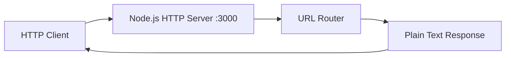
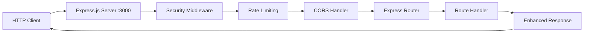

# API Reference - Node.js Hello World Server

## Overview

This document provides comprehensive API reference documentation for the Node.js Hello World server project, designed as a progressive enhancement tutorial demonstrating evolution from basic HTTP server to production-ready application. The server supports dual-mode operation for educational and testing purposes.

**Base URL**: `http://localhost:3000` (default configuration)

**Server Modes**:
- **Basic HTTP Mode**: Uses Node.js built-in `http` module (USE_EXPRESS=false)
- **Express.js Mode**: Uses Express.js framework with middleware (USE_EXPRESS=true)

**Content-Type**: `text/plain` (default for both modes), enhanced security headers in Express mode

## Mode Configuration

The server behavior is controlled by the `USE_EXPRESS` environment variable:

| Mode | Environment Variable | Features |
|------|---------------------|----------|
| Basic HTTP | `USE_EXPRESS=false` | Minimal HTTP server, `/hello` endpoint only |
| Express.js | `USE_EXPRESS=true` | Express framework, `/hello` + `/good-evening` endpoints, security middleware |

**Environment Setup:**
```bash
# Basic HTTP mode
export USE_EXPRESS=false
npm start

# Express.js mode  
export USE_EXPRESS=true
npm start
```

## Architecture

The server supports two distinct architectural patterns depending on the operational mode:

### Basic HTTP Mode Architecture


### Express.js Mode Architecture


## Endpoints by Mode

### Basic HTTP Mode Endpoints (USE_EXPRESS=false)

#### `GET /hello`

Returns the core greeting message. This endpoint is available in both modes with identical behavior.

**Implementation:**
```javascript
// Basic HTTP mode
if (req.url === '/hello' && req.method === 'GET') {
  res.writeHead(200, { 'Content-Type': 'text/plain' });
  res.end('Hello world');
}
```

**Request:**
```http
GET /hello HTTP/1.1
Host: localhost:3000
```

**Response:**
```http
HTTP/1.1 200 OK
Content-Type: text/plain
Content-Length: 11

Hello world
```

**Response Details:**
- **Status Code**: `200 OK`
- **Content-Type**: `text/plain`
- **Body**: `"Hello world"`

**cURL Example:**
```bash
curl -i http://localhost:3000/hello
```

**Expected Output:**
```
HTTP/1.1 200 OK
Content-Type: text/plain
Content-Length: 11
Date: Wed, 08 Aug 2025 12:00:00 GMT
Connection: keep-alive

Hello world
```

### Express.js Mode Endpoints (USE_EXPRESS=true)

When Express.js mode is enabled, the server includes additional middleware and endpoints while maintaining backward compatibility.

#### `GET /hello`

Same functionality as Basic HTTP mode but processed through Express.js framework with enhanced security headers.

**Implementation:**
```javascript
// Express.js mode
app.get('/hello', (req, res) => {
  res.type('text/plain').send('Hello world');
});
```

**Request:**
```http
GET /hello HTTP/1.1
Host: localhost:3000
```

**Response (with security headers):**
```http
HTTP/1.1 200 OK
Content-Type: text/plain; charset=utf-8
Content-Length: 11
X-Content-Type-Options: nosniff
X-Frame-Options: DENY
X-XSS-Protection: 1; mode=block
Date: Wed, 08 Aug 2025 12:00:00 GMT
Connection: keep-alive

Hello world
```

#### `GET /good-evening`

Additional endpoint available only in Express.js mode, demonstrating framework enhancement capabilities.

**Implementation:**
```javascript
app.get('/good-evening', (req, res) => {
  res.type('text/plain').send('Good evening');
});
```

**Request:**
```http
GET /good-evening HTTP/1.1
Host: localhost:3000
```

**Response:**
```http
HTTP/1.1 200 OK
Content-Type: text/plain; charset=utf-8
Content-Length: 12
X-Content-Type-Options: nosniff
X-Frame-Options: DENY
X-XSS-Protection: 1; mode=block
Date: Wed, 08 Aug 2025 12:00:00 GMT
Connection: keep-alive

Good evening
```

**Response Details:**
- **Status Code**: `200 OK`
- **Content-Type**: `text/plain; charset=utf-8`
- **Body**: `"Good evening"`
- **Security Headers**: Applied via Helmet.js middleware

**cURL Example:**
```bash
curl -i http://localhost:3000/good-evening
```

## Python Flask Equivalent Implementation

The Python Flask implementation maintains complete feature parity with the Node.js versions, providing cross-language compatibility for testing and demonstration purposes.

### Flask Application Structure

**File: `app.py`**
```python
from flask import Flask
from flask_cors import CORS
from flask_limiter import Limiter
from flask_limiter.util import get_remote_address

app = Flask(__name__)
CORS(app)

# Rate limiting configuration
limiter = Limiter(
    app,
    key_func=get_remote_address,
    default_limits=["200 per day", "50 per hour"]
)

@app.route('/hello')
def hello():
    return 'Hello world', 200, {'Content-Type': 'text/plain'}

@app.route('/good-evening')
def good_evening():
    return 'Good evening', 200, {'Content-Type': 'text/plain'}

if __name__ == '__main__':
    app.run(host='localhost', port=3000, debug=False)
```

### Flask Endpoints

#### `GET /hello`

**Implementation:**
```python
@app.route('/hello')
def hello():
    return 'Hello world', 200, {'Content-Type': 'text/plain'}
```

**Response (identical to Node.js):**
```http
HTTP/1.1 200 OK
Content-Type: text/plain
Content-Length: 11
Server: Werkzeug/2.3.0 Python/3.11.0
Date: Wed, 08 Aug 2025 12:00:00 GMT

Hello world
```

#### `GET /good-evening`

**Implementation:**
```python
@app.route('/good-evening')
def good_evening():
    return 'Good evening', 200, {'Content-Type': 'text/plain'}
```

**Response (identical to Node.js):**
```http
HTTP/1.1 200 OK
Content-Type: text/plain
Content-Length: 12
Server: Werkzeug/2.3.0 Python/3.11.0
Date: Wed, 08 Aug 2025 12:00:00 GMT

Good evening
```

### Flask Production Configuration

**File: `wsgi.py`**
```python
from app import app

if __name__ == "__main__":
    app.run()
```

**Gunicorn Production Server:**
```bash
# Install dependencies
pip install flask gunicorn flask-cors flask-limiter

# Run with Gunicorn (equivalent to PM2 clustering)
gunicorn --bind 0.0.0.0:3000 --workers 4 wsgi:app
```

### Flask Testing Examples

**Using Python requests library:**
```python
import requests

# Test hello endpoint
response = requests.get('http://localhost:3000/hello')
print(f"Status: {response.status_code}")
print(f"Body: {response.text}")  # "Hello world"

# Test good-evening endpoint
response = requests.get('http://localhost:3000/good-evening')
print(f"Status: {response.status_code}")
print(f"Body: {response.text}")  # "Good evening"
```

## Security Features (Express.js Mode Only)

When running in Express.js mode (`USE_EXPRESS=true`), the server includes comprehensive security middleware:

### Security Headers (via Helmet.js)

All responses in Express.js mode include security headers:

| Header | Value | Purpose |
|--------|--------|---------|
| `X-Content-Type-Options` | `nosniff` | Prevents MIME type sniffing |
| `X-Frame-Options` | `DENY` | Prevents clickjacking attacks |
| `X-XSS-Protection` | `1; mode=block` | Enables XSS filtering |
| `Strict-Transport-Security` | `max-age=31536000` | Enforces HTTPS (production only) |

### Rate Limiting

**Configuration:**
```javascript
const rateLimit = require('express-rate-limit');

const limiter = rateLimit({
  windowMs: 15 * 60 * 1000, // 15 minutes
  max: 100, // limit each IP to 100 requests per windowMs
  message: 'Too many requests, please try again later.'
});

app.use(limiter);
```

**Rate Limit Headers:**
```http
X-RateLimit-Limit: 100
X-RateLimit-Remaining: 99
X-RateLimit-Reset: 1625097600
```

**Rate Limit Exceeded Response:**
```http
HTTP/1.1 429 Too Many Requests
Content-Type: text/plain
Retry-After: 900

Too many requests, please try again later.
```

### CORS Configuration

**Default CORS Settings:**
```javascript
const cors = require('cors');

app.use(cors({
  origin: process.env.CORS_ORIGINS || 'http://localhost:3000',
  methods: ['GET', 'POST', 'PUT', 'DELETE'],
  allowedHeaders: ['Content-Type', 'Authorization']
}));
```

## Request/Response Formats

### Standard HTTP Headers by Mode

#### Basic HTTP Mode Headers

**Request Headers:**
- `Host`: Server hostname and port (required)
- `User-Agent`: Client identification (optional)
- `Accept`: Content type preferences (optional)
- `Connection`: Connection management (optional)

**Response Headers:**
- `Content-Type`: `text/plain`
- `Content-Length`: Byte length of response body
- `Date`: Response timestamp
- `Connection`: Connection status

#### Express.js Mode Headers

**Request Headers (same as basic mode plus):**
- `Origin`: For CORS validation
- `Authorization`: For future authentication features

**Response Headers (includes security headers):**
- `Content-Type`: `text/plain; charset=utf-8`
- `Content-Length`: Byte length of response body
- `Date`: Response timestamp
- `Connection`: Connection status
- `X-Content-Type-Options`: `nosniff`
- `X-Frame-Options`: `DENY`
- `X-XSS-Protection`: `1; mode=block`
- `X-RateLimit-Limit`: Rate limit configuration
- `X-RateLimit-Remaining`: Remaining requests
- `X-RateLimit-Reset`: Rate limit reset time

### Content Types

**Both Modes:**
- All endpoint responses use `Content-Type: text/plain`
- All response bodies are plain text strings
- No JSON responses in current implementation

**Character Encoding:**
- Basic HTTP Mode: UTF-8 (implicit)
- Express.js Mode: UTF-8 (explicit in Content-Type header)

## Error Handling

### HTTP Status Codes

| Status Code | Description | Response Body |
|------------|-------------|---------------|
| `200 OK` | Successful request | Endpoint-specific content |
| `404 Not Found` | Endpoint not found | `"Cannot GET [path]"` |
| `500 Internal Server Error` | Server error | `"Internal Server Error"` |

### Error Response Format

**404 Not Found:**
```http
HTTP/1.1 404 Not Found
Content-Type: text/plain
Content-Length: 19

Cannot GET /unknown
```

**500 Internal Server Error:**
```http
HTTP/1.1 500 Internal Server Error
Content-Type: text/plain
Content-Length: 21

Internal Server Error
```

## Usage Examples

### cURL Examples

#### Basic HTTP Mode Testing
```bash
# Test hello endpoint (available in both modes)
curl -i http://localhost:3000/hello

# Expected response (Basic HTTP mode)
# HTTP/1.1 200 OK
# Content-Type: text/plain
# Content-Length: 11
# Date: Wed, 08 Aug 2025 12:00:00 GMT
# Connection: keep-alive
# 
# Hello world
```

#### Express.js Mode Testing
```bash
# Test hello endpoint with security headers
curl -i http://localhost:3000/hello

# Expected response (Express.js mode)
# HTTP/1.1 200 OK
# Content-Type: text/plain; charset=utf-8
# X-Content-Type-Options: nosniff
# X-Frame-Options: DENY
# X-XSS-Protection: 1; mode=block
# Content-Length: 11
# Date: Wed, 08 Aug 2025 12:00:00 GMT
# Connection: keep-alive
# 
# Hello world

# Test good-evening endpoint (Express.js mode only)
curl -i http://localhost:3000/good-evening

# Test rate limiting (make multiple rapid requests)
for i in {1..110}; do curl http://localhost:3000/hello; done
```

### JavaScript Client Examples

#### Fetch API Examples
```javascript
// Test hello endpoint with error handling
async function testHelloEndpoint() {
  try {
    const response = await fetch('http://localhost:3000/hello');
    console.log('Status:', response.status);
    console.log('Headers:', Object.fromEntries(response.headers));
    const text = await response.text();
    console.log('Body:', text); // "Hello world"
  } catch (error) {
    console.error('Error:', error);
  }
}

// Test good-evening endpoint (Express.js mode only)
async function testGoodEveningEndpoint() {
  try {
    const response = await fetch('http://localhost:3000/good-evening');
    if (response.status === 200) {
      const text = await response.text();
      console.log('Body:', text); // "Good evening"
    } else if (response.status === 404) {
      console.log('Endpoint not available (Basic HTTP mode)');
    }
  } catch (error) {
    console.error('Error:', error);
  }
}

// Test rate limiting
async function testRateLimiting() {
  const promises = Array(110).fill().map(() => 
    fetch('http://localhost:3000/hello')
  );
  
  const responses = await Promise.allSettled(promises);
  const rateLimited = responses.filter(r => 
    r.status === 'fulfilled' && r.value.status === 429
  );
  
  console.log(`Rate limited requests: ${rateLimited.length}`);
}
```

#### Node.js HTTP Client Examples
```javascript
const http = require('http');

// Test hello endpoint
function testHelloEndpoint() {
  const options = {
    hostname: 'localhost',
    port: 3000,
    path: '/hello',
    method: 'GET'
  };

  const req = http.request(options, (res) => {
    console.log(`Status Code: ${res.statusCode}`);
    console.log('Headers:', res.headers);
    
    res.on('data', (data) => {
      console.log('Body:', data.toString()); // "Hello world"
    });
  });

  req.on('error', (error) => {
    console.error('Error:', error);
  });

  req.end();
}

// Test both endpoints with mode detection
function testBothEndpoints() {
  const endpoints = ['/hello', '/good-evening'];
  
  endpoints.forEach(path => {
    const options = {
      hostname: 'localhost',
      port: 3000,
      path: path,
      method: 'GET'
    };

    const req = http.request(options, (res) => {
      console.log(`${path}: ${res.statusCode}`);
      if (res.statusCode === 404 && path === '/good-evening') {
        console.log('Running in Basic HTTP mode');
      }
      
      res.on('data', (data) => {
        console.log(`${path} body:`, data.toString());
      });
    });

    req.end();
  });
}
```

### Python Client Examples

#### Using requests library
```python
import requests
import time

# Test hello endpoint
def test_hello_endpoint():
    response = requests.get('http://localhost:3000/hello')
    print(f"Status: {response.status_code}")
    print(f"Headers: {dict(response.headers)}")
    print(f"Body: {response.text}")  # "Hello world"

# Test good-evening endpoint with mode detection
def test_good_evening_endpoint():
    response = requests.get('http://localhost:3000/good-evening')
    if response.status_code == 200:
        print(f"Express.js mode - Body: {response.text}")
    elif response.status_code == 404:
        print("Basic HTTP mode - Endpoint not available")

# Test rate limiting
def test_rate_limiting():
    rate_limited_count = 0
    for i in range(110):
        response = requests.get('http://localhost:3000/hello')
        if response.status_code == 429:
            rate_limited_count += 1
        time.sleep(0.01)  # Small delay to avoid overwhelming
    
    print(f"Rate limited requests: {rate_limited_count}")

if __name__ == "__main__":
    test_hello_endpoint()
    test_good_evening_endpoint()
    test_rate_limiting()
```

## Testing Specifications

### Unit Test Coverage Requirements

**Endpoint Tests:**
- Verify correct HTTP status codes (200, 404, 429, 500)
- Validate response headers (`Content-Type`, security headers)
- Confirm response body content matches specifications
- Test rate limiting behavior and security middleware
- Validate mode-specific functionality

### Jest + Supertest Testing Examples

#### Basic Test Setup
```javascript
// test/server.test.js
const request = require('supertest');
const { createServer } = require('../server');

describe('Server Tests', () => {
  let server;
  
  beforeEach(() => {
    // Test both modes
    process.env.USE_EXPRESS = 'false'; // or 'true'
    server = createServer();
  });
  
  afterEach(() => {
    server.close();
  });
});
```

#### Basic HTTP Mode Tests
```javascript
// test/basic-mode.test.js
const request = require('supertest');
const { createServer } = require('../server');

describe('Basic HTTP Mode (USE_EXPRESS=false)', () => {
  let server;
  
  beforeAll(() => {
    process.env.USE_EXPRESS = 'false';
    server = createServer();
  });
  
  afterAll(() => {
    server.close();
  });

  describe('GET /hello', () => {
    it('should return 200 status code', async () => {
      const response = await request(server).get('/hello');
      expect(response.status).toBe(200);
    });
    
    it('should return "Hello world" message', async () => {
      const response = await request(server).get('/hello');
      expect(response.text).toBe('Hello world');
    });
    
    it('should set correct content-type header', async () => {
      const response = await request(server).get('/hello');
      expect(response.headers['content-type']).toBe('text/plain');
    });
    
    it('should not include security headers', async () => {
      const response = await request(server).get('/hello');
      expect(response.headers['x-content-type-options']).toBeUndefined();
      expect(response.headers['x-frame-options']).toBeUndefined();
    });
  });

  describe('GET /good-evening', () => {
    it('should return 404 for good-evening endpoint', async () => {
      const response = await request(server).get('/good-evening');
      expect(response.status).toBe(404);
    });
  });
});
```

#### Express.js Mode Tests
```javascript
// test/express-mode.test.js
const request = require('supertest');
const { createServer } = require('../server');

describe('Express.js Mode (USE_EXPRESS=true)', () => {
  let server;
  
  beforeAll(() => {
    process.env.USE_EXPRESS = 'true';
    server = createServer();
  });
  
  afterAll(() => {
    server.close();
  });

  describe('GET /hello', () => {
    it('should return 200 status code', async () => {
      const response = await request(server).get('/hello');
      expect(response.status).toBe(200);
    });
    
    it('should return "Hello world" message', async () => {
      const response = await request(server).get('/hello');
      expect(response.text).toBe('Hello world');
    });
    
    it('should include security headers', async () => {
      const response = await request(server).get('/hello');
      expect(response.headers['x-content-type-options']).toBe('nosniff');
      expect(response.headers['x-frame-options']).toBe('DENY');
      expect(response.headers['x-xss-protection']).toBe('1; mode=block');
    });
    
    it('should include rate limit headers', async () => {
      const response = await request(server).get('/hello');
      expect(response.headers['x-ratelimit-limit']).toBeDefined();
      expect(response.headers['x-ratelimit-remaining']).toBeDefined();
    });
  });

  describe('GET /good-evening', () => {
    it('should return 200 status code', async () => {
      const response = await request(server).get('/good-evening');
      expect(response.status).toBe(200);
    });
    
    it('should return "Good evening" message', async () => {
      const response = await request(server).get('/good-evening');
      expect(response.text).toBe('Good evening');
    });
    
    it('should include security headers', async () => {
      const response = await request(server).get('/good-evening');
      expect(response.headers['x-content-type-options']).toBe('nosniff');
      expect(response.headers['x-frame-options']).toBe('DENY');
    });
  });
});
```

#### Security and Rate Limiting Tests
```javascript
// test/security.test.js
const request = require('supertest');
const { createServer } = require('../server');

describe('Security Tests (Express.js Mode)', () => {
  let server;
  
  beforeAll(() => {
    process.env.USE_EXPRESS = 'true';
    server = createServer();
  });
  
  afterAll(() => {
    server.close();
  });

  describe('Rate Limiting', () => {
    it('should enforce rate limits', async () => {
      const requests = [];
      
      // Make requests up to the limit (typically 100)
      for (let i = 0; i < 110; i++) {
        requests.push(request(server).get('/hello'));
      }
      
      const responses = await Promise.all(requests);
      const rateLimitedResponses = responses.filter(r => r.status === 429);
      
      expect(rateLimitedResponses.length).toBeGreaterThan(0);
    });
    
    it('should include rate limit headers', async () => {
      const response = await request(server).get('/hello');
      expect(response.headers['x-ratelimit-limit']).toBeDefined();
      expect(response.headers['x-ratelimit-remaining']).toBeDefined();
      expect(response.headers['x-ratelimit-reset']).toBeDefined();
    });
  });

  describe('CORS Headers', () => {
    it('should handle CORS preflight requests', async () => {
      const response = await request(server)
        .options('/hello')
        .set('Origin', 'http://localhost:3000')
        .set('Access-Control-Request-Method', 'GET');
      
      expect(response.headers['access-control-allow-origin']).toBeDefined();
      expect(response.headers['access-control-allow-methods']).toBeDefined();
    });
  });
});
```

#### Integration Tests
```javascript
// test/integration.test.js
const request = require('supertest');
const { createServer } = require('../server');

describe('Integration Tests', () => {
  describe('Mode Switching', () => {
    it('should behave differently in different modes', async () => {
      // Test Basic HTTP mode
      process.env.USE_EXPRESS = 'false';
      const basicServer = createServer();
      
      const basicResponse = await request(basicServer).get('/good-evening');
      expect(basicResponse.status).toBe(404);
      basicServer.close();
      
      // Test Express.js mode
      process.env.USE_EXPRESS = 'true';
      const expressServer = createServer();
      
      const expressResponse = await request(expressServer).get('/good-evening');
      expect(expressResponse.status).toBe(200);
      expect(expressResponse.text).toBe('Good evening');
      expressServer.close();
    });
  });

  describe('Error Handling', () => {
    it('should handle server startup and shutdown gracefully', async () => {
      const server = createServer();
      
      // Test that server is responsive
      const response = await request(server).get('/hello');
      expect(response.status).toBe(200);
      
      // Test graceful shutdown
      server.close(() => {
        console.log('Server closed gracefully');
      });
    });
  });
});
```

### Performance Tests
```javascript
// test/performance.test.js
const request = require('supertest');
const { createServer } = require('../server');

describe('Performance Tests', () => {
  let server;
  
  beforeAll(() => {
    process.env.USE_EXPRESS = 'true';
    server = createServer();
  });
  
  afterAll(() => {
    server.close();
  });

  it('should respond within 100ms', async () => {
    const start = Date.now();
    const response = await request(server).get('/hello');
    const duration = Date.now() - start;
    
    expect(response.status).toBe(200);
    expect(duration).toBeLessThan(100);
  });
  
  it('should handle concurrent requests', async () => {
    const concurrentRequests = 50;
    const requests = Array(concurrentRequests).fill().map(() => 
      request(server).get('/hello')
    );
    
    const responses = await Promise.all(requests);
    const successfulResponses = responses.filter(r => r.status === 200);
    
    expect(successfulResponses.length).toBe(concurrentRequests);
  });
});
```

### Running Tests

```bash
# Install testing dependencies
npm install --save-dev jest supertest

# Run all tests
npm test

# Run specific test suites
npm test -- test/basic-mode.test.js
npm test -- test/express-mode.test.js
npm test -- test/security.test.js

# Run tests with coverage
npm test -- --coverage

# Run tests in watch mode
npm test -- --watch
```

## Enhancement Paths

### Express.js Migration

When migrating to Express.js framework:

**New Capabilities:**
- Middleware support for request/response processing
- Route parameter parsing (`/users/:id`)
- Query string parameter handling
- Request body parsing (JSON, form data)
- Enhanced error handling and logging

**Additional Endpoints:**
- `GET /good-evening` - Enhanced greeting endpoint
- Support for POST, PUT, DELETE methods
- Static file serving capabilities
- API versioning support (`/api/v1/...`)

### Production Enhancements

**Security Headers:**
- `X-Content-Type-Options: nosniff`
- `X-Frame-Options: DENY`
- `X-XSS-Protection: 1; mode=block`
- `Strict-Transport-Security` (HTTPS only)

**Rate Limiting:**
- Request throttling per IP address
- Configurable rate limits per endpoint
- Enhanced error responses for rate limit violations

**Monitoring:**
- Request logging with timestamps
- Performance metrics collection
- Health check endpoints (`/health`, `/status`)

## Configuration

### Environment Variables

| Variable | Default | Description | Required |
|----------|---------|-------------|----------|
| `PORT` | `3000` | Server listening port | No |
| `HOST` | `localhost` | Server hostname | No |
| `NODE_ENV` | `development` | Environment mode | No |
| `USE_EXPRESS` | `false` | Enable Express.js mode | **Yes** |
| `RATE_LIMIT_MAX` | `100` | Max requests per window (Express mode) | No |
| `CORS_ORIGINS` | `*` | Allowed CORS origins (Express mode) | No |
| `LOG_LEVEL` | `info` | Logging level (Express mode) | No |

### Environment Setup Examples

**Basic HTTP Mode (.env):**
```bash
PORT=3000
HOST=localhost
NODE_ENV=development
USE_EXPRESS=false
```

**Express.js Mode (.env):**
```bash
PORT=3000
HOST=localhost
NODE_ENV=production
USE_EXPRESS=true
RATE_LIMIT_MAX=200
CORS_ORIGINS=http://localhost:3000,https://mydomain.com
LOG_LEVEL=warn
```

### Server Configuration

#### Basic HTTP Server Implementation
```javascript
const http = require('http');

const server = http.createServer((req, res) => {
  if (req.url === '/hello' && req.method === 'GET') {
    res.writeHead(200, { 'Content-Type': 'text/plain' });
    res.end('Hello world');
  } else {
    res.writeHead(404, { 'Content-Type': 'text/plain' });
    res.end('Not Found');
  }
});

const PORT = process.env.PORT || 3000;
const HOST = process.env.HOST || 'localhost';

server.listen(PORT, HOST, () => {
  console.log(`Basic HTTP server running at http://${HOST}:${PORT}/`);
});
```

#### Express.js Server Implementation
```javascript
const express = require('express');
const helmet = require('helmet');
const rateLimit = require('express-rate-limit');
const cors = require('cors');

const app = express();

// Security middleware
app.use(helmet());

// Rate limiting
const limiter = rateLimit({
  windowMs: 15 * 60 * 1000, // 15 minutes
  max: process.env.RATE_LIMIT_MAX || 100
});
app.use(limiter);

// CORS
app.use(cors({
  origin: process.env.CORS_ORIGINS?.split(',') || '*'
}));

// Routes
app.get('/hello', (req, res) => {
  res.type('text/plain').send('Hello world');
});

app.get('/good-evening', (req, res) => {
  res.type('text/plain').send('Good evening');
});

const PORT = process.env.PORT || 3000;
const HOST = process.env.HOST || 'localhost';

app.listen(PORT, HOST, () => {
  console.log(`Express server running at http://${HOST}:${PORT}/`);
});
```

## Migration Guide

### From Basic HTTP to Express.js Mode

**Step 1: Environment Configuration**
```bash
# Update your .env file
echo "USE_EXPRESS=true" >> .env
```

**Step 2: Install Express.js Dependencies**
```bash
npm install express helmet express-rate-limit cors
```

**Step 3: Test the Migration**
```bash
# Start server in Express mode
npm start

# Test new endpoint
curl http://localhost:3000/good-evening
# Expected: "Good evening"

# Verify security headers
curl -I http://localhost:3000/hello
# Expected: X-Content-Type-Options, X-Frame-Options headers
```

**Step 4: Update Client Code (if needed)**
```javascript
// Client code should continue working, but now receives security headers
fetch('http://localhost:3000/hello')
  .then(response => {
    console.log('Security headers:', response.headers);
    return response.text();
  })
  .then(text => console.log(text)); // Still "Hello world"
```

### Rolling Back to Basic HTTP Mode

```bash
# Update environment
export USE_EXPRESS=false

# Restart server
npm start

# Verify basic mode
curl http://localhost:3000/good-evening
# Expected: 404 Not Found (endpoint not available in basic mode)
```

### Feature Comparison

| Feature | Basic HTTP Mode | Express.js Mode |
|---------|----------------|-----------------|
| `/hello` endpoint | ✅ Available | ✅ Available |
| `/good-evening` endpoint | ❌ Not available | ✅ Available |
| Security headers | ❌ None | ✅ Helmet.js headers |
| Rate limiting | ❌ None | ✅ Configurable limits |
| CORS support | ❌ None | ✅ Configurable origins |
| Middleware support | ❌ None | ✅ Express middleware |
| Body parsing | ❌ Manual | ✅ Automatic |
| Error handling | ❌ Basic | ✅ Enhanced |

## Backprop Integration

### Integration Points

The API serves as a comprehensive test harness for Backprop tooling integration, supporting:

**Progressive Enhancement Testing:**
- Automated validation of basic HTTP to Express.js migration
- Cross-language testing (Node.js to Python Flask equivalence)
- Security enhancement verification
- Performance regression testing

**Endpoint Validation:**
- All documented endpoints serve as test targets for Backprop automation
- Consistent response formats enable reliable test assertions
- Mode-specific behavior validation
- Security header compliance testing

**Multi-Implementation Testing:**
- Node.js basic HTTP mode validation
- Express.js enhanced mode validation
- Python Flask equivalent validation
- Cross-platform behavioral consistency

### Backprop Test Configuration

#### Basic HTTP Mode Test Configuration
```javascript
// backprop-config-basic.js
module.exports = {
  name: 'Node.js Basic HTTP Mode',
  baseUrl: 'http://localhost:3000',
  environment: {
    USE_EXPRESS: 'false'
  },
  endpoints: [
    {
      path: '/hello',
      method: 'GET',
      expectedStatus: 200,
      expectedBody: 'Hello world',
      expectedHeaders: {
        'content-type': 'text/plain'
      }
    },
    {
      path: '/good-evening',
      method: 'GET',
      expectedStatus: 404,
      description: 'Should not be available in basic mode'
    }
  ],
  performance: {
    maxResponseTime: 100,
    concurrentRequests: 10
  }
};
```

#### Express.js Mode Test Configuration
```javascript
// backprop-config-express.js
module.exports = {
  name: 'Node.js Express.js Mode',
  baseUrl: 'http://localhost:3000',
  environment: {
    USE_EXPRESS: 'true'
  },
  endpoints: [
    {
      path: '/hello',
      method: 'GET',
      expectedStatus: 200,
      expectedBody: 'Hello world',
      expectedHeaders: {
        'content-type': 'text/plain; charset=utf-8',
        'x-content-type-options': 'nosniff',
        'x-frame-options': 'DENY',
        'x-xss-protection': '1; mode=block'
      }
    },
    {
      path: '/good-evening',
      method: 'GET',
      expectedStatus: 200,
      expectedBody: 'Good evening',
      expectedHeaders: {
        'content-type': 'text/plain; charset=utf-8'
      }
    }
  ],
  security: {
    validateSecurityHeaders: true,
    testRateLimiting: true,
    maxRequestsPerMinute: 100
  },
  performance: {
    maxResponseTime: 100,
    concurrentRequests: 50
  }
};
```

#### Python Flask Test Configuration
```javascript
// backprop-config-flask.js
module.exports = {
  name: 'Python Flask Implementation',
  baseUrl: 'http://localhost:3000',
  runtime: 'python',
  command: 'python app.py',
  endpoints: [
    {
      path: '/hello',
      method: 'GET',
      expectedStatus: 200,
      expectedBody: 'Hello world',
      expectedHeaders: {
        'content-type': 'text/plain'
      }
    },
    {
      path: '/good-evening',
      method: 'GET',
      expectedStatus: 200,
      expectedBody: 'Good evening',
      expectedHeaders: {
        'content-type': 'text/plain'
      }
    }
  ],
  equivalence: {
    compareWith: 'express',
    ignoreHeaders: ['server', 'date'],
    tolerateResponseTimeVariance: 50
  }
};
```

### Automated Testing Workflows

#### Complete Integration Test Suite
```javascript
// backprop-integration-test.js
const { runBackpropTest } = require('@backprop/testing');

async function runCompleteTestSuite() {
  const results = [];
  
  // Test 1: Basic HTTP Mode
  console.log('Testing Basic HTTP Mode...');
  const basicResults = await runBackpropTest('backprop-config-basic.js');
  results.push({ mode: 'basic', ...basicResults });
  
  // Test 2: Express.js Mode
  console.log('Testing Express.js Mode...');
  const expressResults = await runBackpropTest('backprop-config-express.js');
  results.push({ mode: 'express', ...expressResults });
  
  // Test 3: Python Flask Equivalence
  console.log('Testing Python Flask Implementation...');
  const flaskResults = await runBackpropTest('backprop-config-flask.js');
  results.push({ mode: 'flask', ...flaskResults });
  
  // Test 4: Cross-Implementation Validation
  console.log('Validating cross-implementation consistency...');
  const consistencyResults = await validateConsistency(results);
  
  return {
    summary: generateTestSummary(results),
    details: results,
    consistency: consistencyResults
  };
}

function validateConsistency(results) {
  const nodeBasic = results.find(r => r.mode === 'basic');
  const nodeExpress = results.find(r => r.mode === 'express');
  const pythonFlask = results.find(r => r.mode === 'flask');
  
  return {
    helloEndpointConsistency: {
      nodeBasicVsExpress: compareResponses(nodeBasic.hello, nodeExpress.hello),
      nodeExpressVsFlask: compareResponses(nodeExpress.hello, pythonFlask.hello),
      allImplementationsMatch: true // calculated based on comparisons
    },
    goodEveningEndpointConsistency: {
      expressVsFlask: compareResponses(nodeExpress.goodEvening, pythonFlask.goodEvening),
      notAvailableInBasic: nodeBasic.goodEvening.status === 404
    }
  };
}
```

#### Performance Validation
```javascript
// backprop-performance-test.js
module.exports = {
  name: 'Performance Validation',
  tests: [
    {
      name: 'Response Time Under Load',
      endpoint: '/hello',
      concurrentUsers: 100,
      duration: '30s',
      expectedMaxResponseTime: 100,
      expectedMinThroughput: 1000
    },
    {
      name: 'Rate Limiting Effectiveness',
      endpoint: '/hello',
      requestsPerSecond: 10,
      duration: '60s',
      expectedRateLimitTrigger: true,
      expectedMaxAllowedRequests: 100
    },
    {
      name: 'Memory Usage Stability',
      endpoint: '/hello',
      requests: 10000,
      expectedMaxMemoryIncrease: '10MB',
      expectedMemoryLeaks: false
    }
  ]
};
```

### Monitoring Integration

#### Request Logging for Backprop Analytics
```javascript
// Enhanced logging for Backprop integration
const winston = require('winston');

const backpropLogger = winston.createLogger({
  format: winston.format.combine(
    winston.format.timestamp(),
    winston.format.json()
  ),
  transports: [
    new winston.transports.File({ 
      filename: 'backprop-requests.log',
      format: winston.format.printf(info => {
        return JSON.stringify({
          timestamp: info.timestamp,
          method: info.method,
          url: info.url,
          statusCode: info.statusCode,
          responseTime: info.responseTime,
          userAgent: info.userAgent,
          mode: process.env.USE_EXPRESS === 'true' ? 'express' : 'basic',
          testRunId: info.testRunId
        });
      })
    })
  ]
});

// Middleware for request logging
function backpropLoggingMiddleware(req, res, next) {
  const start = Date.now();
  
  res.on('finish', () => {
    backpropLogger.info({
      method: req.method,
      url: req.url,
      statusCode: res.statusCode,
      responseTime: Date.now() - start,
      userAgent: req.get('User-Agent'),
      testRunId: req.get('X-Backprop-Test-Run-Id')
    });
  });
  
  next();
}
```

### CI/CD Integration

#### GitHub Actions Workflow for Backprop
```yaml
# .github/workflows/backprop-integration.yml
name: Backprop Integration Tests

on: [push, pull_request]

jobs:
  backprop-tests:
    runs-on: ubuntu-latest
    
    steps:
    - uses: actions/checkout@v2
    
    - name: Setup Node.js
      uses: actions/setup-node@v2
      with:
        node-version: '16'
    
    - name: Setup Python
      uses: actions/setup-python@v2
      with:
        python-version: '3.9'
    
    - name: Install Node.js dependencies
      run: npm install
    
    - name: Install Python dependencies
      run: pip install -r requirements.txt
    
    - name: Run Backprop Basic HTTP Mode Tests
      run: |
        export USE_EXPRESS=false
        npm start &
        SERVER_PID=$!
        sleep 2
        npx backprop test backprop-config-basic.js
        kill $SERVER_PID
    
    - name: Run Backprop Express.js Mode Tests
      run: |
        export USE_EXPRESS=true
        npm start &
        SERVER_PID=$!
        sleep 2
        npx backprop test backprop-config-express.js
        kill $SERVER_PID
    
    - name: Run Backprop Python Flask Tests
      run: |
        python app.py &
        FLASK_PID=$!
        sleep 2
        npx backprop test backprop-config-flask.js
        kill $FLASK_PID
    
    - name: Upload Backprop Results
      uses: actions/upload-artifact@v2
      with:
        name: backprop-test-results
        path: backprop-results/
```

## Version Compatibility

| Implementation | Runtime Version | Features | Dependencies |
|---------------|----------------|----------|--------------|
| Basic HTTP Mode | Node.js 14+ | `/hello` endpoint only | None (built-in `http` module) |
| Express.js Mode | Node.js 14+ | `/hello`, `/good-evening`, security middleware | express, helmet, cors, express-rate-limit |
| Python Flask | Python 3.8+ | `/hello`, `/good-evening`, CORS support | flask, flask-cors, flask-limiter |
| Production Mode | Node.js 16+ | All Express features + PM2, monitoring | Additional: pm2, winston, dotenv |

### Feature Matrix by Implementation

| Feature | Basic HTTP | Express.js | Python Flask | Production |
|---------|-----------|------------|--------------|------------|
| `/hello` endpoint | ✅ | ✅ | ✅ | ✅ |
| `/good-evening` endpoint | ❌ | ✅ | ✅ | ✅ |
| Security headers | ❌ | ✅ | ⚠️ (configurable) | ✅ |
| Rate limiting | ❌ | ✅ | ✅ | ✅ |
| CORS support | ❌ | ✅ | ✅ | ✅ |
| Request logging | ❌ | ⚠️ (basic) | ⚠️ (basic) | ✅ |
| Process management | ❌ | ❌ | ❌ | ✅ (PM2) |
| Health checks | ❌ | ❌ | ❌ | ✅ |
| Graceful shutdown | ❌ | ⚠️ (basic) | ⚠️ (basic) | ✅ |

**Legend:**
- ✅ Fully supported
- ⚠️ Basic or configurable support
- ❌ Not supported

## Migration Guide References

For detailed implementation guides:

- **[Getting Started Guide](../guides/getting-started.md)** - Initial setup and basic usage
- **[Express.js Migration](../guides/express-migration.md)** - Framework enhancement steps
- **[Python Flask Port](../guides/python-flask-port.md)** - Cross-language migration
- **[Testing Guide](../guides/testing.md)** - Unit and integration testing
- **[Production Guide](../guides/production.md)** - Deployment and scaling
- **[Security Guide](../guides/security.md)** - Security hardening

## Contributing

When enhancing the tutorial project:

### Adding New Endpoints

1. **Follow Mode-Specific Patterns**
   - Basic HTTP mode: Manual URL parsing and response writing
   - Express.js mode: Use Express router with middleware
   - Python Flask: Use Flask decorators with consistent response format

2. **Maintain Cross-Implementation Consistency**
   - Ensure identical behavior across Node.js and Python implementations
   - Verify response bodies, status codes, and headers match exactly
   - Update all three implementations simultaneously

3. **Documentation Requirements**
   - Add endpoint documentation to this file
   - Include examples for all supported modes
   - Add cURL, JavaScript, and Python client examples
   - Update Backprop test configurations

4. **Testing Requirements**
   - Add Jest/Supertest tests for Node.js implementations
   - Add Python unit tests for Flask implementation
   - Ensure >80% code coverage maintained
   - Add performance benchmarks for new endpoints

5. **Security Considerations**
   - Apply security middleware in Express.js mode
   - Validate input parameters and sanitize output
   - Test for common vulnerabilities (XSS, injection, etc.)
   - Update rate limiting if needed

### Enhancement Guidelines

1. **Backward Compatibility**
   - Never break existing endpoint behavior
   - Maintain support for basic HTTP mode
   - Preserve response formats and status codes

2. **Educational Value**
   - Keep code simple and well-commented
   - Demonstrate progressive enhancement principles
   - Include clear before/after examples

3. **Production Readiness**
   - Include proper error handling
   - Add monitoring and logging support
   - Ensure scalability considerations

### Testing Your Changes

```bash
# Test all modes
npm run test:all

# Test specific implementations
npm run test:basic
npm run test:express
python -m pytest test_app.py

# Run Backprop integration tests
npm run test:backprop

# Performance testing
npm run test:performance
```

---

**Last Updated**: August 2025
**API Version**: 2.0 (Dual-mode support)
**Documentation Version**: 2.0
**Tutorial Compatibility**: Node.js Hello World Progressive Enhancement Tutorial