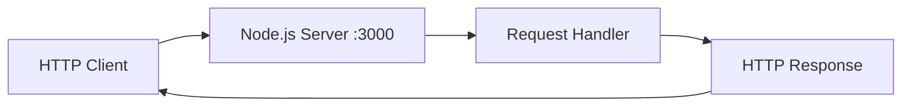

# API Reference - Node.js Hello World Server

## Overview

This document provides comprehensive API reference documentation for the Node.js Hello World server project, designed as a test integration for Backprop tooling. The server implements a minimal HTTP API with basic endpoints for demonstration and testing purposes.

**Base URL**: `http://localhost:3000` (default configuration)

**Server Implementation**: Basic Node.js HTTP server using the built-in `http` module

**Content-Type**: `text/plain` (default), `application/json` (for enhanced implementations)

## Architecture

The server follows a simple request-response pattern suitable for testing and demonstration:



## Base Endpoints

### Root Endpoint

#### `GET /`

Returns a basic server response confirming the server is running.

**Request:**
```http
GET / HTTP/1.1
Host: localhost:3000
```

**Response:**
```http
HTTP/1.1 200 OK
Content-Type: text/plain
Content-Length: 13

Hello, World!
```

**Response Details:**
- **Status Code**: `200 OK`
- **Content-Type**: `text/plain`
- **Body**: `"Hello, World!\n"`

### Hello Endpoint

#### `GET /hello`

Returns a personalized greeting message.

**Request:**
```http
GET /hello HTTP/1.1
Host: localhost:3000
```

**Response:**
```http
HTTP/1.1 200 OK
Content-Type: text/plain
Content-Length: 13

Hello world
```

**Response Details:**
- **Status Code**: `200 OK`
- **Content-Type**: `text/plain`
- **Body**: `"Hello world"`

## Enhanced Endpoints (Express.js Implementation)

The following endpoints are available when the server is enhanced with Express.js framework:

### Good Evening Endpoint

#### `GET /good-evening`

Returns an evening greeting message, demonstrating framework enhancement capabilities.

**Request:**
```http
GET /good-evening HTTP/1.1
Host: localhost:3000
```

**Response:**
```http
HTTP/1.1 200 OK
Content-Type: text/plain
Content-Length: 12

Good evening
```

**Response Details:**
- **Status Code**: `200 OK`
- **Content-Type**: `text/plain`
- **Body**: `"Good evening"`

## Request/Response Formats

### Standard HTTP Headers

**Request Headers:**
- `Host`: Server hostname and port (required)
- `User-Agent`: Client identification (optional)
- `Accept`: Content type preferences (optional)
- `Connection`: Connection management (optional)

**Response Headers:**
- `Content-Type`: Always `text/plain` for basic implementation
- `Content-Length`: Byte length of response body
- `Date`: Response timestamp
- `Connection`: Connection status

### Content Types

**Basic Implementation:**
- All responses use `Content-Type: text/plain`
- All response bodies are plain text strings

**Enhanced Implementation (Express.js):**
- Supports `Content-Type: application/json` for structured data
- Supports middleware for content negotiation
- Supports request body parsing for POST/PUT operations

## Error Handling

### HTTP Status Codes

| Status Code | Description | Response Body |
|------------|-------------|---------------|
| `200 OK` | Successful request | Endpoint-specific content |
| `404 Not Found` | Endpoint not found | `"Cannot GET [path]"` |
| `500 Internal Server Error` | Server error | `"Internal Server Error"` |

### Error Response Format

**404 Not Found:**
```http
HTTP/1.1 404 Not Found
Content-Type: text/plain
Content-Length: 19

Cannot GET /unknown
```

**500 Internal Server Error:**
```http
HTTP/1.1 500 Internal Server Error
Content-Type: text/plain
Content-Length: 21

Internal Server Error
```

## Usage Examples

### Basic cURL Examples

**Test root endpoint:**
```bash
curl -i http://localhost:3000/
```

**Test hello endpoint:**
```bash
curl -i http://localhost:3000/hello
```

**Test non-existent endpoint:**
```bash
curl -i http://localhost:3000/nonexistent
```

### JavaScript Examples

**Using fetch API:**
```javascript
// Test root endpoint
fetch('http://localhost:3000/')
  .then(response => response.text())
  .then(data => console.log(data)); // "Hello, World!"

// Test hello endpoint
fetch('http://localhost:3000/hello')
  .then(response => response.text())
  .then(data => console.log(data)); // "Hello world"
```

**Using Node.js http module:**
```javascript
const http = require('http');

const options = {
  hostname: 'localhost',
  port: 3000,
  path: '/hello',
  method: 'GET'
};

const req = http.request(options, (res) => {
  console.log(`statusCode: ${res.statusCode}`);
  console.log(`headers:`, res.headers);
  
  res.on('data', (data) => {
    console.log(data.toString()); // "Hello world"
  });
});

req.end();
```

## Testing Specifications

### Unit Test Coverage

**Endpoint Tests:**
- Verify correct HTTP status codes (200, 404, 500)
- Validate response headers (`Content-Type`, `Content-Length`)
- Confirm response body content matches specifications
- Test request handling for each supported HTTP method

**Example Test Cases:**
```javascript
// Jest/Mocha test examples
describe('GET /', () => {
  it('should return 200 status', async () => {
    const response = await request(app).get('/');
    expect(response.status).toBe(200);
  });
  
  it('should return Hello, World!', async () => {
    const response = await request(app).get('/');
    expect(response.text).toBe('Hello, World!\n');
  });
});

describe('GET /hello', () => {
  it('should return correct greeting', async () => {
    const response = await request(app).get('/hello');
    expect(response.text).toBe('Hello world');
  });
});
```

## Enhancement Paths

### Express.js Migration

When migrating to Express.js framework:

**New Capabilities:**
- Middleware support for request/response processing
- Route parameter parsing (`/users/:id`)
- Query string parameter handling
- Request body parsing (JSON, form data)
- Enhanced error handling and logging

**Additional Endpoints:**
- `GET /good-evening` - Enhanced greeting endpoint
- Support for POST, PUT, DELETE methods
- Static file serving capabilities
- API versioning support (`/api/v1/...`)

### Production Enhancements

**Security Headers:**
- `X-Content-Type-Options: nosniff`
- `X-Frame-Options: DENY`
- `X-XSS-Protection: 1; mode=block`
- `Strict-Transport-Security` (HTTPS only)

**Rate Limiting:**
- Request throttling per IP address
- Configurable rate limits per endpoint
- Enhanced error responses for rate limit violations

**Monitoring:**
- Request logging with timestamps
- Performance metrics collection
- Health check endpoints (`/health`, `/status`)

## Configuration

### Environment Variables

| Variable | Default | Description |
|----------|---------|-------------|
| `PORT` | `3000` | Server listening port |
| `HOST` | `localhost` | Server hostname |
| `NODE_ENV` | `development` | Environment mode |

### Server Configuration

**Basic Server:**
```javascript
const server = http.createServer((req, res) => {
  // Request handling logic
});

server.listen(PORT, HOST, () => {
  console.log(`Server running at http://${HOST}:${PORT}/`);
});
```

**Express.js Server:**
```javascript
const express = require('express');
const app = express();

app.get('/', (req, res) => {
  res.send('Hello, World!\n');
});

app.listen(PORT, HOST, () => {
  console.log(`Express server running at http://${HOST}:${PORT}/`);
});
```

## Backprop Integration

### Integration Points

The API supports Backprop tooling integration through:

**Test Endpoints:**
- All documented endpoints serve as test targets for Backprop automation
- Consistent response formats enable reliable test assertions
- Predictable behavior supports automated testing workflows

**Enhancement Testing:**
- Progressive enhancement from basic HTTP to Express.js
- Framework migration testing (Node.js to Python Flask)
- Production readiness validation

**Monitoring Integration:**
- Request/response logging compatible with Backprop analytics
- Performance metrics collection for optimization analysis
- Error tracking and reporting integration

### Usage in Backprop Workflows

**Basic Testing:**
```javascript
// Backprop test configuration example
const testConfig = {
  baseUrl: 'http://localhost:3000',
  endpoints: [
    { path: '/', method: 'GET', expectedStatus: 200 },
    { path: '/hello', method: 'GET', expectedStatus: 200 },
    { path: '/nonexistent', method: 'GET', expectedStatus: 404 }
  ]
};
```

## Version Compatibility

| Server Version | Node.js | Features |
|---------------|---------|----------|
| Basic HTTP | 14+ | Core endpoints (/, /hello) |
| Express.js | 14+ | Enhanced routing, middleware |
| Production | 16+ | Security, monitoring, PM2 |

## Migration Guide References

For detailed implementation guides:

- **[Getting Started Guide](../guides/getting-started.md)** - Initial setup and basic usage
- **[Express.js Migration](../guides/express-migration.md)** - Framework enhancement steps
- **[Python Flask Port](../guides/python-flask-port.md)** - Cross-language migration
- **[Testing Guide](../guides/testing.md)** - Unit and integration testing
- **[Production Guide](../guides/production.md)** - Deployment and scaling
- **[Security Guide](../guides/security.md)** - Security hardening

## Contributing

When adding new endpoints:

1. Follow the established response format patterns
2. Include comprehensive documentation with examples
3. Add corresponding unit tests with coverage
4. Update this API reference documentation
5. Ensure Backprop integration compatibility

---

**Last Updated**: Current
**API Version**: 1.0
**Documentation Version**: 1.0