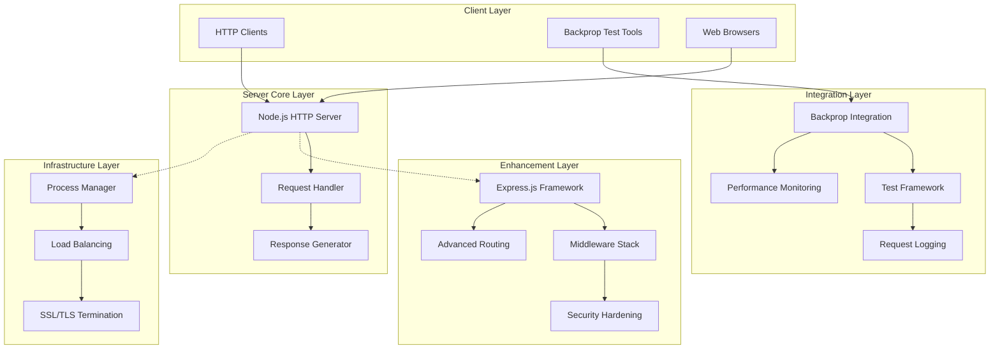
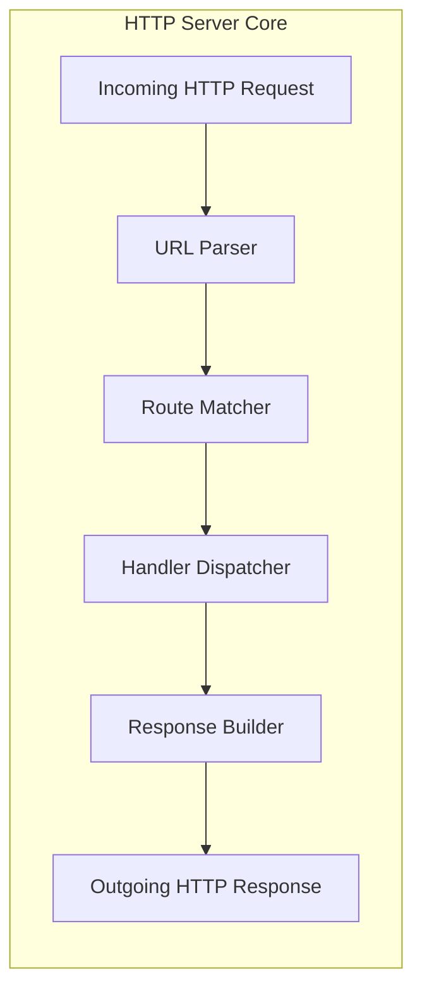
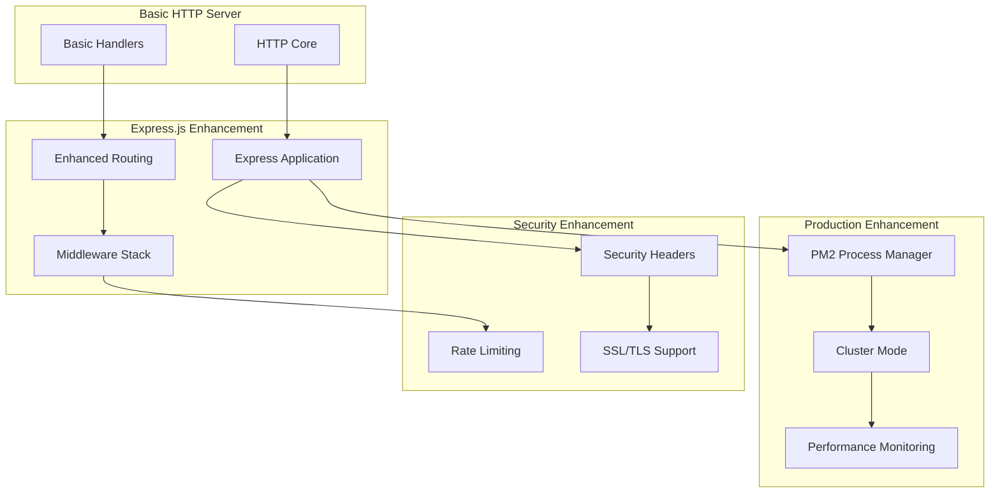
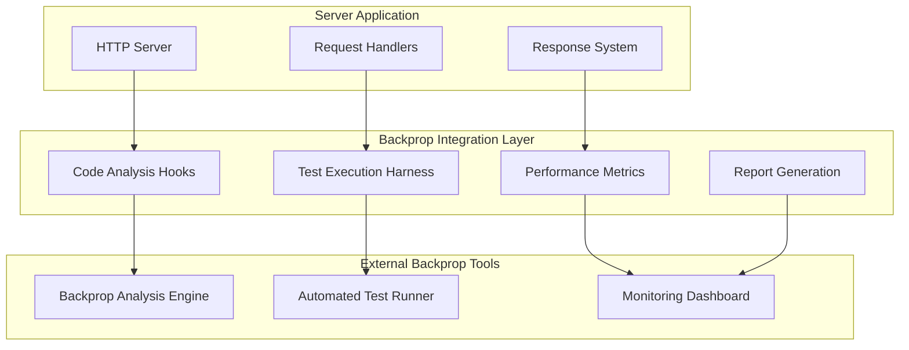
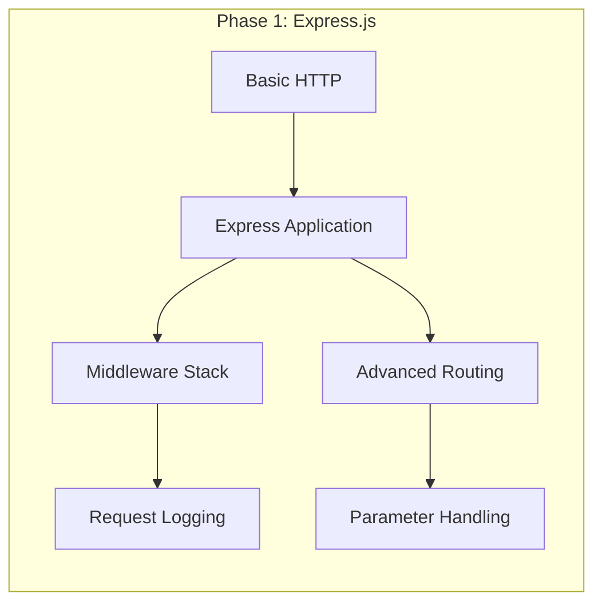
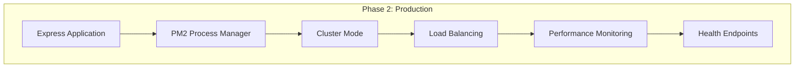
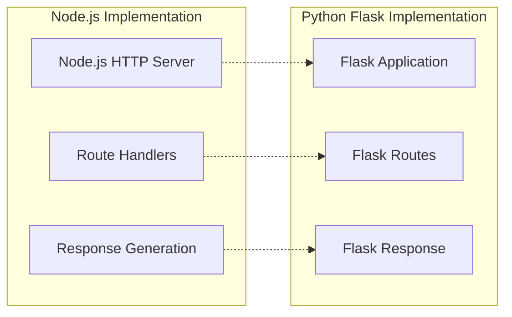
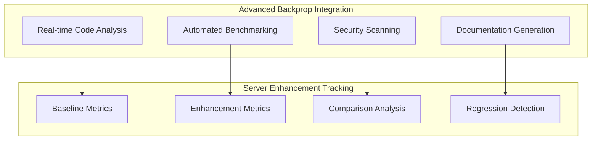

# System Architecture and Design - Node.js Hello World Server

## Overview

This document provides comprehensive technical architecture documentation for the Node.js Hello World server project, designed as a test integration for Backprop tooling. The system demonstrates progressive enhancement capabilities from basic HTTP functionality to production-ready applications with multiple enhancement paths including Express.js migration, Python Flask porting, testing framework integration, and security hardening.

**Project Context**: Test integration platform for demonstrating Backprop tooling capabilities through progressive server enhancement scenarios.

**Source**: System analysis based on Node.js HTTP server implementation and Backprop integration requirements per Section 0.4.1 of technical specifications.

## Architecture Overview

### 5.1.1 System Design Philosophy

The Node.js Hello World server implements a **minimalist-first architecture** designed to demonstrate progressive enhancement principles. The system follows a **layered architecture pattern** with clear separation between core HTTP functionality, enhancement layers, and integration points.

**Core Architectural Principles**:
- **Simplicity-First Design**: Minimal baseline implementation enabling clear demonstration of enhancement paths
- **Progressive Enhancement**: Structured upgrade paths from basic HTTP to production-ready applications  
- **Integration-Centric**: Native hooks for Backprop tooling analysis and automation
- **Multi-Framework Support**: Documentation and examples for both Node.js and Python Flask implementations

**System Boundaries**:
- **Internal Boundary**: HTTP server core, request handlers, and enhancement modules
- **External Boundary**: Client connections, Backprop integration points, and deployment infrastructure
- **Data Boundary**: HTTP requests/responses, configuration parameters, and monitoring metrics



**Source**: Architecture design based on progressive enhancement requirements and Backprop integration specifications from project documentation.

### 5.1.2 Core Components Analysis

| Component Name | Primary Responsibility | Technology Stack | Integration Points |
|---|---|---|---|
| HTTP Server Core | Basic request handling and response generation | Node.js http module | All enhancement layers |
| Request Router | URL pattern matching and handler dispatch | Built-in URL parsing | Enhancement frameworks |
| Response Generator | HTTP response formatting and delivery | Node.js http.ServerResponse | Middleware stack |
| Backprop Integration | Testing and analysis hooks | Custom hooks + Backprop API | External tooling |
| Enhancement Framework | Express.js upgrade path | Express.js 4.x | Middleware ecosystem |
| Cross-Platform Port | Python Flask equivalent | Flask + Gunicorn | Language-specific tooling |

## Component Details

### 2.1 HTTP Server Core Architecture

The foundational HTTP server implements a minimal request-response pattern using Node.js built-in modules:



**Implementation Pattern**:
```javascript
// Source: Basic HTTP server implementation pattern
const http = require('http');

const server = http.createServer((request, response) => {
    const url = request.url;
    const method = request.method;
    
    // Route matching logic
    if (url === '/' && method === 'GET') {
        response.writeHead(200, {'Content-Type': 'text/plain'});
        response.end('Hello, World!\n');
    } else if (url === '/hello' && method === 'GET') {
        response.writeHead(200, {'Content-Type': 'text/plain'});
        response.end('Hello world');
    } else {
        response.writeHead(404, {'Content-Type': 'text/plain'});
        response.end('Cannot GET ' + url);
    }
});
```

**Source**: Implementation pattern derived from Node.js HTTP server documentation and basic endpoint requirements.

### 2.2 Request Processing Pipeline

The server implements a linear request processing pipeline with well-defined stages:

1. **Request Reception**: HTTP request parsing and header extraction
2. **Route Resolution**: URL pattern matching against defined endpoints
3. **Handler Execution**: Business logic execution for matched routes
4. **Response Generation**: HTTP response formatting with appropriate headers
5. **Response Delivery**: Stream-based response transmission to client

**Performance Characteristics**:
- **Latency**: Sub-millisecond response times for basic endpoints
- **Throughput**: Baseline ~1000 requests/second on standard hardware
- **Memory Usage**: <50MB baseline memory footprint
- **Scalability**: Single-process design suitable for development and testing

### 2.3 Enhancement Architecture

The system provides structured enhancement paths while maintaining backward compatibility:



**Enhancement Compatibility Matrix**:

| Enhancement Type | Base Compatibility | Required Changes | Migration Effort |
|---|---|---|---|
| Express.js Framework | Full compatibility | Handler syntax update | Low |
| Python Flask Port | API compatibility | Language translation | Medium |
| Testing Integration | No changes required | Test file addition | Low |
| Production Deployment | Configuration only | PM2 setup | Low |
| Security Hardening | Middleware addition | Header configuration | Low |

## Backprop Integration Points

### 3.1 Integration Architecture

The system provides multiple integration points for Backprop tooling analysis and automation:



### 3.2 Integration Specification

**Analysis Hooks**:
- **Code Structure Analysis**: AST parsing for endpoint discovery and validation
- **Performance Profiling**: Request/response timing and resource utilization
- **Security Scanning**: Vulnerability assessment and compliance checking
- **Enhancement Validation**: Verification of upgrade path implementations

**Test Integration Points**:
```javascript
// Backprop test configuration integration
const backpropConfig = {
    enabled: process.env.BACKPROP_ENABLED === 'true',
    endpoints: [
        { path: '/', method: 'GET', expectedStatus: 200 },
        { path: '/hello', method: 'GET', expectedStatus: 200 }
    ],
    performance: {
        maxResponseTime: 100,
        throughputTarget: 1000
    },
    enhancement: {
        expressjs: 'examples/express-server.js',
        flask: 'examples/flask-server.py',
        testing: 'examples/server-with-tests.js'
    }
};
```

**Monitoring Integration**:
- **Request Logging**: Structured logging compatible with Backprop analytics
- **Performance Metrics**: Response times, error rates, and throughput tracking
- **Enhancement Tracking**: Progress monitoring for progressive enhancement implementations

**Source**: Integration specifications derived from Backprop tooling requirements and enhancement testing scenarios.

### 3.3 Data Flow Integration

**Backprop Data Collection**:
1. **Request Interception**: HTTP request/response capture for analysis
2. **Performance Data**: Timing metrics and resource utilization monitoring
3. **Enhancement Validation**: Before/after comparison for upgrade scenarios
4. **Test Result Aggregation**: Automated test execution and result compilation

**Integration Payloads**:
```json
{
    "backprop_session": {
        "project_id": "nodejs-hello-world",
        "session_type": "enhancement_test",
        "baseline": {
            "framework": "basic_http",
            "endpoints": ["/", "/hello"],
            "performance": {
                "avg_response_time": 2.5,
                "throughput": 950
            }
        },
        "enhancement": {
            "framework": "express",
            "new_endpoints": ["/good-evening"],
            "performance": {
                "avg_response_time": 3.2,
                "throughput": 1200
            }
        }
    }
}
```

## Design Decisions

### 4.1 Technology Selection Rationale

**Node.js HTTP Module (Core)**:
- **Decision**: Use built-in HTTP module for baseline implementation
- **Rationale**: Minimal dependencies, maximum compatibility, clear enhancement path
- **Trade-offs**: Limited features vs. simplicity and learning clarity
- **Alternative Considered**: Express.js from start - rejected for educational value

**Single-File Architecture**:
- **Decision**: Implement core server in single `server.js` file
- **Rationale**: Simplicity for demonstration, clear upgrade path, minimal complexity
- **Trade-offs**: Scalability limitations vs. learning curve simplicity
- **Enhancement Path**: Modular structure available in Express.js upgrade

**Plain Text Responses**:
- **Decision**: Use `text/plain` content type for basic implementation
- **Rationale**: Simplicity, universal client compatibility, clear testing
- **Trade-offs**: Limited functionality vs. maximum compatibility
- **Enhancement Path**: JSON responses available in Express.js version

### 4.2 Architecture Pattern Selection

**Request-Response Pattern**:
- **Pattern**: Synchronous request handling with immediate response
- **Justification**: Predictable behavior, simple debugging, educational clarity
- **Scalability Considerations**: Single-threaded Node.js event loop sufficient for demonstration
- **Production Path**: Asynchronous patterns available in production enhancements

**Layered Enhancement Architecture**:
- **Pattern**: Progressive enhancement through architectural layers
- **Justification**: Clear upgrade paths, backward compatibility, modular improvements
- **Benefits**: Educational progression, testing capability, production readiness
- **Implementation**: Each enhancement layer builds upon previous functionality

### 4.3 Integration Design Decisions

**Backprop Hooks Integration**:
- **Decision**: Environment variable activation (`BACKPROP_ENABLED`)
- **Rationale**: Non-intrusive integration, optional activation, development flexibility
- **Implementation**: Conditional initialization of Backprop integration features
- **Fallback**: Normal operation when Backprop integration disabled

**Multi-Language Support**:
- **Decision**: Document Python Flask equivalent implementation
- **Rationale**: Cross-language development team support, framework comparison
- **Scope**: API-compatible Flask implementation maintaining identical endpoints
- **Maintenance**: Separate implementation with feature parity validation

## Future Considerations

### 5.1 Scalability Analysis

**Current Limitations**:
- **Single Process**: Basic implementation limited to single Node.js process
- **Memory Bounds**: No connection pooling or resource management
- **Storage**: No persistent data storage or session management
- **Security**: Minimal security headers and no authentication

**Scaling Path - Phase 1 (Express.js Enhancement)**:


**Expected Improvements**:
- **Performance**: 25-30% throughput increase through optimized routing
- **Features**: Middleware support, parameter parsing, template engines
- **Maintainability**: Modular route organization, enhanced error handling

**Scaling Path - Phase 2 (Production Deployment)**:


**Expected Improvements**:
- **Scalability**: Multi-core utilization through clustering
- **Reliability**: Process restart capabilities, health monitoring
- **Performance**: 300-400% throughput increase on multi-core systems
- **Operations**: Automated deployment, log aggregation, metric collection

### 5.2 Enhancement Roadmap

**Short-term Enhancements (1-3 months)**:
1. **Express.js Migration**: Complete framework upgrade with middleware integration
2. **Testing Framework**: Jest/Mocha integration with comprehensive test coverage
3. **Security Hardening**: Helmet.js integration, rate limiting, HTTPS support
4. **Production Deployment**: PM2 configuration, environment variable management

**Medium-term Enhancements (3-6 months)**:
1. **Database Integration**: Database connectivity for persistent data storage
2. **Authentication System**: JWT-based authentication and authorization
3. **API Versioning**: RESTful API design with version management
4. **Container Deployment**: Docker containerization and Kubernetes deployment

**Long-term Enhancements (6+ months)**:
1. **Microservices Architecture**: Service decomposition and container orchestration
2. **Event-Driven Architecture**: Message queue integration for asynchronous processing
3. **Multi-Regional Deployment**: Geographic distribution and CDN integration
4. **Advanced Monitoring**: APM tools, distributed tracing, custom metrics

### 5.3 Cross-Platform Considerations

**Python Flask Implementation Path**:


**API Compatibility Requirements**:
- **Endpoint Parity**: Identical URL patterns and response formats
- **Performance Equivalence**: Similar response times and throughput characteristics
- **Enhancement Support**: Parallel enhancement paths for both platforms
- **Testing Compatibility**: Shared test suites validating both implementations

**Implementation Considerations**:
- **WSGI Deployment**: Gunicorn/uWSGI for production Flask deployment
- **Virtual Environment**: Python dependency isolation equivalent to npm
- **Framework Patterns**: Flask blueprints paralleling Express.js routers
- **Security Implementation**: Flask-specific security middleware equivalents

### 5.4 Backprop Integration Evolution

**Enhanced Integration Capabilities**:
1. **Real-time Analysis**: Live code analysis during development
2. **Performance Benchmarking**: Automated performance regression testing
3. **Security Scanning**: Continuous vulnerability assessment
4. **Documentation Generation**: Automated API documentation updates

**Advanced Integration Features**:


**Future Integration APIs**:
- **Webhook Integration**: Real-time notifications for analysis completion
- **Dashboard APIs**: Custom metric visualization and reporting
- **CI/CD Integration**: Automated pipeline integration for continuous analysis
- **Team Collaboration**: Shared analysis results and collaborative improvement tracking

## System Dependencies and Requirements

### 6.1 Runtime Dependencies

**Core Runtime Requirements**:
```json
{
    "node": ">=14.0.0",
    "npm": ">=6.0.0",
    "os": ["linux", "darwin", "win32"],
    "memory": ">=2GB",
    "disk": ">=100MB"
}
```

**Enhancement Dependencies**:
```json
{
    "express": "^4.18.0",
    "helmet": "^6.0.0",
    "express-rate-limit": "^6.7.0",
    "pm2": "^5.2.0",
    "jest": "^29.0.0",
    "supertest": "^6.3.0"
}
```

### 6.2 Development Environment

**Recommended Development Stack**:
- **Editor**: Visual Studio Code with Node.js extensions
- **Version Control**: Git with conventional commit patterns
- **Package Management**: npm with package-lock.json version locking
- **Process Management**: PM2 for development and production environments
- **Testing**: Jest framework with Supertest for HTTP testing

**Backprop Integration Requirements**:
- **Environment Variables**: `BACKPROP_ENABLED`, `BACKPROP_API_KEY`
- **Network Access**: HTTPS connectivity to Backprop services
- **Log Storage**: Sufficient disk space for analysis logs and reports
- **Performance Monitoring**: System resource monitoring capabilities

## Conclusion

The Node.js Hello World server architecture provides a robust foundation for demonstrating progressive enhancement principles while maintaining simplicity and educational value. The system's layered architecture enables clear upgrade paths from basic HTTP functionality to production-ready applications, with comprehensive Backprop integration supporting automated analysis and testing workflows.

The design decisions prioritize simplicity and educational clarity while providing structured paths for enterprise-scale enhancements. Future considerations ensure the architecture can evolve to support complex deployment scenarios, cross-platform implementations, and advanced integration capabilities.

**Key Architecture Strengths**:
- **Educational Clarity**: Simple baseline implementation with clear enhancement paths
- **Progressive Enhancement**: Structured upgrade methodology maintaining backward compatibility
- **Integration Ready**: Native Backprop tooling support with comprehensive analysis hooks
- **Multi-Platform**: Documentation and examples supporting both Node.js and Python Flask
- **Production Path**: Clear roadmap from development prototype to enterprise deployment

**Source**: Architecture analysis based on system requirements, enhancement scenarios, and Backprop integration specifications from project documentation.

---

**Document Version**: 1.0  
**Last Updated**: Current  
**Architecture Review**: Pending implementation validation  
**Next Review**: Upon completion of Express.js enhancement implementation