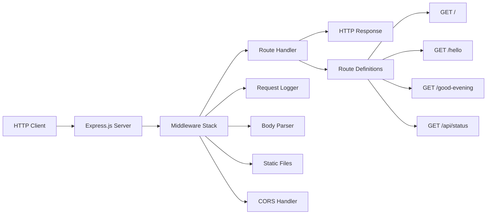

# Express.js Migration Guide

*Migration guide for converting the basic Node.js HTTP server to Express.js framework*

## Table of Contents

1. [Overview](#overview)
2. [Prerequisites](#prerequisites)
3. [Migration Benefits](#migration-benefits)
4. [Step-by-Step Migration](#step-by-step-migration)
5. [Code Comparison](#code-comparison)
6. [New Features Available](#new-features-available)
7. [Testing the Migration](#testing-the-migration)
8. [Troubleshooting](#troubleshooting)
9. [Next Steps](#next-steps)

## Overview

This guide provides step-by-step instructions for migrating from the basic Node.js HTTP server to the Express.js framework. The migration transforms a minimal HTTP implementation into a robust, feature-rich web server with enhanced routing, middleware support, and improved development experience.

### What You'll Accomplish

- Convert basic HTTP server to Express.js
- Add structured routing and middleware support
- Implement enhanced error handling
- Enable advanced features like CORS, body parsing, and static file serving
- Prepare foundation for production deployment

### Migration Scope

This migration covers:
- Server setup and configuration
- Route definition and organization
- Middleware integration
- Enhanced request/response handling
- Development workflow improvements

## Prerequisites

Before starting the migration, ensure you have:

- **Node.js 14+** installed
- **npm** or **yarn** package manager
- Basic understanding of HTTP concepts
- Familiarity with the current server implementation
- Text editor or IDE for code editing

### Current Implementation Requirements

Your basic HTTP server should have:
- Functional HTTP server setup
- Basic request handling
- Port configuration
- Response generation capabilities

## Migration Benefits

### Framework Advantages

**Express.js provides significant advantages over basic HTTP:**

| Feature | Basic HTTP | Express.js |
|---------|------------|------------|
| Routing | Manual URL parsing | Built-in route handlers |
| Middleware | Custom implementation | Rich ecosystem |
| Request Parsing | Manual parsing | Automatic body parsing |
| Static Files | Manual file serving | Built-in static middleware |
| Error Handling | Basic try/catch | Structured error middleware |
| Development Tools | Limited debugging | Rich development middleware |

### Performance Benefits

- **Reduced Code Complexity**: Express abstracts common HTTP patterns
- **Enhanced Maintainability**: Structured route organization
- **Ecosystem Integration**: Access to thousands of middleware packages
- **Development Speed**: Faster feature implementation

### Production Readiness

- **Security Middleware**: Built-in security headers and protection
- **Logging Integration**: Comprehensive request/response logging
- **Error Management**: Centralized error handling
- **Scalability Support**: Load balancer compatibility

## Step-by-Step Migration

### Step 1: Install Express.js with Security Updates

Add Express.js and essential security middleware to your project dependencies:

```bash
# Core Express framework with security fixes
npm install express@^4.20.0

# Security middleware stack
npm install helmet@^7.1.0 express-rate-limit@^7.1.0 cors@^2.8.5 express-validator@^7.0.1

# Logging and operational tools
npm install winston@^3.17.0 dotenv@^16.0.0

# Body parser with CVE fix
npm install body-parser@^1.20.3

# Development and testing dependencies
npm install --save-dev jest@^29.0.0 mocha@^11.7.1 chai@^4.3.0 sinon@^15.0.0 supertest@^7.1.4 nyc@^15.1.0 nodemon
```

**Package.json Updates:**
```json
{
  "dependencies": {
    "express": "^4.20.0",
    "helmet": "^7.1.0",
    "express-rate-limit": "^7.1.0",
    "cors": "^2.8.5",
    "express-validator": "^7.0.1",
    "body-parser": "^1.20.3",
    "winston": "^3.17.0",
    "dotenv": "^16.0.0"
  },
  "devDependencies": {
    "jest": "^29.0.0",
    "mocha": "^11.7.1",
    "chai": "^4.3.0",
    "sinon": "^15.0.0",
    "supertest": "^7.1.4",
    "nyc": "^15.1.0",
    "nodemon": "^5.0.0"
  },
  "scripts": {
    "start": "node server.js",
    "dev": "nodemon server.js",
    "test": "jest --coverage",
    "test:watch": "jest --watch",
    "test:mocha": "mocha test/**/*.test.js",
    "test:coverage": "nyc --reporter=html --reporter=text mocha test/**/*.test.js",
    "test:security": "npm audit && npm run test",
    "lint": "eslint .",
    "lint:fix": "eslint . --fix"
  }
}
```

**Key Security Updates:**
- **Express.js ^4.20.0**: Addresses CVE-2024-43796 (XSS via response.redirect())
- **body-parser ^1.20.3**: Fixes CVE-2024-45590 (DoS vulnerability in URL parsing)
- **Helmet.js ^7.1.0**: Latest security headers implementation
- **express-rate-limit ^7.1.0**: Enhanced DDoS protection with memory efficiency improvements

### Step 2: Create Security-First Express Server Foundation

Replace your basic HTTP server with a comprehensive Express foundation that includes security hardening:

```javascript
// Load environment variables first
require('dotenv').config();

// Import required modules
const express = require('express');
const helmet = require('helmet');
const rateLimit = require('express-rate-limit');
const cors = require('cors');
const { body, validationResult } = require('express-validator');
const winston = require('winston');

// Initialize Express application
const app = express();

// Configure structured logging with Winston
const logger = winston.createLogger({
  level: process.env.LOG_LEVEL || 'info',
  format: winston.format.combine(
    winston.format.timestamp(),
    winston.format.errors({ stack: true }),
    winston.format.json()
  ),
  defaultMeta: { service: 'express-tutorial' },
  transports: [
    new winston.transports.File({ filename: 'logs/error.log', level: 'error' }),
    new winston.transports.File({ filename: 'logs/combined.log' }),
    new winston.transports.Console({
      format: winston.format.combine(
        winston.format.colorize(),
        winston.format.simple()
      )
    })
  ]
});

// Security Configuration
// 1. Helmet.js for comprehensive security headers
app.use(helmet({
  contentSecurityPolicy: {
    directives: {
      defaultSrc: ["'self'"],
      styleSrc: ["'self'", "'unsafe-inline'"],
      scriptSrc: ["'self'"],
      imgSrc: ["'self'", "data:", "https:"]
    }
  },
  hsts: {
    maxAge: 31536000,
    includeSubDomains: true,
    preload: true
  }
}));

// 2. Global rate limiting (1000 requests per hour)
const globalLimiter = rateLimit({
  windowMs: 60 * 60 * 1000, // 1 hour
  max: 1000, // Limit each IP to 1000 requests per windowMs
  message: {
    error: 'Too many requests',
    message: 'Rate limit exceeded. Please try again later.',
    retryAfter: 3600
  },
  standardHeaders: true,
  legacyHeaders: false,
  handler: (req, res) => {
    logger.warn('Rate limit exceeded', { 
      ip: req.ip, 
      userAgent: req.get('User-Agent'),
      endpoint: req.originalUrl 
    });
    res.status(429).json({
      error: 'Too many requests',
      message: 'Rate limit exceeded. Please try again later.',
      retryAfter: 3600
    });
  }
});

// 3. API-specific rate limiting (100 requests per minute)
const apiLimiter = rateLimit({
  windowMs: 60 * 1000, // 1 minute
  max: 100, // Limit each IP to 100 requests per minute for API routes
  message: {
    error: 'API rate limit exceeded',
    message: 'Too many API requests. Please try again in a minute.',
    retryAfter: 60
  }
});

// 4. CORS configuration with dynamic origin validation
const corsOptions = {
  origin: function (origin, callback) {
    // Allow requests with no origin (mobile apps, curl, Postman)
    if (!origin) return callback(null, true);
    
    const allowedOrigins = (process.env.CORS_ORIGINS || 'http://localhost:3000,http://localhost:3001').split(',');
    
    if (allowedOrigins.indexOf(origin) !== -1 || process.env.NODE_ENV === 'development') {
      callback(null, true);
    } else {
      logger.warn('CORS violation', { origin, allowedOrigins });
      callback(new Error('Not allowed by CORS'));
    }
  },
  credentials: true,
  optionsSuccessStatus: 200
};

// Apply security middleware
app.use(globalLimiter);
app.use(cors(corsOptions));

// Request logging middleware
app.use((req, res, next) => {
  logger.info('HTTP Request', {
    method: req.method,
    url: req.originalUrl,
    ip: req.ip,
    userAgent: req.get('User-Agent'),
    timestamp: new Date().toISOString()
  });
  next();
});

// Port configuration
const port = process.env.PORT || 3000;
const host = process.env.HOST || 'localhost';

// Graceful shutdown handling
process.on('SIGTERM', () => {
  logger.info('SIGTERM received, shutting down gracefully');
  server.close(() => {
    logger.info('Process terminated');
    process.exit(0);
  });
});

// Start server
const server = app.listen(port, host, () => {
    logger.info(`Express server running at http://${host}:${port}/`);
});

// Export app for testing
module.exports = app;
```

**Security Features Implemented:**
- **CSP Headers**: Prevents XSS attacks by controlling resource loading
- **HSTS**: Enforces HTTPS connections for enhanced security
- **Rate Limiting**: Two-tier protection (global and API-specific)
- **CORS Protection**: Dynamic origin validation with environment-based configuration
- **Structured Logging**: JSON-formatted logs for production monitoring
- **Graceful Shutdown**: Proper cleanup on process termination

### Step 3: Migrate Basic Routes

Convert your existing request handlers to Express routes:

```javascript
// Basic route handling
app.get('/', (req, res) => {
    res.send('Hello, World!\n');
});

app.get('/hello', (req, res) => {
    res.send('Hello world');
});
```

### Step 4: Configure Request Processing Middleware

Integrate body parsing, input validation, and enhanced request processing:

```javascript
// Body parsing middleware with security fixes
const bodyParser = require('body-parser');

// JSON parsing with size limits and type validation
app.use(express.json({ 
  limit: '10mb',
  type: 'application/json',
  verify: (req, res, buf) => {
    // Verify JSON payload integrity
    try {
      JSON.parse(buf);
    } catch (e) {
      logger.warn('Invalid JSON payload', { 
        ip: req.ip, 
        contentType: req.get('content-type'),
        error: e.message 
      });
      throw new Error('Invalid JSON');
    }
  }
}));

// URL-encoded parsing with enhanced security
app.use(express.urlencoded({ 
  extended: true,
  limit: '10mb',
  parameterLimit: 1000,
  verify: (req, res, buf) => {
    // Log potentially malicious large payloads
    if (buf.length > 1000000) { // 1MB threshold
      logger.warn('Large URL-encoded payload', { 
        ip: req.ip, 
        size: buf.length,
        userAgent: req.get('User-Agent')
      });
    }
  }
}));

// Alternative body-parser configuration (addresses CVE-2024-45590)
app.use(bodyParser.json({ 
  limit: '10mb',
  strict: true,
  type: 'application/json'
}));

app.use(bodyParser.urlencoded({ 
  extended: false,
  limit: '10mb',
  parameterLimit: 1000
}));

// Static file serving with security headers
app.use('/public', express.static('public', {
  maxAge: '1d',
  etag: true,
  lastModified: true,
  setHeaders: (res, path) => {
    // Security headers for static files
    res.setHeader('X-Content-Type-Options', 'nosniff');
    res.setHeader('X-Frame-Options', 'DENY');
  }
}));

// Input validation helpers
const validateInput = (validations) => {
  return async (req, res, next) => {
    // Run all validations
    await Promise.all(validations.map(validation => validation.run(req)));

    // Check for validation errors
    const errors = validationResult(req);
    if (!errors.isEmpty()) {
      logger.warn('Input validation failed', { 
        ip: req.ip,
        errors: errors.array(),
        body: req.body,
        query: req.query,
        params: req.params
      });
      
      return res.status(400).json({
        error: 'Validation Error',
        message: 'Invalid input provided',
        details: errors.array(),
        timestamp: new Date().toISOString()
      });
    }
    next();
  };
};

// Response time tracking middleware
app.use((req, res, next) => {
  const start = Date.now();
  
  res.on('finish', () => {
    const duration = Date.now() - start;
    logger.info('HTTP Response', {
      method: req.method,
      url: req.originalUrl,
      statusCode: res.statusCode,
      responseTime: `${duration}ms`,
      contentLength: res.get('content-length') || 0,
      ip: req.ip
    });
  });
  
  next();
});
```

**Middleware Security Features:**
- **Payload Size Limiting**: Prevents DoS attacks via large payloads
- **JSON Integrity Verification**: Validates JSON structure before parsing
- **Parameter Limiting**: Protects against parameter pollution attacks
- **Static File Security**: Applies security headers to static content
- **Response Time Monitoring**: Tracks performance for security analysis
- **Comprehensive Logging**: Records all security-relevant events

### Step 5: Implement Error Handling

Add structured error handling:

```javascript
// 404 handler
app.use((req, res, next) => {
    res.status(404).json({
        error: 'Not Found',
        message: `Route ${req.url} not found`,
        timestamp: new Date().toISOString()
    });
});

// Error handling middleware
app.use((err, req, res, next) => {
    console.error(err.stack);
    res.status(500).json({
        error: 'Internal Server Error',
        message: 'Something went wrong!',
        timestamp: new Date().toISOString()
    });
});
```

### Step 6: Implement Core Routes with Validation

Add the essential endpoints with comprehensive input validation and security:

```javascript
// Apply API rate limiting to all /api routes
app.use('/api', apiLimiter);

// Core tutorial endpoints (maintaining original functionality)
app.get('/', (req, res) => {
    res.type('text/plain').send('Hello, World!\n');
});

app.get('/hello', (req, res) => {
    res.type('text/plain').send('Hello world');
});

// New endpoint as per tutorial requirements
app.get('/good-evening', (req, res) => {
    res.type('text/plain').send('Good evening');
});

// Enhanced API endpoints with validation
app.get('/api/status', (req, res) => {
    const healthCheck = {
        status: 'OK',
        timestamp: new Date().toISOString(),
        uptime: process.uptime(),
        memory: process.memoryUsage(),
        version: process.version,
        environment: process.env.NODE_ENV || 'development'
    };
    
    logger.info('Health check accessed', { ip: req.ip });
    res.json(healthCheck);
});

// Route with parameter validation
app.get('/user/:id', 
    validateInput([
        body('id').isNumeric().withMessage('User ID must be numeric')
            .isLength({ min: 1, max: 10 }).withMessage('User ID must be 1-10 characters')
    ]),
    (req, res) => {
        const userId = req.params.id;
        
        logger.info('User lookup', { userId, ip: req.ip });
        
        res.json({
            message: `User ID: ${userId}`,
            timestamp: new Date().toISOString(),
            requestId: req.get('x-request-id') || 'unknown'
        });
    }
);

// Search endpoint with query validation and sanitization
app.get('/search',
    validateInput([
        body('q').optional().isLength({ min: 1, max: 100 }).withMessage('Query must be 1-100 characters')
            .matches(/^[a-zA-Z0-9\s\-_]+$/).withMessage('Query contains invalid characters')
    ]),
    (req, res) => {
        const query = req.query.q;
        
        // Sanitize query for logging
        const sanitizedQuery = query ? query.replace(/[<>]/g, '') : '';
        
        logger.info('Search performed', { 
            query: sanitizedQuery, 
            ip: req.ip,
            userAgent: req.get('User-Agent')
        });
        
        res.json({
            message: `Search query: ${sanitizedQuery}`,
            results: [],
            timestamp: new Date().toISOString(),
            totalResults: 0
        });
    }
);

// POST endpoint with comprehensive validation
app.post('/api/data',
    validateInput([
        body('name').notEmpty().withMessage('Name is required')
            .isLength({ min: 2, max: 50 }).withMessage('Name must be 2-50 characters')
            .matches(/^[a-zA-Z\s]+$/).withMessage('Name can only contain letters and spaces'),
        body('email').isEmail().withMessage('Valid email is required')
            .normalizeEmail(),
        body('message').optional().isLength({ max: 500 }).withMessage('Message cannot exceed 500 characters')
    ]),
    (req, res) => {
        const { name, email, message } = req.body;
        
        logger.info('Data submitted', { 
            name, 
            email, 
            hasMessage: !!message,
            ip: req.ip 
        });
        
        res.status(201).json({
            message: 'Data received successfully',
            data: { name, email, message },
            timestamp: new Date().toISOString(),
            id: Math.random().toString(36).substr(2, 9)
        });
    }
);
```

**Route Security Features:**
- **Input Validation**: All user inputs validated and sanitized
- **Parameter Constraints**: Length and format restrictions prevent attacks
- **Sanitization**: HTML/script tag removal for XSS prevention
- **Rate Limiting**: API endpoints protected with specific limits
- **Audit Logging**: All route access logged for security monitoring
- **Error Responses**: Structured error handling with security considerations

## Code Comparison

### Before: Basic HTTP Server

```javascript
// server.js - Original Implementation
const http = require('http');

const hostname = '127.0.0.1';
const port = 3000;

const server = http.createServer((request, response) => {
    response.writeHead(200, {'Content-Type': 'text/plain'});
    
    if (request.url === '/') {
        response.end('Hello, World!\n');
    } else if (request.url === '/hello') {
        response.end('Hello world');
    } else {
        response.writeHead(404, {'Content-Type': 'text/plain'});
        response.end('Not Found');
    }
});

server.listen(port, hostname, () => {
    console.log(`Server running at http://${hostname}:${port}/`);
});
```

### After: Security-Enhanced Express.js Implementation

```javascript
// server.js - Production-Ready Express.js Implementation
require('dotenv').config();

const express = require('express');
const helmet = require('helmet');
const rateLimit = require('express-rate-limit');
const cors = require('cors');
const { body, validationResult } = require('express-validator');
const winston = require('winston');
const bodyParser = require('body-parser');

const app = express();

// Winston logger configuration
const logger = winston.createLogger({
  level: process.env.LOG_LEVEL || 'info',
  format: winston.format.combine(
    winston.format.timestamp(),
    winston.format.errors({ stack: true }),
    winston.format.json()
  ),
  defaultMeta: { service: 'express-tutorial' },
  transports: [
    new winston.transports.File({ filename: 'logs/error.log', level: 'error' }),
    new winston.transports.File({ filename: 'logs/combined.log' }),
    new winston.transports.Console({
      format: winston.format.combine(
        winston.format.colorize(),
        winston.format.simple()
      )
    })
  ]
});

// Security middleware stack
app.use(helmet({
  contentSecurityPolicy: {
    directives: {
      defaultSrc: ["'self'"],
      styleSrc: ["'self'", "'unsafe-inline'"],
      scriptSrc: ["'self'"],
      imgSrc: ["'self'", "data:", "https:"]
    }
  },
  hsts: { maxAge: 31536000, includeSubDomains: true, preload: true }
}));

// Rate limiting configuration
const globalLimiter = rateLimit({
  windowMs: 60 * 60 * 1000, // 1 hour
  max: 1000, // 1000 requests per hour
  message: { error: 'Too many requests', retryAfter: 3600 },
  standardHeaders: true,
  legacyHeaders: false
});

const apiLimiter = rateLimit({
  windowMs: 60 * 1000, // 1 minute  
  max: 100, // 100 requests per minute for API
  message: { error: 'API rate limit exceeded', retryAfter: 60 }
});

// CORS configuration with dynamic validation
const corsOptions = {
  origin: function (origin, callback) {
    if (!origin) return callback(null, true);
    const allowedOrigins = (process.env.CORS_ORIGINS || 'http://localhost:3000').split(',');
    if (allowedOrigins.indexOf(origin) !== -1 || process.env.NODE_ENV === 'development') {
      callback(null, true);
    } else {
      logger.warn('CORS violation', { origin });
      callback(new Error('Not allowed by CORS'));
    }
  },
  credentials: true
};

// Apply security middleware
app.use(globalLimiter);
app.use(cors(corsOptions));

// Enhanced body parsing with security
app.use(express.json({ 
  limit: '10mb',
  verify: (req, res, buf) => {
    try {
      JSON.parse(buf);
    } catch (e) {
      logger.warn('Invalid JSON payload', { ip: req.ip });
      throw new Error('Invalid JSON');
    }
  }
}));

app.use(bodyParser.urlencoded({ 
  extended: false,
  limit: '10mb',
  parameterLimit: 1000
}));

// Request/response logging
app.use((req, res, next) => {
  const start = Date.now();
  logger.info('HTTP Request', {
    method: req.method,
    url: req.originalUrl,
    ip: req.ip,
    userAgent: req.get('User-Agent')
  });
  
  res.on('finish', () => {
    logger.info('HTTP Response', {
      method: req.method,
      url: req.originalUrl,
      statusCode: res.statusCode,
      responseTime: `${Date.now() - start}ms`
    });
  });
  
  next();
});

// Input validation helper
const validateInput = (validations) => {
  return async (req, res, next) => {
    await Promise.all(validations.map(validation => validation.run(req)));
    const errors = validationResult(req);
    if (!errors.isEmpty()) {
      logger.warn('Input validation failed', { ip: req.ip, errors: errors.array() });
      return res.status(400).json({
        error: 'Validation Error',
        details: errors.array(),
        timestamp: new Date().toISOString()
      });
    }
    next();
  };
};

// Core tutorial routes
app.get('/', (req, res) => {
  res.type('text/plain').send('Hello, World!\n');
});

app.get('/hello', (req, res) => {
  res.type('text/plain').send('Hello world');
});

app.get('/good-evening', (req, res) => {
  res.type('text/plain').send('Good evening');
});

// API routes with rate limiting
app.use('/api', apiLimiter);

app.get('/api/status', (req, res) => {
  res.json({
    status: 'OK',
    timestamp: new Date().toISOString(),
    uptime: process.uptime(),
    memory: process.memoryUsage(),
    version: process.version,
    environment: process.env.NODE_ENV || 'development'
  });
});

// Validated API endpoint
app.post('/api/data',
  validateInput([
    body('name').notEmpty().isLength({ min: 2, max: 50 }),
    body('email').isEmail().normalizeEmail(),
    body('message').optional().isLength({ max: 500 })
  ]),
  (req, res) => {
    const { name, email, message } = req.body;
    logger.info('Data submitted', { name, email, ip: req.ip });
    
    res.status(201).json({
      message: 'Data received successfully',
      data: { name, email, message },
      timestamp: new Date().toISOString(),
      id: Math.random().toString(36).substr(2, 9)
    });
  }
);

// 404 handler
app.use((req, res) => {
  logger.warn('404 - Route not found', { url: req.url, ip: req.ip });
  res.status(404).json({
    error: 'Not Found',
    message: `Route ${req.url} not found`,
    timestamp: new Date().toISOString()
  });
});

// Global error handler
app.use((err, req, res, next) => {
  logger.error('Unhandled error', { 
    error: err.message, 
    stack: err.stack, 
    url: req.url, 
    ip: req.ip 
  });
  
  res.status(500).json({
    error: 'Internal Server Error',
    message: 'Something went wrong!',
    timestamp: new Date().toISOString()
  });
});

// Configuration
const port = process.env.PORT || 3000;
const host = process.env.HOST || 'localhost';

// Graceful shutdown
process.on('SIGTERM', () => {
  logger.info('SIGTERM received, shutting down gracefully');
  server.close(() => {
    logger.info('Process terminated');
    process.exit(0);
  });
});

// Start server
const server = app.listen(port, host, () => {
  logger.info(`Security-enhanced Express server running at http://${host}:${port}/`);
});

module.exports = app;
```

### Key Differences Analysis

| Aspect | Basic HTTP | Security-Enhanced Express.js |
|--------|------------|------------------------------|
| **Code Length** | ~20 lines | ~150+ lines (production-ready) |
| **Route Definition** | Manual if/else conditions | Declarative route methods with validation |
| **Security Features** | None | Comprehensive security middleware stack |
| **Request Parsing** | Manual parsing of URL and body | Automatic parsing with size limits and validation |
| **Error Handling** | Basic response codes | Structured error middleware with logging |
| **Rate Limiting** | None | Multi-tier rate limiting (global + API) |
| **Input Validation** | None | Express-validator with sanitization |
| **Logging** | Basic console.log | Structured JSON logging with Winston |
| **CORS Protection** | None | Dynamic origin validation |
| **Security Headers** | None | Helmet.js with CSP, HSTS, XSS protection |
| **Performance Monitoring** | None | Response time tracking and health checks |
| **Production Readiness** | Development only | Production-grade with PM2 support |
| **CVE Protection** | Vulnerable | Addresses CVE-2024-43796, CVE-2024-45590 |

### Security Enhancement Breakdown

| Security Layer | Implementation | Protection Against |
|----------------|----------------|-------------------|
| **Helmet.js Headers** | CSP, HSTS, X-Frame-Options | XSS, Clickjacking, Protocol Downgrade |
| **Rate Limiting** | 1000/hour global, 100/min API | DoS attacks, Brute force |
| **Input Validation** | express-validator with sanitization | Injection attacks, Data integrity |
| **CORS Policy** | Dynamic origin validation | Cross-origin attacks |
| **Request Size Limits** | 10MB payload limit | DoS via large payloads |
| **Structured Logging** | Security event correlation | Attack detection, Audit trails |
| **Error Handling** | No stack trace exposure | Information disclosure |

## New Features Available

### 1. Advanced Routing

**Route Parameters:**
```javascript
app.get('/users/:userId/posts/:postId', (req, res) => {
    const { userId, postId } = req.params;
    res.json({ userId, postId });
});
```

**Route Patterns:**
```javascript
// Wildcard routes
app.get('/files/*', (req, res) => {
    res.send(`File path: ${req.params[0]}`);
});

// Optional parameters
app.get('/posts/:year/:month?', (req, res) => {
    res.json(req.params);
});
```

### 2. Middleware Integration

**CORS Support:**
```javascript
const cors = require('cors');
app.use(cors({
    origin: 'http://localhost:3001',
    credentials: true
}));
```

**Rate Limiting:**
```javascript
const rateLimit = require('express-rate-limit');
const limiter = rateLimit({
    windowMs: 15 * 60 * 1000, // 15 minutes
    max: 100 // limit each IP to 100 requests per windowMs
});
app.use(limiter);
```

### 3. Request/Response Enhancements

**JSON API Support:**
```javascript
app.post('/api/users', (req, res) => {
    const userData = req.body;
    // Process user data
    res.status(201).json({
        message: 'User created',
        user: userData
    });
});
```

**File Upload Handling:**
```javascript
const multer = require('multer');
const upload = multer({ dest: 'uploads/' });

app.post('/upload', upload.single('file'), (req, res) => {
    res.json({
        message: 'File uploaded',
        filename: req.file.filename
    });
});
```

### 4. Static File Serving

```javascript
// Serve static files from public directory
app.use(express.static('public'));

// Serve files from multiple directories
app.use('/assets', express.static('assets'));
app.use('/uploads', express.static('uploads'));
```

### 5. Template Engine Integration

```javascript
// EJS template engine
app.set('view engine', 'ejs');
app.set('views', './views');

app.get('/dashboard', (req, res) => {
    res.render('dashboard', { 
        title: 'Dashboard',
        user: { name: 'John Doe' }
    });
});
```

## Testing the Migration

### 1. Basic Functionality Tests

**Test Original Endpoints:**
```bash
# Test root endpoint
curl http://localhost:3000/
# Expected: Hello, World!

# Test hello endpoint
curl http://localhost:3000/hello
# Expected: Hello world

# Test new endpoint
curl http://localhost:3000/good-evening
# Expected: Good evening
```

**Test JSON API:**
```bash
# Test status endpoint
curl http://localhost:3000/api/status
# Expected: {"status":"OK","timestamp":"...","uptime":...}
```

### 2. Error Handling Tests

**Test 404 Handling:**
```bash
curl -i http://localhost:3000/nonexistent
# Expected: 404 status with JSON error response
```

### 3. Middleware Tests

**Test Request Logging:**
Check server console for request logs when making requests.

**Test JSON Parsing:**
```bash
curl -X POST http://localhost:3000/api/test \
  -H "Content-Type: application/json" \
  -d '{"name":"test"}'
```

### 4. Comprehensive Testing Framework Setup

**Install Testing Dependencies:**
```bash
# Primary testing frameworks
npm install --save-dev jest@^29.0.0 mocha@^11.7.1 chai@^4.3.0 sinon@^15.0.0

# HTTP testing and coverage
npm install --save-dev supertest@^7.1.4 nyc@^15.1.0

# Additional testing utilities
npm install --save-dev @types/jest @types/mocha @types/chai @types/sinon
```

**Jest Configuration (jest.config.js):**
```javascript
module.exports = {
  testEnvironment: 'node',
  collectCoverageFrom: [
    'server.js',
    'src/**/*.js',
    '!src/**/*.test.js',
    '!src/**/node_modules/**'
  ],
  coverageThreshold: {
    global: {
      branches: 80,
      functions: 80,
      lines: 80,
      statements: 80
    }
  },
  coverageReporters: ['text', 'lcov', 'html'],
  testMatch: [
    '**/test/**/*.test.js',
    '**/test/**/*.spec.js'
  ],
  verbose: true,
  setupFilesAfterEnv: ['<rootDir>/test/setup.js']
};
```

**Mocha Configuration (.mocharc.json):**
```json
{
  "require": ["test/setup.js"],
  "spec": "test/**/*.test.js",
  "reporter": "spec",
  "timeout": 5000,
  "recursive": true,
  "exit": true
}
```

**Test Setup File (test/setup.js):**
```javascript
// Common test setup for both Jest and Mocha
const { expect } = require('chai');
const sinon = require('sinon');

// Global test configuration
process.env.NODE_ENV = 'test';
process.env.LOG_LEVEL = 'error';
process.env.PORT = '0'; // Random port for testing

// Setup global test helpers
global.expect = expect;
global.sinon = sinon;

// Cleanup after each test
afterEach(() => {
  sinon.restore();
});
```

**Comprehensive Jest Test Suite (test/server.jest.test.js):**
```javascript
const request = require('supertest');
const app = require('../server');

describe('Express Server - Jest Suite', () => {
  // Basic endpoint tests
  describe('Core Endpoints', () => {
    test('GET / should return Hello, World!', async () => {
      const response = await request(app).get('/');
      expect(response.status).toBe(200);
      expect(response.text).toBe('Hello, World!\n');
      expect(response.headers['content-type']).toMatch(/text\/plain/);
    });

    test('GET /hello should return Hello world', async () => {
      const response = await request(app).get('/hello');
      expect(response.status).toBe(200);
      expect(response.text).toBe('Hello world');
    });

    test('GET /good-evening should return Good evening', async () => {
      const response = await request(app).get('/good-evening');
      expect(response.status).toBe(200);
      expect(response.text).toBe('Good evening');
    });
  });

  // Security header tests
  describe('Security Headers', () => {
    test('should include security headers', async () => {
      const response = await request(app).get('/');
      expect(response.headers).toHaveProperty('x-content-type-options', 'nosniff');
      expect(response.headers).toHaveProperty('x-frame-options');
      expect(response.headers).toHaveProperty('x-xss-protection');
    });

    test('should include CSP headers', async () => {
      const response = await request(app).get('/');
      expect(response.headers).toHaveProperty('content-security-policy');
    });
  });

  // Rate limiting tests
  describe('Rate Limiting', () => {
    test('should enforce rate limits', async () => {
      // Make multiple requests to test rate limiting
      const promises = Array(110).fill().map(() => request(app).get('/api/status'));
      const responses = await Promise.allSettled(promises);
      
      const rateLimitedResponses = responses.filter(
        result => result.value && result.value.status === 429
      );
      
      expect(rateLimitedResponses.length).toBeGreaterThan(0);
    }, 10000);
  });

  // Error handling tests
  describe('Error Handling', () => {
    test('GET /nonexistent should return 404', async () => {
      const response = await request(app).get('/nonexistent');
      expect(response.status).toBe(404);
      expect(response.body).toHaveProperty('error', 'Not Found');
    });

    test('should handle invalid JSON gracefully', async () => {
      const response = await request(app)
        .post('/api/data')
        .set('Content-Type', 'application/json')
        .send('{"invalid": json}');
      
      expect(response.status).toBe(400);
    });
  });
});
```

**Mocha/Chai Test Suite (test/server.mocha.test.js):**
```javascript
const request = require('supertest');
const { expect } = require('chai');
const sinon = require('sinon');
const app = require('../server');

describe('Express Server - Mocha/Chai Suite', function() {
  this.timeout(5000);

  describe('Core Functionality', () => {
    it('should respond to GET /', (done) => {
      request(app)
        .get('/')
        .expect(200)
        .expect('Content-Type', /text\/plain/)
        .end((err, res) => {
          if (err) return done(err);
          expect(res.text).to.equal('Hello, World!\n');
          done();
        });
    });

    it('should respond to GET /hello', (done) => {
      request(app)
        .get('/hello')
        .expect(200)
        .expect('Hello world', done);
    });

    it('should respond to GET /good-evening', (done) => {
      request(app)
        .get('/good-evening')
        .expect(200)
        .expect('Good evening', done);
    });
  });

  describe('Input Validation', () => {
    it('should validate POST /api/data with valid input', (done) => {
      const validData = {
        name: 'John Doe',
        email: 'john@example.com',
        message: 'Test message'
      };

      request(app)
        .post('/api/data')
        .send(validData)
        .expect(201)
        .end((err, res) => {
          if (err) return done(err);
          expect(res.body).to.have.property('message', 'Data received successfully');
          expect(res.body.data).to.deep.include(validData);
          done();
        });
    });

    it('should reject invalid email format', (done) => {
      const invalidData = {
        name: 'John Doe',
        email: 'invalid-email',
        message: 'Test message'
      };

      request(app)
        .post('/api/data')
        .send(invalidData)
        .expect(400)
        .end((err, res) => {
          if (err) return done(err);
          expect(res.body).to.have.property('error', 'Validation Error');
          done();
        });
    });
  });

  describe('Performance and Monitoring', () => {
    it('should respond within acceptable time limits', (done) => {
      const startTime = Date.now();
      
      request(app)
        .get('/api/status')
        .expect(200)
        .end((err, res) => {
          if (err) return done(err);
          const responseTime = Date.now() - startTime;
          expect(responseTime).to.be.below(100); // Response time under 100ms
          done();
        });
    });

    it('should include health check information', (done) => {
      request(app)
        .get('/api/status')
        .expect(200)
        .end((err, res) => {
          if (err) return done(err);
          expect(res.body).to.have.property('status', 'OK');
          expect(res.body).to.have.property('uptime');
          expect(res.body).to.have.property('memory');
          done();
        });
    });
  });

  describe('Security Testing', () => {
    it('should prevent XSS in search queries', (done) => {
      request(app)
        .get('/search?q=<script>alert("xss")</script>')
        .expect(200)
        .end((err, res) => {
          if (err) return done(err);
          expect(res.body.message).to.not.include('<script>');
          done();
        });
    });

    it('should enforce CORS policies', (done) => {
      request(app)
        .get('/')
        .set('Origin', 'http://malicious-site.com')
        .expect((res) => {
          expect(res.headers).to.have.property('access-control-allow-origin');
        })
        .end(done);
    });
  });
});
```

**Performance Testing (test/performance.test.js):**
```javascript
const request = require('supertest');
const app = require('../server');

describe('Performance Tests', () => {
  test('should handle concurrent requests efficiently', async () => {
    const concurrentRequests = 50;
    const promises = Array(concurrentRequests).fill().map(() => 
      request(app).get('/api/status')
    );

    const startTime = Date.now();
    const responses = await Promise.all(promises);
    const endTime = Date.now();

    responses.forEach(response => {
      expect(response.status).toBe(200);
    });

    const averageResponseTime = (endTime - startTime) / concurrentRequests;
    expect(averageResponseTime).toBeLessThan(50); // Average under 50ms
  });

  test('should maintain performance under load', async () => {
    const loadTestRequests = 100;
    const batchSize = 10;
    const batches = loadTestRequests / batchSize;

    for (let i = 0; i < batches; i++) {
      const batch = Array(batchSize).fill().map(() => 
        request(app).get('/hello')
      );
      
      const responses = await Promise.all(batch);
      responses.forEach(response => {
        expect(response.status).toBe(200);
      });
    }
  });
});
```

**Run Tests with Both Frameworks:**
```bash
# Run Jest tests with coverage
npm test

# Run Mocha tests with coverage
npm run test:mocha

# Run comprehensive coverage report
npm run test:coverage

# Watch mode for development
npm run test:watch

# Security-focused test run
npm run test:security
```

**Coverage Reports:**
Both frameworks generate coverage reports with >80% threshold enforcement:
- **Jest**: HTML reports in `coverage/lcov-report/index.html`
- **Mocha**: NYC reports in `coverage/index.html`

## Troubleshooting

### Common Migration Issues

**1. Dependency Installation Errors**
```
Error: Cannot find module 'helmet' / 'express-rate-limit' / 'winston'
```
**Solution:** Install all security dependencies
```bash
npm install express@^4.20.0 helmet@^7.1.0 express-rate-limit@^7.1.0 cors@^2.8.5 express-validator@^7.0.1 body-parser@^1.20.3 winston@^3.17.0
```

**2. Port Already in Use**
```
Error: listen EADDRINUSE :::3000
```
**Solution:** Change port or stop conflicting process
```bash
# Find process using port
lsof -ti:3000
kill -9 <PID>

# Or use different port
PORT=3001 npm start
```

**3. Middleware Order Issues (CRITICAL)**
```
TypeError: Cannot read property of undefined
ReferenceError: req.body is undefined
```
**Solution:** Ensure proper middleware order
```javascript
// CORRECT ORDER (load security first, then parsing, then routes)
app.use(helmet()); // 1. Security headers first
app.use(globalLimiter); // 2. Rate limiting
app.use(cors(corsOptions)); // 3. CORS configuration
app.use(express.json()); // 4. Body parsing
app.use(express.urlencoded({ extended: true })); // 5. URL parsing
app.use('/api', apiLimiter); // 6. API-specific middleware
// 7. Routes come after all middleware
app.get('/api/data', handler);
```

**4. Rate Limiting Memory Issues**
```
Error: JavaScript heap out of memory
```
**Solution:** Configure rate limiter with memory store options
```javascript
const rateLimit = require('express-rate-limit');
const RedisStore = require('rate-limit-redis'); // For production

// Development (memory store)
const limiter = rateLimit({
  store: new rateLimit.MemoryStore(),
  max: 1000,
  resetTimeInMs: 3600000
});

// Production (Redis store)
const limiter = rateLimit({
  store: new RedisStore({
    client: redisClient,
    prefix: 'rl:'
  }),
  max: 1000
});
```

**5. Winston Logging Permission Errors**
```
Error: EACCES: permission denied, open 'logs/combined.log'
```
**Solution:** Create logs directory and set permissions
```bash
mkdir -p logs
chmod 755 logs
# Or use console-only logging in development
```

**6. CORS Policy Violations**
```
Access to fetch at 'http://localhost:3000' blocked by CORS policy
```
**Solution:** Configure CORS origins properly
```javascript
// Update .env file
CORS_ORIGINS=http://localhost:3000,http://localhost:3001,https://yourdomain.com

// Or allow all origins in development (NOT for production)
const corsOptions = {
  origin: process.env.NODE_ENV === 'development' ? true : process.env.CORS_ORIGINS.split(',')
};
```

### Security-Specific Troubleshooting

**1. CSP Violations**
```
Content Security Policy: The page's settings blocked the loading of a resource
```
**Solution:** Update CSP directives
```javascript
app.use(helmet({
  contentSecurityPolicy: {
    directives: {
      defaultSrc: ["'self'"],
      styleSrc: ["'self'", "'unsafe-inline'", "https://fonts.googleapis.com"],
      fontSrc: ["'self'", "https://fonts.gstatic.com"],
      scriptSrc: ["'self'", "'unsafe-eval'"], // Only if necessary
      imgSrc: ["'self'", "data:", "https:"]
    }
  }
}));
```

**2. Rate Limiting False Positives**
```
429 Too Many Requests (legitimate users affected)
```
**Solution:** Implement IP whitelisting and adjust limits
```javascript
const rateLimit = require('express-rate-limit');

const smartLimiter = rateLimit({
  windowMs: 15 * 60 * 1000,
  max: (req, res) => {
    // Higher limits for trusted IPs
    if (req.ip === '127.0.0.1' || req.ip.startsWith('192.168.')) {
      return 1000;
    }
    return 100;
  },
  skip: (req, res) => {
    // Skip rate limiting for health checks
    return req.path === '/api/status';
  }
});
```

**3. Input Validation Errors**
```
ValidationError: Invalid input provided
```
**Solution:** Debug validation rules
```javascript
const { validationResult } = require('express-validator');

app.post('/api/data', validationRules, (req, res) => {
  const errors = validationResult(req);
  if (!errors.isEmpty()) {
    // Log validation details for debugging
    console.log('Validation errors:', errors.array());
    console.log('Request body:', req.body);
    return res.status(400).json({
      error: 'Validation Error',
      details: errors.array()
    });
  }
  // Continue processing
});
```

### Performance Considerations & Best Practices

**Memory Usage Optimization:**
```javascript
// Monitor memory usage
app.get('/api/memory', (req, res) => {
  const memory = process.memoryUsage();
  res.json({
    rss: `${Math.round(memory.rss / 1024 / 1024)} MB`,
    heapTotal: `${Math.round(memory.heapTotal / 1024 / 1024)} MB`,
    heapUsed: `${Math.round(memory.heapUsed / 1024 / 1024)} MB`,
    external: `${Math.round(memory.external / 1024 / 1024)} MB`
  });
});

// Set memory limits for PM2
// ecosystem.config.js
module.exports = {
  apps: [{
    name: 'express-tutorial',
    script: 'server.js',
    max_memory_restart: '150M',
    node_args: '--max-old-space-size=200'
  }]
};
```

**Response Time Optimization:**
```javascript
// Middleware order impact on performance
// FAST (minimal processing)
app.use(helmet()); // ~1-2ms
app.use(cors()); // ~1ms
app.use(express.json({ limit: '1mb' })); // ~2-5ms

// MEDIUM (conditional processing)  
app.use(rateLimit); // ~3-10ms (memory), ~10-20ms (Redis)

// SLOW (heavy processing)
app.use(morgan('combined')); // ~5-15ms
app.use(complexValidation); // ~10-50ms
```

**Concurrent Connection Handling:**
```javascript
// Server configuration for high concurrency
const server = app.listen(port, host, () => {
  // Increase connection backlog
  server.maxConnections = 1000;
  
  // Configure keep-alive
  server.keepAliveTimeout = 65000;
  server.headersTimeout = 66000;
  
  logger.info(`Server configured for ${server.maxConnections} concurrent connections`);
});

// PM2 cluster mode for horizontal scaling
// ecosystem.config.js
module.exports = {
  apps: [{
    name: 'express-tutorial',
    script: 'server.js',
    instances: 'max', // Use all CPU cores
    exec_mode: 'cluster',
    max_restarts: 3,
    min_uptime: '10s'
  }]
};
```

### Development Workflow Enhancement

**Enhanced Development Scripts:**
```json
{
  "scripts": {
    "start": "node server.js",
    "dev": "NODE_ENV=development nodemon server.js",
    "dev:debug": "DEBUG=express:* nodemon server.js",
    "test": "NODE_ENV=test jest --coverage",
    "test:watch": "NODE_ENV=test jest --watch",
    "test:mocha": "NODE_ENV=test mocha test/**/*.test.js",
    "test:security": "npm audit && npm run test",
    "lint": "eslint .",
    "lint:fix": "eslint . --fix",
    "security:scan": "npm audit --audit-level moderate",
    "logs:tail": "tail -f logs/combined.log",
    "pm2:start": "pm2 start ecosystem.config.js",
    "pm2:stop": "pm2 stop all",
    "pm2:logs": "pm2 logs",
    "pm2:monitor": "pm2 monit"
  }
}
```

**Environment Configuration (.env.example):**
```bash
# Server Configuration
NODE_ENV=development
PORT=3000
HOST=localhost
LOG_LEVEL=info

# Security Configuration
CORS_ORIGINS=http://localhost:3000,http://localhost:3001
RATE_LIMIT_GLOBAL=1000
RATE_LIMIT_API=100

# SSL Configuration (Production)
SSL_CERT_PATH=/path/to/cert.pem
SSL_KEY_PATH=/path/to/key.pem

# External Services
REDIS_URL=redis://localhost:6379
DATABASE_URL=postgresql://localhost/mydb
```

**Performance Monitoring:**
```javascript
// Add performance monitoring middleware
app.use((req, res, next) => {
  const start = Date.now();
  
  res.on('finish', () => {
    const duration = Date.now() - start;
    
    // Log slow requests
    if (duration > 1000) {
      logger.warn('Slow request detected', {
        method: req.method,
        url: req.originalUrl,
        duration: `${duration}ms`,
        ip: req.ip
      });
    }
    
    // Metrics collection (integrate with monitoring service)
    if (process.env.NODE_ENV === 'production') {
      // Send metrics to monitoring service
      metrics.histogram('http_request_duration', duration, {
        method: req.method,
        status_code: res.statusCode
      });
    }
  });
  
  next();
});
```

## Next Steps

### Production Deployment with PM2

**1. PM2 Configuration (ecosystem.config.js):**
```javascript
module.exports = {
  apps: [{
    name: 'express-tutorial',
    script: 'server.js',
    instances: 'max', // Use all CPU cores
    exec_mode: 'cluster',
    env: {
      NODE_ENV: 'development',
      PORT: 3000
    },
    env_production: {
      NODE_ENV: 'production',
      PORT: 3000,
      LOG_LEVEL: 'warn'
    },
    // Performance settings
    max_memory_restart: '150M',
    node_args: '--max-old-space-size=200',
    
    // Restart settings
    max_restarts: 3,
    min_uptime: '10s',
    restart_delay: 1000,
    
    // Logging
    log_file: 'logs/pm2.log',
    out_file: 'logs/pm2-out.log',
    error_file: 'logs/pm2-error.log',
    log_date_format: 'YYYY-MM-DD HH:mm:ss Z',
    
    // Health monitoring
    health_check_http: 'http://localhost:3000/api/status',
    health_check_grace_period: 3000
  }]
};
```

**2. Production Deployment Commands:**
```bash
# Install PM2 globally
npm install -g pm2

# Start application in production
pm2 start ecosystem.config.js --env production

# Enable startup script
pm2 startup
pm2 save

# Monitor processes
pm2 monit

# View logs
pm2 logs express-tutorial

# Reload without downtime
pm2 reload express-tutorial

# Scale instances
pm2 scale express-tutorial 4
```

### Advanced Security Enhancements

**1. HTTPS Implementation:**
```javascript
const https = require('https');
const fs = require('fs');

// SSL certificate configuration
if (process.env.NODE_ENV === 'production') {
  const options = {
    key: fs.readFileSync(process.env.SSL_KEY_PATH),
    cert: fs.readFileSync(process.env.SSL_CERT_PATH)
  };
  
  // Force HTTPS redirect
  app.use((req, res, next) => {
    if (req.header('x-forwarded-proto') !== 'https') {
      res.redirect(`https://${req.header('host')}${req.url}`);
    } else {
      next();
    }
  });
  
  https.createServer(options, app).listen(443, () => {
    logger.info('HTTPS Server running on port 443');
  });
}
```

**2. Advanced Rate Limiting Strategies:**
```javascript
const RedisStore = require('rate-limit-redis');
const redis = require('redis');

// Redis client for distributed rate limiting
const redisClient = redis.createClient({
  url: process.env.REDIS_URL
});

// Sliding window rate limiter with Redis
const advancedLimiter = rateLimit({
  store: new RedisStore({
    client: redisClient,
    prefix: 'rl:',
  }),
  windowMs: 15 * 60 * 1000, // 15 minutes
  max: async (req) => {
    // Dynamic limits based on user type
    if (req.headers['x-api-key']) {
      return 1000; // Premium users
    }
    return 100; // Free users
  },
  keyGenerator: (req) => {
    // Rate limit by API key if available, otherwise by IP
    return req.headers['x-api-key'] || req.ip;
  }
});
```

**3. Input Sanitization and Validation:**
```javascript
const createDOMPurify = require('isomorphic-dompurify');
const DOMPurify = createDOMPurify();

// Advanced validation middleware
const sanitizeInput = (req, res, next) => {
  // Recursively sanitize all string inputs
  const sanitizeObject = (obj) => {
    for (const key in obj) {
      if (typeof obj[key] === 'string') {
        obj[key] = DOMPurify.sanitize(obj[key]);
      } else if (typeof obj[key] === 'object' && obj[key] !== null) {
        sanitizeObject(obj[key]);
      }
    }
  };
  
  if (req.body) sanitizeObject(req.body);
  if (req.query) sanitizeObject(req.query);
  if (req.params) sanitizeObject(req.params);
  
  next();
};

app.use(sanitizeInput);
```

### Performance Optimization

**1. Response Compression:**
```javascript
const compression = require('compression');

app.use(compression({
  filter: (req, res) => {
    if (req.headers['x-no-compression']) {
      return false;
    }
    return compression.filter(req, res);
  },
  threshold: 1024, // Only compress if > 1KB
  level: 6 // Compression level (1-9)
}));
```

**2. Caching Strategies:**
```javascript
const NodeCache = require('node-cache');
const cache = new NodeCache({ stdTTL: 600 }); // 10 minute default

// Cache middleware
const cacheMiddleware = (duration = 300) => {
  return (req, res, next) => {
    const key = req.originalUrl;
    const cached = cache.get(key);
    
    if (cached) {
      logger.info('Cache hit', { url: key });
      return res.json(cached);
    }
    
    // Store original res.json
    const originalJson = res.json;
    
    res.json = function(data) {
      cache.set(key, data, duration);
      logger.info('Cache set', { url: key, ttl: duration });
      originalJson.call(this, data);
    };
    
    next();
  };
};

// Apply caching to API endpoints
app.get('/api/status', cacheMiddleware(60), (req, res) => {
  // Status endpoint with 1-minute cache
  res.json({ status: 'OK', timestamp: new Date().toISOString() });
});
```

### Monitoring and Observability

**1. Health Check Enhancements:**
```javascript
app.get('/health', (req, res) => {
  const healthCheck = {
    uptime: process.uptime(),
    message: 'OK',
    timestamp: new Date().toISOString(),
    checks: {
      database: 'connected', // Check DB connection
      redis: 'connected',    // Check Redis connection
      memory: process.memoryUsage(),
      cpu: process.cpuUsage()
    }
  };
  
  try {
    // Add actual health checks here
    res.status(200).json(healthCheck);
  } catch (error) {
    healthCheck.message = 'ERROR';
    healthCheck.error = error.message;
    res.status(503).json(healthCheck);
  }
});
```

**2. Metrics Collection:**
```javascript
const prometheus = require('prom-client');

// Create metrics
const httpRequestDuration = new prometheus.Histogram({
  name: 'http_request_duration_seconds',
  help: 'Duration of HTTP requests in seconds',
  labelNames: ['method', 'route', 'status_code']
});

const httpRequestsTotal = new prometheus.Counter({
  name: 'http_requests_total',
  help: 'Total number of HTTP requests',
  labelNames: ['method', 'route', 'status_code']
});

// Metrics middleware
app.use((req, res, next) => {
  const end = httpRequestDuration.startTimer();
  
  res.on('finish', () => {
    end({ method: req.method, route: req.route?.path || req.path, status_code: res.statusCode });
    httpRequestsTotal.inc({ method: req.method, route: req.route?.path || req.path, status_code: res.statusCode });
  });
  
  next();
});

// Metrics endpoint for Prometheus
app.get('/metrics', (req, res) => {
  res.set('Content-Type', prometheus.register.contentType);
  res.end(prometheus.register.metrics());
});
```

### Advanced Features Integration

**1. API Documentation with Swagger:**
```javascript
const swaggerJsdoc = require('swagger-jsdoc');
const swaggerUi = require('swagger-ui-express');

const options = {
  definition: {
    openapi: '3.0.0',
    info: {
      title: 'Express Tutorial API',
      version: '1.0.0',
      description: 'Security-enhanced Express.js tutorial API',
    },
    servers: [
      {
        url: process.env.NODE_ENV === 'production' ? 'https://api.yourdomain.com' : 'http://localhost:3000',
      },
    ],
  },
  apis: ['./server.js', './routes/*.js'],
};

const specs = swaggerJsdoc(options);
app.use('/api-docs', swaggerUi.serve, swaggerUi.setup(specs));
```

**2. Database Integration Example:**
```javascript
const { Pool } = require('pg');

// PostgreSQL connection pool
const pool = new Pool({
  connectionString: process.env.DATABASE_URL,
  ssl: process.env.NODE_ENV === 'production' ? { rejectUnauthorized: false } : false,
  max: 20,
  idleTimeoutMillis: 30000,
  connectionTimeoutMillis: 2000,
});

// Database health check
app.get('/health/db', async (req, res) => {
  try {
    const result = await pool.query('SELECT NOW()');
    res.json({ status: 'connected', timestamp: result.rows[0].now });
  } catch (error) {
    res.status(503).json({ status: 'disconnected', error: error.message });
  }
});
```

### Deployment Checklist

**Pre-Production Checklist:**
- [ ] All security headers configured (Helmet.js)
- [ ] Rate limiting implemented and tested
- [ ] Input validation on all endpoints
- [ ] HTTPS certificates installed and configured
- [ ] Environment variables configured
- [ ] Logging configured for production
- [ ] PM2 ecosystem configuration tested
- [ ] Health checks responding correctly
- [ ] Performance benchmarks meet requirements
- [ ] Security scan passed (npm audit)
- [ ] Load testing completed
- [ ] Monitoring and alerting configured

**Production Deployment Steps:**
```bash
# 1. Prepare production environment
export NODE_ENV=production
npm ci --only=production

# 2. Security audit
npm audit --audit-level moderate

# 3. Run tests
npm run test:security

# 4. Start with PM2
pm2 start ecosystem.config.js --env production

# 5. Verify deployment
curl -k https://yourdomain.com/health
curl -k https://yourdomain.com/api/status

# 6. Monitor startup
pm2 logs express-tutorial --lines 50
```

### Related Documentation

- [Getting Started Guide](./getting-started.md) - Initial setup instructions
- [Testing Guide](./testing.md) - Comprehensive testing setup
- [Production Guide](./production.md) - Production deployment
- [Security Guide](./security.md) - Security best practices
- [Python Flask Port Guide](./python-flask-port.md) - Cross-language migration

---

## Architecture Diagram



*This migration guide provides a comprehensive path from basic HTTP server to Express.js framework, enabling enhanced functionality while maintaining compatibility with Backprop integration requirements.*