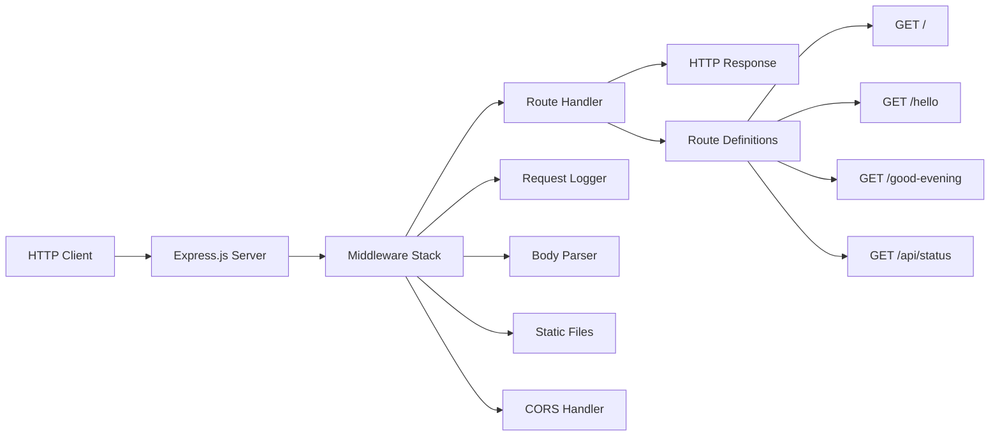

# Express.js Migration Guide

*Migration guide for converting the basic Node.js HTTP server to Express.js framework*

## Table of Contents

1. [Overview](#overview)
2. [Prerequisites](#prerequisites)
3. [Migration Benefits](#migration-benefits)
4. [Step-by-Step Migration](#step-by-step-migration)
5. [Code Comparison](#code-comparison)
6. [New Features Available](#new-features-available)
7. [Testing the Migration](#testing-the-migration)
8. [Troubleshooting](#troubleshooting)
9. [Next Steps](#next-steps)

## Overview

This guide provides step-by-step instructions for migrating from the basic Node.js HTTP server to the Express.js framework. The migration transforms a minimal HTTP implementation into a robust, feature-rich web server with enhanced routing, middleware support, and improved development experience.

### What You'll Accomplish

- Convert basic HTTP server to Express.js
- Add structured routing and middleware support
- Implement enhanced error handling
- Enable advanced features like CORS, body parsing, and static file serving
- Prepare foundation for production deployment

### Migration Scope

This migration covers:
- Server setup and configuration
- Route definition and organization
- Middleware integration
- Enhanced request/response handling
- Development workflow improvements

## Prerequisites

Before starting the migration, ensure you have:

- **Node.js 14+** installed
- **npm** or **yarn** package manager
- Basic understanding of HTTP concepts
- Familiarity with the current server implementation
- Text editor or IDE for code editing

### Current Implementation Requirements

Your basic HTTP server should have:
- Functional HTTP server setup
- Basic request handling
- Port configuration
- Response generation capabilities

## Migration Benefits

### Framework Advantages

**Express.js provides significant advantages over basic HTTP:**

| Feature | Basic HTTP | Express.js |
|---------|------------|------------|
| Routing | Manual URL parsing | Built-in route handlers |
| Middleware | Custom implementation | Rich ecosystem |
| Request Parsing | Manual parsing | Automatic body parsing |
| Static Files | Manual file serving | Built-in static middleware |
| Error Handling | Basic try/catch | Structured error middleware |
| Development Tools | Limited debugging | Rich development middleware |

### Performance Benefits

- **Reduced Code Complexity**: Express abstracts common HTTP patterns
- **Enhanced Maintainability**: Structured route organization
- **Ecosystem Integration**: Access to thousands of middleware packages
- **Development Speed**: Faster feature implementation

### Production Readiness

- **Security Middleware**: Built-in security headers and protection
- **Logging Integration**: Comprehensive request/response logging
- **Error Management**: Centralized error handling
- **Scalability Support**: Load balancer compatibility

## Step-by-Step Migration

### Step 1: Install Express.js

Add Express.js to your project dependencies:

```bash
# Using npm
npm install express

# Using yarn
yarn add express
```

**Package.json Updates:**
```json
{
  "dependencies": {
    "express": "^4.18.2"
  }
}
```

### Step 2: Create Express Server Foundation

Replace your basic HTTP server with Express foundation:

```javascript
// Basic Express server setup
const express = require('express');
const app = express();

// Port configuration
const port = process.env.PORT || 3000;
const host = process.env.HOST || 'localhost';

// Start server
app.listen(port, host, () => {
    console.log(`Server running at http://${host}:${port}/`);
});
```

### Step 3: Migrate Basic Routes

Convert your existing request handlers to Express routes:

```javascript
// Basic route handling
app.get('/', (req, res) => {
    res.send('Hello, World!\n');
});

app.get('/hello', (req, res) => {
    res.send('Hello world');
});
```

### Step 4: Add Essential Middleware

Integrate core middleware for enhanced functionality:

```javascript
// Essential middleware setup
app.use(express.json());                    // Parse JSON requests
app.use(express.urlencoded({ extended: true })); // Parse URL-encoded data
app.use(express.static('public'));          // Serve static files

// Request logging middleware
app.use((req, res, next) => {
    console.log(`${req.method} ${req.url} - ${new Date().toISOString()}`);
    next();
});
```

### Step 5: Implement Error Handling

Add structured error handling:

```javascript
// 404 handler
app.use((req, res, next) => {
    res.status(404).json({
        error: 'Not Found',
        message: `Route ${req.url} not found`,
        timestamp: new Date().toISOString()
    });
});

// Error handling middleware
app.use((err, req, res, next) => {
    console.error(err.stack);
    res.status(500).json({
        error: 'Internal Server Error',
        message: 'Something went wrong!',
        timestamp: new Date().toISOString()
    });
});
```

### Step 6: Add Enhanced Route Features

Implement advanced routing capabilities:

```javascript
// Route with parameters
app.get('/user/:id', (req, res) => {
    const userId = req.params.id;
    res.json({
        message: `User ID: ${userId}`,
        timestamp: new Date().toISOString()
    });
});

// Route with query parameters
app.get('/search', (req, res) => {
    const query = req.query.q;
    res.json({
        message: `Search query: ${query}`,
        results: [],
        timestamp: new Date().toISOString()
    });
});
```

## Code Comparison

### Before: Basic HTTP Server

```javascript
// server.js - Original Implementation
const http = require('http');

const hostname = '127.0.0.1';
const port = 3000;

const server = http.createServer((request, response) => {
    response.writeHead(200, {'Content-Type': 'text/plain'});
    
    if (request.url === '/') {
        response.end('Hello, World!\n');
    } else if (request.url === '/hello') {
        response.end('Hello world');
    } else {
        response.writeHead(404, {'Content-Type': 'text/plain'});
        response.end('Not Found');
    }
});

server.listen(port, hostname, () => {
    console.log(`Server running at http://${hostname}:${port}/`);
});
```

### After: Express.js Implementation

```javascript
// server.js - Express.js Implementation
const express = require('express');
const app = express();

// Configuration
const port = process.env.PORT || 3000;
const host = process.env.HOST || '127.0.0.1';

// Middleware
app.use(express.json());
app.use(express.urlencoded({ extended: true }));

// Request logging
app.use((req, res, next) => {
    console.log(`${req.method} ${req.url} - ${new Date().toISOString()}`);
    next();
});

// Routes
app.get('/', (req, res) => {
    res.send('Hello, World!\n');
});

app.get('/hello', (req, res) => {
    res.send('Hello world');
});

// Additional route examples
app.get('/good-evening', (req, res) => {
    res.send('Good evening');
});

app.get('/api/status', (req, res) => {
    res.json({
        status: 'OK',
        timestamp: new Date().toISOString(),
        uptime: process.uptime()
    });
});

// 404 handler
app.use((req, res) => {
    res.status(404).json({
        error: 'Not Found',
        message: `Route ${req.url} not found`
    });
});

// Error handler
app.use((err, req, res, next) => {
    console.error(err.stack);
    res.status(500).json({
        error: 'Internal Server Error',
        message: 'Something went wrong!'
    });
});

// Start server
app.listen(port, host, () => {
    console.log(`Express server running at http://${host}:${port}/`);
});
```

### Key Differences Analysis

| Aspect | Basic HTTP | Express.js |
|--------|------------|------------|
| **Code Length** | ~20 lines | ~15 lines (core functionality) |
| **Route Definition** | Manual if/else conditions | Declarative route methods |
| **Middleware Support** | Custom implementation required | Built-in middleware system |
| **Request Parsing** | Manual parsing of URL and body | Automatic parsing with middleware |
| **Error Handling** | Basic response codes | Structured error middleware |
| **Extensibility** | Limited, manual work | Rich ecosystem of plugins |

## New Features Available

### 1. Advanced Routing

**Route Parameters:**
```javascript
app.get('/users/:userId/posts/:postId', (req, res) => {
    const { userId, postId } = req.params;
    res.json({ userId, postId });
});
```

**Route Patterns:**
```javascript
// Wildcard routes
app.get('/files/*', (req, res) => {
    res.send(`File path: ${req.params[0]}`);
});

// Optional parameters
app.get('/posts/:year/:month?', (req, res) => {
    res.json(req.params);
});
```

### 2. Middleware Integration

**CORS Support:**
```javascript
const cors = require('cors');
app.use(cors({
    origin: 'http://localhost:3001',
    credentials: true
}));
```

**Rate Limiting:**
```javascript
const rateLimit = require('express-rate-limit');
const limiter = rateLimit({
    windowMs: 15 * 60 * 1000, // 15 minutes
    max: 100 // limit each IP to 100 requests per windowMs
});
app.use(limiter);
```

### 3. Request/Response Enhancements

**JSON API Support:**
```javascript
app.post('/api/users', (req, res) => {
    const userData = req.body;
    // Process user data
    res.status(201).json({
        message: 'User created',
        user: userData
    });
});
```

**File Upload Handling:**
```javascript
const multer = require('multer');
const upload = multer({ dest: 'uploads/' });

app.post('/upload', upload.single('file'), (req, res) => {
    res.json({
        message: 'File uploaded',
        filename: req.file.filename
    });
});
```

### 4. Static File Serving

```javascript
// Serve static files from public directory
app.use(express.static('public'));

// Serve files from multiple directories
app.use('/assets', express.static('assets'));
app.use('/uploads', express.static('uploads'));
```

### 5. Template Engine Integration

```javascript
// EJS template engine
app.set('view engine', 'ejs');
app.set('views', './views');

app.get('/dashboard', (req, res) => {
    res.render('dashboard', { 
        title: 'Dashboard',
        user: { name: 'John Doe' }
    });
});
```

## Testing the Migration

### 1. Basic Functionality Tests

**Test Original Endpoints:**
```bash
# Test root endpoint
curl http://localhost:3000/
# Expected: Hello, World!

# Test hello endpoint
curl http://localhost:3000/hello
# Expected: Hello world

# Test new endpoint
curl http://localhost:3000/good-evening
# Expected: Good evening
```

**Test JSON API:**
```bash
# Test status endpoint
curl http://localhost:3000/api/status
# Expected: {"status":"OK","timestamp":"...","uptime":...}
```

### 2. Error Handling Tests

**Test 404 Handling:**
```bash
curl -i http://localhost:3000/nonexistent
# Expected: 404 status with JSON error response
```

### 3. Middleware Tests

**Test Request Logging:**
Check server console for request logs when making requests.

**Test JSON Parsing:**
```bash
curl -X POST http://localhost:3000/api/test \
  -H "Content-Type: application/json" \
  -d '{"name":"test"}'
```

### 4. Automated Testing

**Install Testing Dependencies:**
```bash
npm install --save-dev jest supertest
```

**Create Test Suite:**
```javascript
// tests/server.test.js
const request = require('supertest');
const app = require('../server');

describe('Express Server', () => {
    test('GET / should return Hello, World!', async () => {
        const response = await request(app).get('/');
        expect(response.status).toBe(200);
        expect(response.text).toBe('Hello, World!\n');
    });

    test('GET /hello should return Hello world', async () => {
        const response = await request(app).get('/hello');
        expect(response.status).toBe(200);
        expect(response.text).toBe('Hello world');
    });

    test('GET /good-evening should return Good evening', async () => {
        const response = await request(app).get('/good-evening');
        expect(response.status).toBe(200);
        expect(response.text).toBe('Good evening');
    });

    test('GET /nonexistent should return 404', async () => {
        const response = await request(app).get('/nonexistent');
        expect(response.status).toBe(404);
        expect(response.body).toHaveProperty('error', 'Not Found');
    });
});
```

**Run Tests:**
```bash
npm test
```

## Troubleshooting

### Common Migration Issues

**1. Module Not Found Error**
```
Error: Cannot find module 'express'
```
**Solution:** Install Express.js dependency
```bash
npm install express
```

**2. Port Already in Use**
```
Error: listen EADDRINUSE :::3000
```
**Solution:** Change port or stop conflicting process
```javascript
const port = process.env.PORT || 3001;
```

**3. Middleware Order Issues**
```
TypeError: Cannot read property of undefined
```
**Solution:** Ensure middleware is loaded before routes that depend on it
```javascript
// Correct order
app.use(express.json());
app.get('/api/data', handler); // Can now access req.body
```

**4. Static Files Not Serving**
```
Cannot GET /style.css
```
**Solution:** Configure static middleware correctly
```javascript
app.use(express.static('public'));
// File should be at public/style.css
```

### Performance Considerations

**Memory Usage:**
- Express adds ~2-3MB memory overhead
- Monitor with `process.memoryUsage()`

**Response Time:**
- Minimal overhead (< 1ms) for basic routing
- Middleware stack can add latency

**Concurrent Connections:**
- Express handles same concurrent load as basic HTTP
- Use clustering for horizontal scaling

### Development Workflow

**Hot Reloading:**
```bash
npm install --save-dev nodemon
```

**Package.json Scripts:**
```json
{
  "scripts": {
    "start": "node server.js",
    "dev": "nodemon server.js",
    "test": "jest"
  }
}
```

## Next Steps

### Immediate Enhancements

1. **Add More Middleware**
   - Helmet.js for security headers
   - Morgan for request logging
   - Compression for response compression

2. **Implement Validation**
   - Request validation with Joi or express-validator
   - Input sanitization

3. **Add Configuration Management**
   - Environment-based configuration
   - Config files for different environments

### Advanced Features

1. **Database Integration**
   - MongoDB with Mongoose
   - PostgreSQL with Sequelize
   - Redis for caching

2. **Authentication & Authorization**
   - JWT token authentication
   - Passport.js integration
   - Role-based access control

3. **API Documentation**
   - Swagger/OpenAPI integration
   - Automated API documentation

### Production Preparation

1. **Security Hardening**
   - Follow [Security Guide](./security.md)
   - Implement rate limiting
   - Add HTTPS support

2. **Performance Optimization**
   - Enable gzip compression
   - Implement caching strategies
   - Database query optimization

3. **Deployment Setup**
   - Follow [Production Guide](./production.md)
   - Configure PM2 process manager
   - Set up monitoring and logging

### Related Documentation

- [Getting Started Guide](./getting-started.md) - Initial setup instructions
- [Testing Guide](./testing.md) - Comprehensive testing setup
- [Production Guide](./production.md) - Production deployment
- [Security Guide](./security.md) - Security best practices
- [Python Flask Port Guide](./python-flask-port.md) - Cross-language migration

---

## Architecture Diagram



*This migration guide provides a comprehensive path from basic HTTP server to Express.js framework, enabling enhanced functionality while maintaining compatibility with Backprop integration requirements.*