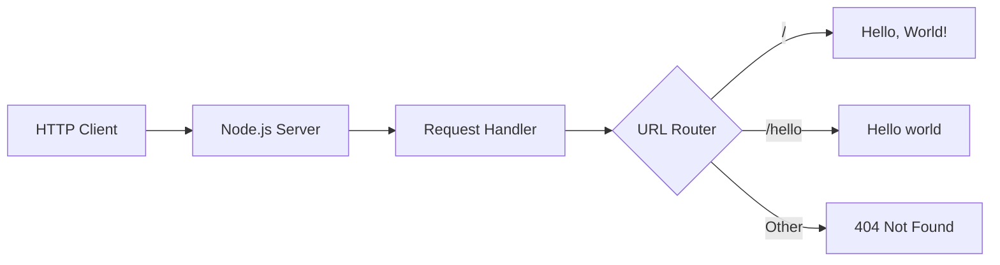

# Getting Started with Node.js Hello World Server

This guide provides step-by-step instructions for setting up and running the Node.js Hello World server, designed as a test integration for Backprop tooling. Whether you're new to Node.js or setting up this project for the first time, this guide will get you up and running quickly.

## Table of Contents

- [Overview](#overview)
- [Prerequisites](#prerequisites)
- [Installation](#installation)
- [First Run](#first-run)
- [Verifying Installation](#verifying-installation)
- [Common Issues](#common-issues)
- [Next Steps](#next-steps)

## Overview

The Node.js Hello World server is a minimal HTTP server implementation that serves as the foundation for testing Backprop integration capabilities. This project demonstrates:

- Basic HTTP server setup using Node.js built-in `http` module
- Simple request handling and response generation
- Foundation for progressive enhancement with Express.js, testing frameworks, and production features
- Integration point for Backprop tooling and automation

## Prerequisites

Before you begin, ensure you have the following installed on your system:

### Required Software

#### Node.js (Version 14 or Higher)
- **Minimum Version**: Node.js 14.x
- **Recommended Version**: Node.js 18.x or latest LTS
- **Download**: [Official Node.js website](https://nodejs.org/)

**Verification Command:**
```bash
node --version
```

Expected output: `v14.x.x` or higher

#### npm (Node Package Manager)
- **Included with Node.js installation**
- **Minimum Version**: npm 6.x
- **Recommended Version**: npm 8.x or higher

**Verification Command:**
```bash
npm --version
```

Expected output: `6.x.x` or higher

### System Requirements

| Requirement | Minimum | Recommended |
|-------------|---------|-------------|
| Operating System | Windows 10, macOS 10.14, Ubuntu 18.04 | Latest stable versions |
| RAM | 2 GB | 4 GB or more |
| Disk Space | 100 MB | 500 MB |
| Network | Internet connection for npm packages | Stable broadband connection |

### Development Environment (Optional)

While not required, the following tools enhance the development experience:

- **Code Editor**: Visual Studio Code, Sublime Text, or your preferred editor
- **Terminal/Command Prompt**: Built-in or enhanced terminals like iTerm2 (macOS) or Windows Terminal
- **Git**: For version control and repository management

## Installation

Follow these steps to set up the Node.js Hello World server on your local machine:

### Step 1: Create Project Directory

Create a new directory for your project and navigate to it:

```bash
# Create project directory
mkdir nodejs-hello-world
cd nodejs-hello-world
```

### Step 2: Initialize Node.js Project

Initialize a new Node.js project with a `package.json` file:

```bash
npm init -y
```

This creates a basic `package.json` file with default settings.

### Step 3: Create the Server File

Create the main server file `server.js`:

```bash
# On Windows
type nul > server.js

# On macOS/Linux
touch server.js
```

### Step 4: Add Server Implementation

Open `server.js` in your preferred editor and add the following code:

```javascript
// server.js - Basic Node.js HTTP Server
const http = require('http');

// Server configuration
const PORT = process.env.PORT || 3000;
const HOST = process.env.HOST || 'localhost';

// Create HTTP server
const server = http.createServer((request, response) => {
  // Set response headers
  response.writeHead(200, {
    'Content-Type': 'text/plain',
    'Access-Control-Allow-Origin': '*'
  });
  
  // Handle different routes
  if (request.url === '/') {
    response.end('Hello, World!\n');
  } else if (request.url === '/hello') {
    response.end('Hello world\n');
  } else {
    response.writeHead(404, {'Content-Type': 'text/plain'});
    response.end('Not Found\n');
  }
});

// Start server
server.listen(PORT, HOST, () => {
  console.log(`Server running at http://${HOST}:${PORT}/`);
  console.log('Press Ctrl+C to stop the server');
});

// Graceful shutdown
process.on('SIGINT', () => {
  console.log('\nReceived SIGINT. Shutting down gracefully...');
  server.close(() => {
    console.log('Server closed.');
    process.exit(0);
  });
});
```

### Step 5: Update package.json (Optional)

Add a start script to your `package.json` for convenience:

```json
{
  "name": "nodejs-hello-world",
  "version": "1.0.0",
  "description": "Node.js Hello World server for Backprop integration testing",
  "main": "server.js",
  "scripts": {
    "start": "node server.js",
    "dev": "node server.js"
  },
  "keywords": ["nodejs", "http", "server", "hello-world", "backprop"],
  "author": "Your Name",
  "license": "MIT"
}
```

## First Run

Now that everything is set up, let's start the server:

### Method 1: Using npm Script (Recommended)

```bash
npm start
```

### Method 2: Direct Node.js Execution

```bash
node server.js
```

### Expected Output

You should see output similar to:

```
Server running at http://localhost:3000/
Press Ctrl+C to stop the server
```

Your server is now running and ready to accept requests!

## Verifying Installation

Follow these steps to verify that your server is working correctly:

### Step 1: Test the Default Endpoint

Open your web browser and navigate to:
```
http://localhost:3000/
```

**Expected Response:** `Hello, World!`

### Step 2: Test the Hello Endpoint

Navigate to:
```
http://localhost:3000/hello
```

**Expected Response:** `Hello world`

### Step 3: Test 404 Handling

Navigate to a non-existent endpoint:
```
http://localhost:3000/nonexistent
```

**Expected Response:** `Not Found` (with 404 status)

### Step 4: Command Line Testing (Alternative)

You can also test using command-line tools:

#### Using curl
```bash
# Test default endpoint
curl http://localhost:3000/

# Test hello endpoint
curl http://localhost:3000/hello

# Test 404 handling
curl -i http://localhost:3000/nonexistent
```

#### Using wget
```bash
# Test default endpoint
wget -qO- http://localhost:3000/

# Test hello endpoint
wget -qO- http://localhost:3000/hello
```

### Step 5: Check Server Logs

In your terminal where the server is running, you should see log messages for each request:

```
Server running at http://localhost:3000/
Press Ctrl+C to stop the server
```

## Common Issues

Here are solutions to common problems you might encounter:

### Issue 1: Port Already in Use

**Error Message:**
```
Error: listen EADDRINUSE: address already in use :::3000
```

**Solution:**
```bash
# Option 1: Use a different port
PORT=3001 node server.js

# Option 2: Find and kill the process using port 3000
# On macOS/Linux:
lsof -ti:3000 | xargs kill -9

# On Windows:
netstat -ano | findstr :3000
taskkill /PID <PID_NUMBER> /F
```

### Issue 2: Node.js Not Found

**Error Message:**
```
'node' is not recognized as an internal or external command
```

**Solution:**
1. Ensure Node.js is properly installed
2. Restart your terminal/command prompt
3. Check if Node.js is in your PATH:
   ```bash
   echo $PATH  # macOS/Linux
   echo %PATH% # Windows
   ```
4. Reinstall Node.js from [nodejs.org](https://nodejs.org/)

### Issue 3: Permission Denied (Linux/macOS)

**Error Message:**
```
Error: listen EACCES: permission denied 0.0.0.0:80
```

**Solution:**
1. Use a port number higher than 1024:
   ```bash
   PORT=3000 node server.js
   ```
2. Or run with sudo (not recommended for development):
   ```bash
   sudo node server.js
   ```

### Issue 4: Module Not Found

**Error Message:**
```
Error: Cannot find module 'http'
```

**Solution:**
This usually indicates a Node.js installation issue. Reinstall Node.js from the official website.

### Issue 5: Server Starts But Not Accessible

**Symptoms:**
- Server logs show "Server running..."
- Browser shows "This site can't be reached"

**Solution:**
1. Check if any firewall is blocking the connection
2. Try accessing via `127.0.0.1` instead of `localhost`:
   ```
   http://127.0.0.1:3000/
   ```
3. Ensure no proxy settings are interfering

### Issue 6: Sudden Server Shutdown

**Common Causes:**
- Out of memory
- Unhandled exceptions
- System resource limitations

**Solution:**
1. Check system resources (RAM, CPU)
2. Review server logs for error messages
3. Add error handling to your server code:
   ```javascript
   process.on('uncaughtException', (err) => {
     console.error('Uncaught Exception:', err);
   });
   ```

## Next Steps

Congratulations! You now have a working Node.js Hello World server. Here are the next steps to enhance your project:

### Immediate Next Steps

1. **Explore the API**: Review the [API documentation](../api/endpoints.md) to understand all available endpoints
2. **Learn about Backprop Integration**: Check the main [README.md](../../README.md) for Backprop setup instructions
3. **Customize the Server**: Modify the response messages or add new endpoints

### Enhancement Paths

The Node.js Hello World server can be enhanced in several ways:

#### 1. Express.js Migration
Transform your basic HTTP server into a robust Express.js application:
- **Guide**: [Express.js Migration Guide](./express-migration.md)
- **Benefits**: Routing, middleware, template engines, and more
- **Difficulty**: Beginner to Intermediate

#### 2. Testing Implementation
Add comprehensive testing to your server:
- **Guide**: [Testing Guide](./testing.md)
- **Frameworks**: Jest, Mocha, Supertest
- **Coverage**: Unit tests, integration tests, API testing
- **Difficulty**: Intermediate

#### 3. Production Deployment
Prepare your server for production environments:
- **Guide**: [Production Deployment Guide](./production.md)
- **Tools**: PM2, Docker, load balancing
- **Features**: Monitoring, logging, scaling
- **Difficulty**: Intermediate to Advanced

#### 4. Security Hardening
Implement security best practices:
- **Guide**: [Security Guide](./security.md)
- **Features**: HTTPS, rate limiting, security headers
- **Standards**: OWASP compliance
- **Difficulty**: Intermediate to Advanced

#### 5. Cross-Language Porting
Convert your Node.js server to other languages:
- **Guide**: [Python Flask Porting Guide](./python-flask-port.md)
- **Target**: Python Flask equivalent
- **Benefits**: Language comparison, team preferences
- **Difficulty**: Intermediate

### Learning Resources

- **Node.js Official Documentation**: [nodejs.org/docs](https://nodejs.org/docs/)
- **HTTP Module Documentation**: [Node.js HTTP](https://nodejs.org/api/http.html)
- **NPM Documentation**: [npmjs.com/docs](https://docs.npmjs.com/)
- **JavaScript MDN**: [Mozilla Developer Network](https://developer.mozilla.org/en-US/docs/Web/JavaScript)

### Community and Support

- **Stack Overflow**: Search for Node.js questions and solutions
- **Node.js Community**: [nodejs.org/community](https://nodejs.org/community/)
- **GitHub Issues**: Report issues or contribute to the project
- **Discord/Slack**: Join Node.js development communities

---

## Architecture Overview

Understanding the basic architecture helps with troubleshooting and enhancements:



## Configuration Options

The server supports the following environment variables:

| Variable | Default | Description |
|----------|---------|-------------|
| `PORT` | `3000` | Port number for the server |
| `HOST` | `localhost` | Hostname for the server |

**Example Usage:**
```bash
PORT=8080 HOST=0.0.0.0 node server.js
```

---

**Congratulations!** You've successfully set up and verified your Node.js Hello World server. This foundation serves as the starting point for more advanced Node.js development and Backprop integration testing.

For additional help, refer to the [main project documentation](../../README.md) or explore the other guides in the `/docs/guides/` directory.