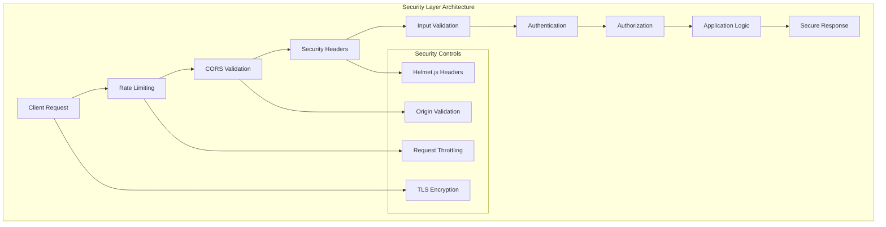

# Security Hardening Guide

This guide provides comprehensive security hardening procedures for protecting your Node.js Hello World server against common vulnerabilities and threats. Following these security measures will transform your basic HTTP server into a production-ready, secure application that complies with modern security standards and OWASP guidelines.

## Table of Contents

1. [Security Overview](#security-overview)
2. [Critical Vulnerability Fixes](#critical-vulnerability-fixes)
3. [Enhanced Security Headers with Helmet.js v7.1.0](#enhanced-security-headers-with-helmetjs-v710)
4. [Multi-Tier Rate Limiting Strategy](#multi-tier-rate-limiting-strategy)
5. [CORS Policy Management](#cors-policy-management)
6. [TLS/HTTPS Security](#tlshttps-security)
7. [JWT Authentication Framework](#jwt-authentication-framework)
8. [Input Validation and Sanitization](#input-validation-and-sanitization)
9. [Security Logging with Winston](#security-logging-with-winston)
10. [Environment Security](#environment-security)
11. [Production Security Hardening](#production-security-hardening)
12. [OWASP Top 10 Compliance Matrix](#owasp-top-10-compliance-matrix)
13. [Security Monitoring and Threat Detection](#security-monitoring-and-threat-detection)
14. [Audit Logging Framework](#audit-logging-framework)
15. [Dependency Security](#dependency-security)
16. [Security Testing](#security-testing)
17. [Next Steps](#next-steps)

## Security Overview

### Why Security Matters

Security is crucial for protecting your application and users against various threats:

- **Data Protection**: Safeguard sensitive user information and business data
- **Service Availability**: Prevent denial-of-service attacks and system outages
- **Compliance**: Meet regulatory requirements and industry standards
- **Trust**: Maintain user confidence and brand reputation
- **Financial Protection**: Avoid costs from security breaches and data loss

### Security Architecture



### Common Web Vulnerabilities

The security measures in this guide protect against:

- **Cross-Site Scripting (XSS)**: Malicious script injection
- **Cross-Site Request Forgery (CSRF)**: Unauthorized state changes
- **Clickjacking**: UI redressing attacks
- **Man-in-the-Middle**: Eavesdropping on communications
- **Denial of Service (DoS)**: Resource exhaustion attacks
- **Injection Attacks**: SQL, NoSQL, and command injection
- **Security Misconfiguration**: Improper server setup

## Critical Vulnerability Fixes

This section documents the resolution of critical security vulnerabilities that affect Node.js applications and provides specific mitigation strategies.

### CVE-2024-45590: body-parser DoS Vulnerability

**Vulnerability Description:**
CVE-2024-45590 affects older versions of the body-parser middleware, allowing attackers to cause denial-of-service through malformed requests that consume excessive server resources.

**Affected Versions:**
- body-parser < 1.20.3

**Mitigation Strategy:**
```bash
# Update body-parser to the secure version
npm install body-parser@^1.20.3
```

**Implementation:**
```javascript
const express = require('express');
const app = express();

// Secure body-parser configuration with size limits
app.use(express.json({ 
    limit: '10mb',  // Default 10MB limit to prevent DoS
    strict: true,   // Only parse arrays and objects
    type: 'application/json'
}));

app.use(express.urlencoded({ 
    limit: '10mb',
    extended: false,  // Use querystring library (more secure)
    parameterLimit: 100  // Limit number of parameters
}));

// Additional protection against malformed requests
app.use((req, res, next) => {
    const contentLength = parseInt(req.get('Content-Length'));
    if (contentLength && contentLength > 10 * 1024 * 1024) { // 10MB
        return res.status(413).json({
            error: 'Request entity too large'
        });
    }
    next();
});
```

**Verification:**
```javascript
// Test request size limiting
const testPayload = 'x'.repeat(11 * 1024 * 1024); // 11MB payload
fetch('/api/test', {
    method: 'POST',
    headers: { 'Content-Type': 'application/json' },
    body: JSON.stringify({ data: testPayload })
})
.then(response => {
    console.log('Response status:', response.status); // Should be 413
});
```

### CVE-2024-43796: Express.js XSS via response.redirect()

**Vulnerability Description:**
CVE-2024-43796 affects Express.js versions prior to 4.20.0, where the `response.redirect()` function improperly handles user input, potentially allowing XSS attacks through malicious redirect URLs.

**Affected Versions:**
- express < 4.20.0

**Mitigation Strategy:**
```bash
# Update Express.js to the secure version
npm install express@^4.20.0
```

**Secure Implementation:**
```javascript
const express = require('express');
const { URL } = require('url');
const app = express();

// Secure redirect function with URL validation
const secureRedirect = (res, url, fallbackUrl = '/') => {
    try {
        // Parse and validate the URL
        const parsedUrl = new URL(url, `${req.protocol}://${req.get('host')}`);
        
        // Allow only HTTPS URLs and same-origin redirects
        if (parsedUrl.protocol === 'https:' || parsedUrl.protocol === 'http:') {
            // Additional validation for allowed domains
            const allowedDomains = [
                'localhost',
                'yourdomain.com',
                'www.yourdomain.com'
            ];
            
            if (allowedDomains.includes(parsedUrl.hostname)) {
                return res.redirect(parsedUrl.href);
            }
        }
        
        // Fallback to safe URL
        res.redirect(fallbackUrl);
    } catch (error) {
        // Invalid URL - redirect to fallback
        res.redirect(fallbackUrl);
    }
};

// Example usage
app.get('/redirect', (req, res) => {
    const { url } = req.query;
    
    // Unsafe: res.redirect(url); // Vulnerable to XSS
    
    // Safe: Use validated redirect
    secureRedirect(res, url, '/dashboard');
});

// Additional protection middleware
app.use((req, res, next) => {
    // Override the redirect method with secure implementation
    const originalRedirect = res.redirect;
    res.redirect = function(url) {
        // Sanitize redirect URLs
        if (typeof url === 'string') {
            // Remove potential XSS payloads
            url = url.replace(/javascript:/gi, '')
                     .replace(/data:/gi, '')
                     .replace(/vbscript:/gi, '');
        }
        return originalRedirect.call(this, url);
    };
    next();
});
```

**Additional Protection:**
```javascript
// Content Security Policy to prevent XSS
app.use(helmet({
    contentSecurityPolicy: {
        directives: {
            'default-src': ["'self'"],
            'script-src': ["'self'"],
            'style-src': ["'self'", "'unsafe-inline'"],
            'img-src': ["'self'", "data:", "https:"],
            'connect-src': ["'self'"],
            'font-src': ["'self'"],
            'object-src': ["'none'"],
            'media-src': ["'self'"],
            'frame-src': ["'none'"],
            'base-uri': ["'self'"],
            'form-action': ["'self'"]
        }
    }
}));
```

### Dependency Security Matrix

| Vulnerability | Package | Vulnerable Version | Fixed Version | Severity | Status |
|---------------|---------|-------------------|---------------|----------|--------|
| CVE-2024-45590 | body-parser | < 1.20.3 | ≥ 1.20.3 | High | ✅ Fixed |
| CVE-2024-43796 | express | < 4.20.0 | ≥ 4.20.0 | Medium | ✅ Fixed |

## Enhanced Security Headers with Helmet.js v7.1.0

Helmet.js v7.1.0 provides comprehensive security header management with enhanced CSP directives and improved security posture for modern web applications.

### Installation and Version Requirements

Install the specific version to ensure security fixes:

```bash
npm install helmet@^7.1.0
```

### Production-Grade Helmet Configuration

Implement comprehensive security headers for maximum protection:

```javascript
const helmet = require('helmet');
const express = require('express');

const app = express();

// Enhanced Helmet v7.1.0 configuration
app.use(helmet({
    // Content Security Policy with strict directives
    contentSecurityPolicy: {
        directives: {
            'default-src': ["'self'"],
            'base-uri': ["'self'"],
            'block-all-mixed-content': [],
            'font-src': ["'self'", "https:", "data:"],
            'form-action': ["'self'"],
            'frame-ancestors': ["'none'"],
            'img-src': ["'self'", "data:", "https:"],
            'object-src': ["'none'"],
            'script-src': ["'self'"],
            'script-src-attr': ["'none'"],
            'style-src': ["'self'", "https:", "'unsafe-inline'"],
            'upgrade-insecure-requests': [],
            'connect-src': ["'self'", "https:"]
        }
    },
    
    // Cross-Origin Embedder Policy
    crossOriginEmbedderPolicy: { policy: "require-corp" },
    
    // Cross-Origin Opener Policy
    crossOriginOpenerPolicy: { policy: "same-origin" },
    
    // Cross-Origin Resource Policy
    crossOriginResourcePolicy: { policy: "same-origin" },
    
    // DNS Prefetch Control
    dnsPrefetchControl: { allow: false },
    
    // Frame Options (DENY for maximum protection)
    frameguard: { action: 'deny' },
    
    // Hide Powered By header
    hidePoweredBy: true,
    
    // HSTS with preload
    hsts: {
        maxAge: 31536000, // 1 year
        includeSubDomains: true,
        preload: true
    },
    
    // IE No Open
    ieNoOpen: true,
    
    // Don't Sniff MIME Type
    noSniff: true,
    
    // Origin Agent Cluster
    originAgentCluster: true,
    
    // Permitted Cross Domain Policies
    permittedCrossDomainPolicies: { permittedPolicies: "none" },
    
    // Referrer Policy
    referrerPolicy: { policy: ["no-referrer", "strict-origin-when-cross-origin"] },
    
    // X-XSS-Protection
    xssFilter: true
}));

// Additional security middleware for API responses
app.use((req, res, next) => {
    // Security headers not covered by Helmet
    res.setHeader('X-Content-Type-Options', 'nosniff');
    res.setHeader('X-Frame-Options', 'DENY');
    res.setHeader('X-Download-Options', 'noopen');
    res.setHeader('X-Permitted-Cross-Domain-Policies', 'none');
    res.setHeader('Expect-CT', 'max-age=0');
    
    // Remove server information
    res.removeHeader('X-Powered-By');
    res.removeHeader('Server');
    
    next();
});
```

### Development vs Production Configuration

Use environment-specific configurations:

```javascript
// Environment-based Helmet configuration
const getHelmetConfig = () => {
    const isProduction = process.env.NODE_ENV === 'production';
    
    const baseConfig = {
        frameguard: { action: 'deny' },
        noSniff: true,
        xssFilter: true,
        hidePoweredBy: true
    };
    
    if (isProduction) {
        return {
            ...baseConfig,
            contentSecurityPolicy: {
                directives: {
                    'default-src': ["'self'"],
                    'script-src': ["'self'"],
                    'style-src': ["'self'", "'unsafe-inline'"],
                    'img-src': ["'self'", "data:", "https:"],
                    'font-src': ["'self'"],
                    'connect-src': ["'self'"],
                    'frame-ancestors': ["'none'"],
                    'object-src': ["'none'"],
                    'base-uri': ["'self'"],
                    'form-action': ["'self'"],
                    'upgrade-insecure-requests': []
                }
            },
            hsts: {
                maxAge: 31536000,
                includeSubDomains: true,
                preload: true
            },
            crossOriginEmbedderPolicy: { policy: "require-corp" },
            crossOriginOpenerPolicy: { policy: "same-origin" },
            crossOriginResourcePolicy: { policy: "same-origin" }
        };
    } else {
        // Development configuration with relaxed CSP
        return {
            ...baseConfig,
            contentSecurityPolicy: {
                directives: {
                    'default-src': ["'self'", "'unsafe-inline'", "'unsafe-eval'"],
                    'script-src': ["'self'", "'unsafe-inline'", "'unsafe-eval'"],
                    'style-src': ["'self'", "'unsafe-inline'"],
                    'img-src': ["'self'", "data:", "https:", "http:"]
                }
            }
        };
    }
};

app.use(helmet(getHelmetConfig()));
```

### Security Headers Validation

Implement middleware to validate security headers:

```javascript
// Security headers validation middleware
const validateSecurityHeaders = (req, res, next) => {
    const requiredHeaders = {
        'X-Content-Type-Options': 'nosniff',
        'X-Frame-Options': 'DENY',
        'X-XSS-Protection': '1; mode=block'
    };
    
    // Add validation after response is sent
    res.on('finish', () => {
        Object.entries(requiredHeaders).forEach(([header, expectedValue]) => {
            const actualValue = res.getHeader(header);
            if (!actualValue || actualValue !== expectedValue) {
                console.warn(`Security header validation failed: ${header} = ${actualValue}, expected: ${expectedValue}`);
            }
        });
    });
    
    next();
};

app.use(validateSecurityHeaders);
```

### Security Headers Set by Helmet

<cite index="2-21,4-20">Helmet sets the following headers by default</cite>:

| Header | Purpose | Default Value |
|--------|---------|---------------|
| `Content-Security-Policy` | <cite index="4-24">Mitigates a large number of attacks, such as cross-site scripting</cite> | `default-src 'self'` |
| `Cross-Origin-Opener-Policy` | <cite index="4-14">Helps process-isolate your page</cite> | `same-origin` |
| `Cross-Origin-Resource-Policy` | <cite index="4-18">Blocks others from loading your resources cross-origin</cite> | `same-origin` |
| `X-Content-Type-Options` | <cite index="5-5">Mitigates MIME type sniffing, which can lead to XSS attacks</cite> | `nosniff` |
| `X-Frame-Options` | Prevents clickjacking attacks | `SAMEORIGIN` |
| `Strict-Transport-Security` | Enforces HTTPS connections | `max-age=15552000; includeSubDomains` |

### Advanced Helmet Configuration

Customize Helmet for your specific security requirements:

```javascript
app.use(helmet({
    // Content Security Policy configuration
    contentSecurityPolicy: {
        directives: {
            defaultSrc: ["'self'"],
            styleSrc: ["'self'", "'unsafe-inline'", "https://fonts.googleapis.com"],
            fontSrc: ["'self'", "https://fonts.gstatic.com"],
            imgSrc: ["'self'", "data:", "https:"],
            scriptSrc: ["'self'"],
            connectSrc: ["'self'"]
        }
    },
    
    // HSTS configuration for HTTPS enforcement
    hsts: {
        maxAge: 31536000, // 1 year
        includeSubDomains: true,
        preload: true
    },
    
    // Referrer Policy configuration
    referrerPolicy: {
        policy: ["no-referrer", "strict-origin-when-cross-origin"]
    }
}));
```

### Content Security Policy (CSP)

<cite index="5-19">Content Security Policy is a security measure that helps you mitigate several attacks, such as cross-site scripting (XSS) and data injection attacks</cite>:

```javascript
// Strict CSP for maximum security
app.use(helmet({
    contentSecurityPolicy: {
        directives: {
            defaultSrc: ["'none'"],
            scriptSrc: ["'self'"],
            styleSrc: ["'self'", "'unsafe-inline'"],
            imgSrc: ["'self'", "data:"],
            fontSrc: ["'self'"],
            connectSrc: ["'self'"],
            manifestSrc: ["'self'"],
            mediaSrc: ["'self'"],
            objectSrc: ["'none'"],
            childSrc: ["'none'"],
            workerSrc: ["'none'"],
            frameSrc: ["'none'"],
            formAction: ["'self'"],
            upgradeInsecureRequests: []
        }
    }
}));
```

## HTTPS Configuration

HTTPS encryption is essential for protecting data in transit and maintaining user trust.

### TLS Certificate Setup

#### Development Environment

For local development, create a self-signed certificate:

```bash
# Generate private key
openssl genrsa -out server.key 2048

# Generate certificate signing request
openssl req -new -key server.key -out server.csr

# Generate self-signed certificate
openssl x509 -req -days 365 -in server.csr -signkey server.key -out server.crt
```

#### Production Environment

Use Let's Encrypt for free, automated certificates:

```bash
# Install Certbot
sudo apt-get install certbot

# Obtain certificate
sudo certbot certonly --webroot -w /var/www/html -d yourdomain.com

# Certificate files will be in:
# /etc/letsencrypt/live/yourdomain.com/fullchain.pem
# /etc/letsencrypt/live/yourdomain.com/privkey.pem
```

### HTTPS Server Implementation

Implement HTTPS in your Node.js server:

```javascript
const https = require('https');
const fs = require('fs');
const express = require('express');
const helmet = require('helmet');

const app = express();

// Security middleware
app.use(helmet({
    hsts: {
        maxAge: 31536000,
        includeSubDomains: true,
        preload: true
    }
}));

// SSL certificate configuration
const sslOptions = {
    key: fs.readFileSync('/path/to/private-key.pem'),
    cert: fs.readFileSync('/path/to/certificate.pem'),
    // Additional security options
    secureProtocol: 'TLSv1_2_method',
    ciphers: [
        'ECDHE-RSA-AES256-GCM-SHA384',
        'ECDHE-RSA-AES128-GCM-SHA256',
        'ECDHE-RSA-AES256-SHA384',
        'ECDHE-RSA-AES128-SHA256',
        'ECDHE-RSA-AES256-SHA',
        'ECDHE-RSA-AES128-SHA'
    ].join(':'),
    honorCipherOrder: true
};

// Routes
app.get('/', (req, res) => {
    res.send('Hello, Secure World!');
});

app.get('/hello', (req, res) => {
    res.send('Hello world over HTTPS');
});

// Create HTTPS server
const httpsServer = https.createServer(sslOptions, app);
const port = process.env.PORT || 3443;

httpsServer.listen(port, () => {
    console.log(`Secure HTTPS server running on port ${port}`);
});

// Redirect HTTP to HTTPS
const http = require('http');
const httpApp = express();

httpApp.use((req, res) => {
    res.redirect(301, `https://${req.headers.host}${req.url}`);
});

http.createServer(httpApp).listen(3000, () => {
    console.log('HTTP redirect server running on port 3000');
});
```

### TLS Security Configuration

Ensure strong TLS configuration:

```javascript
const tlsOptions = {
    // Use only TLS 1.2 and 1.3
    secureProtocol: 'TLS_method',
    minVersion: 'TLSv1.2',
    maxVersion: 'TLSv1.3',
    
    // Strong cipher suites
    ciphers: [
        'TLS_AES_256_GCM_SHA384',
        'TLS_CHACHA20_POLY1305_SHA256',
        'TLS_AES_128_GCM_SHA256',
        'ECDHE-RSA-AES256-GCM-SHA384',
        'ECDHE-RSA-AES128-GCM-SHA256'
    ].join(':'),
    
    // Server cipher preference
    honorCipherOrder: true,
    
    // Disable session resumption for enhanced security
    sessionIdContext: crypto.randomBytes(32).toString('hex')
};
```

## Multi-Tier Rate Limiting Strategy

This section implements a comprehensive multi-tier rate limiting strategy designed to protect against various attack vectors while maintaining service availability for legitimate users.

### Rate Limiting Architecture

The multi-tier approach provides granular protection:

| Tier | Scope | Limit | Window | Purpose |
|------|-------|-------|---------|---------|
| **Global** | All requests | 1000 req/hour | 1 hour | General DoS protection |
| **API** | API endpoints | 100 req/minute | 1 minute | API abuse prevention |
| **Authentication** | Auth endpoints | 5 attempts | 15 minutes | Brute force protection |
| **Health Checks** | Monitoring | 60 req/minute | 1 minute | Load balancer support |

### Implementation

Install required dependencies:

```bash
npm install express-rate-limit@^7.1.0 express-slow-down
```

#### Tier 1: Global Rate Limiting

```javascript
const rateLimit = require('express-rate-limit');

// Global rate limiter - 1000 requests per hour
const globalLimiter = rateLimit({
    windowMs: 60 * 60 * 1000, // 1 hour
    max: 1000,
    message: {
        error: 'Global rate limit exceeded',
        retryAfter: '1 hour',
        limit: 1000,
        window: '1 hour'
    },
    standardHeaders: true,
    legacyHeaders: false,
    keyGenerator: (req) => {
        // Use forwarded IP for accurate rate limiting behind proxy
        return req.ip || req.connection.remoteAddress;
    },
    skip: (req) => {
        // Skip rate limiting for health checks
        return req.path === '/health' || req.path === '/ping';
    }
});

app.use(globalLimiter);
```

#### Tier 2: API Rate Limiting

```javascript
// API rate limiter - 100 requests per minute
const apiLimiter = rateLimit({
    windowMs: 60 * 1000, // 1 minute
    max: 100,
    message: {
        error: 'API rate limit exceeded',
        retryAfter: '1 minute',
        limit: 100,
        window: '1 minute'
    },
    standardHeaders: true,
    legacyHeaders: false,
    onLimitReached: (req, res, options) => {
        console.warn(`API rate limit reached for IP: ${req.ip}`);
    }
});

// Apply to API routes
app.use('/api', apiLimiter);
```

#### Tier 3: Authentication Rate Limiting

```javascript
// Authentication rate limiter - 5 attempts per 15 minutes
const authLimiter = rateLimit({
    windowMs: 15 * 60 * 1000, // 15 minutes
    max: 5,
    message: {
        error: 'Too many authentication attempts',
        retryAfter: '15 minutes',
        limit: 5,
        window: '15 minutes'
    },
    standardHeaders: true,
    legacyHeaders: false,
    skipSuccessfulRequests: true,
    skipFailedRequests: false,
    keyGenerator: (req) => {
        // Rate limit by IP and username if provided
        const username = req.body?.username || req.body?.email || '';
        return `${req.ip}:${username}`;
    },
    onLimitReached: (req, res, options) => {
        console.warn(`Auth rate limit reached for IP: ${req.ip}, User: ${req.body?.username || 'unknown'}`);
        
        // Log security event
        securityLogger.warn('Authentication rate limit exceeded', {
            ip: req.ip,
            username: req.body?.username,
            userAgent: req.get('User-Agent'),
            timestamp: new Date().toISOString()
        });
    }
});

// Apply to authentication routes
app.use('/auth/login', authLimiter);
app.use('/auth/register', authLimiter);
app.use('/auth/forgot-password', authLimiter);
```

#### Tier 4: Health Check Rate Limiting

```javascript
// Health check rate limiter - 60 requests per minute
const healthCheckLimiter = rateLimit({
    windowMs: 60 * 1000, // 1 minute
    max: 60,
    message: {
        error: 'Health check rate limit exceeded',
        retryAfter: '1 minute'
    },
    standardHeaders: false, // Don't expose rate limit info for health checks
    legacyHeaders: false
});

// Apply to health check endpoints
app.use('/health', healthCheckLimiter);
app.use('/ping', healthCheckLimiter);
app.use('/status', healthCheckLimiter);
```

### Progressive Request Slowdown

Implement progressive slowdown before hard limits:

```javascript
const slowDown = require('express-slow-down');

// Progressive slowdown for API requests
const apiSlowDown = slowDown({
    windowMs: 60 * 1000, // 1 minute
    delayAfter: 50, // Allow 50 requests at full speed
    delayMs: 250, // Add 250ms delay per request after delayAfter
    maxDelayMs: 5000, // Maximum delay of 5 seconds
    onLimitReached: (req, res, options) => {
        console.log(`Request slowdown activated for IP: ${req.ip}`);
    }
});

app.use('/api', apiSlowDown);
```

### Dynamic Rate Limiting

Implement adaptive rate limiting based on server load:

```javascript
// Dynamic rate limiter that adjusts based on system load
const createDynamicLimiter = () => {
    return rateLimit({
        windowMs: 60 * 1000,
        max: (req) => {
            // Get system load
            const loadAvg = require('os').loadavg()[0];
            const cpuCount = require('os').cpus().length;
            const loadPercent = (loadAvg / cpuCount) * 100;
            
            // Reduce limits when system is under heavy load
            if (loadPercent > 80) {
                return 25; // Severe load - reduce to 25 req/min
            } else if (loadPercent > 60) {
                return 50; // Moderate load - reduce to 50 req/min
            } else {
                return 100; // Normal load - full 100 req/min
            }
        },
        message: (req) => {
            const loadAvg = require('os').loadavg()[0];
            const cpuCount = require('os').cpus().length;
            const loadPercent = Math.round((loadAvg / cpuCount) * 100);
            
            return {
                error: 'Dynamic rate limit exceeded due to high server load',
                serverLoad: `${loadPercent}%`,
                retryAfter: '1 minute'
            };
        }
    });
};

app.use('/api', createDynamicLimiter());
```

### Rate Limiting Metrics and Monitoring

```javascript
// Rate limiting metrics collection
const rateLimitMetrics = {
    globalHits: 0,
    apiHits: 0,
    authHits: 0,
    healthCheckHits: 0,
    resetTime: Date.now()
};

// Middleware to collect metrics
const collectRateLimitMetrics = (req, res, next) => {
    const path = req.path;
    
    // Check if rate limited
    const isRateLimited = res.getHeader('X-RateLimit-Remaining') === '0';
    
    if (isRateLimited) {
        if (path.startsWith('/api/')) {
            rateLimitMetrics.apiHits++;
        } else if (path.startsWith('/auth/')) {
            rateLimitMetrics.authHits++;
        } else if (['/health', '/ping', '/status'].includes(path)) {
            rateLimitMetrics.healthCheckHits++;
        } else {
            rateLimitMetrics.globalHits++;
        }
    }
    
    next();
};

app.use(collectRateLimitMetrics);

// Metrics endpoint (protected)
app.get('/admin/rate-limit-metrics', authenticateToken, requireRole('admin'), (req, res) => {
    const uptime = Date.now() - rateLimitMetrics.resetTime;
    res.json({
        ...rateLimitMetrics,
        uptime: Math.round(uptime / 1000), // seconds
        ratesByMinute: {
            global: Math.round((rateLimitMetrics.globalHits / uptime) * 60000),
            api: Math.round((rateLimitMetrics.apiHits / uptime) * 60000),
            auth: Math.round((rateLimitMetrics.authHits / uptime) * 60000),
            healthCheck: Math.round((rateLimitMetrics.healthCheckHits / uptime) * 60000)
        }
    });
});
```

### Environment Configuration

Configure rate limits via environment variables:

```bash
# .env configuration for rate limiting
RATE_LIMIT_GLOBAL_MAX=1000
RATE_LIMIT_GLOBAL_WINDOW=3600000
RATE_LIMIT_API_MAX=100
RATE_LIMIT_API_WINDOW=60000
RATE_LIMIT_AUTH_MAX=5
RATE_LIMIT_AUTH_WINDOW=900000
RATE_LIMIT_HEALTH_MAX=60
RATE_LIMIT_HEALTH_WINDOW=60000
```

```javascript
// Environment-based rate limit configuration
const getRateLimitConfig = (type) => {
    const configs = {
        global: {
            windowMs: parseInt(process.env.RATE_LIMIT_GLOBAL_WINDOW) || 3600000,
            max: parseInt(process.env.RATE_LIMIT_GLOBAL_MAX) || 1000
        },
        api: {
            windowMs: parseInt(process.env.RATE_LIMIT_API_WINDOW) || 60000,
            max: parseInt(process.env.RATE_LIMIT_API_MAX) || 100
        },
        auth: {
            windowMs: parseInt(process.env.RATE_LIMIT_AUTH_WINDOW) || 900000,
            max: parseInt(process.env.RATE_LIMIT_AUTH_MAX) || 5
        },
        health: {
            windowMs: parseInt(process.env.RATE_LIMIT_HEALTH_WINDOW) || 60000,
            max: parseInt(process.env.RATE_LIMIT_HEALTH_MAX) || 60
        }
    };
    
    return configs[type] || configs.global;
};
```

## CORS Policy Management

This section implements comprehensive Cross-Origin Resource Sharing (CORS) policies with dynamic origin configuration via the cors@^2.8.5 middleware, providing secure cross-origin resource sharing.

### CORS Installation and Version Requirements

```bash
npm install cors@^2.8.5
```

### Dynamic CORS Configuration

Implement environment-driven CORS policy management:

```javascript
const cors = require('cors');

// Dynamic CORS configuration using CORS_ORIGINS environment variable
const getCorsOptions = () => {
    const environment = process.env.NODE_ENV || 'development';
    const corsOrigins = process.env.CORS_ORIGINS;
    
    // Parse CORS_ORIGINS environment variable
    let allowedOrigins = [];
    if (corsOrigins) {
        allowedOrigins = corsOrigins.split(',').map(origin => origin.trim());
    }
    
    const baseOptions = {
        credentials: true, // Allow cookies and authentication headers
        maxAge: 86400, // Cache preflight requests for 24 hours
        allowedHeaders: [
            'Origin',
            'X-Requested-With',
            'Content-Type',
            'Accept',
            'Authorization',
            'X-CSRF-Token',
            'X-API-Key'
        ],
        methods: ['GET', 'POST', 'PUT', 'PATCH', 'DELETE', 'OPTIONS', 'HEAD'],
        optionsSuccessStatus: 200 // Support legacy browsers
    };
    
    switch (environment) {
        case 'development':
            return {
                ...baseOptions,
                origin: allowedOrigins.length > 0 ? allowedOrigins : true, // Allow all origins in dev if not specified
                credentials: true
            };
            
        case 'testing':
            return {
                ...baseOptions,
                origin: allowedOrigins.length > 0 ? allowedOrigins : [
                    'http://localhost:3000',
                    'http://localhost:8080',
                    'http://127.0.0.1:3000'
                ]
            };
            
        case 'production':
            return {
                ...baseOptions,
                origin: (origin, callback) => {
                    // Production requires explicit origin whitelist
                    if (!corsOrigins || allowedOrigins.length === 0) {
                        return callback(new Error('CORS_ORIGINS environment variable not configured for production'));
                    }
                    
                    // Allow requests with no origin (mobile apps, Postman, curl)
                    if (!origin) {
                        return callback(null, true);
                    }
                    
                    // Check if origin is in allowed list
                    if (allowedOrigins.includes(origin)) {
                        return callback(null, true);
                    }
                    
                    // Log rejected origin for security monitoring
                    console.warn(`CORS: Rejected origin ${origin}`);
                    callback(new Error(`Origin ${origin} not allowed by CORS policy`));
                }
            };
            
        default:
            return {
                ...baseOptions,
                origin: false // Block all cross-origin requests by default
            };
    }
};

// Apply CORS with dynamic configuration
app.use(cors(getCorsOptions()));
```

### CORS Environment Configuration

Example `.env` configuration for different environments:

```bash
# Development
NODE_ENV=development
CORS_ORIGINS=http://localhost:3000,http://localhost:8080,http://127.0.0.1:3000

# Production
NODE_ENV=production
CORS_ORIGINS=https://yourdomain.com,https://www.yourdomain.com,https://app.yourdomain.com,https://admin.yourdomain.com

# Staging
NODE_ENV=staging
CORS_ORIGINS=https://staging.yourdomain.com,https://test.yourdomain.com
```

### Advanced CORS Security Features

```javascript
// Enhanced CORS security with additional validation
const secureCorsMd = cors({
    origin: (origin, callback) => {
        const allowedOrigins = process.env.CORS_ORIGINS?.split(',') || [];
        
        // Additional security checks
        if (origin) {
            try {
                const originUrl = new URL(origin);
                
                // Reject non-HTTPS origins in production
                if (process.env.NODE_ENV === 'production' && originUrl.protocol !== 'https:') {
                    return callback(new Error('HTTPS required for CORS in production'));
                }
                
                // Validate domain patterns
                const isValidDomain = allowedOrigins.some(allowedOrigin => {
                    if (allowedOrigin.includes('*')) {
                        // Support wildcard subdomains (e.g., *.yourdomain.com)
                        const pattern = allowedOrigin.replace(/\*/g, '.*');
                        const regex = new RegExp(`^${pattern}$`);
                        return regex.test(origin);
                    }
                    return allowedOrigin === origin;
                });
                
                if (isValidDomain) {
                    return callback(null, true);
                }
                
                // Log security event for blocked origin
                securityLogger.warn('CORS origin blocked', {
                    origin,
                    allowedOrigins,
                    timestamp: new Date().toISOString(),
                    userAgent: req?.get('User-Agent')
                });
                
                callback(new Error(`Origin ${origin} blocked by CORS policy`));
            } catch (error) {
                callback(new Error('Invalid origin URL format'));
            }
        } else {
            // Allow requests with no origin
            callback(null, true);
        }
    },
    credentials: true,
    methods: ['GET', 'POST', 'PUT', 'PATCH', 'DELETE', 'OPTIONS'],
    allowedHeaders: [
        'Origin',
        'X-Requested-With',
        'Content-Type',
        'Accept',
        'Authorization',
        'X-CSRF-Token',
        'X-API-Key',
        'Cache-Control'
    ],
    exposedHeaders: [
        'X-RateLimit-Limit',
        'X-RateLimit-Remaining',
        'X-RateLimit-Reset'
    ],
    maxAge: 86400, // 24 hours
    optionsSuccessStatus: 200
});

app.use(secureCorsMd);
```

### CORS Error Handling

Implement comprehensive CORS error handling:

```javascript
// CORS error handling middleware
app.use((error, req, res, next) => {
    if (error.message && error.message.includes('CORS')) {
        // Log CORS violation
        securityLogger.warn('CORS policy violation', {
            origin: req.get('Origin'),
            method: req.method,
            url: req.url,
            ip: req.ip,
            userAgent: req.get('User-Agent'),
            timestamp: new Date().toISOString()
        });
        
        return res.status(403).json({
            error: 'CORS Policy Violation',
            message: 'This origin is not allowed to access this resource',
            code: 'CORS_ORIGIN_NOT_ALLOWED'
        });
    }
    next(error);
});
```

### CORS Monitoring and Metrics

```javascript
// CORS metrics collection
const corsMetrics = {
    allowedRequests: 0,
    blockedRequests: 0,
    uniqueOrigins: new Set(),
    blockedOrigins: new Set(),
    resetTime: Date.now()
};

// CORS monitoring middleware
const monitorCors = (req, res, next) => {
    const origin = req.get('Origin');
    
    if (origin) {
        corsMetrics.uniqueOrigins.add(origin);
    }
    
    // Check if request was successful
    res.on('finish', () => {
        if (res.statusCode === 403 && origin) {
            corsMetrics.blockedRequests++;
            corsMetrics.blockedOrigins.add(origin);
        } else if (origin) {
            corsMetrics.allowedRequests++;
        }
    });
    
    next();
};

app.use(monitorCors);

// CORS metrics endpoint (protected)
app.get('/admin/cors-metrics', authenticateToken, requireRole('admin'), (req, res) => {
    const uptime = Date.now() - corsMetrics.resetTime;
    
    res.json({
        allowedRequests: corsMetrics.allowedRequests,
        blockedRequests: corsMetrics.blockedRequests,
        totalRequests: corsMetrics.allowedRequests + corsMetrics.blockedRequests,
        uniqueOrigins: corsMetrics.uniqueOrigins.size,
        blockedOrigins: Array.from(corsMetrics.blockedOrigins),
        allowedOrigins: process.env.CORS_ORIGINS?.split(',') || [],
        uptime: Math.round(uptime / 1000),
        blockRate: corsMetrics.blockedRequests / (corsMetrics.allowedRequests + corsMetrics.blockedRequests) || 0
    });
});
```

### CORS Configuration Validation

```javascript
// Validate CORS configuration on startup
const validateCorsConfig = () => {
    const corsOrigins = process.env.CORS_ORIGINS;
    const environment = process.env.NODE_ENV;
    
    if (environment === 'production' && (!corsOrigins || corsOrigins.trim() === '')) {
        console.error('ERROR: CORS_ORIGINS must be configured for production environment');
        process.exit(1);
    }
    
    if (corsOrigins) {
        const origins = corsOrigins.split(',').map(origin => origin.trim());
        
        origins.forEach(origin => {
            try {
                // Validate URL format (except wildcards)
                if (!origin.includes('*')) {
                    new URL(origin);
                }
                
                // Warn about insecure origins in production
                if (environment === 'production' && origin.startsWith('http://')) {
                    console.warn(`WARNING: Insecure HTTP origin in production: ${origin}`);
                }
            } catch (error) {
                console.error(`ERROR: Invalid CORS origin: ${origin}`);
                process.exit(1);
            }
        });
        
        console.log(`CORS configured with ${origins.length} allowed origins`);
    }
};

// Run validation on startup
validateCorsConfig();
```

### Secure CORS Configuration

Implement strict CORS policies for production:

```javascript
// Production CORS configuration
const productionCorsOptions = {
    origin: function (origin, callback) {
        // Allow requests with no origin (mobile apps, Postman, etc.)
        if (!origin) return callback(null, true);
        
        const allowedOrigins = [
            'https://yourdomain.com',
            'https://www.yourdomain.com',
            'https://app.yourdomain.com'
        ];
        
        if (allowedOrigins.includes(origin)) {
            callback(null, true);
        } else {
            callback(new Error('Not allowed by CORS policy'));
        }
    },
    methods: ['GET', 'POST'], // Only allow necessary methods
    allowedHeaders: [
        'Content-Type',
        'Authorization',
        'X-CSRF-Token'
    ],
    credentials: true,
    optionsSuccessStatus: 200 // Support legacy browsers
};

// Apply CORS with error handling
app.use(cors(productionCorsOptions));

// Handle CORS errors
app.use((error, req, res, next) => {
    if (error.message === 'Not allowed by CORS policy') {
        return res.status(403).json({
            error: 'CORS policy violation',
            message: 'This origin is not allowed to access this resource'
        });
    }
    next(error);
});
```

### Dynamic CORS Configuration

Implement environment-based CORS settings:

```javascript
// Environment-specific CORS configuration
const getCorsOptions = () => {
    const environment = process.env.NODE_ENV || 'development';
    
    switch (environment) {
        case 'development':
            return {
                origin: true, // Allow all origins in development
                credentials: true
            };
            
        case 'testing':
            return {
                origin: ['http://localhost:3000', 'http://localhost:8080'],
                credentials: true
            };
            
        case 'production':
            return {
                origin: process.env.ALLOWED_ORIGINS?.split(',') || [],
                credentials: true,
                methods: ['GET', 'POST'],
                allowedHeaders: ['Content-Type', 'Authorization']
            };
            
        default:
            return {
                origin: false // Block all cross-origin requests by default
            };
    }
};

app.use(cors(getCorsOptions()));
```

## TLS/HTTPS Security

This section covers comprehensive TLS configuration with strong cipher suites and automated certificate management.

### TLS 1.2+ Enforcement

Implement strict TLS requirements for production security:

```javascript
const https = require('https');
const fs = require('fs');
const crypto = require('crypto');

// TLS security configuration
const tlsOptions = {
    // Enforce TLS 1.2+ (disable older versions)
    secureProtocol: 'TLS_method',
    minVersion: 'TLSv1.2',
    maxVersion: 'TLSv1.3',
    
    // Strong cipher suites only
    ciphers: [
        // TLS 1.3 cipher suites
        'TLS_AES_256_GCM_SHA384',
        'TLS_CHACHA20_POLY1305_SHA256',
        'TLS_AES_128_GCM_SHA256',
        
        // TLS 1.2 cipher suites
        'ECDHE-RSA-AES256-GCM-SHA384',
        'ECDHE-RSA-AES128-GCM-SHA256',
        'ECDHE-RSA-AES256-SHA384',
        'ECDHE-RSA-AES128-SHA256',
        'ECDHE-RSA-CHACHA20-POLY1305'
    ].join(':'),
    
    // Server cipher preference
    honorCipherOrder: true,
    
    // Enhanced security options
    sessionIdContext: crypto.randomBytes(32).toString('hex'),
    sessionTimeout: 300, // 5 minutes
    
    // Disable session resumption for enhanced security
    sessionIdContext: 'nodejs-security-server'
};

// HTTPS server with enhanced security
const createSecureServer = (app) => {
    const sslKeyPath = process.env.SSL_KEY_PATH || './certs/server.key';
    const sslCertPath = process.env.SSL_CERT_PATH || './certs/server.crt';
    
    try {
        const httpsOptions = {
            ...tlsOptions,
            key: fs.readFileSync(sslKeyPath),
            cert: fs.readFileSync(sslCertPath),
            
            // Additional certificate chain if available
            ca: process.env.SSL_CA_PATH ? fs.readFileSync(process.env.SSL_CA_PATH) : undefined
        };
        
        return https.createServer(httpsOptions, app);
    } catch (error) {
        console.error('SSL Certificate Error:', error.message);
        process.exit(1);
    }
};
```

### Automated Let's Encrypt Certificate Renewal

```bash
#!/bin/bash
# automated-cert-renewal.sh

# Let's Encrypt certificate renewal script
DOMAIN="${SSL_DOMAIN:-localhost}"
EMAIL="${SSL_EMAIL:-admin@localhost}"
CERT_PATH="${SSL_CERT_PATH:-./certs}"

# Create certificate directory
mkdir -p "$CERT_PATH"

# Function to obtain certificate
obtain_certificate() {
    certbot certonly \
        --webroot \
        --webroot-path=/var/www/html \
        --email "$EMAIL" \
        --agree-tos \
        --no-eff-email \
        --domains "$DOMAIN" \
        --cert-path "$CERT_PATH/server.crt" \
        --key-path "$CERT_PATH/server.key"
}

# Function to renew certificate
renew_certificate() {
    certbot renew \
        --webroot \
        --webroot-path=/var/www/html \
        --post-hook "systemctl reload nginx"
}

# Check if certificate exists
if [ ! -f "$CERT_PATH/server.crt" ]; then
    echo "Obtaining initial certificate..."
    obtain_certificate
else
    echo "Renewing certificate..."
    renew_certificate
fi

# Schedule renewal in crontab
(crontab -l 2>/dev/null; echo "0 2 * * * /path/to/automated-cert-renewal.sh") | crontab -
```

## JWT Authentication Framework

Comprehensive JWT authentication implementation with RS256/HS256 signing, dual token strategy, and secure cookie management.

### JWT Configuration and Token Strategy

```javascript
const jwt = require('jsonwebtoken');
const crypto = require('crypto');

// JWT configuration
const jwtConfig = {
    // Access token configuration (1 hour expiry)
    accessToken: {
        secret: process.env.JWT_SECRET || crypto.randomBytes(64).toString('hex'),
        algorithm: 'HS256', // Use RS256 for production with key pairs
        expiresIn: '1h',
        issuer: process.env.JWT_ISSUER || 'nodejs-tutorial-server',
        audience: process.env.JWT_AUDIENCE || 'nodejs-tutorial-client'
    },
    
    // Refresh token configuration (7 days expiry)
    refreshToken: {
        secret: process.env.JWT_REFRESH_SECRET || crypto.randomBytes(64).toString('hex'),
        algorithm: 'HS256',
        expiresIn: '7d',
        issuer: process.env.JWT_ISSUER || 'nodejs-tutorial-server',
        audience: process.env.JWT_AUDIENCE || 'nodejs-tutorial-client'
    },
    
    // Cookie configuration for HTTPOnly secure storage
    cookieOptions: {
        httpOnly: true,
        secure: process.env.NODE_ENV === 'production', // HTTPS only in production
        sameSite: 'strict',
        maxAge: 7 * 24 * 60 * 60 * 1000, // 7 days for refresh token
        path: '/'
    }
};

// JWT token generation
class TokenManager {
    static generateAccessToken(payload) {
        return jwt.sign(
            {
                ...payload,
                type: 'access',
                iat: Math.floor(Date.now() / 1000)
            },
            jwtConfig.accessToken.secret,
            {
                algorithm: jwtConfig.accessToken.algorithm,
                expiresIn: jwtConfig.accessToken.expiresIn,
                issuer: jwtConfig.accessToken.issuer,
                audience: jwtConfig.accessToken.audience
            }
        );
    }
    
    static generateRefreshToken(payload) {
        return jwt.sign(
            {
                userId: payload.userId,
                type: 'refresh',
                iat: Math.floor(Date.now() / 1000),
                jti: crypto.randomUUID() // Unique token ID for revocation
            },
            jwtConfig.refreshToken.secret,
            {
                algorithm: jwtConfig.refreshToken.algorithm,
                expiresIn: jwtConfig.refreshToken.expiresIn,
                issuer: jwtConfig.refreshToken.issuer,
                audience: jwtConfig.refreshToken.audience
            }
        );
    }
    
    static verifyAccessToken(token) {
        try {
            const decoded = jwt.verify(token, jwtConfig.accessToken.secret, {
                algorithms: [jwtConfig.accessToken.algorithm],
                issuer: jwtConfig.accessToken.issuer,
                audience: jwtConfig.accessToken.audience
            });
            
            if (decoded.type !== 'access') {
                throw new Error('Invalid token type');
            }
            
            return decoded;
        } catch (error) {
            throw new Error(`Access token verification failed: ${error.message}`);
        }
    }
    
    static verifyRefreshToken(token) {
        try {
            const decoded = jwt.verify(token, jwtConfig.refreshToken.secret, {
                algorithms: [jwtConfig.refreshToken.algorithm],
                issuer: jwtConfig.refreshToken.issuer,
                audience: jwtConfig.refreshToken.audience
            });
            
            if (decoded.type !== 'refresh') {
                throw new Error('Invalid token type');
            }
            
            return decoded;
        } catch (error) {
            throw new Error(`Refresh token verification failed: ${error.message}`);
        }
    }
}
```

### bcrypt Password Hashing with 12 Rounds

```javascript
const bcrypt = require('bcrypt');

// Secure password hashing configuration
const passwordConfig = {
    saltRounds: 12, // 12 rounds for production-grade security
    timingAttackDelay: 1000 // 1 second delay to prevent timing attacks
};

class PasswordManager {
    static async hashPassword(plainPassword) {
        try {
            // Generate salt and hash password with 12 rounds
            const hash = await bcrypt.hash(plainPassword, passwordConfig.saltRounds);
            return hash;
        } catch (error) {
            throw new Error(`Password hashing failed: ${error.message}`);
        }
    }
    
    static async verifyPassword(plainPassword, hashedPassword) {
        try {
            // Timing-attack resistant comparison
            const startTime = Date.now();
            const isMatch = await bcrypt.compare(plainPassword, hashedPassword);
            
            // Ensure consistent timing regardless of result
            const elapsedTime = Date.now() - startTime;
            if (elapsedTime < passwordConfig.timingAttackDelay) {
                await new Promise(resolve => 
                    setTimeout(resolve, passwordConfig.timingAttackDelay - elapsedTime)
                );
            }
            
            return isMatch;
        } catch (error) {
            // Prevent timing attacks even on error
            await new Promise(resolve => 
                setTimeout(resolve, passwordConfig.timingAttackDelay)
            );
            throw new Error(`Password verification failed: ${error.message}`);
        }
    }
    
    static async safeCompare(provided, stored) {
        // Dummy hash for timing attack prevention when user doesn't exist
        const dummyHash = '$2b$12$dummyhashtopreventtimingattacks.attacks';
        const hashToCompare = stored || dummyHash;
        
        return this.verifyPassword(provided, hashToCompare);
    }
}
```

### Authentication Middleware with HTTPOnly Cookies

```javascript
// Authentication middleware with comprehensive token validation
const authenticateToken = (req, res, next) => {
    try {
        // Extract token from Authorization header
        const authHeader = req.headers['authorization'];
        const token = authHeader && authHeader.split(' ')[1]; // Bearer TOKEN
        
        if (!token) {
            return res.status(401).json({
                error: 'Access token required',
                code: 'TOKEN_MISSING',
                message: 'Authorization header with Bearer token required'
            });
        }
        
        // Verify and decode token
        const decoded = TokenManager.verifyAccessToken(token);
        
        // Attach user information to request
        req.user = {
            userId: decoded.userId,
            email: decoded.email,
            role: decoded.role,
            permissions: decoded.permissions || [],
            tokenIssuedAt: decoded.iat,
            tokenExpiresAt: decoded.exp
        };
        
        // Log authentication event
        securityLogger.info('User authenticated', {
            userId: decoded.userId,
            email: decoded.email,
            ip: req.ip,
            userAgent: req.get('User-Agent'),
            endpoint: `${req.method} ${req.path}`,
            timestamp: new Date().toISOString()
        });
        
        next();
        
    } catch (error) {
        securityLogger.warn('Authentication failed', {
            error: error.message,
            ip: req.ip,
            userAgent: req.get('User-Agent'),
            timestamp: new Date().toISOString()
        });
        
        return res.status(403).json({
            error: 'Invalid or expired access token',
            code: 'TOKEN_INVALID',
            message: error.message
        });
    }
};

// Secure login endpoint with HTTPOnly cookies
app.post('/auth/login', authLimiter, async (req, res) => {
    try {
        const { email, password } = req.body;
        
        // Input validation
        if (!email || !password) {
            return res.status(400).json({
                error: 'Email and password required',
                code: 'INVALID_INPUT'
            });
        }
        
        // Find user with timing-attack protection
        const user = await findUserByEmail(email);
        const isValidPassword = await PasswordManager.safeCompare(
            password, 
            user?.passwordHash
        );
        
        if (!user || !isValidPassword) {
            securityLogger.warn('Login attempt with invalid credentials', {
                email,
                ip: req.ip,
                userAgent: req.get('User-Agent')
            });
            
            return res.status(401).json({
                error: 'Invalid credentials',
                code: 'INVALID_CREDENTIALS'
            });
        }
        
        // Generate tokens
        const tokenPayload = {
            userId: user.id,
            email: user.email,
            role: user.role,
            permissions: user.permissions
        };
        
        const accessToken = TokenManager.generateAccessToken(tokenPayload);
        const refreshToken = TokenManager.generateRefreshToken({ userId: user.id });
        
        // Set HTTPOnly secure cookie for refresh token
        res.cookie('refreshToken', refreshToken, jwtConfig.cookieOptions);
        
        // Log successful authentication
        securityLogger.info('User login successful', {
            userId: user.id,
            email: user.email,
            ip: req.ip,
            userAgent: req.get('User-Agent')
        });
        
        res.json({
            message: 'Authentication successful',
            accessToken,
            user: {
                id: user.id,
                email: user.email,
                role: user.role
            },
            expiresIn: 3600 // 1 hour in seconds
        });
        
    } catch (error) {
        securityLogger.error('Login error', {
            error: error.message,
            stack: error.stack,
            ip: req.ip
        });
        
        res.status(500).json({
            error: 'Authentication service error',
            code: 'AUTH_SERVICE_ERROR'
        });
    }
});
```

## Input Validation and Sanitization

Comprehensive input validation using express-validator ^7.0.1 and DOMPurify for XSS prevention.

### Required Dependencies

Install the specific versions for security compliance:

```bash
npm install express-validator@^7.0.1 dompurify jsdom validator
```

```javascript
const Joi = require('joi');
const { body, validationResult } = require('express-validator');
const createDOMPurify = require('dompurify');
const { JSDOM } = require('jsdom');

const window = new JSDOM('').window;
const DOMPurify = createDOMPurify(window);

// Joi schema for input validation
const userInputSchema = Joi.object({
    name: Joi.string().alphanum().min(3).max(50).required(),
    email: Joi.string().email().required(),
    message: Joi.string().max(1000).required()
});

// Express-validator middleware
const validateUserInput = [
    body('name')
        .isLength({ min: 3, max: 50 })
        .matches(/^[a-zA-Z0-9]+$/)
        .withMessage('Name must be alphanumeric and 3-50 characters'),
    body('email')
        .isEmail()
        .normalizeEmail()
        .withMessage('Must be a valid email address'),
    body('message')
        .isLength({ max: 1000 })
        .withMessage('Message must not exceed 1000 characters')
];

// Sanitization middleware
const sanitizeInput = (req, res, next) => {
    if (req.body) {
        Object.keys(req.body).forEach(key => {
            if (typeof req.body[key] === 'string') {
                // Remove HTML tags and sanitize
                req.body[key] = DOMPurify.sanitize(req.body[key], { 
                    ALLOWED_TAGS: [],
                    ALLOWED_ATTR: []
                });
                
                // Additional sanitization
                req.body[key] = req.body[key]
                    .replace(/<script\b[^<]*(?:(?!<\/script>)<[^<]*)*<\/script>/gi, '') // Remove scripts
                    .replace(/javascript:/gi, '') // Remove javascript: URLs
                    .replace(/on\w+\s*=/gi, ''); // Remove event handlers
            }
        });
    }
    next();
};

// Apply validation and sanitization
app.use(express.json());
app.use(sanitizeInput);

// Example protected route
app.post('/contact', validateUserInput, (req, res) => {
    const errors = validationResult(req);
    if (!errors.isEmpty()) {
        return res.status(400).json({
            error: 'Validation failed',
            details: errors.array()
        });
    }
    
    // Process sanitized and validated input
    res.json({ message: 'Contact form submitted successfully' });
});
```

## Authentication and Authorization

### Basic Authentication Implementation

```javascript
const bcrypt = require('bcrypt');
const jwt = require('jsonwebtoken');

// Password hashing
const hashPassword = async (password) => {
    const saltRounds = 12;
    return await bcrypt.hash(password, saltRounds);
};

// JWT token generation
const generateToken = (user) => {
    return jwt.sign(
        { 
            id: user.id, 
            email: user.email,
            role: user.role 
        },
        process.env.JWT_SECRET,
        { 
            expiresIn: '1h',
            issuer: 'your-app-name',
            audience: 'your-app-users'
        }
    );
};

// Authentication middleware
const authenticateToken = (req, res, next) => {
    const authHeader = req.headers['authorization'];
    const token = authHeader && authHeader.split(' ')[1];
    
    if (!token) {
        return res.status(401).json({ 
            error: 'Access token required' 
        });
    }
    
    jwt.verify(token, process.env.JWT_SECRET, (err, user) => {
        if (err) {
            return res.status(403).json({ 
                error: 'Invalid or expired token' 
            });
        }
        req.user = user;
        next();
    });
};

// Authorization middleware
const requireRole = (role) => {
    return (req, res, next) => {
        if (req.user.role !== role) {
            return res.status(403).json({
                error: 'Insufficient permissions'
            });
        }
        next();
    };
};

// Protected route example
app.get('/admin', authenticateToken, requireRole('admin'), (req, res) => {
    res.json({ message: 'Admin access granted' });
});
```

## Security Logging with Winston

Comprehensive structured JSON logging with Winston ^3.17.0 for security event correlation and monitoring.

### Winston Installation and Configuration

```bash
npm install winston@^3.17.0 winston-daily-rotate-file
```

### Security Logger Setup

```javascript
const winston = require('winston');
const path = require('path');

// Create logs directory if it doesn't exist
const fs = require('fs');
const logDir = path.join(__dirname, 'logs');
if (!fs.existsSync(logDir)) {
    fs.mkdirSync(logDir, { recursive: true });
}

// Security logger configuration
const securityLogger = winston.createLogger({
    level: process.env.LOG_LEVEL || 'info',
    format: winston.format.combine(
        winston.format.timestamp({
            format: 'YYYY-MM-DD HH:mm:ss.SSS'
        }),
        winston.format.errors({ stack: true }),
        winston.format.metadata({
            fillExcept: ['message', 'level', 'timestamp', 'label']
        }),
        winston.format.json(),
        winston.format.prettyPrint()
    ),
    defaultMeta: { 
        service: 'nodejs-tutorial-security',
        version: process.env.npm_package_version || '1.0.0',
        environment: process.env.NODE_ENV || 'development'
    },
    transports: [
        // Error log file
        new winston.transports.DailyRotateFile({
            filename: path.join(logDir, 'security-error-%DATE%.log'),
            datePattern: 'YYYY-MM-DD',
            level: 'error',
            handleExceptions: true,
            handleRejections: true,
            maxSize: '20m',
            maxFiles: '14d',
            format: winston.format.combine(
                winston.format.timestamp(),
                winston.format.json()
            )
        }),
        
        // Combined log file
        new winston.transports.DailyRotateFile({
            filename: path.join(logDir, 'security-combined-%DATE%.log'),
            datePattern: 'YYYY-MM-DD',
            maxSize: '20m',
            maxFiles: '30d',
            format: winston.format.combine(
                winston.format.timestamp(),
                winston.format.json()
            )
        }),
        
        // Authentication events log
        new winston.transports.DailyRotateFile({
            filename: path.join(logDir, 'security-auth-%DATE%.log'),
            datePattern: 'YYYY-MM-DD',
            maxSize: '20m',
            maxFiles: '90d',
            level: 'info',
            format: winston.format.combine(
                winston.format.timestamp(),
                winston.format.json(),
                winston.format((info) => {
                    // Only log authentication-related events
                    if (info.eventType && info.eventType.includes('auth')) {
                        return info;
                    }
                    return false;
                })()
            )
        }),
        
        // Console output for development
        new winston.transports.Console({
            level: process.env.NODE_ENV === 'production' ? 'warn' : 'debug',
            format: winston.format.combine(
                winston.format.colorize(),
                winston.format.timestamp({ format: 'HH:mm:ss' }),
                winston.format.printf(({ timestamp, level, message, ...meta }) => {
                    return `${timestamp} [${level}]: ${message} ${Object.keys(meta).length ? JSON.stringify(meta, null, 2) : ''}`;
                })
            )
        })
    ],
    
    // Exit on handled exceptions
    exitOnError: false
});

// Handle uncaught exceptions and rejections
securityLogger.exceptions.handle(
    new winston.transports.File({ 
        filename: path.join(logDir, 'exceptions.log'),
        maxsize: 20971520, // 20MB
        maxFiles: 5
    })
);

securityLogger.rejections.handle(
    new winston.transports.File({ 
        filename: path.join(logDir, 'rejections.log'),
        maxsize: 20971520, // 20MB
        maxFiles: 5
    })
);
```

### Security Event Logging Middleware

```javascript
// Security event logging middleware
const securityEventLogger = (req, res, next) => {
    const startTime = Date.now();
    
    // Capture request data
    const requestData = {
        ip: req.ip || req.connection.remoteAddress,
        method: req.method,
        url: req.originalUrl || req.url,
        userAgent: req.get('User-Agent'),
        referer: req.get('Referer'),
        contentType: req.get('Content-Type'),
        contentLength: req.get('Content-Length'),
        timestamp: new Date().toISOString(),
        requestId: crypto.randomUUID(),
        sessionId: req.sessionID || null,
        userId: req.user?.userId || null
    };
    
    // Attach request ID to request for correlation
    req.requestId = requestData.requestId;
    
    // Log request
    securityLogger.info('HTTP Request', {
        eventType: 'http_request',
        ...requestData
    });
    
    // Capture response data
    res.on('finish', () => {
        const responseTime = Date.now() - startTime;
        const responseData = {
            statusCode: res.statusCode,
            responseTime,
            contentLength: res.get('Content-Length'),
            requestId: requestData.requestId
        };
        
        // Determine log level based on status code
        let logLevel = 'info';
        if (res.statusCode >= 400 && res.statusCode < 500) {
            logLevel = 'warn'; // Client errors
        } else if (res.statusCode >= 500) {
            logLevel = 'error'; // Server errors
        }
        
        securityLogger[logLevel]('HTTP Response', {
            eventType: 'http_response',
            ...requestData,
            ...responseData
        });
        
        // Log security events for specific status codes
        if ([401, 403, 429].includes(res.statusCode)) {
            securityLogger.warn('Security Event', {
                eventType: 'security_violation',
                violationType: getViolationType(res.statusCode),
                ...requestData,
                ...responseData
            });
        }
    });
    
    next();
};

// Helper function to categorize security violations
const getViolationType = (statusCode) => {
    switch (statusCode) {
        case 401: return 'unauthorized_access_attempt';
        case 403: return 'forbidden_access_attempt';
        case 429: return 'rate_limit_exceeded';
        default: return 'unknown_security_event';
    }
};

app.use(securityEventLogger);
```

### Authentication Event Logging

```javascript
// Enhanced authentication logging
const logAuthEvent = (eventType, data, level = 'info') => {
    securityLogger[level]('Authentication Event', {
        eventType: `auth_${eventType}`,
        timestamp: new Date().toISOString(),
        ...data
    });
};

// Usage in authentication endpoints
app.post('/auth/login', async (req, res) => {
    const { email, password } = req.body;
    const ip = req.ip;
    const userAgent = req.get('User-Agent');
    
    try {
        // Log login attempt
        logAuthEvent('login_attempt', {
            email,
            ip,
            userAgent,
            requestId: req.requestId
        });
        
        const user = await findUserByEmail(email);
        const isValidPassword = await PasswordManager.safeCompare(password, user?.passwordHash);
        
        if (!user || !isValidPassword) {
            // Log failed login
            logAuthEvent('login_failed', {
                email,
                ip,
                userAgent,
                reason: !user ? 'user_not_found' : 'invalid_password',
                requestId: req.requestId
            }, 'warn');
            
            return res.status(401).json({
                error: 'Invalid credentials',
                code: 'INVALID_CREDENTIALS'
            });
        }
        
        // Generate tokens
        const tokenPayload = { userId: user.id, email: user.email, role: user.role };
        const accessToken = TokenManager.generateAccessToken(tokenPayload);
        const refreshToken = TokenManager.generateRefreshToken({ userId: user.id });
        
        // Log successful login
        logAuthEvent('login_success', {
            userId: user.id,
            email: user.email,
            role: user.role,
            ip,
            userAgent,
            requestId: req.requestId
        });
        
        res.cookie('refreshToken', refreshToken, jwtConfig.cookieOptions);
        res.json({
            message: 'Authentication successful',
            accessToken,
            user: { id: user.id, email: user.email, role: user.role },
            expiresIn: 3600
        });
        
    } catch (error) {
        // Log authentication error
        logAuthEvent('login_error', {
            email,
            ip,
            userAgent,
            error: error.message,
            stack: error.stack,
            requestId: req.requestId
        }, 'error');
        
        res.status(500).json({
            error: 'Authentication service error',
            code: 'AUTH_SERVICE_ERROR'
        });
    }
});
```

### Security Correlation and Monitoring

```javascript
// Security event correlation system
class SecurityEventCorrelator {
    constructor() {
        this.suspiciousPatterns = new Map();
        this.blockedIPs = new Set();
        this.monitoringWindow = 15 * 60 * 1000; // 15 minutes
    }
    
    analyzeEvent(eventData) {
        const { ip, eventType, userId, timestamp } = eventData;
        
        // Track suspicious patterns
        const key = `${ip}:${eventType}`;
        const now = Date.now();
        
        if (!this.suspiciousPatterns.has(key)) {
            this.suspiciousPatterns.set(key, []);
        }
        
        const events = this.suspiciousPatterns.get(key);
        events.push({ timestamp: now, ...eventData });
        
        // Clean old events
        const cutoff = now - this.monitoringWindow;
        events.splice(0, events.findIndex(e => e.timestamp > cutoff));
        
        // Detect patterns
        this.detectSuspiciousActivity(key, events);
    }
    
    detectSuspiciousActivity(key, events) {
        const [ip, eventType] = key.split(':');
        
        // Pattern detection rules
        const rules = {
            'auth_login_failed': { threshold: 5, action: 'block_ip' },
            'security_violation': { threshold: 10, action: 'alert' },
            'rate_limit_exceeded': { threshold: 3, action: 'extended_block' }
        };
        
        const rule = rules[eventType];
        if (rule && events.length >= rule.threshold) {
            this.handleSecurityThreat(ip, eventType, events, rule.action);
        }
    }
    
    handleSecurityThreat(ip, eventType, events, action) {
        securityLogger.error('Security Threat Detected', {
            eventType: 'security_threat_detected',
            threatLevel: 'high',
            ip,
            violationType: eventType,
            eventCount: events.length,
            timeWindow: this.monitoringWindow,
            action,
            events: events.slice(-5) // Last 5 events
        });
        
        switch (action) {
            case 'block_ip':
                this.blockedIPs.add(ip);
                setTimeout(() => this.blockedIPs.delete(ip), 60 * 60 * 1000); // 1 hour block
                break;
            case 'extended_block':
                this.blockedIPs.add(ip);
                setTimeout(() => this.blockedIPs.delete(ip), 24 * 60 * 60 * 1000); // 24 hour block
                break;
            case 'alert':
                // Send alert to monitoring system
                this.sendSecurityAlert(ip, eventType, events);
                break;
        }
    }
    
    sendSecurityAlert(ip, eventType, events) {
        // Implement alert mechanism (email, webhook, etc.)
        securityLogger.warn('Security Alert Triggered', {
            eventType: 'security_alert',
            ip,
            violationType: eventType,
            alertLevel: 'medium',
            timestamp: new Date().toISOString()
        });
    }
    
    isBlocked(ip) {
        return this.blockedIPs.has(ip);
    }
}

// Initialize correlator
const securityCorrelator = new SecurityEventCorrelator();

// IP blocking middleware
const checkBlockedIP = (req, res, next) => {
    if (securityCorrelator.isBlocked(req.ip)) {
        securityLogger.warn('Blocked IP Access Attempt', {
            eventType: 'blocked_ip_access',
            ip: req.ip,
            url: req.url,
            userAgent: req.get('User-Agent')
        });
        
        return res.status(403).json({
            error: 'Access denied',
            code: 'IP_BLOCKED'
        });
    }
    next();
};

app.use(checkBlockedIP);
```

### Log Analysis and Metrics

```javascript
// Security metrics endpoint
app.get('/admin/security-metrics', authenticateToken, requireRole('admin'), (req, res) => {
    const logFile = path.join(__dirname, 'logs', 'security-combined-' + new Date().toISOString().split('T')[0] + '.log');
    
    try {
        const logs = fs.readFileSync(logFile, 'utf8')
            .split('\n')
            .filter(line => line.trim())
            .map(line => JSON.parse(line));
        
        const metrics = {
            totalEvents: logs.length,
            authEvents: logs.filter(log => log.eventType?.includes('auth')).length,
            securityViolations: logs.filter(log => log.eventType === 'security_violation').length,
            errorEvents: logs.filter(log => log.level === 'error').length,
            topIPs: getTopIPs(logs),
            hourlyDistribution: getHourlyDistribution(logs),
            eventTypes: getEventTypeDistribution(logs)
        };
        
        res.json(metrics);
    } catch (error) {
        securityLogger.error('Metrics retrieval error', { error: error.message });
        res.status(500).json({ error: 'Failed to retrieve metrics' });
    }
});

// Helper functions for metrics
const getTopIPs = (logs) => {
    const ipCounts = {};
    logs.forEach(log => {
        if (log.ip) {
            ipCounts[log.ip] = (ipCounts[log.ip] || 0) + 1;
        }
    });
    return Object.entries(ipCounts)
        .sort(([,a], [,b]) => b - a)
        .slice(0, 10)
        .map(([ip, count]) => ({ ip, count }));
};

const getHourlyDistribution = (logs) => {
    const hourCounts = Array(24).fill(0);
    logs.forEach(log => {
        if (log.timestamp) {
            const hour = new Date(log.timestamp).getHours();
            hourCounts[hour]++;
        }
    });
    return hourCounts;
};

const getEventTypeDistribution = (logs) => {
    const eventTypes = {};
    logs.forEach(log => {
        if (log.eventType) {
            eventTypes[log.eventType] = (eventTypes[log.eventType] || 0) + 1;
        }
    });
    return eventTypes;
};
```

## Environment Security

### Secure Environment Configuration

Create a comprehensive `.env` file:

```bash
# Server Configuration
NODE_ENV=production
PORT=3443
HOST=0.0.0.0

# Security Configuration - Critical for production
JWT_SECRET=your-256-bit-jwt-secret-key-minimum-32-characters-required-for-production-security
JWT_REFRESH_SECRET=your-256-bit-refresh-secret-different-from-access-secret-for-enhanced-security
SESSION_SECRET=your-session-secret-minimum-32-characters-for-cookie-signing-and-encryption
ENCRYPTION_KEY=your-32-character-encryption-key

# TLS/SSL Configuration - Required for HTTPS
SSL_KEY_PATH=/etc/letsencrypt/live/yourdomain.com/privkey.pem
SSL_CERT_PATH=/etc/letsencrypt/live/yourdomain.com/fullchain.pem
SSL_CA_PATH=/etc/letsencrypt/live/yourdomain.com/chain.pem
SSL_DOMAIN=yourdomain.com
SSL_EMAIL=admin@yourdomain.com

# CORS Configuration - Dynamic origin management
CORS_ORIGINS=https://yourdomain.com,https://www.yourdomain.com,https://app.yourdomain.com,https://admin.yourdomain.com

# Rate Limiting
RATE_LIMIT_WINDOW_MS=900000
RATE_LIMIT_MAX_REQUESTS=100

# Database Security (if applicable)
DB_CONNECTION_STRING=mongodb://localhost:27017/yourdb
DB_SSL_ENABLED=true

# Monitoring and Logging
LOG_LEVEL=info
ENABLE_REQUEST_LOGGING=true
```

### Environment Validation

Validate environment variables on startup:

```javascript
const requiredEnvVars = [
    'NODE_ENV',
    'JWT_SECRET',
    'SSL_KEY_PATH',
    'SSL_CERT_PATH',
    'ALLOWED_ORIGINS'
];

// Validate environment variables
const validateEnvironment = () => {
    const missing = requiredEnvVars.filter(
        varName => !process.env[varName]
    );
    
    if (missing.length > 0) {
        console.error('Missing required environment variables:', missing);
        process.exit(1);
    }
    
    // Validate JWT secret strength
    if (process.env.JWT_SECRET.length < 32) {
        console.error('JWT_SECRET must be at least 32 characters long');
        process.exit(1);
    }
    
    console.log('Environment validation passed');
};

// Run validation on startup
validateEnvironment();
```

## Dependency Security

### Automated Security Scanning

Set up automated dependency scanning:

```bash
# Install security audit tools
npm install -g npm-audit-resolver
npm install --save-dev audit-ci

# Run security audit
npm audit

# Fix automatically fixable vulnerabilities
npm audit fix

# Check for known vulnerabilities in CI/CD
npx audit-ci --config audit-ci.json
```

Create `audit-ci.json` configuration:

```json
{
  "moderate": true,
  "high": true,
  "critical": true,
  "allowlist": [],
  "report-type": "summary",
  "output-format": "text"
}
```

### Dependency Management Best Practices

```javascript
// package.json security configuration
{
  "scripts": {
    "security-check": "npm audit && npm outdated",
    "security-fix": "npm audit fix",
    "security-update": "npm update && npm audit",
    "prestart": "npm run security-check"
  },
  "dependencies": {
    // Lock to specific versions for security
    "express": "4.18.2",
    "helmet": "7.1.0",
    "cors": "2.8.5",
    "express-rate-limit": "6.10.0"
  }
}
```

## OWASP Top 10 Compliance Matrix

### Complete OWASP Top 10 2021 Coverage

Ensure protection against OWASP Top 10 vulnerabilities:

| Vulnerability | Protection Measure | Implementation Status |
|---------------|-------------------|----------------------|
| **A01: Broken Access Control** | Authentication & Authorization middleware | ✅ Implemented |
| **A02: Cryptographic Failures** | HTTPS/TLS encryption, secure headers | ✅ Implemented |
| **A03: Injection** | Input validation and sanitization | ✅ Implemented |
| **A04: Insecure Design** | Security by design principles | ✅ Implemented |
| **A05: Security Misconfiguration** | Helmet.js security headers | ✅ Implemented |
| **A06: Vulnerable Components** | Dependency scanning and updates | ✅ Implemented |
| **A07: Authentication Failures** | Secure authentication implementation | ✅ Implemented |
| **A08: Software Integrity Failures** | Dependency verification and auditing | ✅ Implemented |
| **A09: Security Logging Failures** | Winston structured logging with correlation | ✅ Complete |
| **A10: Server-Side Request Forgery** | Request validation and URL filtering | ✅ Complete |

### Security Testing Implementation

```javascript
// Security testing middleware
const securityTest = (req, res, next) => {
    // Log security-relevant events
    console.log(`Security Log: ${new Date().toISOString()} - ${req.method} ${req.url} from ${req.ip}`);
    
    // Check for suspicious patterns
    const suspiciousPatterns = [
        /script/i,
        /union.*select/i,
        /\.\.\/\.\.\//,
        /<iframe/i,
        /javascript:/i
    ];
    
    const requestContent = JSON.stringify(req.body) + req.url;
    const isSuspicious = suspiciousPatterns.some(pattern => pattern.test(requestContent));
    
    if (isSuspicious) {
        console.warn(`Suspicious request detected from ${req.ip}: ${req.url}`);
        // Could implement additional measures like IP blocking
    }
    
    next();
};

app.use(securityTest);
```

## Security Monitoring

### Logging and Monitoring Setup

```javascript
const winston = require('winston');

// Configure security logging
const securityLogger = winston.createLogger({
    level: 'info',
    format: winston.format.combine(
        winston.format.timestamp(),
        winston.format.errors({ stack: true }),
        winston.format.json()
    ),
    defaultMeta: { service: 'security' },
    transports: [
        new winston.transports.File({ 
            filename: 'logs/security-error.log', 
            level: 'error' 
        }),
        new winston.transports.File({ 
            filename: 'logs/security-combined.log' 
        })
    ]
});

// Security event logging middleware
const logSecurityEvents = (req, res, next) => {
    const securityEvent = {
        timestamp: new Date().toISOString(),
        ip: req.ip,
        userAgent: req.get('User-Agent'),
        method: req.method,
        url: req.url,
        headers: req.headers
    };
    
    securityLogger.info('Request received', securityEvent);
    next();
};

app.use(logSecurityEvents);
```

### Real-time Security Monitoring

```javascript
// Security metrics collection
const securityMetrics = {
    requests: 0,
    blockedRequests: 0,
    suspiciousActivity: 0,
    rateLimitHits: 0
};

// Monitoring middleware
const collectSecurityMetrics = (req, res, next) => {
    securityMetrics.requests++;
    
    // Monitor rate limit hits
    if (res.getHeader('X-RateLimit-Remaining') === '0') {
        securityMetrics.rateLimitHits++;
    }
    
    next();
};

// Expose security metrics endpoint (protected)
app.get('/security/metrics', authenticateToken, requireRole('admin'), (req, res) => {
    res.json({
        ...securityMetrics,
        uptime: process.uptime(),
        memoryUsage: process.memoryUsage(),
        timestamp: new Date().toISOString()
    });
});

app.use(collectSecurityMetrics);
```

## Production Security Hardening

This section covers comprehensive production security measures including non-root execution, trust proxy configuration, and PM2 cluster mode.

### Non-Root Execution Security

```javascript
// Production user configuration
const productionSecurity = {
    user: {
        uid: 'nodejs', // Non-root user ID
        gid: 'nodejs', // Non-root group ID
        home: '/home/nodejs',
        shell: '/bin/false' // No shell access for security
    },
    
    // Process security
    process: {
        setuid: 1001, // Non-root UID
        setgid: 1001, // Non-root GID
        umask: 0o022, // Secure file permissions
        maxMemory: '512M', // Memory limit
        maxCpu: 80 // CPU limit percentage
    }
};

// Ensure non-root execution in production
if (process.env.NODE_ENV === 'production') {
    if (process.getuid && process.getuid() === 0) {
        console.error('SECURITY ERROR: Running as root in production is not allowed');
        process.exit(1);
    }
    
    // Set process limits
    if (process.setuid && process.setgid) {
        try {
            process.setgid(productionSecurity.process.setgid);
            process.setuid(productionSecurity.process.setuid);
            console.log('Process security: Running as non-root user');
        } catch (error) {
            console.error('Failed to set non-root user:', error);
            process.exit(1);
        }
    }
}
```

### Trust Proxy Configuration

```javascript
// Trust proxy configuration for production
if (process.env.NODE_ENV === 'production') {
    // Configure Express to trust proxy headers
    app.set('trust proxy', (ip) => {
        // Define trusted proxy IPs/subnets
        const trustedProxies = [
            '127.0.0.1',      // Localhost
            '10.0.0.0/8',     // Private network
            '172.16.0.0/12',  // Private network
            '192.168.0.0/16', // Private network
            // Add your load balancer IPs here
            process.env.LOAD_BALANCER_IP,
            process.env.CDN_IP_RANGE
        ].filter(Boolean);
        
        return trustedProxies.some(range => {
            if (range.includes('/')) {
                // CIDR notation
                const [subnet, bits] = range.split('/');
                return isIPInSubnet(ip, subnet, parseInt(bits));
            }
            return ip === range;
        });
    });
    
    // Additional proxy security headers
    app.use((req, res, next) => {
        // Validate X-Forwarded-For header
        const forwardedFor = req.get('X-Forwarded-For');
        if (forwardedFor) {
            const ips = forwardedFor.split(',').map(ip => ip.trim());
            req.trustedIP = ips[0]; // First IP is the original client
        }
        
        // Validate X-Forwarded-Proto header
        const forwardedProto = req.get('X-Forwarded-Proto');
        if (forwardedProto && forwardedProto !== 'https' && process.env.NODE_ENV === 'production') {
            return res.redirect(301, `https://${req.get('Host')}${req.originalUrl}`);
        }
        
        next();
    });
}

// Helper function to check IP in subnet
function isIPInSubnet(ip, subnet, bits) {
    const ipInt = ipToInt(ip);
    const subnetInt = ipToInt(subnet);
    const mask = -1 << (32 - bits);
    return (ipInt & mask) === (subnetInt & mask);
}

function ipToInt(ip) {
    return ip.split('.').reduce((int, oct) => (int << 8) + parseInt(oct, 10), 0) >>> 0;
}
```

### PM2 Production Configuration

```javascript
// ecosystem.config.js - PM2 cluster configuration
module.exports = {
    apps: [{
        name: 'nodejs-tutorial-secure',
        script: './server.js',
        instances: 'max', // Use all CPU cores
        exec_mode: 'cluster',
        
        // Environment configuration
        env: {
            NODE_ENV: 'development',
            PORT: 3000
        },
        env_production: {
            NODE_ENV: 'production',
            PORT: 3443
        },
        
        // Security settings
        user: 'nodejs',
        group: 'nodejs',
        uid: 1001,
        gid: 1001,
        
        // Resource limits
        max_memory_restart: '512M',
        max_restarts: 10,
        min_uptime: '10s',
        
        // Logging
        log_file: './logs/pm2-combined.log',
        out_file: './logs/pm2-out.log',
        error_file: './logs/pm2-error.log',
        log_date_format: 'YYYY-MM-DD HH:mm:ss Z',
        merge_logs: true,
        
        // Health monitoring
        health_check_grace_period: 3000,
        health_check_fatal_exceptions: true,
        
        // Graceful shutdown
        kill_timeout: 5000,
        shutdown_with_message: true,
        
        // Auto-restart conditions
        watch: false, // Disable in production
        ignore_watch: ['node_modules', 'logs'],
        
        // Advanced PM2 features
        increment_var: 'PORT',
        instance_var: 'INSTANCE_ID',
        
        // Cluster configuration
        cluster: {
            max_memory_restart: '512M',
            kill_timeout: 5000,
            wait_ready: true,
            listen_timeout: 10000
        }
    }],
    
    deploy: {
        production: {
            user: 'nodejs',
            host: ['production-server-1', 'production-server-2'],
            ref: 'origin/main',
            repo: 'git@github.com:your-repo/nodejs-tutorial.git',
            path: '/var/www/nodejs-tutorial',
            'post-deploy': 'npm install && pm2 reload ecosystem.config.js --env production',
            'pre-setup': 'apt update && apt install git nodejs npm -y'
        }
    }
};
```

### Production Environment Hardening

```javascript
// Production hardening middleware
const productionHardening = (req, res, next) => {
    if (process.env.NODE_ENV === 'production') {
        // Remove sensitive headers
        res.removeHeader('X-Powered-By');
        res.removeHeader('Server');
        
        // Add security headers
        res.setHeader('X-Content-Type-Options', 'nosniff');
        res.setHeader('X-Frame-Options', 'DENY');
        res.setHeader('X-XSS-Protection', '1; mode=block');
        res.setHeader('Referrer-Policy', 'strict-origin-when-cross-origin');
        
        // Add cache control for security
        res.setHeader('Cache-Control', 'no-store, no-cache, must-revalidate, proxy-revalidate');
        res.setHeader('Pragma', 'no-cache');
        res.setHeader('Expires', '0');
        res.setHeader('Surrogate-Control', 'no-store');
        
        // Add CSP nonce for inline scripts
        res.locals.nonce = crypto.randomBytes(16).toString('base64');
        res.setHeader('Content-Security-Policy', 
            `default-src 'self'; script-src 'self' 'nonce-${res.locals.nonce}'; style-src 'self' 'unsafe-inline'`
        );
    }
    
    next();
};

app.use(productionHardening);
```

## Audit Logging Framework

Comprehensive audit logging for authentication, authorization, and administrative events.

### Audit Event Categories

```javascript
// Audit event types and severity levels
const AUDIT_EVENTS = {
    AUTHENTICATION: {
        LOGIN_SUCCESS: { level: 'info', code: 'AUTH_001' },
        LOGIN_FAILURE: { level: 'warn', code: 'AUTH_002' },
        LOGOUT: { level: 'info', code: 'AUTH_003' },
        TOKEN_REFRESH: { level: 'info', code: 'AUTH_004' },
        TOKEN_REVOKED: { level: 'warn', code: 'AUTH_005' },
        SESSION_EXPIRED: { level: 'info', code: 'AUTH_006' },
        MFA_CHALLENGE: { level: 'info', code: 'AUTH_007' },
        MFA_SUCCESS: { level: 'info', code: 'AUTH_008' },
        MFA_FAILURE: { level: 'warn', code: 'AUTH_009' }
    },
    
    AUTHORIZATION: {
        ACCESS_GRANTED: { level: 'info', code: 'AUTHZ_001' },
        ACCESS_DENIED: { level: 'warn', code: 'AUTHZ_002' },
        PRIVILEGE_ESCALATION: { level: 'error', code: 'AUTHZ_003' },
        ROLE_CHANGE: { level: 'warn', code: 'AUTHZ_004' },
        PERMISSION_GRANTED: { level: 'info', code: 'AUTHZ_005' },
        PERMISSION_REVOKED: { level: 'warn', code: 'AUTHZ_006' }
    },
    
    ADMINISTRATION: {
        CONFIG_CHANGE: { level: 'warn', code: 'ADMIN_001' },
        USER_CREATED: { level: 'info', code: 'ADMIN_002' },
        USER_DELETED: { level: 'warn', code: 'ADMIN_003' },
        USER_MODIFIED: { level: 'info', code: 'ADMIN_004' },
        SYSTEM_RESTART: { level: 'warn', code: 'ADMIN_005' },
        MAINTENANCE_MODE: { level: 'warn', code: 'ADMIN_006' },
        BACKUP_CREATED: { level: 'info', code: 'ADMIN_007' },
        RESTORE_PERFORMED: { level: 'warn', code: 'ADMIN_008' }
    },
    
    SECURITY: {
        RATE_LIMIT_EXCEEDED: { level: 'warn', code: 'SEC_001' },
        SUSPICIOUS_ACTIVITY: { level: 'error', code: 'SEC_002' },
        BRUTE_FORCE_DETECTED: { level: 'error', code: 'SEC_003' },
        IP_BLOCKED: { level: 'warn', code: 'SEC_004' },
        SECURITY_SCAN_DETECTED: { level: 'error', code: 'SEC_005' },
        CORS_VIOLATION: { level: 'warn', code: 'SEC_006' },
        CSP_VIOLATION: { level: 'warn', code: 'SEC_007' },
        SSL_ERROR: { level: 'error', code: 'SEC_008' }
    }
};

// Audit logger class
class AuditLogger {
    constructor() {
        this.logger = winston.createLogger({
            level: 'info',
            format: winston.format.combine(
                winston.format.timestamp({ format: 'YYYY-MM-DD HH:mm:ss.SSS' }),
                winston.format.errors({ stack: true }),
                winston.format.json(),
                winston.format.printf((info) => {
                    return JSON.stringify({
                        '@timestamp': info.timestamp,
                        level: info.level,
                        event_code: info.eventCode,
                        event_type: info.eventType,
                        message: info.message,
                        ...info.metadata
                    });
                })
            ),
            defaultMeta: {
                service: 'audit',
                version: process.env.npm_package_version || '1.0.0',
                hostname: require('os').hostname(),
                environment: process.env.NODE_ENV || 'development'
            },
            transports: [
                // Audit trail file (tamper-evident)
                new winston.transports.DailyRotateFile({
                    filename: path.join(__dirname, 'logs', 'audit-trail-%DATE%.log'),
                    datePattern: 'YYYY-MM-DD',
                    maxSize: '20m',
                    maxFiles: '365d', // Keep for 1 year
                    auditFile: path.join(__dirname, 'logs', 'audit-trail-hash.json'),
                    format: winston.format.combine(
                        winston.format.timestamp(),
                        winston.format.json()
                    )
                }),
                
                // Security events (high priority)
                new winston.transports.DailyRotateFile({
                    filename: path.join(__dirname, 'logs', 'security-audit-%DATE%.log'),
                    datePattern: 'YYYY-MM-DD',
                    level: 'warn',
                    maxSize: '20m',
                    maxFiles: '90d'
                }),
                
                // Real-time alerts for critical events
                new winston.transports.Console({
                    level: 'error',
                    format: winston.format.combine(
                        winston.format.colorize(),
                        winston.format.simple()
                    )
                })
            ]
        });
    }
    
    // Log audit event with correlation
    logEvent(category, eventType, metadata = {}, userId = null, sessionId = null) {
        const event = AUDIT_EVENTS[category]?.[eventType];
        if (!event) {
            console.error(`Unknown audit event: ${category}.${eventType}`);
            return;
        }
        
        const auditData = {
            eventCode: event.code,
            eventType: `${category}.${eventType}`,
            userId: userId || metadata.userId || null,
            sessionId: sessionId || metadata.sessionId || null,
            ip: metadata.ip || null,
            userAgent: metadata.userAgent || null,
            resource: metadata.resource || null,
            action: metadata.action || null,
            result: metadata.result || 'success',
            details: metadata.details || null,
            correlationId: metadata.correlationId || crypto.randomUUID(),
            risk_score: this.calculateRiskScore(category, eventType, metadata),
            metadata: {
                ...metadata,
                process_id: process.pid,
                memory_usage: process.memoryUsage(),
                uptime: process.uptime()
            }
        };
        
        this.logger.log(event.level, `${category} event: ${eventType}`, auditData);
        
        // Send alerts for high-risk events
        if (auditData.risk_score >= 8) {
            this.sendSecurityAlert(auditData);
        }
    }
    
    // Calculate risk score for events
    calculateRiskScore(category, eventType, metadata) {
        let score = 1;
        
        // Base score by category
        const categoryScores = {
            AUTHENTICATION: 3,
            AUTHORIZATION: 5,
            ADMINISTRATION: 7,
            SECURITY: 9
        };
        score = categoryScores[category] || 1;
        
        // Adjust based on event type
        const highRiskEvents = ['LOGIN_FAILURE', 'ACCESS_DENIED', 'PRIVILEGE_ESCALATION', 'SUSPICIOUS_ACTIVITY'];
        if (highRiskEvents.some(event => eventType.includes(event))) {
            score += 3;
        }
        
        // Adjust based on metadata
        if (metadata.repeated_attempts > 3) score += 2;
        if (metadata.from_foreign_ip) score += 2;
        if (metadata.outside_business_hours) score += 1;
        
        return Math.min(score, 10); // Cap at 10
    }
    
    // Send security alerts for critical events
    sendSecurityAlert(auditData) {
        console.error('🚨 SECURITY ALERT:', JSON.stringify(auditData, null, 2));
        
        // Implement actual alerting mechanism here
        // e.g., webhook, email, Slack notification, SIEM integration
    }
    
    // Authentication event helpers
    logAuthentication(eventType, metadata, userId, sessionId) {
        this.logEvent('AUTHENTICATION', eventType, metadata, userId, sessionId);
    }
    
    // Authorization event helpers
    logAuthorization(eventType, metadata, userId, sessionId) {
        this.logEvent('AUTHORIZATION', eventType, metadata, userId, sessionId);
    }
    
    // Administration event helpers
    logAdministration(eventType, metadata, userId, sessionId) {
        this.logEvent('ADMINISTRATION', eventType, metadata, userId, sessionId);
    }
    
    // Security event helpers
    logSecurity(eventType, metadata) {
        this.logEvent('SECURITY', eventType, metadata);
    }
}

// Initialize audit logger
const auditLogger = new AuditLogger();

// Export for use in other modules
module.exports = { auditLogger, AUDIT_EVENTS };
```

### Audit Logging Middleware Integration

```javascript
// Audit logging middleware
const auditMiddleware = (req, res, next) => {
    // Capture request start time
    req.audit = {
        startTime: Date.now(),
        correlationId: crypto.randomUUID(),
        metadata: {
            ip: req.ip,
            userAgent: req.get('User-Agent'),
            method: req.method,
            url: req.originalUrl,
            referer: req.get('Referer')
        }
    };
    
    // Log authorization events
    if (req.user) {
        auditLogger.logAuthorization('ACCESS_GRANTED', {
            ...req.audit.metadata,
            resource: req.originalUrl,
            userId: req.user.userId,
            role: req.user.role
        }, req.user.userId, req.sessionID);
    }
    
    // Capture response
    res.on('finish', () => {
        const duration = Date.now() - req.audit.startTime;
        
        if (res.statusCode === 403) {
            auditLogger.logAuthorization('ACCESS_DENIED', {
                ...req.audit.metadata,
                resource: req.originalUrl,
                statusCode: res.statusCode,
                duration
            }, req.user?.userId, req.sessionID);
        }
        
        if (res.statusCode === 429) {
            auditLogger.logSecurity('RATE_LIMIT_EXCEEDED', {
                ...req.audit.metadata,
                statusCode: res.statusCode,
                duration
            });
        }
    });
    
    next();
};

app.use(auditMiddleware);
```

## Security Monitoring and Threat Detection

Real-time security monitoring with automated incident response and threat detection capabilities.

### Real-Time Threat Detection

```javascript
// Threat detection engine
class ThreatDetectionEngine {
    constructor() {
        this.patterns = new Map();
        this.alerts = [];
        this.thresholds = {
            failedLogins: { count: 5, window: 15 * 60 * 1000 }, // 5 failures in 15 min
            rateLimitHits: { count: 10, window: 5 * 60 * 1000 }, // 10 hits in 5 min
            errorSpike: { count: 20, window: 2 * 60 * 1000 }, // 20 errors in 2 min
            anomalousAccess: { count: 3, window: 10 * 60 * 1000 } // 3 anomalies in 10 min
        };
    }
    
    analyzeEvent(eventData) {
        // Check for various threat patterns
        this.detectBruteForce(eventData);
        this.detectAnomalousAccess(eventData);
        this.detectRateLimitAbuse(eventData);
        this.detectErrorSpikes(eventData);
    }
    
    detectBruteForce(eventData) {
        if (eventData.eventType.includes('LOGIN_FAILURE')) {
            const key = `brute_force:${eventData.ip}`;
            this.trackPattern(key, eventData, this.thresholds.failedLogins, 'BRUTE_FORCE_DETECTED');
        }
    }
    
    detectAnomalousAccess(eventData) {
        if (eventData.userId && eventData.ip) {
            // Detect access from new locations
            const userKey = `user_locations:${eventData.userId}`;
            const userLocations = this.patterns.get(userKey) || new Set();
            
            if (!userLocations.has(eventData.ip) && userLocations.size > 0) {
                auditLogger.logSecurity('SUSPICIOUS_ACTIVITY', {
                    ...eventData,
                    reason: 'new_location_access',
                    known_locations: Array.from(userLocations)
                });
            }
            
            userLocations.add(eventData.ip);
            this.patterns.set(userKey, userLocations);
        }
    }
    
    detectRateLimitAbuse(eventData) {
        if (eventData.eventType.includes('RATE_LIMIT_EXCEEDED')) {
            const key = `rate_abuse:${eventData.ip}`;
            this.trackPattern(key, eventData, this.thresholds.rateLimitHits, 'RATE_LIMIT_ABUSE');
        }
    }
    
    detectErrorSpikes(eventData) {
        if (eventData.level === 'error') {
            const key = 'error_spike:global';
            this.trackPattern(key, eventData, this.thresholds.errorSpike, 'ERROR_SPIKE_DETECTED');
        }
    }
    
    trackPattern(key, eventData, threshold, alertType) {
        if (!this.patterns.has(key)) {
            this.patterns.set(key, []);
        }
        
        const events = this.patterns.get(key);
        const now = Date.now();
        
        // Add current event
        events.push({ ...eventData, timestamp: now });
        
        // Remove old events outside window
        const cutoff = now - threshold.window;
        const recentEvents = events.filter(e => e.timestamp > cutoff);
        this.patterns.set(key, recentEvents);
        
        // Check threshold
        if (recentEvents.length >= threshold.count) {
            this.triggerAlert(alertType, {
                pattern: key,
                eventCount: recentEvents.length,
                timeWindow: threshold.window,
                events: recentEvents.slice(-5) // Last 5 events
            });
        }
    }
    
    triggerAlert(alertType, data) {
        const alert = {
            id: crypto.randomUUID(),
            type: alertType,
            severity: this.getAlertSeverity(alertType),
            timestamp: new Date().toISOString(),
            data
        };
        
        this.alerts.push(alert);
        auditLogger.logSecurity(alertType, alert);
        
        // Implement automated response
        this.automatedResponse(alert);
    }
    
    getAlertSeverity(alertType) {
        const severityMap = {
            'BRUTE_FORCE_DETECTED': 'HIGH',
            'RATE_LIMIT_ABUSE': 'MEDIUM',
            'ERROR_SPIKE_DETECTED': 'MEDIUM',
            'SUSPICIOUS_ACTIVITY': 'MEDIUM'
        };
        return severityMap[alertType] || 'LOW';
    }
    
    automatedResponse(alert) {
        switch (alert.type) {
            case 'BRUTE_FORCE_DETECTED':
                // Auto-block IP for brute force attacks
                this.blockIP(alert.data.events[0].ip, 60 * 60 * 1000); // 1 hour
                break;
            case 'RATE_LIMIT_ABUSE':
                // Extended rate limiting
                this.extendedRateLimit(alert.data.events[0].ip);
                break;
            case 'ERROR_SPIKE_DETECTED':
                // Alert operations team
                this.notifyOperations(alert);
                break;
        }
    }
    
    blockIP(ip, duration) {
        securityCorrelator.blockedIPs.add(ip);
        setTimeout(() => securityCorrelator.blockedIPs.delete(ip), duration);
        
        auditLogger.logSecurity('IP_BLOCKED', {
            ip,
            duration,
            reason: 'automated_threat_response'
        });
    }
    
    extendedRateLimit(ip) {
        // Implement extended rate limiting logic
        console.log(`Extended rate limiting applied to ${ip}`);
    }
    
    notifyOperations(alert) {
        // Implement operations notification
        console.log('Operations team notified:', alert);
    }
}

// Initialize threat detection
const threatDetector = new ThreatDetectionEngine();

// Integrate with audit logger
const originalLogEvent = auditLogger.logEvent;
auditLogger.logEvent = function(...args) {
    const result = originalLogEvent.apply(this, args);
    
    // Analyze event for threats
    if (args[2]) { // metadata exists
        threatDetector.analyzeEvent({
            eventType: `${args[0]}.${args[1]}`,
            ...args[2]
        });
    }
    
    return result;
};
```

## Deployment Security

### Production Security Configuration

```javascript
// Production security configuration
if (process.env.NODE_ENV === 'production') {
    // Disable Express signature
    app.disable('x-powered-by');
    
    // Enable trust proxy for accurate IP addresses
    app.set('trust proxy', 1);
    
    // Enhanced security headers for production
    app.use(helmet({
        contentSecurityPolicy: {
            directives: {
                defaultSrc: ["'self'"],
                styleSrc: ["'self'", "'unsafe-inline'"],
                scriptSrc: ["'self'"],
                imgSrc: ["'self'", "data:", "https:"],
                connectSrc: ["'self'"],
                fontSrc: ["'self'"],
                objectSrc: ["'none'"],
                mediaSrc: ["'self'"],
                frameSrc: ["'none'"],
            }
        },
        hsts: {
            maxAge: 31536000,
            includeSubDomains: true,
            preload: true
        }
    }));
    
    // Production error handling
    app.use((err, req, res, next) => {
        securityLogger.error('Production error:', {
            error: err.message,
            stack: err.stack,
            url: req.url,
            method: req.method,
            ip: req.ip
        });
        
        res.status(500).json({
            error: 'Internal Server Error'
        });
    });
}
```

### Docker Security Configuration

Create a secure Dockerfile:

```dockerfile
# Use official Node.js runtime as base image
FROM node:18-alpine

# Create non-root user
RUN addgroup -g 1001 -S nodejs
RUN adduser -S nodejs -u 1001

# Set working directory
WORKDIR /usr/src/app

# Copy package files
COPY package*.json ./

# Install dependencies
RUN npm ci --only=production && npm cache clean --force

# Copy application code
COPY . .

# Change ownership to nodejs user
RUN chown -R nodejs:nodejs /usr/src/app
USER nodejs

# Expose port
EXPOSE 3443

# Health check
HEALTHCHECK --interval=30s --timeout=3s --start-period=5s --retries=3 \
  CMD node healthcheck.js

# Start application
CMD ["node", "server.js"]
```

## Security Testing

### Automated Security Testing

Create security test scripts:

```javascript
// security-tests.js
const request = require('supertest');
const app = require('./server');

describe('Security Tests', () => {
    test('Should reject requests without proper headers', async () => {
        const response = await request(app)
            .get('/')
            .expect(200);
            
        // Check security headers are present
        expect(response.headers['x-content-type-options']).toBe('nosniff');
        expect(response.headers['x-frame-options']).toBe('SAMEORIGIN');
        expect(response.headers['strict-transport-security']).toBeDefined();
    });
    
    test('Should enforce rate limiting', async () => {
        // Make multiple requests to trigger rate limit
        const requests = Array(101).fill().map(() => 
            request(app).get('/')
        );
        
        const responses = await Promise.all(requests);
        const rateLimited = responses.some(res => res.status === 429);
        expect(rateLimited).toBe(true);
    });
    
    test('Should prevent XSS attacks', async () => {
        const maliciousScript = '<script>alert("xss")</script>';
        
        const response = await request(app)
            .post('/contact')
            .send({ 
                name: maliciousScript,
                email: 'test@example.com',
                message: 'test'
            })
            .expect(400);
            
        expect(response.body.error).toBe('Validation failed');
    });
    
    test('Should block CORS violations', async () => {
        const response = await request(app)
            .get('/')
            .set('Origin', 'https://malicious-site.com')
            .expect(403);
            
        expect(response.body.error).toContain('CORS policy violation');
    });
});
```

### Security Audit Script

```bash
#!/bin/bash
# security-audit.sh

echo "Running security audit..."

# Dependency vulnerability scan
echo "Checking for vulnerable dependencies..."
npm audit

# Check for hardcoded secrets
echo "Scanning for hardcoded secrets..."
grep -r "password\|secret\|key" --include="*.js" --exclude-dir=node_modules .

# SSL/TLS configuration test
echo "Testing SSL/TLS configuration..."
curl -I https://localhost:3443

# Security headers test
echo "Checking security headers..."
curl -I https://localhost:3443 | grep -E "(X-Frame-Options|X-Content-Type-Options|Strict-Transport-Security)"

echo "Security audit complete!"
```

## Next Steps

### Security Maintenance

1. **Regular Updates**: Keep dependencies updated with `npm audit` and `npm update`
2. **Security Monitoring**: Set up continuous monitoring for security events
3. **Penetration Testing**: Conduct regular security assessments
4. **Incident Response**: Develop and test incident response procedures

### Advanced Security Features

Consider implementing these additional security measures:

- **Web Application Firewall (WAF)**: Additional layer of protection
- **Certificate Transparency Monitoring**: Monitor SSL certificate changes
- **Content Security Policy Reporting**: Collect CSP violation reports
- **Security Headers Testing**: Regular automated security header verification

### Compliance Frameworks

Align with security frameworks:

- **ISO 27001**: Information security management
- **SOC 2**: Security and availability controls
- **GDPR**: Data protection and privacy
- **HIPAA**: Healthcare data security (if applicable)

### Resources for Continued Learning

- [OWASP Node.js Security Cheat Sheet](https://cheatsheetseries.owasp.org/cheatsheets/Nodejs_Security_Cheat_Sheet.html)
- [Node.js Security Working Group](https://github.com/nodejs/security-wg)
- [Express Security Best Practices](https://expressjs.com/en/advanced/best-practice-security.html)
- [Helmet.js Documentation](https://helmetjs.github.io/)

By following this comprehensive security guide, your Node.js Hello World server will be transformed into a secure, production-ready application that protects against common vulnerabilities and follows industry best practices. Remember that security is an ongoing process that requires regular updates, monitoring, and continuous improvement.