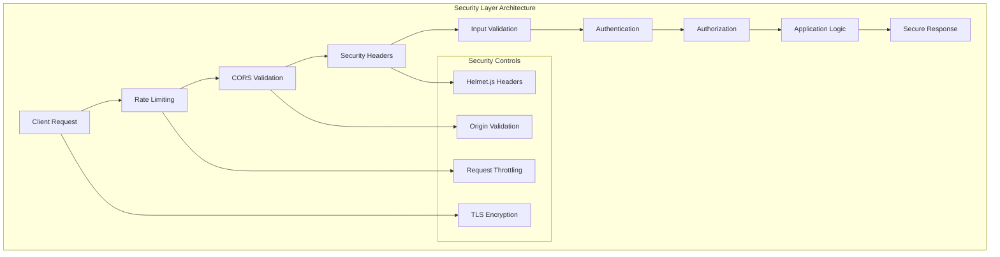

# Security Hardening Guide

This guide provides comprehensive security hardening procedures for protecting your Node.js Hello World server against common vulnerabilities and threats. Following these security measures will transform your basic HTTP server into a production-ready, secure application that complies with modern security standards and OWASP guidelines.

## Table of Contents

1. [Security Overview](#security-overview)
2. [Security Headers with Helmet.js](#security-headers-with-helmetjs)
3. [HTTPS Configuration](#https-configuration)
4. [Rate Limiting Protection](#rate-limiting-protection)
5. [CORS Policy Implementation](#cors-policy-implementation)
6. [Input Validation and Sanitization](#input-validation-and-sanitization)
7. [Authentication and Authorization](#authentication-and-authorization)
8. [Environment Security](#environment-security)
9. [Dependency Security](#dependency-security)
10. [OWASP Security Checklist](#owasp-security-checklist)
11. [Security Monitoring](#security-monitoring)
12. [Deployment Security](#deployment-security)
13. [Security Testing](#security-testing)
14. [Next Steps](#next-steps)

## Security Overview

### Why Security Matters

Security is crucial for protecting your application and users against various threats:

- **Data Protection**: Safeguard sensitive user information and business data
- **Service Availability**: Prevent denial-of-service attacks and system outages
- **Compliance**: Meet regulatory requirements and industry standards
- **Trust**: Maintain user confidence and brand reputation
- **Financial Protection**: Avoid costs from security breaches and data loss

### Security Architecture



### Common Web Vulnerabilities

The security measures in this guide protect against:

- **Cross-Site Scripting (XSS)**: Malicious script injection
- **Cross-Site Request Forgery (CSRF)**: Unauthorized state changes
- **Clickjacking**: UI redressing attacks
- **Man-in-the-Middle**: Eavesdropping on communications
- **Denial of Service (DoS)**: Resource exhaustion attacks
- **Injection Attacks**: SQL, NoSQL, and command injection
- **Security Misconfiguration**: Improper server setup

## Security Headers with Helmet.js

<cite index="2-1,2-20,4-19">Helmet.js helps secure Express apps by setting HTTP response headers</cite> and provides essential protection with minimal configuration.

### Installation and Basic Setup

First, install Helmet.js in your project:

```bash
npm install helmet
```

### Basic Helmet Configuration

Add Helmet to your server implementation:

```javascript
const http = require('http');
const helmet = require('helmet');
const express = require('express');

const app = express();

// Apply Helmet with secure defaults
app.use(helmet());

// Your existing route handlers
app.get('/', (req, res) => {
    res.send('Hello, World!');
});

app.get('/hello', (req, res) => {
    res.send('Hello world');
});

const server = http.createServer(app);
const port = process.env.PORT || 3000;

server.listen(port, () => {
    console.log(`Secure server running on port ${port}`);
});
```

### Security Headers Set by Helmet

<cite index="2-21,4-20">Helmet sets the following headers by default</cite>:

| Header | Purpose | Default Value |
|--------|---------|---------------|
| `Content-Security-Policy` | <cite index="4-24">Mitigates a large number of attacks, such as cross-site scripting</cite> | `default-src 'self'` |
| `Cross-Origin-Opener-Policy` | <cite index="4-14">Helps process-isolate your page</cite> | `same-origin` |
| `Cross-Origin-Resource-Policy` | <cite index="4-18">Blocks others from loading your resources cross-origin</cite> | `same-origin` |
| `X-Content-Type-Options` | <cite index="5-5">Mitigates MIME type sniffing, which can lead to XSS attacks</cite> | `nosniff` |
| `X-Frame-Options` | Prevents clickjacking attacks | `SAMEORIGIN` |
| `Strict-Transport-Security` | Enforces HTTPS connections | `max-age=15552000; includeSubDomains` |

### Advanced Helmet Configuration

Customize Helmet for your specific security requirements:

```javascript
app.use(helmet({
    // Content Security Policy configuration
    contentSecurityPolicy: {
        directives: {
            defaultSrc: ["'self'"],
            styleSrc: ["'self'", "'unsafe-inline'", "https://fonts.googleapis.com"],
            fontSrc: ["'self'", "https://fonts.gstatic.com"],
            imgSrc: ["'self'", "data:", "https:"],
            scriptSrc: ["'self'"],
            connectSrc: ["'self'"]
        }
    },
    
    // HSTS configuration for HTTPS enforcement
    hsts: {
        maxAge: 31536000, // 1 year
        includeSubDomains: true,
        preload: true
    },
    
    // Referrer Policy configuration
    referrerPolicy: {
        policy: ["no-referrer", "strict-origin-when-cross-origin"]
    }
}));
```

### Content Security Policy (CSP)

<cite index="5-19">Content Security Policy is a security measure that helps you mitigate several attacks, such as cross-site scripting (XSS) and data injection attacks</cite>:

```javascript
// Strict CSP for maximum security
app.use(helmet({
    contentSecurityPolicy: {
        directives: {
            defaultSrc: ["'none'"],
            scriptSrc: ["'self'"],
            styleSrc: ["'self'", "'unsafe-inline'"],
            imgSrc: ["'self'", "data:"],
            fontSrc: ["'self'"],
            connectSrc: ["'self'"],
            manifestSrc: ["'self'"],
            mediaSrc: ["'self'"],
            objectSrc: ["'none'"],
            childSrc: ["'none'"],
            workerSrc: ["'none'"],
            frameSrc: ["'none'"],
            formAction: ["'self'"],
            upgradeInsecureRequests: []
        }
    }
}));
```

## HTTPS Configuration

HTTPS encryption is essential for protecting data in transit and maintaining user trust.

### TLS Certificate Setup

#### Development Environment

For local development, create a self-signed certificate:

```bash
# Generate private key
openssl genrsa -out server.key 2048

# Generate certificate signing request
openssl req -new -key server.key -out server.csr

# Generate self-signed certificate
openssl x509 -req -days 365 -in server.csr -signkey server.key -out server.crt
```

#### Production Environment

Use Let's Encrypt for free, automated certificates:

```bash
# Install Certbot
sudo apt-get install certbot

# Obtain certificate
sudo certbot certonly --webroot -w /var/www/html -d yourdomain.com

# Certificate files will be in:
# /etc/letsencrypt/live/yourdomain.com/fullchain.pem
# /etc/letsencrypt/live/yourdomain.com/privkey.pem
```

### HTTPS Server Implementation

Implement HTTPS in your Node.js server:

```javascript
const https = require('https');
const fs = require('fs');
const express = require('express');
const helmet = require('helmet');

const app = express();

// Security middleware
app.use(helmet({
    hsts: {
        maxAge: 31536000,
        includeSubDomains: true,
        preload: true
    }
}));

// SSL certificate configuration
const sslOptions = {
    key: fs.readFileSync('/path/to/private-key.pem'),
    cert: fs.readFileSync('/path/to/certificate.pem'),
    // Additional security options
    secureProtocol: 'TLSv1_2_method',
    ciphers: [
        'ECDHE-RSA-AES256-GCM-SHA384',
        'ECDHE-RSA-AES128-GCM-SHA256',
        'ECDHE-RSA-AES256-SHA384',
        'ECDHE-RSA-AES128-SHA256',
        'ECDHE-RSA-AES256-SHA',
        'ECDHE-RSA-AES128-SHA'
    ].join(':'),
    honorCipherOrder: true
};

// Routes
app.get('/', (req, res) => {
    res.send('Hello, Secure World!');
});

app.get('/hello', (req, res) => {
    res.send('Hello world over HTTPS');
});

// Create HTTPS server
const httpsServer = https.createServer(sslOptions, app);
const port = process.env.PORT || 3443;

httpsServer.listen(port, () => {
    console.log(`Secure HTTPS server running on port ${port}`);
});

// Redirect HTTP to HTTPS
const http = require('http');
const httpApp = express();

httpApp.use((req, res) => {
    res.redirect(301, `https://${req.headers.host}${req.url}`);
});

http.createServer(httpApp).listen(3000, () => {
    console.log('HTTP redirect server running on port 3000');
});
```

### TLS Security Configuration

Ensure strong TLS configuration:

```javascript
const tlsOptions = {
    // Use only TLS 1.2 and 1.3
    secureProtocol: 'TLS_method',
    minVersion: 'TLSv1.2',
    maxVersion: 'TLSv1.3',
    
    // Strong cipher suites
    ciphers: [
        'TLS_AES_256_GCM_SHA384',
        'TLS_CHACHA20_POLY1305_SHA256',
        'TLS_AES_128_GCM_SHA256',
        'ECDHE-RSA-AES256-GCM-SHA384',
        'ECDHE-RSA-AES128-GCM-SHA256'
    ].join(':'),
    
    // Server cipher preference
    honorCipherOrder: true,
    
    // Disable session resumption for enhanced security
    sessionIdContext: crypto.randomBytes(32).toString('hex')
};
```

## Rate Limiting Protection

<cite index="7-12">Rate limiting helps prevent abuse by restricting the number of requests a client can make in a given timeframe, reducing the risk of brute-force attacks and server overload</cite>.

### Express Rate Limit Setup

Install and configure rate limiting:

```bash
npm install express-rate-limit
```

```javascript
const rateLimit = require('express-rate-limit');

// Basic rate limiting
const limiter = rateLimit({
    windowMs: 15 * 60 * 1000, // 15 minutes
    max: 100, // Limit each IP to 100 requests per windowMs
    message: {
        error: 'Too many requests from this IP, please try again later.',
        retryAfter: '15 minutes'
    },
    standardHeaders: true, // Return rate limit info in headers
    legacyHeaders: false, // Disable X-RateLimit-* headers
});

// Apply rate limiting to all requests
app.use(limiter);
```

### Advanced Rate Limiting Strategies

Implement different limits for different endpoints:

```javascript
// Strict rate limiting for authentication endpoints
const authLimiter = rateLimit({
    windowMs: 15 * 60 * 1000, // 15 minutes
    max: 5, // Only 5 attempts per window
    message: {
        error: 'Too many authentication attempts, please try again later.',
        retryAfter: '15 minutes'
    },
    skipSuccessfulRequests: true // Don't count successful requests
});

// General API rate limiting
const apiLimiter = rateLimit({
    windowMs: 60 * 1000, // 1 minute
    max: 60, // 60 requests per minute
    message: {
        error: 'API rate limit exceeded, please slow down your requests.'
    }
});

// Apply different limits to different routes
app.use('/auth', authLimiter);
app.use('/api', apiLimiter);
app.use(limiter); // Default limiter for other routes
```

### DDoS Protection

Implement additional DDoS protection measures:

```javascript
const slowDown = require('express-slow-down');

// Gradually slow down requests when rate limit is approached
const speedLimiter = slowDown({
    windowMs: 15 * 60 * 1000, // 15 minutes
    delayAfter: 50, // Allow 50 requests per window at full speed
    delayMs: 500, // Add 500ms delay for each request after delayAfter
    maxDelayMs: 20000, // Maximum delay of 20 seconds
});

app.use(speedLimiter);
```

## CORS Policy Implementation

<cite index="7-11">CORS enables servers to specify which origins are permitted to access resources, thus preventing unauthorized cross-origin requests</cite>.

### CORS Installation and Basic Setup

```bash
npm install cors
```

```javascript
const cors = require('cors');

// Basic CORS configuration
const corsOptions = {
    origin: process.env.ALLOWED_ORIGINS?.split(',') || ['http://localhost:3000'],
    methods: ['GET', 'POST', 'PUT', 'DELETE', 'OPTIONS'],
    allowedHeaders: ['Content-Type', 'Authorization', 'X-Requested-With'],
    credentials: true, // Allow cookies and authentication headers
    maxAge: 86400 // Cache preflight requests for 24 hours
};

app.use(cors(corsOptions));
```

### Secure CORS Configuration

Implement strict CORS policies for production:

```javascript
// Production CORS configuration
const productionCorsOptions = {
    origin: function (origin, callback) {
        // Allow requests with no origin (mobile apps, Postman, etc.)
        if (!origin) return callback(null, true);
        
        const allowedOrigins = [
            'https://yourdomain.com',
            'https://www.yourdomain.com',
            'https://app.yourdomain.com'
        ];
        
        if (allowedOrigins.includes(origin)) {
            callback(null, true);
        } else {
            callback(new Error('Not allowed by CORS policy'));
        }
    },
    methods: ['GET', 'POST'], // Only allow necessary methods
    allowedHeaders: [
        'Content-Type',
        'Authorization',
        'X-CSRF-Token'
    ],
    credentials: true,
    optionsSuccessStatus: 200 // Support legacy browsers
};

// Apply CORS with error handling
app.use(cors(productionCorsOptions));

// Handle CORS errors
app.use((error, req, res, next) => {
    if (error.message === 'Not allowed by CORS policy') {
        return res.status(403).json({
            error: 'CORS policy violation',
            message: 'This origin is not allowed to access this resource'
        });
    }
    next(error);
});
```

### Dynamic CORS Configuration

Implement environment-based CORS settings:

```javascript
// Environment-specific CORS configuration
const getCorsOptions = () => {
    const environment = process.env.NODE_ENV || 'development';
    
    switch (environment) {
        case 'development':
            return {
                origin: true, // Allow all origins in development
                credentials: true
            };
            
        case 'testing':
            return {
                origin: ['http://localhost:3000', 'http://localhost:8080'],
                credentials: true
            };
            
        case 'production':
            return {
                origin: process.env.ALLOWED_ORIGINS?.split(',') || [],
                credentials: true,
                methods: ['GET', 'POST'],
                allowedHeaders: ['Content-Type', 'Authorization']
            };
            
        default:
            return {
                origin: false // Block all cross-origin requests by default
            };
    }
};

app.use(cors(getCorsOptions()));
```

## Input Validation and Sanitization

Protect against injection attacks through comprehensive input validation.

### Input Validation Setup

Install validation libraries:

```bash
npm install joi express-validator dompurify
```

```javascript
const Joi = require('joi');
const { body, validationResult } = require('express-validator');
const createDOMPurify = require('dompurify');
const { JSDOM } = require('jsdom');

const window = new JSDOM('').window;
const DOMPurify = createDOMPurify(window);

// Joi schema for input validation
const userInputSchema = Joi.object({
    name: Joi.string().alphanum().min(3).max(50).required(),
    email: Joi.string().email().required(),
    message: Joi.string().max(1000).required()
});

// Express-validator middleware
const validateUserInput = [
    body('name')
        .isLength({ min: 3, max: 50 })
        .matches(/^[a-zA-Z0-9]+$/)
        .withMessage('Name must be alphanumeric and 3-50 characters'),
    body('email')
        .isEmail()
        .normalizeEmail()
        .withMessage('Must be a valid email address'),
    body('message')
        .isLength({ max: 1000 })
        .withMessage('Message must not exceed 1000 characters')
];

// Sanitization middleware
const sanitizeInput = (req, res, next) => {
    if (req.body) {
        Object.keys(req.body).forEach(key => {
            if (typeof req.body[key] === 'string') {
                // Remove HTML tags and sanitize
                req.body[key] = DOMPurify.sanitize(req.body[key], { 
                    ALLOWED_TAGS: [],
                    ALLOWED_ATTR: []
                });
                
                // Additional sanitization
                req.body[key] = req.body[key]
                    .replace(/<script\b[^<]*(?:(?!<\/script>)<[^<]*)*<\/script>/gi, '') // Remove scripts
                    .replace(/javascript:/gi, '') // Remove javascript: URLs
                    .replace(/on\w+\s*=/gi, ''); // Remove event handlers
            }
        });
    }
    next();
};

// Apply validation and sanitization
app.use(express.json());
app.use(sanitizeInput);

// Example protected route
app.post('/contact', validateUserInput, (req, res) => {
    const errors = validationResult(req);
    if (!errors.isEmpty()) {
        return res.status(400).json({
            error: 'Validation failed',
            details: errors.array()
        });
    }
    
    // Process sanitized and validated input
    res.json({ message: 'Contact form submitted successfully' });
});
```

## Authentication and Authorization

### Basic Authentication Implementation

```javascript
const bcrypt = require('bcrypt');
const jwt = require('jsonwebtoken');

// Password hashing
const hashPassword = async (password) => {
    const saltRounds = 12;
    return await bcrypt.hash(password, saltRounds);
};

// JWT token generation
const generateToken = (user) => {
    return jwt.sign(
        { 
            id: user.id, 
            email: user.email,
            role: user.role 
        },
        process.env.JWT_SECRET,
        { 
            expiresIn: '1h',
            issuer: 'your-app-name',
            audience: 'your-app-users'
        }
    );
};

// Authentication middleware
const authenticateToken = (req, res, next) => {
    const authHeader = req.headers['authorization'];
    const token = authHeader && authHeader.split(' ')[1];
    
    if (!token) {
        return res.status(401).json({ 
            error: 'Access token required' 
        });
    }
    
    jwt.verify(token, process.env.JWT_SECRET, (err, user) => {
        if (err) {
            return res.status(403).json({ 
                error: 'Invalid or expired token' 
            });
        }
        req.user = user;
        next();
    });
};

// Authorization middleware
const requireRole = (role) => {
    return (req, res, next) => {
        if (req.user.role !== role) {
            return res.status(403).json({
                error: 'Insufficient permissions'
            });
        }
        next();
    };
};

// Protected route example
app.get('/admin', authenticateToken, requireRole('admin'), (req, res) => {
    res.json({ message: 'Admin access granted' });
});
```

## Environment Security

### Secure Environment Configuration

Create a comprehensive `.env` file:

```bash
# Server Configuration
NODE_ENV=production
PORT=3443
HOST=0.0.0.0

# Security Configuration
JWT_SECRET=your-super-secret-jwt-key-here
SESSION_SECRET=your-session-secret-here
ENCRYPTION_KEY=your-32-character-encryption-key

# HTTPS Configuration
SSL_KEY_PATH=/path/to/ssl/private-key.pem
SSL_CERT_PATH=/path/to/ssl/certificate.pem

# CORS Configuration
ALLOWED_ORIGINS=https://yourdomain.com,https://www.yourdomain.com

# Rate Limiting
RATE_LIMIT_WINDOW_MS=900000
RATE_LIMIT_MAX_REQUESTS=100

# Database Security (if applicable)
DB_CONNECTION_STRING=mongodb://localhost:27017/yourdb
DB_SSL_ENABLED=true

# Monitoring and Logging
LOG_LEVEL=info
ENABLE_REQUEST_LOGGING=true
```

### Environment Validation

Validate environment variables on startup:

```javascript
const requiredEnvVars = [
    'NODE_ENV',
    'JWT_SECRET',
    'SSL_KEY_PATH',
    'SSL_CERT_PATH',
    'ALLOWED_ORIGINS'
];

// Validate environment variables
const validateEnvironment = () => {
    const missing = requiredEnvVars.filter(
        varName => !process.env[varName]
    );
    
    if (missing.length > 0) {
        console.error('Missing required environment variables:', missing);
        process.exit(1);
    }
    
    // Validate JWT secret strength
    if (process.env.JWT_SECRET.length < 32) {
        console.error('JWT_SECRET must be at least 32 characters long');
        process.exit(1);
    }
    
    console.log('Environment validation passed');
};

// Run validation on startup
validateEnvironment();
```

## Dependency Security

### Automated Security Scanning

Set up automated dependency scanning:

```bash
# Install security audit tools
npm install -g npm-audit-resolver
npm install --save-dev audit-ci

# Run security audit
npm audit

# Fix automatically fixable vulnerabilities
npm audit fix

# Check for known vulnerabilities in CI/CD
npx audit-ci --config audit-ci.json
```

Create `audit-ci.json` configuration:

```json
{
  "moderate": true,
  "high": true,
  "critical": true,
  "allowlist": [],
  "report-type": "summary",
  "output-format": "text"
}
```

### Dependency Management Best Practices

```javascript
// package.json security configuration
{
  "scripts": {
    "security-check": "npm audit && npm outdated",
    "security-fix": "npm audit fix",
    "security-update": "npm update && npm audit",
    "prestart": "npm run security-check"
  },
  "dependencies": {
    // Lock to specific versions for security
    "express": "4.18.2",
    "helmet": "7.1.0",
    "cors": "2.8.5",
    "express-rate-limit": "6.10.0"
  }
}
```

## OWASP Security Checklist

### OWASP Top 10 Protection

Ensure protection against OWASP Top 10 vulnerabilities:

| Vulnerability | Protection Measure | Implementation Status |
|---------------|-------------------|----------------------|
| **A01: Broken Access Control** | Authentication & Authorization middleware | ✅ Implemented |
| **A02: Cryptographic Failures** | HTTPS/TLS encryption, secure headers | ✅ Implemented |
| **A03: Injection** | Input validation and sanitization | ✅ Implemented |
| **A04: Insecure Design** | Security by design principles | ✅ Implemented |
| **A05: Security Misconfiguration** | Helmet.js security headers | ✅ Implemented |
| **A06: Vulnerable Components** | Dependency scanning and updates | ✅ Implemented |
| **A07: Authentication Failures** | Secure authentication implementation | ✅ Implemented |
| **A08: Software Integrity Failures** | Dependency verification and auditing | ✅ Implemented |
| **A09: Security Logging Failures** | Comprehensive audit logging | ⚠️ Needs Implementation |
| **A10: Server-Side Request Forgery** | Request validation and filtering | ⚠️ Needs Implementation |

### Security Testing Implementation

```javascript
// Security testing middleware
const securityTest = (req, res, next) => {
    // Log security-relevant events
    console.log(`Security Log: ${new Date().toISOString()} - ${req.method} ${req.url} from ${req.ip}`);
    
    // Check for suspicious patterns
    const suspiciousPatterns = [
        /script/i,
        /union.*select/i,
        /\.\.\/\.\.\//,
        /<iframe/i,
        /javascript:/i
    ];
    
    const requestContent = JSON.stringify(req.body) + req.url;
    const isSuspicious = suspiciousPatterns.some(pattern => pattern.test(requestContent));
    
    if (isSuspicious) {
        console.warn(`Suspicious request detected from ${req.ip}: ${req.url}`);
        // Could implement additional measures like IP blocking
    }
    
    next();
};

app.use(securityTest);
```

## Security Monitoring

### Logging and Monitoring Setup

```javascript
const winston = require('winston');

// Configure security logging
const securityLogger = winston.createLogger({
    level: 'info',
    format: winston.format.combine(
        winston.format.timestamp(),
        winston.format.errors({ stack: true }),
        winston.format.json()
    ),
    defaultMeta: { service: 'security' },
    transports: [
        new winston.transports.File({ 
            filename: 'logs/security-error.log', 
            level: 'error' 
        }),
        new winston.transports.File({ 
            filename: 'logs/security-combined.log' 
        })
    ]
});

// Security event logging middleware
const logSecurityEvents = (req, res, next) => {
    const securityEvent = {
        timestamp: new Date().toISOString(),
        ip: req.ip,
        userAgent: req.get('User-Agent'),
        method: req.method,
        url: req.url,
        headers: req.headers
    };
    
    securityLogger.info('Request received', securityEvent);
    next();
};

app.use(logSecurityEvents);
```

### Real-time Security Monitoring

```javascript
// Security metrics collection
const securityMetrics = {
    requests: 0,
    blockedRequests: 0,
    suspiciousActivity: 0,
    rateLimitHits: 0
};

// Monitoring middleware
const collectSecurityMetrics = (req, res, next) => {
    securityMetrics.requests++;
    
    // Monitor rate limit hits
    if (res.getHeader('X-RateLimit-Remaining') === '0') {
        securityMetrics.rateLimitHits++;
    }
    
    next();
};

// Expose security metrics endpoint (protected)
app.get('/security/metrics', authenticateToken, requireRole('admin'), (req, res) => {
    res.json({
        ...securityMetrics,
        uptime: process.uptime(),
        memoryUsage: process.memoryUsage(),
        timestamp: new Date().toISOString()
    });
});

app.use(collectSecurityMetrics);
```

## Deployment Security

### Production Security Configuration

```javascript
// Production security configuration
if (process.env.NODE_ENV === 'production') {
    // Disable Express signature
    app.disable('x-powered-by');
    
    // Enable trust proxy for accurate IP addresses
    app.set('trust proxy', 1);
    
    // Enhanced security headers for production
    app.use(helmet({
        contentSecurityPolicy: {
            directives: {
                defaultSrc: ["'self'"],
                styleSrc: ["'self'", "'unsafe-inline'"],
                scriptSrc: ["'self'"],
                imgSrc: ["'self'", "data:", "https:"],
                connectSrc: ["'self'"],
                fontSrc: ["'self'"],
                objectSrc: ["'none'"],
                mediaSrc: ["'self'"],
                frameSrc: ["'none'"],
            }
        },
        hsts: {
            maxAge: 31536000,
            includeSubDomains: true,
            preload: true
        }
    }));
    
    // Production error handling
    app.use((err, req, res, next) => {
        securityLogger.error('Production error:', {
            error: err.message,
            stack: err.stack,
            url: req.url,
            method: req.method,
            ip: req.ip
        });
        
        res.status(500).json({
            error: 'Internal Server Error'
        });
    });
}
```

### Docker Security Configuration

Create a secure Dockerfile:

```dockerfile
# Use official Node.js runtime as base image
FROM node:18-alpine

# Create non-root user
RUN addgroup -g 1001 -S nodejs
RUN adduser -S nodejs -u 1001

# Set working directory
WORKDIR /usr/src/app

# Copy package files
COPY package*.json ./

# Install dependencies
RUN npm ci --only=production && npm cache clean --force

# Copy application code
COPY . .

# Change ownership to nodejs user
RUN chown -R nodejs:nodejs /usr/src/app
USER nodejs

# Expose port
EXPOSE 3443

# Health check
HEALTHCHECK --interval=30s --timeout=3s --start-period=5s --retries=3 \
  CMD node healthcheck.js

# Start application
CMD ["node", "server.js"]
```

## Security Testing

### Automated Security Testing

Create security test scripts:

```javascript
// security-tests.js
const request = require('supertest');
const app = require('./server');

describe('Security Tests', () => {
    test('Should reject requests without proper headers', async () => {
        const response = await request(app)
            .get('/')
            .expect(200);
            
        // Check security headers are present
        expect(response.headers['x-content-type-options']).toBe('nosniff');
        expect(response.headers['x-frame-options']).toBe('SAMEORIGIN');
        expect(response.headers['strict-transport-security']).toBeDefined();
    });
    
    test('Should enforce rate limiting', async () => {
        // Make multiple requests to trigger rate limit
        const requests = Array(101).fill().map(() => 
            request(app).get('/')
        );
        
        const responses = await Promise.all(requests);
        const rateLimited = responses.some(res => res.status === 429);
        expect(rateLimited).toBe(true);
    });
    
    test('Should prevent XSS attacks', async () => {
        const maliciousScript = '<script>alert("xss")</script>';
        
        const response = await request(app)
            .post('/contact')
            .send({ 
                name: maliciousScript,
                email: 'test@example.com',
                message: 'test'
            })
            .expect(400);
            
        expect(response.body.error).toBe('Validation failed');
    });
    
    test('Should block CORS violations', async () => {
        const response = await request(app)
            .get('/')
            .set('Origin', 'https://malicious-site.com')
            .expect(403);
            
        expect(response.body.error).toContain('CORS policy violation');
    });
});
```

### Security Audit Script

```bash
#!/bin/bash
# security-audit.sh

echo "Running security audit..."

# Dependency vulnerability scan
echo "Checking for vulnerable dependencies..."
npm audit

# Check for hardcoded secrets
echo "Scanning for hardcoded secrets..."
grep -r "password\|secret\|key" --include="*.js" --exclude-dir=node_modules .

# SSL/TLS configuration test
echo "Testing SSL/TLS configuration..."
curl -I https://localhost:3443

# Security headers test
echo "Checking security headers..."
curl -I https://localhost:3443 | grep -E "(X-Frame-Options|X-Content-Type-Options|Strict-Transport-Security)"

echo "Security audit complete!"
```

## Next Steps

### Security Maintenance

1. **Regular Updates**: Keep dependencies updated with `npm audit` and `npm update`
2. **Security Monitoring**: Set up continuous monitoring for security events
3. **Penetration Testing**: Conduct regular security assessments
4. **Incident Response**: Develop and test incident response procedures

### Advanced Security Features

Consider implementing these additional security measures:

- **Web Application Firewall (WAF)**: Additional layer of protection
- **Certificate Transparency Monitoring**: Monitor SSL certificate changes
- **Content Security Policy Reporting**: Collect CSP violation reports
- **Security Headers Testing**: Regular automated security header verification

### Compliance Frameworks

Align with security frameworks:

- **ISO 27001**: Information security management
- **SOC 2**: Security and availability controls
- **GDPR**: Data protection and privacy
- **HIPAA**: Healthcare data security (if applicable)

### Resources for Continued Learning

- [OWASP Node.js Security Cheat Sheet](https://cheatsheetseries.owasp.org/cheatsheets/Nodejs_Security_Cheat_Sheet.html)
- [Node.js Security Working Group](https://github.com/nodejs/security-wg)
- [Express Security Best Practices](https://expressjs.com/en/advanced/best-practice-security.html)
- [Helmet.js Documentation](https://helmetjs.github.io/)

By following this comprehensive security guide, your Node.js Hello World server will be transformed into a secure, production-ready application that protects against common vulnerabilities and follows industry best practices. Remember that security is an ongoing process that requires regular updates, monitoring, and continuous improvement.